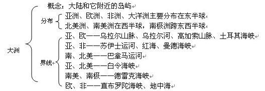
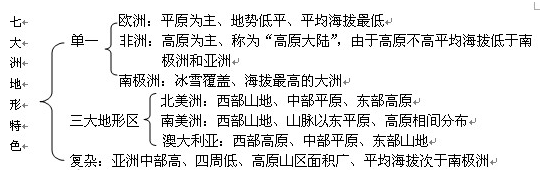
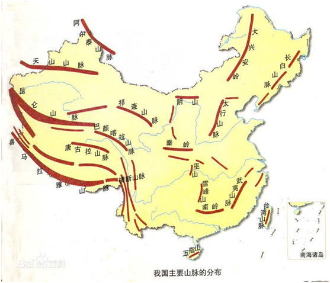
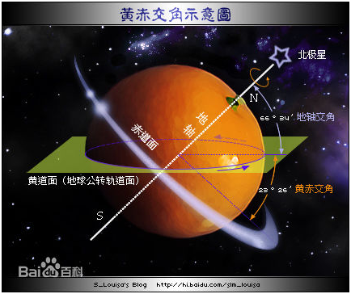
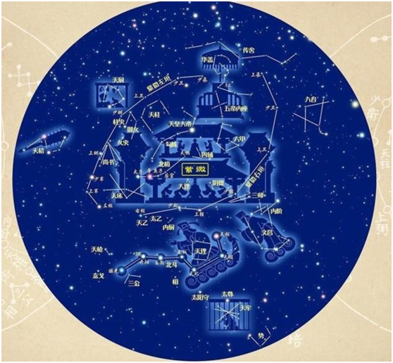

| 序号  | 修改时间      | 修改内容                     | 修改人   | 审稿人   |
| --- | --------- | ------------------------ | ----- | ----- |
| 1   | 2017-7-20 | 创建。从《世界文明史》移入世界地理。       | Keefe | Keefe |
| 2   | 2017-7-23 | 增加天文地理章节，从《世界文明史》移入历法章节。 | 同上    |       |
| 3   | 2019-8-12 | 增加星座章节。                  | 同上    |       |

<br><br><br>

---

# 目录

[TOC]

[目录... 1](#_Toc17233699)

[1    世界地理... 3](#_Toc17233700)

[1.1    世界的陆地... 3](#_Toc17233701)

[1.1.1     七大洲简述... 3](#_Toc17233702)

[1.1.2     七大洲地形... 4](#_Toc17233703)

[1.2    世界的海洋... 4](#_Toc17233704)

[1.3    世界主要地貌类型概况... 5](#_Toc17233705)

[1.3.1     世界主要山脉... 6](#_Toc17233706)

[1.3.2     世界主要河流... 6](#_Toc17233707)

[1.4    本章参考... 6](#_Toc17233708)

[2    中国地理... 7](#_Toc17233709)

[2.1    地势地形概述... 7](#_Toc17233710)

[2.2    中国主要山脉... 8](#_Toc17233711)

[2.2.1     主要山脉及最高峰列表... 10](#_Toc17233712)

[2.3    中国主要河流... 11](#_Toc17233713)

[2.3.1     主要河流列表... 12](#_Toc17233714)

[2.3.2     跨境河流... 14](#_Toc17233715)

[2.3.3     各省主要河流... 14](#_Toc17233716)

[2.4    中国的海岛和渔港... 15](#_Toc17233717)

[2.4.1     海岛... 15](#_Toc17233718)

[2.4.2     渔港... 15](#_Toc17233719)

[2.5    重要水利工程... 16](#_Toc17233720)

[2.5.1     长江三峡工程... 16](#_Toc17233721)

[2.5.2     南水北调... 16](#_Toc17233722)

[2.6    本章参考... 16](#_Toc17233723)

[3    历史地理学... 16](#_Toc17233724)

[4    军事地理学... 17](#_Toc17233725)

[5    天文地理... 17](#_Toc17233726)

[5.1    常用术语... 17](#_Toc17233727)

[5.2    星座... 18](#_Toc17233728)

[5.2.1     三恒四象二十八星宿（东方）... 19](#_Toc17233729)

[5.2.2     十二星座（西方）... 20](#_Toc17233730)

[5.2.3     国际通用星座... 20](#_Toc17233731)

[5.3    地球的气候变化... 21](#_Toc17233732)

[5.3.1     地球公转... 21](#_Toc17233733)

[5.3.2     地球自转... 22](#_Toc17233734)

[5.3.3     月球公转... 22](#_Toc17233735)

[5.3.4     历法... 22](#_Toc17233736)

[5.4    本章参考... 24](#_Toc17233737)

[6    参考资料... 24](#_Toc17233738)

**表目录**

[表格 1 16种特殊地貌列表__ 5](#_Toc17233739)

[表格 2 世界十大最长河流列表__ 6](#_Toc17233740)

[表格 3 地势阶梯分布表__ 7](#_Toc17233741)

[表格 4 中国主要山脉及其最高峰__ 10](#_Toc17233742)

[表格 5 中国外流河的印度洋北冰洋水系的河流列表__ 12](#_Toc17233743)

[表格 6 中国外流河太平洋水系的河流列表__ 12](#_Toc17233744)

[表格 7 中国内流河列表__ 13](#_Toc17233745)

[表格 8 十二星座日期__ 20](#_Toc17233746)

[表格 9常用历法__ 23](#_Toc17233747)

**图目录**

[图 1七大洲的分布和界线... 3](#_Toc17233748)

[图 2七大洲地形特色图... 4](#_Toc17233749)

[图 3 中国主要山脉分布... 8](#_Toc17233750)

[图 4 黄赤交角示意图... 18](#_Toc17233751)

[图 5 三恒四象二十八星宿... 19](#_Toc17233752)
<br><br><br>

---

# 1 世界地理

## 1.1 地理概念

### 海陆分布

世界海陆分布：陆地占29%，海洋占71%。

海洋指海和洋的组成，世界海洋划分为四大洋。

陆地可分为大陆、岛屿、群岛、半岛。陆地划分为七大洲。

- 大陆：广大的陆地有亚欧（最大）、非洲、北美、南美、南极、澳大利亚六块大陆。

- 岛屿：面积较小的陆地，世界最大岛屿是格陵兰岛。

- 群岛：世界最大群岛是马来群岛。

- 半岛：陆地伸进海洋的部分，世界最大半岛是阿拉伯半岛。

世界十大半岛按面积降序排列是阿拉伯半岛、印度半岛、中南半岛、阿拉斯加半岛、拉布拉多半岛、斯堪的纳维亚半岛、索马里半岛、楚科奇半岛、伊比利亚半岛、小亚细亚半岛。以下是简要介绍：

- ‌**阿拉伯半岛**‌：位于亚洲，是世界上最大的半岛，面积约300万平方公里，拥有丰富的石油资源，是伊斯兰教的诞生地‌。
- ‌**印度半岛**‌：位于南亚，是世界第二大半岛，面积约209万平方公里，以德干高原为主体，人口众多，拥有灿烂的文化和多样的自然景观‌。
- ‌**中南半岛**‌：位于东南亚，包括越南、老挝等国家，以其美丽的海滩、古老的寺庙和丰富的文化遗产而著名‌。
- [斯堪的纳维亚半岛](https://baike.baidu.com/item/%E6%96%AF%E5%A0%AA%E7%9A%84%E7%BA%B3%E7%BB%B4%E4%BA%9A%E5%8D%8A%E5%B2%9B/531962?fromModule=lemma_inlink)：位于欧洲西北角，其濒临波罗的海、挪威海及北欧巴伦支海，与俄罗斯和芬兰北部接壤，北至芬兰，意为“斯堪的纳维亚人居住的之地”。“斯堪的纳维亚”（Scandinavian）一词源自条顿语“skadino”，意为“黑暗”，再加上表示领土的后缀-via，全名意为“黑暗的地方”。因半岛地处高纬、冬季黑夜很长而得名。
- [小亚细亚半岛](https://baike.baidu.com/item/%E5%B0%8F%E4%BA%9A%E7%BB%86%E4%BA%9A%E5%8D%8A%E5%B2%9B/1009633?fromModule=lemma_inlink)（Asia Minor Peninsula），又称[安纳托利亚](https://baike.baidu.com/item/%E5%AE%89%E7%BA%B3%E6%89%98%E5%88%A9%E4%BA%9A/1528469?fromModule=lemma_inlink)半岛（Anatolian Peninsula），亚洲西部的半岛。公元前1200年，著名的特洛伊战争在土耳其的爱琴海沿岸发生，之后强大的波斯大流士大帝、马其顿亚历山大大帝、古罗马帝国、拜占庭帝国、奥斯曼帝国等先后统治这块神奇的大地。历经无数帝国的打造、历经东西方不同文化的剧烈撞击。
- 巴尔干半岛（Balkan）是一个历史和地理上的名词，用以描述欧洲的东南隅位于[亚得里亚海](https://baike.baidu.com/item/%E4%BA%9A%E5%BE%97%E9%87%8C%E4%BA%9A%E6%B5%B7/1003434?fromModule=lemma_inlink)和[黑海](https://baike.baidu.com/item/%E9%BB%91%E6%B5%B7/10976?fromModule=lemma_inlink)之间的陆地，详细的范围依照定义不同有许多种说法。该地约有550,000平方公里和近5500万人口。在古典希腊时代的巴尔干半岛指的是Haemus半岛。

亚洲三大半岛：印度半岛（包括印度/巴基斯坦/孟加拉）、中南半岛（包括越南/老挝/柬埔寨/泰国/马来西亚）和小亚细亚半岛（包括土耳其）。

南欧三大半岛：伊比利亚半岛（包括葡萄牙/西班牙）、亚平宁半岛（包括意大利）、巴尔干半岛（包括希腊等）。

### 地形/地貌

地貌即地球表面各种形态的总称，也叫地形。

#### 陆地地形

**五种基本地貌**：平原、高原、山地、丘陵和盆地。

表格  五种基本地形的形态特征

| 类 型 | 高 度                 | 地表起伏特征        |
| --- | ------------------- | ------------- |
| 平原  | 一般在200m以下           | 地表平坦、起伏较小     |
| 高原  | 一般海拔较高              | 绝对高度大、相对高度小地区 |
| 丘陵  | 海拔500m以下，相对高度100m以下 | 地形起伏、坡度较缓     |
| 山地  | 海拔500m以上，相对高度100m以上 | 地表起伏大         |
| 盆地  | 无一定高度               | 四周高中间低        |

注：

山地延伸概念：山脉、山系和山区。

- 有的山地呈带状分布，并且沿着一定方向延伸很长，叫山脉。喜马拉雅山脉世界最高大，安第斯山脉世界最长。

- 在成因上有联系的一系列山脉总称为山系，最突出的是阿尔卑斯—喜马拉雅山系和科迪勒拉山系。

- 人们习惯上把山地丘陵分布的地区连同比较崎岖的高原叫山区。

**陆地上常见地貌**：半岛、岛屿、河流、湖泊、山脉、山峰、沙漠等。16种特殊地貌 详见下面表格 ，

表格 16种特殊地貌列表

| 地貌                   | 形成原因                                                                                                     | 典型例子                                                                                                     |
| -------------------- | -------------------------------------------------------------------------------------------------------- | -------------------------------------------------------------------------------------------------------- |
| 喀斯特地貌 karst landform | 具有溶蚀力的水对可溶性岩石进行溶蚀等作用所形成的地表和地下形态的总称。又称岩溶地貌。喀斯特是南斯拉夫西北部伊斯特拉半岛碳酸盐岩高原的地名，当地称为Kras，意为岩石裸露的地方。近代喀斯特研究发源于该地而得名。 | 较著名的区域有中国广西、 云南和贵州等省（区），越南北部，南斯拉夫狄那里克阿尔卑斯山区，意大利和奥地利交界的阿尔卑斯山区，法国中央高原，俄罗斯乌拉尔山，澳大利亚南部，美国肯塔基和印第安纳州，古巴及牙买加等地。 |
| 丹霞地貌                 | 由巨厚的红色砂岩、砾岩组成的方山、奇峰、峭壁、岩洞和石柱等特殊地貌的总称。                                                                    | 以中国广东省韶关市仁化县境内的丹霞山为典型。                                                                                   |
| 海岸地貌 coastal         | 海岸在构造运动 、海水动力 、生物作用和气 候因素等共同作用下所形成的各种地貌的总称。                                                              |                                                                                                          |
| 海底地貌                 | 海水覆盖下的固体地球表面形态的总称 。                                                                                      |                                                                                                          |
| 风积地貌                 | 风力堆积作用形成的地表形态。                                                                                           |                                                                                                          |
| 风蚀地貌                 | 风力吹蚀、磨蚀地表物质所形成的地表形态。                                                                                     |                                                                                                          |
| 河流地貌                 | 河流作用于地球表面，经侵蚀、搬运和堆积过程所形成的各种侵蚀、堆积地貌的总称。                                                                   |                                                                                                          |
| 冰川地貌                 | 由冰川的侵蚀和堆积作用形成的地表形态。                                                                                      |                                                                                                          |
| 冰缘地貌                 | 由寒冻风化和冻融作用形成的地表形态。                                                                                       |                                                                                                          |
| 湖泊地貌                 | 由湖水作用（包括湖浪侵蚀、搬运和堆积作用）而形成的各种地表形态。                                                                         |                                                                                                          |
| 构造地貌                 | 由地质构造作用形成的地貌。                                                                                            |                                                                                                          |
| 热融地貌                 | 地下冰受热融作用形成的地形。又称热喀斯特地貌。                                                                                  |                                                                                                          |
| 人为地貌                 | 人的作用在地球表面塑造的地貌体的总称。又称人工地貌。                                                                               |                                                                                                          |
| 重力地貌                 | 坡地上的岩体或土体在自身重力的作用下，发生位移所形成的地表形态。                                                                         |                                                                                                          |
| 黄土地貌                 | 发育在黄土地层中的地形。                                                                                             |                                                                                                          |
| 雅丹地貌                 | 一列列断断续续延伸的长条形土墩与凹地沟槽间隔分布的地貌组合。                                                                           | 雅丹是中国维吾尔语，意为陡峭的土丘，因中国新疆孔雀河下游雅丹地区发育最为典型而命名。                                                               |

#### 海底地形

大陆架：靠近大陆的浅海地区，大陆向海洋的自然延伸，深度一般不超过200m。

大陆坡：大陆架外缘巨大的陡坡。

洋底地形：大陆坡外，有洋盆、海沟和海岭等地形。

## 1.2  世界的陆地

### 洲分界

（1）七大洲分界。陆地划分为七大洲。

大洲：分布和界线如下图所示，

​                

图 1七大洲的分布和界线

**各大洲的分界线（详解）**

* 乌拉尔山、乌拉尔河、大高加索山脉和土耳其海峡——亚洲和欧洲的分界线
  
  ```
  亚洲大陆和欧洲大陆紧密相连，成为地球上一块最大的陆地，叫亚欧大陆。
  人们习惯上把乌拉尔山、乌拉尔河和大高加索山脉一线作为欧、亚两洲大陆的分界线。乌拉尔河流域大部分在哈萨克斯坦境内，注入里海。
  土耳其海峡沟通了黑海和地中海，把土耳其一分二为，土耳其大部在亚洲，小部在欧洲，其中首都伊斯坦堡在欧洲。
  ```

* 苏伊士运河——亚洲和非洲的分界线
  
  ```
  苏伊士运河沟通了地中海和红海，连接大西洋和印度洋，使得亚洲通往欧洲各国的航线比绕道好望角缩短8000千米～10000千米。
  ```

* 巴拿马运河——北美洲和南美洲的分界线
  
  ```
  巴拿马运河是人们在中美地峡最窄处开凿的一条运河，它的开通，大大缩短了大西洋和太平洋之间的航程，使巴拿马运河成为世界重要的海洋航运的枢纽。根据自然地理、人文地理等方面的相似性，美洲也可分为北美洲和拉丁美洲。它们两者之间的分界线是美国和墨西哥的国界线，即美国以北的美洲（含美国）称为北美洲，美国以南的美洲称为拉丁美洲。
  ```

* 白令海峡——北美洲和亚洲的分界线。白令海峡是沟通太平洋和北冰洋的狭窄水道。

* 德雷克海峡——南美洲和南极洲的分界线。德雷克海峡是沟通太平洋和大西洋的狭窄水道。

* 丹麦海峡——欧洲和北美洲的分界线。丹麦海峡位于冰岛与格陵兰岛之间，沟通了北冰洋和大西洋。

* 直布罗陀海峡——欧洲和非洲的分界线

```
直布罗陀海峡是地中海沿岸各国通往大西洋的必经之地，具有重要的战略地位。
这里的表层海水，从大西洋经直布罗陀海峡流入地中海，地中海海水下沉，再沿海峡底部流向大西洋。
```

### 洲地形

地形特点：一般从海拔、起势起伏、地形的种类和分布等方面说明。七大洲地形如下图所示：

 

图 2 七大洲地形特色图

注：南美洲有世界最长山脉-安弟斯山脉，最大高原-巴西高原，最大平原-亚马逊平原，流量第一河流-亚马逊河。亚洲有世界最高山脉-喜马拉雅山脉，最高高原-青藏高原。

洲命名

### 洲命名由来

表格 七大洲命名由来

| 地名             | 含义            | 曾用名          | 由来                                                                                                                                                                                                                     |
| -------------- | ------------- | ------------ | ---------------------------------------------------------------------------------------------------------------------------------------------------------------------------------------------------------------------- |
| 亚洲 Asia 亚细亚    | 日出地           | Asu 阿苏       | 古代黎巴嫩的腓尼基人把爱琴海以东的地区泛称为“Asu”，意即“日出地”。后来传到希腊，演化成Ασ?α（Asia）。本意特指小亚的最西部，也就是今天土耳其亚洲部分的最西部，范围相当有限。在罗马帝国时期，这个名字演变成一个行省，范围逐渐扩大，进而指整个大洲了。                                                                                       |
| 欧洲 Europe 欧罗巴  | 日没地           | Ereb         | 同亚洲。古代腓尼基人把爱琴海以西的地方则泛称为 Ereb ，意为“日没地”。在希腊语中称为 Ευρ?πη（Europe）。欧罗巴本来特指希腊半岛。后来范围渐渐扩大到全洲。                                                                                                                                  |
| 非洲 Africa 阿非利加 | 罗马征服者西皮翁的别名   | African 阿非利干 | 入侵迦太基地区(今突尼斯)的罗马征服者西皮翁的别名叫“African”，为了纪念这位征服者，罗马统治者就把这片地区叫做“Africa”。以后，罗马人又不断扩张，建立了新Africa省。那时，这个名称只限于非洲大陆的北部地区。到了公元2世纪，罗马帝国在非洲的疆域扩大到从直布罗陀海峡到埃及的整个东北部的广大地区，人们把居住在这里的罗马人或是本地人统统叫African，意即阿非利加人。这片地方也被叫做阿非利加，以后又泛指非洲大陆。 |
| 美洲 America     |               | 美丽国          | 来源于美国国名。美国本来就是这个大洲的第一个国家。这个国家最初想法，就是把整个大洲联合起来，组成一个国家。                                                                                                                                                                  |
| 大洋洲Oceania     | 不属于任何大洲的太平洋岛屿 |              | 大洋洲本来指“不属于任何大洲的太平洋岛屿”。分为美拉尼西亚，波利尼西亚，密克罗尼西亚三部分。广义上大洋洲还包括了澳大利亚，新西兰与新几内亚。                                                                                                                                                 |
| 南极洲            |               |              | 世界的南极。                                                                                                                                                                                                                 |

撒哈拉以南非洲：又称亚撒哈拉（Sub-Saharan ）地区，泛指撒哈拉大沙漠中部以南的非洲。这里是黑色人种的故乡，黑色人种占总人口绝大部分。其历史文化发展同沙漠以北的阿拉伯人和柏柏尔人不同。

- 西撒哈拉：Spanish Sahara。Sahara，荒废的土地，以此为这片世界上最大的沙漠命名。“西撒哈拉”有两种理解。一种是“西班牙属地的撒哈拉”；另一种是“撒哈拉的西部”。

拉丁美洲：是指美国以南的美洲地区，也就是地处北纬32°42′和南纬56°54′之间的大陆，包括中美洲、西印度群岛和南美洲。由于这块区域大航海时代由葡萄牙和西班牙发现并殖民的，而葡萄牙语和西班牙语都属于拉丁语系，所以称为拉丁美洲。拉丁语原本是意大利中部拉提姆地区（Latium，意大利语为Lazio）的方言，后来则因为发源于此地的罗马帝国势力扩张而将拉丁语广泛流传于帝国境内，并定拉丁文为官方语言。拉丁美洲=墨西哥+中美洲+西印度群岛+南美洲。

**中东**：中东地区大部分位于西亚，‌但还包括非洲东北部的埃及以及跨洲国家土耳其的一部分。‌具体来说，‌西亚国家如伊朗、‌伊拉克、‌沙特阿拉伯等通常也被视为中东国家，‌但中东的概念更为广泛，‌还包括了埃及、阿尔及利亚、‌利比亚、‌摩洛哥、‌突尼斯等非洲国家，‌以及阿富汗（‌尽管有时不被包括在内）‌和土耳其的欧洲部分。‌

## 1.3  世界的海洋

### 四大洋

洋指地球表面上特别广大的水域，全球有四大洋。四大洋如下，

* 太平洋：面积最大（将近一半）、水温最高、水体最深、岛屿最多。

* 大西洋：呈“S”形。

* 印度洋：热带海洋面积大。

* 北冰洋：最小、纬度最高、水温最低。

表格 四大洋地名由来

| 名称  | <br>含义   | 由来                                                                                                                                                                                            |
| --- | -------- | --------------------------------------------------------------------------------------------------------------------------------------------------------------------------------------------- |
| 太平洋 | 和平之洋     | 公元1513年9月26日，西班牙探险家巴斯科·巴尔沃亚从巴拿马海岸见到此洋，命名为“南海”。1520年，葡萄牙航海家麦哲伦受西班牙国王委托，率领船队寻找通过东方的航线。经过四个多月的艰难航程，越过狂风恶浪的大西洋，穿过麦哲伦海峡，他们进入了新的大洋。时值当时天气晴朗，风平浪静，与前段航行截然不同，因此麦哲伦便把这个叫做“南海”的大洋改称为“和平之洋”，汉译为“太平洋”。    |
| 大西洋 | 大力士神的栖息地 | 大西洋源于古希腊神话中大力士神阿特拉斯的名字。<br/>普罗米修斯因盗取天火给人间而犯了天条，株连到他的兄弟阿特拉斯。众神之王宙斯强令阿特拉斯支撑石柱使天地分开，于是阿特拉斯在人们心目中成了英雄。最初希腊人以阿特拉斯命名非洲西北部的土地，后因传说阿特拉斯住在遥远的地方，人们认为一望无际的大西洋就是阿特拉斯的栖身地，故有此称。                           |
| 印度洋 | 通往东方的海洋  | 印度洋的名称最早见于1515年中欧地图学家舍尔编绘的地图上，标注为“东方的印度洋”，此外“东方的”一词是和大西洋相对而言。奥尔大利乌斯编绘的世界地图集里正式称之为“印度洋”。因为古代西方对东方的了解很少，只传闻印度是东方的一个富有的国家，因此到东方就是到印度，通往东方的航路也就是通往印度的航路。1497年，葡萄牙航海家达·伽马东航寻找印度，便将沿途所经过的洋面统称之为印度洋。 |
| 北冰洋 | 北极之海     | 北冰洋大致以北极为中心，介于亚洲、欧洲和北美洲的北岸之间，面积1310万平方千米，为世界四大洋中面积最小、深度最浅的洋。由于终年气候严寒，绝大部分被冰层覆盖，因此一度曾经被称为“北极海”、“北冰海”，现在称之为“北冰洋”。                                                                               |

注：

### 海

海的类型可分为海、陆间海、内海、边缘海、海峡等。

- 海：一般面积较小，靠近大陆由半岛和岛屿同大洋大致隔开。全球最大的海是珊瑚海。
- 海峡：沟通两个海洋之间的狭窄水道。
- 陆间海：如地中海。
- 内海：如渤海。
- 边缘海：如东海、南海。  
- 海湾：附近两个对应海角的连线作为海湾最外部的分界线。与海湾相对的是三面环海的半岛。海湾所占的面积一般比峡湾大。世界上面积超过100万平方千米的大海湾共有5个，即位于印度洋东北部的孟加拉湾，位于大西洋西部美国南部的墨西哥湾，位于非洲中部西岸的[几内亚湾](https://baike.baidu.com/item/几内亚湾/318028?fromModule=lemma_inlink)，位于太平洋北部的[阿拉斯加湾](https://baike.baidu.com/item/阿拉斯加湾/937162?fromModule=lemma_inlink)，位于加拿大东北部的[哈德逊湾](https://baike.baidu.com/item/哈德逊湾?fromModule=lemma_inlink)。

全球有64个海，分别是在靠近陆地海岸或者其他因素来命名的，比如中国南海，又叫南中国海，日本海岸附近，就叫日本海。

表格 世界主要海简介

| 海名    | 地理位置           | 海域面积(万平方公里) | 简介                                                                                                                                                                                        |
| ----- | -------------- | ----------- | ----------------------------------------------------------------------------------------------------------------------------------------------------------------------------------------- |
| 珊瑚海   | 太平洋南部，澳大利亚海岸附近 | 479.1       | 面积约479.1万平方公里，南北长约2,250公里，东西宽约2,414公里。                                                                                                                                                    |
| 阿拉伯海  | 阿拉伯海岸附近        | 386         | 面积第二大的海，面积386万平方公里，最深处为5203米。连接印度洋。                                                                                                                                                       |
| 南海    | 中国南面           | 356         | 面积第三大的海，南海面积356万平方公里，平均深度是1212米，最深处有5567米。<br>南海有四个群岛，它们是东沙群岛、西沙群岛、中沙群岛，南沙群岛。南海属于中国，就是九段线之内的有210万平方公里左右。                                                                                  |
| 加勒比海  | 北美洲旁边，墨西哥湾一线   | 275.4       | 面积为275.4万平方公里，平均水深2491米。最低点是古巴和牙买加之间的开曼海沟，深达7680米，是世界上深度最大的陆间海。加勒比海的名称来自小安的列斯群岛上的土著居民加勒比人。                                                                                                |
| 地中海   | 欧洲、亚洲和非洲大陆之间   | 251.2       | 东西长4000千米，南北最宽处大约1800千米。                                                                                                                                                                  |
| 白令海   | 太平洋最北端         | 230         | 北以白令海峡与北冰洋相通，南隔阿留申群岛与太平洋相联。位于太平洋最北端的水域。白令海的命名，是因1728年丹麦船长白令（Vitus Bering）航行到此海域，因而以他的姓氏命名。                                                                                                |
| 红海    | 非洲东北部与阿拉伯半岛之间  | 43.8        | 平均水深490米。其西北面通过苏伊士运河与地中海相连，南面通过曼德海峡与亚丁湾相连。是盐度最高的海，是世界重要的石油运输通道。<br/>海水一般呈蓝绿色；但当一种叫束毛藻的海藻大量繁殖并开花时，海水则变成鲜艳的红褐色，非常独特，人们因此称其为“红海”。                                                            |
| 黑海    | 欧亚之间的内陆海       | 42.4        | 黑海通过土耳其海峡与地中海相连接。流入黑海的重要河流有多瑙河和第聂伯河。<br/>名字源自古希腊的航海家，他们认为黑海海水的颜色比较地中海的海水深黑而得名。                                                                                                            |
| 波罗的海  | 北欧             | 42万         | 世界上盐度最低的海，长1600多公里，平均宽度190公里，总贮水量达2.3万立方千米，是地球上最大的半咸水水域，水深一般为70-100米，平均深度为55米，最深处哥特兰沟深459米。<br>波罗的海，得名于从波兰什切青到的雷维尔的波罗的山脉，波罗的海被西欧各国（如英国，丹麦，德国，荷兰等）称之为东海，而被东欧的爱沙尼亚称为“Lä auml nemeri”，即西海之意。 |
| 马尔马拉海 | 土耳其内海          | 1.1         | 世界上最小的海，是土耳其的内海，，经博斯普鲁斯海峡和黑海连通，经达达尼尔海峡与爱琴海连通。                                                                                                                                             |

注：

## 1.3  世界主要地貌类型概况

### 世界主要山脉

所谓山系，是指有成因联系并按一定延伸方向，规模巨大的一组山脉的综合体 。 世界七大山系是指天山山脉、昆仑山脉、喜马拉雅山脉、安第斯山脉 、落基山脉、 阿尔卑斯山脉、乞力马扎罗山脉。

| 山系      | 走向  | 所属国家地区                   | 简介                                                                                                                                                              |
| ------- | --- | ------------------------ | --------------------------------------------------------------------------------------------------------------------------------------------------------------- |
| 天山山脉    | 东西  | 中国、哈萨克斯坦、吉尔吉斯斯坦和乌兹别克斯坦四国 | 全长2500公里，南北平均宽250-350公里，最宽处达800公里以上。<br>天山是世界上最大的独立纬向山系。天山同时也是世界上距离海洋最远的山系和全球干旱地区最大的山系。                                                                         |
| 昆仑山脉    | 东西  | 中国、哈萨克斯坦、吉尔吉斯斯坦和乌兹别克斯坦四国 | 昆仑山脉西起帕米尔高原东部，横贯新疆和西藏之间，伸延至青海境内，全长约2500公里，平均海拔5500-6000米，宽130-200公里，西窄东宽，总面积达50多万平方公里。<br>昆仑山在中华民族的文化史上具有“万山之祖”的显赫地位，古人称昆仑山为中华“龙脉之祖”。                           |
| 喜马拉雅山   | 弧形  | 中国、印度、尼泊尔、不丹、巴基斯坦        | 弧形走向先东西后南北。东亚大陆与南亚次大陆的天然界山，也是中国与印度、尼泊尔、不丹、巴基斯坦等国的天然国界，西起克什米尔的南迦－帕尔巴特峰，东至雅鲁藏布江大拐弯处的南迦巴瓦峰，全长2450公里，宽200—350公里。是世界上海拔最高的山脉。                                        |
| 落基山脉    | 南北  | 北美：美国、加拿大                | 美洲科迪勒拉山系在北美的主干，科迪勒拉山系纵贯南北美洲大陆西部。北起阿拉斯加，南到火地岛，绵延约15000公里。是世界上最长的褶皱山系。其北部主干就是落基山脉，由许多小山脉组成，南北纵贯4800多公里，广袤而缺乏植被。<br>落基山主要的山脉从加拿大不列颠哥伦比亚省加到美国西南部的新墨西哥州，被称为北美洲的“脊骨”。 |
| 安第斯山脉   | 南北  | 南美：巴西、阿根廷                | 美洲科迪勒拉山系在南美的主干，从北到南全长8900余公里，是世界上最长的山脉，纵贯南美大陆西部，素有"南美洲脊梁"之称。<br/>安第斯山脉有许多海拔6000米以上、山顶终年积雪的高峰，且地区矿产资源十分丰富。                                                       |
| 阿尔卑斯山脉  | 弧形  | 欧洲                       | 阿尔卑斯山脉呈弧形，长1200公里，宽130—260公里，平均海拔约3000米，总面积大约为22万平方公里。<br/>阿尔卑斯山也是欧洲巨大的分水岭，欧洲许多大河如多瑙河、莱茵河、波河、罗讷河等均发源于此。各河上游都具有典型山地河流特点，水流湍急，水力资源丰富。                             |
| 乞力马扎罗山脉 |     | 非洲                       | 非洲最高的山脉，素有"非洲屋脊"之称，是坦桑尼亚和肯尼亚的分水岭。该山的主体以典型火山曲线向下面的平原倾斜，平原的高度约海拔900米，山顶终年满布冰雪，但冰川消融现象非常严重。<br/>乞力马扎罗山四周都是山林，生活着众多哺乳动物，其中一些是濒危物种。                                  |

注：

八千米级高峰是指地球上14座高度超过海拔8000米（26,427英尺）的山峰，它们全部坐落于亚洲中南部的喜马拉雅山脉和喀喇昆仑山脉。

更准确的描述是，14座高度超过海拔8000米的山峰群，实际上地球上高度超过海拔8000米的山峰不止14座，几乎大多数主峰周围都存在多座海拔超过8000米的卫峰。

以下列出由权威杂志社编辑确认的十四座高度超过海拔8000米的山峰群高峰名录：

| 排名  | 山峰名称               | English Name                            | 所属山脉   | 所属国家、地区              | 高程      |
| --- | ------------------ | --------------------------------------- | ------ | -------------------- | ------- |
| 1   | 珠穆朗玛峰（萨加玛塔峰、埃弗勒斯峰） | Qomolangma.Pk (Sagamatha.Pk、Everest.Pk) | 喜马拉雅山脉 | 中国西藏、尼泊尔             | 8848.86 |
|     | 珠穆朗玛南卫峰            |                                         | 喜马拉雅山脉 | 尼泊尔                  | 8760    |
| 2   | 乔戈里峰（K2）           | Qogir Feng                              | 喀喇昆仑山脉 | 中国新疆、克什米尔(巴基斯坦实际控制区) | 8611    |
| 3   | 干城章嘉峰              | Kangchenjunga.Mt                        | 喜马拉雅山脉 | 锡金邦(印度)、尼泊尔          | 8586    |
| 4   | 洛子峰                | Lhoze Feng                              | 喜马拉雅山脉 | 中国西藏、尼泊尔             | 8516    |
|     | 雅兰康（干城章嘉西卫峰）       |                                         | 喜马拉雅山脉 | 尼泊尔                  | 8505    |
|     | 干城章嘉中央峰            |                                         | 喜马拉雅山脉 | 锡金邦(印度)、尼泊尔          | 8496    |
|     | 干城章嘉南卫峰            |                                         | 喜马拉雅山脉 | 锡金邦(印度)、尼泊尔          | 8476    |
| 5   | 马卡鲁峰               | Makaru Feng                             | 喜马拉雅山脉 | 中国西藏、尼泊尔             | 8463    |
|     | 洛子南卫峰              |                                         | 喜马拉雅山脉 | 尼泊尔                  | 8426    |
|     | 洛子夏尔峰（洛子东卫峰）       |                                         | 喜马拉雅山脉 | 中国西藏                 | 8398    |
|     | 珠穆朗玛东北卫峰           |                                         | 喜马拉雅山脉 | 中国西藏                 | 8393    |
|     | 乔戈里西卫峰             |                                         | 喀喇昆仑山脉 | 克什米尔(巴基斯坦实际控制区)      | 8230    |
| 6   | 卓奥友峰（乔乌雅峰）         | Cho Oyu(Qowowuyag)                      | 喜马拉雅山脉 | 中国西藏、尼泊尔             | 8201    |
| 7   | 道拉吉里峰              | Dhaulagiri                              | 喜马拉雅山脉 | 尼泊尔                  | 8167    |
| 8   | 马纳斯卢峰              | Manaslu Kutang                          | 喜马拉雅山脉 | 尼泊尔                  | 8163    |
|     | 乔戈里南卫峰             |                                         | 喀喇昆仑山脉 | 克什米尔(巴基斯坦实际控制区)      | 8132    |
| 9   | 南迦帕尔巴特峰            | Nanga Parbat                            | 喜马拉雅山脉 | 克什米尔(巴基斯坦实际控制区)      | 8125    |
| 10  | 安纳布尔纳峰             | Annapurna                               | 喜马拉雅山脉 | 尼泊尔                  | 8091    |
| 11  | 加舒尔布鲁木I峰（K5）       | Gasherbrum ⅠFeng                        | 喀喇昆仑山脉 | 中国新疆、克什米尔(巴基斯坦实际控制区) | 8080    |
|     | 南迦·帕尔巴特北肩峰         |                                         | 喜马拉雅山脉 | 克什米尔(巴基斯坦实际控制区)      | 8070    |
|     | 安纳布尔纳中央峰           |                                         | 喜马拉雅山脉 | 尼泊尔                  | 8051    |
| 12  | 布洛阿特峰（K3）          | Broad Feng                              | 喀喇昆仑山脉 | 中国新疆、克什米尔(巴基斯坦实际控制区) | 8051    |
|     | 布洛阿特西卫峰            |                                         | 喀喇昆仑山脉 | 克什米尔(巴基斯坦实际控制区)      | 8030    |
| 13  | 加舒尔布鲁木II峰（K4）      | Gasherbrum Ⅱ Feng                       | 喀喇昆仑山脉 | 中国新疆、克什米尔(巴基斯坦实际控制区) | 8028    |
| 14  | 希夏邦马峰              | Shixapangma Feng                        | 喜马拉雅山脉 | 中国西藏                 | 8027    |
|     | 布洛阿特中央峰            |                                         | 喀喇昆仑山脉 | 中国新疆、克什米尔(巴基斯坦实际控制区) | 8016    |
|     | 安纳布尔纳东卫峰           |                                         | 喜马拉雅山脉 | 尼泊尔                  | 8010    |
|     | 马卡鲁东南卫峰            |                                         | 喜马拉雅山脉 | 中国西藏、尼泊尔             | 8010    |
| *   | 希夏邦马2峰（第2峰尖）       |                                         | 喜马拉雅山脉 | 中国西藏                 | 8008    |

注：* 尚未确认，在此仅列出，仅供参考。

### 世界主要河流

表格 2 世界十大最长河流列表

| 排名  | 河流名称（NAME）                                                                   | 长度  (公里) | 流域面积（万平方公里） | 流经地区             | 流域  国数 |
| --- | ---------------------------------------------------------------------------- | -------- | ----------- | ---------------- | ------ |
| 1   | [尼罗河](https://baike.baidu.com/item/尼罗河/611)（Nile）                            | 6670     | 334.9       | 非洲东部：埃及、苏丹等      | 6      |
| 2   | [亚马孙河](https://baike.baidu.com/item/亚马孙河)（Amazon）                            | 6400     | 691.5       | 南美：巴西、秘鲁、哥伦比亚... | 3      |
| 3   | [长江](https://baike.baidu.com/item/长江/388)（Chang Jiang）                       | 6300     | 180.8       | 中国               | 1      |
| 4   | [密西西比河](https://baike.baidu.com/item/密西西比河)（Mississippi）                     | 6020     | 322.2       | 美国               | 1      |
| 5   | [黄河](https://baike.baidu.com/item/黄河/5394)（Huang He）                         | 5464     | 74.54       | 中国               | 1      |
| 6   | [鄂毕](https://baike.baidu.com/item/鄂毕)[河](https://baike.baidu.com/item/河)（Ob） | 5410     | 299.9       | 西伯利亚             | 1      |
| 7   | [叶尼塞河](https://baike.baidu.com/item/叶尼塞河)（Yenisey）                           | 5539     | 260.5       | 西伯利亚             | 1      |
| 8   | 湄公河（Mekong）                                                                  | 4900     | 42          | 中国、中南半岛          | 6      |
| 9   | 巴拉那-拉普拉塔河（Parana-La Plata）                                                   | 4700     | 400         | 南美               | 5      |
| 10  | [刚果河](https://baike.baidu.com/item/刚果河) （Congo）                              | 4640     | 370         | 非洲中部：刚果等         | 4      |
|     | [勒拿河](https://baike.baidu.com/item/勒拿河)（Lena）                                | 4400     | 249         | 西伯利亚             | 1      |
|     | 伏尔加河                                                                         | 3692     | 138         | 俄罗斯欧洲部           | 1      |
|     | 多瑙河                                                                          | 2850     | 81.7        | 西欧、南欧            | 9      |
|     | 恒河                                                                           | 2525     | 108         | 南亚               | 4      |
|     | 莱茵河                                                                          | 1320     | 17.3        | 西欧               | 9      |

备注：1. 尼罗河是世界最长流量，亚马逊河为世界流量第一的河流。

2. 非洲三大河流水系分别是尼罗河、刚果河和尼日尔河。

3. 欧洲三大河流是‌伏尔加河、多瑙河和莱茵河。多瑙河和莱茵河的源头都在瑞士的阿尔卑斯山脉。
   
   - 伏尔加河：伏尔加河全长约3692公里，‌流域面积约138万平方千米‌。‌它是欧洲最长的河流，‌也是世界最长的内流河，‌位于俄罗斯的西南部，‌发源于莫斯科西北面的瓦尔代丘陵，‌受周围地势的影响，‌自北向南流入里海。‌伏尔加河在俄罗斯的国民经济和人民生活中起着非常重要的作用，‌因而被俄罗斯人称为“母亲河”。‌其河源处海拔仅有228米，‌而河口处低于海平面28米，‌干流总落差256米，‌河流流速缓慢，‌河道弯曲。‌
   
   - 多瑙河：‌全长约2,850公里，‌流域面积约为817,000平方公里。‌它是欧洲第二长河，‌仅次于伏尔加河，‌流经9个国家，‌是世界上干流流经国家最多的河流。它发源于德国西南部，‌自西向东流，‌流经奥地利、‌斯洛伐克、‌匈牙利、‌克罗地亚、‌塞尔维亚、‌保加利亚、‌罗马尼亚、‌摩尔多瓦、‌乌克兰，‌最终在罗马尼亚东部的苏利纳注入黑海。此外，‌多瑙河的支流还延伸至瑞士、‌波兰、‌意大利、‌波斯尼亚—黑塞哥维那、‌捷克以及斯洛文尼亚等6国。
   
   - 莱茵河：流域面积17.3万平方公里，流经欧洲9个国家。莱茵河流经列支敦士登、奥地利、法国、德国、荷兰等地，在荷兰鹿特丹附近注入北海。莱茵河沿岸港口城市密布，主要有巴塞尔，斯特拉斯堡，路德维希，[科隆](https://baike.baidu.com/item/%E7%A7%91%E9%9A%86/70338?fromModule=lemma_inlink)，[杜伊斯堡](https://baike.baidu.com/item/%E6%9D%9C%E4%BC%8A%E6%96%AF%E5%A0%A1/0?fromModule=lemma_inlink)等。

4. 亚洲主要河流的源头多在青藏高原，如中国的黄河、长江；流经南亚的印度河、恒河；流经东南亚的湄公河、元江-红河、澜沧江等等。

5. 东南亚中南半岛主要河流有澜沧江（‌湄公河）、元江-红河、怒江（‌萨尔温江）、湄南河。
   
   - 湄公河：Mekong River，亚洲第七大河流，起源于藏北高原的青藏高原南部，流经中国、缅甸、老挝、泰国、柬埔寨和越南共6国，全长约4900公里。湄公河的流域面积较广，约42万平方公里，被称为“亚洲之王”。
   
   - 湄南河：Chao Phraya River，昭披耶河。泰语「Menam」意思是河，而Menam在泰文的发音近似「湄南」，因此许多人便把昭披耶河叫做湄南河。全长约370公里，仅流经<u>泰国</u>境内。起源于泰国的北部山脉，从北到南穿过泰国中部平原，流经曼谷市，最终在泰国湾流入南中国海。

### 世界主要湖泊

表格 世界主要湖泊（按面积降序）

| 名称    | 面积（万平方公里） | 最深处(米) | 主要分布地区                  | 备注                                                                                         |
| ----- | --------- | ------ | ----------------------- | ------------------------------------------------------------------------------------------ |
| 里海    | 37.1      | 1025   | 俄罗斯，哈萨克斯坦，土库曼斯坦，伊朗，阿塞拜疆 | 世界最大湖                                                                                      |
| 苏必利尔湖 | 8.24      | 406    | 加拿大，美国                  | 世界最大淡水湖                                                                                    |
| 维多利亚湖 | 6.94      | 80     | 乌干达，坦桑尼亚，肯尼亚            | 非洲最大湖                                                                                      |
| 咸海    | 5.11      | 55     | 哈萨克斯坦，乌兹别克斯坦            | 亚洲最大湖                                                                                      |
| 休伦湖   | 5.96      | 229    | 加拿大，美国                  |                                                                                            |
| 密歇根湖  | 5.8       | 282    | 美国                      |                                                                                            |
| 坦噶尼喀湖 | 3.29      | 1470   | 坦桑尼亚，刚果民主共和国，布隆迪，赞比亚    |                                                                                            |
| 贝加尔湖  | 3.15      | 1680   | 俄罗斯                     | 世界最深淡水湖，淡水蓄水量最多的湖泊                                                                         |
| 大熊湖   | 3.18      | 413    | 加拿大                     |                                                                                            |
| 马拉维湖  | 3.08      | 706    | 马拉维，莫桑比克，坦桑尼亚           |                                                                                            |
| 大奴湖   | 2.857     | 614    | 加拿大                     |                                                                                            |
| 伊利湖   | 2.57      | 64     | 加拿大，美国                  |                                                                                            |
| 温尼伯湖  | 2.44      | 28     | 加拿大                     |                                                                                            |
| 乍得湖   | 2.2       | 12     | 乍得，尼日利亚，尼日尔，喀麦隆         |                                                                                            |
| 安大略湖  | 1.95      | 236    | 加拿大，美国                  |                                                                                            |
| 巴尔喀什湖 | 1.83      | 25.6   | 哈萨克斯坦                   | 半咸半淡的湖泊                                                                                    |
| 马拉开波湖 | 1.43      | 34     | 委内瑞拉                    | 南美洲面积最大的湖泊南美最大的                                                                            |
| 的的喀喀湖 | 0.83      | 280    | 玻利维亚，秘鲁                 | 南美洲地势最高、面积最大的[淡水湖](https://baike.baidu.com/item/淡水湖?fromModule=lemma_inlink)，也是世界最高的大淡水湖之一 |
| 尼加拉瓜湖 | 0.8264    | 60     | 尼加拉瓜                    | 中美洲最大湖泊                                                                                    |
| 死海    | 0.15      | 415    | 约旦，以色列，巴勒斯坦             | 世界上最咸的湖泊                                                                                   |

注：名字被叫做“海”的湖泊有里海（世界最大咸水湖）、死海等，其中中国境内有青海湖、洱海（位于云南）等。<br>

## 1.4 世界地理术语

15世纪以来大航海开启导致全球范围上的地理大发现，由于大航海是由欧洲特别是葡萄牙、西班牙、英国、荷兰等主导的，大多数地名也是从他们视角地名的。如大西洋意思为西边的大洋（位于欧洲大陆的西边）。

### 国名由来

| 地名                          | 含义        | 曾用名                                   | 由来                                                                                                                                                                                                                                                                 |
| --------------------------- | --------- | ------------------------------------- | ------------------------------------------------------------------------------------------------------------------------------------------------------------------------------------------------------------------------------------------------------------------ |
| 日本 Japan                    | 漆器        | 扶桑、倭奴、东夷、海东、东洋、东瀛                     | 古代中国人认为日本是太阳升起的地方，故常以“扶桑”来表示，《淮南子》中就有“日朝发扶桑，入于落棠”语句。Japan 是英语“漆器”的意思，是西方对它的称呼。                                                                                                                                                                                     |
| 朝鲜 / 韩国Korea                |           | 乐浪、高句丽、百济、新罗、高丽                       | 汉朝设置乐浪郡。公元4世纪时，在今天的朝鲜半岛上建立了新罗、高句丽、百济三个国家。公元918年王建建立了王国，国号“高丽”，并于936年统一了朝鲜半岛，高丽王国历时近500年，为各国所熟知，所以至今外文名称音译仍为 Korea（高丽）。1392年，高丽三军都总制使李成桂建立李氏王朝，定国名为“朝鲜”，意为清晨之国、朝日鲜明之国或晨曦清亮之国。<br>汉朝，如今的韩国地区，分布着三个原始部落，为“三韩”，即马韩、辰韩和弁辰（弁韩）。                                          |
| 印度 India                    | 河流        | 婆罗多、身毒、天竺、信度、忻都                       | 古印度，一个名叫“婆罗多”的国王建立起一个国家，于是把这个国家命名为“婆罗多”。古印度人以“信度”一词表示河流。这条河就是著名的印度河。后来“信度”这个地名所指的范围不断扩大，从印度河流域开始，又包括恒河流域，渐渐的席卷整个南亚次大陆。我国用“印度”这个词始自玄奘的《大唐西域记》。                                                                                                                      |
| 巴基斯坦                        | 清真之国      | 信度 / 印度                               | 巴基斯坦曾是印度的一部分。或者说是古印度的主体部分。Pakistan，意为“清真之国”或“纯洁的国土”。印度河流域多穆斯林，与印度其他地方的印度教徒，因为宗教信仰，常常发生冲突。1930年，旁遮普学生乔图里·拉麦待·阿里把旁遮普、西北边、克什米尔和信德各名词的第一个字母合在一起，再加上俾路支斯坦名词的词尾，组成一个新的名称“巴基斯坦”，声称这是一个穆斯林国家。1940年3月，全印穆斯林联盟在拉合尔召开代表大会，提出实行印巴分治，建立伊斯兰教国家巴基斯坦的要求。1947年，巴基斯坦从印度中独立出来，便以此为国名。 |
| 孟加拉国Bengal                  |           | East Bengal 东孟加拉、 East Pakistan 东巴基斯坦 | 本是印度的一部分。Bengal 是印度最大的民族之一，聚居在恒河下游，于是就把这片区域称为 Bengal，首府加尔各答。Bengal 的宗教信仰极其复杂，西边的多信印度教，东边的多信伊斯兰教。于是变一分为二，东西分治。后来印巴大分裂，East Bengal 被划分入 Pakistan，改称 East Pakistan。1971年12月，East Pakistan 独立，定国名 Bengal。                                                              |
| 尼泊尔                         | 崇山之中的国家   | 泥婆罗                                   | 在当地的尼瓦尔语中，Nepal 意为“崇山之中的国家 ”。                                                                                                                                                                                                                                      |
| 不丹 Bhutan                   | 西藏终端      | 主域、布噜克巴                               | 不丹的梵文意思为“西藏终端”。自称为“竹域”，意为“神龙之国”                                                                                                                                                                                                                                    |
| 斯里兰卡 Sri Lanka              | 神圣光辉      | 锡兰                                    | Sri 是该国的自称，即“神圣”之意，Lanka 是“光辉灿烂”之意。                                                                                                                                                                                                                                |
| 马尔代夫Maldives                |           |                                       | Maldives，在当地语言为“宫殿之国”                                                                                                                                                                                                                                              |
| 埃及                          |           |                                       |                                                                                                                                                                                                                                                                    |
| 沙特阿拉伯Saudi Arabia           |           | Nejd 内志 、Hejaz 汉志                     | Arabia，本来是这个半岛的称呼。随着半岛居民的兴起，以及帝国的建立，于是整个西亚北非的伊斯兰教世界，都叫 Arabia 了。后来阿拉伯被奥斯曼帝国统治。1902年，内志王国独立。1916年汉志王国独立。不久内志王国灭掉了汉志王国，统一全国。因为内志国王姓 Saudi，于是在1932年，改国名为 Saudi Arabia。                                                                                                |
| 苏丹 Sudan                    | 统治者       |                                       | Sudan，在阿拉伯语中，为“权力、统治权”之意，后来成了专指“统治者”的名称。于是便把这块曾经被埃及Sudan（埃及的国王）统治过的土地，命名为Sudan。                                                                                                                                                                                    |
| 利比亚 Libya                   | 希腊神话女神的名字 | Cyrenaica 昔兰尼加                        | Cyrenaica 是这块土地上的第一个古国名字。而 Libya 则是希腊神话女神的名字，它还曾是地中海沿岸整个非洲陆地块的名称。后来，Africa 取代了 Libya ，Libya 由洲名降级为国名。                                                                                                                                                              |
| 叙利亚 Syria                   |           | 亚述                                    |                                                                                                                                                                                                                                                                    |
| 黎巴嫩                         |           | 腓尼基、黎凡特                               |                                                                                                                                                                                                                                                                    |
| 伊朗 Iran                     | 雅利安人的地区   | Persia 波斯                             | 古代 Aryan （雅利安人）从东迁往波斯，占据了伊朗高原或其东南部地区，并在这儿创造了古代文明。古希腊、古罗马将这片地区称为 Aryana ，意为“雅利安人的地区”。Iran为其转音。Persia（波斯帝国）是伊朗历史上最显赫的一个帝国。                                                                                                                                           |
| 伊拉克 Iraq                    | 低地        | Babylon 巴比伦                           | Iraq 在阿拉伯语中是海岸、陡崖和低地的意思。因为其位于美索不达米亚低地。另一说法是血管的意思。因为两河流域的水网，就像人体的血管。                                                                                                                                                                                                |
| 阿富汗Afghanistan              | 山里人       |                                       | 这里被崇山环绕，主体民族为 Afghan 族。Afghan 在波斯语中为“山里人”。                                                                                                                                                                                                                         |
| 俄罗斯Russian                  | 划独木舟的人    | 罗刹、前苏联                                | 9世纪下半叶，斯堪的纳维亚半岛的瑞典诺曼人在东斯拉夫人地区建立基辅罗斯大公国。斯拉夫人把来他们称为 Varangians 或者 Rus意思是商人。这个词起源于古诺曼语 ruotsi，意指“划独木舟的人”，后来为斯拉夫人所采用。元朝称俄罗斯为“罗斯”或“罗刹国”。蒙古人在拼读俄文 Rocia 时，在字母R前面加了一个元音，所以 Rocia 就成了 Oroccia。清朝时期，Oroccia 转译成汉语时就成了“俄罗斯”。苏联曾是俄罗斯最强大的历史时期。                                 |
| 美国 United States of America |           | 美丽国                                   | 由英国自由主义独立思想启蒙者托马斯·潘恩提出来的。1776年，他在一篇文章中第一次为北美殖民地创造了国名：“United States of America 将在世界上和历史上同大不列颠王国一样壮丽。”                                                                                                                                                              |
| 加拿大Canada                   | 村庄        |                                       | 1535年，欧洲航海家雅克·卡蒂尔来到了现在称为魁北克的地方，有两个年轻的原住居民用 Kanata 一词为他指路。Kanata 在原住居民的语言里表示“村庄”或“聚居区”。雅克.卡蒂尔后来就用 Canada 一词表示自己发现的新大陆。1867年新的联邦国家成立时人们正式开始使用 Canada 作为国家的名字                                                                                                         |
| 澳大利亚 Australia              | 南方的陆地     |                                       | 拉丁文 australis，意为“南方的”。古代人认为北半球有大陆，推测在地球的南半部也会有一块陆地。1531年法国制图学家奥尤斯·菲纳在他绘制的世界地图中，也设想南方有个大陆，称 Terra Australis，意为“南方的陆地”。1606年西班牙航海家佩德罗·德基罗斯率领一支探险队在新赫布里底群岛（今瓦努阿图）登陆，误认为是南方大陆，并命名为 Australia del Espiritu Santo，西班牙文意为圣灵的南方陆地。                                         |
| 新西兰 New Zealand             |           |                                       | 新西兰最早被荷兰统治。荷兰有个省叫西兰省 Zealand （荷兰本身也是一个省）。于是给予命名。                                                                                                                                                                                                                   |

注：<br>

### 地名由来

新月沃地：美索不达米亚（又叫两河流域）加上黎凡特和埃及地区，形状类似于一弯新月，由此形成了“[新月沃地](https://zhida.zhihu.com/search?q=%E6%96%B0%E6%9C%88%E6%B2%83%E5%9C%B0&zhida_source=entity&is_preview=1)“。古代是没有所谓的“新月沃地”称呼的，是当代历史学家给予的名字，所以这并不算是古称。新月地带=美索不达米亚+黎凡特+埃及。

* **美索不达米亚**：美索不达米亚是古希腊对两河流域的称谓，意为“两河之间的土地”，这两河指的是幼发拉底河与底格里斯河。美索不达米亚文明（又称两河文明）是西亚中东一带最早的文明，而苏美尔人则是这一文明的伟大创建者。美索不达米亚地区包括了现代伊拉克南部和叙利亚北部的大部分地区，以及部分伊朗、土耳其、阿富汗和巴基斯坦的部分地区。美索不达米亚文明为人类最古老的文明摇篮之一，灌溉农业为其文化发展的主要基础。在公元前4000年已有较发达文明，曾出现苏美尔、阿卡德、巴比伦、亚述等诸多文明。

* 黎凡特（Levant）是指地中海东部，靠近地中海区域的这一部分，位于安纳托利亚（小亚细亚）下方，现在称之为西亚的部分。

**色雷斯**：是东欧的历史学和地理学上的概念。今天的色雷斯包括了保加利亚南部（北色雷斯）、希腊北部（西色雷斯）和土耳其的欧洲部分（东色雷斯）。

**赫梯**（Hittite，又译为**西台**），是一个位于[安纳托利亚](http://zh.wikipedia.org/wiki/%E5%AE%89%E7%BA%B3%E6%89%98%E5%88%A9%E4%BA%9A)的亚洲古国。讲[哈梯语](http://zh.wikipedia.org/w/index.php?title=%E5%93%88%E6%A2%AF%E8%AF%AD&action=edit&redlink=1)的[哈梯人和前20世纪迁来的讲印欧语系涅西特语的涅西特人共同创造了赫梯国家。前20世纪兴起于小亚细亚这一古老的文明地区。

花剌子模：（1194-1220年），使用波斯语，信仰伊斯兰什叶派，实行埃米尔君主制。是一个位于今日中亚的阿姆河下游地区的古代埃米尔君主制国家，位于阿姆河下游、咸海南岸，今日乌兹别克斯坦及土库曼斯坦两国的领域上。

高加索：高加索地区是指高加索山脉所在的广阔地区，位于里海和黑海之间，约44万平方公里。包括俄罗斯西南部和[格鲁吉亚](https://baike.baidu.com/item/%E6%A0%BC%E9%B2%81%E5%90%89%E4%BA%9A/129742?fromModule=lemma_inlink)与[阿塞拜疆](https://baike.baidu.com/item/%E9%98%BF%E5%A1%9E%E6%8B%9C%E7%96%86/129306?fromModule=lemma_inlink)、[亚美尼亚](https://baike.baidu.com/item/%E4%BA%9A%E7%BE%8E%E5%B0%BC%E4%BA%9A/129520?fromModule=lemma_inlink)的北部地带。高加索山脉自西北向东南横贯于黑海和里海之间，最高峰[厄尔布鲁士山](https://baike.baidu.com/item/%E5%8E%84%E5%B0%94%E5%B8%83%E9%B2%81%E5%A3%AB%E5%B1%B1/1881683?fromModule=lemma_inlink)海拔5462米。传统上把大高加索山脉的主分水岭作为南欧与西亚之间的分界线。高加索一词不仅指山脉本身，而且包括山脉两侧的广大地区，北侧称前高加索（也称北高加索），南侧称[外高加索](https://baike.baidu.com/item/%E5%A4%96%E9%AB%98%E5%8A%A0%E7%B4%A2/4507686?fromModule=lemma_inlink)（也称南高加索）。

**小亚细亚**：小亚细亚，又称<u>安纳托利亚</u>或<u>西亚美尼亚</u>，是亚洲西南部的一个半岛，位于土耳其境内。亚细亚半岛北部临黑海，西部临爱琴海，南濒临地中海，东接亚美尼亚高原，主要由安纳托利亚高原和土耳其西部低矮山地组成，陆地面积约为50万平方公里。小亚细亚是古美索不达米亚文明与爱琴文明联系的桥梁和纽带。这个地区在历史上一直是战争多发之地，先后经历了特洛伊战争、波斯远征军攻打希腊、伯罗奔尼撒战争等多次重大战役。

中亚：中亚细亚的简称，意思是亚洲中部内陆地区。“中亚”这一地理概念最早由德国地理学家亚历山大·冯·洪堡于1843年提出，‌其所包含的范围存在多种界定，‌狭义上一般限于“中亚五国”。

注：<br>

## 本章参考

* 百度百科：海洋、山脉、湖泊、海湾
* 世界七大山系造就了千姿百态的自然风光，是人类无限的旅游资源  https://baijiahao.baidu.com/s?id=1670824070569492062
* [世界十大半岛_百度百科](https://baike.baidu.com/item/%E4%B8%96%E7%95%8C%E5%8D%81%E5%A4%A7%E5%8D%8A%E5%B2%9B/7416120)
* 八千米级高峰 https://baike.baidu.com/item/%E5%85%AB%E5%8D%83%E7%B1%B3%E7%BA%A7%E9%AB%98%E5%B3%B0/15285177?fr=aladdin
* [世界10大最长河流排行榜，长江黄河都上榜，第二名1年填满4个渤海](https://baijiahao.baidu.com/s?id=1798306156439373740)
* “四大洋”名称的来历  https://www.sohu.com/a/155852076_100941
* 有趣知识：世界上有多少海？它们是怎样划分和起名的？  https://baijiahao.baidu.com/s?id=1756254175709418798
* 世界各国及地区名称的由来（附：中国对外域的旧称）  https://zhuanlan.zhihu.com/p/662087124
* 韩国有多少地名是从中国“偷”来的  https://mp.weixin.qq.com/s?__biz=MzI4Mjk5NzcxNw%3D%3D&mid=2247487717&idx=1&sn=b2c0403505801f92d5ad3f19186de4bd&scene=45
* 读欧洲史不得不知道的10个古地名  https://zhuanlan.zhihu.com/p/675948296
* [“叙利亚”的得名，竟来自于古希腊人的一场地理乌龙。_百科TA说](https://baike.baidu.com/tashuo/browse/content?id=b1fc49abec2b6c763a284228)

<br><br>

# 2 中国地理

## 2.1  地势地形概述

地势是地表高低起伏的总趋势。中国地势西高东低，大致呈阶梯状分布，向海洋倾斜。

地形多种多样，山区面积广大。

表格 3 地势阶梯分布表

| 阶梯   | 简介                                                                                                                                                                    | 典型地形区                                       |
| ---- | --------------------------------------------------------------------------------------------------------------------------------------------------------------------- | ------------------------------------------- |
| 第一阶梯 | 高原为主，平均海拔在4500米以上。其北部与东部边缘以[昆仑山脉](https://baike.baidu.com/item/昆仑山脉)、[祁连山脉](https://baike.baidu.com/item/祁连山脉)、[横断山脉](https://baike.baidu.com/item/横断山脉)与地势第二级阶梯分界。   | 青藏高原和柴达木盆地                                  |
| 第二阶梯 | 高原和盆地为主，平均海拔在1000—2000米之间。东面与[大兴安岭](https://baike.baidu.com/item/大兴安岭)、[太行山脉](https://baike.baidu.com/item/太行山脉)、[巫山](https://baike.baidu.com/item/巫山)、雪峰山与地势第三级阶梯分界。 | 三大高原：内蒙古高原、黄土高原和云贵高原  三大盆地：塔里木盆地、准噶尔盆地、四川盆地 |
| 第三阶梯 | 分布着广阔的平原，间有丘陵和低山，海拔多在500米以下。                                                                                                                                          | 3大平原：东北平原、华北平原和长江中下游平原  3大丘陵：辽东、山东和东南       |
| 大陆架  | 大陆向海洋自然延伸的部分，一般深度不大，坡度较缓，海洋资源丰富，尤其是石油资源主要是在大陆架上。                                                                                                                      | 渤海和黄海海底的全部、东海海底的大部分和南海海底的一部分                |

备注：1. 同时在三大阶梯的变换处，河流形成巨大落差，蕴藏着丰富的水能资源，我国一些大型水电站多建在这里。
2. 如果通过北纬32°线，自西向东作一幅中国地形剖面图，从西部的大高原，到中部的盆地，再到东部平原，西高东低，呈阶梯状逐级下降的地势特点十分明显。
3. 从我国陆地的第三级阶梯继续向海洋延伸，就是大陆架，这是大陆向海洋自然延伸的部分，一般深度不大，坡度较缓，海洋资源丰富。我国近海大陆架比较广阔，渤海和黄海海底的全部、东海海底的大部分和南海海底的一部分，都属大陆架。开发海洋资源，

| **各级海拔高度面积所占比例（%）** |             |             |            |       |
| ------------------- | ----------- | ----------- | ---------- | ----- |
| >3000m              | 2000m~3000m | 1000m~2000m | 500m~1000m | <500m |
| 25.9                | 7.0         | 25.0        | 16.9       | 25.2  |

**中国地理之极**

* 北极-黑龙江漠河北极村（53°N），
* 东极-黑龙江抚远东极岛（135°E）；
* 西极-新疆帕米尔高原（73°E），
* 中国大陆最南端-广东徐闻灯笼角。

### 中国地貌

三大平原：东北平原、华北平原、长江中下游平原。

四大高原：青藏高源、内蒙古高原、云贵高原、黄土高原。

四大盆地：新疆南部的塔里木盆地（约40万平方千米）、新疆北部的准噶尔盆地（约30万平方千米）、四川东部重庆西部的四川盆地（约26万平方千米）和青海西北部的柴达木盆地（约25万平方千米）。

四大草原：内蒙古呼伦贝尔大草原、内蒙古锡林郭勒大草原、新疆伊犁草原、西藏那曲高寒草原。

八大沙漠：塔克拉玛干沙漠、古尔班通古特沙漠、巴丹吉林沙漠、腾格里沙漠、柴达木盆地沙漠、库姆塔格沙漠、库布齐沙漠、乌兰布和沙漠。

四大沙地：科尔沁沙地、毛乌素沙地、浑善达克沙、呼伦贝尔沙地。

按面积排前五位的湖泊：青海湖、[鄱阳湖](https://baike.baidu.com/item/鄱阳湖/19437048?fromModule=lemma_inlink)、[洞庭湖](https://baike.baidu.com/item/洞庭湖/182539?fromModule=lemma_inlink)、[太湖](https://baike.baidu.com/item/太湖/112298?fromModule=lemma_inlink)、[呼伦湖](https://baike.baidu.com/item/呼伦湖/825655?fromModule=lemma_inlink)

<br>

## 2.2  中国主要山脉

 

图 3 中国主要山脉分布

山地延伸成脉状即为山脉。山脉构成[中国地形](https://baike.baidu.com/item/中国地形/2061598)的骨架，常常是不同地形区的分界，山脉延伸的方向称作走向，中国山脉的分布按其走向可分为5种情况。

* 东西走向的山脉主要有3列（主要包括5条山脉）：北列为天山一阴山；中列为昆仑山—秦岭；南列为南岭。
* 东北—西南走向的山脉多分布在中国东部，主要也有3列（主要包括7条山脉）：西列为大兴安岭—太行山—巫山—雪峰山；中列为长白山—武夷山；东列为台湾山脉。
* 西北—东南走向的山脉主要分布在中国西部，著名山脉有两条：阿尔泰山和祁连山。
* 南北走向的山脉主要有两条，分布在西南和西北，分别是横断山脉和贺兰山脉。
* 弧形山系由几条并列的山脉组成，由基本上东西走向转为南北走向而与横断山脉相接，其中最著名的山脉为喜马拉雅山，分布在中国与印度、尼泊尔等国边界上，绵延2400多千米，平均海拔6000米，其主峰珠穆朗玛峰，海拔为8844.43米，是世界最高峰。

山脉的重要意义

1. 秦岭——淮河，是中国亚热带和暖温带的分界线； 是中国 800 毫米年等降水量线经过区；是中国湿润地区与半湿润地区分界线； 中国南方地区与北方地区分界线； 中国南方水田农业与北方旱地农业界线； 中国河流有无结冰期界线，江汉谷地与渭河平原界线，四川盆地与黄土高原的界线； 亚热带常绿阔叶林和温带落叶阔叶林的界线；两年三熟与一年两熟制、水稻和小麦杂粮的界线; 长江水系与黄河水系的分界线。

2. [大兴安岭](https://baike.baidu.com/item/大兴安岭)，半湿润地区与半干旱地区分界线，400 毫米年等降水量线，季风区与非季风区的分界线，第二级阶梯与第三级阶梯分界线，内蒙古高原与东北平原分界线，内流区域与外流区域的分界线，传统放牧区与传统农耕区分界线，森林景观与草原景观界线，黑龙江省与内蒙古自治区界线。

3. 昆仑山，第一级阶梯与第二级阶梯分界线，青藏高原与塔里木盆地界线，西北干旱半干旱区与青藏高寒区界线，青藏地区与西北地区界线，西藏藏族自治区与新疆维吾尔族自治区界线。

4. 祁连山，暖温带与中温带界线，第一级阶梯与第二级阶梯分界线，青藏高原（柴达木盆地）与河西走廊界线，青藏高原与内蒙古高原界线，青海省与甘肃省界线。

5. 天山，准噶尔盆地与塔里木盆地界线，暖温带与中温带界线界线，冬小麦与春小麦界线 南疆与北疆界线。

6. 阴山（长城） 内蒙古高原与黄土高原界线，季风区与非季风区的分界线，内流区域与外流区域的分界线，冬小麦与春小麦界线，传统放牧区与传统农耕区分界线 200 毫米年等降水量线，半干旱地区与干旱地区界线，北方少数民族与南方汉民族界线。

7. 贺兰山，季风区与非季风区的分界线 200 毫米年等降水量线，半干旱地区与干旱地区界线，内蒙古温带草原地区与西北温带及暖温带荒漠地区。

8. 巴颜喀拉山，季风区与非季风区的分界线，长江水系与黄河水系分水岭，青海省与西藏自治区界线。

9. 横断山，第一级阶梯与第二级阶梯分界线，亚热带季风气候区与青藏高寒气候区界线，青藏高原与四川盆地及云贵高原，西藏自治区与云南、四川界线

10. 太行山，第二级阶梯与第三级阶梯分界线，黄土高原与华北平原界线，山西省与河北省界线。

11. 巫山，第二级阶梯与第三级阶梯分界线，四川盆地与长江中下游平原界线，重庆与湖北省界线。

12. 雪峰山，第二级阶梯与第三级阶梯分界线，云贵高原与江南丘陵界线。

13. 武夷山，江南丘陵与浙闽丘陵，福建省与江西省界线。

14. 南岭，热带季风气候区与亚热带季风气候区界线，热带季雨林与亚热带常绿阔叶林界线，积温 7500℃经过地区，华中亚热带湿润地区与华南热带湿润地区界线，江南丘陵与两广丘陵，长江水系与珠江水系界线 。

15. 怒山，太平洋水系与印度洋水系界线，云南省与西藏自治区界线，怒江、澜沧江分水岭。

16. 大巴山，江汉谷地与四川盆地界线 四川省与陕西省界线 汉江与嘉陵江的分水岭。

### 2.2.1  主要山脉及最高峰列表

表格 4 中国主要山脉及其最高峰

| 山脉名称                                        | 海拔  高度  (米) | 最高峰       | 海拔  高度  （米） | 山脉名称    | 海拔  高度  （米） | 最高峰      | 海拔  高度  （米） |
| ------------------------------------------- | ----------- | --------- | ----------- | ------- | ----------- | -------- | ----------- |
| [阿尔泰山脉](https://baike.baidu.com/item/阿尔泰山脉) | 3000        | 友谊峰       | 4374        | **贺兰山** | 2000以上      | 贺兰山      | 3556        |
| 庐山                                          | 1000以上      | 汉阳峰       | 1474        | 云居山     | 1000        | 欧山       | 970         |
| 天山山脉                                        | 5000        | 托木尔峰      | 7435        | 阴山山脉    | 1500以上      | 呼和巴什格    | 2364        |
| 阿尔金山脉                                       | 4000        | 苏拉木塔格     | 6295        | 大兴安岭    | 1100以上      | 黄岗梁      | 2029        |
| 祁连山脉                                        | 4000以上      | 祁连山       | 5547        | 小兴安岭    | 500以上       | 平顶山      | 1429        |
| 疏勒南山                                        | 4000以上      | 岗则吾结(团结峰) | 5827        | 长白山脉    | 1000        | 白云峰      | 2691        |
| 昆仑山脉                                        | 5000以上      | 公格尔山      | 7719        | 张广才岭    | 800以上       | 大秃顶子     | 1669        |
| 阿尔格山                                        | 5000以上      | 布喀达坂峰     | 6860        | 龙岗山     | 700以上       | 岗山       | 1347        |
| 可可西里山脉                                      | 6000        | 岗扎日       | 6305        | 燕山      | 1000        | 雾灵山      | 2116        |
| 巴颜喀拉山脉                                      | 5000以上      | 果洛山       | 5369        | 太行山脉    | 1000以上      | 小五台山     | 2882        |
| 阿尼玛卿山                                       | 5000以上      | 玛卿岗日      | 6282        | 西山      | 1000        | 东灵山      | 2303        |
| 唐古拉山脉                                       | 6000        | 各拉丹冬      | 6621        | 五台山     | 2500        | 北台顶      | 3058        |
| 冈底斯山脉                                       | 6000        | 冷布岗日      | 7095        | 吕梁山脉    | 1500以上      | 南阳山(关帝山) | 2831        |
| 念青唐古拉山脉                                     | 6000        | 念青唐古拉峰    | 7111        | 泰山      | 1000        | 玉皇顶      | 1524        |
| 喀喇昆仑山脉                                      | 6000以上      | 乔戈里峰      | 8611        | 云台山     | 300         | 五台山(玉女峰) | 625         |
| 喜马拉雅山脉                                      | 6000以上      | 珠穆朗玛峰     | 8844.43     | 天柱山     | 1000        | 天柱峰      | 1488        |
| 横断山脉                                        | 4000以上      | 贡嘎山       | 7556        | 天目山     | 1000        | 清凉峰      | 1787        |
| 怒山                                          | 4000以上      | 梅里雪山      | 6740        | 洞宫山     | 1100以上      | 黄茅尖      | 1921        |
| 沙鲁里山                                        | 4000以上      | 雀儿山       | 6168        | 武夷山脉    | 1000以上      | 黄岗山      | 2158        |
| 大雪山                                         | 5000        | 贡嘎山       | 7556        | 黄山      | 1000        | 莲花峰      | 1873        |
| 无量山                                         | 1600        | 猫头山       | 3306        | 大别山     | 1000        | 白马尖      | 1777        |
| 哀牢山                                         | 1600        | 哀牢山       | 3166        | 雪峰山     | 1000        | 苏宝顶      | 1934        |
| 乌蒙山                                         | 2000        | 韭菜坪       | 2900        | 南岭      | 1000以上      | 猫儿山      | 2142        |
| 武陵山                                         | 1000以上      | 凤凰山       | 2570        | 瑶山      | 1000        | 石坑崆(猛坑石) | 1902        |
| 大巴山脉                                        | 2000以上      | 摩天岭       | 4072        | 五指山     | 1000        | 五指山      | 1867        |
| 大巴山                                         | 2000        | 神农顶       | 3105        | 莲花山     | 800以上       | 铜鼓嶂      | 1560        |
| 秦岭                                          | 2000        | 太白山 (拔仙台) | 3767        | 中央山     | 3000以上      | 秀姑峦山     | 3833        |
| 华山                                          | 1500以上      | 草链岭       | 2646        | 玉山      | 3000以上      | 玉山       | 3952        |
| 罗霄山                                         | 1000        | 南风面       | 2120        | 阿里山     | 1500以上      | 大塔山      | 2663        |
| 六盘山                                         | 2000        | 米缸山       | 2942        | 台东山     | 500以上       | 新港山      | 1682        |

## 2.3  中国主要河流

中国河流湖泊众多，这些河流、湖泊不仅是中国地理环境的重要组成部分，而且还蕴藏着丰富的自然资源。中国的河湖地区分布不均，内外流区域兼备。中国外流区域与内流区域的界线大致是：北段大体沿着[大兴安岭](https://baike.baidu.com/item/大兴安岭)—[阴山](https://baike.baidu.com/item/阴山)—[贺兰山](https://baike.baidu.com/item/贺兰山/3800)—[祁连山](https://baike.baidu.com/item/祁连山)（东部）一线，南段比较接近于200毫米的年等降水量线（[巴颜喀拉山](https://baike.baidu.com/item/巴颜喀拉山)—[冈底斯山](https://baike.baidu.com/item/冈底斯山)），这条线的东南部是外流区域，约占全国总面积的2/3，河流水量占全国河流总水量的95%以上，内流区域约占全国总面积的1/3，但是河流总水量还不到全国河流总水量的5%。

中国是世界上河流最多的国家之一。中国有许多源远流长的大江大河。其中流域面积超过1000平方千米的河流就有1500多条。

**河流之最**

* 长江：中国第一大河，也是亚洲最长的河流，世界第三大河。
* 黄河：中国第二大河，世界第五大河。
* [京杭运河](https://baike.baidu.com/item/京杭运河)-世界上开凿最早、最长的人工运河。
* 三江并流自然景观：由怒江、澜沧江、金沙江及其流域内的山脉组成，涵盖范围达170万公顷。世界上蕴藏最丰富的地质地貌博物馆。2003年被列入《世界遗产目录》。
* 三江源自然保护区：是长江、黄河、澜沧江的发源地，被誉为“中华水塔。三江源自然保护区位于青海省南部，西南部与西藏自治区接壤，东部与四川省毗邻，北部与青海省格尔木市、都兰县相接。三江源保护区的总面积为31.6万，占青海省土地总面积的43.88%。

### 全国主要河流

表格 5 中国外流河的印度洋北冰洋水系的河流列表

| 水系                                                 | 河流名称                                         | 长度  (公里) | 流域面积  (平方公里) | 流量  (立方米/秒) |
| -------------------------------------------------- | -------------------------------------------- | -------- | ------------ | ----------- |
| 印度洋水系                                              | [怒江](https://baike.baidu.com/item/怒江/641557) | 2013     | 124830       | 2000        |
| [雅鲁藏布江](https://baike.baidu.com/item/雅鲁藏布江/121754) | 2057                                         | 240480   | 4425         |             |
| 北冰洋水系                                              | [额尔齐斯河](https://baike.baidu.com/item/额尔齐斯河)  | 546      | 50860        | 342         |

表格 6 中国外流河太平洋水系的河流列表

| 河流名称                                            | 长度  (公里) | 流域面积  (平方公里) | 流量  (立方米/秒) | 备注                                                                                                                                                                                                                                                                                                                                                                                                                                                                                                                                                |
| ----------------------------------------------- | -------- | ------------ | ----------- | ------------------------------------------------------------------------------------------------------------------------------------------------------------------------------------------------------------------------------------------------------------------------------------------------------------------------------------------------------------------------------------------------------------------------------------------------------------------------------------------------------------------------------------------------- |
| <br>[长江](https://baike.baidu.com/item/长江/388)   | 6300     | 1807199      | 31060       | 中国最长，世界第三长河。                                                                                                                                                                                                                                                                                                                                                                                                                                                                                                                                      |
| [黄河](https://baike.baidu.com/item/黄河/5394)      | 5500     | 752443       | 1820        | 中国第二，世界第五长河。                                                                                                                                                                                                                                                                                                                                                                                                                                                                                                                                      |
| [黑龙江](https://baike.baidu.com/item/黑龙江/1046993) | 3420     | 1620170      | 8600        | 跨境                                                                                                                                                                                                                                                                                                                                                                                                                                                                                                                                                |
| [珠江](https://baike.baidu.com/item/珠江)           | 2210     | 452616       | 11070       | 珠江水系正源云南曲靖南盘江，向下称西江，<br>沿途主要有柳江、桂江、北江（佛山三水）、东江（广州）汇入。                                                                                                                                                                                                                                                                                                                                                                                                                                                                                             |
| [澜沧江](https://baike.baidu.com/item/澜沧江)         | 2153     | 161430       | 2354        | 跨境6国的湄公河上流。                                                                                                                                                                                                                                                                                                                                                                                                                                                                                                                                       |
| [松花江](https://baike.baidu.com/item/松花江/29902)   | 1927     | 545000       | 2530        | 为黑龙江最大支流。                                                                                                                                                                                                                                                                                                                                                                                                                                                                                                                                         |
| [汉水](https://baike.baidu.com/item/汉水)           | 1532     | 150710       | 1792        | 又称汉江，长江支流。水源在陕西宁强县境内。<br>沿途分段命名为沔水、汉水、沧浪水和襄水，在武汉汇入长江。                                                                                                                                                                                                                                                                                                                                                                                                                                                                                             |
| [雅砻江](https://baike.baidu.com/item/雅砻江)         | 1500     | 129930       | 1800        | 长江上游金沙江的支流。                                                                                                                                                                                                                                                                                                                                                                                                                                                                                                                                       |
| [辽河](https://baike.baidu.com/item/辽河/36176)     | 1430     | 164104       | 302         | 中国东北地区南部最大河流。辽河发源于河北省平泉市七老图山脉的光头山，流经河北、内蒙古、吉林、辽宁，注入渤海。                                                                                                                                                                                                                                                                                                                                                                                                                                                                                            |
| [郁江](https://baike.baidu.com/item/郁江/1597623)   | 1162     | 90720        | 1700        | 珠江流域西江水系最大的支流。                                                                                                                                                                                                                                                                                                                                                                                                                                                                                                                                    |
| [嘉陵江](https://baike.baidu.com/item/嘉陵江)         | 1119     | 159710       | 2165        | 长江流域面积最大支流，在重庆汇入长江。                                                                                                                                                                                                                                                                                                                                                                                                                                                                                                                               |
| [海河](https://baike.baidu.com/item/海河)           | 1090     | 264617       | 717         | 渤海入海河流、中国华北地区最大水系。海河水系由海河干流和上游的[北运河](https://baike.baidu.com/item/北运河/8528482?fromModule=lemma_inlink)（含北运河、[潮白河](https://baike.baidu.com/item/潮白河?fromModule=lemma_inlink)与[蓟运河](https://baike.baidu.com/item/蓟运河?fromModule=lemma_inlink)）、[永定河](https://baike.baidu.com/item/永定河/2492895?fromModule=lemma_inlink)、[大清河](https://baike.baidu.com/item/大清河/28413?fromModule=lemma_inlink)、[子牙河](https://baike.baidu.com/item/子牙河/1802278?fromModule=lemma_inlink)、[南运河](https://baike.baidu.com/item/南运河/9672690?fromModule=lemma_inlink)五大支流组成。 |
| [嫩江](https://baike.baidu.com/item/嫩江/24770)     | 1089     | 283000       | 824         |                                                                                                                                                                                                                                                                                                                                                                                                                                                                                                                                                   |
| [大渡河](https://baike.baidu.com/item/大渡河/3380)    | 1070     | 90700        | 2033        |                                                                                                                                                                                                                                                                                                                                                                                                                                                                                                                                                   |
| [沅江](https://baike.baidu.com/item/沅江/3815035)   | 1060     | 88815        | 2158        |                                                                                                                                                                                                                                                                                                                                                                                                                                                                                                                                                   |
| [乌江](https://baike.baidu.com/item/乌江/4733)      | 1018     | 86815        | 1650        | 贵州第一大河，长江上游南岸最大的支流。                                                                                                                                                                                                                                                                                                                                                                                                                                                                                                                               |
| [淮河](https://baike.baidu.com/item/淮河)           | 1000     | 185700       | 1110        | 古称淮水。四渎之一。<br>淮河发源于河南省桐柏县桐柏山太白顶西北侧河谷，干流流经湖北、河南、安徽、江苏四省，于江苏省扬州市三江营入江。                                                                                                                                                                                                                                                                                                                                                                                                                                                                              |
| [乌苏里江](https://baike.baidu.com/item/乌苏里江)       | 890      | 187000       | 2000        | 跨境                                                                                                                                                                                                                                                                                                                                                                                                                                                                                                                                                |
| [滦河](https://baike.baidu.com/item/滦河)           | 877      | 44945        | 149         |                                                                                                                                                                                                                                                                                                                                                                                                                                                                                                                                                   |
| [渭河](https://baike.baidu.com/item/渭河)           | 818      | 107340       | 292         |                                                                                                                                                                                                                                                                                                                                                                                                                                                                                                                                                   |
| [湘江](https://baike.baidu.com/item/湘江/1710)      | 817      | 96738        | 2288        |                                                                                                                                                                                                                                                                                                                                                                                                                                                                                                                                                   |
| [鸭绿江](https://baike.baidu.com/item/鸭绿江/79667)   | 795      | 63788        | 1005        |                                                                                                                                                                                                                                                                                                                                                                                                                                                                                                                                                   |
| [赣江](https://baike.baidu.com/item/赣江)           | 744      | 82068        | 2054        |                                                                                                                                                                                                                                                                                                                                                                                                                                                                                                                                                   |
| [岷江](https://baike.baidu.com/item/岷江/883255)    | 735      | 135788       | 2752        | 长江上游支流，于宜宾市注入长江。根据干流地理特点，都江堰市以上为上游，都江堰市至乐山为中游，乐山至宜宾为下游。                                                                                                                                                                                                                                                                                                                                                                                                                                                                                           |
| [柳江](https://baike.baidu.com/item/柳江)           | 730      | 54205        | 1521        |                                                                                                                                                                                                                                                                                                                                                                                                                                                                                                                                                   |
| [汾河](https://baike.baidu.com/item/汾河/1060428)   | 695      | 39400        | 53          |                                                                                                                                                                                                                                                                                                                                                                                                                                                                                                                                                   |
| [洮河](https://baike.baidu.com/item/洮河)           | 669      | 31400        | 172         |                                                                                                                                                                                                                                                                                                                                                                                                                                                                                                                                                   |
| [元江](https://baike.baidu.com/item/元江)           | 640      | 39840        | 634         |                                                                                                                                                                                                                                                                                                                                                                                                                                                                                                                                                   |
| [资水](https://baike.baidu.com/item/资水)           | 590      | 28899        | 797         |                                                                                                                                                                                                                                                                                                                                                                                                                                                                                                                                                   |
| [闽江](https://baike.baidu.com/item/闽江)           | 577      | 60992        | 1980        | 福建最大江。                                                                                                                                                                                                                                                                                                                                                                                                                                                                                                                                            |
| [东江](https://baike.baidu.com/item/东江/35219)     | 523      | 25325        | 700         |                                                                                                                                                                                                                                                                                                                                                                                                                                                                                                                                                   |
| [图们江](https://baike.baidu.com/item/图们江)         | 520      | 33168        | 268         | 跨境                                                                                                                                                                                                                                                                                                                                                                                                                                                                                                                                                |
| [钱塘江](https://baike.baidu.com/item/钱塘江)         | 494      | 54349        | 1484        |                                                                                                                                                                                                                                                                                                                                                                                                                                                                                                                                                   |
| [北江](https://baike.baidu.com/item/北江/35264)     | 468      | 38362        | 1260        |                                                                                                                                                                                                                                                                                                                                                                                                                                                                                                                                                   |
| [桂江](https://baike.baidu.com/item/桂江)           | 437      | 19025        | 569         |                                                                                                                                                                                                                                                                                                                                                                                                                                                                                                                                                   |
| [澧水](https://baike.baidu.com/item/澧水/943398)    | 372      | 18872        | 553         |                                                                                                                                                                                                                                                                                                                                                                                                                                                                                                                                                   |
| [南渡河](https://baike.baidu.com/item/南渡河)         | 340      | 6841         | 180         |                                                                                                                                                                                                                                                                                                                                                                                                                                                                                                                                                   |
| [瓯江](https://baike.baidu.com/item/瓯江)           | 338      | 17543        | 615         |                                                                                                                                                                                                                                                                                                                                                                                                                                                                                                                                                   |
| [韩江](https://baike.baidu.com/item/韩江/24751)     | 325      | 34314        | 942         | 广东省除珠江流域以外的第二大流域。韩江流域范围涉及广东、福建、江西3省22市县，流域面积30112平方千米。韩江上游由梅江和汀江在等大埔大三河坝汇合而成，至潮州市进入韩江三角洲河网区，分东、西、北溪流经汕头市注入南海。                                                                                                                                                                                                                                                                                                                                                                                                                                     |
| [沂河](https://baike.baidu.com/item/沂河)           | 322      | 11555        | 122         |                                                                                                                                                                                                                                                                                                                                                                                                                                                                                                                                                   |
| [大黑河](https://baike.baidu.com/item/大黑河)         | 274      | 13679        | 5.7         |                                                                                                                                                                                                                                                                                                                                                                                                                                                                                                                                                   |
| [九龙江](https://baike.baidu.com/item/九龙江/446324)  | 258      | 14741        | 446         | 福建第二大江。九龙江由干流北溪和支流西溪、南溪汇合，过漳州在厦门港对岸注入台湾海峡。                                                                                                                                                                                                                                                                                                                                                                                                                                                                                                        |
| [绥芬河](https://baike.baidu.com/item/绥芬河/6205074) | 254      | 10004        | 60          |                                                                                                                                                                                                                                                                                                                                                                                                                                                                                                                                                   |
| [鉴江](https://baike.baidu.com/item/鉴江)           | 211      | 9433         | 270         |                                                                                                                                                                                                                                                                                                                                                                                                                                                                                                                                                   |
| [浊水溪](https://baike.baidu.com/item/浊水溪)         | 186      | 3155         | 176         |                                                                                                                                                                                                                                                                                                                                                                                                                                                                                                                                                   |
| [下淡水溪](https://baike.baidu.com/item/下淡水溪)       | 159      | 3257         | 228         |                                                                                                                                                                                                                                                                                                                                                                                                                                                                                                                                                   |

备注：当代中国七大江河指长江、黄河、淮河、海河、珠江、辽河、松花江等七条江河，总流域面积430多万平方公里(约占全国外流河流域面积的70%)，年水量15400亿立方米(约占全国年水量的60%)，生活着12亿人。

1. 长江支流流域面积1万平方公里以上的支流有49条，主要有[岷江](https://baike.baidu.com/item/岷江)、[赤水](https://baike.baidu.com/item/赤水)、[沱江](https://baike.baidu.com/item/沱江)、[嘉陵江](https://baike.baidu.com/item/嘉陵江)，[乌江](https://baike.baidu.com/item/乌江)、[汉江](https://baike.baidu.com/item/汉江)、[雅砻江](https://baike.baidu.com/item/雅砻江)、[湘江](https://baike.baidu.com/item/湘江)、[沅江](https://baike.baidu.com/item/沅江)、[赣江](https://baike.baidu.com/item/赣江)和[清江](https://baike.baidu.com/item/清江/31692)。总长1000公里以上的支流有汉江、嘉陵江、雅砻江、沅江和乌江。

2. [黄河](https://baike.baidu.com/item/黄河/5394)主要支流有湟水、白河、黑河、洮河、清水河、大黑河、窟野河、汾河、无定河、泾、渭河、洛河、沁河、金堤河、大汶河十三条。流经9个省份。

3. 黑龙江最大的支流是松花江，其他主要支流有呼玛河、精奇里江（结雅河）、乌苏里江等。松花江有南北两源，北源即发源于[大兴安岭](https://baike.baidu.com/item/大兴安岭)支脉[伊勒呼里山](https://baike.baidu.com/item/伊勒呼里山)的嫩江，南源即发源于[长白山天池](https://baike.baidu.com/item/长白山天池)的西流松花江。

4. 称号：古代<u>四渎</u>指淮河（东渎）、长江（南渎）、黄河（西渎）、济水（北渎）。<u>江淮河汉</u>指长江、淮河、黄河和汉水并称。济水是古代黄河下游支流，唐代就已干涸，几近消失。

表格 7 中国内流河列表

| 河流名称  | 长度  (公里) | 流域面积  (平方公里) | 流量  (立方米/秒) |
| ----- | -------- | ------------ | ----------- |
| 乌伦古河  | 715      | 22032        | 35.6        |
| 伊犁河   | 441      | 65000        | 410         |
| 玛纳斯河  | 406      | 4056         | 40.5        |
| 阿克苏河  | 419      | 35871        | 195         |
| 塔里木河  | 2137     |              |             |
| 喀什噶尔河 | 507      | 11500        | 61.9        |
| 叶尔羌河  | 1037     | 48100        | 203         |
| 和田河   | 1090     | 28232        | 142         |
| 车尔臣河  | 527      | 18119        | 16.4        |
| 格尔木河  | 419      | 15477        | 23.5        |
| 疏勒河   | 540      | 20197        | 26.4        |

### 跨境河流

**跨境的河流有**：

* 流入太平洋：黑龙江（中俄）、乌苏里江（中俄）、图们江（中朝俄）、鸭绿江（中朝）、湄公河（中老缅柬泰越共6国）、元江-红河（中越）。
* 流入印度洋：[澜沧江](https://baike.baidu.com/item/澜沧江)（湄公河，中缅）、怒江（萨尔温江，中缅）、雅鲁藏布江（布拉马普特拉河，中不印孟）
* 流入北冰洋：[额尔齐斯河](https://baike.baidu.com/item/额尔齐斯河)（中俄）

跨境河流详述：

**湄公河**：亚洲跨境最多国家的河流。湄公河（Mekong River），发源于中国唐古拉山的东北坡，在中国境内叫[澜沧江](https://baike.baidu.com/item/澜沧江)（Lancang Jiang或Lan-ts'ang Chiang），流入中南半岛后的河段称为湄公河。湄公河干流全长4880公里，是亚洲最重要的跨国水系，亚洲第七大河流；主源为[扎曲](https://baike.baidu.com/item/扎曲/9351681)，发源于中国青海省玉树藏族自治州杂多县。流经中国、老挝、缅甸、泰国、柬埔寨和越南，于越南胡志明市流入南海。流域除中国和缅甸外，均为湄公河委员会成员国。

**雅鲁藏布江**：发源于西藏西南部喜马拉雅山北麓的[杰马央宗冰川](https://baike.baidu.com/item/杰马央宗冰川)，上游称为马泉河，由西向东横贯西藏南部，绕过喜马拉雅山脉最东端的[南迦巴瓦峰](https://baike.baidu.com/item/南迦巴瓦峰)转向南流，经巴昔卡出中国境，然后经过印度（为印度恒河的源头之一布拉马普特拉河）、孟加拉出海。雅鲁藏布江大拐弯处的雅鲁藏布江大峡谷是世界第一大峡谷，获得中国世界纪录协会的世界最深大峡谷、世界最长大峡谷两项世界纪录的认证。

**怒江**：怒江流入缅甸后改称[萨尔温江](https://baike.baidu.com/item/萨尔温江)，最后注入印度洋的[安达曼海](https://baike.baidu.com/item/安达曼海)。

### 各省主要河流

* 福建：闽江、晋江、九龙江、汀江、木兰溪
* 广东：珠江（西江-源头云南曲靖南盘河，经柳江、桂江；北江-经韶关南雄、清远英德、佛山；东江-经河源、惠州、东莞、广州。三大支流最终在珠江三角洲分九处入海）；韩江（汀江+梅江于大埔三河坝汇合，经潮州、汕头入海）、
* 四川：岷江（经阿坝、成都、眉山、乐山，于宜宾汇入长江）；陀江（经德阳，成都，资阳，内江，自贡，于泸州汇入长江）；汉江（经陕西沔县、四川汉中、河南安康、湖北襄阳，于武汉汇入长江）；嘉陵江（经陕西、甘肃、四川，于重庆汇入长江）
* 贵州：乌江（源头威宁，经六盘水、重庆酉阳、彭水，于涪陵汇入长江）
* 云南：分属[长江](https://baike.baidu.com/item/长江/388)（金沙江）、[珠江](https://baike.baidu.com/item/珠江)（[南盘江](https://baike.baidu.com/item/南盘江)）、[元江](https://baike.baidu.com/item/元江)（红河）、[澜沧江](https://baike.baidu.com/item/澜沧江)（国外湄公河）、[怒江](https://baike.baidu.com/item/怒江/641557)（缅甸[萨尔温江](https://baike.baidu.com/item/萨尔温江)）、[大盈江](https://baike.baidu.com/item/大盈江/2164046)（缅甸[伊洛瓦底江](https://baike.baidu.com/item/伊洛瓦底江)）6大水系。

### 主要湖泊

中国湖泊众多，共有湖泊24800多个，其中面积在1平方公里以上的天然湖泊就有2800多个。主要集中在长江中下游地区。

中国四大界湖：兴凯湖（中俄）、贝尔湖（中俄）、班公错（中印）、长白山天池（中朝）。

表格  我国水域面积前十位的湖泊

| 面积排位 | 湖名                                                                       | 所在省区 | 面积(平方公里) | 湖面高程(米)   |
| ---- | ------------------------------------------------------------------------ | ---- | -------- | --------- |
| 1    | [青海湖](https://baike.baidu.com/item/青海湖/113605?fromModule=lemma_inlink)   | 青海   | 4583     | 3196      |
| 2    | [鄱阳湖](https://baike.baidu.com/item/鄱阳湖/19437048?fromModule=lemma_inlink) | 江西   | 3583     | 21        |
| 3    | [洞庭湖](https://baike.baidu.com/item/洞庭湖/182539?fromModule=lemma_inlink)   | 湖南   | 2740     | 33.5      |
| 4    | 太 湖                                                                      | 江苏   | 2425     | 3.1       |
| 5    | 呼伦湖                                                                      | 内蒙古  | 2315     | 545.5     |
| 6    | 洪泽湖                                                                      | 江苏   | 1960     | 12.3      |
| 7    | 纳木错                                                                      | 西藏   | 1940     | 4718      |
| 8    | 色林错                                                                      | 西藏   | 1640     | 4530      |
| 9    | 南四湖                                                                      | 山东   | 1266     | 35.5～37.0 |
| 10   | 博斯腾湖                                                                     | 新疆   | 1019     | 1048      |

## 2.4  中国的海岛和渔港

### 2.4.1  海岛

简介：中国的面积达500平方米以上的岛屿为6536个，总面积72800多平方公里，岛屿岸线长14217.8公里。其中有人居住的岛屿为450个。我国面积超过1000平方千米的大岛有3个；台湾岛、海南岛、崇明岛。

福建省共有海岛1546个，约占全国岛屿总数的五分之一，有人居住海岛96个，其中建制乡镇以上海岛14个（如果不含厦门、大嶝、鼓浪屿、大金门、小金门及马祖等岛），包括平潭、东山两个县级海岛和琅歧、江阴、东庠、大练、屿头、塘屿、南日、湄洲、浒茂、三都、西洋、大嵛山等12个建制乡镇海岛，有49个 行政村海岛和33个自然村海岛。2006年户籍人口132．2万人，约占全国海岛户籍人口总数的30％。

2011年4月12日，国家海洋局联合沿海有关省、自治区海洋厅（局）召开新闻公布会，向社会公布我国第一批开发利用无居民海岛名录 （共179个）。

**中国海岛行政区划**：

省级海岛2个（台湾省、海南省），地区级群岛2个（浙江舟山市、海南三沙市），县级海岛14个，乡镇级海岛？个。

中国县级海岛（共14个）：辽宁大连的长海县，山东烟台的长岛，上海崇明，浙江舟山市的（定海区、普陀区、岱山县、嵊泗县），浙江的（玉环县-属半海岛、 洞头县），福建的（平潭县，东山县-属半海岛），广东南澳县，台湾的（金门、澎湖）。

著名海岛景观：威海的刘公岛，象山县石埔，千岛之城-舟山，厦门鼓浪屿，漳浦的南碇岛-火山岛，北海涠州岛-中国最年轻的火山岛

有争议的海岛：钓鱼岛、南海群岛

### 2.4.2  渔港

**世界三大群众性渔港**（非官方，自然形成的渔港）：中国舟山的沈家门渔港、挪威的卑尔根港、秘鲁的卡亚俄港。

按农业部定义的渔港等级分类标准，可分为以下四级：国家级、一级、二级、三级。

截止2014年，浙江省有标准渔港共208处，其中国家级中心渔港10座、一级渔港18座、二级渔港35座、三级渔港43座、等级以下渔港102座。海南省共有标准渔港68处，其中被列入农业部渔港名录的标准渔港43处，包括中心渔港6座（琼海潭门、东方八所、临高新盈、三亚崖州、万宁港北和儋州白马井），一级渔港6座，二级渔港13座，三级渔港17座和西南中沙渔业补给基地1座。

**中国六大国家中心渔港**（前六名）：辽宁锦州渔港、山东蓬莱渔港、江苏启东吕泗渔港、浙江宁波象山石埔渔港、广东阳江渔港和广西北海南澫渔港。

**中国著名渔港渔县**：浙江舟山沈家门渔港（世界三大群众性渔港之一），海南琼海潭门渔港（海南最大远洋捕捞渔港），福建平潭（福建远洋捕捞占据一半），福建马尾远洋渔业码头（全国首个远洋渔业专用码头）。

## 2.5  重要工程

中国新世纪四大工程：南水北调、青藏铁路、西电东送、西气东输

### 京杭大运河

京杭大运河始建于[春秋时期](https://baike.baidu.com/item/春秋时期/511882?fromModule=lemma_inlink)，是世界上里程最长、工程最大的古代运河，也是最古老的运河之一，与[长城](https://baike.baidu.com/item/长城/14251?fromModule=lemma_inlink)、坎儿井并称为中国古代的三项伟大工程，并且使用至今。

大运河南起[余杭](https://baike.baidu.com/item/余杭/260370?fromModule=lemma_inlink)（今[杭州](https://baike.baidu.com/item/杭州/147639?fromModule=lemma_inlink)），北到[涿郡](https://baike.baidu.com/item/涿郡/7966372?fromModule=lemma_inlink)（今[北京](https://baike.baidu.com/item/北京/128981?fromModule=lemma_inlink)），途经今[浙江](https://baike.baidu.com/item/浙江/154399?fromModule=lemma_inlink)、[江苏](https://baike.baidu.com/item/江苏/154268?fromModule=lemma_inlink)、[山东](https://baike.baidu.com/item/山东/155740?fromModule=lemma_inlink)、[河北](https://baike.baidu.com/item/河北/65777?fromModule=lemma_inlink)四省及[天津](https://baike.baidu.com/item/天津/132308?fromModule=lemma_inlink)、[北京](https://baike.baidu.com/item/北京/128981?fromModule=lemma_inlink)两市，贯通[海河](https://baike.baidu.com/item/海河/604586?fromModule=lemma_inlink)、[黄河](https://baike.baidu.com/item/黄河/5394?fromModule=lemma_inlink)、[淮河](https://baike.baidu.com/item/淮河/230880?fromModule=lemma_inlink)、[长江](https://baike.baidu.com/item/长江/388?fromModule=lemma_inlink)、[钱塘江](https://baike.baidu.com/item/钱塘江/389131?fromModule=lemma_inlink)五大水系，主要水源为[微山湖](https://baike.baidu.com/item/微山湖/82529?fromModule=lemma_inlink)，大运河全长约1794公里。运河对中国南北地区之间的经济、文化发展与交流，特别是对沿线地区工农业经济的发展起了巨大作用。

春秋吴国为伐齐国而开凿邗沟，隋朝大幅度扩修并贯通至都城洛阳且连涿郡，元朝翻修时弃洛阳而取直至北京。开凿到现在已有2500多年的历史。2002年，大运河被纳入了“南水北调”东线工程。2014年6月22日，第38届世界遗产大会宣布，中国大运河项目成功入选《世界文化遗产名录》，成为中国第46个世界遗产项目。

2015年6月13日，立“京杭大运河北起点”标志碑，正式确立通州为京杭大运河北起点。截至2022年4月28日，京杭大运河全线水流贯通。

### 长江三峡工程

三峡水电站，即长江三峡水利枢纽工程，又称三峡工程。中国湖北省宜昌市境内的长江西陵峡段与下游的葛洲坝水电站构成梯级电站。三峡水电站是世界上规模最大的水电站，也是中国有史以来建设最大型的工程项目。

三峡水电站1992年获得中国全国人民代表大会批准建设，1994年正式动工兴建，2003年6月1日下午开始蓄水发电，于2009年全部完工。三峡水电站大坝高程185米，蓄水高程175米，水库长2335米，静态投资1352.66亿元人民币，安装32台单机容量为70万千瓦的水电机组。2012年7月4日已成为全世界最大的水力发电站和清洁能源生产基地。

### 南水北调

“南水北调”即“南水北调工程”，是中华人民共和国的战略性工程。南水北调工程主要解决我国北方地区，尤其是黄淮海流域的水资源短缺问题，规划区人口4.38亿人。共有东线、中线和西线三条调水线路，通过三条调水线路与长江、黄河、淮河和海河四大江河的联系，构成以“四横三纵”为主体的总体布局，以利于实现中国水资源南北调配、东西互济的合理配置格局。

分东、中、西三条线路，东线工程起点位于江苏扬州江都水利枢纽。中线工程起点位于汉江中上游丹江口水库，受水区域为河南、河北、北京和天津。

* 东线：在江苏扬州市江都附近把水抽进京杭运河，用闸门控制，逐级提升，在山东境内过黄河以后，向北自流，沿途供水，直达天津。
* 中线：分为两步（1）把丹江口水库是水引到华北平原 （2）在长江三峡的巨型水库建成以后，利用高峡平湖，筑渠输水自流进入汉江，通过丹江口水库向华北平原供水，经郑州、石家庄到达北京。
* 西线：是提高金沙江、雅砻江、大渡河的水位，开凿一些巨大的隧洞，把江水引入黄河上游，补充西北地区的水源。

南水北调工程自2014年全面建成通水以来，南水已成为京津等40多座大中城市280多个县市区超过1.4亿人的主力水源。截至2022年5月13日，南水北调东线和中线工程累计调水量达到531亿立方米。其中，为沿线50多条河流实施生态补水85亿立方米，为受水区压减地下水超采量50多亿立方米。

## 2.6  其它

### 地理地名

少数民族地区的地名很多是音译当地语言，需要意译后才能明白地名由来。可参见 《语言汉藏语系教程.md》

**地名相关术语**

* 中华：上古时期华夏族居四方之中的黄河流域一带，故称“中华”，后常用来泛指中原地区。如《三国志》：“其地东接中华，西通西域。”今已成为中国的别称。
* 九州：传说中的我国上古时期划分的九个行政区域，州名分别为：冀、兖、青、徐、扬、荆、豫、梁、雍。后成为中国的别称。陆游诗云：“死去元知万事空，但悲不见九州同。”
* 【京畿】国都及其附近的地区。
* 【三辅】西汉时本指治理京畿地区的三位官员，后指这三位官员管辖的地区。
* 中原：又称中土、中州。狭义的中原指今河南省一带，广义的中原指黄河中下游地区或整个黄河流域。如《出师表》：“当奖率三军，北定中原。
* 【六合】上下和四方，泛指天下。李白《古风》诗：“秦王扫六合，虎视何雄哉!”
* 【八荒】四面八方遥远的地方，犹称“天下”。《过秦论》：“囊括四海之意，并吞八荒之心。”
* 【江河】古代许多文章中专指长江、黄河。如《鸿门宴》：“将军战河南，臣战河北。”
* 【江东】因长江在安徽境内向东北方向斜流，而以此段江为标准确定东西和左右。所指区域有大小之分，可指南京一带，也可指安徽芜湖以下的长江下游南岸地区，即今苏南、浙江及皖南部分地区称作江东。
* 【江左】即江东。古人以东为左，以西为右。也可以用北方人看南方的视角，左东右西。《群英会蒋干中计》：“即传令悉召江左英杰与子翼相见。
* 【江南】长江以南的总称，所指区域因时而异。白居易词云：“江南好，风景旧曾谙。“
* 【淮左】淮水东面。《扬州慢》“淮左名都，竹西佳处”，扬州在淮水东面。
* 【关西】指函谷关或潼关以西地区。《赤壁之战》：“马超、韩遂尚在关西，为操后患。”
* 【关中】所指范围不一，古人习惯上将函谷关以西地区称为关中。《鸿门宴》：“沛公欲王关中，使子婴为相。”
* 【关东】古代指函谷关或潼关以东地区，近代指山海关以东的东北地区。曹操《蒿里行》：“关东有义士，兴兵讨群凶。”
* 闯关东：山海关（明代）城东门，界定着关外和关内中原大地，从明清到民国期间，以山东、直隶为主的关内人开始兴起了闯关东。在19世纪，中国黄河下游连年遭灾，黄河下游的百姓，闯入东北，数量规模历史最高。
* 走西口：张家口长城以西。指清代山西人移民内蒙、西北。
* 塞北：古代指长城以北。亦泛指我国北边地区。现代塞北指今山西西北部(朔州一带)，内蒙大部，宁夏，甘肃，陕西等部地区。
* 【陇右】“陇右”一词则由陕甘界山的陇山(六盘山)而来。古人以西为右，故称陇山以西为陇右。古时也称陇西。陇右地区位处黄土高原西部，界于青藏、内蒙、黄土三大高原结合部
* 【西河】又称河西，黄河以西的地区。如《廉颇蔺相如列传》：“会于西河外渑池。”
* 河西走廊：黄河以西。位于甘肃省西北部祁连山和北山之间，又叫甘肃走廊。
* 河套地区：河套陕蒙宁段的黄河形状--口袋形。
* 岭南：是指中国南方的五岭之南的地区，相当于现在广东广西全境，以及云南、湖南、江西等省的部分地区。秦设南海郡；汉初南越国，汉武帝时灭南越分九郡归交趾刺史巡察，汉末属交州；唐属岭南道，咸通三年（862）划分为岭南东道和岭南西道；宋属广南路，至道三年（997）划分为广南东路和广南西路；明清设两广总督。
* 南北岭：秦岭被称为“北岭”，是中国地理的南北分界线。南岭是相对于秦岭来讲的，以五岭为代表。五岭则是长江水系与珠江水系的分界线。
* 五岭：长江与珠江流域的分水岭及周围群山。在江西、湖南与广东、广西四省的边境，有一条东北西南走向的山脉，被称为五岭（相距遥远非山系）。五岭自东往西分别是大庾岭（位于广东韶关南通，粤赣分界）、骑田岭（秦名阳山，位于湖南郴州宜章县，粤湘分界）、越城岭（位于广西桂林资源县，桂湘分界）、萌渚岭（位于湖南永州）、都庞岭（一说揭阳岭）。
* 辽东辽西：以辽河为界。
* 陕西与山西的天然边界是黄河。
* 【山水阴阳】古代以山南、水北为阳，以山北、水南为阴。《愚公移山》：“指通豫南，达于汉阴。”“汉阴”指汉水南面。我国处在北半球，东、南面海，江河主要呈东西走向，阳光从南向北照射。古人根据地域与山脉、河海之间的位置关系，巧妙地用阴阳这一对概念来起地名。山的南边、水的北岸阳光充足，称为“某阳”；山的北边、水的南岸阳光不直射，称“某阴”。由此而来的地名如下，
  * 咸阳（渭水穿南，嵕山亘北，故山水俱阳为咸）；贵阳（贵山南边）、衡阳（衡山南边）、沈阳（沈水之北）、洛阳（洛水之北）、辽阳（辽水之北）、揭阳（揭阳岭之南）、潮阳、海阳（海之北）；
  * 华阴（华山北麓）、江阴（长江之南）。

### 古城别称

* 北京别称蓟城、上都、幽州、燕都、燕京、京师、帝都、帝京、大都、中都、南京、大兴、析津府、顺天府、京城、京华、北平、幽燕、天府之国。

* 天津：天津卫、津沽、津门、津城、九河下梢、河海要冲、津沽大地、渤海之滨、海河之津。

* 上海：申城、沪上、海上、华亭、不夜城、魔都。

* 南京：建康、金陵、江宁、秣陵、建康 、建邺、江宁、白下、应天府、六朝古都、石头城、钟山龙盘。

* 扬州：江都、广陵、芜城、淮海维扬、瓜洲，李白《送孟浩然之广陵》：“烟花三月下扬州“。

* 徐州：彭城、五省通衢。

* 杭州：临安、武林、杭城、钱塘、余杭、泉唐、钱唐、临安、吴会、丝绸之府、天堂之城。

* 苏州：姑苏。

* 宁波：明州、鄞州、鄞县、庆元路、甬城、千年大港。

* 温州：永嘉、鹿城。

* 绍兴：越州、会稽、山阴蠡城。

* 湖州：乌程、丝绸之府、鱼米之乡。

* 合肥：庐江，庐州，淮右襟喉、江南齿唇，江南之首，中原之喉，霸都。

* 黄山：古代中心为歙县，称徽州、新安。

* 福州：榕城、三山、闽都、左海、冶城、温泉城、花果鱼米之乡。

* 厦门：思明、鹭岛、鹭江。

* 莆田：兴化、荔城、田径之乡、侨乡、戏曲之乡、鞋城。

* 泉州：鲤城、刺桐城。

* 南昌：豫章、洪都、洪州、灌婴城、灌城、英雄城。

* 赣州：虔城、虔州、赣州府、赣南。

* 九江：浔阳、江州、柴桑、庐江。

* 昆明：春城、拓东、花之都、天然花园。

* 成都：蜀都、锦城、锦官城、芙蓉城、天府之国。

* 重庆：渝州、巴县、夔门、夔州、江州、山城、重庆府、雾都、火炉 、桥都，腐都。

* 广州：花城、羊城、穂城、番禺、楚庭、花都、越秀、穗垣、仙城、五羊城、妖都。

* 南宁：邕城、邕州、绿色城市、花园城市。

* 海口：琼州、朱崖。

* 西安：镐京、丰镐、咸阳、长安、万年、大兴、西京、西都、十三朝古都、帝王之州、京都、京师、京城、京兆、废都。

* 兰州：金城、皋兰。

* 天水：秦州、成纪、羲皇故里、陇上江南、龙城。

* 张掖：甘州、金张掖。

* 酒泉：肃州。

* 武威：凉州、银武威。

* 银川：饮汗、兴庆府、中兴府、塞上江南、湖城。

* 济南：泉城、历下、历城、齐州、齐都、泺源、泺口、四面荷花三面柳。

* 济宁：济州、孔孟之乡、礼仪之邦、运河之都、江北苏州。

* 临沂：琅琊、沂州府、齐鲁之襟喉。

* 太原：晋阳、阳曲、太原府、龙城、霸府、中原北门、四塞之地。

* 长治：上地、上党、潞州、与天同党。

* 开封：大梁、汴梁、东京、开封府、七朝古都。

* 洛阳：洛邑、神都、东都、河南府、九朝古都、千年帝都，牡丹花城。

* 安阳：邺、彰德府、豫北门户、殷、商都。

* 武汉：汉、江夏、江城、西陵、九省通衢、大武汉、九省通衢、东方芝加哥。

* 荆州：古称江陵、郢都、南郡。

* 黄冈：蕲州、黄州。

* 长沙：星沙、星城、潭城、潇湘、脚都、岳麓山下、橘子洲头、湘绣之乡、屈贾之乡。

* 哈尔滨：上京、冰城、远东莫斯科、北方音乐之城；沈阳：奉天、盛京、东方鲁尔。

* 拉萨：沃塘、吉曲沃塘、逻些、日光城、高原圣城、高原天府、吉祥之城。

* 日喀则：藏、后藏、桑珠孜、富饶庄园。

* 香港：东方之珠、香江、港城。

* 澳门：东方蒙地卡罗、东方拉斯维加斯、梳打埠。

* 台北：艋胛、鹿港、台北府。

* 台南：承天府、台湾府。<br>

<br>

### 中国省名由来

地理因素

- 河南河北：黄河的南北，黄河经常改道，实际省界与当今黄河航路不一致。
- 山东山西：太行山为天然界线。
- 湖南湖北：洞庭湖为界。

**行政因素**

很多省名起源于唐时的监察机构-道。唐开元（733年）分江南道（辖境长江之南）为[江南东道](https://baike.baidu.com/item/江南东道?fromModule=lemma_inlink)（今江浙沪闽）、江南西道（今江西）和[岭南道](https://baike.baidu.com/item/%E5%B2%AD%E5%8D%97%E9%81%93/4187968?)（今广东广西）。唐乾元元年（758年）分江南东道为浙江东道、浙江西道和福建道。唐懿宗咸通三年（862年）分岭南道为岭南东道和岭南西道。

* 广东广西：唐代的岭南东道与岭南西道，两广分为东西的开始。宋代的广南东路和广西东路，这是广东广西名称之来历。广南东路治所在广州，有14州；广南西路治所在桂林，有7州。
* 江西：始于唐代江南西道的简称。宋朝称江南西路、元朝称江西行省、明朝称江西布政使司、清朝称江西省。
* 福建：各取一字分别来自福州和建州（今宁德市）。
* 安徽：各取一字分别来自安庆和徽州（今黄山市）。

<br>

### 跨省市县

**一街跨二省**：四川宜宾筠连县塘坝古街，另一半属于云南昭通盐津县。

**三省交界处**（又称鸡鸣三省或一脚踏三省，全国县级共42处）：三岔河（云蜀黔--云南镇雄县和威信县、四川叙永县、贵州毕节市七星关区），甘肃庆阳怀县（陕甘宁-陕西），团山堡（湘鄂渝），黄龙山（湘鄂赣），棋盘石（鄂豫皖）、......

* 福建境内：福建龙岩武平县（闽赣粤---江西赣州寻乌县和广东梅州蕉岭/平远县），福建宁德浦城县（闽赣浙--江西上饶和浙江江山市），
* 广东境内：广东清远连州（湖南宜章、广西贺州），
* 陕西境内8个：风陵渡（陕西潼关县、河南灵宝市、山西芮城县，三县以黄河为天然界线），白浪街（陕豫鄂--陕西商南县白浪镇、河南淅川县荆紫关镇、湖北郧县白浪镇，全国唯一三省合建镇），鸡心岭（陕鄂渝-陕西镇坪县、湖北竹溪县、重庆巫溪县三省交界的大巴山腹地，地形上号称中国自然国心），界岭镇（陕西紫阳县界岭镇、重庆城口县左岚乡、四川万源市庙子乡），青木川（陕甘川-陕西宁强县、），烽火台（陕西定边县姬塬镇、甘肃环县前秦团庄乡、宁夏盐池县麻黄山乡），盐湖（陕宁蒙-陕西定边盐湖、宁夏盐池县、内蒙古鄂托克前旗），金龙湾（陕晋蒙-陕西府谷县墙头村、山西河曲县城，内蒙古准格尔旗龙口镇，黄河和长城交汇地）

**四省交界处**（县级共7处）：山东单县（三口井分属河南虞城、安徽砀山、江苏丰县），安徽砀山县（河南虞城等、山东单县、江苏丰县），陕西定边县（甘宁蒙），宁夏吴忠市盐池县（陕西定边、甘肃环县、内蒙鄂托克前旗），重庆酉阳县（贵州、湖南、湖北），新疆若羌县，甘肃肃北县

**四省交界处**（市级共22处）：河北张家口市（山西、内蒙、北京），河北邯郸市（山西、山东聊城、河南安阳），山西忻州市（河北、陕西、内蒙），内蒙鄂尔多斯市（山西、宁夏、陕西），安徽宿州市（江苏山东河南），山东菏泽市（安徽宿州砀山县、江苏徐州市以及河南商丘市），浙江衢州市（江西上饶、福建南平和安徽黄山），江西上饶市（浙江衢州、安徽黄山、福建南平），江西赣州市（福建龙岩、广东梅州和湖南），江西九江市（湘鄂徽）、湖北黄冈市（赣徽豫）、湖北十堰市（陕豫渝），河南安康市（渝蜀鄂），四川甘孜（云南西藏青海），西藏昌都（四川青海云南），青海玉树（西藏四川新疆），青海海西（新疆西藏甘肃），甘肃酒泉市（西藏新疆内蒙），宁夏吴忠市盐池（陕西甘肃内蒙），新疆巴音郭楞（甘肃青海西藏），湖南湘西，四川沪州市

**五省交界处**（市级共2处）：河北承德（北京内蒙天津辽宁），陕西榆林（内蒙甘肃宁夏山西）

<br>

## 本章参考

* 百度百科：中国地形、中国山脉、中国河流、中国海岛、渔港、京杭大运河、南水北调、长江三峡工程、中国名山

* 中国山脉 https://baike.baidu.com/item/%E4%B8%AD%E5%9B%BD%E5%B1%B1%E8%84%89

* 中国河流 [https://baike.baidu.com/item/%E4%B8%AD%E5%9B%BD%E6%B2%B3%E6%B5%81](https://baike.baidu.com/item/中国河流)

* 中国名山 https://baike.baidu.com/item/%E4%B8%AD%E5%9B%BD%E5%90%8D%E5%B1%B1/7287905?fr=aladdin

* [浙江渔港列表](http://baike.baidu.com/view/159900.htm) http://zh.wikipedia.org/w/index.php?title=浙江渔港列表&oldid=21049541

* 细数那些国内四省交界的地市  https://mp.weixin.qq.com/s?__biz=MzA5NzM5NDgzOA==&mid=2650975363&idx=2&sn=c5a105723999d7da8f5e47de299d9765

* 中国仅有的7个四省交界的县  https://zhuanlan.zhihu.com/p/86270915

* 不看地图还真不知道！陕西竟有8个“一脚踏三省”的地方  https://baijiahao.baidu.com/s?id=1699445480357799726

* 中国八大沙漠、四大沙地概况  https://zrzyt.ah.gov.cn/public/7021/115530501.html

* 知识科普：你知道历史上的36个地理常识吗？  https://www.cha138.com/lishi/show-228083.html

地名

* 中国各个城市别名大全，各种古称、别称和雅称  https://zhuanlan.zhihu.com/p/71365285?d=123&utm_id=0

* [洛阳地名的由来?_百度知道 (baidu.com)](https://zhidao.baidu.com/question/340368191.html)
- 中国各个名山名称由来 http://www.360doc.com/content/19/0129/18/13192177_812007854.shtml

- 中国一些省名的由来 http://blog.sina.com.cn/s/blog_46c5441f010099lz.html

<br><br>

# 3 历史地理学

## 地理大发现

详见 《世界文明专题-交流.md》同名章节  <br>

## 本章参考

<br><br>

# 4 军事地理学

<br>

## 本章参考

<br><br>

# 5 天文地理

## 5.1  常用术语

**朔望月**，又称“太阴月”。月球绕地球公转相对于太阳的平均周期。为月相盈亏的平均周期。以从朔到下一次朔或从望到下一次望的时间间隔为长度，平均为29.53059天。

[黄经](https://baike.baidu.com/item/黄经)：是在黄道坐标系统中用来确定天体在天球上位置的坐标值、共分成360度、在这个系统天球被黄道平面分割为南北两个半球，太阳移到黄经0度为春分、移到黄经90度为夏至、移到180度为秋分、移到270度时为冬至。

[朔日](https://baike.baidu.com/item/朔日)：月球移到地球和太阳中间时的那一天叫朔日。

[黄道面](https://baike.baidu.com/item/黄道面)：地球在其公转轨道上的每一点都在相同的平面上，这个平面就是地球轨道面。地球轨道面在天球上表现为黄道面，同太阳周年视运动路线所在的平面在同一个平面上。

[黄赤交角](https://baike.baidu.com/item/黄赤交角)：天赤道在一个平面上，黄道在另外一个平面上，这两个同心的大圆所在的平面构成一个23°26′的夹角，这个夹角叫做黄赤交角。黄赤交角的存在，实际上意味着，地球在绕太阳公转过程中，自转轴对地球轨道面是倾斜的。地球在公转过程中地轴是平行地移动的，所以无论地球公转到什么位置，地轴与地球轨道面的夹角是不变的，黄赤交角是不变的。

北回归线（Tropic of Cancer）：是太阳的光线在北半球能够直射到的离赤道最远的位置，是一条纬线。也就是地球绕太阳公转所绕成平面与地球赤道面所成的最大角度，也是黄赤交角的角度。北回归线的位置并非固定不变，而是在北纬 23°26′±1° 的范围内变化。在初中课本中，粗略规定为 23.5°。太阳直射点在南、北回归线之间来回迁移。



图 4 黄赤交角示意图

备注：地球的[自转](https://baike.baidu.com/item/自转/1011647)和公转是同时进行的，在天球上，自转表现为天轴和[天赤道](https://baike.baidu.com/item/天赤道)，公转表现为[黄轴](https://baike.baidu.com/item/黄轴)和[黄道](https://baike.baidu.com/item/黄道)。

## 5.2  星座

**星星类别**

* 恒星：会发热，如太阳。
* 行星：
* 卫星：围绕着行星转动。
* 流星：
* 星座：一组星星组成。

**星座**

* 东方的三恒二十八星宿：大致是指月亮围绕地球公转产生的轨道作为参考。
* 西方的十二星座：沿用地球围绕太阳公转的轨道线划分成十二块。星座名称按照形状来命名。主要用于占卜学。

**星座数量**

* 天文上是88个。
* 黄道上实际是13个
* 占星学很久以前就当作是12个，延续到今。

### 5.2.1  三恒四象二十八星宿（东方）

三垣、四象二十八星宿的起源远在周、秦以前。

三垣：三垣是北天极周围的 3个区域，即紫微垣、太微垣、天市垣。中国古代的星空之星象独特概念发展，概括地来说，是由天极（意指“北极”）附近的“恒显区”划分成中央代表天帝所在的“紫微垣”、“两仪”代表环绕天帝运行的“太微垣”与“天市垣”，统称“三垣”。

四象：指青龙，朱雀，玄武，白虎。分布于黄道和白道近旁，环天一周。每象各分七段，称为“宿”，总共为[二十八宿](https://www.baidu.com/s?wd=二十八宿&tn=SE_PcZhidaonwhc_ngpagmjz&rsv_dl=gh_pc_zhidao)。

二十八宿：在黄道和白道附近的28个区域，即东南西北各七宿。

* [东方七宿](https://www.baidu.com/s?wd=东方七宿&tn=SE_PcZhidaonwhc_ngpagmjz&rsv_dl=gh_pc_zhidao)：角，亢，氐，房，心，尾，箕。

* [西方七宿](https://www.baidu.com/s?wd=西方七宿&tn=SE_PcZhidaonwhc_ngpagmjz&rsv_dl=gh_pc_zhidao)：奎，娄，胃，昴，毕，参，觜。

* [北方七宿](https://www.baidu.com/s?wd=北方七宿&tn=SE_PcZhidaonwhc_ngpagmjz&rsv_dl=gh_pc_zhidao)：斗，牛，女，虚，危，室，壁。

* [南方七宿](https://www.baidu.com/s?wd=南方七宿&tn=SE_PcZhidaonwhc_ngpagmjz&rsv_dl=gh_pc_zhidao)：井，鬼，柳，星，张，翼，轸
  
  

图 5 三恒四象二十八星宿

### 5.2.2  十二星座（西方）

​详见 《命理学》占星术章节

### 5.2.3  国际通用星座

1922年，国际天文学联合会大会决定根据天球上的赤经圈和赤纬圈重新加以科学地划分，将天空划分为88个星座，其名称基本依照历史上的名称。1928年，国际天文联合会正式公布了88个星座的名称。这88个星座分成3个天区，北半球29个，南半球47个，天赤道与黄道附近12个。

星座的历史已有几千年了， 不同的民族和地区有着自己的星座区分和传说。现在国际通用的88个星座， 起源于古代的巴比伦和希腊。用希腊字母命名恒星是巴耶尔的创造，用阿拉伯数字给恒星命名则是弗兰姆·斯蒂创始。1928年国际天文学联合会正式公布通用的星座88个： 北天28座、黄道12座、南天48座。

**国际通用星座**

[大熊座](https://baike.baidu.com/item/大熊座) [小熊座](https://baike.baidu.com/item/小熊座)[天龙座](https://baike.baidu.com/item/天龙座) [仙后座](https://baike.baidu.com/item/仙后座/31400) [仙王座](https://baike.baidu.com/item/仙王座)[仙女座](https://baike.baidu.com/item/仙女座/25609) [蝎虎座](https://baike.baidu.com/item/蝎虎座) [鹿豹座](https://baike.baidu.com/item/鹿豹座) [御夫座](https://baike.baidu.com/item/御夫座)[猎犬座](https://baike.baidu.com/item/猎犬座)

[狐狸座](https://baike.baidu.com/item/狐狸座) [天鹅座](https://baike.baidu.com/item/天鹅座/788631) [三角座](https://baike.baidu.com/item/三角座) [小狮座](https://baike.baidu.com/item/小狮座) [英仙座](https://baike.baidu.com/item/英仙座/25611) [牧夫座](https://baike.baidu.com/item/牧夫座) [武仙座](https://baike.baidu.com/item/武仙座) [后发座](https://baike.baidu.com/item/后发座) [北冕座](https://baike.baidu.com/item/北冕座) [天猫座](https://baike.baidu.com/item/天猫座)

天箭座 [天琴座](https://baike.baidu.com/item/天琴座/25612) [海豚座](https://baike.baidu.com/item/海豚座) [飞马座](https://baike.baidu.com/item/飞马座) [巨蟹座](https://baike.baidu.com/item/巨蟹座/25908) [白羊座](https://baike.baidu.com/item/白羊座/2151709) [双子座](https://baike.baidu.com/item/双子座/2535152) [水瓶座](https://baike.baidu.com/item/水瓶座/13982926)(宝瓶座) [处女座](https://baike.baidu.com/item/处女座/31025)([室女座](https://baike.baidu.com/item/室女座))

[狮子座](https://baike.baidu.com/item/狮子座/9897905)[金牛座](https://baike.baidu.com/item/金牛座/9442523) [双鱼座](https://baike.baidu.com/item/双鱼座/2074740) [摩羯座](https://baike.baidu.com/item/摩羯座/25946) [射手座](https://baike.baidu.com/item/射手座)([人马座](https://baike.baidu.com/item/人马座)) [天蝎座](https://baike.baidu.com/item/天蝎座/25945) [天秤座](https://baike.baidu.com/item/天秤座/25966) [小马座](https://baike.baidu.com/item/小马座) [小犬座](https://baike.baidu.com/item/小犬座) [天鹰座](https://baike.baidu.com/item/天鹰座)

[蛇夫座](https://baike.baidu.com/item/蛇夫座/1986819)[巨蛇座](https://baike.baidu.com/item/巨蛇座) [长蛇座](https://baike.baidu.com/item/长蛇座) [麒麟座](https://baike.baidu.com/item/麒麟座) [猎户座](https://baike.baidu.com/item/猎户座/3372) [鲸鱼座](https://baike.baidu.com/item/鲸鱼座/31401) [天坛座](https://baike.baidu.com/item/天坛座) [绘架座](https://baike.baidu.com/item/绘架座) [苍蝇座](https://baike.baidu.com/item/苍蝇座) [山案座](https://baike.baidu.com/item/山案座) [时钟座](https://baike.baidu.com/item/时钟座)

[杜鹃座](https://baike.baidu.com/item/杜鹃座) [圆规座](https://baike.baidu.com/item/圆规座) [天燕座](https://baike.baidu.com/item/天燕座) [飞鱼座](https://baike.baidu.com/item/飞鱼座) [矩尺座](https://baike.baidu.com/item/矩尺座) [剑鱼座](https://baike.baidu.com/item/剑鱼座) [堰蜓座](https://baike.baidu.com/item/堰蜓座) [水蛇座](https://baike.baidu.com/item/水蛇座) [凤凰座](https://baike.baidu.com/item/凤凰座) [孔雀座](https://baike.baidu.com/item/孔雀座)

[南极座](https://baike.baidu.com/item/南极座) [网罟座](https://baike.baidu.com/item/网罟座) [天鹤座](https://baike.baidu.com/item/天鹤座) [南冕座](https://baike.baidu.com/item/南冕座) [船底座](https://baike.baidu.com/item/船底座) [船尾座](https://baike.baidu.com/item/船尾座) [罗盘座](https://baike.baidu.com/item/罗盘座) [船帆座](https://baike.baidu.com/item/船帆座) [玉夫座](https://baike.baidu.com/item/玉夫座) [波江座](https://baike.baidu.com/item/波江座)

[盾牌座](https://baike.baidu.com/item/盾牌座) [天炉座](https://baike.baidu.com/item/天炉座) [唧筒座](https://baike.baidu.com/item/唧筒座) [雕具座](https://baike.baidu.com/item/雕具座) [巨爵座](https://baike.baidu.com/item/巨爵座) [豺狼座](https://baike.baidu.com/item/豺狼座) [大犬座](https://baike.baidu.com/item/大犬座) [天鸽座](https://baike.baidu.com/item/天鸽座) [乌鸦座](https://baike.baidu.com/item/乌鸦座) [南鱼座](https://baike.baidu.com/item/南鱼座)

[天兔座](https://baike.baidu.com/item/天兔座) [六分仪座](https://baike.baidu.com/item/六分仪座/31402) [印第安座](https://baike.baidu.com/item/印第安座) [南三角座](https://baike.baidu.com/item/南三角座) [望远镜座](https://baike.baidu.com/item/望远镜座) [南十字座](https://baike.baidu.com/item/南十字座) [半人马座](https://baike.baidu.com/item/半人马座) [显微镜座](https://baike.baidu.com/item/显微镜座)

## 5.3  地球的气候变化

**四季**变化：地球公转。

**昼夜**变化：地球自转。

**时区**：地球自转。

**潮汐现象**：由于日、月引潮力的作用，使地球的岩石圈、水圈和大气圈中分别产生的周期性的运动和变化的总称。可以分为固体潮汐（固潮）、海洋潮汐（海潮）和大气潮汐（气潮）。一般潮汐现象特指海水在天体(主要是月球和太阳)引潮力作用下所产生的周期性运动，习惯上把海面铅直向涨落称为潮汐，而海水在水平方向的流动称为潮流。

* 规律：每天涨潮二次，相互12小时；每天涨潮时间不同；每月大小潮各二次。
* 原理：主要由海水受地球自转形成的离心力和月球引力这两种力共同作用下形成的引潮力。因月球距地球比太阳近，月球与太阳引潮力之比为11：5。
* 每天涨潮时间：由于月球每天在天球上东移13度多，合计为50分钟左右，即每天月亮上中天时刻（为1太阴日=24时50分）约推迟50分钟左右
* 每月大小潮：每月有二次大潮（满月-农历十五左右，新月-农历初一左右，太阳-地球-月亮几乎在同一直线，太阳+月球同向作用，此时引潮力最大）、二次小潮（上弦--农历初七或初八，下弦--农历二十二或二十三，月球+太阳的引潮力互相垂直，此时引潮力最小）。示例如钱塘江大潮一般在农历十八。

### 5.3.1  地球公转

地球公转就是地球按一定轨道围绕太阳转动（The Earth revolution around sun）。地球公转是一种周期性的圆周运动，因此，地球公转速度包含着角速度和线速度两个方面。采用恒星年作地球公转周期的话，那么地球公转的平均角速度就是每年360°，也就是经过365.2564日地球公转360°，即每日约0.986°，亦即每日约59′8″。地球轨道总长度是940,000,000千米（即9.4亿公里），因此，地球公转的平均线速度就是每年9.4亿千米，

依据开普勒行星运动第二定律可知，地球公转速度与日地距离有关。因此，从1月初到当年7月初，地球与太阳的距离逐渐加大，地球公转速度逐渐减慢；从7月初到来年1月初，地球与太阳的距离逐渐缩小，地球公转速度逐渐加快。

通常所指的地球公转是以太阳为参考系的二维平面，而地球在宇宙总空间和时间中转行一年的行程，大约117亿公里，轨迹是螺旋状的，2011年的春分和2012年的春分，不是相交，而是距离数十亿公里。

**四季**变化：地球围绕太阳**公转**引起。南北半球的季节刚好相反，如中国夏天时，澳洲和南美为冬天。地球绕太阳公转，由于黄赤交角为23.5度，太阳直射点在南、北纬度之间来回移动。引起正午太阳高度、昼夜长短随纬度不同而变化，不同地区获得太阳能量不同。所以，一年之中有了四季的更替。

​    由于球公转速度是不均匀的，则走过相等距离的时间必然是不等长的，北半球从春分经过夏至到秋分，公转较慢，约需186天；而从秋分到春分，公转较快，只需179天，这造成北半球夏天较长，而南半球冬天较长。因此地球公转速度的变化，是造成地球上四季不等长的根本原因。

说明：四季并不是绝对的，赤道地区常年高温，通常只用降水量来标注变化，分雨季和旱季。

### 5.3.2  地球自转

地球绕[自转轴](https://baike.baidu.com/item/自转轴)自西向东的转动，从北极点上空看呈逆时针旋转，从南极点上空看呈顺时针旋转。关于地球自转的各种理论目前都还是假说。

自转的平均[角速度](https://baike.baidu.com/item/角速度)为 4.167×10^（-3）度/秒，在地球赤道上的自转[线速度](https://baike.baidu.com/item/线速度)为465米/秒。地球自转一周耗时23小时56分，约每隔10年自转周期会增加或者减少千分之三至千分之四秒。

**昼夜**变化：地球不发光也不透明；同一时间里，太阳只能照亮地球表面的一半。所有地球的自转产生了昼夜之分。

**时区-日期变更线**：

​    地球自转是逆时针（自西向东）方向转动，自转一圈为24小时。如果行走方向与地球自转方向相同，则转一圈所需的实际时间减少；反之则增加。因此环球旅行时，从西向东（如从伦敦向东环球一圈后回到伦敦）时最终会多出一天，科幻小说《80天环游地球》最终打赌获胜就在于这多出的一天。如果从中国出发向美国方向航行，则最终多出一天；向欧洲方向则少了一天。

​    因此设置了国际日期变更线，自西向东跨过日期变更线，则减少一天； 自东向西跨过日期变更线，则加一天。如北京在东八区，纽约在西五区，两地相差12个小时。中国北京2017-7-23 早上11点，相当于美国2017-7-22 晚上10点。

**夏令时**：因为夏季白昼时间变长，夏天白天提早一小时。

### 5.3.3  月球公转

月球绕地球公转周期：月（约29.5306天），大月30日，小月29日。

## 5.4  历法计时

### 历法

历法：可分为阳历、阴历、阴阳历三种：

**阳历**（又称太阳历，英语：Solar Calendar），为据地球围绕太阳公转轨道位置，或地球上所呈现出太阳直射点的周期性变化，所制定的历法。常用的阳历有儒略历，格里历，伊朗历等。以上历法皆以 365 天定为一年，与回归年有所误差，籍由置闰的方式，在指定的期间加入一天，被延长的一年称之为**闰年**，其他称为平年。
**阴历**（英语：lunar calendar）又称太阴历，在天文学中与阳历对应，指主要按月亮的月相周期来安排的历法。它的一年有12个朔望月，约**354**或355日。主要根据月亮绕地球运行一周时间为一个月（29.5306天），大月30日，小月29日。纯粹的阴历有希腊历和伊斯兰历，而大部分通常说的阴历实际上都是阴阳历，如中国使用的夏历。
**阴阳历**（英语：lunisolar calendar），在天文学中是指兼顾月相周期和太阳周年运动所安排的历法。一年有12个朔望月，过若干年安置一个闰月，使年的平均值大约与回归年相当。常用的阴阳历有夏历，藏历和傣历。

表格 9 常用历法

| 名称                | 出现背景                                                                                                                                                                         | 计算方法                                                                                                                                     |
| ----------------- | ---------------------------------------------------------------------------------------------------------------------------------------------------------------------------- | ---------------------------------------------------------------------------------------------------------------------------------------- |
| 儒略历               | 十六世纪以前西方采用的一种历法，在公元46年由罗马统治者儒略·凯撒颁行。                                                                                                                                         | 历年平均长度为365.25日,即每400年比真正日期约长3日。                                                                                                          |
| 公历（又称阳历、西历或格列高利历） | 基督誕生的那一年为公历元年.格列高利历为纪念1582年罗马教皇格列高利十三世（Pope Gregory XIII）采用此历而命名的。                                                                                                           | 以地球绕行太阳一周为一年。                                                                                                                            |
| 伊斯兰历（在中国也称回历）     | 为太阴历。以公元622年7月16日先知穆罕默德从受迫害的麦加迁徙到麦地那的希吉拉（Hajrah）作为伊斯兰教历的元年。                                                                                                                  | 一月一日，完全以月相为准，每当新月出现时定为每月的一日，12个月为一年。每隔2.7年和公历相差一个月（即19年差7个月），因此不分季节。                                                                     |
| 汉历（又称农历，夏历）       | 中国长期采用的一种传统历法。这种历法安排了二十四节气以指导农业生产活动。农历闰年的规律,一般是三年一闰,五年二闰,十九年七闰（闰二至闰八），农历每19年重复。                                                                                              | 它以朔望的周期来定月，用置闰的办法使年平均长度接近太阳回归年。纪年用皇帝在位年号记录年份.另外也用每60年一个轮回的天干地支纪年法. (特点：一年分四季二十四节气，**有闰月**，每年的日数相差较大）                                     |
| 藏历                | 9世纪初期，由藏族天文学家桑杰益西、坚赞贝桑等人，以内地的夏历和印度的时轮历法及古老的《噶莫帕玛》历法为基础，创制出藏族的传统历法。公元1027年印度的时轮经被译成藏文传入西藏。这年天上正好是阴火兔年，藏族历史上遂把这一年定为第一个60年周期纪元的第一年，也就是说所称藏历新年即从此年开始。                            | 基本类似夏历。只是闰月的置换方法不同。有时与夏历重合或者与夏历相差一天或一月。                                                                                                  |
| 傣历（又称小历或祖腊历）      | 傣历创于公元前96年，起源可上溯至周秦之际。现行傣历始于明代以前，是傣族先民吸收汉历（农历）优点并结合本民族特点制定的一种阴阳合历。历元为公元639年3月21日（春分）。638年，该年为“祖腊历零年”，而639年则称为“祖腊历元年”。而泰国历是1912年国王拉玛六世将佛祖涅盘的那一年（公元前543年），定为泰国历纪年。傣历比夏历大约早三个月。 | 一种阴阳历。傣历一年的时间为地球绕太阳一周的时间，平年是354天，闰年是384天或385天，闰年较平年多一个闰月，十九年七闰，闰月固定在9月，所以闰年又称为“双九月”（傣语称作“比双告”）。月的计算则以月的圆缺为定，单月30天，双月29天，平年有12个月，闰年有13个月。 |
| 印度历               | 印度政府为统一在印度各地的五花八门历法，于1957年制定的印度官方统一历法。                                                                                                                                       | 一种太阳历，每年日子数目和格里历一致，闰年设置也和格里历一致，但月 份设置以黄道十二宫为准，一年设六季，每季两月，季度设置先后为春季、夏季、季风季、秋季、冬季、露季。纪年以公元78年为印度历元年，平年以格里历的3月22日为一年开始，闰年以3月21日开始。(特点：一年六季) |

备注：1. 农历：节气和朔望的时间计算以东经120度，中国标准时间为准，农历法则据中国科学院紫金山天文台。

### 计时

**中国古代计时**

古代一天分十二时辰（一时辰合现代二小时），一时辰有八刻（一刻合现代15分钟），一刻有三盏茶（一盏茶合现代5分钟），一盏茶有两炷香（一炷香合现代2分30秒），一炷香有五分（一分合现代30秒），一分有六弹指（一弹指合现代5秒），一弹指有十刹那（一刹那合现代0.5秒）。一夜为五更，每更一时辰，一更从戌时（19-21）开始。
十二时辰：子（23-1点）、丑、寅、卯、辰、巳、午、未、申、酉、戌、亥.两个小时为一时辰。另外每一时辰又细分为初和正. 如23点子初，24点为子正。
刻：古代计时器滴漏的计时单位。

<br>

## 本章参考

[1].   《星座帝国》

[2].   百度百科-十二星座 [https://baike.baidu.com/item/%E5%8D%81%E4%BA%8C%E6%98%9F%E5%BA%A7/71359#viewPageContent](https://baike.baidu.com/item/十二星座/71359#viewPageContent)

[3].   国际通用88个星座 https://baike.baidu.com/item/国际通用88个星座/12770844

<br><br>

# 参考资料

参考网站

* 中国海岛网 http://www.chinaislands.gov.cn

参考影视剧

[1].  《CCTV4 远方的家一边疆行》

[2].  《CCTV4 [沿海行](http://baike.baidu.com/view/6865537.htm) (2011.11.29~2012.5.9/2012.6.1)》