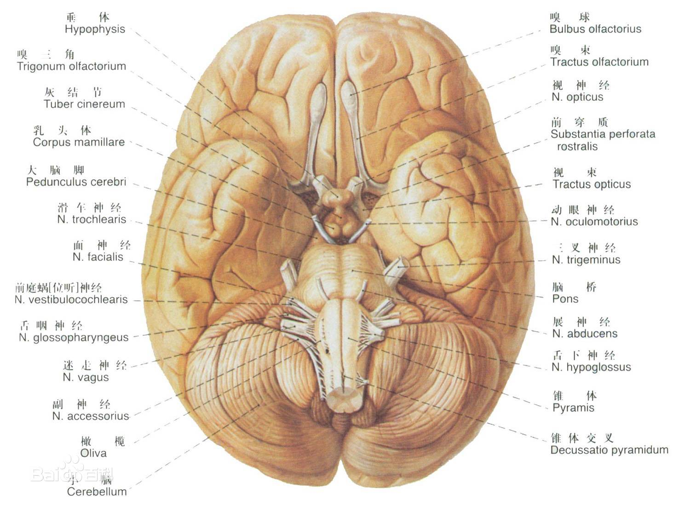
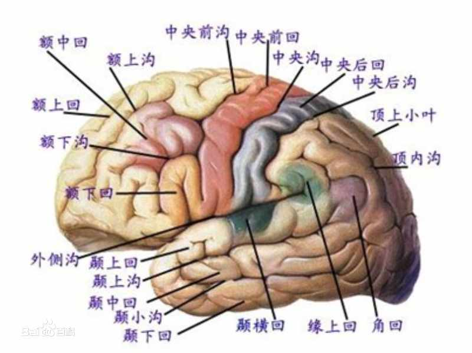

| 序号 | 修改时间  | 修改内容     | 修改人 | 审稿人 |
| ---- | --------- | ------------ | ------ | ------ |
| 1    | 2018-10-2 | 创建         | Keefe | Keefe |
| 2    | 2020-12-6 | 更新大脑章节 | 同上   |        |

---

# 目录

[目录... 1](#_Toc526319516)

[1    心理学简介... 2](#_Toc526319517)

[2    心理学的生物基础... 2](#_Toc526319518)

[2.1    神经系统... 2](#_Toc526319519)

[2.2    大脑... 2](#_Toc526319520)

[2.3    物理知觉和错觉... 2](#_Toc526319521)

[3    社会心理学... 2](#_Toc526319522)

[3.1    社会知觉和偏见... 2](#_Toc526319523)

[3.2    社交... 3](#_Toc526319524)

[3.2.1     人际沟通与吸引... 3](#_Toc526319525)

[3.2.2     友谊... 3](#_Toc526319526)

[3.2.3     喜欢和爱情... 3](#_Toc526319527)

[4    决策... 4](#_Toc526319528)

[5    心理学实验... 4](#_Toc526319529)

[参考资料... 4](#_Toc526319530)

---

# 1  心理学简介

# 2  心理学的生物基础

## 2.1  神经系统

 

## 2.2   大脑

人是地球上体重/脑重比例最高的。

大脑的三个基本功能：思维、感觉与需求。

人类的大脑可以区分为三个部分：脑核(Central Core)、脑缘系统(Limbic System)、[大脑皮质](https://baike.baidu.com/item/大脑皮质/3237306)(Cerebral Cortex)。 脑核部分是掌管人类日常基本生活的处理，包括呼吸、心跳、觉醒、运动、睡眠、平衡、早期感觉系统等。而脑缘系统是负责行动、情绪、记忆处理等功能，另外，它还负责[体温](https://baike.baidu.com/item/体温/790109)、[血压](https://baike.baidu.com/item/血压/766186)、[血糖](https://baike.baidu.com/item/血糖/780864)、以及其它居家活动等。[大脑皮质](https://baike.baidu.com/item/大脑皮质/3237306)则负责人脑较高级的认知和情绪功能，它区分为两个主要大块----左大脑和右大脑，各大块均包含四个部分----额叶脑(Frontal Lobe)、顶叶脑(Parietal Lobe)、枕叶脑(Occipital Lobe)、颞叶脑(Temporal Lobe)。

 ### 记忆

记忆分为短时记忆（又叫工作记忆）和长时记忆（又分为事实记忆和机动记忆）。

记忆的过程：

| 记忆     | 说明                                                       | 工作器官         | 备注                                                         |
| -------- | ---------------------------------------------------------- | ---------------- | ------------------------------------------------------------ |
| 短时记忆 | 短期内被动或主动记到的东西                                 | 额叶             | 记忆游戏：基姆游戏（一般人只能瞬时记忆7种物品）。            |
| 事实记忆 | 也叫陈述性或外显记忆，存储所有的回忆、事实信息和经历体验。 | 颞叶             | 颞叶最内侧的海马体负责对信息进行加工、抽象。 海马体受损实例：H.M(1933)，导致记忆保存在受损前，无法再保存新的超过1小时的记忆。 |
| 机动记忆 | 熟能生巧。通过反复训练，更好让记忆保存在运动器官里。       | 小脑和基底神经节 | 海马体 记住‘是什么’。 小脑和基底神经节 记住‘怎么做’。     |

记忆获取：无意识的条件反射、操作的条件反射、适应和学习。

记忆存储：海马体分类过的信息将保存到大脑皮层的不同区域。

记忆检索（回忆）：大脑里有约860亿个神经细胞，它们之间通过接触点（突触）传输信息。记忆和各类神经（视觉、听觉、嗅觉、知觉等）的协同。

大脑退化（失智症）：常见二种，

* 一是老年痴呆症，特定蛋白非正常分解，导致海马体旁的颞叶神经细胞损伤。通过注射年轻器官里包含的血液或某种物质可以提升细胞再生活动能力。
* 二是血管性失智，部分区域供血不足，导致神经细胞死亡。可通过健康饮食和健康运动改善。

### 情绪

| 情绪类别     | 说明             | 工作器官                                            |                                                              |
| ------------ | ---------------- | --------------------------------------------------- | ------------------------------------------------------------ |
| 性           |                  | 额叶                                                | 额叶受损会失去动作控制能力。                                 |
| 心情（快乐） | 快乐、伤心、抑郁 | [多巴胺](https://baike.baidu.com/item/多巴胺/62597) | 多巴胺能在特定的环境下让人兴奋，传递快乐。 病例：帕金森症 |
| 压力         |                  | 肾上腺                                              |                                                              |
| 焦虑         |                  |                                                     |                                                              |
| 爱           |                  |                                                     |                                                              |

## 2.3   物理知觉和错觉

## 本章参考

[1]:  https://baike.baidu.com/item/%E5%A4%A7%E8%84%91%E7%BB%93%E6%9E%84/19466163  "百度百科-大脑结构 "

# 3  社会心理学

## 3.1  社会知觉和偏见

社会知觉相对于物理知觉的，是对人的知觉。在社会知觉过程中，认知者和被认知者总是处在相互影响和相互作用的状态。

表格 1 社会知觉详述

| 概念         | 解释                                                         | 备注                                                         |
| ------------ | ------------------------------------------------------------ | ------------------------------------------------------------ |
| 首因效应     | 首因即第一印象。                                             | 首因主要对两种信息连续被感知起作用。                         |
| 近因效应     | 近因即最后的印象。                                           | 近因主要对两种信息断续被感知起作用。                         |
| 晕轮效应     | 又称光环效应。即认知者对一个形成好或坏形象时，会据此推断其它方面的特征。 | 如一好百好，一白遮百丑。                                     |
| 社会刻板印象 | 指人们对某个社会群体形成的一种根据而固定的看法。             | 比如国民刻板印象、性别刻板印象。由此很容易引发种族主义和性别歧视。 |

备注：1. 首因和近因似乎矛盾，这取决于不同的场合、或者认知的价值选择。

2. 以上认知都很容易形成偏见。

## 3.2  社交

言语交流：详见 《语言文字学习》

非言语交流：个人空间、体态语、目光接触

### 3.2.1  人际沟通与吸引

人与人之间的交往有着复杂的表现。

从信息交流的角度看，是人际沟通的问题；

从情感交流的角度看，是人际吸引的问题。

人际沟通网络：链型、轮型、Y型、圆型和全通道型。

表格 2 人际吸引的表现方式

| 概念       | 解释                             | 示例                               |
| ---------- | -------------------------------- | ---------------------------------- |
| 相近且相纳 | 空间距离。                       | 邻居+同层+邻信箱+同楼道。          |
| 相似或互补 | 相似： 观点一致、争辩较少        | 物以类聚，人以群分。               |
|            | 互补：补充生理或自身缺陷的心理。 | 如男女天然的互补。不同专业的互补。 |
| 个人魅力   |                                  | 如相貌、名声、性格、能力           |

备注：1. 陌生人社交中，前期可能空间距离起主要使用；后期则是兴趣爱好等相似性格特性超过空间距离。

2. 相似多含价值取向；互补则是现实需求。

### 3.2.2  友谊

友谊五阶段：1.彼此陌生；2.单方或双方注意到对方，但未接触；3.双方有表面接触；4.双方互动，友谊开始；5.友谊升华。

### 3.2.3  喜欢和爱情

* 喜欢：有两个重要因素，一是人际吸引的双方有共同的理解；二是喜欢的主体对所喜欢的对象有积极的评价和尊重。

* 爱情：有三个重要因素，一是依恋；二是承诺（关怀与奉献）；三是亲密。详见爱情三元论。

爱情三元论：斯滕伯格1988年提出。此理论认为，爱情虽然复杂多变，但基本上包含了三种基本的成分：

（1）：激情。这是一种强烈地渴求跟对方结合的状态，性的需求是引起激情的主导形式。

（2）：亲密。这是两人之间感觉亲近、温馨的一种体验。

（3）：承诺。主要指个人内心或口头对爱的预期，包括对爱情的忠诚、责任心，是爱情中最理性的成分。

爱情三元论的原理与颜色三元论相似，如同红绿蓝3种原色按不同的比例混合即可产生所有不同的颜色一样，爱情是人类心理上的色彩，按照激情、亲密和承诺3种成分按不同比例混合而成。爱情三元论可以据此组成7种不同类型的爱情：

表格 3 爱情的七种不同类型

| 类型     | 三元组成成份               | 示例                                                     |
| -------- | -------------------------- | -------------------------------------------------------- |
| 喜欢式   | 只有亲密，没有激情和承诺。 | 类似友谊。友谊不是爱情，但可以发展为爱情。               |
| 迷恋式   | 只有激情。                 | 如同初恋。没有规划未来，是本能牵引下的青涩爱情。         |
| 空洞式   | 只有承诺。                 | 纯粹为了结婚的爱情。                                     |
| 浪漫式   | 有亲密和激情，没有承诺。   | 崇尚过程，不在乎结果。                                   |
| 伴侣式   | 有亲密和承诺，缺乏激情。   | 类似空洞式。                                             |
| 愚蠢式   | 有激情和承诺，没有亲密。   | 没有亲密的激情是生理式的冲动；没有亲密的承诺是空头支票。 |
| 完美爱情 | 同时具备三要素。           |                                                          |

## 本章参考

# 4  决策 Decision

## 4.1  PrOACT

PrOACT：有一种直接简明和经过证实的决策方法。它并不会告诉你为何事决策，而是向你介绍怎样决策。通过考虑下面的八个要素，即使最复杂的决策，也能得到分析和解决。

这一方法的核心是五个要素，PrOACT是五要素的首字母缩写，即问题（problem）、目标（objectives）、备选方案（alternatives）、结果（cornsequences）和取舍（tradeoffs）。

精明选择的八个要素：问题（problem）、目标（objectives）、备选方案（alternatives）、结果（cornsequences）、取舍（tradeoffs）、 不确定性（uncertainty）、 风险承受力（risk tolerance）和相关联的决策（linked decisions）。

另外三个要素，即不确定性（uncertainty）、风险承受力（risk tolerance）和相关联的决策（linked decisions），有助于在变化的环境中使决策清晰可辨。不是所有的决策都包含这些因素，但重要的往往包含。

PrOACT法的实质是逐个击破。为解决一个复杂的决策问题，你从问题中分离出这些要素，逐个进行系统思考，并且把注意力集中在那些对这一特定局面最为关键的要素上。

## 本章参考

[1].  运用PrOACT方法  http://blog.sina.com.cn/s/blog_17f0842150102xmz9.html

# 5  批判性思维Critical Thinking

## 本章参考

# 6  智力

智力可被看作是个体的各种认知能力的综合，特别强调解决新问题的能力，抽象思维、学习能力，对环境的适应能力。

**智力测量**

比率智商：一个人的心理年龄（简称MA）与其生理年龄（简介CA）的比值。

智商(IQ) = MA/CA * 100

## 6.1  智力结构

吉尔福特的智力三维结构模型：内容、操作和产品。

斯藤伯格的智力三元论：成分、经验和情境，分别对应于主体的内部世界、现实的外部世界及联系内外世界的主体经验世界。

加德纳的多元智力观：八种智力分别是逻辑-数学、语言、自然主义、音乐、空间、身体运动、人际（社交）、内心（自知）。

情绪智力(EQ)：与加德纳的人际和内心智力相关。

## 本章参考

# 7  心理学实验

## 本章参考

# 参考资料

**参考书籍**

**精神心理学（生理基础）**

* [梦的解析 ](https://book.douban.com/subject/6772570/) 西格蒙德•弗洛伊德 / 孙名之 等 / 国际文化出版社 / 2011-8-1
* [精神分析引论 ](https://book.douban.com/subject/1263798/) [奥] 弗洛伊德 / 彭舜 / 陕西人民出版社 / 2006-5
* [心智的构建 : 脑如何创造我们的精神世界 ](https://book.douban.com/subject/10864488/) [英] Chris Frith / 杨南昌 / 华东师范大学出版社 / 2012-7
* [自私的基因 ](https://book.douban.com/subject/11445548/) [英]理查德·道金斯 / 卢允中、张岱云、陈复加、罗小舟 / 中信出版社 / 2012-9
* [人类与动物心理学讲义 ](https://book.douban.com/subject/1158570/) 威廉·冯特 / 陕西人民出版社 / 2003-12
* [大脑科学](https://book.douban.com/subject/30359936/)   [挪]卡娅·努尔英恩  / 中信出版集团 / 2018-11

**社会心理学（环境基础）**

* [乌合之众 : 大众心理研究 ](https://book.douban.com/subject/1012611/)（法）勒庞 / 冯克利 / 中央编译出版社 / 2011-5-1

* [影响力 : 经典版 ](https://book.douban.com/subject/5287474/)罗伯特•B•西奥迪尼 (Robert B. Cialdini) / 闾佳 / 万卷出版公司 / 2010-9-20

* [改变心理学的40项研究 ](https://book.douban.com/subject/5248516/)罗杰•霍克 (Roger R. Hock) / 白学军 / 人民邮电出版社 / 2010-8-1

* [批判性思维工具（原书第3版） ](https://book.douban.com/subject/24697776/)[美] 理查德·保罗、[美] 琳达·埃尔德 / 侯玉波、姜佟琳 [等] / 机械工业出版社 / 2013-5

* [决策的艺术 ](https://book.douban.com/subject/26803289/) 约翰 S．哈蒙德（John S. Hammond）、拉尔夫 L．基尼（Ralph L. Keeney）、霍华德•雷法（Howard Raiffa） / 王正林 / 机械工业出版社 / 2016-6

* 心理学十五讲 黄希庭、郑涌 / 北京大学出版社 / 2005-5
