| 序号 | 修改时间   | 修改内容                                 | 修改人 | 审稿人 |
| ---- | ---------- | ---------------------------------------- | ------ | ------ |
| 1    | 2015-3-18  | 创建。                                   | Keefe | Keefe |
| 2    | 2015-5-12  | 更新Excel数据分析。                      | 同上   |        |
| 3    | 2016-6-22  | 更细的Excel数据分析工具                  | 同上   |        |
| 4    | 2016-10-21 | 更新EXCEL的曲线拟合                      | 同上   |        |
| 5    | 2016-12-16 | 增加数学概论章节。                       | 同上   |        |
| 6    | 2017-1-5   | 增加R语言和数学公式的图形化章节          | 同上   |        |
| 7    | 2017-6-9   | 增加赌博与概率章节                       | 同上   |        |
| 8    | 2017-6-25  | 补充附录~奖项                            | 同上   |        |
| 9    | 2018-9-24  | 增加数学七大猜想。                       | 同上   |        |
| 10   | 2020-3-24  | 更新《深度学习》一书中所涉及到的数学知识 | 同上   |        |
|      |            |                                          |        |        |

<br><br><br>

---

# 目录

[TOC]

[目录... 1](#_Toc35981679)

[1    数学概论... 4](#_Toc35981680)

[1.1    数学分支... 4](#_Toc35981681)

[1.2    数学史... 6](#_Toc35981682)

[1.3    数学定理的证明... 7](#_Toc35981683)

[1.3.1     数学归纳法... 7](#_Toc35981684)

[1.3.2     反证法... 7](#_Toc35981685)

[1.4    经典数学古籍... 8](#_Toc35981686)

[1.4.1     欧几里得《几何原本》... 8](#_Toc35981687)

[1.4.2     《九章算术》... 8](#_Toc35981688)

[1.5    数学难题... 9](#_Toc35981689)

[1.5.1     世界七大数学难题... 9](#_Toc35981690)

[1.5.2     希尔伯特23问(1900) 11](#_Toc35981691)

[1.6    本章参考... 14](#_Toc35981692)

[2    数学体系（总）... 14](#_Toc35981693)

[2.1    代数学... 14](#_Toc35981694)

[2.1.1     初等代数... 14](#_Toc35981695)

[3    计算机科学的数学体系... 15](#_Toc35981696)

[3.1    数值计算... 15](#_Toc35981697)

[3.1.1     数学分析... 16](#_Toc35981698)

[3.1.2     线性代数... 16](#_Toc35981699)

[3.2    离散数学... 17](#_Toc35981700)

[3.2.1     离散数学概述... 17](#_Toc35981701)

[3.2.2     数理逻辑... 18](#_Toc35981702)

[3.2.3     图论... 19](#_Toc35981703)

[3.3    数论... 19](#_Toc35981704)

[3.4    计算理论... 20](#_Toc35981705)

[3.4.1     算法... 20](#_Toc35981706)

[3.5    计算机科学的数学应用实例（实践篇）... 20](#_Toc35981707)

[3.6    本章参考... 21](#_Toc35981708)

[4    统计学的数学体系... 22](#_Toc35981709)

[4.1    概率论... 22](#_Toc35981710)

[4.1.1     基本概念... 22](#_Toc35981711)

[4.1.2     随机变量的分布... 23](#_Toc35981712)

[4.2    数理统计学... 25](#_Toc35981713)

[4.2.1     基本概念... 25](#_Toc35981714)

[4.2.2     检验参数估计和假设检验... 27](#_Toc35981715)

[4.2.3     回归分析和方差分析... 28](#_Toc35981716)

[4.3    应用统计学... 28](#_Toc35981717)

[4.4    本章参考... 29](#_Toc35981718)

[5    数学建模和数学工具... 29](#_Toc35981719)

[5.1    数值拟合（数值逼近）... 29](#_Toc35981720)

[5.2    Mathematica. 30](#_Toc35981721)

[5.3    Lindo. 30](#_Toc35981722)

[5.4    Office Excel（作数据分析）... 30](#_Toc35981723)

[5.4.1     EXCEL数据分析工具的加载（宏）... 30](#_Toc35981724)

[5.4.2     分析1：假设分析（假设检验）... 32](#_Toc35981725)

[5.4.3     分析2：线性回归分析... 36](#_Toc35981726)

[5.4.4     分析3：计算相关系数... 37](#_Toc35981727)

[5.4.5     分析4：统计分析... 38](#_Toc35981728)

[5.4.6     分析5：曲线拟合之线性/指数/多项式... 38](#_Toc35981729)

[5.4.7     EXCEL使用小技巧... 39](#_Toc35981730)

[5.5    Stata. 40](#_Toc35981731)

[5.6    本章参考... 40](#_Toc35981732)

[6    数学的实践（应用篇）... 40](#_Toc35981733)

[6.1    生活中的数学... 40](#_Toc35981734)

[6.2    数学公式的图形化... 41](#_Toc35981735)

[6.2.1     基本初等函数... 41](#_Toc35981736)

[6.2.2     概率分布的曲线... 44](#_Toc35981737)

[6.3    如何形象地的理解数学概念（先验的、直觉）... 46](#_Toc35981738)

[6.3.1     极限和连续性的精准定义... 46](#_Toc35981739)

[6.4    赌博与概率... 47](#_Toc35981740)

[6.4.1     彩票... 47](#_Toc35981741)

[6.4.2     稳赚不赔的赌场... 47](#_Toc35981742)

[6.4.3     抛硬币的游戏（凯利公式）... 48](#_Toc35981743)

[6.4.4     大话骰... 49](#_Toc35981744)

[6.4.5     简易小赌博... 50](#_Toc35981745)

[6.5    本章参考... 51](#_Toc35981746)

[7    参考资料... 52](#_Toc35981747)

[7.1    参考书目... 52](#_Toc35981748)

[7.2    参考文献... 52](#_Toc35981749)

[8    附录... 53](#_Toc35981750)

[8.1    学校里的数学教育课程... 53](#_Toc35981751)

[8.2    数学词汇中英文对照... 53](#_Toc35981752)

[8.2.1     数学概念的中英文对照... 53](#_Toc35981753)

[8.3    数学奖项... 54](#_Toc35981754)

[8.3.1     菲尔兹奖... 54](#_Toc35981755)

[8.3.2     沃尔夫奖... 54](#_Toc35981756)

[8.3.3     中国的数学奖... 55](#_Toc35981757)

[8.4    计算机-图灵奖... 55](#_Toc35981758)


**表目录**

[表格 1数学分支列表__ 4](#_Toc35981759)

[表格 2 数学史大事记__ 6](#_Toc35981760)

[表格 3 《几何原本》详述__ 8](#_Toc35981761)

[表格 4 《九章算术》详述__ 8](#_Toc35981762)

[表格 5 世界七大数学难题详述__ 9](#_Toc35981763)

[表格 6_ 9](#_Toc35981764)

[表格 7 Hilbert 23问__ 11](#_Toc35981765)

[表格 8 概率论基本概念列表__ 22](#_Toc35981766)

[表格 9 随机变量的几种分布distribution列表__ 23](#_Toc35981767)

[表格 10数理统计学基本概念列表__ 25](#_Toc35981768)

[表格 11 归一化和标准化比较表__ 26](#_Toc35981769)

[表格 12 假设分析工具列表__ 27](#_Toc35981770)

[表格 13 统计学中分析概念__ 28](#_Toc35981771)

[表格 14 Excel内置加载宏__ 31](#_Toc35981772)

[表格 15 Excel分析工具库中的工具__ 32](#_Toc35981773)

[表格 16 基本初等函数列表__ 41](#_Toc35981774)

[表格 17 概率分布的曲线及其数据特征列表__ 44](#_Toc35981775)

[表格 19 图灵奖历年得主列表__ 55](#_Toc35981776)


**图目标**

[图 1数学分支图... 4](#_Toc35981777)

[图 2凯利公式（Kellyformula）... 49](#_Toc35981778)


<br>

---

# 1  数学概论

[数学](http://baike.baidu.com/subview/1284/13645654.htm)（mathematics或maths），是研究[数量](http://baike.baidu.com/view/678110.htm)、[结构](http://baike.baidu.com/view/160039.htm)、[变化](http://baike.baidu.com/view/507074.htm)、[空间](http://baike.baidu.com/view/31260.htm)以及[信息](http://baike.baidu.com/view/1527.htm)等[概念](http://baike.baidu.com/view/45333.htm)的一门学科，从某种角度看属于形式科学的一种。

## 1.1  数学分支

表格 1数学分支列表

| 研究方向 | 方向说明                                                     | 数学分支                                                     |
| -------- | ------------------------------------------------------------ | ------------------------------------------------------------ |
| 数量     | 数量的比较、操作等。                                         | 代数、数论                                                   |
| 空间     | 研究平面或立体或更高维空间的关系                             | 几何                                                         |
| 结构     | 结构就是以初始概念和[公理](http://baike.baidu.com/view/326184.htm)出发的演绎系统。 | 数学分析、函数论、泛函分析、常微分方程、偏微分方程           |
| 应用领域 | 数学应用到具体的领域如计算机、工程、会计、经济等等           | 概率论、数理统计、计算数学、工程数学、运筹学                 |
| 跨学科   | 与其它学科相互渗透，如逻辑学                                 | [集合论](http://baike.baidu.com/view/26152.htm)、数理逻辑    |
| 抽象     | 如[不确定性](http://baike.baidu.com/view/452716.htm)的研究   | 量子数学、[模糊数学](http://baike.baidu.com/view/24364.htm)、组合数学 |


​            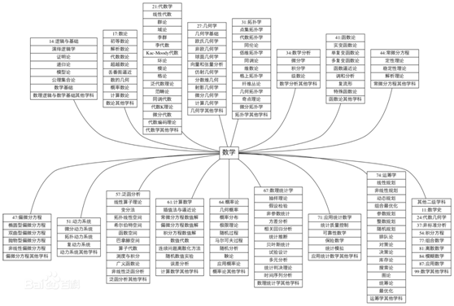

图 1数学分支图

**1. 数学史**

**2. 数理逻辑与数学基础**
　a: 演绎[逻辑学](http://baike.baidu.com/subview/2958/19112987.htm)(亦称符号逻辑学)
    b: [证明](http://baike.baidu.com/subview/320260/5113227.htm)论 (亦称元数学) c:递归论 d:模型论 e:公理集合论 f:数学基础 g:数理逻辑与数学基础其他学科

**3. 数论**
 　a. 初等数论 b. 解析数论 c. 代数数论 d. 超越数论 e. 丢番图逼近 f. 数的几何 g. 概率数论 h. 计算数论 i. 数论其他学科
**4. 代数学**
 　a:线性代数 b:群论 c:域论 d:李群 e:李代数 f:Kac-Moody代数 g:环论 (包括交换环与交换代数，结合环与结合代数，非结合环与非结 合代数等) h:模论 i:格论 j:泛代数理论 k:范畴论 l:同调代数 m:代数K理论 n:微分代数 o:代数编码理论 p:代数学其他学科
**5. 代数几何学**
**6. 几何学**
 　a:几何学基础 b:欧氏几何学 c:非欧几何学 (包括黎曼几何学等) d:球面几何学 e:向量和张量分析 f:仿射几何学 g:射影几何学 h:微分几何学 i:分数维几何 j:计算几何学 k:几何学其他学科

**7. 拓扑学**
 　a:点集拓扑学 b:代数拓扑学 c:同伦论 d:低维拓扑学 e:同调论 f:维数论 g:格上拓扑学 h:纤维丛论 i:几何拓扑学 j:奇点理论 k:微分拓扑学 l:拓扑学其他学科
**8. 数学分析**
    a:微分学 b:积分学 c:级数论 d:数学分析其他学科
**9. 非标准分析**
**10. 函数论**
 　a:实变函数论 b:单复变函数论 c:多复变函数论 d:函数逼近论 e:调和分析 f:复流形 g:特殊函数论 h:函数论其他学科
**11. 常微分方程**
 　a:定性理论 b:稳定性理论 c:解析理论 d:常微分方程其他学科
**12. 偏微分方程**
 　a:椭圆型偏微分方程 b:双曲型偏微分方程 c:抛物型偏微分方程 d:非线性偏微分方程 e:偏微分方程其他学科
**13. 动力系统**
 　a:微分动力系统 b:拓扑动力系统 c:复动力系统 d:动力系统其他学科
**14. 积分方程**
**15. 泛函分析**
 　a:线性算子理论 b:变分法 c:拓扑线性空间 d:希尔伯特空间 e:函数空间 f:巴拿赫空间 g:算子代数 h:测度与积分 i:广义函数论 j:非线性泛函分析 k:泛函分析其他学科
**16. 计算数学**
 　a:[插值法](http://baike.baidu.com/view/754506.htm)与[逼近论](http://baike.baidu.com/view/754499.htm) b:常微分方程数值解 c:偏微分方程数值解 d:积分方程数值解 e:数值代数 f:连续问题离散化方法 g:[随机数](http://baike.baidu.com/view/1587526.htm)值实验 h:误差分析 i:[计算数学](http://baike.baidu.com/view/35592.htm)其他学科
**17. 概率论**
 　a:几何概率 b:概率分布 c:极限理论 d:随机过程 (包括正态过程与平稳过程、点过程等) e:马尔可夫过程 f:随机分析 g:鞅论 h:应用概率论 (具体应用入有关学科) i:概率论其他学科
**18. 数理统计学**
 　a:[抽样](http://baike.baidu.com/view/64216.htm)理论 (包括抽样分布、抽样调查等 )b:假设检验 c:非参数统计 d:方差分析 e:相关回归分析 f:统计推断 g:贝叶斯统计 (包括参数估计等) h:试验设计 i:多元分析 j:统计判决理论 k:时间序列分析 l:数理统计学其他学科
**19. 应用统计数学**
 　a:统计质量控制 b:可靠性数学 c:保险数学 d:统计模拟
**20. 应用统计数学其他学科**

**21. 运筹学**
 　a:[线性规划](http://baike.baidu.com/view/92066.htm) b:非线性规划 c:动态规划 d:组合最优化 e:参数规划 f:整数规划 g:随机规划 h:排队论 i:对策论 亦称博弈论 j:库存论 k:决策论 l:搜索论 m:图论 n:统筹论 o:最优化 p:运筹学其他学科
**22. 组合数学**

**23. 模糊数学**

**24. 量子数学**

**25. 应用数学 (具体应用入有关学科)**

**26. 数学其他学科**


## 1.2  数学史

数学的演进大约可以看成是[抽象化](http://baike.baidu.com/view/4902353.htm)的持续发展，或是题材的延展．而东西方文化也采用了不同的角度，欧洲文明发展出来几何学，而中国则发展出算术．

西欧从古希腊到16世纪经过文艺复兴时代，[初等代数](http://baike.baidu.com/view/17545.htm)、以及[三角学](http://baike.baidu.com/view/187604.htm)等[初等数学](http://baike.baidu.com/view/1693037.htm)已大体完备．但尚未出现[极限](http://baike.baidu.com/subview/17644/5120727.htm)的概念．

17世纪在欧洲变量概念的产生，使人们开始研究变化中的量与量的互相关系和图形间的互相变换．

中国数学古称算学，是中国古代科学中一门重要的学科，根据中国古代数学发展的特点，可以分为五个时期：萌芽；体系的形成；发展；繁荣和中西方数学的融合。


**数学史分期**
* 萌芽时期：公元前600年，古希腊的《几何原本》、中国的《九章算术》
* 初等数学时期：公元前600年至17世纪中叶
* 变量数学：17世纪中叶至19世纪20年代
* 近代数学：19世纪20年代至第二次世界大战
* 现代数学：20世纪40年代以来


**三次数学危机**

| 危机名称 | 起源                                                         | 解决办法                                                     | 影响                                                         |
| -------- | ------------------------------------------------------------ | ------------------------------------------------------------ | ------------------------------------------------------------ |
| 无理数   | 公元前5世纪，[毕达哥拉斯学派](https://www.baidu.com/s?wd=毕达哥拉斯学派&tn=SE_PcZhidaonwhc_ngpagmjz&rsv_dl=gh_pc_zhidao)的成员希帕索斯（470B.C.前后）发现：等腰直角三角形斜边与一直角边是不可公度的，它们的比不能归结为整数或整数之比。希帕索斯的这一发现，史称“希帕索斯悖论”，从而触发了数学史上的第一次危机。 | 公元前370年毕氏学派的欧多克斯通过给比例下新定义的方法解决了。他的处理不可通约量的方法，出现在欧几里得《原本》第5卷中。 | 危机也表明，直觉和经验不一定靠得住，推理证明才是可靠的，从此希腊人开始重视演译推理，并由此建立了几何公理体系。数学进入初等数学。 |
| 无穷小   | 1734年，英国哲学家、大主教贝克莱发表《分析学家或者向一个不信正教数学家的进言》，矛头指向微积分的基础--无穷小的问题，提出了所谓贝克莱悖论。 | 19世纪20年代，一些数学家才比较关注于微积分的严格基础。从波尔查诺、阿贝尔、柯西、狄里赫利等人的工作开始，到威尔斯特拉斯、戴德金和康托的工作结束。 | 导致了数学史上的第二次危机，引起了持续200多年的微积分基础理论的争论. |
| 罗素悖论 | 1897年，福尔蒂揭示了集合论中的第一个悖论。两年后，康托发现了很相似的悖论。1902年，罗素又发现了一个悖论，它除了涉及集合概念本身外不涉及别的概念。罗素悖论曾被以多种形式通俗化。最典型的问题是：理发师悖论。 | 大数定律。从整体来看，还没有解决到令人满意的程度。           | 集合论中悖论的发现自然地引起了对数学的整个基本结构的有效性的怀疑。 |


表格 2 数学史大事记

| 时间          | 事件                                                         | 备注                 |
| ------------- | ------------------------------------------------------------ | -------------------- |
| 约公元前300年 | [欧几里得](https://baike.baidu.com/item/欧几里得/182343)《几何原本》成书。 | 发行量仅次于《圣经》 |
| 公元一世纪    | 中国古代第一部数学专著《九章算术》成书。                     |                      |
| 5世纪         | 中国祖冲之算出了π的近似值到七位小数。<br>印度阿耶波多著书研究数学和天文学，其中讨论了一次不定方程式的解法、度量术和三角学等。 |                      |
| 7世纪         | 印度婆罗摩笈多研究了定方程和不定方程、四边形、圆周率、梯形和序列。给出了ax+by=c(a,b,c,是整数)的第一个一般解 |                      |
| 9世纪         | 阿拉伯阿尔·花刺子模发表《印度计数算法》，使西欧熟悉了十进位制。 |                      |
| 17世纪        | 1614年，英国耐普尔制定了对数。<br>1615年，德国刻卜勒发表《酒桶的立体几何学》，研究了圆锥曲线旋转体的体积。<br>1637年，法国笛卡尔出版《几何学》，制定了解析几何。1638年，法国费尔玛开始用微分法求极大、极小问题。 |                      |
|               | 牛顿(1665─1666年)先于莱布尼茨(1673─1676年)制定了微积分，莱布尼茨(1684─1686年)早于牛顿(1704─1736年)发表微积分(英国牛顿，德国莱布尼茨)。 |                      |
|               | 1670年，提出“费尔玛大定理”,预测：若X,Y,Z,n都是整数,则Xn+Yn=Zn当n>2时是不可能的(法国费尔玛)。<br>1696年，发明求不定式极限的“洛比达法则”(法国洛比达)。 |                      |
| 18世纪        | 1733年，发现正态概率曲线(英国德·穆阿佛尔)。<BR>1734年，贝克莱发表《分析学者》，副标题是《致不信神的数学家》，攻击牛顿的《流数法》，引起所谓第二次数学危机(英国贝克莱)。<BR>1767年，发现分离代数方程实根的方法和求其近似值的方法(法国拉格朗日)。<br>1770─1771年，把置换群用于代数方程式求解，这是群论的开始(法国拉格朗日)。<br>1794年，流传很广的初等几何学课本《几何学概要》(法国勒让德尔)。1794年，从测量误差，提出最小二乘法，于1809年发表(德国高斯)。<BR>1797年，发表《解析函数论》不用极限的概念而用代数方法建立微分学(法国拉格朗日)。 |                      |
| 19世纪        |                                                              |                      |
| 20世纪        |                                                              |                      |
| 21世纪        |                                                              |                      |


## 1.3  数学定理的证明

说明：所有数学证明都是演绎法，是严肃的可验证的。

演绎推理的主要形式是“三段论”，由大前提、小前提、结论三部分组成一个“连珠”。大前提是已知的一般原理；小前提是研究的特殊场合；结论是将特殊场合归到一般原理之下得出的新知识。例如：

```
大前提：电流是电子向一定方向运动形成的；
小前提；金属的自由电子能在电场作用下定向运动，
结论：所以，金属能导电。
```


### 数学归纳法

**备注**：虽然数学归纳法名字中有“归纳”，但是数学归纳法并非不严谨的归纳推理法，它属于完全严谨的演绎推理法。


**数学归纳法**（Mathematical Induction, MI）是一种数学证明方法，通常被用于证明某个给定命题在**整个（或者局部）自然数范围**内成立。除了自然数以外，广义上的数学归纳法也可以用于证明一般良基结构，例如：集合论中的树。这种广义的数学归纳法应用于数学逻辑和计算机科学领域，称作结构归纳法。

已知最早的使用数学归纳法的证明出现于Francesco Maurolico的Arithmeticorum libri duo（1575年）。Maurolico利用递推关系巧妙地证明出前n个奇数的总和是n^2，由此总结出了数学归纳法。


最简单和常见的数学归纳法证明方法是证明当n属于所有正整数时一个表达式成立，这种方法是由下面两步组成：
* 递推的基础：证明当n=1时表达式成立。
* 递推的依据：证明如果当n=m时成立，那么当n=m+1时同样成立。

这种方法的原理在于第一步证明起始值在表达式中是成立的，然后证明一个值到下一个值的证明过程是有效的。如果这两步都被证明了，那么任何一个值的证明都可以被包含在重复不断进行的过程中。

数学归纳法的变体：**递降归纳法、跳跃归纳法、第一数学归纳法、第二数学归纳法（完整归纳法）、倒推归纳法（又称反向归纳法）、螺旋式归纳法**


### 反证法


## 1.4  经典数学古籍

### 欧几里得《几何原本》

表格 3 《几何原本》详述

| 简介   | [欧几里得](https://baike.baidu.com/item/欧几里得/182343)《几何原本》成书约于公元前300年，原书已失传。 |
| ------ | ------------------------------------------------------------ |
| 发展史 | 这部书已经基本囊括了几何学从公元前7世纪的[古埃及](https://baike.baidu.com/item/古埃及)，一直到公元前4世纪约400年的数学发展成果。  19世纪初，法国数学家勒让德，把欧几里德的原作，用现代语言写成了几何课本，成为现今通用的几何学教本。  1582年，[利玛窦](https://baike.baidu.com/item/利玛窦)带了15卷本来到中国。1607年，[利玛窦](https://baike.baidu.com/item/利玛窦)和徐光启合译了前9卷；1857年，李善兰和英国人[伟烈亚力](https://baike.baidu.com/item/伟烈亚力)合译了后7卷。 |
| 内容   | 全书共13卷，书中包含了5个“假设(Postulates)”、5条“公设(Common Notions)”、23个定义(Definitions)和48个[命题](https://baike.baidu.com/item/命题)(Propositions)。 |
| 价值   | 它开创了古典[数论](https://baike.baidu.com/item/数论)的研究，在一系列公理、定义、公设的基础上，创立了欧几里得几何学体系，成为用公理化方法建立起来的数学演绎体系的最早典范。 |

欧几里得的第五[平行公设](https://baike.baidu.com/item/平行公设)：“通过已知直线外一已知点，能作且仅能作一条直线与已知直线平行。 ”这个结果在普通平面当中尚能够得到经验的印证，那么在无处不在的闭合[球面](https://baike.baidu.com/item/球面)之中(地球就是个大曲面)这个平行公理却是不成立的。俄国人罗伯切夫斯基和德国人[黎曼](https://baike.baidu.com/item/黎曼)由此创立了[非欧几何学](https://baike.baidu.com/item/非欧几何学)。


### 《九章算术》

《算经十书》是指汉、唐一千多年间的十部著名的数学著作，他们曾经是隋唐时代[国子监](https://baike.baidu.com/item/国子监/208825)[算学](https://baike.baidu.com/item/算学)科的教科书。十部书的名称是：《[周髀算经](https://baike.baidu.com/item/周髀算经/956191)》、《[九章算术](https://baike.baidu.com/item/九章算术/348232)》、《[海岛算经](https://baike.baidu.com/item/海岛算经/7691173)》、《[张丘建算经](https://baike.baidu.com/item/张丘建算经/7202817)》、《[夏侯阳算经](https://baike.baidu.com/item/夏侯阳算经/6379360)》、《[五经算术](https://baike.baidu.com/item/五经算术)》、《[缉古算经](https://baike.baidu.com/item/缉古算经/1482012)》、《[缀术](https://baike.baidu.com/item/缀术/9630142)》、《[五曹算经](https://baike.baidu.com/item/五曹算经)》、《[孙子算经](https://baike.baidu.com/item/孙子算经/4800686)》。《算经十书》标志着[中国古代数学](https://baike.baidu.com/item/中国古代数学/4124209)的高峰。

表格 4 《九章算术》详述

| 简介   | 《九章算术》其[作者](https://baike.baidu.com/item/作者/144157)已不可考。一般认为它是经历代各家的增补修订，最后成书最迟在东汉前期（约公元1世纪），现今流传的大多是在[三国时期](https://baike.baidu.com/item/三国时期/3745253)[魏元帝](https://baike.baidu.com/item/魏元帝)[景元](https://baike.baidu.com/item/景元)四年（263年），[刘徽](https://baike.baidu.com/item/刘徽/42748)为《[九章](https://baike.baidu.com/item/九章/4501045)》所作的注本。 |
| ------ | ------------------------------------------------------------ |
| 发展史 | 该书内容十分丰富，全书总结了战国、秦、汉时期的数学成就。  西汉[张苍](https://baike.baidu.com/item/张苍)增订、删补，三国时曹魏[刘徽](https://baike.baidu.com/item/刘徽/42748)注，唐[李淳风](https://baike.baidu.com/item/李淳风)注，南宋[杨辉](https://baike.baidu.com/item/杨辉/24967)著《详解九章算法》选用《九章算术》中80道典型的题作过详解并分类，清李潢（？—1811年）所著《九章算术细草图说》对《九章算术》进行了校订、列算草、补插图、加说明，尤其是图文并茂之作。现代钱宝琮（1892—1974年）曾对包括《九章算术》在内的《算经十书》进行了校点，用通俗语言、近代数学术语对《九章算术》及刘、李注文详加注释。 |
| 内容   | 全书采用问题集的形式，收有246个与生产、生活实践有联系的应用问题，其中每道题有问（题目）、答（答案）、术（解题的步骤，但没有证明），有的是一题一术，有的是多题一术或一题多术。这些问题依照性质和解法分别隶属于[方田](https://baike.baidu.com/item/方田)、[粟米](https://baike.baidu.com/item/粟米)、衰（音cui）分、少广、商功、均输、盈不足、[方程](https://baike.baidu.com/item/方程)及勾股，共九章。原作有插图，今传本已只剩下正文了。 |
| 价值   | 《九章算术》最早提到分数问题，也首先记录了盈不足等问题，《方程》章还在世界[数学史](https://baike.baidu.com/item/数学史)上首次阐述了负数及其加减[运算法则](https://baike.baidu.com/item/运算法则/230422)。它是中国古代第一部数学专著，一本综合性的历史著作，是当时世界上最简练有效的应用数学，它的出现标志中国[古代数学](https://baike.baidu.com/item/古代数学)形成了完整的体系。 |


## 1.5  数学难题

### 世界七大数学难题

2000年初美国[克雷数学研究所](https://baike.baidu.com/item/克雷数学研究所)的科学顾问委员会选定了七个“千年大奖问题”，[克雷数学研究所](https://baike.baidu.com/item/克雷数学研究所)的[董事会](https://baike.baidu.com/item/董事会/3084)决定建立七百万美元的大奖基金，每个“千年大奖问题”的解决都可获得一百万美元的奖励。克雷数学研究所“千年大奖问题”的选定，其目的不是为了形成新世纪数学发展的新方向， 而是集中在对数学发展具有中心意义、数学家们[梦寐以求](https://baike.baidu.com/item/梦寐以求/873985)而期待解决的重大难题。

这七个“世界难题”是：[NP完全问题](https://baike.baidu.com/item/NP完全问题)、[霍奇猜想](https://baike.baidu.com/item/霍奇猜想/4679720)、[庞加莱猜想](https://baike.baidu.com/item/庞加莱猜想/4530364)、[黎曼假设](https://baike.baidu.com/item/黎曼假设/6891118)、[杨-米尔斯存在性和质量缺口](https://baike.baidu.com/item/杨-米尔斯存在性和质量缺口)、[纳卫尔-斯托可方程](https://baike.baidu.com/item/纳卫尔-斯托可方程)、[BSD猜想](https://baike.baidu.com/item/BSD猜想)

表格 5 世界七大数学难题详

| 问题                                                         | 案例                                                         | 问题定义                                                     | 进展                                                         |
| ------------------------------------------------------------ | ------------------------------------------------------------ | ------------------------------------------------------------ | ------------------------------------------------------------ |
| [NP完全问题](https://baike.baidu.com/item/NP完全问题)        | 在一个周六的晚上，你参加了一个盛大的晚会。由于感到局促不安，你想知道这一大厅中是否有你已经认识的人。宴会的主人向你提议说，你一定认识那位正在甜点盘附近角落的女士罗丝。不费一秒钟，你就能向那里扫视，并且发现宴会的主人是正确的。然而，如果没有这样的暗示，你就必须环顾整个大厅，一个个地审视每一个人，看是否有你认识的人。 | 所有的完全[多项式](https://baike.baidu.com/item/多项式)非确定性问题，都可以转换为一类叫做满足性问题的[逻辑运算](https://baike.baidu.com/item/逻辑运算)问题（即可在多项式时间内计算任何可能答案，类似反证法？）。所以猜想，是否这类问题，存在一个确定性[算法](https://baike.baidu.com/item/算法)，可以在多项式时间内，直接算出或是搜寻出正确的答案呢？ 即NP=P？ |                                                              |
| [霍奇（Hodge）猜想](https://baike.baidu.com/item/霍奇猜想/4679720) | 问在怎样的程度上，我们可以把给定对象的形状通过把维数不断增加的简单几何营造块粘合在一起来形成。 | [霍奇](https://baike.baidu.com/item/霍奇)猜想断言，对于所谓[射影代数簇](https://baike.baidu.com/item/射影代数簇)这种特别完美的空间类型来说，称作霍奇闭链的部件实际上是称作[代数闭链](https://baike.baidu.com/item/代数闭链)的几何部件的([有理](https://baike.baidu.com/item/有理)[线性](https://baike.baidu.com/item/线性))组合。 |                                                              |
| [庞加莱(Poincare)猜想](https://baike.baidu.com/item/庞加莱猜想/4530364) | 如果我们伸缩围绕一个苹果表面的橡皮带，那么我们可以既不扯断它，也不让它离开表面，使它慢慢移动收缩为一个点。另一方面，如果我们想象同样的橡皮带以适当的方向被伸缩在一个轮胎面上，那么不扯断橡皮带或者轮胎面，是没有办法把它收缩到一点的。我们说，苹果表面是“[单连通](https://baike.baidu.com/item/单连通)的”，而轮胎面不是。 | 大约在一百年以前，[庞加莱](https://baike.baidu.com/item/庞加莱)已经知道，[二维](https://baike.baidu.com/item/二维)[球面](https://baike.baidu.com/item/球面)本质上可由单连通性来刻画，他提出[三维球面](https://baike.baidu.com/item/三维球面)([四维空间](https://baike.baidu.com/item/四维空间/104773)中与原点有单位距离的点的全体)的对应问题。 | 2002~2003，俄罗斯的数学家[格里戈里·佩雷尔曼](https://baike.baidu.com/item/格里戈里·佩雷尔曼)在发表了三篇论文预印本，并声称证明了[几何化猜想](https://baike.baidu.com/item/几何化猜想)。2006年8月，第25届[国际数学家大会](https://baike.baidu.com/item/国际数学家大会)授予佩雷尔曼[菲尔兹奖](https://baike.baidu.com/item/菲尔兹奖)。数学界最终确认佩雷尔曼的证明解决了庞加莱猜想。 |
| [黎曼(Riemann)假设](https://baike.baidu.com/item/黎曼假设/6891118) | 有些数具有不能表示为两个更小的数的乘积的特殊性质，例如，2、3、5、7……等等。这样的数称为[素数](https://baike.baidu.com/item/素数)；它们在纯数学及其应用中都起着重要作用。在所有自然数中，这种素数的分布并不遵循任何有规则的模式 | 德国数学家[黎曼](https://baike.baidu.com/item/黎曼)(1826~1866)观察到，素数的频率紧密相关于一个精心构造的所谓黎曼zeta[函数](https://baike.baidu.com/item/函数)ζ(s)的性态。著名的黎曼假设断言，方程ζ(s)=0的所有有意义的解都在一条直线上。这点已经对于开始的1,500,000,000个解验证过。 | 2018.9.24，                                                  |
| [杨-米尔斯(Yang-Mills)存在性和质量缺口](https://baike.baidu.com/item/杨-米尔斯存在性和质量缺口) | [量子物理](https://baike.baidu.com/item/量子物理)的定律是以[经典力学](https://baike.baidu.com/item/经典力学)的[牛顿定律](https://baike.baidu.com/item/牛顿定律)对宏观世界的方式对基本粒子世界成立的。 | 上世纪60年代，[杨振宁](https://baike.baidu.com/item/杨振宁)和[米尔斯](https://baike.baidu.com/item/米尔斯)发现，量子物理揭示了在基本粒子物理与几何对象的数学之间的令人注目的关系。 | 基于杨－米尔斯方程的预言已经在如下的全世界范围内的实验室中所履行的高能实验中得到证实，但还需数学证明。 |
| [纳卫尔-斯托可方程](https://baike.baidu.com/item/纳卫尔-斯托可方程) | 起伏的波浪跟随着我们的正在湖中蜿蜒穿梭的小船，湍急的气流跟随着我们的现代[喷气式飞机](https://baike.baidu.com/item/喷气式飞机)的飞行。 | 无论是微风还是湍流，都可以通过理解纳维叶－斯托克斯方程（19世纪发现）的解，来对它们进行解释和预言。 |                                                              |
| [BSD猜想](https://baike.baidu.com/item/BSD猜想)              | `$X^2+Y^2=Z^2$ ` <BR>那样的[代数方程](https://baike.baidu.com/item/代数方程)的所有整数解的刻画问题 | 贝赫和斯维讷通－戴尔猜想认为，有理点的群的大小与一个有关的蔡塔函数z(s)在点s=1附近的性态。特别是，这个有趣的猜想认为，如果z(1)等于0,那么存在无限多个[有理点](https://baike.baidu.com/item/有理点)(解)。相反，如果z(1)不等于0。那么只存在着有限多个这样的点。 |                                                              |

备注：


### 希尔伯特23问 (1900)

希尔伯特（Hilbert D.,1862.1.23～1943.2.14）是二十世纪上半叶德国乃至全世界最伟大的数学家之一。他几乎走遍了现代数学所有前沿阵地，从而把他的思想深深地渗透进了整个现代数学。希尔伯特是哥廷根数学学派的核心。

1900年，希尔伯特在巴黎数学家大会上提出了23个最重要的问题供二十世纪的数学家们去研究，这就是著名的"希尔伯特23个问题"。

1975年，在美国伊利诺斯大学召开的一次国际数学会议上，数学家们回顾了四分之三个世纪以来希尔伯特23个问题的研究进展情况。当时统计，约有一半问题已经解决了，其余一半的大多数也都有重大进展。

表格 7 Hilbert 23问

| SN   | 问题                                                         | 问题定义                                                     | 进展                                                         |
| ---- | ------------------------------------------------------------ | ------------------------------------------------------------ | ------------------------------------------------------------ |
| 1    | (x)[康托的连续统基数](https://baike.baidu.com/item/康托的连续统基数问题) | 1874年，康托猜测在可数集基数和[实数集](https://baike.baidu.com/item/实数集)基数之间没有别的基数，即著名的[连续统假设](https://baike.baidu.com/item/连续统假设)。 | 1938年，侨居美国的[奥地利](https://baike.baidu.com/item/奥地利)[数理逻辑](https://baike.baidu.com/item/数理逻辑)学家[哥德尔证明](https://baike.baidu.com/item/哥德尔证明)连续统假设与ZF[集合论公理系统](https://baike.baidu.com/item/集合论公理系统)的无矛盾性。1963年，美国数学家[科恩](https://baike.baidu.com/item/科恩)（P.Choen）证明连续统假设与ZF公理彼此独立。因而，连续统假设不能用ZF公理加以证明。在这个意义下，问题已获解决。 |
| 2    | (√)[算术公理系统的无矛盾性](https://baike.baidu.com/item/算术公理系统的无矛盾性) | 欧氏几何的无矛盾性可以归结为[算术](https://baike.baidu.com/item/算术)[公理](https://baike.baidu.com/item/公理)的无矛盾性。 | [哥德尔](https://baike.baidu.com/item/哥德尔)1931年发表[不完备性定理](https://baike.baidu.com/item/不完备性定理)作出否定。[根茨](https://baike.baidu.com/item/根茨)（G.Gentaen，1909-1945）1936年使用[超限归纳法](https://baike.baidu.com/item/超限归纳法)证明了算术公理系统的无矛盾性。 |
| 3    | (√)                                                          | 只根据[合同公理](https://baike.baidu.com/item/合同公理)证明等底等高的两个四面体有相等之体积是不可能的。 | 存在两个等高等底的四面体，它们不可能分解为有限个小四面体，使这两组四面体彼此全等。德恩（M.Dehn）1900年已解决。 |
| 4    | (√)两点间以直线为距离最短线问题                              | 此问题提的一般。满足此性质的几何很多，因而需要加以某些限制条件。 | 1973年，苏联数学家波格列[洛夫](https://baike.baidu.com/item/洛夫)（Pogleov）宣布，在对称距离情况下，问题获解决。 |
| 5    | (√)[拓扑学](https://baike.baidu.com/item/拓扑学)成为[李群](https://baike.baidu.com/item/李群)的条件（拓扑群） | 简称连续群的解析性，即是否每一个局部欧氏群都一定是李群。     | 1952年，由格里森（Gleason）、[蒙哥马利](https://baike.baidu.com/item/蒙哥马利/18401012)（Montgomery）、[齐平](https://baike.baidu.com/item/齐平/18399515)（Zippin）共同解决。1953年，日本的山迈英彦已得到完全肯定的结果。 |
| 6    | 物理学的<br/>公理化                                          |                                                              | 1933年，苏联数学家[柯尔莫哥洛夫](https://baike.baidu.com/item/柯尔莫哥洛夫)将[概率论](https://baike.baidu.com/item/概率论)[公理](https://baike.baidu.com/item/公理)化。后来，在量子力学、量子场论方面取得成功。 |
| 7    | 某些数的超越性的证明                                         | 需证：如果α是[代数数](https://baike.baidu.com/item/代数数)，β是[无理数](https://baike.baidu.com/item/无理数)的代数数，那么αβ一定是[超越数](https://baike.baidu.com/item/超越数)或至少是无理数（例如，2√2和eπ）。 | 苏联的盖尔封特（Gelfond）1929年、德国的[施奈德](https://baike.baidu.com/item/施奈德)（Schneider）及[西格尔](https://baike.baidu.com/item/西格尔)（Siegel）1935年分别独立地证明了其正确性。但超越数理论还远未完成，确定所给的数是否超越数，尚无统一的方法。 |
| 8    | 素数分布问题                                                 | 希尔伯特在此提到[黎曼](https://baike.baidu.com/item/黎曼)（Riemann）猜想、哥德巴赫（Goldbach）猜想以及[孪生素数](https://baike.baidu.com/item/孪生素数)问题。 | 哥德巴赫猜想的最佳结果属于中国数学家[陈景润](https://baike.baidu.com/item/陈景润)（1+2），而华人数学家[张益唐](https://baike.baidu.com/item/张益唐)在2013年在孪生素数猜想领域做出了突破性的贡献。 |
| 9    | (√)一般互反律在任意数域中的证明                              |                                                              | 1921年由日本的[高木贞治](https://baike.baidu.com/item/高木贞治)，1927年由德国的阿廷（E.Artin）各自给以基本解决。 |
| 10   | (x)能否通过有限步骤来判定不定方程是否存在有理整数解          | 求出一个[整数](https://baike.baidu.com/item/整数)系数方程的整数根，称为丢番图（约210-290，[古希腊](https://baike.baidu.com/item/古希腊)数学家）方程可解。 | 1950年前后，美国数学家[戴维斯](https://baike.baidu.com/item/戴维斯)（Davis）、普特南（Putnan）、[罗宾逊](https://baike.baidu.com/item/罗宾逊)（Robinson）等取得关键性突破。1970年，[巴克尔](https://baike.baidu.com/item/巴克尔)（Baker）、费[罗斯](https://baike.baidu.com/item/罗斯)（Philos）对含两个[未知数](https://baike.baidu.com/item/未知数)的方程取得肯定结论。1970年。苏联数学家马蒂塞维奇最终证明：在一般情况答案是否定的。 |
| 11   | 一般[代数数](https://baike.baidu.com/item/代数数)域内的[二次型](https://baike.baidu.com/item/二次型)论 |                                                              | 德国数学家哈塞（Hasse）和西格尔（Siegel）在20年代获重要结果。60年代，法国数学家魏依（A.Weil）取得了新进展。 |
| 12   | 类域的构成问题                                               | 即将[阿贝尔](https://baike.baidu.com/item/阿贝尔)域上的[克罗内克](https://baike.baidu.com/item/克罗内克)定理推广到任意的[代数](https://baike.baidu.com/item/代数)有理域上去。 | 此问题仅有一些零星结果，离彻底解决还很远。                   |
| 13   | 一般七次代数方程以二变量连续函数之组合求解的不可能性         | 七次方程`x7+ax3+bx2+cx+1=0`的根依赖于3个参数a、b、c；x=x(a,b,c)。这一函数能否用两变量函数表示出来？ | 此问题已接近解决。1957年，苏联数学家[阿诺尔德](https://baike.baidu.com/item/阿诺尔德)（Arnold）证明了任一在〔0，1〕上连续的实函数f(x1，x2，x3)可写成形式∑hi(ξi(x1,x2),x3)(i=1--9)，这里hi和ξi为连续实函数。柯尔莫哥洛夫证明f(x1，x2，x3)可写成形式`∑hi(ξi1(x1)+ξi2(x2)+ξi3(x3))(i=1--7)`这里hi和ξi为连续实函数，ξij的选取可与f完全无关。1964年，维土斯金（Vituskin）推广到[连续可微](https://baike.baidu.com/item/连续可微)情形，对[解析函数](https://baike.baidu.com/item/解析函数)情形则未解决。 |
| 14   | (x)某些完备函数系的有限的证明                                | 即域K上的以x1,x2,…,xn为自变量的[多项式](https://baike.baidu.com/item/多项式)fi（i=1,…，m），R为K〔X1，…，Xm]上的有理函数F（X1，…，Xm）构成的环，并且F（f1，…，fm）∈K[x1，…，xm]试问R是否可由有限个元素F1，…，FN的多项式生成？ | 这个与[代数](https://baike.baidu.com/item/代数)不变量问题有关的问题，日本数学家永田雅宜于1959年用漂亮的反例给出了否定的解决。 |
| 15   | (√)建立[代数几何学](https://baike.baidu.com/item/代数几何学)的基础 | 典型的问题是：在[三维空间](https://baike.baidu.com/item/三维空间)中有四条直线，问有几条直线能和这四条直线都相交？舒伯特给出了一个直观的解法。希尔伯特要求将问题一般化，并给以严格基础。 | 荷兰数学家[范德瓦尔](https://baike.baidu.com/item/范德瓦尔)登1938年至1940年，魏依1950年已解决。 |
| 16   | [代数曲线](https://baike.baidu.com/item/代数曲线)和曲面的拓扑研究 | 此问题前半部涉及代数曲线含有闭的分枝曲线的最大数目。后半部要求讨论备dx/dy=Y/X的[极限环](https://baike.baidu.com/item/极限环)的最多个数N（n）和相对位置，其中X、Y是x、y的n次多项式。 | 对n=2（即[二次系统](https://baike.baidu.com/item/二次系统)）的情况，1934年福罗献尔得到N(2)≥1；1952年鲍廷得到N(2)≥3；1955年苏联的波德洛夫斯基宣布N(2)≤3，这个曾震动一时的结果，由于其中的若干引理被否定而成疑问。关于[相对位置](https://baike.baidu.com/item/相对位置)，中国数学家董金柱、[叶彦谦](https://baike.baidu.com/item/叶彦谦)1957年证明了（E2）不超过两串。至今二次系统的问题尚未解决。 |
| 17   | (√)半[正定](https://baike.baidu.com/item/正定)形式的平方和表示 | 实系数有理函数f(x1,…，xn)对任意[数组](https://baike.baidu.com/item/数组)（x1，…,xn）都恒大于或等于0，确定f是否都能写成有理函数的平方和？ | 1927年阿廷已肯定地解决。                                     |
| 18   | 用全等多面体构造空间                                         |                                                              | 德国数学家[比贝尔](https://baike.baidu.com/item/比贝尔)巴赫（Bieberbach）1910年，[莱因哈特](https://baike.baidu.com/item/莱因哈特)（Reinhart）1928年作出部分解决。 |
| 19   | (√)正则变分问题的解是否总是解析函数                          |                                                              | 德国数学家[伯恩斯坦](https://baike.baidu.com/item/伯恩斯坦)（Bernstein，1929）和苏联数学家彼德[罗夫斯](https://baike.baidu.com/item/罗夫斯)基（1939）已解决。 |
| 20   | 研究一般边值问题                                             |                                                              | 此问题进展迅速，己成为一个很大的数学分支。日前还在继续发展。 |
| 21   | 具有给定奇点和[单值](https://baike.baidu.com/item/单值)群的Fuchs类的[线性微分方程](https://baike.baidu.com/item/线性微分方程)解的[存在性证明](https://baike.baidu.com/item/存在性证明) | 此问题属线性常微分方程的大范围理论。                         | 希尔伯特本人于1905年、勒尔（H.Rohrl）于1957年分别得出重要结果。1970年法国数学家德利涅（Deligne）作出了出色贡献。 |
| 22   | 用自守函数将解析函数单值化                                   | 此问题涉及艰深的[黎曼曲面](https://baike.baidu.com/item/黎曼曲面)理论 | 1907年克伯（P.Koebe）对一个变量情形已解决而使问题的研究获重要突破。其它方面尚未解决。 |
| 23   | 发展变分学方法的研究                                         | 这不是一个明确的数学问题。                                   | 20世纪变分法有了很大发展。                                   |

说明：问题前打√，说明已解决；打x说明已证伪。

<br>

## 本章参考

[1].  百度百科-数学史 [https://baike.baidu.com/item/%E6%95%B0%E5%AD%A6%E5%8F%B2/5310815?fr=aladdin](https://baike.baidu.com/item/数学史/5310815?fr=aladdin)

[2].  百度百科-几何原本 [https://baike.baidu.com/item/%E5%87%A0%E4%BD%95%E5%8E%9F%E6%9C%AC](https://baike.baidu.com/item/几何原本)

[3].  世界七大数学难题 [https://baike.baidu.com/item/%E4%B8%96%E7%95%8C%E4%B8%83%E5%A4%A7%E6%95%B0%E5%AD%A6%E9%9A%BE%E9%A2%98/9388677](https://baike.baidu.com/item/世界七大数学难题/9388677)

[4].  希尔伯特23问 [https://baike.baidu.com/item/%E5%B8%8C%E5%B0%94%E4%BC%AF%E7%89%B923%E9%97%AE](https://baike.baidu.com/item/希尔伯特23问)

<br><br>

# 2  数学体系（总）

参照《数学指南 -实用数学手册》的编排体系

## 2.1  代数学

### 2.1.1  初等代数

#### 2.1.1.1     组合学

**研究范围**：组合学研究有多少种方法将若干个元素配合起来。

**公式定义**

* 阶乘： `n!=1*2*3...n, 0!=1, n=1,2... `   //阶乘：N个自然数的相乘，规定0!=1
* `(n, k)= n!/(n-k)!  `     // 从n中取k个数的无重组合即排序P(n, k)
* 排列Arrangement（A, 无序）： $A(n,m)=n*(n-1)*..(n-m+1)=n!/(n-m)!$   //原P符号用A符号替代
* 组合Combin（C, 有序）： $C(n,m)=A(n,m)/m!=n!/(m!*(n-m)!)=C(n,n-m)$


**基本计数原理**

* 加法原理和分类计数法： 做一件事，完成它可以有n类办法，在第一类办法中有m1种不同的方法，在第二类办法中有m2种不同的方法，……，在第n类办法中有mn种不同的方法，那么完成这件事共有N=m1+m2+m3+…+mn种不同方法。
* 乘法原理和分步计数法： 做一件事，完成它需要分成n个步骤，做第一步有m1种不同的方法，做第二步有m2种不同的方法，……，做第n步有mn种不同的方法，那么完成这件事共有N=m1×m2×m3×…×mn种不同的方法。


**排列、组合、**[二项式定理](https://baike.baidu.com/item/二项式定理/7134359)公式口诀：

加法乘法两原理，贯穿始终的法则。与序无关是组合，要求有序是排列。

两个公式两性质，两种思想和方法。归纳出排列组合，应用问题须转化。

排列组合在一起，先选后排是常理。特殊元素和位置，首先注意多考虑。

不重不漏多思考，捆绑插空是技巧。排列组合恒等式，定义证明建模试。

关于二项式定理，中国杨辉三角形。两条性质两公式，函数赋值变换式。


表格 排列组合问题汇总


| 类别     | 类别             | 公式                       | 举例描述                                            | 举例计算                                  | 应用场景 |
| -------- | ---------------- | -------------------------- | --------------------------------------------------- | ----------------------------------------- | -------- |
| 排列     |                  | n!                         |                                                     | `4!=4*3*2*1=24`                           |          |
| 有重排列 | 也称书籍问题     | `n!/  (m1!*m2!...mm!)`     | N本书，其中有M本相同，求排列。（假设n=4,  m=2）     | `4!/(2!*1!)=24/2=12`                      | 书籍排列 |
| 无重组合 |                  |                            | 彩票的中奖数字是不重的。                            |                                           | 彩票     |
|          | 无序（彩票问题） | `(n, k)`                   | 从n个不同数字里取出k个的组合，如49取6               | `(49,6)=(49*48..44)/(1*2...6)  =13939816` |          |
|          | 有序（变形彩票） | `(n,k)*k!=n(n-1)..(n-k+1)` | 同上                                                | `49*48...44  =10068347520`                |          |
| 有重组合 |                  |                            | 字问题即字母组合成单词。                            |                                           | 单词     |
|          | 无序（变形字）   | (n+k-1, n)                 | 同下                                                |                                           |          |
|          | 有序（字问题）   | k^n                        | k个不同字母形成多少个长度为n的单词。（假设k=2,n=3） | 2^3=8                                     |          |

备注：1. 排列是若干个元素（元素值可能有重）的配合。
2. 组合是若干个不重元素的配合。彩票是无重组合（源值N > 目标值K），字问题是有重组合（源值K < 目标值N)。彩票双色球是按步计算相乘的无重组合。


**典型例题1：**

**【例1】** 从1、2、3、……、20这二十个数中任取三个不同的数组成[等差数列](https://baike.baidu.com/item/等差数列)，这样的不同等差数列有多少个？

分析：首先要把复杂的生活背景或其它数学背景转化为一个明确的排列组合问题。

设a,b,c成等差，∴ 2b=a+c，可知b由a,c决定，

又∵ 2b是偶数，∴ a,c同奇或同偶，即：分别从1，3，5，……，19或2，4，6，8，……，20这十个数中选出两个数进行排列，由此就可确定等差数列，A（10,2）*2=90*2，因而本题为180。


**【例2】**从6双不同颜色的手套中任取4只，其中恰好有一双同色的取法有多少种？

（A)240 (B)180 (C)120 (D)60

分析：显然本题应分步解决。

（一）从6双中选出一双同色的手套，有6种方法；

（二）从剩下的十只手套中任选一只，有10种方法。

（三）从除前所涉及的两双手套之外的八只手套中任选一只，有8种方法；

（四）由于选取与顺序无关，因（二）（三）中的选法均重复一次，因而共6×5×4=120种。

或分步

⑴从6双中选出一双同色的手套，有C（6,1）=6种方法

⑵从剩下的5双手套中任选一只，有C（5,1）=5种方法

⑶再从剩下的4双手套中任选一只手套，有C（4,1）=4种方法。

同样得出共⑴×⑵×⑶=6×5×4=120种。


**【例3**】5男4女排成一排，要求男生必须按从高到矮的顺序，共有多少种不同的方法?

分析：（一）首先不考虑男生的站位要求，共A（9,9）种；男生从左至右按从高到矮的顺序，只有一种站法，因而上述站法重复了A(5,5)次。因而有A(9,9,)/A(5,5,)=9×8×7×6=3024种

若男生从右至左按从高到矮的顺序，只有一种站法， 同理也有3024种，综上，有6048种。

（二）按照插空的方式进行思考。

第一步：4个女生先在9个位置中选择4个，为A(9,4)种方式；

第二步：男生站剩下的位置，因为必须从高到矮的顺序，没有规定方向，所以有2种；

综上，总的站法数有A(9,4)×2=6048种。


**典型例题2**
一.  特殊要求位置元素排列策略

例1：由0,1,2,3,4,5可以组成多少个没有重复数字五位奇数.
解:由于末位和首位有特殊要求,应该优先安排,以免不合要求的元素占了这两个位置.
先排末位共有C31 (1/3/5的3位奇数中选一个)
然后排首位共有C41 （除0和末位，余下4个选一个）
最后排其它位置共有A43 （余下4个数字中选3个排列）
由分步计数原理得`C31*C41*A43`=288

二. 相邻元素捆绑策略
例2. 7人站成一排 ,其中甲乙相邻且丙丁相邻, 共有多少种不同的排法.
解：可先将甲乙两元素捆绑成整体并看成一个复合元素，同时丙丁也看成一个复合元素，再与其它元素进行排列，同时对相邻元素内部进行自排。由分步计数原理可得共有`A22*A22*A55`种不同的排法。

三. 不相邻问题插空策略
例3.一个晚会的节目有4个舞蹈,2个相声,3个独唱,舞蹈节目不能连续出场,则节目的出场顺序有多少种？
解:分两步进行第一步排2个相声和3个独唱共有A55种，第二步将4个舞蹈插入第一步排好的6个元素中间包含首尾两个空位共有A64种不同的方法,由分步计数原理,节目的不同顺序共有`A55*A64`种

四.定序问题倍缩/空位插入策略
例4. 7人排队,其中甲乙丙3人顺序一定共有多少不同的排法

解: (**倍缩法**)对于某几个元素顺序一定的排列问题,可先把这几个元素与其他元素一起进行排列,然后用总排列数除以这几个元素之间的全排列数,则共有不同排法种数是：`A77/A33`

(**空位法**)设想有7把椅子让除甲乙丙以外的四人就坐共有A74种方法，其余的三个位置甲乙丙共有 1种坐法，则共有A74种方法。

定序问题可以用被缩法，还可以转化为占位插

五.重排问题求幂策略
例5.把6名实习生分配到7个车间实习,共有多少种不同的分法
解:完成此事共分六步:把第一名实习生分配到车间有 7 种分法.把第二名实习生分配到车间也有7种分依此类推,由分步计数原理共有7^7种不同的排法

六.环排问题线排策略
例6. 8人围桌而坐,共有多少种坐法?
解：围桌而坐与坐成一排的不同点在于，坐成圆形没有首尾之分，所以固定一人A44并从此位置把圆形展成直线其余7人共有（8-1）！种排法即7！

一般地，n个不同元素做圆形排列，共有（n-1）!种排法，如果从n个不同元素中取出m个元素做圆形排列共有`1/n*A(m,n)`

七.多排问题直排策略
例7.8人排成前后两排,每排4人,其中甲乙在前排,丙在后排,共有多少排法
解:8人排前后两排,相当于8人坐8把椅子,可以把椅子排成一排.个特殊元素有A42种,再排后4个位置上的特殊元素丙有A41种,其余的5人在5个位置上任意排列有A55种,则共有种`A42*A41*A55`

一般地，元素分成多排的排列问题，可归结为一排考虑，再分段研究

八.排列组合混合问题先选后排策略
例8.有5个不同的小球,装入4个不同的盒内,每盒至少装一个球,共有多少不同的装法.
解:第一步从5个球中选出2个组成复合元共有C52种方法.再把4个元素(包含一个复合元素)装入4个不同的盒内有A44种方法，根据分步计数原理装球的方法共有`C52*A44`

解决排列组合混合问题，先选后排是最基本的指导思想


九.小集团问题先整体后局部策略
小集团排列问题中，先整体后局部，再结合其他策略进行处理。

十.元素相同问题隔板策略
例10.有10个运动员名额，分给7个班，每班至少一个,有多少种分配方案？
解：因为10个名额没有差别，把它们排成一排。相邻名额之间形成９个空隙。在９个空档中选６个位置插个隔板，可把名额分成７份，对应地分给７个班级，每一种插板方法对应一种分法共有C96种分法。

将n个相同元素分成m份，每份至少一个元素，可以用m-1快隔板，插入n个元素排成一排的n-1个空隙中，所以分法有 `C(n-1, m-1)`


**N个球放M个盒子问题**

参考  https://blog.csdn.net/zwz_511/article/details/46240927

问题描述：将N个球放入M个盒子。

N球，M盒，由于球是否相同，盒是否相同，盒是否可以为空，共2^3=8种：

1、球同，盒同，盒不可以为空  Pm（N）--这符号表示部分数为m的N-分拆的个数，m是P的下标，为了好看我将大写的M弄成小写
2、球同，盒同，盒可以为空    Pm（N+M）--为什么要加M，与4为什么要在3的基础上加M是一样的，就是为了保证不为空
3、球同，盒不同，盒不可以为空  C(N-1, M-1)
4、球同，盒不同，盒可以为空   C(N+M-1, M-1)
5、球不同，盒同，盒不可以为空  S(N, M) --第二类斯特林数
6、球不同，盒同，盒可以为空   S (N, 1) + S(N, 2) + S(N, 3) + ... + S(N, M)
7、球不同，盒不同，盒不可以为空  M! * S(N, M)
8、球不同，盒不同，盒可以为空 M^N  --表示M的N次方

<br><br>

# 3   计算机科学的数学体系

​	计算机自从其诞生之日起，它的主要任务就是进行各种各样的科学计算。文档处理，数据处理，图像处理，硬件设计，软件设计等等，都可以抽象为两大类：数值计算与非数值计算[[1\]](#_ftn1)7。

​    计算机科学的数学理论体系是相当庞杂的，笔者不敢随意划分，参考计算机科学理论的学科体系，我们谈及的问题主要涉及：数值计算，离散数学，数论，计算理论四大方向。


## 3.1  数值计算

**数值计算**（Numerical Computation）主要包括数值分析学、数学分析学、线性代数、计算几何学、概率论与数理统计学。

**数值分析学** 又常被称为计算方法学，是计算理论数学非常重要的一个分支，主要研究数值型计算。研究的内容中首先要谈谈数值计算的误差分析，误差是衡量我们的计算有效与否的标准，我们的算法解决问题如果在误差允许的范围内，则算法是有效的，否则就是一个无效的问题求解。另外就是数值逼近，它研究关于如何使用容易数值计算的函数来近似地代替任意函数的方法与过程。感觉应用比较广的不得不提切雪比夫逼近和平方逼近了。


**数学分析学**很多学校在近些年已经替代高等数学被安排到了本科教学当中。


**线性代数** 是我们在工科本科学习的必修课程。线性代数作为工程数学的重要分支，在计算机领域的研究有相当广泛的应用。最为突出的可以谈谈数组和矩阵的相关知识：如四色问题、城市路径问题。数组的应用主要在图像处理以及一些程序设计理论。矩阵的运算领域极 为广泛，比如在计算机图形学当中曲线曲面的构造，图像的几何变换，包括平移、镜像、转置、缩放。在高级图像问题更有广泛应用，例如在图像增强技术，投影技术中的应用。

**计算几何学** 研究的是几何外形信息的计算机表示。包括几何查找、多边形、凸包问题、交与并、几何体的排列、几何拓扑网络设计、随机几何算法与并行几何算法。它构成了计算 机图形学中的基本算法，是动画设计，制造业计算机辅助设计的基础。如果从事这方面的深入研究，可以参考中国计算机学会周培德先生的《计算几何——算法分析与设计》。

**概率论与数理统计学** 是这个领域最后一门关键的课程。概率论部分提供了很 多问题的基本知识描述，比如模式识别当中的概率计算，参数估计等等。数理统计部分有很多非常经典的内容，比如伪随机数、蒙特卡罗法、回归分析、排队论、假 设检验、以及经典的马科夫过程。尤其是随机过程部分，是分析网络和分布式系统，设计随机化算法和协议非常重要的基础。


### 3.1.1  数学分析


### 3.1.2  线性代数

**基本定义**
* 标量scalar: 一个单独的数
* 向量vector：一列数
* 张量tensor：坐标超过二维的数据
* 矩阵matrix：多维数组？
* 范数：用范数来衡量向量大小。范数是将向量映射到非负值的函数。直观上说，向量x的范数是从原点到点x的距离。两个向量的点积可以用范数来表示。
* 单位矩阵、对角矩阵、逆矩阵


矩阵和向量相乘：C=AB，计算Cij的步骤可看成是A的第i行和B的第j列的点积。

矩阵：把矩阵看成一种运动，运动的特征包括速度和方向。
* 特征值就是运动的速度
* 特征向量就是运动的方向

正如可以用质因数分解来发现整数的性质一样，矩阵常见有以下分解：
* **特征分解**：（Eigendecomposition），又称谱分解（Spectral decomposition）。是将矩阵分解为由其特征值和特征向量表示的矩阵之积的方法。需要注意只有对可对角化矩阵才可以施以特征分解。

  $Av= λv$，A为矩阵，v为N维非零向量， *λ为标量，是v所对应的特征值；v为特征值*  *λ所对应的特征向量。*

* **奇异值分解**：将矩阵分解成奇异值和奇异向量，是[特征分解](https://baike.baidu.com/item/特征分解/12522621)在任意矩阵上的推广。奇异值分解在统计中的主要应用为[主成分分析](https://baike.baidu.com/item/主成分分析)（PCA），一种数据分析方法，用来找出大量数据中所隐含的“模式”，它可以用在[模式识别](https://baike.baidu.com/item/模式识别)，[数据压缩](https://baike.baidu.com/item/数据压缩)等方面。


**矩阵的特征值分解方法：**

$$
A=PΛP^{-1}
$$
其中A为对角阵，P的列向量是单位化的特征向量。


## 3.2  离散数学

### 3.2.1  离散数学概述

​    **离散数学**（Discrete Mathematics）随着计算机科学的出现与广泛应用,人们发现利用计算机处理的数学对象与传统的分析有明显的区别：传统分析研究的问题解决方案是连续的，因而微分、积分成为基本的运算；而这些分支研究的对象是离散的，因而很少有机会进行此类的计算。人们从而称这些分支为"离散数学"。离散数学经过几十年发展，方向上基本上稳定下来。当然不同时期还有很多新内容补充进来。就学科方向而言，一般认为，离散数学包含：逻辑学、*集合论*、*代数学*、*图论*、*组合学*，其中逻辑学（数理逻辑）是其它分支的基础。


​    **逻辑学**（Logics）我们主要指数理逻辑，形式逻辑在推理问题中也有比较广泛的应用。（比如我们学校还为此专门开设了选修课程）这方面的参考推荐中科院软件所陆钟万教授的《面向计算机科学的数理逻辑》。现在可以找到陆钟万教授的讲课录像，http://www.cas.ac.cn/html/Dir/2001/11/06/3391.htm。总的来说，学集合/逻辑一定要站在理解的高度上去思考相关的问题。集合论（Set Theory）和逻辑学构成了计算机科学最重要的数学问题描述方式。

   **代数学**（Algebra）包括：抽象代数、布尔代数、关系代数、计算机代数。

**（1）抽象代数**（Abstract Algebra）研究的主要内容涵盖群、环、域。抽象代表的是将研究对象的本质提炼出来，加以高度概括，来描述其形象。“欧式环”就是在将整数和多项式的 一些相同的特点加以综合提炼引入的。抽象代数提供的一些结论为我们研究一些具体问题时所需使用的一些性质提供了依据。推荐一个最简单的，最容易学的材料：http://www.math.miami.edu/~ec/book/这本《Introduction to Linear and Abstract Algebra》非常通俗易懂，而且把抽象代数和线性代数结合起来，对初学者来说非常理想。

**（2）布尔代数**（Boolean Algebra）是代数系统中最为基础的部分，也是最核心的基本理论。主要包括了集合的基本概念与运算，自对偶的公理系统。是数据表示的重要基础。相信大家都很清楚它的重要性。

**（3）关系代数**（Relational Algebra）应用也是极为广泛，比如数据库技术中的关系数据库的构建就要用到关系代数的相关理论。

**（4）计算机代数**（Computer Algebra）大家可能比较生疏，其实它研究的主要内容即是围绕符号计算与公式演算展开的。是研究代数算法的设计、分析、实现及其应用的学科。主要求解 非数值计算，输入输出用代数符号表示。计算机代数的开发语言主要有：ALTRAN,CAMAL,FORMAL。主要应用于：射影几何，工业设计，机器人手臂运动设计。

*  图论（Graph Theory）主要研究的内容包括：图的基本概念、基本运算、矩阵表示，路径、回路和连通性，二部图、平面图，树，以及网络流。图论的应用领域太过广泛， 仅举两个例子：比如在计算机网络拓扑图的设计与结构描述中，就必须用到相当多的图的结构和基本概念。关于网络流更是在电流网络与信息网络的流量计算当中广 泛应用。树的相关应用则无须多言了。

   * **组合学**（Combinatorics）有两部分单独的研究领域：组合数学与组合算法。组合学问题的算法，计算对象是离散的、有限的数学结构。从方法学的角度，组合算法包括算法设计和算法分析两个方面。关于算法设计，历史上已经总结出了若干带有普遍意义的方法和技术，包括动态规划、回溯法、分支限界法、分治法、贪心法等。应用是相当广泛的,比如旅行 商问题、图着色问题、整数规划问题。关于组合数学，主要研究的内容有：鸽巢原理、排列与组合、二项式系数容斥原理及应用，递推关系和生成函数、特殊计数序 列、二分图中的匹配、组合设计。推荐Richard A.Brualdi的《Introductory Combinatorics》作为参考。


### 3.2.2  数理逻辑

数理[逻辑](http://baike.baidu.com/item/逻辑/543)又称[符号逻辑](http://baike.baidu.com/item/符号逻辑)、理论逻辑。它既是数学的一个分支，也是逻辑学的一个分支。是用[数学方法](http://baike.baidu.com/item/数学方法)研究逻辑或形式逻辑的学科。其研究对象是对证明和计算这两个直观概念进行符号化以后的形式系统。

所谓[数学方法](http://baike.baidu.com/item/数学方法)就是指数学采用的一般方法，包括使用符号和公式，已有的数学成果和方法，特别是使用形式的公理方法。

数理逻辑的主要分支包括：[逻辑演算](http://baike.baidu.com/item/逻辑演算)(包括命题演算和谓词演算)、[模型论](http://baike.baidu.com/item/模型论)、[证明论](http://baike.baidu.com/item/证明论)、[递归论](http://baike.baidu.com/item/递归论)和[公理化集合论](http://baike.baidu.com/item/公理化集合论)。


#### 3.2.2.1     逻辑演算

逻辑运算是其它分支的共同基础，主要包括两个最基本的也是最重要的组成部分，就是“[命题演算](http://baike.baidu.com/item/命题演算)”和“[谓词演算](http://baike.baidu.com/item/谓词演算)”。
* [命题演算](http://baike.baidu.com/item/命题演算)是研究关于命题如何通过一些逻辑连接词构成更复杂的命题以及逻辑推理的方法。命题是指具有具体意义的又能判断它是真还是假的句子。
* 谓词演算也叫做命题涵项演算。在谓词演算里，把命题的内部结构分析成具有主词和谓词的逻辑形式，由命题涵项、逻辑连接词和量词构成命题，然后研究这样的命题之间的逻辑推理关系。


常用的命题联结词（可用相应符号表示,在计算机中有相应的逻辑操作符）：
* 否定词(符号“﹁”或“~”、或“~”，计算机中NOT)、
* 合取词（AND）、
* 析取词（OR）、
* 蕴含词（->）、
* 等值词（<->）

备注：运算符结合力的顺序为NOT>AND>OR>（->）>(<->)


### 3.2.3  图论


## 3.3  数论

数论这门学科最初是从研究整数开始的，所以叫做整数论。后来更名为数论。按研究方法来看，数论大致可分为[初等数论](http://baike.baidu.com/view/131658.htm)和高等数论。初等数论是用初等方法研究的数论，它的研究方法本质上说，就是利用整数[环](http://baike.baidu.com/view/144821.htm)的[整除](http://baike.baidu.com/view/135932.htm)性质，主要包括整除理论、[同余](http://baike.baidu.com/view/79282.htm)理论、[连分数](http://baike.baidu.com/view/150404.htm)理论。高等数论则包括了更为深刻的数学研究工具。它大致包括[代数数论](http://baike.baidu.com/view/1052487.htm)、[解析数论](http://baike.baidu.com/view/126493.htm)、[计算数论](http://baike.baidu.com/view/1052481.htm)等等。它包括以下几个分支：

​    **初等数论**是不求助于其他数学学科的帮助，只依靠初等方法来研究整数性质的数论分支。比如在数论界非常著名的“中国剩余定理”，就是初等数论中很重要的内容。对于程序设计来说这部分也是相当有价值的，如果你对中国剩余定理比较清楚，利用它，你可以将一种表达式经过简单的转换后得出另一种表达式，从而完成对问题分析视角的转换。


​    **代数数论**是把整数的概念推广到一般代数数域上去，建立了素整数、可除性等概念。程序设计方面涉及的比较多的是代数曲线的研究，比如说椭圆曲线理论的实现。

​    **解析数论**是使用数学分析作为工具来解决数论问题的分支。是解决数论中比较深刻问题的强有力的工具。我国数学家陈景润在尝试解决“哥德巴赫猜想”问题中使用的就是解析数论的方法。以素数定理为基础解决计算素数的问题及其算法实现应是我们多多关注的。


   **几何数论**研究的基本对象是“空间格网”。空间格网就是指在给定的直角坐标系上，坐标全是整数的点，叫做整点；全部整点构成的组就叫做空间格网。空间格网对计算几何学的研究有着重大的意义。几何数论涉及的问题比较复杂，必须具有相当的数学基础才能深入研究。

​    总的说来，由于近代计算机科学的发展，数论得到了广泛的应用。比如在计算方法、代数编码、组合学理论等方面都广泛使用了初等数论范围内的许多研究 成果；现在有些国家应用“孙子定理”来进行测距，用原根和指数来计算离散傅里叶变换等。如果你曾经系统的学习过数论算法，你会发现这个分支学科研究的一些基本问题对程序设计是相当有用的，比如说素数问题、素性测试、因子分解、最大公约数、模取幂运算、求解同余线性方程。其中的很多问题都是程序设计的基本问 题。但这些问题都不能小视，举个例子来说吧，关于求最大公约数的程序，笔者曾经尝试的就可以采用循环语句结构和递归结构。另外，以大素数为基础的密码体系 的建立是近些年数论算法广泛应用的一个重要的原因。原理是大素数的乘积重新分解因数十分困难。RSA公钥加密系统的构建就是基于这个原理的（三位发明人因此也获得了2002年美国计算机协会颁发的图灵奖）。


## 3.4  计算理论

​    涉及的内容是科学计算非常重要的一部分分支，也是大家研究相当多的一部分。主要包括：算法学，计算复杂性，程序理论。

​    **算法学**（Algorithms） 在计算机科学理论中有着举足轻重的地位。是解决很多数值型，非数值型问题的基础。记得一次学校接收招标项目，很多中小型软件厂商都无法完成一个软件的功能 模块，就是因为当时他们对一个具体问题的算法不能做出正确的抽象，最后由我们学校数理学院的一支软件团队承担了这项任务，他们的最终报告体现出来，问题的 解决策略只有通过人工神经元网络的反向传播算法。可见在比较有深度的程序设计中，算法的重要性更为突出。学习算法学要有一个长期的理论和实践的过程。遇到 一个具体算法问题时,首先要通过自己描述的数学抽象步骤，看看自己以前有没有处理过这种问题。如果没有，很可能这个问题是多个算法的综合，或者是需要我们 自己去构造算法。这就需要我们有扎实的算法功底，为了打好这个功底，推荐两套圣经级的书籍首先是Thomas H.Cormen等著的《Introduction to Algorithms》。对算法学习而言，这一本内容相当的全面。再深一点的就是大家作为常识都知道的《The Art of Computer Programming》，目前已经出版3册。两本书的价值大家应当都是清楚的。

​    **计算复杂性**研究的内容很广，其中包括NP完全性理论，可计算性理论，自动机理论，形式语言理论（包括广泛应用于编译原理领域的文法，还包括Petri网论的相关内容） 以及大家熟知的复杂性度量。时间复杂度、空间复杂度的计算是度量算法非常重要的参数，也是我们衡量程序优劣程度的重要依据。

​    **程序理论**（Theory of programs）包含了形式语义学，程序验证和并发模型的研究。关于程序验证学习的重要性大家都很清楚，学习的方法自然也是多多结合具体的问题去分析。 关于并发模型，主要研究的就是进程代数，通信系统演算，通信顺序进程。这部分是研究操作系统理论与实现的重要基础。


### 3.4.1  算法

详见：本人另作《[算法分析与设计](../软件可复用/algo/算法分析与设计.md)》。


## 3.5  计算机科学的数学应用实例（实践篇）

​	设计方面的应用刚才谈的很多，我只再说说数据库原理与技术，这方面用到的重要数学基础主要包括：集合论，二元关系及其推理（尤其是研究关系数据库），研究数据分布与数据库结构又涉及相当多的图论知识。
​    计算机科学的发展有赖于硬件技术和软件技术的综合。在设计硬件的时候应当充分融入软件的设计思想，才能使硬件在程序的指挥下发挥极致的性能。在软 件设计的时候也要充分考虑硬件的特点，才能冲破软件效率的瓶颈。达到硬件和软件设计的统一，严格的说这并不轻松，一般的程序设计者很难将这样的思想贯穿在 其程序设计当中。仅举个简单的例子：我们在写一些C语言的程序，必要的时候都会采取内嵌一段汇编指令，这就是比较充分地考虑了硬件的工作情况，从而能够提 高程序运行的效率。所以我们也有必要了解一些硬件的基础知识。关于学习硬件的时候常会用到的基本数学思想也是相当多的，拿电路基础与模拟电路来说，我们就 经常要利用多元函数，不等式计算进行电流电压的计算。能量的计算还常常涉及微积分学的很多计算。在数字电子技术当中（有时也称数字逻辑学）数理逻辑，尤其 是逻辑演算部分运用相当广泛，数制转换更是非常重要的基础，各种数字电路参数的计算则是多元函数，不等式的计算解决的问题。
​    从事计算机硬件程序设计的程序员，则不可回避的就是数字信号处理。这门科学所用到的数学基础主要有：三角函数、微积分、高次方程求解、数值逼近， 傅里叶变换。在滤波器的设计当中还会用到矩阵运算。笔者曾经研究过一个VC++环境下开发的滤波器的模拟软件，就是利用莱文逊-杜宾递推算法，在较大规模 的矩阵运算基础上进行的。当然，开发的环境不一定是这个，你也可以选择MATLAB或者纯C语言编译器。如果我们不了解相关的数学基础，不要说程序设计， 就算是建立运算模型都是相当困难的。


​	需要特别指明的是，我们研究问题的精力是有限的，如果您是在校的计算机系学生，则可以对上面的方方面面都有所涉及，以尝试计算数学这个强大的理论工具。为今后的工作奠定一个坚实的基础。但是如果您研究的是比较具体的工作，我们并不推荐您研究所有 的内容，最好的方法就是对上面的数学基础都有些了解，然后遇到具体工作，需要哪部分内容，再进行深入的学习与研究。这样针对性比较强的学习效果是会比较显 著的。对于上面推荐的一些参考材料，除非你要花相当长的一段时间来提高你的计算机数学理论。否则也没必要每一页，每一本都字字精读，还是那个原则，按需索取其中的内容。学习的方法描述起来就一句话：结合具体的问题，深入的理解数学理论知识，将理论程序化，尝试用程序设计实现理论原理。达到这样的程度，问题基本上都可以解决的。（限于篇幅，很多问题不能展开，您可以通过[zengyi@cstc.net.cn](mailto:zengyi@cstc.net.cn)与我联系）


<br>

## 本章参考

[1].  曾毅著，计算机科学数学理论浅谈，http://www.360doc.com/content/10/1016/01/3961557_61381080.shtml　，2003-09-12

[2].  陆钟万教授，《面向计算机科学的数理逻辑》讲课视频，中科院软件所 http://v.ku6.com/show/5d9tY9LWGrylqH1ElQMGzA...html

[3].  数学归纳法 [http://baike.baidu.com/item/%E6%95%B0%E5%AD%A6%E5%BD%92%E7%BA%B3%E6%B3%95](http://baike.baidu.com/item/数学归纳法)

[4].  数理逻辑-百度百科 [http://baike.baidu.com/item/%E6%95%B0%E7%90%86%E9%80%BB%E8%BE%91/18105](http://baike.baidu.com/item/数理逻辑/18105)

[5].  如何理解矩阵特征值？ https://www.zhihu.com/question/21874816


<br>

# 4 统计学的数学体系

## 4.1  概率论

### 4.1.1  基本概念

多维变量概念：协方差、相关系数pearson

表格 8 概率论基本概念列表

| **概念**             | **定义或公式**                                               | **应用示例**                                                 |
| -------------------- | ------------------------------------------------------------ | ------------------------------------------------------------ |
| 相互独立事件         | 事件A（或B）是否发生对事件B（A）发生的概率没有影响，         |                                                              |
| 期望值  Exception    | E(x)，常称为均值，即随机变量取值的概率加权平均值。三种定义：  一是有限个可能变量的概率加权均值；  二是离散型变量的级数之和（类似1）；三是连续型变量的概率密度函数的积分 | 这个概念来自于赌场。                                         |
| 方差  Variance       | 方差是各个数据分别与其平均数之差的平方的和的平均数，用字母D表示。公式：$D(X)=E(X-E(X)^2=E(X-a)^2$ | 在概率论和数理统计中，方差（Variance）用来度量[随机变量](http://baike.baidu.com/view/45329.htm)和其[数学期望](http://baike.baidu.com/view/295737.htm)（即[均值](http://baike.baidu.com/view/1052684.htm)）之间的偏离程度。 |
| 标准差 σ             | 标准差是方差的[算术平方根](http://baike.baidu.com/view/107737.htm)，即sqrt(D)。 | 反映一个数据集的离散程度，一组数据平均值分散程度的一种度量。  一个较大的标准差，代表大部分数值和其平均值之间差异较大；一个较小的标准差，代表这些数值较接近平均值。 |
| 协方差  Covariance   | 协方差用于衡量两个变量的总体误差。  已知E(X)=m1,E(Y)=m2，得到  `Cov(X,Y)=E[(X-m1)*(Y-m2)]` | 直观上来看，协方差表示的是两个变量总体误差的期望。           |
| 相关系数 correlation | 也叫线性相关系数，皮尔逊相关系数pearson。描述两个测量值变量之间的离散程度的指标。 ` Corr(X,Y)=Cov(X,Y)/(?*?)` | 可分为正相关、负相关和互不相关。相关系数的值在（-1~1）之间，正值越大越正相关，负值越小越负相关，0不相关。 |
| 先验概率             | 指根据以往经验和分析得到的概率，如全概率公式，它往往作为"由因求果"问题中的"因"出现的概率。 |                                                              |
| 条件概率P(A\|B)      | 指事件A在另外一个事件B已经发生条件下的发生概率。条件概率表示为：P(A\|B)，读作“在B的条件下A的概率”。<br>若只有二个事件A和B，则有：P(A\|B)=P(A与B的交集)/P(B) | 条件概率可以用决策树进行计算。                               |
| 联合概率P(AB)        | 表示两个事件共同发生的概率。*A*与*B*的[联合概率](https://baike.baidu.com/item/联合概率/5901767)表示为 P(AB) 或者*P*(A,B),或者P(A∩B)。 |                                                              |
| 中心极限定理         | 指概率论中讨论随机变量序列部分和分布渐近于正态分布的一类定理。这组定理是数理统计学和误差分析的理论基础，指出了大量随机变量近似服从正态分布的条件。 | 伯努利试验中，事件A出现的次数渐近于正态分布的问题。          |
| 大数定理             | 概率论中讨论随机变量序列的算术平均值向随机变量各数学期望的算术平均值收敛的*定律*。 | 在随机事件的大量重复出现中，往往呈现几乎必然的规律，这个规律就是大数定律。通俗地说，这个定理就是，在试验不变的条件下，重复试验多次，随机事件的频率近似于它的概率。偶然中包含着某种必然。如重复抛硬币、保险。 |
| 最大似然估计 MLE     | 给定观察的数据和分布，找到一组参数，让分布和数据最大程序吻合。<br>公式：分布参数θ，概率密度函数f_D <br>$like(θ)=f_D(x_1,x_2,,,x_n\midθ)$ |                                                              |
| 蒙特·卡罗方法        | 冯·诺伊曼1940年提出。也称统计模拟方法，指使用[随机数](https://baike.baidu.com/item/随机数/2454368)（或更常见的伪随机数）来解决很多计算问题的方法。 |                                                              |
| 贝叶斯定理           | 发表于1763年。贝叶斯定理是关于[随机](https://baike.baidu.com/item/随机)事件A和B的[条件概率](https://baike.baidu.com/item/条件概率/4475278)（或[边缘概率](https://baike.baidu.com/item/边缘概率/2572198)）的一则定理。<br>公式：$P(A|B)=\frac{P(B\mid A)P(A)}{P(B)}$ | 吸毒者检测、投资决策                                         |

说明：
1. **方差**和**标准差**：

标准差σ 定义：其假设有一组数值X1,X2,X3,......XN（皆为实数），其[平均值](http://baike.baidu.com/view/1199275.htm)（[算术平均值](http://baike.baidu.com/view/1157.htm)）为μ，公式如下图，


$$
\sigma = \sqrt {
\frac{1}{N} \displaystyle \sum^{N}_{i=1} ({x_i-μ})^2
}
$$


注：标准差与方差不同的是，标准差和变量的计算单位相同，比方差清楚，因此很多时候我们分析的时候更多的使用的是标准差。

2. **协方差和相关系数**：用于判断两个测量值变量的变化是否相关，即，一个变量的较大值是否与另一个变量的较大值相关联(**正相关**)；或者一个变量的较小值是否与另一个变量的较大值相关联(**负相关**)；还是两个变量中的值互不关联(相关系数近似于零)。设(X,Y)为二元随机变量，Cov(X,Y)为协方差，D为标准差，那么:

$$
\rho = \frac{Cov(X,Y)}{\sqrt{DX} \sqrt{DY}}
$$


　　为随机变量X与Y的相关系数。p是度量随机变量X与Y之间线性相关密切程度的数字特征（备注：相当于求变量组X与变量组Y之间的斜率）。

3. 贝叶斯定理:

$$
P(A|B)=\frac{P(B|A)P(A)}{P(B)}
$$


### 4.1.2  随机变量的分布

详见见下方 概率分布的曲线

表格 9 随机变量的几种分布distribution列表

| 概念                         | 定义或公式                                               | 应用条件或示例                                           |
| -------------------------------- | ------------------------------------------------------------ | ------------------------------------------------------------ |
| 二项分布<br>（二值分布）         | 统计学定义：二项分布是n个独立的是/非试验中成功的次数的离散概率分布，其中每次试验的成功概率为p。数学期望是np。实际上，当n = 1时，二项分布就是伯努利分布。 公式：$P(X=k)=C_n^kp^k(1-p)^{n-k}$ <BR>医学定义： | 1. 各观察单位只能具有相互对立的一种结果，如阳性或阴性，生存或死亡等，属于两分类资料。<br>2.已知发生某一结果（阳性）的概率为π，其对立结果的概率为1-π，实际工作中要求π是从大量观察中获得比较稳定的数值。  <br>3.n次试验在相同条件下进行，且各个观察单位的观察结果相互独立，即每个观察单位的观察结果不会影响到其他观察单位的结果。如要求疾病无传染性、无家族性等。 |
| 正态分布（Normal  distribution） | 正态分布是一种很重要的连续型随机变量的概率分布。  也称“常态分布”，又名[高斯分布](http://baike.baidu.com/view/573667.htm)（Gaussian distribution），最早由A.棣莫弗在求[二项分布](http://baike.baidu.com/view/79831.htm)的渐近公式中得到。 | 生物现象中有许多变量是服从或近似服从正态分布的，如家畜的体长、体重、产奶量、产毛量、血红蛋白含量、血糖含量等。<br>其它如测量误差、年降水量等等。 |
| 均匀分布                         | X落在[a,b]的子区间内的概率只与子区间长度有关，而与子区间位置无关,因此X落在[a,b]的长度相等的子区间内的可能性是相等的，所谓的均匀指的就是这种等可能性。 |                                                              |
| 几何分布X~GE(λ)(Geometric) | 在n次[伯努利试验](http://baike.baidu.com/item/伯努利试验)中，试验k次才得到第一次成功的机率。详细地说，是：前k-1次皆失败，第k次成功的概率。  此分布列是几何数列的一般项，因此称X服从几何分布，记为X~GE(λ)<br>公式：$P(X=k)=(1-p)^{k-1}p,k=1,2...$ |                                                              |
| 指数分布<br>X~E(λ)         | 指数分布可以从泊松分布推导得出。指数函数的一个重要特征是无记忆性（Memoryless Property，又称遗失记忆性）。这表示如果一个随机变量呈指数[分布](http://baike.baidu.com/item/分布/6098226)，当s,t>0时有P(T>t+s\|T>t)=P(T>s)。即，如果T是某一元件的寿命，已知元件使用了t小时，它总共使用至少s+t小时的条件概率，与从开始使用时算起它使用至少s小时的概率相等。 <br>如果一个[随机变量](https://baike.baidu.com/item/随机变量)*X*呈指数分布，则可以写作：X~E(λ)。 | 可以用来表示独立随机事件发生的时间间隔，比如旅客进机场的时间间隔、中文维基百科新条目出现的时间间隔等等。  许多电子产品的寿命分布一般服从指数分布。有的系统的寿命分布也可用指数分布来近似。它在可靠性研究中是最常用的一种分布形式。指数分布是[伽玛分布](http://baike.baidu.com/item/伽玛分布)和[威布尔分布](http://baike.baidu.com/item/威布尔分布)的特殊情况，产品的失效是偶然失效时，其寿命服从指数分布。 |
| 泊松分布 Poisson                 | 又名卜氏分配等。离散概率分布，由法国数学家西莫恩·德尼·泊松（Siméon-Denis Poisson）在1838年时发表。  <br>泊松分布由二项分布演化而来，是二项分布n很大p很小时的一种极限形式。用来计算在时间段t内恰好发生k次事件的概率。公式：$P(X(t)=k)=\frac{ (\lambda t)^k}{k!}e^{-\lambda t},k=0,1,…$    其中t为连续的时间长度，k为第k次，λ为单位时间(或单位面积)内随机事件的平均发生率，期望和方差均为λ(λ=np)，e为自然底数 | 泊松分布适合于描述单位时间内随机事件发生的次数。  泊松分布需满足以下条件：1.独立事件；2.事件发生频率稳定；3.事件发生概率很小。<br>当一个随机事件，例如某电话交换台收到的呼叫、来到某公共汽车站的乘客、某放射性物质发射出的粒子、显微镜下某区域中的白血球等等，以固定的平均瞬时速率λ（或称密度）随机且独立地出现时，那么这个事件在单位时间（面积或体积）内出现的次数或个数就近似地服从泊松分布P(λ)。 |
| 随机分布 |  | 生物种群中的个体在每个取样单位中出现的概率相同，任何个体的存在不影响其他个体的出现。 |

备注：1.  考虑只有两种可能结果的随机试验，当成功的概率p 是恒定的，且各次试验相互独立，这种试验在统计学上称为伯努利试验（Bernoulli trial）。
2.  分布类型分类：根据随机变量的连续和不连续情况划分如下，
* 不连续（离散）分布：如果随机变量X的所有可能的取值是有限或者可列无穷多个，那么它分布函数的值域是离散的，对应的分布为离散分布。常用的离散分布有二项分布、泊松分布、几何分布、负二项分布等。
* 连续分布：连续型随机变量X的分布函数是连续的，它对应的分布为连续分布。常用的连续分布有正态分布、均匀分布、指数分布、伽玛分布、贝塔分布等。其中正态分布是最常用的连续分布。

3.   泊松分布：λ为单位时间(或单位面积)内随机事件的平均发生率，期望和方差均为 λ 。其概率密度函数如下，

$$
P(X=k)=\frac{\lambda^k}{k!}e^{-\lambda},k=0,1,…
$$

4. 几何分布： 在n次[伯努利试验](http://baike.baidu.com/item/伯努利试验)中，试验k次才得到第一次成功的机率。每次试验的成功概率为p。


$$
P(X=k)=C_n^kp^k(1-p)^{n-k}
$$

5. 指数分布：λ > 0是分布的一个参数，常被称为率参数（rate parameter）。即每单位时间内发生某事件的次数。其概率密度函数如下，

$$
f(n)= \begin{cases} \lambda e^{-\lambda x}\quad x>0\\ 0 \quad\quad\quad x\leq0\end{cases}
$$

6. 正式分布： 若[随机变量](https://baike.baidu.com/item/随机变量/828980)X服从一个[数学期望](https://baike.baidu.com/item/数学期望/5362790)为μ、[方差](https://baike.baidu.com/item/方差/3108412)为σ^2 的正态分布，记为N(μ，σ^2)。其概率密度函数为正态分布的期望值μ决定了其位置，其标准差σ决定了分布的幅度。当μ = 0,σ = 1时的正态分布是标准正态分布。其概率密度函数如下，

$$
f(x)=\frac{1}{\sqrt{2\pi}\sigma}e^\frac{(x-\mu)^2}{2\sigma^2}
$$


**示例1**： 某医院平均每小时出生2名婴儿，设一名婴儿出生需要2名医生处理，那么配备多少名医生，使得2小时内需临时增派医生的概率低于20%？

分析：每名婴儿出生可以看作是独立事件，该事件发生的频率比较稳定，平均每小时2名，每时刻出生一名婴儿的概率很低，符合泊松分布。

```python
import scipy.stats as sps

rv = sps.poisson(2 * 2)	# k=2, 每小时平均出生婴儿数2
cdf = [rv.cdf(k) for k in range(10)]
print([(i, 1-c) for i, c in enumerate(cdf) if c >= 0.8])
```

输出

```py
[(6, 0.11067397840257365), (7, 0.05113361579284725), (8, 0.021363434487984168),
(9, 0.00813224279693392)]
```

说明：2小时内出生6名婴儿以上的概率约为11%，低于20%。因此需配备6*2=12名医生。


## 4.2  数理统计学

### 4.2.1  基本概念

基础概念：总体、样本、统计量

一般概念：最大数、最小数、中位数、众数、峰度、偏度、相对误差

分析概念：回归分析、方差分析

表格 10  数理统计学基本概念列表

| **概念**       | **定义**                                                     | **意义**                                                     | **应用示例**                                                 |
| -------------- | ------------------------------------------------------------ | ------------------------------------------------------------ | ------------------------------------------------------------ |
| 总体           | 也叫母体。指与所研究的问题有关的对象的全体所构成的集合。     |                                                              |                                                              |
| 样本           | 按一定的规定从总体 中抽出的一部分个体。                      |                                                              |                                                              |
| 统计量         | 完全由样本所决定的量。                                       | 只依赖于样本。                                               |                                                              |
| 均值  mean     | 又称为[数学期望](http://baike.baidu.com/view/295737.htm)，平均数。  a=E(X) | 可分为算术平均、几何平均和加权平均等。                       |                                                              |
| 中位数  middle | 代表一个样本、种群或概率分布中的一个数值，其可将数值集合划分为相等的上下两部分。 | 平均数和中位数反映的是数据的[集中趋势](http://baike.baidu.com/view/1128684.htm)。中位数不受极值影响。若中位数大于平均数，则说明队列中有极大值，反之有极小值。 | 例如考试成绩：平均数相同，中位数大的说明高分的多。           |
| 众数           | 就是一组数据中占比例最多的那个数。                           | 代表数据的一般水平。                                         |                                                              |
| 峰度           | 又称峰态系数，kurtosis。峰度用符号bk表示。                   | 表征概率分布密度曲线在平均值处峰值高低的特征数。直观看来，峰度反映了尾部的厚度。简单来讲，峰度是描述分布形态的陡缓程度。  bk<3称分布具有不足的峰度，bk>3称分布具有过度的峰度。 | 例如，正态分布的峰度（系数）为常数3，均匀分布的峰度（系数）为常数1.6。  在相同的标准差下，峰度系数越大，分布就有更多的极端值，那么其余值必然要更加集中在众数周围，其分布必然就更加陡峭。 |
| 偏度           | Skewness，样本的三阶标准化矩。                               | 表征概率分布密度曲线相对于平均值不对称程度的特征数。直观看来就是密度函数曲线尾部的相对长度。可分为左偏态（大于0）和右偏态（小于0）。 | 正态分布的偏度为0，两侧尾部长度对称。<br>左偏态时数据位于均值左边的比位于右边的少，直观表现为左边的尾部相对于与右边的尾部要长，因为有少数变量值很小，使曲线左侧尾部拖得很长；<br>右偏态则相反。左偏时一般众数>中位数>平均数，右偏刚好相反，正态分布三者相等。 |
| 相对误差       |                                                              | 值在(0，1)之间。                                             | 用在曲线拟合中，相对识差的值越大，拟合越合理。               |

备注：1. 用来分析图形特点的概念：偏度、峰度。中位数、偏度和峰度都反映了数列中极值（极大值和极小值）的情况，其中偏度和峰度又反映了众数、中位数和平均数的关系。


表格 11 归一化和标准化比较表

| 概论           | 定义                                                     | 意义                                                         | 常用算法                                                     |
| -------------- | -------------------------------------------------------- | ------------------------------------------------------------ | ------------------------------------------------------------ |
| 标准化、规范化 | 把数据按比例缩放，使之落入一个小的空间里。               | 目的在于消除数据计量单位及变异程度。                         | 1).最小－最大规范化(线性变换)    y=(x-min)/(max-min)  <br>2).z-score规范化(或零－均值规范化)  　y=(x-X的平均值)/X的标准差  <br>优点：当X的最大值和最小值未知，或孤立点左右了最大－最小规范化时，该方法有用。经过处理的数据符合标准正态分布，即均值为0，标准差为1。  <br>3).小数定标规范化：通过移动X的小数位置来进行规范化。  　y= x/10的j次方　(其中,j使得Max(\|y\|) <1的最小整数  <br>4).对数Logistic模式：     新数据=1/(1+e^(-原数据))  <br>5).模糊量化模式：  新数据=1/2+1/2sin[派3.1415/(极大值-极小值) * (X-(极大值-极小值/2)  ]    X为原数据 |
| 归一化         | 把数据变成(0，1)之间的小数；或者去除量纲，统一单位。     | 先要对指标进行规范化处理，通过函数变换将其数值映射到某个数值区间。 | 1).线性转化：y=(x-min)/(max-min)  <BR>2).对数函数转化：y=log10(x)  <br>3).反余切函数转化：y=atan(x)*2/PI  <br>4).线性和对数相结合： |
| 正则化         | 在求解最优化问题中，调节拟合程度的，参数一般称为正则项。 | 正则项越大表明欠拟合，越小表明过拟合，推荐中主要用在矩阵分   |                                                              |

备注：1. 量纲指衡量单位，如衡量体重的g，kg，无量纲即纯量，方便计算。
2. 归一化和标准化都有共同的线性转化（最大-最小规范化）算法，线性转化的值在(0, 1)区间内。


### 4.2.2  检验参数估计和假设检验

参数估计：最小二乘法（体现了最佳拟合的思想，类似标准差．使得残差的平方和最小）。


**假设检验**是根据对事物进行抽样所得的少量样本信息，判断总体分布的某个假设是否成立的一种数理统计方法。

表格 12 假设分析工具列表

| 概念                                                         | 定义                                                         | 意义                                                         | 应用示例                                                     |
| ------------------------------------------------------------ | ------------------------------------------------------------ | ------------------------------------------------------------ | ------------------------------------------------------------ |
| [t检验](http://baike.baidu.com/subview/557340/557340.htm)    | 亦称student t检验（Student's t test），主要用于样本含量较小（例如n<30），[总体标准差](http://baike.baidu.com/item/总体标准差)σ未知的正态分布资料。 | 用t分布理论来推论差异发生的概率，从而比较两个平均数的差异是否显著。 | 戈斯特为了观测酿酒质量而发明的。                             |
| z检验                                                        | 也叫u检验。一般用于大样本（即样本容量大于30）平均值差异性检验的方法。它是用[标准正态分布](http://baike.baidu.com/item/标准正态分布)的理论来推断差异发生的概率，从而比较两个平均数的差异是否显著。 |                                                              | 当已知标准差时，验证一组数的均值是否与某一期望值相等时，用Z检验。 |
| f检验                                                        | 又叫[方差](http://baike.baidu.com/item/方差)齐性检验。英国统计学家Fisher提出的，主要通过比较两组数据的方差 S^2，以确定他们的[精密度](http://baike.baidu.com/item/精密度)是否有显著性差异。 | 判断两总体方差是否相等。  至于两组数据之间是否存在[系统误差](http://baike.baidu.com/item/系统误差)，则在进行F检验并确定它们的精密度没有显著性差异之后，再进行[t检验](http://baike.baidu.com/item/t检验)。 |                                                              |
| [卡方检验](http://baike.baidu.com/item/卡方检验)             | 统计样本的实际观测值与理论推断值之间的偏离程度               | 实际观测值与理论推断值之间的偏离程度就决定卡方值的大小，卡方值越大，越不符合；卡方值越小，偏差越小，越趋于符合，若两个值完全相等时，卡方值就为0，表明理论值完全符合。 | 两个率或两个构成比比较的卡方检验；多个率或多个构成比比较的卡方检验以及分类资料的[相关分析](http://baike.baidu.com/item/相关分析)等。 |
| [χ2检验](http://baike.baidu.com/searchword/?word=χ2检验&pic=1&sug=1&enc=utf8) |                                                              | 用以检验多个率（或构成比）之间差异是否具有显著性，当然也适合于两组比较。 | 1．推断多个总体率之间有无差别  2．推断几组总体构成比之间有无差别  3．两个变量之间有无关联性  4．[频数分布](http://baike.baidu.com/item/频数分布)的[拟合优度检验](http://baike.baidu.com/item/拟合优度检验) |

备注：运用这些检验工具可以完成均值、方差的假设检验。


### 4.2.3  回归分析和方差分析

回归分析和方差分析是两种最常用的用来进行变量相互关系的分析。

表格 13 统计学中分析概念

| 概念     | 定义                                                     | 意义                                                     | 备注（比较）                                             |
| ------------ | ------------------------------------------------------------ | ------------------------------------------------------------ | ------------------------------------------------------------ |
| 回归分析 | 确定两种或两种以上变量间相互依赖的定量关系的一种统计分析方法。 | 它基于观测数据建立变量间适当的依赖关系，以分析数据内在规律，并可用于预报、控制等问题。 | 寻找变量之间的近似关系（曲线拟合）；  从数量因子的角度出发，通过建立回归方程来研究实验指标与一个（或几个）因子之间的数量关系。但大多数情况下，数量因子是不可以人为加以控制的。 |
| 方差分析 | 用于两个及两个以上样本均数差别的[显著性检验](http://baike.baidu.com/view/6026792.htm)。 | 从观测变量的方差入手，研究诸多控制变量中哪些变量是对观测变量有显著影响的变量。 | 分析变量之间的相关程度。  从质量因子的角度探讨因素不同水平对实验指标影响的差异。一般说来，质量因子是可以人为控制的。 |


**回归分析**主要用于分析单个因变量是如何受一个或几个自变量影响的。如观察某个运动员的运动成绩与一系列统计因素的关系。如年龄、体重、身高等。

**回归分析分为线性回归和非线性回归两种。**

- **线性回归的数学模型为：**
  $$
  y_i = \alpha + \beta x_i + \mu_i
  $$

- **Excel**通过对一组观察值使用“最小二乘法”直线拟合，进行线性回归分析，该回归分析可同时解决一元回归与多元回归问题。


**线性回归**：应用中最重要且理论上最完善，是指回归函数是线性函数的情形。如自变量有一个的是一元线性回归；自变量是多个的是多元线性回归。

**一元线性回归**模型如下：

`Y=a+bX+€, E(€)=0`

其中a, b为未知参数, a称为回归常数, b称为Y对X的回归系数．

**多元线性回归**：


方差分析：分析现实生活误差（条件误差和随机误差）的影响。


## 4.3  应用统计学


<br>

## 本章参考

 [1]. https://blog.csdn.net/saltriver/article/details/52969014?utm_source=blogxgwz8  "泊松分布的期望和方差推导"

<br>

# 5  数学建模和数学工具

## 5.1 数学建模

### 数值拟合（数值逼近）

首先对两组数据进行相关性分析，然后再进行线性拟合。


研究类似的多个变量之间的关系。这种关系可分为两大类，即相关关系与回归关系。

**相关关系** ：两变量 X ， Y 均为随机变量，任一变量的每一可能值都有另一变量的一个确定分布与之对应。

**回归关系** ： X 是非随机变量或随机变量， Y 是随机变量，对 X 的每一确定值 x i 都有 Y 的一个确定分布与之对应。

​    从上述定义可看出相关关系中的两个变量地位是对称的，可以认为它们互为因果；而回归关系中则不是这样，我们常称回归关系中的 X 是自变量，而 Y 是因变量。即把 X 视为原因，而把 Y 视为结果。

​	这两种关系尽管有意义上的不同，分析所用的数学概念与推导过程也有所不同，但如果我们使用共同的标准即使 y 的残差平方和最小（最小二乘法，详见下述），则不管是回归关系还是相关关系都可以得到相同的参数估计式。

回归分析和相关分析的目的也有所不同。回归分析研究的重点是建立 X 与 Y 之间的数学关系式，这种关系式常常用于**预测**，即知道一个新的 X 取值，然后预测在此情况下的 Y 的取值；而相关分析的重点则放在研究 X 与 Y 两个随机变量之间的共同变化规律，例如当 X 增大时 Y 如何变化，以及这种共变关系的强弱。


从两个变量间相关（或回归）的程度来看，可分为以下三种情况：

（ 1 ） 完全相关 。此时一个变量的值确定后，另一个变量的值就可通过某种公式求出来；即一个变量的值可由另一个变量所完全决定。这种情况在生物学研究中是不太多见的。

 （ 2 ） 不相关 。变量之间完全没有任何关系。此时知道一个变量的值不能提供有关另一个变量的任何信息。

 （ 3 ） 统计相关 （不完全相关）。介于上述两种情况之间。也就是说，知道一个变量的值通过某种公式就可以提供关于另一个变量一些信息，通常情况下是提供有关另一个变量的均值的信息。此时知道一个变量的取值并不能完全决定另一个变量的取值，但可或多或少地决定它的分布。这是科研中最常遇到的情况。本章讨论主要针对这种情况进行。为简化数学推导，本章中如无特别说明，一律假设 X 为非随机变量，即 X 只是一般数字，并不包含有随机误差。但所得结果可以推广到 X 为随机变量的情况。


所谓一元线性回归，就是假定X与 之间的关系是线性关系，而且满足：

Y(x=xi)= a+bx

此时进行回归分析的目标就是给出参数 α和β的估计值。


## 5.2  Office Excel（数据分析）

**Excel 2007数据分析主要功能：**

* 导入外部数据源：文本或数据库或网页等等（可进行数据分割）
* 数据预处理：删除重复项、数据有效性、数据过滤（数值、日期、文本和其它）
* 对数据调用公式：如统计、财务、数学和三角函数等。
* 数据统计和排序：求和、最大、最小、平均、众数、中位数、方差和标准差
* 数据分析：假设分析（方案、单变量和数据表）、线性分性等等。
* 数据作图：拆线图、饼图、柱形图、条形图、面积图、散点图、股价图等。
* 数据透视图：进行分类同列
* 常用小技巧：冻结窗口（不移动指定行列）、


财务函数：（注：函数里的pv/fv需要负数）

| [FV](http://support.office.microsoft.com/client/FV-e423af31-5a77-4a1e-837b-bc91e4be7898) | 返回一笔投资的未来值         |
| ------------------------------------------------------------ | ---------------------------- |
| [PV](http://support.office.microsoft.com/client/PV-74801ef4-d79b-4e35-84b9-43bdc1730a28) | 返回投资的现值               |
| [PMT](http://support.office.microsoft.com/client/PMT-42bacbbd-9258-44b9-846d-966901ef1ac7) | 返回年金的定期支付金额如贷款 |


### EXCEL数据分析工具的加载（宏）

下面以[Excel](http://www.itongji.cn/analysis/Excel/)2007为例，介绍数据分析功能的查找路径，[Excel](http://www.itongji.cn/analysis/Excel/)2010或2013与之类似。

数据分析工具是在安装 Microsoft Office 或 Excel 后可用的 Microsoft Office Excel 加载项 （加载项：为 Microsoft Office 提供自定义命令或自定义功能的补充程序。）程序。但是，要在 Excel 中使用它，你需要先进行加载。

* 加载宏是一种可选择性地安装到计算机中的软件组件，用户可根据需要决定是否安装。其作用是为 Excel 添加命令和函数，扩充Excel的功能。

* Excel加载宏的扩展名是.xla或.xll。

在默认情况下，Excel将下表列出的加载宏程序安装在如下某一磁盘位置：“Microsoft Office\Office”文件夹下的“Library”文件夹或其子文件夹，或 Windows 所在文件夹下的“Profiles\用户名\Application Data\Microsoft\AddIns”文件夹下。网络管理员也可将加载宏程序安装到其他位置。


**具体操作步骤如下：**

1、单击“Microsoft Office 按钮” ，然后单击“Excel 选项”。

2、单击“加载项”，然后在“管理”框中，选择“Excel 加载宏”，单击“转到”。

3、在“可用加载宏”框中，选中“分析工具库”复选框，然后单击“确定”。

提示：如果“可用加载宏”框中未列出“分析工具库”，请单击“浏览”以找到它。

如果系统提示计算机当前未安装分析工具库，请单击“是”以安装它。

 

4、OK

加载分析工具库之后，“数据分析”命令将出现在“数据”选项卡上的“分析”组中。


表格 14 Excel内置加载宏

| 加   载 宏              | 描    述                                                 |
| --------------------------- | ------------------------------------------------------------ |
| 分析工具库              | 添加财务、统计和工程分析工具和函数                       |
| 条件求和向导            | 对于数据清单中满足指定条件的数据进行求和计算             |
| 欧元工具                | 将数值的格式设置为欧元的格式，并提供EUROCONVERT函数以用于转换货币 |
| 查阅向导                | 创建一个公式，通过数据清单中的已知值查找所需数据         |
| ODBC 加载宏         | 利用安装的 ODBC 驱动程序，通过开放式数据库互连（ODBC）功能与外部数据源相连 |
| 报告管理器              | 为工作簿创建含有不同打印区域、自定义视面以及方案的报告   |
| 规划求解                | 对基于可变单元格和条件单元格的假设分析方案进行求解计算   |
| 模板工具                | 提供 Excel 的内置模板所使用的工具。使用内置模板时就可自动访问这些工具 |
| Internet  Assistant VBA | 通过使用 Excel 97 Internet Assistant 语法，开发者可将 Excel 数据发布到 Web 上 |


表格 15 Excel分析工具库中的工具

| 分析工具名称   | 说    明                                                 |
| ------------------ | ------------------------------------------------------------ |
| 方差分析       | 包括3种类型的分析，它们是单因素方差分析、可重复双因素分析、无重复双因素分析 |
| 相关系数分析   | 用于判断两组数据集（可以使用不同的度量单位）之间的关系。 |
| 协方差分析     | 用于返回各数据点的一对均值偏差之间的乘积的平均值。       |
| 描述统计分析   | 用于生成对输入区域中数据的单变值分析，提供有关数据趋中性和易变性的信息 |
| 指数平滑分析   | 基于前期预测值导出相应的新预测值，并修正前期预测值的误差。 |
| 傅里叶分析     | 解决线性系统问题，并能通过快速傅里叶变换（FFT）分析周期性的数据。 |
| F-检验     | 用来比较两个样本总体的方差                               |
| 直方图分析     | 在给定工作表中数据单元格区域和接收区间的情况下，计算数据的个别和累计频率 |
| 移动平均分析   | 基于特定的过去某段时期中变量的均值，对未来值进行预测     |
| t-检验分析 | 提供3种不同检验：双样本等方差假设t-检验，双样本异方差假设t-检验，平均值的成对双样本t-检验 |
| 回归分析       | 通过对一组观察值使用“最小二乘法”直线拟合，进行线形回归分析。 |
| 抽样分析       | 以输入区域为总体构造总体的一个样本                       |
| z-检验     | 双样本平均差检验                                         |

**说明：**Excel的分析工具库中提供了大量非常实用的分析工具。
* 数据审核和跟踪分析可以查找单元格或公式中的数据来源，并可由此分析产生错误的根源。
* 数据的有效性检验工具可以把单元格中的数据输入或数据值限制在一个有效的范围内，以减少错误数据的产生。
* 模拟运算和单变量求解分析两个变量之间的因果关系是一个较佳的工具。
* 线形规划工具可用于求解人员分配、生产计划、公路运输及生产、投资等的最佳方案。
* 统计分析、假设检验及回归分析在数理统计、经济分析等领域有着较强的应用价值，它们为许多复杂问题的解决提供了一些有用的模型和解决方案。


### 分析实例

**分析1：假设分析（假设检验）**

假设分析是在单元格中更改值以查看这些更改将如何影响工作表中公式结果的过程。

Excel 附带了三种假设分析工具：方案、**数据表**和**单变量求解**。

方案和数据表可获取一组输入值并确定可能的结果。数据表仅可以处理一个或两个变量，但可以接受这些变量的众多不同的值。一个方案可具有多个变量，但它最多只能容纳 32 个值。

单变量求解与方案和数据表的工作方式不同，它获取结果并确定生成该结果的可能的输入值。

**假设分析能为我们做什么**？

1） 单变量求解：已知公式 y=(6x+16)/50-60, y=102时，x=?，诸如此类已知函数结果，求自变量的问题？（提示：目标单元格是一个数学模型/公式，目标值是y=102，可变单元格是需要等待改变的数据即题中x，最后结果出现在可变单元格）

 

2） 数据表（单变量）：已知 y=(6x+16)/50-60，分析x,变量在不同数值下，y值 如何变化？

3） 数据表（双变量）：已知 z=(6x+y)/50-60，分析x,y两个变量在不同数值下，z 值如何变化？（提示：C1-F5是数据区域，其中行数据是x，列数据是y，行列交叉处c1就是z的公式，空白处就是求得x、y不同时的z值）

 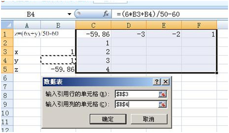

4）方案：

假设您具有三个预算方案：最坏情况、一般情况、最好情况。您可以使用方案管理器在同一工作表中创建这三个方案，

然后在各方案间切换。对于每个方案，您可以指定更改单元格以及用于该方案的值。当您在各方案之间切换时，

结果单元格会发生变化以反映变化的不同单元格值。


**双变量模拟运算表**

**示例1：求在不同的分期付款期数（月）和不同的月分期付款手续费率，每期（月）消费者需要付款的金额**

即：改变期数（月）和分期手续费率，求最终每期（月）付款金额。

**步骤1**：创建工作表。

建立基本的运算工作表，输入必要的数据及要测试的工作表中的数据。

**步骤2：创建运算公式**

双变量模拟运算中首先要在行、列交叉处所在的单元格输入运算公式。在本例中，在分期付款期数和月分期付款手续费率的交叉处，即D3单元格中输入公式 **“=PMT(B5,B7,B2)”****，**运算结果如图所示。

 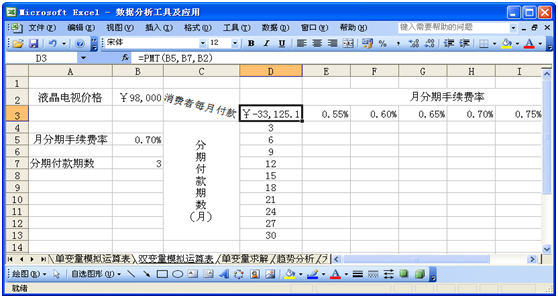

**步骤3：建立双变量模拟运算表**

首先要选定公式、数值序列和模拟运算结果所在的单元格区域，即D3:J13，以定义这个模拟运算表，然后选择“数据”菜单中的“模拟运算表”命令，打开“模拟运算表”对话框，在“输入引用行的单元格”中输入月分期手续费率所在的单元格“$B$5”，在“输入引用列的单元格”中输入分期付款期数所在的单元格“$B$7”，如图所示。最后单击“模拟运算表”对话框的“确定”按钮。

 


最终计算结果如下：

 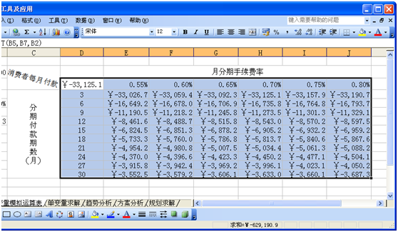

说明：给的数据中，收益最好的是F5=42.33%（9年4%的年利率）。


**示例2：投资改变年收益率和时间，求最终收益率。**

 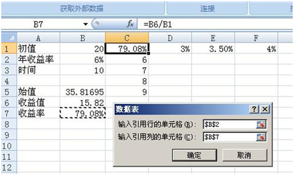

计算结果如下：

 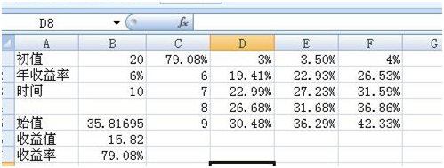

说明：给的数据中，收益最好的是F5=42.33%（9年4%的年利率）。


**分析2：线性回归分析**

**1、概述**

  EXCEL提供的规划求解工具，可求解出线性与非线性两种规划求解问题，规划求解问题常用于解决产品比例、人员调度、优化路线、调配材料等方面问题。

**2、规划求解问题的特点：**

* 问题有单一的目标，如求运输的最佳路线、求生产的最低成本、求产品的最大盈利，求产品周期的最短时间等。
* 问题有明确的不等式约束条件，例如生产材料不能超过库存，生产周期不能超过一个星期等。
* 问题有直接或间接影响约束条件的一组输入值。


**3、Excel规划求解问题的组成部分**

（1）一个或一组可变单元格

 可变单元格称为决策变量，一组决策变量代表一个规划求解的方案

（2）目标函数

目标函数表示规划求解要达到的最终目标，是规划求解的关键。它是规划求解中可变量的函数

（3）约束条件

约束条件是实现目标的限制条件。

   意义：通过规划求解，用户可为工作表的目标单元格中的公式找到一个优化值，规划求解将直接或间接与目标单元格公式相联系的一组单元格数值进行调整，最终在目标单元格公式中求得期望的结果。


**例1**：

**求解不等式：[见[**ch7**](第7章教学资料/ch7.xls)**.xls—规划求解不等式]

某工厂生产甲、乙两种产品，假设生产甲产品1吨，要消耗9吨煤，4千瓦电力，3吨钢材，获利0.7万元；生产乙产品1吨，要消耗4吨煤，5千瓦电力，10吨钢材，获利1.2万元。按计划国家能提供给该厂的煤为360吨，电力200千瓦，钢材300吨，问应该生产多少吨甲种产品和乙种产品，才能获得最大利润？

  假设生产甲种产品X1吨，生产乙种产品x2吨，

  **其最大利润是求=0.7x1+1.2x2****的最大值。这个问题可用数学建模如下：
$$
\begin{cases}9x_1+4x_2<=360 \\ 4x_1+5x_2<=200 \\ 3x_1+10x_2<=300 \\   x_1>=0,x_2>=0......
\end{cases}
$$


**规划求解如下：**

* B3和C3分别用于保存甲和乙产品的生产量。
* 目标单元格为B8；可变单元格为$B$3:$C$3；约束条件为：
* $B$3>=0
* $C$3>=0
* $B$4<=360
* $B$5<=200
* $B$6<=300


**规划求解第一步——**建立求解工作表(输入原始数据及相应的各公式)

**规划求解第二步——设置求解参数**
* 选择“工具” —“规划求解”菜单，设置以下求解的各项参数：
* 设置目标单元格：输入目标函数所在单元格(为总余额单元格)
* 设置目标：最大值、最小值或值的数值(最大利润,即最大值)
* 设置可变单元格：它的确定决定结果（为生产数量）
* 设置约束条件：单击“添加”按钮—输入约束条件—按添加—依次输入所有约束条件—确定

**规划求解第3步——保存求解结果**

在规划求解对话框中按“求解”—在规划求解结果对话框中按“保存规划求解结果”


**分析3：计算相关系数**

**操作步骤**

1.打开原始数据表格，制作本实例的原始数据需要满足两组或两组以上的数据，结果将给出其中任意两项的相关系数。

2.选择“工具”-“数据分析”-“描述统计”后，出现属性设置框，依次选择:

输入区域:选择数据区域，注意需要满足至少两组数据。如果有数据标志，

注意同时勾选下方“标志位于第一行”；

分组方式:指示输入区域中的数据是按行还是按列考虑，请根据原数据格式选择；

输出区域能选择本表、新工作表组或是新工作簿；

3.点击“确定”即可看到生成的报表。


**分析4：统计分析**

Excel的分析工具库提供了3种统计观测分析工具：指数平滑分析、移动平均分析和回归分析。


**分析5：曲线拟合之线性/指数/多项式**

1)    把实验数据输入excel中，两个变量的最好做成两个竖排。选中所有数据，注意不要把文字也选上了。

2)    在菜单栏中点“插入”，然后选择“散点图”下面的下拉菜单。

3)    从菜单中选择自己需要的类型，一般选择既有数据点，又有平滑曲线的散点图。就能得到平滑曲线。

4)    点击一个点，会选中所有数据点，然后点右键，在弹出的菜单中选择“添加趋势线”。 在这里可以选择需要你和的曲线类型，如线性，指数，幂，对数，多项式。。选择多项式。再把下面的“显示公式”，“显示R平方”的复选框里打√，就能得到需要的曲线，公式，和相对误差。(**相对误差**的值在0~1，值越大拟合越合理)


### EXCEL使用小技巧

* 图表混合：如柱形和拆线图的混合
* 选择性粘贴：应用例子如行列转置、对行列进行四则运算、单元格文本转化成数字
* 表格冻结：当行或者列太长时，可指定首几行或列不动，便以浏览。
* 删除尾部多余空行：法1：指定列过滤，选择空白，将过滤后的空行隐藏；法2：选择要删除的空行起始行，按ctrl+shift+向下箭头，右键“删除”。

1) 柱线图和折线（线形）图的混合

首先，选取数据范围。插入，柱形图。
 其次，在图标内，选择要变换成线性的数据，变更图表类型，改成线性。
 然后，看看有没有必要更改坐标，必要的话把线形图的坐标改成次坐标轴


**2)** 建立分类下拉列表填充项

要将企业的名称输入到表格中，为了保持名称的一致性，利用“数据有效性”功能建了一个分类下拉列表。


3) 行列转置（**也可以对整行整列数据进行四则运算**）

  首先选中数据区域(即需要实现行列转置的数据区域)，然后点右键，执行“复制”；

 其次选择一个没有数据的区域单元格(这里是放新数据的地方)，点右键，执行“选择性粘贴”，这个时候，会弹出如下的对话框。

 只需要在“选择性粘贴”对话框中把“**转置**”前面的复选框√选就行了，之后点击确定。

**拓展：**选择某个数据复制，然后选中区域单元格右键“选择性粘贴“，勾选相应的四则运算符，即可得到四则运算后的新数据。“选择性粘贴”功能也可将单元格文本转换成数字，便以排序。过程是：将上述某个数据改为空行，然后选择性粘贴过程同样。


4) 指定行列不移动

把鼠标放在需要冻结的行列下面一行，选择视图－冻结窗格。这个功能在数据量多的时候很有用。


## 5.3  Python

依赖库：scipy

### 排列组合问题

```python
In [2]: from scipy.special import perm, comb
In [3]: print(perm(3,2), comb(3,2))
(6.0, 3.0)

In [7]: from itertools import permutations, combinations
In [8]: list(permutations(['a','b','c'],2))
Out[8]: [('a', 'b'), ('a', 'c'), ('b', 'a'), ('b', 'c'), ('c', 'a'), ('c', 'b')]
```


**生日问题**

问题描述：N位客人参加一个聚会，这N位客人中至少有二人生日在同一天的概率p是多少？

公式： p= $ (365^n-365*364...*(365-n+1))/365^n$

```python
from functools import reduce

def calc_n(n):
    tn = 365**n
    def multi(x,y): return x*y
    cn=reduce(multi, range(365,365-n, -1))
    return (tn-cn)/tn

In [40]: calc_n(10)
Out[40]: 0.11694817771107766

In [41]: calc_n(20)
Out[41]: 0.41143838358058

In [42]: print(calc_n(30), calc_n(40))
0.7063162427192686 0.891231809817949
```


## 5.4 常用数学工具

### Mathematica


### Lindo


###  Stata


<br>

## 本章参考

[1].  用Excel计算相关系数和进行回归分析http://wenku.baidu.com/view/606c6e67ddccda38376baf53.html?re=view

[2].  Excel假设分析

http://wenku.baidu.com/link?url=ppQ-upYAlZh3-IWrxz7MeSkVTeWhNaibft21ScV8KWrvhKIMzBpCfIyk795GIEFCHJMF2OQkXAuCu3X56_LoiGW8A7u87J6s04h4iW0Xw0G

[3].  excel曲线拟合怎么弄 http://jingyan.baidu.com/article/59a015e3accd13f7948865a9.html

<br><br>

# 6 数学的实践（应用篇）

## 6.1  生活中的数学

**数论**：人们最先接触到的数学就是代数学。实数用来计数。从0到有理数，再到无理数的发现过程，是数学学科的一个巨大突破点。数论的发展伴随着三次数学危机的解决。

**平面几何/空间解析几何**：几何是人们最早接触到的数学分支，重要性仅次于代数。计算日常生活中物品面积、体积。在建筑学中广泛使用。16世纪，[笛卡尔](http://baike.baidu.com/subview/4704/11215044.htm)创立了解析几何（重要标志是引入了坐标X-Y轴），将代数和几何联系起来的。

**数理逻辑**：更多属于逻辑学的范畴，三段论。


## 6.2  数学公式的图形化

### 6.2.1  基本初等函数

* 函数的五个要素：自变量，因变量，定义域，值域，对应法则

* 函数的四种特性：有界限，单调性，奇偶性，周期性

基本初等函数包括幂函数、指数函数、对数函数和8个正反三角函数。

表格 16 基本初等函数列表

| 函数名称          | 定义与公式              | 主要性质                                                     |
| ----------------- | ----------------------- | ------------------------------------------------------------ |
| 幂函数            | $y=x^a(a为实数)$        | 单调性：若a>0,函数在     内单调增加； 若a<0,函数在     内单调减少。 |
| 指数函数          | $y=a^x(a>0, a!=1)$      | 与对数函数互为反函数，图形过（0，1）点。  **典型：**y=ex  (a=e) |
| 对数函数          | $y=log_xa$ 或 log(a, x) | 与指数函数互为反函数，图形过（1，0）点  。<br>典型：log(10, x)=lgx,  log(e, x)=Inx |
| 正弦/余弦三角函数 | y=sin(x) / y=cos(x)     |                                                              |
| 正切/余切三角函数 | y=tg(x) / y=ctg(x)      |                                                              |
| 反正弦/反余弦     | y=arcsin(x) / arccos    |                                                              |
| 反正切/反余切     | y=arctan(x)  /          |                                                              |

备注：指数函数和对数函数互为反函数。


1）幂函数    $y=x^a (a为实数) $

  .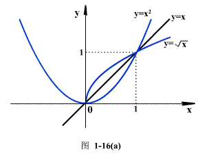


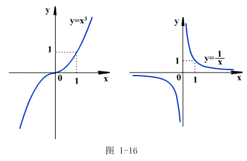

2）指数函数   $y=a^x (a>=0, a!=1)$

主要性质：与对数函数互为反函数，图形过（0，1）点，直线y=0为函数图形的水平渐近线。

**典型：**

 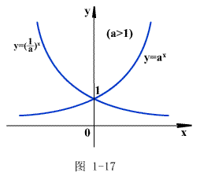


3）对数函数   $y=\log_xa$

主要性质：与指数函数互为反函数，图形过（1，0）点，直线x=0为函数图形的铅直渐近线。

**典型：**   e=2.7182……，无理数 经常用到以e为底的对数

   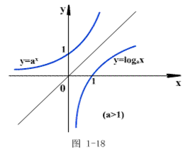


4）三角函数、反三角函数

三角函数包括正弦（图1-19(a)）、余弦（图1-19(b)）、正切（图1-20(a)）、余切（图1-20(b)）。

反三角函数包括反正弦（图1-21）、反余弦、反正切（图1-22）、反余切。


 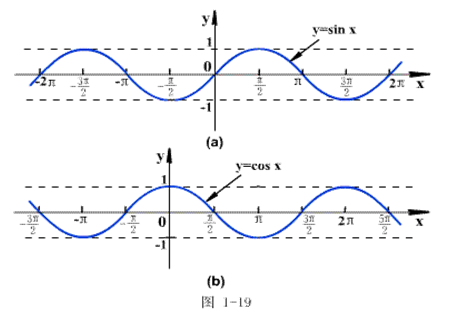


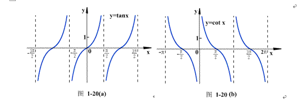

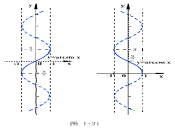

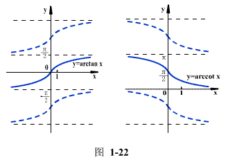

### 6.2.2  概率分布的曲线

表格 17 概率分布的曲线及其数据特征列表

| 分布曲线     | 分布曲线                                                  | 图形特点                                                     | 性质/数据特点                                                | 应用示例                                         |
| ------------ | --------------------------------------------------------- | ------------------------------------------------------------ | ------------------------------------------------------------ | ------------------------------------------------ |
| 二项分布     | 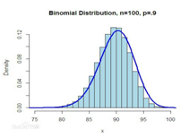 |                                                              | 当n=1时，二项分布就是伯努利分布。                            |                                                  |
| 正态分布     | 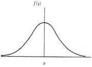 | 正态曲线呈钟型(也叫钟形曲线)，<br>两头低，中间高，左右对称，。 | 在平均数两侧呈对称分布，即大部分集中在平均数附近。<br>N（μ平均数, σ标准差）。 | 比如年龄分布。                                   |
| 标准正态分布 | 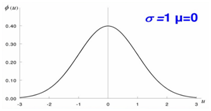 | 又叫μ分布，对称轴为Y轴。平均数为0，标准为1                   | N(μ，σ^2)=N(0, 1)                                            | 家畜的体长、体重、产奶量                         |
| 指数分布     | 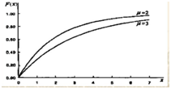 |                                                              | 可以用来表示独立随机事件发生的时间间隔。                     | 旅客进机场的时间间隔                             |
| t分布        | 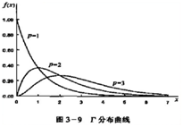 |                                                              |                                                              |                                                  |
| 几何分布     | 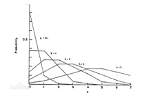 |                                                              | 期望，方差                                                   |                                                  |
| 柏松分布     |                                                           |                                                              | 描述单位时间内随机事件发生的次数。                           | 某电话交换台收到的呼叫、来到某公共汽车站的乘客、 |
| 卡方         |                                                           |                                                              |                                                              |                                                  |
| F            |                                                           |                                                              |                                                              |                                                  |
| 抽样         |                                                           |                                                              |                                                              |                                                  |

备注：分布曲线指分布密度函数的图像，如正态分布密度函数的图像称为正态曲线。

1. 二项分布：在n次独立重复的[伯努利试验](https://baike.baidu.com/item/伯努利试验/238488)中，设每次试验中事件A发生的[概率](https://baike.baidu.com/item/概率/828845)为p。用X表示[n重伯努利试验](https://baike.baidu.com/item/n重伯努利试验/238667)中事件A发生的次数，则X的可能取值为0，1，…，n,且对每一个k（0≤k≤n）,事件{X=k}即为“n次试验中事件A恰好发生k次”，[随机变量](https://baike.baidu.com/item/随机变量/828980)X的离散概率分布即为二项分布（Binomial Distribution）。


## 6.3  如何形象地的理解数学概念（先验的、直觉）

近代科学判断一个**概念**是否有用，或者一个现象是否“科学上存在”，其标准是要看能否观测它（至少在原理上），或能否转为可观测的事实。比如下面章节中“极限”的精准定义要求是严谨的、可验证的。

数学概念是经过高度抽象后形成的。要理解数学，就要把抽象的概念直觉化，成为一种思考本能。


**微积分**：导数是切线的斜率；定积分是求面积。

**线性代数**：


### 6.3.1  极限和连续性的精准定义

**序列an**的极限定义：an->a，当n->∞，即  .

如果对于每个无论多么小的正数€，都能找到整数N(依赖于€)，使得对于满足不等式n>=N的所有的n，都有

​    | an – a | < €，

就说序列an 当n趋于无穷时有极限a。

说明：极限就比如是A, B竞赛，A提出要有一个边界€，B则提出依赖于€的N的存在。


**连续趋近函数f(x)**的极限定义（柯西定义，1820）：

如果对于任意一个无论多么小的正数€，都能找到正数  （依赖于€），使得对满足不等式

​    | x – x1 | <

的所有不等于x1的x，有

| f(x) – a | < € ,

那么说，函数f(x)在x趋近于x1时有权限a。

说明：通过双重边界（€，  ）来定义极限。

当x->∞时，  ,　这个定义类似序列极限。


**连续性**的判别准则：如果x趋于x1时，函数f(x)趋近于f(x1)，以f(x1)为权限，那么就说函数f(x)在点x=x1是连续的。


## 6.4  赌博与概率

赌博本来就是概率的游戏。17世纪，法国贵族德·梅勒在骰子赌博中，有急事必须中途停止赌博。双方各出的30个金币的赌资要靠对胜负的预测进行分配，但不知用什么样的比例分配才算合理。德·梅勒写信向当时法国最具声望的数学家帕斯卡请教。这引起了帕斯卡和大数学家费马的兴趣，他们通过信件交流，提出了一些概率论的原理，从而创立了概率论。


### 6.4.1  彩票

比如买2元彩票中奖，不中（中奖0元）的概率是90%，中奖5元的概率是9%，中奖100元的概率是0.99%，中奖1000元的概率是0.001%。如果我进行无数次尝试，那最后平均下来我能中奖的综合回报就是`0*90% + 5*9% + 100*0.99% + 1000*0.01%`=1.54元

这1.54就是叫做数学期望，当期望大于投入的时候，这个事情就可以做，当期望小于投入的时候，长期来看，这个事情就不值得投资。

我们在这里看到，投入2元，回报只有1.54元。所以对于大部分人来讲长期买彩票必然是亏的，当然我这里算出的1.54只是我为了简单计算随便例举的，真是的肯定不是1.54，但肯定比2小。

这也就是我们笑称彩票叫“智商税”的原因，聪明人不会沉迷彩票。


表格 中国大陆官方发行的彩票（部分）

| 类别     | 名称          | 出现时间 | 玩法规则                                                     | 排列组合ilm数 |
| -------- | ------------- | -------- | ------------------------------------------------------------ | ------------- |
| 数字     | 双色球        | 2009     | [中国福利彩票双色球游戏规则](https://bbs.360.cn/forum.php?mod=viewthread&tid=2439498&archive_src=bbs_safe) | 17721088      |
|          | 七乐彩(30选7) | 2002     | [中国福利彩票七乐彩游戏规则](https://bbs.360.cn/forum.php?mod=viewthread&tid=2420011&archive_src=bbs_safe) | 2035800       |
|          | 大乐透        | 2019     | [中国体育彩票超级大乐透游戏规则](https://bbs.360.cn/thread-15685996-1-1.html) | 21425712      |
|          | 排列三        | 2009     | [中国体育彩票排列三游戏规则](https://bbs.360.cn/forum.php?mod=viewthread&tid=2244512&archive_src=bbs_safe) | 1000          |
|          | 37选7         |          |                                                              | 10295472      |
| 竞彩足球 | 14场胜负      |          |                                                              |               |
|          | 任意9场       |          |                                                              |               |
|          | 6场半全场     |          |                                                              |               |
|          | 4场进球       |          |                                                              |               |

说明： 排列组合数指所有可能的中奖组合的排列组合数加起来，中头奖概率=1/排列组合数

* 发行组织：中国福利彩票发行管理中心(以下简称中福彩中心)

* 销售渠道：一般线上或门店全国销售，也有部门是省市自行组织销售的。

* 每注价格：一般2元

* 奖项：分高项奖和低项奖。高项奖浮动额度，将奖金比例分配，低项奖固定额度。高项奖一般是一到三等奖。

* 高项奖额的计算公式：`[(当期销售总额*总奖金比例)-低项奖奖金总额]*单项奖比例`

* 当期返回奖金：一般是销售额的50%，其中1%作为调节基金。但因为单注最高奖金额的限制，实际返回奖金低于50%，一般在40%左右。


**彩票模型评价**

通过调整高等奖的中奖比例等措施，激发彩民的购买欲望，在销售额和返奖率之间平衡，以达到最大的销售利润（=销售额*(1-实际返奖率））。 可参见  2002年全国大学生数学建模竞争《[彩票中的数学规律](https://www.docin.com/p-54065232.html)》

通过主成分分析法PCA，得到彩票模型重要的几个特征（备注：双色球方案不在这个模型考虑内）：

* 总中奖率：应该大于3%。双色球是6.7%。
* 低项奖的奖金分配率：应大于35%。
* 一等奖的奖金分配率：宜不超过50%。
* 号码数量：不要超过31
* 奖项数：可以多些。


#### 彩票-双色球

题目类型：二类不重复球取值的概率统计

**玩法规则**：投注者须先从33个红球号码中选择6个，再从16个蓝球号码中选择1个组成一注（红球号码1-33，蓝球号码1-16）。 详见 [中国福利彩票双色球游戏规则](https://bbs.360.cn/forum.php?mod=viewthread&tid=2439498&archive_src=bbs_safe)

**原理**：分类计数和分步计数综合考虑，排列组合同时出现时按先选再排的原则。

首先列出所有中奖的类别，然后分别计算每个类别的组合数，最后所有类别的组合数加起来即组合总数。计算每个类别时，采用分步计算，第一步算红球时的组合数（这步因为红球多个，又分二步计算），第二步算蓝球时的组合数，再加各步骤相乘。

组合总数：17721088

* 公式   $$C_{33}^6*C_{11}^1$$或者  C(33, 6)*C(16,1)
* EXCEL:  `=combin(33,6)*combin(16,1)`

单个类别的计算公式：

法1： 按蓝球是否中二分条件（0或1）拆分

* 红球中n个，蓝球中1个： $C_6^n*C_{27}^{6-n}*1$
* 红球中n个，蓝球不中： $C_6^n*C_{27}^{6-n}*15$

 法2： 红球中n个，蓝球中m个(n<=6, m<=1)： $C_6^n*C_{27}^{6-n}*C_1^m*C_{15}^{1-m}$


表格 双色球中奖概率

| 奖项分类 | 中奖数目<br>（红球数+蓝球数） | 中奖组合数               | 中奖概率      | 中奖额    |
| -------- | ----------------------------- | ---------------------------- | ------------- | --------- |
| 一等奖   | 6+1                           | $C_6^6*C_{27}^0*C_1^1$=1 | 1/17721088=<BR>0.00000005643 | 约500万 |
| 二等奖   | 6+0                           | $C_6^6*C_{27}^0*C_{15}^1$=15 | 0.00000084645 | 约20-35万 |
| 三等奖   | 5+1                           |  $C_6^5*C_{27}^1*C_1^1$=162   | 0.00000914165 | 3000元    |
| 四等奖   | 5+0                           |  $C_6^5*C_{27}^1*C_{15}^1$=2430  | 0.00013712476 | 200元     |
|          | 4+1                           |  $C_6^4*C_{27}^2*C_{1}^1$=5265  | 0.00029710365 | 200元     |
| 五等奖   | 4+0                           | $C_6^4*C_{27}^2*C_{15}^1$=78975 | 0.00445655481 | 10元      |
|          | 3+1                           |  $C_6^3*C_{27}^3*C_1^1$=58500  | 0.00330115171 | 10元    |
| 六等奖 | 2+1                           |  $C_6^2*C_{27}^4*1$=263250  | 0.01485518271 | 5元       |
|          | 1+1                           |  $C_6^1*C_{27}^5*1$=484380  | 0.02733353618 | 5元       |
|          | 0+1                           | $C_6^0*C_{27}^6*1$=296010 | 0.01670382767 | 5元       |
| 小 计    |                          |                              | 0.067 |           |
| 无奖项   | 3+0                           | $C_6^3*C_{27}^3*15$=877500 | 0.04951727569 | 0         |
| | 2+0      | $C_6^2*C_{27}^4*15$=3948750 | 0.22282774060                | 0 |
| | 1+0      | $C_6^1*C_{27}^5*15$=7265700 | 0.41000304270                | 0 |
| | 0+0      | $C_6^0*C_{27}^6*15$=4440150 | 0.25055741498                | 0 |
| 小 计    |                         |                              | 0.9329 |           |

>  计算每个中奖类别的奖金总额（中奖额*中奖数），累加最终得到的就是预期收益。当销售收入大于预期收入，就是利润了。

双色球各个奖项的中奖概率：

一等奖1种可能性，概率为1/17,721,088；

二等奖15种可能性，概率约为1/1,181,406；

三等奖162种可能性，概率约为1/109,389；

四等奖7,695种可能性，概率约为1/2,303；

五等奖137,475种可能性，概率约为1/129；

六等奖1,043,640种可能性，概率约为1/16；

总中奖概率约为1/16。


**开奖结果示例**

双色球 第*2021070*期

开奖时间： 2021-06-24 (星期四)   每周二、四、日 21:20开奖

- 投注总额：*356,032,100* 元
- 奖池累计：**840,734,349** 元(目前奖池至少可开出168注500万大奖)

| 奖项   | 中奖条件    | 全国中奖注数 | 每注奖金  | 奖金额      |
| ------ | ----------- | ------------ | --------- | ----------- |
| 一等奖 | 6+1         | 6            | 8,972,728 | 53,836,368  |
| 二等奖 | 6+0         | 179          | 166,455   | 29,795,445  |
| 三等奖 | 5+1         | 980          | 3,000     | 2,940,000   |
| 四等奖 | 5+0/4+1     | 53,848       | 200       | 10,769,600  |
| 五等奖 | 4+0/3+1     | 1,106,832    | 10        | 11,068,320  |
| 六等奖 | 2+1/1+1/0+1 | 6,099,191    | 5         | 30,495,955  |
| 合计   |             | 7,261,036    |           | 138,905,688 |

> 说明：彩票法第十八、十九条： 据国家有关规定，“双色球”彩票单注奖金封顶的最高限额为500万元，但本期却接近900万元，因此超出部分会计入下一期奖池，这造成了奖池额越来越大。
>
> 本期返奖率=`138,905,688/356,032,100=39.01%`


#### 彩票-大乐透

题目类型：二类不重复球取值的概率统计

**玩法规则**：超级大乐透基本投注是指从前区号码中任选5个号码，并从后区号码中任选2个号码的组合进行投注。其中，前区号码由01—35共35个号码组成，后区号码由01—12共12个号码组成。 详见 [[中国体育彩票超级大乐透游戏规则](https://bbs.360.cn/thread-15685996-1-1.html)](https://bbs.360.cn/forum.php?mod=viewthread&tid=2439498&archive_src=bbs_safe)

**原理**：分类计数和分步计数综合考虑，排列组合同时出现时按先选再排的原则。

首先列出所有中奖的类别，然后分别计算每个类别的组合数，最后所有类别的组合数加起来即组合总数。计算每个类别时，采用分步计算，第一步算前区时的组合数（这步因为取多个，又分二步计算），第二步算后区时的组合数（这步因为取多个，又分二步计算），再加各步骤相乘。

组合总数：$C_{35}^5*C_{12}^2$=21425712

单个类别的计算公式：

* 前区中n个，后区中m个(n<=5, m<=2)： $C_5^n*C_{30}^{5-n}*C_2^m*C_{10}^{2-m}$


表格 大乐透中奖概率

| 奖项分类 | 中奖条件 | 中奖组合数                              | 中奖概率   | 中奖额   |
| -------- | -------- | --------------------------------------- | ---------- | -------- |
| 一等奖   | 5+2      | 1                                       | 1/21425712 | 约1000万 |
| 二等奖   | 5+1      | $C_5^5*C_{30}^0*C_{2}^1*C_{10}^1$=20    |            | 约10万   |
| 三等奖   | 5+0      | $C_5^5*C_{30}^0*C_{2}^0*C_{10}^2$=45    |            | 10000元  |
| 四等奖   | 4+2      | $C_5^4*C_{30}^1*C_{2}^2*C_{10}^0$=150   |            | 3000元   |
| 五等奖   | 4+1      | $C_5^4*C_{30}^1*C_{2}^1*C_{10}^1$=3000  |            | 300元    |
| 六等奖   | 3+2      | $C_5^3*C_{30}^2*C_{2}^2*C_{10}^0$=4350  |            | 200元    |
| 七等奖   | 4+0      | $C_5^4*C_{30}^1*C_{2}^0*C_{10}^2$=6750  |            | 100元    |
| 八等奖   | 3+1      | $C_5^3*C_{30}^2*C_{2}^1*C_{10}^1$=87000 |            | 15元     |
|          | 2+2      | $C_5^2*C_{30}^3*C_{2}^2*C_{10}^0$=40600 |            | 15元     |
| 九等奖   | 3+0      |                                         |            | 5元      |
|          | 2+1      |                                         |            | 5元      |
|          | 1+2      |                                         |            | 5元      |
|          | 0+2      |                                         |            | 5元      |
| 小 计    |          |                                         |            |          |
| 无奖项   | 2+0      |                                         |            | 0        |
|          | 1+1      |                                         |            | 0        |
|          | 1+0      |                                         |            | 0        |
|          | 0+0      |                                         |            | 0        |
| 小 计    |          |                                         |            |          |


#### 竞彩足球

**规则**：赛果以全场90分钟（含伤停补时，不含加时赛及点球）为准，返奖率最高73%

概率 = 投注返还率/赔率

返还率（用D表示），胜，平，负的赔率分别用A，B，C表示

`D = A*B*C/(A*B+B*C+A*C)`

比如，某场比赛的胜比负赔率分别是2.1, 3.1, 3.1，那么返还率就是：

`D =2.1*3.1*3.1 / (2.1*3.1+3.1*3.1+2.1*3.1) = 89.178`


#### 彩球抽奖问题

问题描述：袋子里N种颜色的球，每种颜色的球都是M个，从中抽取Z个(Z<N)。

或者 袋子里分别写着0-9十个数字，每个数字M个球。从中抽取Z个(Z<N)，抽完的不放回去。请问抽中两个、三个、四个相同数字球的概率分别是多大?

【**例1**】： 一个不透明盒子里有56个球，其中有6个球为彩球，一次从中抽6个球。问：抽到0到6个彩球的概率分别是多少？

解答：从56个球中抽6个球的组合是$C_{56}^6$=32468436。分步计算，先从6个彩球中抽取N个（N<6)，再从余下的50个球中抽取（6-N个）。下面计算抽N个彩球的组合数，计算出来的组合数除以 32468436 就是相应的概率。

分项组合数计算公式： $C_6^n*C_{50}^{6-n}$

抽中N个彩球的组合数是：（下列七种组合数相加 等于 总组合数）

0个彩球： $C_6^0*C_{50}^6$=15890700

1个彩球： $C_6^1*C_{50}^5$=12712560

2个彩球： $C_6^2*C_{50}^4$=3454500

3个彩球： $C_6^3*C_{50}^3$=392000

4个彩球： $C_6^4*C_{50}^2$=18375

5个彩球： $C_6^5*C_{50}^1$=300

6个彩球： $C_6^6*C_{50}^0$=1


【**例2**】50个球，分别写着0-9十个数字，每个数字5个球。抽奖为抽取5个球，抽完的不放回去。请问，抽中两个、三个、四个相同数字球的概率分别是多大?

解答：分步计算，10个数字即10类。第一步选类，从10个数字中选择一个数字，有10种；然后在相同数字的5个球中选抽中数N=C(5, N)。第二步再从余下的9类数字中抽取5-N类，每类有~~10~~种方法，那么有10^(5-N)。计算抽N个相同数字的组合数，计算出来的组合数除以 总组合数就是相应的概率。

总组合数：$C_{50}^5$=2118760

分项组合数计算公式： $C_{10}^1*C_5^N*C_9^{5-N}*5^{5-N}$     (1<N<=5)

分项的概率= 分项组合数/总组合数。

抽中N个相同数字的组合数是：（10个数字球，每个数字5个球，抽取5个）

1个相同数字（即没有相同数字，为5个不同数字）： $C_{10}^5*A_5^5$=~~30240~~

2个相同数字： $C_{10}^1*C_5^2*C_{9}^3*5^3$=1050000（~~计算有误，比总组合数还大？~~）

3个相同数字： $C_{10}^1*C_5^3*C_{9}^2*5^2$=90000

4个相同数字： $C_{10}^1*C_5^4*C_{9}^1*5$=2250

5个相同数字： $C_{10}^1*C_5^5$=10


【**例3**】有6种不同颜色的球，分别记为1,2,3,4,5,6，每种球有无数个。现在取5个球，求抽到5种、4种、3种、2种不同颜色的球的分别概率？

解答：既然每种颜色的球都是无数的话，就相当于有6个不同颜色的球，拿了之后再放回去，一个道理啦！所有可能可能组合是6^5=7776

5种颜色：先选5个颜色,那就是C(6,5),那么考虑到任意选择顺序,p(5,5) = 5!,结果是C(6,5) * P(5,5) = 720;

4种颜色：先选4个颜色,那就是C(6,4),那么肯定会有重复颜色，挑出重复颜色是C(4,1).考虑到任意拿球顺序是P(5,5),去掉重复的是2!.结果是 C(6,4)*C(4,1)*5!/2!=3600.

3种颜色：先选3个颜色，那就是C(6,3),那么重复颜色是两种可能，比如abccc和abbcc，前者是C(3,1)*5!/3!,后者是C(3,2)*5!/2!/2!,结果是 C(6,3)*(C(3,1)*5!/3!+C(3,2)*5!/2!/2!)=3000.

2种颜色：一种是abbbb,一种是aabbb.前者是C(2,1) * 5!,后者是C(2,1)*5!/2!/3!.结果是C(6,2)*(C(2,1)*5!/4!+C(2,1)*5!/2!/3!)=450.

1种颜色：C(6,1)=6

| 条件    | 公式                                    | 排列组合数 | 逻辑                                                         |
| ------- | --------------------------------------- | ---------- | ------------------------------------------------------------ |
| 5种颜色 | `C(6,5)*P(5,5)`                         | 720        | 先选5个颜色C(6,5)，再考虑5个球的选择顺序P(5,5)               |
| 4种颜色 | `C(6,4)*C(4,1)*5!/2!`                   | 3600       | 先选4个颜色C(6,4)，再挑出重复颜色C(4,1), <BR>再考虑5个球的选择顺序P(5,5), 去掉重复结果2! |
| 3种颜色 | `C(6,3)*(C(3,1)*5!/3!+C(3,2)*5!/2!/2!)` | 3000       | 先选3个颜色C(6,3)，再挑出重复颜色有2种可能abccc或者abbcc, <BR>再考虑5个球的选择顺序P(5,5), 去掉重复结果 |
| 2种颜色 | `C(6,2)*(C(2,1)*5!/4!+C(2,1)*5!/2!/3!)` | 450        | 先选2个颜色C(6,2)，再挑出重复颜色有2种可能abbbb或者aabbb,    |
| 1种颜色 | C(6,1)                                  | 6          |                                                              |
| 小计    |                                         | 7776       | 各组合数之和等于总组合数，逻辑正确。                         |


### 6.4.2  稳赚不赔的赌场

**关于风险**

风险分成三类风险，

第一种是**系统型风险**，就是有时候会发生小概率的坏事，而作者指出，其实赚钱也来自于这种风险，叫做“盈亏同源”，这种风险不可避免，避免了这种也就避免了盈利。

第二种风险被称为**人为型风险**，就是在一些情况下我们不能保持冷静而做出的非理性选择，人为踏入了一些风险场合。风险做得好的，就是把这种控制得很好。

第三种风险叫做 **博弈型风险**，就是在和别人对手盘的时候，对方利用一些有利条件，给你制造的风险，比如我们玩扎金花的时候，有人会有“偷鸡”的玩法。也比如在股市上，有机构想要上涨之前，先往下杀价格，引起散户恐慌抛盘，已达到在低位拿筹码的目的。这些都属于博弈型风险，好的风险控制者，是反而可以利用这种情况的博弈。

在这个赌场里面，玩家始终和庄家对赌，而庄家不会有人为动作，所以博弈风险是不存在的。庄家在规则的设定上对它有利，而我们的优势是有主动权。


#### 21点：赌场里最可能赢钱的游戏

21 点（Blackjack）是赌场里最可能赢钱的游戏，也是那里唯一相对公平的游戏，在采取最佳玩法的情况下，玩家胜率高达 49%。不过要想长期赢钱，这 2% 的劣势也无法容忍，高端赌徒们会用变换赌注或者团体作战的方法把这一点劣势扳回来。

**21点的玩法**

这个游戏分庄、玩两方，通常庄家在一张半圆形的牌桌上同时应付各自为战的 5 到 7 个玩家，道具就是多副除去大小鬼混在一起的扑克牌。玩家的目标是让自己牌的点数和大于庄家，不过这个和如果超过 21 点就直接出局了（也就是爆了）。花牌算 10 点，A可以根据需要算成 11 分或 1 分。


#### 德州扑克

德州扑克的玩法：


#### 摇骰子，买大小

买大小的玩法：摇骰子有买大、小、豹子三种可能，有三个骰子，点数4-10为小，11-17为大，而三个骰子都是一样的数既不是大也不是小。买大或者小1赔1，买豹子1赔6。


### 6.4.3  抛硬币的游戏（凯利公式）

在抛硬币的游戏中，从古至今似乎有一种魔力吸引了无数的高智商群体对其研究痴迷，流传至今主流的策略概况有二：等价鞅策略与反等价鞅策略。

* 等价鞅策略：输了将赌注翻倍直到赢为止，赢了将赌注恢复至初始值；

* 反等价鞅策略：总是按现有资金总额的一定比例下注。

等价鞅策略致命的弱点是博弈者在连续若干次失败后将没有足够资金继续赌注翻倍的游戏，因为赌注会随着失败次数呈2次方的速度增长，而反等价鞅策略汲取“日取其半，万世不竭”的道理，使得我们能够永远的继续这个游戏下去，哪怕成为百万富翁的概率多么小，也是会成功的，而一旦游戏触及我们的“止盈”条件，就可以终止游戏，所以今天，我们就想来谈谈反等价鞅策略中的著名公式。

假设您有100美金进行一项抛硬币游戏——如果硬币为正面，您1美元就赢2美元；如果硬币为反面，您就输1美元。您每次该投入本金的百分之多少来获得收益的最大化呢？

凯利公式告诉您：25%。

那么，凯利公式（Kellyformula）究竟是什么？

$$
f* = \frac{bp-q}{b} = \frac{p(b+1)-1}{b}
$$


* f*=现有资金应进行下次投注的比例（也就是我们刚才要求的答案）
* b=赔率（赔率＝期望盈利÷可能亏损=2美元盈利÷1美元亏损，赔率就是2了）
* p=成功概率（抛硬币正反面都是50%的概率）
* q=失败概率（也就是1-p，赌局中也是50%了）

以上面游戏为例计算过程就是 `(bp-q)÷b=(2*50%-50%)÷2=25%`


从公式我们可以获得我们投资的一点启发：

1、只有出现赢面（bp-q）为正的时候，游戏才可以下注，这是一切赌戏和投资最基本的道理，也就是前面讲的“没有把握，决不下注”。

2、赢面还要除以“b”才是投注资金比例。也就是说赢面相同的情况下，赔率越小越可以多押注。


### 6.4.4  大话骰

首先核实一下游戏规则：
假设两个人玩，

* 每人的杯中有5个骰子，双方摇好后只可看到自己杯中所有骰子的点数。
*  一方先猜两个人杯中一共有N个T点，其中N 取1到10间的一个整数，T 是1到6之间的整数。
* 这时对方有两种选择：
    - 不相信10个骰子中有N个T或大于N个T点，此时双方摊牌（掀杯），输赢自见分晓。
    - 猜10个骰子中有多余N个T，比如说N+1或N+2个T；也可以猜有N个更大的点数，比如说N个T+1点或N个N+2点。原则是新猜的N和T都不能比对方上一次猜得小。

      - 1点可以当任意点使用，比如五个骰子的点数是1，2，2，3，4，则可以说有三个2点，二个4点。

      - 如果第一个猜骰子从1点开始猜起，即开始就猜共有N个1点，那么上一条规则作废，即在此轮游戏中，1点不再可以当任意点使用。


双方摇好骰子后，既然你知道自己杯中的点数，而猜的是两人杯中某个点数出现次数之和，所以游戏中只要了解对方杯中的5个骰子每点出现的概率。

随机的情况下，五个骰子中只有一个骰子是1点的概率是多少呢？


### 6.4.5  简易小赌博

#### 三张卡片的骗局

我们先准备有三张卡片，1号卡片正反面都是黑色，2号卡片正反面都是红色，3号卡片一面是黑色，一面是红色。然后把卡片放进一个盒子里，摇一摇，让对手抽一张平放在桌子上。接着和他赌反面的颜色和正面一样。这个赌局看起来是公平的，比如抽到一张表面是黑色的卡片，那么卡片不是1号就是3号，反面的颜色不是黑色就是红色，直觉上概率各占1/2。


事实上我们赢的概率不是1/2，而是2/3，这个赌局最迷惑人的地方是卡片的“两面性”。玩家抽的不是3张牌，而是6个面：3个黑面，3个红面。我们把这6个面编上号A、B、C、D、E、F：

当玩家抽到黑面时，也就是A、C、D三种等可能的情况，它们的背面则分别是D、F、A，黑色的情形占了2/3。


这个问题最早于1889年由法国数学家伯特纳（Joseph Louis François Bertrand）提出，因为这个问题的结果出人意料，它又被称为“伯特纳箱悖论（Bertrand's box paradox）”。1950年美国数学家沃伦•韦弗（Warren Weaver）介绍了上面的卡片玩法，马丁•加德纳（Martin Gardner）称之为“三张卡片的骗局（three-card swindle）”。


#### 如此不平凡的黑桃A

备注：桥牌去除大小王共52张，每人13张，有4种花色（黑桃、红心、方块、红桃）。

有时候我们赌博一开始会放水，先让别人赚些小钱，放长线钓大鱼，最后来个一网打尽。下面就是一个绝佳的范例。四个人在打桥牌，我先说：“来打个赌吧，我现在有一张A，你们猜猜我还有没有更多A？”这种情况下你很可能会输，这时你在心里默默指定一个花色的A，比如说黑桃A，当某一轮抓到一张黑桃A后，这时机会就来了：“再打一个赌吧，我现在有一张黑桃A，你们猜猜我还有没有更多的A？”


很多人肯定觉得两个赌根本没什么不同的嘛，加了个黑桃并不要紧。可它们间的区别，大到令人不敢相信。我们就先算算第一次赌的概率吧：

没有A的情形：C(48，13)

至少有1张A的情形：C(52，13)－C(48，13)

恰好有1张A的情形：4＊C(48，12)

至少有2张A的情形：C(52，13)－C(48，13)－4＊C(48，12)

事件X为至少有两张A，事件Y为至少有一张A，那么条件概率为：

`P(X｜Y)=P(XY)/P(Y)=(C(52，13)-C(48，13)-4*C(48，12))/(C(52，13)-C(48，13))≈37%`


这个时候我要赌自己还有A，比较容易输掉。但是有了第一个赌的铺垫之后，大家打赌的意愿都被调动起来了，一看第二个赌不就是换了身衣服嘛，纷纷加大赌注，接着赌我没有更多A，正中我们下怀。下面我们将发现第二个赌的概率已经大大不同：

有黑桃A的情形：C(51，12)

没有其它A的情形：C(48，12)

还有其它A的情形：C(51，12)－C(48，12)

事件X为还有其它A，事件Y为有黑桃A，条件概率为：

`P(X｜Y)=P(XY)/P(Y)=(C(51，12)-C(48，12))/C(51，12)≈56%`


<br>

## 本章参考

[1].  学好概率论，赌博稳赚不赔 http://www.guokr.com/article/33711/

[2].  赌场和金融圈最著名的一个公式 http://www.sohu.com/a/108786078_460455

[3].  21点：赌场里最可能赢钱的游戏 http://www.guokr.com/article/307091/

[4].  一种赌场里大概率赚钱的方式 https://xueqiu.com/2053170219/68288487 、

[5].  [blackjack strategy](http://www.blackjack-strategy.ca/)

[6].  《迷失的天才》 麦兹瑞治 / 季思聪、纪华 / 中国青年出版社 / 2004-9-1

[7].  从概率学和心理学层面上分析玩大话骰的攻略？-知乎 https://www.zhihu.com/question/22710731

[8]. 360彩票  https://cp.360.cn/

[9].  2002年大学生数学建模竞赛之[彩票中的数学规律](https://www.docin.com/p-54065232.html)

[10]. 毕业论文-抽奖活动中的概率问题 https://wenku.baidu.com/view/dab2f8e3ed630b1c58eeb52d.html

<br><br>

# 参考资料

## 参考书目

**主书目**
* [美] R·柯朗 H·罗宾著, 《什么是数学 : 对思想和方法的基本研究》，复旦大学出版社，2005-5
* Felix Klein / 舒湘芹、陈义章 《[高观点下的初等数学 ](https://book.douban.com/subject/3249247/)》/ 复旦大学出版社 / 2008-9
* [德]Eberhard Zeidler、[德]Wolfgang Hackbusch、[德]H.-R.Schwarz / 李文林、余德浩、陆柱家 《[数学指南 : 实用数学手册 ](https://book.douban.com/subject/7061949/)》/ 科学出版社 / 2012-1-1
* 叶其孝 沈永欢 / 《[实用数学手册 ](https://book.douban.com/subject/1505256/)》 科学出版社 / 2006-1 
* JonKleinberg, EvaTardos, Algorithm Design, 清华大学出版社2006

* Thomas H. Cormen , Introduction to Algorithms ( 2nd) , 1998
* 王晓东, 计算机算法设计与分析（第 2 版）, 电子工业出版社, 2004-7
* 陈希孺, 《概率论与数理统计》,中国科学技术大学出版社, 2009-2
* 北大数学系教研室，《高等代数》，高等教育出版社 1988-3
* [张筑生](http://book.douban.com/search/张筑生)，《数学分析新讲》，北京大学出版社，1990-1
* 方世昌, 《离散数学》, 西安电子出版社, 1985-1
* 《Introduction to Linear and Abstract Algebra》 http://www.math.miami.edu/~ec/book/book.pdf


**次书目**

* 中国计算机学会 《计算机科学技术百科全书》 清华大学出版社

* 同济大学数学教研室 《工程数学—线性代数》 同济大学出版社
* 李庆扬 《数值分析》， 华中科技大学出版社
* 《数值逼近》，复旦大学出版社， 2004-7
* William Dunham / 李伯民、汪军、张怀勇 《[微积分的历程 : 从牛顿到勒贝格 ](https://book.douban.com/subject/4904723/)》/ 人民邮电出版社 / 2010-8
* [英]布尔, 《[逻辑的数学分析](http://baike.baidu.com/item/逻辑的数学分析)》, 1847 建立布尔代数
* [德][弗雷格](http://baike.baidu.com/item/弗雷格), 《[算术基础](http://baike.baidu.com/item/算术基础)》, 1884 引入量词, 现代数理逻辑的奠基之作
* 伊萨克·牛顿 / 王克迪 《自然哲学之数学原理》/ 陕西人民出版社


## 参考文献

[1]:  http://blog.csdn.net/ding89629/article/details/7410191  "统计数据归一化与标准化"
[2]:  https://www.zybuluo.com/codeep/note/163962 " Markdown 公式指导手册"
[3]:  https://www.jianshu.com/p/e74eb43960a1 " markdown写数学公式"
[4]: https://blog.csdn.net/zrc199021/article/details/51654733?locationNum=11&fps=1  ""Markdown中公式的写法(Latex)"

[5]: 百度百科-排列组合  https://baike.baidu.com/item/%E6%8E%92%E5%88%97%E7%BB%84%E5%90%88/

<br><br>

# 附录

## 学校数学教育课程

**义务教育阶段**：初等代数、初等几何

**高中教育阶段**：平面解析几何、立体几何、函数和集合、三角函数、不等式等。


大学**理工科**数学课程：高等数学、线性代数、概率论和数理统计。

大学**经管科**数学课程：同理工科。


大学计算机系数学课程：同理工科。另外《离散数学》、《计算机图形学》、《数据结构》等等。


大学数学系本科专业主要是：信息与计算科学（前计算数学）、数学和应用数学。
* 主修课程：数学分析（3学期）、高等代数（2学期）；概率论、数理统计；空间解析几何、常微分方程、偏微分方程、实变函数与泛函分析、复变函数；运筹学、计算方法（教材为数值逼近，附实验）、数学模型（附实验）。
* 辅修课程：
    - IT相关~C/C++语言（附上机）、VB程序设计（附上机）；电路原理、工程经济；数据结构、微机原理（或计算机系统结构，附课程设计）、程序设计方法、操作系统（附课程设计）、数据库原理（附课程设计）、数字图像处理（教材为计算机图形学，附课程设计）、计算机网络；

    - 通识类~英语（4学期）、体育（4学期）、计算机基础、法律基础、文献检索、大学语文

    - 政治类~思想品德、毛泽东思想、邓小平理论、政治经济学、形势与政策、马克思主义哲学（以上平均每学期一门）

    - 个人选修~生物技术、实用中草药

备注：数学系课程以本人专业（信息与计算科学）为例。无用的政治课程安排过多，通识类多为基础。大四没安排课程，主要为实习与毕业论文写作。

<br>

## 数学词汇中英文对照

**数学学科**：几何geometric，代数algebra，微积分differential calculus，概率论probability


**初等数学:**

加减乘除（动词） add, subtract, multiple and divide

加减乘除（名词）addition, subtraction, multiplication, division


**线性代数:**

矩阵Martrix  行列式Determinal


LCM: least common multiple 最小公倍数

GCT: Greatest Common Divisor 最大公约数


经济学：

PMT: payment支付/每期金额

本金capital, 利息interest

<br>

## 数学奖项

国际上最著名的、最有影响的数学奖是[菲尔兹奖](http://baike.baidu.com/item/菲尔兹奖)（1936）和[沃尔夫奖](http://baike.baidu.com/item/沃尔夫奖)（1976），各国还另外设有自己的奖项。下面是这些奖项的设立以及获奖情况、获奖条件等等。

影响力最大的：[菲尔兹奖](http://baike.baidu.com/item/菲尔兹奖)和[沃尔夫奖](http://baike.baidu.com/item/沃尔夫奖)

奖金最高的：挪威[阿贝尔奖](http://baike.baidu.com/item/阿贝尔奖)（2003，资金高达80万美元）

中国：华罗庚数学奖（1992）、陈省身数学奖（1986）、[钟家庆](http://baike.baidu.com/item/钟家庆)数学奖

其它：美国有[伯克霍夫](http://baike.baidu.com/item/伯克霍夫)应用数学奖（1967）和维纳应用数学奖（1967）；以色列有魏茨曼科学研究院利迪纪念奖


### 菲尔兹奖

[菲尔兹奖](http://baike.baidu.com/item/菲尔兹奖)是由已故加拿大数学家菲尔兹提议设立的，得奖者须在该年元旦前未满四十岁。192

4年他在多伦多市召开的[国际数学家大会](http://baike.baidu.com/item/国际数学家大会)上，倡议将学术会议剩余经费作为基金，并自己捐赠了部分资金。这个倡议得到了与会的各国数学家的一致拥护。1932年菲尔兹不幸病故，但是同年在苏黎世召开的国际数学家大会通过了[菲尔兹奖](http://baike.baidu.com/item/菲尔兹奖)的成立并决定从1936年起开始评定，在每届国际数学家大会上颁发，菲尔兹奖的奖品为奖金1500美元和一枚金质奖章。

### 沃尔夫奖

[沃尔夫奖](http://baike.baidu.com/item/沃尔夫奖)也是国际数学界的一个大奖。不过，与[菲尔兹奖](http://baike.baidu.com/item/菲尔兹奖)不同的是，它是在1976年1月1日，由沃尔夫及其家族捐献而成立的。 [沃尔夫](http://baike.baidu.com/item/沃尔夫/15410520)出生于德国，在第一次世界大战前移民古巴，他用了将近20年的时间成功地发现了如何从熔炉废渣中回收铁，从而致富。沃尔夫家族总共捐款1千万美金，宗旨是希望“促进科学和艺术的发展以造福人类”。 沃尔夫奖每年颁发一次，奖给在化学、农业、医学、物理、数学和艺术领域的杰出成就者，每个领域奖金10万，可由几个人联合获得，它没有年龄的限制，而且获奖者都是世界上作出卓越贡献的科学家。这些科学家的巨大声誉使得该奖广为人知，也可以说沃尔夫奖就是数学界的“[诺贝尔奖](http://baike.baidu.com/item/诺贝尔奖)”。


### 中国的数学奖

**华罗庚数学奖**

1992年11月4日，中国首届“[华罗庚](http://baike.baidu.com/item/华罗庚)数学奖”在北京颁奖。为了纪念世界著名数学家华罗庚对中国数学事业的杰出贡献，促进中国数学的发展，由[湖南教育出版社](http://baike.baidu.com/item/湖南教育出版社)捐资，与[中国数学会](http://baike.baidu.com/item/中国数学会)共同主办的“[华罗庚数学奖](http://baike.baidu.com/item/华罗庚数学奖/1623155)”，以奖励和鼓励对中国数学事业的发展作出突出贡献的中国数学家，每两年评奖一次。

遵照[华罗庚](http://baike.baidu.com/item/华罗庚)数学奖奖励条例，该奖主要奖励长期以来对发展中国的数学事业作出杰出贡献的中国数学家。获奖人年龄在50岁至70岁之间。获得这一奖励的数学家都具备较高的学术水平，引起了国内外数学界的瞩目，对促进中国数学研究起到了积极作用。


**陈省身数学奖**

华裔美籍数学家、中国科学院外籍院士[陈省身](http://baike.baidu.com/item/陈省身)教授是一位国际数学大师，他对发展数学做出了卓越贡献。陈省身先生非常关心祖国数学事业的发展，几十年来为发展中国的数学事业、培养数学人才等方面做了大量工作。为了肯定陈省身教授的功绩，激励中国中青年数学工作者对发展中国的数学事业做出贡献，[中国数学会](http://baike.baidu.com/item/中国数学会)[常务理事会](http://baike.baidu.com/item/常务理事会/10918661)决定设立“[陈省身数学奖](http://baike.baidu.com/item/陈省身数学奖/5396605)”。奖励范围为在数学领域做出突出成果的中国中青年数学家。

中国数学会设立并承办的“陈省身数学奖”，是由热心于发展中国科学与教育事业的香港[亿利达](http://baike.baidu.com/item/亿利达/3720986)（ELITE）工业发展集团有限公司提出倡议并捐资，中国数学会常务理事会决定设立的。中国数学会负责评奖工作，组成了评奖委员会，其成员为本会正、副理事长、秘书长和个别专家组成，他们都是知名数学家。评奖委员会随中国数学会理事会换届而换届（四年一届）。

“[陈省身](http://baike.baidu.com/item/陈省身)数学奖”自1986年开始设立以来，已连续举办了八届，每届2人，每人奖金为2.5万元港币。

<br>

## 计算机-图灵奖

图灵奖（A.M. Turing Award，又译“杜林奖”），由[美国计算机协会](http://baike.baidu.com/item/美国计算机协会)（ACM）于1966年设立，又叫“A.M. 图灵奖”，专门奖励那些对计算机事业作出重要贡献的个人 。其名称取自计算机科学的先驱、英国科学家[艾伦·麦席森·图灵](http://baike.baidu.com/item/艾伦·麦席森·图灵)（Alan M. Turing）。由于图灵奖对获奖条件要求极高，评奖程序又是极严，一般每年只奖励一名计算机科学家，只有极少数年度有两名合作者或在同一方向作出贡献的科学家共享此奖。因此它是计算机界最负盛名、最崇高的一个奖项，有"计算机界的诺贝尔奖”之称。


表格 18 图灵奖历年得主列表

| **年份** | **中文译名**                                                 | **姓名**                                                     | **贡献领域**                                                 |
| -------- | ------------------------------------------------------------ | ------------------------------------------------------------ | ------------------------------------------------------------ |
| 1966     | [艾伦·佩利](http://baike.baidu.com/item/艾伦·佩利)           | Alan J. Perlis                                               | 高级程序设计技巧，[编译器](http://baike.baidu.com/item/编译器)构造 |
| 1967     | [莫里斯·威尔克斯](http://baike.baidu.com/item/莫里斯·威尔克斯) | Maurice V. Wilkes                                            | 存储程序式计算机[EDSAC](http://baike.baidu.com/item/EDSAC)，[程序库](http://baike.baidu.com/item/程序库) |
| 1968     | [理查德·卫斯里·汉明](http://baike.baidu.com/item/理查德·卫斯里·汉明) | Richard Hamming                                              | 数值方法，[自动编码系统](http://baike.baidu.com/item/自动编码系统)，错误检测和[纠错码](http://baike.baidu.com/item/纠错码) |
| 1969     | [马文·明斯基](http://baike.baidu.com/item/马文·明斯基)       | [Marvin   Minsky](http://baike.baidu.com/item/Marvin Minsky) | 人工智能                                                     |
| 1970     | [詹姆斯·维尔金森](http://baike.baidu.com/item/詹姆斯·维尔金森) | James H. Wilkinson                                           | [数值分析](http://baike.baidu.com/item/数值分析)，[线性代数](http://baike.baidu.com/item/线性代数)，倒退错误分析 |
| 1971     | [约翰·麦卡锡](http://baike.baidu.com/item/约翰·麦卡锡)       | [John   McCarthy](http://baike.baidu.com/item/John McCarthy) | 人工智能                                                     |
| 1972     | [艾兹格·迪科斯彻](http://baike.baidu.com/item/艾兹格·迪科斯彻) | Edsger Dijkstra                                              | [程序设计语言](http://baike.baidu.com/item/程序设计语言)的科学与艺术 |
| 1973     | [查理士·巴赫曼](http://baike.baidu.com/item/查理士·巴赫曼)   | Charles W. Bachman                                           | 数据库技术                                                   |
| 1974     | [高德纳](http://baike.baidu.com/item/高德纳)                 | [Donald   E. Knuth](http://baike.baidu.com/item/Donald E. Knuth) | 算法分析、程序设计语言的设计、程序设计                       |
| 1975     | [艾伦·纽厄尔](http://baike.baidu.com/item/艾伦·纽厄尔)  [赫伯特·西蒙](http://baike.baidu.com/item/赫伯特·西蒙) | [Allen   Newell](http://baike.baidu.com/item/Allen Newell)  Herbert A. Simon | 人工智能，人类认知心理学和列表处理 (list processing)         |
| 1976     | [迈克尔·拉宾](http://baike.baidu.com/item/迈克尔·拉宾)  [达纳·斯科特](http://baike.baidu.com/item/达纳·斯科特) | Michael O. Rabin  Dana S. Scott                              | 非确定性自动机                                               |
| 1977     | [约翰·巴克斯](http://baike.baidu.com/item/约翰·巴克斯)       | [John Backus](http://baike.baidu.com/item/John Backus)       | 高级编程系统，程序设计语言规范的形式化定义                   |
| 1978     | [罗伯特·弗洛伊德](http://baike.baidu.com/item/罗伯特·弗洛伊德) | Robert W. Floyd                                              | 设计高效可靠软件的方法学                                     |
| 1979     | [肯尼斯·艾佛森](http://baike.baidu.com/item/肯尼斯·艾佛森)   | Kenneth E. Iverson                                           | 程序设计语言和数学符号，互动系统的设计，运用 APL进行教学，程序设计语言的理论与实践 |
| 1980     | [东尼·霍尔](http://baike.baidu.com/item/东尼·霍尔)           | C. Antony R. Hoare                                           | 程序设计语言的定义与设计                                     |
| 1981     | [埃德加·科德](http://baike.baidu.com/item/埃德加·科德)       | Edgar F. Codd                                                | [数据库系统](http://baike.baidu.com/item/数据库系统)，尤其是关系型数据库 |
| 1982     | [史提芬·古克](http://baike.baidu.com/item/史提芬·古克)       | Stephen A. Cook                                              | 计算复杂度                                                   |
| 1983     | [肯·汤普逊](http://baike.baidu.com/item/肯·汤普逊)  [丹尼斯·里奇](http://baike.baidu.com/item/丹尼斯·里奇) | [Ken   Thompson](http://baike.baidu.com/item/Ken Thompson)  [Dennis   M. Ritchie](http://baike.baidu.com/item/Dennis M. Ritchie) | UNⅨ操作系统和[C语言](http://baike.baidu.com/item/C语言)      |
| 1984     | [尼古拉斯·沃斯](http://baike.baidu.com/item/尼古拉斯·沃斯)   | [Niklaus   Wirth](http://baike.baidu.com/item/Niklaus Wirth) | 程序设计语言设计、程序设计                                   |
| 1985     | [理查德·卡普](http://baike.baidu.com/item/理查德·卡普)       | Richard M. Karp                                              | 算法理论，尤其是NP-完全性理论                                |
| 1986     | [约翰·霍普克罗夫特](http://baike.baidu.com/item/约翰·霍普克罗夫特)  [罗伯特·塔扬](http://baike.baidu.com/item/罗伯特·塔扬) | [John   Hopcroft](http://baike.baidu.com/item/John Hopcroft)  Robert Tarjan | 算法和数据结构的设计与分析                                   |
| 1987     | [约翰·科克](http://baike.baidu.com/item/约翰·科克)           | [John Cocke](http://baike.baidu.com/item/John Cocke)         | 编译理论，大型系统的体系结构，及精简指令集（RISC）计算机的开发 |
| 1988     | [伊凡·苏泽兰](http://baike.baidu.com/item/伊凡·苏泽兰)       | [Ivan   Sutherland](http://baike.baidu.com/item/Ivan Sutherland) | [计算机图形学](http://baike.baidu.com/item/计算机图形学)     |
| 1989     | [威廉·卡亨](http://baike.baidu.com/item/威廉·卡亨)           | William Morton Kahan                                         | [数值分析](http://baike.baidu.com/item/数值分析)             |
| 1990     | [费尔南多·考巴脱](http://baike.baidu.com/item/费尔南多·考巴脱) | Fernando J. Corbató                                          | [CTSS](http://baike.baidu.com/item/CTSS)和[Multics](http://baike.baidu.com/item/Multics) |
| 1991     | [罗宾·米尔纳](http://baike.baidu.com/item/罗宾·米尔纳)       | Robin Milner                                                 | [LCF](http://baike.baidu.com/item/LCF)，[ML语言](http://baike.baidu.com/item/ML语言)，[CCS](http://baike.baidu.com/item/CCS) |
| 1992     | [巴特勒·兰普森](http://baike.baidu.com/item/巴特勒·兰普森)   | Butler W. Lampson                                            | [分布式](http://baike.baidu.com/item/分布式)，个人计算环境   |
| 1993     | [尤里斯·哈特马尼斯](http://baike.baidu.com/item/尤里斯·哈特马尼斯)  理查德·斯特恩斯 | Juris Hartmanis  Richard E. Stearns                          | 计算复杂度理论                                               |
| 1994     | [爱德华·费根鲍姆](http://baike.baidu.com/item/爱德华·费根鲍姆)  [拉吉·瑞迪](http://baike.baidu.com/item/拉吉·瑞迪) | Edward Feigenbaum  Raj Reddy                                 | 大规模人工智能系统                                           |
| 1995     | [曼纽尔·布卢姆](http://baike.baidu.com/item/曼纽尔·布卢姆)   | Manuel Blum                                                  | 计算复杂度理论，及其在[密码学](http://baike.baidu.com/item/密码学)和程序校验上的应用 |
| 1996     | [阿米尔·伯努利](http://baike.baidu.com/item/阿米尔·伯努利)   | Amir Pnueli                                                  | [时序逻辑](http://baike.baidu.com/item/时序逻辑)，程序与系统验证 |
| 1997     | [道格拉斯·恩格尔巴特](http://baike.baidu.com/item/道格拉斯·恩格尔巴特) | [Douglas   Engelbart](http://baike.baidu.com/item/Douglas Engelbart) | 互动计算                                                     |
| 1998     | [詹姆斯·尼古拉·格雷](http://baike.baidu.com/item/詹姆斯·尼古拉·格雷) | [James Gray](http://baike.baidu.com/item/James Gray)         | 数据库与事务处理                                             |
| 1999     | [弗雷德里克·布鲁克斯](http://baike.baidu.com/item/弗雷德里克·布鲁克斯) | Frederick P. Brooks,Jr.                                   | [计算机体系结构](http://baike.baidu.com/item/计算机体系结构)，操作系统，[软件工程](http://baike.baidu.com/item/软件工程) |
| 2000     | [姚期智](http://baike.baidu.com/item/姚期智)                 | Andrew Chi-Chih Yao                                          | 计算理论，包括[伪随机数](http://baike.baidu.com/item/伪随机数)生成，密码学与通信复杂度 |
| 2001     | [奥利-约翰·达尔](http://baike.baidu.com/item/奥利-约翰·达尔)  [克利斯登·奈加特](http://baike.baidu.com/item/克利斯登·奈加特) | Ole-Johan Dahl  Kristen Nygaard                              | [面向对象编程](http://baike.baidu.com/item/面向对象编程)     |
| 2002     | [罗纳德·李维斯特](http://baike.baidu.com/item/罗纳德·李维斯特)  [阿迪·萨莫尔](http://baike.baidu.com/item/阿迪·萨莫尔)  [伦纳德·阿德曼](http://baike.baidu.com/item/伦纳德·阿德曼) | [Ronald   L. Rivest](http://baike.baidu.com/item/Ronald L. Rivest)  [Adi Shamir](http://baike.baidu.com/item/Adi Shamir)  [Leonard   M. Adleman](http://baike.baidu.com/item/Leonard M. Adleman) | [公钥密码学](http://baike.baidu.com/item/公钥密码学)（[RSA加密算法](http://baike.baidu.com/item/RSA加密算法)） |
| 2003     | [艾伦·凯](http://baike.baidu.com/item/艾伦·凯)               | [Alan Kay](http://baike.baidu.com/item/Alan Kay)             | [面向对象编程](http://baike.baidu.com/item/面向对象编程)     |
| 2004     | [文特·瑟夫](http://baike.baidu.com/item/文特·瑟夫)  [罗伯特·卡恩](http://baike.baidu.com/item/罗伯特·卡恩) | [Vinton   G. Cerf](http://baike.baidu.com/item/Vinton G. Cerf)  [Robert   E. Kahn](http://baike.baidu.com/item/Robert E. Kahn) | [TCP/IP](http://baike.baidu.com/item/TCP%2FIP)协议           |
| 2005     | [彼得·诺尔](http://baike.baidu.com/item/彼得·诺尔)           | Peter Naur                                                   | Algol 60语言                                                 |
| 2006     | [法兰西斯·艾伦](http://baike.baidu.com/item/法兰西斯·艾伦)   | [Frances   E. Allen](http://baike.baidu.com/item/Frances E. Allen) | 优化编译器                                                   |
| 2007     | [爱德蒙·克拉克](http://baike.baidu.com/item/爱德蒙·克拉克)  [艾伦·爱默生](http://baike.baidu.com/item/艾伦·爱默生)  [约瑟夫·斯发基斯](http://baike.baidu.com/item/约瑟夫·斯发基斯) | Edmund M. Clarke  Allen Emerson  Joseph Sifakis              | 开发自动化方法检测计算机硬件和软件中的设计错误               |
| 2008     | 芭芭拉·利斯科夫                                              | [Barbara   Liskov](http://baike.baidu.com/item/Barbara Liskov) | 编程语言和系统设计的实践与理论                               |
| 2009     | [查尔斯·萨克尔](http://baike.baidu.com/item/查尔斯·萨克尔)   | Charles Thacker                                              | 帮助设计、制造第一款现代PC                                   |
| 2010     | 莱斯利·瓦伦特                                                | [Leslie   Valiant](http://baike.baidu.com/item/Leslie Valiant) | 对众多计算理论所做的变革性的贡献                             |
| 2011     | 犹大·伯尔                                                    | Judea Pearl                                                  | 人工智能                                                     |
| 2012     | [莎菲·戈德瓦塞尔](http://baike.baidu.com/item/莎菲·戈德瓦塞尔)  [希尔维奥·米卡利](http://baike.baidu.com/item/希尔维奥·米卡利) | Shafi Goldwasser  Silvio Micali                              | 由于在密码学和复杂理论领域做出创举性工作[6-7]                |
| 2013     | 莱斯利·兰伯特                                                | Leslie Lamport                                               | 在提升计算机系统的可靠性及稳定性领域的杰出贡献[8]            |
| 2014     | 迈克尔·斯通布雷克                                            | Michael Stonebraker                                          | 对现代数据库系统底层的概念与实践所做出的基础性贡献[9]        |
| 2015     | 惠特菲尔德·迪菲  马丁·赫尔曼                                 | Whitfield Diffie and Martin Hellman                          | 这两个人是非对称加密的创始人                                 |
| 2016     | [蒂姆·伯纳斯·李](http://baike.baidu.com/item/蒂姆·伯纳斯·李) | Tim Berners-Lee                                              | [万维网](http://baike.baidu.com/item/万维网)的发明者[10]     |

<br>

## Markdown数学公式语法

详见 《[office办公软件高级教程.md](../软件可复用/tools.工具/office办公软件高级教程.md)》markdown章节

