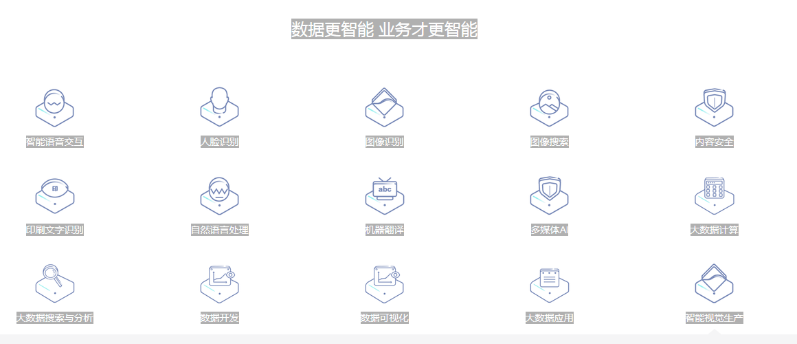
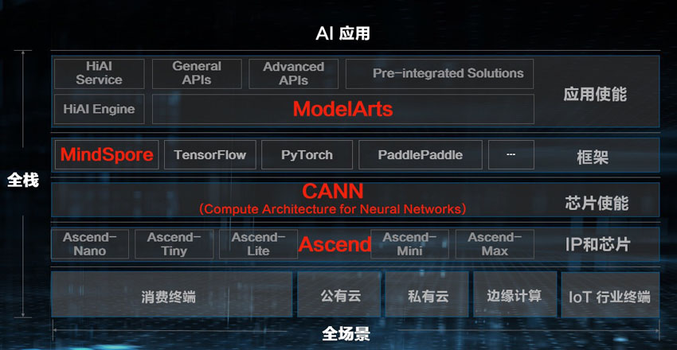
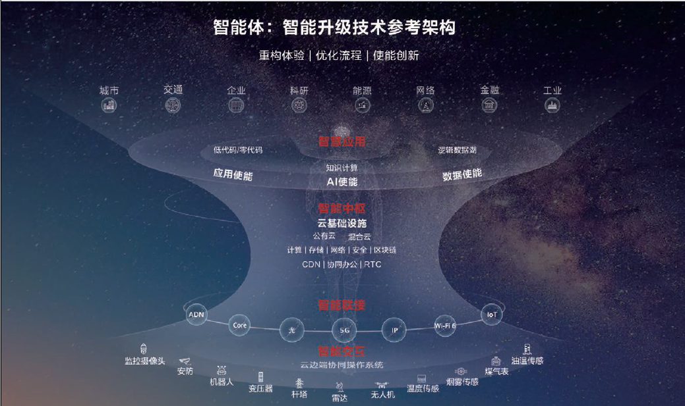

| 序号 | 修改时间  | 修改内容                                           | 修改人 | 审稿人 |
| ---- | --------- | -------------------------------------------------- | ------ | ------ |
| 1    | 2021-12-6 | 创建。迁移《云原生平台》和《AI笔记》相关章节成文。 | Keefe  |        |
|      |           |                                                    |        |        |

---

[TOC]

---

# 概述

包括数据管理、算法管理（算法开发、训练）、模型管理（模型存储、更新）、服务管理（算法发布、部署）。

表格  业界主流AI平台比较

| 厂商      | 平台产品                                                     | 提供功能                                                     |
| --------- | ------------------------------------------------------------ | ------------------------------------------------------------ |
| Alibaba   | [PAI](https://cn.aliyun.com/product/bigdata/product/learn)（Dataworks、Studio/DSW/DLC/EAS） | PAI包括4个子产品，支持可视化建模Studio、交互式建模DSW、深度学习训练平台DLC、弹性推理平台EAS。 免费提供DSW作为阿里天池大赛的缺省开发环境，CPU不限制，GPU每年60小时。 |
| 华为      | ModelArts                                                    | 华为云长期扎根AI基础技术研究，覆盖计算机视觉、语音语义和决策优化三大AI领域，提出了六大基础研究计划，这些计划产生的许多研究成果以即插即用的方式逐步部署于ModelArts。 2020年，华为云发布了ModelArts 3.0，融合骨干模型、联邦学习、模型智能评估与诊断、高性能AI计算四大特性，并推出了基于MedelArts打造的业界首个全生命周期知识计算解决方案，加速行业AI落地。 |
| Amazon    | [SageMaker](https://aws.amazon.com/cn/sagemaker/)            |                                                              |
| 百度      | [飞桨](https://www.paddlepaddle.org.cn/)                     |                                                              |
| Google    | Colab                                                        |                                                              |
| Microsoft | [Azure](https://docs.microsoft.com/en-us/azure/machine-learning/) |                                                              |

表格  中国业界AI平台比较

| 平台       | 链接                                  | 简介                                                         |
| ---------- | ------------------------------------- | ------------------------------------------------------------ |
| 百度AI平台 | https://ai.baidu.com/                 | 研究领域和应用场景都非常齐全。                               |
| 阿里AI     | https://ai.aliyun.com/                | 属于阿里云提供的一个解决方案，没像百度那样重点突出AI，但内容也很全。 |
| 腾讯AI Lab | https://ai.tencent.com/               | 实验室性质，不是企业战略方向。研究领域：计息机视觉、语音识别、自然语言处理、机器学习  应用领域：社交AI、游戏AI、内容AI、平台AI |
| 华为 AILA  | https://ai.huawei.com/ （仅华为内网） | 2018.5，华为BPIT成立AI使能部，分七大基础能力和六大领域解决方案。 |

# AI平台

## 百度AI平台

https://ai.baidu.com/

表格 6 百度AI技术能力

| 能力项         | 分项             | 子项                                                         | 应用场景 |
| -------------- | ---------------- | ------------------------------------------------------------ | -------- |
| 语音技术       | 语音识别         | 长、短(60s内）语音识别、远程语音识别                         |          |
|                |                  | 语音合成：在线合成、离线语音合成                             |          |
|                | 语音唤醒         | 实时语音识别、音频文件转写                                   |          |
|                | 图像审核         | 色情、政治、暴力、图文、广告、敏感信息、图像质量、公众人物识别 |          |
|                | 车辆分析         | 车型识别、车流统计、车辆损伤识别、车辆检测、车辆属性识别、车辆分隔 | 交通     |
|                | 图像识别         | 通用物体和场景识别、植物、动物、菜品、货币、门脸、地标、红酒、图像主体检测 |          |
|                | 图像搜索         | 相同图片搜索、相似图片搜索、商品图片搜索、绘本图片搜索       |          |
|                | 图像效果增强     | 图像去雾、图像无损放大、拉伸图像恢复、黑白图像上色、 图像风格转换、图像清晰度增强、图像色彩增强 |          |
| 文字识别       | 通用文字识别     |                                                              |          |
| 文字识别       | 卡证文字识别     | 身份证、营业执照、护照、出生医学证明、银行卡、名片、户口本、 |          |
| 文字识别       | 票据文字识别     | 混贴票据、增值税发票、通用机打发票、出租车票、 通用票据、银行回单、银行汇票、银行支票、银行火车票、彩票、 |          |
| 文字识别       | 教育场景文字识别 | 手写文字识别、公式识别                                       |          |
| 文字识别       | 汽车场景文字识别 | 行驶证、车辆识别、                                           |          |
| 文字识别       | 其它景文字识别   | 网络图片文字、表格文字、数字识别、印章检测、 仪器仪表盘读数识别、二维码、文档版面分析与识别 |          |
| 人脸与人体识别 | 人脸识别         | 人脸检测、人脸搜索、人像对比、活体检测                       |          |
| 人脸与人体识别 | 人像特效         | 人脸融合                                                     |          |
| 人脸与人体识别 | 人体分析         | 人体关键点识别、人体检测与属性                               |          |
| 人脸与人体识别 | 行为分析         | 驾驶行为分析、危险形为分析、手势识别、指尖识别               |          |
| 人脸与人体识别 | 场景方案         | [人脸实名认证 ](https://ai.baidu.com/solution/faceprint) 	满足各种场景下实名认证的灵活需求 		 [人脸闸机 ](https://ai.baidu.com/solution/facegate) 软硬一体的人脸识别闸机解决方案，提升人员系统化管理的安全性与便捷性 		 [人脸考勤 ](https://ai.baidu.com/solution/faceattendance) 利用高精度的人脸识别、对比能力，搭建高效考勤系统，提高防作弊能力 		 [人脸会员识别 ](https://ai.baidu.com/solution/faceidentify) |          |
| 视频技术       |                  | 视频内容分析、 		视频封面选取、 		视频对比检索 		视频内容审核 |          |
| AR与VR         | 增强现实         | AR核心技术 		3D肢体关键点                              |          |
| AR与VR         | 虚拟现实         |                                                              |          |
| 自然语言处理   | NLP基础技术      | [词法分析 ](https://ai.baidu.com/tech/nlp_basic/lexical) 提供分词、词性标注、命名实体识别 		[词向量表示 ](https://ai.baidu.com/tech/nlp_basic/word_embedding) 帮助完成语义挖掘、相似度计算 [词义相似度 ](https://ai.baidu.com/tech/nlp_basic/word_emb_sim) 通过词语向量化来计算两个词之间的相似度 		[依存句法分析 ](https://ai.baidu.com/tech/nlp_basic/dependency_parsing) 自动分析文本中的依存句法结构信息 		 [DNN](https://ai.baidu.com/tech/nlp_basic/dnnlm_cn)[语言模型 ](https://ai.baidu.com/tech/nlp_basic/dnnlm_cn) 判断一句话是否符合语言表达习惯 		[短文本相似度 ](https://ai.baidu.com/tech/nlp_basic/simnet) 计算两个短文本之间的语义相似度，实现推荐、排序 |          |
|                | NLP应用技术      | [文本纠错 ](https://ai.baidu.com/tech/nlp_apply/text_corrector) 识别文本中的错别字，给出提示以及正确的建议文本内容 		 [情感倾向分析 ](https://ai.baidu.com/tech/nlp_apply/sentiment_classify) 对包含主观信息的文本进行情感倾向性判断  [评论观点抽取 ](https://ai.baidu.com/tech/nlp_apply/comment_tag) 分析评论关注点和观点，输出标签及观点极性 		 [对话情绪识别 ](https://ai.baidu.com/tech/nlp_apply/emotion_detection) 识别会话者所表现出的情绪类别及置信度  [文本标签 ](https://ai.baidu.com/tech/nlp_apply/doctagger) 输出能够反映文章关键信息的多维度标签 		 [文章分类 ](https://ai.baidu.com/tech/nlp_apply/topictagger) 输出文章的主题分类及对应的置信度 		 [新闻摘要 ](https://ai.baidu.com/tech/nlp_apply/news_summary) 抽取关键信息并生成指定长度的新闻摘要 		 [地址识别 ](https://ai.baidu.com/tech/nlp_apply/address) 精准提取快递填单文本中的姓名、电话、地址信息 |          |
|                | 文本审核         |                                                              |          |
|                | 机器翻译         | 通用翻译 语音翻译  定制化翻译 拍照翻译  垂直领域 AI同传  语种识别 |          |
| 数据智能       | 大数据处理       | 大数据传输 数据治理 	数据工厂                             |          |
| 数据智能       | 大数据分析       | 数据仓库 数据科学平台 		搜索分析ES 		大数据可视化 |          |
| 数据智能       | 统计与推荐       | 网站统计 智能推荐 		移动统计                           |          |
| 数据智能       | 舆情分析         | 舆情平台                                                     |          |
| 数据智能       | 大数据风控       | 保险风险定价 保险反欺诈 		智能个人风控 智能企业风控    |          |
| 数据智能       | 大数据营销       | 智客 汇客 觅客 炫客 		客情 商情                        |          |
| 数据智能       | 知识生产与理解   |                                                              |          |
| 知识图谱       | 知识理解         | [实体标注 ](https://ai.baidu.com/tech/cognitive/entity_annotation) 结合百科知识库进行文本知识解析 		[汉语检索 ](https://ai.baidu.com/tech/cognitive/hanyu) 汉语领域的知识检索服务 		 [知识问答 ](https://ai.baidu.com/tech/kg/wenda) 提供多领域、细粒度的知识问答服务 	[作文检索 ](https://ai.baidu.com/tech/kg/zuowen) 提供体裁类别与多样化标签标记、内容检索 [实体标注 ](https://ai.baidu.com/tech/cognitive/entity_annotation) 结合百科知识库进行文本知识解析 		[汉语检索 ](https://ai.baidu.com/tech/cognitive/hanyu) 汉语领域的知识检索服务 		 [知识问答 ](https://ai.baidu.com/tech/kg/wenda) 提供多领域、细粒度的知识问答服务 	[作文检索 ](https://ai.baidu.com/tech/kg/zuowen) 提供体裁类别与多样化标签标记、内容检索 |          |
| 知识图谱       | 知识图谱schema   |                                                              |          |
| 知识图谱       | 图数据库         |                                                              |          |

## 阿里AI

- 阿里云人工智能平台 https://ai.aliyun.com/
- 阿里语音AI平台AliGenie https://www.aligenie.com/
- 阿里机器学习PAI https://data.aliyun.com/product/learn

 阿里机器学习PAI包含3个子产品分别是：

1. 可视化开发工具 PAI-STUDIO，
2. 交互式代码开发工具 PAI-DSW，
3. 模型在线服务 PAI-EAS

三个产品为传统机器学习和深度学习提供了从数据处理、模型训练、服务部署到预测的一站式服务。

阿里巴巴的AI布局主要在六个产业：新零售、新金融、天猫精灵、AliOS、ET城市大脑、ET工业大脑。

ET大脑生态：金融、工业、城市、零售、汽车、家居6大方向立体布局。

## 腾讯AI

https://ai.tencent.com/ 跳转到 https://ai.tencent.com/ailab/

腾讯AI Lab是腾讯企业级人工智能实验室，于2016年4月在深圳成立，目前在中国和美国有70位世界级研究科学家及300余位经验丰富的应用工程师，致力于不断提升AI的理解、决策与创造力，向“Make AI Everywhere”的愿景迈进。

腾讯AI主要先体现在游戏人工智能。

腾讯AI布局相对较晚，腾讯提出以“基础研究—场景共建—AI开放”为三层架构的整体AI战略，从技术、场景与平台三个层面实现“AI in All”，AI被提到战略级高度。腾讯的AI版图围绕技术、场景与平台持续扩大，AI以产品的形式落地应用，从内部场景应用不断向外部产业化场景落地延伸。具体的AI应用场景为：在内部应用场景中，AI与腾讯游戏、社交、内容等业务场景深度融合；在外部场景中，医疗是腾讯AI切入最早、应用成熟度最高的场景之一。

## 华为AI

https://ai.huawei.com/   (只能华为内网访问，AI使能部属于华为BPIT二级部门，负责给华为内部业务AI赋能)

https://www.huaweicloud.com/   华为云下提供了AI和大数据服务。

2017年9月，华为发布了面向企业、政府的人工智能服务平台华为云EI。

2018年4月，华为发布了面向智能终端的人工智能引擎HiAI。

2018年12月，华为发布了全栈全场景AI解决方案。

2020.9.24，华为云与计算BG总裁侯金龙在华为全联接2020现场发布了政企智能升级的参考架构“智能体”。

**全栈全场景AI解决方案（2018.12）**

图  华为的全栈全场景AI解决方案（2018.12）

全场景，是指包括公有云、私有云、各种边缘计算、物联网行业终端以及消费类终端等部署环境。

全栈是技术功能视角，是指包括芯片、芯片使能、训练和推理框架和应用使能在内的全堆栈方案。

**华为的全栈方案具体包括：**

- ​	**Ascend**：基于统一、可扩展架构的系列化AI IP和芯片，包括Max、Mini、Lite、Tiny和Nano五个系列。包括我们发布的华为昇腾910（Ascend 910），还有Ascend 310。
- ​	**CANN**：芯片算子库和高度自动化算子开发工具。
- ​	**MindSpore**：支持端、边、云独立的和协同的统一训练和推理框架。
- ​	**应用使能**：提供全流程服务（ModelArts），分层API和预集成方案。

**华为智能体（2020.09）**

图 华为智能体

说明：华为智能体获第七届世界互联网大会领先科技成果奖（2020）。

2020.9.24，华为云与计算BG总裁侯金龙在华为全联接2020现场发布了政企智能升级的参考架构“智能体”。

智能体以云为基础，以AI为核心，通过云网边端协同，构建开放、立体感知、全域协同、精确判断和持续进化的智能系统，为城市治理、企业生产、居民生活带来全场景智慧体验。智能体是一个开放的生态系统，客户和伙伴可以基于智能体打造自己的智能方案，使能千行百业智能升级，共建全场景智慧。

智能体由智能交互、智能联接、智能中枢、智慧应用四层组成，有机构成云网边端协同的一体化智能系统：

- ​	智能交互：云边端协同，加速数据和AI的自由流动
- ​	智能联接：万物智联，万智互联
- ​	智能中枢-混合云：构筑智能升级的理想底座
- ​	智慧应用：协同创新共创行业新价值

三个使能平台也非常关键，分别是应用使能ROMA、数据使能DAYU和AI使能ModelArts。

第一，应用使能，让应用开发更简单！每个企业都有大量新应用要开发，华为云ROMA提供低代码、零代码开发能力，支持全云化在线开发，云上云下一键部署，可不断沉淀行业资产，实现软件资产重用，乐高式开发。同时，每个企业都有很多老应用和老数据库，华为云ROMA提供平台化、服务化的方式，让新老应用和数据可以互通，让企业IT立而不破，实现企业应用与技术架构的平滑演进。以华为自身为例，有了ROMA之后，应用开发时间从10个月缩短到1周。

第二，数据使能，让数据应用更简单。很多客户数据分布在不同的部门，但是数据只有全域共享才能发挥更大价值。华为云DAYU提供独创的逻辑数据湖方案，让数据物理上分布在不同部门，逻辑上可集中管理和分析，实现数据全域共享。

第三，AI使能是智能体的核心。ModelArts让AI全生命周期的开发管理简单和自动化，让小白也能够开发AI应用，会写代码就会AI；让专家更专，聚焦算法和模型的研究。ModelArts将专家的行业知识，沉淀在套件和行业工作流中，让行业老专家的经验模板化，帮助合作伙伴和开发者，快速开发出智慧应用。以中国石油为例，沉淀行业能力后，借助华为云知识图谱套件，快速构建石油测井领域的专业化模型，实现了油气水层的智能识别，评价时间缩短70%以上，准确率达到了专家水平。

## Amazon

亚马逊将人工智能平台和服务整合进入了其云服务AWS中，此类服务提供云原生的机器学习和深度学习技术来应对不同用例和需求。其中在人工智能层面主要提供：AI 服务、AI 平台以及AI 基础设施。

## 其它

**旷视**

Face++人工智能开放平台的核心技术包括人脸识别、人体识别、证件识别、图像识别。其技术能力主要在人体识别，包括人体检测、人体属性、人体抠像，手势识别四种，应用于人群监控、人流量统计、人体追踪；相片抠像美化处理市场调查、广告精准投放；在线教育等领域。

# AI中台

## 阿里云人工智能平台PAI

阿里云人工智能平台PAI  https://cn.aliyun.com/product/bigdata/product/learn

阿里云人工智能平台PAI（Platform of Artificial Intelligence）面向企业及开发者，提供轻量化、高性价比的云原生机器学习平台，涵盖PAI-Studio可视化建模平台、PAI-DSW云原生交互式建模平台、PAI-DLC云原生AI基础平台、PAI-EAS云原生弹性推理服务平台，支持千亿特征、万亿样本规模加速训练，百余落地场景，全面提升AI工程效率。

PAI包括四个子产品：

* PAI-Studio可视化建模平台：支持大规模分布式的传统机器学习、深度学习、强化学习训练；支持流批一体训练；封装上百种机器学习算法，拖拽式建模，自动调参，无编程玩转人工智能。
* PAI-DSW云原生交互式建模平台：灵活开放的交互式云端机器学习开发环境，内置JupyterLab、WebIDE及Terminal，适合不同业务场景及客户需求。开箱即用的开发建模环境，降低用户运维成本的同时，开放底层Sudo权限，给客户提供最大化定制化能力。集成PAI基础能力及教程，提升开发效率。
* PAI-DLC云原生AI基础平台：云原生一站式的深度学习训练平台，提供灵活、稳定、易用和高性能的机器学习训练环境。支持多种算法框架，超大规模分布式深度学习任务运行及自定义算法框架。
* PAI-EAS云原生弹性推理服务平台：PAI平台的模型在线预测服务，支持异构硬件（CPU/GPU）的模型加载，高吞吐，低延迟，支持大规模复杂模型的一键部署，实时自动扩缩容，全自动部署更新模型服务版本；支持高速直连调用，并提供全方位、高可靠的运维监控保障体系。

图 阿里云机器学习PAI 产品架构

机器学习PAI平台核心提供了从数据处理、模型开发、训练到部署的一站式服务。

PAI-Studio与PAI-DSW通过打通底层数据，提供可视化和交互式两种机器学习模型开发环境，PAI-DLC提供云原生深度学习训练平台，三种不同方式训练的模型，都可以一键部署到PAI-EAS，通过Restful API形式与业务打通。同时在业务层，PAI平台还提供智能推荐、用户增长、智能风控等解决方案。

PAI平台底层基于GPU/CPU等常见硬件，结合经典机器学习框架及阿里巴巴多年沉淀的计算引擎和容器服务，为PAI核心能力提供完整的服务支撑。丰富的算法、组件等智能生态市场，方便企业客户和用户找到适合的AI方案或形成交易。PAI平台真正实现企业自主可控的AI方案，全面提升机器学习工程效率。

### PAI DSW

天池实验室是基于PAI DSW探索版开发的，PAI DSW（Data Science Workshop）是为算法开发者量身打造的云端开发环境，用户可在DSW中利用阿里云提供的CPU/GPU算力资源实现云端编程，无需任何运维配置即可直接开启Jupyter Notebook编写，调试，运行Python代码。DSW的主要面向用户是深度学习算法的开发者，其中内置了深度学习网络可视化建模并支持开源框架的安装。

DSW的主要面向用户是深度学习算法的开发者，其中内置了深度学习网络可视化建模并支持开源框架的安装。

### Dataworks

Dataworks，在阿里集团内部为大家所熟知的部分是D2，在阿里云则是数加平台的主体-数据工厂。DataWorks（数据工场）具备全栈数据研发能力（数据集成与开发、 生产运维调度、离线与实时分析、数据质量治理与资产管理、安全防护、数据共享与服务、机器学习、数据应用搭建）的大数据平台。

DataWorks基于MaxCompute/EMR/MC-Hologres等大数据计算引擎，为客户提供专业高效、安全可靠的一站式大数据开发与治理平台，自带阿里巴巴数据中台与数据治理最佳实践，赋能各行业数字化转型。每天阿里巴巴集团内部有数万名数据/算法工程师正在使用DataWorks，承担集团99%数据业务构建。

## 百度飞桨 (PaddlePaddle)

https://www.paddlepaddle.org.cn/

飞桨 (PaddlePaddle)以百度多年的深度学习技术研究和业务应用为基础，集深度学习核心框架、基础模型库、端到端开发套件、工具组件和服务平台于一体，2016 年正式开源，是全面开源开放、技术领先、功能完备的产业级深度学习平台。飞桨源于产业实践，始终致力于与产业深入融合。目前飞桨已广泛应用于工业、农业、服务业等，服务 265 万开发者，与合作伙伴一起帮助越来越多的行业完成 AI 赋能。

四大领先技术

* 开发便捷的深度学习框架
* 超大规模深度学习模型训练技术
* 多端多平台部署的高性能推理引擎
* 产业级开源模型库

## 腾讯云智天枢

腾讯云智天枢人工智能服务平台（TI Matrix Platform，下文中也叫云智天枢平台）是基于腾讯云和腾讯优图强大技术能力打造的全栈式人工智能服务平台，致力于帮助加速企业的数字化转型及促进 AI 行业生态共建。平台支持快速接入各种数据、算法和智能设备，并提供可视化编排工具进行服务和资源的管理及调度，进一步通过 AI 服务组件集成和标准化接口开放，降低 AI 应用开发成本。

## 本章参考

# 参考资料

## AI官网

**AI开发平台**

**国内**：

* 百度AI平台  http://ai.baidu.com/

* 阿里AI平台  http://ai.alibaba.com/

* 腾讯AI平台  http://ai.tencent.com/

* 科大讯飞开放平台 https://www.xfyun.cn/

* Face++旷视  [点击进入](https://www.faceplusplus.com.cn/)

* 360人工智能研究院 [点击进入](http://ai.360.cn/)

* 网易人工智能 [点击进入](https://ai.163.com/)

* 京东AI开放平台 [点击进入](http://neuhub.jd.com/)

* 小米AI开放平台 [点击进入](https://dev.mi.com/console/cloud/)

* 海康威视  [点击进入](https://open.hikvision.com/)

* OLAMI 欧拉密 AI  [点击进入](https://cn.olami.ai/)

* 云知声开放平台 [点击进入](http://dev.hivoice.cn/)

* 搜狗AI开放平台 - 知音 [点击进入](https://zhiyin.sogou.com/)

* 滴滴AI开放平台 [点击进入](http://ai.didiglobal.com/)

* 学而思教育AI开放平台 [点击进入](https://ai.xueersi.com/)

**国外**

* Amazon AI  https://aws.amazon.com/cn/events/amazon-ai/

* IBM人工智能-IBM Cloud Pak for Data  [点击进入](https://www.ibm.com/cn-zh/products/cloud-pak-for-data)

* 微软AI开放平台 [点击进入](https://azure.microsoft.com/zh-cn/free/ai/)

* 英特尔 AI Academy [点击进入](https://software.intel.com/zh-cn/ai)

**AI产品**

* ModelArts https://support.huaweicloud.com/modelarts/index.html
* 阿里云机器学习PAI  https://cn.aliyun.com/product/bigdata/product/learn
* 百度飞桨 (PaddlePaddle)  https://www.paddlepaddle.org.cn/

## 参考链接

- 各大AI开放平台汇总分析 https://blog.csdn.net/benna/article/details/104848422
