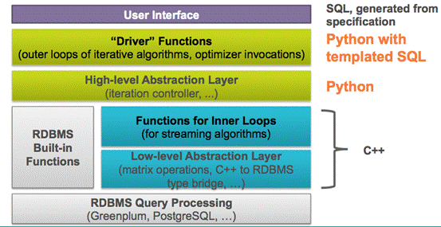
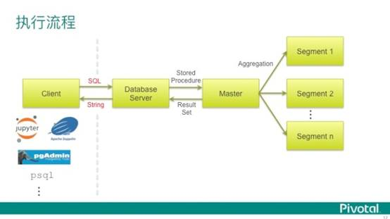
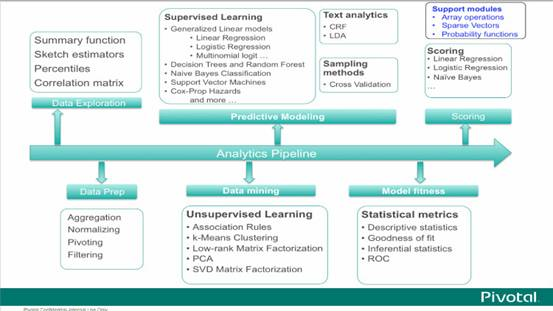

| 序号 | 修改时间   | 修改内容 | 修改人 | 审稿人 |
| ---- | ---------- | -------- | ------ | ------ |
| 1    | 2018-11-18 | 创建     | Keefe |   |
| 2 | 2021-4-10 | 增加章节sklean框架，更新tensorflow框架 | 同上 |   |


---

[TOC]


# 1  AI框架概述
## 1.1  AI库（python)

表格 1 python常用AI库列表

| **类别**     | 库名        | 介绍                                                         |
| ------------ | ----------- | ------------------------------------------------------------ |
| 数据分析     | scipy       | 提供矩阵支持，以及矩阵相关的数值计算模块                     |
|              | numpy       | 数学函数库，提供数组、一组与线性代数相关的函数以及傅里叶变换函数。 |
|              | pandas      | a powerful data  analysis and manipulation library for Python |
| **机器学习** |             | 提供机器学习、深度学习和强化学习。通常包括了分类、聚类、回归问题。 |
|              | sklearn     | sckit-Learn。强大的机器学习库，支持回归、分类、聚类和降维。源码库里包含文档和例子（各语言含jupyter notebook）。 |
|              | keras       | 深度学习库，用于建立神经网络以及深度学习模型。windows下速度会变慢。依赖库有numpy/scipy/theano。 |
|              | xgboost     | 约100MB。                                                    |
|              | libsvm      | 机器学习库，SVM                                              |
| 统计学习     | statsModels | 统计建模和计量经济学                                         |
| **深度学习** | tensorflow  | [谷歌](https://baike.baidu.com/item/谷歌)基于DistBelief进行研发的第二代[人工智能](https://baike.baidu.com/item/人工智能/9180)[学习系统](https://baike.baidu.com/item/学习系统)，其命名来源于本身的运行原理。 |
|              | caffe       |                                                              |
| 线性规划     | ortools     | google开源。                                                 |
| 逻辑编程     | kanren      | 简化业务逻辑编写代码的方式。                                 |
|              | SymPy       | 轻量级的代数计算库。常用于逻辑编程，解决素数、数独等问题。   |
| **可视化**   | PIL         | Python Imaging  Library，图像生成和处理库。  pillow          |
|              | matplotlib  | 绘图库                                                       |
|              | seaborn     | 在matplotlib基础上，很强大很高效的可视化库。                 |
|              | wordcloud   | 词云                                                         |
|              | tensorboard | tensorflow框架的可视化工具包。                               |

> 备注：机器学习的第三方模块中scipy、numpy、matplotlib是基础模块，pandas等库通常要依赖上述库。


## 1.2 AI库分领域

### 1.1.1  科学计算常用库的方法

表格 2 pandas库方法（依赖于numpy）

| 功能       | 主要方法                                                | 备注                                             |
| ---------- | ------------------------------------------------------- | ------------------------------------------------ |
| 统计特征   | sum、mean var std corr cov skew kurt describe           | 统计学基础                                       |
| 拓展统计   | cumsum cumprod  cummax cmumin rolling_sum rolling_xxx   | 累积统计                                         |
| 统计作图   | plot pie hist boxplot  plot(logy=True) plot(yerr=error) | 饼图、拆线图、直方图、箱形图、对数图、误差条形图 |
| 数据预处理 | unique isnull  notnull                                  |                                                  |

安装： `pip install pandas`

```python
import numpy as np
import pandas as pd
```


表格 4 其它科学计算库用途

| 函数名      | 函数功能     | 库名  |
| ----------- | ------------ | ----- |
| interpolate | 数据插值     | scipy |
| random      | 生成随机矩阵 | numpy |
|             |              |       |


### 1.1.2  NLP.自然语言处理
处理人类语言问题的库。

| 库名     | 简述                                                       |
| -------- | ---------------------------------------------------------- |
| NLTK     | 编写Python程序来处理人类语言数据的最好平台。支持多种语言。 |
| gensim   | 用来作文本主题挖掘的库                                     |
| jieba    | python实现的一个中文分词开源模块。                         |
| Hanlp    | Java实现的NLP库。                                          |
| FudanNLP | 复旦大学的NLP平台。                                        |

分词相关库：jieba mmseg

*  Pattern – Python的网络挖掘模块。他有自然语言处理工具，机器学习以及其它。
*  TextBlob – 为深入自然语言处理任务提供了一致的API。是基于NLTK以及Pattern的巨人之肩上发展的。
*  SnowNLP – 中文文本处理库。
*  loso – 另一个中文分词库。
*  genius – 基于条件随机域的中文分词。
*  langid.py – 独立的语言识别系统。
*  Korean – 一个韩文形态库。
*  pymorphy2 – 俄语形态分析器（词性标注+词形变化引擎）。
*  PyPLN – 用Python编写的分布式自然语言处理通道。这个项目的目标是创建一种简单的方法使用NLTK通过网络接口处理大语言库。


### 1.1.3  CV.计算机视觉 

表格 5 计算机视觉常用库

| 库名     | 简介                                                         |
| -------- | ------------------------------------------------------------ |
| opencv   | 1999年由[Intel](https://baike.baidu.com/item/Intel)建立。基于BSD许可发行的跨平台计算机视觉库，可以运行在[Linux](https://baike.baidu.com/item/Linux)、[Windows](https://baike.baidu.com/item/Windows)和[Mac   OS](https://baike.baidu.com/item/Mac OS)操作系统上。开源计算机视觉库。 |
| SimpleCV | 用于照相机、图像处理、特征提取、格式转换的简介，可读性强的接口（基于OpenCV）。 |
| mahotas  | 快速计算机图像处理算法（完全使用 C++ 实现），完全基于 numpy 的数组作为它的数据类型。 |


## 1.3  AI主流引擎/框架

表格 6 AI主流引擎/框架比较（深度学习）

| 比较项        | Caffe         | Torch/PyTorch | Theano/lasagne  | TensorFlow         | MXNet                 |
| ------------- | ------------- | ------------- | --------------- | ------------------ | --------------------- |
| 主语言        | C++/cuda      | C++/Lua/cuda  | Python/c++/cuda | Python/C++/cuda    | C++/cuda              |
| 从语言        | Python/Matlab | Python        | -               |                    | Python/R/<br>Julia/Go |
| <br>硬件      | CPU/GPU       | CPU/GPU/FPGA  | CPU/GPU         | CPU/GPU/<br>Mobile | CPU/GPU/<br>Mobile    |
| 分布式        | N             | N             | N               | *Y*                | *Y*                   |
| 速度          | 快            | 快            | 中等            | 中等               | 快                    |
| 灵活性        | 一般          | 好            | 好              | 好                 | 好                    |
| 文档          | 全面          | 全面          | 中等            | 全面               | 全面                  |
| 适合模型      | CNN           | CNN/RNN       | CNN/RNN         | CNN/RNN/...     | CNN/RNN/...        |
| 命令式        | N             | Y             | N               | N                  | Y                     |
| 声明式        | Y             | N             | Y               | Y                  | Y                     |
| 接口          | protobuf      | Lua           | Python          | C++/Python         | Python/R/<br>Julia/Go |
| 网络结构      | 分层方法      | 分层方法      | 符号张量图      | 符号张量图         | ?                     |
| 可视化        |               |               |                 | tensorboard        |                       |
| 厂商          | BAIR          | Facebook      | 学术界          | Google             | Amazon                |
| 发布/开源时间 | 2013.9        | 2017.1        | 2007            | 2015.11            | 2015.5                |

 备注：*CUDA*（Compute Unified Device Architecture），是显卡厂商NVIDIA推出的运算平台。

1. 主语言和从语言：主语言是原版开发语言（底层实现语言），从语言是基于原版用别的编程语言开发并开源（如PyTorch是在Torch基础上用python语言重新打造的一款深度学习框架。而Torch初版是用Lua语言实现的，比较小众，影响力较弱。PyTorch的影响力已超过Torch）。

2. 编程方法有命令式和声明式编程。
	*  命令式是直接告诉机器怎么做HOW，这个容易理解，机器完全机械执行命令。程序员也很容易控制处理的过程。
	*  声明式是告诉机器WHAT，让机器去HOW，1）如SQL语句是典型声明式，写了一个SQL语句，然后SQL引擎自己去优化SQL操作。2）如D3.JS画图也是声明式。3）函数工具如map, reduce就是典型的声明式编程得到的函数工具。声明式编程让我们专注于软件本身WHAT，回归需求本质。

3. 操作系统：操作系统原先tensorflow/pytorch早期版本都不支持windows，只支持linux/osx，但2018年陆续都支持了，因此此比较项删除。

4. 2018年，Keras作者被google收编。2019.1，Tensorflow 2.0发布。

5. Theano 在深度学习框架中是祖师级的存在。它的开发始于 2007，早期开发者包括传奇人物 Yoshua Bengio 和 Ian Goodfellow。**Theano 像是一个研究平台多过是一个深度学习库。你需要从底层开始做许多工作，来创建你需要的模型。创始者之一的 Ian Goodfellow 放弃 Theano 转去谷歌开发 Tensorflow。**2014.9，Lasagen封装了theano，使得theano使用起来更简单。。

6. Mxnet: Mxnet是由李沐等人领导开发的非常灵活，扩展性很强的框架，被Amazon定为官方框架。特点：Mxnet同时拥有命令式编程和符号式编程的特点。在命令式编程上MXNet提供张量运算，进行模型的迭代训练和更新中的控制逻辑；在声明式编程中MXNet支持符号表达式，用来描述神经网络，并利用系统提供的自动求导来训练模型。Mxnet性能非常高，推荐资源不够的同学使用。

   

**如何学习开源框架**

要掌握好一个开源框架，通常需要做到以下几点：

(1) 熟练掌握不同任务数据的准备和使用。

(2) 熟练掌握模型的定义。

(3) 熟练掌握训练过程和结果的可视化。

(4) 熟练掌握训练方法和测试方法。

一个框架，官方都会开放有若干的案例，最常见的案例就是以MNISI数据接口+预训练模型的形式，供大家快速获得结果。
进阶从自定义数据读取接口，自定义网络的搭建，模型的训练，模型的可视化，模型的测试与部署等全方位进行掌握。


## 本章参考

[1]. Pandas中文教程  https://www.w3cschool.cn/hyspo/

[2]. 12大深度学习开源框架(caffe,tf,pytorch,mxnet等)快速入门项目 https://www.jianshu.com/p/16f69668ce25


# 2  AI深度学习框架

## 2.1 Tensorflow

依赖模块：protobuf, tensorflow, tensorflow_cpu  

```shell
$ pip show tensorflow-gpu
Name: tensorflow-gpu
Version: 2.5.0
Summary: TensorFlow is an open source machine learning framework for everyone.
Home-page: https://www.tensorflow.org/
Author: Google Inc.
Author-email: packages@tensorflow.org
License: Apache 2.0
Location: d:\dev\langs\python\python37\lib\site-packages
Requires: gast, astunparse, keras-preprocessing, google-pasta, tensorflow-estimator, six, termcolor, keras-nightly, numpy, tensorboard, protobuf, opt-einsum, typing-extensions, grpcio, wrapt, wheel, flatbuffers, h5py, absl-py
Required-by:
```

​	TensorFlow是[谷歌](https://baike.baidu.com/item/谷歌)基于DistBelief进行研发的第二代[人工智能](https://baike.baidu.com/item/人工智能/9180)[学习系统](https://baike.baidu.com/item/学习系统)，其命名来源于本身的运行原理。Tensor（张量）意味着N维数组，Flow（流）意味着基于数据流图的计算，TensorFlow为张量从流图的一端流动到另一端计算过程。TensorFlow是将复杂的数据结构传输至人工智能神经网中进行分析和处理过程的系统。
​    TensorFlow可被用于[语音识别](https://baike.baidu.com/item/语音识别)或[图像识别](https://baike.baidu.com/item/图像识别)等多项机器深度学习领域，对2011年开发的深度学习基础架构DistBelief进行了各方面的改进，它可在小到一部智能手机、大到数千台数据中心服务器的各种设备上运行。TensorFlow将完全开源，任何人都可以用。
​    TensorFlow由谷歌[人工智能](https://baike.baidu.com/item/人工智能/9180)团队[谷歌大脑](https://baike.baidu.com/item/谷歌大脑/4649855)（Google Brain）开发和维护，拥有包括TensorFlow Hub、TensorFlow Lite、TensorFlow Research Cloud在内的多个项目以及各类[应用程序接口](https://baike.baidu.com/item/应用程序接口/10418844)API。自2015年11月9日起，TensorFlow依据[阿帕奇授权协议](https://baike.baidu.com/item/阿帕奇授权协议/1642155)（Apache 2.0 open source license）开放源代码。

**什么是张量(tensor)**
对于张量这个概念的理解很不容易。我看介绍TensorFlow的说明上说张量就是N维数组，百度百科上说它是一个可用来表示在一些矢量、标量和其他张量之间的线性关系的多线性函数。在不同的领域，张量有不同的理解。我认为这句话讲得比较好：张量是不随坐标系而改变的物理系统内在的量。在机器视觉领域，我个人理解为在不同坐标系/参考系下变的CV特征。


**术语**

| 术语         | 解释                                                         |
| ------------ | ------------------------------------------------------------ |
| one hot编码  |                                                              |
| tensor 张量  | 表示数据，一组多维数据（一维标量Scalar、二维矢量/向量vector，在tensorflow里都可以泛叫张量）。<br>在python numpy里类型是narray。 |
| OP 算子      |                                                              |
| Session 会话 | 在tensorflow 1.x里用来启动一个训练。                         |
| 变量         | 用来维护状态                                                 |


### 入门篇

表格 tensorflow版本说明

| 版本 | 发布时间 | 功能&备注                                                    |
| ---- | -------- | ------------------------------------------------------------ |
| v1.0 | 2015.11  | 用于处理静态计算图                                           |
| v2.0 | 2019.1   | 采用动态图（优先）模式开发。集成keras。提供了不同等级API减少开发门槛。。 |
| v2.4 |          |                                                              |

TensorFlow提供Python语言下的四个不同版本：CPU版本（tensorflow）、包含GPU加速的版本（tensorflow-gpu），以及它们的每日编译版本（tf-nightly、tf-nightly-gpu）。


**Tensorflow 1.x和2.x**

TensorFlow 1.x主要是用于处理静态计算图的框架。计算图中的节点是Tensors，当图形运行时，它将保持n维数组;图中的边表示在运行图以实际执行有用计算时将在张量上运行的函数。先创建计算图后运行的方式即为**符号式编程**。

Tensorflow 2.0出现于2019年1月。Tensorflow 2.0中，采用动态图（优先）模式开发，动态图开发效率高，运行效率可能不如静态图；TensorFlow 2 也支持通过 `tf.function` 将动态图优先模式的代码转化为静态图模式
这种运算同时创建计算图和数值结果的方式叫做**命令式编程**。

Tensorflow目前发布了两个版本：1.x和2.0，通过对这两个版本的使用，相较于Tensorflow1.x,有以下感触：

**（1）简单易用:**

Tensorflow2去除了冗余的接口，并将计算过程封装成了函数，方便开发者调用。同时，Tensorflow2内置了Keras,使用Keras开发神经网络更加便捷。

**（2）工具多样化：**

Tensorflow2提供绝大多数AI开发及落地应用的函数，从数据处理，到搭建及可视化网络，从训练网络到部署应用网络，从各种文件读取到保存等，几乎实现了Opencv\pillow\Matplotlib所包含的所有功能。

**（3）兼容性好，受众广：**

Tensorflow2针对不同等级的AI开发者提供了不同等级的接口，为底层开发者提供了底层接口，为高层开发者提供了高层接口。

**（4）高效：**

Tensorflow2使用了Eager execution机制，与python运行时集成度更高，动态图机制可以实时获取结果，开发效率更高。新的装饰器的加入，可将python对象转换为图结构，实现张量的跟踪。

总而言之，Tensorflow2的发布，标志者AI新纪元的开启，解放了AI开发者，加速了AI的发展。


#### 切换设备

```python
# 查看设备类型
from tensorflow.python.client import device_lib
print(device_lib.list_local_devices())
[name: "/device:CPU:0"
device_type: "CPU"
memory_limit: 268435456
locality {}
incarnation: 1361540258329500804
]

# 或者
import tensorflow as tf
tf.config.list_physical_devices()
[PhysicalDevice(name='/physical_device:CPU:0', device_type='CPU')]
```


### 开发篇

#### tensorflow 1.x迁移到2.x

使用tensorflow提供的迁移工具

* 单脚本转换
 先进入到你要转换脚本(eg:yolov3.py)的目录，然后：

`tf_upgrade_v2 --infile yolov3.py --outfile yolov3.py`

* 文件夹批量转换
 先进入你要转换的文件夹根目录（eg:yolov3/），然后可以转换文件下所有py文件：

`tf_upgrade_v2 --intree yolov3/ --outtree yolov3/ --copyotherfiles False`

注意事项： 

tf.compat.v1.disable_eager_execution()  # 兼容V1：禁止动态图


#### 预训练模型 pre-trained models

除了Xception and MobileNet，其他的Applications都与TensorFlow及Theano相容，我们就挑VGG16为例子，解释如何使用。这些模型的隐藏层数都很多，也使用了大量的资料作训练，一般电脑可能要执行很久，等结果可能要很多轮的咖啡XD，因此，Keras将研发团队精心调校的模型及执行结果收集进来，一般使用者就不用自己训练模型，可以直接套用，故称为预先训练的模型(pre-trained models)。


#### 分布式训练

[`tf.distribute.Strategy`](https://tensorflow.google.cn/api_docs/python/tf/distribute/Strategy?hl=zh_cn) 是一个可在多个 GPU、多台机器或 TPU 上进行分布式训练的 TensorFlow API。使用此 API，您只需改动较少代码就能分布现有模型和训练代码。


#### tensorboard

TensorBoard是一个可视化工具，它可以用来展示网络图、张量的指标变化、张量的分布情况等。特别是在训练网络的时候，我们可以设置不同的参数（比如：权重W、偏置B、卷积层数、全连接层数等），使用TensorBoader可以很直观的帮我们进行参数的选择。

```python
# Load the TensorBoard notebook extension
%load_ext tensorboard

# Open an embedded TensorBoard viewer
%tensorboard --logdir {logdir}
```

实现时用这些函数来记录数据：`tf.summary`， `summary_writer.add_summary`

下面是训练时，传入回调函数callbacks

```python
log_dir="/logs/fit/" + datetime.datetime.now().strftime("%Y%m%d-%H%M%S")
print(log_dir)
tensorboard_callback = tf.keras.callbacks.TensorBoard(log_dir=log_dir, histogram_freq=1)

model.fit(x=x_train, 
          y=y_train, 
          epochs=5, 
          validation_data=(x_test, y_test), 
          callbacks=[tensorboard_callback])
```


### 部署篇


### 本节参考

[1]. TensorFlow官网 https://tensorflow.google.cn/overview/?hl=zh_cn

[2]. TensorFlow中文社区  http://www.tensorfly.cn/

[3]. 开始使用 TensorBoard https://tensorflow.google.cn/tensorboard/get_started?hl=zh_cn

[4]. Tensorflow2.0——新世界的大门 https://www.douban.com/note/721362180/


## 2.2 Keras

官网：https://keras.io/datasets/

Keras是一个对小白用户非常友好而简单的深度学习框架，严格来说并不是一个开源框架，而是一个高度模块化的神经网络库。

Keras是一个开源的python库，可以让您轻松构建神经网络。 该库能够在TensorFlow，Microsoft Cognitive Toolkit，Theano和MXNet之上运行。

下载数据集缺省路径： `C:\Users\%USER%\.keras`


### tensorflow.keras

TensorFlow 的高阶 API 基于 Keras API 标准，用于定义和训练神经网络。Keras 通过用户友好的 API 实现快速原型设计、先进技术研究和生产。

```python
import numpy as np
import tensorflow as tf
from tensorflow import keras
```


Keras 模型由多个组件组成：

- 架构或配置，它指定模型包含的层及其连接方式。
- 一组权重值（即“模型的状态”）。
- 优化器（通过编译模型来定义）。
- 一组损失和指标（通过编译模型或通过调用 `add_loss()` 或 `add_metric()` 来定义）。

您可以通过 Keras API 将这些片段一次性保存到磁盘，或仅选择性地保存其中一些片段：

- 将所有内容以 TensorFlow SavedModel 格式（或较早的 Keras H5 格式）保存到单个归档。这是标准做法。
- 仅保存架构/配置，通常保存为 JSON 文件。
- 仅保存权重值。通常在训练模型时使用。


示例1： 简单模型 tf.keras.models.Sequential

```python
import tensorflow as tf
mnist = tf.keras.datasets.mnist

(x_train, y_train),(x_test, y_test) = mnist.load_data()
x_train, x_test = x_train / 255.0, x_test / 255.0  #像素值整数转化成浮点数(0,1)

#4层网络：第一层是输入层(将一个图片平滑化一维28*28=784)，二层减少到128层（激活函数relu）
#三层dropout处理，四层softmax处理
model = tf.keras.models.Sequential([
  tf.keras.layers.Flatten(input_shape=(28, 28)),
  tf.keras.layers.Dense(128, activation='relu'),
  tf.keras.layers.Dropout(0.2),  #0.2的丢弃率
  tf.keras.layers.Dense(10, activation='softmax')
])

#为训练选择优化器和损失函数
model.compile(optimizer='adam',
              loss='sparse_categorical_crossentropy',
              metrics=['accuracy'])

#训练并验证模型
model.fit(x_train, y_train, epochs=5)
model.evaluate(x_test, y_test)
```


示例2：针对专业人员的 自定义模型

```python
import tensorflow as tf
class MyModel(tf.keras.Model):
  def __init__(self):
    super(MyModel, self).__init__()
    self.conv1 = Conv2D(32, 3, activation='relu')
    self.flatten = Flatten()
    self.d1 = Dense(128, activation='relu')
    self.d2 = Dense(10, activation='softmax')

  def call(self, x):
    x = self.conv1(x)
    x = self.flatten(x)
    x = self.d1(x)
    return self.d2(x)
model = MyModel()

with tf.GradientTape() as tape:
  logits = model(images)
  loss_value = loss(logits, labels)
grads = tape.gradient(loss_value, model.trainable_variables)
optimizer.apply_gradients(zip(grads, model.trainable_variables))
```


## 2.3 Torch/PyTorch

**Torch**

Torch是为LuaJIT编写的完整的科学计算环境，它是针对Lua语言的即时（JIT）编译器。 Torch不仅是机器学习框架/库，还是更大的科学计算环境，但是它提供的功能之一是对机器学习的支持。


**PyTorch**

PyTorch是Facebook团队于2017年1月发布的一个深度学习框架。基于以前的Torch库，PyTorch是Python优先的机器学习框架，被大量用于深度学习。它支持CUDA技术（来自NVIDIA），可以在训练，分析和验证神经网络模型中充分利用专用GPU的功能。

Torch 的热门应用：在增强学习领域，用卷积神经网络和代理处理图像问题。

PyTorch由4个主要的包组成：

* torch：类似于Numpy的通用数组库，可将张量类型转换为torch.cuda.TensorFloat，并在GPU上进行计算。
* torch.autograd：用于构建计算图像并自动获取梯度的包。

* torch.nn：具有共享层和损失函数的神经网络库。

* torch.optim：具有通用优化算法（如SGD、Adam等）的优化包。


**示例：ResNet18神经网络 **

```python
# 在CPU版本自动下载模型参数
class SurfaceDefectResNet(torch.nn.Module):
    def __init__(self):
        super(SurfaceDefectResNet, self).__init__()
        # Downloading: "https://download.pytorch.org/models/resnet18-5c106cde.pth" to /home/admin/.cache/torch/hub/checkpoints/resnet18-5c106cde.pth
        self.cnn_layers = torchvision.models.resnet18(pretrained=True)
        num_ftrs = self.cnn_layers.fc.in_features
        self.cnn_layers.fc = torch.nn.Linear(num_ftrs, 10)

    def forward(self, x):
        # stack convolution layers
        out = self.cnn_layers(x)
        return out

net = SurfaceDefectResNet()
```


## Caffe

Caffe最初由杨庆佳在加州大学伯克利分校读博期间发起，后来由伯克利AI研究公司（BAIR）和社区贡献者联合开发。它主要专注于用于计算机视觉应用的卷积神经网络。


## PaddlePaddle

Paddle即Parallel Distributed Deep Learning(并行分布式深度学习)。

飞桨(PaddlePaddle)以百度多年的深度学习技术研究和业务应用为基础，是中国首个开源开放、技术领先、功能完备的产业级深度学习平台，集深度学习核心训练和推理框架、基础模型库、端到端开发套件和丰富的工具组件于一体。目前，飞桨已凝聚超265万开发者，服务企业10万家，基于飞桨开源深度学习平台产生了34万个模型。可视化框架是visualdl。

2016年8月，PaddlePaddle发布。

2018年7月，开源框架 v0.14发布——提供从数据预处理到模型部署在内的深度学习全流程的底层能力支持。官方首次开源CV/NLP/语音/强化学习等10个模型。


示例:  mnist手写数字数据集分类

```python
import paddle
print(paddle.__version__)

from paddle.vision.transforms import Compose, Normalize

# 1.加载数据，数据归一化
transform = Compose([Normalize(mean=[127.5],
                               std=[127.5],
                               data_format='CHW')])
# 使用transform对数据集做归一化
print('download training data and load training data')
train_dataset = paddle.vision.datasets.MNIST(mode='train', transform=transform)
test_dataset = paddle.vision.datasets.MNIST(mode='test', transform=transform)
print('load finished')

# 2.组网：用paddle.nn下的API，如Conv2D、MaxPool2D、Linear完成LeNet的构建。
import paddle
import paddle.nn.functional as F
class LeNet(paddle.nn.Layer):
    def __init__(self):
        super(LeNet, self).__init__()
        self.conv1 = paddle.nn.Conv2D(in_channels=1, out_channels=6, kernel_size=5, stride=1, padding=2)
        self.max_pool1 = paddle.nn.MaxPool2D(kernel_size=2,  stride=2)
        self.conv2 = paddle.nn.Conv2D(in_channels=6, out_channels=16, kernel_size=5, stride=1)
        self.max_pool2 = paddle.nn.MaxPool2D(kernel_size=2, stride=2)
        self.linear1 = paddle.nn.Linear(in_features=16*5*5, out_features=120)
        self.linear2 = paddle.nn.Linear(in_features=120, out_features=84)
        self.linear3 = paddle.nn.Linear(in_features=84, out_features=10)

    def forward(self, x):
        x = self.conv1(x)
        x = F.relu(x)
        x = self.max_pool1(x)
        x = F.relu(x)
        x = self.conv2(x)
        x = self.max_pool2(x)
        x = paddle.flatten(x, start_axis=1,stop_axis=-1)
        x = self.linear1(x)
        x = F.relu(x)
        x = self.linear2(x)
        x = F.relu(x)
        x = self.linear3(x)
        return x        
```


法1：基于高层API，完成模型的训练与预测 Model.fit/evaluate

```python
# 3.模块训练 model.fit
from paddle.metric import Accuracy
model = paddle.Model(LeNet())   # 用Model封装模型
optim = paddle.optimizer.Adam(learning_rate=0.001, parameters=model.parameters())

# 配置模型
model.prepare(
    optim,
    paddle.nn.CrossEntropyLoss(),
    Accuracy()
    )
# 训练模型
model.fit(train_dataset,
        epochs=2,
        batch_size=64,
        verbose=1
        )
        
# 4.模型预测 model.evaluate
model.evaluate(test_dataset, batch_size=64, verbose=1)
```


法2：基于基础API，完成模型的训练与预测

组网后，开始对模型进行训练，先构建`train_loader`，加载训练数据，然后定义`train`函数，设置好损失函数后，按batch加载数据，完成模型的训练。

```python
import paddle.nn.functional as F
train_loader = paddle.io.DataLoader(train_dataset, batch_size=64, shuffle=True)
# 加载训练集 batch_size 设为 64
def train(model):
    model.train()
    epochs = 2
    optim = paddle.optimizer.Adam(learning_rate=0.001, parameters=model.parameters())
    # 用Adam作为优化函数
    for epoch in range(epochs):
        for batch_id, data in enumerate(train_loader()):
            x_data = data[0]
            y_data = data[1]
            predicts = model(x_data)
            loss = F.cross_entropy(predicts, y_data)
            # 计算损失
            acc = paddle.metric.accuracy(predicts, y_data)
            loss.backward()
            if batch_id % 300 == 0:
                print("epoch: {}, batch_id: {}, loss is: {}, acc is: {}".format(epoch, batch_id, loss.numpy(), acc.numpy()))
            optim.step()
            optim.clear_grad()
model = LeNet()
train(model)

#模型预测
test_loader = paddle.io.DataLoader(test_dataset, places=paddle.CPUPlace(), batch_size=64)
# 加载测试数据集
def test(model):
    model.eval()
    batch_size = 64
    for batch_id, data in enumerate(test_loader()):
        x_data = data[0]
        y_data = data[1]
        predicts = model(x_data)
        # 获取预测结果
        loss = F.cross_entropy(predicts, y_data)
        acc = paddle.metric.accuracy(predicts, y_data)
        if batch_id % 20 == 0:
            print("batch_id: {}, loss is: {}, acc is: {}".format(batch_id, loss.numpy(), acc.numpy()))
test(model)
```


## 其它深度学习框架

**CNTK**

CNTK是微软开源的深度学习工具包，它通过有向图将神经网络描述为一系列计算步骤。在有向图中，叶节点表示输入值或网络参数，而其他节点表示其输入上的矩阵运算。

CNTK允许用户非常轻松地实现和组合流行的模型，包括前馈DNN，卷积网络（CNN）和循环网络（RNN / LSTM）。CNTK本就是微软语音团队开源的，自然是更合适做语音任务，使用RNN等模型，以及在时空尺度分别进行卷积非常容易。


## 本章参考

[1]. Keras官网  https://keras.io/datasets/

[2]. PaddlePaddle https://www.paddlepaddle.org.cn/


# 3  AI其它框架

## OpenCV

官网：

OpenCV于1999年由[Intel](https://baike.baidu.com/item/Intel)建立，如今由Willow Garage提供支持。OpenCV是一个基于BSD许可[1]  （开源）发行的跨平台计算机视觉库，可以运行在[Linux](https://baike.baidu.com/item/Linux)、[Windows](https://baike.baidu.com/item/Windows)和[Mac OS](https://baike.baidu.com/item/Mac OS)操作系统上。它轻量级而且高效——由一系列 C 函数和少量 C++ 类构成，同时提供了Python、Ruby、MATLAB等语言的接口，实现了[图像处理](https://baike.baidu.com/item/图像处理)和计算机视觉方面的很多通用算法。最新版本是3.3 ，2017年8月3日发布。
OpenCV 拥有包括 500 多个C函数的跨平台的中、高层 API。它不依赖于其它的外部库——尽管也可以使用某些外部库。


## scikit-learn

官网：scikit-learn https://scikit-learn.org/

* [tutorial](https://scikit-learn.org/stable/tutorial/index.html)  用户向导，简易入门指南。
* [user_guide](https://scikit-learn.org/stable/user_guide.html) 介绍了算法。
* [API](https://scikit-learn.org/stable/modules/classes.html)  库调用的方法，算法的实现函数
* [Example](https://scikit-learn.org/stable/auto_examples/index.html)  示例
* FAQ  常见问题

SciKit-learn 是老牌的开源 Python 算法框架，始于 2007 年的 Google Summer of Code 项目，最初由 David Cournapeau 开发。它包含了从数据预处理到训练模型的各个方面。sklearn是包名。

它是一个简洁、高效的算法库，提供一系列的监督学习和无监督学习的算法，以用于数据挖掘和数据分析。SciKit-learn 几乎覆盖了机器学习的所有主流算法，这为其在 Python 开源世界中奠定了江湖地位。

它的算法库建立在 SciPy (Scientific Python) 之上——你必须先安装 SciPy 才能使用 SciKit-learn 。它的框架中一共包括了：

- NumPy: 基础的多维数组包
- SciPy: 科学计算的基础库
- Matplotlib: 全面的 2D/3D 测绘
- IPython: 改进的交互控制器
- Sympy: 符号数学
- Pandas:数据结构和分析

**命名的由来：**SciPy 的扩展和模块在传统上被命名为 SciKits。而提供学习算法的模组就被命名为 scikit-learn。


表格 sklearn六大功能

| 功能                                                         | **Applications**                                             | **Algorithms**                                               |
| ------------------------------------------------------------ | ------------------------------------------------------------ | ------------------------------------------------------------ |
| [Classification](https://scikit-learn.org/stable/supervised_learning.html#supervised-learning) | Spam detection, image recognition.                        | [SVM](https://scikit-learn.org/stable/modules/svm.html#svm-classification), [nearest neighbors](https://scikit-learn.org/stable/modules/neighbors.html#classification), [random forest](https://scikit-learn.org/stable/modules/ensemble.html#forest), and [more...](https://scikit-learn.org/stable/supervised_learning.html#supervised-learning) |
| [Regression](https://scikit-learn.org/stable/supervised_learning.html#supervised-learning) | Drug response, Stock prices.                              | [SVR](https://scikit-learn.org/stable/modules/svm.html#svm-regression), [nearest neighbors](https://scikit-learn.org/stable/modules/neighbors.html#regression), [random forest](https://scikit-learn.org/stable/modules/ensemble.html#forest), and [more...](https://scikit-learn.org/stable/supervised_learning.html#supervised-learning) |
| [Clustering](https://scikit-learn.org/stable/modules/clustering.html#clustering) | Customer segmentation, Grouping experiment outcomes          | [k-Means](https://scikit-learn.org/stable/modules/clustering.html#k-means), [spectral clustering](https://scikit-learn.org/stable/modules/clustering.html#spectral-clustering), [mean-shift](https://scikit-learn.org/stable/modules/clustering.html#mean-shift), and [more...](https://scikit-learn.org/stable/modules/clustering.html#clustering) |
| [Dimensionality reduction](https://scikit-learn.org/stable/modules/decomposition.html#decompositions) | Visualization, Increased efficiency                          | [k-Means](https://scikit-learn.org/stable/modules/decomposition.html#pca), [feature selection](https://scikit-learn.org/stable/modules/feature_selection.html#feature-selection), [non-negative matrix factorization](https://scikit-learn.org/stable/modules/decomposition.html#nmf), and [more...](https://scikit-learn.org/stable/modules/decomposition.html#decompositions) |
| [Model selection](https://scikit-learn.org/stable/model_selection.html#model-selection) | Improved accuracy via parameter tuning                       | [grid search](https://scikit-learn.org/stable/modules/grid_search.html#grid-search), [cross validation](https://scikit-learn.org/stable/modules/cross_validation.html#cross-validation), [metrics](https://scikit-learn.org/stable/modules/model_evaluation.html#model-evaluation), and [more...](https://scikit-learn.org/stable/model_selection.html) |
| [Preprocessing](https://scikit-learn.org/stable/modules/preprocessing.html#preprocessing) | Transforming input data such as text for use with machine learning algorithms. | [preprocessing](https://scikit-learn.org/stable/modules/preprocessing.html#preprocessing), [feature extraction](https://scikit-learn.org/stable/modules/feature_extraction.html#feature-extraction), and [more...](https://scikit-learn.org/stable/modules/preprocessing.html#preprocessing) |


图  sklean的算法学习图

从上图可以看出，sklearn主要包括四类算法，分别是分类、聚类、回归和降维。


### sklearn模块介绍

依赖：numpy scipy matplotlib

安装：`pip install sklearn`

模块导入示例  ：`from sklearn import preprocessing`

```python
__all__ = ['calibration', 'cluster', 'covariance', 'cross_decomposition',
           'datasets', 'decomposition', 'dummy', 'ensemble', 'exceptions',
           'experimental', 'externals', 'feature_extraction',
           'feature_selection', 'gaussian_process', 'inspection',
           'isotonic', 'kernel_approximation', 'kernel_ridge',
           'linear_model', 'manifold', 'metrics', 'mixture',
           'model_selection', 'multiclass', 'multioutput',
           'naive_bayes', 'neighbors', 'neural_network', 'pipeline',
           'preprocessing', 'random_projection', 'semi_supervised',
           'svm', 'tree', 'discriminant_analysis', 'impute', 'compose',
           # Non-modules:
           'clone', 'get_config', 'set_config', 'config_context',
           'show_versions']
```


以下是针对不同任务的增量估算器列表：

- Classification（分类）
  - [`sklearn.naive_bayes.MultinomialNB`](https://scikit-learn.org/stable/modules/generated/sklearn.naive_bayes.MultinomialNB.html#sklearn.naive_bayes.MultinomialNB)
  - [`sklearn.naive_bayes.BernoulliNB`](https://scikit-learn.org/stable/modules/generated/sklearn.naive_bayes.BernoulliNB.html#sklearn.naive_bayes.BernoulliNB)
  - [`sklearn.linear_model.Perceptron`](https://scikit-learn.org/stable/modules/generated/sklearn.linear_model.Perceptron.html#sklearn.linear_model.Perceptron)
  - [`sklearn.linear_model.SGDClassifier`](https://scikit-learn.org/stable/modules/generated/sklearn.linear_model.SGDClassifier.html#sklearn.linear_model.SGDClassifier)
  - [`sklearn.linear_model.PassiveAggressiveClassifier`](https://scikit-learn.org/stable/modules/generated/sklearn.linear_model.PassiveAggressiveClassifier.html#sklearn.linear_model.PassiveAggressiveClassifier)
  - [`sklearn.neural_network.MLPClassifier`](https://scikit-learn.org/stable/modules/generated/sklearn.neural_network.MLPClassifier.html#sklearn.neural_network.MLPClassifier)
- Regression（回归）
  - [`sklearn.linear_model.SGDRegressor`](https://scikit-learn.org/stable/modules/generated/sklearn.linear_model.SGDRegressor.html#sklearn.linear_model.SGDRegressor)
  - [`sklearn.linear_model.PassiveAggressiveRegressor`](https://scikit-learn.org/stable/modules/generated/sklearn.linear_model.PassiveAggressiveRegressor.html#sklearn.linear_model.PassiveAggressiveRegressor)
  - [`sklearn.neural_network.MLPRegressor`](https://scikit-learn.org/stable/modules/generated/sklearn.neural_network.MLPRegressor.html#sklearn.neural_network.MLPRegressor)
- Clustering（聚类）
  - [`sklearn.cluster.MiniBatchKMeans`](https://scikit-learn.org/stable/modules/generated/sklearn.cluster.MiniBatchKMeans.html#sklearn.cluster.MiniBatchKMeans)
  - [`sklearn.cluster.Birch`](https://scikit-learn.org/stable/modules/generated/sklearn.cluster.Birch.html#sklearn.cluster.Birch)
- Decomposition / feature Extraction（分解/特征提取）
  - [`sklearn.decomposition.MiniBatchDictionaryLearning`](https://scikit-learn.org/stable/modules/generated/sklearn.decomposition.MiniBatchDictionaryLearning.html#sklearn.decomposition.MiniBatchDictionaryLearning)
  - [`sklearn.decomposition.IncrementalPCA`](https://scikit-learn.org/stable/modules/generated/sklearn.decomposition.IncrementalPCA.html#sklearn.decomposition.IncrementalPCA)
  - [`sklearn.decomposition.LatentDirichletAllocation`](https://scikit-learn.org/stable/modules/generated/sklearn.decomposition.LatentDirichletAllocation.html#sklearn.decomposition.LatentDirichletAllocation)
- Preprocessing（预处理）
  - [`sklearn.preprocessing.StandardScaler`](https://scikit-learn.org/stable/modules/generated/sklearn.preprocessing.StandardScaler.html#sklearn.preprocessing.StandardScaler)
  - [`sklearn.preprocessing.MinMaxScaler`](https://scikit-learn.org/stable/modules/generated/sklearn.preprocessing.MinMaxScaler.html#sklearn.preprocessing.MinMaxScaler)
  - [`sklearn.preprocessing.MaxAbsScaler`](https://scikit-learn.org/stable/modules/generated/sklearn.preprocessing.MaxAbsScaler.html#sklearn.preprocessing.MaxAbsScaler)


表格  sklearn(scikit-learn)库方法

| 功能       | 模块目录 或算法         | 方法列表 或方法简介                                          |
| ---------- | ----------------------- | ------------------------------------------------------------ |
| 分类<br>   |                         | linear_model svm  tree ensemable naive_bayes                 |
| 聚类       | cluster                 | kmeans.K均值聚类                                             |
|            | affinityPropagation     | 吸引力传播聚类，2007年提出，几乎优于所有其它方法，不需要指定聚类数，但运行效率低。 |
|            | meanshift               | 均值漂移聚类                                                 |
|            | spectralClustering      | 谱聚类                                                       |
|            | AgglomerativeClustering | 层次聚类                                                     |
|            | DBSCAN                  | 具有噪声的基于密度的聚类方法。                               |
|            | BIRCH                   | 综合的层次聚类算法，可以处理大规模数据的聚类。               |
| 回归       |                         |                                                              |
| 数据预处理 | preprocessing           | Binarizer二值化，Normalizer归一化，StandardScaler标准化，MinMaxScaler区间缩放，OneHotEncoder哑编码，Imputer缺失值计算，PolynomialFeatures多项式数据转换，FunctionTransformer, mean/std， |
|            | feature_selection       | 特征选择分为Filter：过滤法，按照发散性或者相关性对各个特征进行评分，如VarianceThreshold, SelectKBest<br>Wrapper<br>Embedded |
|            | feature_extraction      | 特征抽取包括降维。如PCA 主成分分析，线性判别分析法（LDA）    |
| 模型选择   | model_selection         |                                                              |

> 特征处理是特征工程的核心部分，sklearn 提供了较为完整的特征处理方法，包括数据预处理，特征选择，降维等。


表格：sklearn的特征选择

| 类                | 所属方式 | 说明                                                   |
| :---------------- | :------- | :----------------------------------------------------- |
| VarianceThreshold | Filter   | 方差选择法                                             |
| SelectKBest       | Filter   | 可选关联系数、卡方校验、最大信息系数作为得分计算的方法 |
| RFE               | Wrapper  | 递归地训练基模型，将权值系数较小的特征从特征集合中消除 |
| SelectFromModel   | Embedded | 训练基模型，选择权值系数较高的特征                     |


### sklearn数据集

详见 《[开放数据集说明](../开放数据集说明.md)》


### sklearn使用示例

**sklearn**拥有可以用于监督和无监督学习的方法，一般来说监督学习使用的更多。**sklearn**中的大部分函数可以归为**估计器(Estimator)**和**转化器(Transformer)**两类。

**估计器(Estimator)**其实就是模型，它用于对数据的预测或回归。基本上估计器都会有以下几个方法：

- **fit(x,y)** :传入数据以及标签，即可训练模型。训练的时间和参数设置，数据集大小以及数据本身的特点有关
- **score(x,y)**用于对模型的正确率进行评分(范围0-1)。但由于对在不同的问题下，评判模型优劣的的标准不限于简单的正确率，可能还包括召回率或者是查准率等其他的指标，特别是对于类别失衡的样本，准确率并不能很好的评估模型的优劣，因此在对模型进行评估时，不要轻易的被score的得分蒙蔽。
- **predict(x)**用于对数据的预测，它接受输入，并输出预测标签，输出的格式为numpy数组。我们通常使用这个方法返回测试的结果，再将这个结果用于评估模型。

**转化器(Transformer)**用于对数据的处理，例如标准化、降维以及特征选择等等。同与估计器的使用方法类似:

- **fit(x,y)** :该方法接受输入和标签，计算出数据变换的方式。
- **transform(x)** :根据已经计算出的变换方式，返回对输入数据**x**变换后的结果（不改变x）
- **fit_transform(x,y) :**该方法在计算出数据变换方式之后对输入**x**就地转换。


#### 示例1：iris数据集多分类

示例数据集iris是sklearn自带小数据集，样本数150，4个特征，特征值是浮点数。

step1: 加载数据集 load_iris，数据集拆分train_test_split

```python
from sklearn.datasets import load_iris
dataset = load_iris()
data = dataset['data'] # 数据
target = dataset['target'] # 数据对应的标签

from sklearn.model_selection import train_test_split  #数据集拆分
x_train, x_test, y_train, y_test = train_test_split(data, target, test_size=0.3, random_state=5000)
```

step2:  数据集查看： 用pandas/numpy/seaborn的画图函数


step3: 模型选择：训练fit, 评估score

```python
from sklearn.metrics import classification_report
from sklearn.linear_model import LogisticRegression
rfc = LogisticRegression(random_state=0).fit(x_train, y_train)
y_pred = rfc.predict(x_test)  # 使用测试数据来预测，返回值预测分类数据
print('LogisticRegression分类报告为 {}'.format(classification_report(y_test, y_pred)))
print('LogisticRegression准确性为 {0:.2%}'.format(rfc.score(x_test, y_test)))

from sklearn.svm import SVC
svc = SVC(kernel="linear").fit(x_train, y_train)
print('Linerar SVC准确性为 {0:.2%}'.format(svc.score(x_test, y_test)))

from sklearn.naive_bayes import GaussianNB
gnb = GaussianNB().fit(x_train, y_train)
print('GaussianNB准确性为 {0:.2%}'.format(gnb.score(x_test, y_test)))

from sklearn.neighbors import KNeighborsClassifier
knb = KNeighborsClassifier(10).fit(x_train, y_train)
print('KNeighbors准确性为 {0:.2%}'.format(knb.score(x_test, y_test)))

from sklearn import ensemble
rfc = ensemble.RandomForestClassifier(random_state=0).fit(x_train, y_train)
print('随机森林准确性为 {0:.2%}'.format(rfc.score(x_test, y_test)))
boost = ensemble.AdaBoostClassifier().fit(x_train, y_train)
print('AdaBoost准确性为 {0:.2%}'.format(boost.score(x_test, y_test)))
boost = ensemble.GradientBoostingClassifier().fit(x_train, y_train)
print('GBoost准确性为 {0:.2%}'.format(boost.score(x_test, y_test)))
```

输出：

```shell
LogisticRegression分类报告为               precision    recall  f1-score   support

           0       1.00      1.00      1.00        17
           1       1.00      0.87      0.93        15
           2       0.87      1.00      0.93        13

    accuracy                           0.96        45
   macro avg       0.96      0.96      0.95        45
weighted avg       0.96      0.96      0.96        45

LogisticRegression准确性为 95.56%
Linerar SVC准确性为 97.78%
GaussianNB准确性为 93.33%
KNeighbors准确性为 91.11%
随机森林准确性为 91.11%
AdaBoost准确性为 91.11%
GBoost准确性为 88.89%
```


#### 示例2：Text文本分类

示例数据集20newsgroups，样本数近8万个新闻文本，20个分类。

step1: 加载数据集 fetch_20newsgroups为例

```python
from sklearn.datasets import fetch_20newsgroups
# 指定分类categories，如果值为None，则会得到示例数据集的所有20个分类
categories = ['alt.atheism', 'talk.religion.misc', 'comp.graphics', 'sci.space']
newsgroups_train = fetch_20newsgroups(subset='train', categories=categories)             
newsgroups_test = fetch_20newsgroups(subset='test', categories=categories)              
```


step2: **（重点）文本向量化**，转化成数值类型，常用方法有TF-IDF、CountVectorizer、Word2Vec

```python
#文本向量化：数据转换
from sklearn.feature_extraction.text import TfidfVectorizer
vectorizer = TfidfVectorizer()  
vectors = vectorizer.fit_transform(newsgroups_train.data) #训练集fit+transform
vectors_test = vectorizer.transform(newsgroups_test.data)  #测试集只要transform
```

step3: 机器学习任务如分类，模型选择如linear_model, naive_bayes, SGD,  SVC, ensemble等

```python
>>> from sklearn.naive_bayes import MultinomialNB
>>> from sklearn import metrics
#训练+预测
clf = MultinomialNB(alpha=0.1)  
clf.fit(vectors, newsgroups_train.target)
pred = clf.predict(vectors_test)
#指标评估metrics
metrics.f1_score(newsgroups_test.target, pred, average='macro')
0.8823530044163621
```


## 本章参考

[1]. opencv https://baike.baidu.com/item/opencv 

[2]. scikit-learn https://scikit-learn.org/

[3]. scikit-learn (sklearn) 官方文档中文版 https://sklearn.apachecn.org/docs/0.21.3/47.html
[4]. w3cschool sklearn https://www.w3cschool.cn/doc_scikit_learn/scikit_learn-modules-generated-sklearn-datasets-load_digits.html

[5]. sklearn库的学习 https://blog.csdn.net/u014248127/article/details/78885180

[6]. 使用python和sklearn的中文文本多分类实战开发 https://blog.csdn.net/weixin_42608414/article/details/88046380


# 4  大数据的机器学习库

表格 7 大数据的机器学习库

|                                            | 语言 | 简介                                                         | 特性                                                    |
| ------------------------------------------ | ---- | ------------------------------------------------------------ | ------------------------------------------------------- |
| Apache [MADlib](http://madlib.apache.org/) | Java | Pivotal公司与伯克利大学合作开发的一个开源机器学习库,提供了多种数据转换、数据探索、统计、数据挖掘和机器学习方法。  2015年7月开始孵化；2018.5，成为Apache TLP。  其当前最新版本为MADlib 1.12。 | 可以与PostgreSQL、Greenplum和HAWQ等数据库系统无缝集成。 |
| Apache Mahout                              | Java | Apache 上的旗舰机器学习框架。Mahout 可用来进行分类、聚类和推荐。 | 支持Spark SQL                                           |


## 4.1   Apache MADlib

MADlib具有与上述工具完全不同的设计理念，它不是面向程序员的，而是面向数据库开发或DBA的。如果用一句话说明什么是MADlib，那就是“SQL中的大数据机器学习库”。
### 4.1.1  MADlib架构

图 1 MADlib架构
MADlib系统架构自上至下由以下四个主要组件构成：
*  Python调用SQL模板实现的驱动函数
*  Python实现的高级抽象层
*  C++实现的核心函数
*  C++实现的低级数据库抽象层


**设计思想**
驱动MADlib架构的主要设计思想与Hadoop是一致的，体现在以下方面：

*  操作数据库内的本地数据，不在多个运行时环境中进行不必要的数据移动。
*  充分利用数据库引擎功能，但将数据挖掘逻辑从特定数据库的实现细节中分离出来。
*  利用MPP无共享技术提供的并行性和可扩展性，如Greenplum或HAWQ数据库系统。
*  执行的维护活动对Apache社区和正在进行的学术研究开放。


图 2 madlib


### 4.1.2  MADlib支持的模型类型

   MADlib支持以下常用的数据挖掘与机器学习模型类型，其中大部分模型都包含训练和预测两组函数。
支持的模型有：回归、分类、聚类、关联规则挖掘、主题建模、描述性统计和模型验证。


图 3 MADlib功能

## 4.2  Apache Mahout


## 本章参考

[1].  madlib http://madlib.apache.org/
[2].  Greenplum上的机器学习——MADlib简介与应用实例 http://blog.sina.com.cn/s/blog_12c856e4c0102yjem.html 
[3].  用SQL玩转数据挖掘之MADlib（一）——安装https://www.cnblogs.com/chenergougou/p/7107985.html
[4].  MADlib——基于SQL的数据挖掘解决方案（2）——MADlib基础 https://blog.csdn.net/wzy0623/article/details/78845020 


# 5  DM工具

## 5.1  DM工具比较
表格 8 DM工具比较1

| 工具名 | 功能                                                         | 特点                                                         | 适用场景                                                     |
| ------ | ------------------------------------------------------------ | ------------------------------------------------------------ | ------------------------------------------------------------ |
| MATLAB | 不仅具有较强的数据统计、科学计算功能，还具有金融、经济等众多的行业应用工具箱。 | 擅长矩阵计算和仿真模拟；  具有丰富的数学函数，适合算法开发或自主的程序开发；  具有强大的绘图功能。 | 适合学习研究算法和灵活的产品开发。                           |
| SAS    | 功能强大的统计分析软件。                                     | 具有较强的大数据处理能力；  支持二次开发。                   | 有一些行业标准，适合工业使用。                               |
| SPSS   | 侧重统计分析。                                               | 使用方便，但不适合自己开发代码，就是说扩展上受限，如果要求不高，已经足够。 | 界面友好，使用简单，但功能强大，也可以编程，能解决大部分统计学问题，适合初学者。 |
| WEKA   | 具有丰富数据挖掘函数，包括分类、聚类、关联分析等主流算法。   | Java开发的开源数据分析、机器学习工具。                       | 适合于具有一定程序开发经验的工程师，尤其适合于用Java进行二次开发。 |
| R      | 类似MATLAB，具有丰富的数学和统计分析函数。                   | 开源并支持二次开发。                                         | 适合算法学习、小项目的产品研发。                             |


表格 9 数据挖掘常用工具

| 工具       | 简介                                                         |
| ---------- | ------------------------------------------------------------ |
| TipDM      | (顶尖数据挖掘平台)使用JAVA语言开发，能从各种数据源获取数据，建立各种不同的数据挖掘模型（目前已集成数十种预测算法和分析技术，基本覆盖了国外主流挖掘系统支持的算法）。工具支持数据挖掘流程所需的主要过程：数据探索（相关性分析、主成分分析、周期性分析）；数据预处理（属性选择、特征提取、坏数据处理、空值处理）；预测建模（参数设置、交叉验证、模型训练、模型验证、模型预测）；聚类分析、关联规则挖掘等一系列功能。 |
| RapidMiner | 也叫YALE，提供了图形化界面，采用了类似Windows资源管理器中的树状结构来组织分析组件，树上每个节点表示不同的运算符（operator）。YALE中提供了大量的运算符，包括数据处理、变换、探索、建模、评估等各个环节。YALE是用Java开发的，基于Weka来构建，也就是说它可以调用Weka中的各种分析组件。 |
| KNIME      | (Konstanz  InformationMiner)，基于Java开发的，可以扩展使用Weka中的挖掘算法。KNIME采用的是类似数据流（data flow）的方式来建立分析挖掘流程，挖掘流程由一系列功能节点组成，每个节点有输入/输出端口，用于接收数据或模型、导出结果。 |
| WEKA       | Waikato  Environment for Knowledge Analysis，是一款知名度较高的开源机器学习和数据挖掘软件。高级用户可以通过Java编程和命令行来调用其分析组件。同时，WEKA也为普通用户提供了图形化界面，称为WEKA Knowledge Flow Environment和WEKA Explorer，可以实现预处理、分类、聚类、关联规则、文本挖掘、可视化等。 |


## 5.2     weka

### 5.2.1  weka使用
**简介**
WEKA的全名是怀卡托智能分析环境（Waikato Environment for Knowledge Analysis），同时weka也是新西兰的一种鸟名，而WEKA的主要开发者来自新西兰。

WEKA作为一个公开的数据挖掘工作平台，集合了大量能承担数据挖掘任务的机器学习算法，包括对数据进行预处理，分类，回归、聚类、关联规则以及在新的交互式界面上的可视化。

**数据格式**
WEKA存储数据的格式是ARFF（Attribute-Relation File Format）文件，这是一种ASCII文本文件。示例如下：
```
% ARFF file for the weather data with some numric features`
 `%`
 `@relation weather
@attribute outlook {sunny, overcast, rainy}`
 `@attribute temperature real
@data`
 `% 3 instances`
 `sunny,85,85,FALSE,no`
 `sunny,80,90,TRUE,no`
 `overcast,83,86,FALSE,yes
```
`说明：如上所示，一个数据集类似一个``excel``表格，列为``attribute,``行为``data``或``instance. attribute``声明格式为`@attribute <attribute-name> <datatype>，datatype有4种，分别是numberic, norminal, string, date。

**1）数据预处理preprocess**
包括属性离散化Discretize, 过滤filter等。

**2）关联规则（购物篮分析）**Associate
默认关联规则分析是用Apriori算法. 

**3）分类与回归 Classification & Regression**
在WEKA中，待预测的目标（输出）被称作Class属性，这应该是来自分类任务的“类”。一般的，若Class属性是分类型时我们的任务才叫分类，Class属性是数值型时我们的任务叫回归。分类质量指标：P（正确度），R（召回率），F值。
*  训练集trainset: 用来建立模型
*  测试集testset: 用来验证模型
*  测试：模型建立后，若用训练集进行验证，叫封闭测试；若用测试集验证，则为开放测试。
*  模型：训练后得到的模型，包括算法，各类参数等

**常用算法**：NB…
**运行结果分析：**
//说明：正确率，越大越好
Correctly Classified Instances     25     50      % 

**1)聚类分析cluster**
有以下度量：
*  空间距离
*  欧氏距离：通常用于数值的属性。
**常用算法**：KNN…
**运行结果分析：**
//说明：衡量标准，越小越好
Within cluster sum of squared errors: 540.7387788014682 

**2)命令行工具simple CLT**
```sh
//-p [num]指被预测属性的位置; -l 模型路径; -T 测试集路径; -t 训练集路径 -d 生成模型路径
//trainset
java weka.classifiers.trees.J48 -C 0.25 -M 2 -t D:\my_install\Weka-3-6\data-test\bank.arff -d D:\my_install\Weka-3-6\data-test\bank.model 
//testset：
java weka.classifiers.trees.J48 -p 9 -l D:\my_install\Weka-3-6\data-test\bank.model -T D:\my_install\Weka-3-6\data-test\bank-test.arff
```

### 5.2.2  Package Hierarchies

|   Packages                | Desc           |
| ------------------------------------------------------------ | ----------------------------- |
| [weka.associations](http://weka.sourceforge.net/doc/weka/associations/package-summary.html) | 关联规则, 缺省使用Apriori算法 |
| [weka.associations.tertius](http://weka.sourceforge.net/doc/weka/associations/tertius/package-summary.html) |           |
| [weka.attributeSelection](http://weka.sourceforge.net/doc/weka/attributeSelection/package-summary.html) |           |
| [weka.classifiers](http://weka.sourceforge.net/doc/weka/classifiers/package-summary.html) | 分类器         |
| [weka.classifiers.bayes](http://weka.sourceforge.net/doc/weka/classifiers/bayes/package-summary.html) | 贝叶斯方法：native, net  |
| [weka.classifiers.evaluation](http://weka.sourceforge.net/doc/weka/classifiers/evaluation/package-summary.html) |           |
| [weka.classifiers.functions](http://weka.sourceforge.net/doc/weka/classifiers/functions/package-summary.html) |           |
| [weka.classifiers.functions.neural](http://weka.sourceforge.net/doc/weka/classifiers/functions/neural/package-summary.html) |           |
| [weka.classifiers.functions.pace](http://weka.sourceforge.net/doc/weka/classifiers/functions/pace/package-summary.html) |           |
| [weka.classifiers.functions.supportVector](http://weka.sourceforge.net/doc/weka/classifiers/functions/supportVector/package-summary.html) | SVM            |
| [weka.classifiers.lazy](http://weka.sourceforge.net/doc/weka/classifiers/lazy/package-summary.html) |           |
| [weka.classifiers.meta](http://weka.sourceforge.net/doc/weka/classifiers/meta/package-summary.html) |           |
| [weka.classifiers.misc](http://weka.sourceforge.net/doc/weka/classifiers/misc/package-summary.html) |           |
| [weka.classifiers.rules](http://weka.sourceforge.net/doc/weka/classifiers/rules/package-summary.html) |           |
| [weka.classifiers.trees](http://weka.sourceforge.net/doc/weka/classifiers/trees/package-summary.html) |           |
| [weka.classifiers.trees.adtree](http://weka.sourceforge.net/doc/weka/classifiers/trees/adtree/package-summary.html) | 决策树Dtree算法     |
| [weka.classifiers.trees.j48](http://weka.sourceforge.net/doc/weka/classifiers/trees/j48/package-summary.html) |           |
| [weka.classifiers.trees.lmt](http://weka.sourceforge.net/doc/weka/classifiers/trees/lmt/package-summary.html) |           |
| [weka.classifiers.trees.m5](http://weka.sourceforge.net/doc/weka/classifiers/trees/m5/package-summary.html) |           |
| ... |           |
| [weka.clusterers](http://weka.sourceforge.net/doc/weka/clusterers/package-summary.html) | 包括SimpleKMeans算法     |
| [weka.core](http://weka.sourceforge.net/doc/weka/core/package-summary.html) |           |
| [weka.filters](http://weka.sourceforge.net/doc/weka/filters/package-summary.html) |           |
| [weka.gui](http://weka.sourceforge.net/doc/weka/gui/package-summary.html) |           |

### 5.2.3  weka development
在WEKA的安装目录中找到weka-src.jar，用winrar之类的解压缩软件打开，即是一个完好的JAVA Application项目。主类可选择weka.gui.GUIChoosew然后出现二进制程序所显示的界面了。
开发示例：http://weka.wikispaces.com/MessageClassifier 
在classpath未设置好的情况下，编码和运行需指定classpath, 如下：

```shell
# compile:  
## classpath: –classpath ./weka.jar;./
$java –classpath ./weka.jar;./ MessageClassifier -m email1.txt -c miss -t messageclassifier.model

# training:
java MessageClassifier -m email1.txt -c miss -t messageclassifier.model

# classify:
java MessageClassifier -m email1023.txt -t messageclassifier.model
```

### 5.2.4  本节参考
[1].  http://rapid-i.com/content/view/64/74/lang,en/
[2].  http://www.cs.waikato.ac.nz/~ml/index.html
[3].  http://forum.wekacn.org/viewtopic.php?f=2&t=9 
[4].  weka学习总结 http://www.sciencenet.cn/m/user_content.aspx?id=262955


## 5.3  RapidMiner 

[RapidMiner](http://rapid-i.com/)是世界领先的数据挖掘解决方案，在一个非常大的程度上有着先进技术。它数据挖掘任务涉及范围广泛，包括各种数据艺术，能简化数据挖掘过程的设计和评价。
**功能和特点**
*  免费提供数据挖掘技术和库
*  100%用Java代码（可运行在操作系统）
*  数据挖掘过程简单，强大和直观
*  内部XML保证了标准化的格式来表示交换数据挖掘过程
*  可以用简单脚本语言自动进行大规模进程
*  多层次的数据视图，确保有效和透明的数据
*  图形用户界面的互动原型
*  命令行（批处理模式）自动大规模应用
*  Java API（应用编程接口）
*  简单的插件和推广机制
*  强大的可视化引擎，许多尖端的高维数据的可视化建模
*  400多个数据挖掘运营商支持
*  耶鲁大学已成功地应用在许多不同的应用领域，包括文本挖掘，多媒体挖掘，功能设计，数据流挖掘，集成开发的方法和分布式数据挖掘。


## 本章参考


# 参考资料

**各框架开源地址**

* Caffe [https://github.com/BVLC/caffe](https://links.jianshu.com/go?to=http%3A%2F%2Flink.zhihu.com%2F%3Ftarget%3Dhttps%3A%2F%2Fgithub.com%2FBVLC%2Fcaffe)

* **Tensorflow** [https://github.com/tensorflow/tensorflow](https://links.jianshu.com/go?to=http%3A%2F%2Flink.zhihu.com%2F%3Ftarget%3Dhttps%3A%2F%2Fgithub.com%2Ftensorflow%2Ftensorflow)
* **Pytorch** [https://github.com/pytorch/pytorch](https://links.jianshu.com/go?to=http%3A%2F%2Flink.zhihu.com%2F%3Ftarget%3Dhttps%3A%2F%2Fgithub.com%2Fpytorch%2Fpytorch)
* **Mxnet** [https://github.com/apache/incubator-mxnet](https://links.jianshu.com/go?to=http%3A%2F%2Flink.zhihu.com%2F%3Ftarget%3Dhttps%3A%2F%2Fgithub.com%2Fapache%2Fincubator-mxnet)
* **Keras** [https://github.com/keras-team/keras](https://links.jianshu.com/go?to=http%3A%2F%2Flink.zhihu.com%2F%3Ftarget%3Dhttps%3A%2F%2Fgithub.com%2Fkeras-team%2Fkeras)
* **Paddlepaddle** [https://github.com/PaddlePaddle/Paddle](https://links.jianshu.com/go?to=http%3A%2F%2Flink.zhihu.com%2F%3Ftarget%3Dhttps%3A%2F%2Fgithub.com%2FPaddlePaddle%2FPaddle)
* **CNTK** [https://github.com/Microsoft/CNTK](https://links.jianshu.com/go?to=http%3A%2F%2Flink.zhihu.com%2F%3Ftarget%3Dhttps%3A%2F%2Fgithub.com%2FMicrosoft%2FCNTK)
* Matconvnet [https://github.com/vlfeat/matconvnet](https://links.jianshu.com/go?to=http%3A%2F%2Flink.zhihu.com%2F%3Ftarget%3Dhttps%3A%2F%2Fgithub.com%2Fvlfeat%2Fmatconvnet)
* Deeplearning4j [https://github.com/deeplearning4j/deeplearning4j](https://links.jianshu.com/go?to=http%3A%2F%2Flink.zhihu.com%2F%3Ftarget%3Dhttps%3A%2F%2Fgithub.com%2Fdeeplearning4j%2Fdeeplearning4j)   Java实现
* Chainer [https://github.com/chainer/chainer](https://links.jianshu.com/go?to=http%3A%2F%2Flink.zhihu.com%2F%3Ftarget%3Dhttps%3A%2F%2Fgithub.com%2Fchainer%2Fchainer)

