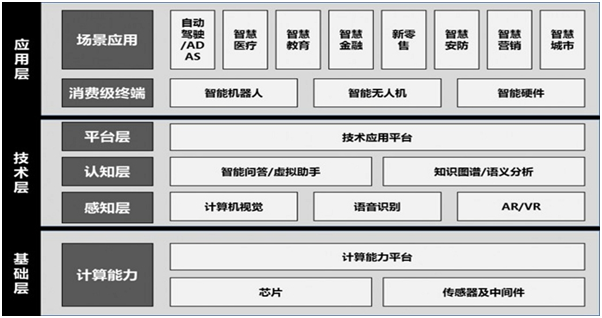
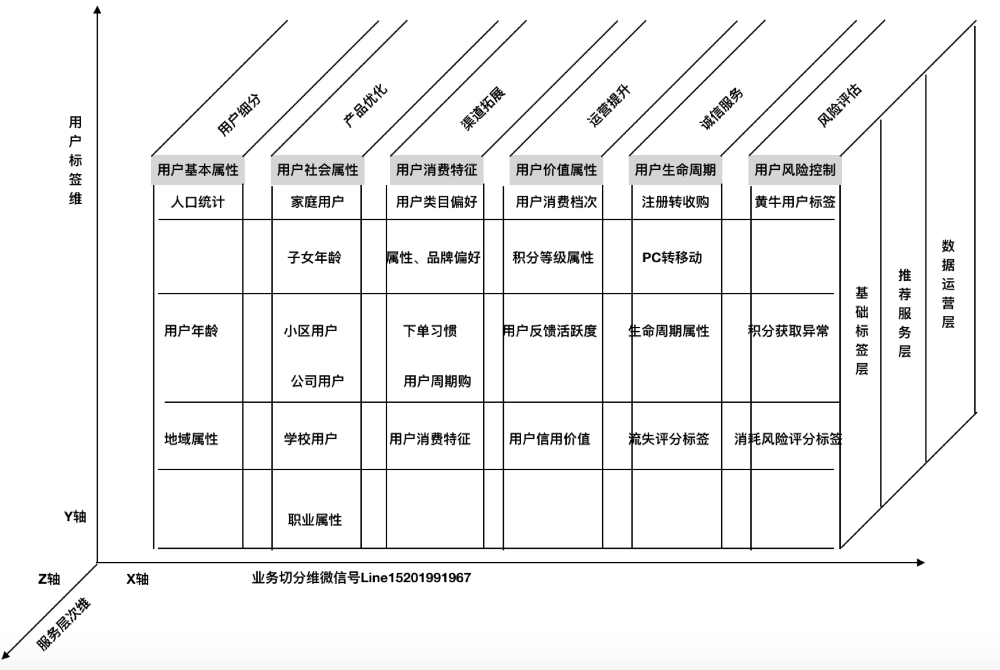
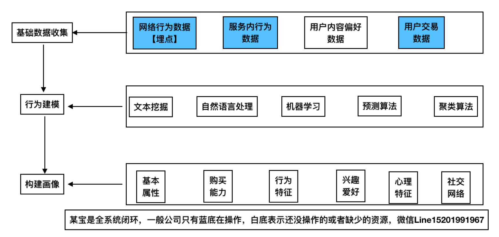
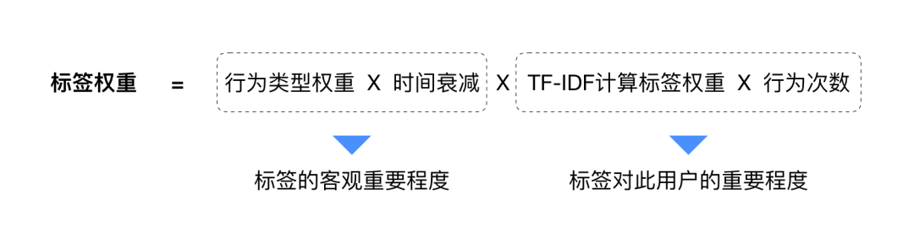

| 序号 | 修改时间   | 修改内容                               | 修改人 | 审稿人 |
| ---- | ---------- | -------------------------------------- | ------ | ------ |
| 1    | 2010-9-13  | 创建                                   | Keefe |        |
| 2    | 2010-12-28 | 增加学术会议机构等资源链接介绍         | 同上   |        |
| 3    | 2011-1-10  | 增加机器学习细节的认识，增加WEKA章节。 | 同上   |        |
| 4    | 2011-1-20  | 细化分类器算法的认识                   | 同上   |        |
| 5    | 2017-12-15 | 增加深度学习章节。                     | 同上   |        |
| 6    | 2018-7-10  | 增加知识图谱章节                       | 同上   |        |
| 7    | 2018-10-28 | 更新机器学习流程和建模章节             | 同上   |        |
| 8 | 2021-12-10 | 机器学习&深度学习章节迁移另文。新增用户画像、智能客服章节。 | 同上 |        |

---

# 目录

[TOC]

[目录... 1](#_Toc528493258)

[1    人工智能AI 4](#_Toc528493259)

[1.1    人工智能简介intro. 4](#_Toc528493260)

[1.1.1     各学科的贡献 （哲学…）... 4](#_Toc528493261)

[1.1.2     发展历程... 6](#_Toc528493262)

[1.1.3     学派，研究领域和分类... 6](#_Toc528493263)

[1.1.4     杰出人物介绍... 7](#_Toc528493264)

[1.1.5     当前研究进展和领域前沿... 8](#_Toc528493265)

[1.2    研究方法... 8](#_Toc528493266)

[1.2.1     Problem-solving and Resoning. 8](#_Toc528493267)

[1.2.2     问题表示（符号主义—谓词逻辑）... 9](#_Toc528493268)

[1.2.3     问题求解(搜索) 9](#_Toc528493269)

[1.2.4     知识与推理Knowledge and Reasoning. 9](#_Toc528493270)

[1.3    研究领域... 10](#_Toc528493271)

[1.3.1     机器学习... 10](#_Toc528493272)

[1.3.2     自然语言处理... 10](#_Toc528493273)

[1.3.3     模式识别... 10](#_Toc528493274)

[1.3.4     计算机视觉vision. 11](#_Toc528493275)

[1.3.5     机器人学... 11](#_Toc528493276)

[1.4    AI术语... 11](#_Toc528493277)

[1.5    本章参考... 11](#_Toc528493278)

[2    机器学习ML. 11](#_Toc528493279)

[2.1    机器学习简介... 12](#_Toc528493280)

[2.1.1     机器学习流程... 12](#_Toc528493281)

[2.1.2     常用术语... 12](#_Toc528493282)

[2.2    机器学习的类型... 12](#_Toc528493283)

[2.2.1     规则学习Rule-learning. 12](#_Toc528493284)

[2.2.2     贝叶斯学习... 13](#_Toc528493285)

[2.2.3     神经网络学习... 14](#_Toc528493286)

[2.2.4     支持向量机SVM.. 15](#_Toc528493287)

[2.3    分类classifiers/categorization. 15](#_Toc528493288)

[2.3.1     分类过程... 16](#_Toc528493289)

[2.3.2     分类器算法... 16](#_Toc528493290)

[2.3.3     文本分类示例... 18](#_Toc528493291)

[2.4    聚类cluster. 19](#_Toc528493292)

[2.4.1     算法... 19](#_Toc528493293)

[2.4.2     文本聚类示例... 20](#_Toc528493294)

[2.5    关联规则... 20](#_Toc528493295)

[2.5.1     Apriori算法... 20](#_Toc528493296)

[2.6    模型评估和优化... 21](#_Toc528493297)

[2.6.1     模型泛化... 21](#_Toc528493298)

[2.6.2     分类模型评估... 21](#_Toc528493299)

[2.6.3     回归模型评估... 23](#_Toc528493300)

[2.6.4     参数调整优化模型... 23](#_Toc528493301)

[2.7    本章参考... 23](#_Toc528493302)

[3    深度学习... 23](#_Toc528493303)

[3.1    本章参考... 24](#_Toc528493304)

[4    知识图谱... 24](#_Toc528493305)

[4.1    简介... 24](#_Toc528493306)

[4.2    知识图谱构建技术... 25](#_Toc528493307)

[4.2.1     信息抽取... 25](#_Toc528493308)

[4.2.2     知识融合... 26](#_Toc528493309)

[4.2.3     知识加工... 26](#_Toc528493310)

[4.2.4     知识更新... 26](#_Toc528493311)

[4.3    知识图谱的应用... 26](#_Toc528493312)

[4.4    本章参考... 27](#_Toc528493313)

[参考资料... 32](#_Toc528493326)

[参考书目... 32](#_Toc528493327)

[参考文献... 32](#_Toc528493328)

[附录... 32](#_Toc528493329)

[学术资源... 32](#_Toc528493330)

[其它资源... 33](#_Toc528493331)

[数据集... 33](#_Toc528493332)

表目录

[表格 1 AI三大学派比较__ 7](#_Toc528493333)

[表格 3 ML常用术语__ 12](#_Toc528493334)

[表格 4 分类主要模型列表__ 16](#_Toc528493335)

[表格 5 常用聚类方法列表__ 19](#_Toc528493336)

[表格 6 常用聚类分析算法列表__ 19](#_Toc528493337)

[表格 7 常用关联规则算法列表__ 20](#_Toc528493338)

[表格 8 IR检索系统的评测指标__ 21](#_Toc528493339)

图目录

[图 1 AI发展历程__ 6](#_Toc528493340)

[图 2 ROC曲线__ 22](#_Toc528493341)

[图 3 知识图谱的架构__ 25](#_Toc528493342)

[图 4 AI产业链__ 27](#_Toc528493343)

---

# 1  人工智能AI

## 1.1   人工智能简介intro

**人工智能**（Artificial Intelligence或简称AI）有时也称作**机器智能**，是指由人工制造出来的系统所表现出来的智能。通常人工智能是指通过普通计算机实现的智能。该词同时也指研究这样的智能系统是否能够实现，以及如何实现的科学领域。

**人工智能定义**：人工智能=人工(计算机)　＋　智能（特殊化程序）．从智能体角度来看，有两类智能，人类和计算机。

人工智能的定义有以下四种方法： [4]
*  Action humanly: 图灵测试方法1950年提出
*  Thinking humanly:
*  Thinking Rationally: laws of thought
*  Action Rationally:

**智能媒介Intelligent Agents**

智能媒介又叫智能体，是指某种能够行动的东西．

强智能和弱智能．强智能认为人是精密的计算机．（评：非常远大的梦想，但不是人类智能所能达到的）．弱智能关注的是提示人类和动物的形为所到达到的程度，智能机器被用作理解智能形为的手段．

### 1.1.1 各学科的贡献  （哲学…）

**哲学**

Main article: [Philosophy of artificial intelligence](http://en.wikipedia.org/wiki/Philosophy_of_artificial_intelligence)

Can a machine have a [mind](http://en.wikipedia.org/wiki/Mind) and [consciousness](http://en.wikipedia.org/wiki/Consciousness)? A few of the most influential answers to these questions are given below.[[147\]](http://en.wikipedia.org/wiki/Artificial_intelligence#cite_note-146)
*  [Turing's "polite convention"](http://en.wikipedia.org/wiki/Computing_Machinery_and_Intelligence)

* If a machine acts as intelligently as a human being, then it is as intelligent as a human being.* [Alan Turing](http://en.wikipedia.org/wiki/Alan_Turing) theorized that,
*  The [Dartmouth proposal](http://en.wikipedia.org/wiki/Dartmouth_Conferences)          1956
*  [Newell and Simon's physical symbol system hypothesis](http://en.wikipedia.org/wiki/Physical_symbol_system)
*  [Gödel's incompleteness theorem](http://en.wikipedia.org/wiki/Gödel's_incompleteness_theorem)
*  [Searle's strong AI hypothesis](http://en.wikipedia.org/wiki/Chinese_room#Strong_AI)
*  The [artificial brain](http://en.wikipedia.org/wiki/Artificial_brain) argument

**哲学的贡献：知识论，物质和意识．．．**

科学哲学也称自然辩证法．主要的理论有实在主义，经验主义，相对主义等．

**［知识从哪里来］**

知识的产生方式，一是先验知识；二是认为知识完全产生于观察，推理及归纳，如培根的经验主义，休漠的归纳原理．目前的主流是第二种，知识来源于实践．

**［物质和意识的关系］**

哲学中，物质和意识的关系是哲学的本源问题．通常有二种，一是一元论, 要么物质决定论, 要么意识决定论；二是二元论，某些意识可以超脱于自然之外，René Descartes(笛卡尔)第一个给出清晰的讨论．

​     人工智能中，涉及到肉体（物质的大脑）和精神的关系．肉体产生思维，还是思维可以独立于肉体．这涉及到*永生*问题．这也导致了研究人工智能的方向，基于肉体的仿生学和使用符号表示的计算机学．也产生了不同的学派，连结主义和符号主义．

**数学的贡献：形式表示与证明/算法/可计算性/可操作性/概率性**

**［可计算和不可计算］**

可计算的含义是，一个输入最终能得到一个输出．但现实生活中有一些例子，可以看到人的思维中包含不可计算的部分．如无中间过程突然得到的结果（直觉），不符合理性逻辑的行为．

​     人工智能中，如何模拟不可计算的? 理论基础, 量子力学中的[不确定性原理](http://zh.wikipedia.org/zh-cn/不確定性原理)．数学中的*可计算性*和*算法复杂性理论*．

**经济学的贡献：效用，决策和运筹学**
* 神经科学的贡献：大脑和神经网络，智能活动的物理基础(substrate)
* 心理学的贡献：人类和动物如何思想和工作．结论，人类思考和活动是一个信息处理过程．

**计算机工程的贡献：制造出能干的计算机**
* 控制论的贡献：人工制品怎么在自己的控制下工作．自我平衡系统/稳定性/优化设计

**经济学的贡献：复杂系统中的决策/验证环境**

以上揭示了计算机模型可用来表示**语言**，记忆和逻辑思维的心理过程．

### 1.1.2 发展历程

​                

图 1 AI发展历程

| 年代  | 事件                                                         | 备注 |
| ----- | ------------------------------------------------------------ | ---- |
| 1950  | 图灵的论文(Computing Machinery and Intelligence)提出了图灵测试、机器学习、遗传算法、增量学习，第一个清晰地描绘出AI的完整图像 |      |
| 1953  | [博弈论](http://zh.wikipedia.org/wiki/博弈論)。 Metropolis提出 模拟退火算法SA 的思想，Kirkpatrick在1983年成功地将其应用在组合最优化问题中。 |      |
| 1956  | 美国达特茅斯会议[Dartmouth](http://en.wikipedia.org/wiki/Dartmouth_College)，AI正式诞生。参与人共10人，其中包括赫伯特.西蒙[Herbert Simon](http://en.wikipedia.org/wiki/Herbert_Simon)，约翰.麦卡锡[John McCarthy](http://en.wikipedia.org/wiki/John_McCarthy_(computer_scientist)),，克劳德.香农, 亚伦.纽厄尔[Allen Newell](http://en.wikipedia.org/wiki/Allen_Newell)，马文.明期基[Marvin Minsky](http://en.wikipedia.org/wiki/Marvin_Minsky)． 约翰·麦卡锡首度提出「人工智能」这一概念，提出者约翰·麦卡锡也被誉为「人工智能之父」。 |      |
| 1960s | 1960年产生了**人工智能语言** [LISP语言](http://zh.wikipedia.org/wiki/LISP语言)。 1963 年，「人工智能之父」约翰·麦卡锡创建了斯坦福人工智能实验室（SAIL，Stanford Ar[ti](http://www.elecfans.com/tags/ti/)ficial [Intel](http://www.elecfans.com/tags/intel/)ligence Laboratory）。该实验室拥有多个领域的专家，涉及机器人技术、计算机视觉、机器学习、图像处理、自然语言处理等多个领域，代表人物包括一大批在人工智能领域闻名遐迩的人物，如 Christopher Manning 、吴恩达、李飞飞等。。 1966 年，MIT 计算机科学家 Joseph Weizenbaum 开发出首个自然语言处理程序——ELIZA，它是一个模拟罗杰斯心理治疗的聊天机器人。 1967 年，斯坦福大学 E.A. Feigenbaum 领导开发出第一个「专家系统」——DENRAL， 使得人工智能的研究以推理算法为主转变为以知识为主。 1969 年，阿瑟·布莱森（Arthur Bryson）和何毓琦（Yu-Chi Ho）提出机器学习领域最重要的算法——反向传播算法（Backpropaga[TI](http://bbs.elecfans.com/zhuti_715_1.html)on）。这种算法可用于多层人工[神经网络](http://www.elecfans.com/tags/神经网络/)，2000 年至今[深度学习](http://www.elecfans.com/tags/深度学习/)的发展都离不开它的启发。 |      |
| 1970s | 1973年，[生产系统](http://zh.wikipedia.org/wiki/生產系統)。1973年产生[PROLOG语言](http://zh.wikipedia.org/wiki/PROLOG语言)。 美国斯坦福国际研究所（Stanford Research Ins[TI](http://bbs.elecfans.com/zhuti_715_1.html)tu[te](http://www.elecfans.com/tags/te/)， SRI）研制出首台采用了人工智能学的移动机器人——Shakey。 1975年，美国Michigan大学J.Holland教授提出，并出版专著《Adaptation in Natural and Artificial Systems》。J.Holland教授所提出的GA通常为简单遗传算法（SGA）。 1976年，[框架理论](http://zh.wikipedia.org/wiki/框架理論)  1979年，汉斯·摩拉维克（Hans Moravec）在斯坦福大学就读研究生时期发明的 Stanford Cart，在无人干预的情况下自动穿过摆满椅子的房间并前后行驶了 5 小时。Stanford Cart 相当于早期[无人驾驶](http://www.elecfans.com/tags/无人驾驶/)汽车。 |      |
| 1988  | IBM 沃森研究中心发表《机器翻译的统计方法》（A STA[TI](http://bbs.elecfans.com/zhuti_715_1.html)S[TI](http://bbs.elecfans.com/zhuti_715_1.html)CAL APPROACH TO LANGUAGE TRANSLATION），预示着基于规则的机器翻译方法开始转变为基于概率的方法，并反映了一个更为广泛的转变：从「理解」眼前的任务的「机器学习」方法转变为基于已知例子的统计分析方法。 |      |
| 1990s | 1991年，蒂姆·伯纳斯－李（Tim Berne[rs](http://www.elecfans.com/tags/rs/)-Lee）发明的万维网首次上线。 1992年，Marco Dorigo在他的博士论文中引入[蚁群算法](http://baike.baidu.com/view/539346.htm#_blank)(ant colony optimization, ACO)，其灵感来源于蚂蚁在寻找食物过程中发现路径的行为。 1997 年，IBM 研发的「深蓝」（Deep Blue）成为第一个击败人类象棋冠军 Garry Kasparov 的电脑程序。 1998 年，斯坦福大学教授肯尼斯·萨里斯伯里（Kenneth Salisbury）公开外科机器人（robotic surgery）专利。 |      |
| 2000s | 2005 年，斯坦福大学教授 Sebastian Thrun 联合斯坦福大学 AI 实验室发明的第一辆自动驾驶汽车完成了 132 英里的 Mojava 沙漠路线，在 DARPA 超级挑战赛（DARPA Grand Challenge）上一举夺冠。 2009 年，李飞飞主导的 ImageNet 项目诞生了一个含有 1500 万张照片的数据库，涵盖了 22000 种物品。这个项目以及后来的一系列工作影响了整个计算机视觉领域发展。 2010 年，苹果公司推出一款内建在苹果 iOS 系统中的人工智能助理软件 Siri。 |      |
| 2010s | 2011 年，IBM 开发的自然语言问答计算机沃森在美国老牌益智节目「危险边缘」（Jeopardy！）中击败人类。 2012 年，杰夫·迪恩（Jeff Dean）和吴恩达（Andrew Ng）发布一份实验报告，他们给一个大型神经网络展示 1000 万张未标记的网络图片，发现神经网络能够识别出猫的形象。 2014 年，亚马逊推出了智能音箱 Echo 以及智能语音助手 Alexa。 2016 年，谷歌 DeepMind 研发的 AlphaGo 击败围棋世界冠军李世石。 |      |
| 2020s |                                                              |      |

> 备注：1990s表示1990-1999十年间，同理类推。

典型案例：MIT Eliza程序—聊天机器人，积木世界，中文屋等

### 1.1.3 学派和分类

目前人工智能的主要学派有下面三家：

(1) 符号主义(symbolicism)，又称为逻辑主义(logicism)、心理学派(psychologism)或计算机学派(computerism)，其原理主要为物理符号系统(即符号操作系统)假设智能和有限合理性原理。这个学派的代表人物有纽厄尔(Newell)、西蒙(Simon)和尼尔逊(Nilsson)等。

(2) **连接**主义(connectionism)，又称为*仿生*学派(bionicsism)或生理学派(physiologism)，其主要原理为神经网络及神经网络间的连接机制与学习算法。

(3) **行为主义**(actionism)，又称为*进化*主义(evolutionism)或*控制论*学派(cyberneticsism)，其原理为控制论及感知-动作型控制系统。

表格 1 AI三大学派比较

|          | 知识表达 | 黑箱 | 特征  学习 | 可解释性 | 大样本 | 计算复杂性 | 组合爆炸 | 环境互动 | 过拟合 |
| -------- | -------- | ---- | ---------- | -------- | ------ | ---------- | -------- | -------- | ------ |
| 符号主义 | 强       | 否   | 无         | 强       | 否     | 高         | 多       | 否       | 无     |
| 连接主义 | 弱       | 是   | 有         | 弱       | 是     | 高         | 少       | 否       | 有     |
| 行为主义 | 强       | 否   | 无         | 强       | 否     | 一般       | 一般     | 是       | 无     |

备注：1. 标红部分表示是比较不好的选项。

2. 机器学习是符号主义和连接主义的结合。

AI多种学习方式

* 机器学习：一般是基于概率理论。包括统计学习、贝叶斯学习、SVM等。
* 深度学习：从感知机发展起来的学习方法，其中神经网络是目前最火的方向。
* 强化学习：（英语：`Reinforcement learning`，简称`RL`）是机器学习中的一个领域，强调如何基于环境而行动，以取得最大化的预期利益。通常用于交互比较频繁的场景，如家政机器人。
* 迁移学习：利用数据、任务或模型之间的相似性，将在旧的领域学习过或训练好的模型，应用于新的领域这样的一个过程。

* 集成学习：集成方法是将几种机器学习技术组合成一个预测模型的元算法，以达到减小方差（bagging）、偏差（boosting）或改进预测（stacking）的效果。集成学习潜在的思想是即便某一个弱分类器得到了错误的预测，其他的弱分类器也可以将错误纠正回来。
* 神经网络：类似于大脑神经突触联接的结构进行信息处理的数学模型。从单层感知机、多层感知机，发展到神经网络（RNN/CNN）。

> 说明：监督学习处理认知问题，强化学习处理决策问题。

表格  AI常用学习方式的比较

|            | 深度学习 | 传统统计学习 | 集成树 |
| ---------- | -------- | ------------ | ------ |
| 表达能力   | 强       | 弱           | 中     |
| 特征获取   | 强       | 弱           | 中     |
| 数据约束   | 强       | 中           | 弱     |
| 数据量要求 | 大       | 中           | 中     |
| 训练难度   | 大       | 小           | 小     |
| 可解释性   | 弱       | 强           | 弱     |

### 1.1.4 杰出人物介绍

人工智能的杰出人物主要分布在CMU, MIT, Stanford，IBM，是达特茅斯会议参与者的主要工作场所．

[Herbert Simon](http://en.wikipedia.org/wiki/Herbert_Simon) **(西蒙, 1916~2001)**

他是AI研究的先驱者, 经济组织决策管理大师，于1978年获得诺贝尔经济学奖, 是因为他早年的工作: 基于满意度的模型-制定"足够好"的决策, 而不是艰苦计算获得最优化决策-能更好地描述真实人类行为.　CMU

[Allen Newell](http://en.wikipedia.org/wiki/Allen_Newell) **(**亚伦.纽厄尔1927~1992**)**

1975年与图灵奖获得者. CMU. 达特茅斯会议中与西蒙一起提出*物理符号系统假说*，为符号主义的经典理论．

[Marvin Minsky](http://en.wikipedia.org/wiki/Marvin_Minsky)(马文.明期基1927~)

1969年图灵奖获得者，创建麻省理工学院(MIT)人工智能实验室。1975年他首创框架理论(frame theory).

**Noam Chomsky(乔姆斯基, 1928~)**

他是[麻省理工学院](http://zh.wikipedia.org/zh-cn/麻省理工学院)[语言学](http://zh.wikipedia.org/zh-cn/语言学)的荣誉退休教授，在语言学，心理学和哲学上有杰出贡献。乔姆斯基的[生成语法](http://zh.wikipedia.org/zh-cn/生成语法)被认为是[20世纪](http://zh.wikipedia.org/zh-cn/20世纪)[理论语言学](http://zh.wikipedia.org/w/index.php?title=理论语言学&action=edit&redlink=1)研究上的重要贡献。他对[伯尔赫斯·弗雷德里克·斯金纳](http://zh.wikipedia.org/zh-cn/伯尔赫斯·弗雷德里克·斯金纳)所著《[口语行为](http://zh.wikipedia.org/w/index.php?title=口語行为&action=edit&redlink=1)》的评论，也有助于发动[心理学](http://zh.wikipedia.org/zh-cn/心理学)的[认知革命](http://zh.wikipedia.org/w/index.php?title=认知革命&action=edit&redlink=1)，挑战[1950年代](http://zh.wikipedia.org/zh-cn/1950年代)研究[人类行为](http://zh.wikipedia.org/zh-cn/人類行為)和[语言](http://zh.wikipedia.org/zh-cn/语言)方式中占主导地位的[行为主义](http://zh.wikipedia.org/zh-cn/行为主义)。他所采用以自然为本来研究语言的方法也大大地影响了语言和心智的[哲学](http://zh.wikipedia.org/zh-cn/哲学)研究。他的另一大成就是建立了[乔姆斯基层级](http://zh.wikipedia.org/zh-cn/乔姆斯基层级)：根据文法[生成力](http://zh.wikipedia.org/w/index.php?title=生成力&action=edit&redlink=1)不同而对[形式语言](http://zh.wikipedia.org/zh-cn/形式语言)做的分类。

[John McCarthy](http://en.wikipedia.org/wiki/John_McCarthy_(computer_scientist))(约翰.麦卡锡,1927~ )

1971年图灵奖获得者，斯坦福大学人工智能实验室的主任．1959年，发明了LISP语言. 1956年达特茅斯会议Dartmouth的发起者，号称人工智能之父．

[Tom Mitchell](http://www.cs.cmu.edu/~tom/)(米切尔)

Home: http://www.cs.cmu.edu/~tom/

[Machine Learning](http://www.cs.cmu.edu/~epxing/Class/10701/)一书作者．

### 1.1.5 当前研究进展和领域前沿

关于人工智能理论阶段，存在两种划分方法。

- 第一种划分方法是运算智能、感知智能和认知智能三个阶段。运算智能，即快速计算和记忆存储能力；感知智能，即视觉、听觉、触觉等感知能力；认知智能就是具有推理、可解释性的能力，也是人工智能的高级阶段。 可见，发展第三代人工智能，需要依靠知识、数据、算法和算力四个要素，其中的关键问题是算法。

- 第二种划分方法是感知智能、认知智能和决策智能三个阶段。 为了提高机器决策的准确度，需要加强复杂问题下，提升人机信任度，增强人类与智能系统交互协作智能的研究，即决策智能 。

人工智能的发展经历了表示计算到感知智能两个阶段，下一个阶段的核心是认知。 以上两种划分法对此存在共识，即目前发展处于第三代人工智能。

**［符号智能和计算智能］**

有人把人工智能分成两大类：一类是符号智能，一类是计算智能。符号智能是以知识为基础，通过推理进行问题求解。也即所谓的传统人工智能。计算智能是以数据为基础，通过训练建立联系，进行问题求解。人工神经网络、遗传算法、模糊系统、进化程序设计、人工生命等都可以包括在计算智能。

过去十年十大人工智能研究热点
1. 深度神经网络
• 深度神经网络是深度学习的基础，又被称为深度前馈网络（DFN）、多层感知机（MLP），可以理解为是有很多隐藏层的神经网络。深度神经网络可以在没有大量标记数据的情况下解决问题。代表算法包括卷积神经网络、循环神经网络、递归神经网络等。深度神经网络的被引用量保持了较长时间的稳定平稳增长；深度卷积神经网络技术则于2014年开始获得更多引用。目前，深度神经网络（DNN）是许多人工智能应用的基础，从自动驾驶汽车、癌症检测到大型游戏等。在这许多领域中，DNN实现了超越人类的准确率。

2. 特征抽取
• 特征抽取（Feature Extraction）热门是信息检索与推荐中的一项技术，专指使用计算机提取一组测量值中属于特征性的信息的方法及过程，并将所抽取出的有效实体信息进行结构化存储。目前特征抽取已引入机器学习、深度学习、神经网络技术，其中，神经网络计算已应用于图片特征抽取。针对某个特定图片，通过卷积神经网络对图片进行特征抽取得到表征图片的特征，利用度量学习方法如欧式距离对图片特征进行计算，对图片距离进行排序，得到初级检索结果，再根据图片数据的上下文信息和流行结构对图像检索结果进行重排序，从而提高图像检索准确率，得到最终的检索结果。

3. 图像分类
• 图像分类（Image Classification）是指计算机利用算法从给定的分类集合中给某个特定图像正确分配一个标签的任务，其目标是将不同的图像划分到不同的类别中，并实现最小的分类误差，较多应用于计算机视觉、信息检索与推荐领域。2012年，加拿大认知心理学家和计算机科学家 Geoffrey Everest Hinton 的博士生 Alex Krizhevsky 在 ILSVRC 将深度学习用于大规模图像分类中并提出了CNN模型，其计算效果大幅度超越传统方法，获得了ILSVRC2012冠军，该模型被称作AlexNet。从 AlexNet 之后，涌现了一系列 CNN 模型，不断地在 ImageNet 上刷新成绩。目前的深度学习模型的识别能力已经超过了人眼。

4. 目标检测
• 目标检测（Object Detection）作为计算机视觉和图像处理领域一个分支，是指利用图像处理与模式识别等领域的理论和方法，检测出数字图像和视频中存在的特定类别的目标对象，确定这些目标对象的语义类别，并标定出目标对象在图像中的位置。对象检测是对象识别的前提，具有很大发展潜力。对象检测已经有许多有用有趣的实际应用，如人脸识别、行人检测、视觉搜索引擎、计数、航拍图像分析等。深度学习模型在图像分类任务中碾压了其他传统方法。很多对象检测的新方法和新应用推动了深度学习最前沿的科技发展。 • 目前流行的目标检测算法有 One-stage 和 Two-stage 两种。 Two-stage 指的是检测算法需要分两步完成，即先获取候选区域、再进行分类与回归，比如 RCNN 系列算法，准确度较高但是速度慢； One-stage 检测不需要单独寻找候选区域， 典型的有 SSD/YOLO，其速度快但是准确性较低。对象检测在过去 10 年内出现了由基于区域的卷积神经网络（R-CNN）、 YOLO 分治网络、 SSD 等多种方法。这些新技术在速度和精确度上都较先有了很大提升。目前，计算机进行对象检测的能力在很多方面已经超越人类。例如， AI 通过深度学习进行对象检测和识别，已经可以更准确地检测乳腺癌。

5. 语义分割
• 语义分割（Semantic Segmentation） 是让计算机根据图像的语义进行分割，判断图像中哪些像素属于哪个目标。近年来，许多语义分割问题正在采用深度学习技术来解决，最常见的是卷积神经网络，在精度上大大超过了其他方法以及效率。目前语义分割的应用领域主要有：地理信息系统、无人车驾驶、医疗影像分析和机器人等领域。

6. 表示学习
• 表示学习（Representation Learning），是指将原始数据转换成能够被机器学习的一种深度学习技术。它能够从复杂的原始数据中提炼有效特征，剔除无效或者冗余信息，形成可用的数据表示。在知识表示学习中，词嵌入（Word Embedding）是自然语言处理的重要突破之一，它可以将词表示为实数域向量，进而为机器学习和深度学习提供模型训练的基础。近些年很多专家和学者利用词嵌入的表示学习原理进行相关领域的研究，主要的表示方法包括 Word2Vec、 One-hot、词共现等。这些方法已经成为当下人工智能技术应用的基础，为机器学习提供了高效的表示能力。

7. 生成对抗网络
• 生成对抗网络（Generative Adversarial Networks, GAN）是用于无监督学习的机器学习模型，由 Ian Goodfellow 等人在 2014 年提出。 由神经网络构成判别器和生成器构成，通过一种互相竞争的机制组成的一种学习框架。 GAN 功能强大，学习性质是无监督的，也不需要标记数据。传统的生成模型最早要追溯到 80 年代的RBM，以及后来逐渐使用深度神经网络进行包装的 AutoEncoder，然后就是现在的生成模型 GAN。 GAN 具有大量的实际用例，如图像生成、艺术品生成、音乐生成和视频生成。 此外，它还可以提高图像质量，并且完成图像风格化或着色、面部生成以及其他更多有趣的任务。

8. 语义网络
• 语义网络（Semantic Network）是一种以网络格式表达人类知识构造的形式，是人工智能程序运用的表示方式之一，相关研究主要集中在信息检索与推荐、知识工程领域。语义网络是一种面向语义的结构，它们一般使用一组推理规则，规则是为了正确处理出现在网络中的特种弧而专门设计的。语义网络可以深层次地表示知识，包括实体结构、层次及实体间的因果关系；无推理规律可循；知识表达的自然性可以直接从语言语句强化而来。

9. 协同过滤
• 协同过滤（CF）是推荐系统使用的一种技术，通过收集来自多个用户的偏好、兴趣、评价标准等用户行为数据来过滤信息， 并自动预测（过滤）用户兴趣的方法，为用户提供有针对性的推荐及其所需信息。大多数协同过滤系统都应用基于相似度索引的技术。 协同过滤是解决信息超载问题的一个有效办法。无论是基于用户-用户的协同过滤，还是项目-项目的协同过滤，都有效地提高了用户信息的使用效率。

10. 机器翻译
• 机器翻译（Machine Translation），又称为自动翻译，是利用计算机把一种自然源语言转变为另一种自然目标语言的过程，通常指自然语言之间句子和全文的翻译。它是自然语言处理（Natural Language Processing）的一个分支，与计算语言学（Computational Linguistics）、自然语言理解（Natural LanguageUnderstanding）之间存在密不可分的关系。机器翻译是人工智能的终极目标之一，其核心语言理解和语言生成是自然语言处理的两大基本问题。近几年来，随着深度学习技术的发展，神经机器翻译取得了巨大进展，其生成的译文接近自然语句，成为了主流语言学习模型。

**会议杂志**

* IJCAI　二年一次

* ECAI AAAI 各一年一次

**其它**
*  图灵测试－洛伯纳奖Loebner Prize website 1990~present
*  CVPR 计算机视觉领域最著名的会议叫CVPR，这个PR就是模式识别。

## 1.2   研究方法

**研究方法分类**

**［仿生学和计算机方法］**

* 仿生学算法有模仿蚂蚁群体的蚁群算法，模仿达尔文进化论的遗传算法，模仿热力学中固体降温过程的模拟退火算法等。 （评，仿生学的本质是基于物质材料决定于思维）．

* 计算机方法包括数学建模和心理学中的启发式程序。 常规的启发式搜索算法有：回溯和分支限界。

### 1.2.1 Problem-solving and Resoning

**强人工智能**观点认为*有可能*制造出*真正*能 [推理](http://zh.wikipedia.org/wiki/推理)（[Reasoning](http://en.wikipedia.org/wiki/Reasoning)）和[解决问题](http://zh.wikipedia.org/wiki/解決問題)（[Problem_solving](http://en.wikipedia.org/wiki/Problem_solving)）的智能机器，并且，这样的机器能将被认为是有知觉的，有自我意识的。

智能体的功能分解：感知－＞建模－＞规划－＞行动，如20世纪60年代Stanford产生的认识机器人－沙基shakey.

新人工智能的三大原则：实体化，现场性，自底向上设计。如基于行为的机器人．

### 1.2.2 问题表示（符号主义—谓词逻辑）

零价(谓词逻辑Propositional Logic)：C<= X^Y^Z （具备最低级的描述能力）

属性：

一阶：Horn子句

### 1.2.3 问题求解(搜索)

首先形式化问题, 以八皇后问题为例.
*  状态stete
*  初始状态
*  后继函数action:  left, right, up, down
*  目标测试goal
*  路径消耗

问题空间的搜索策略

1)     学习的归纳本质

2)     穷尽搜索: 广度优先,深度优先…

3)     启发式搜索: 回溯, 分支限界, 贪婪法,遗传算法,联机搜索…

4)     对抗搜索: 博弈

### 1.2.4 知识与推理Knowledge and Reasoning

知识可分为确定性知识和不确定性知识.

**确定性知识**

常规的知识可通过逻辑推理的方式获得.

**不确定性知识**

不确定性知识常通过概率统计的方式获得, 如
*  贝叶斯定理:　NB，贝叶斯网络等
*  隐马尔可夫模型(Hidden Markow Model, HMM)
*  卡尔曼滤波器

## 1.3   研究领域

**研究领域**

*  [自然语言处理](http://zh.wikipedia.org/wiki/自然語言處理)(NLP; Natural Language Processing)，听者和说者之间的通讯。
*  [知识表现](http://zh.wikipedia.org/wiki/知識表現) (Knowledge Representation)，储存信息。
*  自动推理，运用储存的信息来回答或提取新的结论。
*  [机器学习](http://zh.wikipedia.org/wiki/机器学习) (Machine Learning)，能适应新的环境并检测和推断新的模式
*  计算机视觉，可以感知物体
*  机器人技术，可以操纵和移动物体
*  此外还包括[智能搜索](http://zh.wikipedia.org/wiki/智能搜索) (Intelligent Search)，模式识别等

**分类一：**

当前AI的方向大致可分为四个，分别是语言、图像、自然语言处理和智能硬件。

搜索和推荐可归入自然语言处理领域。

**分类二：学术界UCLA朱松纯将AI分为六个领域，分别是：**

（1）计算机视觉（暂且把模式识别，图像处理等问题归入其中）、

（2）自然语言理解与交流（暂且把语音识别、合成归入其中，包括对话）、

（3）认知与推理（包含各种物理和社会常识）、

（4）机器人学（机械、控制、设计、运动规划、任务规划等）、

（5）博弈与伦理（多代理人agents的交互、对抗与合作，机器人与社会融合等议题）、

（6）机器学习（各种统计的建模、分析工具和计算的方法），

分类三：工业界按应用场景将AI分为
*  自动驾驶 （车联网）
*  机器人
*  智能客服

### 机器学习

机器学习是经典符号主义和联结主义的结合．它是人工智能AI一个极重要的研究领域。

详见 《[机器学习&深度学习.md](./机器学习&深度学习.md)》

### 自然语言处理

详见 《[自然语言处理.md](./自然语言处理.md)》

### 模式识别

模式识别（英语：Pattern Recognition），就是通过[计算机](https://baike.baidu.com/item/计算机)用[数学](https://baike.baidu.com/item/数学)技术方法来研究模式的自动处理和判读。我们把[环境](https://baike.baidu.com/item/环境)与[客体](https://baike.baidu.com/item/客体)统称为“模式”。

信息处理过程的一个重要形式是生命体对环境及客体的识别。对人类来说，特别重要的是对[光学](https://baike.baidu.com/item/光学)信息（通过[视觉](https://baike.baidu.com/item/视觉)器官来获得）和[声学](https://baike.baidu.com/item/声学)信息（通过听觉器官来获得）的识别。这是模式识别的两个重要方面。市场上可见到的代表性产品有[光学字符识别](https://baike.baidu.com/item/光学字符识别)、[语音识别](https://baike.baidu.com/item/语音识别)系统。

**研究领域**

模式识别研究主要集中在两方面，一是研究生物体(包括人)是如何感知对象的，属于认识科学的范畴，二是在给定的任务下，如何用计算机实现模式识别的理论和方法。前者是生理学家、心理学家、[生物学](https://baike.baidu.com/item/生物学)家和神经生理学家的研究内容，后者通过数学家、信息学专家和[计算机科学](https://baike.baidu.com/item/计算机科学)工作者近几十年来的努力，已经取得了系统的研究成果。

**应用**

模式识别可用于文字和语音识别、遥感和医学诊断等方面。

### 计算机视觉 Vision

详见 《[计算机视觉.md](./计算机视觉.md)》

### 应用场景划分（场景AI）

* 机器人学
* 自动驾驶
* 智能客服

#### 自动驾驶

SAE International 设计了一套 系统，将驾驶自动化级别分为 0 到 5 级。目前，自动驾驶汽车基本上都有学习许可证，但在允许自动驾驶汽车在没有辅助的情况下自主在道路上行驶之前，它们必须先获得公众的认可。

自动化水平

* 0 级：没有自动化能力。驾驶系统可能暂时接管车辆控制功能——例如防抱死制动和电子稳定控制——但不能持续控制车辆。
* 1 级：驾驶员辅助。具备一些辅助功能，例如自动巡航控制和停车辅助。
* 2 级：部分自动化。驾驶员需要一直监控汽车，但在某些驾驶条件下无需手动转向、制动或加速。
* 3 级：有条件的自动化。车辆在大部分情况下都可以自动驾驶，但驾驶员必须时刻保持警惕，以便根据需要接管控制权。
* 4 级：高度自动化。车辆可以完全自主运行，但这仅限于特定的道路或条件。
* 5 级：全自动化。车辆可以完全自主运行，无需任何人类驾驶员干预。

今天市面上销售的大多数新车都是 1 级的，具有自动巡航控制和停车辅助等功能。包括特斯拉、优步、Waymo、奥迪、沃尔沃、梅赛德斯 - 奔驰和凯迪拉克在内的许多公司已经推出了具有自动加速和制动功能的 2 级车辆。

## 1.4 AI业界

### AI产业链

图 AI产业链 （图来自于 中国信通院的《AI白皮书》 ）

整个AI产业链通过三个层级将从业的公司分为了20个子类，简要说明如下：

- ​	基础层为整体产业提供算力，其中硬件部分包括芯片、传感器与中间件。芯片领域典型公司如寒武纪、深鉴科技，从事包括GPU、FPGA及ASIC等各类AI芯片的研发设计，由于技术门槛过高、投资周期长，目前国内仅有极少部分具备足够技术积累的初创企业参与其中。而计算能力平台以云计算为整个AI产业链提供算力，除了3A(AWS、Azure、阿里云)外，国内典型的初创公司有如七牛云、青云，由于深度学习的持续火爆让全球AI产业普遍面临算力瓶颈，未来预期将有更多参与者进入计算能力平台这一领域。

- ​	技术层主要为整体产业链提供通用AI技术能力。其中感知层包括计算机视觉和语言识别两项重要的机器感知任务，由于这两项技术由于相对成熟，目前有大量的初创公司选择了这两个领域，如计算机视觉云集了商汤科技、旷视科技、云从科技等大量独角兽;而认知层定位为“机器大脑”，包括知识图谱/语义分析，以及智能问答/虚拟助手两个核心领域，顶部的平台层则以通用技术应用平台的形式提供深度学习、模式识别等技术应用服务，对接应用层。

- ​	应用层按照对象不同，可分为消费级终端应用以及行业场景应用两部分。消费级终端包括智能机器人、智能无人机以及智能硬件三个方向，其中智能硬件领域从业公司包括如Rokid等智能音箱玩家，致力于消费级硬件的智能化。场景应用部分对接各类外部行业的AI应用场景，比如智慧医疗、智慧金融等。

最后需要说明的是，深耕AI行业应用场景的公司往往也具备了技术层的一些核心技术能。

### AI芯片

参见  《[运维专题](../../软件工程/运维专题.md)》芯片计算架构章节

AI芯片也被称为AI加速器或计算卡，即专门用于处理人工智能应用中的大量计算任务的模块（其他非计算任务仍由[CPU](https://baike.baidu.com/item/CPU/120556)负责）。当前，AI芯片主要分为 [GPU](https://baike.baidu.com/item/GPU/105524) 、[FPGA](https://baike.baidu.com/item/FPGA/935826) 、[ASIC](https://baike.baidu.com/item/ASIC/2014676)、TPU（推理处理器）。

### AI企业

表格 1 AI能力的头部企业

| 能力项             | 分项                 | 头部企业                                       | 备注 |
| ------------------ | -------------------- | ---------------------------------------------- | ---- |
| 感知层-语音技术    | 语音识别、长语音识别 | 科大讯飞、云知声、思必驰                       |      |
| 感知层-计息机视觉  | 图像技术             | 商汤科技、旷视科技、云从科技、依图科技         |      |
| 感知层--计息机视觉 | 文字识别             | 汉王科技                                       | OCR  |
| 感知层--计息机视觉 | 人脸与人体识别       | 科沃斯机器人                                   |      |
| 感知层--计息机视觉 | 视频技术             | 海康威视                                       |      |
| 感知层             | AR与VR               | 宇视科技                                       |      |
| 认知层             | 自然语言处理         |                                                |      |
| 认知层             | 知识图谱             |                                                |      |
| 应用层-消费级终端  | 无人机               | 大疆创新                                       |      |
| 应用层-消费级终端  | 机器人               | 图灵、深圳普渡科技、                           |      |
| 基础层-计算能力    | 数据智能             | 3A(AWS、Azure、阿里云)、 		七牛云、青云  |      |
| 基础层-芯片        | 芯片设计             | 华为海思、英伟达、ARM、英特尔、 		中微创 |      |
| 基础层-芯片        | 芯片代工             | 台积电、三星、中芯国际、                       |      |
| 基础层-传感器      |                      |                                                |      |

表格 2 中国AI头部企业简介

| 企业名       | 成立时间 | 企业                                                         | 优势领域             |
| ------------ | -------- | ------------------------------------------------------------ | -------------------- |
| 科大讯飞     | 1999     | 中国移动是二股东。                                           | 语音                 |
| 商汤科技     | 2014.11  | 商汤科技建立了国内顶级的自主研发的深度学习超算中心，并成为中国一流的人工智能算法供应商。创始人：汤晓鸥。估值20亿美元。 | 计算机视觉和深度学习 |
| 旷视科技     | 2011.10  | 创始人：印奇、唐文斌、杨沐。 		6轮投资，估值10亿美元。 |                      |
| 依图科技     | 2012.10  | D轮，估值10亿人民币。                                        |                      |
| 云从科技     | 2015.4   | C轮，估值35亿人民币。                                        |                      |
| 中科创达     | 2008     | 2008年成立。致力于提供卓越的[智能终端](https://www.qianjia.com/search/search/index?Keywords=建筑智能化&SearchclassName=资讯)操作系统平台技术及解决方案。 |                      |
| 图灵机器人   |          | 隶属北京光年无限科技公司，于2014年11月第一次发布图灵机器人。率先在业界发布了第一款AI机器人操作系统Turing 		OS，是中文语境下智能度最高的机器人大脑。 | 机器人               |
| 大疆创新     |          | 全球消费级无人机最大的企业，占领了市场70%的份额。            | 无人机               |
| 深蓝科技     | 2014     | 2014年创建，致力于人工智能基础领域研究，拥有深度学习、生物智能识别等智能算法核心技术，在自动驾驶、智能机器人、生物质能、AI芯片等众多领域居行业领导地位 | 人工智能基础研究     |
| 依图科技     |          | 依图是国内唯一一家拥有10亿级人像库对比能力的公司。           | 图像识别、人像识别   |
| 云知声       | 2012     |                                                              | 语音                 |
| 思必驰       |          |                                                              | 语音、智能车载       |
| 佳光科技     | 2016     | 领先的车规级激光雷达供应商。                                 |                      |
| 深圳普渡科技 |          | 中国餐饮机器人领导品牌，全球领先的AI机器人系统服务商。       | 餐饮机器人           |
| 深圳云天励飞 |          | 平台级人工智能公司，拥有全球首创“云+端”的视觉智能技术，全球首套动态人像识别系统天云“深目”。 | 计算机视觉           |
|              |          |                                                              |                      |

备注：华为、百度、阿里、腾讯也全面深入到AI的各个领域。

1. AI四小龙指商汤、旷视、依图和云从科技。

表格 3 全球AI头部企业简介

| 企业名     | 企业                                                         | 优势领域           |
| ---------- | ------------------------------------------------------------ | ------------------ |
| 英伟达     | GPU                                                          | 芯片               |
| ARM        | 英国ARM公司是全球领先的半导体知识产权（IP）提供商。全世界超过95%的智能手机和平板电脑都采用ARM架构。2016.7，软银以310亿美元收购ARM；2020.8，英伟达以400亿美元收购ARM。 | 芯片设计           |
| 华为海思   |                                                              | 芯片设计           |
| 台积电     | 全球最大的芯片代工厂，占有的芯片代工业务占有全球大约50%以上的比例。 | 芯片代工           |
| 微软       | 人工智能平台供应商，Azure云。                                | 云计算、深度学习、 |
| Infor      | 科尔曼（Coleman）人工智能平台                                |                    |
| DeepMind   | 2014年被谷歌以4亿美元的价格收购，并成为人工智能领域发展的支柱。DeepMind的重点在于将研究转化为成果，同时其专注于能源、健康和科学等关键领域。 |                    |
| Facebook   | 致力于解决一些有争议的使用案例，比如处理假新闻，同时它也在尝试开发以信息传送为目的人工智能。 |                    |
| IBM        | IBM的人工智能平台沃森的任务是构建虚拟代理和聊天机器人，专门回答客户的问题。 | 智能客服           |
| Salesforce | Einstein的母公司。Einstein是Salesforce在全球范围内部署的全新人工智能平台。Einstein同样以顾客为导向，从大量数据中学习，形成预测从而使商业程序获益。 |                    |
| OpenAI     | 非盈利研究小组                                               |                    |
| 苹果       | 人工智能助手Siri的到来，Siri是在2011年人工智能还未兴起之时发布的。 |                    |
| AWS        | 智能语音助手Alexa，AWS-全球最大的云服务平台提供商。          | 云计算、           |
| Banjo      | 利用人工智能在社交媒体领域进行搜索，从而根据重要的场合和环境来确定一家公司的地位。 |                    |

## 1.5 AI平台

详见 《[AI中台.md](./AI中台.md)》

## 1.6 术语

端：指移动终端device，如手机。

管：管道PIPE，连接云和端的管理，包括智能管理、移动运营商等。

边：边缘网关。

云：Cloud，包括公有、私有和混合云。

芯：芯片

## 本章参考

- 一文纵览人工智能的23个分支 http://www.chaoqi.net/xinchao/2018/0102/107317.html
- 朱松纯教授浅谈人工智能：现状、任务、构架与统一 https://www.sohu.com/a/227854954_297710
- 模式识别 [https://baike.baidu.com/item/%E6%A8%A1%E5%BC%8F%E8%AF%86%E5%88%AB](https://baike.baidu.com/item/模式识别)
- 逐个看看全球 18 件 AI 大事记 www.elecfans.com/rengongzhineng/892836.html
- 阿里首次全面公开展示AI布局（附布局图/成绩单/六产业详解） http://www.cbdio.com/BigData/2017-12/21/content_5651895.htm
- 500家国内AI企业大数据分析：产业布局与融投风云 http://ai.51cto.com/art/201709/552696.htm
- 《2017年中美人工智能创投现状与趋势研究报告》
- https://github.com/dformoso/machine-learning-mindmap
- 2020年人工智能百强 http://www.enet.com.cn/article/2021/0412/A202104121264535.html
- 自动驾驶：是炒作还是现实？ https://mp.weixin.qq.com/s/1AaGIY0BzinrO9DYrQJsIw

# 2  知识图谱

## 2.1   简介

**知识图谱的历史**

知识图谱的概念是由谷歌公司提出的。2012年5月17日，谷歌发布知识图谱项目，并宣布以此为基础构建下一代智能化搜索引擎。

中国科学院计算机语言信息中心董振东领导的知网(HowNet)项目，其知识库特点是规模相对较小、知识质量高、但领域限定性较强。

**知识图谱的定义**

知识图谱是结构化的语义知识库，用于以符号形式描述物理世界中的概念及其相互关系。其基本组成单位是“实体－关系－实体”三元组，以及实体及其相关属性－值对，实体间通过关系相互联结，构成网状的知识结构。

**知识图谱的架构**

知识图谱的架构，包括知识图谱自身的逻辑结构以及构建知识图谱所采用的技术（体系）架构，后者是本文讨论的重点。

知识图谱的构建过程是从原始数据出发，采用一系列自动或半自动的技术手段，从原始数据中提取出知识要素（即事实），并将其存入知识库的数据层和模式层的过程．这是一个迭代更新的过程，根据知识获取的逻辑，每一轮迭代包含3个阶段：信息抽取、知识融合以及知识加工。

 

图 4 知识图谱的架构

## 2.2   知识图谱构建技术

知识图谱构建技术可划分为**信息抽取**、**知识融合**和**知识加工。**

### 2.2.1 信息抽取

信息抽取是一种自动化地从半结构化和无结构数据中抽取实体、关系以及实体属性等结构化信息的技术。涉及的关键技术包括：实体抽取、关系抽取和属性抽取。

**实体抽取(命名实体识别NER) **
 监督学习和规则相结合的办法：Lin等人采用字典辅助下的最大熵算法，在基于Medline论文摘要的GENIA数据集上取得了实体抽取准确率和召回率均超过70%的实验结果。

**关系抽取**
 2007年，华盛顿大学图灵中心的Banko等人[1](https://blog.csdn.net/qq_34435926/article/details/79926633#fn:1)提出了面向开放域的信息抽取方法框架(open information extraction, OIE)，并发布了基于自监督(self-supervised)学习方式的开放信息抽取原型系统(TextRunner)。该系统采用少量人工标记数据作为训练集，据此得到一个实体关系分类模型，再依据该模型对开放数据进行分类，依据分类结果训练朴素贝叶斯模型来识别“实体－关系－实体”三元组，经过大规模真实数据测试，取得了显著优于同时期其他方法的结果。

实体关系的抽取包含隐藏关系抽取和确定关系抽取。使用方法如SVM。
*  隐藏关系：通过预先定义，包括包含关系、位置关系、雇佣关系等等。
*  确定关系：语句中已经明确实体之间的关系。

**属性抽取**

属性抽取一般是从百科类网站上的半结构化数据中抽取，或者是采用数据挖掘的办法直接从文本中挖掘实体属性与属性值之间的关系模式。据此发现对属性名和属性值在文本中的定位。

### 2.2.2 知识融合

对信息抽取得到的扁平化的、缺乏性和逻辑性的数据进行清理和整合。

**知识合并**

从第三方知识库产品或已有结构化数据获取知识输入。

**合并外部知识库**
 Mendes等人[7](https://blog.csdn.net/qq_34435926/article/details/79926633#fn:7)提出了开放数据集成框架(linked data integration framework, LDIF)，用于对LOD知识库产品进行融合。

**合并关系数据库**
 使用RDB2RDF的开源工具：Triplify、D2RServer、OpenLink Virtuoso、SparqlMap等。

**其他半结构化方式存储(XML、CSV、JSON)**
 从XML转化为RDF：XSPARQL
 从XML和CSV转化为RDF：Datalift
 转化的知识元素经过实体链接，就可以加入到知识库中，实现知识的合并。

### 2.2.3 知识加工

包括本体构建、知识推理和质量评估。

**本体构建**

**知识推理
** 从知识库中已有的实体关系数据出发，经过计算机推理，建立实体间的新关联，从而拓展和丰富知识网络。
 知识推理的方法分为：基于逻辑的推理和基于图的推理，前者主要包括一阶谓词逻辑、描述逻辑以及基于规则的推理，后者主要基于神经网络模型或Path Ranking算法，比如Socher等人[8](https://blog.csdn.net/qq_34435926/article/details/79926633#fn:8)将知识库的实体表达为词向量的形式，进而采用神经张量网络模型(neural tensor networks)进行关系推理，在WordNet和FreeBase等开放本体库上对未知关系进行推理的准确率分别达到86.2%和90.0%。

**质量评估
** 对知识的可信度进行量化，通过舍弃置信度较低的知识，可以保障知识库的质量。

### 2.2.4 知识更新

数据驱动下的全面更新和增量更新。

## 2.3  知识图谱的应用

**深度问答**

系统首先在知识图谱的帮助下对用户自然语言提出的问题进行语义分析和语法分析，进而将其转化成结构化形式的查询语言，然后在知识图谱中查询答案。对知识图谱的查询通常采用基于图的查询语言(SPARQL)

**基于知识图谱的问答系统**

* 基于信息检索的问答系统
   先将问题转变为一个基于知识库的结构化查询，从知识库中抽取与问题中实体相关的信息来生成多个候选答案，然后再从候选答案中识别出正确答案。
* 基于语义分析的问答系统
   先通过语义分析正确理解问题的含义，然后将问题转变为知识库的精确查询，直接找到正确答案。

**智能搜索**

知识图谱以结构化方式进行存储，用户搜索使用自然语言。

通用模式匹配、知识拆解、合并求解三个层次渐进分析。

## 本章参考

* 知识图谱构建技术综述 《计算机研究与发展》, 2016, 53 (3):582-600 https://blog.csdn.net/qq_34435926/article/details/79926633

* [知识图谱实战篇] 一.数据抓取之Python3抓取JSON格式的电影实体)  https://blog.csdn.net/eastmount/article/details/86714051

# 3 用户画像

用户画像的概念由Alan Cooper提出，他将其定义为在一系列真实数据之上建立的用户模型，这里的用户画像也被认为是真实用户的虚拟形象。

用户画像又称用户角色，作为一种勾画目标用户、联系用户诉求与设计方向的有效工具，用户画像在各领域得到了广泛的应用。

用户画像的核心是为用户打标签，即——将用户的每个具体信息抽象成标签，利用这些标签将用户形象具体化，从而为用户提供有针对性的服务。

我理解的用户画像是一种标签（浅层次）、数据的集合体（深层次），最终的导向还是获取用户的信息，并提供战略决策。

**标签**

标签又可以分为三大类（宽泛）：

* 统计类标签：这类标签是最为基础也最为常见的标签类型，例如：对于某个用户来说，其姓名、性别、年龄、地市、活跃时长等，这类数据可以从用户注册数据、用户消费数据中得出，该类数据构成了用户画像的基础。
* 规则类标签：该类标签基于用户行为确定的规则产生。例如：定义该用户为高频投诉用户，规则为“近30天投诉次数＞10”；在实际开发画像的过程中，由于运营人员对业务更为熟悉，而数据人员对数据的结构、分布、特征更为熟悉，因此规则类标签的规则由运营人员和数据人员共同协商确定。
* 学习挖掘类标签：该类标签通过系统智能化学习挖掘产生，用于对用户的某些属性或某些行为进行预测判断；例如：根据用户的消费行为习惯判断该用户的消费能力、对某类商品的偏好程度，该类标签需要通过算法挖掘产生。

用户画像的核心工作是为用户打标签。打标签的重要目的之一就是为了让用研或者产品能够理解并且方便数据统计。

标签知识图谱化图如下图：

**数据分析**

数据分析的本质是获得信息和知识，从而在判断和决策中使用。

根据分析的方法和目的，数据分析可以被划分为：

* 描述性分析（Descriptive Analysis）：将数据整合为一份可视化的报告，进行演讲或陈述，但它不能解释某种出现的结果及未来发生的事情。
* 预测性分析（Predictive Analysis）：预测性分析不仅可以对数据特征和变量（可以假定取消范围的因素）之间的关系进行描述，还可以基于过去的数据预测未来。预测性分析首先会确定变量值之间的关联，然后基于这种已知的关联预测另一种现象出现的可能性（如：某短视频中会产生广告，通过行为事件进行预测你购买/下载产品的可能性）。
* 决策性分析（Decision Analysis）：通过对比、验证等手段，直接反应情况，给出明确的好坏。

**数据**

数据据又分为静态和动态数据：

* 静态信息数据：静态数据在很长的一段时间内不会变化，一般不随运行而变。包含有：人的基本属性，公司基本属性、商业属性等等；一般来说，做调研获得的静态数据都是真实的信息，无需进行分析和清晰。

* 动态信息数据：动态数据是常常变化，直接反映事务过程的数据，比如，网站访问量、在线人数、日销售额等等，也就是用户不断变化的行为。

得出的数据是为了完成用户画像的架构图：

可分为基础属性、行为建模和收集数据。

* 基础属性：包括已知属性、兴趣爱好、消费能力等等。
* 行为建模：包括数据挖掘、数据处理和数据算法。
* 收集数据：包括用户行为数据/用户偏好数据/用户交易数据

用户画像产出物通常有用户群画像、用户标签管理和用户分群。

* 用户群画像：将用户归入一个群里，用户群具有某种共同特征，这相当于用户分类（已有类别）或聚类（新发现类别）。

* 用户标签管理：可以自己订制规则生成标签。如根据登陆时间将用户分层为活跃和不活跃。
* 用户分群：用户分层里更细致的类别。

## 用户画像实现技术

构建用户画像的核心流程如下图：

从三个部分——标签的层级、生产、权重方面，分析了构建用户画像中所用到的AI算法。

用户画像落实到产品设计，本质上是**将数据组合成数据特征，从而形成用户的数据模型**。

构建用户画像的主流方法有4种：

1. 基于数据统计
2. 基于规则定义
3. 基于聚类
4. 基于主题模型

前两者是基于已有数据的构建方法，其缺陷是无法处理数据缺失或不在规则范围内的用户。

**标签的层级**

**1、原始数据**

来源于用户的基础信息、交易数据、访问数据，如：用户的注册手机号码、用户的历史订单、用户的访问轨迹等。

**2、事实标签**

是对原始数据进行统计分析后的初步提炼结果。

**3、模型标签及预测标签**

**3-1、模型标签**

由一个或多个事实标签组合而成，是基于模型训练的结果。以模型标签“交易偏好”为例，它是由交易商品类型、交易场景、交易来源这几个事实标签组合而成的。

**3-2、预测标签**

以已有的模型标签数据作为特征，经过机器学习生产的标签。由于预测标签会映射成为模型标签，所以在图3中将2者放置于同一个层级。

**4、策略标签**

策略标签，则是用户标签构建的最终目的，根据目的提炼用户，并对用户进行定向的营销。

标签的层级，指导着产品经理构建用户画像的每个步骤。前两个层级，我们需要对缺失的数据建立数据源，对数据进行清洗、修复以及特征构建等；后两个层级，我们需要使用合适的方式生产标签。

**标签的生产**

主题模型，最开始运用于内容领域，目的是找到用户的偏好，它将内容划分为了3个层级：**分类、主题、关键词。**在用户标签中我们可以参照分类算法将用户进行分类、聚类，使用关键词的算法挖掘用户的偏好，从而生产标签。

| 内容层次 | 主要算法        | 说明                               |
| -------- | --------------- | ---------------------------------- |
| 分类     | 逻辑回归、SVM等 | 一般机器学习的分类算法即可满足要求 |
| 主题     |                 |                                    |
| 关键词   | TF-IDF          |                                    |

**标签的权重**

标签权重的计算公式来源于赵洪田撰写的文章[《用户标签之标签权重算法》](https://mp.weixin.qq.com/s?__biz=MzI0OTQyNzEzMQ==&mid=2247487211&idx=1&sn=848069327f8c778e42427158f20f9b36&chksm=e990eb3fdee7622915479093a8f43f61dc8772cc681498f95dbde6960f11c5ed8f75bde29a8e&scene=21#wechat_redirect)，权重公式的解读如下：

**1、行为类型权重**

指的是对于同一类标签，由于其行为的轻重不同所以权重不同。

如：用户对于某商品有过生成订单的行为，根据订单未支付、已支付未退款、已支付已退款三种订单状态，制定不同的权重。

**2、时间衰减因子**

时间衰减因子体现了**标签的热度随着时间逐渐冷却的过程**，它来源于**牛顿冷却定律。**

运用于标签的翻译：**当前权重=原始权重 X exp(-冷却系数 X 间隔时间)**
$$
T(t) = T(t_0)*e^{-k(t_0-t)}
$$
如：将用户发生行为的当日该偏好的权重设置为1，10天后设置为0.2，也就是经过9天后权重会衰减是0.2，将已知变量代入到上图的公式中，经过指数的运算得到冷却系数k，从而得到时间衰减因子。

## 本章参考

* 深度剖析：什么是真正的用户画像 https://baijiahao.baidu.com/s?id=1684425432775594240&wfr=spider&for=pc
* 构建用户画像中所用到的AI算法 http://www.woshipm.com/user-research/2856287.html
* 利用AI构建动态用户画像的七步法 http://www.woshipm.com/ai/1777390.html
* 用户画像原理、技术选型及架构实现 https://blog.csdn.net/SecondLieutenant/article/details/81153565

# 4 智能客服

## 本章参考

# AI实例

## 《实用机器学习》书中实际应用例子

机器学习的大致流程：初始化数据、特征工程、多次建模迭代、模型评估、优化和预测

表格  《实用机器学习》书中的实际应用例子

| 案例             | 数据可视化       | 定义问题                                        | 特征工程                            | 建模                                           | 模型启示                                   |
| ---------------- | ---------------- | ----------------------------------------------- | ----------------------------------- | ---------------------------------------------- | ------------------------------------------ |
| NYC出租车数据    | 分类、  数值数据 | 1. 怎么获得最高小费：小费和距离、支付方式的关系 | 分类特征转数值，保留日期-时间特征。 | 小费预测模型  线性：逻辑回归  非线性：随机森林 | 越接近市区的下车点越没有小费（消费者习惯） |
| 电影评论情感预测 |                  | 新电影评级；评论评级；评论的定性划分            | 评论的数值化                        | 词袋、TF-IDF  word2vec、随机森林               |                                            |
| 数据显示广告     |                  | 优化在线广告：预测客户CTR                       |                                     | CTR预测模型  K近邻  随机森林                   |                                            |

# 参考资料

## 参考书目

[1]. Mitchell, T. (1997). *机器学习*, McGraw Hill. [ISBN 0070428077](http://zh.wikipedia.org/zh-cn/Special:网络书源/0070428077)

[2]. Bishop, C. M. (2006). *模式识别与机器学习*，Springer。[ISBN 978-0387-31073-2](http://zh.wikipedia.org/zh-cn/Special:网络书源/9780387310732)

[3]. Richard O. Duda, Peter E. Hart, David G. Stork (2001) *模式识别*（第2版）, Wiley, New York, [ISBN 0471056693](http://zh.wikipedia.org/zh-cn/Special:网络书源/0471056693).

[4]. [AIMA03] S. Russell and P. Norvig, Artificial Intelligence: A Modern Approach, Second Edition, Prentice Hall 2003, ISBN: 0-13-790395-2. http://aima.cs.berkeley.edu/

[5]. George F.Luger著，史忠植 张银奎 等译，人工智能：复杂问题求解的结构和策略，机械工业出版社

[6]. Ian Goodfellow、Yoshua Bengio 和 Aaron Courville 著《Deep Learning》 2017   http://www.deeplearningbook.org/  号称AI圣经

[7]. T. Mitchell, Generative and Discriminative Classifiers: Naive Bayes and Logistic Regression. Draft Version, 2005 [download](http://www.cs.cmu.edu/~tom/mlbook/NBayesLogReg.pdf)

[8]. 孙亮 黄倩《实用机器学习》 人民邮件出版社  2017.3

## 参考文献

[1]. 机器学习论文-CiteSeer  http://citeseerx.ist.psu.edu/?q=machine+learning

[2]. 图灵测试－洛伯纳奖[Loebner Prize website](http://www.loebner.net/Prizef/loebner-prize.html)  1990~present

## **参考链接**

* http://zh.wikipedia.org/zh-cn/人工智能
* [http://zh.wikipedia.org/zh-cn/%E6%95%B0%E6%8D%AE%E6%8C%96%E6%8E%98](http://zh.wikipedia.org/zh-cn/数据挖掘)
* http://en.wikipedia.org/wiki/List_of_notable_artificial_intelligence_projects
* AI 算法是如何改变智能风控的 https://blog.csdn.net/dQCFKyQDXYm3F8rB0/article/details/117432876
* 风控模型算法系列文章目录 https://zhuanlan.zhihu.com/p/85582351
* 吴恩达：回顾 2021，这些大事件影响了 AI 这一年  https://mp.weixin.qq.com/s/p73gpLnKFauZsLtk2izf_g
* 一文了解自然语言生成演变史！  https://mp.weixin.qq.com/s/S2SH8MUmreciZRc0Ff-qlw

# 附录

## 学术资源

**学术会议和机构**

*  [IJCAI  ](http://www.ijcai.org/)[International Joint Conferences on Artificial Intelligence](http://www.ijcai.org/)，AI领域最好的会议
*  [SIGIR](http://www.sigir.org/) [ *Special Interest Group on Information Retrieval* ](http://www.sigir.org/)，IR领域最好的会议
*  [TREC](http://trec.nist.gov/) Text Retrieval Conference， 文本检索领域人气最旺、最权威的评测会议, 由美国国防部高等研究计划署(DARPA)与美国国家标准和技术局(NIST)共同举办的TREC(文本信息检索会议)就是一直基于此方法组织信息检索评测和技术交流论坛。提供跨语言检索(CLIR)、博客、问答系统等多个track的评测及相关数据。每年一次。

**科研组织**

* 中科院计算所智能信息处理重点实验室智能科学课题组 http://www.intsci.ac.cn/

## 其它资源

**人工智能的科普和影视作**

电影

《A.I.: Artificial Intelligence人工智能》　[史蒂芬·斯皮尔伯格](http://www.hudong.com/wiki/史蒂芬·斯皮尔伯格) Steven Spielberg导演　2001年

科普

《[我，机器人](http://baike.baidu.com/view/65634.htm)》[阿西莫夫](http://baike.baidu.com/view/2494.htm) 格诺姆出版社 1950年　提出了机器人学的三大法则

## 数据集

详见 《[开放数据集说明.md](../开放数据集说明.md)》

