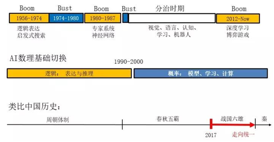
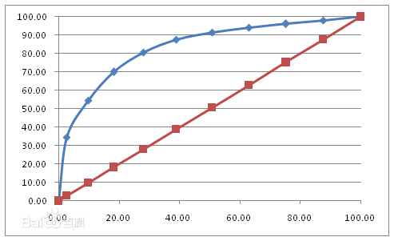
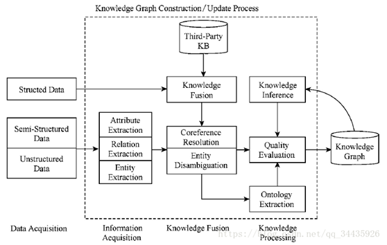

 

| 序号 | 修改时间   | 修改内容                               | 修改人 | 审稿人 |
| ---- | ---------- | -------------------------------------- | ------ | ------ |
| 1    | 2010-9-13  | 创建                                   | 吴启福 |        |
| 2    | 2010-12-28 | 增加学术会议机构等资源链接介绍         | 同上   |        |
| 3    | 2011-1-10  | 增加机器学习细节的认识，增加WEKA章节。 | 同上   |        |
| 4    | 2011-1-20  | 细化分类器算法的认识                   | 同上   |        |
| 5    | 2017-12-15 | 增加深度学习章节。                     | 同上   |        |
| 6    | 2018-7-10  | 增加知识图谱章节                       | 同上   |        |
| 7    | 2018-10-28 | 更新机器学习流程和建模章节             | 同上   |        |
|      |            |                                        |        |        |
---

 

 

[TOC]

 

# 目录

[目录... 1](#_Toc528493258)

[1    人工智能AI 4](#_Toc528493259)

[1.1    人工智能简介intro. 4](#_Toc528493260)

[1.1.1     各学科的贡献 （哲学…）... 4](#_Toc528493261)

[1.1.2     发展历程... 6](#_Toc528493262)

[1.1.3     学派，研究领域和分类... 6](#_Toc528493263)

[1.1.4     杰出人物介绍... 7](#_Toc528493264)

[1.1.5     当前研究进展和领域前沿... 8](#_Toc528493265)

[1.2    研究方法... 8](#_Toc528493266)

[1.2.1     Problem-solving and Resoning. 8](#_Toc528493267)

[1.2.2     问题表示（符号主义—谓词逻辑）... 9](#_Toc528493268)

[1.2.3     问题求解(搜索) 9](#_Toc528493269)

[1.2.4     知识与推理Knowledge and Reasoning. 9](#_Toc528493270)

[1.3    研究领域... 10](#_Toc528493271)

[1.3.1     机器学习... 10](#_Toc528493272)

[1.3.2     自然语言处理... 10](#_Toc528493273)

[1.3.3     模式识别... 10](#_Toc528493274)

[1.3.4     计算机视觉vision. 11](#_Toc528493275)

[1.3.5     机器人学... 11](#_Toc528493276)

[1.4    AI术语... 11](#_Toc528493277)

[1.5    本章参考... 11](#_Toc528493278)

[2    机器学习ML. 11](#_Toc528493279)

[2.1    机器学习简介... 12](#_Toc528493280)

[2.1.1     机器学习流程... 12](#_Toc528493281)

[2.1.2     常用术语... 12](#_Toc528493282)

[2.2    机器学习的类型... 12](#_Toc528493283)

[2.2.1     规则学习Rule-learning. 12](#_Toc528493284)

[2.2.2     贝叶斯学习... 13](#_Toc528493285)

[2.2.3     神经网络学习... 14](#_Toc528493286)

[2.2.4     支持向量机SVM.. 15](#_Toc528493287)

[2.3    分类classifiers/categorization. 15](#_Toc528493288)

[2.3.1     分类过程... 16](#_Toc528493289)

[2.3.2     分类器算法... 16](#_Toc528493290)

[2.3.3     文本分类示例... 18](#_Toc528493291)

[2.4    聚类cluster. 19](#_Toc528493292)

[2.4.1     算法... 19](#_Toc528493293)

[2.4.2     文本聚类示例... 20](#_Toc528493294)

[2.5    关联规则... 20](#_Toc528493295)

[2.5.1     Apriori算法... 20](#_Toc528493296)

[2.6    模型评估和优化... 21](#_Toc528493297)

[2.6.1     模型泛化... 21](#_Toc528493298)

[2.6.2     分类模型评估... 21](#_Toc528493299)

[2.6.3     回归模型评估... 23](#_Toc528493300)

[2.6.4     参数调整优化模型... 23](#_Toc528493301)

[2.7    本章参考... 23](#_Toc528493302)

[3    深度学习... 23](#_Toc528493303)

[3.1    本章参考... 24](#_Toc528493304)

[4    知识图谱... 24](#_Toc528493305)

[4.1    简介... 24](#_Toc528493306)

[4.2    知识图谱构建技术... 25](#_Toc528493307)

[4.2.1     信息抽取... 25](#_Toc528493308)

[4.2.2     知识融合... 26](#_Toc528493309)

[4.2.3     知识加工... 26](#_Toc528493310)

[4.2.4     知识更新... 26](#_Toc528493311)

[4.3    知识图谱的应用... 26](#_Toc528493312)

[4.4    本章参考... 27](#_Toc528493313)

[参考资料... 32](#_Toc528493326)

[参考书目... 32](#_Toc528493327)

[参考文献... 32](#_Toc528493328)

[附录... 32](#_Toc528493329)

[学术资源... 32](#_Toc528493330)

[其它资源... 33](#_Toc528493331)

[数据集... 33](#_Toc528493332)

 

表目录

[表格 1 AI三大学派比较__ 7](#_Toc528493333)

[表格 3 ML常用术语__ 12](#_Toc528493334)

[表格 4 分类主要模型列表__ 16](#_Toc528493335)

[表格 5 常用聚类方法列表__ 19](#_Toc528493336)

[表格 6 常用聚类分析算法列表__ 19](#_Toc528493337)

[表格 7 常用关联规则算法列表__ 20](#_Toc528493338)

[表格 8 IR检索系统的评测指标__ 21](#_Toc528493339)

 

 

图目录

[图 1 AI发展历程__ 6](#_Toc528493340)

[图 2 ROC曲线__ 22](#_Toc528493341)

[图 3 知识图谱的架构__ 25](#_Toc528493342)

[图 4 AI产业链__ 27](#_Toc528493343)

 

 

# 1    人工智能AI

## 1.1   人工智能简介intro

**人工智能**（Artificial Intelligence或简称AI）有时也称作**机器智能**，是指由人工制造出来的系统所表现出来的智能。通常人工智能是指通过普通计算机实现的智能。该词同时也指研究这样的智能系统是否能够实现，以及如何实现的科学领域。

**人工智能定义**：人工智能=人工(计算机)　＋　智能（特殊化程序）．从智能体角度来看，有两类智能，人类和计算机．

人工智能的定义有以下四种方法： [4]
*  Action humanly: 图灵测试方法1950年提出
*  Thinking humanly: 
*  Thinking Rationally: laws of thought
*  Action Rationally: 

 

**智能媒介Intelligent Agents**

智能媒介又叫智能体，是指某种能够行动的东西．

强智能和弱智能．强智能认为人是精密的计算机．（评：非常远大的梦想，但不是人类智能所能达到的）．弱智能关注的是提示人类和动物的形为所到达到的程度，智能机器被用作理解智能形为的手段．

 

### 1.1.1 各学科的贡献  （哲学…）

**哲学**

Main article: [Philosophy of artificial intelligence](http://en.wikipedia.org/wiki/Philosophy_of_artificial_intelligence)

Can a machine have a [mind](http://en.wikipedia.org/wiki/Mind) and [consciousness](http://en.wikipedia.org/wiki/Consciousness)? A few of the most influential answers to these questions are given below.[[147\]](http://en.wikipedia.org/wiki/Artificial_intelligence#cite_note-146)
*  [Turing's "polite convention"](http://en.wikipedia.org/wiki/Computing_Machinery_and_Intelligence)

* If a machine acts as intelligently as a human being, then it is as intelligent as a human being.* [Alan Turing](http://en.wikipedia.org/wiki/Alan_Turing) theorized that,
*  The [Dartmouth proposal](http://en.wikipedia.org/wiki/Dartmouth_Conferences)          1956
*  [Newell and Simon's physical symbol system hypothesis](http://en.wikipedia.org/wiki/Physical_symbol_system) 
*  [Gödel's incompleteness theorem](http://en.wikipedia.org/wiki/Gödel's_incompleteness_theorem)
*  [Searle's strong AI hypothesis](http://en.wikipedia.org/wiki/Chinese_room#Strong_AI)
*  The [artificial brain](http://en.wikipedia.org/wiki/Artificial_brain) argument

 

**哲学的贡献：知识论，物质和意识．．．**

科学哲学也称自然辩证法．主要的理论有实在主义，经验主义，相对主义等．

**［知识从哪里来］**

知识的产生方式，一是先验知识；二是认为知识完全产生于观察，推理及归纳，如培根的经验主义，休漠的归纳原理．目前的主流是第二种，知识来源于实践．

 

**［物质和意识的关系］**

哲学中，物质和意识的关系是哲学的本源问题．通常有二种，一是一元论, 要么物质决定论, 要么意识决定论；二是二元论，某些意识可以超脱于自然之外，René Descartes(笛卡尔)第一个给出清晰的讨论．

​     人工智能中，涉及到肉体（物质的大脑）和精神的关系．肉体产生思维，还是思维可以独立于肉体．这涉及到*永生*问题．这也导致了研究人工智能的方向，基于肉体的仿生学和使用符号表示的计算机学．也产生了不同的学派，连结主义和符号主义．

 

**数学的贡献：形式表示与证明/算法/可计算性/可操作性/概率性**

**［可计算和不可计算］**

可计算的含义是，一个输入最终能得到一个输出．但现实生活中有一些例子，可以看到人的思维中包含不可计算的部分．如无中间过程突然得到的结果（直觉），不符合理性逻辑的行为．

​     人工智能中，如何模拟不可计算的? 理论基础, 量子力学中的[不确定性原理](http://zh.wikipedia.org/zh-cn/不確定性原理)．数学中的*可计算性*和*算法复杂性理论*．

 

**经济学的贡献：效用，决策和运筹学**
* 神经科学的贡献：大脑和神经网络，智能活动的物理基础(substrate)
* 心理学的贡献：人类和动物如何思想和工作．结论，人类思考和活动是一个信息处理过程．

**计算机工程的贡献：制造出能干的计算机**
* 控制论的贡献：人工制品怎么在自己的控制下工作．自我平衡系统/稳定性/优化设计

**经济学的贡献：复杂系统中的决策/验证环境**

 

以上揭示了计算机模型可用来表示**语言**，记忆和逻辑思维的心理过程．

 

### 1.1.2 发展历程

​                               

图 1 AI发展历程

1950年， 图灵的论文(Computing Machinery and Intelligence)提出了图灵测试、机器学习、遗传算法、增量学习，第一个清晰地描绘出AI的完整图像．

1953年， [博弈论](http://zh.wikipedia.org/wiki/博弈論)

1953年，Metropolis提出*模拟退火算法**SA*的思想，Kirkpatrick在1983年成功地将其应用在组合最优化问题中。

1956年，美国达特茅斯会议[Dartmouth](http://en.wikipedia.org/wiki/Dartmouth_College)，AI正式诞生．参与人共10人，其中包括赫伯特.西蒙[Herbert Simon](http://en.wikipedia.org/wiki/Herbert_Simon)，约翰.麦卡锡[John McCarthy](http://en.wikipedia.org/wiki/John_McCarthy_(computer_scientist)),，克劳德.香农, 亚伦.纽厄尔[Allen Newell](http://en.wikipedia.org/wiki/Allen_Newell)，马文.明期基[Marvin Minsky](http://en.wikipedia.org/wiki/Marvin_Minsky)．

1960年, 产生了**人工智能语言** [LISP语言](http://zh.wikipedia.org/wiki/LISP语言)．1973 [PROLOG语言](http://zh.wikipedia.org/wiki/PROLOG语言)．

1973年， [生产系统](http://zh.wikipedia.org/wiki/生產系統)

1975年，美国Michigan大学J.Holland教授提出，并出版专著《Adaptation in Natural and Artificial Systems》。J.Holland教授所提出的GA通常为简单遗传算法（SGA）。

1976年， [框架理论](http://zh.wikipedia.org/wiki/框架理論)

1992年，Marco Dorigo在他的博士论文中引入[蚁群算法](http://baike.baidu.com/view/539346.htm#_blank)(ant colony optimization, ACO)，其灵感来源于蚂蚁在寻找食物过程中发现路径的行为。

典型案例：MIT Eliza程序—聊天机器人，积木世界，中文屋等

### 1.1.3 学派，研究领域和分类

目前人工智能的主要学派有下面三家：

(1)　符号主义(symbolicism)，又称为逻辑主义(logicism)、心理学派(psychologism)或计算机学派(computerism)，其原理主要为物理符号系统(即符号操作系统)假设智能和有限合理性原理。这个学派的代表人物有纽厄尔(Newell)、西蒙(Simon)和尼尔逊(Nilsson)等。

(2)　**连接**主义(connectionism)，又称为*仿生*学派(bionicsism)或生理学派(physiologism)，其主要原理为神经网络及神经网络间的连接机制与学习算法。

(3)　**行为主义**(actionism)，又称为*进化*主义(evolutionism)或*控制论*学派(cyberneticsism)，其原理为控制论及感知-动作型控制系统。

表格 1 AI三大学派比较

|          | 知识表达 | 黑箱 | 特征  学习 | 可解释性 | 大样本 | 计算复杂性 | 组合爆炸 | 环境互动 | 过拟合 |
| -------- | -------- | ---- | ---------- | -------- | ------ | ---------- | -------- | -------- | ------ |
| 符号主义 | 强       | 否   | 无         | 强       | 否     | 高         | 多       | 否       | 无     |
| 连接主义 | 弱       | 是   | 有         | 弱       | 是     | 高         | 少       | 否       | 有     |
| 行为主义 | 强       | 否   | 无         | 强       | 否     | 一般       | 一般     | 是       | 无     |

备注：1. 标红部分表示是比较不好的选项。

2. 机器学习是符号主义和连接主义的结合。

 

**研究领域**
*  [自然语言处理](http://zh.wikipedia.org/wiki/自然語言處理)(NLP; Natural Language Processing)，听者和说者之间的通讯。
*  [知识表现](http://zh.wikipedia.org/wiki/知識表現) (Knowledge Representation)，储存信息。
*  自动推理，运用储存的信息来回答或提取新的结论。
*  [机器学习](http://zh.wikipedia.org/wiki/机器学习) (Machine Learning)，能适应新的环境并检测和推断新的模式
*  计算机视觉，可以感知物体
*  机器人技术，可以操纵和移动物体
*  此外还包括[智能搜索](http://zh.wikipedia.org/wiki/智能搜索) (Intelligent Search)，模式识别等

 

**分类**

**［仿生学和计算机方法］**

仿生学算法有模仿蚂蚁群体的蚁群算法，模仿达尔文进化论的遗传算法，模仿热力学中固体降温过程的模拟退火算法等。 （评，仿生学的本质是基于物质材料决定于思维）．

计算机方法包括数学建模和心理学中的启发式程序。 常规的启发式搜索算法有：回溯和分支限界。

 

**［符号智能和计算智能］**

有人把人工智能分成两大类：一类是符号智能，一类是计算智能。符号智能是以知识为基础，通过推理进行问题求解。也即所谓的传统人工智能。计算智能是以数据为基础，通过训练建立联系，进行问题求解。人工神经网络、遗传算法、模糊系统、进化程序设计、人工生命等都可以包括在计算智能。

 

### 1.1.4 杰出人物介绍

人工智能的杰出人物主要分布在CMU, MIT, Stanford，IBM，是达特茅斯会议参与者的主要工作场所．

[Herbert Simon](http://en.wikipedia.org/wiki/Herbert_Simon) **(西蒙, 1916~2001)**

他是AI研究的先驱者, 经济组织决策管理大师，于1978年获得诺贝尔经济学奖, 是因为他早年的工作: 基于满意度的模型-制定"足够好"的决策, 而不是艰苦计算获得最优化决策-能更好地描述真实人类行为.　CMU

 

[Allen Newell](http://en.wikipedia.org/wiki/Allen_Newell) **(**亚伦.纽厄尔1927~1992**)**

1975年与图灵奖获得者. CMU. 达特茅斯会议中与西蒙一起提出*物理符号系统假说*，为符号主义的经典理论．

 

[Marvin Minsky](http://en.wikipedia.org/wiki/Marvin_Minsky)(马文.明期基1927~)

1969年图灵奖获得者，创建麻省理工学院(MIT)人工智能实验室。1975年他首创框架理论(frame theory).

 

**Noam Chomsky(乔姆斯基, 1928~)**

他是[麻省理工学院](http://zh.wikipedia.org/zh-cn/麻省理工学院)[语言学](http://zh.wikipedia.org/zh-cn/语言学)的荣誉退休教授，在语言学，心理学和哲学上有杰出贡献。乔姆斯基的[生成语法](http://zh.wikipedia.org/zh-cn/生成语法)被认为是[20世纪](http://zh.wikipedia.org/zh-cn/20世纪)[理论语言学](http://zh.wikipedia.org/w/index.php?title=理论语言学&action=edit&redlink=1)研究上的重要贡献。他对[伯尔赫斯·弗雷德里克·斯金纳](http://zh.wikipedia.org/zh-cn/伯尔赫斯·弗雷德里克·斯金纳)所著《[口语行为](http://zh.wikipedia.org/w/index.php?title=口語行为&action=edit&redlink=1)》的评论，也有助于发动[心理学](http://zh.wikipedia.org/zh-cn/心理学)的[认知革命](http://zh.wikipedia.org/w/index.php?title=认知革命&action=edit&redlink=1)，挑战[1950年代](http://zh.wikipedia.org/zh-cn/1950年代)研究[人类行为](http://zh.wikipedia.org/zh-cn/人類行為)和[语言](http://zh.wikipedia.org/zh-cn/语言)方式中占主导地位的[行为主义](http://zh.wikipedia.org/zh-cn/行为主义)。他所采用以自然为本来研究语言的方法也大大地影响了语言和心智的[哲学](http://zh.wikipedia.org/zh-cn/哲学)研究。他的另一大成就是建立了[乔姆斯基层级](http://zh.wikipedia.org/zh-cn/乔姆斯基层级)：根据文法[生成力](http://zh.wikipedia.org/w/index.php?title=生成力&action=edit&redlink=1)不同而对[形式语言](http://zh.wikipedia.org/zh-cn/形式语言)做的分类。

 

[John McCarthy](http://en.wikipedia.org/wiki/John_McCarthy_(computer_scientist))(约翰.麦卡锡,1927~ )

1971年图灵奖获得者，斯坦福大学人工智能实验室的主任．1959年，发明了LISP语言. 1956年达特茅斯会议Dartmouth的发起者，号称人工智能之父．

 

[Tom Mitchell](http://www.cs.cmu.edu/~tom/)(米切尔)

Home: http://www.cs.cmu.edu/~tom/

[Machine Learning](http://www.cs.cmu.edu/~epxing/Class/10701/)一书作者．

 

### 1.1.5 当前研究进展和领域前沿

**会议杂志**

IJCAI　二年一次

ECAI AAAI 各一年一次

 

**其它**
*  图灵测试－洛伯纳奖Loebner Prize website 1990~present
*  CVPR 计算机视觉领域最著名的会议叫CVPR，这个PR就是模式识别。

 

## 1.2   研究方法

### 1.2.1 Problem-solving and Resoning

**强人工智能**观点认为*有可能*制造出*真正*能[推理](http://zh.wikipedia.org/wiki/推理)（[Reasoning](http://en.wikipedia.org/wiki/Reasoning)）和[解决问题](http://zh.wikipedia.org/wiki/解決問題)（[Problem_solving](http://en.wikipedia.org/wiki/Problem_solving)）的智能机器，并且，这样的机器能将被认为是有知觉的，有自我意识的。

 

智能体的功能分解：感知－＞建模－＞规划－＞行动，如20世纪60年代Stanford产生的认识机器人－沙基shakey.

新人工智能的三大原则：实体化，现场性，自底向上设计．如基于行为的机器人．

 

### 1.2.2 问题表示（符号主义—谓词逻辑）

零价(谓词逻辑Propositional Logic)：C<= X^Y^Z （具备最低级的描述能力）

属性：

一阶：Horn子句

 

### 1.2.3 问题求解(搜索)

首先形式化问题, 以八皇后问题为例.
*  状态stete
*  初始状态
*  后继函数action:  left, right, up, down
*  目标测试goal
*  路径消耗

 

问题空间的搜索策略

1)     学习的归纳本质

2)     穷尽搜索: 广度优先,深度优先…

3)     启发式搜索: 回溯, 分支限界, 贪婪法,遗传算法,联机搜索…

4)     对抗搜索: 博弈

 

### 1.2.4 知识与推理Knowledge and Reasoning

知识可分为确定性知识和不确定性知识.

 

**确定性知识**

常规的知识可通过逻辑推理的方式获得.

 

**不确定性知识**

不确定性知识常通过概率统计的方式获得, 如
*  贝叶斯定理:　NB，贝叶斯网络等
*  隐马尔可夫模型(Hidden Markow Model, HMM)
*  卡尔曼滤波器

 

## 1.3   研究领域

**分类一：**

当前AI的方向大致可分为四个，分别是语言、图像、自然语言处理和智能硬件。

搜索和推荐可归入自然语言处理领域。

 

**分类二：学术界UCLA朱松纯将AI分为六个领域，分别是：**

（1）计算机视觉（暂且把模式识别，图像处理等问题归入其中）、

（2）自然语言理解与交流（暂且把语音识别、合成归入其中，包括对话）、

（3）认知与推理（包含各种物理和社会常识）、

（4）机器人学（机械、控制、设计、运动规划、任务规划等）、

（5）博弈与伦理（多代理人agents的交互、对抗与合作，机器人与社会融合等议题）、

（6）机器学习（各种统计的建模、分析工具和计算的方法），

 

分类三：工业界按应用场景将AI分为
*  自动驾驶
*  机器人
*   

### 1.3.1 机器学习

机器学习是经典符号主义和联结主义的结合．它是人工智能AI一个极重要的研究领域。

### 1.3.2 自然语言处理

详见 《自然语言处理》

### 1.3.3 模式识别

模式识别（英语：Pattern Recognition），就是通过[计算机](https://baike.baidu.com/item/计算机)用[数学](https://baike.baidu.com/item/数学)技术方法来研究模式的自动处理和判读。我们把[环境](https://baike.baidu.com/item/环境)与[客体](https://baike.baidu.com/item/客体)统称为“模式”。

信息处理过程的一个重要形式是生命体对环境及客体的识别。对人类来说，特别重要的是对[光学](https://baike.baidu.com/item/光学)信息（通过[视觉](https://baike.baidu.com/item/视觉)器官来获得）和[声学](https://baike.baidu.com/item/声学)信息（通过听觉器官来获得）的识别。这是模式识别的两个重要方面。市场上可见到的代表性产品有[光学字符识别](https://baike.baidu.com/item/光学字符识别)、[语音识别](https://baike.baidu.com/item/语音识别)系统。

 

**研究领域**

模式识别研究主要集中在两方面，一是研究生物体(包括人)是如何感知对象的，属于认识科学的范畴，二是在给定的任务下，如何用计算机实现模式识别的理论和方法。前者是生理学家、心理学家、[生物学](https://baike.baidu.com/item/生物学)家和神经生理学家的研究内容，后者通过数学家、信息学专家和[计算机科学](https://baike.baidu.com/item/计算机科学)工作者近几十年来的努力，已经取得了系统的研究成果。

 

**应用**

模式识别可用于文字和语音识别、遥感和医学诊断等方面。

### 1.3.4 计算机视觉vision

详见 《计算机视觉》

### 1.3.5 机器人学

 

## 1.4   AI术语

 

## 1.5   本章参考

[1].一文纵览人工智能的23个分支 http://www.chaoqi.net/xinchao/2018/0102/107317.html 

[2].朱松纯教授浅谈人工智能：现状、任务、构架与统一 https://www.sohu.com/a/227854954_297710 

[3].   模式识别 [https://baike.baidu.com/item/%E6%A8%A1%E5%BC%8F%E8%AF%86%E5%88%AB](https://baike.baidu.com/item/模式识别)

 

# 2    机器学习ML 

程序 = 算法＋数据结构＋领域知识

编程人员 -à知识工程师 -à领域专家expert

 

机器学习的任务是通过一定的学习算法来达到改进智能体未来的行动能力 [1]．

样本 + 背景知识 à 学习算法 -à 概念描述

学习算法可分为二类，一是黑箱法；二是基于知识的方法．AQ－主动覆盖．

 

## 2.1   机器学习简介

### 2.1.1 机器学习流程

历史数据 --> 建模（建模、模型评价、模型优化） --> 预测（新数据）

 

图 2 机器学习流程图

接下来根据流程图，逐步分析机器学习的流程。

**1.** **数据源：**

机器学习的第一个步骤就是收集数据，这一步非常重要，因为收集到的数据的质量和数量将直接决定预测模型是否能够建好。我们可以将收集的数据去重复、标准化、错误修正等等，保存成数据库文件或者csv格式文件，为下一步数据的加载做准备。

 

**2.** **分析：**

这一步骤主要是数据发现，比如找出每列的最大、最小值、平均值、方差、中位数、三分位数、四分位数、某些特定值（比如零值）所占比例或者分布规律等等都要有一个大致的了解。了解这些最好的办法就是可视化，谷歌的开源项目facets可以很方便的实现。另一方面要确定自变量(x1...xn)和因变量y，找出因变量和自变量的相关性，确定相关系数。

 

**3.** **特征选择：**

特征的好坏很大程度上决定了分类器的效果。将上一步骤确定的自变量进行筛选，筛选可以手工选择或者模型选择，选择合适的特征，然后对变量进行命名以便更好的标记。命名文件要存下来，在预测阶段的时候会用到。

 

**4.** **向量化：**

向量化是对特征提取结果的再加工，目的是增强特征的表示能力，防止模型过于复杂和学习困难，比如对连续的特征值进行离散化，label值映射成枚举值，用数字进行标识。这一阶段将产生一个很重要的文件：label和枚举值对应关系，在预测阶段的同样会用到。

 

**5.** **拆分数据集：**

需要将数据分为两部分。用于训练模型的第一部分将是数据集的大部分。第二部分将用于评估我们训练有素的模型的表现。通常以8:2或者7:3进行数据划分。不能直接使用训练数据来进行评估，因为模型只能记住“问题”。

 

**6.** **训练：**

进行模型训练之前，要确定合适的算法，比如线性回归、决策树、随机森林、逻辑回归、梯度提升、SVM等等。选择算法的时候最佳方法是测试各种不同的算法，然后通过交叉验证选择最好的一个。但是，如果只是为问题寻找一个“足够好”的算法，或者一个起点，也是有一些还不错的一般准则的，比如如果训练集很小，那么高偏差/低方差分类器（如朴素贝叶斯分类器）要优于低偏差/高方差分类器（如k近邻分类器），因为后者容易过拟合。然而，随着训练集的增大，低偏差/高方差分类器将开始胜出（它们具有较低的渐近误差），因为高偏差分类器不足以提供准确的模型。

 

**7.** **评估：**

训练完成之后，通过拆分出来的训练的数据来对模型进行评估，通过真实数据和预测数据进行对比，来判定模型的好坏。模型评估的常见的五个方法：混淆矩阵、提升图&洛伦兹图、基尼系数、ks曲线、roc曲线。混淆矩阵不能作为评估模型的唯一标准，混淆矩阵（详见 模型评估章节）是算模型其他指标的基础。

完成评估后，如果想进一步改善训练，我们可以通过调整模型的参数来实现，然后重复训练和评估的过程。

 

**8.** **文件整理：**

模型训练完之后，要整理出四类文件，确保模型能够正确运行，四类文件分别为：Model文件、Lable编码文件、元数据文件（算法，参数和结果）、变量文件（自变量名称列表、因变量名称列表）。

**9.** **接口封装：**

通过封装封装服务接口，实现对模型的调用，以便返回预测结果。

**10.** **上线：**

### 2.1.2 常用术语

表格 2 ML常用术语

| 中文     | 英文         | 释义                                                       |
| -------- | ------------ | ---------------------------------------------------------- |
| 特征     | features     | 输入的用于预测属性。特性可能是数值的或分类的。             |
| 模型     | model        | 描述特征和目标之间关系的数学对象                           |
| 监督ML   | supervised   | ML给定样本的输出值是已知的，采用输入和输出的函数进行训练。 |
| 无监督ML | unsupervised | 不依赖于已知样本，试图寻找非标记数据的内在结构。           |
|          |              |                                                            |

 

## 2.2   机器学习的类型

学习的**思想**: 感知不仅对进行中的行动有用,而且应该能够改进智能体未来的行动能力.

学习的**类型**: 有监督的Supervises和无监督的, 强化学习，分析学习和*归纳学习**.*
* 有监督的学习（有指导）是指从输入和输出的实例中学习一个函数, 如归纳学习.
* 无监督的学习（无指导）是指未明确提供输入值的情况下,学习输入的模式. 如聚类。
* 强化学习是指从强化物中进行学习. 如效用分析.
* **分析学习**是指寻找拟合先验知识的一般假设，同时使它覆盖训练数据。如Prolog-EBG.
* *归纳学习*是指拟合训练数据的一般假设。如决策树DT，神经网络反向传播等。

 

### 2.2.1 规则学习Rule-learning

术语：概念，泛化，覆盖．

**概念**：定义在对象中的布尔集合．

**泛化和特化**: 这两者是定义一个概念空间的最常用的两种操作. 泛化是指A是B的父类, 则A比B更泛化, A可以覆盖B.

学习策略：归纳－从特定训练样本中获取一般的*概念*．

学习概念的过程实质是个搜索的过程．（概念空间，泛化空间）

 

**概念学习算法Concept Learning**

1)     Find-S算法

2)     Candidate-Elimination算法

3)     决策树Decision Tree. 机器学习中最常用的归纳推理方法．

 

### 2.2.2 贝叶斯学习

基础知识：概率学

[贝叶斯](http://baike.baidu.com/view/77778.htm)Thomas Bayes (1702-1763) , 英国数学家, 1763年提出贝叶斯公式．

**贝叶斯公式**：假定A1,A2,……是某个过程的若干可能的前提，则P(Ai)是人们事先对各前提条件出现可能性大小的估计，称之为先验概率.如果这个过程得到了一个结果B，那么贝叶斯公式提供了我们根据B的出现而对前提条件做出新评价的方法.P(Ai∣B)既是对前提Ai的出现概率的重新认识，称P(Ai∣B)为后验概率.　 

 

 

**条件独立假设：**

 

 

贝叶斯学习理论中最为实用和广泛使用的一种分类算法，在文本分类、邮件过滤、推荐系统和医疗诊断等应用中经常使用。

#### 2.2.2.1 朴素贝叶斯Naïve_Bayes

**基本思想：**采用属性和类别的联合概率（先验知识）去估计未知样本的类别。

**两个理论：**贝叶斯公式和条件独立假定．

算法：

 

#### 2.2.2.2 贝叶斯网络
* 主要问题

网络结构可能已知或未知

训练样本提供了所有网络变量的值或者仅仅提供部分变量的值。
**三种情况**
* 结构已知并且所有变量值都能在训练样本中观察到很简单，可如同学习朴素贝叶斯分类器一样学习贝叶斯网络
* 结构已知但从训练样本中仅能观察到部分变量的值比较困难,如剃度上升算法（类似神经网络），EM 算法
* 结构未知：最困难

 

### 2.2.3 神经网络学习

**简介**

人工神经网络（Artificial Neural Networks，ANN）是一种应用类似于大脑神经突触联接的结构进行信息处理的数学模型。在这种模型中，大量的节点（或称”神经元”，或”单元”）之间相互联接构成网络，即”神经网络”，以达到处理信息的目的。神经网络通常需要进行训练，训练的过程就是网络进行学习的过程。训练改变了网络节点的连接权的值使其具有分类的功能，经过训练的网络就可用于对象的识别。

目前，神经网络已有上百种不同的模型，常见的有BP网络、径向基RBF网络、Hopfield网络、随机神经网络（Boltzmann机）、竞争神经网络（Hamming网络，自组织映射网络）等。但是当前的神经网络仍普遍存在收敛速度慢、计算量大、训练时间长和不可解释等缺点。

 

**发展历程**

类似生物神经系统，目前已知鲁棒性最好的学习系统之一。

1943年，心理学家McCulloch与数学家Pitts对神经元进行了形式化研究，提出了神经元的数学模型MP模型。

1957年，Rosenblatt首次引进感知器。

1969年，Minsky和Paper发表《认知论》，指出单层神经网络无法解决“异或”问题，神经网络进入低谷

1982，Hopfield模型的提出，以及逆向传播算法又推动了神经网络的发展。

 

#### 2.2.3.1 神经网络分类
*  拓扑结构

单层神经网络－仅有输出层

两层神经网络－包含一个隐层

N层神经网络－包含N-1个隐层
* 连接方式

前馈式网络：连接是单向的

反馈式网络：最后一层单元可作为输入

全连接神经网络
* 学习

有指导学习，用于分类. 如感知器（上世纪50年代）, 反向传播网络（上世纪80年代）。

无指导学习, 用于聚类。

 

神经网络表达能力：布尔函数，连续函数，一般函数．

**应用**：人脸识别

 

### 2.2.4 支持向量机SVM

[Support vector machines](http://blog.csdn.net/aladdina/archive/2009/04/30/4141094.aspx)

资源：

http://www.kernel-machines.org/ 

http://www.support-vector.net/ 

 

## 2.3   分类classifiers/categorization

目的：是为了寻找模型。如文本分类。

非人工分类有两种方法,一是知识工程，每个分类专家都制定若干规则；二是机器学习。

 

表格 3 分类主要模型列表

| 模型       | 模型特点                                                     |
| ---------- | ------------------------------------------------------------ |
| 逻辑回归   | 比较基础的线性分类模型                                       |
| SVM        | 强大的模型，可以用来回归、预测、分类等。根据不同的核函数，模型可以是线性/非线发性 |
| 决策树     | 基于‘分类讨论、细化’思想的分类模型，模型直观，易解释。       |
| 随机森林   | 思想类似决策树，精度通常比决策树高，缺点是由于随机性，丧失了决策树的可解释性。 |
| 朴素贝叶斯 | 基于概率思想的简单有效的分类模型，能够给出容易理解的概率解释。 |
| 神经网络   | 具有强大的拟合能力，可以用于拟合、分类等。有很多增强版本。   |

 

### 2.3.1 分类过程

分类过程可分为数据预处理、特征选择、划分训练集和测试集、训练模型和评估预测。

#### 2.3.1.1 特征选择feature select

因为很多情况下，特征过多，特征维度灾难。此过程需要选择具有区分效果的特征。在文本分类中，特征就是词项，此过程需要考虑特征的多个属性property(prop)参数。

 

**PAC算法**：PCA(Principal Component Analysis ，PCA) 是主成分分析，主要用于数据降维。 目的是找那些变化大的元素，即方差大的那些维，而去除掉那些变化不大的维，从而使特征留下的都是“精品”，而且计算量也变小了。

参见 http://hi.baidu.com/l1x2y/blog/item/fc6f10fd93c7643d5d6008e9.html 

 

[**C4.5**](http://blog.csdn.net/aladdina/archive/2009/04/30/4141048.aspx)**:** C4.5算法是机器学习算法中的一种分类决策树算法,其核心算法是ID3算法. C4.5算法继承了ID3算法的优点，并在以下几方面对ID3算法进行了改进：

1)    用信息增益率来选择属性，克服了用信息增益选择属性时偏向选择取值多的属性的不足；

2)    在树构造过程中进行剪枝；

3)    能够完成对连续属性的离散化处理；

4)    能够对不完整数据进行处理。

C4.5算法有如下优点：产生的分类规则易于理解，准确率较高。其缺点是：在构造树的过程中，需要对数据集进行多次的顺序扫描和排序，因而导致算法的低效。

### 2.3.2 分类器算法

#### 2.3.2.1 分类器算法列表
*  Bagging 
*  Boosting
*  DTree, Decide Tree
*  KNN, 
*  VSM
*  CART, Classification and Regression Trees
*  后向传播, 前向传播
*  EM
*  K近邻

 

#### 2.3.2.2 分类器算法分类
*  [线性分类器](http://en.wikipedia.org/wiki/Linear_classifier)：指分类通过特征的[线性组合](http://zh.wikipedia.org/wiki/線性組合)来作决定。
*  [统计分类器](http://en.wikipedia.org/wiki/Statistical_classification)

 

**线性分类器的类型** 

有两种类型用来决定线性分类器。分别是**生成模型和判别模型** Generative models vs. discriminative models

第一种模型[条件概率](http://zh.wikipedia.org/wiki/條件機率)。 这类的算法包括：
* [线性判别分析](http://zh.wikipedia.org/wiki/線性判別分析) (LDA) --- 假设为[高斯](http://zh.wikipedia.org/wiki/常態分佈)条件密度模型。（条件概率*P*（*A*|*B*））
* [单纯贝叶斯分类器](http://zh.wikipedia.org/w/index.php?title=單純貝葉斯分類器&action=edit&redlink=1) --- 假设为[独立](http://zh.wikipedia.org/w/index.php?title=獨立隨機變數&action=edit&redlink=1) [binomial](http://zh.wikipedia.org/wiki/二項分佈)条件密度模型。（独立条件概率—先验概率）
* [Linear Discriminant Analysis (or Fisher's linear discriminant)](http://en.wikipedia.org/wiki/Linear_discriminant_analysis) (LDA)—assumes [Gaussian](http://en.wikipedia.org/wiki/Normal_distribution) conditional density models
* [Naive Bayes classifier](http://en.wikipedia.org/wiki/Naive_Bayes_classifier)—assumes [independent](http://en.wikipedia.org/wiki/Independent_random_variables) [binomial](http://en.wikipedia.org/wiki/Binomial_distribution) conditional density models.

 

第二种方式则称为[判别模型](http://zh.wikipedia.org/w/index.php?title=判別模型&action=edit&redlink=1) (discriminative models)，会去最大化一个[训练集](http://zh.wikipedia.org/w/index.php?title=訓練集&action=edit&redlink=1)(training set)输出的质。 在训练的成本函数中有一个额外的项加入，可以容易地表示[正则化](http://zh.wikipedia.org/w/index.php?title=正則化_(數學)&action=edit&redlink=1)。例子包含：
* [Logit模型](http://zh.wikipedia.org/wiki/Logit模型) ---输入的特征向量的[最大似然估计](http://zh.wikipedia.org/wiki/最大似然估计)，其假设观察到的训练集是由一个相依于分类器的输出的二元模型所产生。
* [感知元](http://zh.wikipedia.org/wiki/感知元)(Perceptron) --- 一个试图去修正在训练集中遇到错误的算法。
* [支持向量机](http://zh.wikipedia.org/wiki/支持向量机)SVM --- 一个试图去最佳化在决策超平面上，训练集中的例子间的[边界](http://zh.wikipedia.org/w/index.php?title=邊界_(機器學習)&action=edit&redlink=1)(margin)的算法。

 

#### 2.3.2.3 分类算法简介

**决策树算法**

决策树是用于分类和预测的主要技术之一，决策树学习是以实例为基础的归纳学习算法，它着眼于从一组无次序、无规则的实例中推理出以决策树表示的分类规则。 构造决策树的目的是找出属性和类别间的关系，用它来预测将来未知类别的记录的类别。它采用自顶向下的递归方式，在决策树的内部节点进行属性的比较，并根据不同属性值判断从该节点向下的分支，在决策树的叶节点得到结论。 

主要的决策树算法有ID3、C4.5（C5.0）、CART、PUBLIC、SLIQ和SPRINT算法等。它们在选择测试属性采用的技术、生成的决策树的结构、剪枝的方法以及时刻，能否处理大数据集等方面都有各自的不同之处。

 

### 2.3.3 文本分类示例

文本分类的***基本假设\***是：文档的内容与其中所包含的词有必然的关联，而同一类的文档之间总存在共同的词，不同类别的文档之间的词有较大的差异。因此分类器通过词与文档之间的向量关系可以用来识别文档的类别。{term , category}的向量空间模型。

 

文本分类算法有：词匹配法，基于知识工程的方法和机器学习方法。**错误！未找到引用源。**

其中机器学习方法是目前最实用的方法。

 

**文本分类的步骤**

1)     **文本表示**（Text Representation）：这一过程的目标是把文本表示成分类器能够处理的形式。最常用的方法是*向量空间模型*，即把文本集表示成词－文档矩阵，矩阵中每个元素代表了一个词在相应文档中的权重。选取哪些词来代表一个文本，这个过程称为特征选择（feature selection）。常见的特征选择方法有文档频率、信息增益、互信息、期望交叉熵（Expected Cross Entropy）等等，[Yang & Pedersen , 1997 ]对这几种方法做了比较。为了降低分类过程中的计算量，经常还需要进行降维处理，比如LSI。

2)     **分类器构建**（Classifier Construction）：这一步骤的目标是选择或设计构建分类器的方法。没有一种通用的方法可以适用所有情形。不同的方法有各自的优缺点和适用条件，要依据问题的特色来选择一个分类器。选定方法之后，在训练集上为每个类别构建分类器，然后把分类器利用于测试集上，得到分类结果。

3)     **效果评估**（Classifier Evaluation）：在分类过程完成之后，需要对分类结果进行评估。评估过程运用于测试集（而不是训练集）上的文本分类结果，常用的评估尺度由IR范畴继承而来，包括查全率、查准率、F1值等等。对于某一类别i，查全率ri=li/ni，其中ni为所有测试文档中，属于第i类的文档个数；li是经分类系统输出分类结果为第i类且结果准确的文档个数。查准率pi=li/mi，其中mi是经分类体系输出分类结果为第i类的文档个数，li是经分类系统输出分类结果为第i类且结果准确的文档个数。F1值为查全率和查准率的调和平均值. 相对于最简略的练习集－测试集评估办法而言，还有一种称为k-fold cross validation的方式，即把所有标志的数据划分成k个子集，对于每个子集，把这个子集当作训练集，把其余子集作为测试集；这样执行k次，取各次评估成果的均值作为最后的评估结果。

 

**常用测试集**

文本分类常用的数据集有REUTERS,20NEWSGROUP,OHSUMED等语料库。

 

#### 2.3.3.1 一个文本分类器的设计方案

| 关键因素     | 方案     | 备选方案                         |                      |
| ------------ | -------- | -------------------------------- | -------------------- |
| 训练样本数   | 15       |                                  |                      |
| 特征选取方法 | CHI      | 文档频率DF, 信息增益IG, 互信息MI |                      |
| 分类算法     | KNN & NB | KNN                              | 决策树DTree, Rocchio |
| K            | 15       |                                  |                      |
| 相似度       | 兰式     | 欧氏距离                         |                      |
| 层次关系     | 层次     |                                  |                      |
| 截尾算法     | SCut     | 位置法RCut, 比例法PCut,          |                      |

 

## 2.4   聚类cluster

目的：给对象（点集组合）进行归组，是无指导学习．如文本聚类．

 

### 2.4.1 算法

表格 4 常用聚类方法列表

| 类别                     | 包括的主要算法                                               |
| ------------------------ | ------------------------------------------------------------ |
| 划分（分裂）Partitioning | K-平均，K-中心、CLARANS（基于选择）                          |
| 层次聚类Hierarchical     | BIRCH（平衡迭代规约和聚类）、CURE（代表点聚类）、CHAMELEON（动态模型） |
| 密度聚类Density-Based    | DBSCAN（基于高密度连接区域）、DENCLUE（密度分布函数）、OPTICS（对象排序识别） |
| 基于网格                 | STING（统计信息网络）、CLIOUE（聚类高维空间）、WAVE-CLUSTER（小波变换） |
| 基于模型Model-Based      | 统计学方法、神经网络方法                                     |

**备注：**

 

表格 5 常用聚类分析算法列表

| 算法     | 算法 描述                                                    |
| -------- | ------------------------------------------------------------ |
| K-means  | K平均也称为K均值、快速聚类法。在最小化误差函数的基础上将数据划分为预定的类数K。此算法原理简单并便于处理大数据。 |
| K-中心法 | K中心点算法不采用簇中对象的平均值作为簇中心，而选用簇中离平均值最近的对象作为簇中心。 |
| 系统聚类 | 也称多层次聚类，分类的单位由高到低呈树形结构，且所处的位置越低，其所包含的对象就越少，但这些对象间的共同特征越多。此算法只适合在小数据量的时候使用，大数据时会非常慢。 |
| EM       |                                                              |

 

### 2.4.2 文本聚类示例

文本聚类步骤

 

## 2.5   关联规则

**目的**：给定一组记录，记录由项目组成，获取项目之间的依赖关系．如购物分析，推荐系统．

**衡量准则**: 支持度（Support）和置信度（Confidence）等

 

表格 6 常用关联规则算法列表

| 算法       | 算法描述                                                     |
| ---------- | ------------------------------------------------------------ |
| Apriori    | 最常用的。其核心思想是通过连接产生候选项及其支持度然后通过剪枝生成频繁项集。 |
| FP-Tree    | 针对Apriori算法的固有的多次扫描事务数据集的缺陷，提出的不产生候选频繁项集的方法。 |
| Eclat      | 深度优先算法，采用垂直数据表示形式，在概念格理论的基础上利用基于前缀的等价关系将搜索空间划分为较小的子空间。 |
| 灰色关联法 | 分析和确定各因素之间的影响程度或是若干个子因素（子序列）对主因素（母序列）的贡献主而进行的一种分析方法。 |
|            |                                                              |

 

### 2.5.1 Apriori算法

**算法说明：**

对于一条关联规则L->R，我们常用支持度（Support）和置信度（Confidence）来衡量它的重要性。规则的支持度是用来估计在一个购物篮中同时观察到L和R的概率P(L,R)，而规则的置信度是估计购物栏中出现了L时也出会现R的条件概率P(R|L)。关联规则的目标一般是产生支持度和置信度都较高的规则。

Apriori算法对于一条规则L->R，有以下度量：
*  支持度（Support）同时观察到L和R的概率P(L,R)
*  置信度（Confidence）出现了L时也出会现R的条件概率P(R|L)
*  Lift（提升度）： P(L,R)/(P(L)P(R))
*  Leverage（杠杆）：P(L,R)-P(L)P(R)
*  Conviction（判断度?）：P(L)P(!R)/P(L,!R)

说明：以上度量中，支持度，置信度和conviction越大越好。当Lift=1, Leverage=0时说明L与R是独立事件。

 

**算法原理：**

 

## 2.6   模型评估和优化

### 2.6.1 模型泛化 

问题：欠拟合(underfiting))和过拟合(overfitting)

解决方案：交叉验证

 

交叉验证注意事项
*  训练数据要有代表性。
*  某些数据集的特征是有时间顺序的。
*  K折交叉（将数据集分成K个包，对于某个包，取其它包作为训练集，N个包处理完后，将每个包的预测值进行汇总，综合评估其准确率）的包数量越大，估计误差越好，但花费时间越多。

### 2.6.2 分类模型评估

#### 2.6.2.1 分类精度和混淆矩阵

表格 7 混淆矩阵Confusion Matrix

|          | 预测数据 |      |      |
| -------- | -------- | ---- | ---- |
| T        | F        |      |      |
| 真实数据 | T        | X1   | X2   |
| F        | X3       | X4   |      |

备注：X1为作出正确判断的否定记录

​     X2为作出错误判断的肯定记录

​     X3为作出错误判断的否定记录

​     X4为作出正确判断的肯定记录

 

表格 8 IR检索系统的评测指标

| 评价指标        | 说明                                                     |
| --------------- | -------------------------------------------------------- |
| 准确率PRECISION | P，给定分词结果中切分正确的词次数/应分词结果中的总词次数 |
| 召回率Recall    | R，给定分词结果中切分正确的词次数/标准答案中的总词次数   |
| F值             | (P+R)/2                                                  |
| 调和平均数      | 2PR/  ( R + P )                                          |

#### 2.6.2.2 准确度权衡和ROC典线

受试者工作特征曲线 （receiver operating characteristic curve，简称ROC曲线），又称为[感受性](https://baike.baidu.com/item/感受性)曲线（sensitivity curve）。得此名的原因在于曲线上各点反映着相同的感受性，它们都是对同一[信号刺激](https://baike.baidu.com/item/信号刺激/9824407)的反应，只不过是在两种不同的判定标准下所得的结果而已。受试者工作特征曲线就是以假阳性概率（False positive rate）为[横轴](https://baike.baidu.com/item/横轴/9910927)，真阳性（True positive rate）为纵轴所组成的坐标图，和受试者在特定刺激条件下由于采用不同的判断标准得出的不同结果画出的曲线。

 

**二分类问题**

考虑一个二分问题，即将实例分成正类（positive）或负类（negative）。对一个二分问题来说，会出现四种情况。如果一个实例是正类并且也被 预测成正类，即为真正类（True positive）,如果实例是负类被预测成正类，称之为假正类（False positive）。相应地，如果实例是负类被预测成负类，称之为真负类（True negative）,正类被预测成负类则为假负类（false negative）。

如下表所示，1代表正类，0代表负类。

|      |      | 1                         | 0                         | 合计                   |
| ---- | ---- | ------------------------- | ------------------------- | ---------------------- |
| 实际 | 1    | True Positive（TP）       | False Negative（FN）      | Actual Positive(TP+FN) |
|      | 0    | False Positive（FP)       | True Negative(TN)         | Actual Negative(FP+TN) |
| 合计 |      | Predicted Positive(TP+FP) | Predicted Negative(FN+TN) | TP+FP+FN+TN            |

备注：四个象限四成生个指标名词，如下：
*  真正类率(true positive rate ,TPR)，即灵敏度。计算公式为*TPR=TP*/ (*TP*+ *FN*)，刻画的是[分类器](https://baike.baidu.com/item/分类器)所识别出的 正实例占所有正实例的比例。
*  假正类率(false positive rate, FPR)，即误检率。计算公式为*FPR= FP / (FP + TN)**，*计算的是分类器错认为正类的负实例占所有负实例的比例。
*  真负类率（True Negative Rate，TNR），也称为specificity，即特异性。计算公式为TNR=*TN*/ (*FP*+ *TN*) = 1 - *FPR*。
*  假负率，即缺失率。

 

图 3 ROC曲线

说明：ROC曲线以假正率为X轴，真正率为Y轴。ROC曲线是很好的分类性能总体视图。ROC曲线的线下面积(AUC）的面积越大，分类效果越好。

 

#### 2.6.2.3 多类别分类

 

#### 2.6.2.4 分类性能评估

**１）理论分析**
*  COLT: Computational learning theory
*  PAC: Probably approximately correct
*  计算复杂性：Polynomial in time/number of examples

 

**２）实验分析**
* 性能标准

在新样本上的正确性

时间代价：学习所需时间，分类新样本所需要的时间

空间代价
* 实施策略

重复利用训练集/测试集估计分类器的性能

训练集用于学习分类器，测试集用于评估分类器性能

 

### 2.6.3 回归模型评估

 

### 2.6.4 参数调整优化模型

 

 

## 2.7   本章参考

[1].   ROC曲线 [https://baike.baidu.com/item/ROC%E6%9B%B2%E7%BA%BF](https://baike.baidu.com/item/ROC曲线)

[2].   机器学习流程介绍 https://blog.csdn.net/qq_27567859/article/details/79666969

[3].   SVM [Support vector machines](http://blog.csdn.net/aladdina/archive/2009/04/30/4141094.aspx)

 

# 3    深度学习

​     深度学习的概念由Hinton等人于2006年提出。基于深度置信网络(DBN)提出非监督贪心逐层训练算法，为解决深层结构相关的优化难题带来希望，随后提出多层自动编码器深层结构。此外Lecun等人提出的卷积神经网络是第一个真正多层结构学习算法，它利用空间相对关系减少参数数目以提高训练性能。

​     [深度学习](https://baike.baidu.com/item/深度学习)是机器学习中一种基于对数据进行[表征](https://baike.baidu.com/item/表征)学习的方法。观测值（例如一幅图像）可以使用多种方式来表示，如每个[像素](https://baike.baidu.com/item/像素)强度值的向量，或者更抽象地表示成一系列边、特定形状的区域等。而使用某些特定的表示方法更容易从实例中学习任务（例如，[人脸识别](https://baike.baidu.com/item/人脸识别)或面部表情识别）。深度学习的好处是用非监督式或半监督式的特征学习和分层特征提取高效算法来替代手工获取[特征](https://baike.baidu.com/item/特征)。

​     深度学习是机器学习研究中的一个新的领域，其动机在于建立、模拟人脑进行分析学习的神经网络，它模仿人脑的机制来解释数据，例如图像，声音和文本。[2] 

​     同[机器学习](https://baike.baidu.com/item/机器学习)方法一样，深度机器学习方法也有[监督学习](https://baike.baidu.com/item/监督学习)与无监督学习之分．不同的学习框架下建立的学习模型很是不同．例如，[卷积神经网络](https://baike.baidu.com/item/卷积神经网络)（Convolutional neural networks，简称CNNs）就是一种深度的监督学习下的机器学习模型，而深度[置信](https://baike.baidu.com/item/置信)网（Deep Belief Nets，简称DBNs）就是一种无监督学习下的机器学习模型。

 

深度学习强调的是你使用的模型（例如深度卷积多层神经网络），模型中的参数通过从数据中学习获得。然而，深度学习也带来了一些其他需要考虑的问题。因为你面对的是一个高维的模型（即庞大的网络），所以你需要大量的数据（大数据）和强大的运算能力（图形处理器，GPU）才能优化这个模型。卷积被广泛用于深度学习（尤其是计算机视觉应用中），而且它的架构往往都是非浅层的。

 

## 3.1   本章参考

[1].   百度深度学习研究院 http://idl.baidu.com/

[2].   深度学习-百度百科 [https://baike.baidu.com/item/%E6%B7%B1%E5%BA%A6%E5%AD%A6%E4%B9%A0/3729729?fr=aladdin](https://baike.baidu.com/item/深度学习/3729729?fr=aladdin)

[3].   资源 | 25个深度学习开源数据集，have fun ! https://blog.csdn.net/tMb8Z9Vdm66wH68VX1/article/details/79890586

 

# 4    知识图谱

## 4.1   简介

**知识图谱的历史**

知识图谱的概念是由谷歌公司提出的。2012年5月17日，谷歌发布知识图谱项目，并宣布以此为基础构建下一代智能化搜索引擎。

中国科学院计算机语言信息中心董振东领导的知网(HowNet)项目，其知识库特点是规模相对较小、知识质量高、但领域限定性较强。

 

**知识图谱的定义**

知识图谱是结构化的语义知识库，用于以符号形式描述物理世界中的概念及其相互关系。其基本组成单位是“实体－关系－实体”三元组，以及实体及其相关属性－值对，实体间通过关系相互联结，构成网状的知识结构。

 

**知识图谱的架构**

知识图谱的架构，包括知识图谱自身的逻辑结构以及构建知识图谱所采用的技术（体系）架构，后者是本文讨论的重点。

知识图谱的构建过程是从原始数据出发，采用一系列自动或半自动的技术手段，从原始数据中提取出知识要素（即事实），并将其存入知识库的数据层和模式层的过程．这是一个迭代更新的过程，根据知识获取的逻辑，每一轮迭代包含3个阶段：信息抽取、知识融合以及知识加工。

 

图 4 知识图谱的架构

 

## 4.2   知识图谱构建技术

知识图谱构建技术可划分为**信息抽取**、**知识融合**和**知识加工。**

### 4.2.1 信息抽取

信息抽取是一种自动化地从半结构化和无结构数据中抽取实体、关系以及实体属性等结构化信息的技术。涉及的关键技术包括：实体抽取、关系抽取和属性抽取。

**实体抽取(命名实体识别NER) 
** 监督学习和规则相结合的办法：Lin等人采用字典辅助下的最大熵算法，在基于Medline论文摘要的GENIA数据集上取得了实体抽取准确率和召回率均超过70%的实验结果。

 

**关系抽取 
** 2007年，华盛顿大学图灵中心的Banko等人[1](https://blog.csdn.net/qq_34435926/article/details/79926633#fn:1)提出了面向开放域的信息抽取方法框架(open information extraction, OIE)，并发布了基于自监督(self-supervised)学习方式的开放信息抽取原型系统(TextRunner)。该系统采用少量人工标记数据作为训练集，据此得到一个实体关系分类模型，再依据该模型对开放数据进行分类，依据分类结果训练朴素贝叶斯模型来识别“实体－关系－实体”三元组，经过大规模真实数据测试，取得了显著优于同时期其他方法的结果。

实体关系的抽取包含隐藏关系抽取和确定关系抽取。使用方法如SVM。
*  隐藏关系：通过预先定义，包括包含关系、位置关系、雇佣关系等等。
*  确定关系：语句中已经明确实体之间的关系。

 

**属性抽取**

属性抽取一般是从百科类网站上的半结构化数据中抽取，或者是采用数据挖掘的办法直接从文本中挖掘实体属性与属性值之间的关系模式。据此发现对属性名和属性值在文本中的定位。

### 4.2.2 知识融合

对信息抽取得到的扁平化的、缺乏性和逻辑性的数据进行清理和整合。

**知识合并**

从第三方知识库产品或已有结构化数据获取知识输入。

 

**合并外部知识库 
** Mendes等人[7](https://blog.csdn.net/qq_34435926/article/details/79926633#fn:7)提出了开放数据集成框架(linked data integration framework, LDIF)，用于对LOD知识库产品进行融合。

**合并关系数据库 
** 使用RDB2RDF的开源工具：Triplify、D2RServer、OpenLink Virtuoso、SparqlMap等。

**其他半结构化方式存储(XML、CSV、JSON) 
** 从XML转化为RDF：XSPARQL 
 从XML和CSV转化为RDF：Datalift 
 转化的知识元素经过实体链接，就可以加入到知识库中，实现知识的合并。

 

### 4.2.3 知识加工

包括本体构建、知识推理和质量评估。

**本体构建**

 

**知识推理 
** 从知识库中已有的实体关系数据出发，经过计算机推理，建立实体间的新关联，从而拓展和丰富知识网络。 
 知识推理的方法分为：基于逻辑的推理和基于图的推理，前者主要包括一阶谓词逻辑、描述逻辑以及基于规则的推理，后者主要基于神经网络模型或Path Ranking算法，比如Socher等人[8](https://blog.csdn.net/qq_34435926/article/details/79926633#fn:8)将知识库的实体表达为词向量的形式，进而采用神经张量网络模型(neural tensor networks)进行关系推理，在WordNet和FreeBase等开放本体库上对未知关系进行推理的准确率分别达到86.2%和90.0%。

 

**质量评估 
** 对知识的可信度进行量化，通过舍弃置信度较低的知识，可以保障知识库的质量。

### 4.2.4 知识更新

数据驱动下的全面更新和增量更新。

## 4.3   知识图谱的应用

**深度问答 
** 系统首先在知识图谱的帮助下对用户自然语言提出的问题进行语义分析和语法分析，进而将其转化成结构化形式的查询语言，然后在知识图谱中查询答案。对知识图谱的查询通常采用基于图的查询语言(SPARQL)

 

**基于知识图谱的问答系统 
** - 基于信息检索的问答系统 
 先将问题转变为一个基于知识库的结构化查询，从知识库中抽取与问题中实体相关的信息来生成多个候选答案，然后再从候选答案中识别出正确答案 
 \- 基于语义分析的问答系统 
 先通过语义分析正确理解问题的含义，然后将问题转变为知识库的精确查询，直接找到正确答案。

 

**智能搜索**

知识图谱以结构化方式进行存储，用户搜索使用自然语言。

通用模式匹配、知识拆解、合并求解三个层次渐进分析。

 

## 4.4   本章参考

[1].   知识图谱构建技术综述 《计算机研究与发展》, 2016, 53 (3):582-600 https://blog.csdn.net/qq_34435926/article/details/79926633

[2]: https://blog.csdn.net/eastmount/article/details/86714051  [知识图谱实战篇] 一.数据抓取之Python3抓取JSON格式的电影实体)

 

# 5 AI实例

## 5.1 《实用机器学习》书中实际应用例子

机器学习的大致流程：初始化数据、特征工程、多次建模迭代、模型评估、优化和预测

表格 9 《实用机器学习》书中的实际应用例子

| 案例             | 数据可视化       | 定义问题                                        | 特征工程                            | 建模                                           | 模型启示                                   |
| ---------------- | ---------------- | ----------------------------------------------- | ----------------------------------- | ---------------------------------------------- | ------------------------------------------ |
| NYC出租车数据    | 分类、  数值数据 | 1. 怎么获得最高小费：小费和距离、支付方式的关系 | 分类特征转数值，保留日期-时间特征。 | 小费预测模型  线性：逻辑回归  非线性：随机森林 | 越接近市区的下车点越没有小费（消费者习惯） |
| 电影评论情感预测 |                  | 新电影评级；评论评级；评论的定性划分            | 评论的数值化                        | 词袋、TF-IDF  word2vec、  随机森林             |                                            |
| 数据显示广告     |                  | 优化在线广告：预测客户CTR                       |                                     | CTR预测模型  K近邻  随机森林：                 |                                            |

 

## 5.2  实例2

 

# 参考资料

## 参考书目

[1].   Mitchell, T. (1997). *机器学习*, McGraw Hill. [ISBN 0070428077](http://zh.wikipedia.org/zh-cn/Special:网络书源/0070428077)

[2].   Bishop, C. M. (2006). *模式识别与机器学习*，Springer。[ISBN 978-0387-31073-2](http://zh.wikipedia.org/zh-cn/Special:网络书源/9780387310732) 

[3].   Richard O. Duda, Peter E. Hart, David G. Stork (2001) *模式识别*（第2版）, Wiley, New York, [ISBN 0471056693](http://zh.wikipedia.org/zh-cn/Special:网络书源/0471056693).

[4].   [AIMA03] S. Russell and P. Norvig, Artificial Intelligence: A Modern Approach, Second Edition, Prentice Hall 2003, ISBN: 0-13-790395-2. http://aima.cs.berkeley.edu/

[5].   George F.Luger著，史忠植 张银奎 等译，人工智能：复杂问题求解的结构和策略，机械工业出版社

 

## 参考文献

[1].   http://zh.wikipedia.org/zh-cn/人工智能

[2].   [http://zh.wikipedia.org/zh-cn/%E6%95%B0%E6%8D%AE%E6%8C%96%E6%8E%98](http://zh.wikipedia.org/zh-cn/数据挖掘)

[3].   中科院计算所智能信息处理重点实验室智能科学课题组 http://www.intsci.ac.cn/

[4].   中国人工智能网 http://www.chinaai.org/

[5].   http://ai-depot.com/

[6].   http://en.wikipedia.org/wiki/List_of_notable_artificial_intelligence_projects

[7].   [机器学习论文-CiteSeer](http://citeseer.ist.psu.edu/cis?q=machine+learning)  http://citeseerx.ist.psu.edu/?q=machine+learning

[8].   图灵测试－洛伯纳奖[Loebner Prize website](http://www.loebner.net/Prizef/loebner-prize.html)  1990~present

[9].   T. Mitchell, Generative and Discriminative Classifiers: Naive Bayes and Logistic Regression. Draft Version, 2005 [download](http://www.cs.cmu.edu/~tom/mlbook/NBayesLogReg.pdf)

 

# 附录

## 学术资源

**学术会议和机构**
*  [IJCAI  ](http://www.ijcai.org/)[International Joint Conferences on Artificial Intelligence](http://www.ijcai.org/)，AI领域最好的会议
*  [SIGIR](http://www.sigir.org/) [ *Special Interest Group on Information Retrieval* ](http://www.sigir.org/)，IR领域最好的会议
*  [TREC](http://trec.nist.gov/) Text Retrieval Conference， 文本检索领域人气最旺、最权威的评测会议, 由美国国防部高等研究计划署(DARPA)与美国国家标准和技术局(NIST)共同举办的TREC(文本信息检索会议)就是一直基于此方法组织信息检索评测和技术交流论坛。提供跨语言检索(CLIR)、博客、问答系统等多个track的评测及相关数据。每年一次。

 

**NLP**
*  中科院中文信息处理平台http://www.nlp.org.cn/
*  [北大计算语言所](http://icl.pku.edu.cn) http://icl.pku.edu.cn/
*  [NLP Group](http://mtgroup.ict.ac.cn)　 http://mtgroup.ict.ac.cn

 

## 其它资源

***人工智能**的**科普和影视作品***

电影　

《A.I.: Artificial Intelligence人工智能》　[史蒂芬·斯皮尔伯格](http://www.hudong.com/wiki/史蒂芬·斯皮尔伯格) Steven Spielberg导演　2001年

科普

《[我，机器人](http://baike.baidu.com/view/65634.htm)》[阿西莫夫](http://baike.baidu.com/view/2494.htm) 格诺姆出版社 1950年　提出了机器人学的三大法则

 

## 数据集

参考：http://python.jobbole.com/86586/
* [SMS 垃圾短信语料库](http://www.esp.uem.es/jmgomez/smsspamcorpus/)
* [Enron 数据集](http://www.aueb.gr/users/ion/data/enron-spam/)
* [SpamAssassin 公共邮件语料库](http://spamassassin.apache.org/publiccorpus/)、[TREC 公共垃圾邮件语料库](http://trec.nist.gov/data/spam.html) 、[Spambase 数据集](http://archive.ics.uci.edu/ml/datasets/Spambase)
* [Twitter 情感分析训练语料库](http://thinknook.com/twitter-sentiment-analysis-training-corpus-dataset-2012-09-22/)
* [影评数据集](http://www.cs.cornell.edu/People/pabo/movie-review-data/)
* [MovieLens](http://grouplens.org/datasets/movielens/) 
* UCI datasets http://archive.ics.uci.edu/ml/datasets/

 

其它数据集
*  http://www.andresmh.com/nyctaxitrips/ 纽约出租车数据（2013年）
*  https://s3-eu-west-1.amazonaws.com/criteo-labs/dac.tar.gz kaggle显示广告挑战赛（需登陆kaggle）