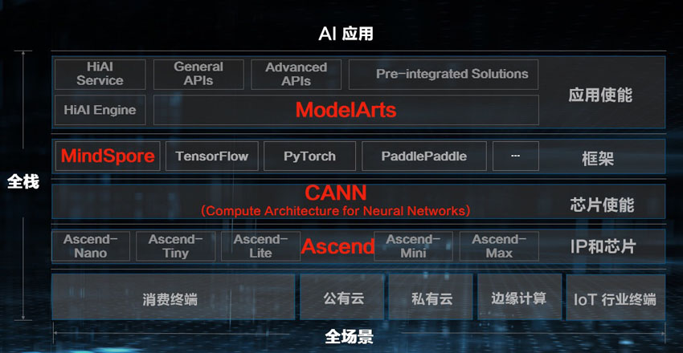
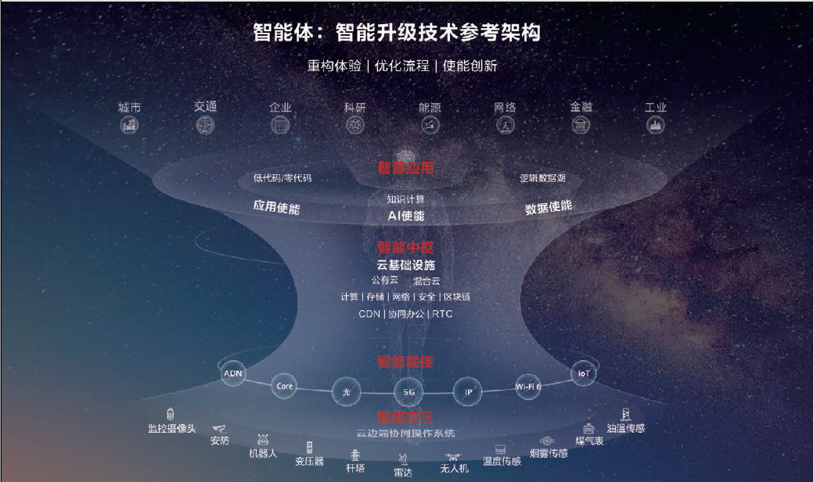

 

| 序号 | 修改时间   | 修改内容                               | 修改人 | 审稿人 |
| ---- | ---------- | -------------------------------------- | ------ | ------ |
| 1    | 2010-9-13  | 创建                                   | Keefe |        |
| 2    | 2010-12-28 | 增加学术会议机构等资源链接介绍         | 同上   |        |
| 3    | 2011-1-10  | 增加机器学习细节的认识，增加WEKA章节。 | 同上   |        |
| 4    | 2011-1-20  | 细化分类器算法的认识                   | 同上   |        |
| 5    | 2017-12-15 | 增加深度学习章节。                     | 同上   |        |
| 6    | 2018-7-10  | 增加知识图谱章节                       | 同上   |        |
| 7    | 2018-10-28 | 更新机器学习流程和建模章节             | 同上   |        |
|      |            |                                        |        |        |


---

[TOC]

 

# 目录

[目录... 1](#_Toc528493258)

[1    人工智能AI 4](#_Toc528493259)

[1.1    人工智能简介intro. 4](#_Toc528493260)

[1.1.1     各学科的贡献 （哲学…）... 4](#_Toc528493261)

[1.1.2     发展历程... 6](#_Toc528493262)

[1.1.3     学派，研究领域和分类... 6](#_Toc528493263)

[1.1.4     杰出人物介绍... 7](#_Toc528493264)

[1.1.5     当前研究进展和领域前沿... 8](#_Toc528493265)

[1.2    研究方法... 8](#_Toc528493266)

[1.2.1     Problem-solving and Resoning. 8](#_Toc528493267)

[1.2.2     问题表示（符号主义—谓词逻辑）... 9](#_Toc528493268)

[1.2.3     问题求解(搜索) 9](#_Toc528493269)

[1.2.4     知识与推理Knowledge and Reasoning. 9](#_Toc528493270)

[1.3    研究领域... 10](#_Toc528493271)

[1.3.1     机器学习... 10](#_Toc528493272)

[1.3.2     自然语言处理... 10](#_Toc528493273)

[1.3.3     模式识别... 10](#_Toc528493274)

[1.3.4     计算机视觉vision. 11](#_Toc528493275)

[1.3.5     机器人学... 11](#_Toc528493276)

[1.4    AI术语... 11](#_Toc528493277)

[1.5    本章参考... 11](#_Toc528493278)

[2    机器学习ML. 11](#_Toc528493279)

[2.1    机器学习简介... 12](#_Toc528493280)

[2.1.1     机器学习流程... 12](#_Toc528493281)

[2.1.2     常用术语... 12](#_Toc528493282)

[2.2    机器学习的类型... 12](#_Toc528493283)

[2.2.1     规则学习Rule-learning. 12](#_Toc528493284)

[2.2.2     贝叶斯学习... 13](#_Toc528493285)

[2.2.3     神经网络学习... 14](#_Toc528493286)

[2.2.4     支持向量机SVM.. 15](#_Toc528493287)

[2.3    分类classifiers/categorization. 15](#_Toc528493288)

[2.3.1     分类过程... 16](#_Toc528493289)

[2.3.2     分类器算法... 16](#_Toc528493290)

[2.3.3     文本分类示例... 18](#_Toc528493291)

[2.4    聚类cluster. 19](#_Toc528493292)

[2.4.1     算法... 19](#_Toc528493293)

[2.4.2     文本聚类示例... 20](#_Toc528493294)

[2.5    关联规则... 20](#_Toc528493295)

[2.5.1     Apriori算法... 20](#_Toc528493296)

[2.6    模型评估和优化... 21](#_Toc528493297)

[2.6.1     模型泛化... 21](#_Toc528493298)

[2.6.2     分类模型评估... 21](#_Toc528493299)

[2.6.3     回归模型评估... 23](#_Toc528493300)

[2.6.4     参数调整优化模型... 23](#_Toc528493301)

[2.7    本章参考... 23](#_Toc528493302)

[3    深度学习... 23](#_Toc528493303)

[3.1    本章参考... 24](#_Toc528493304)

[4    知识图谱... 24](#_Toc528493305)

[4.1    简介... 24](#_Toc528493306)

[4.2    知识图谱构建技术... 25](#_Toc528493307)

[4.2.1     信息抽取... 25](#_Toc528493308)

[4.2.2     知识融合... 26](#_Toc528493309)

[4.2.3     知识加工... 26](#_Toc528493310)

[4.2.4     知识更新... 26](#_Toc528493311)

[4.3    知识图谱的应用... 26](#_Toc528493312)

[4.4    本章参考... 27](#_Toc528493313)

[参考资料... 32](#_Toc528493326)

[参考书目... 32](#_Toc528493327)

[参考文献... 32](#_Toc528493328)

[附录... 32](#_Toc528493329)

[学术资源... 32](#_Toc528493330)

[其它资源... 33](#_Toc528493331)

[数据集... 33](#_Toc528493332)

 

表目录

[表格 1 AI三大学派比较__ 7](#_Toc528493333)

[表格 3 ML常用术语__ 12](#_Toc528493334)

[表格 4 分类主要模型列表__ 16](#_Toc528493335)

[表格 5 常用聚类方法列表__ 19](#_Toc528493336)

[表格 6 常用聚类分析算法列表__ 19](#_Toc528493337)

[表格 7 常用关联规则算法列表__ 20](#_Toc528493338)

[表格 8 IR检索系统的评测指标__ 21](#_Toc528493339)

 

 

图目录

[图 1 AI发展历程__ 6](#_Toc528493340)

[图 2 ROC曲线__ 22](#_Toc528493341)

[图 3 知识图谱的架构__ 25](#_Toc528493342)

[图 4 AI产业链__ 27](#_Toc528493343)

 


---

# 1  人工智能AI

## 1.1   人工智能简介intro

**人工智能**（Artificial Intelligence或简称AI）有时也称作**机器智能**，是指由人工制造出来的系统所表现出来的智能。通常人工智能是指通过普通计算机实现的智能。该词同时也指研究这样的智能系统是否能够实现，以及如何实现的科学领域。

**人工智能定义**：人工智能=人工(计算机)　＋　智能（特殊化程序）．从智能体角度来看，有两类智能，人类和计算机。

人工智能的定义有以下四种方法： [4]
*  Action humanly: 图灵测试方法1950年提出
*  Thinking humanly: 
*  Thinking Rationally: laws of thought
*  Action Rationally: 

 

**智能媒介Intelligent Agents**

智能媒介又叫智能体，是指某种能够行动的东西．

强智能和弱智能．强智能认为人是精密的计算机．（评：非常远大的梦想，但不是人类智能所能达到的）．弱智能关注的是提示人类和动物的形为所到达到的程度，智能机器被用作理解智能形为的手段．

 

### 1.1.1 各学科的贡献  （哲学…）

**哲学**

Main article: [Philosophy of artificial intelligence](http://en.wikipedia.org/wiki/Philosophy_of_artificial_intelligence)

Can a machine have a [mind](http://en.wikipedia.org/wiki/Mind) and [consciousness](http://en.wikipedia.org/wiki/Consciousness)? A few of the most influential answers to these questions are given below.[[147\]](http://en.wikipedia.org/wiki/Artificial_intelligence#cite_note-146)
*  [Turing's "polite convention"](http://en.wikipedia.org/wiki/Computing_Machinery_and_Intelligence)

* If a machine acts as intelligently as a human being, then it is as intelligent as a human being.* [Alan Turing](http://en.wikipedia.org/wiki/Alan_Turing) theorized that,
*  The [Dartmouth proposal](http://en.wikipedia.org/wiki/Dartmouth_Conferences)          1956
*  [Newell and Simon's physical symbol system hypothesis](http://en.wikipedia.org/wiki/Physical_symbol_system) 
*  [Gödel's incompleteness theorem](http://en.wikipedia.org/wiki/Gödel's_incompleteness_theorem)
*  [Searle's strong AI hypothesis](http://en.wikipedia.org/wiki/Chinese_room#Strong_AI)
*  The [artificial brain](http://en.wikipedia.org/wiki/Artificial_brain) argument

 

**哲学的贡献：知识论，物质和意识．．．**

科学哲学也称自然辩证法．主要的理论有实在主义，经验主义，相对主义等．

**［知识从哪里来］**

知识的产生方式，一是先验知识；二是认为知识完全产生于观察，推理及归纳，如培根的经验主义，休漠的归纳原理．目前的主流是第二种，知识来源于实践．

 

**［物质和意识的关系］**

哲学中，物质和意识的关系是哲学的本源问题．通常有二种，一是一元论, 要么物质决定论, 要么意识决定论；二是二元论，某些意识可以超脱于自然之外，René Descartes(笛卡尔)第一个给出清晰的讨论．

​     人工智能中，涉及到肉体（物质的大脑）和精神的关系．肉体产生思维，还是思维可以独立于肉体．这涉及到*永生*问题．这也导致了研究人工智能的方向，基于肉体的仿生学和使用符号表示的计算机学．也产生了不同的学派，连结主义和符号主义．

 

**数学的贡献：形式表示与证明/算法/可计算性/可操作性/概率性**

**［可计算和不可计算］**

可计算的含义是，一个输入最终能得到一个输出．但现实生活中有一些例子，可以看到人的思维中包含不可计算的部分．如无中间过程突然得到的结果（直觉），不符合理性逻辑的行为．

​     人工智能中，如何模拟不可计算的? 理论基础, 量子力学中的[不确定性原理](http://zh.wikipedia.org/zh-cn/不確定性原理)．数学中的*可计算性*和*算法复杂性理论*．

 

**经济学的贡献：效用，决策和运筹学**
* 神经科学的贡献：大脑和神经网络，智能活动的物理基础(substrate)
* 心理学的贡献：人类和动物如何思想和工作．结论，人类思考和活动是一个信息处理过程．

**计算机工程的贡献：制造出能干的计算机**
* 控制论的贡献：人工制品怎么在自己的控制下工作．自我平衡系统/稳定性/优化设计

**经济学的贡献：复杂系统中的决策/验证环境**

 

以上揭示了计算机模型可用来表示**语言**，记忆和逻辑思维的心理过程．

 

### 1.1.2 发展历程

​                               

图 1 AI发展历程

| 年代  | 事件                                                         | 备注 |
| ----- | ------------------------------------------------------------ | ---- |
| 1950  | 图灵的论文(Computing Machinery and Intelligence)提出了图灵测试、机器学习、遗传算法、增量学习，第一个清晰地描绘出AI的完整图像 |      |
| 1953  | [博弈论](http://zh.wikipedia.org/wiki/博弈論)。<br>Metropolis提出 模拟退火算法SA 的思想，Kirkpatrick在1983年成功地将其应用在组合最优化问题中。 |      |
| 1956  | 美国达特茅斯会议[Dartmouth](http://en.wikipedia.org/wiki/Dartmouth_College)，AI正式诞生。参与人共10人，其中包括赫伯特.西蒙[Herbert Simon](http://en.wikipedia.org/wiki/Herbert_Simon)，约翰.麦卡锡[John McCarthy](http://en.wikipedia.org/wiki/John_McCarthy_(computer_scientist)),，克劳德.香农, 亚伦.纽厄尔[Allen Newell](http://en.wikipedia.org/wiki/Allen_Newell)，马文.明期基[Marvin Minsky](http://en.wikipedia.org/wiki/Marvin_Minsky)． 约翰·麦卡锡首度提出「人工智能」这一概念，提出者约翰·麦卡锡也被誉为「人工智能之父」。 |      |
| 1960s | 1960年产生了**人工智能语言** [LISP语言](http://zh.wikipedia.org/wiki/LISP语言)。<br>1963 年，「人工智能之父」约翰·麦卡锡创建了斯坦福人工智能实验室（SAIL，Stanford Ar[ti](http://www.elecfans.com/tags/ti/)ficial [Intel](http://www.elecfans.com/tags/intel/)ligence Laboratory）。该实验室拥有多个领域的专家，涉及机器人技术、计算机视觉、机器学习、图像处理、自然语言处理等多个领域，代表人物包括一大批在人工智能领域闻名遐迩的人物，如 Christopher Manning 、吴恩达、李飞飞等。。<br>1966 年，MIT 计算机科学家 Joseph Weizenbaum 开发出首个自然语言处理程序——ELIZA，它是一个模拟罗杰斯心理治疗的聊天机器人。<br>1967 年，斯坦福大学 E.A. Feigenbaum 领导开发出第一个「专家系统」——DENRAL， 使得人工智能的研究以推理算法为主转变为以知识为主。<br>1969 年，阿瑟·布莱森（Arthur Bryson）和何毓琦（Yu-Chi Ho）提出机器学习领域最重要的算法——反向传播算法（Backpropaga[TI](http://bbs.elecfans.com/zhuti_715_1.html)on）。这种算法可用于多层人工[神经网络](http://www.elecfans.com/tags/神经网络/)，2000 年至今[深度学习](http://www.elecfans.com/tags/深度学习/)的发展都离不开它的启发。 |      |
| 1970s | 1973年，[生产系统](http://zh.wikipedia.org/wiki/生產系統)。1973年产生[PROLOG语言](http://zh.wikipedia.org/wiki/PROLOG语言)。<br>美国斯坦福国际研究所（Stanford Research Ins[TI](http://bbs.elecfans.com/zhuti_715_1.html)tu[te](http://www.elecfans.com/tags/te/)， SRI）研制出首台采用了人工智能学的移动机器人——Shakey。<br>1975年，美国Michigan大学J.Holland教授提出，并出版专著《Adaptation in Natural and Artificial Systems》。J.Holland教授所提出的GA通常为简单遗传算法（SGA）。<br>1976年，[框架理论](http://zh.wikipedia.org/wiki/框架理論) <br>1979年，汉斯·摩拉维克（Hans Moravec）在斯坦福大学就读研究生时期发明的 Stanford Cart，在无人干预的情况下自动穿过摆满椅子的房间并前后行驶了 5 小时。Stanford Cart 相当于早期[无人驾驶](http://www.elecfans.com/tags/无人驾驶/)汽车。 |      |
| 1988  | IBM 沃森研究中心发表《机器翻译的统计方法》（A STA[TI](http://bbs.elecfans.com/zhuti_715_1.html)S[TI](http://bbs.elecfans.com/zhuti_715_1.html)CAL APPROACH TO LANGUAGE TRANSLATION），预示着基于规则的机器翻译方法开始转变为基于概率的方法，并反映了一个更为广泛的转变：从「理解」眼前的任务的「机器学习」方法转变为基于已知例子的统计分析方法。 |      |
| 1990s | 1991年，蒂姆·伯纳斯－李（Tim Berne[rs](http://www.elecfans.com/tags/rs/)-Lee）发明的万维网首次上线。<br>1992年，Marco Dorigo在他的博士论文中引入[蚁群算法](http://baike.baidu.com/view/539346.htm#_blank)(ant colony optimization, ACO)，其灵感来源于蚂蚁在寻找食物过程中发现路径的行为。<br>1997 年，IBM 研发的「深蓝」（Deep Blue）成为第一个击败人类象棋冠军 Garry Kasparov 的电脑程序。<br>1998 年，斯坦福大学教授肯尼斯·萨里斯伯里（Kenneth Salisbury）公开外科机器人（robotic surgery）专利。 |      |
| 2000s | 2005 年，斯坦福大学教授 Sebastian Thrun 联合斯坦福大学 AI 实验室发明的第一辆自动驾驶汽车完成了 132 英里的 Mojava 沙漠路线，在 DARPA 超级挑战赛（DARPA Grand Challenge）上一举夺冠。<br/>2009 年，李飞飞主导的 ImageNet 项目诞生了一个含有 1500 万张照片的数据库，涵盖了 22000 种物品。这个项目以及后来的一系列工作影响了整个计算机视觉领域发展。<br/>2010 年，苹果公司推出一款内建在苹果 iOS 系统中的人工智能助理软件 Siri。 |      |
| 2010s | 2011 年，IBM 开发的自然语言问答计算机沃森在美国老牌益智节目「危险边缘」（Jeopardy！）中击败人类。<br/>2012 年，杰夫·迪恩（Jeff Dean）和吴恩达（Andrew Ng）发布一份实验报告，他们给一个大型神经网络展示 1000 万张未标记的网络图片，发现神经网络能够识别出猫的形象。<br/>2014 年，亚马逊推出了智能音箱 Echo 以及智能语音助手 Alexa。<br/>2016 年，谷歌 DeepMind 研发的 AlphaGo 击败围棋世界冠军李世石。 |      |
| 2020s |                                                              |      |

> 备注：1990s表示1990-1999十年间，同理类推。

典型案例：MIT Eliza程序—聊天机器人，积木世界，中文屋等


### 1.1.3 学派和分类

目前人工智能的主要学派有下面三家：

(1) 符号主义(symbolicism)，又称为逻辑主义(logicism)、心理学派(psychologism)或计算机学派(computerism)，其原理主要为物理符号系统(即符号操作系统)假设智能和有限合理性原理。这个学派的代表人物有纽厄尔(Newell)、西蒙(Simon)和尼尔逊(Nilsson)等。

(2) **连接**主义(connectionism)，又称为*仿生*学派(bionicsism)或生理学派(physiologism)，其主要原理为神经网络及神经网络间的连接机制与学习算法。

(3) **行为主义**(actionism)，又称为*进化*主义(evolutionism)或*控制论*学派(cyberneticsism)，其原理为控制论及感知-动作型控制系统。


表格 1 AI三大学派比较

|          | 知识表达 | 黑箱 | 特征  学习 | 可解释性 | 大样本 | 计算复杂性 | 组合爆炸 | 环境互动 | 过拟合 |
| -------- | -------- | ---- | ---------- | -------- | ------ | ---------- | -------- | -------- | ------ |
| 符号主义 | 强       | 否   | 无         | 强       | 否     | 高         | 多       | 否       | 无     |
| 连接主义 | 弱       | 是   | 有         | 弱       | 是     | 高         | 少       | 否       | 有     |
| 行为主义 | 强       | 否   | 无         | 强       | 否     | 一般       | 一般     | 是       | 无     |

备注：1. 标红部分表示是比较不好的选项。

2. 机器学习是符号主义和连接主义的结合。

 

AI多种学习方式 

* 机器学习：一般是基于概率理论。包括统计学习、贝叶斯学习、SVM等。
* 深度学习：从感知机发展起来的学习方法，其中神经网络是目前最火的方向。
* 强化学习：（英语：`Reinforcement learning`，简称`RL`）是机器学习中的一个领域，强调如何基于环境而行动，以取得最大化的预期利益。通常用于交互比较频繁的场景，如家政机器人。
* 迁移学习：利用数据、任务或模型之间的相似性，将在旧的领域学习过或训练好的模型，应用于新的领域这样的一个过程。

* 集成学习：集成方法是将几种机器学习技术组合成一个预测模型的元算法，以达到减小方差（bagging）、偏差（boosting）或改进预测（stacking）的效果。集成学习潜在的思想是即便某一个弱分类器得到了错误的预测，其他的弱分类器也可以将错误纠正回来。
* 神经网络：类似于大脑神经突触联接的结构进行信息处理的数学模型。从单层感知机、多层感知机，发展到神经网络（RNN/CNN）。

> 说明：监督学习处理认知问题，强化学习处理决策问题。

表格  AI常用学习方式的比较

|            | 深度学习 | 传统统计学习 | 集成树 |
| ---------- | -------- | ------------ | ------ |
| 表达能力   | 强       | 弱           | 中     |
| 特征获取   | 强       | 弱           | 中     |
| 数据约束   | 强       | 中           | 弱     |
| 数据量要求 | 大       | 中           | 中     |
| 训练难度   | 大       | 小           | 小     |
| 可解释性   | 弱       | 强           | 弱     |


### 1.1.4 杰出人物介绍

人工智能的杰出人物主要分布在CMU, MIT, Stanford，IBM，是达特茅斯会议参与者的主要工作场所．

[Herbert Simon](http://en.wikipedia.org/wiki/Herbert_Simon) **(西蒙, 1916~2001)**

他是AI研究的先驱者, 经济组织决策管理大师，于1978年获得诺贝尔经济学奖, 是因为他早年的工作: 基于满意度的模型-制定"足够好"的决策, 而不是艰苦计算获得最优化决策-能更好地描述真实人类行为.　CMU

 

[Allen Newell](http://en.wikipedia.org/wiki/Allen_Newell) **(**亚伦.纽厄尔1927~1992**)**

1975年与图灵奖获得者. CMU. 达特茅斯会议中与西蒙一起提出*物理符号系统假说*，为符号主义的经典理论．

 

[Marvin Minsky](http://en.wikipedia.org/wiki/Marvin_Minsky)(马文.明期基1927~)

1969年图灵奖获得者，创建麻省理工学院(MIT)人工智能实验室。1975年他首创框架理论(frame theory).

 

**Noam Chomsky(乔姆斯基, 1928~)**

他是[麻省理工学院](http://zh.wikipedia.org/zh-cn/麻省理工学院)[语言学](http://zh.wikipedia.org/zh-cn/语言学)的荣誉退休教授，在语言学，心理学和哲学上有杰出贡献。乔姆斯基的[生成语法](http://zh.wikipedia.org/zh-cn/生成语法)被认为是[20世纪](http://zh.wikipedia.org/zh-cn/20世纪)[理论语言学](http://zh.wikipedia.org/w/index.php?title=理论语言学&action=edit&redlink=1)研究上的重要贡献。他对[伯尔赫斯·弗雷德里克·斯金纳](http://zh.wikipedia.org/zh-cn/伯尔赫斯·弗雷德里克·斯金纳)所著《[口语行为](http://zh.wikipedia.org/w/index.php?title=口語行为&action=edit&redlink=1)》的评论，也有助于发动[心理学](http://zh.wikipedia.org/zh-cn/心理学)的[认知革命](http://zh.wikipedia.org/w/index.php?title=认知革命&action=edit&redlink=1)，挑战[1950年代](http://zh.wikipedia.org/zh-cn/1950年代)研究[人类行为](http://zh.wikipedia.org/zh-cn/人類行為)和[语言](http://zh.wikipedia.org/zh-cn/语言)方式中占主导地位的[行为主义](http://zh.wikipedia.org/zh-cn/行为主义)。他所采用以自然为本来研究语言的方法也大大地影响了语言和心智的[哲学](http://zh.wikipedia.org/zh-cn/哲学)研究。他的另一大成就是建立了[乔姆斯基层级](http://zh.wikipedia.org/zh-cn/乔姆斯基层级)：根据文法[生成力](http://zh.wikipedia.org/w/index.php?title=生成力&action=edit&redlink=1)不同而对[形式语言](http://zh.wikipedia.org/zh-cn/形式语言)做的分类。

 

[John McCarthy](http://en.wikipedia.org/wiki/John_McCarthy_(computer_scientist))(约翰.麦卡锡,1927~ )

1971年图灵奖获得者，斯坦福大学人工智能实验室的主任．1959年，发明了LISP语言. 1956年达特茅斯会议Dartmouth的发起者，号称人工智能之父．

 

[Tom Mitchell](http://www.cs.cmu.edu/~tom/)(米切尔)

Home: http://www.cs.cmu.edu/~tom/

[Machine Learning](http://www.cs.cmu.edu/~epxing/Class/10701/)一书作者．

 

### 1.1.5 当前研究进展和领域前沿

关于人工智能理论阶段，存在两种划分方法。

- 第一种划分方法是运算智能、感知智能和认知智能三个阶段。运算智能，即快速计算和记忆存储能力；感知智能，即视觉、听觉、触觉等感知能力；认知智能就是具有推理、可解释性的能力，也是人工智能的高级阶段。 可见，发展第三代人工智能，需要依靠知识、数据、算法和算力四个要素，其中的关键问题是算法。

- 第二种划分方法是感知智能、认知智能和决策智能三个阶段。 为了提高机器决策的准确度，需要加强复杂问题下，提升人机信任度，增强人类与智能系统交互协作智能的研究，即决策智能 。

人工智能的发展经历了表示计算到感知智能两个阶段，下一个阶段的核心是认知。 以上两种划分法对此存在共识，即目前发展处于第三代人工智能。

**［符号智能和计算智能］**

有人把人工智能分成两大类：一类是符号智能，一类是计算智能。符号智能是以知识为基础，通过推理进行问题求解。也即所谓的传统人工智能。计算智能是以数据为基础，通过训练建立联系，进行问题求解。人工神经网络、遗传算法、模糊系统、进化程序设计、人工生命等都可以包括在计算智能。

 

过去十年十大人工智能研究热点
1. 深度神经网络
• 深度神经网络是深度学习的基础，又被称为深度前馈网络（DFN）、多层感知机（MLP），可以理解为是有很多隐藏层的神经网络。深度神经网络可以在没有大量标记数据的情况下解决问题。代表算法包括卷积神经网络、循环神经网络、递归神经网络等。深度神经网络的被引用量保持了较长时间的稳定平稳增长；深度卷积神经网络技术则于2014年开始获得更多引用。目前，深度神经网络（DNN）是许多人工智能应用的基础，从自动驾驶汽车、癌症检测到大型游戏等。在这许多领域中，DNN实现了超越人类的准确率。

2. 特征抽取
• 特征抽取（Feature Extraction）热门是信息检索与推荐中的一项技术，专指使用计算机提取一组测量值中属于特征性的信息的方法及过程，并将所抽取出的有效实体信息进行结构化存储。目前特征抽取已引入机器学习、深度学习、神经网络技术，其中，神经网络计算已应用于图片特征抽取。针对某个特定图片，通过卷积神经网络对图片进行特征抽取得到表征图片的特征，利用度量学习方法如欧式距离对图片特征进行计算，对图片距离进行排序，得到初级检索结果，再根据图片数据的上下文信息和流行结构对图像检索结果进行重排序，从而提高图像检索准确率，得到最终的检索结果。

3. 图像分类
• 图像分类（Image Classification）是指计算机利用算法从给定的分类集合中给某个特定图像正确分配一个标签的任务，其目标是将不同的图像划分到不同的类别中，并实现最小的分类误差，较多应用于计算机视觉、信息检索与推荐领域。2012年，加拿大认知心理学家和计算机科学家 Geoffrey Everest Hinton 的博士生 Alex Krizhevsky 在 ILSVRC 将深度学习用于大规模图像分类中并提出了CNN模型，其计算效果大幅度超越传统方法，获得了ILSVRC2012冠军，该模型被称作AlexNet。从 AlexNet 之后，涌现了一系列 CNN 模型，不断地在 ImageNet 上刷新成绩。目前的深度学习模型的识别能力已经超过了人眼。

4. 目标检测
• 目标检测（Object Detection）作为计算机视觉和图像处理领域一个分支，是指利用图像处理与模式识别等领域的理论和方法，检测出数字图像和视频中存在的特定类别的目标对象，确定这些目标对象的语义类别，并标定出目标对象在图像中的位置。对象检测是对象识别的前提，具有很大发展潜力。对象检测已经有许多有用有趣的实际应用，如人脸识别、行人检测、视觉搜索引擎、计数、航拍图像分析等。深度学习模型在图像分类任务中碾压了其他传统方法。很多对象检测的新方法和新应用推动了深度学习最前沿的科技发展。 • 目前流行的目标检测算法有 One-stage 和 Two-stage 两种。 Two-stage 指的是检测算法需要分两步完成，即先获取候选区域、再进行分类与回归，比如 RCNN 系列算法，准确度较高但是速度慢； One-stage 检测不需要单独寻找候选区域， 典型的有 SSD/YOLO，其速度快但是准确性较低。对象检测在过去 10 年内出现了由基于区域的卷积神经网络（R-CNN）、 YOLO 分治网络、 SSD 等多种方法。这些新技术在速度和精确度上都较先有了很大提升。目前，计算机进行对象检测的能力在很多方面已经超越人类。例如， AI 通过深度学习进行对象检测和识别，已经可以更准确地检测乳腺癌。

5. 语义分割
• 语义分割（Semantic Segmentation） 是让计算机根据图像的语义进行分割，判断图像中哪些像素属于哪个目标。近年来，许多语义分割问题正在采用深度学习技术来解决，最常见的是卷积神经网络，在精度上大大超过了其他方法以及效率。目前语义分割的应用领域主要有：地理信息系统、无人车驾驶、医疗影像分析和机器人等领域。

6. 表示学习
• 表示学习（Representation Learning），是指将原始数据转换成能够被机器学习的一种深度学习技术。它能够从复杂的原始数据中提炼有效特征，剔除无效或者冗余信息，形成可用的数据表示。在知识表示学习中，词嵌入（Word Embedding）是自然语言处理的重要突破之一，它可以将词表示为实数域向量，进而为机器学习和深度学习提供模型训练的基础。近些年很多专家和学者利用词嵌入的表示学习原理进行相关领域的研究，主要的表示方法包括 Word2Vec、 One-hot、词共现等。这些方法已经成为当下人工智能技术应用的基础，为机器学习提供了高效的表示能力。

7. 生成对抗网络
• 生成对抗网络（Generative Adversarial Networks, GAN）是用于无监督学习的机器学习模型，由 Ian Goodfellow 等人在 2014 年提出。 由神经网络构成判别器和生成器构成，通过一种互相竞争的机制组成的一种学习框架。 GAN 功能强大，学习性质是无监督的，也不需要标记数据。传统的生成模型最早要追溯到 80 年代的RBM，以及后来逐渐使用深度神经网络进行包装的 AutoEncoder，然后就是现在的生成模型 GAN。 GAN 具有大量的实际用例，如图像生成、艺术品生成、音乐生成和视频生成。 此外，它还可以提高图像质量，并且完成图像风格化或着色、面部生成以及其他更多有趣的任务。

8. 语义网络
• 语义网络（Semantic Network）是一种以网络格式表达人类知识构造的形式，是人工智能程序运用的表示方式之一，相关研究主要集中在信息检索与推荐、知识工程领域。语义网络是一种面向语义的结构，它们一般使用一组推理规则，规则是为了正确处理出现在网络中的特种弧而专门设计的。语义网络可以深层次地表示知识，包括实体结构、层次及实体间的因果关系；无推理规律可循；知识表达的自然性可以直接从语言语句强化而来。

9. 协同过滤
• 协同过滤（CF）是推荐系统使用的一种技术，通过收集来自多个用户的偏好、兴趣、评价标准等用户行为数据来过滤信息， 并自动预测（过滤）用户兴趣的方法，为用户提供有针对性的推荐及其所需信息。大多数协同过滤系统都应用基于相似度索引的技术。 协同过滤是解决信息超载问题的一个有效办法。无论是基于用户-用户的协同过滤，还是项目-项目的协同过滤，都有效地提高了用户信息的使用效率。

10. 机器翻译
• 机器翻译（Machine Translation），又称为自动翻译，是利用计算机把一种自然源语言转变为另一种自然目标语言的过程，通常指自然语言之间句子和全文的翻译。它是自然语言处理（Natural Language Processing）的一个分支，与计算语言学（Computational Linguistics）、自然语言理解（Natural LanguageUnderstanding）之间存在密不可分的关系。机器翻译是人工智能的终极目标之一，其核心语言理解和语言生成是自然语言处理的两大基本问题。近几年来，随着深度学习技术的发展，神经机器翻译取得了巨大进展，其生成的译文接近自然语句，成为了主流语言学习模型。


**会议杂志**

* IJCAI　二年一次

* ECAI AAAI 各一年一次

 

**其它**
*  图灵测试－洛伯纳奖Loebner Prize website 1990~present
*  CVPR 计算机视觉领域最著名的会议叫CVPR，这个PR就是模式识别。

 

## 1.2   研究方法

**研究方法分类**

**［仿生学和计算机方法］**

仿生学算法有模仿蚂蚁群体的蚁群算法，模仿达尔文进化论的遗传算法，模仿热力学中固体降温过程的模拟退火算法等。 （评，仿生学的本质是基于物质材料决定于思维）．

计算机方法包括数学建模和心理学中的启发式程序。 常规的启发式搜索算法有：回溯和分支限界。

 

### 1.2.1 Problem-solving and Resoning

**强人工智能**观点认为*有可能*制造出*真正*能 [推理](http://zh.wikipedia.org/wiki/推理)（[Reasoning](http://en.wikipedia.org/wiki/Reasoning)）和[解决问题](http://zh.wikipedia.org/wiki/解決問題)（[Problem_solving](http://en.wikipedia.org/wiki/Problem_solving)）的智能机器，并且，这样的机器能将被认为是有知觉的，有自我意识的。

 

智能体的功能分解：感知－＞建模－＞规划－＞行动，如20世纪60年代Stanford产生的认识机器人－沙基shakey.

新人工智能的三大原则：实体化，现场性，自底向上设计。如基于行为的机器人．

 

### 1.2.2 问题表示（符号主义—谓词逻辑）

零价(谓词逻辑Propositional Logic)：C<= X^Y^Z （具备最低级的描述能力）

属性：

一阶：Horn子句

 

### 1.2.3 问题求解(搜索)

首先形式化问题, 以八皇后问题为例.
*  状态stete
*  初始状态
*  后继函数action:  left, right, up, down
*  目标测试goal
*  路径消耗

 

问题空间的搜索策略

1)     学习的归纳本质

2)     穷尽搜索: 广度优先,深度优先…

3)     启发式搜索: 回溯, 分支限界, 贪婪法,遗传算法,联机搜索…

4)     对抗搜索: 博弈

 

### 1.2.4 知识与推理Knowledge and Reasoning

知识可分为确定性知识和不确定性知识.

 

**确定性知识**

常规的知识可通过逻辑推理的方式获得.

 

**不确定性知识**

不确定性知识常通过概率统计的方式获得, 如
*  贝叶斯定理:　NB，贝叶斯网络等
*  隐马尔可夫模型(Hidden Markow Model, HMM)
*  卡尔曼滤波器

 

## 1.3   研究领域

**研究领域**

*  [自然语言处理](http://zh.wikipedia.org/wiki/自然語言處理)(NLP; Natural Language Processing)，听者和说者之间的通讯。
*  [知识表现](http://zh.wikipedia.org/wiki/知識表現) (Knowledge Representation)，储存信息。
*  自动推理，运用储存的信息来回答或提取新的结论。
*  [机器学习](http://zh.wikipedia.org/wiki/机器学习) (Machine Learning)，能适应新的环境并检测和推断新的模式
*  计算机视觉，可以感知物体
*  机器人技术，可以操纵和移动物体
*  此外还包括[智能搜索](http://zh.wikipedia.org/wiki/智能搜索) (Intelligent Search)，模式识别等

 

**分类一：**

当前AI的方向大致可分为四个，分别是语言、图像、自然语言处理和智能硬件。

搜索和推荐可归入自然语言处理领域。

 

**分类二：学术界UCLA朱松纯将AI分为六个领域，分别是：**

（1）计算机视觉（暂且把模式识别，图像处理等问题归入其中）、

（2）自然语言理解与交流（暂且把语音识别、合成归入其中，包括对话）、

（3）认知与推理（包含各种物理和社会常识）、

（4）机器人学（机械、控制、设计、运动规划、任务规划等）、

（5）博弈与伦理（多代理人agents的交互、对抗与合作，机器人与社会融合等议题）、

（6）机器学习（各种统计的建模、分析工具和计算的方法），

 

分类三：工业界按应用场景将AI分为
*  自动驾驶 （车联网）
*  机器人
*  智能客服


### 1.3.1 机器学习

机器学习是经典符号主义和联结主义的结合．它是人工智能AI一个极重要的研究领域。


### 1.3.2 自然语言处理

详见 《[自然语言处理](自然语言处理.md)》


### 1.3.3 模式识别

模式识别（英语：Pattern Recognition），就是通过[计算机](https://baike.baidu.com/item/计算机)用[数学](https://baike.baidu.com/item/数学)技术方法来研究模式的自动处理和判读。我们把[环境](https://baike.baidu.com/item/环境)与[客体](https://baike.baidu.com/item/客体)统称为“模式”。

信息处理过程的一个重要形式是生命体对环境及客体的识别。对人类来说，特别重要的是对[光学](https://baike.baidu.com/item/光学)信息（通过[视觉](https://baike.baidu.com/item/视觉)器官来获得）和[声学](https://baike.baidu.com/item/声学)信息（通过听觉器官来获得）的识别。这是模式识别的两个重要方面。市场上可见到的代表性产品有[光学字符识别](https://baike.baidu.com/item/光学字符识别)、[语音识别](https://baike.baidu.com/item/语音识别)系统。

 

**研究领域**

模式识别研究主要集中在两方面，一是研究生物体(包括人)是如何感知对象的，属于认识科学的范畴，二是在给定的任务下，如何用计算机实现模式识别的理论和方法。前者是生理学家、心理学家、[生物学](https://baike.baidu.com/item/生物学)家和神经生理学家的研究内容，后者通过数学家、信息学专家和[计算机科学](https://baike.baidu.com/item/计算机科学)工作者近几十年来的努力，已经取得了系统的研究成果。

 

**应用**

模式识别可用于文字和语音识别、遥感和医学诊断等方面。


### 1.3.4 计算机视觉 Vision

详见 《[计算机视觉](计算机视觉.md)》


### 1.3.5 机器人学

 

## 1.4 AI业界

表格： AI行业巨头的AI全栈技术

|      | 分类         | GCP        | Azure                  | AWS        | Ali            | HW        |
| ---- | ------------ | ---------- | ---------------------- | ---------- | -------------- | --------- |
| 生态 | 联盟         |            |                        |            |                |           |
|      | 开发者       |            | 收购github             |            |                |           |
| SAAS | 行业应用     | 医疗、ADAS | 医疗、ADAS、零售、金融 | 医疗、ADAS | ET大脑六大行业 | 智能体    |
|      | AI基础服务   | 11种       | 20+                    | 11+        | 20%            | 15+       |
| PAAS | AI自动化工具 | AutoML     |                        |            |                |           |
|      | AI开发工具   | GME        | MLS                    | Sagemaker  | Dataworks PAI  | ModelArts |
|      | AI框架       | Tensorflow | CNTK                   | MXNET      | XD Euler       | Mindspore |
| IAAS | 芯片         | TPU        |                        |            |                | D系列     |

> 备注：GCP - Google Cloud Platform, HW - Huawei, ADAS-自动辅助驾驶。


### **AI芯片**

AI芯片说明如下：

* CPU： 中央处理器
* GPU：图形处理器，对于图像处理有作优化。
* TPU：推理处理器。


## 1.5 AI平台


表格 5 中国业界AI平台比较

| 平台       | 链接                                  | 简介                                                         |
| ---------- | ------------------------------------- | ------------------------------------------------------------ |
| 百度AI平台 | https://ai.baidu.com/                 | 研究领域和应用场景都非常齐全。                               |
| 阿里AI     | https://ai.aliyun.com/                | 属于阿里云提供的一个解决方案，没像百度那样重点突出AI，但内容也很全。 |
| 腾讯AI Lab | https://ai.tencent.com/               | 实验室性质，不是企业战略方向。研究领域：计息机视觉、语音识别、自然语言处理、机器学习 <br>应用领域：社交AI、游戏AI、内容AI、平台AI |
| 华为 AILA  | https://ai.huawei.com/ （仅华为内网） | 2018.5，华为BPIT成立AI使能部，分七大基础能力和六大领域解决方案。 |


### 百度AI平台

https://ai.baidu.com/

表格 6 百度AI技术能力

| 能力<BR>项     | 分项             | 子项                                                         | 应用<br>场景 |
| -------------- | ---------------- | ------------------------------------------------------------ | ------------ |
| 语音技术       | 语音识别         | 长、短(60s内）语音识别、远程语音识别                         |              |
|                |                  | 语音合成：在线合成、离线语音合成                             |              |
|                | 语音唤醒         | 实时语音识别、音频文件转写                                   |              |
|                | 图像审核         | 色情、政治、暴力、图文、广告、敏感信息、图像质量、公众人物识别 |              |
|                | 车辆分析         | 车型识别、车流统计、车辆损伤识别、车辆检测、车辆属性识别、车辆分隔 | 交通         |
|                | 图像识别         | 通用物体和场景识别、植物、动物、菜品、货币、门脸、地标、红酒、图像主体检测 |              |
|                | 图像搜索         | 相同图片搜索、相似图片搜索、商品图片搜索、绘本图片搜索       |              |
|                | 图像效果增强     | 图像去雾、图像无损放大、拉伸图像恢复、黑白图像上色、图像风格转换、图像清晰度增强、图像色彩增强 |              |
| 文字识别       | 通用文字识别     |                                                              |              |
| 文字识别       | 卡证文字识别     | 身份证、营业执照、护照、出生医学证明、银行卡、名片、户口本、 |              |
| 文字识别       | 票据文字识别     | 混贴票据、增值税发票、通用机打发票、出租车票、通用票据、银行回单、银行汇票、银行支票、银行火车票、彩票、 |              |
| 文字识别       | 教育场景文字识别 | 手写文字识别、公式识别                                       |              |
| 文字识别       | 汽车场景文字识别 | 行驶证、车辆识别、                                           |              |
| 文字识别       | 其它景文字识别   | 网络图片文字、表格文字、数字识别、印章检测、仪器仪表盘读数识别、二维码、文档版面分析与识别 |              |
| 人脸与人体识别 | 人脸识别         | 人脸检测、人脸搜索、人像对比、活体检测                       |              |
| 人脸与人体识别 | 人像特效         | 人脸融合                                                     |              |
| 人脸与人体识别 | 人体分析         | 人体关键点识别、人体检测与属性                               |              |
| 人脸与人体识别 | 行为分析         | 驾驶行为分析、危险形为分析、手势识别、指尖识别               |              |
| 人脸与人体识别 | 场景方案         | [人脸实名认证 ](https://ai.baidu.com/solution/faceprint) 	满足各种场景下实名认证的灵活需求 		<br>[人脸闸机 ](https://ai.baidu.com/solution/facegate) 软硬一体的人脸识别闸机解决方案，提升人员系统化管理的安全性与便捷性 		<br>[人脸考勤 ](https://ai.baidu.com/solution/faceattendance) 利用高精度的人脸识别、对比能力，搭建高效考勤系统，提高防作弊能力 		<br>[人脸会员识别 ](https://ai.baidu.com/solution/faceidentify) |              |
| 视频技术       |                  | 视频内容分析、 		视频封面选取、 		视频对比检索 		视频内容审核 |              |
| AR与VR         | 增强现实         | AR核心技术 		3D肢体关键点                              |              |
| AR与VR         | 虚拟现实         |                                                              |              |
| 自然语言处理   | NLP基础技术      | [词法分析 ](https://ai.baidu.com/tech/nlp_basic/lexical) 提供分词、词性标注、命名实体识别 		[词向量表示 ](https://ai.baidu.com/tech/nlp_basic/word_embedding) 帮助完成语义挖掘、相似度计算<br>[词义相似度 ](https://ai.baidu.com/tech/nlp_basic/word_emb_sim) 通过词语向量化来计算两个词之间的相似度 		[依存句法分析 ](https://ai.baidu.com/tech/nlp_basic/dependency_parsing) 自动分析文本中的依存句法结构信息 		<br/>[DNN](https://ai.baidu.com/tech/nlp_basic/dnnlm_cn)[语言模型 ](https://ai.baidu.com/tech/nlp_basic/dnnlm_cn) 判断一句话是否符合语言表达习惯 		[短文本相似度 ](https://ai.baidu.com/tech/nlp_basic/simnet) 计算两个短文本之间的语义相似度，实现推荐、排序 |              |
|                | NLP应用技术      | [文本纠错 ](https://ai.baidu.com/tech/nlp_apply/text_corrector) 识别文本中的错别字，给出提示以及正确的建议文本内容 		[情感倾向分析 ](https://ai.baidu.com/tech/nlp_apply/sentiment_classify) 对包含主观信息的文本进行情感倾向性判断 <br/>[评论观点抽取 ](https://ai.baidu.com/tech/nlp_apply/comment_tag) 分析评论关注点和观点，输出标签及观点极性 		[对话情绪识别 ](https://ai.baidu.com/tech/nlp_apply/emotion_detection) 识别会话者所表现出的情绪类别及置信度 <br/>[文本标签 ](https://ai.baidu.com/tech/nlp_apply/doctagger) 输出能够反映文章关键信息的多维度标签 		[文章分类 ](https://ai.baidu.com/tech/nlp_apply/topictagger) 输出文章的主题分类及对应的置信度 		<br/>[新闻摘要 ](https://ai.baidu.com/tech/nlp_apply/news_summary) 抽取关键信息并生成指定长度的新闻摘要 		[地址识别 ](https://ai.baidu.com/tech/nlp_apply/address) 精准提取快递填单文本中的姓名、电话、地址信息 |              |
|                | 文本审核         |                                                              |              |
|                | 机器翻译         | 通用翻译 语音翻译 		定制化翻译 拍照翻译 垂直领域 AI同传 		语种识别 |              |
| **数据智能**   | 大数据处理       | 大数据传输 数据治理 		数据工厂                         |              |
| **数据智能**   | 大数据分析       | 数据仓库 数据科学平台 		搜索分析ES 		大数据可视化 |              |
| **数据智能**   | 统计与推荐       | 网站统计 智能推荐 		移动统计                           |              |
| **数据智能**   | 舆情分析         | 舆情平台                                                     |              |
| **数据智能**   | 大数据风控       | 保险风险定价 保险反欺诈 		智能个人风控 智能企业风控    |              |
| **数据智能**   | 大数据营销       | 智客 汇客 觅客 炫客 		客情 商情                        |              |
| **数据智能**   | 知识生产与理解   |                                                              |              |
| 知识图谱       | 知识理解         | [实体标注 ](https://ai.baidu.com/tech/cognitive/entity_annotation) 结合百科知识库进行文本知识解析 		[汉语检索 ](https://ai.baidu.com/tech/cognitive/hanyu) 汉语领域的知识检索服务 		[知识问答 ](https://ai.baidu.com/tech/kg/wenda) 提供多领域、细粒度的知识问答服务 		[作文检索 ](https://ai.baidu.com/tech/kg/zuowen) 提供体裁类别与多样化标签标记、内容检索[实体标注 ](https://ai.baidu.com/tech/cognitive/entity_annotation) 结合百科知识库进行文本知识解析 		[汉语检索 ](https://ai.baidu.com/tech/cognitive/hanyu) 汉语领域的知识检索服务 		[知识问答 ](https://ai.baidu.com/tech/kg/wenda) 提供多领域、细粒度的知识问答服务 		[作文检索 ](https://ai.baidu.com/tech/kg/zuowen) 提供体裁类别与多样化标签标记、内容检索 |              |
| 知识图谱       | 知识图谱schema   |                                                              |              |
| 知识图谱       | 图数据库         |                                                              |              |


### 阿里AI

- 阿里云人工智能平台 https://ai.aliyun.com/
- 阿里语音AI平台AliGenie https://www.aligenie.com/
- 阿里机器学习PAI https://data.aliyun.com/product/learn?spm=5176.cnaicrowd.1280361.109.559e4962agp6yU  


 阿里机器学习PAI包含3个子产品分别是： 

1. 可视化开发工具PAI-STUDIO，
2. 交互式代码开发工具PAI-DSW，
3. 模型在线服务PAI-EAS

三个产品为传统机器学习和深度学习提供了从数据处理、模型训练、服务部署到预测的一站式服务。


https://ai.aliyun.com/

阿里巴巴的AI布局主要在六个产业：新零售、新金融、天猫精灵、AliOS、ET城市大脑、ET工业大脑。

ET大脑生态：金融、工业、城市、零售、汽车、家居6大方向立体布局。


### 腾讯AI

https://ai.tencent.com/ 跳转到 https://ai.tencent.com/ailab/

腾讯AI Lab是腾讯企业级人工智能实验室，于2016年4月在深圳成立，目前在中国和美国有70位世界级研究科学家及300余位经验丰富的应用工程师，致力于不断提升AI的理解、决策与创造力，向“Make AI Everywhere”的愿景迈进。


腾讯AI主要先体现在游戏人工智能。

腾讯AI布局相对较晚，腾讯提出以“基础研究—场景共建—AI开放”为三层架构的整体AI战略，从技术、场景与平台三个层面实现“AI in All”，AI被提到战略级高度。腾讯的AI版图围绕技术、场景与平台持续扩大，AI以产品的形式落地应用，从内部场景应用不断向外部产业化场景落地延伸。具体的AI应用场景为：在内部应用场景中，AI与腾讯游戏、社交、内容等业务场景深度融合；在外部场景中，医疗是腾讯AI切入最早、应用成熟度最高的场景之一。


### 华为AI

https://ai.huawei.com/ (只能华为内网访问，AI使能部属于华为BPIT二级部门，负责给华为内部业务AI赋能)

https://www.huaweicloud.com/

华为云下提供了AI和大数据服务。


2017年9月，华为发布了面向企业、政府的人工智能服务平台华为云EI。

2018年4月，华为发布了面向智能终端的人工智能引擎HiAI。

2018年12月，华为发布了全栈全场景AI解决方案。

2020.9.24，华为云与计算BG总裁侯金龙在华为全联接2020现场发布了政企智能升级的参考架构“智能体”。


**全栈全场景AI解决方案（2018.12）**



图  华为的全栈全场景AI解决方案（2018.12）

全场景，是指包括公有云、私有云、各种边缘计算、物联网行业终端以及消费类终端等部署环境。

全栈是技术功能视角，是指包括芯片、芯片使能、训练和推理框架和应用使能在内的全堆栈方案。


**华为的全栈方案具体包括：**

- ​	**Ascend**：基于统一、可扩展架构的系列化AI IP和芯片，包括Max、Mini、Lite、Tiny和Nano五个系列。包括我们发布的华为昇腾910（Ascend 910），还有Ascend 310。
- ​	**CANN**：芯片算子库和高度自动化算子开发工具。
- ​	**MindSpore**：支持端、边、云独立的和协同的统一训练和推理框架。
- ​	**应用使能**：提供全流程服务（ModelArts），分层API和预集成方案。


**华为智能体（2020.09）**



图 华为智能体

说明：华为智能体获第七届世界互联网大会领先科技成果奖（2020）。


2020.9.24，华为云与计算BG总裁侯金龙在华为全联接2020现场发布了政企智能升级的参考架构“智能体”。

智能体以云为基础，以AI为核心，通过云网边端协同，构建开放、立体感知、全域协同、精确判断和持续进化的智能系统，为城市治理、企业生产、居民生活带来全场景智慧体验。智能体是一个开放的生态系统，客户和伙伴可以基于智能体打造自己的智能方案，使能千行百业智能升级，共建全场景智慧。


智能体由智能交互、智能联接、智能中枢、智慧应用四层组成，有机构成云网边端协同的一体化智能系统：

- ​	智能交互：云边端协同，加速数据和AI的自由流动
- ​	智能联接：万物智联，万智互联
- ​	智能中枢-混合云：构筑智能升级的理想底座
- ​	智慧应用：协同创新共创行业新价值


三个使能平台也非常关键，分别是应用使能ROMA、数据使能DAYU和AI使能ModelArts。

第一，应用使能，让应用开发更简单！每个企业都有大量新应用要开发，华为云ROMA提供低代码、零代码开发能力，支持全云化在线开发，云上云下一键部署，可不断沉淀行业资产，实现软件资产重用，乐高式开发。同时，每个企业都有很多老应用和老数据库，华为云ROMA提供平台化、服务化的方式，让新老应用和数据可以互通，让企业IT立而不破，实现企业应用与技术架构的平滑演进。以华为自身为例，有了ROMA之后，应用开发时间从10个月缩短到1周。


第二，数据使能，让数据应用更简单。很多客户数据分布在不同的部门，但是数据只有全域共享才能发挥更大价值。华为云DAYU提供独创的逻辑数据湖方案，让数据物理上分布在不同部门，逻辑上可集中管理和分析，实现数据全域共享。


第三，AI使能是智能体的核心。ModelArts让AI全生命周期的开发管理简单和自动化，让小白也能够开发AI应用，会写代码就会AI；让专家更专，聚焦算法和模型的研究。ModelArts将专家的行业知识，沉淀在套件和行业工作流中，让行业老专家的经验模板化，帮助合作伙伴和开发者，快速开发出智慧应用。以中国石油为例，沉淀行业能力后，借助华为云知识图谱套件，快速构建石油测井领域的专业化模型，实现了油气水层的智能识别，评价时间缩短70%以上，准确率达到了专家水平。


### Amazon

亚马逊将人工智能平台和服务整合进入了其云服务AWS中，此类服务提供云原生的机器学习和深度学习技术来应对不同用例和需求。其中在人工智能层面主要提供：AI 服务、AI 平台以及AI 基础设施。


### 其它

国内

- ​	百度AI平台  http://ai.baidu.com/  
- ​	阿里AI平台  http://ai.alibaba.com/  
- ​	腾讯AI平台  http://ai.tencent.com/  
- ​	科大讯飞开放平台 [点击进入](https://www.xfyun.cn/)
- ​	Face++旷视 	 [点击进入](https://www.faceplusplus.com.cn/)
- ​	360人工智能研究院 [点击进入](http://ai.360.cn/)
- ​	网易人工智能 [点击进入](https://ai.163.com/)
- ​	京东AI开放平台 [点击进入](http://neuhub.jd.com/)
- ​	小米AI开放平台 [点击进入](https://dev.mi.com/console/cloud/)
- ​	海康威视  [点击进入](https://open.hikvision.com/)
- ​	OLAMI 欧拉密 AI 	 [点击进入](https://cn.olami.ai/)
- ​	云知声开放平台 [点击进入](http://dev.hivoice.cn/)
- ​	搜狗AI开放平台 - 知音 [点击进入](https://zhiyin.sogou.com/)
- ​	滴滴AI开放平台 [点击进入](http://ai.didiglobal.com/)
- ​	学而思教育AI开放平台 [点击进入](https://ai.xueersi.com/)


国外

- ​	Amazon AI  https://aws.amazon.com/cn/events/amazon-ai/  
- ​	IBM人工智能-IBM Cloud Pak for Data  [点击进入](https://www.ibm.com/cn-zh/products/cloud-pak-for-data)
- ​	微软AI开放平台 [点击进入](https://azure.microsoft.com/zh-cn/free/ai/)
- ​	英特尔 AI Academy [点击进入](https://software.intel.com/zh-cn/ai)


**旷视**

Face++人工智能开放平台的核心技术包括人脸识别、人体识别、证件识别、图像识别。其技术能力主要在人体识别，包括人体检测、人体属性、人体抠像，手势识别四种，应用于人群监控、人流量统计、人体追踪；相片抠像美化处理市场调查、广告精准投放；在线教育等领域。


## 本章参考

- 一文纵览人工智能的23个分支 http://www.chaoqi.net/xinchao/2018/0102/107317.html 

- 朱松纯教授浅谈人工智能：现状、任务、构架与统一 https://www.sohu.com/a/227854954_297710 

- 模式识别 [https://baike.baidu.com/item/%E6%A8%A1%E5%BC%8F%E8%AF%86%E5%88%AB](https://baike.baidu.com/item/模式识别)

- 逐个看看全球 18 件 AI 大事记 www.elecfans.com/rengongzhineng/892836.html 

- 阿里首次全面公开展示AI布局（附布局图/成绩单/六产业详解） http://www.cbdio.com/BigData/2017-12/21/content_5651895.htm
- 500家国内AI企业大数据分析：产业布局与融投风云 http://ai.51cto.com/art/201709/552696.htm
- 《2017年中美人工智能创投现状与趋势研究报告》
- https://github.com/dformoso/machine-learning-mindmap
- ModelArts https://support.huaweicloud.com/modelarts/index.html  
- 各大AI开放平台汇总分析 https://blog.csdn.net/benna/article/details/104848422  

 

# 2  机器学习 ML 

程序 = 算法＋数据结构＋领域知识

编程人员  + 知识工程师  + 领域专家expert

 

机器学习的任务是通过一定的学习算法来达到改进智能体未来的行动能力。

样本 + 背景知识： 学习算法，概念描述

学习算法可分为二类，一是黑箱法；二是基于知识的方法。AQ－主动覆盖．

 

## 2.1   机器学习简介

### 2.1.1 机器学习流程

历史数据 --> 建模（建模、模型评价、模型优化） --> 预测（新数据）

 

图 2 机器学习流程图

接下来根据流程图，逐步分析机器学习的流程。

**1.** **数据源：**

机器学习的第一个步骤就是收集数据，这一步非常重要，因为收集到的数据的质量和数量将直接决定预测模型是否能够建好。我们可以将收集的数据去重复、标准化、错误修正等等，保存成数据库文件或者csv格式文件，为下一步数据的加载做准备。

**2.** **分析：**

这一步骤主要是数据发现，比如找出每列的最大、最小值、平均值、方差、中位数、三分位数、四分位数、某些特定值（比如零值）所占比例或者分布规律等等都要有一个大致的了解。了解这些最好的办法就是可视化，谷歌的开源项目facets可以很方便的实现。另一方面要确定自变量(x1...xn)和因变量y，找出因变量和自变量的相关性，确定相关系数。

 

**3.** **特征选择：**

特征的好坏很大程度上决定了分类器的效果。将上一步骤确定的自变量进行筛选，筛选可以手工选择或者模型选择，选择合适的特征，然后对变量进行命名以便更好的标记。命名文件要存下来，在预测阶段的时候会用到。

**4.** **向量化：**

向量化是对特征提取结果的再加工，目的是增强特征的表示能力，防止模型过于复杂和学习困难，比如对连续的特征值进行离散化，label值映射成枚举值，用数字进行标识。这一阶段将产生一个很重要的文件：label和枚举值对应关系，在预测阶段的同样会用到。

 

**5.** **拆分数据集：**

需要将数据分为两部分。用于训练模型的第一部分将是数据集的大部分。第二部分将用于评估我们训练有素的模型的表现。通常以8:2或者7:3进行数据划分。不能直接使用训练数据来进行评估，因为模型只能记住“问题”。

**6.** **训练：**

进行模型训练之前，要确定合适的算法，比如线性回归、决策树、随机森林、逻辑回归、梯度提升、SVM等等。选择算法的时候最佳方法是测试各种不同的算法，然后通过交叉验证选择最好的一个。但是，如果只是为问题寻找一个“足够好”的算法，或者一个起点，也是有一些还不错的一般准则的，比如如果训练集很小，那么高偏差/低方差分类器（如朴素贝叶斯分类器）要优于低偏差/高方差分类器（如k近邻分类器），因为后者容易过拟合。然而，随着训练集的增大，低偏差/高方差分类器将开始胜出（它们具有较低的渐近误差），因为高偏差分类器不足以提供准确的模型。

**7.** **评估：**

训练完成之后，通过拆分出来的训练的数据来对模型进行评估，通过真实数据和预测数据进行对比，来判定模型的好坏。模型评估的常见的五个方法：混淆矩阵、提升图&洛伦兹图、基尼系数、ks曲线、roc曲线。混淆矩阵不能作为评估模型的唯一标准，混淆矩阵（详见 模型评估章节）是算模型其他指标的基础。

完成评估后，如果想进一步改善训练，我们可以通过调整模型的参数来实现，然后重复训练和评估的过程。

 

**8.** **文件整理：**

模型训练完之后，要整理出四类文件，确保模型能够正确运行，四类文件分别为：Model文件、Lable编码文件、元数据文件（算法，参数和结果）、变量文件（自变量名称列表、因变量名称列表）。

**9.** **接口封装：**

通过封装封装服务接口，实现对模型的调用，以便返回预测结果。

**10.** **上线：**


### 2.1.2 常用术语

表格 2 ML常用术语

| 中文     | 英文                                                         | 释义                                                         |
| -------- | ------------------------------------------------------------ | ------------------------------------------------------------ |
| 特征     | features                                                     | 输入的用于预测属性。特性可能是数值的或分类的。               |
| 模型     | model                                                        | 描述特征和目标之间关系的数学对象                             |
| 监督ML   | supervised                                                   | ML给定样本的输出值是已知的，采用输入和输出的函数进行训练。   |
| 无监督ML | unsupervised                                                 | 不依赖于已知样本，试图寻找非标记数据的内在结构。             |
| 分类     | Classification/Categorization                                | Identifying which category an object belongs to.          |
| 聚类     | Clustering                                                   | Automatic grouping of similar objects into sets.          |
| 回归     | Regression                                                   | Predicting a continuous-valued attribute associated with an object. |
| 维度减少 | [Dimensionality reduction](https://scikit-learn.org/stable/modules/decomposition.html#decompositions) | Reducing the number of random variables to consider.      |

 

## 2.2   机器学习的类型

学习的**思想**: 感知不仅对进行中的行动有用，而且应该能够改进智能体未来的行动能力。

学习的**类型**: 通常可分为有监督的Supervises、无监督的和半监督的。另外又可分为强化学习，分析学习和归纳学习。
* 有监督的学习（有指导）是指从输入和输出的实例中学习一个函数, 如分类、回归和归纳学习。

* 无监督的学习（无指导）是指未明确提供输入值的情况下,学习输入的模式. 如聚类。

* 半监督：当数据集大，标注成本较高时，采用一个弱标注的数据集。即是半监督。


其它学习

* **分析学习**：是指寻找拟合先验知识的一般假设，同时使它覆盖训练数据。如Prolog-EBG.
* 归纳学习：是指拟合训练数据的一般假设。如决策树DT，神经网络反向传播等。
* 规则学习：基于统计


### 2.2.1 规则学习Rule-learning

术语：概念，泛化，覆盖．

**概念**：定义在对象中的布尔集合．

**泛化和特化**: 这两者是定义一个概念空间的最常用的两种操作. 泛化是指A是B的父类, 则A比B更泛化, A可以覆盖B.

学习策略：归纳－从特定训练样本中获取一般的*概念*．

学习概念的过程实质是个搜索的过程．（概念空间，泛化空间）

 

**概念学习算法Concept Learning**

1)     Find-S算法

2)     Candidate-Elimination算法

3)     决策树Decision Tree. 机器学习中最常用的归纳推理方法．

 

### 2.2.2 贝叶斯学习

基础知识：概率学

[贝叶斯](http://baike.baidu.com/view/77778.htm)Thomas Bayes (1702-1763) , 英国数学家, 1763年提出贝叶斯公式．

**贝叶斯公式**：假定A1,A2,……是某个过程的若干可能的前提，则P(Ai)是人们事先对各前提条件出现可能性大小的估计，称之为先验概率.如果这个过程得到了一个结果B，那么贝叶斯公式提供了我们根据B的出现而对前提条件做出新评价的方法.P(Ai∣B)既是对前提Ai的出现概率的重新认识，称P(Ai∣B)为后验概率.　 

 

 

**条件独立假设：**

 

 

贝叶斯学习理论中最为实用和广泛使用的一种分类算法，在文本分类、邮件过滤、推荐系统和医疗诊断等应用中经常使用。

#### 朴素贝叶斯Naïve_Bayes

**基本思想：**采用属性和类别的联合概率（先验知识）去估计未知样本的类别。

**两个理论：**贝叶斯公式和条件独立假定．

算法：

 


#### 贝叶斯网络

* 主要问题

网络结构可能已知或未知

训练样本提供了所有网络变量的值或者仅仅提供部分变量的值。
**三种情况**
* 结构已知并且所有变量值都能在训练样本中观察到很简单，可如同学习朴素贝叶斯分类器一样学习贝叶斯网络
* 结构已知但从训练样本中仅能观察到部分变量的值比较困难,如剃度上升算法（类似神经网络），EM 算法
* 结构未知：最困难

 

### 2.2.3 支持向量机SVM

资源：

http://www.kernel-machines.org/ 

http://www.support-vector.net/ 

**支持向量机 (SVMs)** 可用于以下监督学习算法: [分类](https://sklearn.apachecn.org/docs/master/5.html#141-分类)SVC, [回归](https://sklearn.apachecn.org/docs/master/5.html#142-回归)SVR 和 [异常检测](https://sklearn.apachecn.org/docs/master/5.html#143-密度估计-异常（novelty）检测).

 支持向量机的优势在于:

- 在高维空间中非常高效.
- 即使在数据维度比样本数量大的情况下仍然有效.
- 在决策函数（称为支持向量）中使用训练集的子集,因此它也是高效利用内存的.
- 通用性: 不同的核函数 [核函数](https://sklearn.apachecn.org/docs/master/5.html#146-核函数) 与特定的决策函数一一对应.常见的 kernel 已经提供,也可以指定定制的内核.

支持向量机的缺点包括:

- 如果特征数量比样本数量大得多,在选择核函数 [核函数](https://sklearn.apachecn.org/docs/master/5.html#146-核函数) 时要避免过拟合, 而且正则化项是非常重要的.
- 支持向量机不直接提供概率估计,这些都是使用昂贵的五次交叉验算计算的. (详情见 [得分和概率](https://sklearn.apachecn.org/docs/master/5.html#1412-得分和概率)).


**核函数** 可以是以下任何形式：:

- linear 线性:  $$\tanh(\gamma \langle x,x'\rangle + r)$$
- poly 多项式:  $$(\gamma \langle x, x'\rangle + r)^d$$   d是关键词 `degree`, r 是指定 `coef0`。
- rbf:  $$\exp(-\gamma \|x-x'\|^2)$$    $$\gamma$$是关键词 , 必须大于 0。
- sigmoid： $$\tanh(\gamma \langle x,x'\rangle + r)$$   其中r 指定 `coef0`。


### 强化学习

强化学习（英语：`Reinforcement learning`，简称`RL`）是机器学习中的一个领域，强调如何基于环境而行动，以取得最大化的预期利益。

核心思想：智能体agent在环境environment中学习，根据环境的状态state（或观测到的observation），执行动作action，并根据环境的反馈 reward（奖励）来指导更好的动作。

强化学习有两种学习方案：基于价值(`value-based`)、基于策略(`policy-based`)

强化学习的算法和环境

- 经典算法：`Q-learning`、`Sarsa`、`DQN`、`Policy Gradient`、`A3C`、`DDPG`、`PPO`
- 环境分类：离散控制场景（输出动作可数）、连续控制场景（输出动作值不可数）
- 强化学习经典环境库`GYM`将环境交互接口规范化为：重置环境`reset()`、交互`step()`、渲染`render()`


### 集成学习

集成方法是将几种机器学习技术组合成一个预测模型的元算法，以达到减小方差（bagging）、偏差（boosting）或改进预测（stacking）的效果。集成学习潜在的思想是即便某一个弱分类器得到了错误的预测，其他的弱分类器也可以将错误纠正回来。

目前主要的集成学习算法类型有Voting, Bagging, Boost ,  Stacking。


##  2.3  机器学习的任务类别

### 分类classifiers/categorization

目的：是为了寻找模型。如文本分类。

非人工分类有两种方法,一是知识工程，每个分类专家都制定若干规则；二是机器学习。

表格 3 分类主要模型列表

| 模型       | 模型特点                                                     |
| ---------- | ------------------------------------------------------------ |
| 逻辑回归   | 比较基础的线性分类模型                                       |
| SVM        | 强大的模型，可以用来回归、预测、分类等。根据不同的核函数，模型可以是线性/非线发性。 |
| 决策树     | 基于‘分类讨论、细化’思想的分类模型，模型直观，易解释。       |
| 随机森林   | 思想类似决策树，精度通常比决策树高，缺点是由于随机性，丧失了决策树的可解释性。 |
| 朴素贝叶斯 | 基于概率思想的简单有效的分类模型，能够给出容易理解的概率解释。 |
| 神经网络   | 具有强大的拟合能力，可以用于拟合、分类等。有很多增强版本。   |

 

**分类过程**

分类过程可分为数据预处理、特征选择、划分训练集和测试集、训练模型和评估预测。

**特征选择feature select**

因为很多情况下，特征过多，特征维度灾难。此过程需要选择具有区分效果的特征。在文本分类中，特征就是词项，此过程需要考虑特征的多个属性property(prop)参数。


### 聚类cluster

目的：给对象（点集组合）进行归组，是无指导学习．如文本聚类．


### 回归

回归包括线性回归和逻辑回归。


### 关联规则

**目的**：给定一组记录，记录由项目组成，获取项目之间的依赖关系．如购物分析，推荐系统．

**衡量准则**: 支持度（Support）和置信度（Confidence）等

 

## 2.4 模型评估和性能指标

详见 《AI算法》算法评价指标章节。


## 本章参考

[1].   机器学习流程介绍 https://blog.csdn.net/qq_27567859/article/details/79666969

[2].  SVM [Support vector machines](http://blog.csdn.net/aladdina/archive/2009/04/30/4141094.aspx)


# 3  深度学习 DL

## 3.1 深度学习简介

​     [深度学习](https://baike.baidu.com/item/深度学习)是机器学习中一种基于对数据进行[表征](https://baike.baidu.com/item/表征)学习的方法。观测值（例如一幅图像）可以使用多种方式来表示，如每个[像素](https://baike.baidu.com/item/像素)强度值的向量，或者更抽象地表示成一系列边、特定形状的区域等。而使用某些特定的表示方法更容易从实例中学习任务（例如，[人脸识别](https://baike.baidu.com/item/人脸识别)或面部表情识别）。深度学习的好处是用非监督式或半监督式的特征学习和分层特征提取高效算法来替代手工获取[特征](https://baike.baidu.com/item/特征)。

​     深度学习是机器学习研究中的一个新的领域，其动机在于建立、模拟人脑进行分析学习的神经网络，它模仿人脑的机制来解释数据，例如图像，声音和文本。

​     同[机器学习](https://baike.baidu.com/item/机器学习)方法一样，深度机器学习方法也有[监督学习](https://baike.baidu.com/item/监督学习)与无监督学习之分．不同的学习框架下建立的学习模型很是不同．例如，[卷积神经网络](https://baike.baidu.com/item/卷积神经网络)（Convolutional neural networks，简称CNNs）就是一种深度的监督学习下的机器学习模型，而深度[置信](https://baike.baidu.com/item/置信)网（Deep Belief Nets，简称DBNs）就是一种无监督学习下的机器学习模型。

​	深度学习强调的是你使用的模型（例如深度卷积多层神经网络），模型中的参数通过从数据中学习获得。然而，深度学习也带来了一些其他需要考虑的问题。因为你面对的是一个高维的模型（即庞大的网络），所以你需要大量的数据（大数据）和强大的运算能力（图形处理器，GPU）才能优化这个模型。卷积被广泛用于深度学习（尤其是计算机视觉应用中），而且它的架构往往都是非浅层的。

   基于深度置信网络(DBN)提出非监督贪心逐层训练算法，为解决深层结构相关的优化难题带来希望，随后提出多层自动编码器深层结构。此外Lecun等人提出的卷积神经网络是第一个真正多层结构学习算法，它利用空间相对关系减少参数数目以提高训练性能。

### 发展历程

深度学习的概念由Hinton等人于2006年提出。

**神经网络 发展历程**

神经网络技术起源于上世纪五、六十年代，当时叫感知机（perceptron），包含有输入层、输出层和一个隐藏层。输入的特征向量通过隐藏层变换到达输出层，由输出层得到分类结果。80年代后，增加到多层感知机。2006年，Hition提出了深度学习的概念，引发了深度学习的热潮。具体是利用预训练的方式缓解了局部最优解的问题，将隐藏层增加到了7层，实现了真正意义上的“深度”。

1943年，心理学家McCulloch与数学家Pitts对神经元进行了形式化研究，提出了神经元的数学模型MP模型。

1957年，Rosenblatt首次引进感知器。

1969年，Minsky和Paper发表《认知论》，指出单层神经网络无法解决“异或”问题，神经网络进入低谷

1982年，Hopfield模型的提出，以及逆向传播算法又推动了神经网络的发展。


### 术语


图 神经元结构（树突、轴突axon、轴突终端）


表格  神经网络基础概念（17个）

| 术语                                | 解释                                                         | 示例                                |
| ----------------------------------- | ------------------------------------------------------------ | ----------------------------------- |
| **神经元(Neuron)**                  | 神经元是组成神经网络的基础结构。在神经网络中，在收到输入的信号之后，神经元通过处理，然后把结果输出给其它的神经元或者直接作为最终的输出。<br>原生神经元三部分树突、轴突、轴突末稍分别对应于神经网络的输入、隐藏层、输出。 |                                     |
| **加权/权重(Weights)**              | 当输入信号进入到神经元后，会被乘以相应的权重因子。y=ax       |                                     |
| **偏置/偏倚(Bias)**                 | 输入还需要经过另外一种线性处理，叫做偏置。                   |                                     |
| **激活函数**                        | 之前线性处理之后的输入信号通过激活函数进行非线性变换，从而得到输出信号。即最后输出的信号具有f(a*W1+b)的形式，其中f()为激活函数。 | Sigmoid， 线性整流(ReLU) 和 softmax |
| **神经网络**                        | 神经网络是构成深度学习系统的框架。神经网络的任务是找到一个未知函数的近似表达方式，它是由彼此相连的神经元所组成，这些神经元会在训练网络的过程中根据误差来更改它们的权重和偏置。<br>定义：神经网络是由大量彼此相连、概念化的人造神经元组成的，这些神经元彼此之间传递着数据，相应的权重也会随着神经网络的经历而进行调整。神经元们有着激活的阈值，当它们遇到相应的数据以及权重时会被激活，这些被激活的神经元组合起来导致了“学习”行为的产生。 |                                     |
| **输入层/输出层/隐藏层**            | 输入层代表接受输入数据的一层，基本上是网络的第一层；输出层是产生输出的一层，或者是网络的最后一层，而网络中间的处理层叫做隐藏层。<br>这些隐藏层对输入的数据进行特定的处理，再将其输入到下一层。输入层和输出层是可见的，而中间层通常是被隐藏起来的。 |                                     |
| **多层感知器(MLP)**                 | 一个单一的神经元不能够完成复杂的任务，因此需要将它们堆叠起来工作进而产生有用的输出。<br>前馈神经网络也经常称为多层感知器（Multi-Layer Perceptron，MLP）。<br>最简单的神经网络包括一个输入层、一个隐藏层和一个输出层。每一层都由多个神经元组成，每一层的每个神经元都与下一层中的所有神经元相连。这样的网络可以被称为是全连接网络。 |                                     |
| **正向传播(forward propagation)**   | 正向传播是指信号从输入层经过隐藏层到输出层的传输过程。在正向传播中，信号是沿着单一方向进行传播，即输入层给隐藏层提供输入，进而最终产生相应的输出。 |                                     |
| **成本函数(cost/loss function)**    | 成本函数来描述网络的这种准确性（输出接近实际值）。<br>神经网络的目标是增加预测的准确性从而减少误差，即最小化成本函数。通常情况下，最优化的输出结果往往对应着成本函数的最小值。 | 均方误差MAE、MSE、交叉熵            |
| **梯度下降(gradient descent)**      | 梯度下降是一种最小化成本函数的优化算法。<br>数学上说，沿着函数的负梯度运动就能得到函数的局域最小值。 | GDDT/LGD/SGD                        |
| **学习速率(learning rate)**         | 学习速率定义为在每次迭代过程中对成本函数的最小化次数。<BR>选择学习速率需要很谨慎，过大会导致可能越过最优解，过小会导致收敛花费太多的时间。 |                                     |
| **反向传播(back propagation)**      | 结合成本函数的梯度来调整权重因子的过程就叫做反向传播。<BR>在反向传播中，信号的传递方向是朝后的，误差连同成本函数的梯度从输出层沿着隐藏层传播，同时伴随着对权重因子的调整。 |                                     |
| **分批(Batches)**                   | 先将数据随机地分为几个大小一致的数据块，再分批次输入。跟一次性训练出来的模型相比，分批训练能够使模型的适用性更好 。 |                                     |
| **周期(epochs)**                    | 一个周期表示对所有的数据批次都进行了一次迭代，包括一次正向传播和一次反向传播，所以一个周期/纪元就意味着对所有的输入数据分别进行一次正向传播和反向传播。 |                                     |
| **Dropout方法**                     | Dropout是一个可以阻止网络过拟合的规则化方法。就像它的名字那样，在训练过程中隐藏的某些特定神经元会被忽略掉(drop)。 |                                     |
| **分批标准化(Batch Normalization)** | 分批标准化就像是人们在河流中用以监测水位的监察站一样。这是为了保证下一层网络得到的数据拥有合适的分布。<BR>在训练神经网络的过程中，每一次梯度下降后权重因子都会得到改变，从而会改变相应的数据结构。 |                                     |

备注：1. 对于 公式y=f(wx+b)，w是权重，b是偏差，x是输入，f(wx+b)是触发函数，y是输出。

2. 激活函数：sigmoid-值域在0到1之间的光滑函数。ReLU-对于所有大于0的输入，导数是恒定的，这能够加快训练网络的速度。softmax-通常应用在分类问题的输出层上，输出分类概率的总和为1。
3. 规范化/正则化方法 regularization：主要解决过拟合问题，降低模型复杂度。增加一个额外的项到代价函数上，这个项叫做**规范化项**。以下所列都算是正则化方法，
   * L1：L1范数-绝对值之和，记为∣∣W∣|~1~  **L1正则化**可以产生稀疏值矩阵，即产生一个稀疏模型，可以用于特征选择和解决过拟合。是在未规范化的代价函数上加上一个权重绝对值的和。
   * L2：L2范数-通常意义上的模（$math.sqrt$(x~i~^2^），记为∣∣W∣∣~2~   
   * dropout：随机或临时的丢掉输入层或隐藏层的一些神经元。是一种将模型进行集成的算法，每一个不完整的网络，都可以看成是一个弱分类器。
   * 激活函数：线性输入经过非线性转换，得到输出。


表格 CNN卷积神经网络概念

| 术语                            | 解释                                                         | 示例               |
| ------------------------------- | ------------------------------------------------------------ | ------------------ |
| **过滤器/滤波器(Filter)**       | CNN中的滤波器，具体是指将一个权重矩阵，我们用它乘以输入图像的一部分，产生相应的卷积输出。 | 特定的矩阵         |
| **CNN(卷积神经网络)**           | CNN通常用来处理图像数据。通过对图片进行卷积，可以减少变量的数目。<br>随着过滤器沿着图像上宽和高的两个方向滑动，就会产生一个相应的2维激活映射，最后再沿纵向将所有的激活映射堆叠在一起，就产生了最后的输出。 |                    |
| **池化(pooling)**               | 为了进一步减少变量的数目同时防止过拟合。对图像进行下采样，降低图像分辨率。<br/>池化层的作用：使特征图变小，简化网络计算复杂度；压缩特征，提取主要特征。 | 最大池化、平均池化 |
| **补白(padding)**               | 补白(padding)通常是指给图像的边缘增加额外的空白，从而使得卷积后输出的图像跟输入图像在尺寸上一致，这也被称作相同补白(Same Padding)。<br>补白作用是保持图像尺寸（分辨率）不变，弥补边缘信息丢失。<br>有效补白(Valid Padding)指的是保持图片上每个真实的像素点，不增加空白，因此在经历卷积后数据的尺寸会不断变小（即每次会丢弃最后不满足于一次卷积的像素点）。 |                    |
| 步长(Stride)                    | 卷积窗口从输入数组的最左上方开始，按从左往右、从上往下的顺序，依次在输入数组上滑动。我们将每次滑动的行数和列数称为步幅或步长（stride）。 |                    |
| **数据增强(Data Augmentation)** | 指的是从已有数据中创造出新的数据，通过增加训练量以期望能够提高预测的准确率。 | 倾斜或旋转         |


表格 RNN递归神经网络(Recurrent Neural Network)概念

| 术语              | 解释                                                         |
| ----------------- | ------------------------------------------------------------ |
| 递归神经元        | 经由它自己处理过的数据会变成自身下一次的输入，这个过程总共会进行t次。 |
| 递归神经网络      | 通常被用于处理序列化的数据，即前一项的输出是用来预测下一项的 。 |
| 梯度<br/>消失问题 | 当激活函数的梯度很小时就会发生梯度消失问题。在反向传播的过程中，权重因子会被多次乘以这些小的梯度，因此会越变越小，随着递归的深入趋于“消失”， 使得神经网络失去了长程可靠性。这在递归神经网络中是一个较普遍的问题。 |
| 梯度爆炸问题      | 当激活函数的梯度较大时，就会发生梯度爆炸问题。在反向传播的过程中，部分节点的大梯度使得他们的权重变得非常大，从而削弱了其他节点对于结果的影响，这个问题可以通过截断(即设置一个梯度允许的最大值)的方式来有效避免。 |


## 3.2 神经网络

### 简介

类似生物神经系统，目前已知鲁棒性最好的学习系统之一。

人工神经网络（Artificial Neural Networks，ANN）是一种应用类似于大脑神经突触联接的结构进行信息处理的数学模型。在这种模型中，大量的节点（或称”神经元”，或”单元”）之间相互联接构成网络，即”神经网络”，以达到处理信息的目的。神经网络通常需要进行训练，训练的过程就是网络进行学习的过程。训练改变了网络节点的连接权的值使其具有分类的功能，经过训练的网络就可用于对象的识别。

目前，神经网络已有上百种不同的模型，常见的有BP网络（Back Propagation）、径向基RBF网络、Hopfield网络、随机神经网络（Boltzmann机）、竞争神经网络（Hamming网络，自组织映射网络）等。但是当前的神经网络仍普遍存在收敛速度慢、计算量大、训练时间长和不可解释等缺点。

 

图 神经网络常见模型

> 备注：Feed Forward-前馈（前向反馈），
>
> *BP*（Back Propagation，逆传播）网络：1986年由Rumelhart和McCelland为首的科学家小组提出，是一种按误差逆传播算法训练的多层前馈网络，是应用最广泛的*神经网络*模型之一。


**神经网络分类**

*  拓扑结构

单层神经网络－仅有输出层

两层神经网络－包含一个隐层

N层神经网络－包含N-1个隐层

* 连接方式

前馈式网络：连接是单向的

反馈式网络：最后一层单元可作为输入

全连接神经网络

* 学习

有指导学习，用于分类. 如感知器（上世纪50年代）, 反向传播网络（上世纪80年代）。

无指导学习, 用于聚类。

 

神经网络表达能力：布尔函数，连续函数，一般函数．

**应用**：人脸识别

 

### CNN 卷积神经网络

LeNet是Lecun在1989年提出的网络结构，是世界上第一个卷积神经网络。LeNet-5是一种用于手写体字符识别的非常高效的卷积神经网络，是LeNet的升级版，在MINST可以轻松达到98%以上的准确率。

LeNet-5共有7层，不包含输入，每层都包含可训练参数；每个层有多个Feature Map，每个FeatureMap通过一种卷积滤波器提取输入的一种特征，然后每个FeatureMap有多个神经元。


基础的CNN由 卷积(convolution), 激活(activation), and 池化(pooling)三种结构组成。

CNN 主要包含卷积层、池化层和全连接层。

- 卷积层：用于对图像进行特征提取操作，其卷积核权重是共享权值的，对应的相关概念还包括步长，填充。
- 池化层：用于降低特征图大小，降低后续操作的计算量和参数量
- 全连接层：最终进行分类输出使用，本质就是多层感知机

CNN输出的结果是每幅图像的特定特征空间。当处理图像分类任务时，我们会把CNN输出的特征空间作为全连接层或全连接神经网络(fully connected neural network, FCN)的输入，用全连接层来完成从输入图像到标签集的映射，即分类。当然，整个过程最重要的工作就是如何通过训练数据迭代调整网络权重，也就是后向传播算法。目前主流的卷积神经网络(CNNs)，比如VGG, ResNet都是由简单的CNN调整，组合而来。

全连接网络的劣势：1）监督学习，会丢失数据。2）结构缺陷：参数巨多，丢失空间信息。

**卷积的优势**：

1. 学习原理上的改进。卷积神经网络不再是有监督学习了，不需要从图像中提取特征，而是直接从原始图像数据进行学习，这样可以最大程度的防止信息在还没有进入网络之前就丢失。

2. 学习方式的改进。全连接神经网络一层的结果是与上一层的节点全部连接的，100×100的图像，如果隐藏层也是同样大小（100×100个）的神经元，光是一层网络，就已经有 10^8 个参数。要优化和存储这样的参数量，是无法想象的，所以经典的神经网络，基本上隐藏层在一两层左右。而卷积神经网络某一层的结点，只与上一层的一个图像块相连。

用于产生同一个图像中各个空间位置像素的卷积核是同一个，这就是所谓的权值共享。对于与全连接层同样多的隐藏层，假如每个神经元只和输入10×10的局部patch相连接，且卷积核移动步长为10，则参数为：100×100×10×10，降低了2个数量级。 又能更好的学习，参数又低，卷积神经网络当然是可以成功了。


**激活函数 activation**

目的就是将输入的信息进行非线性变换，将变换后的神经元的信息输出当作下一个神经元信息的输入。激活函数引入了 非线性因素，可以让神经网络逼近任何的非线性函数。

```
tensor.nn.relu():  线性整流函数（Rectified Linear Unit, ReLU），又称修正线性单元。目的是将输入小于0的值幅值为0，输入大于0的值不变。
```


### RNN


### GAN 生成对抗网络

2014年，Goodfellow在NIPS会议上发表了一篇名为《Generative Adversarial Nets》的论文，首次将GAN网络带进人们的视野。然而标准的GAN如DCGAN等并不能控制生成的图片的效果，条件GAN（CGAN）则使用了条件控制变量作为输入，是几乎后续所有性能强大的GAN的基础。


**GAN的优缺点**

- 优点
  - GAN是一种生成式模型，相比较其他生成模型（玻尔兹曼机和GSNs）只用到了反向传播，而不需要复杂的马尔科夫链。
  - 相比其他所有模型, GAN可以产生更加清晰，真实的样本。
  - GAN采用的是一种无监督的学习方式训练，可以被广泛用在无监督学习和半监督学习领域。
  - 相比于变分自编码器, GANs没有引入任何决定性偏置( deterministic bias),变分方法引入决定性偏置,因为他们优化对数似然的下界，而不是似然度本身,这看起来导致了VAEs生成的实例比GANs更模糊。
  - 相比VAE, GANs没有变分下界,如果判别器训练良好，那么生成器可以完美的学习到训练样本的分布.换句话说，GANs是渐进一致的,但是VAE是有偏差的。
  - GAN应用到一些场景上，比如图片风格迁移，超分辨率，图像补全，去噪，避免了损失函数设计的困难。
- 缺点
  - 训练GAN需要达到纳什均衡，有时候可以用梯度下降法做到，有时候做不到。我们还没有找到很好的达到纳什均衡的方法，所以训练GAN相比VAE或者PixelRNN是不稳定的。
  - GAN不适合处理离散形式的数据，比如文本。
  - GAN存在训练不稳定、梯度消失、模式崩溃的问题（目前已解决）。


GAN主要包括了两个部分，即生成器generator与判别器discriminator。

生成器主要用来学习真实图像分布从而让自身生成的图像更加真实，以骗过判别器。判别器则需要对接收的图片进行真假判别。在整个过程中，生成器努力地让生成的图像更加真实，而判别器则努力地去识别出图像的真假，这个过程相当于一个二人博弈，随着时间的推移，生成器和判别器在不断地进行对抗，最终两个网络达到了一个动态均衡：生成器生成的图像接近于真实图像分布，而判别器识别不出真假图像，对于给定图像的预测为真的概率基本接近0.5（相当于随机猜测类别）。


## 迁移学习

迁移学习就是利用数据、任务或模型之间的相似性，将在旧的领域学习过或训练好的模型，应用于新的领域这样的一个过程。从这段定义里面，我们可以窥见迁移学习的关键点所在，即新的任务与旧的任务在数据、任务和模型之间的相似性。

迁移学习中的一种常用技术：微调（fine tuning）。微调由以下4步构成。

1.  在源数据集（如ImageNet数据集）上预训练一个神经网络模型，即源模型。
2.  为目标模型添加一个输出大小为目标数据集类别个数的输出层，并随机初始化该层的模型参数。
3.  在目标数据集（如FashionMNIST数据集）上训练目标模型。我们将从头训练输出层，而其余层的参数都是基于源模型的参数微调得到的。
4.  创建一个新的神经网络模型，即目标模型。它复制了源模型上除了输出层外的所有模型设计及其参数。我们假设这些模型参数包含了源数据集上学习到的知识，且这些知识同样适用于目标数据集。我们还假设源模型的输出层跟源数据集的标签紧密相关，因此在目标模型中不予采用。

当目标数据集远小于源数据集时，微调有助于提升模型的泛化能力。


## 本章参考

[1].  百度深度学习研究院 http://idl.baidu.com/

[2].  深度学习-百度百科 [https://baike.baidu.com/item/%E6%B7%B1%E5%BA%A6%E5%AD%A6%E4%B9%A0/3729729?fr=aladdin](https://baike.baidu.com/item/深度学习/3729729?fr=aladdin)

[3]. 深度学习入门指南：25个初学者要知道的概念 https://zhuanlan.zhihu.com/p/27186569

[4]. 聊聊神经网络中的正则化 https://zhuanlan.zhihu.com/p/36794078

[5]. 深度学习 | CNN经典模型应用 https://zhuanlan.zhihu.com/p/48353518


# 4  知识图谱

## 4.1   简介

**知识图谱的历史**

知识图谱的概念是由谷歌公司提出的。2012年5月17日，谷歌发布知识图谱项目，并宣布以此为基础构建下一代智能化搜索引擎。

中国科学院计算机语言信息中心董振东领导的知网(HowNet)项目，其知识库特点是规模相对较小、知识质量高、但领域限定性较强。

 

**知识图谱的定义**

知识图谱是结构化的语义知识库，用于以符号形式描述物理世界中的概念及其相互关系。其基本组成单位是“实体－关系－实体”三元组，以及实体及其相关属性－值对，实体间通过关系相互联结，构成网状的知识结构。

 

**知识图谱的架构**

知识图谱的架构，包括知识图谱自身的逻辑结构以及构建知识图谱所采用的技术（体系）架构，后者是本文讨论的重点。

知识图谱的构建过程是从原始数据出发，采用一系列自动或半自动的技术手段，从原始数据中提取出知识要素（即事实），并将其存入知识库的数据层和模式层的过程．这是一个迭代更新的过程，根据知识获取的逻辑，每一轮迭代包含3个阶段：信息抽取、知识融合以及知识加工。

 

图 4 知识图谱的架构

 

## 4.2   知识图谱构建技术

知识图谱构建技术可划分为**信息抽取**、**知识融合**和**知识加工。**

### 4.2.1 信息抽取

信息抽取是一种自动化地从半结构化和无结构数据中抽取实体、关系以及实体属性等结构化信息的技术。涉及的关键技术包括：实体抽取、关系抽取和属性抽取。

**实体抽取(命名实体识别NER) **
 监督学习和规则相结合的办法：Lin等人采用字典辅助下的最大熵算法，在基于Medline论文摘要的GENIA数据集上取得了实体抽取准确率和召回率均超过70%的实验结果。

**关系抽取** 
 2007年，华盛顿大学图灵中心的Banko等人[1](https://blog.csdn.net/qq_34435926/article/details/79926633#fn:1)提出了面向开放域的信息抽取方法框架(open information extraction, OIE)，并发布了基于自监督(self-supervised)学习方式的开放信息抽取原型系统(TextRunner)。该系统采用少量人工标记数据作为训练集，据此得到一个实体关系分类模型，再依据该模型对开放数据进行分类，依据分类结果训练朴素贝叶斯模型来识别“实体－关系－实体”三元组，经过大规模真实数据测试，取得了显著优于同时期其他方法的结果。

实体关系的抽取包含隐藏关系抽取和确定关系抽取。使用方法如SVM。
*  隐藏关系：通过预先定义，包括包含关系、位置关系、雇佣关系等等。
*  确定关系：语句中已经明确实体之间的关系。

 

**属性抽取**

属性抽取一般是从百科类网站上的半结构化数据中抽取，或者是采用数据挖掘的办法直接从文本中挖掘实体属性与属性值之间的关系模式。据此发现对属性名和属性值在文本中的定位。

### 4.2.2 知识融合

对信息抽取得到的扁平化的、缺乏性和逻辑性的数据进行清理和整合。

**知识合并**

从第三方知识库产品或已有结构化数据获取知识输入。

**合并外部知识库**
 Mendes等人[7](https://blog.csdn.net/qq_34435926/article/details/79926633#fn:7)提出了开放数据集成框架(linked data integration framework, LDIF)，用于对LOD知识库产品进行融合。

**合并关系数据库** 
 使用RDB2RDF的开源工具：Triplify、D2RServer、OpenLink Virtuoso、SparqlMap等。

**其他半结构化方式存储(XML、CSV、JSON)** 
 从XML转化为RDF：XSPARQL 
 从XML和CSV转化为RDF：Datalift 
 转化的知识元素经过实体链接，就可以加入到知识库中，实现知识的合并。

 

### 4.2.3 知识加工

包括本体构建、知识推理和质量评估。

**本体构建**

 

**知识推理 
** 从知识库中已有的实体关系数据出发，经过计算机推理，建立实体间的新关联，从而拓展和丰富知识网络。 
 知识推理的方法分为：基于逻辑的推理和基于图的推理，前者主要包括一阶谓词逻辑、描述逻辑以及基于规则的推理，后者主要基于神经网络模型或Path Ranking算法，比如Socher等人[8](https://blog.csdn.net/qq_34435926/article/details/79926633#fn:8)将知识库的实体表达为词向量的形式，进而采用神经张量网络模型(neural tensor networks)进行关系推理，在WordNet和FreeBase等开放本体库上对未知关系进行推理的准确率分别达到86.2%和90.0%。

 

**质量评估 
** 对知识的可信度进行量化，通过舍弃置信度较低的知识，可以保障知识库的质量。

### 4.2.4 知识更新

数据驱动下的全面更新和增量更新。


## 4.3  知识图谱的应用

**深度问答** 

系统首先在知识图谱的帮助下对用户自然语言提出的问题进行语义分析和语法分析，进而将其转化成结构化形式的查询语言，然后在知识图谱中查询答案。对知识图谱的查询通常采用基于图的查询语言(SPARQL)


**基于知识图谱的问答系统**

* 基于信息检索的问答系统 
   先将问题转变为一个基于知识库的结构化查询，从知识库中抽取与问题中实体相关的信息来生成多个候选答案，然后再从候选答案中识别出正确答案。
* 基于语义分析的问答系统 
   先通过语义分析正确理解问题的含义，然后将问题转变为知识库的精确查询，直接找到正确答案。

 

**智能搜索**

知识图谱以结构化方式进行存储，用户搜索使用自然语言。

通用模式匹配、知识拆解、合并求解三个层次渐进分析。

 

## 本章参考

* 知识图谱构建技术综述 《计算机研究与发展》, 2016, 53 (3):582-600 https://blog.csdn.net/qq_34435926/article/details/79926633

* [知识图谱实战篇] 一.数据抓取之Python3抓取JSON格式的电影实体)  https://blog.csdn.net/eastmount/article/details/86714051  


# 用户画像

用户画像的概念由Alan Cooper提出，他将其定义为在一系列真实数据之上建立的用户模型，这里的用户画像也被认为是真实用户的虚拟形象。

用户画像又称用户角色，作为一种勾画目标用户、联系用户诉求与设计方向的有效工具，用户画像在各领域得到了广泛的应用。

用户画像的核心是为用户打标签，即——将用户的每个具体信息抽象成标签，利用这些标签将用户形象具体化，从而为用户提供有针对性的服务。

我理解的用户画像是一种标签（浅层次）、数据的集合体（深层次），最终的导向还是获取用户的信息，并提供战略决策。


**标签**

标签又可以分为三大类（宽泛）：

* 统计类标签：这类标签是最为基础也最为常见的标签类型，例如：对于某个用户来说，其姓名、性别、年龄、地市、活跃时长等，这类数据可以从用户注册数据、用户消费数据中得出，该类数据构成了用户画像的基础。
* 规则类标签：该类标签基于用户行为确定的规则产生。例如：定义该用户为高频投诉用户，规则为“近30天投诉次数＞10”；在实际开发画像的过程中，由于运营人员对业务更为熟悉，而数据人员对数据的结构、分布、特征更为熟悉，因此规则类标签的规则由运营人员和数据人员共同协商确定。
* 学习挖掘类标签：该类标签通过系统智能化学习挖掘产生，用于对用户的某些属性或某些行为进行预测判断；例如：根据用户的消费行为习惯判断该用户的消费能力、对某类商品的偏好程度，该类标签需要通过算法挖掘产生。

用户画像的核心工作是为用户打标签。打标签的重要目的之一就是为了让用研或者产品能够理解并且方便数据统计。

标签知识图谱化图如下图：


**数据分析**

数据分析的本质是获得信息和知识，从而在判断和决策中使用。

根据分析的方法和目的，数据分析可以被划分为：

* 描述性分析（Descriptive Analysis）：将数据整合为一份可视化的报告，进行演讲或陈述，但它不能解释某种出现的结果及未来发生的事情。
* 预测性分析（Predictive Analysis）：预测性分析不仅可以对数据特征和变量（可以假定取消范围的因素）之间的关系进行描述，还可以基于过去的数据预测未来。预测性分析首先会确定变量值之间的关联，然后基于这种已知的关联预测另一种现象出现的可能性（如：某短视频中会产生广告，通过行为事件进行预测你购买/下载产品的可能性）。
* 决策性分析（Decision Analysis）：通过对比、验证等手段，直接反应情况，给出明确的好坏。


**数据**

数据据又分为静态和动态数据：

* 静态信息数据：静态数据在很长的一段时间内不会变化，一般不随运行而变。包含有：人的基本属性，公司基本属性、商业属性等等；一般来说，做调研获得的静态数据都是真实的信息，无需进行分析和清晰。

* 动态信息数据：动态数据是常常变化，直接反映事务过程的数据，比如，网站访问量、在线人数、日销售额等等，也就是用户不断变化的行为。

得出的数据是为了完成用户画像的架构图：


可分为基础属性、行为建模和收集数据。

* 基础属性：包括已知属性、兴趣爱好、消费能力等等。
* 行为建模：包括数据挖掘、数据处理和数据算法。
* 收集数据：包括用户行为数据/用户偏好数据/用户交易数据


用户画像产出物通常有用户群画像、用户标签管理和用户分群。

* 用户群画像：将用户归入一个群里，用户群具有某种共同特征，这相当于用户分类（已有类别）或聚类（新发现类别）。

* 用户标签管理：可以自己订制规则生成标签。如根据登陆时间将用户分层为活跃和不活跃。
* 用户分群：用户分层里更细致的类别。


## 用户画像实现技术

构建用户画像的核心流程如下图：


从三个部分——标签的层级、生产、权重方面，分析了构建用户画像中所用到的AI算法。

用户画像落实到产品设计，本质上是**将数据组合成数据特征，从而形成用户的数据模型**。

构建用户画像的主流方法有4种：

1. 基于数据统计
2. 基于规则定义
3. 基于聚类
4. 基于主题模型

前两者是基于已有数据的构建方法，其缺陷是无法处理数据缺失或不在规则范围内的用户。


**标签的层级**

**1、原始数据**

来源于用户的基础信息、交易数据、访问数据，如：用户的注册手机号码、用户的历史订单、用户的访问轨迹等。

**2、事实标签**

是对原始数据进行统计分析后的初步提炼结果。

**3、模型标签及预测标签**

**3-1、模型标签**

由一个或多个事实标签组合而成，是基于模型训练的结果。以模型标签“交易偏好”为例，它是由交易商品类型、交易场景、交易来源这几个事实标签组合而成的。

**3-2、预测标签**

以已有的模型标签数据作为特征，经过机器学习生产的标签。由于预测标签会映射成为模型标签，所以在图3中将2者放置于同一个层级。

**4、策略标签**

策略标签，则是用户标签构建的最终目的，根据目的提炼用户，并对用户进行定向的营销。

标签的层级，指导着产品经理构建用户画像的每个步骤。前两个层级，我们需要对缺失的数据建立数据源，对数据进行清洗、修复以及特征构建等；后两个层级，我们需要使用合适的方式生产标签。


**标签的生产**

主题模型，最开始运用于内容领域，目的是找到用户的偏好，它将内容划分为了3个层级：**分类、主题、关键词。**在用户标签中我们可以参照分类算法将用户进行分类、聚类，使用关键词的算法挖掘用户的偏好，从而生产标签。

| 内容层次 | 主要算法        | 说明                               |
| -------- | --------------- | ---------------------------------- |
| 分类     | 逻辑回归、SVM等 | 一般机器学习的分类算法即可满足要求 |
| 主题     |                 |                                    |
| 关键词   | TF-IDF          |                                    |


**标签的权重**

标签权重的计算公式来源于赵洪田撰写的文章[《用户标签之标签权重算法》](https://mp.weixin.qq.com/s?__biz=MzI0OTQyNzEzMQ==&mid=2247487211&idx=1&sn=848069327f8c778e42427158f20f9b36&chksm=e990eb3fdee7622915479093a8f43f61dc8772cc681498f95dbde6960f11c5ed8f75bde29a8e&scene=21#wechat_redirect)，权重公式的解读如下：


**1、行为类型权重**

指的是对于同一类标签，由于其行为的轻重不同所以权重不同。

如：用户对于某商品有过生成订单的行为，根据订单未支付、已支付未退款、已支付已退款三种订单状态，制定不同的权重。

**2、时间衰减因子**

时间衰减因子体现了**标签的热度随着时间逐渐冷却的过程**，它来源于**牛顿冷却定律。**

运用于标签的翻译：**当前权重=原始权重 X exp(-冷却系数 X 间隔时间)**   
$$
T(t) = T(t_0)*e^{-k(t_0-t)}
$$
如：将用户发生行为的当日该偏好的权重设置为1，10天后设置为0.2，也就是经过9天后权重会衰减是0.2，将已知变量代入到上图的公式中，经过指数的运算得到冷却系数k，从而得到时间衰减因子。


## 本章参考

* 深度剖析：什么是真正的用户画像 https://baijiahao.baidu.com/s?id=1684425432775594240&wfr=spider&for=pc
* 构建用户画像中所用到的AI算法 www.woshipm.com/user-research/2856287.html
* 利用AI构建动态用户画像的七步法 www.woshipm.com/ai/1777390.html
* 用户画像原理、技术选型及架构实现 https://blog.csdn.net/SecondLieutenant/article/details/81153565


# 智能客服


## 本章参考


# AI实例

## 《实用机器学习》书中实际应用例子

机器学习的大致流程：初始化数据、特征工程、多次建模迭代、模型评估、优化和预测

表格 9 《实用机器学习》书中的实际应用例子

| 案例             | 数据可视化       | 定义问题                                        | 特征工程                            | 建模                                           | 模型启示                                   |
| ---------------- | ---------------- | ----------------------------------------------- | ----------------------------------- | ---------------------------------------------- | ------------------------------------------ |
| NYC出租车数据    | 分类、  数值数据 | 1. 怎么获得最高小费：小费和距离、支付方式的关系 | 分类特征转数值，保留日期-时间特征。 | 小费预测模型  线性：逻辑回归  非线性：随机森林 | 越接近市区的下车点越没有小费（消费者习惯） |
| 电影评论情感预测 |                  | 新电影评级；评论评级；评论的定性划分            | 评论的数值化                        | 词袋、TF-IDF  word2vec、随机森林               |                                            |
| 数据显示广告     |                  | 优化在线广告：预测客户CTR                       |                                     | CTR预测模型  K近邻  随机森林                   |                                            |

 

 

# 参考资料

## 参考书目

[1].   Mitchell, T. (1997). *机器学习*, McGraw Hill. [ISBN 0070428077](http://zh.wikipedia.org/zh-cn/Special:网络书源/0070428077)

[2].   Bishop, C. M. (2006). *模式识别与机器学习*，Springer。[ISBN 978-0387-31073-2](http://zh.wikipedia.org/zh-cn/Special:网络书源/9780387310732) 

[3].   Richard O. Duda, Peter E. Hart, David G. Stork (2001) *模式识别*（第2版）, Wiley, New York, [ISBN 0471056693](http://zh.wikipedia.org/zh-cn/Special:网络书源/0471056693).

[4].   [AIMA03] S. Russell and P. Norvig, Artificial Intelligence: A Modern Approach, Second Edition, Prentice Hall 2003, ISBN: 0-13-790395-2. http://aima.cs.berkeley.edu/

[5].   George F.Luger著，史忠植 张银奎 等译，人工智能：复杂问题求解的结构和策略，机械工业出版社

 

## 参考文献

[1].   [机器学习论文-CiteSeer](http://citeseer.ist.psu.edu/cis?q=machine+learning)  http://citeseerx.ist.psu.edu/?q=machine+learning

[2].   图灵测试－洛伯纳奖[Loebner Prize website](http://www.loebner.net/Prizef/loebner-prize.html)  1990~present

[3].  T. Mitchell, Generative and Discriminative Classifiers: Naive Bayes and Logistic Regression. Draft Version, 2005 [download](http://www.cs.cmu.edu/~tom/mlbook/NBayesLogReg.pdf)

[4].   中国人工智能网 http://www.chinaai.org/

[5].   http://ai-depot.com/


## **参考链接** 

* http://zh.wikipedia.org/zh-cn/人工智能
* [http://zh.wikipedia.org/zh-cn/%E6%95%B0%E6%8D%AE%E6%8C%96%E6%8E%98](http://zh.wikipedia.org/zh-cn/数据挖掘)
* http://en.wikipedia.org/wiki/List_of_notable_artificial_intelligence_projects
* AI 算法是如何改变智能风控的 https://blog.csdn.net/dQCFKyQDXYm3F8rB0/article/details/117432876
* 风控模型算法系列文章目录 https://zhuanlan.zhihu.com/p/85582351

 

# 附录

## 学术资源

**学术会议和机构**

*  [IJCAI  ](http://www.ijcai.org/)[International Joint Conferences on Artificial Intelligence](http://www.ijcai.org/)，AI领域最好的会议
*  [SIGIR](http://www.sigir.org/) [ *Special Interest Group on Information Retrieval* ](http://www.sigir.org/)，IR领域最好的会议
*  [TREC](http://trec.nist.gov/) Text Retrieval Conference， 文本检索领域人气最旺、最权威的评测会议, 由美国国防部高等研究计划署(DARPA)与美国国家标准和技术局(NIST)共同举办的TREC(文本信息检索会议)就是一直基于此方法组织信息检索评测和技术交流论坛。提供跨语言检索(CLIR)、博客、问答系统等多个track的评测及相关数据。每年一次。

 

**科研组织**

* 中科院计算所智能信息处理重点实验室智能科学课题组 http://www.intsci.ac.cn/


## 其它资源

**人工智能的科普和影视作**

电影　

《A.I.: Artificial Intelligence人工智能》　[史蒂芬·斯皮尔伯格](http://www.hudong.com/wiki/史蒂芬·斯皮尔伯格) Steven Spielberg导演　2001年

科普

《[我，机器人](http://baike.baidu.com/view/65634.htm)》[阿西莫夫](http://baike.baidu.com/view/2494.htm) 格诺姆出版社 1950年　提出了机器人学的三大法则

 

## 数据集

详见 《[开放数据集说明](../开放数据集说明.md)》