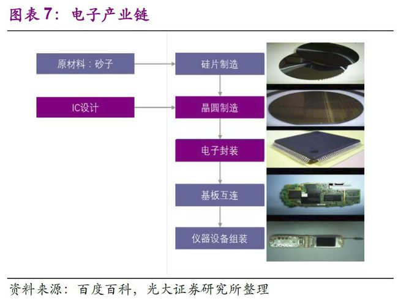
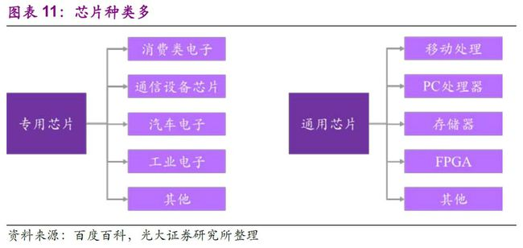

| 序号 | 修改时间  | 修改内容                                                     | 修改人 | 审稿人 |
| ---- | --------- | ------------------------------------------------------------ | ------ | ------ |
| 1    | 2023-4-13 | 创建。<br>从《TMT行业指南》、《运维专题》迁移芯片相关章节成文。 | Keefe  | Keefe  |
|      |           |                                                              |        |        |

<br><br><br>

---

[TOC]

<br>

---

# 半导体行业

半导体是信息技术产业的核心，是支撑现代经济社会发展和保障国家安全的战略性、基础性和先导性产业。毋庸置疑，近几年来，半导体产业已然成为全球主要国家争相争夺的战略高地，是经济、科技和国防的战略性支柱产业之一。

从适用范围来讲，半导体 >  集成电路 >  芯片。

* 半导体是一类材料的总称，
* 集成电路IC是用半导体材料制成的电路的大型集合，
* 芯片是由不同种类型的集成电路或者单一类型集成电路形成的产品。

芯片行业，也时也称集成电路行业，半导体行业。

集成电路产业主要有以下特征：制造工序多、产品种类多、技术换代快、投资大风险高。<br>

## 半导体产业链

半导体产业链：芯片位于电子行业的中游，上游是半导体材料和设备。半导体和被动元件以及模组器件通过集成电路板连接，构成了智能手机、PC等电子产品的核心部件，承担信息的载体和传输功能，成为信息化社会的基石。

* 上游：半导体材料和设备。包括硅晶圆、溅射靶材、光刻机、电子特气、清洗设备等。
* 中游：即芯片制造过程。包括芯片三大环节，即芯片设计、晶圆制造、封装测试。
* 下游：即应用领域，包括汽车电子、消费电子（智能手机、PC、光伏、可穿戴设备）、新能源汽车、信息通讯、人工智能、物联网、医疗、工业、军工等。

芯片产业链主要包括设计、制造、封装与测试三大环节与及上游的半导体设备及材料两大支柱产业。


芯片制造步骤：原材料砂子 - 硅片制造 - 晶圆制造 - 封装测试 - 基板互联 - 仪器设备组装。



<br>

### 半导体中游产业

表格  芯片三大环节简述

| 环节 | 简介                                                         | 全球企业                                                  | 国内企业                                       |
| ---- | ------------------------------------------------------------ | --------------------------------------------------------- | ---------------------------------------------- |
| 设计 | 包括工具软件EDA、IC设计。                                    | 英伟达（GPU）、AMD、英特尔（CPU）、高通、联发科、联咏科技 | 海思半导体、中芯国际、寒武纪、地平线、四维图新 |
| 制造 | 芯片制造也叫晶圆代工，包括制造厂、制造设备、材料与辅料。<br>制造核心工具是光刻机EUV，目前全球只有荷兰生产。 | 台积电（市场份额50%+）、三电、                            | 中芯国际、华虹半导体、华力微                   |
| 封测 | 封装和测试常合并为封测。包括封测厂、封测设备、辅材。         | 台积电                                                    | 长电科技、通富微电、华天科技、智路封测         |

说明：芯片有时也称半导体。芯片设计龙头是英伟达、AMD和英特尔。芯片制造主要是台积电。芯片封测全球前十大企业中国占了9家，美国1家。

1. 芯片设计：
2. 芯片代工：2022年三星宣布全球首发 3nm制程工艺，年底台积电正式量产3nm。国内已经有12寸晶圆厂。中芯国际28nm制程已突破，2023年宣布量产14nm。
3. 芯片封测：封测是我国半导体产业链最具竞争力环节，2022年，全球封测前十大厂商市占率合计为78%，其中中国大陆厂商占据四席，分别为长电科技、通富微电、华天科技、智路封测，四家占比合计为25%。

**半导体行业运作模式**

半导体行业依据其生产设计及制造能力不同有三种运作模式，分别是IDM、Fabless和Foundry模式。

* IDM：Integrated Device Manufacture，集成设备制造。集芯片设计、芯片制造、芯片封装和测试等多个产业链环节于一身。IDM代表有英特尔（Intel）、三星、意法半导体（ST）、德州仪器（TI）等。CIDM，C指Commune，即多个设计公司共享产能。
* Fabless：俗称“无工厂芯片供应商”或“无晶圆厂”。只负责芯片的电路设计与销售，将生产、测试、封装等环节外包。Fabless代表有AMD、苹果、高通（Qualcomm）、海思、联发科（MTK）、博通（Broadcom）、等。
* Foundry：即我们常说的“代工厂”。只负责制造，不负责芯片设计，可以同时为多家设计公司服务，但受制于公司间的竞争关系。Foundry代表有台积电（TSMC）、联电（UMC）、格罗方德（Global Foundry）等。。

Fab+Fabless的模式通过充分发挥比较优势，分散了GPU设计和制造的风险，符合半导体分工的大趋势。<br>

### 半导体上游产业

#### 半导休设备

半导休设备：在应用上分为集成电路、分立器件、传感器和光电子，其中90%的半导体均是集成电路的应用，所以有时将半导体和集成电路等价。

* 集成电路按照产品种类又主要分为四大类：微处理器（计算芯片），存储器（存储芯片），逻辑器件，模拟器件，通常我们统称他们为芯片。
* 分立器件包括半导体二极管、三极管等分立器件等。

应用于集成电路领域的设备通常可分为前道工艺设备（晶圆制造）和后道工艺设备（封装测试）两大类。

在晶圆制造中，可分为7大工艺，分别为氧化/扩散、光刻、刻蚀、离子注入、薄膜沉积、清洗和金属化，所对应的专用设备主要包括氧化/扩散设备、光刻设备、刻蚀设备、清洗设备、离子注入设备、薄膜沉积设备、机械抛光设备等。集成电路主要资本开支中用于芯片制造设备的设备投资占比约80%。

表格 半导体上游之设备重点企业

| <br>设备     | 功能                                                         | 发展现状                                                     | 国际企业                       | <br>国内企业 |
| ------------ | ------------------------------------------------------------ | ------------------------------------------------------------ | ------------------------------ | ------------ |
| 光刻机       | 在半导体基材上（硅片）表面匀胶，将掩模版上的图形转移光刻胶上，把器件或电路结构临时“复制”到硅片上。<br>光刻机按光源先进程度可分EUV、DUV和UV。 | 2020年全球光刻机销量为413台，总销售额为413亿元。<br>荷兰阿斯麦ASML的EUV约占全球高端市场份额90%。 | 阿斯麦.ASML、尼康、佳能        | 上海微电子   |
| 刻蚀机       | 泛林半导体（46.71%）、东京电子（26.57%）和应用材料（16.96%）。 | 中国中微半导体在2019年便实现量产5NM刻蚀机，最先进制程已经达到3nm；占有率为1.37%。 | 泛林半导体、东京电子、应用材料 | 中微半导体   |
| 薄膜沉积设备 | 通常用于在基底上沉积导体、绝缘体或者半导体等材料膜层，使之具备一定的特殊性能。<br>按照工艺原理的不同可分为物理气相沉积（PVD）设备、化学气相沉积（CVD）设备和原子层沉积（ALD）设备。 | 主要被日本、美国和欧洲的厂商主导。                           | 应用材料、泛林半导体、东京电子 |              |
| 离子注入机   | 对半导体表面附近区域进行掺杂。                               |                                                              | 维利安、AMAT                   | 硅拓微电子   |
| 单晶炉       | 熔融半导体材料，拉单晶，为后续半导体器件制造，提供单晶体的半导体晶坯。 |                                                              |                                |              |
| 晶圆划片机   | 把晶圆，切割成小片的Die。                                    |                                                              | 日本DISCO、德国OEG             |              |

注：1. 光刻机按用途可分为制造芯片用的前道光刻机和封测用的后道光刻机。上海微电子是国内最大的光刻机企业，已经量产90nm光刻机；在封测光刻机领域占据国内市场80%，全球市场40%；

芯片制造六大设备：扩散炉、刻蚀机、离子注入设备、薄膜沉积设备、抛光机和清洗剂。


图  IC芯片制造核心工艺主要设备全景图

#### 半导休材料

半导体材料：半导体材料包括晶圆制造材料和封装材料。

* 晶圆制造材料包括半导体硅片、光罩、高纯化学试剂、特种气体、光刻胶、靶材、CMP抛光材料等。
* 封装材料包括引线框架、封装基板、陶瓷封装材料、键合丝、包装材料、芯片粘结材料等。

根据SEMI 数据，2018年晶圆制造材料前三分别是硅片（38%）、电子特气（13%）、光掩模（13%）；抛光材料、光刻胶辅助材料、光 刻胶、工艺化学品、靶材等材料占比均在2%-7%之间。

2021年中国半导体材料市场规模达到119亿美元，在全球市场占比为18.6%， 是全球第二大市场。

表格 芯片上游之材料重点企业

| <br>材料     | 发展现状                                                     | 国际企业                     | 国内企业                                                    |
| ------------ | ------------------------------------------------------------ | ---------------------------- | ----------------------------------------------------------- |
| 硅晶圆/硅片  | 目前主流是12寸，对应的是300mm直径，占了所有晶圆的80%以上。<br>目前中国大陆能够制造6寸晶圆的厂商，已经有500多家，拿下了全球至少60%+以上的产能。 |                              | 华润微电子（CRMicro）、士兰微电子（Silan Microelectronics） |
| 溅射靶材     | 2021年我国溅射靶材市场规模达375.8亿元，同比增长9.7％。       | 日矿金属、霍尼韦尔           |                                                             |
| 光刻胶       | 光刻胶主要成分有高分子树脂、色浆、单体、感光引发剂、溶剂以及添加剂。<br>光刻胶市场被美、日企业寡占，其中较低壁垒的 G/I 线光刻胶前五大企业占比为 74%, 而较高壁垒的 ArF 光刻胶前五大企业占比提升到 90%。 | TOK、JSR、住友化学、信越化学 | 京东方、南大光电                                            |
| 电子特气     | 芯片制造之血液，属于工业气体的重要分支，半导体特气应用于晶圆制造的各个环节，应用于前端晶圆制造中的化学气相沉积、光刻、刻蚀、掺杂等诸多环节。<br>2022年我国电子特气市场规模将达231亿元。 |                              | 硅烷科技、                                                  |
| 芯片粘接材料 | 采用粘结技术实现芯片与底座或封装基板连接的材料，德国日本厂商占据主导地位。 |                              | 德邦科技、长春永固                                          |
| 引线框架     | 一种集成电路芯片载体。<br>目前中国蚀刻引线框架主要从日韩等进口，自给率较低。 |                              | 康强电子、华洋科技、新恒汇、立德半导体、芯恒创半导体        |
| 封装基板     | 目前全球封装基板厂商主要分布在日本、韩国和中国台湾。         |                              | 深南电路、兴森科技、珠海越亚                                |
| 清洗设备等   |                                                              | DNS、TEL、LAM、SEMES、       | 盛美                                                        |

说明：1. 硅晶圆：半导体硅片参与了从制造到封测的所有流程，是集成电路制造中最为基础的原材料。芯片越先进，使用的硅晶圆尺寸就越大，因为大尺寸的硅晶圆，能切出的晶粒（Die）就更多，浪费更少，帮企业挣到更多的钱。

表格  四代半导体材料的原料

| 代     | 半导体材料                           | 特点                                                         |
| ------ | ------------------------------------ | ------------------------------------------------------------ |
| 第一代 | 硅Si、锗                             | 硅的应用范围最广。目前硅基半导体仍然占据主要半导体市场，硅片也是半导体材料最大细分市场。<br>如今台积电、三星已经实现3nm量产，正在研发中的2nm已接近硅材料物理极限。 |
| 第二代 | 化合物如砷化镓GaAs、锑化铟InSb       | 砷化镓材料的电子迁移率约是硅的6倍，具有高频、高速的光电性能，被广泛应用于光电子和微电子领域。 |
| 第三代 | 宽禁带如碳化硅（SiC）、氮化镓（GaN） | 高温、高电压、高频率场景下拥有更好的稳定性、运行能力和更少的能耗，适用于功率器件。<br>广泛应用于新能源汽车、光伏发电、5G通讯等领域。 |
| 第四代 | 超宽禁带如氧化镓、氮化铝、金刚石     | 氧化镓在耐压、电流、功率、损耗等维度具有优势。               |

说明：第三代半导体的产业链可以分为“衬底、外延、器件代工”等环节。衬底是芯片的基座，外延要在衬底上生长起来，器件代工则是将其加工成具有特定功能的产品。全球范围里，Wolfspeed （科锐）、II-VI（贰陆）等美资公司占据了超过70%的衬底市场份额，是绝对的领导者。

### 半导体市场

详见 《工业国产化.md》半导体相关章节 <br>

## 芯片种类

芯片可分为专用芯片和通用芯片。

芯片命名方式一般都是：字母+数字+字母

前面的字母是芯片厂商或是某个芯片系列的缩写。像MC开始的多半是摩托罗拉的，MAX开始的多半是美信的。



芯片应用场景

* 航天军工芯片需要的是耐高低温、耐冲击、抗辐射、抗干扰等特性，并不追求先进制程，大都在90nm以上。
* 工业级芯片基本都是14nm制程的。工业级芯片的工作温度在-40℃—85℃之间，个别的可以放宽至-20℃—85℃。在设计上要求具备多级防雷、双变压器、短路保护、热保护、超高压保护。
* 12nm芯片可以满足家用电器、智能汽车的使用。
* 目前西方对中国芯片制程限制是在成熟制程28nm以下。

### AI芯片

对于 AI 服务器来讲，较为常见的是配备 2 个 CPU，以及八个 AI 卡。而相比 于 AI 服务器，传统的通用服务器则以 CPU 为主。

AI芯片也被称为AI加速器或计算卡，即专门用于处理人工智能应用中的大量计算任务的模块（其他非计算任务仍由[CPU](https://baike.baidu.com/item/CPU/120556)负责）。当前，AI芯片主要分为 GPGPU（比如英伟达GPU、谷歌TPU推理处理器） 、[FPGA](https://baike.baidu.com/item/FPGA/935826) 、[ASIC](https://baike.baidu.com/item/ASIC/2014676)。

2022 年，中国的 AI 芯片市场规模约 385 亿元。据艾瑞咨询测算，到 2027 年，中国的 AI 芯片市场规模预计将达到 2164亿元。另外，在我国高性能及 AI 服务器中， GPGPU 凭借其优秀的性能和通用能力占比 92%，剩下份额由 AISC 和 FPGA 分享。

据艾瑞咨询，2022年，中国 AI 训练芯片以及 AI 推理芯片的占比分别为 47.2%和 52.8%。预计2027年， 中国 AI 训练芯片与推理芯片的比例将分别达到 23.7%与 76.3%。

目前，在 AI 芯 片领域，有三类玩家。

一种是以 Nvidia、AMD 为代表的实力强劲的老牌芯片巨头，这些企业积累 了丰富的经验，产品性能突出。

另一种是以 Google、百度、华为为代表的云计算巨头，这些企业 纷纷布局通用大模型，并自己开发了 AI 芯片、深度学习平台等支持大模型发展。如 google 的 TensorFlow 以及 TPU，华为的鲲鹏昇腾、CANN 及 Mindspore。

最后是一些小而美的 AI 芯片独角兽，如寒武纪、壁仞等。 

英伟达占据 80%以上中国加速卡市场份额，国产 AI 芯片亟待发展。根据 IDC 的数据显示，2021 年中国加速卡的出货数量已经超过 80 万片，其中 Nvidia 占据了超过 80%的市场份额。剩下的份 额有 AMD、百度、寒武纪、燧原科技、新华三、华为、Intel 和赛灵思等品牌。

### 计算芯片

芯片按计算架构可分为 X86、ARM、GPU、FPGA、ASIC，各种架构在不同场景各有优势。未来由 X86、ARM、GPU、FPGA、ASIC 构成的异构计算有望提供系统级的摩尔定律重新驱动算力快速增长。

* X86 适用于高性能高功耗的通用计算场景；
* ARM 适用于对功耗较为敏感的通用性计算场景；
* GPU 图形处理器。在图像处理、深度学习机器学习等领域应用较为广泛；
* [FPGA](https://baike.baidu.com/item/FPGA)：（Field Programmable Gate Array，现场可编程逻辑门阵列）是在PAL、GAL等可编程器件的基础上进一步发展的产物。采用门阵列架构具有低时延可编程的优势，除传统图像处理、信号采集、通信、航空航天等领域外目前也逐渐在 AI 领域得到应用；
* [ASIC](https://baike.baidu.com/item/ASIC/2014676)：（Application Specific Integrated Circuit，专用集成电路）。高度定制，主要应用于大型专用场景（挖矿），前期投资成本高但一旦稳定使用，每单位的成本最优。
* SOC：系统级芯片，高集成度。如Apple M1。

表格 主流计算芯片&架构对比

|           | x86                          | ARM                          | GPU                              | FPGA                                 | ASIC         |
| --------- | ---------------------------- | ---------------------------- | -------------------------------- | ------------------------------------ | ------------ |
| 代表厂商  | 英特尔、AMD                  | 华为、高通、AWS、飞腾等      | [英伟达](https://www.nvidia.cn/) | Xlinx、英特尔                        | 谷歌         |
| 架构      | 重核                         | 多核                         | 众核                             | 门阵列                               | ASIC芯片     |
| <br/>性能 | 高性能高功耗                 | 均衡性能功耗比               | 浮点运算强                       | 低时延可编程                         | 功耗&时延低  |
| 通用性    | 强                           | 强                           | 较强                             | 较强                                 | 高度定制     |
| 生态      | 丰富                         | 丰富                         | 较丰富                           | 较差                                 | 高度定制     |
| 开放性    | 封闭                         | 开放平台                     | 封闭                             | 封闭                                 | 封闭         |
| 适用场景  | 对功耗不敏感的通用性计算场景 | 对功耗较敏感的通用性计算场景 | 图像处理、深度学习、机器学习     | 图像处理、信号采集、通信、航空航天等 | 具体专门应用 |

> 备注：CPU的计算架构有二种，分别是x86和ARM。GPU/FPGA/ASIC是现在流行的AI芯片。AI芯片详见 《AI笔记》AI芯片章节
>
> 开源软件版本：常提供二种版本分别是386和arm64，此处版本差别在于CPU位数，386是指32机器，arm64是指64位机器。事实上2010年后市面上新机器都是64位的，无论是x86还是ARM架构。

通常CPU架构

* SMP：Symmetric Multi-Processing，对称多处理。共享所有资源（CPU/内存/IO）。
* NUMA：NoN-Uniform Memory Access，非一致存储访问。不共享资源。

**计算芯片示例**

1. **CPU**

```shell
# Intel cpu x86_64
$ cat /proc/cpuinfo
processor       : 0
vendor_id       : GenuineIntel
cpu family      : 6
model           : 79
model name      : Intel(R) Xeon(R) CPU E5-2682 v4 @ 2.50GHz
stepping        : 1
microcode       : 0x1
cpu MHz         : 2494.222
cache size      : 40960 KB
physical id     : 0
siblings        : 1
core id         : 0
cpu cores       : 1
apicid          : 0
initial apicid  : 0
fpu             : yes
fpu_exception   : yes
cpuid level     : 20
wp              : yes
flags           : fpu vme de pse tsc msr pae mce cx8 apic sep mtrr pge mca cmov pat pse36 clflush mmx fxsr sse sse2 ss ht syscall nx pdpe1gb rdtscp lm constant_tsc rep_good nopl nonstop_tsc cpuid tsc_known_freq pni pclmulqdq ssse3 fma cx16 pcid sse4_1 sse4_2 x2apic movbe popcnt tsc_deadline_timer aes xsave avx f16c rdrand hypervisor lahf_lm abm 3dnowprefetch invpcid_single pti ibrs ibpb stibp fsgsbase tsc_adjust bmi1 hle avx2 smep bmi2 erms invpcid rtm rdseed adx smap xsaveopt arat
bugs            : cpu_meltdown spectre_v1 spectre_v2 spec_store_bypass l1tf mds swapgs taa itlb_multihit
bogomips        : 4988.44
clflush size    : 64
cache_alignment : 64
address sizes   : 46 bits physical, 48 bits virtual
power management:

# kunpeng cpu aarch64
$ cat /proc/cpuinfo
processor       : 0
BogoMIPS        : 200.00
Features        : fp asimd evtstrm aes pmull sha1 sha2 crc32 atomics fphp asimdhp cpuid asimdrdm jscvt fcma dcpop asimddp asimdfhm
CPU implementer : 0x48
CPU architecture: 8
CPU variant     : 0x1
CPU part        : 0xd01
CPU revision    : 0
```

2. **GPU**

```shell
# gpu
# lspci查看PCI设备
$ lspci | grep -i 'NVIDIA'
02:00.0 3D controller: NVIDIA Corporation TU104GL [Tesla T4] (rev a1)

# nvida-smi 命令查看nvidia显卡GPU使用情况
```

#### CPU

CPU作为计算机系统的运算和控制核心，分为通用高性能微处理器、嵌入式 微处理器和移动端用 SoC MPUs/AP，是电子信息时代需求量最大，最重要的半 导体产品之一。

国产 CPU 在性能方面与国际领先水平仍有差距。虽然国内桌面和服务器产品性能正在提升，尤其是海光和华为的服务器产品性能已接近国外中端 产品水平，但是整体上国产 CPU 性能仍然落后于国际先进水平。2018-2020 中国 微处理器市场规模不断增加，2020 年中国微处理器市场规模达到 2335.87 亿元， 占全球微处理器市场的39.8%，中国微处理器在全球的市场份额占比有所提升。 据前瞻产业研究院初步估算，2021 年我国微处理器市场规模约 2742 亿元。国内主要上市公司有海光信息、炬芯科技、国民技术、北京君正、龙芯中科等。

#### GPU

GPU，即图形处理器，是一种专门在个人电脑、工作站、游戏机和一些移动 设备（如平板电脑、智能手机等）上做图像和图形相关运算工作的微处理器，在 AI 计算中负责进行大规模的计算和数据处理。

显卡就是GPU，下载GPU显卡驱动一定要和硬件GPU显卡型号一致。

GPU类型:

1. **虚拟式GPU**: 只能用于图像展示（即渲染），功能和效果不支持计算。
2. **直通式GPU**: 即GPGPU，可以用于深度学习的计算，包括算法模型计算和模型训练。

全球 GPU 市场中，美国凭借英伟 达、AMD、英特尔三巨头霸占全球 GPU 芯片研发领域的主导地位；欧盟、日本、 韩国处于第二梯队，欧盟、英国拥有先进的芯片设备制造技术，日本、韩国凭借领 先的半导体材料研发和制造技术等优势抢占市场份额;而以中国为代表的发展中 国家还在努力追赶中。

据华经产业研究院数据，2020 年中国 GPU 市场规模 47.39 亿美元，预计 2027 年市场规模将达 345.57 亿美元。目前国内主要上市公司有景嘉微、通富微电等。其中景嘉微是国内首家成功研制国产 GPU 芯片并实现大规模 工程应用的企业，掌握了包括芯片底层逻辑/物理设计、GPU 驱动程序设计等关键 技术，先后研制成功 JM5 系列、JM7 系列、JM9 系列等具有自主知识产权的高性 能 GPU 芯片，为打破国外垄断和国内 GPU 的突破发展做出了突出的贡献。

表格  全球主要GPU厂商和产品

| 厂商   | 厂商简介                                                     | GPU产品                                                      |
| ------ | ------------------------------------------------------------ | ------------------------------------------------------------ |
| 英伟达 | 全球GPU领导者。                                              | [GeForce](https://www.nvidia.cn/geforce/drivers/)，DGX、EGX、HGX，Quadro、AGX |
| AMD    | 全球GPU竞争者，显卡能力来自于其2006年收购的ATI公司。         | Radeon                                                       |
| Intel  | 全球GPU追赶者。全球最大的PC GPU供应商，也是PC和服务器显卡唯一的IDM厂商。 |                                                              |
| Apple  | 移动GPU新秀。                                                | A11(2017)、M1(2020.11.11)                                    |

说明：2019年全球GPU市场三强几乎占据全部市场份额，分别是英伟达(56%)、AMD(26%)和英特尔(18%)。独立显卡主要由英伟达和AMD控制，集成显卡主要由AMD和英特尔控制。

> 曾经的巨头：Imagination、3dfx、东芝陆续被三强超越，已经末落。

#### SOC

SoC是System on Chip的缩写，直译是“芯片级系统”，通常简称“片上系统”。SoC更多的是对处理器（包括CPU、DSP）、存储器、各种接口控制模块、各种互联总线的集成，其典型代表为[手机芯片](https://baike.baidu.com/item/%E6%89%8B%E6%9C%BA%E8%8A%AF%E7%89%87/6030703)（参见术语“终端芯片”的介绍）。

苹果的自研GPU首次出现于2017年的A11 SoC。Apple M1 芯片发布于2020年11月11日，Apple 全新打造的强大芯片，也是第一款专为 Mac 设计的芯片。M1配备 8 核中央处理器（其中包括四个高性能核心和四个高能效核心），8核图形处理器，16核神经网络引擎。

#### FPGA

不同于 CPU 和 GPU，FPGA 可对芯片硬件层进行灵活编译（可编程的逻辑芯片），且功耗远小于前两者。FPGA 可编程带来的配置灵活性使其能更快地适应市场，具有明显的实 用性。随着开发者生态的逐渐丰富，适用的编程语言增加，FPGA 运用将会更加 广泛。

根据前瞻产业研究院预计，2025 年全球 FPGA 市场规模有望达到 125 亿 美元。目前，FPGA 市场基本上全部被国外 Xilinx、Altera(现并入 Intel)、Lattice、 Microchip 四家占据。其中，Xilinx 和 Altera 两大公司对 FPGA 的技术与市场占据 绝对垄断地位，占据了近 90%的市场份额。国内研究 FPGA 芯片的公司有安路科 技和紫光国微等。

#### ASIC

ASIC（专用芯片）可以针对专门任务进行架构层优化设计。全球 ASIC 领域 呈现百花齐放局面，虽早期 ASIC 芯片以谷歌 TPU 为代表性产品，但如今中国 ASIC 厂商已实现加速追赶，显著缩小国内外产品技术差距与应用表现。国内主要 生产厂商有寒武纪，澜起科技等。其中澜起科技 PCle 5.0/CXL 2.0 Retimer 芯片 已实现量产。

### 存储芯片

存储芯片是以半导体电路作为存储介质，通过对电子或电荷充放电标记不同的存储状态实现数据存储。根据断电后存储的信息是否保留，存储芯片分为易失性存储芯片和非易失性存储芯片。

* 易失性存储芯片在断电后存储数据会消失，包括静态随机存储器（SRAM）和动态随机存储器（DRAM）；
* 非易失性存储芯片在断电后存储数据仍会保留，包括快闪存储器（Flash Memory）和只读存储器（ROM）。
  * Flash Memory又分为NOR Flash和NAND Flash，NOR Flash可以在其上面直接运行代码，读写速度更快，但容量较小，NAND Flash写入和擦除速度更快，容量较大。

根据IC Insights数据，2021年存储芯片市场出货量前三分别是DRAM（56%）、NAND Flash（41%）和NOR Flash（2%），三者合计为99%。

存储芯片市场主要由国外巨头领导，近年国内厂商奋力追赶，在部分领域实现突破，逐 步缩小与国外原厂的差距，其中兆易创新位列 NOR Flash 市场前三，聚辰股份在 EEPROM 芯片领域市占率全球第三。其余公司还有易华录，普冉股份等。

表格  存储芯片市场（IC Insights 2021年）

| 类别       | 占比 | 主要用途       | 市场现状                                                     | TOP厂商                  | 国内厂商                                         |
| ---------- | ---- | -------------- | ------------------------------------------------------------ | ------------------------ | ------------------------------------------------ |
| DRAM       | 54%  | 内存           | 2021年全球DRAM 市场规模为296 亿美元，全球市场份额CR3合计达到94%，分别为43%、28%和23%，。 | 三星、海力士、美光       | 合肥长鑫、长江存储、澜起科技、<br>紫光、福建晋华 |
| NAND Flash | 32%  | 硬盘、闪存     | CR6合计为93%，其中三星2021年市场份额占34%，排名第一。        | 三星、海力士、西部数据   | 长江存储、国科微、深康佳                         |
| NOR Flash  | 8%   | 智能穿戴、LED  | 2021年CR2全球市场份额之和为52%，兆易创新以18%的市占率排名第三。 | 旺宏、华邦、**兆易创新** | 兆易创新、恒烁股份                               |
| SRAM       | 2%   | 缓存           |                                                              | 美光                     | 北京君正                                         |
| EEPROM     | 0.5% | 摄像头、智能卡 | 聚辰股份是全球排名第三、国内第一的EEPROM 产品供应商，占有全球约8.17%的市场份额。 | 意法半导体               | 聚辰股份                                         |

注：智能手机、服务器和 PC 是存储芯片的主要需求来源。

1. 中企：国产存储芯片企业有长江存储、合肥长鑫、兆易创新、北京君正、恒烁股份、东芯股份等。
   - 长鑫存储成立于2016年，主攻DRAM内存，目前，长鑫存储国内市场份额估计已超过3%，初步打破了国际巨头对DRAM的垄断。
   - 长江存储成立于2016年，主营业务是DRAM和NAND闪存。2021年，长江存储在NAND领域的全球市占率已经达到4%，2022年估算达到7%，已经具备强大的行业竞争力。长江存储大股东是紫光。
   - 兆易创新是全球第三，国内第一的NOR Flash龙头公司，占有全球18%的市场份额。主营业务包括存储芯片、MCU和传感器，其中存储芯片2021年收入占比为 64%，为公司最主要的收入来源；DRAM业务增长迅速。
   - 北京君正于2020年并购ISSI，成为车载DRAM龙头。目前北京君正在全球车用SRAM市场排名第一，车用DRAM市场排名第二。
   - 聚辰股份是全球排名第三、国内排名第一的EEPROM 产品供应商，占有全球约 8.17%的市场份额。聚辰半导体在手机摄像头存储芯片领域的市场份额约占 42.72%，位居全球第一。
   - 东芯股份产品线布局全面，可以同时提供 NAND、NOR、DRAM、MCP等产品。
   - 下游的存储模组行业，江波龙和百维存储在全球市场也有较强竞争力，其中江波龙司eMMC及UFS在全球市场占有率为6.5%，全球第六，国内第一，佰维存储全球市占率2.4%，全球第八，国内第二。
2. 外企在中国建厂：三星在中国西安拥有 NAND 闪存和 DRAM 工厂，SK 海力士则分别在中国无锡和大连拥有工厂。美光2007年在中国西安建厂，生产DRAM和NAND工厂。
3. 美光是美国存储芯片龙头，是全球第二大DRAM产商和第五大NAND厂商，截至2022年底，美光在全球DRAM和NAND闪存市场分别占据23%、10.7%的份额。2008年美企美光在华营收高达173亿美元，大陆大陆收入占总营收58%；2022年收入降到228亿元（约33亿美元），中国大陆占比降到10.8%。

人工智能算力及数据量增长，带动存储行业技术迅速发展。

1）高带宽存储器（High Bandwidth Memory，HBM）：HBM是三星、AMD 和 SK 海力士发起的一种 基于 3D 堆栈工艺的高性能 DRAM，通过增加带宽，扩展内存容量，让更大的模型，更多的 参数留在离核心计算更近的地方，从而减少内存和存储解决方案带来的延迟，适用于高存储 器带宽需求的应用场合。截至2021 年，SK 海力士和Rambus 已发布了数据传输速率为5.2Gbps 和8.4Gbps 的HBM3 产品，每个堆叠将提供超过665GB/s 和1075GB/s 的传输速率，有望快速在AI 服务器中替代。

2）存算一体：目前存算一体大致分为近存计算（PNM）、存内处理（PIM）、存内计算（CIM）。特斯拉、阿里达摩院、三星等大厂所选择的便是近存计算（PNM），未来技术成熟度或将快速提高，突破算力存力中间壁垒。

3）3D NAND 堆叠：3D NAND将成为主流方向，可突破存储容量限制瓶颈。3D NAND 将解决方案从提高制程工艺转变为多层堆叠，解决了2D NAND 在增加容量的同时性能出现下降的问题，实现容量、速度、能效及可靠性等多方位的提升。

<br>

## 芯片竞争

近年来全球各个国家和地区陆续出台了一系列政策，以规范、引导、鼓励（抑制）半导体行业的发展。

据VLSI Research数据，在整个半导体制造设备市场，主要被美（41.7%）、日本（31.1%）和荷兰（18.8%）这三个国家所占据。美荷日半导体出口管制政策，短期来看，或对中国半导体产业造成伤害的同时，也将对全球产业链及经济造成难以估量的伤害。 <br>

### 美国欧洲日本芯片政策

| 地区 | 政策/动态                                    | 具体内容                                         | 影响厂商/供应链                        |
| ---- | -------------------------------------------- | ------------------------------------------------ | -------------------------------------- |
| 欧盟 | 2023.3撤回2035年燃油车销售禁令。             | 维持欧洲在汽车及供应链领域竞争力。               |                                        |
| 美国 | 2022.8《芯片与科学法案》和芯片禁令           | 对中国等国家在芯片、半导体设备领域技术实施限制。 |                                        |
| 日本 | 2023.3.31限制23种半导体设备出口              | 中国芯片制造设备进口受限                         |                                        |
| 荷兰 | 2023.3.8加码限制先进处理器芯片的制造设备出口 | 中国光刻机进口受限                               | 阿斯麦、中芯国际、华虹、华润微、中微等 |

注：荷兰的阿斯麦AMSL是世界上唯一一家能够生产7纳米及更先进制程极紫外光刻机（EUV）芯片制造设备的企业，在半导体领域具有重要战略价值。

2022年2月8日，欧盟公布《芯片法案》，涉及430亿欧元。

2022年8月，美国总统拜登正式签署《2022芯片与科学法案》（简称芯片法案），准备投入520亿美元支持美国国内的芯片研发与制造产业。同月，美国商务部陆续出台新一轮半导体设计软件、材料以及高新技术的出口禁令（简称芯片禁令）。 

2022年10月，美国发布史上最严出口管制新规，限制14NM及以下制程。<br>

2023年，美国限制对华销售最先进、使用最广泛的AI训练GPU—英伟达 A100以及H100。

<br>

### 中国芯片政策

截止2022年底，中国现存芯片相关企业14.29万家。近10年来，我国芯片相关企业每年注册量不断增加。2020年新增2.37万家，同比增长160.69%。2021年新增4.79万家，同比增长102.30%。

**发展历史**：1965-1978年 创业期；1978-1989年 探索前进期；1990-2000年 重点建设期；2000-2011年 发展加速期；2012年-2019年高质量发展期；挑战 2020-至今。

2000年，中芯国际在上海成立，国务院18号文件加大对集成电路的扶持力度。

2011年，《关于印发进一步鼓励软件产业和继承电路产业发展若干政策的通知》。

2012年，《集成电路产业“十二五”发展规划》发布。

2014年，《[国家集成电路产业发展推进纲要](https://baike.baidu.com/item/国家集成电路产业发展推进纲要/14593182?fromModule=lemma_inlink)》正式发布实施；“国家集成电路产业发展投资基金”（大基金）成立。

2015年，长电科技以7.8亿美元收购星科金朋公司；中芯国际28纳米产品实现量产。

2016年，大基金、紫光投资长江储存；第一台全部采用国产处理器构建的超级计算机“神威太湖之光”获世界超算冠军。

2016年，我国提出了芯片国产化，要求在芯片设计、制造、封装等全产业链实现国产化替代。

2020年，2020年8月，国务院印发《[新时期促进集成电路产业和软件产业高质量发展的若干政策](https://baike.baidu.com/item/新时期促进集成电路产业和软件产业高质量发展的若干政策/53144887?fromModule=lemma_inlink)》，提出：到2025年实现70%的芯片自给率。

**国家集成电路产业发展投资基金（大基金）**

中国两期国家大基金投入超过3000亿，加上各种补贴、政策优惠，粗略估算在万亿左右。大基金一期主要聚焦于芯片下游制造环节，二期则主要聚焦于芯片设备、材料等上游领域。

这支总金额超3400亿元的基金，在业内被称作“大基金”，自设立起，作为国内规模最大的产业投资基金，就受到广泛关注。

2014年6月，国务院印发《国家集成电路产业发展推进纲要》，鼓励国内集成电路产业发展。为扶持国内芯片产业，由财政部、国开金融、中国烟草、北京亦庄等出资的国家集成电路产业投资基金股份有限公司（以下简称“大基金”）一期应运而生，共募集资金1387.2亿元，投资重点是集成电路芯片制造，兼顾芯片设计、封装测试、设备和材料。

2019年10月，在美国打压中国科技企业的大背景下，国家集成电路产业投资基金二期股份有限公司（简称“大基金二期”）正式成立，注册资本为2041.5亿元，若按1∶5的撬动比，国家大基金二期将带动超过万亿元的资金，帮助中国解决集成电路产业“卡脖子”的问题。大基金二期以扶持国家半导体产业为目标，正加速布局，已于2021年进入全面投资阶段。

2022年7月，自大基金管理公司总裁路军被带走调查起，至22年9月， 三个月内大基金相继有7名高管被带走调查。

表格  大基金基本情况

| 基金要素         | 国家集成电路产业投资基金股份有限公司  | 国家集成电路产业投资基金二期股份有限公司 |
| ---------------- | ------------------------------------- | ---------------------------------------- |
| 成立时间         | 2014.6                                | 2019.10                                  |
| 基金规模（亿元） | 1387.2                                | 2041.5                                   |
| 投资期限         | 2014-2019 投资期<br>2019-2024  回收期 | 2020-2024 投资期<br/>2025-2029  回收期   |
| 基金管理人       | 华芯投资                              | 华芯投资                                 |

说明：

1. 从资金来源来看，大基金一期的出资阵容极度豪华，鲜明地体现了国家意志，不仅包括国家级资金，如财政部就直接下场，出资360亿元成为第一大股东，国开金融、中国烟草、三大运营商等央企也都是出资主力，还包括各地政府资金，如北京亦庄国投、上海国盛集团和武汉金融控股等地方国企亦出资不菲。
2. 从管理运作看，直属国务院领导、在三大政策性银行中实力最强的国家开放银行，则是大基金的操盘手。大基金的基金管理人为华芯投资公司，华芯投资由国开金融控股，持股比例为45%。

表格  大基金一期投资布局

| 项目             | 设计                                                      | 制造                                                         | 封测                                                | 设备材料                                                   | 产业生态                           |
| ---------------- | --------------------------------------------------------- | ------------------------------------------------------------ | --------------------------------------------------- | ---------------------------------------------------------- | ---------------------------------- |
| 企业数量（个）   | 21                                                        | 15                                                           | 6                                                   | 17                                                         | 23                                 |
| 投资金额（亿元） | 265                                                       | 650                                                          | 110                                                 | 60                                                         | 260                                |
| 代表企业         | 紫光展锐 <br>汇顶科技 北斗星通 兆易创新 华大九天 安路信息 | 中芯国际 <br/>华虹半导体 长江存储 士兰微 三安光电 华润微电子 | 长电科技  <br/>通富微电 华天科技 晶方科技  太极实业 | 北方华创 <br/>中微公司 拓荆科技 沪硅产业 安集科技 雅克科技 | 地方产业基金 投资平台 芯鑫融资租赁 |

说明：从**上市公司**角度看，大基金一期对34家企业的投资，共花费410亿元，而大基金持有的这34家上市公司的股份，截至2022年12月，期末价值就已高达1420亿元，投资收益率接近245%。<br>

截止2022年3月31日，大基金二期共宣布投资38家公司，累计协议出资790亿元；其中投资晶圆制造约594亿元，占比75%；投资集成电路设计工具、芯片设计约81亿元，占比10%；投资封装测试约21亿元，占比2.6%；投资装备、零部件、材料约75亿元，占比10%；应用约19亿元，占比2.4%。

大基金二期共投资了12家上市公司，总计投资124亿元，没有一家持股占比超过5%；投资上市公司的参股子公司14家，共计投资384亿元。

## 名词术语

表格  芯片名词术语

| <br>术语   | 解释                                                         |
| ---------- | ------------------------------------------------------------ |
| 芯片       | 英文Chip。芯片是半导体元件产品的统称。<br>芯片是半导体产业的产品，半导体是用来做芯片的材料。芯片行业和半导体行业通常指的同一个意思。 |
| 半导体     | 半导体是指指常温下导电性能介于导体与绝缘体之间的材料，是电子产品的核心。在应用上分为集成电路、分立器件（二极管、晶闸管、功率晶体管等）、光电器件（光传感器、图像传感器、激光发射器等）和传感器（压力传感器、温度传感器、磁场传感器等），其中90%是集成电路的应用。 |
| 集成电路   | Integrated Circuit，简写IC。是一种微型电子器件或部件，采用特定的工艺把一个电路中所需的晶体管、电阻、电容和电感等分立元器件及布线互连一起，制作在半导体晶片或介质基片上，然后封装在一个管壳内，成为具有所需电路功能的微型结构。<br>集成电路板按其功能、结构的不同，可以分为模拟集成电路板和数字两大类。按制作工艺可分为半导体和薄膜。按集成度高低的不同可分为小规模、中规模、大规模和超大规模集成电路。 |
| PCB        | Printed Circuit Board，中文名称为印制电路板，又称印刷线路板，是重要的电子部件，是电子元器件的支撑体，是电子元器件电气连接的载体。由于它是采用电子印刷术制作的，故被称为“印刷”电路板。<br>集成电路（IC）是焊接在PCB板上的；PCB板是集成电路（IC）的载体。 |
| 电子元器件 | 电子元件和器件的总称，是电子产品或者电子电路的组成部分，其本身常由若干零件构成。工厂在加工时没改变原材料分子成分的产品可称为元件，反之则为器件。<br>元件属于不需要能源的器件，它包括电阻、电容、电感、晶体二极管、组合电路等。器件分为主动器件和分立器件。 |
| 光电       | 由光的作用产生的电叫光电。光机电一体化技术是由机械技术与激光－微电子等技术揉合融汇在一起的新兴技术。<br>光电子技术【photoelectronic technology】是激光在电子信息技术中的应用形成的技术，光电子技术确切称为信息光电子技术。 |
| 传感器     | 传感器（英文名 Transducer/Sensor）是能感受到被测量的信息，并能将感受到的信息，按一定规律变换成为电信号或其他所需形式的信息输出，以满足信息的传输、处理、存储、显示、记录和控制等要求的检测装置。 |
| 芯片分工   | 三大环节分别是设计、制造、封测。                             |
| 制程       | 用来表征集成电路尺寸的大小的一个参数。<br/>截止2022年，28nm是传统制程和先进制程的分界点，3nm是当前最先进制程（三星、台积电）。 |
| 晶圆       | 晶圆要经过金属溅镀、涂布光阻、蚀刻技术、光阻去除等过程将微型电路覆盖到表面上，这样一块晶圆上就会形成很多的集成电路芯片。 |
| 硅片       | 半导体芯片制造最重要的基础原材料，在晶圆制造材料成本中占比近30%，是份额最大的材料。 |
| CR         | 英文concentration rate的缩写，意思是“集中度”。 集中率（CRn）指在某一个行业中，市场占有率排名前n家的公司的市场占有率之和。 这项指标常常用来衡量和判断一个市场的竞争程度。 |

### 芯片工艺

**1.摩尔定律**

1965年，Intel CEO戈登·摩尔提出每个新的芯片大体上包含其前任两倍的容量，每个芯片产生的时间都是在前一个芯片产生后的18~24个月内，如果这个趋势继续，计算能力相对于时间周期将呈指数式的上升。

推导公式：即每18个月，在芯片规模不变的情况下，芯片面积减半。

影响：采用新工艺的芯片，面积更小，功耗更优，频率更高，成本还更低。摩尔定律和现在芯片制程完全吻合。0.8μ m（即800nm）、0.5 μm、0.35 μm、0.25 μm、0 .18 μm、0.13 μm、90nm、65nm、45nm、32nm、22nm、16nm、10nm、7nm，5nm。

2.半节点

制程很火的40nm，28nm，14nm跑哪里去了？shrink，也是一种优化。它本质上是利用光照（MASK）等比例缩放后。晶体管尺寸缩小一点，芯片仍然能够正常工作，从而减少芯片面积，降低成本。Shrink 一般可以将晶体管的尺寸缩小0.9倍。这些shrink后的工艺节点，也被人称为半节点。例如：40nm是45nm shrink后的半节点，28nm是32nm shrink后的半节点。这些优化后的40nm，28nm等等，成为了更成熟和长寿的工艺。

**3.栅极长度**

一个典型的晶体管其实分为三个单元，源级（Source-可理解为电流入口）、漏极（Drain-可理解为电流的出口）、栅级（Gate-可理解为开关-此概念将反复在文中出现）。栅级的开合，决定了电流是否通过，也就输出了所谓的0-1信号。上个世纪70年代开始，人们便利用栅级的尺寸来命名制程的大小。由于对摩尔定律的崇拜，用栅级长度来衡量芯片制程。

最终历史证明，“栅级宽度与制程等比例变化”，“制程与晶体管密度等比例变化”，这两个最重要的同步性预测，其实只是上个世纪70-90年代的短暂产物。

严格来说，从90年代开始，以纳米命名制程节点的方式已经破产了30年了。从5纳米到3纳米，就像iPhone13到14一样，仅仅只是用于技术代际区分的营销意义，没有任何实指的工程学意义。现在宣传，只是种营销游戏。

<br>

## 本章参考

* 百度百科：芯片、电子元器件
* 半导体行业俗语IDM、Fabless和Foundry之间有何区别？  https://baijiahao.baidu.com/s?id=1726110902005264254
* IDM的进击与撤退  https://baijiahao.baidu.com/s?id=1747534221552159256
* 美国“芯”焦的背后 https://baijiahao.baidu.com/s?id=1675806835879006493
* 怎么开一家芯片设计公司？  https://view.inews.qq.com/a/20221220A059IN00
* 芯片、半导体和集成电路之间的区别是什么？  https://m.thepaper.cn/baijiahao_20996538
* 电子电路、电子（元）器件、集成电路、数字电路、模拟电路、半导体区别与关系  https://zhuanlan.zhihu.com/p/585041299
* “AI革命”存储篇：算力拉动 拐点提前  http://stock.hexun.com/2023-04-11/208257623.html
* 近期全球主要国家半导体政策梳理及解读  https://new.qq.com/rain/a/20230411A07H5G00
* 半导体市场行情监测报告｜2023年3月  https://new.qq.com/rain/a/20230410A072QT00
* 揭开芯片工艺的秘密  http://www.chinaaet.com/article/3000141395
* 芯片大厂们的制程“撒谎”史  https://news.ifeng.com/c/8N2rX8GogFJ
* 带大家了解芯片原理制作流程  https://www.gongshengyun.cn/yunying/article-39420-1.html
* 深度解析芯片设计、制造、封装测试的全流程及各环节世界顶尖厂商技术说明  https://www.zhihu.com/tardis/bd/art/228757435?source_id=1001
* 半导体设备全景图：国产替代加速，12大设备龙头全梳理   https://baijiahao.baidu.com/s?id=1763220261045847407

国产芯片

* 介绍一个真实的中国芯片产业现状  https://www.sohu.com/a/317039535_530597
* 2022年中国芯片产业链上中下游市场分析（附产业链全景图）  https://www.seccw.com/Document/detail/id/16512.html
* 中国芯片产业深度分析报告：一文看懂真实国产芯片现状 2020.12 https://www.163.com/dy/article/FT622K0P0519X10F.html
* 中国芯片产业链发展现状，一文带你全面了解一下 https://t.cj.sina.com.cn/articles/view/7147850123/1aa0b898b00100oi59
* 中国电子元器件行业全面解析，集成电路是怎么回事？  https://m.elecfans.com/article/666941.html  2018-4-24 
* 国产芯片迎来好消息，中芯国际量产12nm芯片，中国芯再次反击  https://www.163.com/dy/article/I0K3D41F0553T53J.html
* 外媒：光刻机限制升级了  https://baijiahao.baidu.com/s?id=1762168807058265062
* 中国大陆厂商，拿下全球60%+的6寸晶圆产能，价格已大跌  https://baijiahao.baidu.com/s?id=1758337830455092844
* 空间巨大！国产化不到20%的半导体材料  https://www.sohu.com/a/665490931_99974078
* 从无人问津到炙手可热，第三代半导体创业公司的生死四年  https://baijiahao.baidu.com/s?id=1758509705781874131
* 底部信号显现，存储芯片国产替代迎来加速期  https://www.tmtpost.com/6481726.html
* 【信达证券2023-04-16】存储芯片行业专题分析：存储周期底部渐明，AI时代揭开新序章  https://baijiahao.baidu.com/s?id=1763296699046149397
* 【华信研究院】从国外半导体设备知名企业发展之路看中国半导体设备产业该如何发展  https://mp.weixin.qq.com/s?__biz=MzIzMDI1NjMwMQ==&mid=2650346336&idx=2&sn=0a57e083d77fcbd79b6d2c4031cd926f
* 国家芯片大基金的投资版图、成绩与争议 https://xueqiu.com/4688602485/244858150?
* 大基金二期投资全版图原创  https://guba.sina.com.cn/?s=thread&tid=637&bid=9872
* 兆易创新vs北京君正vs长江存储：谁能扛起国产存储大旗？  https://cj.sina.com.cn/articles/view/5224789915/1376bf79b0190165qp

<br><br>

# 半导体厂商

半导体巨头：英特尔、三星、SK海力士(SK Hynix)、[美光](https://baike.baidu.com/item/%E7%BE%8E%E5%85%89%E7%A7%91%E6%8A%80/3870379)([Micron](https://cn.micron.com/))、德州仪器、台积电、英伟达、高通、荷兰ASML、新思科技

表格  半导体巨头简介（按创立时间升序排列，共16家）

| 公司             | 国家   | 创立时间 | 主营业务   | 简介                                                         |
| ---------------- | ------ | -------- | ---------- | ------------------------------------------------------------ |
| 东芝             | 日本   | 1875     |            | 日本最大的半导体制造商，隶属于三井集团旗下。东芝集团日薄西山，业务不断被收购。 |
| 德州仪器.TI      | 美国   | 1930     |            | 德州仪器公司（Texas Instruments，纳斯达克股票代码：TXN）是一家半导体跨国公司，以开发、制造、销售半导体和计算机技术闻名于世，主要从事创新型数字信号处理与模拟电路方面的研究、制造和销售。 |
| 三星电子.Samsung | 韩国   | 1938     | 芯片代工   | 三星电子有限公司（KRX：005930.KS）是韩国三星集团旗下最大的子公司，生产和销售各种半导体设备。该公司为自己的智能手机和小工具生产芯片，同时也为 NVIDIA Corporation 等其他公司生产芯片。 |
| 英伟达.Nvidia    | 美国   | 1968     | GPU        | NVIDIA Corporation（纳斯达克股票代码：NVDA）是一家美国半导体设计公司，已慢慢崛起成为世界上最重要的参与者之一。它的图形处理单元 (GPU) 是同类产品中适用于各种应用程序的最佳选择，最近，NVIDIA 因为轰动一时的人工智能聊天机器人 ChatGPT 提供动力而成为媒体的焦点。 |
| 阿斯麦.ASML      | 荷兰   | 1984     | 光刻机     | ASML Holding NV（纳斯达克股票代码：ASML）是世界上最重要的公司之一，因为它是世界唯一一家能够制造高端芯片制造机器——极紫外（EUV）光源的新型光刻机的公司。它位于荷兰的 Veldhoven，由飞利浦分离出来的公司。 |
| 台积电.TSMC      | 台湾   | 1987     | 芯片代工   | 台积电 (NYSE:TSM) 是全球最大的代工芯片制造商。               |
| 博通.Broadcom    | 美国   | 1991     | 芯片       | Broadcom Inc.（纳斯达克股票代码：AVGO）是一家美国公司，销售用于电信设备和智能手机等各种应用的通信芯片和信号传感器。 |
| 应用材料.AMAT    | 美国   | 1967     | 半导体设备 | Applied Materials, Inc.（纳斯达克股票代码：AMAT）制造和销售芯片制造设备。 |
| AMD              | 美国   | 1968     | CPU        | Advanced Micro Devices, Inc.（纳斯达克股票代码：AMD）是一家中央处理器和图形处理单元设计公司，总部位于加利福尼亚州圣克拉拉。 |
| 英特尔.Intel     | 美国   | 1968     | CPU        | 英特尔公司（纳斯达克股票代码：INTC）是世界上最大的芯片制造商之一，拥有自己的制造工厂。 |
| 美光.Micron      | 美国   | 1978     | 存储       |                                                              |
| 高通.Qualcomm    | 美国   | 1985     | 移动通信   | QUALCOMM Incorporated（纳斯达克股票代码：QCOM）是一家为智能手机和其他设备提供处理和连接产品的美国公司。由于它是移动产品的唯一主要供应商，它是世界上最大的半导体公司之一。 |
| SK海力士.hynix   | 韩国   | 1983     | 存储       | 1983在韩国现代集团内成立，2001年改现名从现代集团分离。2012年，被韩国第三大财阀SK集团收购。 |
| 意法半导体       | 意大利 | 1987     |            | 意大利SGS半导体和法国汤姆逊半导体合并形成。                  |
| 博通             | 美国   | 1991     | 通信半导体 |                                                              |
| 瑞萨             | 日本   | 2003     |            | 日立制作所半导体部门和三菱电机半导体部门合并形成。           |

备注：美国公司9家除了德州仪器，其它总部都位于加州。韩国2家分别是三星和SK海力土；日本2家分别是东莞和瑞萨；欧洲2家分别是荷兰ASML和意大利意法半导体；台湾1家台积电。

## Nvidia.英伟达 GPU

- 了解用于技术和科学计算的 [Tesla](http://www.nvidia.com/object/why-choose-tesla.html)
- 了解用于专业可视化的 [Quadro](http://www.nvidia.com/page/workstation.html)
- 了解用于 AI 自主机器的 [Jetson](https://developer.nvidia.com/embedded/develop/hardware)

**英伟达GPU计算能力 Compute Capability** 

此处 Compute Capability 并不是我们常说的 TFLOPS 算力，它只是英伟达给自己支持 CUDA 的 GPU 设置的一个“版本号”而已，代表着这个GPU具备什么样的功能，版本号越高说明 GPU 的工具包越新，支持的功能越新。

对于深度学习，官方指出在GPU算力高于5.0时，可以用来跑神经网络

[Jetson Products](https://developer.nvidia.com/embedded/develop/hardware)

| GPU                                                          | Compute Capability |
| ------------------------------------------------------------ | ------------------ |
| [Jetson AGX Xavier](https://developer.nvidia.com/embedded/buy/jetson-agx-xavier) | 7.2                |
| [Jetson Nano](https://developer.nvidia.com/embedded/buy/jetson-nano) | 5.3                |
| [Jetson TX2](https://developer.nvidia.com/embedded/buy/jetson-tx2) | 6.2                |
| [Jetson TX1](https://developer.nvidia.com/embedded/buy/jetson-tx1) | 5.3                |
| [Tegra X1](https://www.nvidia.com/object/tegra-x1-processor.html) | 5.3                |

[GeForce and TITAN Products](https://www.nvidia.com/object/geforce_family.html)

| GPU                                                          | Compute Capability |
| ------------------------------------------------------------ | ------------------ |
| [GeForce RTX 3090](https://www.nvidia.com/en-us/geforce/graphics-cards/30-series/rtx-3090/) | 8.6                |
| [GeForce RTX 3080](https://www.nvidia.com/en-us/geforce/graphics-cards/30-series/rtx-3080/) | 8.6                |
| [GeForce RTX 3070](https://www.nvidia.com/en-us/geforce/graphics-cards/30-series/rtx-3070/) | 8.6                |

[Tesla Workstation Products](https://www.nvidia.com/object/personal_computing.html)

| GPU                                                          | Compute Capability |
| ------------------------------------------------------------ | ------------------ |
| [Tesla K80](https://www.nvidia.com/object/personal-supercomputing.html) | 3.7                |
| [Tesla K40](https://www.nvidia.com/object/personal-supercomputing.html) | 3.5                |
| [Tesla K20](https://www.nvidia.com/object/personal-supercomputing.html) | 3.5                |
| [Tesla C2075](https://www.nvidia.com/object/personal-supercomputing.html) | 2.0                |
| [Tesla C2050/C2070](https://www.nvidia.com/object/product_tesla_C2050_C2070_us.html) | 2.0                |

查看GPU

```shell
# gpu
# lspci查看PCI设备
$ lspci | grep -i 'NVIDIA'
02:00.0 3D controller: NVIDIA Corporation TU104GL [Tesla T4] (rev a1)

$ lspci -v -s 02:00.0
02:00.0 3D controller: NVIDIA Corporation TU104GL [Tesla T4] (rev a1)
    Subsystem: NVIDIA Corporation Device 12a2
    Physical Slot: 1
    Flags: bus master, fast devsel, latency 0, IRQ 26, NUMA node 0
    Memory at c6000000 (32-bit, non-prefetchable) [size=16M]
    Memory at b0000000 (64-bit, prefetchable) [size=256M]
    Memory at c0000000 (64-bit, prefetchable) [size=32M]
    Capabilities: <access denied>
    Kernel driver in use: nvidia
    Kernel modules: nouveau, nvidia_drm, nvidia

# 查看nvidia显卡模块内核版本，示例中是510.47.03
$ cat /proc/driver/nvidia/version
NVRM version: NVIDIA UNIX x86_64 Kernel Module  510.47.03  Mon Jan 24 22:58:54 UTC 2022
GCC version:  gcc version 4.8.5 20150623 (Red Hat 4.8.5-44) (GCC) 

# nvida-smi 系统管理接口，查看nvidia显卡GPU使用情况
$ nvida-smi      
+-----------------------------------------------------------------------------+
| NVIDIA-SMI 510.47.03    Driver Version: 510.47.03    CUDA Version: 11.6     |
|-------------------------------+----------------------+----------------------+
| GPU  Name        Persistence-M| Bus-Id        Disp.A | Volatile Uncorr. ECC |
| Fan  Temp  Perf  Pwr:Usage/Cap|         Memory-Usage | GPU-Util  Compute M. |
|                               |                      |               MIG M. |
|===============================+======================+======================|
|   0  Tesla T4            Off  | 00000000:02:00.0 Off |                    0 |
| N/A   33C    P8    15W /  70W |   2430MiB / 15360MiB |      0%      Default |
|                               |                      |                  N/A |
+-------------------------------+----------------------+----------------------+

+-----------------------------------------------------------------------------+
| Processes:                                                                  |
|  GPU   GI   CI        PID   Type   Process name                  GPU Memory |
|        ID   ID                                                   Usage      |
|=============================================================================|
|    0   N/A  N/A     19274      C   ocr_service                      1363MiB |
|    0   N/A  N/A     22286      C   classify_language_service        1067MiB |
+-----------------------------------------------------------------------------+
```

表格 nvidia-smi 结果字段说明

| 字段              | 字段说明                   | 备注&示例值                                       |
| ----------------- | -------------------------- | ------------------------------------------------- |
| GPU Name          | GPU名称                    | Tesla T4                                          |
| Fan               | 风扇转速（0%--100%）       | N/A表示没有风扇                                   |
| Temp              | GPU温度                    | GPU温度过高会导致GPU频率下降                      |
| Perf              | 性能状态                   | 从P0（最大性能）到P12（最小性能）                 |
| Pwr               | GPU功耗                    |                                                   |
| Persistence-M     | 持续模式的状态             | 持续模式耗能大，但在新的GPU应用启动时花费时间更少 |
| Bus-Id            | GPU总线                    | 值组成：`domain:bus:device.function`              |
| Disp.A            | Display Active             | 表示GPU的显示是否初始化                           |
| Memory-Usage      | 显存使用量                 | 当明使用 / 可用显存                               |
| Volatile GPU-Util | GPU使用率                  |                                                   |
| ECC               | 是否开启错误检查和纠正技术 | 0-DISABLED, 1-ENABLED                             |
| Compute M.        | 计算模式                   | 0-DEFAULT, 1-EXCLUSIVE_PROCESS, 2-PROHIBITED      |
| Processes         | 进程                       | 会罗列当前使用了GPU的进程列表的详情情况           |

**CUDA**

CUDA(Compute Unified Device Architecture)，是显卡厂商(NVIDIA)英伟达公司于2006年推出的一种基于新的并行编程模型和指令集架构的通用并行计算架构，它能利用英伟达GPU的并行计算引擎，比CPU更高效的解决许多复杂计算任务。

运行CUDA应用程序要求系统至少具有一个具有CUDA功能的GPU和与CUDA Toolkit兼容的驱动程序。

> 官方说：CUDA是一个并行计算平台和编程模型，能够使得使用GPU进行通用计算变得简单和优雅。

## 中国厂商

**芯片厂商**

- 海光信息：国产高性能 CPU 和 GPGPU 领军企业。

- 寒武纪：国产 AI 芯片先行者。

- 百度昆仑芯：性能优越、生态蓬勃，是支持文心一言的坚实底座。

- 华为：打造完善“鲲鹏+昇腾”生态。

- 景嘉微：潜心研发，国产 GPU 龙头静待花开

- 芯原股份：国产 IP 龙头，Chiplet 持续加速


**AI服务器厂商**

* 浪潮信息：全球 AI 服务器第一大品牌商
* 工业富联：全球服务器 ODM 龙头
* 联想集团：全球第三大服务器品牌
* 中科曙光： 高性能计算龙头
* 华为： 打造超强 AI 集群，提供 AICC 全栈解决方案
* 拓维信息：华为“鲲鹏昇腾”战略合作伙伴
* 四川长虹：参股华鲲振宇提供澎湃算力
* 云上AI：阿里云、腾讯云、华为云、百度云、优刻得（2021）、中国电子云（2021）

### 中芯国际


## 本章参考

* 全球十大半导体厂商  https://www.maigoo.com/top/358021.html
* nvidia-smi 命令解读 https://blog.csdn.net/sallyxyl1993/article/details/62220424
* nvidia显卡驱动概念理解及GPU原理. https://zhuanlan.zhihu.com/p/266652844

<br><br>

# 算力

## 算力概念

FLOPS是Floating-point Operations Per Second的缩写，代表每秒所执行的浮点运算次数。现在衡量计算能力的标准是TFLOPS（每秒万亿次浮点运算）。

例如： 以GTX680为例， 单核一个时钟周期单精度计算次数为两次，处理核个数 为1536， 主频为1006MHZ，那他的计算能力的峰值P 为：P = 2 × 1536 × 1006MHZ = 3.09TFLOPS，1T为1兆，也就是说，GTX680每秒可以进行超过3兆次的单精度运算。

```
# 算力单位1 
MFLOPS (mega FLOPS)：每秒一百万 (=10^6) 次的浮点运算
GFLOPS (giga FLOPS) ：每秒十亿 (=10^9) 次的浮点运算。
TFLOPS (tera FLOPS) ：每秒一万亿 (=10^12) 次的浮点运算。
PFLOPS (peta FLOPS) ：每秒一千万亿 (=10^15) 次的浮点运算。
EFLOPS（Exa FLOPS）：每秒100亿亿 (=10^18)次浮点运算。

# 算力单位2
GOPS（Giga Operations Per Second）：1GOPS代表处理器每秒钟可进行一亿次（10^9）操作。
TOPS（Tera Operations Per Second）：1TOPS代表处理器每秒钟可进行一万亿次（10^12）操作。
MOPS（Million Operation Per Second）：1MOPS代表处理器每秒钟可进行一百万次（10^6）操作。
```

在某些情况下，还使用 TOPS/W 来作为评价处理器运算能力的一个性能指标，TOPS/W 用于度量在1W功耗的情况下，处理器能进行多少万亿次操作。

## 算力排行榜

据工信部统计，2021年，我国算力核心产业规模超过1.5万亿元，其中云计算市场规模超过3000亿元，IDC服务市场规模超过1500亿元，人工智能核心产业规模超过4000亿元。2021年，我国数据中心存储总容量达800EB，国先进存储占比约14%，一线城市最高已达17%。

2021年，数据中心标准机架规模超过590万个，服务器规模约2000万台，算力总规模超过150EFlops，即1.5万亿亿次浮点运算每秒。

2022年，我国算力总规模已经达到180EFLOPS(每秒18000京次浮点运算)，存力总规模超过1万亿GB，算力核心产业规模超过1.5万亿元。

据中国信通院统计，截至2022年，算力需求最大的行业是互联网，占整体算力份额的49.7%，其次，政府、服务和电信业也在加大算力投入，占比分别为12%、10%、7.2%。


表格  全球智算中心（2022年）

| 名称                         | 厂商     | 算力规模   |                                |
| ---------------------------- | -------- | ---------- | ------------------------------ |
| 阿里云张北超级智算中心       | 阿里巴巴 | 12 EFLOPS  |                                |
| 阿里云内蒙古乌兰察布智算中心 | 阿里巴巴 | 3 EFLOPS   |                                |
| 特斯拉Dojo                   | 特斯拉   | 1.8 EFLOPS |                                |
| 谷歌                         | 谷歌     | 9 EFLOPS   |                                |
| 微软                         | 微软     |            |                                |
| 亚马逊                       | 亚马逊   |            |                                |
| 腾讯高性能计算集群           | 腾讯     | 16 EFLOPS  | 2023.4发布，搭载英伟达H800 GPU |


## 算力平台

参见 《[AI中台](../AI中台.md)》

<br>

## 本章参考

* 2022中国算力大会  
* 英伟达GPU算力表：https://developer.nvidia.com/cuda-gpus
* AI 算力简介  https://blog.csdn.net/u012841414/article/details/120541739
* 排名全球第二之后，我们离算力自由还有多远？  https://baijiahao.baidu.com/s?id=1763155737528702680
* 超越谷歌、微软，阿里正式启动全球最大智算中心！规模超12EFLOPS  https://baijiahao.baidu.com/s?id=1744481745659679249

<br>

# 参考资料

官网

* 英伟达.Nvidia  https://developer.nvidia.com/
* 英特尔Intel   https://www.intel.com/
* AMD   https://www.amd.com/
* Micron  https://www.micron.com/
* [IC insights](https://www.icinsights.com/)   因总裁退休，在网站运营25年后于2020-12-30永久关闭。

微信公众号 

* 芯八哥

参考链接

* ChatGPT：美国围堵中国芯片业的最后一块砖  https://www.huaweipai.com/zmt/show-24617.html