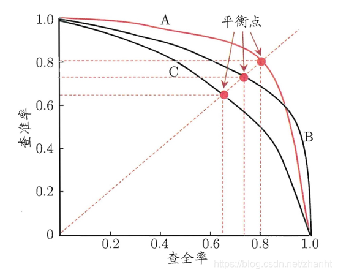
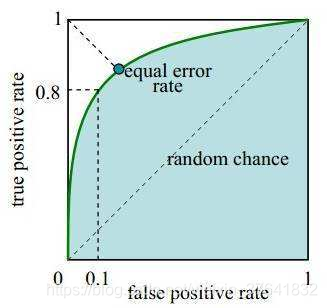
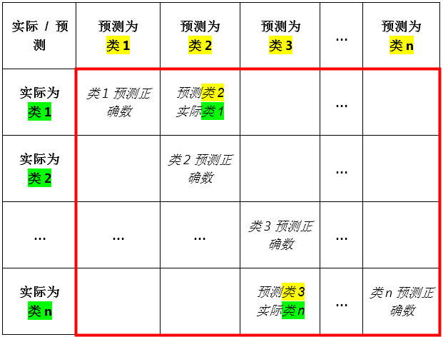

| 序号  | 修改时间      | 修改内容 | 修改人   | 审稿人 |
| --- | --------- | ---- | ----- | --- |
| 1   | 2021-5-10 | 创建   | Keefe |     |
|     |           |      |       |     |

   

---

[TOC]

 

---

## 1 AI算法简介

Artificial Intellignece, Ai是计算机科学的一个分支，是人类智能的计算机模拟。研究方法主要有仿生学和计算机方法。

* 仿生学算法有模仿蚂蚁群体的蚁群算法，模仿达尔文进化论的遗传算法，模仿热力学中固体降温过程的模拟退火算法等。

* 计算机方法包括数学建模和心理学中的启发式程序。 常规的启发式搜索算法有：回溯和分支限界。

**里程碑**：

1953年，Metropolis提出*模拟退火算法SA*的思想，Kirkpatrick在1983年成功地将其应用在组合最优化问题中。

1975年，美国Michigan大学J.Holland教授提出，并出版专著《Adaptation in Natural and Artificial Systems》。J.Holland教授所提出的GA通常为简单遗传算法（SGA）。

1992年，Marco Dorigo在他的博士论文中引入[蚁群算法](http://baike.baidu.com/view/539346.htm#_blank)(ant colony optimization, ACO)，其灵感来源于蚂蚁在寻找食物过程中发现路径的行为。

**实例**： 专家系统，机器人,机器学习，指纹人脸识别等

解决一个机器学习问题通常包含以下步骤：

- 获得训练数据。
- 定义模型。
- 定义损失函数。
- 遍历训练数据，从目标值计算损失。
- 计算该损失的梯度，并使用*optimizer*调整变量以适合数据。
- 计算结果。

### 1.1 AI算法应用场景

表格  AI算法类别及应用场景

| 类别      | 子类别  | 典型业务应用场景           | 主要算法                                                  | 评价指标                                   | 应用示例        |
| ------- | ---- | ------------------ | ----------------------------------------------------- | -------------------------------------- | ----------- |
| 优化类  |      | 带约束的单/多目标决策类。      | 精确求解：分支定界、动态规划 启发式：爬坡 元启发式：EDA、遗传、SA 超启发式：GP | 正确性、 优化效果、 效率                    | 装箱、 装车模拟 |
| 预测类     |      |                    |                                                       |                                        |             |
|         | 回归   | 预测目标为数值            | XGBoost、岭回归、RF                                        | MSE MAE MAPE                           | 辅料采购计划      |
|         | 分类   | 预测目标为离散值           | RF、SVM、XGBoost、LR、MN、Bayesian                         | Precision/Recall/ F1/ROC/AUC/PR_AUC | 用户离网预测      |
|         | 时间序列 | 目标值为数值的序列预测问题      | Arima, ES, MA, Arimax                                 | MSE MAE MAPE                           | 市场计划预测      |
|         | 统计分析 | 适合从大量数据中获取分布式或进行推断 | 统计检验：T、Chi、相关性 拟合统计：KS 统计推断：最大似然、 统计分析抽样：    | P值、贝叶斯因子                               | ICT物料质量趋势预警 |
| 知识挖掘类   |      | 适合从数据中抽取知识结构       | 频繁集挖掘：Aprbri, TG-Growth                               | Confidence, Support                    |             |

> 备注：优化类工具包首选google ortools，预测类可选sklearn框架。tensorflow框架适用于海量数据的深度学习。

### 1.2 AI算法评价指标

表格  sklean框架支持的模型选择和评价指标

| Scoring（得分）                          | Function（函数）                                                                                                                                                                                     | Comment                                 |
| ------------------------------------ | ------------------------------------------------------------------------------------------------------------------------------------------------------------------------------------------------ | --------------------------------------- |
| **Classification（分类）**               |                                                                                                                                                                                                  |                                         |
| ‘accuracy’                           | [`metrics.accuracy_score`](https://scikit-learn.org/stable/modules/generated/sklearn.metrics.accuracy_score.html#sklearn.metrics.accuracy_score)                                                 |                                         |
| ‘average_precision’                  | [`metrics.average_precision_score`](https://scikit-learn.org/stable/modules/generated/sklearn.metrics.average_precision_score.html#sklearn.metrics.average_precision_score)                      |                                         |
| ‘f1’                                 | [`metrics.f1_score`](https://scikit-learn.org/stable/modules/generated/sklearn.metrics.f1_score.html#sklearn.metrics.f1_score)                                                                   | for binary targets（用于二进制目标）             |
| ‘f1_micro’                           | [`metrics.f1_score`](https://scikit-learn.org/stable/modules/generated/sklearn.metrics.f1_score.html#sklearn.metrics.f1_score)                                                                   | micro-averaged                          |
| ‘f1_macro’                           | [`metrics.f1_score`](https://scikit-learn.org/stable/modules/generated/sklearn.metrics.f1_score.html#sklearn.metrics.f1_score)                                                                   | macro-averaged（宏平均）                     |
| ‘f1_weighted’                        | [`metrics.f1_score`](https://scikit-learn.org/stable/modules/generated/sklearn.metrics.f1_score.html#sklearn.metrics.f1_score)                                                                   | weighted average（加权平均）                  |
| ‘f1_samples’                         | [`metrics.f1_score`](https://scikit-learn.org/stable/modules/generated/sklearn.metrics.f1_score.html#sklearn.metrics.f1_score)                                                                   | by multilabel sample                    |
| ‘neg_log_loss’                       | [`metrics.log_loss`](https://scikit-learn.org/stable/modules/generated/sklearn.metrics.log_loss.html#sklearn.metrics.log_loss)                                                                   | requires `predict_proba` support        |
| ‘precision’ etc.                     | [`metrics.precision_score`](https://scikit-learn.org/stable/modules/generated/sklearn.metrics.precision_score.html#sklearn.metrics.precision_score)                                              | suffixes apply as with ‘f1’（后缀适用于 ‘f1’） |
| ‘recall’ etc.                        | [`metrics.recall_score`](https://scikit-learn.org/stable/modules/generated/sklearn.metrics.recall_score.html#sklearn.metrics.recall_score)                                                       | suffixes apply as with ‘f1’（后缀适用于 ‘f1’） |
| ‘roc_auc’                            | [`metrics.roc_auc_score`](https://scikit-learn.org/stable/modules/generated/sklearn.metrics.roc_auc_score.html#sklearn.metrics.roc_auc_score)                                                    |                                         |
| **Clustering（聚类）**                   |                                                                                                                                                                                                  |                                         |
| ‘adjusted_mutual_info_score’         | [`metrics.adjusted_mutual_info_score`](https://scikit-learn.org/stable/modules/generated/sklearn.metrics.adjusted_mutual_info_score.html#sklearn.metrics.adjusted_mutual_info_score)             |                                         |
| ‘adjusted_rand_score’                | [`metrics.adjusted_rand_score`](https://scikit-learn.org/stable/modules/generated/sklearn.metrics.adjusted_rand_score.html#sklearn.metrics.adjusted_rand_score)                                  |                                         |
| ‘completeness_score’                 | [`metrics.completeness_score`](https://scikit-learn.org/stable/modules/generated/sklearn.metrics.completeness_score.html#sklearn.metrics.completeness_score)                                     |                                         |
| ‘fowlkes_mallows_score’              | [`metrics.fowlkes_mallows_score`](https://scikit-learn.org/stable/modules/generated/sklearn.metrics.fowlkes_mallows_score.html#sklearn.metrics.fowlkes_mallows_score)                            |                                         |
| ‘homogeneity_score’                  | [`metrics.homogeneity_score`](https://scikit-learn.org/stable/modules/generated/sklearn.metrics.homogeneity_score.html#sklearn.metrics.homogeneity_score)                                        |                                         |
| ‘mutual_info_score’                  | [`metrics.mutual_info_score`](https://scikit-learn.org/stable/modules/generated/sklearn.metrics.mutual_info_score.html#sklearn.metrics.mutual_info_score)                                        |                                         |
| ‘normalized_mutual_info_score’       | [`metrics.normalized_mutual_info_score`](https://scikit-learn.org/stable/modules/generated/sklearn.metrics.normalized_mutual_info_score.html#sklearn.metrics.normalized_mutual_info_score)       |                                         |
| ‘v_measure_score’                    | [`metrics.v_measure_score`](https://scikit-learn.org/stable/modules/generated/sklearn.metrics.v_measure_score.html#sklearn.metrics.v_measure_score)                                              |                                         |
| **Regression（回归）**                   |                                                                                                                                                                                                  |                                         |
| ‘explained_variance’                 | [`metrics.explained_variance_score`](https://scikit-learn.org/stable/modules/generated/sklearn.metrics.explained_variance_score.html#sklearn.metrics.explained_variance_score)                   |                                         |
| ‘neg_mean_absolute_error’            | [`metrics.mean_absolute_error`](https://scikit-learn.org/stable/modules/generated/sklearn.metrics.mean_absolute_error.html#sklearn.metrics.mean_absolute_error)                                  |                                         |
| ‘neg_mean_squared_error’             | [`metrics.mean_squared_error`](https://scikit-learn.org/stable/modules/generated/sklearn.metrics.mean_squared_error.html#sklearn.metrics.mean_squared_error)                                     |                                         |
| ‘neg_mean_squared_log_error’         | [`metrics.mean_squared_log_error`](https://scikit-learn.org/stable/modules/generated/sklearn.metrics.mean_squared_log_error.html#sklearn.metrics.mean_squared_log_error)                         |                                         |
| ‘neg_median_absolute_error’          | [`metrics.median_absolute_error`](https://scikit-learn.org/stable/modules/generated/sklearn.metrics.median_absolute_error.html#sklearn.metrics.median_absolute_error)                            |                                         |
| ‘r2’                                 | [`metrics.r2_score`](https://scikit-learn.org/stable/modules/generated/sklearn.metrics.r2_score.html#sklearn.metrics.r2_score)                                                                   |                                         |
| ‘neg_mean_poisson_deviance’          | [`metrics.mean_poisson_deviance`](https://scikit-learn.org/stable/modules/generated/sklearn.metrics.mean_poisson_deviance.html#sklearn.metrics.mean_poisson_deviance)                            |                                         |
| ‘neg_mean_gamma_deviance’            | [`metrics.mean_gamma_deviance`](https://scikit-learn.org/stable/modules/generated/sklearn.metrics.mean_gamma_deviance.html#sklearn.metrics.mean_gamma_deviance)                                  |                                         |
| ‘neg_mean_absolute_percentage_error’ | [`metrics.mean_absolute_percentage_error`](https://scikit-learn.org/stable/modules/generated/sklearn.metrics.mean_absolute_percentage_error.html#sklearn.metrics.mean_absolute_percentage_error) |                                         |

#### 混淆矩阵/P/R/F值

`信息检索IR` 或者`分类问题 ` 的评价指标可以用 *混淆矩阵*(confusion matrix)来表示。

**定义1：** 混淆矩阵（IR定义）

* 召回率(Recall) = 系统检索到的相关文件 / 系统所有相关的文件总数。亦即，预测为真实正例 / 所有真实正例样本的个数。也叫查全率。

* 准确率(Precision，精准率) = 系统检索到的相关文件 / 系统所有检索到的文件总数。亦即，预测为真实正例 / 所有被预测为正例样本的个数。也叫查准率。

* 准确率accuracy = 分类正确的样本 / 总样本的个数。
  
  

**定义2**： 混淆矩阵（分类问题定义）

表格 11 混淆矩阵（分类问题）

| pred_label/true_label | positive               | negative               | 合计                        |
| --------------------- | ---------------------- | ---------------------- | ------------------------- |
| positive              | TP                     | FP                     | Predicted Positive(TP+FP) |
| negative              | FN                     | TN                     | Predicted Negative(FN+TN) |
| 合计                    | Actual Positive(TP+FN) | Actual Negative(FP+TN) | TP+FP+FN+TN               |

>  备注：上表中行表示预测的label值，列表示真实label值。
> T，True正确预测；F，False；P，Positive样本为正类；N，Negative反类。

TP，FP，FN，TN分别表示如下意思：

* TP（true positive）：真阳，将正样本判断为正类。注：阳，意动用法，认为…是阳性。真阳，即判断样本为阳性是正确的。表示样本的真实类别为正，最后预测得到的结果也为正；

* FP（false positive）：假阳。表示样本的真实类别为负，最后预测得到的结果却为正；

* FN（false negative）：假阴。表示样本的真实类别为正，最后预测得到的结果却为负；

* TN（true negative）：真阴。表示样本的真实类别为负，最后预测得到的结果也为负.

P：正样本个数 = TP + FN

N：负样本个数 = FP + TN

P’：被分类器分为正元组的样本数。

N’：被分类器分为负元组的样本数。

S：总预测样本个数 = P + N = P‘ + N’

可以看到，TP和TN是我们预测准确的样本，而FP和FN为我们预测错误的样本。

* **准确率**Accuracy：表示的是分类正确的样本数占样本总数的比例，准确率=(TP+TN)/(ALL)
* **精确率Precision**: 表示预测结果中，预测为正样本的样本中，正确预测为正样本的概率, 公式P=TP/(TP+FP)
* **召回率Recall**: （也叫灵敏度，真正类率，TPR- True Positive Rate）表示在原始样本的正样本中，最后被正确预测为正样本的概率，公式 TPR=TP/(TP+FN)
* 特异度（也叫误检率，假正类率，False Positive Rate，FPR，错判负样本为正例占所有负样本的比例）: FPR=FP/(FP+TN)
* 真负类率（True Negative Rate，TNR），也称为specificity，即特异性。计算公式为TNR=*TN*/ (*FP*+ *TN*) = 1 - *FPR*。
* 假负率，即缺失率。
* F值：  (P+R)/2

表格 分词的评测指标示例

| 评价指标         | 说明                          |
| ------------ | --------------------------- |
| 准确率Precision | 给定分词结果中切分正确的词次数/应分词结果中的总词次数 |
| 召回率Recall    | 给定分词结果中切分正确的词次数/标准答案中的总词次数  |
| F值           | (P+R)/2                     |

> 备注：将上面指标中的词 改成分类，也可以应用于分类值。

#### PR曲线

召回率与精确率用于衡量分类器的**漏报**（弃真）和**虚警**（取伪）比例。精确率越低，则虚警的可能性越大。一般在生活中，弃真的后果比取伪严重得多，例如医生诊断病人是否患有肺炎（COVID-19），取伪，也就是虚惊一场，弃真这可就严重了。召回率、精确率哪个更重要还是取决于具体应用场景。

* 查准率（精确率）可以认为是”宁缺毋滥”，适合对准确率要求高的应用，例如商品推荐，网页检索等。

* 查全率（召回率）可以认为是”宁错杀一百，不放过1个”，适合类似于检查走私、逃犯信息、敏感信息检测等。

但是当这两个指标发生冲突时，如何权衡？ 于是出现了PR曲线/ROC/AUC曲线。

P-R曲线应该是从（0,0）开始画的一条曲线，切割1*1的正方形，得到一块区域。

在进行比较时，若一个学习器A的P-R曲线被另一个学习器B的P-R曲线完全“包住”，则B的性能优于A。但是两个学习器的P-R曲线往往会发生交叉。这时候如何根据P-R曲线比较两个学习器的性能？（其实就是 Precision 和 Recall 率的权衡）

**F~β~分数**

F~β~  的物理意义就是将准确率和召回率这两个分值合并为一个分值，在合并的过程中，召回率的权重是准确率的 β 倍。

* 当β=1时，F1 认为准确率和召回率一样重要。适用于一般情况。
* 当β=2时，F2 认为召回率的重要程度是准确率的2倍。适用于
* 当β=0.5时，F0.5 认为召回率的重要程度是准确率的一半。

P-R曲线评价：

1. 平衡点（BEP）:我们认为平衡点越靠近（1,1）则性能越好。

2. F~1~ 度量

3. F~β~ 度量

#### ROC/AUC

**ROC曲线：Receiver Operating Characteristic Curve**

接受者操作特征曲线。接受者操作特性曲线是指在特定刺激条件下，以被试在不同判断标准下所得的虚报概率P（y/N）为横坐标，以击中概率P（y/SN）为纵坐标，画得的各点的连线。

TPR 为纵轴，以 FPR 为横轴，画出 ROC 曲线。从 FPR 和 TPR 的定义可以理解，TPR 越高，FPR 越小，我们的模型的性能也就越好。也就是说，ROC 曲线越靠近左上角 (1, 1) 模型越好。

**AUC**

AUC (Area Under Curve) 被定义为ROC曲线下的面积。

AUC 是一个模型评价指标，用于二分类模型的评价。

由于ROC曲线一般都处于y=x这条直线的上方，所以AUC的取值范围一般在0.5和1之间。

使用AUC值作为评价标准是因为很多时候ROC曲线并不能清晰的说明哪个分类器的效果更好，而作为一个数值，对应AUC更大的分类器效果更好。

   

备注：ROC曲线的下方面积为AUC。

* 横轴为“假正例率”（True Positive Rate,TPR)，又称为“假阳率”； 就是预测为正样本但是预测错了的可能性，显然，我们不希望该指标太高。

* 纵轴为“真正例率”(False Positive Rate,FPR，即召回率)，又称为“真阳率”，

假阳率，简单通俗来理解

由于ROC曲线一般都处于y=x这条直线的上方，所以AUC的取值范围在0.5和1之间。使用AUC值作为评价标准是因为很多时候ROC曲线并不能清晰的说明哪个分类器的效果更好，而作为一个数值，对应AUC更大的分类器效果更好。

**PR曲线和ROC曲线比较**

这二个曲线Y轴都是召回率，X轴分别是准确率和FPR。

* ROC曲线能够尽量降低不同测试集带来的干扰，更加客观地衡量模型本身的性能。
* PR曲线对正负样本分布比较敏感。

示例：以负样本数量增加10倍为例，召回率不变，准确率大降，FPR也基本不变。因此PR曲线变化很大，ROC曲线基本不变。

**曲线选择**

* 正负样本很不平均，如广告领域涉及到转化率，正样本只有负样本的1/1000甚至更低。这时应该用ROC曲线。ROC曲线广泛应用于排序、推荐、广告等领域。

* 当正负样本比例失调时，比如正样本1个，负样本100个，则ROC曲线变化不大，此时用PR曲线更加能反映出分类器性能的好坏。

* PR曲线比ROC曲线更加关注正样本，而ROC则兼顾了两者。

* 如果研究者希望更多地看到模型在特定数据集上的表现，P-R曲线则能够更直观地反映其性能。

* AUC越大，反映出正样本的预测结果更加靠前。（推荐的样本更能符合用户的喜好）

#### MSE/MAE/MAPE

MSE：（Mean Square Error, 均方误差），该统计参数是预测数据和原始数据对应点误差的平方和的均值。

MAE：（Mean Absolute Error，平均绝对误差），范围[0,+∞)，当预测值与真实值完全吻合时等于0，即完美模型；误差越大，该值越大。

MAPE：（Mean Absolute Percentage Error，平均绝对百分比误差）

RMSE（Root Mean Square Error，均方根误差），其实就是MSE加了个根号，这样数量级上比较直观。

SAMPE:  对称平均绝对百分比误差（Symmetric Mean Absolute Percentage Error）

#### 多分类指标：Micro-F1 和 Macro-F1

在一个多标签分类任务中，可以对每个“类”，计算F1，显然我们需要把所有类的F1合并起来考虑。

第一种计算出所有类别总的 Precision和 Recall，然后计算F1。这种方式被称为Micro-F1微平均。

第二种方式是计算出每一个类的 Precison 和Recall 后计算F1，最后将F1平均。这种方式叫做Macro-F1宏平均。

> 注意：Macro F1受样本数量少的类别影响大。

**图  N分类混淆矩阵**

### 1.3 AI算法性能评估

**１）理论分析**

* COLT: Computational learning theory
* PAC: Probably approximately correct
* 计算复杂性：Polynomial in time/number of examples

**２）实验分析**

* 性能标准

在新样本上的正确性

时间代价：学习所需时间，分类新样本所需要的时间

空间代价

* 实施策略

重复利用训练集/测试集估计分类器的性能

训练集用于学习分类器，测试集用于评估分类器性能

### 1.4 模型优化

AI模型优化过程包括模型编译compile（调参）、模型训练、模型保存和加载、模型预测。

* 模型编译 compile:  可以调参，指定loss, optiomizer和metrics。
* 模型训练 fit：一般epochs次数越多，效果越好。
* 模型保存和加载: save load model，模型占用的空间比较大。
* 模型预测 predict：
* 模型评估 evaluate:  用测试集进行验证，输出loss值和指标（如准确率）。

大多数机器学习问题最终都会涉及一个最优化问题，只是有的是基于最大化后验概率，例如贝叶斯算法，有的是最小化类内距离，例如k-means，而有的是根据预测值和真实值构建一个损失函数，用优化算法来最优化这个损失函数达到学习模型参数的目的。

最优化算法有三要素：变量（Decision Variable）、约束条件（Constraints）和目标函数（Objective function）。

优化分为参数优化和超参数优化

* 参数：模型f(x;Θ)中的Θ称为模型的参数，可以通过优化算法进行自动学习得到。
* 超参数：用来定义模型结构或优化策略。

#### 模型参数

模型编译步骤时，可以指定损失函数，优化器和指标。

- *损失函数*  loss- 用于测量模型在训练期间的准确率。希望最小化此函数，以便将模型“引导”到正确的方向上。
- *优化器* optimizer - 决定模型如何根据其看到的数据和自身的损失函数进行更新。
- *指标* metrics - 用于监控训练和测试步骤。以下示例使用了*准确率*，即被正确分类的图像的比率。

##### 损失函数 loss

loss损失函数有很多种：均方误差（MSE）、SVM的合页损失（hinge loss）、交叉熵（cross entropy）。

penalty补偿函数：

##### 优化器 optimizer

优化算法有很多种，如果按梯度的类型进行分类，可以分为有梯度优化算法和无梯度优化算法。

* 梯度优化算法：主要有梯度下降法、动量法momentum、Adagrad、RMSProp、Adadelta、Adam等。
* 无梯度优化算法：粒子群优化算法、蚁群算法群体智能优化算法，也有贝叶斯优化、ES、SMAC这一类的黑盒优化算法。

梯度下降法包括 批量梯度下降BGD、随机剃度下降SGD和小批量剃度下降MBGD。

| 名词             | 定义                                                                                                                       |
| -------------- | ------------------------------------------------------------------------------------------------------------------------ |
| original-loss  | 整个训练集上的loss                                                                                                              |
| minibatch-loss | 在一个mini batch上的loss                                                                                                      |
| BGD            | 最原始的梯度下降算法，为了计算original-loss上的梯度，需要使用训练集全部数据                                                                             |
| SGD            | Stochastic Gradient Descent，随机梯度下降法。 （近似）计算original-loss梯度时，只使用一个mini  batch，相当于用minibatch-loss上的梯度去近似original-loss梯度 |
| 奇点             | local minimal和saddle point                                                                                               |

**随机梯度下降(SGD)**

SGD是一种简单但又非常高效的方法，主要用于凸损失函数下线性分类器的判别式学习，例如(线性) [支持向量机](https://en.wikipedia.org/wiki/Support_vector_machine) 和 [Logistic 回归](https://en.wikipedia.org/wiki/Logistic_regression) 。

SGD 已成功应用于在文本分类和自然语言处理中经常遇到的大规模和稀疏的机器学习问题。对于稀疏数据，本模块的分类器可以轻易的处理超过 10^5 的训练样本和超过 10^5 的特征。

SGD的优势:

- 高效。
- 易于实现 (有大量优化代码的机会)。

SGD的劣势:

- SGD 需要一些超参数，例如 regularization （正则化）参数和 number of iterations （迭代次数）。
- SGD 对 feature scaling （特征缩放）敏感。

#### 泛化和验证

问题：欠拟合(underfiting) 和 过拟合(overfitting)

解决方案：交叉验证

交叉验证注意事项

* 训练数据要有代表性。
* 某些数据集的特征是有时间顺序的。
* K折交叉（将数据集分成K个包，对于某个包，取其它包作为训练集，N个包处理完后，将每个包的预测值进行汇总，综合评估其准确率）的包数量越大，估计误差越好，但花费时间越多。

 

### 本章参考

[1]. 一文详尽混淆矩阵、准确率、精确率、召回率、F1值、P-R 曲线、ROC 曲线、AUC 值、Micro-F1 和 Macro-F1 https://blog.csdn.net/weixin_37641832/article/details/104434509

[2]. ROC曲线 [https://baike.baidu.com/item/ROC%E6%9B%B2%E7%BA%BF](https://baike.baidu.com/item/ROC曲线)

 

## 2 特征工程

图 特征工程

特征处理是特征工程中最重要的部分。

### 2.1  文本特征

文本向量化的算法通常有TF-IDF, Word2Vec

Word2Vec{词，词频}：最初由google开发，由深度神经网络构成，可将稀疏特征转化为稠密矩阵。实现方式有连续词袋模型（CBOW）和Skip-Gram模型。实现框架如python Gensim库。

* 词袋(bags of word)：将文本拆分成词的组合。
* 连续词袋模型（CBOW）：
* Skip-Gram模型：主要是通过输入句子中特定的单词来预测该单词周边的其他单词。

**主题建模**

* TF-IDF、

* 潜在语义索引（Latent Semantic Analysis, LSA）：使用奇异值分解（SVD），将词语-文档矩阵分解成3个矩阵（T~关联术语和概念、S~奇异值、D~关联文档和概念）

### 2.2  图像特征

颜色模板：RGB、HSL

图像元数据特征：EXIF数据

提取物体和形态：边缘检测、复杂形状提取、降维（使用PCA技术）

### 2.3  时间序列特征

时间序列数据：经典时间序列和点过程

简单时间序列测量指标：平均值、扩散性、离群值和分布性。

高级时间序列特征：自相关性（傅里叶分析~将一个时间序列分解为在一系列频率上的正弦和余弦函数的和）

### 2.4  事件流特征

 

## 3 AI通用算法

### 3.1  相似度计算

相似度计算常用于文本、句子相似度。

常用库：python-Levenshtein 

表格 4 距离度量

| 距离             | 定义                                                                                                                                                                                                   | 应用                                                                                        |
| -------------- | ---------------------------------------------------------------------------------------------------------------------------------------------------------------------------------------------------- | ----------------------------------------------------------------------------------------- |
| 欧氏距离           | 最常见的距离度量，衡量的是多维空间中各个点之间的绝对距离。   dist(x,y)=   dist1 = np.linalg.norm( x - y )   dist2 = np.sqrt(np.sum(np.square(x -   y)))                                                                           | 欧氏度量需要保证各维度指标在相同的刻度级别，比如对身高（cm）和体重（kg）两个单位不同的指标使用欧式距离可能使结果失效。                             |
| 余弦距离.cos       | 用向量空间中两个向量夹角的余弦值作为衡量两个个体间差异的大小。   sim(x,y)=cos = xy/(\|\|x\|\| \|\|y\|\|)   或 cos(x,y)   = (x*y)/(L(x)*L(y))，即两向量的内积除于两向量的L2范式   实现：   dist1 = 1 - np.dot(x,y)/(np.linalg.norm(x)*np.linalg.norm(y)) | 相比距离度量，余弦相似度更加注重两个向量在方向上的差异，而非距离或长度上。  余弦值越接近1，就表明夹角越接近0度，也就是两个向量越相似。计算文本相似度时要加入*词频*作为权重。 |
| Jaccard距离      | 用于计算符号度量或者布尔值度量的两个个体之间的相似度，由于个体的特征属性是用符号或者布尔值度量的，所以只能统计包含的共同特征个数。   Jacard(x,y)   = (x 交y)/(x并 y)                                                                                                    | 用来衡量两个集合的相似度                                                                              |
| 编辑距离.lev       | 俄罗斯Vladimir Levenshtein在1965年提出。设有字符串A和B，B为模式串，现给定以下操作：从字符串中删除一个字符；从字符串中插入一个字符；从字符串中替换一个字符。通过以上三种操作，将字符串A编辑为模式串B所需的最小操作数称为A和B的最短编辑距离，记为ED(A,B)。                                                      | 主要用来计算两个字符串的相似度。编辑距离越小，说明两个字符串越相似。反之，越不相似。                                                |
| SimHash + 汉明距离 | SimHash是谷歌发明的。                                                                                                                                                                                       |                                                                                           |
| 曼哈顿距离          | 十九世纪的赫尔曼·闵可夫斯基所创，用以标明两个点上在标准坐标系上的绝对轴距总和。                                                                                                                                                             |                                                                                           |
| 海明距离           | 两个码字的对应比特取值不同的比特数称为这两个码字的海明距离。即两个向量中不同分量的个数。   score = 1 /   (euclideanDistance+1)                                                                                                                   | 用于编码的检错和纠错                                                                                |
| 皮尔逊相关系数        |                                                                                                                                                                                                      | 正相关、负相关、毫不相关                                                                              |

备注：L2范式为向量到原点的欧氏距离，比如x=[1,2,-1]的L2范式为sqrt(1*1+2*2+(-1)(-1))=sqrt(6)

   

图 2 欧氏距离和余弦距离的差别

**皮克逊相关系数pearson：**

**皮克逊相关系数**广泛用于度量两个变量之间的相关程度。由[卡尔·皮尔逊](http://baike.baidu.com/item/卡尔·皮尔逊)从[弗朗西斯·高尔顿](http://baike.baidu.com/item/弗朗西斯·高尔顿)在19世纪80年代提出的一个相似却又稍有不同的想法演变而来的。它是一个介于 1 和 -1 之间的值，其中，1 表示变量完全正相关，0 表示无关，-1 表示完全负相关。

该相关系数是判断两组数据与某一直线拟合程序的一种试题。它在数据不是很规范的时候，会倾向于给出更好的结果。

公式：可演变成四个，

公式一：两个变量之间的协方差和标准差的商

$$
Corr(X,Y) = Cov(X,Y)/(DX*DY)
$$

公式二~四：略

 

### 3.2 决策树算法

决策树是用于分类和预测的主要技术之一，决策树学习是以实例为基础的归纳学习算法，它着眼于从一组无次序、无规则的实例中推理出以决策树表示的分类规则。 构造决策树的目的是找出属性和类别间的关系，用它来预测将来未知类别的记录的类别。它采用自顶向下的递归方式，在决策树的内部节点进行属性的比较，并根据不同属性值判断从该节点向下的分支，在决策树的叶节点得到结论。

主要的决策树算法有ID3、C4.5（C5.0）、CART、PUBLIC、SLIQ和SPRINT算法等。它们在选择测试属性采用的技术、生成的决策树的结构、剪枝的方法以及时刻，能否处理大数据集等方面都有各自的不同之处。

决策树分为两大类，回归树和分类树，GBDT中的树都是回归树，不是分类树。

**C4.5**

C4.5算法[^C4.5]是机器学习算法中的一种分类决策树算法,其核心算法是ID3算法. C4.5算法继承了ID3算法的优点，并在以下几方面对ID3算法进行了改进：

1) 用信息增益率来选择属性，克服了用信息增益选择属性时偏向选择取值多的属性的不足；

2) 在树构造过程中进行剪枝；

3) 能够完成对连续属性的离散化处理；

4) 能够对不完整数据进行处理。

C4.5算法有如下优点：产生的分类规则易于理解，准确率较高。其缺点是：在构造树的过程中，需要对数据集进行多次的顺序扫描和排序，因而导致算法的低效。

**CART**

Classification and Regression *Trees* 分类与回归树，是二叉树，可以用于分类，也可以用于回归问题，最先由 Breiman 等提出。CART是一棵二叉树，每一次分裂会产生两个子节点。CART树分为分类树和回归树。

分类树主要针对目标标量为分类变量，比如预测一个动物是否是哺乳动物。

回归树针对目标变量为连续值的情况，比如预测一个动物的年龄。

如果是分类树，将选择能够最小化分裂后节点GINI值的分裂属性；

如果是回归树，选择能够最小化两个节点样本方差的分裂属性。CART跟其他决策树算法一样，需要进行剪枝，才能防止算法过拟合从而保证算法的泛化性能。

### 3.3 时序模式算法

时间序列一般有以下特殊：趋势性、周期性、季节性和随机性。

表格 6 趋势预测常见算法

| 算法      | 概念                                                     | 算法步骤 | 应用        |
| ------- | ------------------------------------------------------ | ---- | --------- |
| 移动平均法   | 分为简单移动平均和加权移动平均。                                       |      |           |
| 指数平滑法   | 特殊的加权移动平均法。                                            |      |           |
| ARIMA模型 | Auto   Regressive Integrated Movig Average, 自回归移动平均模型。 |      | 只能挖掘线性关系。 |
| 神经网络模型  |                                                        |      |           |

 

### 本章参考

 

## 4 ML机器学习算法

参考 《AI笔记》相关章节

主要包括分类、聚类、回归和降维。

表格 5 分类和聚类的区别

|        | 分类 Classifiers                                                                                           | 聚类 Cluster                                                |
| ------ | -------------------------------------------------------------------------------------------------------- | --------------------------------------------------------- |
| 概述  | 按照某种标准给对象贴标签(label)，再根据标签来区分归类。分类是样本向下细分归类。                                                              | 指事先没有“标签”而通过某种成团分析找出事物之间存在聚集性原因的过程。  聚类是样本向上汇总成类。         |
| 过程     | 特征选择过程(即预处理过程，离线训练过程)和在线分类过程。                                                                            |                                                           |
| 学习类型   | 有指导学习                                                                                                    | 无指导学习                                                     |
| 类别限制   | 事先定义好类别 ，类别数不变 。                                                                                         | 没有事先预定的类别，类别数不确定。                                         |
| 是否需分类器 | 分类器需要由人工标注的分类训练语料训练得到。                                                                                   | 不需要人工标注和预先训练分类器。                                          |
| 主要算法   | Bagging、Boosting、DTree, Decide Tree、KNN、VSM、CART,  Classification and Regression Trees、后向传播, 前向传播、EM、K近邻 | EM、K平均法、  K-均值聚类算法、K-中心点聚类算法、CLARANS、 BIRCH、CLIQUE、DBSCAN |
| 应用实例   | 比如按照国图分类法分类图书                                                                                            | 比如多文档文摘、搜索引擎结果后聚类(元搜索)等。                                  |

### 分类.Classification

分类器算法分类

* [线性分类器](http://en.wikipedia.org/wiki/Linear_classifier)：指分类通过特征的[线性组合](http://zh.wikipedia.org/wiki/線性組合)来作决定。
* [统计分类器](http://en.wikipedia.org/wiki/Statistical_classification)

分类器算法列表

* Bagging
* Boosting
* DTree, Decide Tree
* KNN,
* SVM
* CART, Classification and Regression Trees
* 后向传播, 前向传播
* EM
* K近邻

**线性分类器的类型**

有两种类型用来决定线性分类器。分别是**生成模型和判别模型** Generative models vs. discriminative models

第一种模型[条件概率](http://zh.wikipedia.org/wiki/條件機率)。 这类的算法包括：

* [线性判别分析](http://zh.wikipedia.org/wiki/線性判別分析) (LDA) --- 假设为[高斯](http://zh.wikipedia.org/wiki/常態分佈)条件密度模型。（条件概率*P*（*A*|*B*））
* [单纯贝叶斯分类器](http://zh.wikipedia.org/w/index.php?title=單純貝葉斯分類器&action=edit&redlink=1) --- 假设为[独立](http://zh.wikipedia.org/w/index.php?title=獨立隨機變數&action=edit&redlink=1) [binomial](http://zh.wikipedia.org/wiki/二項分佈)条件密度模型。（独立条件概率—先验概率）
* [Linear Discriminant Analysis (or Fisher's linear discriminant)](http://en.wikipedia.org/wiki/Linear_discriminant_analysis) (LDA)—assumes [Gaussian](http://en.wikipedia.org/wiki/Normal_distribution) conditional density models
* [Naive Bayes classifier](http://en.wikipedia.org/wiki/Naive_Bayes_classifier)—assumes [independent](http://en.wikipedia.org/wiki/Independent_random_variables) [binomial](http://en.wikipedia.org/wiki/Binomial_distribution) conditional density models.

第二种方式则称为[判别模型](http://zh.wikipedia.org/w/index.php?title=判別模型&action=edit&redlink=1) (discriminative models)，会去最大化一个[训练集](http://zh.wikipedia.org/w/index.php?title=訓練集&action=edit&redlink=1)(training set)输出的质。 在训练的成本函数中有一个额外的项加入，可以容易地表示[正则化](http://zh.wikipedia.org/w/index.php?title=正則化_(數學)&action=edit&redlink=1)。例子包含：

* [Logit模型](http://zh.wikipedia.org/wiki/Logit模型) ---输入的特征向量的[最大似然估计](http://zh.wikipedia.org/wiki/最大似然估计)，其假设观察到的训练集是由一个相依于分类器的输出的二元模型所产生。
* [感知元](http://zh.wikipedia.org/wiki/感知元)(Perceptron) --- 一个试图去修正在训练集中遇到错误的算法。
* [支持向量机](http://zh.wikipedia.org/wiki/支持向量机)SVM --- 一个试图去最佳化在决策超平面上，训练集中的例子间的[边界](http://zh.wikipedia.org/w/index.php?title=邊界_(機器學習)&action=edit&redlink=1)(margin)的算法。

### 聚类.Cluster

表格 4 常用聚类方法列表

| 类别                 | 包括的主要算法                                          |
| ------------------ | ------------------------------------------------ |
| 划分（分裂）Partitioning | K-平均，K-中心、CLARANS（基于选择）                          |
| 层次聚类Hierarchical   | BIRCH（平衡迭代规约和聚类）、CURE（代表点聚类）、CHAMELEON（动态模型）     |
| 密度聚类Density-Based  | DBSCAN（基于高密度连接区域）、DENCLUE（密度分布函数）、OPTICS（对象排序识别） |
| 基于网格               | STING（统计信息网络）、CLIOUE（聚类高维空间）、WAVE-CLUSTER（小波变换）  |
| 基于模型Model-Based    | 统计学方法、神经网络方法                                     |

表格 5 常用聚类分析算法列表

| 算法      | 算法 描述                                                                               |
| ------- | ----------------------------------------------------------------------------------- |
| K-means | K平均也称为K均值、快速聚类法。在最小化误差函数的基础上将数据划分为预定的类数K。此算法原理简单并便于处理大数据。                           |
| K-中心法   | K中心点算法不采用簇中对象的平均值作为簇中心，而选用簇中离平均值最近的对象作为簇中心。                                         |
| 系统聚类    | 也称多层次聚类，分类的单位由高到低呈树形结构，且所处的位置越低，其所包含的对象就越少，但这些对象间的共同特征越多。此算法只适合在小数据量的时候使用，大数据时会非常慢。 |
| EM      | 最大期望。                                                                               |

表格 sklean里的聚类算法

| Method name（方法名称）                                                                                        | Parameters（参数）                                                           | Scalability（可扩展性）                                                                                                         | Usecase（使用场景）                                                                               | Geometry (metric used)（几何图形（公制使用））                         |
| -------------------------------------------------------------------------------------------------------- | ------------------------------------------------------------------------ | ------------------------------------------------------------------------------------------------------------------------- | ------------------------------------------------------------------------------------------- | ---------------------------------------------------------- |
| [K-Means（K-均值）](https://sklearn.apachecn.org/docs/master/22.html#k-means)                                | number of clusters（聚类形成的簇的个数）                                            | 非常大的 `n_samples`, 中等的 `n_clusters` 使用 [MiniBatch 代码）](https://sklearn.apachecn.org/docs/master/22.html#mini-batch-kmeans) | 通用, 均匀的 cluster size（簇大小）, flat geometry（平面几何）, 不是太多的 clusters（簇）                           | Distances between points（点之间的距离）                           |
| [Affinity propagation](https://sklearn.apachecn.org/docs/master/22.html#affinity-propagation)            | damping（阻尼）, sample preference（样本偏好）                                     | Not scalable with n_samples（n_samples 不可扩展）                                                                               | Many clusters, uneven cluster size, non-flat geometry（许多簇，不均匀的簇大小，非平面几何）                    | Graph distance (e.g. nearest-neighbor graph)（图距离（例如，最近邻图）） |
| [Mean-shift](https://sklearn.apachecn.org/docs/master/22.html#mean-shift)                                | bandwidth（带宽）                                                            | Not scalable with `n_samples` （`n_samples`不可扩展）                                                                           | Many clusters, uneven cluster size, non-flat geometry（许多簇，不均匀的簇大小，非平面几何）                    | Distances between points（点之间的距离）                           |
| [Spectral clustering](https://sklearn.apachecn.org/docs/master/22.html#spectral-clustering)              | number of clusters（簇的个数）                                                 | 中等的 `n_samples`, 小的 `n_clusters`                                                                                          | Few clusters, even cluster size, non-flat geometry（几个簇，均匀的簇大小，非平面几何）                        | Graph distance (e.g. nearest-neighbor graph)（图距离（例如最近邻图））  |
| [Ward hierarchical clustering](https://sklearn.apachecn.org/docs/master/22.html#hierarchical-clustering) | number of clusters（簇的个数）                                                 | 大的 `n_samples` 和 `n_clusters`                                                                                             | Many clusters, possibly connectivity constraints（很多的簇，可能连接限制）                               | Distances between points（点之间的距离）                           |
| [Agglomerative clustering](https://sklearn.apachecn.org/docs/master/22.html#hierarchical-clustering)     | number of clusters（簇的个数）, linkage type（链接类型）, distance（距离）               | 大的 `n_samples` 和 `n_clusters`                                                                                             | Many clusters, possibly connectivity constraints, non Euclidean distances（很多簇，可能连接限制，非欧氏距离） | Any pairwise distance（任意成对距离）                              |
| [DBSCAN](https://sklearn.apachecn.org/docs/master/22.html#dbscan)                                        | neighborhood size（neighborhood 的大小）                                      | 非常大的 `n_samples`, 中等的 `n_clusters`                                                                                        | Non-flat geometry, uneven cluster sizes（非平面几何，不均匀的簇大小）                                      | Distances between nearest points（最近点之间的距离）                 |
| [Gaussian mixtures（高斯混合）](https://sklearn.apachecn.org/docs/master/mixture.html#mixture)                 | many（很多）                                                                 | Not scalable（不可扩展）                                                                                                        | Flat geometry, good for density estimation（平面几何，适用于密度估计）                                    | Mahalanobis distances to centers（ 与中心的马氏距离）                |
| [Birch](https://sklearn.apachecn.org/docs/master/22.html#birch)                                          | branching factor（分支因子）, threshold（阈值）, optional global clusterer（可选全局簇）. | 大的 `n_clusters` 和 `n_samples`                                                                                             | Large dataset, outlier removal, data reduction.（大型数据集，异常值去除，数据简化）                           |                                                            |

### 回归.Regression

* 线性回归：主要为了预测。如最小二乘法。
* 逻辑回归：主要用于分类。如岭回归。

### 数据预处理

#### 异常点检测算法

常见的异常大致可分为三类，分别是异常值、波动点和异常时间序列。

**异常检测方法**

* 基于统计模型：一元正态分布、多元正态分布

* 基于邻近度：KNN

* 基于密度：逆距离、给定半径d内的个数、相对密度

* 独立森林

**降维**

**PAC算法**：PCA(Principal Component Analysis ，PCA) 是主成分分析，主要用于数据降维。 目的是找那些变化大的元素，即方差大的那些维，而去除掉那些变化不大的维，从而使特征留下的都是“精品”，而且计算量也变小了。

### Ensemble集成学习算法

集成学习算法常用于解决分类、回归和异常点检测问题。

集成学习，顾名思义，就是将多个单一模型进行组合，最后形成一个更好的模型的过程。之所以组合多个单一学习器，是因为很多时候单一学习器的效果不够理想，多个模型组合可以互帮互助，各取所长，从而能够更好的完成任务。集成学习一般的结构是先学习单一的学习器，之后通过某种策略将其组合在一起。

**条件**

（a）首先应该保证分类器之间的差异性，如果分类器都相同，那么组合的出来的结果是不会有变化的。

（b）每个个体分类器的精度必须大于0.5，如果个体分类器的精度低于0.5，那集成之后的精度低于规模的增大而降低。但如果精度是大于0.5的，最后的分类结果会趋于1。

**集成学习的类别**

根据个体学习器的生成方式，目前的集成学习方法大致可以分成两类：

* 第一类是单个学习器之间有着很强的依赖关系，需要以串行的序列化的方式生成，代表方法：Boosting。
  
  Boosting方法中也有很多分类如Adaboost、GBDT等等。

* 第二类就是个体学习器之间不存在很强的依赖关系，学习器可以并行生成，代表方法：Bagging 和Random Forest。

#### Boosting

Boosting就是指用一系列的模型线性组合来完成模型任务。在Boosting学习中，逐步的确定每一个模型之间，每一个子模型叠加到复合模型当中来，在这个过程中保证损失函数随着子模型的增加而逐渐减少。

Boosting有两种，AdaBoost和Gradient Boost。

* AdaBoost: 根据当前的loss来改变样本权重，比如这个样本在学习中误差比较大，则获得一个大的权重，反之获得更小的权重，从而控制后续子模型的产生。

* Gradient Boosting: 直接修改样本label，新的样本的label将变成原来的label和已知形成的模型预测值之间的残差。

从两者来看，Gradient Boosting 更倾向于降低训练误差的角度去完成算法乘积。

表格 Boosting算法列表

| 算法       | 算法原理                                                                                                                                                                      | 优点                                      | 缺点                   |
| -------- | ------------------------------------------------------------------------------------------------------------------------------------------------------------------------- | --------------------------------------- | -------------------- |
| **GBDT** | Gradient Boosting Decison Tree，梯度提升决策树。 一轮一轮迭代弱学习器，使用前向分布算法，但是它限定弱学习器只能是决策树(CART回归树）。                                                                                  |                                         | 不能处理海量数据             |
| AdaBoost | 利用前一轮迭代弱学习器的误差率来更新训练集的权重，这样一轮轮的迭代下去。                                                                                                                                      |                                         |                      |
| XGB      | Extreme Gradient Boosting。陈天奇等人开发，高效地实现了GBDT算法并进行了算法和工程上的许多改进。 基于预排序方法的决策树算法。                                                                                          | 能精确地找到分割点。                              | 空间时间消耗大，对cache优化不友好。 |
| LGB      | Light Gradient Boosting Machine。基于Histogram的决策树算法。 单边梯度采样 Gradient-based One-Side Sampling(GOSS)。互斥特征捆绑 Exclusive Feature Bundling(EFB)。直接支持类别特征(Categorical Feature)。 | 更快的训练速度、更低的内存消耗、更好的准确率、支持分布式可以快速处理海量数据等 |                      |
| HGB      | Histogram-based Gradient Boosting                                                                                                                                         |                                         |                      |

**GBDT**

GBDT - Gradient Boosting Decison Tree，全称梯度提升树，在传统机器学习算法里面是对真实分布拟合的最好的几种算法之一。GBDT是集成学习Boosting算法中的一种。

GBDT使用前向分布算法，通过多轮迭代,每轮迭代产生一个弱分类器（限定弱学习器只能是决策树，实际选择CART回归树），每个分类器在上一轮分类器的**残差**基础上进行训练。对弱分类器的要求一般是足够简单，并且是低方差和高偏差的。因为训练的过程是通过降低偏差来不断提高最终分类器的精度， 弱分类器一般会选择为CART TREE的回归树。由于上述高偏差和简单的要求 每个分类回归树的深度不会很深。最终的总分类器 是将每轮训练得到的弱分类器加权求和得到的（也就是加法模型）。

**LGB**

LightGBM（Light Gradient Boosting Machine）， LightGBM是2017年由微软推出的可扩展机器学习系统，是微软旗下DMKT的一个开源项目，由2014年首届阿里巴巴大数据竞赛获胜者之一柯国霖老师带领开发。是一个实现GBDT算法的框架，支持高效率的并行训练，并且具有更快的训练速度、更低的内存消耗、更好的准确率、支持分布式可以快速处理海量数据等优点。

 

### 本章参考

[1]. 机器学习算法GBDT https://www.cnblogs.com/bnuvincent/p/9693190.html

[2]. XGBoost入门系列第一讲 https://zhuanlan.zhihu.com/p/27816315

[3]. GBDT集成算法（梯度提升树） https://www.jianshu.com/p/1da813fde4a3

[4]. LightGBM（lgb）介绍 https://www.jianshu.com/p/1cbbe01541fd

[5]. 超全！LightGBM算法框架前世今生！ https://baijiahao.baidu.com/s?id=1671278750268233539&wfr=spider&for=pc

[6]. 机器学习集成学习 Ensemble Learning（常用集成算法汇总） https://blog.csdn.net/weixin_39948381/article/details/106442535

[7]. PCA http://hi.baidu.com/l1x2y/blog/item/fc6f10fd93c7643d5d6008e9.html

 

## 5 仿生学算法系列

仿生学算法有模仿蚂蚁群体的蚁群算法，模仿达尔文进化论的遗传算法，模仿热力学中固体降温过程的模拟退火算法等。

表格 7 仿生学算法列表

| 算法                           | 原理                                                                         | 概念                                                                                         | 算法步骤                                                                                                                                                                              | 应用         |
| ---------------------------- | -------------------------------------------------------------------------- | ------------------------------------------------------------------------------------------ | --------------------------------------------------------------------------------------------------------------------------------------------------------------------------------- | ---------- |
| 遗传算法GA                       | 模拟达尔文的遗传选择和自然淘汰的生物进化过程的计算模型。                                               | 遗传算法是具有“生存＋检测“迭代过程的搜索算法。   它以一种群体中的所有个体为对象，并利用随机化技术指导一个被编码的参数空间进行高效搜索。 遗传操作有：选择，交叉和变异。 | 1）随机产生一组初始个体构成初始种群，并评价每一个体的适配度（适应度）；   2）判断算法的收敛准则是否满足，若满足则输出搜索结果；否则执行以下步骤；    3）根据适配值大小以一定方式执行**复制**操作；  4）按交叉概率p(c)执行*交叉*操作；    5）按变异概率p(m)执行*变异*操作；    6）返回步骤2； | 组合优化，函数优化  |
| 进化算法                         | 包括[遗传算法](http://baike.baidu.com/view/45853.htm#_blank)、进化程序设计、进化规划和进化策略等等。 | 进化算法的基本框架还是简单遗传算法所描述的框架，但在进化的方式上有较大的差异，选择、交叉、变异、种群控制等有很多变化。                                |                                                                                                                                                                                   |            |
| 模拟退火SA~  Simulated Annealing | 模拟热力学中经典粒子系统的降温过程，来求解规划问题的极值。                                              | SA的出发点是基于物理中固体物质的退火过程与一般的组合优化问题之间的相似性。                                                     | 1）给定初始温度T0及初始点，计算此点的函数值f(x);    2) 计算函数差值 %f ＝ f1(x)-f(x);    3) 若%f <=0，则接受新点作为下一次模拟的初始点；    4) 若%f >0, 则计算新接受点概率。                                                   | 组合优化如TSP问题 |
| 蚁群算法ACO                      | 蚁群算法是模拟了蚂蚁群体智能。                                                            | 蚂蚁群体是一种社会性昆虫，它们有组织，有分工，还有通讯系统。它们相互协作，能完成从蚁穴到食物源寻找最短路径的复杂任务。                                |                                                                                                                                                                                   |            |
| 神经网络                         | 人工神经网络是根据人的认识过程而开发出的一种算法。                                                  |                                                                                            |                                                                                                                                                                                   |            |
| 免疫算法                         | 模拟免疫系统的学习算法。                                                               | 模拟了免疫系统独有的学习、记忆、识别等功能，具有较强模式分类能力，尤其对多模态问题的分析、处理和求解表现出较高的智能性和鲁棒性。                           |                                                                                                                                                                                   | 多模态问题      |

**备注：**

### 遗传算法GA

**原理**：遗传算法是模拟达尔文的遗传选择和自然淘汰的生物进化过程的计算模型。

**概论**：遗传算法是具有“生存＋检测“迭代过程的搜索算法。 它以一种群体中的所有个体为对象，并利用随机化技术指导一个被编码的参数空间进行高效搜索。 遗传操作有：选择，交叉和变异。

**应用**：组合优化，函数优化

算法步骤： （标准遗传算法的主要步骤）

1）随机产生一组初始个体构成初始种群，并评价每一个体的适配度（适应度）；

2）判断算法的收敛准则是否满足，若满足则输出搜索结果；否则执行以下步骤；

3）根据适配值大小以一定方式执行**复制**操作；

4）按交叉概率p(c)执行*交叉*操作；

5）按变异概率p(m)执行*变异*操作；

6）返回步骤（2；

### 模拟退火算法SA

**原理**：Simulated Annealing, SA的出发点是基于物理中固体物质的退火过程与一般的组合优化问题之间的相似性。

**概论**：模拟热力学中经典粒子系统的降温过程，来求解规划问题的极值。

**应用**：组合优化如TSP问题

算法步骤：

1. 给定初始温度T0及初始点，计算此点的函数值f(x);
2) 计算函数差值 %f ＝ f1(x)-f(x);

3) 若%f <=0，则接受新点作为下一次模拟的初始点；

4) 若%f >0, 则计算新接受点概率。

### 神经网络算法

**原理：**人工神经网络是根据人的认识过程而开发出的一种算法。假如我们现在只有一些输入和相应的输出,而对如何由输入得到输出的机理并不清楚,那么我们可以把输入与输出之间的未知过程看成是一个“网络”,通过不断地给这个网络输入和相应的输出来“训练”这个网络,网络根据输入和输出不断地调节自己的各节点之间的权值来满足输入和输出。这样,当训练结束后,我们给定一个输入,网络便会根据自己已调节好的权值计算出一个输出。这就是神经网络的简单原理。

表格 8 神经网络(Neural Network)算法分类

| 分类           | 简述                                                                         | 应用场景    |
| ------------ | -------------------------------------------------------------------------- | ------- |
| 卷积.CNN       | Convolutions卷积，前馈神经网络。通过卷积核将上下层进行链接，同一个卷积核在所有图像中是共享的，图像通过卷积操作后仍然保留原先的位置关系。 | 时间序列、分类 |
| 深度.DNN       | Deep。为了克服梯度消失，ReLU、maxout等传输函数代替了sigmoid，形成了如今DNN的基本形式。                    |         |
| RNN          | Roop循环或者Recurrent递归。                                                       |         |
| 长短期记忆网络.LSTM |                                                                            |         |

**卷积**

在[泛函分析](https://baike.baidu.com/item/泛函分析/4151)中，卷积、旋积或摺积(英语：Convolution)是通过两个函数f和g 生成第三个函数的一种[数学](https://baike.baidu.com/item/数学/107037)[算子](https://baike.baidu.com/item/算子/970194)，表征函数f与g经过翻转和平移的重叠部分函数值乘积对重叠长度的积分。

 

## 6 NLP常用算法

2001年，Lafferty 等人提出CRF（Conditional Random Field, 条件随机场），结合了 **最大熵模型** 和 **隐马尔科夫模型** 的特点，能对隐含状态建模，学习状态序列的特点，但它的缺点是需要手动提取序列特征。

2013年，谷歌的 Mikolov 提出了一套新的词嵌入方法Word2Vec。

2017年，谷歌发表《Attention Is All You Need》，提出Transformer模型。

2018年，谷歌发表《BERT：Pre-training of Deep Bidirectional Transformers for Language Understanding》，提出基于Transformer的语言模型BERT。

表格 NLP常用算法列表

| 算法       | 算法简介                                                               | 应用            |
| -------- | ------------------------------------------------------------------ | ------------- |
| BERT     | 预训练好的深度双向编码转换。                                                     | NLU、Q&A Robot |
| TF-IDF   | 词频-反文档频率。                                                          | 搜索引擎          |
| Word2Vec | 一群用来产生词向量的相关模型。词序不重要，训练完成之后，word2vec模型可用来映射每个词到一个向量，可用来表示词对词之间的关系。 |               |
| TextRank | 文本评分，仿照PageRank。                                                   |               |
| TextCNN  | 文本CNN。                                                             |               |
| TextRNN  | 文本RNN。                                                             |               |

### 文本向量化

* 离散表示：one-hot、BOW、TF-IDF、N-gram（一元/二元/三元/...）、co-currency 矩阵的行（列）向量
* 分布式连续表示：Word2Vec、Skip-gram

表格 常见文本转向量方法比较

| 方法       | 优点           | 缺点                    |
| -------- | ------------ | --------------------- |
| 词频       | 简单           | 不考虑词序，也不考虑词在文档中的重要程度。 |
| TF-IDF   | 在词频基础上加入命中文档 | 不考虑词序                 |
| Word2Vec |              | 不考虑词序                 |

**Word2Vec**

Word2Vec是 Word Embedding 的方法之一。他是 2013 年由谷歌的 Mikolov 提出了一套新的词嵌入方法。

Word2vec，是一群用来产生词向量的相关模型。这些模型为浅而双层的神经网络，用来训练以重新建构语言学之词文本。网络以词表现，并且需猜测相邻位置的输入词，在word2vec中词袋模型假设下，词的顺序是不重要的。训练完成之后，word2vec模型可用来映射每个词到一个向量，可用来表示词对词之间的关系，该向量为神经网络之隐藏层。

### N-gram

马尔可夫假设（Markov assumption）指的是下一个词的出现仅依赖于它前面的一个或几个词。这样就可以有效减少使用链式法则后的长度，同时很少的几个词在语料中同时出现的概率较大，使它不容易崩溃。即：假设当前词出现的概率只依赖于前 n-1 个词，使用公式表示马尔可夫假设：

基于马尔科夫假设，提出了n-gram模型如下：

- 当 n=1 时，每个词的出现只与自己有关，因此每个词相互独立，被称之为Uni-gram
- 当 n=2时，每个词的出现只与前一个词有关，被称为Bi-gram
- 当 n=3时，每个词的出现只与前两个词有关，被称为Tri-gram

所以n-gram的n表示下一个单词的出现依赖于前 n-1 个单词，这个n可以根据具体情况来取，但是一般Unigram、Bigram、Trigram比较常用，n太大也会出现上面提到的问题。

### BERT

BERT是2018年10月由Google AI研究院提出的一种预训练模型。

BERT的全称是Bidirectional Encoder Representation from Transformers，基于Transformers的双向编码表达。

### 主题建模

主题建模是一种无监督的机器学习方法，它帮助我们发现文档(语料库)中隐藏的语义结构，它使我们能够快速的发现文档中所包含的主题。 主题模型可以应用于推荐系统和论坛中的帖子自动加注标签等这样的应用中。开源包sklearn和gensim都实现了主题建模包。

主题建模的实现算法有：

**潜在狄利克雷分配(LDA)** ：Latent Dirichlet Allocatio，该算法是主题建模中最流行的算法。 它使用概率图形模型来实现主题建模。 我们需要在 Python 中导入 gensim 包以使用 LDA slgorithm。

**潜在语义分析(LDA)或潜在语义索引(LSI)**：该算法基于线性代数。 基本上它在文档术语矩阵上使用 SVD(奇异值分解)的概念。

**非负矩阵分解(NMF)**： 它也基于线性代数。

上述所有用于话题建模的算法都将主题数量作为参数，将文档 - 词汇矩阵（词袋模型，行表示文档，列为语料库中某单词在此文档的计数）作为输入，将 WTM(词-主题矩阵)和TDM(主题-文档矩阵)作为输出。

表格 文档-词汇矩阵

|     | 词1  | 词2  | ... | 词n  |
| --- | --- | --- | --- | --- |
| 文档1 | 20  | 9   | 30  | 34  |
| 文档2 |     |     |     | .   |
| ... |     |     |     |     |
| 文档n |     |     |     |     |

 

### 本章参考

[1]. 语言模型-BERT：bert算法介绍 www.itcast.cn/news/20200907/13593265501.shtml

[2]. 用深度学习（CNN RNN Attention）解决大规模文本分类问题 - 综述和实践 https://zhuanlan.zhihu.com/p/25928551

 

## 7 推荐引擎算法

详见 《[推荐系统.md](./推荐系统.md)》

  

# 参考资料

## 参考链接

[1]. 干货！机器学习平台优质学习资源推荐 https://zhuanlan.zhihu.com/p/55819467

[2]. 练手|常见26种深度学习模型的实现 https://zhuanlan.zhihu.com/p/51331280

[3]. 练手|常见30种NLP任务的练手项目 https://zhuanlan.zhihu.com/p/51279338

[4]. 一文看懂深度学习发展史和常见26个模型 https://zhuanlan.zhihu.com/p/50967380

[5]. 一文回顾深度学习发展史上最重要经典模型 https://zhuanlan.zhihu.com/p/269488005

[6]. 深度学习入门指南：25个初学者要知道的概念 https://zhuanlan.zhihu.com/p/27186569

[7]. 干货|机器学习超全综述！ https://zhuanlan.zhihu.com/p/46320419

[^C4.5]: http://blog.csdn.net/aladdina/archive/2009/04/30/4141048.aspx  数据挖掘十大经典算法(1) C4.5

