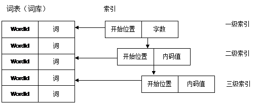
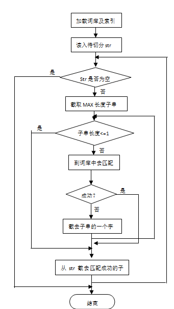

| 序号 | 修改时间   | 修改内容                 | 修改人 | 审稿人 |
| ---- | ---------- | ------------------------ | ------ | ------ |
| 1    | 2010-11-5  | 创建                     | 吴启福 |        |
| 2    | 2010-12-17 | 增加评测例子             | 同上   |        |
| 3    | 2010-12-27 | 增加语料库和评测相关信息 | 同上   |        |
| 4    | 2016-7-23  | 增加常见中文分词法       | 同上   |        |
| 5    | 2016-8-31  | 增加分词实现章节         | 同上   |        |
| 6    | 2019-5-10  | 增加机器学习分词章节     | 同上   |        |
| 7    | 2020-2-26  | 增加Jieba分词章节        | 同上   |        |
---


# 目录

[目录... 1](#_Toc8425069)

[1    中文分词简介... 2](#_Toc8425070)

[1.1    常见的中文分词法... 2](#_Toc8425071)

[1.2    常见的中文分词开源项目... 3](#_Toc8425072)

[2    中文分词实现... 5](#_Toc8425073)

[2.1    基于词库... 5](#_Toc8425074)

[2.1.1     词库组织... 5](#_Toc8425075)

[2.1.2     切分方法... 6](#_Toc8425076)

[2.1.3     切分结果的保存... 8](#_Toc8425077)

[2.1.4     经验总结... 8](#_Toc8425078)

[2.2    机器学习（条件随机场）... 9](#_Toc8425079)

[3    中文分词评测... 9](#_Toc8425080)

[3.1    评测指标... 9](#_Toc8425081)

[3.2    评测方法... 10](#_Toc8425082)

[3.3    评测示例... 10](#_Toc8425083)

[4    参考资料... 10](#_Toc8425084)

[4.1    评测相关链接... 10](#_Toc8425085)

 

 


 

# 1    中文分词简介

中文分词实现方法有**词典，规则和统计方法，**或者多种方法相互结合。

技术难点包括歧义识别，新词(未登录词)识别等。

中文分词算法大概分为两大类

1. 第一类是基于**字符串匹配**，即扫描字符串，如果发现字符串的子串和词相同，就算匹配。
    这类分词通常会加入一些启发式规则，比如“正向/反向最大匹配”, “长词优先” 等策略。
    这类算法优点是速度块，都是O(n)时间复杂度，实现简单，效果尚可。
    也有缺点，就是对歧义和未登录词处理不好。
    歧义的例子很简单"长春市/长春/药店" "长春/市长/春药/店".
    未登录词即词典中没有出现的词，当然也就处理不好。
    ikanalyzer,paoding 等就是基于字符串匹配的分词。

2. 第二类是基于统计以及机器学习的分词方式
    这类分词基于人工标注的词性和统计特征，对中文进行建模，即根据观测到的数据（标注好的语料）对模型参数进行估计，即训练。 在分词阶段再通过模型计算各种分词出现的概率，将概率最大的分词结果作为最终结果。常见的序列标注模型有HMM和CRF。
    这类分词算法能很好处理歧义和未登录词问题，效果比前一类效果好，但是需要大量的人工标注数据，以及较慢的分词速度。
    ICTCLAS是基于HMM的分词库。
    **除了标注量，准确率和效果的考量，分词粒度也是一个需要考虑的指标。**


## 1.1   常见的中文分词法

表格 1 常见中文分词方法列表

| 分词法                                     | 简介                                                         | 典型软件 |
| ------------------------------------------ | ------------------------------------------------------------ | -------- |
| 单字法 Uni-Gram                            | 按汉字单个切                                                 |          |
| 二元分词法（双字）Bi-Gram                  |                                                              |          |
| 三元组 Tri-Gram                            |                                                              |          |
| 正向最大匹配                               |                                                              |          |
| 反向最大匹配                               | 一般优于正向最大匹配。                                       |          |
| 双向匹配分词                               | 结合正向最大和逆向最大匹配。首先同时分词并比较，若不一致，按以下原则优先输出：词越少越好；分词结果越多越好。 |          |
| 隐马尔科夫模型HMM                          |                                                              |          |
| 最大熵马尔科夫模型MEMM                     |                                                              |          |
| **CRF**~Conditional Random Field条件随机场 | 基于HMM和MEMM为基础的出的一种判别式概率无向图学习模型，是一处用户标注和切分有序数据的条件概念模型。 |          |

备注：Ngram，N元切词：N为切词的长度，如N=1~单字法，N=2~二元分词法，N=3~三元组。


## 1.2   常见的中文分词开源项目

表格 2 常见Java中文分词工具简介

| 分词工具         | 支持语言                                                     | 分词原理                                                     | 词典及扩展性                                                 |
| ---------------- | ------------------------------------------------------------ | ------------------------------------------------------------ | ------------------------------------------------------------ |
| StandardAnalyzer | 中英文                                                       | 中文：单字符切分  英文：根据空格切分                         |                                                              |
| ChineseAnalyzer  | 中文，不支持中文和英文及数字混合的文本分词                   | 按字分词,与StandardAnalyzer对中文的分词没有大的区别          |                                                              |
| CJKAnalyzer      | 中文，英文，不支持中文和英文及数字混合的文本分词             | 采用的双字切分，也就是对一段文字按每两个字来进行切分         |                                                              |
| IKAnalyzer       | 英文字母、数字、中文词汇等分词处理，兼容韩文、日文字符       | 正向迭代最细粒度切分算法  (词典+文法分析）                   | 收录27万中文词汇，支持用户词典扩展定义、支持自定义停止词     |
| paoding          | 中文                                                         | 支持不限制个数的用户自定义词库                               |                                                              |
| MMAnalyzer       | 支持英文、数字、中文（简体）混合分词                         | 正向最大匹配算法                                             | 支持动态扩展                                                 |
| MMSeg4j          | 中文，包括一些字符的处理  英文、俄文、希腊、数字（包括①㈠⒈）的分出一连串的。目前版本没有处理小数字问题。 | 用 Chih-Hao Tsai 的 MMSeg 算法。MMSeg 算法有两种分词方法：Simple和Complex，都是基于正向最大匹配。在complex基础上实现了最多分词(max-word) | 强制使用 UTF-8)  使用sougou词库，也可自定义覆盖              |
| imdict           | 中文、英文、数字                                             | 隐马尔科夫模型                                               | 仅coredict核心字典、bigramdict词典，不含人名、地名词典。不支持自定义词典 |
| HanLP            |                                                              |                                                              |                                                              |

 

表格 3 常见中文分词开源工具评测表格 4

| 分词组件                 | 开发语言 | 准确率(%)  | 速度(/sec) | 主要技术      | 简介                                                         | 总评   |
| ------------------------ | -------- | ---------- | ---------- | ------------- | ------------------------------------------------------------ | ------ |
| SCWS                 | C/C++    | 90% ~  95% | 1.2MB      |               | 基于词频词典的机械中文分词引擎  http://www.ftphp.com/scws/   |        |
| ICTCLAS              | C/C++    | 98.45%     | 996KB      | Bigram+  HMM  | 中科院发布，最早和最实用的中文开源分词项目之一。张平主导。  http://ictclas.org/ | 推荐   |
| ANSJ                 | Java     |            |            |               | 孙捷，ICTCAS的JAVA版本，做了一些工程上的优化。               |        |
| HTTPCWS              | Java     |            |            |               | 基于HTTP协议的开源中文分词系统，目前仅支持Linux系统。HTTPCWS 使用“ICTCLAS 3.0 2009共享版中文分词算法”的API进行分词处理，得出分词结果。 |        |
| CC-CEDICT            | Java     |            |            |               | 提供一份以汉语拼音为中文辅助的汉英辞典, Chrome中文版就是使用的这个词典进行中文分词的。  http://cc-cedict.org/wiki/ |        |
| IK--  IKAnalyzer | Java     |            | 600KB      |               | 开源的，基于java语言开发的轻量级的中文分词工具包。采用了“正向迭代最细粒度切分算法“.  http://code.google.com/p/ik-analyzer/ | 现用   |
| Paoding              | Java     |            | 1MB        |               | Paoding  （庖丁解牛）基于Java的开源中文分词组件，提供lucene和solr 接口，具有极高效率和高扩展性 。  http://code.google.com/p/paoding/ | 可试用 |
| MMSEG4J              | Java     | 98.41%     | 1.2+MB     |               | 基于Java的开源中文分词组件，提供lucene和solr 接口. MMSeg 算法有两种分词方法：Simple和Complex，都是基于正向最大匹配。http://code.google.com/p/mmseg4j/ | 可试用 |
| 海量中文智能分词         | C        | 99.7％     | 1.67MB     |               | 商业版本  http://www.hylanda.com/pro.php?smid=20             |        |
| Jieba                    | Python   |            |            | Unigram+  HMM | 由fxsjy开源。http://python.jobbole.com/86603/                |        |
| LTP                      |          |            |            | SP            | 哈工大2011年开源。  SP~结构化感知器                          |        |
| FNLP                     | Java     |            |            | PA            | 复旦大学2014年开源。  PA~Passive-Aggressive                  |        |
| THUAC                    |          |            |            | SP            | 清华大学2016年开源。                                         |        |
| HanLP                    | Java     |            |            |               |                                                              |        |

 

**SCWS**

　　Hightman开发的一套基于词频词典的机械中文分词引擎，它能将一整段的汉字基本正确的切分成词。采用的是采集的词频词典，并辅以一定的专有名称，人名，地名，数字年代等规则识别来达到基本分词，经小范围测试大概准确率在 90% ~ 95% 之间，已能基本满足一些小型搜索引擎、关键字提取等场合运用。45Kb左右的文本切词时间是0.026秒，大概是1.5MB文本/秒，支持PHP4和PHP 5。

 

**ICTCLAS**

　　这可是最早的中文开源分词项目之一，ICTCLAS在国内973 专家组组织的评测中活动获得了第一名，在第一届国际中文处理研究机构SigHan组织的评测中都获得了多项第一名。ICTCLAS3.0分词速度单机 996KB/s，分词精度98.45%，API不超过200KB，各种词典数据压缩后不到3M.ICTCLAS全部采用C/C++编写，支持Linux、 FreeBSD及Windows系列操作系统，支持C/C++、C#、Delphi、Java等主流的开发语言。

 

**IK**

　　IKAnalyzer 是一个开源的，基于java语言开发的轻量级的中文分词工具包。从2006年12月推出1.0版开始，IKAnalyzer 已经推出了3个大版本。最初，它是以开源项目Luence为应用主体的，结合词典分词和文法分析算法的中文分词组件。新版本的IKAnalyzer3.0则发展为面向Java的公用分词组件，独立于Lucene项目，同时提供了对Lucene的默认优化实现。

 

**Paoding**

　　 Paoding （庖丁解牛）基于Java的开源中文分词组件，提供lucene和solr 接口，具有极 高效率 和 高扩展性 。引入隐喻，采用完全的面向对象设计，构思先进。高效率：在PIII 1G内存个人机器上，1秒可准确分词100万汉字。 采用基于不限制个数 的词典文件对文章进行有效切分，使能够将对词汇分类定义。能够对未知的词汇进行合理解析

 

**MMSEG4J**

　　 MMSEG4J 基于Java的开源中文分词组件，提供lucene和solr 接口.

1）、mmseg4j 用 Chih-Hao Tsai 的 MMSeg 算法实现的中文分词器，并实现lucene的analyzer 和solr的TokenizerFactory 以方便在Lucene和Solr中使用。2）、MMSeg 算法有两种分词方法：Simple和Complex，都是基于正向最大匹配。Complex 加了四个规则过虑。官方说：词语的正确识别率达到了98.41%。mmseg4j 已经实现了这两种分词算法。

 

# 2    中文分词实现

## 2.1   基于词库

### 2.1.1 词库组织

本人采用的是基于词表匹配的分词方法，因而词库是分词系统的基础。整个分词过程实际上就是在词词上的查找匹配过程，因而词库的组织相当重要。

对于词表存放在一个文本文件里，每一个词条由两项组成，一个是词的ID（WordId）、另一个就是词本身。同时在词表上加上静态索引，本人对词表进行分组管理并在上面添加三级索引。首先对词条按字数分组，字数相同的词条放在同一组里，并对词表按首汉字的内码从小到大排序。一级索引是加在各个分组上，一级索引记录了各分组的开始位置，再根据下一分组的起始位置可以确定当前分组的终止位置。二级索引是加在一级索引内部的，在同一组内部由于有很多的词条，二级索引是按词的首汉字内码建立的，它加在以不同汉字开头的词条组中，这样通过三级索引可以进一步缩小查找范围。另外在汉字中以有些字开头的词条过多，这样进行匹配的次数过多，不利于提高匹配速度。因而在二级索引的基础之上添加一个三级索引，它是按照一定的密度间隔添加，我设定了一个默认的合理的值就是每隔50个词条添加一个三级索引，同样三级索引也是根据汉字内码添加的（三级索引和二级索引的定义相同）。词条及索引的定义如下：

//根据汉字内码建立的索引结点（二级和三级索引）
```c
   typedef struct CodeIndexNode{
    char KeyValue[17];
    int nIndex;
   }CodeIndex;
    
   //根据词语字数建立的一级索引结点
   typedef struct WordsIndexNode{
    int nKeyCount;
    int nKeyBeginIndex;
    int nKeyEndIndex;
    int CodeIndexCount;
    CArray<CodeIndexNode*,CodeIndexNode*>HexIndex;
   }WordsIndex;
    
   //关键字结点
   typedef struct KeyWordNode{
    CString strKeyWord; //关键字
    int       nID;          //关键字ID
   };
```


词表及一级、二级、三级索引之间的关系如下图所示：

|      |                                                            |
| ---- | ---------------------------------------------------------- |
|      |  |

 


### 2.1.2 切分方法

由于采用的是基于词库匹配的正向最大匹配算法（通常简称为MM法），其基本思想为：设D为词典，MAX表示D中的最大词长，str为待切分的字串。MM法是每次从str中取长度为MAX的子串与D中的词进行匹配。若成功，则该子串为词，指针后移MAX个汉字后继续匹配，否则子串逐次减一进行匹配。所以主要切词过程如下：(流程图如下图所示)



 

 

1）、读取词库，并读取相应的静态索引，建立词库上的索引；

2）、读取待切分的字串str；

3）、从待切分字串str中取出一个长度为MAX的子串sstr，到词典中去匹配，若匹配成功则取下一个长度为MAX的子串进行匹配，否则将子串sstr从后面截去一个字后继续匹配，直到匹配成功或者子串sstr中只有一个字为止。若匹配成功则从匹配成功的词的位置开始再截取下一长度为MAX的子串sstr进行匹配，依次循环直到将str串匹配完为止。

4）匹配过程：首先根据子串sstr的长度（这里指的是字数）确定一级索引也就是确定分组，这个过程可以二分查找法，也可以采用Hash函数直接定位，但是由于分组数很少（不会超过20）因而两种方法没有多大的区别。在确定了分组后再根据首汉字的内码确定二级索引，因为二级索引是按内码从小到大的顺序因而可采用拆半查找方法，找到以后再确定三级索引，这样将进行匹配的过程缩小到一个很小的范围，在这个范围内匹配不成功则进行下一个串的匹配。通过确定三级索引确定了进行匹配的最小词条集。

### 2.1.3 切分结果的保存

切分结果也就是顺排档数据的保存。

由于数据量很大，不能全存放在内存中，所以每处理完一文档就将其切分结果存放到外部文件中，这里可以借助其它关系型数据库，这有利于于索引器导出数据将其导成倒排档索引文件。主要用到的结构体定义如下：
```c
//Hit结点
typedef struct HitNode{
    int   nPos;//位置
    HitNode* pNext;//下一hit指针
};
    
//文档列表结点
typedef struct DocListNode{
    _int64  nDocID;//DOC ID
    int    nHits;//词出现的次数
    float   fWeight;//词在文中的要重
    HitNode* pHitHead;//Hit链表头指针
    DocListNode* pNext;
};
    
//一级索引结点
typedef struct LexIconNode{
    int             nKeyWordID;//关键字ID
    int             nDocs;//文档数
    DocListNode* pDocListHead;//文档链表头指针
    LexIconNode* pNext;
};
```
在数据库中存放的字段主要有：DocID、WordID、Hit（位置）、Weight（权值）。这样索引器导出时将会按WordID和权值进行排序。

### 2.1.4 经验总结

**1、** **存在的问题**

1）、在词库组织方面采用静态的索引不利于于词库的变化，若有一新词出现，则需要重建整个词库的索引，因为下标都发生了变量。这不利于词库的扩充。

2）、词的ID分配机制也有些不足，这里的ID都是跟词的内码相关，也就是跟词在词库中的排序顺序有关，这样若有新词添加进来后，就会改变其后面所有词的ID。

3）、切词的速度不够快，虽然每秒能达到400多字，但是词库比较小，只有5万多的词条。若司库很大时速度会有所下降。

4）、因为汉字是双字节表示的，所以在切分之前转换成Unicode，转换成多字节表示，经过测试发现，多字节转换占用了很大一块CPU时间，将近占去了40%的时间。

5）、在进行多字节转换时开设的缓冲区为1000个汉字，若需要转换的汉字多于1000则会出错，但若开设的缓冲区过大是对系统资源的浪费。

6）、是一种机械的切词方法，没有对歧义词进行排除和分析。

7）、没有新词的识别功能，也就是不通过词典不能识别切分出新的词。

 

**2、** **改进的方向**

1）、词表组织

在词表上添加三级索引是一个较好的方法，但是采用静态的索引不利于词库的扩充，因而词库的索引可动态生成，在读取词库的同时构建索引，但是这种方法对于查询器会产生一个不利影响，因为查询器也需要读取词库而构建索引的过程比较费时间，这样用户查询时会有一定的延时，所以应根据需要采用一种折衷的办法。

整个切词过程实际就是在词表上的查找过程，而词表相当于就是一个查找表，所以这个查找表的组织相当关键，它决定切分的速度。所以在这个查找表上必须添加索引来加快速度，本人觉得可以根据各词的前两个汉字的内码建立一个Hash函数索引，这样即不需要分组也不需要用二分法来查找，直接定位肯定会减少进行匹配的次数。但需要解决冲突问题，因为有的词属于其他词的前向子串。

2）、词条ID分配

​     词条ID(WordId)可按入库的先后顺序递增，不管其内码。但是入库后应该按其内码插入到适当的位置。但是在建立倒排档索引数据时应该按WordID从小到大排序，这样对于查询器可以根据WordID用Hash函数直接定位到相应的读取位置。

3）、多字节转换问题

​     多字节转换需要将所有的待切分串都转换成多字节表示，这个过程相当费时，若不需要转换直接切分则会大大提高速度，对于纯汉字的字串可以这样做，但是有中英文混合的字符串就不太适合，因为英文字符只占一个字节表示，这样会出现将一个当字从中间切开。这样字符串移位时先判断其是否是Ansi码，若是则移一个字节，若不是则移两个字节。

4）、歧义识别

5）、新词识别

​     新词的识别，可以按词频统计的方法，若某一字串出现的次数高于某一频率时可以认为一个词，将其切分出来。

 

## 2.2   机器学习

### 2.2.1 简介

* 判别式模型：通过判别函数产生预测模型进行预测。
* 产生式模型：通过概率密度模型形成产生式模型进行预测。

表格 5 判别式和产生式模型比较

| 模型       | 优点                                                         | 缺点                                                         |
| ---------- | ------------------------------------------------------------ | ------------------------------------------------------------ |
| 判别式模型 | 数据信息相对丰富，研究单类别问题灵活性较强。  能够充分利用先验数据。  模型可以通过增量学习的方式获得。 | 学习过程相对复杂。  在目标分类的问题中容易产生较大的错误率。 |
| 产生式模型 | 分类边界比较灵活，适用于多类别问题研究。  能够较好地分辨出类别之间的差异特征。 | 不能反映训练样本的本身特性。  描述信息具有一定局限性。       |

备注：产生式模型可以通过贝叶斯公式转换为判别式模型，反之则不行。

 

### 2.2.2 CRF 条件随机场

条件随机场的分词步骤：

1）准备语料库。

2）初步语料库特征学习。序列标注状态~BMES

3）词语特征学习。

4）分词。

 

## 2.3 Jieba分词（Python）

### 简介

**依赖包**：`pip install jieba`

**主要功能**：分词、自定义词典、词性标注、关键词抽取、并行分词（类Unix）

**特色**： 支持繁体分词、MIT 授权协议

支持三种分词模式：

- 精确模式，试图将句子最精确地切开，适合文本分析；
- 全模式，把句子中所有的可以成词的词语都扫描出来, 速度非常快，但是不能解决歧义；
- 搜索引擎模式，在精确模式的基础上，对长词再次切分，提高召回率，适合用于搜索引擎分词。

**在线演示：**http://jiebademo.ap01.aws.af.cm/

**网站代码**：https://github.com/fxsjy/jiebademo


**算法：**  Bigram + HMM

- 基于前缀词典实现高效的词图扫描，生成句子中汉字所有可能成词情况所构成的有向无环图 (DAG)
- 采用了动态规划查找最大概率路径, 找出基于词频的最大切分组合
- 对于未登录词，采用了基于汉字成词能力的 HMM 模型，使用了 Viterbi 算法


### 示例

表格 Jieba主要功能和函数

| 功能       | 函数                                                         | 参数                                                         | 功能                                                         |
| ---------- | ------------------------------------------------------------ | ------------------------------------------------------------ | ------------------------------------------------------------ |
| 分词       | cut(self, sentence, cut_all=False, HMM=True)/<br>lcut        | sentence需要分词的字符串；cut_all 参数用来控制是否采用全模式；HMM 参数用来控制是否使用 HMM 模型 | 切词。cut=                                                   |
|            | cut_for_search/<br>lcut_for_search                           | 二个参数：需要分词的字符串；是否使用 HMM 模型。              | 该方法适合用于搜索引擎构建倒排索引的分词，粒度比较细         |
|            | Tokenizer(dictionary=DEFAULT_DICT)                           | `jieba.dt` 为默认分词器，所有全局分词相关函数都是该分词器的映射。 | 新建自定义分词器，可用于同时使用不同词典。                   |
| 自定义词典 | load_userdict(file_name)                                     | file_name 为文件类对象或自定义词典的路径。`file_name` 若为路径或二进制方式打开的文件，则文件必须为 UTF-8 编码。 | 词典格式和 `dict.txt` 一样，一个词占一行；每一行分三部分：词语、词频（可省略）、词性（可省略），用空格隔开，顺序不可颠倒。词频省略时使用自动计算的能保证分出该词的词频。 |
|            | add_word(word, freq=None, tag=N)                             |                                                              | 添加新词到词典                                               |
|            | del_word(word)                                               |                                                              | 删除词典的词语                                               |
|            | suggest_freq(self, segment, tune=False)                      |                                                              | 可调节单个词语的词频，使其能（或不能）被分出来。自动计算的词频在使用 HMM 新词发现功能时可能无效。 |
| 词性标注   | import jieba.posseg as pseg <br>pseg.cut(sentence, HMM=True) |                                                              | word, flag<br>示例：李小福 / nr , 是 / v， 创新办 / i , 主任 / b , |
| 关键词抽取 | import jieba.analyse<br>jieba.analyse.extract_tags(sentence, topK=20, withWeight=False, allowPOS=()) |                                                              | 基于 TF-IDF 算法的关键词抽取                                 |
|            | jieba.analyse.textrank(content, topK=topK)                   |                                                              | 基于 TextRank 算法 的关键词抽取                              |

备注：1. 分词： cut返回可迭代类型generator，lcut返回列表。

2. 自定义词典：自定义调节词典解决歧义分词问题。

3. 更改分词器（默认为 `jieba.dt`）的 `tmp_dir` 和 `cache_file` 属性，可分别指定缓存文件所在的文件夹及其文件名，用于受限的文件系统。

4. 并行分词：原理：将目标文本按行分隔后，把各行文本分配到多个 Python 进程并行分词，然后归并结果，从而获得分词速度的可观提升。基于 python 自带的 multiprocessing 模块，目前暂不支持 Windows。

   ```python
   # 例子：https://github.com/fxsjy/jieba/blob/master/test/parallel/test_file.py
   jieba.enable_parallel(4) # 开启并行分词模式，参数为并行进程数
   jieba.disable_parallel() # 关闭并行分词模式
   ```

5. 延迟加载机制：`import jieba` 和 `jieba.Tokenizer()` 不会立即触发词典的加载，一旦有必要才开始加载词典构建前缀字典。如果你想手工初始 jieba，也可以手动初始化`jieba.initialize()`。


类C函数  （2个分词器： POSTokenizer， Tokenizer-缺省）

```python
# default Tokenizer instance
dt = Tokenizer()

# global functions
get_FREQ = lambda k, d=None: dt.FREQ.get(k, d)
add_word = dt.add_word
calc = dt.calc
cut = dt.cut   # def cut(self, sentence, cut_all=False, HMM=True):
lcut = dt.lcut
cut_for_search = dt.cut_for_search
lcut_for_search = dt.lcut_for_search
del_word = dt.del_word
get_DAG = dt.get_DAG
get_dict_file = dt.get_dict_file
initialize = dt.initialize
load_userdict = dt.load_userdict
set_dictionary = dt.set_dictionary	# 设置主词典路径
suggest_freq = dt.suggest_freq
tokenize = dt.tokenize # def tokenize(self, unicode_sentence, mode="default", HMM=True):
user_word_tag_tab = dt.user_word_tag_tab
```

示例1：分词 （三种分词模式：精确、全、搜索引擎）

```python
import jieba
# 全模式
text = "我来到北京清华大学"
seg_list = jieba.cut(text, cut_all=True)
print(u"[全模式]: ", "/ ".join(seg_list))
 
# 精确模式
seg_list = jieba.cut(text, cut_all=False)
print(u"[精确模式]: ", "/ ".join(seg_list))
 
# 默认是精确模式
seg_list = jieba.cut(text)
print(u"[默认模式]: ", "/ ".join(seg_list))
 
# 搜索引擎模式
seg_list = jieba.cut_for_search(text)
print(u"[搜索引擎模式]: ", "/ ".join(seg_list))
 
### 运行结果
Building prefix dict from the default dictionary ...
Dumping model to file cache C:\Users\keefe\AppData\Local\Temp\jieba.cache
Loading model cost 1.436 seconds.
Prefix dict has been built succesfully.
[全模式]: 我/ 来到/ 北京/ 清华/ 清华大学/ 华大/ 大学
[精确模式]: 我/ 来到/ 北京/ 清华大学
[默认模式]: 我/ 来到/ 北京/ 清华大学
[搜索引擎模式]: 我/ 来到/ 北京/ 清华/ 华大/ 大学/ 清华大学
```


示例2：dict.txt

```shell
创新办 3 i
云计算 5
凱特琳 nz
台中
```

示例3： 词性标注

```python
    import jieba.posseg as pseg
    test_sent = ("李小福是创新办主任也是云计算方面的专家")
    result = pseg.cut(test_sent)    # 词性标注
    for w in result:
    	print(w.word, "/", w.flag, ", ", end=' ')
```


## 本章参考

[1]:  https://blog.csdn.net/qq_22022063/article/details/78987531 "Python jieba分词知识整合"
[2]: http://www.cnblogs.com/baiboy/p/jieba1.html "《结巴中文分词官方文档分析》"
[3]:   http://www.cnblogs.com/baiboy/p/jieba2.html  " 《结巴中文分词源码分析》"


# 3    中文分词评测

## 3.1   评测指标

参照 信息检索IR系统的评测指标。

| 评价指标        | 说明                                                  |
| --------------- | ----------------------------------------------------- |
| 准确率PRECISION | 给定分词结果中切分正确的词次数/应分词结果中的总词次数 |
| 召回率Recall    | 给定分词结果中切分正确的词次数/标准答案中的总词次数   |
| F值             | (P+R)/2                                               |
| 分词速度        |                                                       |

一个好的中文分词应该是上述指标的平衡。

 

## 3.2   评测方法

使用相同的评测系统。

 

## 3.3   评测示例

 

 

# 4    参考资料

[1].   李晓明等著 搜索引擎：原理、技术与系统 科学出版社 2005
[2].   搜索引擎系统学习与开发总结-相生昌 中国知网数图研发部 2005.4.18
[3].   张华平.ICTCLAS[EB/OL]. [2009-08-15].http://mtgroup.ict.ac.cn/~zhp/ICTCLAS.htm. 2002.
[4].   黄昌宁.赵海 [中文分词十年回顾 ](http://d.wanfangdata.com.cn/ExternalResource-jsjyy201008012^1.aspx) 中文信息学报, 2007(3)
[5].   Lucene 3.0 的几种分词系统 http://hi.baidu.com/wk19/blog/item/e77ffc43dc18121c9213c624.html
[6].   常见中文分词开源项目http://com1com4.javaeye.com/blog/707853

 

## 4.1   评测相关链接

[TREC](http://trec.nist.gov/)

由美国国防部高等研究计划署(DARPA)与美国国家标准和技术局(NIST)共同举办的TREC(文本信息检索会议)就是一直基于此方法组织信息检索评测和技术交流论坛。提供跨语言检索(CLIR)、博客、问答系统等多个track的评测及相关数据。

 

[ACL SIGHAN](http://www.sighan.org/) (无法访问)

中文信息处理评测。

 

[NTCIR (NACSIS Test Collections for IR)](http://research.nii.ac.jp/ntcir/)

其目的是希望能建立一个日文标准测试集，作为咨询检索与自然语言处理研究的基础预料。NTCIR-5开始，加入繁体中文(Big-5)测试集。

 

[中文Web信息检索论坛](http://www.cwirf.org/)

由国内北大天网和北大计算语言所合办，提供中文网页检索、中文网页分类和垃圾邮件评测。
    - Chinese Web Information Retrieval Forum, http://www.cwirf.org/
    - Symposium of Search Engine and WebMining, http://net.pku.edu.cn/~sewm/

 

[搜狗实验室 ](http://www.sogou.com/labs/resources.html)

​     号称打造最权威的中文信息处理数据提供和评测平台。[2007.3—2008]

 

