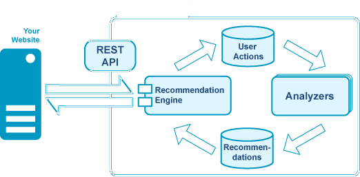

| 序号 | 修改时间   | 修改内容                                         | 修改人 | 审稿人 |
| ---- | ---------- | ------------------------------------------------ | ------ | ------ |
| 1    | 2013-08-05 | 创建                                             | Keefe  | Keefe  |
| 2    | 2017-1-18  | 将《大数据开发》推荐系统章节移动至此。           | 同上   |        |
| 3    | 2023-3-17  | 将《推荐系统设计书》和推荐算法章节合并单独成文。 | 同上   |        |

   

---

[TOC]

 

---

# 1 推荐系统原理

推荐系统模块组成：用户行为记录模块，分析用户喜好的模型分析模块和推荐算法模块．

* 

## 1.1 推荐的分类

**推荐系统算法常见分类**

* 关联规则挖掘。基于频繁集的挖掘。范围是所有用户和商品直接挖掘。
* 协同过滤CF~collaborative filtering。基于产品或用户之间的相似性，其中，我们使用余弦相似性。思想是首先利用用户的历史信息**计算相似性**，然后利用与目标用户相似性极高的邻居对其它产品的评价来预测目标用户对特定产品的喜好程序．系统根据这喜好度来对目标用户进行推荐．(产品的评价意见)
  * 基于用户-产品的CF（UCF)
  * 基于产品-产品的CF（ICF）
  * 基于模型的CF：基于矩阵分解，其中，我们使用SVD来分解矩阵。
* 基于内容的推荐Content-based。思想是对用户和产品分别生成配置文件，根据产品使用情况更新用户配置文件，用分类方法来得到用户的关联性。基于内容的推荐不需要用户评价数据，解决了冷启动问题。
* 基于记忆的算法
* 基于用户的推荐。范围是用户相似的用户和他们感兴趣的信息。
* 基于协同tag推荐。就是用户的兴趣点和商品特征和匹配对应。(用户-产品)

### 1.1.1 基于内存的协同过滤

基于内存的协同过滤方法可以分为两个主要部分：用户-产品协同过滤和产品-产品协同过滤。

一个用户-产品协同过滤将选取一个特定的用户，基于打分的相似性发现类似于该用户的用户，并推荐那些相似用户喜欢的产品。相比之下，产品-产品协同过滤会选取一个产品，发现喜欢该产品的用户，并找到这些用户或相似的用户还喜欢的其他的产品。输入一个产品，然后输出其他产品作为推荐。

- 用户-产品协同过滤: “喜欢这个东西的人也喜欢……”
- 产品-产品协同过滤: “像你一样的人也喜欢……”

在这两种情况下，从整个数据集构建一个用户-产品矩阵。

在构建了用户-产品矩阵后，计算相似性并创建一个相似性矩阵。

- 在产品-产品协同过滤中的产品之间的相似性值是通过观察所有对两个产品之间的打分的用户来度量的。
- 对于用户-产品协同过滤，用户之间的相似性值是通过观察所有同时被两个用户打分的产品来度量的。

基于内存的CF的缺点是，它不能扩展到真实世界的场景，并且没有解决众所周知的冷启动问题，也就是当新用户或新产品进入系统时。基于模型的CF方法是可扩展的，并且可以比基于内存的模型处理更高的稀疏度，但当没有任何评分的用户或产品进入系统时，也是苦不堪言的。

CF的常用方法有三种，分别是

- 欧式距离法、
- 皮尔逊相关系数法、
- 余弦相似度法。

### 1.1.2 基于模型的协同过滤

基于模型的协同过滤是基于矩阵分解（MF），它已获得更大的曝光，它主要是作为潜变量分解和降维的一个无监督学习方法。矩阵分解广泛用于推荐系统，其中，它比基于内存的CF可以更好地处理与扩展性和稀疏性. MF的目标是从已知的评分中学习用户的潜在喜好和产品的潜在属性（学习描述评分特征的特征），随后通过用户和产品的潜在特征的点积预测未知的评分。

### 1.1.3 基于内容的推荐

## 1.2 推荐算法

### 关联规则

**目的**：给定一组记录，记录由项目组成，获取项目之间的依赖关系．如购物分析，推荐系统．

**衡量准则**: 支持度（Support）和置信度（Confidence）等

表格 6 常用关联规则算法列表

| 算法       | 算法描述                                                     |
| ---------- | ------------------------------------------------------------ |
| Apriori    | 最常用的。其核心思想是通过连接产生候选项及其支持度然后通过剪枝生成频繁项集。 |
| FP-Tree    | 针对Apriori算法的固有的多次扫描事务数据集的缺陷，提出的不产生候选频繁项集的方法。 |
| Eclat      | 深度优先算法，采用垂直数据表示形式，在概念格理论的基础上利用基于前缀的等价关系将搜索空间划分为较小的子空间。 |
| 灰色关联法 | 分析和确定各因素之间的影响程度或是若干个子因素（子序列）对主因素（母序列）的贡献主而进行的一种分析方法。 |

#### Apriori算法

**算法说明：**

对于一条关联规则L->R，我们常用支持度（Support）和置信度（Confidence）来衡量它的重要性。规则的支持度是用来估计在一个购物篮中同时观察到L和R的概率P(L,R)，而规则的置信度是估计购物栏中出现了L时也出会现R的条件概率P(R|L)。关联规则的目标一般是产生支持度和置信度都较高的规则。

Apriori算法对于一条规则L->R，有以下度量：

* 支持度（Support）同时观察到L和R的概率P(L,R)
* 置信度（Confidence）出现了L时也出会现R的条件概率P(R|L)
* Lift（提升度）： P(L,R)/(P(L)P(R))
* Leverage（杠杆）：P(L,R)-P(L)P(R)
* Conviction（判断度?）：P(L)P(!R)/P(L,!R)

说明：以上度量中，支持度，置信度和conviction越大越好。当Lift=1, Leverage=0时说明L与R是独立事件。

## 1.3 推荐架构

   

图 1 推荐系统的基本结构

推荐方法：协同过滤CF, 基于内容，基于知识，混合推荐

数据输入：用户记录和上下文，群体数据，产品特征

推荐分为大众推荐和个性化推荐。

常规特征：View/Buy/Ratiing

目前无评分无购买，仅基于浏览历史记录进行推荐。

## 1.4 质量评价

精准率、召回率

## 本章参考

1. amazon.com recommendations Item-to-Item Collaborative_Filtering.pdf
2. Explaining Collaborative Filtering Recommendations.pdf
3. Item-based collaborative filtering recommendation_algorithms.pdf
4. 一种基于用户筛选的推荐算法.ppt
5. 个性化推荐系统的研究进展.pdf
6. The Structure of Collaborative Tagging Systems .pdf
7. 阿里云数加推荐系统 https://help.aliyun.com/document_detail/30369.html  

  

# 2 推荐实例

## 需求列表

| 类别 | 推荐项                                            |
| ---- | ------------------------------------------------- |
| 游戏 | 1) 最近玩过的页游 		2) 		热门页游推荐 |
| 影视 |                                                   |
| 生活 |                                                   |

## 案例1：新闻个性化推荐

场景：用户浏览一条新闻，向他推荐热门新闻或者与当前浏览新闻相似的新闻。

目的：根据用户的历史浏览纪录，预测他下一次的浏览纪录。

输入（数据集）：{user, news_id, news_time, news_title, 看的日期date}

输出：

处理过程：

1）提取某天的热词

## 案例2：电影推荐

数据集：[MovieLens](http://grouplens.org/datasets/movielens/) http://grouplens.org/datasets/movielens/

[ml-20m.zip](http://files.grouplens.org/datasets/movielens/ml-20m.zip) (size: 190 MB, [checksum](http://files.grouplens.org/datasets/movielens/ml-20m.zip.md5))

## 案例3：电商推荐

## 本章参考

1. 协同过滤介绍和简单推荐系统的实现（电影）http://blog.csdn.net/database_zbye/article/details/8664516
2. 在Python中实现你自己的推荐系统http://python.jobbole.com/85516/  
3. 用Python实现一个简单的基于内容的推荐引擎 http://python.jobbole.com/85927/  
4. 用Python实现协同过滤的教程 http://www.jb51.net/article/63730.htm  
5. 新闻个性化推荐系统(python)-（附源码 数据集） http://blog.csdn.net/buptgshengod/article/details/39529321  

  

# 3 接口设计

提供两种方式，一是REST;　二是JS.

请求：url

返回串：JSON或XML串

## 3.1 REST API 

Http get方式。

http://localhost:8080/easyrec-web/api/1.0/[method]

http://localhost:8080/easyrec-web/api/1.0/json/[method]

示例：

  

# 参考资料

* 电影评分数据 http://grouplens.org/datasets/movielens/   CreateDate: 2013-8-4
* 百分点推荐引擎——从需求到架构  https://www.infoq.cn/article/baifendian-recommendation-engine  2011.11
* 百分点亿级个性化推荐系统的发展历程和实践架构  https://mp.weixin.qq.com/s?__biz=MzU1NDA4NjU2MA==&mid=2247486421&idx=1&sn=6121341f34db802aa578b76155f8dcd2  2016.9
* 推荐算法设计综述 https://zhuanlan.zhihu.com/p/69478126
* 常用推荐算法（50页干货）  https://mp.weixin.qq.com/s/Vt33mLS_P9s4yy_fvNRXfw

  

# 附录

## open-source

### MyMediaLite~推荐系统的算法库

[MyMediaLite](http://www.oschina.net/p/mymedialite) 是一个轻量级的多用途的推荐系统的算法库。
它解决了两个最常见的场景的协同过滤：

* 评分预报 (1-5)
* 通过一些隐式的反馈进行预测

### Myrrix~开源推荐系统

[Myrrix](http://www.oschina.net/p/myrrix)是一个完整的、实时的、可扩展的集群和推荐系统，基于Mahout实现。 主要架构分为两部分：

* 服务层：在线服务，响应请求、数据读入、提供实时推荐；
* 计算层：用于分布式离线计算，在后台使用分布式。

Myrrix优点

1. No Ratings.
   Myrrix提供了一个广义的模型，可以处理任何事件，不止是评分，还可以是点击、浏览等。
2. Cold Start.
   Myrrix基本上解决了用户冷启动问题，当用户第一个行为数据进入Myrrix后推荐就会生成。
3. Temporary Users.
   Myrrix提供了特殊的支持为游客进行推荐。
4. Non-numeric Data.
   Myrrix中不用再像Mahout中那样硬性规定userID或itemID必须是数字，userID也可以用字符串表示，例如“Jane”。
5. Privacy & Security.
   Myrrix中可以不用将真实的用户或物品数据发送给服务端，代替做法客户端可以发送不透名的散列。

### easyrec—java

http://my.oschina.net/wxcchd/blog/140207
http://blog.csdn.net/gaojiewang/article/details/8065727
easyrec是一个易于使用、易于集成、易于维护的开源推荐系统。easyrec是一个用java编写的web应用。根据esayrec提供的API，我们可以很容易地将easyrec集成到自己的应用中来实现个性化推荐，并且可以集成多个应用。

### apache mahout

apache mahout，一个实现很多推荐和学习算法的基础框架，能够和hadoop集成.

### duine

一个开源的推荐系统框架，没有深入学习。因为我觉得跟mahout类似。