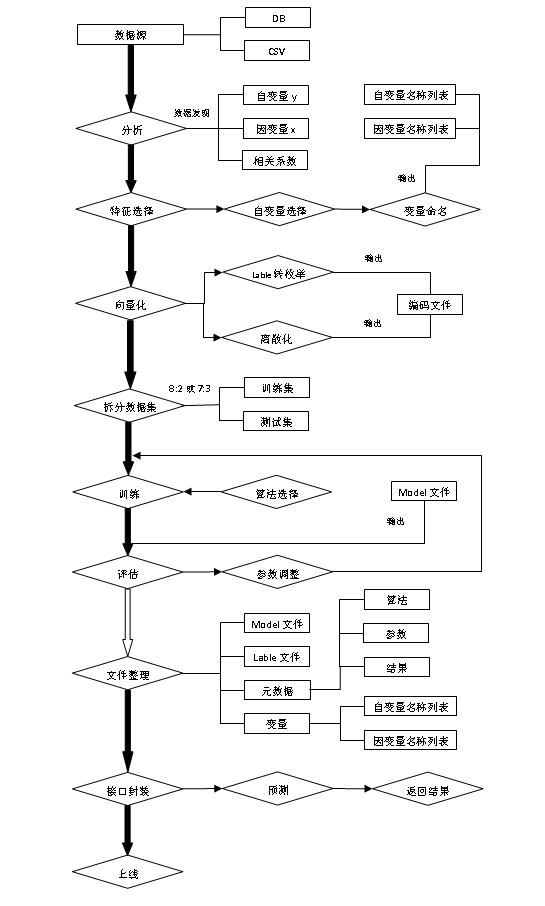
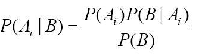
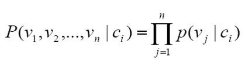
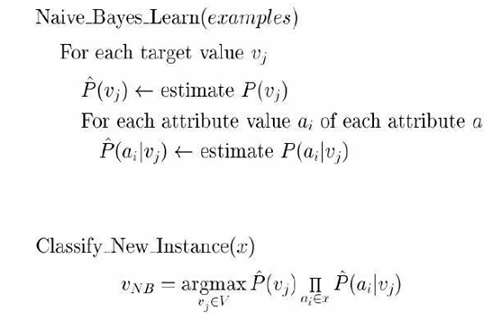
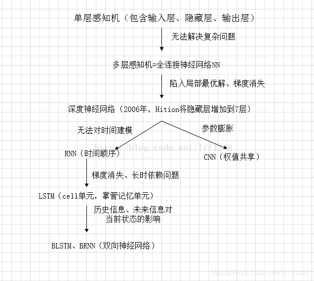
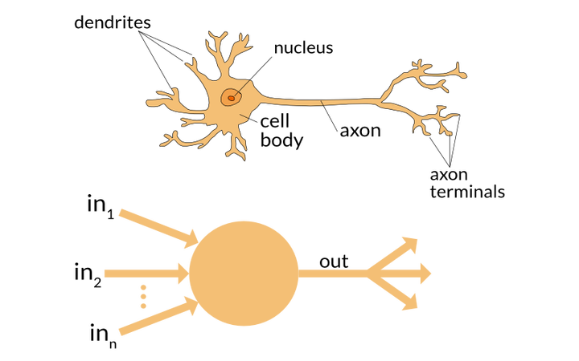
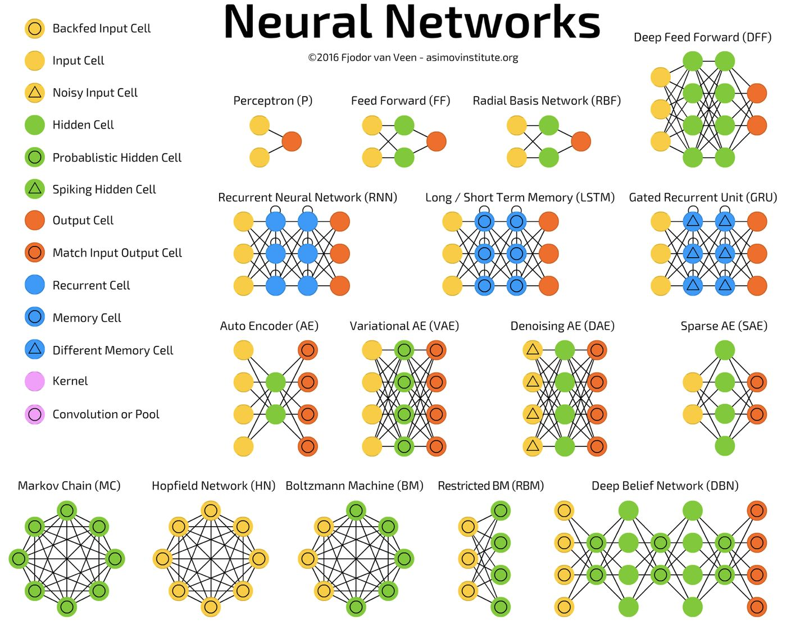

| 序号 | 修改时间   | 修改内容                             | 修改人 | 审稿人 |
| ---- | ---------- | ------------------------------------ | ------ | ------ |
| 1    | 2021-12-20 | 创建。从《AI笔记》迁移相关章节成文。 | Keefe  |        |

 

---

[TOC]

 

---

# 1 简介

机器学习是经典符号主义和联结主义的结合．它是人工智能AI一个极重要的研究领域。

* 机器学习：MachineLearning，简称ML。一种实现人工智能的方法。
* 深度学习：DeepLearning，简称DL。一种实现机器学习的技术。

 

# 2  机器学习 ML

程序 = 算法＋数据结构＋领域知识

编程人员  + 知识工程师  + 领域专家expert

机器学习的任务是通过一定的学习算法来达到改进智能体未来的行动能力。

样本 + 背景知识： 学习算法，概念描述

学习算法可分为二类，一是黑箱法；二是基于知识的方法。AQ－主动覆盖．

## 2.1   机器学习简介

### 2.1.1 机器学习流程

历史数据 --> 建模（建模、模型评价、模型优化） --> 预测（新数据）

 

图 2 机器学习流程图

接下来根据流程图，逐步分析机器学习的流程。

**1.** **数据源：**

机器学习的第一个步骤就是收集数据，这一步非常重要，因为收集到的数据的质量和数量将直接决定预测模型是否能够建好。我们可以将收集的数据去重复、标准化、错误修正等等，保存成数据库文件或者csv格式文件，为下一步数据的加载做准备。

**2.** **分析：**

这一步骤主要是数据发现，比如找出每列的最大、最小值、平均值、方差、中位数、三分位数、四分位数、某些特定值（比如零值）所占比例或者分布规律等等都要有一个大致的了解。了解这些最好的办法就是可视化，谷歌的开源项目facets可以很方便的实现。另一方面要确定自变量(x1...xn)和因变量y，找出因变量和自变量的相关性，确定相关系数。

**3.** **特征选择：**

特征的好坏很大程度上决定了分类器的效果。将上一步骤确定的自变量进行筛选，筛选可以手工选择或者模型选择，选择合适的特征，然后对变量进行命名以便更好的标记。命名文件要存下来，在预测阶段的时候会用到。

**4.** **向量化：**

向量化是对特征提取结果的再加工，目的是增强特征的表示能力，防止模型过于复杂和学习困难，比如对连续的特征值进行离散化，label值映射成枚举值，用数字进行标识。这一阶段将产生一个很重要的文件：label和枚举值对应关系，在预测阶段的同样会用到。

**5.** **拆分数据集：**

需要将数据分为两部分。用于训练模型的第一部分将是数据集的大部分。第二部分将用于评估我们训练有素的模型的表现。通常以8:2或者7:3进行数据划分。不能直接使用训练数据来进行评估，因为模型只能记住“问题”。

**6.** **训练：**

进行模型训练之前，要确定合适的算法，比如线性回归、决策树、随机森林、逻辑回归、梯度提升、SVM等等。选择算法的时候最佳方法是测试各种不同的算法，然后通过交叉验证选择最好的一个。但是，如果只是为问题寻找一个“足够好”的算法，或者一个起点，也是有一些还不错的一般准则的，比如如果训练集很小，那么高偏差/低方差分类器（如朴素贝叶斯分类器）要优于低偏差/高方差分类器（如k近邻分类器），因为后者容易过拟合。然而，随着训练集的增大，低偏差/高方差分类器将开始胜出（它们具有较低的渐近误差），因为高偏差分类器不足以提供准确的模型。

**7.** **评估：**

训练完成之后，通过拆分出来的训练的数据来对模型进行评估，通过真实数据和预测数据进行对比，来判定模型的好坏。模型评估的常见的五个方法：混淆矩阵、提升图&洛伦兹图、基尼系数、ks曲线、roc曲线。混淆矩阵不能作为评估模型的唯一标准，混淆矩阵（详见 模型评估章节）是算模型其他指标的基础。

完成评估后，如果想进一步改善训练，我们可以通过调整模型的参数来实现，然后重复训练和评估的过程。

**8.** **文件整理：**

模型训练完之后，要整理出四类文件，确保模型能够正确运行，四类文件分别为：Model文件、Lable编码文件、元数据文件（算法，参数和结果）、变量文件（自变量名称列表、因变量名称列表）。

**9.** **接口封装：**

通过封装封装服务接口，实现对模型的调用，以便返回预测结果。

**10.** **上线：**

### 2.1.2 常用术语

表格 2 ML常用术语

| 中文     | 英文                                                         | 释义                                                         |
| -------- | ------------------------------------------------------------ | ------------------------------------------------------------ |
| 特征     | features                                                     | 输入的用于预测属性。特性可能是数值的或分类的。               |
| 模型     | model                                                        | 描述特征和目标之间关系的数学对象                             |
| 监督ML   | supervised                                                   | ML给定样本的输出值是已知的，采用输入和输出的函数进行训练。   |
| 无监督ML | unsupervised                                                 | 不依赖于已知样本，试图寻找非标记数据的内在结构。             |
| 分类     | Classification/Categorization                                | Identifying which category an object belongs to.             |
| 聚类     | Clustering                                                   | Automatic grouping of similar objects into sets.             |
| 回归     | Regression                                                   | Predicting a continuous-valued attribute associated with an object. |
| 维度减少 | [Dimensionality reduction](https://scikit-learn.org/stable/modules/decomposition.html#decompositions) | Reducing the number of random variables to consider.         |

## 2.2   机器学习类型

学习的**思想**: 感知不仅对进行中的行动有用，而且应该能够改进智能体未来的行动能力。

学习的**类型**: 通常可分为有监督的Supervises、无监督的和半监督的。另外又可分为强化学习，分析学习和归纳学习。

* 有监督学习（有指导）：是指从输入和输出的实例中学习一个函数，如分类、回归和归纳学习。

* 无监督学习（无指导）：是指未明确提供输入值的情况下,学习输入的模式。如聚类。

* 半监督：当数据集大，标注成本较高时，采用一个弱标注的数据集。即是半监督。

|          | 监督学习                                               | 无监督学习                           | 半监督学习                                                   |
| -------- | ------------------------------------------------------ | ------------------------------------ | ------------------------------------------------------------ |
| 样本集   | 一部分已知分类、有标记                                 | 所有的数据没有标记，类别未知         | 两个样本集，一个有标记，一个没有标记。                       |
| 任务目的 | 学到特征，对没有还分类、无标记的样本进行分类、贴标签。 | 自己学习样本之间的相似性来进行分类。 | 综合利用有类标的样本（ labeled sample）和没有类标的样本（ unlabeled sample），来生成合适的分类。 |
| 任务示例 | 分类                                                   | 聚类                                 | 大数据分类                                                   |

**其它学习**

* **分析学习**：是指寻找拟合先验知识的一般假设，同时使它覆盖训练数据。如Prolog-EBG.
* 归纳学习：是指拟合训练数据的一般假设。如决策树DT，神经网络反向传播等。
* 规则学习：基于统计

### 2.2.1 规则学习Rule-learning

术语：概念，泛化，覆盖．

**概念**：定义在对象中的布尔集合．

**泛化和特化**: 这两者是定义一个概念空间的最常用的两种操作. 泛化是指A是B的父类, 则A比B更泛化, A可以覆盖B.

学习策略：归纳－从特定训练样本中获取一般的*概念*．

学习概念的过程实质是个搜索的过程．（概念空间，泛化空间）

**概念学习算法Concept Learning**

1)     Find-S算法

2)     Candidate-Elimination算法

3)     决策树Decision Tree. 机器学习中最常用的归纳推理方法．

### 2.2.2 贝叶斯学习

基础知识：概率学

[贝叶斯](http://baike.baidu.com/view/77778.htm)Thomas Bayes (1702-1763) , 英国数学家, 1763年提出贝叶斯公式．

**贝叶斯公式**：假定A1,A2,……是某个过程的若干可能的前提，则P(Ai)是人们事先对各前提条件出现可能性大小的估计，称之为先验概率.如果这个过程得到了一个结果B，那么贝叶斯公式提供了我们根据B的出现而对前提条件做出新评价的方法.P(Ai∣B)既是对前提Ai的出现概率的重新认识，称P(Ai∣B)为后验概率.

 

**条件独立假设：**

 

贝叶斯学习理论中最为实用和广泛使用的一种分类算法，在文本分类、邮件过滤、推荐系统和医疗诊断等应用中经常使用。

#### 朴素贝叶斯Naïve_Bayes

**基本思想：**采用属性和类别的联合概率（先验知识）去估计未知样本的类别。

**两个理论：**贝叶斯公式和条件独立假定．

算法：

 

#### 贝叶斯网络

* 主要问题

网络结构可能已知或未知

训练样本提供了所有网络变量的值或者仅仅提供部分变量的值。
**三种情况**

* 结构已知并且所有变量值都能在训练样本中观察到很简单，可如同学习朴素贝叶斯分类器一样学习贝叶斯网络
* 结构已知但从训练样本中仅能观察到部分变量的值比较困难,如剃度上升算法（类似神经网络），EM 算法
* 结构未知：最困难

### 2.2.3 支持向量机SVM

资源：

http://www.kernel-machines.org/

http://www.support-vector.net/

**支持向量机 (SVMs)** 可用于以下监督学习算法: [分类](https://sklearn.apachecn.org/docs/master/5.html#141-分类)SVC, [回归](https://sklearn.apachecn.org/docs/master/5.html#142-回归)SVR 和 [异常检测](https://sklearn.apachecn.org/docs/master/5.html#143-密度估计-异常（novelty）检测).

 支持向量机的优势在于:

- 在高维空间中非常高效.
- 即使在数据维度比样本数量大的情况下仍然有效.
- 在决策函数（称为支持向量）中使用训练集的子集,因此它也是高效利用内存的.
- 通用性: 不同的核函数 [核函数](https://sklearn.apachecn.org/docs/master/5.html#146-核函数) 与特定的决策函数一一对应.常见的 kernel 已经提供,也可以指定定制的内核.

支持向量机的缺点包括:

- 如果特征数量比样本数量大得多,在选择核函数 [核函数](https://sklearn.apachecn.org/docs/master/5.html#146-核函数) 时要避免过拟合, 而且正则化项是非常重要的.
- 支持向量机不直接提供概率估计,这些都是使用昂贵的五次交叉验算计算的. (详情见 [得分和概率](https://sklearn.apachecn.org/docs/master/5.html#1412-得分和概率)).

**核函数** 可以是以下任何形式：:

- linear 线性:  $$\tanh(\gamma \langle x,x'\rangle + r)$$
- poly 多项式:  $$(\gamma \langle x, x'\rangle + r)^d$$   d是关键词 `degree`, r 是指定 `coef0`。
- rbf:  $$\exp(-\gamma \|x-x'\|^2)$$    $$\gamma$$是关键词 , 必须大于 0。
- sigmoid： $$\tanh(\gamma \langle x,x'\rangle + r)$$   其中r 指定 `coef0`。

### 强化学习

强化学习（英语：`Reinforcement learning`，简称`RL`）是机器学习中的一个领域，强调如何基于环境而行动，以取得最大化的预期利益。

核心思想：智能体agent在环境environment中学习，根据环境的状态state（或观测到的observation），执行动作action，并根据环境的反馈 reward（奖励）来指导更好的动作。

强化学习有两种学习方案：基于价值(`value-based`)、基于策略(`policy-based`)

强化学习的算法和环境

- 经典算法：`Q-learning`、`Sarsa`、`DQN`、`Policy Gradient`、`A3C`、`DDPG`、`PPO`
- 环境分类：离散控制场景（输出动作可数）、连续控制场景（输出动作值不可数）
- 强化学习经典环境库`GYM`将环境交互接口规范化为：重置环境`reset()`、交互`step()`、渲染`render()`

### 集成学习

集成方法是将几种机器学习技术组合成一个预测模型的元算法，以达到减小方差（bagging）、偏差（boosting）或改进预测（stacking）的效果。集成学习潜在的思想是即便某一个弱分类器得到了错误的预测，其他的弱分类器也可以将错误纠正回来。

目前主要的集成学习算法类型有Voting, Bagging, Boost ,  Stacking。

##  2.3  机器学习任务类别

### 分类classifiers/categorization

目的：是为了寻找模型。如文本分类。

非人工分类有两种方法,一是知识工程，每个分类专家都制定若干规则；二是机器学习。

表格 3 分类主要模型列表

| 模型       | 模型特点                                                     |
| ---------- | ------------------------------------------------------------ |
| 逻辑回归   | 比较基础的线性分类模型                                       |
| SVM        | 强大的模型，可以用来回归、预测、分类等。根据不同的核函数，模型可以是线性/非线发性。 |
| 决策树     | 基于‘分类讨论、细化’思想的分类模型，模型直观，易解释。       |
| 随机森林   | 思想类似决策树，精度通常比决策树高，缺点是由于随机性，丧失了决策树的可解释性。 |
| 朴素贝叶斯 | 基于概率思想的简单有效的分类模型，能够给出容易理解的概率解释。 |
| 神经网络   | 具有强大的拟合能力，可以用于拟合、分类等。有很多增强版本。   |

**分类过程**

分类过程可分为数据预处理、特征选择、划分训练集和测试集、训练模型和评估预测。

**特征选择feature select**

因为很多情况下，特征过多，特征维度灾难。此过程需要选择具有区分效果的特征。在文本分类中，特征就是词项，此过程需要考虑特征的多个属性property(prop)参数。

### 聚类cluster

目的：给对象（点集组合）进行归组，是无指导学习．如文本聚类．

### 回归

回归包括线性回归和逻辑回归。

### 关联规则

**目的**：给定一组记录，记录由项目组成，获取项目之间的依赖关系．如购物分析，推荐系统．

**衡量准则**: 支持度（Support）和置信度（Confidence）等

## 2.4 模型评估和性能指标

详见 《AI算法》算法评价指标章节。

 

## 本章参考

[1]:  机器学习流程介绍 https://blog.csdn.net/qq_27567859/article/details/79666969

[2]:  SVM-Support vector machines  http://blog.csdn.net/aladdina/archive/2009/04/30/4141094.aspx

 

# 3   深度学习 DL

## 3.1 深度学习简介

​     [深度学习](https://baike.baidu.com/item/深度学习)是机器学习中一种基于对数据进行[表征](https://baike.baidu.com/item/表征)学习的方法。观测值（例如一幅图像）可以使用多种方式来表示，如每个像素强度值的向量，或者更抽象地表示成一系列边、特定形状的区域等。而使用某些特定的表示方法更容易从实例中学习任务（例如，人脸识别或面部表情识别）。深度学习的好处是用非监督式或半监督式的特征学习和分层特征提取高效算法来替代手工获取特征。

​     深度学习是机器学习研究中的一个新的领域，其动机在于建立、模拟人脑进行分析学习的神经网络，它模仿人脑的机制来解释数据，例如图像，声音和文本。

​     同机器学习方法一样，深度机器学习方法也有监督学习与无监督学习之分．不同的学习框架下建立的学习模型很是不同．例如，[卷积神经网络](https://baike.baidu.com/item/卷积神经网络)（Convolutional neural networks，简称CNNs）就是一种深度的监督学习下的机器学习模型，而深度[置信](https://baike.baidu.com/item/置信)网（Deep Belief Nets，简称DBNs）就是一种无监督学习下的机器学习模型。

​	深度学习强调的是你使用的模型（例如深度卷积多层神经网络），模型中的参数通过从数据中学习获得。然而，深度学习也带来了一些其他需要考虑的问题。因为你面对的是一个高维的模型（即庞大的网络），所以你需要大量的数据（大数据）和强大的运算能力（图形处理器，GPU）才能优化这个模型。卷积被广泛用于深度学习（尤其是计算机视觉应用中），而且它的架构往往都是非浅层的。

   基于深度置信网络(DBN)提出非监督贪心逐层训练算法，为解决深层结构相关的优化难题带来希望，随后提出多层自动编码器深层结构。此外Lecun等人提出的卷积神经网络是第一个真正多层结构学习算法，它利用空间相对关系减少参数数目以提高训练性能。

### 发展历程

深度学习的概念由Hinton等人于2006年提出。

**神经网络 发展历程**

神经网络技术起源于上世纪五、六十年代，当时叫感知机（perceptron），包含有输入层、输出层和一个隐藏层。输入的特征向量通过隐藏层变换到达输出层，由输出层得到分类结果。80年代后，增加到多层感知机。2006年，Hition提出了深度学习的概念，引发了深度学习的热潮。具体是利用预训练的方式缓解了局部最优解的问题，将隐藏层增加到了7层，实现了真正意义上的“深度”。

1943年，心理学家McCulloch与数学家Pitts对神经元进行了形式化研究，提出了神经元的数学模型MP模型。

1957年，Rosenblatt首次引进感知器。

1969年，Minsky和Paper发表《认知论》，指出单层神经网络无法解决“异或”问题，神经网络进入低谷

1982年，Hopfield模型的提出，以及逆向传播算法又推动了神经网络的发展。

### 术语

图 神经元结构（树突、轴突axon、轴突终端）

表格  神经网络基础概念（17个）

| 术语                            | 解释                                                         | 示例                                |
| ------------------------------- | ------------------------------------------------------------ | ----------------------------------- |
| 神经元(Neuron)                  | 神经元是组成神经网络的基础结构。在神经网络中，在收到输入的信号之后，神经元通过处理，然后把结果输出给其它的神经元或者直接作为最终的输出。 原生神经元三部分树突、轴突、轴突末稍分别对应于神经网络的输入、隐藏层、输出。 |                                     |
| 加权/权重(Weights)              | 当输入信号进入到神经元后，会被乘以相应的权重因子。y=ax       |                                     |
| 偏置/偏倚(Bias)                 | 输入还需要经过另外一种线性处理，叫做偏置。                   |                                     |
| 激活函数                        | 之前线性处理之后的输入信号通过激活函数进行非线性变换，从而得到输出信号。即最后输出的信号具有f(a*W1+b)的形式，其中f()为激活函数。 | Sigmoid， 线性整流(ReLU) 和 softmax |
| 神经网络                        | 神经网络是构成深度学习系统的框架。神经网络的任务是找到一个未知函数的近似表达方式，它是由彼此相连的神经元所组成，这些神经元会在训练网络的过程中根据误差来更改它们的权重和偏置。 定义：神经网络是由大量彼此相连、概念化的人造神经元组成的，这些神经元彼此之间传递着数据，相应的权重也会随着神经网络的经历而进行调整。神经元们有着激活的阈值，当它们遇到相应的数据以及权重时会被激活，这些被激活的神经元组合起来导致了“学习”行为的产生。 |                                     |
| 输入层/输出层/隐藏层            | 输入层代表接受输入数据的一层，基本上是网络的第一层；输出层是产生输出的一层，或者是网络的最后一层，而网络中间的处理层叫做隐藏层。 这些隐藏层对输入的数据进行特定的处理，再将其输入到下一层。输入层和输出层是可见的，而中间层通常是被隐藏起来的。 |                                     |
| 多层感知器(MLP)                 | 一个单一的神经元不能够完成复杂的任务，因此需要将它们堆叠起来工作进而产生有用的输出。 前馈神经网络也经常称为多层感知器（Multi-Layer Perceptron，MLP）。 最简单的神经网络包括一个输入层、一个隐藏层和一个输出层。每一层都由多个神经元组成，每一层的每个神经元都与下一层中的所有神经元相连。这样的网络可以被称为是全连接网络。 |                                     |
| 正向传播(forward propagation)   | 正向传播是指信号从输入层经过隐藏层到输出层的传输过程。在正向传播中，信号是沿着单一方向进行传播，即输入层给隐藏层提供输入，进而最终产生相应的输出。 |                                     |
| 成本函数(cost/loss function)    | 成本函数来描述网络的这种准确性（输出接近实际值）。 神经网络的目标是增加预测的准确性从而减少误差，即最小化成本函数。通常情况下，最优化的输出结果往往对应着成本函数的最小值。 | 均方误差MAE、MSE、交叉熵            |
| 梯度下降(gradient descent)      | 梯度下降是一种最小化成本函数的优化算法。 数学上说，沿着函数的负梯度运动就能得到函数的局域最小值。 | GDDT/LGD/SGD                        |
| 学习速率(learning rate)         | 学习速率定义为在每次迭代过程中对成本函数的最小化次数。 选择学习速率需要很谨慎，过大会导致可能越过最优解，过小会导致收敛花费太多的时间。 |                                     |
| 反向传播(back propagation)      | 结合成本函数的梯度来调整权重因子的过程就叫做反向传播。 在反向传播中，信号的传递方向是朝后的，误差连同成本函数的梯度从输出层沿着隐藏层传播，同时伴随着对权重因子的调整。 |                                     |
| 分批(Batches)                   | 先将数据随机地分为几个大小一致的数据块，再分批次输入。跟一次性训练出来的模型相比，分批训练能够使模型的适用性更好 。 |                                     |
| 周期(epochs)                    | 一个周期表示对所有的数据批次都进行了一次迭代，包括一次正向传播和一次反向传播，所以一个周期/纪元就意味着对所有的输入数据分别进行一次正向传播和反向传播。 |                                     |
| Dropout方法                     | Dropout是一个可以阻止网络过拟合的规则化方法。就像它的名字那样，在训练过程中隐藏的某些特定神经元会被忽略掉(drop)。 |                                     |
| 分批标准化(Batch Normalization) | 分批标准化就像是人们在河流中用以监测水位的监察站一样。这是为了保证下一层网络得到的数据拥有合适的分布。 在训练神经网络的过程中，每一次梯度下降后权重因子都会得到改变，从而会改变相应的数据结构。 |                                     |

备注：

1. 对于 公式y=f(wx+b)，w是权重，b是偏差，x是输入，f(wx+b)是触发函数，y是输出。

2. 激活函数：sigmoid-值域在0到1之间的光滑函数。ReLU-对于所有大于0的输入，导数是恒定的，这能够加快训练网络的速度。softmax-通常应用在分类问题的输出层上，输出分类概率的总和为1。
3. 规范化/正则化方法 regularization：主要解决过拟合问题，降低模型复杂度。增加一个额外的项到代价函数上，这个项叫做**规范化项**。以下所列都算是正则化方法，
   * L1：L1范数-绝对值之和，记为∣∣W∣|~1~  **L1正则化**可以产生稀疏值矩阵，即产生一个稀疏模型，可以用于特征选择和解决过拟合。是在未规范化的代价函数上加上一个权重绝对值的和。
   * L2：L2范数-通常意义上的模（$math.sqrt$(x~i~^2^），记为∣∣W∣∣~2~
   * dropout：随机或临时的丢掉输入层或隐藏层的一些神经元。是一种将模型进行集成的算法，每一个不完整的网络，都可以看成是一个弱分类器。
   * 激活函数：线性输入经过非线性转换，得到输出。

表格 CNN卷积神经网络概念

| 术语                        | 解释                                                         | 示例               |
| --------------------------- | ------------------------------------------------------------ | ------------------ |
| 过滤器/滤波器(Filter)       | CNN中的滤波器，具体是指将一个权重矩阵，我们用它乘以输入图像的一部分，产生相应的卷积输出。 | 特定的矩阵         |
| CNN(卷积神经网络)           | CNN通常用来处理图像数据。通过对图片进行卷积，可以减少变量的数目。 随着过滤器沿着图像上宽和高的两个方向滑动，就会产生一个相应的2维激活映射，最后再沿纵向将所有的激活映射堆叠在一起，就产生了最后的输出。 |                    |
| 池化(pooling)               | 为了进一步减少变量的数目同时防止过拟合。对图像进行下采样，降低图像分辨率。 池化层的作用：使特征图变小，简化网络计算复杂度；压缩特征，提取主要特征。 | 最大池化、平均池化 |
| 补白(padding)               | 补白(padding)通常是指给图像的边缘增加额外的空白，从而使得卷积后输出的图像跟输入图像在尺寸上一致，这也被称作相同补白(Same Padding)。 补白作用是保持图像尺寸（分辨率）不变，弥补边缘信息丢失。 有效补白(Valid Padding)指的是保持图片上每个真实的像素点，不增加空白，因此在经历卷积后数据的尺寸会不断变小（即每次会丢弃最后不满足于一次卷积的像素点）。 |                    |
| 步长(Stride)                | 卷积窗口从输入数组的最左上方开始，按从左往右、从上往下的顺序，依次在输入数组上滑动。我们将每次滑动的行数和列数称为步幅或步长（stride）。 |                    |
| 数据增强(Data Augmentation) | 指的是从已有数据中创造出新的数据，通过增加训练量以期望能够提高预测的准确率。 | 倾斜或旋转         |

表格 RNN递归神经网络(Recurrent Neural Network)概念

| 术语         | 解释                                                         |
| ------------ | ------------------------------------------------------------ |
| 递归神经元   | 经由它自己处理过的数据会变成自身下一次的输入，这个过程总共会进行t次。 |
| 递归神经网络 | 通常被用于处理序列化的数据，即前一项的输出是用来预测下一项的 。 |
| 梯度消失问题 | 当激活函数的梯度很小时就会发生梯度消失问题。在反向传播的过程中，权重因子会被多次乘以这些小的梯度，因此会越变越小，随着递归的深入趋于“消失”， 使得神经网络失去了长程可靠性。这在递归神经网络中是一个较普遍的问题。 |
| 梯度爆炸问题 | 当激活函数的梯度较大时，就会发生梯度爆炸问题。在反向传播的过程中，部分节点的大梯度使得他们的权重变得非常大，从而削弱了其他节点对于结果的影响，这个问题可以通过截断(即设置一个梯度允许的最大值)的方式来有效避免。 |

## 3.2 神经网络

### 简介

类似生物神经系统，目前已知鲁棒性最好的学习系统之一。

人工神经网络（Artificial Neural Networks，ANN）是一种应用类似于大脑神经突触联接的结构进行信息处理的数学模型。在这种模型中，大量的节点（或称”神经元”，或”单元”）之间相互联接构成网络，即”神经网络”，以达到处理信息的目的。神经网络通常需要进行训练，训练的过程就是网络进行学习的过程。训练改变了网络节点的连接权的值使其具有分类的功能，经过训练的网络就可用于对象的识别。

目前，神经网络已有上百种不同的模型，常见的有BP网络（Back Propagation）、径向基RBF网络、Hopfield网络、随机神经网络（Boltzmann机）、竞争神经网络（Hamming网络，自组织映射网络）等。但是当前的神经网络仍普遍存在收敛速度慢、计算量大、训练时间长和不可解释等缺点。

 

图 神经网络常见模型

> 备注：Feed Forward-前馈（前向反馈），
>
> *BP*（Back Propagation，逆传播）网络：1986年由Rumelhart和McCelland为首的科学家小组提出，是一种按误差逆传播算法训练的多层前馈网络，是应用最广泛的*神经网络*模型之一。

**神经网络分类**

*  拓扑结构

单层神经网络－仅有输出层

两层神经网络－包含一个隐层

N层神经网络－包含N-1个隐层

* 连接方式

前馈式网络：连接是单向的

反馈式网络：最后一层单元可作为输入

全连接神经网络

* 学习

有指导学习，用于分类. 如感知器（上世纪50年代）, 反向传播网络（上世纪80年代）。

无指导学习, 用于聚类。

神经网络表达能力：布尔函数，连续函数，一般函数．

**应用**：人脸识别

### CNN 卷积神经网络

LeNet是Lecun在1989年提出的网络结构，是世界上第一个卷积神经网络。LeNet-5是一种用于手写体字符识别的非常高效的卷积神经网络，是LeNet的升级版，在MINST可以轻松达到98%以上的准确率。

LeNet-5共有7层，不包含输入，每层都包含可训练参数；每个层有多个Feature Map，每个FeatureMap通过一种卷积滤波器提取输入的一种特征，然后每个FeatureMap有多个神经元。

基础的CNN由 卷积(convolution), 激活(activation), and 池化(pooling)三种结构组成。

CNN 主要包含卷积层、池化层和全连接层。

- 卷积层：用于对图像进行特征提取操作，其卷积核权重是共享权值的，对应的相关概念还包括步长，填充。
- 池化层：用于降低特征图大小，降低后续操作的计算量和参数量
- 全连接层：最终进行分类输出使用，本质就是多层感知机

CNN输出的结果是每幅图像的特定特征空间。当处理图像分类任务时，我们会把CNN输出的特征空间作为全连接层或全连接神经网络(fully connected neural network, FCN)的输入，用全连接层来完成从输入图像到标签集的映射，即分类。当然，整个过程最重要的工作就是如何通过训练数据迭代调整网络权重，也就是后向传播算法。目前主流的卷积神经网络(CNNs)，比如VGG, ResNet都是由简单的CNN调整，组合而来。

全连接网络的劣势：1）监督学习，会丢失数据。2）结构缺陷：参数巨多，丢失空间信息。

**卷积的优势**：

1. 学习原理上的改进。卷积神经网络不再是有监督学习了，不需要从图像中提取特征，而是直接从原始图像数据进行学习，这样可以最大程度的防止信息在还没有进入网络之前就丢失。

2. 学习方式的改进。全连接神经网络一层的结果是与上一层的节点全部连接的，100×100的图像，如果隐藏层也是同样大小（100×100个）的神经元，光是一层网络，就已经有 10^8 个参数。要优化和存储这样的参数量，是无法想象的，所以经典的神经网络，基本上隐藏层在一两层左右。而卷积神经网络某一层的结点，只与上一层的一个图像块相连。

用于产生同一个图像中各个空间位置像素的卷积核是同一个，这就是所谓的权值共享。对于与全连接层同样多的隐藏层，假如每个神经元只和输入10×10的局部patch相连接，且卷积核移动步长为10，则参数为：100×100×10×10，降低了2个数量级。 又能更好的学习，参数又低，卷积神经网络当然是可以成功了。

**激活函数 activation**

目的就是将输入的信息进行非线性变换，将变换后的神经元的信息输出当作下一个神经元信息的输入。激活函数引入了 非线性因素，可以让神经网络逼近任何的非线性函数。

tensor.nn.relu():  线性整流函数（Rectified Linear Unit, ReLU），又称修正线性单元。目的是将输入小于0的值幅值为0，输入大于0的值不变。

### RNN

循环神经网络（Recurrent Neural Network, RNN）是一类以[序列](https://baike.baidu.com/item/序列/1302588)（sequence）数据为输入，在序列的演进方向进行[递归](https://baike.baidu.com/item/递归/1740695)（recursion）且所有节点（循环单元）按链式连接的[递归神经网络](https://baike.baidu.com/item/递归神经网络/16020230)（recursive neural network） [^RNN] 。

对循环神经网络的研究始于二十世纪80-90年代，并在二十一世纪初发展为[深度学习](https://baike.baidu.com/item/深度学习/3729729)（deep learning）算法之一，其中双向循环神经网络（Bidirectional RNN, Bi-RNN）和长短期记忆网络（Long Short-Term Memory networks，[LSTM](https://baike.baidu.com/item/LSTM/17541102)）是常见的循环神经网络。

循环神经网络具有记忆性、参数共享并且[图灵完备](https://baike.baidu.com/item/图灵完备/4634934)（Turing completeness），因此在对序列的[非线性](https://baike.baidu.com/item/非线性/7127824)特征进行学习时具有一定优势。循环神经网络在[自然语言处理](https://baike.baidu.com/item/自然语言处理/365730)（Natural Language Processing, NLP），例如[语音识别](https://baike.baidu.com/item/语音识别/10927133)、语言建模、[机器翻译](https://baike.baidu.com/item/机器翻译/411793)等领域有应用，也被用于各类[时间序列](https://baike.baidu.com/item/时间序列/1389644)预报。引入了[卷积神经网络](https://baike.baidu.com/item/卷积神经网络/17541100)（Convolutional Neural Network,CNN）构筑的循环神经网络可以处理包含序列输入的[计算机视觉](https://baike.baidu.com/item/计算机视觉/2803351)问题。

### GAN 生成对抗网络

2014年，Goodfellow在NIPS会议上发表了一篇名为《Generative Adversarial Nets》的论文，首次将GAN网络带进人们的视野。然而标准的GAN如DCGAN等并不能控制生成的图片的效果，条件GAN（CGAN）则使用了条件控制变量作为输入，是几乎后续所有性能强大的GAN的基础。

**GAN的优缺点**

- 优点
  - GAN是一种生成式模型，相比较其他生成模型（玻尔兹曼机和GSNs）只用到了反向传播，而不需要复杂的马尔科夫链。
  - 相比其他所有模型, GAN可以产生更加清晰，真实的样本。
  - GAN采用的是一种无监督的学习方式训练，可以被广泛用在无监督学习和半监督学习领域。
  - 相比于变分自编码器, GANs没有引入任何决定性偏置( deterministic bias),变分方法引入决定性偏置,因为他们优化对数似然的下界，而不是似然度本身,这看起来导致了VAEs生成的实例比GANs更模糊。
  - 相比VAE, GANs没有变分下界,如果判别器训练良好，那么生成器可以完美的学习到训练样本的分布.换句话说，GANs是渐进一致的,但是VAE是有偏差的。
  - GAN应用到一些场景上，比如图片风格迁移，超分辨率，图像补全，去噪，避免了损失函数设计的困难。
- 缺点
  - 训练GAN需要达到纳什均衡，有时候可以用梯度下降法做到，有时候做不到。我们还没有找到很好的达到纳什均衡的方法，所以训练GAN相比VAE或者PixelRNN是不稳定的。
  - GAN不适合处理离散形式的数据，比如文本。
  - GAN存在训练不稳定、梯度消失、模式崩溃的问题（目前已解决）。

GAN主要包括了两个部分，即生成器generator与判别器discriminator。

生成器主要用来学习真实图像分布从而让自身生成的图像更加真实，以骗过判别器。判别器则需要对接收的图片进行真假判别。在整个过程中，生成器努力地让生成的图像更加真实，而判别器则努力地去识别出图像的真假，这个过程相当于一个二人博弈，随着时间的推移，生成器和判别器在不断地进行对抗，最终两个网络达到了一个动态均衡：生成器生成的图像接近于真实图像分布，而判别器识别不出真假图像，对于给定图像的预测为真的概率基本接近0.5（相当于随机猜测类别）。

## 迁移学习

迁移学习就是利用数据、任务或模型之间的相似性，将在旧的领域学习过或训练好的模型，应用于新的领域这样的一个过程。从这段定义里面，我们可以窥见迁移学习的关键点所在，即新的任务与旧的任务在数据、任务和模型之间的相似性。

迁移学习中的一种常用技术：微调（fine tuning）。微调由以下4步构成。

1.  在源数据集（如ImageNet数据集）上预训练一个神经网络模型，即源模型。
2.  为目标模型添加一个输出大小为目标数据集类别个数的输出层，并随机初始化该层的模型参数。
3.  在目标数据集（如FashionMNIST数据集）上训练目标模型。我们将从头训练输出层，而其余层的参数都是基于源模型的参数微调得到的。
4.  创建一个新的神经网络模型，即目标模型。它复制了源模型上除了输出层外的所有模型设计及其参数。我们假设这些模型参数包含了源数据集上学习到的知识，且这些知识同样适用于目标数据集。我们还假设源模型的输出层跟源数据集的标签紧密相关，因此在目标模型中不予采用。

当目标数据集远小于源数据集时，微调有助于提升模型的泛化能力。

 

## 本章参考

[1]:  深度学习 | CNN经典模型应用 https://zhuanlan.zhihu.com/p/48353518

[2]:  深度学习-百度百科 [https://baike.baidu.com/item/%E6%B7%B1%E5%BA%A6%E5%AD%A6%E4%B9%A0/3729729?fr=aladdin](https://baike.baidu.com/item/深度学习/3729729?fr=aladdin)

[3]: 深度学习入门指南：25个初学者要知道的概念 https://zhuanlan.zhihu.com/p/27186569

[4]: 聊聊神经网络中的正则化 https://zhuanlan.zhihu.com/p/36794078

* 一文看懂深度学习发展史和常见26个模型  https://mp.weixin.qq.com/s/eGZzzzahP7LjyfvyDxY9xA

 

# 参考资料

**参考网站**

*  百度深度学习研究院 http://idl.baidu.com
* 中国人工智能网 http://www.chinaai.org
* [Home - DeepLearning.AI](https://www.deeplearning.ai/)   吴恩达（Andrew Ng）主编的人工智能周讯《The Batch》

**参考链接**

[^RNN]: https://baike.baidu.com/item/%E5%BE%AA%E7%8E%AF%E7%A5%9E%E7%BB%8F%E7%BD%91%E7%BB%9C?fromtitle=RNN&fromid=5707183

