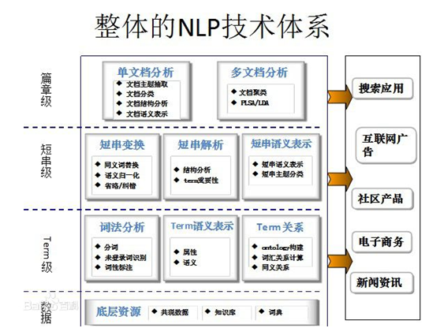
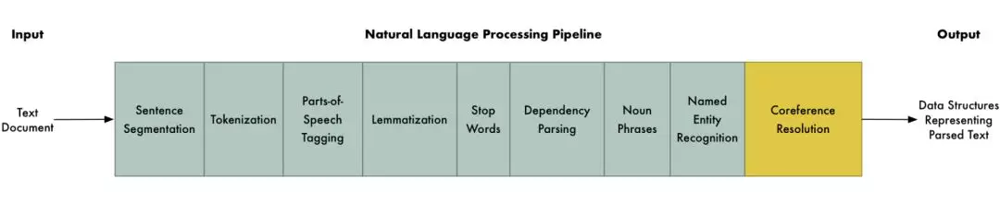
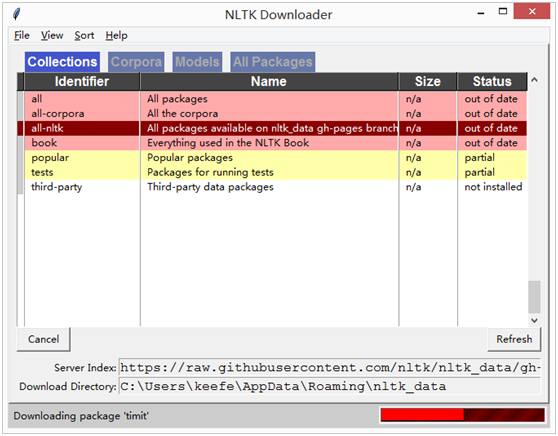
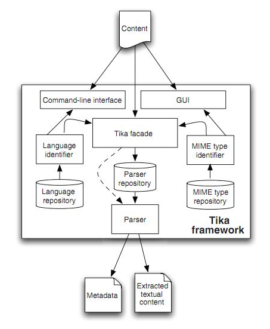

| 序号 | 修改时间   | 修改内容             | 修改人 | 审稿人 |
| ---- | ---------- | -------------------- | ------ | ------ |
| 1    | 2018-10-21 | 创建                 | Keefe |        |
| 2    | 2019-3-3   | 补充更新语料库章节。 | 同上   |        |
|      |            |                      |        |        |


---

# 目录

[目录... 1](#_Toc8460754)

[1    NLP简介... 3](#_Toc8460755)

[1.1    简介... 3](#_Toc8460756)

[1.2    技术难点... 4](#_Toc8460757)

[1.3    术语... 4](#_Toc8460758)

[1.4    本章参考... 5](#_Toc8460759)

[2    计算语言学... 5](#_Toc8460760)

[2.1    句法分析... 5](#_Toc8460761)

[2.1.1     依存句法分析... 5](#_Toc8460762)

[2.2    语法分析... 5](#_Toc8460763)

[2.3    语义分析... 6](#_Toc8460764)

[2.3.1     语义消歧... 6](#_Toc8460765)

[2.3.2     语义理解... 6](#_Toc8460766)

[2.4    情感分析... 6](#_Toc8460767)

[2.5    统计语言建模... 6](#_Toc8460768)

[2.6    本章参考... 7](#_Toc8460769)

[3    形态学... 7](#_Toc8460770)

[3.1    本章参考... 7](#_Toc8460771)

[4    NLP技术专题... 7](#_Toc8460772)

[4.1    词性标注 POS_tag. 7](#_Toc8460773)

[4.1.1     机器标注... 9](#_Toc8460774)

[4.2    NER~命名实体识别... 9](#_Toc8460775)

[4.3    分词... 10](#_Toc8460776)

[4.3.1     英文分词... 10](#_Toc8460777)

[4.3.2     中文分词... 10](#_Toc8460778)

[4.4    文档关键信息提取... 10](#_Toc8460779)

[4.4.1     关键词提取... 10](#_Toc8460780)

[4.4.2     核心句提取（文档摘要）... 10](#_Toc8460781)

[4.5    相似度分析... 11](#_Toc8460782)

[4.5.1     语义相似度... 11](#_Toc8460783)

[4.5.2     句子相似度... 11](#_Toc8460784)

[4.5.3     文档相似度... 11](#_Toc8460785)

[4.6    聚类分类... 11](#_Toc8460786)

[4.7    语种检测... 11](#_Toc8460787)

[4.8    本章参考... 11](#_Toc8460788)

[5    语料库... 12](#_Toc8460789)

[5.1    常用语料库... 12](#_Toc8460790)

[5.2    自然语言标注... 13](#_Toc8460791)

[5.2.1     序列标注... 13](#_Toc8460792)

[5.2.2     序列标注常见模型... 14](#_Toc8460793)

[5.2.3     标注的任务和算法... 15](#_Toc8460794)

[5.3    本章参考... 16](#_Toc8460795)

[6    NLP常用框架... 16](#_Toc8460796)

[6.1    NLTK~自然语言工具包... 16](#_Toc8460797)

[6.2    Jieba. 18](#_Toc8460798)

[6.3    本章参考... 18](#_Toc8460799)

[7    NLP应用场景... 18](#_Toc8460800)

[7.1    语言理解... 18](#_Toc8460801)

[7.2    本章参考... 18](#_Toc8460802)

[参考资料... 18](#_Toc8460803)

[附录... 19](#_Toc8460804)

[学术机构与会议... 19](#_Toc8460805)

[中英文对照... 20](#_Toc8460806)


[TOC]


---

# 1  NLP简介

## 1.1   简介

NLP，自然语言处理。自然语言处理是[计算机](https://baike.baidu.com/item/计算机)科学领域与[人工智能](https://baike.baidu.com/item/人工智能/9180)领域中的一个重要方向。它研究能实现人与[计算机](https://baike.baidu.com/item/计算机/140338)之间用自然语言进行有效通信的各种理论和方法。自然语言处理是一门融[语言学](https://baike.baidu.com/item/语言学/3632)、[计算机](https://baike.baidu.com/item/计算机科学)[科学](https://baike.baidu.com/item/自然语言处理)、[数学](https://baike.baidu.com/item/数学/107037)于一体的[科学](https://baike.baidu.com/item/科学)。

**通讯**
对说话者来说包括三个步骤：传达某个想法的意图，在头脑中生成词语，以及这些词语的物理合成．
对于接收者则包括四个步骤：感知，分析，排歧以及含义生成。
*  NLP的应用领域主要有：问答系统、文档摘要、机器翻译、语音识别、文档分类。
*  NLP的一般处理顺序：句法分析、语义分析、理解、推导

**NLP的处理工具**
*  计算语言学
*  形式化语言，短语结构和语法树
*  概率语言处理


​              

图 1 NLP技术体系


 

图 2 NLP 流水线pipeline

说明：1. NLP流水线~句子分隔--分词--词性标注POS-Tagging--词干提取（形态学）--停用词--依赖解析--名词短语--命名实体识体---会话方案
2. 依赖解析：弄清所有单词是如何关联的。构建语法解析树，树的根结点是动词。
3. 共指解析：


表格 NLP四大类任务

| 任务         | 应用示例                       | 特点                                                         |
| ------------ | ------------------------------ | ------------------------------------------------------------ |
| 序列标注     | 分词/POS Tag/NER/语义标注      | （句子粒度）句子中每个单词要求模型根据上下文都要给出一个分类类别 |
| 分类任务     | 文本分类/情感计算              | （文章粒度）不管文章有多长，总体给出一个分类类别即可         |
| 句子关系判断 | QA/自然语言推理                | 给定两个句子，模型判断出两个句子是否具备某种语义关系         |
| 生成类任务   | 机器翻译、文本摘要、写诗造句等 | 输入文本内容后，需要自主生成另外一段文字。                   |


## 1.2   技术难点

* **单词的边界界定**

在口语中，词与词之间通常是连贯的，而界定字词边界通常使用的办法是取用能让给定的上下文最为通顺且在文法上无误的一种最佳组合。在书写上，汉语也没有词与词之间的边界。
* **词义的消歧**

许多字词不单只有一个意思，因而我们必须选出使句意最为通顺的解释。
* **句法的模糊性**

自然语言的文法通常是模棱两可的，针对一个句子通常可能会剖析(Parse)出多棵剖析树(Parse Tree)，而我们必须要仰赖语意及前后文的信息才能在其中选择一棵最为适合的剖析树。
* **有瑕疵的或不规范的输入**

例如语音处理时遇到外国口音或地方口音,或者在文本的处理中处理拼写,语法或者光学字符识别(OCR)的错误。
* **语言行为与计划**

句子常常并不只是字面上的意思；例如，“你能把盐递过来吗”，一个好的回答应当是把盐递过去；在大多数上下文环境中，“能”将是糟糕的回答，虽说回答“不”或者“太远了我拿不到”也是可以接受的。再者，如果一门课程上一年没开设，对于提问“这门课程去年有多少学生没通过？”回答“去年没开这门课”要比回答“没人没通过”好。


## 1.3   术语

表格 1 NLP术语表

| 缩写   | 全称                                               | 简介                                                         |
| ------ | -------------------------------------------------- | ------------------------------------------------------------ |
| POS    | Parts of Speeh 词性                                | POS tag词性标注                                              |
| CFG    | Context-free Grammer，上下文无关文法               | 1957年，由Noam Chomsky为自然语言定义。BNF ﹙巴克斯-诺尔范式﹚经常用来表达上下文无关文法。  一个形式语言是上下文无关的，如果它是由上下文无关文法生成的﹙条目上下文无关语言﹚。 |
| NER    | Named Entity Recognition，Named Entity Recognition | 又称作“专名识别”，是指识别文本中具有特定意义的实体，主要包括人名、地名、机构名、专有名词等。 |
| n-gram | 多元                                               | 基于马尔科夫假设，提出了n-gram模型                           |
| PS     | PortalStemmer，词干提取                            | 用于词语有时态、词缀的曲折语。汉语是孤立语，不需要PS。       |
|        | 语法: grammer                                      |                                                              |
|        | 语义: semantic                                     |                                                              |
|        | 语用：pragmatics                                   |                                                              |


## 本章参考

[1].   自然语言处理-百度百科[https://baike.baidu.com/item/%E8%87%AA%E7%84%B6%E8%AF%AD%E8%A8%80%E5%A4%84%E7%90%86](https://baike.baidu.com/item/自然语言处理)

[2].   自然语言处理百科http://wiki.52nlp.cn/

[3].   CGG https://baike.baidu.com/item/CFG#3

[4].   NER [https://baike.baidu.com/item/%E5%91%BD%E5%90%8D%E5%AE%9E%E4%BD%93%E8%AF%86%E5%88%AB](https://baike.baidu.com/item/命名实体识别)


# 2  计算语言学

从句法分析（句子）、语法分析（字符序列）、语义分析（词语）。

## 2.1   句法分析

### 2.1.1 依存句法分析

步骤

1）分词与词性标注

2）确定图节点。

3）生成有向图。

4）利用PRIM算法构造最大生成树。


## 2.2   语法分析

语法分析：定义为一个检查用自然语言书写的字符序列是否符合正式语法中所定义的规则的过程。它将句子分解为单词或短语序列并为它们提供特定的成分类型（名词、动词、介词等）的过程。


分析语法树。


## 2.3   语义分析

语义分析：定义为确定字符或单词序列意义的过程，其可用于执行语义消歧、语义理解等。


### 2.3.1 语义消歧

语义消歧：基于单词的含义或意义来区分两个或更多拼写相同或发音相同的单词的任务。可用包~wordnet.


### 2.3.2 语义理解


## 2.4   情感分析

sentiment analysis

典型的情感语料库有：AFINN


情感有倾向的方向，还有方向上的大小。

用户情感分为：喜怒哀乐

用户倾向：好、差、中


特殊情况

1）否定语：出现、出现次数。如不

2）程序副词：不影响倾向方向，但对倾向程度影响较大。如非常、最、

3）关系连词：因果、转换，如虽然...但是...、因为...所以...

4）句子类型：陈述、疑问、感叹

备注：程序副词、情感加强性副词可通过权重控制


 ## 2.5 语言模型 LM

*LM：Language Model，语言模型，一串词序列的概率分布，通过概率模型来表示文本语义。*

定义：语言模型是一个单纯的、统一的、抽象的形式系统，语言客观事实经过语言模型的描述，比较适合于电子计算机进行自动处理，因而语言模型对于自然语言的信息处理具有重大的意义。
数学角度理解：语言模型就是对于一个语素序列 [公式] ，计算出这个语素序列的概率，即： [公式] （语素指语言中最小的音义结合体，一般来说就是独立的词）
简单来说就是通过一些数学手段，计算出对于一个句子的概率大小，概率大这句话就是正确的，概率小这句话就是错误的。

语言模型主要有三种类型：1. 生成性模型NLG，2. 分析性模型NLU，3. 辨识性模型 （NLG和NLU的组合）。

### 语言理解 NLU

*NLU*：Natural Language Understanding，指自然语言理解。根据语音或文本理解它的意思。

**Language Understanding (LUIS)**

A machine learning-based service to build natural language into apps, bots, and IoT devices. Quickly create enterprise-ready, custom models that continuously improve.


最早大家通过总结规律来判断自然语言的意图，常见的方法有：CFG、JSGF等。

后来出现了基于统计学的 NLU 方式，常见的方法有：[SVM](https://easyai.tech/ai-definition/svm/)、ME等。

随着深度学习的爆发，[CNN](https://easyai.tech/ai-definition/cnn/)、[RNN](https://easyai.tech/ai-definition/rnn/)、[LSTM](https://easyai.tech/ai-definition/lstm/) 都成为了最新的”统治者”。

到了2019年，[BERT](https://easyai.tech/ai-definition/bert/) 和 GPT-2 的表现震惊了业界，他们都是用了 [Transformer](https://easyai.tech/ai-definition/transformer/)。


### 语言生成 NLG

NLG，Natural Language Generate，自然语言生成 。NLG就是根据意思生成文本或语音。

自然语言生成 - NLG 是 NLP 的重要组成部分，他的主要目的是降低人类和机器之间的沟通鸿沟，将非语言格式的数据转换成人类可以理解的语言格式。

NLG 的3个level:
* 简单的数据合并
* 模块化的 NLG
* 高级 NLG

NLG 的6个步骤：
* 内容确定 - Content Determination
* 文本结构 - Text Structuring
* 句子聚合 - Sentence Aggregation
* 语法化 - Lexicalisation
* 参考表达式生成 - Referring Expression Generation|REG
* 语言实现 - Linguistic Realisation

NLG 应用的3个目的：

* 能够大规模的产生个性化内容
* 帮助人类洞察数据，让数据更容易理解
* 加速内容生产

NLG 的3个典型应用：

* 自动写新闻
* 聊天机器人
* BI 的解读和报告生成


## 2.6   统计语言建模

MLE: 最大似然估计


## 本章参考

[1].  String_metric  https://en.wikipedia.org/wiki/String_metric

[2].  一文看懂自然语言生成 - NLG https://blog.csdn.net/weixin_43612023/article/details/98047096


# 3  形态学

形态学：定义为使用语素对单词的构成进行研究，语素是具有意义的最小语言单位。

语素有两种类型：词根和词缀（前缀、后缀、中缀和环缀）


英语处理：词干提取、词形还原、形态分析、形态生成。

*  词干提取：通过去除单词中的词缀以获取词干的过程。

*  词形还原：一个用不同的词类将一个单词转换成某种形式的过程。

*  形态分析：一个从标识符中获取语法信息的过程。有三种方式来执行形态分析，分别是基于语素、词位和单词。形态分析器分析给定的标识符并生成诸如性别、数、词类等形态信息作为输出。

*  形态生成：形态分板的反过程。


## 本章参考


# 4  NLP技术专题

## 4.1   词性标注 POS_tag

词性：POG~ Parts of Speech

词性标注：对一个句中的每一个标识符分配词类（如名词、动词等）标记的过程。


表格 2 标准记性标注规范表

| 代码 | 名称       | 说明                                                 | 举例                                                         |
| ---- | ---------- | ---------------------------------------------------- | ------------------------------------------------------------ |
| a    | 形容词     | 取英语形容词adjective的第1个字母                     | 最/d 大/a 的/u                                               |
| ad   | 副形词     | 直接作状语的形容词.形容词代码a和副词代码d并在一起    | 一定/d 能够/v 顺利/ad 实现/v 。/w                            |
| ag   | 形语素     | 形容词性语素。形容词代码为a，语素代码ｇ前面置以a     | 喜/v 煞/ag 人/n                                              |
| an   | 名形词     | 具有名词功能的形容词。形容词代码a和名词代码n并在一起 | 人民/n 的/u 根本/a 利益/n 和/c 国家/n 的/u 安稳/an 。/w      |
| b    | 区别词     | 取汉字“别”的声母                                     | 副/b 书记/n 王/nr 思齐/nr                                    |
| c    | 连词       | 取英语连词conjunction的第1个字母                     | 全军/n 和/c 武警/n 先进/a 典型/n 代表/n                      |
| d    | 副词       | 取adverb的第2个字母，因其第1个字母已用于形容词       | 两侧/f 台柱/n 上/ 分别/d 雄踞/v 着/u                         |
| dg   | 副语素     | 副词性语素。副词代码为d，语素代码ｇ前面置以d         | 用/v 不/d 甚/dg 流利/a 的/u 中文/nz 主持/v 节目/n 。/w       |
| e    | 叹词       | 取英语叹词exclamation的第1个字母                     | 嗬/e ！/w                                                    |
| f    | 方位词     | 取汉字“方” 的声母                                    | 从/p 一/m 大/a 堆/q 档案/n 中/f 发现/v 了/u                  |
| g    | 语素       | 绝大多数语素都能作为合成词的“词根”，取汉字“根”的声母 | 例如dg 或ag                                                  |
| h    | 前接成分   | 取英语head的第1个字母                                | 目前/t 各种/r 非/h 合作制/n 的/u 农产品/n                    |
| i    | 成语       | 取英语成语idiom的第1个字母                           | 提高/v 农民/n 讨价还价/i 的/u 能力/n 。/w                    |
| j    | 简称略语   | 取汉字“简”的声母                                     | 民主/ad 选举/v 村委会/j 的/u 工作/vn                         |
| k    | 后接成分   |                                                      | 权责/n 明确/a 的/u 逐级/d 授权/v 制/k                        |
| l    | 习用语     | 习用语尚未成为成语，有点“临时性”，取“临”的声母       | 是/v 建立/v 社会主义/n 市场经济/n 体制/n 的/u 重要/a 组成部分/l 。/w |
| m    | 数词       | 取英语numeral的第3个字母，n，u已有他用               | 科学技术/n 是/v 第一/m 生产力/n                              |
| n    | 名词       | 取英语名词noun的第1个字母                            | 希望/v 双方/n 在/p 市政/n 规划/vn                            |
| ng   | 名语素     | 名词性语素。名词代码为n，语素代码ｇ前面置以n         | 就此/d 分析/v 时/Ng 认为/v                                   |
| nr   | 人名       | 名词代码n和“人(ren)”的声母并在一起                   | 建设部/nt 部长/n 侯/nr 捷/nr                                 |
| ns   | 地名       | 名词代码n和处所词代码s并在一起                       | 北京/ns 经济/n 运行/vn 态势/n 喜人/a                         |
| nt   | 机构团体   | “团”的声母为t，名词代码n和t并在一起                  | [冶金/n 工业部/n 洛阳/ns 耐火材料/l 研究院/n]nt              |
| nx   | 字母专名   |                                                      | ＡＴＭ/nx 交换机/n                                           |
| nz   | 其他专名   | “专”的声母的第1个字母为z，名词代码n和z并在一起       | 德士古/nz 公司/n                                             |
| o    | 拟声词     | 取英语拟声词onomatopoeia的第1个字母                  | 汩汩/o 地/u 流/v 出来/v                                      |
| p    | 介词       | 取英语介词prepositional的第1个字母                   | 往/p 基层/n 跑/v 。/w                                        |
| q    | 量词       | 取英语quantity的第1个字母                            | 不止/v 一/m 次/q 地/u 听到/v ，/w                            |
| r    | 代词       | 取英语代词pronoun的第2个字母,因p已用于介词           | 有些/r 部门/n                                                |
| s    | 处所词     | 取英语space的第1个字母                               | 移居/v 海外/s 。/w                                           |
| t    | 时间词     | 取英语time的第1个字母                                | 当前/t 经济/n 社会/n 情况/n                                  |
| tg   | 时语素     | 时间词性语素。时间词代码为t,在语素的代码g前面置以t   | 秋/Tg 冬/tg 连/d 旱/a                                        |
| u    | 助词       | 取英语助词auxiliary 的第2个字母,因a已用于形容词      | 工作/vn 的/u 政策/n                                          |
| ud   | 结构助词   |                                                      | 有/v 心/n 栽/v 得/ud 梧桐树/n                                |
| ug   | 时态助词   |                                                      | 你/r 想/v 过/ug 没有/v                                       |
| uj   | 结构助词的 |                                                      | 迈向/v 充满/v 希望/n 的/uj 新/a 世纪/n                       |
| ul   | 时态助词了 |                                                      | 完成/v 了/ ul                                                |
| uv   | 结构助词地 |                                                      | 满怀信心/l 地/uv 开创/v 新/a 的/u 业绩/n                     |
| uz   | 时态助词着 |                                                      | 眼看/v 着/uz                                                 |
| v    | 动词       |                                                      | 举行/v 老/a 干部/n 迎春/vn 团拜会/n                          |
| vd   | 副动词     |                                                      | 强调/vd 指出/v                                               |
| vg   | 动语素     | 动词性语素。动词代码为v。在语素的代码g前面置以V      | 做好/v 尊/vg 干/j 爱/v 兵/n 工作/vn                          |
| vn   | 名动词     | 指具有名词功能的动词。动词和名词的代码并在一起       | 股份制/n 这种/r 企业/n 组织/vn 形式/n ，/w                   |
| w    | 标点符号   |                                                      | 生产/v 的/u ５Ｇ/nx 、/w ８Ｇ/nx 型/k 燃气/n 热水器/n        |
| x    | 非语素字   | 非语素字只是一个符号，字母x通常用于代表未知数、符号  |                                                              |
| y    | 语气词     | 取汉字“语”的声母                                     | 已经/d ３０/m 多/m 年/q 了/y 。/w                            |
| z    | 状态词     | 取汉字“状”的声母的前一个字母                         | 势头/n 依然/z 强劲/a ；/w                                    |


### 4.1.1 机器标注

详见 5.2 见下方自然语言标注


## 4.2   NER~命名实体识别

常见实体：ORG（组织），LOC（地点），PER（人物）

常见方法：


## 4.3   分词

### 4.3.1 英文分词

相对中文分词简单。首先指定分隔符进行英文单词切分，其次单词还原。常用分词方法N-Gram模型（一种基于前后词语关系的语言模型，此模型表示当前词仅与前面第N-1词语相关，而与其它词汇不相关）。


### 4.3.2 中文分词

详见 《NLP-中文分词技术》


主要技术：语义分析、语义消歧。

分词方法：基于词库、机器机器（典型如条件随机场模型）。

## 4.4   文档关键信息提取

### 4.4.1 关键词提取

常见方法
*  网页元数据：keywords
*  网页文档内容自动标注
*  系统自动化抽取，常用算法如TF-IDF、TextRank（词语权重，借鉴 PageRank）


### 4.4.2 核心句提取（文档摘要）

文档核心句，又称为文档中心句。相对于关键词提取以词语为单位，文档摘要以句子为单位。

步骤：

1）进行断句预处理。将段落划分为若干句子。

2）对每个句子进行分词及词性标注处理，过滤停用词和部分记性无关词汇，再利用TextRank计算每个句子中的词语权重，并筛选出TOP3关键词。

3）通过关键词计算句子之间的关系紧密程度，以相同的关键词数量作为紧密值。


## 4.5   相似度分析

### 4.5.1 语义相似度

语义相似度：研究特定语境下词语的相似度。

算法1： 两个词语的相似度取决于词语之间的共性（COMMONALITY）和个性(DIFFERENE)。

Sim = (A, B) log(Common(A, B)/log(Diff(A, B))


### 4.5.2 句子相似度

主要算法：**余弦距离**

步骤：

1）分词处理

2）计算词频。

3）构建词频向量。

4）向量相似度计算。


### 4.5.3 文档相似度

算法1：系统相似度，首先通过文档关键词提取算法 提取关键词，再对关键词进行词频统计，再计算余弦相似度。

算法2：w-shingling算法，认为文档相似度为文档子集的交集个数与并集个数之比。

​     r(A, B) = |S(A) 交S(B)| / |S(A) 并S(B)|


## 4.6   文本分类

 文本分类一般可以分为二分类、多分类、多标签分类三种情况。

* 二分类是指将一组文本分成两个类(0或1)，比较常见的应用如垃圾邮件分类、电商网站的用户评价数据的正负面分类等。
* 多分类是指将文本分成若干个类中的某一个类，比如说门户网站新闻可以归属到不同的栏目中(如政治、体育、社会、科技、金融等栏目)去。
* 多标签分类指的是可以将文本分成若干个类中的多个类，比如一篇文章里即描写政治又描写金融等内容，那么这篇文章可能会别贴上政治和金融两个标签。

文本分类的**基本假设**：文档的内容与其中所包含的词有必然的关联，而同一类的文档之间总存在共同的词，不同类别的文档之间的词有较大的差异。因此分类器通过词与文档之间的向量关系可以用来识别文档的类别。{term , category}的向量空间模型。

文本分类算法有：词匹配法，基于知识工程的方法和机器学习方法。


**文本分类的一般思路**

- **思路1**：TF-IDF + 机器学习分类器：直接使用TF-IDF对文本提取特征，并使用分类器进行分类。在分类器的选择上，可以使用SVM、LR、或者XGBoost。
- **思路2**：FastText：FastText是入门款的词向量，利用Facebook提供的FastText工具，可以快速构建出分类器。
- **思路3**：WordVec + 深度学习分类器：WordVec是进阶款的词向量，并通过构建深度学习分类完成分类。深度学习分类的网络结构可以选择TextCNN、TextRNN或者BiLSTM。
- **思路4**：Bert词向量：Bert是高配款的词向量，具有强大的建模学习能力。


**文本分类的步骤**

1)   **文本表示**（Text Representation）：这一过程的目标是把文本表示成分类器能够处理的形式。最常用的方法是*向量空间模型*，即把文本集表示成词－文档矩阵，矩阵中每个元素代表了一个词在相应文档中的权重。选取哪些词来代表一个文本，这个过程称为特征选择（feature selection）。常见的特征选择方法有文档频率、信息增益、互信息、期望交叉熵（Expected Cross Entropy）等等，[Yang & Pedersen , 1997 ]对这几种方法做了比较。为了降低分类过程中的计算量，经常还需要进行降维处理，比如LSI。

2)   **分类器构建**（Classifier Construction）：这一步骤的目标是选择或设计构建分类器的方法。没有一种通用的方法可以适用所有情形。不同的方法有各自的优缺点和适用条件，要依据问题的特色来选择一个分类器。选定方法之后，在训练集上为每个类别构建分类器，然后把分类器利用于测试集上，得到分类结果。

3)   **效果评估**（Classifier Evaluation）：在分类过程完成之后，需要对分类结果进行评估。评估过程运用于测试集（而不是训练集）上的文本分类结果，常用的评估尺度由IR范畴继承而来，包括查全率、查准率、F1值等等。对于某一类别i，查全率ri=li/ni，其中ni为所有测试文档中，属于第i类的文档个数；li是经分类系统输出分类结果为第i类且结果准确的文档个数。查准率pi=li/mi，其中mi是经分类体系输出分类结果为第i类的文档个数，li是经分类系统输出分类结果为第i类且结果准确的文档个数。F1值为查全率和查准率的调和平均值。相对于最简略的练习集－测试集评估办法而言，还有一种称为k-fold cross validation的方式，即把所有标志的数据划分成k个子集，对于每个子集，把这个子集当作训练集，把其余子集作为测试集；这样执行k次，取各次评估成果的均值作为最后的评估结果。


**常用测试集**

文本分类常用的数据集有REUTERS,20NEWSGROUP,OHSUMED等语料库。


**一个文本分类器的设计方案**

| 关键因素     | 方案     | 备选方案                         |                      |
| ------------ | -------- | -------------------------------- | -------------------- |
| 训练样本数   | 15       |                                  |                      |
| 特征选取方法 | CHI      | 文档频率DF, 信息增益IG, 互信息MI |                      |
| 分类算法     | KNN & NB | KNN                              | 决策树DTree, Rocchio |
| K            | 15       |                                  |                      |
| 相似度       | 兰式     | 欧氏距离                         |                      |
| 层次关系     | 层次     |                                  |                      |
| 截尾算法     | SCut     | 位置法RCut, 比例法PCut,          |                      |


## 4.7   语种检测

**方法1：概率模型，通过计算字的语言概率，延伸到句子。**

基本理论：搜索各种语言的字典，计算每个字是某种语言的概率，然后通过句子中的所有字的语种概率值，确定句子最大可能的语种。

存在问题：全球语言5000多种，常用50种。语言变化性强。同一字出现在不同语言。

改进：N-Gram语言模型 + TF-IDF

实现：python langid模块


**方法2：分类。通过UNICODE字符集范围比对。语系分析，再语系下语言语种识别。**


## 本章参考

[1].   词性标注规范表 https://blog.csdn.net/jdjh1024/article/details/81318635

[2].   hanlp http://www.hankcs.com/nlp/part-of-speech-tagging.html


# 5  语料库

语料库定义：1）大量文本的集合；2）大量机读文本的集合；3）大量机读文本一定量的集合，含取样率。

文本采集将基于特定因素的代表性和平衡性举行。


**历史**

20世纪50年代，开始收集语料。KWIC（上下文关键索引）作为建立文档索引和词语索引的技术被发明出来。

20世纪60年代，出版了第一个涉及类别较广的语料库~布朗语料库。


标注工具
*  MAE: Multipurpose Annotation Enviroment，多用途标注环境。输入形式类似DTD文件。http://code.google.com/p/mae-annotation/
*  MAI: Multidocument Adjudication Interface, 多文档审核接口。专为审核MAE的输出而设计。


## 5.1   常用语料库

中文
*  搜狗实验室[互联网语料库](http://www.sogou.com/labs/dl/t.html) http://www.sogou.com/labs/dl/t.html
*  北京大学汉语语言学研究中心
*  构先进汉语语料库 http://ccl.pku.edu.cn/yuliao_contents.asp
*  [中央研究院平衡语料库](http://www.sinica.edu.tw/SinicaCorpus/)
*  [香港城市大学共时语料库](http://rlcondor.cityu.edu.hk/index.php?lang=tc)
*  四库全书
*  汉籍电子文献资料库 http://hanchi.ihp.sinica.edu.tw
*  [语料库语言学在线](http://www.corpus4u.org/) http://www.corpus4u.org/


表格 3 主要语料库比较

| 语料库                                                       | 估计大小                      | 出现年代 | 备注                         |
| ------------------------------------------------------------ | ----------------------------- | -------- | ---------------------------- |
| clueweb09                                                    | 约10亿个网页                  |          |                              |
| 英国国家语料库[British National Corpus](http://en.wikipedia.org/wiki/British_National_Corpus) BNC | 1亿个单词                     |          | http://www.natcorp.ox.ac.uk/ |
| 美国国家语料库[American National Corpus](http://en.wikipedia.org/wiki/American_National_Corpus) | 2200万个单词                  |          |                              |
| TempEval2                                                    | 每种语言数据集包括1~6万个词例 |          |                              |
| 宾州语料库                                                   | 100万个单词                   | 1992     |                              |
| i2b2 2008竞赛~吸烟状态                                       | 502份医院治疗报告             |          |                              |
| TimeBANK 1.2                                                 | 183份文档、6万个词例          |          |                              |
| 情感歧义形容词消歧                                           | 4000个句子                    |          |                              |
| 布朗语料库                                                   |                               | 1964     | 第一个涉及类别较广的语料库   |
| LOB                                                          |                               | 1980s    |                              |
| 伦敦-兰德语料库                                              |                               | 1982     |                              |
| [賓州大學語料庫](http://www.ldc.upenn.edu/)                  |                               |          | 多语                         |
| [AFINN ](https://pypi.org/project/afinn/)情感分析语料库      |                               |          | 多语                         |
| [Bank   of English](http://en.wikipedia.org/wiki/Bank_of_English) |                               |          |                              |


## 5.2   自然语言标注

标注类型：词性POS、短语结构和依存结构。

标注开发循环：MATTER方法，六步分别是建模、标注、训练、测试、评价和修改。

### 5.2.1 序列标注

序列标注问题是NLP中最常见的问题，因为绝大多数NLP问题都可以转化为序列标注问题。序列标注问题包括自然语言处理中的分词，词性标注，命名实体识别，关键词抽取，词义角色标注等等。

所谓“序列标注”，就是说对于一个一维线性输入序列： $x = x_1,x_2,x_3...x_i...x_n$

　  给线性序列中的每个元素打上标签集合中的某个标签：  $y = y_1,y_2,y_3...y_i...y_n$

所以，其本质上是对线性序列中每个元素根据上下文内容进行分类的问题。一般情况下，对于NLP任务来说，线性序列就是输入的文本，往往可以把一个汉字看做线性序列的一个元素，而不同任务其标签集合代表的含义可能不太相同，但是相同的问题都是：如何根据汉字的上下文给汉字打上一个合适的标签。


**序列标注之中文分词**

序列标注的任务就是给每个汉字打上一个标签，对于分词任务来说，我们可以定义标签集合为（jieba分词中的标签集合也是这样的）：

　　**LabelSet = { B, M, E, S}**

　　其中B代表这个汉字是词汇的开始字符，M代表这个汉字是词汇的中间字符，E代表这个汉字是词汇的结束字符，而S代表单字词。


### 5.2.2 序列标注常见模型

表格 4 序列标注常见模型比较

| 模型                                       | 简介                                                         | 优点 | 缺点 |
| ------------------------------------------ | ------------------------------------------------------------ | ---- | ---- |
| LSTM~Long Short-Term Memory                | 长短期记忆网络，一种时间递归神经网络。                       |      |      |
| **CRF**~Conditional Random Field Algorithm | 条件随机场算法（2001年），属于无向图。                       |      |      |
| **HMM~**Hidden Markov Model                | 隐马尔可夫模型。统计模型,它用来描述一个含有隐含未知参数的马尔可夫过程。 |      |      |
| CNN                                        | 卷积神经网络。                                               |      |      |
| *RNN*(Recurrent Neural Network)            | 循环神经网络。一类用于处理序列数据的神经网络。               |      |      |


​     **LSTM**：（Long Short-Term Memory）是长短期记忆网络，是一种时间递归神经网络，适合于处理和预测时间序列中间隔和延迟相对较长的重要事件。像RNN、LSTM、BILSTM这些模型，它们在序列建模上很强大，它们能够capture长远的上下文信息，此外还具备神经网络拟合非线性的能力，这些都是crf无法超越的地方，对于t时刻来说，输出层yt受到隐层ht（包含上下文信息）和输入层xt（当前的输入）的影响，但是yt和其他时刻的yt`是相互独立的，感觉像是一种point wise，对当前t时刻来说，我们希望找到一个概率最大的yt，但其他时刻的yt`对当前yt没有影响，如果yt之间存在较强的依赖关系的话（例如，形容词后面一般接名词，存在一定的约束），LSTM无法对这些约束进行建模，LSTM模型的性能将受到限制。

　　**CRF**：Conditional Random Field Algorithm，条件随机场算法（2001年），属于无向图。它不像LSTM等模型，能够考虑长远的上下文信息，它更多考虑的是整个句子的局部特征的线性加权组合（通过特征模版去扫描整个句子）。关键的一点是，CRF的模型为p(y | x, w)，注意这里y和x都是序列，它有点像list wise，优化的是一个序列y = (y1, y2, …, yn)，而不是某个时刻的yt，即找到一个概率最高的序列y = (y1, y2, …, yn)使得p(y1, y2, …, yn| x, w)最高，它计算的是一种联合概率，优化的是整个序列（最终目标），而不是将每个时刻的最优拼接起来，在这一点上CRF要优于LSTM。

　　**HMM**：CRF不管是在实践还是理论上都要优于HMM，HMM模型的参数主要是“初始的状态分布”，“状态之间的概率转移矩阵”，“状态到观测的概率转移矩阵”，这些信息在CRF中都可以有，例如：在特征模版中考虑h(y1), f(yi-1, yi), g(yi, xi)等特征。

　　CRF与LSTM：从数据规模来说，在数据规模较小时，CRF的试验效果要略优于BILSTM，当数据规模较大时，BILSTM的效果应该会超过CRF。从场景来说，如果需要识别的任务不需要太依赖长久的信息，此时RNN等模型只会增加额外的复杂度，此时可以考虑类似科大讯飞FSMN（一种基于窗口考虑上下文信息的“前馈”网络）。

　　CNN＋BILSTM＋CRF：这是目前学术界比较流行的做法，BILSTM＋CRF是为了结合以上两个模型的优点，CNN主要是处理英文的情况，英文单词是由更细粒度的字母组成，这些字母潜藏着一些特征（例如：前缀后缀特征），通过CNN的卷积操作提取这些特征，在中文中可能并不适用（中文单字无法分解，除非是基于分词后），这里简单举一个例子，例如词性标注场景，单词football与basketball被标为名词的概率较高， 这里后缀ball就是类似这种特征。


### 5.2.3 标注的任务和算法

表格 5 标注任务伴随的算法列表

| 算法                          | 任务                             |
| ----------------------------- | -------------------------------- |
| 聚类                          | 题材分类、垃圾邮件标注           |
| 决策树                        | 语义类型或本体类别标注、指代消解 |
| 朴素贝叶斯                    | 情感分类、语义类型或本体类别标注 |
| 最大熵                        | 情感分类、语义类型或本体类别标注 |
| 结构化模式归纳  （HMM/CRF等） | 词性标注、情感分类、语义消歧     |


表格 6 标注任务的推荐算法

| 任务           | 简介                                       | 推荐算法                                                     |
| -------------- | ------------------------------------------ | ------------------------------------------------------------ |
| 词性标注       | 基于标注依赖型特征的序列标注任务。有监督。 | 隐马尔科夫模型、条件随机场、支持向量机、基于高效规则技术（如Brill标注器） |
| 题材分类       | 属于聚类，无监督。                         | LDA狄利克雷分布、PLSA概率潜在语义分析、词袋                  |
| 本体类别标注   | 同时使用N元语法特征和标注依赖型特征。      | 朴素贝叶斯、最大熵、决策树、SVM                              |
| 情感分析       |                                            | 朴素贝叶斯、最大熵、SVM                                      |
| 词义消歧       | 有监督学习。                               |                                                              |
| 时间和事件识别 |                                            | 朴素贝叶斯、最大熵、决策树、                                 |
| 事件参与角色   |                                            | SVM、最大熵                                                  |
| 命名实体识别   | 分类。                                     | 朴素贝叶斯、最大熵、SVM、条件随机场、最大熵马尔科夫模型、基于记忆的学习方法 |
| 指代消解       | 分类，，主要使用标注依赖型特征。           | 决策树归纳(C4.5）协同训练、条件随机场、boosting、一阶概率模型 |


## 本章参考

[1].   自然语言处理之序列标注问题 https://www.cnblogs.com/jiangxinyang/p/9368482.html

[2].   http://en.wikipedia.org/wiki/Text_corpus

[3].   MAE and MAI Lightweight Annotation and Adjudication Tools https://www.docin.com/p-1642334167.html


# 6  NLP常用框架

表格 7 NLP常用框架列表

| 框架                         | 语言   | 简介                                                         | 功能                                                         |
| ---------------------------- | ------ | ------------------------------------------------------------ | ------------------------------------------------------------ |
| OpenNLP                      | Java   | 基于Java机器学习工具包，用于处理自然语言文本。               | 支持大多数常用的 NLP 任务，例如：标识化、句子切分、部分词性标注、名称抽取、组块、解析等。 |
| FudanNLP                     | Java   | 主要是为中文自然语言处理而开发的工具包，也包含为实现这些任务的机器学习算法和数据集。  本工具包及其包含数据集使用LGPL3.0许可证。 | 1. [文本分类](https://baike.baidu.com/item/文本分类)  新闻聚类  2. 中文分词 词性标注 实体名识别 关键词抽取 依存句法分析 时间短语识别  3. 结构化学习 在线学习 层次分类 聚类 精确推理 |
| [NLTK](http://www.nltk.org/) | Python | Natural Language Toolkit，自然语言处理工具包，在NLP领域中，最常使用的一个Python库。NLTK由Steven Bird和Edward Loper在宾夕法尼亚大学计算机和信息科学系开发。 | Python模块，数据集和教程，用于[NLP](https://baike.baidu.com/item/NLP/25220)的研究和开发。NLTK包括图形演示和示例数据。 |
| gensim                       | python | 文本挖掘的相似度比较                                         |                                                              |
|                              |        |                                                              |                                                              |


## 6.1   NLTK~自然语言工具包

语料库下载地址：nltk.download()
* WINDOWS: C:\\Users\\keefe\\AppData\\Roaming\\nltk_data


 


表格 9 NLTK模块详述

| NLTK模块                   | 语言处理任务     | 功能描述                                              |
| -------------------------- | ---------------- | ----------------------------------------------------- |
| nltk.corpus                | 获取语料库       | 语料库和词典的标准化接口                              |
| nltk.tokenize,  nltk.stem  | 字符串处理       | 分词、句子分解、提取主干                              |
| nltk.collocations          | 搭配研究         | t-检验、卡方、点互信息                                |
| nltk.tag                   | 词性标识符       | n-gram backoff Brill HMM TnT                          |
| nltk.classify  ltk.cluster | 分类             | 决策树、最大熵、朴素贝叶斯、EM、k-means               |
| nltk.chunk                 | 分块             | 正则表达式、n-gram、命名实体                          |
| nltk.parse                 | 解析             | 图表、基于特征、一致性、概率性、依赖项                |
| nltk.sem  nltk.inference   | 语义解释         | 演算、一阶逻辑、模型检验                              |
| nltk.metrics               | 指标评测         | 精度、召回率、协议系数                                |
| nltk.probability           | 概率与估计       | 频率分布、平滑概率分布                                |
| nltk.app  nltk.chat        | 应用             | 图形化的关键词排序、分析器、wordnet查看器、聊天机器人 |
| nltk.toolbox               | 语言学领域的工作 | 处理SIL工具箱格式的数据                               |


## 6.2   Jieba-分词

参见 [NLP-中文分词技术](NLP-中文分词技术.md)


## 6.3   Tika-文档解析

### 6.3.1 Tika简介

官网：http://tika.apache.org/

下载：

- [Mirrors for tika-1.22-src.zip](https://www.apache.org/dyn/closer.cgi/tika/tika-1.22-src.zip) (source archive, [PGP signature](https://www.apache.org/dist/tika/tika-1.22-src.zip.asc), [SHA512](https://www.apache.org/dist/tika/tika-1.22-src.zip.sha512))
- [Mirrors for tika-app-1.22.jar](https://www.apache.org/dyn/closer.cgi/tika/tika-app-1.22.jar) (runnable jar, [PGP signature](https://www.apache.org/dist/tika/tika-app-1.22.jar.asc), [SHA512](https://www.apache.org/dist/tika/tika-app-1.22.jar.sha512))
- [Mirrors for tika-server-1.22.jar](https://www.apache.org/dyn/closer.cgi/tika/tika-server-1.22.jar) (runnable jar, [PGP signature](https://www.apache.org/dist/tika/tika-server-1.22.jar.asc), [SHA512](https://www.apache.org/dist/tika/tika-server-1.22.jar.sha512))
- [Mirrors for tika-eval-1.22.jar](https://www.apache.org/dyn/closer.cgi/tika/tika-eval-1.22.jar) (runnable jar, [PGP signature](https://www.apache.org/dist/tika/tika-eval-1.22.jar.asc), [SHA512](https://www.apache.org/dist/tika/tika-eval-1.22.jar.sha512))

说明：

* tika-server  一个restful服务，方便和现有应用系统集成。

  ```shell
  $ curl -X PUT --data-binary @GeoSPARQL.pdf http://localhost:9998/tika --header "Content-type: application/pdf"

  $ curl -T price.xls http://localhost:9998/tika --header "Accept: text/html"
  ```

* tika-app 包含了tika核心类库和它的相关依赖，提供了命令行工具和图形用户界面，可以在脚本中使用，并支持管道。

* tika-eval  一个命令行工具，可以批量解析文件，然后把结果保存到数据库，支持多种类型的数据库，如h2，mysql等。默认数据库是h2，使用其他类型的数据库需要在启动时将相关的依赖放到classpath下。


**Build artifacts 构建生成品**

Tika的核心是一个类库，提供了文件类型检测，内容语言检测等功能，并有一个完整的解析器框架，通过这个框架集成了许多Java平台上流行的文件分析工具，如针对压缩格式，使用了commons-compress，针对微软Office文档，使用了Apache POI，针对Adobe PDF格式，采用了Apache PDFbox.

The Tika build consists of a number of components and produces the following main binaries:

- tika-core/target/tika-core-*.jar

  Tika core library. Contains the core interfaces and classes of Tika, but none of the parser implementations.

- tika-parsers/target/tika-parsers-*.jar

  Tika parsers. Collection of classes that implement the Tika Parser interface based on various external parser libraries.

- tika-app/target/tika-app-*.jar

  Tika application. Combines the above components and all the external parser libraries into a single runnable jar with a GUI and a command line interface.

- tika-server/target/tika-server-*.jar

  Tika JAX-RS REST application. This is a Jetty web server running Tika REST services as described in [this page](https://cwiki.apache.org/confluence/display/TIKA/TikaServer).

- tika-bundle/target/tika-bundle-*.jar

  Tika bundle. An OSGi bundle that combines tika-parsers with non-OSGified parser libraries to make them easy to deploy in an OSGi environment.

- tika-eval/target/tika-eval-*.jar

  Tika eval module. Commandline tool to assess the output of Tika or compare the output of two different versions of Tika or other text extraction packages.


Apache Tika用于文件类型检测和从各种格式的文件内容提取的库。

在内部，Tika使用现有的各种文件解析器和文档类型的检测技术来检测和提取数据。Tika提供用于解析不同文件格式的一个通用API。它采用83个现有的专业解析器库，为每个文档类型。

**Tika支持多种功能：**

* 文档类型检测

* 内容提取

* 元数据提取

* 语言检测


表格 10 Tika大事记

| 年份 | 开发                                                         |
| ---- | ------------------------------------------------------------ |
| 2006 | Tika的想法是在Lucene项目管理委员会之前设计的。Tika及其在Jackrabbit项目有用的概念进行了讨论。 |
| 2007 | 3月22号，Tika进入Apache孵化器。                              |
| 2008 | 版本0.1和0.2发布，Tika从孵化器到Lucene子项目独立。           |
| 2009 | 版本0.3，0.4和0.5发布。                                      |
| 2010 | 版本0.6和0.7发布，Tika进入Apache的顶级项目。                 |
| 2011 | Tika1.0发布，并Tika的书籍“Tika in  Action”也在同一年被发布。 |
| ...  |                                                              |
| 2019 | Tika 1.23和1.24发布。                                        |
| 2020 | Tika 1.25发布。                                              |
| 2021 | Tika 1.26发布， Tika 2.0-beta发布。                          |

备注：Tika的版本周期很快，大概半年一个版本。


### 6.3.2 架构及原理篇

   

图 3 Tika架构

 支持CLI（命令行）和GUI（图形端）二种形式。

 

图 4 Tika架构2

上图显示了Tika的四个模块的体系结构：
*  Language identifier 语言检测机制，维护一个语言仓库。
*  MIME type identifier MIME类别检测机制，维护一个MIME类型仓库。
*  Parser 解析器接口
*  Tika Facade 类：外观接口，外部可通过这个类调用到实际的解析器。


**语言检测机制**

每当一个文本文件被传递到Tika，它将检测在其中的语言。它接受没有语言的注释文件和通过检测该语言添加在该文件的元数据信息。

支持语言识别，Tika 有一类叫做语言标识符在包org.apache.tika.language及语言识别资料库里面包含了语言检测从给定文本的算法。Tika 内部使用N-gram算法语言检测。


**MIME检测机制**

Tika可以根据MIME标准检测文档类型。Tika默认MIME类型检测是使用org.apache.tika.mime.mimeTypes。它使用org.apache.tika.detect.Detector 接口大部分内容类型检测。

内部Tika使用多种技术，如文件匹配替换，内容类型提示，魔术字节，字符编码，以及其他一些技术。


**解析器接口**

org.apache.tika.parser 解析器接口是Tika解析文档的主要接口。该接口从提取文档中的文本和元数据，并总结了其对外部用户愿意写解析器插件。

采用不同的具体解析器类，具体为各个文档类型，Tika 支持大量的文件格式。这些格式的具体类不同的文件格式提供支持，无论是通过直接实现逻辑分析器或使用外部解析器库。


**Tika Facade** **类**

使用的Tika facade类是从Java调用Tika的最简单和直接的方式，而且也沿用了外观的设计模式。可以在 Tika API的org.apache.tika包Tika 找到外观facade类。

通过实现基本用例，Tika作为facade的代理。它抽象了的Tika库的底层复杂性，例如MIME检测机制，解析器接口和语言检测机制，并提供给用户一个简单的接口来使用。


表格 12 Tika支持的文件格式

| 文件格式                                                     | 类库                                                         | Tika中的类                                              |
| ------------------------------------------------------------ | ------------------------------------------------------------ | ------------------------------------------------------- |
| XML                                                          | org.apache.tika.parser.xml                                   | XMLParser                                               |
| HTML                                                         | org.apache.tika.parser.htmll  and it uses Tagsoup Library    | HtmlParser                                              |
| MS-Office  compound document Ole2 till 2007 ooxml 2007 onwards | org.apache.tika.parser.microsoft  org.apache.tika.parser.microsoft.ooxml  and it uses Apache Poi library | OfficeParser(ole2)  OOXMLParser(ooxml)                  |
| OpenDocument  Format openoffice                              | org.apache.tika.parser.odf                                   | OpenOfficeParser                                        |
| portable  Document Format(PDF)                               | org.apache.tika.parser.pdf  and this package uses Apache PdfBox library | PDFParser                                               |
| Electronic  Publication Format (digital books)               | org.apache.tika.parser.epub                                  | EpubParser                                              |
| Rich  Text format                                            | org.apache.tika.parser.rtf                                   | RTFParser                                               |
| Compression  and packaging formats                           | org.apache.tika.parser.pkg  and this package uses Common compress library | PackageParser  and CompressorParser and its sub-classes |
| Text  format                                                 | org.apache.tika.parser.txt                                   | TXTParser                                               |
| Feed  and syndication formats                                | org.apache.tika.parser.feed                                  | FeedParser                                              |
| Audio  formats                                               | org.apache.tika.parser.audio  and org.apache.tika.parser.mp3 | AudioParser  MidiParser Mp3- for mp3parser              |
| Imageparsers                                                 | org.apache.tika.parser.jpeg                                  | JpegParser-for  jpeg images                             |
| Videoformats                                                 | org.apache.tika.parser.mp4  and org.apache.tika.parser.video this parser internally uses Simple Algorithm  to parse flash video formats | Mp4parser  FlvParser                                    |
| java  class files and jar files                              | org.apache.tika.parser.asm                                   | ClassParser  CompressorParser                           |
| Mobxformat  (email messages)                                 | org.apache.tika.parser.mbox                                  | MobXParser                                              |
| Cad  formats                                                 | org.apache.tika.parser.dwg                                   | DWGParser                                               |
| FontFormats                                                  | org.apache.tika.parser.font                                  | TrueTypeParser                                          |
| executable  programs and libraries                           | org.apache.tika.parser.executable                            | ExecutableParser                                        |

备注：1. Tika文件类型检测：多用途Internet邮件扩展(MIME)标准，用于识别文件类型的最佳标准。目前有72种解析库，100多种文件类型。

每当一个文件通过Tika检测到该文件，其文件类型。检测的介质类型，Tika内部通过以下机制：
* 文件扩展名、
* 内容类型提示、
* 魔术字节（文件流中的特殊字节）、
* 字符编码 (python中chardet.detect)、
* XML根字符。

2. 文本提取流程：类型检测 -- Parser Selection --- 文本抽取

3. 元数据提取


**Tika语言检测**

在所有由ISO639-1标准的184标准语言，Tika可检测18种语言。语言检测Tika是通过使用LanguageIdentifier类的getLanguage()方法。此方法返回字符串格式的语言代号。下面给出由Tika检测出的18语言代码对的列表中：

| da—Danish    | de—German    | et—Estonian   | el—Greek   |
| ------------ | ------------ | ------------- | ---------- |
| en—English   | es—Spanish   | fi—Finnish    | fr—French  |
| hu—Hungarian | is—Icelandic | it—Italian    | nl—Dutch   |
| no—Norwegian | pl—Polish    | pt—Portuguese | ru—Russian |
| sv—Swedish   | th—Thai      |               |            |

备注：Tika不能识别中文。python中可用 langid或langdetect模块检测语言。

### 6.3.3 使用篇

```SHELL
# 命令行打开jar包的gui
java -jar tika-app-xxx.jar --gui

# 命令行使用
$ java -jar tika-app-1.22.jar --help
usage: java -jar tika-app.jar [option...] [file|port...]

Options:
  -? or --help     Print this usage message
  -v or --verbose    Print debug level messages
  -V or --version    Print the Apache Tika version number

  -g or --gui      Start the Apache Tika GUI
  -s or --server    Start the Apache Tika server
  -f or --fork     Use Fork Mode for out-of-process extraction

  --config=<tika-config.xml>
    TikaConfig file. Must be specified before -g, -s, -f or the dump-x-config !
  --dump-minimal-config Print minimal TikaConfig
  --dump-current-config Print current TikaConfig
  --dump-static-config  Print static config
  --dump-static-full-config Print static explicit config

  -x or --xml      Output XHTML content (default)
  -h or --html     Output HTML content 如果要抽取表格的话，要借助HTML
  -t or --text     Output plain text content 结构化文档
  -T or --text-main   Output plain text content (main content only)
  -m or --metadata   Output only metadata
  -j or --json     Output metadata in JSON
  -y or --xmp      Output metadata in XMP
  -J or --jsonRecursive Output metadata and content from all
              embedded files (choose content type
              with -x, -h, -t or -m; default is -x)
  -l or --language   Output only language
  -d or --detect    Detect document type
      --digest=X   Include digest X (md2, md5, sha1,
                sha256, sha384, sha512
  -eX or --encoding=X  Use output encoding X
  -pX or --password=X  Use document password X
  -z or --extract    Extract all attachements into current directory
  --extract-dir=<dir>  Specify target directory for -z
  -r or --pretty-print For JSON, XML and XHTML outputs, adds newlines and
              whitespace, for better readability

  --list-parsers
     List the available document parsers
  --list-parser-details
     List the available document parsers and their supported mime types
  --list-parser-details-apt
     List the available document parsers and their supported mime types in apt format.
  --list-detectors
     List the available document detectors
  --list-met-models
     List the available metadata models, and their supported keys
  --list-supported-types
     List all known media types and related information


  --compare-file-magic=<dir>
     Compares Tika's known media types to the File(1) tool's magic directory
Description:
  Apache Tika will parse the file(s) specified on the
  command line and output the extracted text content
  or metadata to standard output.

  Instead of a file name you can also specify the URL
  of a document to be parsed.

  If no file name or URL is specified (or the special
  name "-" is used), then the standard input stream
  is parsed. If no arguments were given and no input
  data is available, the GUI is started instead.

- GUI mode
  Use the "--gui" (or "-g") option to start the
  Apache Tika GUI. You can drag and drop files from
  a normal file explorer to the GUI window to extract
  text content and metadata from the files.

- Server mode
  Use the "--server" (or "-s") option to start the
  Apache Tika server. The server will listen to the
  ports you specify as one or more arguments.

- Batch mode
  Simplest method.
  Specify two directories as args with no other args:
     java -jar tika-app.jar <inputDirectory> <outputDirectory>

Batch Options:
  -i or --inputDir     Input directory
  -o or --outputDir     Output directory
  -numConsumers       Number of processing threads
  -bc            Batch config file
  -maxRestarts        Maximum number of times the
                watchdog process will restart the child process.
  -timeoutThresholdMillis  Number of milliseconds allowed to a parse
                before the process is killed and restarted
  -fileList         List of files to process, with
                paths relative to the input directory
  -includeFilePat      Regular expression to determine which
                files to process, e.g. "(?i).pdf"
  -excludeFilePat      Regular expression to determine which
                files to avoid processing, e.g. "(?i).pdf"
  -maxFileSizeBytes     Skip files longer than this value

  Control the type of output with -x, -h, -t and/or -J.

  To modify child process jvm args, prepend "J" as in:
  -JXmx4g or -JDlog4j.configuration=file:log4j.xml.
```


### 6.3.4 其它语言调用tika jar

#### tika-python

依赖 tika-server.jar

A Python port of the [Apache Tika](http://tika.apache.org/) library that makes Tika available using the [Tika REST Server](http://wiki.apache.org/tika/TikaJAXRS).

tika-python https://github.com/chrismattmann/tika-python


#### tika-app-python

依赖 tika-app.jar

https://github.com/fedelemantuano/tika-app-python/


### 6.3.5 FAQ常见问题

1). 文件太大，输出受限。

2). PDF图片和文本双层，如何分隔图片和文字。

解决方案：图片数据是连续的二进制；文字则是段落组成，用\n分隔。可判断两个\n之间长度大于1000字的为图片。
```PYTHON
text = b'\n'.join( for i in content.split(b'\n') if len(i)>1000 )
```


### 本节参考

[1].  [Tika官方文档](https://tika.apache.org/)  http://tika.apache.org/

[2].  TIKA教程 https://www.sxt.cn/tika/tika.html

[3].  Apache Tika使用报告 https://www.jianshu.com/p/2a6ad1941788

[4]. 《Tika in action》

[5]. 白宁超 - [Tika常见格式文件抽取内容并做预处理](https://www.bbsmax.com/A/RnJWm1BdqY/)


## 其它

### Salesforce MQAN

官方介绍（英文）：https://einstein.ai/research/the-natural-language-decathlon

论文：https://einstein.ai/static/images/pages/research/decaNLP/decaNLP.pdf

GitHub：https://github.com/salesforce/decaNLP


Salesforce总结的十大任务，简单来说包括：问答、机器翻译、摘要、自然语言推理、情感分析、语义角色标注、关系抽取、目标导向对话、语义分析、常识代词消解。又叫自然语言十项全能（Natural Language Decathlon，简称decaNLP）

**MQAN**，全称是多任务问答网络（Multitask Question Answering Network ），是Salesforce搞出的解决十大任务的一个全能模型。


## 本章参考

[1].   NLTK http://www.nltk.org/

[2].   结巴中文分词介绍 https://blog.csdn.net/haishu_zheng/article/details/80430106


# 参考资料

框架官网

* NLTK http://www.nltk.org/
* tika  http://tika.apache.org/

**站点**

* 我爱自然语言处理 [www.52nlp.cn/](http://www.52nlp.cn/)
* 自然语言处理百科 http://wiki.52nlp.cn/
* 中国语言文字网 http://www.china-language.gov.cn/bakeoff08/
* 语言理解 https://www.luis.ai/


 **参考文献**

* 张华平.ICTCLAS[EB/OL]. [2009-08-15].http://mtgroup.ict.ac.cn/~zhp/ICTCLAS.htm. 2002.
* 黄昌宁.赵海 [中文分词十年回顾 ](http://d.wanfangdata.com.cn/ExternalResource-jsjyy201008012^1.aspx) 中文信息学报, 2007(3)

* 面向机器学习的自然语言标注 / (美) 詹姆斯·普斯特若夫斯基（James Pustejovsky），安伯·斯塔布斯（Amber Stubbs）著；邱立坤，金澎，王萌译. －北京：机械工业出版社, 2017.1


**参考链接**

[1].   自然语言处理是如何工作的？一步步教你构建 NLP 流水线https://www.jiqizhixin.com/articles/081203

[2].   Lucene 3.0 的几种分词系统 http://hi.baidu.com/wk19/blog/item/e77ffc43dc18121c9213c624.html

[3].   常见中文分词开源项目http://com1com4.javaeye.com/blog/707853

[4].   http://www.stlchina.org/twiki/bin/view.pl/Main/SESegment

[5].   [OpenNLP上的开源自然语言处理工具列表](http://opennlp.sourceforge.net/projects.html)

[6].   http://www.stlchina.org/twiki/bin/view.pl/Main/SESegment

[7].  https://easyai.tech/ai-definition/nlu/  "NLU"

[8]. NLP三大特征抽取器（CNN/RNN/TF）比较：全面拥抱Transformer https://blog.csdn.net/laobai1015/article/details/86651308?utm_medium=distribute.pc_relevant.none-task-blog-baidujs_baidulandingword-3&spm=1001.2101.3001.4242

[9]. 练手|常见30种NLP任务的练手项目 https://zhuanlan.zhihu.com/p/51279338/


# 附录

## 学术机构与会议

**学术机构**
* 中科院中文信息处理平台http://www.nlp.org.cn/
* [北大计算语言所](http://icl.pku.edu.cn) http://icl.pku.edu.cn/
* [中科院NLP Group](http://mtgroup.ict.ac.cn)　 http://mtgroup.ict.ac.cn
* [哈工大智能技术与自然语言处理研究室](http://www.insun.hit.edu.cn/) http://www.insun.hit.edu.cn/
* [NLP Group](http://mtgroup.ict.ac.cn)　 http://mtgroup.ict.ac.cn


**学术会议**
* SIGHAN国际中文自然语言处理Bakeoff http://www.sighan.org/ [无法访问]

      - Bakeoff-1 第一届国际中文分词竞赛Bakeoff-1, 2003日本札幌
      - Bakeoff-2, Bakeoff-2005韩国济州岛
      - [Bakeoff-3, Bakeoff-2006] (http://www.sighan.org/bakeoff2006/)悉尼 http://sighan.cs.uchicago.edu/bakeoff2006/
      - [Bakeoff-4, Bakeoff-2007, 2008]第一届中国中文信息学会汉语处理评测暨第四届国际中文自然语言处理Bakeoff ([Bakeoff-4, Bakeoff-2007, 2008](http://www.china-language.gov.cn/bakeoff08/bakeoff-08_basic.html)) 中国北京
      - Bakeoff-5, Bakeoff-2009
      - Bakeoff-6, Bakeoff-2010

*  中国中文信息学会（CIPS）汉语处理评测
*  Symposium of Search Engine and WebMining, http://net.pku.edu.cn/~sewm/
*  国家863中文信息处理和智能人机接口技术评测 2003~~
*  国家973英汉机器翻译开放评测
*  [中文Web信息检索论坛](http://www.cwirf.org/)

由国内北大天网和北大计算语言所合办，提供中文网页检索、中文网页分类和垃圾邮件评测。

\- Chinese Web Information Retrieval Forum, http://www.cwirf.org/
 \- Symposium of Search Engine and WebMining, http://net.pku.edu.cn/~sewm/


**国际学术会议**

[ACL](http://www.aclweb.org/) 计算语言学/自然语言处理方面最好的会议, 由计算语言学协会主办，每年一届。

**COLING**

国际计算语言学大会(Inteational conference on computational Linguistics，COLING)是国际计算语言学委员会(International Committee 0n Computational Lin-guistics，[ICCL](http://nlp.shef.ac.uk/iccl/))召开的学术盛会，是该领域最具影响的学术会议之一，堪称国际计算语言学界的“奥林匹克大会”。自上个世纪60年代计算语言学创始人David Glenn Hays博士创立ICCL，并于1965年组织召开第一届COLING大会以来，COLING已成功地举办了22届, 两年一届。

[LDC ](http://www.ldc.upenn.edu/) http://www.ldc.upenn.edu/ Linguistic Data Consortium 语言数据联盟，最全的语言数据库，由[University of Pennsylvania](http://en.wikipedia.org/wiki/University_of_Pennsylvania)维护。

