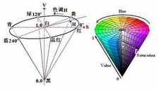
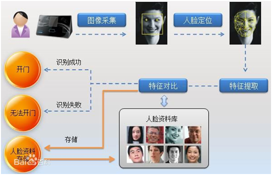
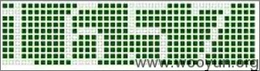
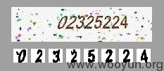
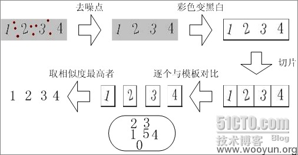
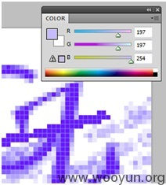

| 序号 | 修改时间   | 修改内容                             | 修改人 | 审稿人 |
| ---- | ---------- | ------------------------------------ | ------ | ------ |
| 1    | 2017-11-25 | 创建                                 | Keefe |        |
| 2    | 2018-2-25  | 从《图像处理》更名为《计算机视觉》。 | 同上   |        |
|      |            |                                      |        |        |

---

[TOC]

---

# 1  综述

## 1.1  简介

感知perception为智能休提供外界世界的信息．感知从传感器sensor开始．人工智能体包括多种感知器形态，其中包括听觉，视觉，触觉等．

智能体通过两种方法来利用它的感知信息．

*  特征抽取方法，　特征－＞行动

*  基于模型的方法

这两种方法本质上都是在感知信息与外界世界中建立一个联系。

触觉视觉中形成图像，然后对图像信息进行处理，处理过程可分为三个阶段．一是初级图像处理，对图像进行平滑去噪，抽取出图像的原始特征如边缘和区域等；二是提取图像的三维特征；三是图像识别．

**图像生成**

透镜成像，光学原理，色谱分析

**物体识别**

应用领域：生物鉴别，基于内容的图像检索，手写体识别等．

物体识别的两种方式

*  基于亮度的识别bright-based
*  基于特征的识别feature-based

按照计算机识别层次可分为
*  图像处理（静态图片）：图像的压缩、伸缩等。
*  图像分析：获取图像的特征。
*  计算机视觉：

## 1.2  图像类型及存储

在计算机中，按照颜色和灰度的多少可以将图像分为[二值图像](https://baike.baidu.com/item/二值图像)、[灰度图像](https://baike.baidu.com/item/灰度图像)、[索引图像](https://baike.baidu.com/item/索引图像)和真彩色RGB图像四种基本类型。

表格 1 图像类型比较列表

| 图像类型    | 简介                                                         | 取值范围                                                     | 存储大小 | 应用场景                                |
| ----------- | ------------------------------------------------------------ | ------------------------------------------------------------ | -------- | --------------------------------------- |
| 二值        | 二值图像可以看成是灰度图像的一个特例。                       | 0或1  “0”代表黑色，“1”代白色。                               | 1bit     | 文字、线条图的扫描识别（OCR）和掩膜图像 |
| 灰度        |                                                              | [0，255] “0”表示纯黑色，“255”表示纯白色，中间的数字从小到大表示由黑到白的过渡色。 | 1byte    |                                         |
| 索引        | 除了存放图像的二维矩阵外，还包括一个称之为颜色索引矩阵MAP的二维数组。 |                                                              |          | 存放色彩要求比较简单的图像              |
| 真彩色  RGB |                                                              | 每一像素的颜色需由R、G、B三个分量来表示。                    | 3byte    | 彩色图像                                |

**二值图像**

一幅二值图像的二维矩阵仅由0、1两个值构成，“0”代表黑色，“1”代白色。由于每一像素（矩阵中每一元素）取值仅有0、1两种可能，所以计算机中二值图像的数据类型通常为1个二进制位。二值图像通常用于文字、线条图的扫描识别（OCR）和掩膜图像的存储。

**灰度图像**

灰度图像矩阵元素的取值范围通常为[0，255]。因此其数据类型一般为8位无符号整数的（int8），这就是人们经常提到的256灰度图像。“0”表示纯黑色，“255”表示纯白色，中间的数字从小到大表示由黑到白的过渡色。在某些软件中，灰度图像也可以用双精度数据类型（double）表示，像素的值域为[0，1]，0代表黑色，1代表白色，0到1之间的小数表示不同的灰度等级。二值图像可以看成是灰度图像的一个特例。

**索引图像**

索引图像的文件结构比较复杂，除了存放图像的二维矩阵外，还包括一个称之为颜色索引矩阵MAP的二维数组。MAP的大小由存放图像的矩阵元素值域决定，如矩阵元素值域为[0，255]，则MAP矩阵的大小为256Ⅹ3，用MAP=[RGB]表示。MAP中每一行的三个元素分别指定该行对应颜色的红、绿、蓝单色值，MAP中每一行对应图像矩阵像素的一个灰度值，如某一像素的灰度值为64，则该像素就与MAP中的第64行建立了映射关系，该像素在屏幕上的实际颜色由第64行的[RGB]组合决定。也就是说，图像在屏幕上显示时，每一像素的颜色由存放在矩阵中该像素的灰度值作为索引通过检索颜色索引矩阵MAP得到。索引图像的数据类型一般为8位无符号整形（int8），相应索引矩阵MAP的大小为256Ⅹ3，因此一般索引图像只能同时显示256种颜色，但通过改变索引矩阵，颜色的类型可以调整。索引图像的数据类型也可采用双精度浮点型（double）。索引图像一般用于存放色彩要求比较简单的图像，如Windows中色彩构成比较简单的壁纸多采用索引图像存放，如果图像的色彩比较复杂，就要用到RGB真彩色图像。

**RGB彩色图像**

RGB图像与索引图像一样都可以用来表示彩色图像。与索引图像一样，它分别用红（R）、绿（G）、蓝（B）三原色的组合来表示每个像素的颜色。但与索引图像不同的是，RGB图像每一个像素的颜色值（由RGB三原色表示）直接存放在图像矩阵中，由于每一像素的颜色需由R、G、B三个分量来表示，M、N分别表示图像的行列数，三个M x N的二维矩阵分别表示各个像素的R、G、B三个颜色分量。RGB图像的数据类型一般为8位无符号整形，通常用于表示和存放真彩色图像，当然也可以存放灰度图像。

数字化图像数据有两种存储方式：位图存储(Bitmap)和矢量存储(Vector)

我们平常是以图像分辨率（即像素点）和颜色数来描述数字图象的。例如一张分辨率为640*480,16位色的数字图片，就由2^16=65536种颜色的307200(=640*480)个素点组成。

* 位图图像：位图方式是将图像的每一个象素点转换为一个数据，当图像是单色（只有黑白二色）时，8个象素点的数据只占据一个字节（一个字节就是8个二进制数，1个二进制数存放象素点）；16色（区别于前段“16位色”）的图像每两个象素点用一个字节存储；256色图像每一个象素点用一个字节存储。用数码相机和扫描仪获取的图像都属于位图。
* 矢量图像：矢量图像存储的是图像信息的轮廓部分，而不是图像的每一个象素点。例如，一个圆形图案只要存储圆心的坐标位置和半径长度，以及圆的边线和内部的颜色即可。

表格 2 图像存储方式位图和矢量的比较列表

| 存储方式   | 简介                                                   | 优点                                                         | 缺点                                                         | 应用实例                   |
| ---------- | ------------------------------------------------------ | ------------------------------------------------------------ | ------------------------------------------------------------ | -------------------------- |
| 位图Bitmap | 将图像的每一个象素点转换为一个数据。                   | 能够精确地描述各种不同颜色模式的图像图面，也容易在不同转件中相互转化。 | 无法制作真正的3D图像，并且图像缩放和旋转时会产生失真的现象，同时文件较大，对内存和硬盘空间容量的需求也较高。 | 数码相机和扫描仪获取的图像 |
| 矢量Vector | 存储的是图像信息的轮廓部分，而不是图像的每一个象素点。 | 图像缩放不会失真；图像的存储空间也要小得多。                 | 经常耗费大量的时间做一些复杂的分析演算工作，图像的显示速度较慢。 | 适合存储各种图表和工程。   |

### PNG格式

PNG格式分为三种类型：
*  PNG 8: 单通道，用2^8=256来存储颜色种类。
*  PNG 24: 2^24=16,772,216, RGB三通道。
*  PNG 32: 四通道，RGB+A（透明）。

PNG处理格式：
*  预解析：使用差分编码对图片进行预处理，处理每个像素里的每个通道值。
*  压缩：将预解析得到的结果进行Deflate压缩，由Huffman编码和LZ77压缩组成。

## 1.3  海量视频模型

包括HSV颜色模型、肤色模型、形状模型、人体可变形模型、混合高斯模型、概率图模型、感兴趣区域模型、视觉显著性模型、多分辨率模型、视觉词袋模型、视频语义模型等等。

表格 常见颜色空间

| 颜色空间 | 释义                                                         | 应用场景                                                     |
| -------- | ------------------------------------------------------------ | ------------------------------------------------------------ |
| RGB      | 每一像素的颜色需由R、G、B三个分量来表示。R~Red, G-Green, B-Blue。RGB 颜色空间是图像处理中最基本、最常用、面向硬件的颜色空间。 | 局限性：三个分量是高度相关的，所以连续变换颜色时并不直观，想对图像的颜色进行调整需要更改这三个分量才行。三个分量都与亮度密切相关。人眼对于这三种颜色分量的敏感程度是不一样，蓝色>绿色>红色。 RGB 颜色空间适合于显示系统，却并不适合于图像处理。 |
| HSV      | Hue（色调、色相）,用角度度量，所处光谱的位置，取值0~360。 Saturation（饱和度、色彩纯净度） ：表示颜色接近光谱的程度，取值0-100。 Value（明度），颜色的明暗程度，取值0-100. | 比 RGB 更接近人们对彩色的感知经验。非常直观地表达颜色的色调、鲜艳程度和明暗程度，方便进行颜色的对比。常用于分割指定颜色的物体。 |
| HLS      | Hue（色相）、Saturation（饱和度）、Lightness（亮度）。       | 对于一些人，HSL 更好的反映了“饱和度”和“亮度”作为两个独立参数的直觉观念。提取白色物体时，使用 HLS 更方便。 |
| CMYK     |                                                              |                                                              |

### 颜色模型HSV

​      颜色模型（又叫颜色空间）指的是某个三维颜色空间中的一个可见光子集，它包含某个色彩域的所有色彩。一般而言，任何一个色彩域都只是可见光的子集，任何一个颜色模型都无法包含所有的可见光。常见的颜色模型有RGB、CIECMY/CMYK、(HSK NTSC、YcbCr、HSV 等。

  海量视频常用HSV颜色模型。每一种颜色都是由[色相](https://baike.baidu.com/item/色相)（Hue，简H），[饱和度](https://baike.baidu.com/item/饱和度)（Saturation，简S，）和色明度（Value，简V）所表示的。HSV模型对应于[圆柱坐标系](https://baike.baidu.com/item/圆柱坐标系)中的一个圆锥形子集，圆锥的顶面对应于V=1。它包含RGB模型中的R=1，G=1，B=1 三个面，所代表的颜色较亮。色彩H由绕V轴的[旋转角](https://baike.baidu.com/item/旋转角)给定。红色对应于 角度0° ，绿色对应于角度120°，蓝色对应于角度240°。在HSV颜色模型中，每一种颜色和它的补色相差180°。饱和度S取值从0到1，所以圆锥顶面的半径为1。

Hue 用角度度量，取值范围为0～360°，表示色彩信息，即所处的光谱颜色的位置。颜色圆环上所有的颜色都是光谱上的颜色，从红色开始按逆时针方向旋转，Hue=0 表示红色，Hue=120 表示绿色，Hue=240 表示蓝色等。在 GRB中 颜色由三个值共同决定，比如黄色为即 (255,255,0)；在HSV中，黄色只由一个值决定，Hue=60即可。

Solution 饱和度表示颜色接近光谱色的程度。饱和度越高，说明颜色越深，越接近光谱色饱和度越低，说明颜色越浅，越接近白色。饱和度为0表示纯<u>白色</u>。取值范围为0～100%，值越大，颜色越饱和。

Value明度，决定颜色空间中颜色的明暗程度，明度越高，表示颜色越明亮，范围是 0-100%。明度为0表示纯<u>黑色</u>（此时颜色最暗）。

## 1.4  相关学科

### 计算机图形学

计算机图形学的主要研究内容就是研究如何在计算机中表示图形、以及利用计算机进行图形的计算、处理和显示的相关原理与算法。图形通常由点、线、面、体等几何元素和灰度、色彩、线型、线宽等非几何属性组成。计算机涉及到的几何图形处理一般有 2维到n维图形处理，边界区分，面积计算，体积计算，扭曲变形校正。对于颜色则有色彩空间的计算与转换，图形上色，阴影，色差处理等等。

 一张典型的jpeg图片，每个像素都可以放在一个5维的空间里，这5个维度分别 是X,Y,R,G,B，也就是像素的坐标和颜色，在计算机图形学中，有很多种色彩空间，最常用的比如RGB，印刷用的CYMK，还有比较少见的HSL或 者HSV，每种色彩空间的维度都不一样，但是可以通过公式互相转换。

### 模式识别

## 本章参考

[1]. 图像处理 [https://baike.baidu.com/item/%E5%9B%BE%E5%83%8F%E5%A4%84%E7%90%86/294902](https://baike.baidu.com/item/图像处理/294902) pencv
[2]. 颜色模型 https://baike.baidu.com/item/颜色模型

[3]:  https://zhuanlan.zhihu.com/p/67930839  “数字图像处理系列”

# 2  图像处理

图像处理(image processing)，用计算机对图像进行分析，以达到所需结果的技术。又称影像处理。图像处理一般指数字图像处理。数字图像是指用工业相机、摄像机、扫描仪等设备经过拍摄得到的一个大的二维数组，该数组的元素称为像素，其值称为灰度值。

## 2.1  图像处理常用方法

图像处理技术一般包括图像压缩，增强和复原，匹配、描述和识别3个部分。

1 ）图像**变换**：由于图像阵列很大，直接在空间域中进行处理，涉及计算量很大。因此，往往采用各种图像变换的方法，如傅立叶变换、沃尔什变换、离散余弦变换等间接处理技术，将空间域的处理转换为变换域处理，不仅可减少计算量，而且可获得更有效的处理（如傅立叶变换可在频域中进行数字滤波处理）。目前新兴研究的小波变换在时域和频域中都具有良好的局部化特性，它在图像处理中也有着广泛而有效的应用。

2 ）图像编码**压缩**：图像编码压缩技术可减少描述图像的数据量（即比特数），以便节省图像传输、处理时间和减少所占用的存储器容量。压缩可以在不失真的前提下获得，也可以在允许的失真条件下进行。编码是压缩技术中最重要的方法，它在图像处理技术中是发展最早且比较成熟的技术。

3 ）图像增强和**复原**：图像增强和复原的目的是为了提高图像的质量，如去除噪声，提高图像的清晰度等。图像增强不考虑图像降质的原因，突出图像中所感兴趣的部分。如强化图像高频分量，可使图像中物体轮廓清晰，细节明显；如强化低频分量可减少图像中噪声影响。图像复原要求对图像降质的原因有一定的了解，一般讲应根据降质过程建立“降质模型”，再采用某种滤波方法，恢复或重建原来的图像。

4 ）图像**分割**：图像分割是数字图像处理中的关键技术之一。图像分割是将图像中有意义的特征部分提取出来，其有意义的特征有图像中的边缘、区域等，这是进一步进行图像识别、分析和理解的基础。虽然目前已研究出不少边缘提取、区域分割的方法，但还没有一种普遍适用于各种图像的有效方法。因此，对图像分割的研究还在不断深入之中，是目前图像处理中研究的热点之一。

5 ）图像**描述**：图像描述是图像识别和理解的必要前提。作为最简单的二值图像可采用其几何特性描述物体的特性，一般图像的描述方法采用二维形状描述，它有边界描述和区域描述两类方法。对于特殊的纹理图像可采用二维纹理特征描述。随着图像处理研究的深入发展，已经开始进行三维物体描述的研究，提出了体积描述、表面描述、广义圆柱体描述等方法。

6 ）图像**分类**（识别）：图像分类（识别）属于模式识别的范畴，其主要内容是图像经过某些预处理（增强、复原、压缩）后，进行图像分割和特征提取，从而进行判决分类。图像分类常采用经典的模式识别方法，有统计模式分类和句法（结构）模式分类，近年来新发展起来的模糊模式识别和人工神经网络模式分类在图像识别中也越来越受到重视。

# 3  图像分析

一阶导数，或一阶微分。就是求图像灰度变化的导数，能够突出图像中的对象边缘。

二阶导数，求导数的导数，这对灰度变化强烈的地方会更敏感。

# 4  计算机识觉

# 5  视频大数据

# 6  应用举例

## 6.1  应用1：人脸识别

表格 3 生物识别技术列表

| 识别方式   | 易用性 | 准确性 | 防伪技术 | 人工审核 |
| ---------- | ------ | ------ | -------- | -------- |
| 眼血管识别 | 难     | 中度   | 无       | 难       |
| 虹膜       | 难     | 极高   | 中度     | 难       |
| 声纹       | 难     | 中度   | 弱       | 中度     |
| 掌纹       | 易     | 高     | 无       | 中度     |
| 指纹       | 易     | 高     | 弱       | 难       |
| 人脸       | 易     | 高     | 较强     | 易       |

人脸识别，是基于人的脸部特征信息进行身份识别的一种生物识别技术。用摄像机或摄像头采集含有人脸的图像或视频流，并自动在图像中检测和跟踪人脸，进而对检测到的人脸进行脸部的一系列相关技术，通常也叫做人像识别、面部识别。

### 6.1.1 人脸识别流程

人脸[识别](https://baike.baidu.com/item/识别)系统主要包括四个组成部分，分别为：人脸图像采集及检测、人脸图像预处理、人脸图像特征提取以及匹配与识别。

 

图 1 人脸识别过程

**人脸图像采集及检测**

人脸图像采集：不同的人脸图像都能通过摄像镜头采集下来，比如静态图像、动态图像、不同的位置、不同表情等方面都可以得到很好的采集。当用户在采集设备的拍摄范围内时，采集设备会自动搜索并拍摄用户的人脸图像。

人脸检测：人脸检测在实际中主要用于人脸识别的预处理，即在图像中准确标定出人脸的位置和大小。人脸图像中包含的模式特征十分丰富，如直方图特征、颜色特征、模板特征、结构特征及Haar特征等。人脸检测就是把这其中有用的信息挑出来，并利用这些特征实现人脸检测。

主流的人脸检测方法基于以上特征采用Adaboost学习算法，Adaboost算法是一种用来分类的方法，它把一些比较弱的分类方法合在一起，组合出新的很强的分类方法。

人脸检测过程中使用Adaboost算法挑选出一些最能代表人脸的矩形特征(弱分类器)，按照加权投票的方式将弱分类器构造为一个强分类器，再将训练得到的若干强分类器串联组成一个级联结构的层叠分类器，有效地提高分类器的检测速度。

**人脸图像预处理**

人脸图像预处理：对于人脸的图像预处理是基于人脸检测结果，对图像进行处理并最终服务于特征提取的过程。系统获取的原始图像由于受到各种条件的限制和随机干扰，往往不能直接使用，必须在图像处理的早期阶段对它进行灰度校正、噪声过滤等图像预处理。对于人脸图像而言，其预处理过程主要包括人脸图像的光线补偿、灰度变换、直方图均衡化、归一化、几何校正、滤波以及锐化等。

**人脸图像特征提取**

人脸识别系统可使用的特征通常分为视觉特征、像素统计特征、人脸图像变换系数特征、人脸图像代数特征等。人脸特征提取就是针对人脸的某些特征进行的。人脸特征提取，也称人脸表征，它是对人脸进行特征建模的过程。人脸特征提取的方法归纳起来分为两大类：一种是基于知识的表征方法；另外一种是基于代数特征或统计学习的表征方法。

基于知识的表征方法主要是根据人脸器官的形状描述以及他们之间的距离特性来获得有助于人脸分类的特征数据，其特征分量通常包括特征点间的欧氏距离、曲率和角度等。人脸由眼睛、鼻子、嘴、下巴等局部构成，对这些局部和它们之间结构关系的几何描述，可作为识别人脸的重要特征，这些特征被称为几何特征。基于知识的人脸表征主要包括基于几何特征的方法和模板匹配法。

**人脸图像匹配与识别**

提取的人脸图像的特征数据与数据库中存储的特征模板进行搜索匹配，通过设定一个阈值，当相似度超过这一阈值，则把匹配得到的结果输出。人脸识别就是将待识别的人脸特征与已得到的人脸特征模板进行比较，根据相似程度对人脸的身份信息进行判断。这一过程又分为两类：一类是确认，是一对一进行图像比较的过程，另一类是辨认，是一对多进行图像匹配对比的过程。

### 6.1.2 主要算法

一般来说，人脸识别系统包括图像摄取、人脸定位、图像预处理、以及人脸识别（身份确认或者身份查找）。系统输入一般是一张或者一系列含有未确定身份的人脸图像，以及人脸数据库中的若干已知身份的人脸图象或者相应的编码，而其输出则是一系列相似度得分，表明待识别的人脸的身份。

人脸识别算法分类

*  基于人脸特征点的识别算法（Feature-based recognition algorithms）。

*  基于整幅人脸图像的识别算法（Appearance-based recognition algorithms）。

*  基于模板的识别算法（Template-based recognition algorithms）。

*  利用神经网络进行识别的算法（Recognition algorithms using neura*  network）。

*  基于光照估计模型理论：提出了基于Gamma灰度矫正的光照预处理方法,并且在光照估计模型的基础上，进行相应的光照补偿和光照平衡策略。

*  优化的形变统计校正理论：基于统计形变的校正理论，优化人脸姿态；

*  强化迭代理论：强化迭代理论是对DLFA人脸检测算法的有效扩展；

*  独创的实时特征识别理论：该理论侧重于人脸实时数据的中间值处理，从而可以在识别速率和识别效能之间，达到最佳的匹配效果

## 6.2  应用2：验证码识别

全自动区分计算机和人类的图灵测试（英语：Completely Automated Public Turing test to tel*  Computers and Humans Apart，简称CAPTCHA），俗称验证码，是一种区分用户是计算机和人的公共全自动程序。可分为机器自动识别和社会工程的人工打码。

在破解验证码中需要用到的知识一般是像素，线，面等基本2维图形元素的处理和色差分析。识别验证码需要充分利用图片中的信息，才能把验证码的文字和背景部分分离。

常见工具为：

*  支持向量机(SVM)

*  OpenCV

*  图像处理软件(Photoshop,Gimp…)

*  Python Image Library

验证码的形式

*  纯文本验证码：建立对应题库

*  图形验证码：

### 6.2.1 验证码识别的原理和过程

**第一步：** **二值化**

所谓二值化就是把不需要的信息通通去除，比如背景，干扰线，干扰像素等等，只剩下需要识别的文字，让图片变成2进制点阵。

 

**第二步：** **文字分割**

为了能识别出字符，需要对要识别的文字图图片进行分割，把每个字符作为单独的一个图片看待。

 

**第三步：标准化**

对于部分特殊的验证码，需要对分割后的图片进行标准化处理，也就是说尽量把每个相同的字符都变成一样的格式，减少随机的程度

最简单的比如旋转还原，复杂点的比如扭曲还原等等。

 

**第四步：识别**

这一步可以用很多种方法，最简单的就是模板对比，对每个出现过的字符进行处理后把点阵变成字符串，标明是什么字符后，通过字符串对比来判断相似度。

在文章的后半部分会详细解释每步的各种算法

### 6.2.2 常用算法

**二值化算法**

对于大部分彩色验证码，通过判断色差和像素分布都能准确的把文字和背景分离出来，通过PS等工具把图片打开，用RGB探针对文字和背景图的颜色分别测试， 在测试多张图片后，很容易可以发现文字和背景图的RGB差距总是大于一个固定的阈值，即使每次图片的文字和背景颜色都会变化，比如：

新浪的验证码

 

**油漆桶算法（又叫种子填充算法，Floodfill）**

种子填充算法可以方便的计算出任意色块的面积，对于没有粘连字符或者粘连但是字符每个颜色不一样的验证码来说，去除干扰色块的效果很好，你只需要大概计算一下最小的和最大的字符平均占多少像素，然后把这段区间之外像素数的色块排除掉即可。

​              

上下左右4个方向填充还有8个方向填充的不同

**字符分割算法**

破解验证码的重点和难点就在于能否成功分割字符，这一点也是机器视觉里的一道难题，对物件的识别能力。对于颜色相同又完全粘连的字符，比如google的验证码，目前是没法做到5%以上的识别率的。不过google的验证码基本上人类也只有30%的识别率

对于字符之间完全没有粘连的验证码，比如这个->_->   

分割起来是非常的容易，用最基本的扫描线法就可以分割，比如从最左侧开始从上到下（y=0—||||y=n）扫描，如果没有遇到任何文字的像素，就则往右 一个像素然后再扫描，如果遇到有文字像素存在，就记录当前横坐标,继续向右扫，突然没有文字像素的时候，就说明到了两个字符直接的空白部分，重复这个步骤 再横向扫描就能找到每个字符最边缘4个像素的位置，然后可以用PIL内建的crop功能把单独的字符抠出来。

对于有少许粘连但是只是在字符边角的地方重叠几个像素的验证码，可以用垂直像素直方图的统计方法分割。

## 6.3  车牌识别

## 6.4  异常行为检测

## 6.5  暴力行为识别

## 本章参考

[1]. 机器自动识别验证码的原理是怎么样的？ https://www.zhihu.com/question/22479139

[2]. 常见验证码的弱点与验证码识别 http://www.vuln.cn/6870

[3]. 常见验证码的弱点与验证码识别 http://www.cnseay.com/3061/

# 参考资料

