| 序号  | 修改时间       | 修改内容                  | 修改人   | 审稿人 |
| --- | ---------- | --------------------- | ----- | --- |
| 1   | 2018-4-5   | 创建。从《大数据开发》拆分出BI内容。   | Keefe |     |
| 2   | 2019-12-14 | 增加数据湖章节。              | 同上    |     |
| 3   | 2021-10-22 | 迁移BI自助分析章节到《数据可视化工具》。 | 同上    |     |
| 4   | 2021-12-3  | 迁移数据治理章节到《数据平台》。      | 同上    |     |

<br>

<br>
<br>
<br>

---

[TOC]

<br>
<br>

---

# 1 BI概述

## 1.1  BI简介

BI（Business Intelligence）即商务智能，它是一套完整的解决方案，用来将企业中现有的数据进行有效的整合，快速准确地提供报表并提出决策依据，帮助企业做出明智的业务经营决策。

商业智能的关键是从许多来自不同的企业运作系统的数据中提取出有用的数据并进行清理，以保证数据的正确性，然后经过抽取（Extraction）、转换（Transformation）和装载（Load），即ETL过程，合并到一个企业级的数据仓库里，从而得到企业数据的一个全局视图，在此基础上利用合适的查询和分析工具、数据挖掘工具、OLAP工具等对其进行分析和处理（这时信息变为辅助决策的知识），最后将知识呈现给管理者，为管理者的决策过程提供数据支持。商业智能产品及解决方案大致可分为**数据仓库**产品、**数据抽取**产品、**OLAP**产品、展示产品、和集成以上几种产品的针对某个应用的整体解决方案等。

**BI的发展阶段**

* Excel报表：在这个阶段催生了一个职业群体就是“表哥表妹”，他们每天都要从公司不同的ERP、CRM、财务系统中导出大量数据，再将多个表格用vlookup和sumif进行关联计算，最后通过把可视化图表截图放到PPT里进行日报和周报汇报。而至于领导到底会不会看，他们也不关心，因为无力关心。

* 报表系统：也是传统报表的升级版，可以直接对接某个业务系统的数据源，对于数据的响应速度比Excel明显提升，已经可以支持权限管理等，但还是偏向于数据汇报，很难辅助决策。

* 传统BI：首先可以对接多个系统的数据源，将所有数据整合到一个平台中进行全局分析。其次就是支持实时数据展示，分析维度和深度也远远强于报表系统，支持下钻、联动等数据交互。最后在数据承载量和反应速度上具有明显优势，不仅是汇报工具，更能够辅助决策。

* 智能BI：和传统BI一样都是支撑决策，但是用户使用层面强调低代码（或零代码）开发、无缝对接、灵活部署，比如用观远Smart ETL托拉拽进可以做分析看板，无需重新建模，赋能普通业务人员做数据分析的能力，让数据员有更多时间可以专注如何将分析与业务结合。并且，还可以借助AI算法的能力构建基于未来的分析模型，比如销售预测、智能排课等。

  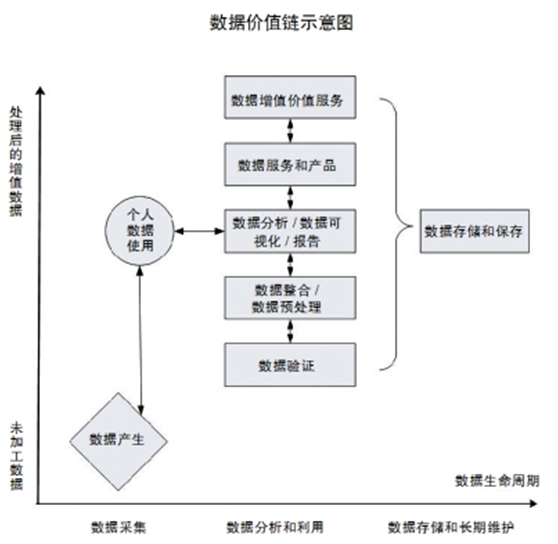

图 1 数据价值链示意图

* 数据集成：主要是数据抽取产品
* 数据仓库：
* 数据分析产品：包括数据挖掘、OLAP
* 数据可视化：详见《[数据可视化工具](../软件可复用/tools.工具/数据可视化工具.md)》

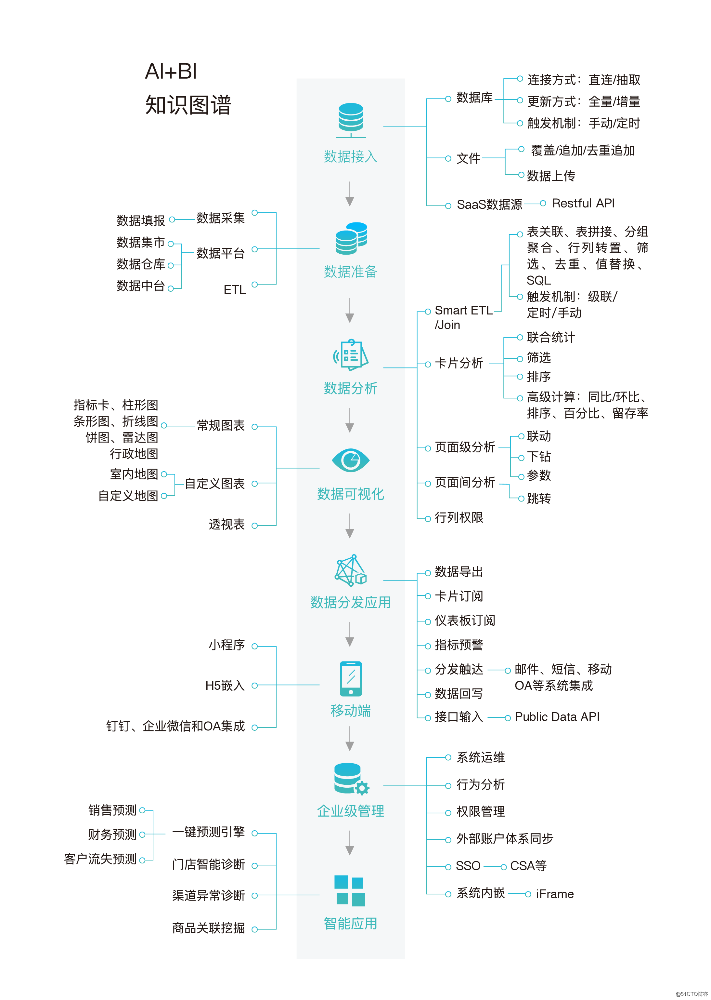

图   AI+BI知识图谱

说明：

* 数据接入：数据来源有数据库、文件和SAAS源。数据接入工具有Sqoop，OGG等。
* 数据准备：数据经过ETL后要处理的形态，有数据仓库、数据集市等多种形式。
* 数据分析：
* 数据可视化：常规图表、自定义图表等。图表框架一般来自于开源Echarts, D3等。
* 数据分发：桌面端、移动端和小程序。
* 企业级管理：系统集成
* 智能应用：

## 1.2  BI市场和主要工具

 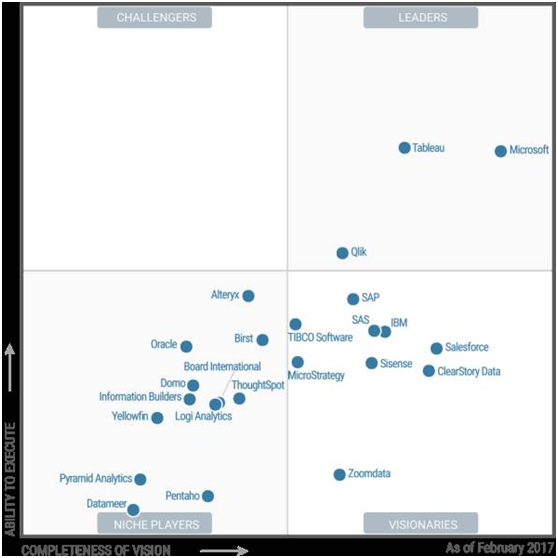

图 2  Gartner 2017年商业智能与分析魔力象限

说明：领导者象限（第一象限）有Microsoft PowerBI,  Tableau, Qlik。

图 2020年商业智能软件市场厂商份额（中国）

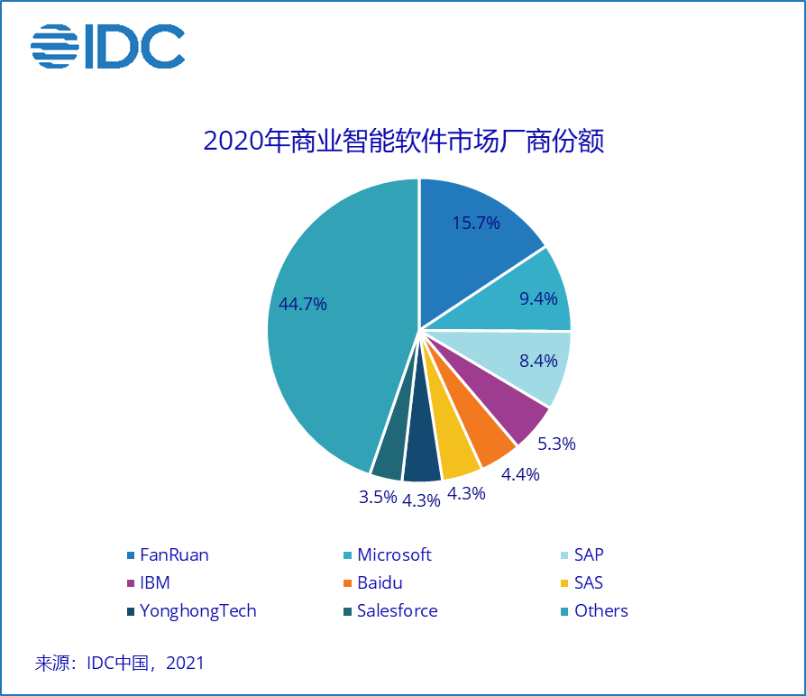

说明：帆软（FanRuan）继续以15.7%的市场份额排名第一，2020年帆软加强了客户成功体系的建设并扩大了人员规模，保持市场竞争力；微软（Microsoft）Power BI和SAP分别以9.4%和8.4%排在第二、三位；IBM在金融行业有长期的的用户基础，以5.3%的份额排在第四位；百度（Baidu）凭借搜索平台的优势，获得大量云上广告分析、营销分析等场景的用户，以4.4%的份额排在第五位。国内厂商有三家，按排名分别是帆软、百度和永洪。

表格 1 BI厂商列表

|          | 主流厂商                                                                                                    | 侯选厂商     |
| -------- | ------------------------------------------------------------------------------------------------------- | -------- |
| 全领域      | IBM公司、[Oracle](https://baike.baidu.com/item/Oracle)、[Microsoft](https://baike.baidu.com/item/Microsoft) |          |
| 数据集成 DI  | [Informatica](https://baike.baidu.com/item/Informatica)                                                 | QlikView |
| 数据仓库 DW  | [Sybase](https://baike.baidu.com/item/Sybase)、[Teradata](https://baike.baidu.com/item/Teradata)、        | SAP      |
| 数据挖掘 DM  | SAS                                                                                                     |          |
| 数据集市 DM2 |                                                                                                         |          |

表格 2 BI工具列表

| 公司                                                  | 工具                                               | 简介                                                                                                                                                                                                                |
| --------------------------------------------------- | ------------------------------------------------ | ----------------------------------------------------------------------------------------------------------------------------------------------------------------------------------------------------------------- |
| IBM                                                 | IBM SPSS Modeler                                 | 原名Clementine，2009年被IBM收购后对产品的性能和功能进行了大幅度改进和提升。它封装了最先进的统计学和数据挖掘技术，来获得预测知识并将相应的决策方案部署到现有的业务系统和业务过程中，从而提高企业的效益。同那些仅仅着重于模型的外在表现而忽略了数据挖掘在整个业务流程中的应用价值的其它数据挖掘工具相比，　SPSS Modeler具有功能强大的数据挖掘算法，使数据挖掘贯穿业务流程的始终。            |
|                                                     | IBM PureData  (Netezza)                          |                                                                                                                                                                                                                   |
|                                                     | `datastage`                                      | 最专业的ETL工具，价格不菲，使用难度一般                                                                                                                                                                                             |
| [Microsoft](https://baike.baidu.com/item/Microsoft) |                                                  | 主要包括SQL Server、power BI                                                                                                                                                                                           |
|                                                     | SQL Server                                       | Microsoft的SQL Server中集成了数据挖掘工具，借助SQL  Server的数据库管理功能，用户可以实现数据挖掘建模。在SQL Server2008中提供了决策树算法、聚类分析算法、Naive Bayes 算法、关联规则算法、时序算法、神经网络算法、线性回归算法等9种常用的数据挖掘算法。但是其预测建模的实现是基于SQL Server平台的，平台移植性相对较差，也没有考虑综合各种预测方法来优化预测结果。 |
|                                                     | [power BI](https://powerbi.microsoft.com/zh-cn/) | Power BI 是一套商业分析工具，用于在组织中提供见解。可连接数百个数据源、简化数据准备并提供即席分析。生成美观的报表并进行发布，供组织在 Web 和移动设备上使用。每个人都可创建个性化仪表板，获取针对其业务的全方位独特见解。在企业内实现扩展，内置管理和安全性。                                                                             |
| [Oracle](https://baike.baidu.com/item/Oracle)       | Oracle Exadat                                    |                                                                                                                                                                                                                   |
|                                                     |                                                  |                                                                                                                                                                                                                   |
| SAP                                                 | Hana                                             |                                                                                                                                                                                                                   |
| SAS                                                 | SAS Enterprise Miner（EM）                         | SAS推出的一个集成的数据挖掘系统，允许使用和比较不同的技术，同时还集成了复杂的数据库管理软件。它的运行方式是通过在一个工作空间（workspace）中按照一定的顺序添加各种可以实现不同功能的节点，然后对不同节点进行相应的设置，最后运行整个工作流程(workflow)，便可以得到相应的结果。                                                                |
| Mathworks                                           | MATLAB                                           | （Matrix Laboratory,矩阵实验室）是美国Mathworks公司开发的应用软件，具备强大的科学及工程计算能力，它不但具有以矩阵计算为基础的强大数学计算能力和分析功能，而且还具有丰富的可视化图形表现功能和方便的程序设计能力。                                                                                            |
| Teradata                                            | AsterData                                        | 数据仓库。                                                                                                                                                                                                             |

## 1.3  方法论

方法论还可参见 《[运营专题](运营专题.md)》中的数字化运营5W法。

### BI业务分析：五步曲

* 确定正确的人（使用者）：决策层、管理层和执行层。
* 确定正确的信息（内容）：收集业务分析需求，提炼业务指标，构建业务分析线路
* 确定场景：如月度经营分析会，半年或全年的战略或计划会，报表上报或对外披露，日常查询、分析和监控，对外形象展示
* 正确的（方式）：可视化展示、分析报表展示、格式报表展示、自助查询分析、自助分析报告
* 支持辅助功能（行为）：数据回写、批量上报、批量导出、自动切换、数据自动刷新、数据推送等

BI系统实施步骤（由下至上）： 连接数据 --> 数据处理 --> 数据建模 --> 制作数据报表 --> 非功能需求实现

<br>

## 本章参考

* BI的前世今生  https://blog.51cto.com/u_14689762/2480413

* 《大道至简的数据治理方法论》

* 《大道至简的数据体系构建方法论》 https://ask.hellobi.com/blog/yonghongtech/3044

* 《大道至简的深度分析方法论》

<br><br>

<br>

# 2 数据集成.DI

离线或实时地从别的数据库或数据来源采集数据。

## 2.1  ETL

**ETL**，是英文 Extract-Transform-Load 的缩写，用来描述将数据从来源端经过抽取（extract）、转换（transform）、加载（load）至目的端的过程。ETL一词较常用在数据仓库，但其对象并不限于数据仓库。

ETL是构建数据仓库的重要一环，用户从数据源抽取出所需的数据，经过数据清洗,最终按照预先定义好的数据仓库模型，将数据加载到数据仓库中去。

* Extract：处理缺省值、空值和异常值；数据类型转化；修改不合规字段；编码方式/统计口径不一致。
* Transform：单变量自身转换；多变量相互衍生。
* Load:  装载

**数据抽取**

抽取方式：全量或增量。

抽取手段：timestamp、触发器、备案/快照、日志

表格  CDC四种方案比较

| 比较项         | timestamp | 触发器 | 快照  | 日志  |
| ----------- | --------- | --- | --- | --- |
| 能区分插入/更新    | ×         | √   | √   | √   |
| 周期内，能检测多次更新 | ×         | √   | ×   | √   |
| 能检测到删除      | ×         | √   | √   | √   |
| 不具有侵入性      | ×         | ×   | ×   | √   |
| 支持实时        | ×         | √   | ×   | √   |
| 不依赖数据库      | √         | ×   | √   | ×   |

### ETL工具

* 商业版: Informatica、Datastage、微软DTS、Navicat、OWB、
* 开源：[Kettle](http://baike.baidu.com/view/2486337.htm)、eclipse的etl插件~cloveretl

表格  ETL商业工具列表

| 工具                    | 厂商                                           | 简介                                                                                                      | 特性                                                                                                                 |
| --------------------- | -------------------------------------------- | ------------------------------------------------------------------------------------------------------- | ------------------------------------------------------------------------------------------------------------------ |
| Datastage             | IBM                                          | 2005年被IBM收购.<br/>IBM公司的商业软件，最专业的ETL工具，价格不菲，适合大规模的ETL应用。                                                 |                                                                                                                    |
| PowerCenter           | [Informatica](http://www.informatica.com.cn) | 入华时间2005年。全球领先的数据管理软件提供商。在如下Gartner魔力象限位于领导者地位：数据集成工具、数据质量工具 、元数据管理解决方案 、主数据管理解决方案 、企业级集成平台即服务（EiPaaS）。 | 专业程度如Datastage旗鼓相当，价格似乎比Datastage便宜。<br>用于访问和集成几乎任何业务系统、任何格式的数据，它可以按任意速度在企业内交付数据，具有高性能、高可扩展性、高可用性的特点。              |
| Oracle Goldengate-OGG | Oracle                                       | 基于日志的结构化数据复制软件。可实时同步Oracle数据。能够实现大量交易数据的实时捕捉、变换和投递，实现源数据库与目标数据库的数据同步，保持亚秒级的数据延迟。                        | 与oracle数据库耦合太深。<br>源端通过抽取进程提取redo log或archive log日志内容，通过pump进程（TCP/IP协议）发送到目标端，最后目标端的rep进程接收日志、解析并应用到目标端，进而完成数据同步。 |
| DTS                   | 微软                                           |                                                                                                         |                                                                                                                    |
|                       | Data Pipeline                                | 一家为企业用户提供数据基础架构服务的科技公司。                                                                                 | 整合了数据质量分析、质量校验、质量监控等多方面特性， 以保证数据质量的完整性、一致性、准确性及唯一性，彻底解决数据孤岛和数据定义进化的问题。                                             |

表格  ETL开源工具列表

| 工具                                | 源码                               | 简介                                                                                   | 特性                                                                                                                 |
| --------------------------------- | -------------------------------- | ------------------------------------------------------------------------------------ | ------------------------------------------------------------------------------------------------------------------ |
| Kettle                            | http://kettle.pentaho.org/       | 2006年被Pentaho公司收购，改名为Pentaho Data Integration。<br>有商业版和开源版。。                         | Java开发，跨平台运行。,支持**单机、集群**方式部署。                                                                                     |
| Apatar                            | http://apatar.com/               | Java 编写，是一个开源的数据抽取、转换、 装载(ETL)项目。                                                    | 提供可视化的 Job 设计器与映射工具，支持所有主流数据源，提供灵活的基于 GUI、服务器和嵌入式的部署选项。                                                            |
| DataX                             | https://github.com/alibaba/DataX | 阿里巴巴集团内被广泛使用的离线数据同步工具/平台。                                                            | 实现包括 MySQL、Oracle、SqlServer、Postgre、HDFS、Hive、ADS、HBase、TableStore(OTS)、MaxCompute(ODPS)、DRDS 等各种异构数据源之间高效的数据同步功能。 |
| [Sqoop](http://sqoop.apache.org/) | https://attic.apache.org/        | SQL-to-Hadoop的简称。开始于2009年，最早是作为Hadoop的一个第三方模块存在，后成为Apache独立项目。2021.6，移入Apache attic。 | 主要用于传统数据库与HADOOP之间传输数据。                                                                                            |
| Apache Camel                      | http://camel.apache.org/         | 非常强大的基于规则的路由以及媒介引擎。                                                                  | 可以在 IDE 中用简单的 Java Code 就可以写出一个类型安全并具有一定智能的规则描述文件。                                                                 |
| Heka                              | http://hekad.readthedocs.io      | 来自 Mozilla 的 Heka 是一个用来收集和整理来自多个不同源的数据的工具                                            | 通过对数据进行收集和整理后发送结果报告到不同的目标用于进一步分析。                                                                                  |
| Talend                            | http://www.talend.com/           | Talend (踏蓝) 是第一家针对的数据集成工具市场的 ETL开源软件供应商。                                             | Talend 以它的技术和商业双重模式为 ETL 服务提供了一个全新的远景。<br>可运行于 Hadoop 集群之间，直接生成 MapReduce 代码供 Hadoop 运行，从而可以降低部署难度和成本，加快分析速度。      |
| Scriptella                        | http://scriptella.org/           | 开源的 ETL工具和一个脚本执行工具，采用 Java 开发。                                                       | 支持跨数据库的 ETL 脚本，并且可以在单个的 ETL 文件中与多个数据源运行。可以与 Java EE，Spring，JMX，JNDI 和 JavaMail 集成。                                 |

表格 ETL工具功能比较

| 工具名称                                            | 简介                                                                                                                            | 软件<br>性质 | 数据同步方式                                                                           | 作业调度                                           |
|:----------------------------------------------- |:----------------------------------------------------------------------------------------------------------------------------- |:-------- |:-------------------------------------------------------------------------------- |:---------------------------------------------- |
| Informatica（美国）                                 |                                                                                                                               | 商业图形界面   | 支持增量抽取，增量抽取的处理方式，增量加载的处理方式，提供数据更新的时间点或周期                                         | 工作流调度，可按时间、事件、参数、指示文件等进行触发，从逻辑设计上，满足企业多任务流程设计。 |
| Beeload/BeeDI                                   | 2004年发布V1.0 http://www.livbee.com<BR>国产品牌：专注、专业、专一ETL工具产品化的及技术性的原厂商，提供产品使用授权及服务                                               | 商业图形界面   | 全量同步时间戳增量、触发器增量差异比对、CDC增量 提供图形界面配置                                               | 内置工作流调度功能，支持相关作业协同、定时及特定条件的执行。                 |
| Data stage                                      |                                                                                                                               | 商业图形界面   | 全量同步时间戳增量差异比对同步                                                                  | 通常使用第三方调度工具                                    |
| [Kettle](http://kettle.pentaho.org/)            |                                                                                                                               | 商业开源图形界面 | 全量同步时间戳增量差异比对同步                                                                  | 需要借助第三方调度工具控制作业执行时间                            |
| [Talend](http://www.talend.com/)（法国 2005年）      | 以 Eclipse 的插件方式提供界面。                                                                                                          | 开源图形界面   | 全量同步增量同步方式需要Java自定义                                                              | 没有内置调度，需要写Java自定义逻辑或使用其它调度工具                   |
| [Apatar](http://apatar.com/)                    | Apatar 用 Java 编写，是一个开源的数据抽取、转换、 装载(ETL)项目。                                                                                    | 开源图形界面   | 全量同步增量同步方式需要代码自定义                                                                | 没有内置调度                                         |
| Alooma                                          |                                                                                                                               | 商业图形界面   | 全量同步时间戳增量CDC增量 依赖于数据库是否有对应CDC接口。需要复杂的配置及维护                                       | 通过脚本定义作业执行时间                                   |
| [Scriptella](http://scriptella.org/)            | Scriptella 是一个开源的 ETL (抽取-转换-加载)工具和一个脚本执行工具，采用 Java 开发。                                                                       | 开源脚本     | 完全写脚本处理同步过程                                                                      | 完全写脚本处理调度                                      |
| [Heka](http://hekad.readthedocs.io/en/v0.10.0/) |                                                                                                                               | 开源脚本     | 一个用来收集和整理来自多个不同源的数据的工具，通过对数据进行收集和整理后发送结果报告到不同的目标用于进一步分析。通常用于系统日志分析。需要自定义数据库同步方式。 |                                                |
| Automation                                      | 提供了一套ETL框架。它没有将注意力放在如何处理“转换”这个环节上，而是利用Teradata数据库本身的并行处理能力，用SQL语句来做数据转换的工作，其重点是提供对ETL流程的支持，包括前后依赖、执行和监控等其实应该叫做ELT，即装载是在转换之前的。 | 商业脚本     | 依附于Teradata数据库本身的并行处理能力，用SQL语句来做数据转换的工作，其重点是提供对ETL流程的支持，包括前后依赖、执行和监控等            | Teradata 调度                                    |
| symmetricds                                     | 开源按数据量和服务器收费                                                                                                                  | 开源       | 触发器方式有锁表问题                                                                       |                                                |

### Kettle

kettle官网 https://community.hitachivantara.com/docs/DOC-1009855

github源码 https://github.com/pentaho/pentaho-kettle

Kettle最早是一个开源的ETL工具，全称为[KDE ](https://baike.baidu.com/item/KDE /5108022)Extraction, Transportation, Transformation and Loading Environment。在2006年，Pentaho公司收购了Kettle项目，原Kettle项目发起人Matt Casters加入了Pentaho团队，成为Pentaho套件数据集成架构师 ；从此，Kettle成为企业级数据集成及[商业智能](https://baike.baidu.com/item/商业智能/406141)套件Pentaho的主要组成部分，Kettle亦重命名为Pentaho Data Integration(缩写为PDI)。Pentaho公司于2015年被[Hitachi ](https://baike.baidu.com/item/Hitachi /1357483)Data Systems（2017年改名为Hitachi Vantara）收购。

Pentaho Data Integration以Java开发，支持跨平台运行，其特性包括：支持100%无编码、拖拽方式开发ETL数据管道；可对接包括传统数据库、文件、大数据平台、接口、流数据等数据源；支持ETL数据管道加入机器学习算法。**用于数据库间的数据迁移** 。可以在Linux、windows、unix 中运行。有图形界面，也有命令脚本还可以二次开发。Kettle 中有两种脚本文件，transformation 和 job，transformation 完成针对数据的基础转换，job 则完成整个工作流的控制。

Pentaho Data Integration分为商业版与开源版。在中国，一般人仍习惯把Pentaho Data Integration的开源版称为Kettle。

企业商用版提供 <u>专业支持服务</u>和 <u>软件维修服务</u>。

表格 Kettle开源版和商业版功能差别

| 软件增强功能     | 开源社区版 | 企业商用版                              |
| ---------- | ----- | ---------------------------------- |
| Hadoop平台集成 | 有限集成  | 厂家专用插件（CDH, HDP, EMR等）             |
| Hadoop安全性  | 不支持   | AES加密、Kerberos、Sentry及Ranger支持     |
| AEL性能提升引擎  | 不支持   | 数据集成任务下压至Spark引擎执行                 |
| 数据库事务性保障   | 不支持   | 作业失败后，数据自动回滚                       |
| 失败作业处理方式   | 从头执行  | 透过设置Checkpoint使作业在失败前断点重新执行        |
| 任务计划调度     | 不支持   | Schedule设置任务执行时间和执行配置              |
| 资源库版本管理    | 不支持   | 支持作业和转换版本管理，方便协同开发                 |
| 机器学习步骤     | 不支持   | 提供20+常用算法，包括Python, R脚本执行支持。       |
| 作业监控分析     | 不支持   | Operations Mart支持对作业运行数据做BI分析      |
| 流数据对接      | 有限支持  | 支持JMS, Kafka, AMPQ, Kinesis和MQTT协议 |
| Pentaho分析仪 | 不支持   | 图形化构建Cube进行多维分析                    |
| 互交式报表      | 不支持   | 互交式报表支持查询、联动、过滤筛选                  |
| 自助服务仪表盘设计  | 不支持   | 自助式构建个性化仪表盘                        |
| SDR自助数据集市  | 不支持   | 透过ETL作业自动发布OLAP Cube               |
| JDBC驱动分发工具 | 不支持   | 提供分发工具，方便用户安装JDBC驱动                |

Kettle 中文名称叫水壶，该项目的主程序员MATT 希望把各种数据放到一个壶里，然后以一种指定的格式流出。
Kettle家族目前包括4个产品：Spoon、Pan、CHEF、Kitchen。

* SPOON（勺子） 允许你通过图形界面来设计ETL转换过程（Transformation）(最经常使用)。
* PAN（煎锅） 允许你批量运行由Spoon设计的ETL转换 (例如使用一个时间调度器)。Pan是一个后台执行的程序，没有图形界面。
* CHEF（厨师） 允许你创建任务（Job）。 任务通过允许每个转换，任务，脚本等等，更有利于自动化更新数据仓库的复杂工作。任务通过允许每个转换，任务，脚本等等。任务将会被检查，看看是否正确地运行了。
* KITCHEN（厨房） 允许你批量使用由Chef设计的任务 (例如使用一个时间调度器)。KITCHEN也是一个后台运行的程序。

## 2.2  数据转换

全链路跟踪：SPM法~A.B.C.D.E分别对应于站点.页面ID.页面模块.索引.UUID

### Apache Sqoop

#### Sqoop简介与架构

Sqoop：SQL–to–Hadoop

正如Sqoop的名字所示：Sqoop是一个用来将关系型数据库和Hadoop中的数据进行相互转移的工具，可以将一个关系型数据库(例如mysql、Oracle)中的数据导入到Hadoop.

表格 7 Sqoop1与Sqoop2比较

| 比较  | Sqoop1                                      | Sqoop2                                                                                           |
| --- | ------------------------------------------- | ------------------------------------------------------------------------------------------------ |
| 架构  | 仅仅使用一个Sqoop客户端                              | 引入了Sqoop server集中化管理connector，以及rest api，web，UI，并引入权限安全机制                                        |
| 部署  | 部署简单，安装需要root权限，connector必须符合 JDBC模型        | 架构稍复杂，配置部署更繁琐                                                                                    |
| 使用  | 命令行方式容易出错，格式紧耦合，无法支持所有数据 类型，安全机制不够完善，例如密码暴漏 | 多种交互方式，命令行，web UI，rest API，conncetor集中化管理，所有的链接安装在Sqoop s erver上，完善权限管理机制，connector规范化，仅仅负责数据的读写 |

备注：sqoop1和sqoop2并不兼容。

 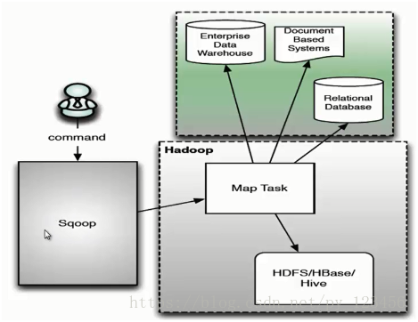

图 19 Sqoop1架构

说明：sqoop1架构主要由三个部分组成：Sqoop client、HDFS/HBase/Hive、Database。用户向 Sqoop 发起一个命令之后，这个命令会转换为一个基于 Map Task 的 MapReduce 作业。Map Task 会访问数据库的元数据信息，通过并行的 Map Task 将数据库的数据读取出来，然后导入Hadoop中。 当然也可以将Hadoop中的数据，导入传统的关系型数据库中。它的核心思想就是通过基于Map Task（只有 map）的MapReduce 作业，实现数据的并发拷贝和传输，这样可以大大提高效率。

#### Sqoop使用要点

```sh
# sqoop import导入示例：
sqoop import \ --connect jdbc:mysql://db.dajiangtai.net:3306/djtdb_hadoop \
--username sqoop \
--password sqoop \
--table user \        # 要读取的数据库表
--target-dir /junior/sqoop/ \     #可选，不指定目录，数据默认导入到/user下
--where "sex='female'" \     #可选，过滤从数据库中要导入的数据。
--as-sequencefile \          #可选，不指定格式，数据格式默认为 Text 文本格式
--num-mappers 10 \          #可选，指定 Map 任务的并发度。这个数值不宜太大
--null-string '\\N' \       #可选
--null-non-string '\\N'    #可选
```

表格 8 sqoop**常用参数**

| ` `                                       | `参数`                                     | 含义                            |
| ----------------------------------------- | ---------------------------------------- | ----------------------------- |
| 增量导入 import                               | `--incremental [append                   | lastmodified]`                |
| --check-column [column]                   | 检查的字段作为判断条件，字段不能是字符串类型，一般为时间或数值类型        |                               |
| --last-value [value]                      | 如果是时间：则为此日期之后的才导入；如果是数值，则大于此值的才导入。       |                               |
| sqoop import                              | --compress                               | 对导入数据压缩，默认压缩算法是gzip           |
| ` `                                       | -m, --num-mappers                        | `指定 Map 任务的并发度`               |
|                                           | --split-by                               | 分隔字段，可用于并行查找（与-m配合使用），一般用于主键。 |
|                                           | --target-dir                             | 指定数据目录，一般配合分区字段使用             |
| 覆盖导入                                      | --delete-target-dir                      | 导入前先删除目录目录                    |
| 导出 export                                 | --Dsqoop.export.records.per.statement=10 | 指定每次导入10条数据                   |
| ` `                                       | --batch                                  | 指定是批量导入                       |
| --update-key id                           | 更新已有数据                                   |                               |
| --update-key id --update-mode allowinsert | 数据存在更新；不存在插入                             |                               |

备注：1. 导入时--delete-target-dir和-- incremental参数不能并用。

2. 导入分区表，需要创建有分区的表，分区 有按日期、范围、列表等。示例如下

```sql
CREATE TABLE `YDDT` (
 `ID` string,
 `YDJC_ID` string,
 `YDDT_DATA_TYPE` string,
 `YDDT_BUSSINESS_NOW` bigint,

 `YDDT_USER_NOW` bigint,
 `YDDT_COLLECT_TIME` string,
 `YDDT_CREATOR` string,
 `YDDT_DATE` string,
 `BACK` string
) PARTITIONED BY (day int) row format delimited fields terminated by '\t';
```

导入表

```shell
sqoop import --connect jdbc:mysql://172.20.13.50:3306/TestBigDate --username root --password 123456 --table YDDT_2017_06_01 -m 3 --target-dir /user/hive/warehouse/dxyjpt.db/yddt/day=20170601 --fields-terminated-by '\t'
```

```sql
# 标记表的分区信息
alter table yddt add partition(day='20170601') location '/user/hive/warehouse/dxyjpt.db/yddt/day=20170601'

# 删除分区数据
ALTER TABLE yddt DROP IF EXISTS PARTITION(day='20170604')
```

禁止明文密码：

* -P:sqoop 命令行最后使用 -P，此时提示用户输入密码
* –password-file：指定一个密码保存文件，读取密码。我们可以将这个文件设置为只有自己可读的文件，防止密码泄露。

空字符串处理：–null-string，–null-non-string：同时使用可以将数据库中的空字段转化为’\N’，因为数据库中字段为 null，会占用很大的空间。

### OGG

Oracle GoldenGate（OGG） Oracle数据转换。

- OGG 是一种基于日志的结构化数据复制软件，它通过解析源数据库在线日志或归档日志获得数据的增删改变化（数据量只有日志的四分之一左右）。
- OGG 能够实现大量交易数据的实时捕捉，变换和投递，实现源数据库与目标数据库的数据同步，保持最少10ms的数据延迟。

**基本架构**

Oracle GoldenGate主要由如下组件组成

| 组件         | 说明                                                                                                                                                                                                                            |
| ---------- | ----------------------------------------------------------------------------------------------------------------------------------------------------------------------------------------------------------------------------- |
| Manager    | 不管是源端还是目标端必须并且只能有一个Manager进程，可以启动、关闭、监控其他进程的健康状态，报告错误事件、分配数据存储空间，发布阀值报告等，其作用： 1：监控与启动 GoldenGate 的其它进程 2：管理 trail 文件及 Reporting                                                                                               |
| Extract    | Extract 进程运行在数据库源端上，它是Golden Gate的捕获机制，可以配置Extract 进程来做如下工作： 1：初始数据装载：对于初始数据装载，Extract 进程直接从源对象中提取数据 2：同步变化捕获：保持源数据与其它数据集的同步。初始数据同步完成后，Extract 进程捕获源数据的变化；如DML变化、 DDL变化等                                                      |
| Replicat   | Replicat 进程是运行在目标端系统的一个进程，负责读取 Extract 进程提取到的数据（变更的事务或 DDL 变化）并应用到目标数据库，就像 Extract 进程一样，也可以配置 Replicat 进程来完成如下工作： 1：初始化数据装载：对于初始化数据装载，Replicat 进程应用数据到目标对象或者路由它们到一个高速的 Bulk-load 工具上； 2：数据同步，将 Extract 进程捕获到的提交了的事务应用到目标数据库中； |
| Collector  | Collector 是运行在目标端的一个后台进程，接收从 TCP/IP 网络传输过来的数据库变化，并写到 Trail 文件里                                                                                                                                                                |
| Trails     | 为了持续地提取与复制数据库变化，GoldenGate 将捕获到的数据变化临时存放在磁盘上的一系列文件中，这些文件就叫做 Trail 文件                                                                                                                                                          |
| Data Pumps | Data Pump 是一个配置在源端的辅助的 Extract 机制，Data Pump 是一个可选组件，如果不配置 Data Pump，那么由 Extract 主进程将数据发送到目标端的 Remote Trail 文件中；如果配置了 Data Pump，会由 Data Pump将Extract 主进程写好的本地 Trail 文件通过网络发送到目标端的 Remote Trail 文件中                             |

## 2.3 数据源同步

DataX 是阿里开源的一个异构数据源离线同步工具，致力于实现包括关系型数据库(MySQL、Oracle等)、HDFS、Hive、ODPS、HBase、FTP等各种异构数据源之间稳定高效的数据同步功能。

### DataX

<br>

## 本章参考

* 几款开源的ETL工具及ELT初探  https://www.jianshu.com/p/22b1b9e27f64
* Kettle插件结构: https://zhuanlan.zhihu.com/p/24982421
* Kettle体系结构: https://blog.csdn.net/romaticjun2011/article/details/40680483
* Sqoop架构 https://blog.csdn.net/py_123456/article/details/80761446
* Oracle GoldenGate（OGG）- 超级详细  https://www.cnblogs.com/yaoyangding/p/14918938.html

<br><br>

<br>

# 3   数据仓库.DW

## 3.1  简介

### 3.1.1 定义

[数据仓库](http://baike.baidu.com/view/19711.htm)，英文名称为Data Warehouse，可简写为DW或DWH。

**定义**：数据仓库是面向主题的、集成的、随时间变化的、非易失的数据集合，用于支持管理者的决策过程。

它是单个数据存储，出于分析性报告和决策支持目的而创建。为需要业务智能的企业，提供指导业务流程改进、监视时间、成本、质量以及控制。

数据仓库 ，由数据仓库之父比尔·恩门（Bill Inmon）于1990年提出，主要功能仍是将组织透过资讯系统之[联机事务处理](http://baike.baidu.com/view/8028.htm)(OLTP)经年累月所累积的大量资料，透过数据仓库理论所特有的资料储存架构，作一有系统的分析整理，以利各种分析方法如[联机分析处理](http://baike.baidu.com/view/22068.htm)(OLAP)、[数据挖掘](http://baike.baidu.com/view/7893.htm)(Data Mining)之进行，并进而支持如决策支持系统(DSS)、主管资讯系统(EIS)之创建，帮助决策者能快速有效的自大量资料中，分析出有价值的资讯，以利决策拟定及快速回应外在环境变动，帮助建构[商业智能](http://baike.baidu.com/view/21020.htm)(BI)。

**企业的数据处理大致分为两类：**

* 一类是操作型处理，也称为联机事务处理OLTP，它是针对具体业务在数据库联机的日常操作，通常对少数记录进行查询、修改。

* 另一类是分析型处理OLAP，一般针对某些主题的历史数据进行分析，支持管理决策。数据仓库针对的是此类类型。

  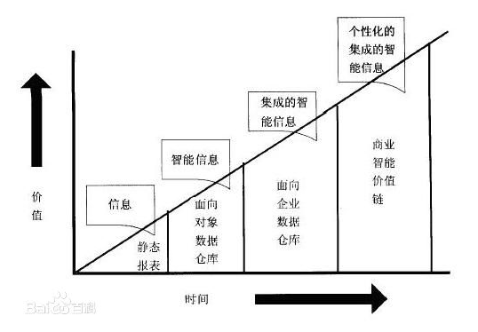

图 10 数据仓库价值曲线

### 3.1.2 数据仓库组成

数据仓库的组成部分包括：数据源、数据准备、数据存储、信息传递、元数据和管理控制部分。

* 数据源：有四个主要类别分别是生产数据、内部数据、存档数据和外部数据。
* 数据准备：ETL过程。
* 数据存储：一般是多维数据库。
* 信息传递：提供在线查询和报表。定期邮件报表等等。
* 元数据：包括三类分别是操作型元数据，抽取和转换元数据、最终用户元数据。
* 管理控制部分：元数据是管理控制模块的数据来源。

### 3.1.3 术语

表格 5 DM常见术语

| 名词   | 定义                                            |
| ---- | --------------------------------------------- |
| OLTP | 联线事务处理。针对具体业务在数据库联机的日常操作，通常对少数记录进行查询、修改。      |
| OLAP | 联线分析处理。一般针对某些主题的历史数据进行分析，支持管理决策。传统数据仓库一般是此类型。 |

## 3.2  数据仓库架构

### 3.2.1 架构组成简介

数据仓库是一个过程而不是一个项目。

数据仓库系统是一个信息提供平台，他从[业务处理系统](http://baike.baidu.com/view/5328424.htm)获得数据，主要以星型模型和雪花模型进行数据组织，并为用户提供各种手段从数据中获取信息和知识。

从功能结构划分，数据仓库系统至少应该包含数据获取（Data Acquisition）、[数据存储](http://baike.baidu.com/view/551712.htm)（Data Storage）、数据访问（Data Access）三个关键部分。

数据仓库的目的是构建面向分析的集成化数据环境，为企业提供决策支持（Decision Support）。其实数据仓库本身并不“生产”任何数据，同时自身也不需要“消费”任何的数据，数据来源于外部，并且开放给外部应用，这也是为什么叫“仓库”，而不叫“工厂”的原因。因此数据仓库的基本架构主要包含的是数据流入流出的过程，可以分为三层——**源数据**、**数据仓库**、**数据应用**：

 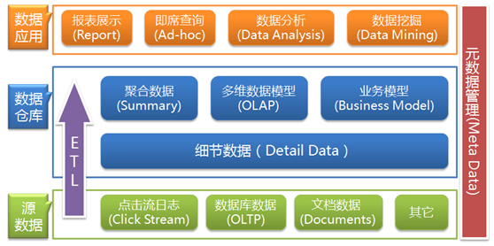

图 11 数据仓库基本体系结构1

 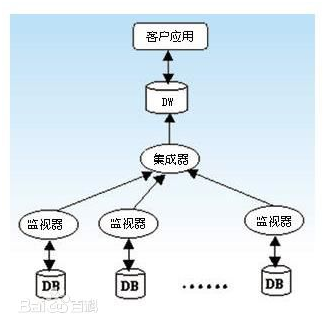

图 12 数据仓库基本体系结构2

 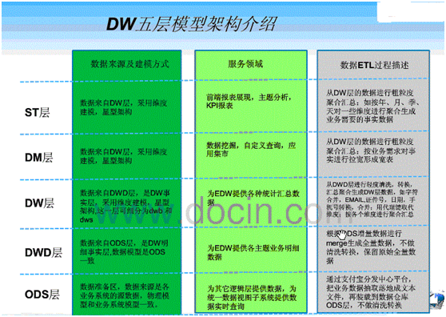

图 13 DW五层模型架构

备注：ODS~Operation Data Store操作数据存储。DWD~Dataware Detail数据仓库明细层。

 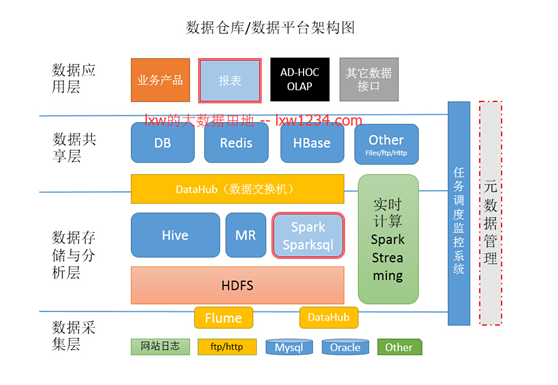

图14 大数据的数据仓库平台架构

说明：逻辑上，一般都有数据采集层、数据存储与分析层、数据共享层、数据应用层。

**数据采集**

数据采集层的任务就是把数据从各种数据源中采集和存储到数据存储上，期间有可能会做一些简单的清洗。

数据源的种类比较多：

* 网站日志：

作为互联网行业，网站日志占的份额最大，网站日志存储在多台网站日志服务器上，

一般是在每台网站日志服务器上部署flume agent，实时的收集网站日志并存储到HDFS上；

* 业务数据库：

业务数据库的种类也是多种多样，有Mysql、Oracle、SqlServer等，这时候，我们迫切的需要一种能从各种数据库中将数据同步到HDFS上的工具，Sqoop是一种，但是Sqoop太过繁重，而且不管数据量大小，都需要启动MapReduce来执行，而且需要Hadoop集群的每台机器都能访问业务数据库；应对此场景，淘宝开源的DataX，是一个很好的解决方案（可参考文章 《[异构数据源海量数据交换工具-Taobao DataX 下载和使用](http://lxw1234.com/archives/2015/05/231.htm)》），有资源的话，可以基于DataX之上做二次开发，就能非常好的解决，我们目前使用的DataHub也是。

当然，Flume通过配置与开发，也可以实时的从数据库中同步数据到HDFS。

* 来自于Ftp/Http的数据源：

有可能一些合作伙伴提供的数据，需要通过Ftp/Http等定时获取，DataX也可以满足该需求；

* 其他数据源：

比如一些手工录入的数据，只需要提供一个接口或小程序，即可完成；

### 3.2.2 数据集市架构

[数据集市](https://baike.baidu.com/item/数据集市)(Data Mart) ，也叫数据市场，数据集市就是满足特定的部门或者用户的需求，按照多维的方式进行存储，包括定义维度、需要计算的指标、维度的层次等，生成面向决策分析需求的数据立方体。

## 3.3   数据仓库建模

DW三种常见模型：E/R关系、维度和Data Vault 模型。

### 3.3.1 E/R范式建模

参见 数据模型。

### 3.3.2 kimball维度模型

《The Data Warehouse Toolkit: The Definitive Guide to Dimensional Modeling (3rd ed.)》

**评论**：《数据仓库工具箱（第3版）-- 维度建模权威指南》英文初版1996年，二版1998年，三版2015年。kimball是本书作者，也是kimball集团的创始人。第三版共21章其中14章是14个行业的建模案例。

表格 6 维度建模常用术语

| 名词      | 定义                                                           |
| ------- | ------------------------------------------------------------ |
| 维度      | Dimension，相当于SQL中的GROUP BY                                   |
| 度量      | 对于在事实表或者一个多维立方体里面存放的数值型的、连续的字段，就是度量。                         |
| cube立方体 | 指的是维度的组合，是2^N。如3个维度有8种组合（1，2，3，12，13，23，123，空）。              |
| 事实表     | 数据仓库结构中的中央表，它包含联系事实与维度表的数字度量值和键。事实数据表包含描述业务（例如产品销售）内特定事件的数据。 |
| 维度表     | 维度属性的集合。可分为细节维度和维度子集（子维度，如更高粒度的汇总）。                          |
| 层次维度    | 如日期有四个层次：年、季度、月和日。                                           |
| 退化维度    | 指减少维度的数量，通常被保留作操作型事务的标识符。                                    |
| 杂项维度    | 一种包含的数据具有很少可能值的维度，如标志和指示符字段。                                 |
| 周期事实表   |                                                              |
| 累积事实表   |                                                              |

维度模型常见的有：星型、雪花。

核心概念：事实表、维度表、度量、粒度。

**事实表**：事实表是数据仓库结构中的中央表，它包含联系事实与维度表的数字度量值和键。事实数据表包含描述业务（例如产品销售）内特定事件的数据。

**维度表**：维度表是维度属性的集合。是分析问题的一个窗口。是人们观察数据的特定角度，是考虑问题时的一类属性，属性的集合构成一个维。把逻辑业务比作一个立方体，产品维、时间维、地点维分别作为不同的坐标轴，而坐标轴的交点就是一个具体的事实。也就是说事实表是多个维度表的一个交点，而维度表是分析事实的一个窗口。

**度量：**对于在事实表或者一个多维立方体里面存放的数值型的、连续的字段，就是度量。这符合上面的意思，有标准，一个度量字段肯定是统一单位，例如元、户数。

粒度：

维度模型的逻辑表示：星型、雪花型。

构建过程

1) 选择业务流程。

2) 声明粒度。粒度用来确定事实中表示是什么。

3) 确认维度。

4) 确认事实。

#### 维度表技术

#### 事实表技术

### 3.3.3 Data Vault模型

此模型有中心表（HUB）、链接表(LINK）、附属表(SATELLITE）三个主要组成部分。中心表记录业务主键，链接表记录业务关系，附属表记录业务描述。

### 3.3.4 Anchor模型

## 3.4  数仓基准~TPC-H

**TPC**

事务处理性能委员会（ Transaction ProcessingPerformance Council ），是由数10家会员公司创建的非盈利组织，总部设在美国。该组织对全世界开放，但迄今为止，绝大多数会员都是美、日、西欧的大公司。TPC的成员主要是计算机软硬件厂家，而非计算机用户，它的功能是制定商务应用基准程序（Benchmark）的标准规范、性能和价格度量，并管理测试结果的发布。

TPC不给出基准程序的代码，而只给出基准程序的标准规范（Standard Specification）。任何厂家或其它测试者都可以根据规范，最优地构造出自己的系统（测试平台和测试程序）。（需要自己写测试工具，测试完之后提交给ＴＰＣ协会）为保证测试结果的客观性，被测试者（通常是厂家）必须提交给TPC一套完整的报告（FullDisclosure Report），包括被测系统的详细配置、分类价格和包含五年维护费用在内的总价格。该报告必须由TPC授权的审核员核实（TPC本身并不做审计），现在全球只有不到十个审核员，全部在美国。

### TPC-H

**TPC-H的目的**

**TPC-H**主要目的是评价特定查询的决策支持能力，强调服务器在数据挖掘、分析处理方面的能力。查询是决策支持应用的最主要应用之一，数据仓库中的复杂查询可以分成两种类型：一种是预先知道的查询，如定期的业务报表；另一种则是事先未知的查询，称为动态查询（Ad- Hoc Query）。

通俗的讲，TPC-H就是当一家数据库开发商开发了一个新的数据库操作系统，采用TPC-H作为测试基准，来测试衡量数据库操作系统查询决策支持方面的能力．

**TPC-H的衡量指标**

它模拟决策支持系统中的数据库操作，测试数据库系统复杂查询的响应时间，以每小时执行的查询数(TPC-H QphH@Siz)作为度量指标．

**TPC-H标准规范**

TPC- H 标准规范由10章正文和5个附录组成。

**数据库运行的环境条件**

TPC- H 测试模型为数据库服务器连续7×24 小时工作，可能只有1 次/月的维护；多用户并发执行复杂的动态查询，同时有并发执行表修改操作。数据库模型见图1，共有8 张表，除Nation 和Region 表外，其它表与测试的数据量有关，即比例因SF（Scale Factor）

数据库关系图以及表各个字段定义如下图

​         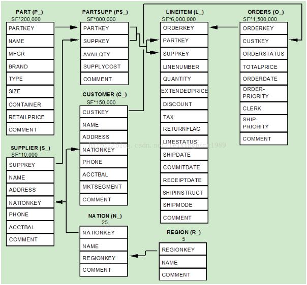

图 14  TPC-H的数据表关联图

 

图 15 TPC-H的数据库模型

由于数据量的大小对查询速度有直接的影响，TPC- H 标准对数据库系统中的数据量有严格、明确的规定。用SF 描述数据量，1SF 对应1 GB 单位，SF 由低到高依次是1、10、30、100、300、1 000、3 000、10 000。需要强调，SF 规定的数据量只是8个基本表的数据量，不包括索引和临时表。

从TPC- H 测试全程来看，需要的数据存储空较大，一般包括有基本表、索引、临时表、数据文件和备份文件，基本表的大小为x；索引和临时空间的经验值为3-5 位，取上限5x；DBGEN产生的数据文件的大小为x；备份文件大小为x；总计需要的存储空间为8x。就是说SF=1，需要准备8 倍，即8 GB 存储空间，才能顺利地进行测试

测试语句：22个查询，2个更新

**3** **个测试**

TPC-H 测试分解为3 个子测试：数据装载测试、Power 测试和Throughput 测试。

建立测试数据库的过程被称为装载数据，装载测试是为测试DBMS 装载数据的能力。装载测试是第一项测试，测试装载数据的时间，这项操作非常耗时。Power 测试是在数据装载测试完成后，数据库处于初始状态，未进行其它任何操作，特别是缓冲区还没有被测试数据库的数据，被称为raw查询。Power 测试要求22 个查询顺序执行1 遍，同时执行一对RF1 和RF2 操作。最后进行Throughput 测试，也是最核心和最复杂的测试，它更接近于实际应用环境，与Power 测试比对SUT 系统的压力有非常大的增加，有多个查询语句组，同时有一对RF1 和RF2 更新流。

 **度量指标**

​    测试中测量的基础数据都与执行时间有关，这些时间又可分为：装载数据的每一步操作时间、每个查询执行时间和每个更新操作执行时间，由这些时间可计算出：数据装载时间、Power@Size、Throughput@Size、QphH@Size 和$/QphH@Size。

### TPC基准列表

**TPC目前推出的基准程序**

TPC推出过许多基准程序，目前11套活跃基准程序，5套不被业界接受而放弃（分别是TPC-A、TPC-B、TPC-D、TPC-R、TPC-W和TPC- App）。

表格 7 TPC Active Benchmarks

| Benchmar/  Document | 当前版本   | 目的                                  | Specification                                                                    | Source Code                                                                                                                                                                             |
| ------------------- | ------ | ----------------------------------- | -------------------------------------------------------------------------------- | --------------------------------------------------------------------------------------------------------------------------------------------------------------------------------------- |
| TPC-C               | 5.11.0 | 测试数据库系统的事务处理能力。                     | [pdf](http://www.tpc.org/TPC_Documents_Current_Versions/pdf/tpc-c_v5.11.0.pdf)   | n/a                                                                                                                                                                                     |
| TPC-DI              | 1.1.0  |                                     | [pdf](http://www.tpc.org/TPC_Documents_Current_Versions/pdf/TPC-DI_v1.1.0.pdf)   | [TPC-DI_Tools_v1.1.0.zip](http://www.tpc.org/TPC_Documents_Current_Versions/download_programs/tools-download-request.asp?bm_type=TPC-DI&bm_vers=1.1.0&mode=CURRENT-ONLY)                |
| TPC-DS              | 2.9.0  |                                     | [pdf](http://www.tpc.org/TPC_Documents_Current_Versions/pdf/TPC-DS_v2.9.0.pdf)   | [TPC-DS_Tools_v2.9.0.zip](http://www.tpc.org/TPC_Documents_Current_Versions/download_programs/tools-download-request.asp?bm_type=TPC-DS&bm_vers=2.9.0&mode=CURRENT-ONLY)                |
| TPC-E               | 1.14.0 |                                     | [pdf](http://www.tpc.org/TPC_Documents_Current_Versions/pdf/TPC-E_v1.14.0.pdf)   | [TPC-E_Tools_v1.14.0.zip](http://www.tpc.org/TPC_Documents_Current_Versions/download_programs/tools-download-request.asp?bm_type=TPC-E&bm_vers=1.14.0&mode=CURRENT-ONLY)                |
| TPC-H               | 2.17.3 | 评价特定查询的决策支持能力，强调服务器在数据挖掘、分析处理方面的能力。 | [pdf](http://www.tpc.org/TPC_Documents_Current_Versions/pdf/tpc-h_v2.17.3.pdf)   | [TPC-H_Tools_v2.17.3.zip](http://www.tpc.org/TPC_Documents_Current_Versions/download_programs/tools-download-request.asp?bm_type=TPC-H&bm_vers=2.17.3&mode=CURRENT-ONLY)                |
| TPC-VMS             | 1.2.0  |                                     | [pdf](http://www.tpc.org/TPC_Documents_Current_Versions/pdf/TPC-VMS_V1.2.0.pdf)  | n/a                                                                                                                                                                                     |
| TPCX-BB             | 1.2.0  |                                     | [pdf](http://www.tpc.org/TPC_Documents_Current_Versions/pdf/TPCX-BB_v1.2.0.pdf)  | [TPCX-BB_Tools_v1.2.0.zip](http://www.tpc.org/TPC_Documents_Current_Versions/download_programs/tools-download-request.asp?bm_type=TPCX-BB&bm_vers=1.2.0&mode=CURRENT-ONLY)              |
| TPCX-HCI            | 1.1.3  |                                     | [pdf](http://www.tpc.org/TPC_Documents_Current_Versions/pdf/TPCx-HCI_v1.1.3.pdf) | [TPCx-HCI_Benchmarking_Kit_v1.1.3.zip](http://www.tpc.org/TPC_Documents_Current_Versions/download_programs/tools-download-request.asp?bm_type=TPCX-HCI&bm_vers=1.1.3&mode=CURRENT-ONLY) |
| TPCX-HS             | 2.0.3  |                                     | [pdf](http://www.tpc.org/TPC_Documents_Current_Versions/pdf/TPCX-HS_v2.0.3.pdf)  | [TPCX-HS_Tools_v2.0.3.zip](http://www.tpc.org/TPC_Documents_Current_Versions/download_programs/tools-download-request.asp?bm_type=TPCX-HS&bm_vers=2.0.3&mode=CURRENT-ONLY)              |
| TPCX-IOT            | 1.0.3  |                                     | [pdf](http://www.tpc.org/TPC_Documents_Current_Versions/pdf/tpcx-IoT_v1.0.3.pdf) | [TPCx-IoT_Tools_v1.0.3.zip](http://www.tpc.org/TPC_Documents_Current_Versions/download_programs/tools-download-request.asp?bm_type=TPCX-IOT&bm_vers=1.0.3&mode=CURRENT-ONLY)            |
| TPCX-V              | 2.1.3  |                                     | [pdf](http://www.tpc.org/TPC_Documents_Current_Versions/pdf/TPCx-V_v2.1.3.pdf)   | [TPCx-V_Benchmarking_Kit_v2.1.3.zip](http://www.tpc.org/TPC_Documents_Current_Versions/download_programs/tools-download-request.asp?bm_type=TPCX-V&bm_vers=2.1.3&mode=CURRENT-ONLY)     |

备注：数据时间截止至2018-9-8.

## 3.5  DW实例

表格 8 IBM与Teradata仓库模型比较

|     | IBM                                 | Teardata                                       |
| --- | ----------------------------------- | ---------------------------------------------- |
| 银行业 | BDWM(Banking  Data Warehouse Model) | FS-LDM(Financial Services Logical  Data Model) |
| 电信业 | TDWM(Telecom Data Warehouse Model)  | TS-LDM(Telecom Services Logical Data  Model)   |

### IBM

 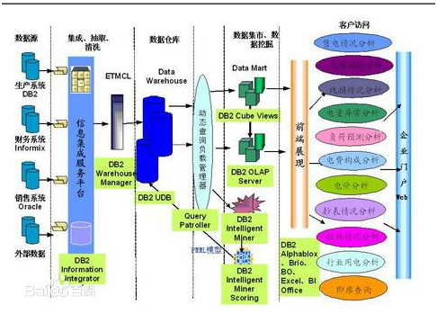

图  IBM数据仓库解决方案产品组成

### TeraData

 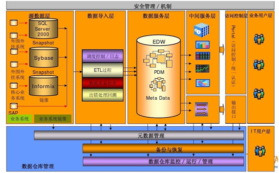

### 淘宝

 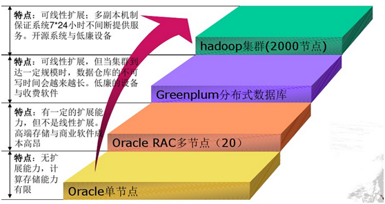

图  淘宝计算存储平台的发展史

<br>

## 本章参考

[1]. tpch  http://www.tpc.org/tpch/

[2]. TPC-H 使用 https://blog.csdn.net/leixingbang1989/article/details/8766047

[3]. 大数据环境下互联网行业数据仓库/数据平台的架构之漫谈http://lxw1234.com/archives/2015/08/471.htm

[4]. 数据仓库 [http://zh.wikipedia.org/wiki/%E8%B3%87%E6%96%99%E5%80%89%E5%84%B2](http://zh.wikipedia.org/wiki/資料倉儲)

[5].  TPC基准  http://www.tpc.org/tpc_documents_current_versions/current_specifications.asp

[6]: 百亿级实时大数据分析项目，为什么不用Hadoop？ http://www.yonghongtech.com/webShare/webshare_w4.html

[7]: Java BI新生代——百度商业运营实践 http://www.infoq.com/cn/presentations/java-bi-the-new-generation-baidu-business-practice

[8]: 阿里巴巴数据产品经理工作总结篇  http://mp.weixin.qq.com/s?__biz=MjM5MDI1ODUyMA==&mid=205181896&idx=3&sn=bb2d98b6d90c86552c260791bdd30faf#rd

[9]: 淘宝数据仓库架构实践 http://wenku.baidu.com/view/72d5a86658fafab069dc02d6.html

<br><br>

<br>

# 4 数据挖掘.DM

数据挖掘是一个过程。数据挖掘能取得多大的成就跟所采用的工具，使用工具的能力和挖掘过程中的方法论密切相关。数据挖掘的方法论有，

* 战略上: CRISP_DM(Cross Industry Standard Process for DM);
* 战术上：采用美国SAS公司的SEMMA方法(Sample,Explore,Modify,Model, Assess).

## 4.1   数据挖掘简介

**数据挖掘定义**

（英语：Data mining）又译为数据采矿、数据挖掘。它是数据库知识发现（英语：Knowledge-Discovery in Databases，简称：KDD)中的一个步骤。数据挖掘一般是指从大量的数据中自动搜索隐藏于其中的有着特殊关系性（属于Association rule learning）的信息的过程。

**发展历程**

1989年，第十一届国际联合人工智能学术会议上首次出现KDD（知识发现）一词。这是关于KDD的首个专题讨论会

1995年，出现数据挖掘领域的首个国际会议SIGKDD．自此，SIGKDD大会每年召开一次，已经称为数据挖掘领域的顶级会议．

### 4.1.1 基本概念

**数据**

* 数据：对象及属性的集合．
* 数据类型：分类，数值．．．
* 数据处理：标准化，离散化，取样，维度递减．．．

**数据挖掘任务：**是指用户进行的数据分析形式.

* 分类/预测模型：利用已知参数，预测未知参数的值．
* 描述模型：发现人可以理解，可以描述数据的模术．

基本方法: 分类，聚类和关联分析．

**数据挖掘功能(模式发现)**

数据挖掘功能用于指定数据挖掘任务中要找的模式类型.

常见的模式

1) 概念/类描述: 特征化和区分

数据特征的输出可以用多种形式提供,如饼图,条图等.

数据区分是将目标类对象的一般特性与一个或多个类比对象的一般特性作比较.

2) 关联分析

关联分析发现关联规则, 规则展示属性-值频繁地给定数据集中一起出现的条件. 关联分析广泛用于购物篮或事务数据分析.

3) 分类和预测

4) 聚类分析

5) 孤立点分析

6) 演变分析

数据演变分析描述行为随时间变化的对象的规律或趋势.

**数据挖掘原语**

一个数据挖掘任务可以用数据挖掘查询的形式说明. 数据挖掘查询的形式即数据挖掘原语,有如下定义.

* 任务相关的数据, 如数据库,表等
* 挖掘的知识类型, 即模式
* 背景知识
* 模式兴趣度度量, 简洁,实用,确实,新颖
* 发现模式的可视化, 如表格,图等

### 4.1.2 CRISP-DM

CRISP-DM (cross-industry standard process for data mining), 即为"跨行业数据挖掘标准流程"。此KDD[过程模型](https://baike.baidu.com/item/过程模型)于1999年欧盟机构联合起草。通过近几年的发展，CRISP-DM 模型在各种KDD过程模型中占据领先位置，2014年统计表明，采用量达到43%。

CRISP-DM 模型为一个[KDD](https://baike.baidu.com/item/KDD)工程提供了一个完整的过程描述。该模型将一个KDD工程分为6个不同的，但顺序并非完全不变的阶段，分别是商业理解、数据理解、数据准备、建模、评估和部署。

**商业理解（business understanding）**

从商业的角度了解项目的要求和最终目的是什么，并将这些目的与数据挖掘的定义以及结果结合起来。

主要工作包括：确定商业目标，发现影响结果的重要因素，从商业角度描绘客户的首要目标，评估形势，查找所有的资源、局限、设想以及在确定数据分析目标和项目方案时考虑到的各种其他的因素，包括风险和意外、相关术语、成本和收益等等，接下来确定数据挖掘的目标，制定项目计划。

**数据理解（data understanding）**

数据理解阶段开始于数据的收集工作。接下来就是熟悉数据的工作，具体如：检测数据的量，对数据有初步的理解，探测数据中比较有趣的数据子集，进而形成对潜在信息的假设。收集原始数据，对数据进行装载，描绘数据，并且探索数据特征，进行简单的特征统计，检验数据的质量，包括数据的完整性和正确性，缺失值的填补等。

**数据准备（data preparation）**

数据准备阶段涵盖了从原始粗糙数据中构建最终数据集（将作为建模工具的分析对象）的全部工作。数据准备工作有可能被实施多次，而且其实施顺序并不是预先规定好的。这一阶段的任务主要包括：制表，记录，数据变量的选择和转换，以及为适应建模工具而进行的数据清理等等。

根据与挖掘目标的相关性，数据质量以及技术限制，选择作为分析使用的数据，并进一步对数据进行清理转换，构造衍生变量，整合数据，并根据工具的要求，格式化数据。

**建模（modeling）**

在这一阶段，各种各样的建模方法将被加以选择和使用，通过建造，评估模型将其参数将被校准为最为理想的值。比较典型的是，对于同一个数据挖掘的问题类型，可以有多种方法选择使用。如果有多重技术要使用，那么在这一任务中，对于每一个要使用的技术要分别对待。一些建模方法对数据的形式有具体的要求，因此，在这一阶段，重新回到数据准备阶段执行某些任务有时是非常必要的。

**评估（evaluation）**

从数据分析的角度考虑，在这一阶段中，已经建立了一个或多个高质量的模型。但在进行最终的模型部署之前，更加彻底的评估模型，回顾在构建模型过程中所执行的每一个步骤，是非常重要的，这样可以确保这些模型是否达到了企业的目标。一个关键的评价指标就是看，是否仍然有一些重要的企业问题还没有被充分地加以注意和考虑。在这一阶段结束之时，有关数据挖掘结果的使用应达成一致的决定。

**部署（deployment）**

部署，即将其发现的结果以及过程组织成为可读文本形式。模型的创建并不是项目的最终目的。尽管建模是为了增加更多有关于数据的信息，但这些信息仍然需要以一种客户能够使用的方式被组织和呈现。这经常涉及到一个组织在处理某些决策过程中，如在决定有关网页的实时人员或者营销数据库的重复得分时，拥有一个“活”的模型。

表格 4 数据挖掘处理过程（参考）

| 过程     | 简介                             | 详述                                                                                                                                                |
| ------ | ------------------------------ | ------------------------------------------------------------------------------------------------------------------------------------------------- |
| 定义挖掘目标 | 明确本次的挖掘目标是什么？系统完成后要达到什么效果？     |                                                                                                                                                   |
| 数据取样   | 从业务系统中抽取一个与挖掘目标相关的样本数据子集。      | 抽取数据标准要求相关、可靠和有效。                                                                                                                                 |
| 数据探索   | 分析数据属性之间的相关                    | Ø 数据质量分析：异常值、缺失值、一致性  <br>Ø 数据特征分析：分布、对比、统计量、相关性、周期性和贡献度。                                                                                         |
| 数据预处理  | 当采集数据维度过大时，需要降维、缺失值处理等。        | Ø 数据筛选（清洗）：异常值、缺失值  Ø 数据集成：实体识别、冗余属性识别  <br/>Ø 数据转换：简单函数变换、数据规范（标准）化、连续属性离散化、属性选择（构造）、小波变换  <br/>Ø 数据规约：属性规约（合并、决策树归纳、PCA主成分分析），数值规约（回归、直方图、抽样等）。 |
| 挖掘建模   | 这是核心环节。                        | 考虑DM中的哪类问题：  分类、聚类、关联规则、时序模式或智能推荐。                                                                                                                |
| 模型评价   | 根据分析结果找出一个好的模型，根据业务对模型进行解释和应用。 |                                                                                                                                                   |
| 模型发布   | 应用模型进行分析和预测。                   |                                                                                                                                                   |

事实上，就方法学而言，CRISP-DM并不是什么新观念，本质来看就是在分析应用中提出问题、分析问题和解决问题的过程。而可贵之处在于其提纲挈领的特性，非常适合工程管理，适合大规模定制，以至CRISP-DM如今已经成为事实上的行业标准。

### 数据挖掘过程示例：餐饮业

 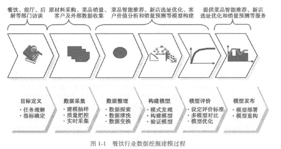

图 9 餐饮行业数据挖掘建模过程示例图

## 4.2   数据预处理

数据预处理一般有以下方法: 数据清理、数据集成、数据变换, 数据规约, 离散化和概念分层。

## 4.3   挖掘模式

挖掘模式有以下几种：

* 频繁模式挖掘
* 交互挖掘
* 增量挖掘

## 4.4   相似度发现

距离测度 参见 《[非数值和工业界领域算法](../软件可复用/algo/非数值和工业界领域算法.md)》相关章节

相似度的问题是发现具有较大交集的集合问题，如频繁项集。

<br>

## 本章参考

[1]. CRISP-DM https://baike.baidu.com/item/CRISP-DM/7002457?fr=aladdin

<br>

# 数据分析

详见 《[数据分析及案例](./数据分析及案例.md)》

<br>

# 数据可视化

详见  《[数据可视化](./数据可视化.md)》、《[数据可视化工具](../软件可复用/tools.工具/数据可视化工具.md)》相关章节

<br>

# 新领域

## 数据湖.DL

**数据湖定义**

**AWS**定义：数据湖 (datalake)是一个集中式存储库，允许您以任意规模存储所有结构化和非结构化数据。您可以按原样存储数据（无需先对数据进行结构化处理），并运行不同类型的分析 – 从控制面板和可视化到大数据处理、实时分析和机器学习，以指导做出更好的决策。

**数据湖的价值**

能够在更短的时间内从更多来源利用更多数据，并使用户能够以不同方式协同处理和分析数据，从而做出更好、更快的决策。数据湖具有增值价值的示例包括：改善客户互动、改善研发创新选择和提高运营效率。

**数据湖的挑战**

数据湖架构的主要挑战是存储原始数据而不监督内容。对于使数据可用的数据湖，它需要有定义的机制来编目和保护数据。没有这些元素，就无法找到或信任数据，从而导致出现“[数据沼泽](https://www.gartner.com/newsroom/id/2809117)”。 满足更广泛受众的需求需要数据湖具有管理、语义一致性和访问控制。

**数据湖 VS 数据仓库**

根据要求，典型的组织将需要数据仓库和数据湖，因为它们可满足不同的需求和使用案例。

数据仓库是一个优化的数据库，用于分析来自事务系统和业务线应用程序的关系数据。事先定义数据结构和 Schema 以优化快速 SQL 查询，其中结果通常用于操作报告和分析。数据经过了清理、丰富和转换，因此可以充当用户可信任的“单一信息源”。

数据湖有所不同，因为它存储来自业务线应用程序的关系数据，以及来自移动应用程序、IoT  设备和社交媒体的非关系数据。捕获数据时，未定义数据结构或  Schema。这意味着您可以存储所有数据，而不需要精心设计也无需知道将来您可能需要哪些问题的答案。您可以对数据使用不同类型的分析（如 SQL  查询、大数据分析、全文搜索、实时分析和机器学习）来获得见解。

随着使用数据仓库的组织看到数据湖的优势，他们正在改进其仓库以包括数据湖，并启用各种查询功能、数据科学使用案例和用于发现新信息模型的高级功能。Gartner 将此演变称为“分析型数据管理解决方案”或“[DMSA](https://www.gartner.com/doc/3614317/magic-quadrant-data-management-solutions)”。[^1]

表格   数据湖和数据仓库的比较

| 特性         | 数据湖                                      | 数据仓库                      |
| ---------- | ---------------------------------------- | ------------------------- |
| 数据         | 来自 IoT 设备、网站、移动应用程序、社交媒体和企业应用程序的非关系和关系数据 | 来自事务系统、运营数据库和业务线应用程序的关系数据 |
| 方法论/Schema | 写入在分析时/事后建模（读取型 Schema-on-Read）          | 事前建模（写入型 Schema-on-Write） |
| 存储类型       | 结构/半结构/非结构 （以文件形式存在）                     | 结构/非结构 （以表形式存在）           |
| 性价比        | 更快查询结果只需较低存储成本                           | 更快查询结果会带来较高存储成本           |
| 数据质量       | 任何可以或无法进行监管的数据（例如原始数据）                   | 可作为重要事实依据的高度监管数据          |
| 用户         | 数据科学家、数据开发人员和业务分析师（使用监管数据）               | 业务分析师                     |
| 分析         | 机器学习、预测分析、数据发现和分析                        | 批处理报告、BI 和可视化             |

组织构建数据湖和分析平台时，他们需要考虑许多关键功能，包括：

| 功能         | 功能描述                                                                                                                                                    |
| ---------- | ------------------------------------------------------------------------------------------------------------------------------------------------------- |
| 数据移动       | 数据湖允许您导入任何数量的实时获得的数据。您可以从多个来源收集数据，并以其原始形式将其移入到数据湖中。此过程允许您扩展到任何规模的数据，同时节省定义数据结构、Schema 和转换的时间。                                                           |
| 安全地存储和编目数据 | 数据湖允许您存储关系数据（例如，来自业务线应用程序的运营数据库和数据）和非关系数据（例如，来自移动应用程序、IoT  设备和社交媒体的运营数据库和数据）。它们还使您能够通过对数据进行爬网、编目和建立索引来了解湖中的数据。最后，必须保护数据以确保您的数据资产受到保护。                   |
| 分析         | 数据湖允许组织中的各种角色（如数据科学家、数据开发人员和业务分析师）通过各自选择的分析工具和框架来访问数据。这包括  Apache Hadoop、Presto 和 Apache Spark  等开源框架，以及数据仓库和商业智能供应商提供的商业产品。数据湖允许您运行分析，而无需将数据移至单独的分析系统。 |
| 机器学习       | 数据湖将允许组织生成不同类型的见解，包括报告历史数据以及进行机器学习（构建模型以预测可能的结果），并建议一系列规定的行动以实现最佳结果。                                                                                    |

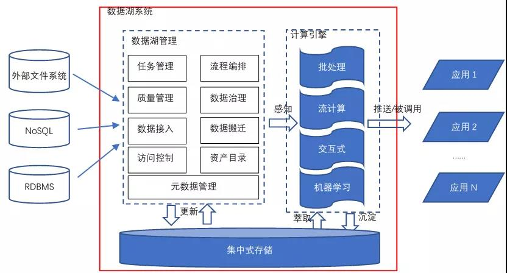

图  数据湖参考架构

对于一个典型的数据湖而言，它与大数据平台相同的地方在于它也具备处理超大规模数据所需的存储和计算能力，能提供多模式的数据处理能力；增强点在于数据湖提供了更为完善的数据管理能力，具体体现在：

1. **更强大的数据接入能力。**数据接入能力体现在对于各类外部异构数据源的定义管理能力，以及对于外部数据源相关数据的抽取迁移能力，抽取迁移的数据包括外部数据源的元数据与实际存储的数据。
2. **更强大的数据管理能力。**管理能力具体又可分为基本管理能力和扩展管理能力。基本管理能力包括对各类元数据的管理、数据访问控制、数据资产管理，是一个数据湖系统所必须的，后面我们会在“各厂商的数据湖解决方案”一节相信讨论各个厂商对于基本管理能力的支持方式。扩展管理能力包括任务管理、流程编排以及与数据质量、数据治理相关的能力。任务管理和流程编排主要用来管理、编排、调度、监测在数据湖系统中处理数据的各类任务，通常情况下，数据湖构建者会通过购买/研制定制的数据集成或数据开发子系统/模块来提供此类能力，定制的系统/模块可以通过读取数据湖的相关元数据，来实现与数据湖系统的融合。而数据质量和数据治理则是更为复杂的问题，一般情况下，**数据湖系统不会直接提供相关功能，但是会开放各类接口或者元数据，供有能力的企业/组织与已有的数据治理软件集成或者做定制开发。**
3. **可共享的元数据。**

表格  各公司的数据湖解决方案比较

| 公司    | 数据接入                         | 数据存储                 | 计算引擎                                        | 数据处理              | 数据管理                                                 | 数据治理     | 支持程度  |
| ----- | ---------------------------- | -------------------- | ------------------------------------------- | ----------------- | ---------------------------------------------------- | -------- | ----- |
| AWS   | 云上数据源                        | S3                   | 1.SQL<br>2.Spark<br>3.其它：EMR&Redshift       | 1.基于SQL的ETL<br>2. | 利用Lake Fomation组件提供元数据、权限、处理任务等管理能力。元数据可提供对外能力，方便集成。 | 未明确明出    | ★★★★  |
| 华为    | 1.云上数据源<br>2.基于CDM<br>3.基于DS | OBS                  | 1.SQL<br/>2.Spark<br/>3.Flink               |                   |                                                      | 基于DAYU机制 | ★★★★★ |
| 阿里    | 1.云上数据源<br/>2.各类自建数据源        | OSS                  | 1.SQL<br/>2.Spark                           |                   |                                                      | 未明确明出    | ★★★★  |
| Azure | 云上数据源                        | Azure Object Storage | 1.SQL<br/>2.DataBrics<br/>3.其它：EMR&Redshift |                   |                                                      | 未明确明出    | ★★★   |

### AWS数据湖

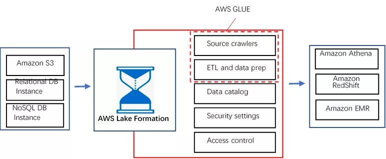

图  AWS数据湖解决方案

AWS数据湖方案成熟度高，特别是元数据管理、权限管理上考虑充分，打通了异构数据源与各类计算引擎的上下游关系，让数据能够自由“移动”起来。

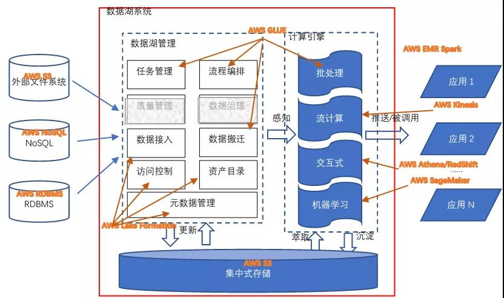

图  AWS 数据湖解决方案在参考架构中的映射

综上，AWS的数据湖解决方案覆盖了除质量管理和数据治理的所有功能。其实质量管理和数据治理这个工作和企业的组织结构、业务类型强相关，需要做大量的定制开发工作，因此通用解决方案不囊括这块内容，也是可以理解的。事实上，现在也有比较优秀的开源项目支持这个项目，比如Apache Griffin，如果对质量管理和数据治理有强诉求，可以自行定制开发。

### 华为数据湖

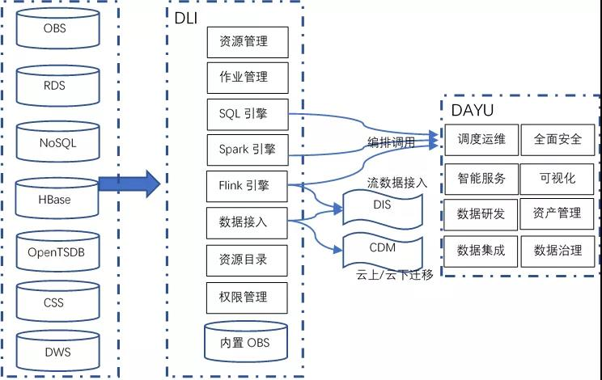

图  华为数据湖解决方案

华为的数据湖解决方案相关信息来自华为官网。目前官网可见的相关产品包括数据湖探索（Data Lake Insight，DLI）和智能数据湖运营平台（DAYU）。

DLI相当于是AWS的Lake Formation、GLUE、Athena、EMR（Flink&Spark）的集合。DLI可以与华为的CDM（云数据迁移服务）和DIS（数据接入服务）对接。

DAYU平台是华为数据湖治理运营方法论的落地实现。DAYU涵盖了整个数据湖治理的核心流程，并对其提供了相应的工具支持；甚至在华为的官方文档中，给出了数据治理组织的构建建议。

华为云整个的数据湖解决方案，完整覆盖了数据处理的生命周期，并且明确支持了数据治理，并提供了基于模型和指标的数据治理流程工具，在华为云的数据湖解决方案中逐渐开始往“湖仓一体化”方向演进。

### 阿里数据湖

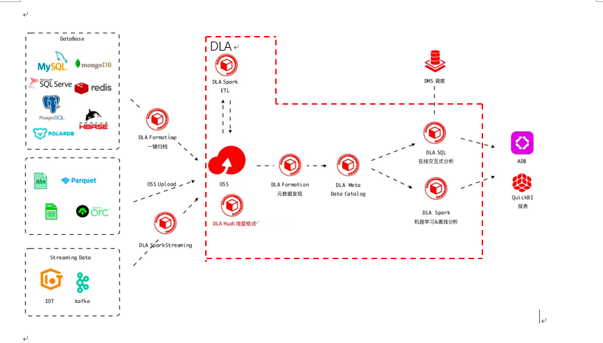

图  华为数据湖解决方案

## 湖仓一体

湖仓一体有两个流派，第一个流派是以数仓这种方式诞生的，它是一个左右派，左边是一个数据仓库，右边是一个数据湖，中间以高速网络相连形成一个反对式的联动；第二个流派是从数据湖向数仓演进，整体架构是在数据湖上搭建数据仓库。这两个流派的代表分别是 AWS Redshift/ 阿里云 MaxCompute，以及 Databricks，目前这两个流派都还在发展中。

虽然湖仓一体是目前的热点，但它仍然是一个新兴方向，还有非常多未知的问题要解决。

<br>

## 本章参考

[^1]: https://aws.amazon.com/cn/big-data/datalakes-and-analytics/what-is-a-data-lake/?nc=sn&amp;loc=2  AWS-  什么是数据湖

* 解读数据架构的2021：大数据1.0体系基本建成，但头上仍有几朵乌云   https://mp.weixin.qq.com/s/jDnYvTFtcmVWLtWbTG7LXQ
* 详解数据湖，概念、特征、架构、方案、场景以及建湖全过程  https://mp.weixin.qq.com/s/KBZBybCNgCYv9H4BswUfjw

<br><br>

<br>

# 参考资料

## 参考网站

* 数仓基准 tpch  http://www.tpc.org/tpch/
* CHINA KDD  http://www.chinakdd.com/

## 参考书目

[1]. Jiawei Han、Micheline Kamber等著，《数据挖掘：概念与技术》，机械工业出版社，2001  [ISBN 1-55860-489-8](http://zh.wikipedia.org/zh-cn/Special:网络书源/1558604898)

[2]. [**Ian H.Witten,Eide Frank** ](http://www.china-pub.com/s/?key1=%a3%a8%d0%c2%ce%f7%c0%bc%a3%a9Ian+H.Witten%2cEide+Frank) 《[Data Mining: Practical Learning Tools and Techniques with Java Implementations ](http://www.amazon.com/exec/obidos/ASIN/1558605525/qid%3D1066016823/sr%3D11-1/ref%3Dsr_11_1/104-7761378-9162309)》　 [Elsevier ](http://www.china-pub.com/s/?key1=Elsevier)　2003

[3]. 数据仓库工具箱：维度建模的完全指南，Ralph Kimball著, 电子工业出版社 2003.10

[4]. 数据仓库生命周期工具箱：设计、开发和部署数据仓库的专家方法，Ralph Kimball著, 电子工业出版社 2009

[5]. 数据仓库， W.H.Inmon著，    机械工业出版社 2003.9

[6]. 数据仓库基础，Paulraj Ponniah著，电子工业出版社 2004

[7]. BernardMarr（伯纳德·马尔） 《智能大数据SMART准则-数据分析方法.案例和行动纲领》 电子工业出版社 2015

[8]. [天善智能](https://book.douban.com/search/天善智能) 《数据实践之美》 机械工业出版社 2017.1

10. 帆软数据应用研究院《商业智能（BI）白皮书3.0》 2021.11

11. 中国信通院  《大数据白皮书（2020 年）》

## 参考链接

* 百度百科-BI https://baike.baidu.com/item/BI/4579902

* BI的前世今生 https://blog.51cto.com/u_14689762/2480413

* 2021年中国ICT技术成熟度曲线报告 https://sq.sf.163.com/blog/article/579099945774272512

<br>

# 附录

## 官方组织

元数据标准组织：元数据联盟、对象管理组

**OLAP**

OLAP 协会建立于1995 年1 月。它的会员和成员向所有有兴趣的组织开放。到2000 年，

这个协会有16 个一般成员，主要是OLAP 产品的提供商。

## DM工具

详见 《[AI框架分析](AI框架分析.md)》相应章节
