| 序号 | 修改时间   | 修改内容                     | 修改人 | 审稿人 |
| ---- | ---------- | ---------------------------- | ------ | ------ |
| 1    | 2017-1-18  | 创建                         | Keefe | Keefe |
| 2    | 2017-10-11 | 更新Hadoop开发篇：spark/Hive | 同上   |        |
| 3    | 2017-10-29 | 将spark相关章节汇总单独成篇  | 同上   |        |
| 4    | 2018-8-11  | 整理文档结构，更新架构章节。 | 同上   |        |
| 5 | 2021-12-14 | 将集群管理章节迁移另文 | 同上 |        |

<br><br><br>

---

# 目录

[TOC]

[目录... 1](#_Toc2547303)

[1    概述... 5](#_Toc2547304)

[1.1       Hadoop简介... 5](#_Toc2547305)

[1.2       Hadoop生态... 6](#_Toc2547306)

[1.2.1     Hadoop生态简介... 6](#_Toc2547307)

[1.2.2     Hadoop生态的编年史... 10](#_Toc2547308)

[1.2.3     Hadoop主流厂商... 13](#_Toc2547309)

[1.3       Hadoop发行版... 13](#_Toc2547310)

[1.3.1     CDH (Cloudera Distribution Hadoop) 14](#_Toc2547311)

[1.3.2     HDP (Hortonworks Data Platform) 15](#_Toc2547312)

[1.3.3     FI（Huawei FusionInsight）... 16](#_Toc2547313)

[1.3.4     EMR (Amazon) 17](#_Toc2547314)

[1.3.5     TDH (Transwarp Data Hub) 18](#_Toc2547315)

[1.3.6     本节参考... 18](#_Toc2547316)

[1.4       Hadoop生态的内部关系... 19](#_Toc2547317)

[1.4.1     Hadoop生态内比较... 19](#_Toc2547318)

[1.4.2     Hive 和 Hadoop 关系... 19](#_Toc2547319)

[1.4.3     Spark与Hadoop关系... 21](#_Toc2547320)

[1.5       Hadoop安全机制... 21](#_Toc2547321)

[1.6       Hadoop前景... 21](#_Toc2547322)

[1.7       本章参考... 22](#_Toc2547323)

[2    系统架构篇... 23](#_Toc2547324)

[2.1       ZooKeeper 23](#_Toc2547325)

[2.1.1     基本原理... 23](#_Toc2547326)

[2.1.2     与组件的关系... 25](#_Toc2547327)

[2.2       YARN.. 27](#_Toc2547328)

[2.2.1     基本原理... 27](#_Toc2547329)

[2.2.2     与组件的关系... 31](#_Toc2547330)

[2.3       HDFS. 34](#_Toc2547331)

[2.4       Hive. 37](#_Toc2547332)

[2.5       HBase. 42](#_Toc2547333)

[2.5.1     简介与结构... 42](#_Toc2547334)

[2.5.2     HBase数据模型... 42](#_Toc2547335)

[2.6       MapReduce. 46](#_Toc2547336)

[2.7       Spark. 46](#_Toc2547337)

[2.7.1     Spark架构... 47](#_Toc2547338)

[2.7.2     Spark Streaming. 50](#_Toc2547339)

[2.7.3     版本差异... 51](#_Toc2547340)

[2.7.4     与组件的关系... 51](#_Toc2547341)

[2.8       Hue. 53](#_Toc2547342)

[2.8.1     基本原理... 53](#_Toc2547343)

[2.8.2     与组件的关系... 55](#_Toc2547344)

[2.9       Oozie. 57](#_Toc2547345)

[2.10     本章参考... 59](#_Toc2547346)

[3    软件安装篇... 59](#_Toc2547347)

[3.1       安装概述... 59](#_Toc2547348)

[3.2       Hadoop单机模式安装 step 1~7. 60](#_Toc2547349)

[3.2.1     安装前准备step 1~3. 60](#_Toc2547350)

[3.2.2     安装 step 4. 61](#_Toc2547351)

[3.2.3     配置 step 5~6. 61](#_Toc2547352)

[3.2.4     执行step 7. 64](#_Toc2547353)

[3.3       Hadoop Cluster集群配置... 65](#_Toc2547354)

[3.3.1     Hadoop组件的版本配置... 65](#_Toc2547355)

[3.4       HBase. 66](#_Toc2547356)

[3.5       Hive. 67](#_Toc2547357)

[3.6       本章参考... 68](#_Toc2547358)

[4    集群运维篇... 69](#_Toc2547359)

[4.1       集群... 69](#_Toc2547360)

[4.1.1     集群相关概念... 69](#_Toc2547361)

[4.1.2     集群部署模式... 70](#_Toc2547362)

[4.1.3     集群管理工具... 73](#_Toc2547363)

[4.2       运营工具... 74](#_Toc2547364)

[4.2.1     一般工具... 74](#_Toc2547365)

[4.2.2     Hadoop生态专用工具... 74](#_Toc2547366)

[4.3       Hadoop优化... 77](#_Toc2547367)

[4.4       本章参考... 78](#_Toc2547368)

[5    Spark. 78](#_Toc2547369)

[5.1       简介... 78](#_Toc2547370)

[5.2       Spark安装使用篇... 79](#_Toc2547371)

[5.2.1     示例1：交互终端... 79](#_Toc2547372)

[5.2.2     示例2：文件  sc.textFile().count() 80](#_Toc2547373)

[5.3       Spark技术原理篇... 81](#_Toc2547374)

[5.3.1     作业执行流程... 81](#_Toc2547375)

[5.3.2     作业调度... 81](#_Toc2547376)

[5.4       Spark开发篇... 82](#_Toc2547377)

[5.4.1     spark各种语言开发... 82](#_Toc2547378)

[5.4.2     RDD.. 83](#_Toc2547379)

[5.4.3     Spark SQL. 88](#_Toc2547380)

[5.4.4     Spark Streaming. 88](#_Toc2547381)

[5.4.5     Spark MLlib. 89](#_Toc2547382)

[5.4.6     Spark GraphX. 89](#_Toc2547383)

[5.5       本章参考... 89](#_Toc2547384)

[6    FAQ.. 90](#_Toc2547385)

[6.1       Hadoop. 90](#_Toc2547386)

[7    参考资料... 90](#_Toc2547387)


表目录

[表格 1 Hadoop生态的数据工具列表__ 8](#_Toc2547388)

[表格 2 开源云计算系统和对应的商用系统简介__ 9](#_Toc2547389)

[表格 3 Hadoop生态的编年史__ 10](#_Toc2547390)

[表格 4 Hadoop产品化的主流厂商列表__ 14](#_Toc2547391)

[表格 5 ZK结构图说明__ 23](#_Toc2547392)

[表格 6 YARN结构图说明__ 28](#_Toc2547393)

[表格 7 HDFS模块说明__ 35](#_Toc2547394)

[表格 8 Hive模块说明__ 38](#_Toc2547395)

[表格 9 Hadoop组件安装要点列表__ 59](#_Toc2547396)

[表格 10 Hadoop支持模式列表__ 63](#_Toc2547397)

[表格 11 Hadoop系列版本配置__ 65](#_Toc2547398)

[表格 12 Hadoop节点规划__ 66](#_Toc2547399)

[表格 13 spark集群相关概念表__ 69](#_Toc2547400)

[表格 14 各种集群的各类节点的工作性质__ 70](#_Toc2547401)

[表格 15 spark部署模式比较表__ 70](#_Toc2547402)

[表格 16 haddop集群管理的WEB缺省端口__ 73](#_Toc2547403)

[表格 17 查看JVM的工具__ 74](#_Toc2547404)

[表格 18 Hadoop生态专用工具(hadoop/hdfs/hbase) 74](#_Toc2547405)

[表格 19 HBase shell常用命令__ 76](#_Toc2547406)

[表格 20 Hadoop优化列表__ 77](#_Toc2547407)

[表格 21 python/scala/java在spark开发示例__ 82](#_Toc2547408)

[表格 22 pyspark核心类__ 83](#_Toc2547409)

[表格 23 RDD类型__ 83](#_Toc2547410)


图目录

[图 1 Hadoop生态图谱1_ 6](#_Toc2547411)

[图 2 Hadoop生态图谱2_ 7](#_Toc2547412)

[图 3 Hadoop 2.0的四层架构__ 8](#_Toc2547413)

[图 4 CDH架构__ 15](#_Toc2547414)

[图 5 FusionInsight组成结构图__ 16](#_Toc2547415)

[图 6 FusionInsight HD系统逻辑架构图__ 17](#_Toc2547416)

[图 7 libra整体逻辑架构__ 17](#_Toc2547417)

[图 8 TDH产品架构图__ 18](#_Toc2547418)

[图 9 Hive 和 Hadoop 关系__ 20](#_Toc2547419)

[图 10 Spark与Hadoop关系__ 21](#_Toc2547420)

[图 11 Hive架构__ 41](#_Toc2547421)

[图 12 spark应用架构分层示意图__ 50](#_Toc2547422)

[图 13 standalone独立集群运行模式__ 71](#_Toc2547423)

[图 14 standalone独立集群运行模式的工作流程__ 72](#_Toc2547424)

[图 15 spark运行流程图__ 81](#_Toc2547425)

[图 16 Spark Streaming架构图__ 89](#_Toc2547426)
<br><br><br>

---


# 1 概述

## 1.1  Hadoop简介

[Hadoop](http://hadoop.apache.org/)是一个能够对大量数据进行分布式处理的软件框架。但是 Hadoop 是以一种可靠、高效、可伸缩的方式进行处理的。Hadoop 是可靠的，因为它假设计算元素和存储会失败，因此它维护多个工作数据副本，确保能够针对失败的节点重新分布处理。Hadoop 是高效的，因为它以并行的方式工作，通过并行处理加快处理速度。Hadoop 还是可伸缩的，能够处理 PB 级数据。此外，Hadoop 依赖于社区服务器，因此它的成本比较低，任何人都可以使用。

​             

Hadoop是一个能够让用户轻松架构和使用的分布式计算平台。用户可以轻松地在Hadoop上开发和运行处理海量数据的应用程序。它主要有以下几个优点：
* ⒈高可靠性。Hadoop按位存储和处理数据的能力值得人们信赖。
* ⒉高扩展性。Hadoop是在可用的计算机集簇间分配数据并完成计算任务的，这些集簇可以方便地扩展到数以千计的节点中。
* ⒊高效性。Hadoop能够在节点之间动态地移动数据，并保证各个节点的动态平衡，因此处理速度非常快。
* ⒋高容错性。Hadoop能够自动保存数据的多个副本，并且能够自动将失败的任务重新分配。

Hadoop带有用 Java 语言编写的框架，因此运行在 Linux 生产平台上是非常理想的。Hadoop 上的应用程序也可以使用其他语言编写，比如 C++。


Hadoop project includes these modules:
* Hadoop Common: The common utilities that support the other Hadoop modules.
* Hadoop Distributed File System (HDFS™): A distributed file system that provides high-throughput access to application data.
* Hadoop YARN: A framework for job scheduling and cluster resource management.
* Hadoop MapReduce: A YARN-based system for parallel processing of large data sets.

Other Hadoop-related projects at Apache include: Hlive, hbase, Pig, Spark, Zookeeper...


**Hadoop**
* 起源于一个开源的网络搜索引擎项目Apache Nutch
* 由Apache Lucene创始人Doug Cutting创建
* Lucene是一个广泛使用的文本搜索系统库
* Hadoop名字的含义：Cutting的孩子给一头吃饱了的棕黄色大象取的名字

表 1 Hadoop的发展


| 时间    | 事件                                                         |
| ------- | ------------------------------------------------------------ |
| 2002    | Nutch起源于2002年，一个可以运行的网页爬取工具和搜索引擎系统，缺乏一个可扩展的架构，借鉴GFS，实现了一个开源的实现——NDFS。 |
| 2004    | 实现HDFS和MapReduce的最初版本                                |
| 2005.12 | Nutch MapReduce系统移植到新框架，Hadoop在20个节点上稳定运行  |
| 2006.1  | Doug Cutting加入Yahoo！  MapReduce+NDFS从Nutch中移出。       |
| 2006.2  | Hadoop项目正式启动                                           |
| 2006.11 | 研究集群增加到600个节点                                      |
| 2008.4  | 900个节点运行1TB排序测试集仅需209秒                          |
| 2009.3  | 17个集群总共24000台机器                                      |
|         |                                                              |

备注：Hadoop的核心是YARN, HDFS和Mapreduce。


## 1.2  Hadoop生态

### 1.2.1  Hadoop生态简介

[Hadoop](http://baike.baidu.com/view/908354.htm)是一个由Apache基金会所开发的分布式系统基础架构。

用户可以在不了解分布式底层细节的情况下，开发分布式程序。充分利用集群的威力进行高速运算和存储。具有可靠、高效、可伸缩的特点。

Hadoop的核心是YARN，HDFS和Mapreduce

下图是Hadoop生态系统，集成spark生态圈。在未来一段时间内，Hadoop将于spark共存，Hadoop与spark都能部署在yarn、mesos的资源管理系统之上

 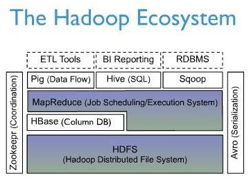

 图 1 Hadoop生态图谱1


 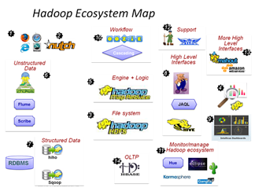

图 2 Hadoop生态图谱2


Hadoop在2.0将资源管理从MapReduce中独立出来变成通用框架后，就从1.0的三层结构演变为了现在的四层架构：
1. 底层——存储层，文件系统HDFS
2. 中间层（管控层）——资源及数据管理层，YARN以及Sentry等
3. 上层（计算引擎层）——MapReduce、Impala、Spark等计算引擎
4. 顶层（服务层）——基于MapReduce、Spark等计算引擎的高级封装及工具，如Hive、Pig、Mahout等等。

 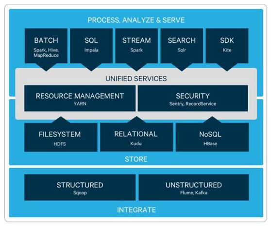

图 3 Hadoop 2.0的四层架构

说明：1. HBase底层使用HDFS作为文件存储。
2. Kudu是Cloudera在2015年10月才对外公布的新的分布式存储架构，与HDFS完全独立。其实现参考了2012年Google发表的Spanner论文。
3. 计算引擎层：Hadoop在底层共用一份HDFS存储，上层有很多个组件分别服务多种应用场景，如：确定性（OLAP）、探索性（如关联）、预测性（如机器学习类）数据分析、数据处理及转化（如ETL）和Spark。


表格 1 Hadoop生态的数据工具列表

| 功能                         | 工具列表                                        |
| ---------------------------- | ----------------------------------------------- |
| 数据抓取系统                 | Nutch                                           |
| 分布式文件系统               | HDFS                                            |
| 非结构化数据（日志）收集处理 | fuse, webdav, chukwa, flume, Scribe             |
| 数据导入到HDFS               | Hiho, sqoop                                     |
| SQL操作数据                  | Pig, Hive, Jaql                                 |
| 让你的数据可见               | drilldown, Intellicus                           |
| 用高级语言管理你的任务流     | oozie, Cascading                                |
| 监控管理工具                 | Hue, karmasphere, eclipseplugin, cacti, ganglia |
| 数据序列化处理与任务调度     | Avro, Zookeeper                                 |
| 更多构建在Hadoop上层的服务   | Mahout, ElasticmapReduce                        |
| OLTP存储系统                 | HBase                                           |


表格 2 开源云计算系统和对应的商用系统简介

| 开源云计算系统                                               | 对应的商用  云计算系统      | 简介                                                         |
| ------------------------------------------------------------ | --------------------------- | ------------------------------------------------------------ |
| Hadoop HDFS~2004                                             | Google  GFS  (200310)       | 分布式文件系统                                               |
| Hadoop  MapReduce~2005                                       | Google  MapReduce  (200412) | 基于YARN的分布式数据处理模型和执行环境。MAP-REDUCE 映射-规约。 |
| Hadoop [HBase](http://hbase.apache.org/)~2006                | Google  Bigtable  (200612)  | 分布式、按列存储数据库。2010年成为ATP。                      |
| Hadoop [Pig](http://pig.apache.org/)~2008                    |                             | Yahoo开源，一个高级数据流语言和执行并行计算的框架。2010年成为ATP。 |
| Hadoop [Hive](http://hive.apache.org/)~2008                  |                             | Facebook开源，分布式、按列存储的数据仓库。2010年成为ATP。    |
| [Mahou](http://mahout.apache.org/)~2008                      |                             | 一个可拓展的机器学习和数据挖掘库。                           |
| Hadoop [Avro](http://avro.apache.org/)~2009                  |                             | A  data serialization system. 一个序列化数据系统。2010年成为ATP。 |
| [Chukwa](http://incubator.apache.org/chukwa/)~2009           |                             | 一个用于管理大型分布式系统的数据采集系统。                   |
| Hadoop [ZooKeeper](http://zookeeper.apache.org/)~2010        | Google  Chubby  (200611)    | 分布式、可用性高的协调服务。2011年成为ATP。                  |
| Apache [Spark](http://spark.incubator.apache.org/)~2010      |                             | 一个快速，通用的Hadoop数据运算引擎。Spark提供一个简单并且富有表现力的编程模型以支持各式各样的应用，包括ETL（数据仓库技术），机器学习，数据流处理和图形运算。 |
| Apache Storm~2011                                            |                             |                                                              |
| Hadoop YARN~2012                                             |                             | YARN是下一代MapReduce，即MR V2。  A framework for job scheduling and cluster  resource management. |
| [Apache Drill](http://wiki.apache.org/incubator/DrillProposal)~2012 | Google's  Dremel            | 加快Hadoop数据查询，帮助支持广泛的数据源、数据格式和查询语言。 |
| Apache Flink~2014                                            |                             | 2008年是柏林理工大学一个研究性项目。                         |
| [Ambari](http://incubator.apache.org/ambari/)                |                             | 一款用于配置、管理和监控 Apache Adoop 集群的工具。2022年初宣布从Apache隐退。 |
| [Cassandra](http://cassandra.apache.org/)                    |                             | A  scalable multi-master database with no single points of failure. |
| Sqoop                                                        |                             | SQL-to-Hadoop的简称。主要用于传统数据库与HADOOP之间传输数据。 |
| [openstack](http://docs.openstack.org/)                      | Amazon  S3  Amazon  EC2     | 由NASA（[美国国家航空航天局](https://baike.baidu.com/item/美国国家航空航天局/1538915)）和Rackspace[合作研发](https://baike.baidu.com/item/合作研发/1415416)并发起的云操作系统。  OpenStack  is a cloud operating system that controls large pools of compute, storage,  and networking resources throughout a datacenter, all managed through a  dashboard that gives administrators control while empowering their users to provision  resources through a web interface. |
| Eucalyptus                                                   |                             |                                                              |
| Sector and Sphere                                            |                             |                                                              |
| abiquo                                                       |                             |                                                              |
| MongoDB                                                      |                             | 文档数据库                                                   |
| EnomalyECP、  Nimbus、                                       |                             |                                                              |
| Flume                                                        |                             | Cloudera开源，日志收集工具。                                 |

备注：1. Hadoop成为一组相关项目的统称。Hadoop 表示已经从Hadoop项目脱离。2010年，Hive/Pig/Azo/Hbase脱离Hadoop，成为Apache顶级项目ATP。


#### 计算框架

详见 《[大数据计算框架](大数据计算框架.md)》 MapReduce、Spark、Flink、Storm


#### 集群管理

详见 《[大数据集群管理](大数据集群管理.md)》 ZooKeeper、YARN、Mesos


### 1.2.2  Hadoop生态的编年史

表格 3 Hadoop生态的编年史

| 年份 | 事件                                                         |
| ---- | ------------------------------------------------------------ |
| 2002 | 10月，Doug Cutting和Mike  Cafarella创建了开源网页爬虫项目Nutch。 |
| 2003 | 10月，Google发表Google  File System论文。                    |
| 2004 | 7月，Doug Cutting和Mike  Cafarella在Nutch中实现了类似GFS的功能，即后来HDFS的前身。<br>10月，Google发表了MapReduce论文。 |
| 2005 | 2月，Mike Cafarella在Nutch中实现了MapReduce的最初版本。<br>12月，开源搜索项目Nutch移植到新框架，使用MapReduce和NDFS(Nutch Distributed File System )来运行，在20个节点稳定运行。 |
| 2006 | 2月，Hadoop项目正式启动。  3月，Yahoo!建设了第一个Hadoop集群用于开发。  <br/>4月，第一个Apache Hadoop发布。  11月，HBase诞生。 |
| 2007 | 百度开始使用Hadoop做离线处理。中国移动开始在“大云”研究中使用Hadoop技术。 |
| 2008 | 淘宝开始投入研究基于Hadoop的系统——云梯，并将其用于处理电子商务相关数据。  <br/>1月，Hadoop成为Apache顶级项目。  6月，Hadoop的第一个SQL框架——Hive成为了Hadoop的子项目。  <br/>11月，Apache Pig的最初版本发布。  Mahou诞生，原是Apache Luent的子项目。 |
| 2009 | 7月 ，Hadoop Core项目更名为Hadoop Common; MapReduce 和 Hadoop Distributed File System (HDFS) 成为Hadoop项目的独立子项目。Avro 和 Chukwa 成为Hadoop新的子项目。 <br/>8月，Hadoop创始人Doug  Cutting加入Cloudera担任首席架构师。  <br/>10月，首届Hadoop World大会在纽约召开。 |
| 2010 | 5月，Avro、HBase脱离Hadoop项目，成为Apache顶级项目。  <br/>9月，Hive( Facebook)、Pig  脱离Hadoop，成为Apache顶级项目。  Spark开源。 |
| 2011 | 1月，ZooKeeper 脱离Hadoop，成为Apache顶级项目。  3月，Apache Hadoop获得Media  Guardian Innovation Awards。  <br/>5月，Mapr Technologies公司推出分布式文件系统和MapReduce引擎——MapR Distribution for Apache Hadoop。 |
| 2012 | 3月，企业必须的重要功能HDFS NameNode HA被加入Hadoop主版本。  <br/>8月，另外一个重要的企业适用功能YARN成为Hadoop子项目。  <br/>10月，第一个Hadoop原生MPP查询引擎Impala加入到了Hadoop生态圈。 |
| 2013 |                                                              |
| 2014 | 2月，Spark（2009年由加州大学伯克利分校的AMPLab开发，2010年成为Apache的开源项目）逐渐代替MapReduce成为Hadoop的缺省执行引擎，并成为Apache基金会顶级项目。 |
| 2015 | 1月，Facebook开源前沿深度学习工具“Torch”。 <br/>2月，Hortonworks和Pivotal抱团提出“Open Data Platform”的倡议，受到传统企业如Microsoft、IBM等企业支持，但其它两大Hadoop厂商Cloudera和MapR拒绝参与。  <br/>4月，亚马逊启动其机器学习平台Amazon Machine Learning，这是一项全面的托管服务，让开发者能够轻松使用历史数据开发并部署预测模型。  10月，Cloudera公布继HBase以后的第一个Hadoop原生存储替代方案——Kudu。  <br/>11月，谷歌开源其机器学习平台TensorFlow。IBM开源SystemML并成为Apache官方孵化项目。微软亚洲研究院通过Github开源分布式机器学习工具DMTK。  <br/>12月，Cloudera发起的Impala和Kudu项目加入Apache孵化器。Facebook开源针对神经网络研究的服务器“Big Sur”，配有高性能图形处理单元(GPUs)，转为深度学习方向设计的芯片。 |
| 2016 |                                                              |
| 2017 |                                                              |

备注：截止2017.10，Apache顶级项目有300多个。

2006年1月，Doug Cutting加入雅虎，Yahoo!提供一个专门的团队和资源将Hadoop发展成一个可在网络上运行的系统。

2006年2月，Apache Hadoop项目正式启动以支持MapReduce和HDFS的独立发展。

2006年2月，Yahoo!的网格计算团队采用Hadoop。

2006年3月，Yahoo!建设了第一个Hadoop集群用于开发。

2006年4月，第一个Apache Hadoop发布。

2006年4月，在188个节点上(每个节点10GB)运行排序测试集需要47.9个小时。

2006年5月，Yahoo!建立了一个300个节点的Hadoop研究集群。

2006年5月，在500个节点上运行排序测试集需要42个小时(硬件配置比4月的更好)。

2006年11月，研究集群增加到600个节点。

2006年11月，Google发表了Bigtable论文，这最终激发了HBase的创建。

2006年12月，排序测试集在20个节点上运行1.8个小时，100个节点上运行3.3小时，500个节点上运行5.2小时，900个节点上运行7.8个小时。

2007年1月，研究集群增加到900个节点。

2007年4月，研究集群增加到两个1000个节点的集群。

2007年10月，第一个Hadoop用户组会议召开，社区贡献开始急剧上升。

2007年，百度开始使用Hadoop做离线处理。

2007年，中国移动开始在“大云”研究中使用Hadoop技术。

2008年，淘宝开始投入研究基于Hadoop的系统——云梯，并将其用于处理电子商务相关数据。

2008年1月，Hadoop成为Apache顶级项目。

2008年2月，Yahoo!运行了世界上最大的Hadoop应用，宣布其搜索引擎产品部署在一个拥有1万个内核的Hadoop集群上。

2008年4月，在900个节点上运行1TB排序测试集仅需209秒，成为世界最快。

2008年6月，Hadoop的第一个SQL框架——Hive成为了Hadoop的子项目。

2008年7月，Hadoop打破1TB数据排序基准测试记录。Yahoo!的一个Hadoop集群用209秒完成1TB数据的排序 ，比上一年的纪录保持者保持的297秒快了将近90秒。

2008年8月，第一个Hadoop商业化公司Cloudera成立。

2008年10月，研究集群每天装载10TB的数据。

2008年11月，Apache Pig的最初版本发布。

2009年3月，17个集群总共24000台机器。36大数据(http://www.36dsj.com/)

2009 年3月，Cloudera推出世界上首个Hadoop发行版——CDH(Cloudera’s Distribution including Apache Hadoop)平台，完全由开放源码软件组成。

2009年4月，赢得每分钟排序，59秒内排序500GB(在1400个节点上)和173分钟内排序100TB数据(在3400个节点上)。

2009年5月，Yahoo的团队使用Hadoop对1 TB的数据进行排序只花了62秒时间。

2009年6月，Cloudera的工程师Tom White编写的《Hadoop权威指南》初版出版，后被誉为Hadoop圣经。

2009年7月 ，Hadoop Core项目更名为Hadoop Common;

2009年7月 ，MapReduce 和 Hadoop Distributed File System (HDFS) 成为Hadoop项目的独立子项目。

2009年7月 ，Avro 和 Chukwa 成为Hadoop新的子项目。

2009年8月，Hadoop创始人Doug Cutting加入Cloudera担任首席架构师。

2009年10月，首届Hadoop World大会在纽约召开。

2010年5月 ，Avro脱离Hadoop项目，成为Apache顶级项目。

2010年5月 ，HBase脱离Hadoop项目，成为Apache顶级项目。

2010年5月，IBM提供了基于Hadoop 的大数据分析软件——InfoSphere BigInsights，包括基础版和企业版。

2010年9月，Hive( Facebook) 脱离Hadoop，成为Apache顶级项目。

2010年9月，Pig脱离Hadoop，成为Apache顶级项目。

2010年-2011年，扩大的Hadoop社区忙于建立大量的新组件(Crunch，Sqoop，Flume，Oozie等)来扩展Hadoop的使用场景和可用性。

2011年1月，ZooKeeper 脱离Hadoop，成为Apache顶级项目。

2011年3月，Apache Hadoop获得Media Guardian Innovation Awards 。

2011年3月， Platform Computing 宣布在它的Symphony软件中支持Hadoop MapReduce API。

2011年5月，Mapr Technologies公司推出分布式文件系统和MapReduce引擎——MapR Distribution for Apache Hadoop。

2011年5月，HCatalog 1.0发布。该项目由Hortonworks 在2010年3月份提出，HCatalog主要用于解决数据存储、元数据的问题，主要解决HDFS的瓶颈，它提供了一个地方来存储数据的状态信息，这使得 数据清理和归档工具可以很容易的进行处理。

2011年4月，SGI(Silicon Graphics International)基于SGI Rackable和CloudRack服务器产品线提供Hadoop优化的解决方案。

2011年5月，EMC为客户推出一种新的基于开源Hadoop解决方案的数据中心设备——GreenPlum HD，以助其满足客户日益增长的数据分析需求并加快利用开源数据分析软件。Greenplum是EMC在2010年7月收购的一家开源数据仓库公司。

2011年5月，在收购了Engenio之后， NetApp推出与Hadoop应用结合的产品E5400存储系统。

2011年6月，Calxeda公司发起了“开拓者行动”，一个由10家软件公司组成的团队将为基于Calxeda即将推出的ARM系统上芯片设计的服务器提供支持。并为Hadoop提供低功耗服务器技术。

2011年6月，数据集成供应商Informatica发布了其旗舰产品，产品设计初衷是处理当今事务和社会媒体所产生的海量数据，同时支持Hadoop。

2011年7月，Yahoo!和硅谷风险投资公司 Benchmark Capital创建了Hortonworks 公司，旨在让Hadoop更加可靠，并让企业用户更容易安装、管理和使用Hadoop。

2011年8月，Cloudera公布了一项有益于合作伙伴生态系统的计划——创建一个生态系统，以便硬件供应商、软件供应商以及系统集成商可以一起探索如何使用Hadoop更好的洞察数据。

2011年8月，Dell与Cloudera联合推出Hadoop解决方案——Cloudera Enterprise。Cloudera Enterprise基于Dell PowerEdge C2100机架服务器以及Dell PowerConnect 6248以太网交换机。

2012年3月，企业必须的重要功能HDFS NameNode HA被加入Hadoop主版本。

2012年8月，另外一个重要的企业适用功能YARN成为Hadoop子项目。

2012年10月，第一个Hadoop原生MPP查询引擎Impala加入到了Hadoop生态圈。

2014年2月，Spark逐渐代替MapReduce成为Hadoop的缺省执行引擎，并成为Apache基金会顶级项目。

2015年2月，Hortonworks和Pivotal抱团提出“Open Data Platform”的倡议，受到传统企业如Microsoft、IBM等企业支持，但其它两大Hadoop厂商Cloudera和MapR拒绝参与。

2015年10月，Cloudera公布继HBase以后的第一个Hadoop原生存储替代方案——Kudu。

2015年12月，Cloudera发起的Impala和Kudu项目加入Apache孵化器。


### 1.2.3  Hadoop主流厂商

就对Hadoop定位和使用不同，可以将Hadoop业界公司划分为四类：

第一梯队：这类公司已经将Hadoop当作大数据战略武器。

第二梯队：这类公司将Hadoop 产品化。

第三梯队：这类公司创造对Hadoop整体生态系统产生附加价值的产品。

第四梯队：这类公司消费Hadoop，并给规模比第一类和第二类小的公司提供基于Hadoop的服务。


## 1.3  Hadoop发行版

目前Hadoop发行版非常多，有华为发行版、Intel发行版、Cloudera发行版（CDH）等，所有这些发行版均是基于Apache Hadoop衍生出来的，之所以有这么多的版本，完全是由Apache Hadoop的开源协议决定的：任何人可以对其进行修改，并作为开源或商业产品发布/销售。

**Apache Hadoop不足之处**
- 版本管理混乱
- 部署过程繁琐、升级过程复杂
- 兼容性差
- 安全性低


国内绝大多数公司发行版是收费的，比如Intel发行版、华为发行版等，尽管这些发行版增加了很多开源版本没有的新feature，但绝大多数公司选择Hadoop版本时会将把是否收费作为重要指标，不收费的Hadoop版本主要有三个（均是国外厂商），分别是：
* Apache Hadoop、
* Cloudera版本（Cloudera’s Distribution Including Apache Hadoop，简称“CDH”）、
* Hortonworks版本（Hortonworks Data Platform，简称“HDP”）

备注：按顺序代表了，在国内的使用率，CDH和HDP虽然是收费版本，但是他们是开源的，只是收取服务费用。

2018年10月，Cloudera与Hortonworks公司宣布以52亿美元的价格合并。


表格 4 Hadoop产品化的主流厂商列表

| 厂商名                                        | 商业模式                                                     | 现状           |
| --------------------------------------------- | ------------------------------------------------------------ | -------------- |
| Cloudera~  CDH                                | 开源+自有组件。提出了Hybrid  Open Source的架构：核心组件名称叫CDH(Cloudera’s Distribution  including Apache Hadoop)，开源免费并与Apache社区同步，用户无限制使用，保证Hadoop基本功能持续可用，不会被厂家绑定；<br>数据治理和系统管理组件闭源且需要商业许可，支持客户可以更好更方便的使用Hadoop技术，如部署安全策略等。 | 开源、付费服务 |
| ~~Hortonworks  ~HDP~~                         | 100%完全开源策略。产品名称为HDP(Hortonworks Data  Platform)。<br/>所有软件产品开源，用户免费使用，Hortonworks提供商业的技术支持服务。<br/>与CDH相比，管理软件使用开源Ambari，数据治理使用Atlas，安全组件使用Ranger而非Sentry，SQL继续紧抱Hive大腿。 | 开源、付费服务 |
| MapR                                          | 采用了传统软件厂商的模式，使用私有化的实现。用户购买软件许可后才能使用。其OLAP产品主推Drill，又不排斥Impala。 | 闭源、付费     |
| 华为~FI                                       | 类似Cloudera。                                               | 闭源、付费     |
| [Amazon ~EMR](https://aws.amazon.com/cn/emr/) | 轻松运行和扩展 Apache Hadoop、Spark、HBase、Presto、Hive 以及其他大数据框架 |                |

备注：曾经私有化Hadoop版本的代表Pivotal和Intel都已经放弃，IBM几乎事实上放弃了自有Hadoop。


### 1.3.1  CDH

CDH:  Cloudera Distribution Hadoop Cloudera公司的发行版。截至目前为止，CDH共有5个版本，其中，前两个已经不再更新，最近的两个，分别是CDH4，在Apache Hadoop 2.0.0版本基础上演化而来的，CDH5，它们每隔一段时间便会更新一次.

 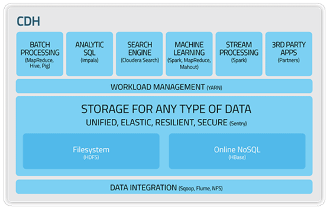

图 4 CDH架构

备注：Impala于2015.10开源，用于OLAP。


**CDH的优点**
　　• 版本划分清晰
　　• 版本更新速度快
　　• 支持Kerberos安全认证
　　• 文档清晰
　　• 支持多种安装方式（Cloudera Manager方式）

**CDH安装方式**
　　• Cloudera Manager
　　• Yum
　　• Rpm
　　• Tarball


**CDH下载地址**

　　• CDH5.4
　　　　 http://archive.cloudera.com/cdh5/
　　•Cloudera Manager5.4.3：
　　　　 http://www.cloudera.com/downloads/manager/5-4-3.html


### 1.3.2  HDP

HDP：Hortonworks Data Platform

·     [Data Platform (HDP)](https://hortonworks.com/products/data-platforms/hdp/)

·     [DataFlow (HDF)](https://hortonworks.com/products/data-platforms/hdf/)

Hortonworks Sandbox on a VM （沙盒）


 [
 Get Notified about the HDP 3.0 Sandbox
 ](https://hortonworks.com/info/hdp-3-0-sandbox-is-coming-soon/)


### 1.3.3  FI（Huawei FusionInsight）

FI：FusionInsgiht

华为FusionInsight是一个分布式数据处理系统，对外提供大容量的数据存储、查询和分析能力。FusionInsight在Hadoop集群上又封装了一层，类似于开源的CDH，HDP等大数据平台。


 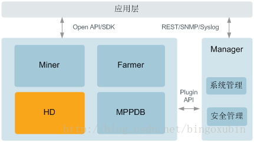

图 5 FusionInsight组成结构图

FusionInsight解决方案由4个子产品FusionInsight HD、FusionInsight MPPDB、FusionInsight Miner、FusionInsight Farmer和1个操作运维系统FusionInsight Manager构成。
* FusionInsight HD：企业级的大数据处理环境，是一个分布式数据处理系统，对外提供大容量的数据存储、分析查询和实时流式数据处理分析能力。
* FusionInsight MPPDB：企业级的大规模并行处理关系型数据库。FusionInsight MPPDB采用MPP(Massive Parallel Processing)架构，支持行存储和列存储，提供PB(Petabyte，2的50次方字节)级别数据量的处理能力。 2018年特指libra（原gauss）。
* FusionInsight Miner：企业级的数据分析平台，基于华为FusionInsight HD的分布式存储和并行计算技术，提供从海量数据中挖掘出价值信息的平台。
* FusionInsight Farmer：企业级的大数据应用容器，为企业业务提供统一开发、运行和管理的平台。
* FusionInsight Manager：企业级大数据的操作运维系统，提供高可靠、安全、容错、易用的集群管理能力，支持大规模集群的安装部署、监控、告警、用户管理、权限管理、审计、服务管理、健康检查、问题定位、升级和补丁等功能。


 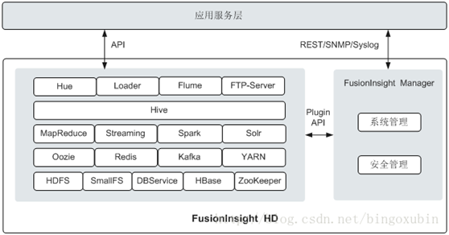

图 6 FusionInsight HD系统逻辑架构图

FusionInsight HD对开源组件进行封装和增强，包含Manager和众多组件。


 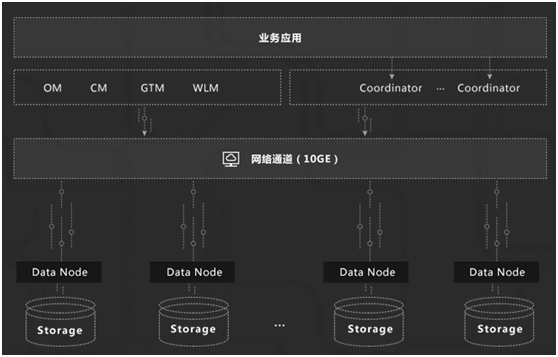

图 7 libra整体逻辑架构


### 1.3.4  EMR (Amazon)

Amazon EMR是一个完全托管型的Web服务, 它可以让您轻松并且安全的预配置和管理您的Hadoop集群。

Amazon Elastic Compute Cloud (Amazon EC2) 是一种 Web 服务，可以在云中提供安全并且可以调整大小的计算容量。该服务旨在让开发人员能够更轻松地进行 Web 规模的云计算。


### 1.3.5  TDH (Transwarp Data Hub)

星环信息科技(上海)有限公司是目前国内极少数掌握企业级大数据核心技术的高科技公司，从事大数据时代核心平台数据库软件的研发与服务。在全球去IOE的大背景下，Apache Hadoop技术已成为公认的替代传统数据库的大数据产品。公司产品Transwarp Data Hub (TDH)的整体架构及功能特性比肩硅谷同行，产品性能在业界处于领先水平。从2016年起，TDH正式成为Gartner认可的Hadoop国际主流发行版本。

公司研发团队是国内最早的大数据Apache Hadoop发行版团队，从2009年起即开始致力于大数据平台软件的自主创新和开发，与硅谷同类公司同时起步；2011年在中国率先推出基于Apache Hadoop发行版；之后，团队负责人原英特尔亚太研发中心CTO孙元浩、亚太区销售总监佘晖离开英特尔，创办星环科技.


TDH是国内首个全面支持Spark的Hadoop发行版，也是国内落地案例最多的商业版本，是国内外领先的高性能平台，比开源基于Hadoop MapReduce计算框架的版本快10x~100x倍。

 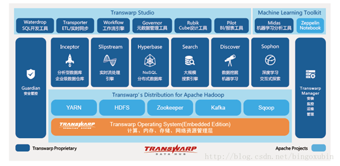

图 8 TDH产品架构图


### 本节参考

**大数据厂商**
* CDH http://archive.cloudera.com
* HDP https://hortonworks.com/products/data-platforms/hdp/
* FI http://support.huawei.com/enterprise/zh/cloud-computing/fusioninsight-hd-pid-21110924
* EMR  https://aws.amazon.com/cn/emr/
* transwarp  http://www.transwarp.cn/


**参考链接**

[1].  hortonworks  https://docs.hortonworks.com/

[2].  Transwarp Inceptor简介 https://blog.csdn.net/bingoxubin/article/details/79072393

[3].  Transwarp Data Hub 社区版 （TDH-CE） http://www.transwarp.cn/product/tdh_ce


## 1.4  Hadoop生态的内部关系

### 1.4.1  Hadoop生态内比较


|                        | 前者                                                         | 后者                                                         | 共同点和应用场景                                             |
| ---------------------- | ------------------------------------------------------------ | ------------------------------------------------------------ | ------------------------------------------------------------ |
| **Pig VS Hive**        | Pig赋予开发人员在大数据集领域更多的灵活性，并允许开发简洁的脚本用于转换数据流以便嵌入到较大的 应用程序。  相对轻量。 | Hive更适合于数据仓库的任务，Hive主要用于静态的结构以及需要经常分析的工作。  Hive与SQL相似促使 其成为Hadoop与其他BI工具结合的理想交集。 | Hive和Pig都可以与HBase组合使用，Hive和Pig还为HBase提供了高层语言支持，使得在HBase上进行数据统计处理变的非常简单 |
| **HBase**  **VS Hive** | HBase是为了支持弥补Hadoop对实时操作的缺陷的项目 。           | Hive是建立在Hadoop之上为了减少MapReduce  jobs编写工作的批处理系统。  **不支持实时查询** **。** | 操作RMDB数据库，如果是全表扫描，就用Hive+Hadoop,如果是索引访问，就用HBase+Hadoop  。 |

备注：1. Hive数据分为真实存储的数据和元数据，真实数据存储在HDFS中，元数据存储在MySQL中。


### 1.4.2  Hive 和 Hadoop 关系

**Hive简介**

一、定义

1、Hive是facebook数据团队基于Hadoop开发的数据仓库封装。
 2、Hive将结构化的数据文件映射为一张数据库表，并提供完整的sql查询功能。
 3、以数据库的方式去管理HDFS。
 4、Hive把sql语句解析为MapReduce任务进行运行。

二、优点

1、学习成本低，拥有传统的关系型数据库知识即可以用类SQL语句快速实现简单的MapReduce计算。
 2、不必开发专门的MapReduce应用，十分适合数据仓库的统计分析。

三、缺点

1、SQL语句还不够强大。


 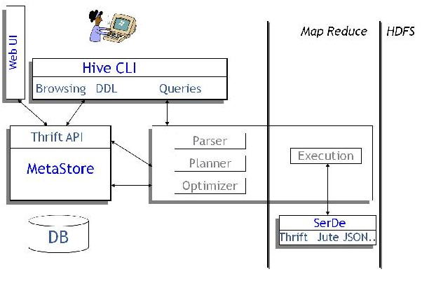

图 9 Hive 和 Hadoop 关系

Hive 构建在 Hadoop 之上，
* HQL 中对查询语句的解释、优化、生成查询计划是由 Hive 完成的
* 所有的数据都是存储在 Hadoop 中
* 查询计划被转化为 MapReduce 任务，在 Hadoop 中执行（有些查询没有 MR 任务，如：select * from table）
* Hadoop和Hive都是用UTF-8编码的


### 1.4.3  Spark与Hadoop关系

 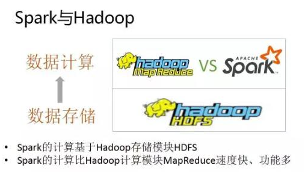

图 10 Spark与Hadoop关系


## 1.5  Hadoop安全机制

参见 另文《安全技术》

Hadoop RPC中采用了SASL(Simple Authenticaiton and Security Layer，简单认证和安全层)进行安全认证。具体认证方法涉及DIGEST-MD5和Kerberos两种。


## 1.6  Hadoop前景

|                  | 目的                                                         | 应用场景                                                     |
| ---------------- | ------------------------------------------------------------ | ------------------------------------------------------------ |
| IT<br>优化      | 将已经实现的应用和业务搬迁到Hadoop平台，以获得更多的数据、更好的性能或更低的成本。通过提高产出比、降低生产和维护成本等方式为企业带来好处。 | 历史日志数据在线查询、  ETL任务、  数据仓库offload           |
| 业务优化     | 在Hadoop上实现原来尚未实现的算法、应用，从原有的生产线中孵化出新的产品和业务，创造新的价值。通过新业务为企业带来新的市场和客户，从而增加企业收入。 | 包括大数据准备评估、路线图、预测操作界面、算法和一些针对特定市场和企业消费分析解决方案等等。如Palantir、营销的大数据分析工具  Qubit、针对CRM领域的人工智能Neokami等等。 |
| 内存计算     | 随着高级分析和实时应用的增长，对处理能力提出了更高的要求，数据处理重点从IO重新回到CPU。以内存计算为核心的Spark将代替以IO吞吐为核心的MapReduce成为分布式大数据处理的缺省通用引擎。 | OLAP、实时发现                                               |
| 简化实时应用 |                                                              |                                                              |

备注：以后驱动Hadoop前进的因素可能有物联网、硬件和云计算（现在50%计算在云端，未来扩展到80%？）。


<br>

## 本章参考

[1].  Hadoop生态圈介绍 http://www.cnblogs.com/gridmix/p/5102694.html

[2].  Hadoop生态图谱 http://blog.nosqlfan.com/html/3675.html

[3].  Ubuntu 14.04-Kerberos安装和配置 http://www.linuxidc.com/Linux/2016-09/134949.htm

[4].  ubuntu下安装kerberos  http://blog.csdn.net/zhangt85/article/details/12112135

[5].  使用NTP进行时间同步  https://help.ubuntu.com/14.04/serverguide/NTP.html

[6].  用Java访问带有Kerberos认证的HBase  http://blog.csdn.net/blackice1015/article/details/49422855

[7].  在Hadoop集群部署HBase并开启kerberos  http://www.linuxidc.com/Linux/2014-09/106213.htm

[8].  资深架构师教你一篇文看懂Hadoop http://www.raincent.com/content-10-7741-1.html

[9].  Hadoop CDH https://blog.csdn.net/duyuanhai/article/details/54908298


<br>

# 2 系统架构篇

## 2.1 HDFS

**简介**

Hadoop分布式文件系统（Hadoop Distributed File System）能提供高吞吐量的数据访问，适合大规模数据集方面的应用，为海量数据提供存储，提供类POSIX接口。


**结构**

HDFS包含主、备NameNode和多个DataNode，如[图1](http://localhost:7890/pages/YZH0518G/01/YZH0518G/01/resources/zh-cn_topic_0085563616.html#ZH-CN_TOPIC_0085563616__f450ff920a4134f819773fbbad36bac8e)所示。

HDFS是一个Master/Slave的架构，在Master上运行NameNode，而在每一个Slave上运行DataNode，ZKFC需要和NameNode一起运行。

NameNode和DataNode之间的通信都是建立在TCP/IP的基础之上的。NameNode、DataNode、ZKFC和JournalNode能部署在运行Linux的服务器上。


**图 HA HDFS结构**


[图1](http://localhost:7890/pages/YZH0518G/01/YZH0518G/01/resources/zh-cn_topic_0085563616.html#ZH-CN_TOPIC_0085563616__f450ff920a4134f819773fbbad36bac8e)中各模块的功能说明如[表1](http://localhost:7890/pages/YZH0518G/01/YZH0518G/01/resources/zh-cn_topic_0085563616.html#ZH-CN_TOPIC_0085563616__tdf4d0803d4044e55a702b6d151ceaf75)所示。

表格 7 HDFS模块说明

| 名称            | 描述                                                         |
| --------------- | ------------------------------------------------------------ |
| NameNode        | 用于管理文件系统的命名空间、目录结构、元数据信息以及提供备份机制等，分为：  Active  NameNode：管理文件系统的命名空间、维护文件系统的目录结构树以及元数据信息；记录写入的每个“数据块”与其归属文件的对应关系。   Standby  NameNode：与Active  NameNode中的数据保持同步；随时准备在Active NameNode出现异常时接管其服务。 |
| DataNode        | 用于存储每个文件的“数据块”数据，并且会周期性地向NameNode报告该DataNode的数据存放情况。 |
| JournalNode     | HA集群下，用于同步主备NameNode之间的元数据信息。             |
| ZKFC            | ZKFC是需要和NameNode一一对应的服务，即每个NameNode都需要部署ZKFC。它负责监控NameNode的状态，并及时把状态写入Zookeeper。ZKFC也有选择谁作为Active NameNode的权利。 |
| ZK  Cluster     | ZooKeeper是一个协调服务，帮助ZKFC执行主NameNode的选举。      |
| HttpFS  gateway | HttpFS是个单独无状态的gateway进程，对外提供webHDFS接口，对HDFS使用FileSystem接口对接。可用于不同Hadoop版本间的数据传输，及用于访问在防火墙后的HDFS(HttpFS用作gateway)。 |


**HDFS原理**

HDFS的原理如[图2](http://localhost:7890/pages/YZH0518G/01/YZH0518G/01/resources/zh-cn_topic_0085563616.html#ZH-CN_TOPIC_0085563616__fecf2a4d312154760851167ae0d363ded)所示。

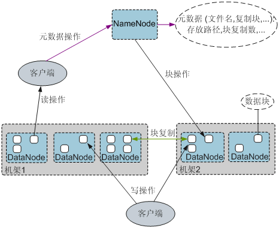

图 HDFS原理


在HDFS内部，一个文件分成一个或多个“数据块”，这些“数据块”存储在DataNode集合里，NameNode负责保存和管理所有的HDFS元数据。客户端连接到NameNode，执行文件系统的“命名空间”操作，例如打开、关闭、重命名文件和目录，同时决定“数据块”到具体DataNode节点的映射。DataNode在NameNode的指挥下进行“数据块”的创建、删除和复制。客户端连接到DataNode，执行读写数据块操作。

·     **HDFS HA架构**

HA即为High Availability，用于解决NameNode单点故障问题，该特性通过主备的方式为主NameNode提供一个备用者，一旦主NameNode出现故障，可以迅速切换至备NameNode，从而不间断对外提供服务。

在一个典型HDFS HA场景中，通常由两个NameNode组成，一个处于Active状态，另一个处于Standby状态。

为了能实现Active和Standby两个NameNode的元数据信息同步，需提供一个共享存储系统。本版本提供基于QJM（Quorum Journal Manager）的HA解决方案，如[图3](http://localhost:7890/pages/YZH0518G/01/YZH0518G/01/resources/zh-cn_topic_0085563616.html#ZH-CN_TOPIC_0085563616__fb526d759c38f48f69331e9bf8d4159ca)所示。主备NameNode之间通过一组JournalNode同步元数据信息。

通常配置奇数个（2N+1个）JournalNode，且最少要运行3个JournalNode。这样，一条元数据更新消息只要有N+1个JournalNode写入成功就认为数据写入成功，此时最多容忍N个JournalNode写入失败。比如，3个JournalNode时，最多允许1个JournalNode写入失败，5个JournalNode时，最多允许2个JournalNode写入失败。

由于JournalNode是一个轻量级的守护进程，可以与Hadoop其它服务共用机器。建议将JournalNode部署在控制节点上，以避免数据节点在进行大数据量传输时引起JournalNode写入失败。

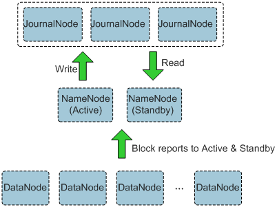

**图3 基于QJM的HDFS架构**


## 2.2  Hive

**简介**

Hive是建立在Hadoop上的数据仓库框架，提供大数据平台批处理计算能力，能够对结构化/半结构化数据进行批量分析汇总完成数据计算。提供类似SQL的Hive Query Language语言操作结构化数据，其基本原理是将HQL语言自动转换成MapReduce任务，从而完成对Hadoop集群中存储的海量数据进行查询和分析。

Hive主要特点如下：

·     海量结构化数据分析汇总。

·     将复杂的MapReduce编写任务简化为SQL语句。

·     灵活的数据存储格式，支持JSON，CSV，TEXTFILE，RCFILE，SEQUENCEFILE，ORC（Optimized Row Columnar）这几种存储格式。


**结构**

Hive为单实例的服务进程，提供服务的原理是将HQL编译解析成相应的MapReduce或者HDFS任务，[图1](http://localhost:7890/pages/YZH0518G/01/YZH0518G/01/resources/zh-cn_topic_0085563627.html?ft=0&fe=10&hib=2.2.3.8.1&id=ZH-CN_TOPIC_0085563627#ZH-CN_TOPIC_0085563627__fig47605446155228)为Hive的结构概图。

**图  Hive结构**

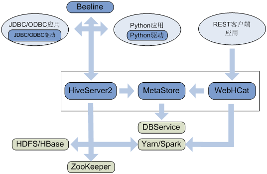


表格 8 Hive模块说明

| 名称               | 说明                                                         |
| ------------------ | ------------------------------------------------------------ |
| HiveServer         | 一个集群内可部署多个HiveServer，负荷分担。对外提供Hive数据库服务，将用户提交的HQL语句进行编译，解析成对应的Yarn任务或者HDFS操作，从而完成数据的提取、转换、分析。 |
| MetaStore          | 一个集群内可部署多个MetaStore，负荷分担。提供Hive的元数据服务，负责Hive表的结构和属性信息读、写、维护和修改。   提供Thrift接口，供HiveServer、Spark、WebHCat等MetaStore客户端来访问，操作元数据。 |
| WebHCat            | 一个集群内可部署多个WebHCat，负荷分担。提供Rest接口，通过Rest执行Hive命令，提交MapReduce任务。 |
| Hive客户端         | 包括人机交互命令行Beeline、提供给JDBC应用的JDBC驱动、提供给Python应用的Python驱动、提供给Mapreduce的HCatalog相关JAR包。 |
| ZooKeeper集群      | Zookeeper作为临时节点记录各HiveServer实例的IP地址列表，客户端驱动连接Zookeeper获取该列表，并根据路由机制选取对应的HiveServer实例。 |
| HDFS/HBase集群     | Hive表数据存储在HDFS集群中。                                 |
| MapReduce/Yarn集群 | 提供分布式计算服务：Hive的大部分数据操作依赖MapReduce，HiveServer的主要功能是将HQL语句转换成MapReduce任务，从而完成对海量数据的处理。 |

HCatalog是Hadoop上的一个表和存储的管理层。使用不同数据处理工具（如MapReduce）的用户，使用HCatalog能够在集群上更容易的读写数据。如[图2](http://localhost:7890/pages/YZH0518G/01/YZH0518G/01/resources/zh-cn_topic_0085563627.html?ft=0&fe=10&hib=2.2.3.8.1&id=ZH-CN_TOPIC_0085563627#ZH-CN_TOPIC_0085563627__hive_f2)所示，开发人员的应用程序通过HTTP请求来访问Hadoop MapReduce（YARN）、Hive、HCatalog DDL。如果请求是HCatalog DDL命令，直接被执行；如果是MapReduce、Pig、Hive任务，则会被放置在WebHCat（Templeton开普敦）服务器的队列中，使其能够被监控进度或被停止。开发人员指定MapReduce、Pig、Hive任务的处理结果在HDFS的具体存放路径。

 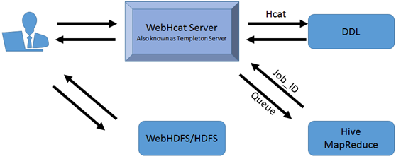

图 WebHCat的逻辑架构图


Hive作为一个基于HDFS和MapReduce架构的数据仓库，其主要能力是通过对HQL（Hive Query Language）编译和解析，生成并执行相应的MapReduce任务或者HDFS操作。

[图3](http://localhost:7890/pages/YZH0518G/01/YZH0518G/01/resources/zh-cn_topic_0085563627.html?ft=0&fe=10&hib=2.2.3.8.1&id=ZH-CN_TOPIC_0085563627#ZH-CN_TOPIC_0085563627__fig10440368155335)为Hive的结构简图。

·     **Metastore** – 对表，列和Partition等的元数据进行读写及更新操作，其下层为关系型数据库。

·     **Driver** – 管理HiveQL执行的生命周期并贯穿Hive任务整个执行期间。

·     **Compiler** – 编译HiveQL并将其转化为一系列相互依赖的Map/Reduce任务。

·     **Optimizer** – 优化器，分为逻辑优化器和物理优化器，分别对HiveQL生成的执行计划和MapReduce任务进行优化。

·     **Executor** – 按照任务的依赖关系分别执行Map/Reduce任务。

·     **ThriftServer** – 提供thrift接口，作为JDBC和ODBC的服务端，并将Hive和其他应用程序集成起来。

·     **Clients** – 包含Web UI和JDBC/ODBC接口，为用户访问提供接口。


图 Hive结构1


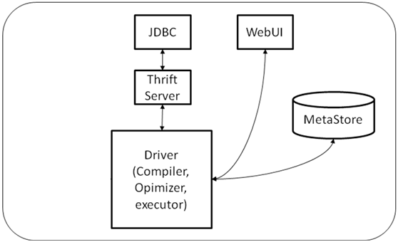


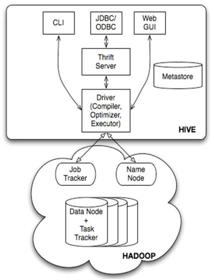

图 11 Hive架构

Hive 的结构可以分为以下几部分：
* 用户接口：包括 CLI, Client, WUI
* 元数据存储。通常是存储在关系数据库如 mysql, derby 中
* 解释器、编译器、优化器、执行器
* Hadoop：用 HDFS 进行存储，利用 MapReduce 进行计算


**备注**

1、 用户接口主要有三个：CLI，Client 和 WUI。其中最常用的是 CLI，Cli 启动的时候，会同时启动一个 Hive 副本。Client 是 Hive 的客户端，用户连接至 Hive Server。在启动 Client 模式的时候，需要指出 Hive Server 所在节点，并且在该节点启动 Hive Server。 WUI 是通过浏览器访问 Hive。

2、 Hive 将元数据存储在数据库中，如 mysql、derby。Hive 中的元数据包括表的名字，表的列和分区及其属性，表的属性（是否为外部表等），表的数据所在目录等。

3、 解释器、编译器、优化器完成 HQL 查询语句从词法分析、语法分析、编译、优化以及查询计划的生成。生成的查询计划存储在 HDFS 中，并在随后有 MapReduce 调用执行。

Hive 的数据存储在 HDFS 中，大部分的查询由 MapReduce 完成（包含 * 的查询，比如 select * from tbl 不会生成 MapRedcue 任务）。

## 2.3  HBase

### 简介

**简介**

HBase是一个高可靠性、高性能、面向列、可伸缩的分布式存储系统。HBase适合于存储大表数据（表的规模可以达到数十亿行以及数百万列），并且对大表数据的读、写访问可以达到实时级别。
* 利用Hadoop HDFS（Hadoop Distributed File System）作为其文件存储系统，提供高可靠性、高性能、列存储、可伸缩、实时读写的数据库系统。
* 为Spark和Hadoop MapReduce提供海量数据实时处理能力。
* 利用ZooKeeper作为协同服务。


**结构**

HBase集群由主备Master进程和多个RegionServer进程组成。


### HBase数据模型

HBase以表的形式存储数据，数据模型如[图2](http://localhost:7890/pages/YZH0518G/01/YZH0518G/01/resources/zh-cn_topic_0085563525.html?ft=0&fe=10&hib=2.2.3.6.1&id=ZH-CN_TOPIC_0085563525#ZH-CN_TOPIC_0085563525__f5ca7468688c94c15bf87a7c502ca9387)所示。表中的数据划分为多个Region，并由Master分配给对应的RegionServer进行管理。

每个Region包含了表中一段Row Key区间范围内的数据，HBase的一张数据表开始只包含一个Region，随着表中数据的增多，当一个Region的大小达到容量上限后会分裂成两个Region。您可以在创建表时定义Region的Row Key区间，或者在配置文件中定义Region的大小。


图 HBase数据模型


表2 概念介绍


| 名称           | 描述                                                         |
| -------------- | ------------------------------------------------------------ |
| Row  Key       | 行键，相当于关系表的主键，每一行数据的唯一标识。字符串、整数、二进制串都可以作为Row Key。所有记录按照Row  Key排序后存储。 |
| Timestamp      | 每次数据操作对应的时间戳，数据按时间戳区分版本，每个Cell的多个版本的数据按时间倒序存储。 |
| Cell           | HBase最小的存储单元，由Key和Value组成。Key由row、column family、column  qualifier、timestamp、type、MVCC  version这6个字段组成。Value就是对应存储的二进制数据对象。 |
| Column  Family | 列族，一个表在水平方向上由一个或多个Column Family组成。一个CF（Column  Family）可以由任意多个Column组成。Column是CF下的一个标签，可以在写入数据时任意添加，因此CF支持动态扩展，无需预先定义Column的数量和类型。HBase中表的列非常稀疏，不同行的列的个数和类型都可以不同。此外，每个CF都有独立的生存周期（TTL）。可以只对行上锁，对行的操作始终是原始的。 |
| Column         | 列，与传统的数据库类似，HBase的表中也有列的概念，列用于表示相同类型的数据。 |

·     **RegionServer**数据存储

RegionServer主要负责管理由HMaster分配的Region，RegionServer的数据存储结构如[图3](http://localhost:7890/pages/YZH0518G/01/YZH0518G/01/resources/zh-cn_topic_0085563525.html?ft=0&fe=10&hib=2.2.3.6.1&id=ZH-CN_TOPIC_0085563525#ZH-CN_TOPIC_0085563525__fd8c05b438f4e419a845ac4086068129e)所示。

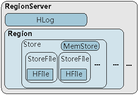

图 RegionServer的数据存储结构

[图3](http://localhost:7890/pages/YZH0518G/01/YZH0518G/01/resources/zh-cn_topic_0085563525.html?ft=0&fe=10&hib=2.2.3.6.1&id=ZH-CN_TOPIC_0085563525#ZH-CN_TOPIC_0085563525__fd8c05b438f4e419a845ac4086068129e)中Region的各部分的说明如[表3](http://localhost:7890/pages/YZH0518G/01/YZH0518G/01/resources/zh-cn_topic_0085563525.html?ft=0&fe=10&hib=2.2.3.6.1&id=ZH-CN_TOPIC_0085563525#ZH-CN_TOPIC_0085563525__td05a58b8249240a58b063a9ccb1f780c)所示。

|           | 表3 Region结构说明                                           |
| --------- | ------------------------------------------------------------ |
| 名称      | 描述                                                         |
| Store     | 一个Region由一个或多个Store组成，每个Store对应[图2](http://localhost:7890/pages/YZH0518G/01/YZH0518G/01/resources/zh-cn_topic_0085563525.html?ft=0&fe=10&hib=2.2.3.6.1&id=ZH-CN_TOPIC_0085563525#ZH-CN_TOPIC_0085563525__f5ca7468688c94c15bf87a7c502ca9387)中的一个Column Family。 |
| MemStore  | 一个Store包含一个MemStore，MemStore缓存客户端向Region插入的数据，当RegionServer中的MemStore大小达到配置的容量上限时，RegionServer会将MemStore中的数据“flush”到HDFS中。 |
| StoreFile | MemStore的数据flush到HDFS后成为StoreFile，随着数据的插入，一个Store会产生多个StoreFile，当StoreFile的个数达到配置的最大值时，RegionServer会将多个StoreFile合并为一个大的StoreFile。 |
| HFile     | HFile定义了StoreFile在文件系统中的存储格式，它是当前HBase系统中StoreFile的具体实现。 |
| HLog      | HLog日志保证了当RegionServer故障的情况下用户写入的数据不丢失，RegionServer的多个Region共享一个相同的HLog。 |


**元数据表**

元数据表是HBase中一种特殊的表，用来帮助Client定位到具体的Region。元数据表包括“hbase:meta”表，用来记录用户表的Region信息，例如，Region位置、起始Row Key及结束Row Key等信息。

元数据表和用户表的映射关系如[图4](http://localhost:7890/pages/YZH0518G/01/YZH0518G/01/resources/zh-cn_topic_0085563525.html?ft=0&fe=10&hib=2.2.3.6.1&id=ZH-CN_TOPIC_0085563525#ZH-CN_TOPIC_0085563525__f1dd74070230f4fd99e391a49363263c2)所示。

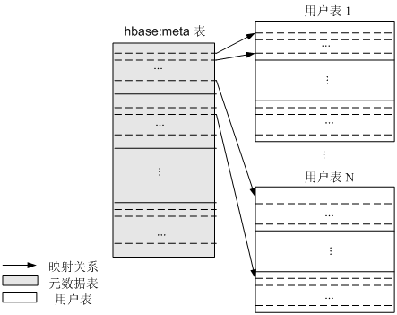

图 元数据表和用户表的映射关系


·     **数据操作流程**

HBase数据操作流程如[图5](http://localhost:7890/pages/YZH0518G/01/YZH0518G/01/resources/zh-cn_topic_0085563525.html?ft=0&fe=10&hib=2.2.3.6.1&id=ZH-CN_TOPIC_0085563525#ZH-CN_TOPIC_0085563525__fa04dc85032574524af4fa8ab21b5642b)所示。

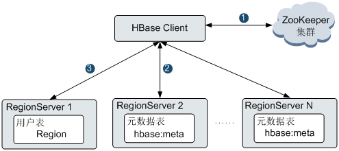

**图 HBase数据操作流程**


1. 对HBase进行增、删、改、查数据操作时，HBase Client首先连接ZooKeeper获得“hbase:meta”表所在的RegionServer的信息(涉及namespace级别修改的，比如创建表、删除表需要访问HMaster更新meta信息)。
2. HBase Client连接到包含对应的“hbase:meta”表的Region所在的RegionServer，并获得相应的用户表的Region所在的RegionServer位置信息。
3. HBase Client连接到对应的用户表Region所在的RegionServer，并将数据操作命令发送给该RegionServer，RegionServer接收并执行该命令从而完成本次数据操作。

为了提升数据操作的效率，HBase Client会在内存中缓存“hbase:meta”和用户表Region的信息，当应用程序发起下一次数据操作时，HBase Client会首先从内存中获取这些信息；当未在内存缓存中找到对应数据信息时，HBase Client会重复上述操作。


## 2.4  Hue

### 基本原理

**简介**

Hue提供了FusionInsight HD应用的图形化用户界面。Hue支持展示多种组件，目前支持HDFS、Hive、YARN/MapReduce、Oozie、Solr、ZooKeeper以及Spark。通过Hue可以在界面针对组件进行以下操作。

HDFS：查看、创建、管理、删除文件/目录，上传文件；手动配置HDFS目录存储策略，配置动态存储策略等操作。

Hive：编辑、执行HQL，也可通过metastore对数据库及表和视图进行增删改查等操作。

 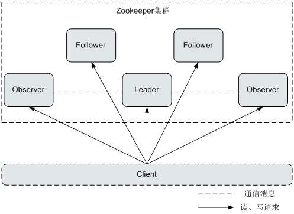

说明：

如果使用IE浏览器访问Hue界面来执行HiveSQL，由于浏览器存在的功能问题，将导致执行失败。建议使用兼容的浏览器，例如Google Chrome浏览器21及以上版本。

·     MapReduce：查看集群中正在执行和已经完成的MR任务，包括它们的状态，起始结束时间、运行日志等。

·     Oozie：提供了Oozie作业管理器功能，使用户可以通过界面图形化的方式使用Oozie。

·     Solr：支持基于Solr进行搜索的应用，并提供可视化的数据视图。

·     ZooKeeper：提供了ZooKeeper浏览器功能，使用户可以通过界面图形化的方式查看ZooKeeper。

·     Spark：编辑、执行Spark SQL，查看执行结果等。


**结构**

Hue是建立在Django Python的Web框架上的Web应用程序，采用了MTV(模型M-模板T-视图V)的软件设计模式。（Django Python是开放源代码的Web应用框架。）

Hue由“Supervisor Process”和“WebServer”构成。“Supervisor Process”是Hue的核心进程，负责应用进程管理。

“Supervisor Process”和“WebServer”通过“THRIFT/REST”接口与WebServer上的应用进行交互，如[图1](http://localhost:7890/pages/YZH0518G/01/YZH0518G/01/resources/zh-cn_topic_0085563530.html?ft=0&fe=10&hib=2.2.3.9.1&id=ZH-CN_TOPIC_0085563530#ZH-CN_TOPIC_0085563530__fig53047075153153)所示。

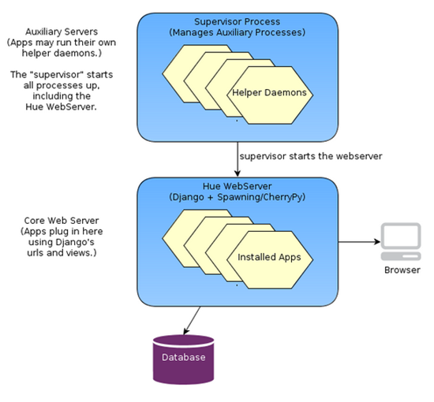

图  Hue架构示意图

[图1](http://localhost:7890/pages/YZH0518G/01/YZH0518G/01/resources/zh-cn_topic_0085563530.html?ft=0&fe=10&hib=2.2.3.9.1&id=ZH-CN_TOPIC_0085563530#ZH-CN_TOPIC_0085563530__fig53047075153153)中各部分的功能说明如[表1](http://localhost:7890/pages/YZH0518G/01/YZH0518G/01/resources/zh-cn_topic_0085563530.html?ft=0&fe=10&hib=2.2.3.9.1&id=ZH-CN_TOPIC_0085563530#ZH-CN_TOPIC_0085563530__table10504539153153)所示。

| 表1 结构图说明      |                                                              |
| ------------------- | ------------------------------------------------------------ |
| 名称                | 描述                                                         |
| Supervisor  Process | Supervisor负责WebServer上APP的进程管理：启动、停止、监控等。 |
| Hue  WebServer      | 通过Django Python的Web框架提供如下功能。  部署APPs。   提供图形化用户界面。   与数据库连接，存储APPs的持久化数据。 |


### 与组件的关系

Hue与Hadoop集群的交互关系如[图1](http://localhost:7890/pages/YZH0518G/01/YZH0518G/01/resources/zh-cn_topic_0085563606.html?ft=0&fe=10&hib=2.2.3.9.2&id=ZH-CN_TOPIC_0085563606#ZH-CN_TOPIC_0085563606__fig33901139153424)所示。

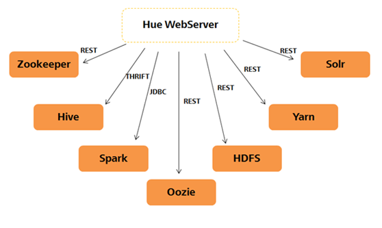

图 Hue与Hadoop集群


| 表1 Hue与Hadoop集群交互关系 |                                                              |
| --------------------------- | ------------------------------------------------------------ |
| 名称                        | 描述                                                         |
| HDFS                        | HDFS提供REST接口与Hue交互，用于查询、操作HDFS文件。          |
| Hive                        | Hive提供THRIFT接口与Hue交互，用于执行Hive SQL、查询表元数据。 |
| YARN/MapReduce              | MapReduce提供REST与Hue交互，用于查询Yarn作业信息。           |
| Oozie                       | Oozie提供REST接口与Hue交互，用于创建工作流、Coordinator、Bundle，以及它们的任务管理和监控。 |
| Solr                        | Solr提供REST接口与Hue交互，用于定义Index、搜索。             |
| Zookeeper                   | Zookeeper提供REST接口与Hue交互，用于查询Zookeeper节点信息。  |
| Spark                       | Hive提供JDBC接口与Hue交互，用于执行Spark SQL。               |


* Hue与HDFS交互原理

在Hue把用户请求从用户界面组装成接口数据，通过调用REST接口调用HDFS，通过浏览器返回结果呈现给用户。
* Hue与Hive交互原理

在Hue界面编辑HQL语句，通THRIFT接口提交HQL语句到HIVESERVER执行，同时把执行通过浏览器呈现给用户。
* Hue与MapReduce交互原理

进入Hue页面，输入筛选条件参数，UI将参数发送到后台，Hue通过调用MapReduce(MR1/MR2-YARN)提供的REST接口，获取任务运行的状态，起始结束时间、运行日志等信息。
* Hue与Oozie交互原理

在Hue前端提供图形化工作流、Coordinator、Bundle编辑器，Hue调用Oozie REST接口对工作流、Coordinator、Bundle进行创建、修改、删除、提交、监控。
* Hue与Solr交互原理

在Hue前端通过浏览器点击、输入等方式输入筛选参数，Hue前端将筛选参数传到后台，Hue后台调用Solr的REST接口，然后以JSON格式将Solr返回的结果返回给Hue前台，Hue前台利用图标控件将结果展示出来。
* Hue与Zookeeper交互原理

在Hue前端显示Zookeeper节点信息，Hue调用Zookeeper REST接口获取这些节点信息。
* 在Hue前端提供Spark SQL编辑器，Hue调用Spark的JDBC接口执行Spark SQL。


<br>

# 3 软件安装篇

## 3.1  安装概述

表格 9 Hadoop组件安装要点列表

| 软件   | 安装                                                         | 启动                                       | 使用                                                         |
| ------ | ------------------------------------------------------------ | ------------------------------------------ | ------------------------------------------------------------ |
| Hadoop | 七步骤。包括多台主机间免密码访问，安装JAVA，编译安装Hadoop，配置Hadoop环境变量和配置文件。 | #  同时启动YARN和HDFS  $ sbin/start-all.sh | $ hadoop [cmd]                                               |
| hbase  | 下载二进制；编辑配置文件：   hbase-env.sh、hbase-site.xml和regionservers | $ bin/start-hbase.sh                       | $ hbase shell                                                |
| spark  | 下载二进制，解压即可用。                                     | # 自带集群模式启动  $ sbin/start-all.sh    | 3种语言交互环境（bin目录）pyspark/spark-shell/sparkR  1个脚本提交命令：  ./bin/spark-submit  [script] |
| Hive   | 下载二进制，解压即可用。                                     | ./bin/Hive                                 |                                                              |

备注：Hadoop生态一般依赖于hdfs，所以一般要先启动hadoop。

1. jps示例：
```sh
denny@denny-ubuntu:~$ jps
4786 Master
4900 Worker
4280 ResourceManager
4417 NodeManager
4119 SecondaryNameNode
5806 Jps
3925 DataNode
```
说明：master/worker 是spark独立模式集群的进程；NodeManager/SecondaryNameNode/DataNode是Hadoop HDFS的进程；Resource Manager是YARN集群管理调度进程。


2. 启动hadoop命令

start-all.sh = start-dfs.sh + start-yarn.sh
```sh
# 1) hdfs：相应启动namenode, datanode, secondarynamenode,
$ ./sbin/start-dfs.sh

# 2) yarn
$ ./sbin/start-yarn.sh
```

3. 启动spark命令

start-all.sh = start-master.sh + start-slave.sh

1) spark master
```sh
/home/denny/source/jdk1.8.0_121/bin/java -cp /home/hadoop/bin/spark-2.1.0-bin-hadoop2.6/conf/:/home/hadoop/bin/spark-
2.1.0-bin-hadoop2.6/jars/*:/usr/local/hadoop/etc/hadoop/ -Xmx1g org.apache.spark.deploy.master.Master --host denny-ubuntu --port 707
7 --webui-port 8080
```

2）spark worker
```sh
/usr/lib/jvm/java-7-openjdk-i386/jre/bin/java -cp /home/hadoop/bin/spark-2.1.0-bin-hadoop2.6/conf/:/home/hadoop/bin/s
park-2.1.0-bin-hadoop2.6/jars/* -Xmx1g -XX:MaxPermSize=256m org.apache.spark.deploy.worker.Worker --webui-port 8081 spark://denny-ub
untu:7077
```


## 3.2  Hadoop单机模式安装 step 1~7

说明：安装版本为Hadoop-2.7.3，配置文件(cong->etc)和启动脚本(bin->sbin)目录路径与之前配置有差异。

参考：[http://Hadoop.apache.org/docs/r2.7.3](http://hadoop.apache.org/docs/r2.7.3)

### 3.2.1  安装前准备step 1~3
```sh
# step 1.增加用户组、用户，添加用户权限
$ sudo group add Hadoop
$ sudo adduser -ingroup Hadoop Hadoop
$ sudo gedit /etc/sudoers sudo gedit /etc/sudoers

# step 2.免密码SSH 设置访问
$ ssh localhost
$ ssh-keygen -t dsa -P '' -f ~/.ssh/id_dsa
$ cat ~/.ssh/id_dsa.pub >> ~/.ssh/authorized_keys

# step 3.安装基础软件java，同步工具ssh/rsync
$ sudo apt-get install openssh-server ssh rsync
$ sudo apt-get install openjdk-7-jdk
```

step 4.下载Hadoop系列软件，并安装（详见下节）

```sh
# apt-get 安装：spark zookeeper
$ sudo apt-get install spark zookeeper
```


### 3.2.2  安装 step 4

**1.编译安装**
```sh
# 安装jdk, maven, protobuf
$ sudo apt-get install maven libprotobuf-java
$ cd Hadoop-2.6.1-src
# mvn编译：-Pnative~忽略本地建立mapreduce
$ mvn clean package -Pnative -DskipTests -Dtar
# 查看编译后的文件
$ cd /Hadoop/Hadoop-2.6.1-src/Hadoop-dist/target/Hadoop-2.6.1/lib/native
```


**2.二进制安装**
```sh
# 直接将目录移到/usr/local
$ sudo mv Hadoop-2.6.1 /usr/local/Hadoop

# 检测安装效果
$ ./bin/Hadoop version
```


### 3.2.3  配置 step 5~6

#### 3.2.3.1 配置环境变量

** 设定JAVA_HOME和HADOOP变量**
```sh
# 检测java的安装路径

$ update-alternatives --config java
# 编辑.bashrc，添加以下内容，并激活source .bashrc
#HADOOP VARIABLES START
export JAVA_HOME=/usr/lib/jvm/java-7-openjdk-i386
export HADOOP_ HOME =/usr/local/Hadoop
export HADOOP_COMMON_HOME=$HADOOP_HOME
export HADOOP_HDFS_HOME=$HADOOP_HOME
export HADOOP_MAPRED_HOME=$HADOOP_HOME
export HADOOP_YARN_HOME=$HADOOP_HOME
export HADOOP_CONF_DIR=$HADOOP_HOME/etc/Hadoop
export PATH=$PATH:$HADOOP_HOME/bin:$HADOOP_HOOME/sbin:$HADOOP_HOME/lib
export HADOOP_COMMON_LIB_NATIVE_DIR=$HADOOP_HOME/lib/native
export HADOOP_OPTS="-Djava.library.path=$HADOOP_HOME/lib"

#HADOOP VARIABLES END

# 编辑Hadoop-env.sh，修改变量JAVA_HOM、HADOOP_HOME和PATH
# 说明：若以上变量已经在.bashrc添加，那么这里可以不用修改。
$ vi /usr/local/Hadoop/etc/Hadoop/Hadoop-env.sh
export JAVA_HOME=/usr/lib/jvm/java-7-openjdk-i386
export HADOOP_HOME=/usr/local/Hadoop
export PATH=$PATH:/usr/local/Hadoop/bin
```

#### 3.2.3.2 配置Hadoop文件

特别说明：Hadoop 2.6后的配置文件目录位于${HADOOP_HOME}/etc/Hadoop/，而早期配置文件目录在${ HADOOP_HOME }/conf/

Hadoop的配置文件是 xml 格式，每个配置以声明 property 的 name 和 value 的方式来实现，配置文件顶层标签为< configuration> </configuration>。


| 配置文件名             | 用途                                                         | 修改内容                                                     |
| ---------------------- | ------------------------------------------------------------ | ------------------------------------------------------------ |
| core-site.xml          | 分布式模式必需  配置namenode，端口9000对应于50090.  若此文件为空，程序将不会在Hadoop.tmp.dir查找文件，而是在本地查找。 | <property>     <name>fs.default.name</name>     <value>hdfs://localhost:9000</value>    </property>    <property>     <name>Hadoop.tmp.dir</name>     <value>/tmp/Hadoop/Hadoop-${user.name}</value>    </property> |
| hdfs-site.xml          | 分布式模式必需                                               | <property>     <name>dfs.replication</name>     <value>1</value>    </property> |
| mapred-site.xml        | MapReduce job 配置，分布式计算。                             | <property>      <name>mapreduce.framework.name</name>    <value>yarn</value>  </property> |
| yarn-site.xml          |                                                              | <property>     <name>yarn.nodemanager.aux-services</name>      <value>mapreduce_shuffle</value>  </property> |
| capacity-scheduler.xml |                                                              |                                                              |
|                        |                                                              |                                                              |

备注：


Now you are ready to start your Hadoop cluster in one of the three supported modes:

表格 10 Hadoop支持模式列表

| 运行模式                                                     | 特色                                                         | 配置项                                                       |
| ------------------------------------------------------------ | ------------------------------------------------------------ | ------------------------------------------------------------ |
| [Local (Standalone) Mode](http://hadoop.apache.org/docs/stable/hadoop-project-dist/hadoop-common/SingleCluster.html#Standalone_Operation) 单机 | 默认情况下，Hadoop被配置成以非分布式模式运行的一个独立Java进程。这对调试非常有帮助。 | 无需配置Hadoop文件                                           |
| [Pseudo-Distributed Mode](http://hadoop.apache.org/docs/stable/hadoop-project-dist/hadoop-common/SingleCluster.html#Pseudo-Distributed_Operation) 伪分布式 | Hadoop可以在单节点上以所谓的伪分布式模式运行，此时每一个Hadoop守护进程都作为一个独立的Java进程运行。节点既作为 NameNode 也作为 DataNode，同时，读取的是 HDFS 中的文件。 | 伪分布式需要修改2个配置文件 core-site.xml 和hdfs-site.xml  。 |
| [Fully-Distributed Mode](http://hadoop.apache.org/docs/stable/hadoop-project-dist/hadoop-common/SingleCluster.html#Fully-Distributed_Operation) 完全分布式 |                                                              |                                                              |


#### 3.2.3.3 示例：WordCount

下面的实例将README.txt拷贝作为输入，查找并显示匹配给定正则表达式的条目。输出写入到指定的output目录。
```sh
$ cd /usr/local/Hadoop
$ mkdir input
$ cp README.txt input

# 执行WordCount，*2.4.0为Hadoop版本号，相应修改
$ bin/hadoop jar share/hadoop/mapreduce/sources/hadoop-mapreduce-examples-2.4.0-sources.jar org.apache.hadoop.examples.WordCount input output
# 或者
$ bin/hadoop jar ./share/hadoop/mapreduce/hadoop-mapreduce-examples-*.jar grep ./input ./output 'dfs[a-z.]+'

# 查看字符统计结果
$ cat output/*
```

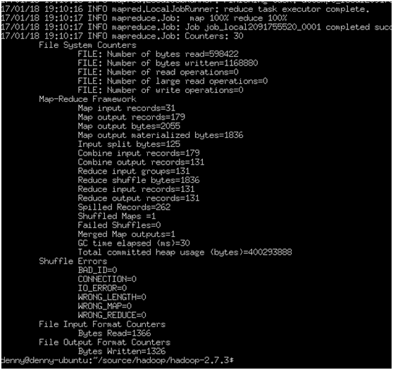

备注：若需再次执行脚本，需删除outout/*。


### 3.2.4  执行step 7
```sh
# step 7.格式化hdfs，只需执行一次，再次执行将重新格式化，清除之前数据
$ hdfs namenode -format

# 启动脚本：路径有发生变化，bin/--> sbin/
# dfs初始化map-reduce环境，yarn负责资源管理与任务调度
$ sbin/start-all.sh
# 或者
$ sbin/start-dfs.sh
$ sbin/start-yarn.sh

# 安装完毕，测试
Hadoop守护进程的日志写入到 ${HADOOP_LOG_DIR} 目录 (默认是 ${HADOOP_HOME}/logs).
浏览NameNode和JobTracker的网络接口，它们的地址默认为：
ResourceManager - http://localhost:8088/
NameNode（对应配置文件端口为9000） - http://localhost:50090/

# jps查看启动的Hadoop进程，若无DataNode或和NameNode则启动不成功。
denny@denny-ubuntu:~$ jps
12462 DataNode
12950 NodeManager
12813 ResourceManager
12652 SecondaryNameNode
16161 Jps

# 将输入文件拷贝到分布式文件系统：
 $ bin/Hadoop fs -put conf input
# 在分布式模式查看输出文件
$ bin/hdfs dfs -cat output/*

# 停止
$ sbin/stop-yarn.sh
$ sbin/stop-dfs.sh
```


## 3.3  Hadoop Cluster集群配置

### 3.3.1  Hadoop组件的版本配置

表格 11 Hadoop系列版本配置

| 程序                                          | stable   版本 | 2017stable   版本 | 简介                                                         | 下载                                                         |
| --------------------------------------------- | ------------- | ----------------- | ------------------------------------------------------------ | ------------------------------------------------------------ |
| JDK                                           | 8.0_45        | 9.0               | java基础                                                     |                                                              |
| Hadoop                                        | 2.6.4         | 2.9.0             | Hadoop common 包括MapReduce和HDFS.                        | [http://mirrors.cnnic.cn/apache/Hadoop/common](http://mirrors.cnnic.cn/apache/hadoop/common) |
| [**ZooKeeper**](http://zookeeper.apache.org/) | 3.4.6         |                   | 分布式监控                                                   | http://zookper.apache.org/                                   |
| [**HBase™**](http://hbase.apache.org/):       | 1.2.4         | 1.3.0             | 分布式、按列存储数据库                                       | http://hbase.apache.org/                                     |
| [**Hive**](http://hive.apache.org/)           | 1.2.1         |                   | 分布式、按列存储的数据仓库                                   | [http://Hive.apache.org/](http://hive.apache.org/)           |
| [sqoop](http://sqoop.apache.org/)             | 1.99.7        |                   | Hadoop(Hive)与其它数据库之间转换                             | http://sqoop.apache.org/                                     |
| MapReduce                                     |               |                   |                                                              |                                                              |
| [spark](http://spark.apache.org/)             | 1.6.2         |                   | UC  Berkeley AMP lab (加州大学伯克利分校的AMP实验室)所开源的类Hadoop  MapReduce的通用并行框架 | http://spark.apache.org/                                     |
| [storm](http://storm.apache.org/)             | 0.9.7         |                   | 实时计算                                                     | http://storm.apache.org/                                     |
|                                               |               |                   |                                                              |                                                              |


表格 12 Hadoop节点规划

| 节点  | 安装软件                                          | 进程                                                         |
| ----- | ------------------------------------------------- | ------------------------------------------------------------ |
| hsm01 | jdk, Hadoop, zookeeper, hbase, Hive, sqoop, spark | NameNode, ResourceManager, JournalNode,  QuorumPeerMain, DFSZKFailoverController, HMaster, Worker, Master |
| hss01 | jdk,  Hadoop, zookeeper, hbase, spark             | NameNode, ResourceManager(需单独启动), JournalNode, QuorumPeerMain, DataNode, NodeManager,  DFSZKFailoverController, Worker |
| hss02 | jdk,  Hadoop, zookeeper, hbase, mysql, spark      | DataNode, NodeManager, JournalNode,  QuorumPeerMain, Worker  |


## 3.4  HBase

前提：安装jdk、Hadoop对应版本

**安装步骤：**

1、下载hbase-x.x.x.tar.gz，并解压

2、修改以下配置文件

 - hbase-env.sh
 - hbase-site.xml
 - regionservers

**hbase-env.sh**

```sh
export JAVA_HOME=/home/username/jdk1.6.0_24
export HBASE_HOME=/home/username/hbase-0.90.4
export PATH=$PATH:/home/username/hbase-0.20.6/bin
export HBASE_MANAGES_ZK=true   # 使用hbase自带的zookeeper
export HADOOP_HOME=/home/username/Hadoop-0.20.2
```

**hbase-site.xml**

```xml
<property>
   <name>hbase.rootdir</name>
    <!-- 与Hadoop集群里的core-site.xml文件里fs.default.name保持一致，这里如果写IP不识别，最好是写主机名称 -->
   <value>hdfs://a004:9000/hbase</value>
 </property>
 <property>
   <name>hbase.cluster.distributed</name>
    <!--  false为单机版，为true集群版 -->
   <value>true</value>
 </property>
```


或者 这两个选项的value值可以选择使用ip地址代替hostname，效果一样
```xml
<property>
   <name>hbase.master</name>
   <value>a004</value>
 </property>
 <property>
   <name>hbase.zookeeper.quorum</name>
   <value>a004,p001,p002</value>
 </property>

<property>
   <name>hbase.zookeeper.property.clientPort</name>
   <value>2181</value>
 </property>
```


**Rgionservers **

```shell
a004
p001
p002
```

在一台机器上编辑完成hbase-site.xml、hbase-env.sh、regionservers几个文件后，通过scp命令将hbase安装目录分发到各个机器上。

**注意：**

/hbase/lib/Hadoop-core-x.x-append-r1056497.jar需要删除，替换HADOOP_HOME下的Hadoop-x.x.x-core.jar

保证各个机器能够无密码访问

保证各个机器的时间一致


**运行**

执行启动hbase集群

 `$ bin/start-hbase.sh`

启动后可以通过界面查看集群是否正常，地址：[http://master ip:60010/master.jsp](http://localhost:60010/master.jsp)


## 3.5  Hive

下载：https://hive.apache.org/downloads.html

修改配置：conf目录下6个配置文件，包括4个模板（xml/sh/log4j）。
```sh
$ vim bin/hive-config.sh
hive-site.xml    # hive的配置文件
hive-env.sh     # hive的运行环境文件
hive-default.xml.template #默认模板
hive-env.sh.template   # hive-env.sh默认配置
hive-exec-log4j.properties.template  # exec默认配置
hive-log4j.properties.templat log # 默认配置
```


安装mysql driver

**启动**

 `$ hive/bin/hive`


**启动hive的元数据库**

示例: 进入到hive的安装目录

1、启动derby数据库
```ssh
$ cd /home/admin/caona/hive/build/dist/
$ startNetworkServer -h 0.0.0.0
```


2、连接Derby数据库进行测试

查看/home/admin/caona/hive/build/dist/conf/hive-default.xml。
```xml
<property>
  <name>javax.jdo.option.ConnectionURL</name>
  <value>jdbc:derby://Hadoop1:1527/metastore_db;create=true</value>
  <description>JDBC connect string for a JDBC metastore</description>
 </property>
```

进入derby安装目录，并运行 ij
```sh
$ cd /home/admin/caona/hive/build/dist/db-derby-10.4.1.3-bin/bin
$ ./ij
Connect 'jdbc:derby://Hadoop1:1527/metastore_db;create=true';
```


<br>

## 本章参考

[1].  [http://Hadoop.apache.org/docs/stable/Hadoop-project-dist/Hadoop-common/SingleCluster.html](http://hadoop.apache.org/docs/stable/hadoop-project-dist/hadoop-common/SingleCluster.html)

[2].  Hadoop、Spark、Storm相关组件安装 http://blog.csdn.net/u013980127/article/details/52351900


# FAQ

## Hadoop

**1. Hadoop namenode启动不能成功**

现象：

解决方法：检查日志文件，看出错信息。

1）dfs是否已经格式化

2）启动模式是否合法，有权限。

3）其它


**2. Hadoop 文件路径INPUT 查不到**

现象：Exception in thread "main" org.apache.hadoop.mapreduce.lib.input.InvalidInputException: Input path does not exist: hdfs://localhost:9000/user/hadoop/input，即在路径hdfs://localhost:9000/user/hadoop/input下，找不到input文件。

解决方法：将所需文件放到hdfs 的文件路径。

法1：修改core-site.xml 为空，即不使用hdfs 的虚拟路径

法2：`hdfs dfs put xxx /usr/hadoop/input`


**3. Hadoop Name node is in safe mode.**

**现象**: : Zero blocklocations for /user/denny/README.md. Name node is in safe mode.

在分布式文件系统启动的时候，开始的时候会有安全模式，当分布式文件系统处于安全模式的情况下，文件系统中的内容不允许修改也不允许删除，直到安全模式结束。

**解决方法**：关闭安全模式

`$ bin/hadoop dfsadmin -safemode leave`


<br>

# 参考资料

**官网**

* Apache Hadoop  [http://Hadoop.apache.org/docs/stable/](http://hadoop.apache.org/docs/stable/)
* Apache Spark http://spark.apache.org/
* Apache Hive  http://hive.apache.org/
* Apache HBase  http://hbase.apache.org/
* Apache Drill  http://drill.apache.org/
* Apache Pig  http://pig.apache.org
* Apache ZooKeeper  http://zookeeper.apache.org/
* Apache Mesos  https://mesos.apache.org
* Hadoop YARN   https://hadoop.apache.org/docs/current/hadoop-yarn/hadoop-yarn-site/YARN.html
* [Apache Ambari](http://incubator.apache.org/ambari/)
* [Apache Avro](http://avro.apache.org/)
* [Apache Cassandra](http://cassandra.apache.org/)
* [Apache Mahou](http://mahout.apache.org/)


**参考链接**

* FusionInsight V100R002C30SPC100 产品描述 01
* OpenStack Installation Tutorial for Ubuntu http://docs.openstack.org/newton/install-guide-ubuntu/

