| 序号 | 修改时间   | 修改内容                                             | 修改人 | 审稿人 |
| ---- | ---------- | ---------------------------------------------------- | ------ | ------ |
| 1    | 2016-6-21  | 创建                                                 | Keefe |        |
| 2    | 2016-12-16 | 从《机器学习笔记》移入数据挖掘、广告、推荐系统章节。 | 同上   |        |
| 3    | 2017-1-5   | 将《大数据处理》重命名为《大数据开发》。             | 同上   |        |
| 4    | 2017-1-18  | 增加数据仓库章节，将Hadoop章节移动《Hadoop体系》。   | 同上   |        |
| 5    | 2017-10-4  | 更新数据挖掘章节                                     | 同上   |        |
| 6    | 2018-3-15  | 将BI相关章节迁移到《BI专题》                         | 同上   |        |
| 7    | 2018-4-6   | 增加补充大数据技术选型章节。                         | 同上   |        |
| 8    | 2018-7-15  | 增加补充OLAP、消息队列章节                           | 同上   |        |
| 9    | 2021-4-25  | 将计算引擎相关章节单独成立《大数据计算框架》         | 同上   |        |


---

# 目录

[目录... 1](#_Toc16023009)

[1    大数据技术栈... 4](#_Toc16023010)

[1.1    概述... 4](#_Toc16023011)

[1.1.1     大数据处理技术演进... 5](#_Toc16023012)

[1.1.2     大数据架构演进... 5](#_Toc16023013)

[1.2    大数据架构... 7](#_Toc16023014)

[1.2.1     大数据参考架构一（工信部）... 7](#_Toc16023015)

[*1.2.2*     *大数据参考架构二*... 9](#_Toc16023016)

[1.2.3     BDAS. 10](#_Toc16023017)

[1.3    本章参考... 10](#_Toc16023018)

[2    大数据工具... 10](#_Toc16023019)

[2.1    Hadoop系列... 11](#_Toc16023020)

[2.2    计算引擎... 12](#_Toc16023021)

[2.2.1     Hadoop MapReduce(MR) 12](#_Toc16023022)

[2.2.2     HPCC~高性能计算与通信... 12](#_Toc16023023)

[2.2.3     本节参考... 13](#_Toc16023024)

[2.3    实时计算... 13](#_Toc16023025)

[2.3.1     Apache Spark. 14](#_Toc16023026)

[2.3.2     Apache Flink. 14](#_Toc16023027)

[2.3.3     Apache Storm.. 16](#_Toc16023028)

[2.3.4     本节参考... 23](#_Toc16023029)

[2.4    日志处理和分析... 23](#_Toc16023030)

[2.4.1     Splunk. 23](#_Toc16023031)

[2.4.2     ELK. 25](#_Toc16023032)

[2.4.3     本节参考... 33](#_Toc16023033)

[2.5    集群管理... 33](#_Toc16023034)

[2.5.1     Apache Mesos. 34](#_Toc16023035)

[2.5.2     Apache YARN.. 35](#_Toc16023036)

[2.5.3     Apache ZooKeeper. 35](#_Toc16023037)

[2.5.4     本节参考... 35](#_Toc16023038)

[2.6    数据转换工具... 35](#_Toc16023039)

[2.6.1     Sqoop. 35](#_Toc16023040)

[2.6.2     OGG.. 38](#_Toc16023041)

[2.6.3     本节参考... 38](#_Toc16023042)

[2.7    本章参考... 38](#_Toc16023043)

[3    大数据的技术选型... 38](#_Toc16023044)

[3.1    大数据技术的分析目录（脑图）... 38](#_Toc16023045)

[3.2    数据采集工具选型... 41](#_Toc16023046)

[3.3    数据存储平台选型... 42](#_Toc16023047)

[3.4    数据计算引擎选型... 42](#_Toc16023048)

[3.5    工作流调度系统比较... 44](#_Toc16023049)

[3.6    集群管理工具比较... 46](#_Toc16023050)

[3.7    运维监控工具比较... 46](#_Toc16023051)

[3.8    ETL工具比较... 49](#_Toc16023052)

[3.9    数据流通技术工具对比... 49](#_Toc16023053)

[3.10     本章参考... 50](#_Toc16023054)

[4    参考资料... 51](#_Toc16023055)

[4.1    重要网站... 51](#_Toc16023056)

[4.2    项目官网... 51](#_Toc16023057)

[4.3    参考书目... 52](#_Toc16023058)

[4.4    参考链接... 53](#_Toc16023059)

[附录... 53](#_Toc16023060)

[FAQ.. 53](#_Toc16023061)

 

**表目录**

[表格 1 大数据架构比较__ 6](#_Toc16023062)

[表格 2 大数据工具列表（按主题分类）__ 11](#_Toc16023063)

[表格 3 大数据开源工具列表__ 11](#_Toc16023064)

[表格 4 实时计算的分类__ 13](#_Toc16023065)

[表格 5基本概念__ 19](#_Toc16023066)

[表格 6 logstash的主要组件__ 28](#_Toc16023067)

[表格 7 Sqoop1与Sqoop2比较__ 35](#_Toc16023068)

[表格 8 sqoop**常用参数**__ 36](#_Toc16023069)

[表格 9 大数据不同业务场景下的可选工具表__ 38](#_Toc16023070)

[表格 11 数据采集工具简介__ 41](#_Toc16023071)

[表格 10 数据采集工具比较列表__ 41](#_Toc16023072)

[表格 12 DB存储平台选型__ 42](#_Toc16023073)

[表格 13 数据计算引擎比较列表__ 42](#_Toc16023074)

[表格 14 Storm、Spark streaming和Flink比较__ 43](#_Toc16023075)

[表格 15 流式计算引擎比较列表__ 43](#_Toc16023076)

[表格 16 常用工作流调度系统列表__ 44](#_Toc16023077)

[表格 17 Hadoop工作流调度器比较__ 45](#_Toc16023078)

[表格 18 集群管理工具列表__ 46](#_Toc16023079)

[表格 19 运维工具列表__ 46](#_Toc16023080)

[表格 20 开源监控软件综合比较__ 47](#_Toc16023081)

[表格 21 开源监控软件综合打分__ 48](#_Toc16023082)

[表格 22 CDC四种方案比较__ 49](#_Toc16023083)

[表格 23 ETL工具列表__ 49](#_Toc16023084)

 

**图目录**

[图 1 大数据处理技术演进__ 6](#_Toc16023085)

[图 2 Lambda架构__ 7](#_Toc16023086)

[图 3 大数据Kappy架构__ 8](#_Toc16023087)

[图 4 大数据IOTA架构__ 8](#_Toc16023088)

[图 5 大数据处理的关键架构图__ 10](#_Toc16023089)

[图 6 BDAS数据分析栈__ 11](#_Toc16023090)

[图 7 HPCC架构图__ 14](#_Toc16023091)

[图 8 Flink 架构图__ 15](#_Toc16023092)

[图 9 Flink的Stack_ 16](#_Toc16023093)

[图 10 Storm架构图__ 17](#_Toc16023094)

[图 11 Storm组件关系图__ 23](#_Toc16023095)

[图 12 ELK架构一__ 27](#_Toc16023096)

[图 13 ELK架构二__ 27](#_Toc16023097)

[图 14 ELK架构三__ 28](#_Toc16023098)

[图 15 ELK架构四__ 28](#_Toc16023099)

[图 16 Logstash事件处理流程__ 29](#_Toc16023100)

[图 17 ELK在运维系统组件中应用图示__ 33](#_Toc16023101)

[图 19 Sqoop1架构__ 37](#_Toc16023102)

 

[TOC]


---

 

# 1  大数据技术栈

## 1.1  概述

​     大数据Big Data：最初是在2011年5月，EMC World 2011会议中，EMC抛出了Big Data 的概念。

​     大数据是一个含义广泛的术语，是指数据集，如此庞大而复杂的，他们需要专门设计的硬件和软件工具进行处理。该数据集通常是万亿或EB的大小。这些数据集收集自各种各样的来源：传感器，气候信息，公开的信息，如杂志，报纸，文章。大数据产生的其他例子包括购买交易记录，网络日志，病历，军事监控，视频和图像档案，及大型电子商务。
​     在大数据和大数据分析，他们对企业的影响有一个兴趣高涨。大数据分析是研究大量的数据的过程中寻找模式，相关性和其他有用的信息，可以帮助企业更好地适应变化，并做出更明智的决策。

大数据可以概括为4个V， 数据量大(Volume)、速度快(Velocity)、类型多(Variety)、价值密度低(Veracity)。大数据作为时下最火热的IT行业的词汇，随之而来的数据仓库、数据安全、数据分析、数据挖掘等等围绕大数据的商业价值的利用逐渐成为行业人士争相追捧的利润焦点。

 

数据处理流程：采集预处理 -- 存储 --（检索、分析、共享）-- 展现。

**大数据底层技术**：
* 分布式计算
* 分布式通信
* 内存计算
* 列存储
* 库内计算 

 

**大数据BI：并不仅仅是数据展现**
1. 要能够掌握情况、分析问题、找到答案。
2. 前端系统的交互和分析能力要强大：过滤(Filter)、钻取(Drill)、刷取(Brush)、缩放(Zoom)、关联(Associate)、变换(Transform)、动态计算（Dynamic Calculation）、链接(Link)。
3. 数据挖掘、预测将变成重要的需求。

 

解决方案：Hadoop(MAPREDUCE技术)、MongoDB，流计算（Twitter）

 

**数据存储**
* 结构化数据：海量数据的查询、统计、更新等操作效率低。
* 非结构化数据：图片、视频、WORD、PDF、PPT等文件存储，不利于检索。
* 半结构化数据：转化为结构为数据或者按照非结构化存储。

 

### 1.1.1 数据金字塔

​     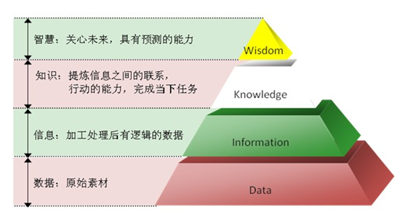                          

图 1 数据金字塔~*数据、信息、知识与智慧的关系*

数据、**信息**、**知识**依赖于语境、依赖于接收者本身，三者之间的区别并非泾渭分明。
* 数据是记录下来可以被鉴别的符号。它是最原始的素材（如数字、文字、图像、符号等），未被加工解释，没有回答特定的问题，没有任何意义。
* 信息是已经被处理、具有逻辑关系的数据。它是对数据的解释，使得数据具有意义。信息可以对某些简单的问题给予解答，譬如：谁？什么？哪里？什么时候？
*  知识是从相关信息中过滤、提炼及加工而得到的有用资料。它不是信息的简单累加，往往还需要加入基于以往的经验所作的判断。因此，知识可以解决较为复杂的问题，可以回答“如何？”的问题，能够积极地指导任务的执行和管理，进行决策和解决问题。特殊背景/语境下，知识将数据与信息、信息与信息在行动中的应用之间建立有意义的联系，它体现了信息的本质、原则和经验。此外，知识基于推理和分析，还可能产生新的知识。
* 智慧，是人类所表现出来的一种独有的能力，主要表现为收集、加工、应用、传播知识的能力，以及对事物发展的前瞻性看法。在知识的基础之上，通过经验、阅历、见识的累积，而形成的对事物的深刻认识、远见，体现为一种卓越的判断力。

 

### 1.1.2 大数据处理技术演进

 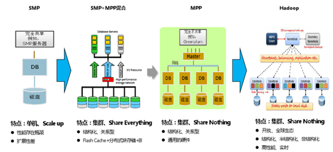

图 2 大数据处理技术演进

备注：
* SMP~对称多处理（Symmetrical Multi-Processing）技术，是指在一个计算机上汇集了一组处理器(多CPU),各CPU之间共享内存子系统以及总线结构。
* MPP~大规模并行处理(Massively Parallel Processor )。
* Share Everything~什么都共享，如内存、CPU。
* Share Nothing~都不共享。

 

### 1.1.3 大数据架构演进
* Lambda -该架构是经典的大数据处理范式，是由南森马兹（Nathan Marz）提出的一个实时大数据处理框架。更多有关Lamda的信息，请读者访问Lambda官方网站。（注：文献【3】是由James Kinley在轻博客网站Tumblr发表的一篇博文：Lambda 架构：构架实时大数据系统的原则）。
* Kappa-该计算构架可视为Lambda的一个强有力替代者，Kappa将数据处理的上游移至流式层（注：文献【4】是一篇博客文章，作者是Jay Kreps是Linkedln的一名在线数据架构技术高管。Kreps认为，虽然Lambda构架的理念很有价值，但终究还是一个临时解决方案。他设计了一个替代架构Kappa，是基于他在Linkedin构建Kafka和Samza的经验设计而成）。
* SummingBird-这是一个参考模型，用来桥接在线处理模式和传统处理模式。Summingbird是由Twitter（推特）公司用Scala语言开发的、并开源的大规模数据处理框架，支持开发者以批处理模式（基于Hadoop）或流处理模式（基于Storm），或混合模式（即前两种模式的组合）以统一的方式执行代码。（注：文献【5】是Summingbird的主要设计者Oscar Boykin、Sam Ritchie等人于2014年发表于知名期刊PVLDB中论文，其中论文的二作Sam Ritchie大有来头，他是计算机科学界的传奇人物、C语言和Unix的设计者Dennis Ritchie的侄子）。

 

 

表格 1 大数据架构比较

|        | 简介                                                         | 优点                               | 缺点                                                         |
| ------ | ------------------------------------------------------------ | ---------------------------------- | ------------------------------------------------------------ |
| Lambda | 实时和批处理采用不同的计算框架。                             | 稳定，把实时和离线计算的峰值分离。 | 两套计算框架会发生计算结果不一致的数据口径问题。LOT时代批处理无法在计算窗口完成。 |
| Kappy  | LinkedIn的Jay Krep提出Kappa架构。其核心思想是通过改进流计算系统来解决数据全量处理的问题，使得实时计算和批处理过程使用同一套代码。 | 解决了Lamba的数据口径问题。        | 流式处理无法应对高吞吐量。开发周期长。服务器成本浪费。       |
| IOTA   | 来自于CSDN博客~产业智能官，尚未有业界案例。                  | 去ETL。AD-hoc。边缘计算。          |                                                              |

 

 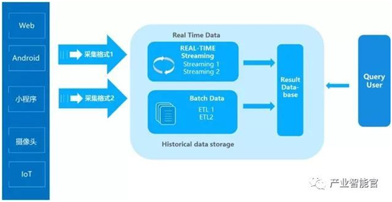

图 3 Lambda架构

备注：Lambda数据架构成为每一个公司大数据平台必备的架构，它解决了一个公司大数据批量离线处理和实时数据处理的需求。
* 优点是稳定，对于实时计算部分的计算成本可控，批量处理可以用晚上的时间来整体批量计算，这样把实时计算和离线计算高峰分开，这种架构支撑了数据行业的早期发展。
* 缺点：实时与批量计算结果不一致引起的数据口径问题。批量计算在计算窗口内无法完成。数据源变化都要重新开发，开发周期长。服务器存储大。

 

 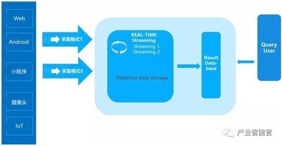

图 4 大数据Kappy架构

 

 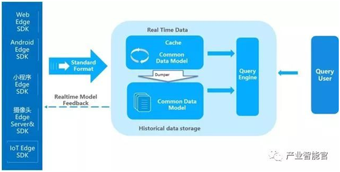

图 5 大数据IOTA架构

IOTA整体技术结构分为几部分：
* Common Data Model：贯穿整体业务始终的数据模型，这个模型是整个业务的核心，要保持SDK、cache、历史数据、查询引擎保持一致。
* **Edge SDKs & Edge Servers**：这是数据的采集端，在复杂的计算情况下，会赋予SDK更复杂的计算，在设备端就转化为形成统一的数据模型来进行传送。

 

## 1.2  大数据架构

### 1.2.1 大数据参考架构一（工信部）

来自于 工信部《大数据标准化白皮书（2014）》

 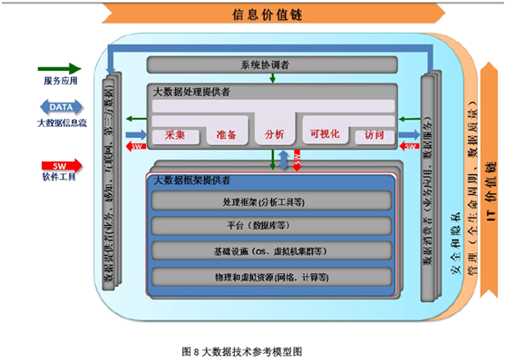

大数据技术参考模型表示了通用的、技术无关的大数据系统的逻辑功能模块以及模块之间的互操作接口（如：服务）。

大数据技术参考模型基于代表大数据价值链的两个维度组成：信息流（垂直维）和IT 集成（水平维）。在信息流维度上，价值通过数据采集、集成、分析、使用结果来实现。在IT 维度上，价值通过为大数据应用的实施提供拥有或运行大数据的网络、基础设施、平台、应用工具以及其他IT 服务来实现。大数据应用提供者模块是在两个维的交叉点上，表明大数据分析和其实施是为两个价值链上大数据利益相关者提供的特定价值。

 

五个主要的架构模块代表在每个大数据系统中存在的不同技术角色：数据提供者、数据消费者、大数据处理提供者、大数据框架提供者、系统协调者。另外两个架构模块是安全隐私和管理，代表能为大数据系统其他模块提供服务和功能的构件。这两个关键功能极其重要，因此也被集成在任何大数据解决方案中。

在数据提供者模块中，提供者应该包含业务、感知、互联网和第三方数据四个种类。
* 业务数据提供者提供传统信息系统中存在并动态产生的大量的结构化数据和异构数据
* 感知数据提供者提供由物联感知设备实时生成的大量数据；
* 互联网数据提供者提供由互联网应用快速生成的大量的非结构化数据；
* 第三方数据提供者则是提供政府、学术界、商业机构逐步对外开放了一些可维护管理、可信的数据集。

在数据提供者模块中，提供者应该包含业务、感知、互联网和第三方数据四个种类。其中业务数据提供者提供传统信息系统中存在并动态产生的大量的结构化数据和异构数据；感知数据提供者提供由物联感知设备实时生成的大量数据；互联网数据提供者提供由互联网应用快速生成的大量的非结构化数据；而第三方数据提供者则是提供政府、学术界、商业机构逐步对外开放了一些可维护管理、可信的数据集。

 

对于数据消费者模块，我们将其分解为业务应用和数据服务平台。

 

### 1.2.2  大数据参考架构二

 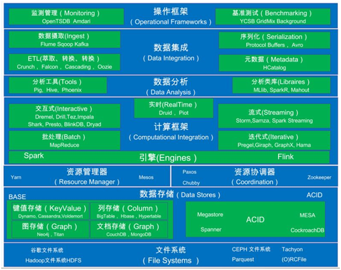

图 6 大数据处理的关键架构图

说明：
* 文件系统层：在这一层里，分布式文件系统需具备存储管理、容错处理、高可扩展性、高可靠性和高可用性等特性。
* 数据存储层：由于目前采集到的数据，十之有七八为非结构化和半结构化数据，数据的表现形式各异，有文本的、图像的、音频的、视频的等，因此常见的数据存储也要对应有多种形式，有基于键值（Key-Value）的，有基于文档（Document），还有基于列（Column）和图表（Graph）的。如果采用单一的数据库引擎，“一刀切式”的满足所有类型的数据存储需求，通常会严重降低数据库管理的性能。因此，我们需要“兵来将挡，水来土掩”式的、多元的（[Polyglot](http://bigbe.su/lectures/2014/15.3.pdf)）【1】数据库解决方案（这就好比，如果“兵来了”和“水来了”，都要“将”去挡，遇到“兵”时，“将”可以“酣畅淋漓”，而遇到“水”时，还用“将”去挡，那这个“将”估计就要“舍生取义”了。文献【1】是一本有关NoSQL数据处理的图书）
* 资源管理层：这一层是为了提高资源的高利用率和吞吐量，以到达高效的资源管理与调度目的。
* 资源协调层： 在本层的系统，需要完成对资源的状态、分布式协调、一致性和资源锁实施管理。
* 计算框架层：在本层的计算框架非常庞杂，有很多高度专用的框架包含其内，有流式的，交互式的，实时的，批处理和迭代图的（Batch and Iterative Graph，BSP）等。为这些计算框架提供支撑的是运行时引擎，如[BDAS](http://datasys.cs.iit.edu/events/CCGrid2014/CCGrid-May25-Stoica.pdf)【2】(Spark) 和 Flink等（注：这里的BDAS是指“Berkeley Data Analytics Stack”，即伯克利数据分析栈。文献【2】为Spark核心作者Ion Stoica的讲座幻灯片文档）。
* 数据分析层：在这一层里，主要包括数据分析(消费)工具和一些数据处理函数库。这些工具和函数库，可提供描述性的、预测性的或统计性的数据分析功能及机器学习模块。
* 数据集成层：在这一层里，不仅包括管理数据分析工作流中用到的各种适用工具，除此之外，还包括对元数据（Metadata）管理的工具。
* 操作框架层：这一层提供可扩展的性能监测管理和基准测试框架。

 

### 1.2.3 BDAS

*BDAS, the Berkeley Data Analytics Stack*（伯克利的数据分析栈）, is an open source software stack that integrates software components being built by the AMPLab to make sense of Big Data.

 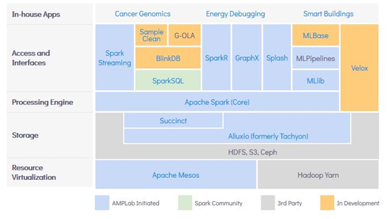

图 7 BDAS数据分析栈

 

## 本章参考

[1].   百度脑图 http://naotu.baidu.com

[2].   DIKW：数据、信息、知识、智慧的金字塔层次体系 blog.sina.com.cn/s/blog_8901cf6e0102yiav.html

[3].   BDAS https://amplab.cs.berkeley.edu/software/


# 2  大数据工具

大数据是一个含义广泛的术语，是指数据集，如此庞大而复杂的，他们需要专门设计的硬件和软件工具进行处理。该数据集通常是万亿或EB的大小。这些数据集收集自各种各样的来源：传感器，气候信息，公开的信息，如杂志，报纸，文章。大数据产生的其他例子包括购买交易记录，网络日志，病历，军事监控，视频和图像档案，及大型电子商务。

在大数据和大数据分析，他们对企业的影响有一个兴趣高涨。大数据分析是研究大量的数据的过程中寻找模式，相关性和其他有用的信息，可以帮助企业更好地适应变化，并做出更明智的决策。

 

**Hadoop系列：**Hadoop HDFS、Hadoop MapReduce, HBase、Hive等构成Hadoop生态圈。
* Hadoop MapReduce不适合实时计算：任务分配Server不会将信息Push到计算Node，而是让计算Node通过心跳去Pull任务。基于框架的通用性，MapReduce代码也会在HDFS中传送，在各计算Node展开，再通过启动新JVM进程装载并运行。类似的JVM进程启停有5、6次之多。Reduce Task只能在所有Map Task完成之后才能启动。
* Hypertable是另类。它存在于Hadoop生态圈之外，但也曾经有一些用户。

 

表格 2 大数据工具列表（按主题分类）

| 主题               | 主流工具                                                     |
| ------------------ | ------------------------------------------------------------ |
| **Hadoop系列** | Hadoop  HDFS、Hadoop MapReduce, HBase、Hive                  |
| 数据仓库           | Teradata AsterData, EMC GreenPlum, HP  Vertica等。           |
| **数据集市**       | QlikView、Tableau、国内永洪科技Yonghong Data Mart等。        |
| **前端展现**       | 开源：JasperSoft，Pentaho, Spagobi, Openi, Birt等。  商用： Cognos, BO,  Microsoft, Oracle,Microstrategy,QlikView、 Tableau、国内永洪科技 Yonghong Z-Suite等。 |

 

表格 3 大数据开源工具列表

| 工具名                                       | 简介                                                         | 备注 |
| -------------------------------------------- | ------------------------------------------------------------ | ---- |
| [Weka](http://www.cs.waikato.ac.nz/ml/weka/) | Machine  Learning Projec. An exciting and potentially far-reaching development in  computer science is the invention and application of methods of machine  learning.  <br>[RapidMiner](http://rapid-i.com/content/view/64/74/lang,en/)实现了Weka的所有算法，兼容Weka的数据格式。 | 开源 |
| [Bow](http://www.cs.cmu.edu/~mccallum/bow/)  | 专门为文本处理设计的开源包。Bow包括三个部分：Rainbow（文本分类）、Arrow（文本检索）和Crossbow（文本聚类）。 | 开源 |
| [Orange](http://www.ailab.si/)               | C++和Python语言编写的开放源代码数据挖掘软件                  | 开源 |
| SVM                                          |                                                              |      |
| pandas                                       |                                                              | 开源 |

 

## 2.1   Hadoop系列

详见 《[Hadoop体系](Hadoop体系.md)》

 

## 2.2   计算引擎

详见 《[大数据计算框架](大数据计算框架.md)》

 

## 2.4   日志处理和分析

海量日志处理有两个流派，
* Schema on Read：读时分析，如Splunk，特性是日志解析更灵活，海量时速度可能是分钟级。
* Schema on Write：写时分析，如ELK，特性是速度快~秒级。

备注：Splunk和ELK的比较 详见 3.7 见下方

### 2.4.1 Splunk

Splunk 是机器数据的引擎。使用 Splunk 可收集、索引和利用所有应用程序、服务器和设备生成的快速移动型计算机数据 。 使用 Splunking 处理计算机数据，可让您在几分钟内解决问题和调查安全事件。监视您的端对端基础结构，避免服务性能降低或中断。以较低成本满足合规性要求。关联并分析跨越多个系统的复杂事件。获取新层次的运营可见性以及 IT 和业务智能。

Splunk于2012年在Nasdaq上市，是第一家上市的大数据公司。

Splunk是一个托管的日志文件管理工具，它的主要功能包括：
* 日志聚合功能
* 搜索功能
* 提取意义
* 对结果进行分组，联合，拆分和格式化
* 可视化功能
* 电子邮件提醒功能

 

| Name                                                         | Splunk                                                       |
| ------------------------------------------------------------ | ------------------------------------------------------------ |
| Description                                                  | Analytics Platform for Big Data                              |
| Primary database model                                       | [Search engine](https://db-engines.com/en/article/Search+Engines) |
| [DB-Engines Ranking](https://db-engines.com/en/ranking) <br>[Trend Chart](https://db-engines.com/en/ranking_trend/system/Splunk) | Score    65.67  Rank     #13    Overall  #2    Search engines |
| Website                                                      | [www.splunk.com](https://www.splunk.com/)                    |
| Technical documentation                                      | [docs.splunk.com/­Documentation/­Splunk](http://docs.splunk.com/Documentation/Splunk) |
| Developer                                                    | Splunk Inc.                                                  |
| Initial release                                              | 2003                                                         |
| License                                                      | commercial                                                   |
| Cloud-based                                                  | no                                                           |
| Server operating systems                                     | Linux   OS X   Solaris   Windows                             |
| Data scheme                                                  | yes                                                          |
| Typing                                                       | yes                                                          |
| XML support                                                  | yes                                                          |
| Secondary indexes                                            | yes                                                          |
| SQL                                                          | no                                                           |
| APIs and other access methods                                | HTTP REST                                                    |
| Supported programming languages                              | C#   Java   JavaScript   PHP   Python   Ruby                 |
| Server-side scripts                                          | yes                                                          |
| Triggers                                                     | yes                                                          |
| Partitioning methods                                         | Sharding                                                     |
| Replication methods                                          | Master-master replication                                    |
| MapReduce                                                    | yes                                                          |
| Consistency concepts                                         | Eventual Consistency                                         |
| Foreign keys                                                 | no                                                           |
| Transaction concepts                                         | no                                                           |
| Concurrency                                                  | yes                                                          |
| Durability                                                   | yes                                                          |
| In-memory capabilities                                       | no                                                           |
| User concepts                                                | Access rights for users and roles                            |

 

### 2.4.2 ELK

ELK = Elasitcsearch + Logstash + Kibana

ELK是ELK是Elasticsearch、Logstash、Kibana的简称，它们都是Elastc公司的开源软件，目前开源界最流行的实时数据分析解决方案，成为实时日志处理领域开源界的第一选择。
* Elasticsearch是个开源分布式搜索引擎，提供搜集、分析、存储数据三大功能。它的特点有：分布式，零配置，自动发现，索引自动分片，索引副本机制，restful风格接口，多数据源，自动搜索负载等。
* Logstash 主要是用来日志的搜集、分析、过滤日志的工具，支持大量的数据获取方式。一般工作方式为c/s架构，client端安装在需要收集日志的主机上，server端负责将收到的各节点日志进行过滤、修改等操作在一并发往elasticsearch上去。
* Kibana 也是一个开源和免费的工具，Kibana可以为 Logstash 和 ElasticSearch 提供的日志分析友好的 Web 界面，可以帮助汇总、分析和搜索重要数据日志。

 

Filebeat隶属于Beats。它是一个轻量级的日志收集处理工具(Agent)，Filebeat占用资源少，适合于在各个服务器上搜集日志后传输给Logstash，官方也推荐此工具。目前Beats包含四种工具：
* Packetbeat（搜集网络流量数据）
* Topbeat（搜集系统、进程和文件系统级别的 CPU 和内存使用情况等数据）
* Filebeat（搜集文件数据）
* Winlogbeat（搜集 Windows 事件日志数据）

#### 2.4.2.1 ELK 架构

ELK这三者是核心套件，但并非全部。后文的四种基本架构中将逐一介绍应用到的其它套件。

 

第一种ELK架构，这是最简单的一种ELK架构方式。此架构首先由Logstash分布于各个节点上搜集相关日志、数据，并经过分析、过滤后发送给远端服务器上的Elasticsearch进行存储。Elasticsearch将数据以分片的形式压缩存储并提供多种API供用户查询，操作。用户亦可以更直观的通过配置Kibana Web Portal方便的对日志查询，并根据数据生成报表（详细过程和配置在此省略）。

 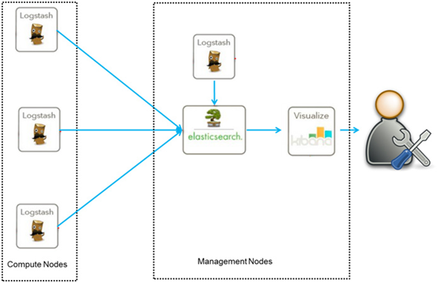

图 13 ELK架构一

说明：ELK架构一优点是搭建简单，易于上手。缺点是Logstash耗资源较大，运行占用CPU和内存高。另外没有消息队列缓存，存在数据丢失隐患。建议供学习者和小规模集群使用。

 

第二种架构（图2）引入了消息队列机制，位于各个节点上的Logstash Agent先将数据/日志传递给Kafka（或者Redis），并将队列中消息或数据间接传递给Logstash，Logstash过滤、分析后将数据传递给Elasticsearch存储。最后由Kibana将日志和数据呈现给用户。因为引入了Kafka（或者Redis）,所以即使远端Logstash server因故障停止运行，数据将会先被存储下来，从而避免数据丢失。

 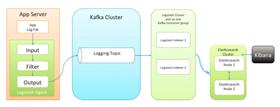

图 14 ELK架构二

说明：这种架构适合于较大集群的解决方案，但由于Logstash中心节点和Elasticsearch的负荷会比较重，可将他们配置为集群模式，以分担负荷，这种架构的优点在于引入了消息队列机制，均衡了网络传输，从而降低了网络闭塞尤其是丢失数据的可能性，但依然存在Logstash占用系统资源过多的问题。

 

第三种架构（下图）引入了Logstash-forwarder。首先，Logstash-forwarder将日志数据搜集并统一发送给主节点上的Logstash，Logstash分析、过滤日志数据后发送至Elasticsearch存储，并由Kibana最终将数据呈现给用户。

 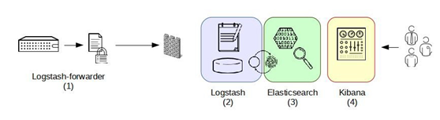

图 15 ELK架构三

说明：这种架构解决了Logstash在各计算机点上占用系统资源较高的问题。经测试得出，相比Logstash，Logstash-forwarder所占用系统CPU和MEM几乎可以忽略不计。另外，Logstash-forwarder和Logstash间的通信是通过SSL加密传输，起到了安全保障。如果是较大集群，用户亦可以如结构三那样配置logstash集群和Elasticsearch集群，引入High Available机制，提高数据传输和存储安全。更主要的配置多个Elasticsearch服务，有助于搜索和数据存储效率。但在此种架构下发现Logstash-forwarder和Logstash间通信必须由SSL加密传输，这样便有了一定的限制性。

 

第四种架构（下图），将Logstash-forwarder替换为Beats。经测试，Beats满负荷状态所耗系统资源和Logstash-forwarder相当，但其扩展性和灵活性有很大提高。Beats platform目前包含有Packagebeat、Topbeat和Filebeat三个产品，均为Apache 2.0 License。同时用户可根据需要进行二次开发。

 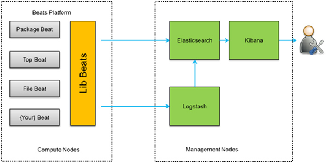

图 16 ELK架构四

说明：这种架构原理基于第三种架构，但是更灵活，扩展性更强。同时可配置Logstash 和Elasticsearch 集群用于支持大集群系统的运维日志数据监控和查询。

 

#### 2.4.2.2 Elasitcsearch 

详见 《[lucene_analyse](lucene_analyse.md)》


#### 2.4.2.3 Logstash

**实现模式**：PIPE-FILTER模式，多线程的线程池（INPUT和FILTER缺省各20个）。

表格 6 logstash的主要组件

|        | input                               | filters                                                | output                                       |
| ------ | ----------------------------------- | ------------------------------------------------------ | -------------------------------------------- |
| 简介   | **输入数据到logstash**          | **数据中间处理，对数据进行操作。**                     | 输出数据。                                   |
| 数据源 | stdin、file、syslog、  redis、beats | **grok/mutate/drop/clone/geoip**  **/json/date/split** | stdout、elasticsearch、email、file、nagios、 |

备注：编解码包括：json、多行事件、网络流。

Logstash工作原理

Logstash事件处理有三个阶段：inputs → filters → outputs。是一个接收，处理，转发日志的工具。支持系统日志，webserver日志，错误日志，应用日志，总之包括所有可以抛出来的日志类型。

 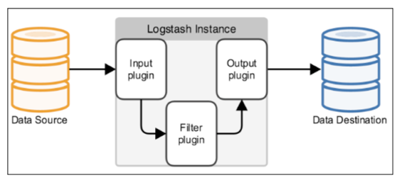

图 17 Logstash事件处理流程

说明：

**Input**：输入数据到logstash。常用输入有file、syslog、redis、beats等等。

**Filters**：数据中间处理，对数据进行操作。常用的过滤有：grok/mutate/drop/clone/geoip

**Outputs**：outputs是logstash处理管道的最末端组件。一个event可以在处理过程中经过多重输出，但是一旦所有的outputs都执行结束，这个event也就完成生命周期。一些常见的outputs为：

* elasticsearch：可以高效的保存数据，并且能够方便和简单的进行查询。
* file：将event数据保存到文件中。
* graphite：将event数据发送到图形化组件中，一个很流行的开源存储图形化展示的组件。

**Codecs**：codecs 是基于数据流的过滤器，它可以作为input，output的一部分配置。Codecs可以帮助你轻松的分割发送过来已经被序列化的数据。一些常见的codecs：
* json：使用json格式对数据进行编码/解码。
* multiline：将汇多个事件中数据汇总为一个单一的行。比如：java异常信息和堆栈信息。

 

示例1：从终端获取输入，并输出到终端
```SH
./bin/logstash -e 'input{stdin{}}output{stdout{codec=>rubydebug}}'
hello world
{
  "@timestamp" => 2018-06-23T07:57:40.252Z,
   "@version" => "1",
    "host" => "Lenovo-PC",
    "message" => "hello world"
}
```


示例2：输入是MySQL，输出是ES

https://www.elastic.co/guide/en/logstash/5.3/plugins-inputs-jdbc.html#plugins-inputs-jdbc-jdbc_driver_library
```sh
input {
 jdbc {
  jdbc_driver_library => "mysql-connector-java-5.1.36-bin.jar"
  jdbc_driver_class => "com.mysql.jdbc.Driver"
  jdbc_connection_string => "jdbc:mysql://localhost:3306/mydb"
  jdbc_user => "mysql"
  parameters => { "favorite_artist" => "Beethoven" }
  schedule => "* * * * *"
  statement => "SELECT * from songs where artist = :favorite_artist"
 }
}
```


#### 2.4.2.4 Kibana

|          | kibana 3                                                     | kibana 4                                           |
| -------- | ------------------------------------------------------------ | -------------------------------------------------- |
| 简介     | 源自于elasticsearch dashborad。纯静态文件。围绕看板的单面应用。 | 仿splunk界面。功能拆分成搜索页、可视化和仪表盘等。 |
| 实现语言 |                                                              | jruby                                              |
|          |                                                              | 最新版本kibana-6.3.0-windows-x86_64                |

备注：

 

#### 2.4.2.5 ELK入门实例：Hello World

到官网下载并解压 Elasticsearch、logstash、Kibana

**1）Elasticsearch安装配置**

**安装步骤**
* Download and unzip Elasticsearch
* Run bin/elasticsearch (or bin\elasticsearch.bat on Windows)
* Run curl http://localhost:9200/ or Invoke-RestMethod http://localhost:9200 with PowerShell
* Dive into the [getting started guide](https://www.elastic.co/guide/en/elasticsearch/reference/current/getting-started.html) and [video](https://www.elastic.co/webinars/getting-started-elasticsearch). 

**2）logstash安装配置**

**示例**：从终端获取输入，并输出到elasticserch

```sh
# logstash_es.conf
input { 
  stdin { }
}
output {
  stdout {
    codec => rubydebug{}
    }
  elasticsearch {
    # embedded => true
    hosts => "localhost:9200"
    index => "test-1" # 索引名称
    document_type => "form" # type名称
    document_id => "%{id}" #id必须是待查询的数据表的序列字段
  }
}
```
$ ./bin/logstash -f logstash_es.conf

 

**3）Kibana安装配置**
* Download and unzip Kibana 
* Open config/kibana.yml in an editor，Set elasticsearch.url to point at your Elasticsearch instance
* Run bin/kibana (or bin\kibana.bat on Windows)
* Point your browser at http://localhost:5601 

 

**4）检测ELK效果**

**交互方式: REST**

[**http://localhost:9200/**](http://localhost:9200/) 

\# 查看模板、插件

curl -XGET "http://localhost:9200/_template" 

[**http://localhost:9200/_template**](http://localhost:9200/_template) 

[**http://localhost:9200/_plugin/head/**](http://localhost:9200/_plugin/head/) 

 

\# 查看 ES搜索结果

$ curl http://localhost:9200/_search?q=hello

```
 % Total  % Received % Xferd Average Speed  Time  Time   Time Current
                 Dload Upload  Total  Spent  Left Speed
100  137 100  137  0   0  100   0 0:00:01 0:00:01 --:--:--  101{"took":1349,"timed_out":false,"_shards":{"total":5,"successful":5,"skipped":0,"failed":0},"hits":{"total":0,"max_score":null,"hits":[]}}
```


#### 2.4.2.6 ELK实例：大数据运维

在海量日志系统的运维中，以下几个方面是必不可少的：
* 分布式日志数据集中式查询和管理
* 系统监控，包含系统硬件和应用各个组件的监控
* 故障排查
* 安全信息和事件管理
* 报表功能

 

ELK组件各个功能模块如图5所示，它运行于分布式系统之上，通过搜集、过滤、传输、储存，对海量系统和组件日志进行集中管理和准实时搜索、分析，使用搜索、监控、事件消息和报表等简单易用的功能，帮助运维人员进行线上业务的准实时监控、业务异常时及时定位原因、排除故障、程序研发时跟踪分析Bug、业务趋势分析、安全与合规审计，深度挖掘日志的大数据价值。同时Elasticsearch提供多种API（REST JAVA PYTHON等API）供用户扩展开发，以满足其不同需求。

 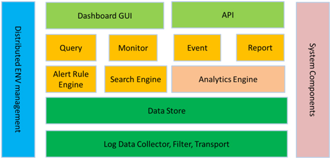

图 18 ELK在运维系统组件中应用图示

汇总ELK组件在大数据运维系统中，主要可解决的问题如下：
* 日志查询，问题排查，上线检查
* 服务器监控，应用监控，错误报警，Bug管理
* 性能分析，用户行为分析，安全漏洞分析，时间管理

综上，ELK组件在大数据运维中的应用是一套必不可少的且方便、易用的开源解决方案。

 

#### 2.4.2.7 注意事项

**安装常见问题**

 a、elasticsearch和kibana版本要对应，否则服务起不来。

 b、如果浏览器中访问http://localhost:9200/没有返回预期的结果，就需要修改Elasticsearch的配置，使其支持外网访问。首先，按Ctrl +C停止Elasticsearch，然后，打开Elasticsearch的配置文件vimconfig/elasticsearch.yml，找到network.host这一行。

 

**1）修改max file descriptors**

$ sudo vi /etc/security/limits.conf

\# 增加两行，将打开文件数从缺省的4096改为65536

```
*   soft  nofile      65536
*   hard  nofile      65536
```


**2）修改max virtual memory areas vm.max_map_count [65530]**

$ sudo sysctl -w vm.max_map_count=655360

 

**3）修改JVM内存**

\# 从64KB改为1GB

\# 老版本修改config/jvm.options

-Xms512m

-Xmx512m

\# 修改 bin/elasticsearch.in.sh

ES_MIN_MEM=1g

ES_MAX_MEM=1g

 

 

### 2.4.3 本节参考

**官方资源**

**Filebeat：**
* https://www.elastic.co/cn/products/beats/filebeat
* https://www.elastic.co/guide/en/beats/filebeat/5.6/index.html

**Logstash：**
* https://www.elastic.co/cn/products/logstash
* https://www.elastic.co/guide/en/logstash/5.6/index.html

**Kibana:**
* https://www.elastic.co/cn/products/kibana
* https://www.elastic.co/guide/en/kibana/5.5/index.html

**Elasticsearch**
* https://www.elastic.co/cn/products/elasticsearch
* https://www.elastic.co/guide/en/elasticsearch/reference/5.6/index.html
* elasticsearch中文社区：https://elasticsearch.cn/

 

Hadoop-ES

https://www.elastic.co/guide/en/elasticsearch/hadoop/current/float.html

 

**参考链接**

[1].   ELK多种架构及优劣 https://blog.csdn.net/wenlixing110/article/details/56277603

[2].   splunk https://baike.baidu.com/item/splunk

 

## 2.5   集群管理

大数据集群管理方式分为手工方式（Apache hadoop）和工具方式（Ambari + hdp 和Cloudera Manger + CDH）。

 

集群管理工具是一种软件程序，可帮助你通过图形用户界面或通过访问命令行，管理一组集群。有了这种工具，你可以监控集群中的节点，配置服务，以及管理整个集群服务器。集群管理形式不一，既有参与度很低的活动，比如将作业发送到集群，也有参与度很高的活动，比如负载均衡和可服务性。

### 2.5.1 Apache Mesos

Apache Mesos是一个通用的集群管理器，起源于 Google 的数据中心资源管理系统Borg。

Mesos诞生于UC Berkeley的一个研究项目，现已成为Apache Incubator中的项目，当前有一些公司使用Mesos管理集群资源，比如Twitter。

Apache Mesos为了简化设计，也是采用了master/slave结构，为了解决master单点故障，将master做得尽可能地轻量级，其上面所有的元数据可以通过各个slave重新注册而进行重构，故很容易通过zookeeper解决该单点故障问题。

 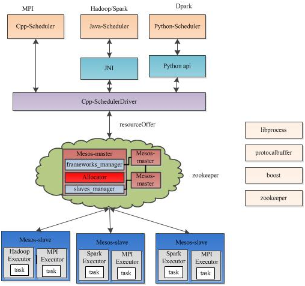

Apache Mesos由四个组件组成，分别是Mesos-master，mesos-slave，framework和executor。
* Mesos-master：Mesos master，主要负责管理各个framework和slave，并将slave上的资源分配给各个framework
* Mesos-slave：Mesos slave，负责管理本节点上的各个mesos-task，比如：为各个executor分配资源
* Framework：计算框架，如：Hadoop，Spark等，通过MesosSchedulerDiver接入Mesos
* Executor：执行器，安装到mesos-slave上，用于启动计算框架中的task。

当用户试图添加一种新的计算框架到Mesos中时，需要实现一个Framework scheduler和executor以接入Mesos。

### 2.5.2 Apache YARN

详见 《[Hadoop体系](Hadoop体系.md)》YARN章节。


### 2.5.3 Apache [ZooKeeper](https://zookeeper.apache.org/)

详见 《[Hadoop体系](Hadoop体系.md)》Zookeeper章节。


### 2.5.4 本节参考

[1].   Apache Mesos总体架构 http://dongxicheng.org/apache-mesos/meso-architecture/

 

## 2.6   数据转换工具

全链路跟踪：SPM法~A.B.C.D.E分别对应于站点.页面ID.页面模块.索引.UUID

### 2.6.1 Sqoop

#### 2.6.1.1 sqoop简介与架构

Sqoop：SQL–to–Hadoop 

正如Sqoop的名字所示：Sqoop是一个用来将关系型数据库和Hadoop中的数据进行相互转移的工具，可以将一个关系型数据库(例如mysql、Oracle)中的数据导入到Hadoop.

表格 7 Sqoop1与Sqoop2比较

| 比较 | Sqoop1                                                       | Sqoop2                                                       |
| ---- | ------------------------------------------------------------ | ------------------------------------------------------------ |
| 架构 | 仅仅使用一个Sqoop客户端                                      | 引入了Sqoop server集中化管理connector，以及rest api，web，UI，并引入权限安全机制 |
| 部署 | 部署简单，安装需要root权限，connector必须符合 JDBC模型       | 架构稍复杂，配置部署更繁琐                                   |
| 使用 | 命令行方式容易出错，格式紧耦合，无法支持所有数据 类型，安全机制不够完善，例如密码暴漏 | 多种交互方式，命令行，web UI，rest API，conncetor集中化管理，所有的链接安装在Sqoop s erver上，完善权限管理机制，connector规范化，仅仅负责数据的读写 |

备注：sqoop1和sqoop2并不兼容。

 

 

图 19 Sqoop1架构

说明：sqoop1架构主要由三个部分组成：Sqoop client、HDFS/HBase/Hive、Database。用户向 Sqoop 发起一个命令之后，这个命令会转换为一个基于 Map Task 的 MapReduce 作业。Map Task 会访问数据库的元数据信息，通过并行的 Map Task 将数据库的数据读取出来，然后导入Hadoop中。 当然也可以将Hadoop中的数据，导入传统的关系型数据库中。它的核心思想就是通过基于Map Task（只有 map）的MapReduce 作业，实现数据的并发拷贝和传输，这样可以大大提高效率。

 

#### 2.6.1.2 sqoop使用要点

```sh
# sqoop import导入示例：
sqoop import \ --connect jdbc:mysql://db.dajiangtai.net:3306/djtdb_hadoop \
--username sqoop \
--password sqoop \
--table user \        # 要读取的数据库表
--target-dir /junior/sqoop/ \     #可选，不指定目录，数据默认导入到/user下
--where "sex='female'" \     #可选，过滤从数据库中要导入的数据。
--as-sequencefile \          #可选，不指定格式，数据格式默认为 Text 文本格式
--num-mappers 10 \      	#可选，指定 Map 任务的并发度。这个数值不宜太大
--null-string '\\N' \       #可选 
--null-non-string '\\N'    #可选 
```


表格 8 sqoop**常用参数**

| ` `                                       | `参数`                                                       | 含义                                                     |
| ----------------------------------------- | ------------------------------------------------------------ | -------------------------------------------------------- |
| 增量导入 import                           | `--incremental [append | lastmodified]`                      | 代表只导入增量数据                                       |
| --check-column [column]                   | 检查的字段作为判断条件，字段不能是字符串类型，一般为时间或数值类型 |                                                          |
| --last-value [value]                      | 如果是时间：则为此日期之后的才导入；如果是数值，则大于此值的才导入。 |                                                          |
| sqoop import                              | --compress                                                   | 对导入数据压缩，默认压缩算法是gzip                       |
| ` `                                       | -m, --num-mappers                                            | `指定 Map 任务的并发度`                                  |
|                                           | --split-by                                                   | 分隔字段，可用于并行查找（与-m配合使用），一般用于主键。 |
|                                           | --target-dir                                                 | 指定数据目录，一般配合分区字段使用                       |
| 覆盖导入                                  | --delete-target-dir                                          | 导入前先删除目录目录                                     |
| 导出 export                               | --Dsqoop.export.records.per.statement=10                     | 指定每次导入10条数据                                     |
| ` `                                       | --batch                                                      | 指定是批量导入                                           |
| --update-key id                           | 更新已有数据                                                 |                                                          |
| --update-key id --update-mode allowinsert | 数据存在更新；不存在插入                                     |                                                          |

备注：1. 导入时--delete-target-dir和-- incremental参数不能并用。

2. 导入分区表，需要创建有分区的表，分区 有按日期、范围、列表等。示例如下

```sql
CREATE TABLE `YDDT` (
 `ID` string,
 `YDJC_ID` string,
 `YDDT_DATA_TYPE` string,
 `YDDT_BUSSINESS_NOW` bigint,

 `YDDT_USER_NOW` bigint,
 `YDDT_COLLECT_TIME` string,
 `YDDT_CREATOR` string,
 `YDDT_DATE` string,
 `BACK` string
) PARTITIONED BY (day int) row format delimited fields terminated by '\t';
```

导入表

```shell
sqoop import --connect jdbc:mysql://172.20.13.50:3306/TestBigDate --username root --password 123456 --table YDDT_2017_06_01 -m 3 --target-dir /user/hive/warehouse/dxyjpt.db/yddt/day=20170601 --fields-terminated-by '\t'
```


```sql
# 标记表的分区信息
alter table yddt add partition(day='20170601') location '/user/hive/warehouse/dxyjpt.db/yddt/day=20170601'

# 删除分区数据
ALTER TABLE yddt DROP IF EXISTS PARTITION(day='20170604')
```

禁止明文密码：
* -P:sqoop 命令行最后使用 -P，此时提示用户输入密码
* –password-file：指定一个密码保存文件，读取密码。我们可以将这个文件设置为只有自己可读的文件，防止密码泄露。

空字符串处理：–null-string，–null-non-string：同时使用可以将数据库中的空字段转化为’\N’，因为数据库中字段为 null，会占用很大的空间。

### 2.6.2 OGG

 

### 2.6.3 本节参考

[1].   Sqoop架构 https://blog.csdn.net/py_123456/article/details/80761446 

 

## 本章参考

[2].   数睿思 http://www.tipdm.org

[3].   Flume NG：Flume 发展史上的第一次革命https://www.ibm.com/developerworks/cn/data/library/bd-1404flumerevolution/index.html

 

# 3  大数据的技术选型

## 3.1  大数据技术的分析目录（脑图）

数据采集：ETL工具

数据存取：关系数据库，NoSQL，NEWSQL等等。

基础架构支持：云存储，分布式文件系统等等。

计算结果展现：云计算，标签云，关系图等等。

 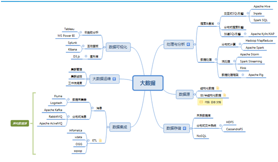

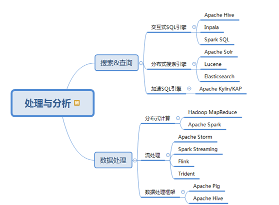


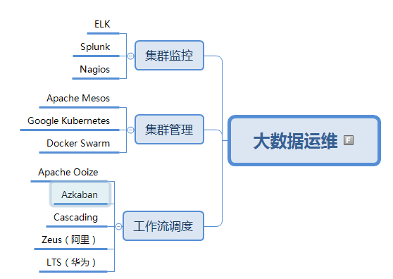


表格 9 大数据不同业务场景下的可选工具表

| 大场景     | 场景描述                                   | 可选工具                                                     | 推荐工具                               |
| ---------- | ------------------------------------------ | ------------------------------------------------------------ | -------------------------------------- |
| 数据存储   |                                            | hdfs/mongodb/hbase                                           |                                        |
| 批处理     | 需要对海量数据快速处理。                   | Spark、Flink、MR                                             | Spark                                  |
| 实时处理   | 需要实时处理数据并准实  时（分钟级）响应。 | Spark streaming、Flink、Storm、Trident                       | Flink                                  |
| 机器学习   |                                            | Spark、[**Mahou**](http://mahout.apache.org/)                | [**Mahou**](http://mahout.apache.org/) |
| SQL查询    |                                            | Spark、kylin、hive、pig、                                    | pig                                    |
| 数据仓库   |                                            | hive、kylin、[Apache Drill](http://wiki.apache.org/incubator/DrillProposal) | kylin                                  |
| 数据可视   | 大屏、卡片、可视化图表                     | Power BI(Microsoft)、tableAU、superset                       |                                        |
| 工作流调度 | 任务多且复杂，前后有依赖关系。             | Apache Ooize、Azkaban、Cascading、Hanmake、Zeus（阿里）、LTS（华为） |                                        |
| 集群管理   |                                            | Apache Mesos、Google Kubernetes、Docker Swarm、              |                                        |
| 运维监控   |                                            | ELK、Splunk、Nagios、supervisor                              |                                        |

备注：1. Apache [**ZooKeeper**](http://zookeeper.apache.org/)是分布式、可用性高的协调服务，可用来监控节点状态。

 

## 3.2  数据采集工具选型

表格 10 数据采集工具简介

| 产品     | 简介                                                         | 特点                                                         |
| -------- | ------------------------------------------------------------ | ------------------------------------------------------------ |
| Flume    | Cloudera提供的一个高可用的，高可靠的，分布式的海量日志采集、聚合和传输的系统。 | 可以将应用产生的数据存储到任何集中存储器中，比如HDFS,HBase。  提供上下文路由特征。  管理是基于事务。  可靠的，容错性高的，可升级的，易管理的,并且可定制的。 |
| Filebeat | Elastic开源的轻量级日志采集器。                              |                                                              |
| Logstash | Elastic开源的重量级日志采集器。                              | 功能强大，但占用资源较多。                                   |
| Scribe   | [Facebook](https://baike.baidu.com/item/Facebook)开源的日志收集系统。 |                                                              |
| Fiddler  | 手机端的数据采集工具。                                       |                                                              |

 

表格 11 数据采集工具比较列表

|              | Flume | Filebeat | Logstash | Scribe |
| ------------ | ----- | -------- | -------- | ------ |
| 语言         | Java  | Go       | Ruby     | C++    |
| 占用系统资源 | 一般  | 少       | 多       | 一般   |
| 扩展性       | √     | √        | √        | 差     |
| 日志过滤     | √     | √        | √        | x      |
| 日志解析     | x     | x        | √        | x      |

 

## 3.3  数据存储平台选型
* 业务存储一般用关系数据库RDB，需要事务处理；
* 消息存储：Kafka
* 离线存储：HDFS
* 分析存储：ClickHouse、Druid
* 应用存储：存储结果集数据，MySQL、Mongodb或Redis

 

表格 12 DB存储平台选型

|          | Oracle       | Hadoop                     | MongoDB       |
| -------- | ------------ | -------------------------- | ------------- |
| 数据类型 | 结构化       | 混合（结构+非结构）        | 非结构        |
| 数据规模 | 30亿 1TB以下 | PB+                        | 10TB+         |
| BI场景   | OLAP         | 海量存储、流处理、迭代计算 | GPS、计算场景 |

 

表格 13 分布式文件系统存储比较

|          | HDFS                     | S3       | 数据仓库             | NewSQL |
| -------- | ------------------------ | -------- | -------------------- | ------ |
| 简介     |                          | 对象存储 |                      |        |
| 优点     | 大数据存储、大文件       | 小文件   | 分层存储，用于OLAP。 |        |
| 缺点     | 数据访问较慢（高延迟）、 |          |                      |        |
| 应用场景 | 流式（一次写多次读）     |          |                      | 众多   |

 

## 3.4  数据计算引擎选型

详见 《[大数据计算框架](大数据计算框架.md)》

 

## 3.5  工作流调度系统比较

一个完整的数据分析系统通常都是由大量任务单元组成：shell脚本程序，java程序，mapreduce程序、hive脚本等。

各任务单元之间存在时间先后及前后依赖关系

为了很好地组织起这样的复杂执行计划，需要一个工作流调度系统来调度执行。

一个 workflow scheduler system需要的主要功能有：
* DAG定义: DAG （Directed acyclic graph） 有向无环图。DAG的定义方式：表达式，脚本定义，通过WEB UI定义；还需要支持子DAG）
* 执行节点 （节点类型：unix cmd, shell, python, mapreduce, logging etc…）
* 节点控制（ignore, retry, suspend, run now, test mode）
* Metrics （需要对比一段时间内任务的运行时间）
* Monitor （失败策略，报警通知功能）
* CLI & Web UI (查询 workflow 执行情况，以及简单的控制)

 

**工作流调度实现方式**
* 简单的任务调度（定时）：直接使用linux的crontab来定义；
* 复杂的任务调度：开发调度平台
* 或使用现成的开源调度系统，比如ooize、azkaban等。

 

表格 17 常用工作流调度系统列表

| 工具         | 简介                                                         | 优点                     | 缺点                                   |
| ------------ | ------------------------------------------------------------ | ------------------------ | -------------------------------------- |
| Apache Ooize | 管理hadoop任务的工作流/协调系统。                            | 与Hadoop生态圈结合紧密。 | 通过XML文件来定义DAG依赖，维护复杂。   |
| Azkaban      | LinkedIn创建的一个批处理工作流，用于跑Hadoop的Jobs。  所有的任务资源文件都需要打成一个zip包上传。 |                          |                                        |
| Cascading    |                                                              |                          |                                        |
| Hanmake      |                                                              |                          |                                        |
| Zeus         | Alibaba开源的一个完整的Hadoop的作业平台，用于从Hadoop任务的调试运行到生产任务的周期调度。 |                          | 针对Hadoop集群任务定制的，通用性不强。 |
| LTS          | 华为参考Ooize自研。                                          |                          |                                        |
| Avro         | 一个序列化数据系统。                                         |                          |                                        |

 

表格 18 Hadoop工作流调度器比较

| 特性                 | Hamake               | Oozie             | Azkaban                          | Cascading |
| -------------------- | -------------------- | ----------------- | -------------------------------- | --------- |
| 工作流  描述语言     | XML                  | XML (xPDL based)  | text file with   key/value pairs | Java API  |
| 依赖机制             | data-driven          | explicit          | explicit                         | explicit  |
| 是否要  web容器      | NO                   | YES               | YES                              | NO        |
| 进度跟踪             | console/log messages | web page          | web page                         | Java API  |
| Hadoop job  调度支持 | no                   | YES               | YES                              | YES       |
| 运行模式             | command line utility | daemon            | daemon                           | API       |
| Pig支持              | yes                  | yes               | yes                              | yes       |
| 事件通知             | no                   | no                | no                               | yes       |
| 需要安装             | no                   | yes               | yes                              | no        |
| 支持的  hadoop版本   | 0.18+                | 0.20+             | currently unknown                | 0.18+     |
| 重试支持             | no                   | workflownode evel | yes                              | yes       |
| 运行任意命令         | yes                  | yes               | yes                              | yes       |
| Amazon EMR支持       | yes                  | no                | currently unknown                | yes       |

 

## 3.6  集群管理工具比较

表格 19 集群管理工具列表

| 工具                                                         | 简介                                                         | 特性                                                         | 备注 |
| ------------------------------------------------------------ | ------------------------------------------------------------ | ------------------------------------------------------------ | ---- |
| [Hadoop YARN](http://spark.apache.org/docs/latest/running-on-yarn.html) | YARN是下一代MapReduce，即MR V2。是Hadoop 2的资源管理器。     | 仅用于Hadoop集群。                                           |      |
| Apache Mesos                                                 | Apache下的开源分布式资源管理框架。Mesos最初是由加州大学伯克利分校的AMPLab开发的，后在Twitter得到广泛使用。 | 专注于跨分布式网络或框架，有效地隔离资源，并共享应用程序。   |      |
| Docker Swarm                                                 | Docker Swarm让你可以把许多Docker引擎集群成一个虚拟引擎。     | 一种原生解决方案。侧重于借助单一Docker引擎，从整个系统了解集群的情况。 |      |
| Google   Kubernetes                                          | Kubernetes由谷歌开发，它让你可以跨许多不同的主机管理容器化应用程序。它为你提供了部署、扩展和维护应用程序的工具。Kubernetes的开发人员专注于确保Kubernetes易于访问、占用资源少和易于使用。 | 标准的容器管理平台，具有调度、实时升级、自动扩展和不断监控运行状况等功能。 | 热门 |
| Fleet                                                        | 使用etcd和systemd，前者是CoreOS随带的键值对，后者是面向Linux的系统和服务管理器。 | 并不是很擅长处理分布式微服务环境下出现的一些情况，比如服务注册、基于资源使用情况的调度、服务发现，或者是容器之间的联系。 |      |
| Facebook   Corona                                            | Hadoop Corona是facebook开源的下一代MapReduce框架。其基本设计动机和Apache的YARN一致 |                                                              |      |

说明：1. Mesos和Kubernetes很相似，原因是它们是为了解决在集群环境下运行应用程序的问题开发的。


## 3.7  运维监控工具比较

表格 20 运维工具列表

| 工具                                    | 简介                                                         | 功能特性                                                     | 缺陷                                             |
| --------------------------------------- | ------------------------------------------------------------ | ------------------------------------------------------------ | ------------------------------------------------ |
| Splunk                                  | Splunk® 的创立是为了追求一种颠覆性的新愿景：使机器数据对每个用户来说更易于访问、便于使用和更具价值。 | 在语句里生成图表。  Splunk属于入库后对内容的即使处理。       | 商业软件昂贵。                                   |
| ELK                                     | ELK是Elasticsearch、Logstash、Kibana的简称，它们都是Elastc公司的开源软件。数据来源众多。可用来监控程序。 | 用户在Kibana Web Portal上鼠标选择的方式来点出来。            | 开源免费。                                       |
| [Nagios](http://www.nagios.org/)        | Nagios Ain’t Goona Insist on Saintood。它是一款免费的开源 IT 基础设施监控系统，监控中心服务器是类UNIX OS。结构上可分为核心和插件两个部分。Nagios  的核心部分只提供了很少的监控功能，插件可下载或自己写。 | 强大的管理中心。功能强大，灵活性强，能有效监控 Windows 、Linux、VMware 和 Unix 主机状态，交换机、路由器等网络设置等。 | 看不到历史数据，很难追查故障原因，而且配置复杂。 |
| [Cacti](http://cacti.net/)              | 基于PHP,MySQL,SNMP及RRDTool开发的网络流量监测图形分析工具。通过snmpget来获取数据，使用 RRDtool绘画图形。 | snmp抓到数据不是存储在MySQL中，而是存在rrdtool生成的rrd文件中。 |                                                  |
| [Zenoss](http://www.zenoss.com/)        | Zenoss允许每个组织选择满足他们需要的最佳组合。               |                                                              |                                                  |
| [Zabbix](http://www.zabbix.com/)        | 基于WEB界面的提供分布式系统监视以及网络监视功能的企业级的开源解决方案。  zabbix由2部分构成，zabbix server与可选组件zabbix agent。 | 能监视各种网络参数，保证服务器系统的安全运营；并提供柔软的通知机制以让系统管理员快速定位/解决存在的各种问题。 |                                                  |
| [Hyperic   HQ](http://www.hyperic.com/) | 基于java的监控软件，由一个中心监控服务器和一个或多个远程代理组成，远程代理用来向服务器报告节点信息。 | 支持多种平台。工业级，功能丰富的产品，提供监测生产环境中软件的各技术栈的可视性，包括开源的，商业的或混合软件。 |                                                  |

备注：1. 市场占用率排名：Nagios最高，接下来依次是OpenNMS、Zenoss、Zabbix、Mon、Hyperic。

 

表格 21 开源监控软件综合比较

|                      | 细项                        | Nagios            | Cacti            | Zabbix                                     | Zenoss               | Hyperic HQ                   |
| -------------------- | --------------------------- | ----------------- | ---------------- | ------------------------------------------ | -------------------- | ---------------------------- |
| License              | License                     | GPL               | GPL              | GPL                                        | GPL                  | GPL                          |
| 使用限制             | 开源版本和Nagios XI企业版本 | 只有开源版本      | 只有开源版本     | 提供开源版和企业版两种版本                 | 开源和商业两个版本   |                              |
| 易用性               | Windows支持                 | N                 | Y                | N                                          | N                    | Y                            |
| 无安装过程源代码编译 | N                           | N                 | N                | Y                                          | Y                    |                              |
| 支持普通用户安装     | N                           | N                 | N                | Y                                          | Y                    |                              |
| 无网络安装           | N                           | Y                 | N                | Y                                          | Y                    |                              |
| 整体安装包           | N                           | N                 | N                | N                                          | Y                    |                              |
| 简单卸载             | N                           | N                 | N                | Y                                          | Y                    |                              |
| 功能                 | 性能趋势                    | Y                 | Y                | Y                                          | Y                    | Y                            |
| 趋势预测             | N                           | Y                 | N                | Y                                          | Y                    |                              |
| 自动发现             | Via plugin                  | Via plugin        | Y                | Y                                          | Y                    |                              |
| Agent                | Y                           | N                 | Y                | N                                          | Y                    |                              |
| Agentless            | Y                           | Y                 | Y                | Y                                          | N                    |                              |
| SNMP                 | Y                           | Y                 | Y                | Y                                          | Y                    |                              |
| SYSLOG               | Via plugin                  | Y                 | Y                | Y                                          | Y                    |                              |
| 脚本扩展             | Y                           | Y                 | Y                | Y                                          | Y                    |                              |
| 插件                 | Y                           | Y                 | Y                | Y                                          | Y                    |                              |
| 预警                 | Y                           | Y模板             | Y                | Y                                          | Y                    |                              |
| WEB应用              | Y(仅查看）                  | Y(Full Control）  | Y(Full Control） | Y(Full Control）                           | Y                    |                              |
| 分布式监控           | Y                           | Y                 | Y                | Y                                          | Y                    |                              |
| 监控设备列表         | Via plugin                  | Y                 | Y                | Y                                          | Y                    |                              |
| 数据存储             | N(扩展存储）                | Y                 | Y                | Y                                          | Y                    |                              |
| 资源管理（CMDB）     | N                           | N                 | N                | Y                                          | Y                    |                              |
| 报表                 | Y                           | Y                 | Y                | Y                                          | Y                    |                              |
| 监控对象完整性       | 4（插件）                   | 3                 | 5                | 4                                          | 5                    |                              |
| 开发语言             | 开发语言                    | C/ php+cgi（WEB） | PHP              | C（backend ） PHP（WEB）                   | Python               | Java                         |
| 数据存储方法         | 数据存储方法                | Flat file, SQL    | RRDtool, MySQL   | Oracle, MySQL, PostgreSQL, IBM DB2, SQLite | ZODB, MySQL, RRDtool | MySQL, Oracle, or PostgreSQL |

 

表格 22 开源监控软件综合打分

| 项目                                                       | Nagios | Cacti | Zabbix | Zenoss | Hyperic HQ |
| ---------------------------------------------------------- | ------ | ----- | ------ | ------ | ---------- |
| License（free得分2，GPL 得分1，商用得分0）                 | 1      | 1     | 1      | 1      | 1          |
| 安装配置简单（简单2分，困难0分）                           | 0      | 0     | 0      | 2      | 2          |
| 功能（全面得分5，基本全面2，其他1）                        | 4      | 2     | 5      | 4      | 5          |
| 管理界面（FULL CONTRL2，其他1）                            | 1      | 2     | 2      | 2      | 2          |
| 软件支持情况（论坛、官方服务、中文情况好为2分，其他为1分） | 2      | 2     | 1      | 2      | 2          |
| 市场占有率（市场占有率较高1分、较低0分）                   | 1      | 1     | 1      | 1      | 0          |
| 合计:                                                      | 9      | 8     | 10     | 12     | 12         |

综上所述，对于开源软件的评估基于开源、简单、易用、功能全面、软件活跃度、支持度综合评判，推荐Zenoss和HypericHQ。


## 3.8  数据流通技术工具对比

数据流通技术是只对数据进行初步加工，不作分析。

目前流行的技术框架有区块链和安全多方计算。

 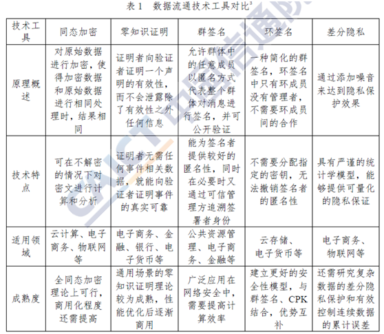

 

## 本章参考

[1].   Spark与storm的对比 http://www.cnblogs.com/yaohaitao/p/5703288.html

[2].   流式计算产品对比(Storm、Trident、Spark Streaming、Flink）https://blog.csdn.net/xianzhen376/article/details/51111911

[3].   Apache五大主流流计算框架详细对比 http://developer.51cto.com/art/201603/507444.htm

[4].   工作流调度系统介绍 https://blog.csdn.net/tototuzuoquan/article/details/73239950

[5].   Hadoop - 任务调度系统比较https://www.cnblogs.com/smartloli/p/4964741.html

[6].   四大集群管理工具大比拼 http://www.sohu.com/a/74693243_183588

[7].   大数据领域两大最主流集群管理工具Ambari和Cloudera Manger https://www.cnblogs.com/zlslch/p/6118862.html

[8].   Presto、Impala性能比较  https://blog.csdn.net/u012551524/article/details/79124532

[9].   Presto http://prestodb-china.com/ 

[10]. presto、druid、SparkSQL、kylin的对比分析，如性能、架构等，有什么异同？https://www.zhihu.com/question/41541395/answer/91709171

[11]. 开源日志系统比较 http://dongxicheng.org/search-engine/log-systems/

[12]. YARN与Mesos比较：http://www.quora.com/How-does-YARN-compare-to-Mesos

[13]. 开源IT监控系统对比 https://blog.csdn.net/findgem/article/details/39293057


# 参考资料

## 重要网站

[1].   中国大数据 http://www.thebigdata.cn/

[2].   中国大数据产业观察 http://www.cbdio.com/ 

[3].   排序基准：http://sortbenchmark.org/.

[4].   数据局 http://www.shujuju.cn/ 


## 项目官网

**Hadoop项目**
* HBase官方主页：http://hbase.apache.org/.
* Hive官方主页：http://hive.apache.org/.
* Pig官方主页：http://pig.apache.org/.
* Cascading官方主页：http://www.cascading.org/.
* Azkaban官方主页：http://sna-projects.com/azkaban/.
* Facebook Hadoop代码：https://github.com/facebook/hadoop-20.

 

**Apache项目**
* Apache Spark http://spark.apache.org/ 
* Apache log4j网址：http://logging.apache.org/log4j/index.html
* Nutch官方网站：http://nutch.apache.org/ 
* Lucene官方网站：http://lucene.apache.org/
* Thrift官方主页：http://thrift.apache.org/
* Avro官方主页：http://avro.apache.org/
* ZooKeeper  http://zookeeper.apache.org/

 

**其它开源项目**

* Protocal Buffer官方主页：http://code.google.com/p/protobuf/.
* kettle  http://kettle.pentaho.com/  

* Cloudera官方博客：http://blog.cloudera.com/blog/.

 

**商业项目**
* splunk  https://www.splunk.com 

 

**日志系统**
* scribe主页：https://github.com/facebook/scribe
* chukwa主页：http://incubator.apache.org/chukwa/
* kafka主页：h[ttp://sna-projects.com/kafka/](ttp://sna-projects.com/kafka/)
* Flume主页：http[s://github.com/cloudera/flume/](s://github.com/cloudera/flume/)
* ELK 
    - Logstash：https://www.elastic.co/cn/products/logstash
    - Kibana: https://www.elastic.co/cn/products/kibana
    - Elasticsearch https://www.elastic.co/cn/products/elasticsearch

 

**调度系统**
* Apache Mesos官网 http://mesos.apache.org/documentation/latest/
* Apache YARN官网 http://hadoop.apache.org/common/docs/r0.23.0/index.html
* Apache Oozie官网  http://incubator.apache.org/oozie/.

 

## 参考书目

**中文书**

[1].   Anand Rajaraman、Jeffrey David Ullman / 王斌 《大数据 : 互联网大规模数据挖掘与分布式处理》/ 人民邮电出版社 / 2012-9

[2].   董西成 《Hadoop技术内幕 : 深入解析MapReduce架构设计与实现原理》/ 机械工业出版社 / 2013-4  

[3].   [奥地利]Dietmar Jannach、Markus Zanker、Alexander Felfernig、Gerhard Friedrich / 蒋凡译 《推荐系统》 / 人民邮电出版社 / 2013-6-25 

[4].   Toby Segaran / 莫映、王开福 《集体智慧编程》/ 电子工业出版社 / 2015-3 

[5].   Mesos论文：Mesos: A Platform for Fine-Grained Resource Sharing in the Data Center. B. Hindman, A. Konwinski, M. Zaharia, A. Ghodsi, A.D. Joseph, R. Katz, S. Shenker and I. Stoica, NSDI 2011, March 2011.

[6].   Tom White.周敏奇，王晓玲，金澈清，钱卫宁译. Hadoop权威指南.2版. 北京：清华大学出版社，2011.

[7].   Chuck Lam.韩冀中译. Hadoop实战.北京：人民邮电出版社，2011.

 

**英文书**
* [Ian H.Witten,Eide Frank ](http://www.china-pub.com/s/?key1=%a3%a8%d0%c2%ce%f7%c0%bc%a3%a9Ian+H.Witten%2cEide+Frank) [**Data Mining: Practical Learning Tools and Techniques with Java Implementations** ](http://www.amazon.com/exec/obidos/ASIN/1558605525/qid%3D1066016823/sr%3D11-1/ref%3Dsr_11_1/104-7761378-9162309)　 [Elsevier ](http://www.china-pub.com/s/?key1=Elsevier)　2003
* Rafal Kuc 《Apache Solr 4 Cookbook》/ Packt Publishing / 2013-1-25 
* Alberto Paro 《ElasticSearch Cookbook, Second Edition》/ Packt Publishing - ebooks Account / 2015-1-28
* Eric Sammer.Hadoop Operations.O’Reilly Media，2012.

 

## 参考链接

[1].   讲透大数据，我只需要一顿饭 http://www.thebigdata.cn/YeJieDongTai/35476.html

[2].   董的博客 http://dongxicheng.org 

[3].   读完这100篇论文 就能成大数据高手 https://www.jianshu.com/p/7ffa50f4d4f0


# 附录

## FAQ

**Q1: 机器学习与数据挖掘的关系?**

A1：
* 机器学习为数据挖掘提供理论方法: 分类、聚类、…

* 所处理的数据在量上的差距
  - 机器学习－数据规模相对小
  - 数据挖掘－数据规模相对大

* 机器学习是为人工智能准备，而数据挖掘目标适中
  - 自动化繁琐的挖掘工作，而非达到人的智能行为
  - 辅助用户决策，而非替代用户决策

 

**Q2: 数据库与数据挖掘的关系?**

A2: 
* 数据库：演绎推理（deductive）
  先定义好模式，按照模式查询数据（SQL）
* 数据挖掘：归纳推理（inductive）

  给定特定数据，归纳一般模式
  数据挖掘是数据库功能的延伸

**Q3: 数据挖掘DM知识发现KDD的关系?**

**A3:**

知识发现由下列步骤组成,数据清理-->数据集成à数据选择->数据变换à数据挖掘à模式评估à知识表示. 数据挖掘是知识发现过程中的一个步骤.

 

**Q4: 各学科简单比较** 

**A4**: 

 数据挖掘 ＝ 模型model + 算法algo 
 程序 ＝ 算法 ＋ 数据结构 ＋ 领域知识 
 机器学习：样本＋背景知识，通过一定的[学习算法](http://my.unix-center.net/~great_denny/wiki/index.php?title=学习算法&action=edit)，得到概念描述

**Q5: 模型，模式和算法的关系**

**A5**:

模型：对数据集整体的理解和认识 
模式：对局部数据集的认识，如关联规则中某具体规则 
算法：给定一个输出，按照某种过程得到一个输出。 

 