| 序号 | 修改时间  | 修改内容                                                 | 修改人 | 审稿人 |
| ---- | --------- | -------------------------------------------------------- | ------ | ------ |
| 1    | 2021-4-25 | 创建。从《Hadoop体系》、《大数据开发》迁移相关章节成文。 | Keefe |        |
|      |           |                                                          |        |        |


---

# 1 大数据计算引擎概述

## 并行计算

并行计算是海量处理数据的有效手段。并行计算主要有三个方向，分别是：

* MPI：Message Passing Interface，消息传递接口是目前国际上通行的并行计算领域最流行的API规范。
* MapReduce：Map+Reduce，相比MPI，就近计算，减少了数据的网络传输压力。
* Dryad: 微软2007年提出的并行计算模型，类似MR。

 

处理框架负责对系统中的数据进行计算，例如处理从非易失存储中读取的数据，或处理刚刚摄入到系统中的数据。数据的计算则是指从大量单一数据点中提取信息和见解的过程。

根据处理方式不同可分为批处理和流式处理。

* 批处理：主要操作大容量静态数据集，并在计算过程完成后返回结果。
* 流式处理：对随时进入系统的数据进行计算。

~~流处理：CEP~Complex Event Processing复杂事件处理，开源实现如Esper~~

~~批处理：BSP~Bulk Synchronous Parallel 批量同步并行，开源实现如Pregel, Apache Hama。~~


**数据倾斜问题**

大数据计算可能有数据倾斜问题（即数据集中到部分机器），解决方法通常有

* 调节参数：如MR中的hive.map.aggr、hive.groupby.skewindata都设置为true。当发生数据倾斜时，可进行负载均衡。
* 优化SQL语句: 如mapjoin优化（小表和大表join时，先小表操作，再大表）、空值优化、group by优化
* 特殊情况特殊处理

 

### HPCC~高性能计算与通信

[HPCC](http://hadoop.apache.org/)，High Performance Computing and Communications（高性能计算与通信）的缩写。1993年，由美国科学、工程、技术联邦协调理事会向国会提交了“重大挑战项目：高性能计算与 通信”的报告，也就是被称为HPCC计划的报告，即美国总统科学战略项目，其目的是通过加强研究与开发解决一批重要的科学与技术挑战问题。HPCC是美国 实施信息高速公路而上实施的计划，该计划的实施将耗资百亿美元，其主要目标要达到：开发可扩展的计算系统及相关软件，以支持太位级网络传输性能，开发千兆 比特网络技术，扩展研究和教育机构及网络连接能力。
  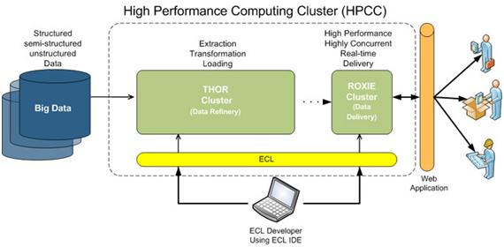

图 8 HPCC架构图


 **该项目主要由五部分组成：**

1、高性能计算机系统（HPCS），内容包括今后几代计算机系统的研究、系统设计工具、先进的典型系统及原有系统的评价等；

2、先进软件技术与算法（ASTA），内容有巨大挑战问题的软件支撑、新算法设计、软件分支与工具、计算计算及高性能计算研究中心等；

3、国家科研与教育网格（NREN），内容有中接站及10亿位级传输的研究与开发；

4、基本研究与人类资源（BRHR），内容有基础研究、培训、教育及课程教材，被设计通过奖励调查者-开始的，长期 的调查在可升级的高性能计算中来增加创新意识流，通过提高教育和高性能的计算训练和通信来加大熟练的和训练有素的人员的联营，和来提供必需的基础架构来支 持这些调查和研究活动；

5、信息基础结构技术和应用（IITA ），目的在于保证美国在先进信息技术开发方面的领先地位。

 

## 实时计算

表格 4 实时计算的分类

| 流计算   | 如Spark Stream、Storm、Flink                                 |
| -------- | ------------------------------------------------------------ |
| 内存计算 | 如HANA、Oracle Exadata                                       |
| 边缘计算 | 指在靠近物或数据源头的一侧，采用网络、计算、存储、应用核心能力为一体的开放平台，就近提供最近端服务。 |


## 计算引擎选型比较

表格：大数据计算引擎按技术趋势分代

| 代表            | 特点                                                         | 类似实现                      |
| --------------- | ------------------------------------------------------------ | ----------------------------- |
| v1：  MapReduce | 将计算分为两个阶段，分别为 Map 和 Reduce。<br>对于上层应用来说，就不得不想方设法去拆分算法，甚至于不得不在上层应用实现多个 Job 的串联，以完成一个完整的算法，例如迭代计算。 |                               |
| v2：            | DAG 框架的产生                                               | 如 Tez 以及更上层的 Oozie。   |
| v3：Spark       | Job 内部的 DAG 支持（不跨越 Job），以及强调的实时计算。      |                               |
| v4：Flink       | 流计算的支持，以及更一步的实时性。                           | Spark Streaming、Storm、Samza |

备注：1. 以上分代只要针对技术发展的趋势。实际中上一代的产品如果有持续更新，也会升级到新一代。

2. ASF：Apache软件基金会，Storm/Flink/Hadoop/Spark等大多数的大数据框架都属于ASF。


表格 14 数据计算引擎比较列表

|       | 简介                                                         | 特性                                                         | 实时  | 批处理 | 内存计算 |
| ----- | ------------------------------------------------------------ | ------------------------------------------------------------ | ----- | ------ | -------- |
| MR    | 2004年诞生，IO较慢。  MapReduce是一种编程模型，用于大规模数据集（大于1TB）的并行运算。概念"Map（映射）"和"Reduce（归约）"，是它们的主要思想。 | 一个基于集群的高性能并行计算平台。  一个并行计算与运行软件框架。  一个并行程序设计模型与方法。 | **×** | √      | **×**    |
| Spark | Spark是加州大学伯克利分校AMP实验室在2009年开发的通用内存并行计算框架，[Scala](http://www.dataguru.cn/article-8864-1.html?union_site=innerlink)语言实现。  Spark在2013年6月进入Apache成为孵化项目，2014年12月Spark1.2.0发布。 | 高级 API 剥离了对集群本身的关注，只需关注计算本身。  计算快，支持交互式计算和复杂算法（内存计算下，Spark 比 Hadoop 快100倍）。  是一个通用引擎，可用它来完成各种各样的运算，包括 SQL 查询、文本处理、机器学习等。 | √     | √      | √        |
| Storm | 来源于BackType 。2011年BackType 被Twitter收购，Storm开源；2013年被Apache孵化。 | 一个分布式流计算引擎。  动态处理大量生成的“小数据块”上要更好，时延更小。 | √     | ×      | √        |
| Flink | 2008年出现在柏林理工大学研究项目里；2014年被Apache孵化。     | .                                                            | √     | √      | √        |

备注：1. UC Berkeley AMP lab~ Algorithms, Machines, and People Lab

2. 数据处理方式

* 批处理：成批理的处理一批数据。
* 流式处理：每个节点实现一个基本的计算过程，而数据项在互相连接的网络节点中流进流出。Spark的实时处理为Spark Stream. 
* 微批处理：mirco-batching，对一个时间段内的数据收集起来，作为一个RDD，再处理。Spark Streaming的处理方法。

 

表格 15 Storm、Spark streaming和Flink比较

| 比点           | Storm                            | Spark Streaming         | Flink          |
| -------------- | -------------------------------- | ----------------------- | -------------- |
| 流模型         | Native                           | 准实时，微批处理        | 纯实时Native   |
| 延迟度         | 毫秒级                           | 秒级                    | 近毫秒级       |
| 健壮性/容错性  | ZooKeeper，Acker，  非常强       | Checkpoint，WAL，  一般 | Checkpoint     |
| 事务机制       | 支持完善                         | 支持，但不够完善        |                |
| 动态调整并行度 | 支持                             | 不支持                  |                |
| 回压           | No                               | Yes                     | Yes            |
| 应用场景推     | 允许增量计算的高速事件处理系统。 |                         | 迭代式数据处理 |

说明：

1. 回压Back Pressure：指当负载峰值导致数据流入速度超过组件实时处理能力的情况，这种情况可能导致处理工作停顿并可能丢失数据。

2. **优劣分析**

Spark Streaming，位于Spark生态技术栈中，因此Spark Streaming可以和Spark Core、Spark SQL无缝整合，也就意味着，我们可以对实时处理出来的中间数据，立即在程序中无缝进行延迟批处理、交互式查询等操作。这个特点大大增强了Spark Streaming的优势和功能。

如果你必须有状态的计算，恰好一次的递送，并且不介意高延迟的话，那么可以考虑Spark Streaming，特别如果你还计划图形操作、机器学习或者访问SQL的话，Apache Spark的stack允许你将一些library与数据流相结合(Spark SQL，Mllib，GraphX)，它们会提供便捷的一体化编程模型。尤其是数据流算法(例如：K均值流媒体)允许Spark实时决策的促进。

Flink支持增量迭代，具有对迭代自动优化的功能，在迭代式数据处理上，比Spark更突出，Flink基于每个事件一行一行地流式处理，真正的流式计算，流式计算跟Storm性能差不多，支持毫秒级计算，而Spark则只能支持秒级计算。

 

表格 16 流式计算引擎比较列表

| 产品            | 模型           | API    | 保证次数      | 容错机制       | 状态管理  Stateful | 延时     | 吞吐量 | 成熟度 |
| --------------- | -------------- | ------ | ------------- | -------------- | ------------------ | -------- | ------ | ------ |
| Strom           | Native         | 组合式 | At-least-once | Record ACKs    | No                 | Very Low | Low    | High   |
| Trident         | mirco-batching | 组合式 | Exectly-once  | Record ACKs    | Yes(Operators)     | Low      | Low    | High   |
| Spark streaming | mirco-batching | 声明式 | Exectly-once  | RDD Checkpoint | Yes(Dstream)       | Low      | medium | High   |
| Flink           | Native         | 组合式 | Exectly-once  | Checkpoint     | 基于操作的状态管理 | Low      | High   | Low    |

说明：

1. 模型 Streaming Model

* Naitve：数据进入立即处理；
* Micro-Batch：数据流入后，先划分成Micro-Batch，再处理；

2. API 形式

* 组合式：操作更加基础的API操作，一步步精细控制，各组建组合定义成拓扑；
* 声明式：提供封装后的高阶函数。封装后可提供初步的优化；可提供窗口管理、状态管理等高级操作；

3. 保证机制Guarantees: 分布式系统的**消息传递语义**有三种类型分别是最多一次at-most-once，至少一次at-least-once和正好一次exactly-once。

* At-least-once，至少一次，出错情况下需要执行多次；
* Exectly-once，一次执行，保证OK；

4. 容错机制：监控Guarantees

* Record ACKs，每Tuple处理后经过ACK确认；
* RDD Checkpoint，基于RDD做Checkpoint。只需要重新计算特定RDD；
* Checkpoint：Flink的checkpoint，是一种快照（待补充详细介绍）

5. 状态管理Stateful

* 基于操作的状态管理：每次操作有一个状态；
* 基于数据的状态管理：每个数据有相应的处理状态；

6. 延时Latency & 吞吐量Throughput

怎么样制定测试方案？

7. 成熟度

产品成熟度，基于Flink已经在2016.3分布1.0版本，怎么界定成熟度？


# 2 计算引擎

## 2.1 Hadoop MapReduce (MR) 

**简介**

MapReduce是一种简化并行计算的编程模型，名字源于该模型中的两项核心操作：Map和Reduce。Map将一个作业分解成为多个任务，Reduce将分解后多个任务处理的结果汇总起来，得出最终的分析结果。

 

**结构**

如[图1](http://localhost:7890/pages/YZH0518G/01/YZH0518G/01/resources/zh-cn_topic_0085563595.html?ft=0&fe=10&hib=2.2.3.13.1&id=ZH-CN_TOPIC_0085563595#ZH-CN_TOPIC_0085563595__f6e8934d9ed084e648008f4be941e4ab8)所示，MapReduce通过实现YARN的Client和ApplicationMaster接口集成到YARN中，利用YARN申请计算所需资源。

 

**与组件的关系**

MapReduce和HDFS的配合关系

* HDFS是Hadoop分布式文件系统，具有高容错和高吞吐量的特性，可以部署在价格低廉的硬件上，存储应用程序的数据，适合有超大数据集的应用程序。
* MapReduce是一种编程模型，用于大数据集（大于1TB）的并行运算。在MapReduce程序中计算的数据可以来自多个数据源，如Local FileSystem、HDFS、数据库等。最常用的是HDFS，可以利用HDFS的高吞吐性能读取大规模的数据进行计算。同时在计算完成后，也可以将数据存储到HDFS。


## 2.2 Apache Spark

详见 下方章节。


## 2.3 Apache Flink

2008 年，Flink 的前身已经是柏林理工大学一个研究性项目， 在 2014 被 Apache 孵化器所接受，然后迅速地成为了 ASF（Apache Software Foundation）的顶级项目之一。阿里巴巴内部 Flink 版本 Blink 于 2019 年 1 月正式开源。

Flink 是一个针对流数据和批数据的分布式处理引擎。它主要是由 Java 代码实现。对 Flink 而言，其所要处理的主要场景就是流数据，批数据只是流数据的一个极限特例而已。再换句话说，Flink 会把所有任务当成流来处理，这也是其最大的特点。Flink 可以支持本地的快速迭代，以及一些环形的迭代任务。并且 Flink 可以定制化内存管理。在这点，如果要对比 Flink 和 Spark 的话，Flink 并没有将内存完全交给应用层。这也是为什么 Spark 相对于 Flink，更容易出现 OOM 的原因（out of memory）。就框架本身与应用场景来说，Flink 更相似与 Storm。


### 架构篇

 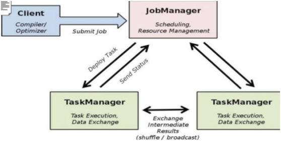

图 9 Flink 架构图

说明：Client 用来提交任务给 JobManager，JobManager 分发任务给 TaskManager 去执行，然后 TaskManager 会心跳的汇报任务状态。相对于MR，TaskManager 之间是是流（Stream）。

* JobManager： 负责作业调度，Jar包管理，checkpoint的协调和发起，应用的资源管理，根据应用的需要，向ResourceManager申请资源。
* TaskManager ：负责实际计算工作，包括task的启动销毁，内存管理，磁盘IO，网络传输管理等。一个应用会分拆给多个TaskManager来进行计算。

 

 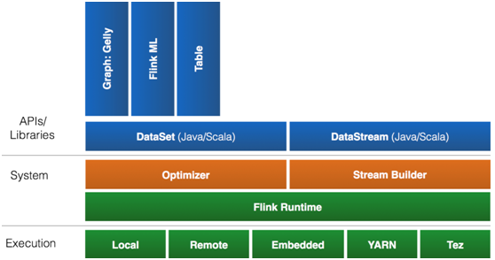

图 10 Flink的Stack

说明：Flink 首先支持了 Scala 和 Java 的 API，Python 也正在测试中。Flink 通过 Gelly 支持了图操作，还有机器学习的 FlinkML。Table 是一种接口化的 SQL 支持，也就是 API 支持，而不是文本化的 SQL 解析和执行。

 Flink可配合使用的基本组件包括：

* **Stream（流）**: 是指在系统中流转的，永恒不变的无边界数据集。包括DataSet 和 DataStream。流数据源的接入，支持HDFS文件、kafka、文本数据等，具体参考connector

* **Operator（操作方）**：是指针对数据流执行操作以产生其他数据流的功能

* **Source（源）**：是指数据流进入系统的入口点

* **Sink（槽）**: 是指数据流离开Flink系统后进入到的位置，槽可以是数据库或到其他系统的连接器。数据输出，支持HDFS、kafka、文本等。

* Transformations：流数据转换


### 技术原理篇


图 Flink基于YARN的集群部署 流程


图  Flink应用运行流程


## 2.4 Apache Storm

### 2.4.1 简介

Strom原由Twitter开发，2011年开源。Storm基于开源Apache Storm，是一个分布式、可靠、容错的实时计算系统。用于对大规模流式数据提供实时处理。Storm有众多适用场景：实时分析、持续计算、分布式ETL等。Storm有如下几个特点：

·     适用场景广泛 

·     易扩展，可伸缩性高 

·     保证无数据丢失 

·     容错性好 

·     易于构建和操控 

·     多语言

Storm作为计算平台，在业务层为用户提供了更为易用的业务实现方式：CQL（Continuous Query Language—持续查询语言）。CQL具有以下几个特点：

·     使用简单：CQL语法和标准SQL语法类似，只要具备SQL基础，通过简单地学习，即可快速地进行业务开发。 

·     功能丰富：CQL除了包含标准SQL的各类基本表达式等功能之外，还特别针对流处理场景增加了窗口、过滤、并发度设置等功能。 

·     易于扩展：CQL提供了拓展接口，以支持日益复杂的业务场景，用户可以自定义输入、输出、序列化、反序列化等功能来满足特定的业务场景 

·     易于调试：CQL提供了详细的异常码说明，降低了用户对各种错误的处理难度

 

[Storm](http://storm-project.net/)是自由的开源软件，一个分布式的、容错的实时计算系统。Storm可以非常可靠的处理庞大的数据流，用于处理Hadoop的批量数据。Storm很简单，支持许多种编程语言，使用起来非常有趣。Storm由Twitter开源而来，其它知名的应用企业包括Groupon、淘宝、支付宝、阿里巴巴、乐元素、Admaster等等。


 Storm有许多应用领域：实时分析、在线机器学习、不停顿的计算、分布式RPC（远过程调用协议，一种通过网络从远程计算机程序上请求服务）、 ETL（Extraction-Transformation-Loading的缩写，即数据抽取、转换和加载）等等。Storm的处理速度惊人：经测 试，每个节点每秒钟可以处理100万个数据元组。Storm是可扩展、容错，很容易设置和操作。 

 

 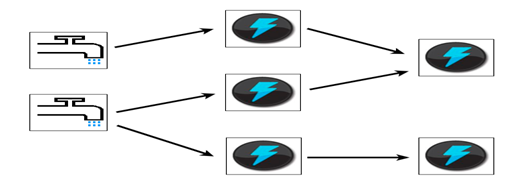

在Storm中，先要设计一个用于实时计算的图状结构，我们称之为拓扑（topology）。这个拓扑将会被提交给集群，由集群中的主控节点（master node）分发代码，将任务分配给工作节点（worker node）执行。一个拓扑中包括spout和bolt两种角色，其中spout发送消息，负责将数据流以tuple元组的形式发送出去；而bolt则负责转换这些数据流，在bolt中可以完成计算、过滤等操作，bolt自身也可以随机将数据发送给其他bolt。由spout发射出的tuple是不可变数组，对应着固定的键值对。

 

### 2.4.2 架构

 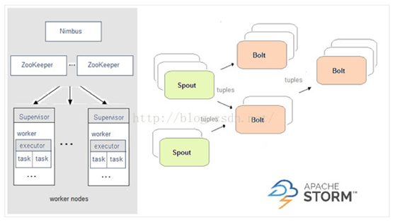

图 11 Storm架构图

 **Storm框架主要由7部分组成**

* Topology：一个实时应用的计算任务被打包作为Topology发布，这同Hadoop的MapReduce任务相似。
* Spout：Storm中的消息源，用于为Topology生产消息（数据），一般是从外部数据源（如Message Queue、RDBMS、NoSQL、Realtime Log）不间断地读取数据并发送给Topology消息（tuple元组）。
* Bolt：Storm中的消息处理者，用于为Topology进行消息的处理，Bolt可以执行过滤，聚合， 查询数据库等操作，而且可以一级一级的进行处理。
* Stream：产生的数据（tuple元组）。
* Stream grouping：在Bolt任务中定义的Stream进行区分。
* Task：每个Spout或者Bolt在集群执行许多任务。
* Worker：Topology跨一个或多个Worker节点的进程执行。


Storm服务由主备Nimbus进程、对应的UI进程和多个Supervisor进程组成，如[下图](http://localhost:7890/pages/YZH0518G/01/YZH0518G/01/resources/zh-cn_topic_0085563712.html?ft=0&fe=10&hib=2.2.3.21.1&id=ZH-CN_TOPIC_0085563712#ZH-CN_TOPIC_0085563712__fig4597665511437)所示。


  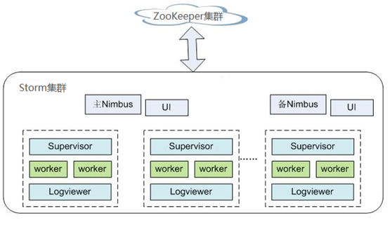

 表1 结构图说明

| 名称       | 说明                                                         |
| ---------- | ------------------------------------------------------------ |
| Nimbus     | Storm服务的控制中心节点，在HA模式下包含主用Nimbus和备用Nimbus。  主用Nimbus：负责接收客户端提交的任务，并在集群中分发任务给Supervisor；同时监听状态等。   备用Nimbus：当主用Nimbus故障时，备用Nimbus将取代主用Nimbus对外提供服务。 |
| Supervisor | 负责监听并接受Nimbus分配的任务，根据需要启动和停止属于自己管理的Worker进程。Worker进程是运行具体处理组件逻辑的进程。每个Worker是一个JVM进程。 |
| UI         | Storm业务监控界面，用于查看运行的拓扑情况。                  |
| ZooKeeper  | ZooKeeper为Storm服务中各进程提供分布式协作服务。主备Nimbus、Supervisor、Worker将自己的信息注册到ZooKeeper中，Nimbus据此感知各个角色的健康状态。 |
| Logviewer  | Storm业务进程日志查看界面，用于查看Worker进程的日志信息。    |

 

**原理**

表格 5 基本概念

| 概念             | 说明                                                         |
| ---------------- | ------------------------------------------------------------ |
| Tuple            | Storm核心数据结构，是消息传递的基本单元，不可变Key-Value对，这些Tuple会以一种分布式的方式进行创建和处理。 |
| Stream           | Storm的关键抽象，是一个无边界的连续Tuple序列。               |
| Topology         | 在Storm平台上运行的一个实时应用程序，由各个组件（Component）组成的一个DAG（Directed Acyclic Graph）。一个Topology可以并发地运行在多台机器上，每台机器上可以运行该DAG中的一部分。Topology与Hadoop中的MapReduce Job类似，不同的是，它是一个长驻程序，一旦开始就不会停止，除非人工中止。 |
| Spout            | Topology中产生源数据的组件，是Tuple的来源，通常可以从外部数据源（如消息队列、数据库、文件系统、TCP连接等）读取数据，然后转换为Topology内部的数据结构Tuple，由下一级组件处理。 |
| Bolt             | Topology中接受数据并执行具体处理逻辑（如过滤，统计、转换、合并、结果持久化等）的组件。 |
| Worker           | 是Topology运行态的物理进程。每个Worker是一个JVM进程，每个Topology可以由多个Worker并行执行，每个Worker运行Topology中的一个逻辑子集。 |
| Task             | Worker中每一个Spout/Bolt的线程称为一个Task。                 |
| Stream groupings | Storm中的Tuple分发策略，即后一级Bolt以什么分发方式来接收数据。当前支持的策略有：Shuffle Grouping， Fields Grouping， All Grouping， Global Grouping， Non Grouping， Directed Grouping。 |

 

[图2](http://localhost:7890/pages/YZH0518G/01/YZH0518G/01/resources/zh-cn_topic_0085563712.html?ft=0&fe=10&hib=2.2.3.21.1&id=ZH-CN_TOPIC_0085563712#ZH-CN_TOPIC_0085563712__fig_topo)描述了一个由Spout、Bolt组成的DAG，即Topology。图中每个矩型框代表Spout或者Bolt，矩型框内的节点表示各个并发的Task，Task之间的“边”代表数据流——Stream。

  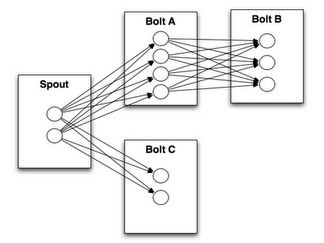

图2 Topology示意图

·     **可靠性** 

Storm提供三种级别的数据可靠性：

§ 至多一次：处理的数据可能会丢失，但不会被重复处理。此情况下，系统吞吐量最大。 

§ 至少一次：保证数据传输可靠，但可能会被重复处理。此情况下，对在超时时间内没有获得成功处理响应的数据，会在Spout处进行重发，供后续Bolt再次处理，会对性能稍有影响。 

§ 精确一次：数据成功传递，不丢失，不冗余处理。此情况下，性能最差。

可靠性不同级别的选择，需要根据业务对可靠性的要求来选择、设计。例如对于一些对数据丢失不敏感的业务，可以在业务中不考虑数据丢失处理从而提高系统性能；而对于一些严格要求数据可靠性的业务，则需要使用精确一次的可靠性方案，以确保数据被处理且仅被处理一次。

·     **容错** 

Storm是一个容错系统，提供较高可用性。[表3](http://localhost:7890/pages/YZH0518G/01/YZH0518G/01/resources/zh-cn_topic_0085563712.html?ft=0&fe=10&hib=2.2.3.21.1&id=ZH-CN_TOPIC_0085563712#ZH-CN_TOPIC_0085563712__table_04)从Storm的不同部件失效的情况角度解释其容错能力：

表3 容错能力

| 失效场景       | 说明                                                         |
| -------------- | ------------------------------------------------------------ |
| Nimbus失效     | Nimbus是无状态且快速失效的。当主Nimbus失效时，备Nimbus会接管，并对外提供服务。 |
| Supervisor失效 | Supervisor是工作节点的后台守护进程，是一种快速失效机制，且是无状态的，并不影响正在该节点上运行的Worker，但是会无法接收新的Worker分配。当Supervisor失效时，OMS会侦测到，并及时重启该进程。 |
| Worker失效     | 该Worker所在节点上的Supervisor会在此节点上重新启动该Worker。如果多次重启失败，则Nimbus会将该任务重新分配到其它节点。 |
| 节点失效       | 则该节点上的所有分配的任务会超时，而Nimbus会将这些Worker重新分配到其他节点。 |

 

**开源特性**

·     分布式实时计算框架 

开源Storm集群中的每台机器上都可以运行多个工作进程，每个工作进程又可创建多个线程，每个线程可以执行多个任务，任务是并发进行数据处理。

·     高容错 

如果在消息处理过程中有节点、进程等出现异常，提供重新部署该处理单元的能力。

·     可靠的消息保证 

支持At-Least Once、At-Most Once、Exactly Once的数据处理模式。

·     安全机制 

提供基于Kerberos的认证以及可插拔的授权机制，提供支持SSL的Storm UI以及Log Viewer界面，同时支持与大数据平台其他组件（如ZooKeeper，HDFS等）进行安全集成。

·     灵活的拓扑定义及部署 

使用Flux框架定义及部署业务拓扑，在业务DAG发生变化时，只需对YAML DSL（domain-specific language）定义进行修改，无需重新编译及打包业务代码。

·     与外部组件集成 

支持与多种外部组件集成，包括：Kafka、HDFS、HBase、Redis或JDBC/RDBMS等服务，便于实现涉及多种数据源的业务。

### 2.4.3 与组件的关系

Storm，提供实时的分布式计算框架，它可以从数据源（如Kafka、TCP连接等）中获得实时消息数据，在实时平台中完成高吞吐、低延迟的实时计算，并将结果输出到消息队列或者进行持久化。Storm与其他组件的关系如[图1](http://localhost:7890/pages/YZH0518G/01/YZH0518G/01/resources/zh-cn_topic_0085563563.html?ft=0&fe=10&hib=2.2.3.21.2&id=ZH-CN_TOPIC_0085563563#ZH-CN_TOPIC_0085563563__fig_re)所示：

 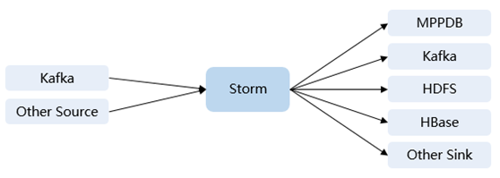

图 12 Storm组件关系图

 

**Storm和Streaming的关系**

Storm和Streaming都使用的开源Apache Storm内核，不同的是，Storm使用的内核版本是1.0.2，Streaming使用的是0.10.0。Streaming组件一般用来在升级场景继承过度业务，比如之前版本已经部署Streaming并且有业务在运行的情况下，升级后仍然可以使用Streaming。如果是新搭建的集群，则建议使用Storm。

Storm 1.0.2新增特性说明：

·     **分布式缓存**：提供命令行工具共享和更新拓扑的所需要的外部资源（配置），无需重新打包和部署拓扑。 

·     **Native Streaming Window API**：提供基于窗口的API。

·     **资源调度器**：新增基于资源的调度器插件，可以在拓扑定义时指定可使用的最大资源，并且通过配置的方式指定用户的资源配额，从而管理该用户名下的拓扑资源。

·     **State Management**：提供带检查点机制的Bolt接口，当事件失败时，Storm会自动管理bolt的状态并且执行恢复。

·     **消息采样和调试：**在Storm UI界面可以开关拓扑或者组件级别的调试，将流消息按采样比率输出到指定日志中。

·     **Worker动态分析：**在Storm UI界面可以收集Wokrer进程的Jstack、Heap日志，并且可以重启Worker进程。

·     **拓扑日志级别动态调整：**提供命令行和Storm UI两种方式对运行中的拓扑日志进行动态修改。

·     **性能提升：**与之前的版本相比，Storm的性能得到了显著提升。虽然，拓扑的性能和用例场景及外服服务的依赖有很大的关系，但是对于大多数场景来说，性能可以提升3倍。

 

## 本章参考

[1].   spark的前世今生以及其组件介绍和应用 - Spark高速集群计算平台http://f.dataguru.cn/thread-621195-1-1.html

[2].   Apache Storm 的历史及经验教训 [https://www.oschina.net/translate/history-of-apache-storm-and-lessons-learned?lang=chs&page=2#](https://www.oschina.net/translate/history-of-apache-storm-and-lessons-learned?lang=chs&page=2)

[3].   storm发展历史 https://blog.csdn.net/chengqiuming/article/details/78984286

[4].   新一代大数据处理引擎 Apache Flink https://www.ibm.com/developerworks/cn/opensource/os-cn-apache-flink/index.html

[5].   阿里云高级技术专家张毅萍：我眼中的边缘计算 https://blog.csdn.net/weixin_43970890/article/details/90715830


# 3  Apach Spark

## 3.1  简介

Apache Spark是一个开源的通用集群计算系统，它提供了High-level编程API，支持Scala、Java和Python三种编程语言。Spark内核使用Scala语言编写，通过基于Scala的函数式编程特性，在不同的计算层面进行抽象，代码设计非常优秀。

Spark提供了一个全面、统一的框架用于管理各种有着不同性质（文本数据、图表数据等）的数据集和数据源（批量数据或实时的流数据）的大数据处理的需求。

Spark是UC Berkeley AMP lab (加州大学伯克利分校的AMP实验室)所开源的类Hadoop MapReduce的通用并行框架，2009年开发，2010年开源。Spark拥有Hadoop MapReduce所具有的优点；但不同于MapReduce的是Job中间输出结果可以保存在内存中，从而不再需要读写HDFS，因此Spark能更好地适用于数据挖掘与机器学习等需要迭代的MapReduce的算法。

Spark 是在 [Scala](http://baike.baidu.com/view/1588150.htm) 语言中实现的，它将 Scala 用作其应用程序框架。与 Hadoop 不同，Spark 和 Scala 能够紧密集成，其中的 Scala 可以像操作本地集合对象一样轻松地操作分布式数据集。

 尽管创建 Spark 是为了支持分布式数据集上的迭代作业，但是实际上它是对 Hadoop 的补充，可以在 Hadoop 文件系统中并行运行。通过名为 Mesos 的第三方集群框架可以支持此行为。Spark 由加州大学伯克利分校 AMP 实验室 (Algorithms, Machines, and People Lab) 开发，可用来构建大型的、低延迟的数据分析应用程序。

 

Spark是基于内存的分布式计算框架。在迭代计算的场景下，数据处理过程中的数据可以存储在内存中，提供了比MapReduce高10到100倍的计算能力。Spark可以使用HDFS作为底层存储，使用户能够快速地从MapReduce切换到Spark计算平台上去。Spark提供一站式数据分析能力，包括小批量流式处理、离线批处理、SQL查询、数据挖掘等，用户可以在同一个应用中无缝结合使用这些能力。

Spark的特点如下：

*  通过分布式内存计算和DAG（无回路有向图）执行引擎提升数据处理能力，比MapReduce性能高10倍到100倍。 

* 提供多种语言开发接口（Scala/Java/Python），并且提供几十种高度抽象算子，可以很方便构建分布式的数据处理应用。 

* 结合SQL、Streaming、MLlib、GraphX等形成数据处理栈，提供一站式数据处理能力。 

* 完美契合Hadoop生态环境，Spark应用可以运行在Standalone、Mesos或者YARN上，能够接入HDFS、HBase、Hive等多种数据源，支持MapReduce程序平滑转接。


**Spark生态系统**

**Shark**：Shark基本上就是在Spark的框架基础上提供和Hive一样的HiveQL命令接口，为了最大程度的保持和Hive的[兼容性](http://baike.baidu.com/view/80015.htm)，Shark使用了Hive的API来实现query Parsing和 Logic Plan generation，最后的PhysicalPlan execution阶段用Spark代替[Hadoop](http://baike.baidu.com/view/908354.htm)[MapReduce](http://baike.baidu.com/view/2902.htm)。通过配置Shark参数，Shark可以自动在内存中缓存特定的RDD，实现数据重用，进而加快特定数据集的检索。同时，Shark通过UDF用户自定义函数实现特定的数据分析学习算法，使得SQL数据查询和运算分析能结合在一起，最大化RDD的重复使用。

**SparkR**：SparkR是一个为R提供了轻量级的Spark前端的R包。 SparkR提供了一个分布式的data frame数据结构，解决了 R中的data frame只能在单机中使用的瓶颈，它和R中的data frame 一样支持许多操作，比如select,filter,aggregate等等。（类似dplyr包中的功能）这很好的解决了R的大数据级瓶颈问题。 SparkR也支持分布式的机器学习算法，比如使用MLib机器学习库。SparkR为Spark引入了R语言社区的活力，吸引了大量的数据科学家开始在Spark平台上直接开始数据分析之旅。


### 版本演变

Spark2x版本相对于Spark 1.5版本新增了一些开源特性。具体特性或相关概念如下：

·     DataSet，详见[SparkSQL和DataSet原理](http://localhost:7890/pages/YZH0518G/01/YZH0518G/01/resources/zh-cn_topic_0096285099.html#ZH-CN_TOPIC_0096285099__zh-cn_topic_0085589707_sa94044b1fb404d68bd102a41c33fdc5e)。 

·     Spark SQL Native DDL/DML，详见[SparkSQL和DataSet原理](http://localhost:7890/pages/YZH0518G/01/YZH0518G/01/resources/zh-cn_topic_0096285099.html#ZH-CN_TOPIC_0096285099__zh-cn_topic_0085589707_sa94044b1fb404d68bd102a41c33fdc5e)。 

·     SparkSession，详见[SparkSession原理](http://localhost:7890/pages/YZH0518G/01/YZH0518G/01/resources/zh-cn_topic_0096285099.html#ZH-CN_TOPIC_0096285099__zh-cn_topic_0085589707_s6497bd5bdc544a2cadce8b84402736f5)。 

·     Structured Streaming，详见[Structured Streaming原理](http://localhost:7890/pages/YZH0518G/01/YZH0518G/01/resources/zh-cn_topic_0096285099.html#ZH-CN_TOPIC_0096285099__zh-cn_topic_0085589707_s67f5370fa81e436c99628ab81c89d80b)。 

·     小文件优化。 

·     聚合算法优化。 

·     Datasource表优化。 

·     合并CBO优化。


**Spark演进时间表**

演进时间表：

2009年由Berkeley's AMPLab开始编写最初的源代码

2010年开放源代码

2013年6月进入Apache孵化器项目

2014年2月成为Apache的较高级项目（8个月时间）

2014年5月底Spark1.0.0发布

2014年9月Spark1.1.0发布

2014年12月Spark1.2.0发布

**目前情况：**

目前已经有30+公司100+开发者在提交代码

Hadoop较大的厂商Cloudera宣称加大Spark框架的投入来取代Mapreduce

Hortonworks

Hadoop厂商MapR投入Spark阵营

Apache Mahout放弃MapReduce，将使用Spark作为后续算子的计算平台

 

### Spark 架构

Spark的架构如[图1](http://localhost:7890/pages/YZH0518G/01/YZH0518G/01/resources/zh-cn_topic_0096285099.html?ft=0&fe=10&hib=2.2.3.20.1&id=ZH-CN_TOPIC_0096285099#ZH-CN_TOPIC_0096285099__zh-cn_topic_0085589707_f5e8bc32e86ca4762a600fb2dac7eac78)所示，各模块的说明如[表1](http://localhost:7890/pages/YZH0518G/01/YZH0518G/01/resources/zh-cn_topic_0096285099.html?ft=0&fe=10&hib=2.2.3.20.1&id=ZH-CN_TOPIC_0096285099#ZH-CN_TOPIC_0096285099__zh-cn_topic_0085589707_ta9fe6df20ea54c11ad5df62acbcc075e)所示。

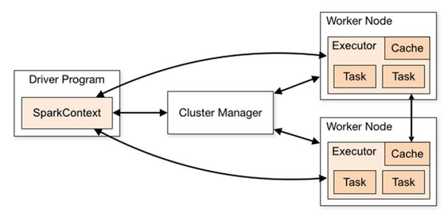

**图 Spark架构**


表1 基本概念说明


| 模块             | 说明                                                         |
| ---------------- | ------------------------------------------------------------ |
| Cluster  Manager | 集群管理器，管理集群中的资源。Spark支持多种集群管理器，Spark自带的Standalone集群管理器、Mesos或YARN。华为Spark集群默认采用YARN模式。 |
| Application      | Spark应用，由一个Driver Program和多个Executor组成。          |
| Deploy  Mode     | 部署模式，分为cluster和client模式。cluster模式下，Driver会在集群内的节点运行；而在client模式下，Driver在客户端运行（集群外）。 |
| Driver  Program  | 是Spark应用程序的主进程，运行Application的main()函数并创建SparkContext。负责应用程序的解析、生成Stage并调度Task到Executor上。通常SparkContext代表Driver Program。 |
| Executor         | 在Work Node上启动的进程，用来执行Task，管理并处理应用中使用到的数据。一个Spark应用一般包含多个Executor，每个Executor接收Driver的命令，并执行一到多个Task。  在Spark on Yarn模式下，其进程名称为CoarseGrainedExecutor Backend。 |
| Worker  Node     | 集群中负责启动并管理Executor以及资源的节点。  在Standalone模式中指的是通过slave文件配置的Worker节点，在Spark on Yarn模式下就是NoteManager节点。 |
| Job              | 一个Action算子（比如collect算子）对应一个Job，由并行计算的多个Task组成。 |
| Stage            | 每个Job由多个Stage组成，每个Stage是一个Task集合，由DAG分割而成。 |
| Task             | 承载业务逻辑的运算单元，是Spark平台中可执行的最小工作单元。一个应用根据执行计划以及计算量分为多个Task。 |

**Job、Task和Stage**

* Task: 被送到某个Executor上的工作单元，但hadoopMR中的MapTask和ReduceTask概念一样，是运行Application的基本单位，多个Task组成一个Stage，而Task的调度和管理等是由TaskScheduler负责
* Job: 包含多个Task组成的并行计算，往往由Spark Action触发生成， 一个Application中往往会产生多个Job
* Stage: 每个Job会被拆分成多组Task， 作为一个TaskSet， 其名称为Stage，Stage的划分和调度是有DAGScheduler来负责的，Stage有非最终的Stage（Shuffle Map Stage）和最终的Stage（Result Stage）两种，Stage的边界就是发生shuffle的地方。

 

Spark的应用运行架构如[图2](http://localhost:7890/pages/YZH0518G/01/YZH0518G/01/resources/zh-cn_topic_0096285099.html?ft=0&fe=10&hib=2.2.3.20.1&id=ZH-CN_TOPIC_0096285099#ZH-CN_TOPIC_0096285099__zh-cn_topic_0085589707_f0a7bc02a87b940238a8357dd733f3b8c)所示，运行流程如下所示：

1.    应用程序（Application）是作为一个进程的集合运行在集群上的，由Driver进行协调。 
2.    在运行一个应用时，Driver会去连接集群管理器（Standalone、Mesos、YARN）申请运行Executor资源，并启动ExecutorBackend。然后由集群管理器在不同的应用之间调度资源。Driver同时会启动应用程序DAG调度、Stage划分、Task生成。 
3.    然后Spark会把应用的代码（传递给SparkContext的JAR或者Python定义的代码）发送到Executor上。 
4.    所有的Task执行完成后，用户的应用程序运行结束。

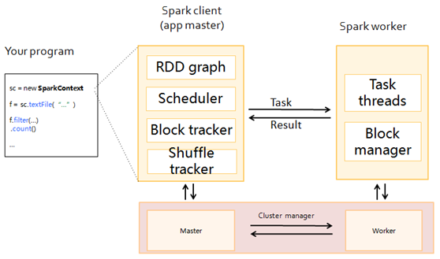

图 Spark应用运行架构

Spark采用Master和worker的模式，如[图3](http://localhost:7890/pages/YZH0518G/01/YZH0518G/01/resources/zh-cn_topic_0096285099.html?ft=0&fe=10&hib=2.2.3.20.1&id=ZH-CN_TOPIC_0096285099#ZH-CN_TOPIC_0096285099__zh-cn_topic_0085589707_fb981a1c0bbdf4703a38d7ec3db12dc67)所示。用户在Spark客户端提交应用程序，调度器将Job分解为多个Task发送到各个Worker中执行，各个Worker将计算的结果上报给Driver（即Master），Driver聚合结果返回给客户端。


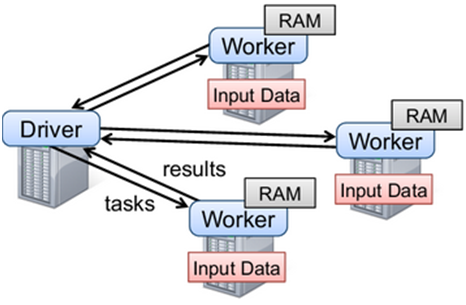

**图 Spark的Master和Worker**


在此结构中，有几个说明点：

·     应用之间是独立的。 

每个应用有自己的executor进程，Executor启动多个线程，并行地执行任务。无论是在调度方面，或者是executor方面。各个Driver独立调度自己的任务；不同的应用任务运行在不同的JVM上，即不同的Executor。

·     不同Spark应用之间是不共享数据的，除非把数据存储在外部的存储系统上（比如HDFS）。 

·     因为Driver程序在集群上调度任务，所以Driver程序最好和worker节点比较近，比如在一个相同的局部网络内。

 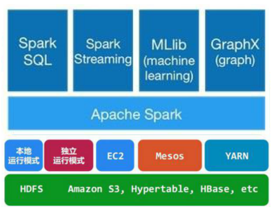

图 12 spark应用架构分层示意图

说明：

* Spark Core：包含Spark的基本功能；尤其是定义RDD的API、操作以及这两者上的动作。其他Spark的库都是构建在RDD和Spark Core之上的 
* Spark SQL：提供通过Apache Hive的SQL变体Hive查询语言（HiveQL）与Spark进行交互的API。每个数据库表被当做一个RDD，Spark SQL查询被转换为Spark操作。 
* Spark Streaming：对实时数据流进行处理和控制。Spark Streaming允许程序能够像普通RDD一样处理实时数据 
* MLlib：一个常用机器学习算法库，算法被实现为对RDD的Spark操作。这个库包含可扩展的学习算法，比如分类、回归等需要对大量数据集进行迭代的操作。 
* GraphX：控制图、并行图操作和计算的一组算法和工具的集合。GraphX扩展了RDD API，包含控制图、创建子图、访问路径上所有顶点的操作。


### 与组件的关系

#### Spark和HDFS的配合关系

通常，Spark中计算的数据可以来自多个数据源，如Local File、HDFS等。最常用的是HDFS，用户可以一次读取大规模的数据进行并行计算。在计算完成后，也可以将数据存储到HDFS。

分解来看，Spark分成控制端(Driver)和执行端（Executor）。控制端负责任务调度，执行端负责任务执行。

读取文件的过程如[图1](http://localhost:7890/pages/YZH0518G/01/YZH0518G/01/resources/zh-cn_topic_0085563722.html?ft=0&fe=10&hib=2.2.3.19.3&id=ZH-CN_TOPIC_0085563722#ZH-CN_TOPIC_0085563722__fa4b797ba877b48a9887616253937f2ff)所示。

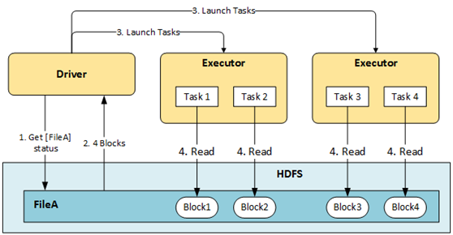

图 读取文件过程


读取文件步骤的详细描述如下所示： 

1.    Driver与HDFS交互获取File A的文件信息。 
2.    HDFS返回该文件具体的Blocks信息。 
3.    Driver根据具体的Block数据量，决定一个并行度，创建多个Task去读取这些文件Block。 
4.    在Executor端执行Task并读取具体的Block，作为RDD(弹性分布数据集)的一部分。

写入文件的过程如[图2](http://localhost:7890/pages/YZH0518G/01/YZH0518G/01/resources/zh-cn_topic_0085563722.html?ft=0&fe=10&hib=2.2.3.19.3&id=ZH-CN_TOPIC_0085563722#ZH-CN_TOPIC_0085563722__fd0c7d400d05a40c1b12b1a5f9921b09a)所示。

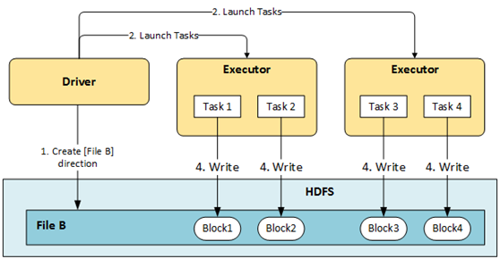

图 Spark写入文件过程


HDFS文件写入的详细步骤如下所示： 

1.    Driver创建要写入文件的目录。 
2.    根据RDD分区分块情况，计算出写数据的Task数，并下发这些任务到Executor。 
3.    Executor执行这些Task，将具体RDD的数据写入到步骤[1](http://localhost:7890/pages/YZH0518G/01/YZH0518G/01/resources/zh-cn_topic_0085563722.html?ft=0&fe=10&hib=2.2.3.19.3&id=ZH-CN_TOPIC_0085563722#ZH-CN_TOPIC_0085563722__la0d49754431847d9ba121414f074589b)创建的目录下。


## 3.2  Spark安装使用篇

下载：http://spark.apache.org/downloads.html 

 

**winutils**

Windows上运行Hadoop/Spark需要hadoop.dll和winutils.exe，但是官网提供的binary中并不包括这两个文件，利用源代码编译可以生成它们。

 

### 3.2.1  示例1：交互终端

使用：支持python/R/scala三种交互式环境。

|          | python                                   | scala（缺省）                             | R             |
| -------- | ---------------------------------------- | ----------------------------------------- | ------------- |
| 进入终端 | ./bin/pyspark                            | ./bin/spark-shell                         | ./bin/r-shell |
| 示例     | >>>  sc.parallelize(range(1000)).count() | scala>  sc.parallelize(1 to 1000).count() |               |
| 输出结果 | 1000                                     |                                           |               |

备注：进入交互环境，实质是调用spark-submit。在这之前要先启动spark。

* 调用脚本 

```sh
$ ./bin/spark-submit --class [x.jar]  # scala/java
$ ./bin/spark-submit [script]  # python/r
```

* 示例程序：./bin/run-example SparkPi

 

### 3.2.2  示例2：文件 sc.textFile().count()

```sh
# 首先要将文件放在hdfs的路径
denny@denny-ubuntu:~/spark$ hdfs dfs -put README.md /user/denny/
denny@denny-ubuntu:~/spark$ hdfs dfs -find /
/
/user
/user/denny
/user/denny/README.md
/user/denny/input
 
# pyspark 多行
>>> lines=sc.textFile('README.md')
>>>lnes.count()

# 单行
>>> sc.textFile('README.md').count()
104
```


## 3.3  Spark技术原理篇

### 3.3.1  作业执行流程

 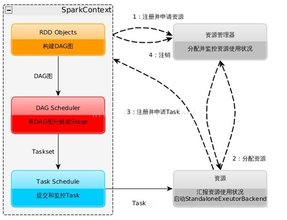

图 15 spark运行流程图

流程如下：

1)    构建Spark Application的运行环境，启动SparkContext

2)    SparkContext向资源管理器（可以是Standalone，Mesos，Yarn）申请运行Executor资源，并启动StandaloneExecutorbackend，

3)    Executor向SparkContext申请Task

4)    SparkContext将应用程序分发给Executor

5)    SparkContext构建成DAG图，将DAG图分解成Stage、将Taskset发送给Task Scheduler，最后由Task Scheduler将Task发送给Executor运行

6)    Task在Executor上运行，运行完释放所有资源

说明：Job=多个stage，Stage=多个同种task, Task分为ShuffleMapTask和ResultTask，Dependency分为ShuffleDependency和NarrowDependency

 

### 3.3.2  作业调度

DAG：Directed Acyclic Graph有向无环图

 

## 3.4  Spark开发篇

### 3.4.1  spark各种语言开发

#### 3.4.1.1 交互终端示例

Spark构建起一个程序支持三种语言：Scala (with SBT), Java (with Maven), and Python. 

表格 21 python/scala/java在spark开发示例

| 示例               | python                                                       | scala                                                        | Java                                                         |
| ------------------ | ------------------------------------------------------------ | ------------------------------------------------------------ | ------------------------------------------------------------ |
| 变量声明           | xx =                                                         | val xx =                                                     | [TYPE] xx =                                                  |
| 初始化SparkContext | from pyspark import SparkConf,  SparkContext  conf = SparkConf().setMaster('local').setAppName('my  app')  sc = SparkContext(conf=conf) | import org.apache.spark.SparkConf  , SparkContext, SparkContext._  val conf =  val sc = new SparkContext(conf) | import org.apache.spark.SparkConf  import org.apache.spark.api.java.JavaSparkConftext  SparkConf conf =  JavaSparkConftext sc = new  JavaSparkConftext(conf); |

 

#### 3.4.1.2 pyspark开发

配置开发环境

[A brief note about Scala](https://enahwe.wordpress.com/category/spark/#Note_about_Scala)
 [Step 1: Installing Eclipse](https://enahwe.wordpress.com/category/spark/#Install_Eclipse)
 [Step 2: Installing Spark](https://enahwe.wordpress.com/category/spark/#Install_Spark)
 [Step 3: Installing PyDev](https://enahwe.wordpress.com/category/spark/#Install_PyDev)
 [Step 4: Configuring PyDev with a Python interpreter](https://enahwe.wordpress.com/category/spark/#Configure_PyDev_with_Python_Interpreter)
 [Step 5: Configuring PyDev with Py4J](https://enahwe.wordpress.com/category/spark/#Configure_PyDev_with_Py4J)
 [Step 6: Configuring PyDev with Spark’s variables](https://enahwe.wordpress.com/category/spark/#Configure_PyDev_with_Spark_variables)
 [Step 7: Creating your Python-Spark project “CountWords”](https://enahwe.wordpress.com/category/spark/#Create_Python-Spark_project_CountWords)
 [Step 8: Executing your Python-Spark application with Eclipse](https://enahwe.wordpress.com/category/spark/#Run_Python-Spark_application_LocalMode)
 [Step 9: Reading a CSV file directly as a Spark DataFrame for processing SQL](https://enahwe.wordpress.com/category/spark/#Read_CSV_file_as_Spark_DataFrame)
 [Step 10: Executing your Python-Spark application on a cluster with Hadoop YARN](https://enahwe.wordpress.com/category/spark/#Execute_application_cluster_mode_YARN)
 [Step 11: Deploying your Python-Spark application in a Production environment](https://enahwe.wordpress.com/category/spark/#Deploy_application_in_Production)

 

windows下配置连接远程spark

不需要配置step 6环境变量。

但需增加**winutils**

 

表格 22 pyspark核心类

| 类名                                                         | 简介                                                         |
| ------------------------------------------------------------ | ------------------------------------------------------------ |
| [pyspark.SparkContext](http://spark.apache.org/docs/2.1.0/api/python/pyspark.html#pyspark.SparkContext) | Main entry point for Spark functionality.                    |
| [pyspark.RDD](http://spark.apache.org/docs/2.1.0/api/python/pyspark.html#pyspark.RDD) | A Resilient Distributed Dataset (RDD),  the basic abstraction in Spark. |
| [pyspark.streaming.StreamingContext](http://spark.apache.org/docs/2.1.0/api/python/pyspark.streaming.html#pyspark.streaming.StreamingContext) | Main entry point for Spark Streaming  functionality.         |
| [pyspark.streaming.DStream](http://spark.apache.org/docs/2.1.0/api/python/pyspark.streaming.html#pyspark.streaming.DStream) | A Discretized Stream (DStream), the basic  abstraction in Spark Streaming. |
| [pyspark.sql.SQLContext](http://spark.apache.org/docs/2.1.0/api/python/pyspark.sql.html#pyspark.sql.SQLContext) | Main entry point for DataFrame and SQL  functionality.       |
| [pyspark.sql.DataFrame](http://spark.apache.org/docs/2.1.0/api/python/pyspark.sql.html#pyspark.sql.DataFrame) | A distributed collection of data grouped  into named columns. |

 

### 3.4.2  RDD

#### 3.4.2.1 概述

RDD：Resilient Distributed Datasets，弹性分布式数据集， 是分布式内存的一个抽象概念，RDD提供了一种高度受限的共享内存模型，即RDD是只读的记录分区的集合，只能通过在其他RDD执行确定的转换操作（如map、join和group by）而创建，然而这些限制使得实现容错的开销很低。

RDD作为数据结构，本质上是一个只读的分区记录集合。

 

目前有两种类型的RDD，如下，

表格 23 RDD类型

| 类型                                 | 简述                                                         | 示例                                                    |
| ------------------------------------ | ------------------------------------------------------------ | ------------------------------------------------------- |
| 并行集合（Parallelized Collections） | 接收一个已经存在的Scala集合，然后进行各种并行计算。          | data = [1, 2, 3, 4, 5]  distData = sc.parallelize(data) |
| Hadoop数据集（Hadoop Datasets）      | 在一个文件的每条记录上运行函数。只要文件系统是HDFS，或者Hadoop支持的任意存储系统（包括本地文件，Amazon S3， Hypertable， HBase等等）即可。 | distFile =  sc.textFile("data.txt")                     |

 

定义：[spark](https://github.com/apache/spark/tree/6c00c069e3c3f5904abd122cea1d56683031cca0)/[core](https://github.com/apache/spark/tree/6c00c069e3c3f5904abd122cea1d56683031cca0/core)/[src](https://github.com/apache/spark/tree/6c00c069e3c3f5904abd122cea1d56683031cca0/core/src)/[main](https://github.com/apache/spark/tree/6c00c069e3c3f5904abd122cea1d56683031cca0/core/src/main)/[scala](https://github.com/apache/spark/tree/6c00c069e3c3f5904abd122cea1d56683031cca0/core/src/main/scala)/[org](https://github.com/apache/spark/tree/6c00c069e3c3f5904abd122cea1d56683031cca0/core/src/main/scala/org)/[apache](https://github.com/apache/spark/tree/6c00c069e3c3f5904abd122cea1d56683031cca0/core/src/main/scala/org/apache)/[spark](https://github.com/apache/spark/tree/6c00c069e3c3f5904abd122cea1d56683031cca0/core/src/main/scala/org/apache/spark)/[rdd](https://github.com/apache/spark/tree/6c00c069e3c3f5904abd122cea1d56683031cca0/core/src/main/scala/org/apache/spark/rdd)/**RDD.scala**


```scala
abstract class RDD[T:ClassTag](
	    @transient private var _sc: SparkContext,
	    @transient private var deps: Seq[Dependency[_]]
	  ) extends Serializable with Logging {
private var dependencies_ : Seq[Dependency[_]] = null
@transient private var partitions_ : Array[Partition] = null
@transient val partitioner: Option[Partitioner] = None 
def compute(split: Partition, context: TaskContext): Iterator[T]
protected def getPreferredLocations(split: Partition): Seq[String] = Nil
}
```

**说明：**

**Internally, each RDD is characterized by five main properties:**

 - A list of partitions
 - A function for computing each split
 - A list of dependencies on other RDDs
 - Optionally, a Partitioner for key-value RDDs (e.g. to say that the RDD is hash-partitioned)
 - Optionally, a list of preferred locations to compute each split on (e.g. block locations foran HDFS file)

五个核心属性，分别是

* 3个属性（分区列表partitions，依赖列表dependencies，分区器partitioner），
* 2个函数（计算函数compute, 优先计算位置getPreferredLocations）。

 

RDD的三个子类：MapPartitionsRDD CoalescedRDD HashPartitioner

#### 3.4.2.2 两种操作类型

两种操作类型：

* 转化transformation：从现有的数据集创建一个新的数据集。如map, filter
* 动作action：map reduce

备注：转换是惰性的，直到动作开始才会执行。

##### 3.4.2.2.1    Transformations

The following table lists some of the common transformations supported by Spark. Refer to the RDD API doc ([Scala](http://spark.apache.org/docs/latest/api/scala/index.html#org.apache.spark.rdd.RDD), [Java](http://spark.apache.org/docs/latest/api/java/index.html?org/apache/spark/api/java/JavaRDD.html), [Python](http://spark.apache.org/docs/latest/api/python/pyspark.html#pyspark.RDD), [R](http://spark.apache.org/docs/latest/api/R/index.html)) and pair RDD functions doc ([Scala](http://spark.apache.org/docs/latest/api/scala/index.html#org.apache.spark.rdd.PairRDDFunctions), [Java](http://spark.apache.org/docs/latest/api/java/index.html?org/apache/spark/api/java/JavaPairRDD.html)) for details.

| Transformation                                        | Meaning                                                      |
| ----------------------------------------------------- | ------------------------------------------------------------ |
| map(func)                                             | Return a new distributed dataset formed  by passing each element of the source through a function func. |
| filter(func)                                          | Return a new dataset formed by selecting  those elements of the source on which funcreturns true. |
| flatMap(func)                                         | Similar to map, but each input item can  be mapped to 0 or more output items (so func should return a Seq  rather than a single item). |
| mapPartitions(func)                                   | Similar to map, but runs separately on  each partition (block) of the RDD, so func must be of type  Iterator<T> => Iterator<U> when running on an RDD of type T. |
| mapPartitionsWithIndex(func)                          | Similar to mapPartitions, but also  provides func with an integer value representing the index of the  partition, so func must be of type (Int, Iterator<T>) =>  Iterator<U> when running on an RDD of type T. |
| sample(withReplacement, fraction, seed)               | Sample a fraction fraction of  the data, with or without replacement, using a given random number generator  seed. |
| union(otherDataset)                                   | Return a new dataset that contains the  union of the elements in the source dataset and the argument. |
| intersection(otherDataset)                            | Return a new RDD that contains the  intersection of elements in the source dataset and the argument. |
| distinct([numTasks]))                                 | Return a new dataset that contains the  distinct elements of the source dataset. |
| groupByKey([numTasks])                                | When called on a dataset of (K, V) pairs,  returns a dataset of (K, Iterable<V>) pairs.    Note: If you are grouping in order to perform an aggregation (such as a  sum or average) over each key,  using reduceByKey or aggregateByKey will yield much  better performance.    Note: By default, the level of parallelism in the output depends on the  number of partitions of the parent RDD. You can pass an  optional numTasks argument to set a different number of tasks. |
| reduceByKey(func, [numTasks])                         | When called on a dataset of (K, V) pairs,  returns a dataset of (K, V) pairs where the values for each key are  aggregated using the given reduce function func, which must be of type  (V,V) => V. Like in groupByKey, the number of reduce tasks is  configurable through an optional second argument. |
| aggregateByKey(zeroValue)(seqOp, combOp,  [numTasks]) | When called on a dataset of (K, V) pairs,  returns a dataset of (K, U) pairs where the values for each key are  aggregated using the given combine functions and a neutral "zero"  value. Allows an aggregated value type that is different than the input value  type, while avoiding unnecessary allocations. Like in groupByKey, the  number of reduce tasks is configurable through an optional second argument. |
| sortByKey([ascending], [numTasks])                    | When called on a dataset of (K, V) pairs  where K implements Ordered, returns a dataset of (K, V) pairs sorted by keys  in ascending or descending order, as specified in the  boolean ascending argument. |
| join(otherDataset, [numTasks])                        | When called on datasets of type (K, V)  and (K, W), returns a dataset of (K, (V, W)) pairs with all pairs of elements  for each key. Outer joins are supported through leftOuterJoin, rightOuterJoin,  and fullOuterJoin. |
| cogroup(otherDataset, [numTasks])                     | When called on datasets of type (K, V)  and (K, W), returns a dataset of (K, (Iterable<V>, Iterable<W>))  tuples. This operation is also called groupWith. |
| cartesian(otherDataset)                               | When called on datasets of types T and U,  returns a dataset of (T, U) pairs (all pairs of elements). |
| pipe(command, [envVars])                              | Pipe each partition of the RDD through a  shell command, e.g. a Perl or bash script. RDD elements are written to the  process's stdin and lines output to its stdout are returned as an RDD of  strings. |
| coalesce(numPartitions)                               | Decrease the number of partitions in the  RDD to numPartitions. Useful for running operations more efficiently after  filtering down a large dataset. |
| repartition(numPartitions)                            | Reshuffle the data in the RDD randomly to  create either more or fewer partitions and balance it across them. This  always shuffles all data over the network. |
| repartitionAndSortWithinPartitions(partitioner)       | Repartition the RDD according to the  given partitioner and, within each resulting partition, sort records by their  keys. This is more efficient than calling repartition and then  sorting within each partition because it can push the sorting down into the  shuffle machinery. |

##### 3.4.2.2.2    Actions

The following table lists some of the common actions supported by Spark. Refer to the RDD API doc ([Scala](http://spark.apache.org/docs/latest/api/scala/index.html#org.apache.spark.rdd.RDD), [Java](http://spark.apache.org/docs/latest/api/java/index.html?org/apache/spark/api/java/JavaRDD.html), [Python](http://spark.apache.org/docs/latest/api/python/pyspark.html#pyspark.RDD), [R](http://spark.apache.org/docs/latest/api/R/index.html))

and pair RDD functions doc ([Scala](http://spark.apache.org/docs/latest/api/scala/index.html#org.apache.spark.rdd.PairRDDFunctions), [Java](http://spark.apache.org/docs/latest/api/java/index.html?org/apache/spark/api/java/JavaPairRDD.html)) for details.

| Action                                       | Meaning                                                      |
| -------------------------------------------- | ------------------------------------------------------------ |
| reduce(func)                                 | Aggregate the elements of the dataset  using a function func (which takes two arguments and returns one).  The function should be commutative and associative so that it can be computed  correctly in parallel. |
| collect()                                    | Return all the elements of the dataset as  an array at the driver program. This is usually useful after a filter or  other operation that returns a sufficiently small subset of the data. |
| count()                                      | Return the number of elements in the  dataset.               |
| first()                                      | Return the first element of the dataset  (similar to take(1)). |
| take(n)                                      | Return an array with the  first n elements of the dataset.   |
| takeSample(  withReplacement,   num, [seed]) | Return an array with a random sample  of num elements of the dataset, with or without replacement,  optionally pre-specifying a random number generator seed. |
| takeOrdered(n, [ordering])                   | Return the first n elements of  the RDD using either their natural order or a custom comparator. |
| saveAsTextFile(path)                         | Write the elements of the dataset as a  text file (or set of text files) in a given directory in the local  filesystem, HDFS or any other Hadoop-supported file system. Spark will call  toString on each element to convert it to a line of text in the file. |
| saveAsSequenceFile(path)    (Java and Scala) | Write the elements of the dataset as a  Hadoop SequenceFile in a given path in the local filesystem, HDFS or any  other Hadoop-supported file system. This is available on RDDs of key-value  pairs that implement Hadoop's Writable interface. In Scala, it is also available  on types that are implicitly convertible to Writable (Spark includes  conversions for basic types like Int, Double, String, etc). |
| saveAsObjectFile(path)    (Java and Scala)   | Write the elements of the dataset in a  simple format using Java serialization, which can then be loaded  usingSparkContext.objectFile(). |
| countByKey()                                 | Only available on RDDs of type (K, V).  Returns a hashmap of (K, Int) pairs with the count of each key. |
| foreach(func)                                | Run a function func on each  element of the dataset. This is usually done for side effects such as  updating an [Accumulator](http://spark.apache.org/docs/latest/rdd-programming-guide.html#accumulators) or  interacting with external storage systems.    Note: modifying variables other than Accumulators outside of  the foreach() may result in undefined behavior. See [Understanding   closures ](http://spark.apache.org/docs/latest/rdd-programming-guide.html#understanding-closures-a-nameclosureslinka)for more details. |

 

#### 3.4.2.3 RDD持久化

当你持久化一个RDD，每一个结点都将把它的计算分块结果保存在内存中，并在对此数据集（或者衍生出的数据集）进行的其它动作中重用。这将使得后续的动作(Actions)变得更加迅速（通常快10倍）。缓存是用Spark构建迭代算法的关键。 使用以下两种方法可以标记要缓存的RDD：

lineLengths.persist() 

lineLengths.cache() 

取消缓存则用：

`lineLengths.unpersist() `

 

### 3.4.3  Spark SQL

 

### 3.4.4  Spark Streaming

Spark Streaming是核心Spark API的一个扩展，它并不会像Storm那样一次一个地处理数据流，而是在处理前按时间间隔预先将其切分为一段一段的批处理作业。Spark针对持续性数据流的抽象称为DStream（DiscretizedStream），一个DStream是一个微批处理（micro-batching）的RDD（弹性分布式数据集）；而RDD则是一种分布式数据集，能够以两种方式并行运作，分别是任意函数和滑动窗口数据的转换。

 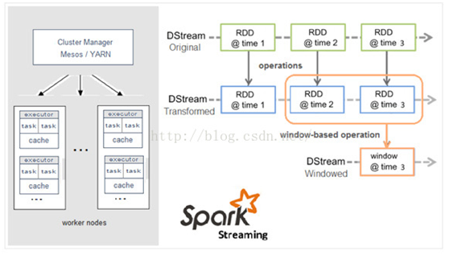

图 16 Spark Streaming架构图

 

### 3.4.5  Spark MLlib

 

### 3.4.6  Spark [GraphX](http://spark.apache.org/docs/latest/graphx-programming-guide.html)

 

## 3.5  本章参考

[1].  spark的前世今生以及其组件介绍和应用 - Spark高速集群计算平台http://f.dataguru.cn/thread-621195-1-1.html

[2].  Spark架构简明分析  http://www.aboutyun.com/thread-20781-1-1.html

[3].  [Spark(一): 基本架构及原理](http://www.cnblogs.com/tgzhu/p/5818374.html) http://www.cnblogs.com/tgzhu/p/5818374.html

[4].  [Spark(二): 内存管理](http://www.cnblogs.com/tgzhu/p/5822370.html)

[5].  [Spark(三): 安装与配置](http://www.cnblogs.com/tgzhu/p/5821421.html)

[6].  Configuring Eclipse with Python and Spark on Hadoop https://enahwe.wordpress.com/category/spark/#Configure_PyDev_with_Spark_variables 

[7].  eclipse配置spark开发环境  http://blog.csdn.net/Luckyzhou_/article/details/71411661 

[8].  使用Eclipse IDE搭建Apache Spark的Java开发环境http://blog.csdn.net/farawayzheng_necas/article/details/54574279

[9].  [Spark Streaming](http://spark.apache.org/docs/latest/streaming-programming-guide.html): processing real-time data streams

[10].[Spark SQL, Datasets, and DataFrames](http://spark.apache.org/docs/latest/sql-programming-guide.html): support for structured data and relational queries

[11].[MLlib](http://spark.apache.org/docs/latest/ml-guide.html): built-in machine learning library

[12].[GraphX](http://spark.apache.org/docs/latest/graphx-programming-guide.html): Spark’s new API for graph processing


# 参考资料

