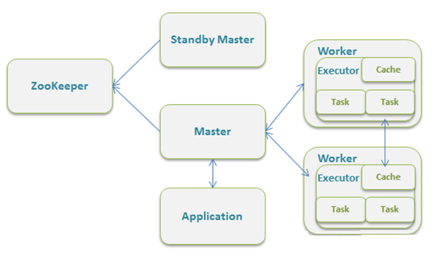
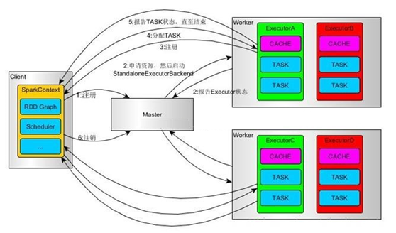
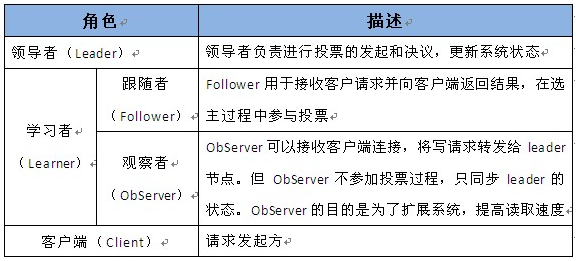
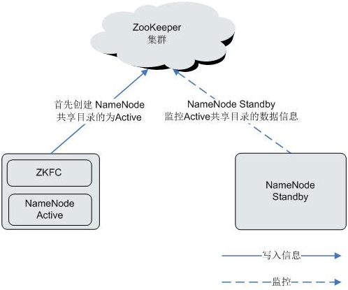
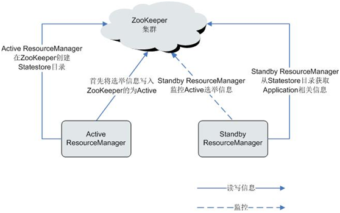
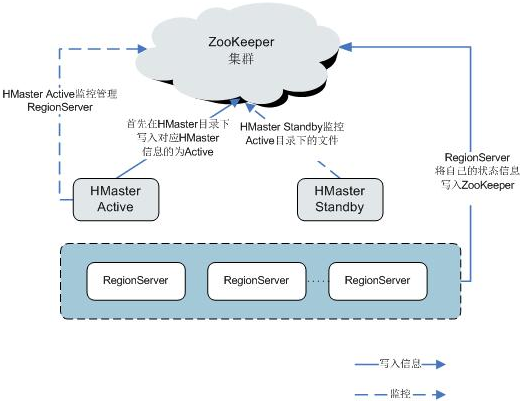
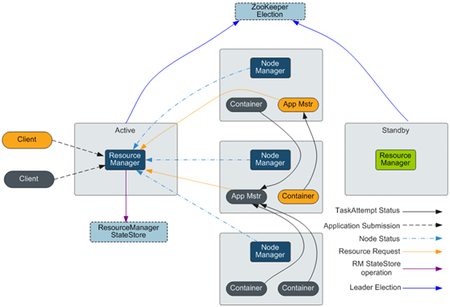
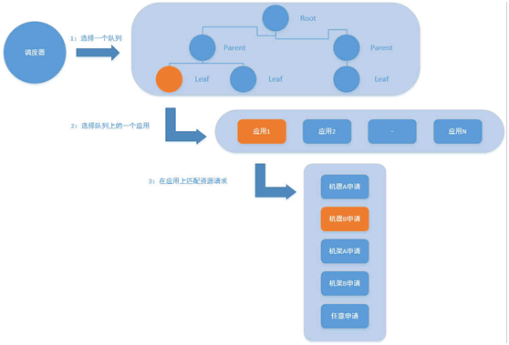
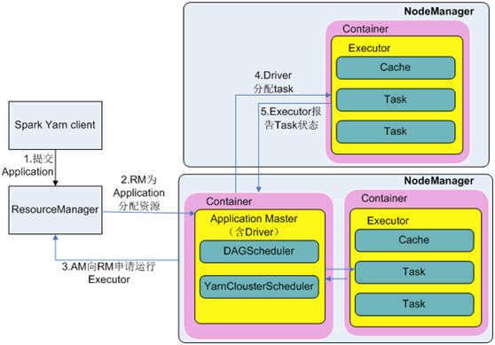
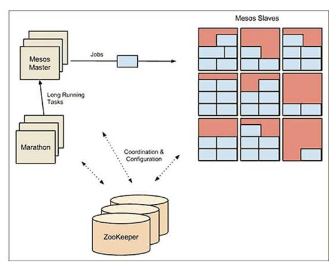

| 序号 | 修改时间  | 修改内容                                     | 修改人 | 审稿人 |
| ---- | --------- | -------------------------------------------- | ------ | ------ |
| 1    | 2017-1-18 | 创建。从《Hadoop体系》迁移集群管理章节成文。 | Keefe  | Keefe  |


---


[TOC]


---

# 1 集群管理简介

大数据集群管理方式分为手工方式（Apache hadoop）和工具方式（Ambari + hdp 和Cloudera Manger + CDH）。

示例：常见于 hadoop为代表的分布式平台。


**集群Cluster**指一组计算机系统构成一个松耦合的多处理器系统，它们之间通过网络实现进程间的通信，实现分布式计算。在客户端看来就像是只有一个服务器。集群可以利用多个计算机进行并行计算从而获得很高的计算速度，也可以用多个计算机做备份，从而使得任何一个机器坏了整个系统还是能正常运行。

**集群技术的分类**

- 高可用集群（High Availability，HA）：高可用的含义是最大限度地可以使用。从集群的名字上可以看出，此类集群实现的功能是保障用户的应用程序持久、不间断地提供服务。
- 负载均衡集群：分为前端负载调度和后端服务两个部分。负载调度部分负责把客户端的请求按照不同的策略分配给后端服务节点，而后端节点是真正提供应用程序服务的部分。与高可用集群不同的是，负载均衡集群中，所有的后端节点都处于活动动态，它们都对外提供服务，分摊系统的工作负载。
- 科学计算集群（High Performance Computing，HPC）：高性能计算集群。这类集群致力于提供单个计算机所不能提供的强大计算能力，包括数值计算和数据处理，并且倾向于追求综合性能。HPC 与超级计算类似，但是又有不同，计算速度是超级计算追求的第一目标。最快的速度、最大的存储、最庞大的体积、最昂贵的价格代表了超级计算的特点。


## 集群相关概念

表格  spark集群相关概念表

| 术语                | 简介                                                         | 备注             |
| ------------------- | ------------------------------------------------------------ | ---------------- |
| Application         | 建立在spark上的用户应用程序，由一个Driver程序和集群上的Executors组成。 |                  |
| Application  jar    | 一个包含用户spark应用程序的jar包。在某些情况下，包含应用程序的依赖包（不包含在运行时会加入的hadoop和spark库） |                  |
| Driver  Program     | 驱动程序，运行main函数并创建SparkContext的进程。             | 作业主进程。     |
| Cluster  manager    | 管理集群资源的外部服务（独立模式管理器、Mesos、YARN等）。目前有三种类型，分别是Standalon、Apache  Mesos和Hadoop Yarn。在standalone模式中即为Master主节点，控制整个集群，监控worker。在YARN模式中为资源管理器。 | 集群管理         |
| Deploy  node        | 决定在何处运行Driver进程的部署模式，分为cluster和client两种模式。 |                  |
| Worker  node        | 集群中运行应用程序的节点                                     |                  |
| Execute             | 应用程序在worker节点上启动的进程，此进程执行任务并保持数据在内存或磁盘中。每个Worker node对应于一个Execute进程，每个Execute进程接收Driver的命令LauchTask，可执行一到多个Task。 | 实际的工作进程。 |
|                     |                                                              |                  |
| Stage               | 阶段，每个Job都会被分解为多个相互依赖的任务集合。            | Taskset          |
| Task                | 被发送到某个Executor的一个工作单元。                         |                  |
| Job                 | 作业，一个Job包含多个RDD及作用于相应RDD上的各种Operation.    |                  |
| RDD                 | 弹性分布式数据集。                                           |                  |
| Operation           | 作用于RDD的各种操作，分为Transformation和Action              |                  |
| Paritition          | 数据分区，一个RDD中的数据可以分成多个不同的分区。            |                  |
| DAG                 | 有向无环图，反映RDD之间的依赖关系。                          |                  |
| Narrow  dependency  | 窄依赖，子RDD依赖父RDD中固定的数据分区。                     |                  |
| Wide  dependency    | 宽依赖，子RDD对父RDD中的所有数据分区都有依赖。               |                  |
| Caching  management | 缓存管理，对RDD的中间计算结果进行缓存管理，以加快整体的处理速度。 |                  |

备注：


表格  各种集群的各类节点的工作性质

| 集群         | 节点                          | 主要工作                             | 资源消耗                   |
| ------------ | ----------------------------- | ------------------------------------ | -------------------------- |
| ZOOKPER      | zookper                       | 多节点竞选LEADER，存储配置信息       | 不明显                     |
| SPARK        | master                        | 调度管理                             | 少量内存                   |
| worker/slave | 任务计算                      | CPU、内存越多越好                    |                            |
| HADOOP  HDFS | namenode                      | 文件元数据存储，访问                 | 内存越大支持的文件数量越多 |
| datanode     | 存储数据                      | 硬盘越大存得越多                     |                            |
| QJM          | 文件元数据日志存储            | 少量存储                             |                            |
| HADOOP  YARN | resourceManager               | 调度管理                             | 少量内存                   |
| NodeManager  | HADOOP  MAPREDUCE计算         | CPU、内存，安装spark后不需要此节点   |                            |
| Mesos        | master                        | 整个集群的调度管理                   | 少量内存                   |
|              | slave                         | 单个节点的资源/任务管理              |                            |
|              | famework:  executor/scheduler | 单个应用程序的管理和资源的二次调度。 |                            |

备注：大部分大数据应用场合，移动数据的开销都会大于计算的开销，所以计算节点和存储节点一般都会混合部署。通常这三类节点spark worker、HDFS Datanode和YARN NodeManager都部署在相同节点上，而且这3类节点在集群中的数量最大，消耗资源最多。


## 集群部署模式

### 部署（运行）模式概述

表格 15 spark部署模式比较表

|            | Local 本地                                                   | Standalone 独立                                              | [Hadoop YARN](http://spark.apache.org/docs/latest/running-on-yarn.html) | Apache Mesos               |
| ---------- | ------------------------------------------------------------ | ------------------------------------------------------------ | ------------------------------------------------------------ | -------------------------- |
| 简介       |                                                              | spark自带的简单集群管理器。                                  | Hadoop  2的资源管理器。                                      | 一个通用的集群普通管理器。 |
| 部署       | vi  spark-env.sh  export  SPARK_MASTER_IP  export  JAVA_HOME | step1:  同local  step2:  conf/slaves上添加节点hostname  step3：将前2步的配置文件发送到所有worker节点  step4:配置无密码登陆 | 类似Standalone 模式。                                        |                            |
| 启动       | ./bin/spark-shell                                            | ./sbin/start-master.sh                                       |                                                              |                            |
| 运行       | ./bin/spark-submit  --master local[x]                        |                                                              |                                                              |                            |
| master     |                                                              | master                                                       | ResourceManager                                              |                            |
| worker     |                                                              | slave文件配置的Worker节点                                    | NoteManager节点                                              |                            |
| 任务调度器 |                                                              | TaskScheduler                                                | YarnClientClusterScheduler、YarnClusterScheduler             |                            |
| WEBUI      |                                                              |                                                              |                                                              |                            |

备注：1. 进入SPARK的安装目录。

2. 集群部署模式为Local以外的三种。集群部署需要在/etc/hosts添加hostname对应的IP，配置JAVA_HOME/SPARK_HOME到~/.profile并激活脚本。


### standby模式

 

图 13 standalone独立集群运行模式

说明：该模式主要的节点有Client节点、Master节点和Worker节点。其中Driver既可以运行在Master节点上中，也可以运行在本地Client端。当用spark-shell交互式工具提交Spark的Job时，Driver在Master节点上运行；当使用spark-submit工具提交Job或者在Eclips、IDEA等开发平台上使用”new SparkConf.setManager(“spark://master:7077”)”方式运行Spark任务时，Driver是运行在本地Client端上的。


 

图 14 standalone独立集群运行模式的工作流程

工作流程如下：

1)    SparkContext连接到Master，向Master注册并申请资源（CPU Core 和Memory）

2)    Master根据SparkContext的资源申请要求和Worker心跳周期内报告的信息决定在哪个Worker上分配资源，然后在该Worker上获取资源，然后启动StandaloneExecutorBackend；

3)    StandaloneExecutorBackend向SparkContext注册；

4)    SparkContext将Applicaiton代码发送给StandaloneExecutorBackend；并且SparkContext解析Applicaiton代码，构建DAG图，并提交给DAG Scheduler分解成Stage（当碰到Action操作时，就会催生Job；每个Job中含有1个或多个Stage，Stage一般在获取外部数据和shuffle之前产生），然后以Stage（或者称为TaskSet）提交给Task Scheduler，Task Scheduler负责将Task分配到相应的Worker，最后提交给StandaloneExecutorBackend执行；

5)    StandaloneExecutorBackend会建立Executor线程池，开始执行Task，并向SparkContext报告，直至Task完成

6)    所有Task完成后，SparkContext向Master注销，释放资源。


### YARN

Spark on YARN模式根据Driver在集群中的位置分为两种模式：一种是YARN-Client模式，另一种是YARN-Cluster（或称为YARN-Standalone模式）。

Yarn-Client模式中，Driver在客户端本地运行，这种模式可以使得Spark Application和客户端进行交互，因为Driver在客户端，所以可以通过webUI访问Driver的状态，默认是http://hadoop1:4040访问，而YARN通过http:// hadoop1:8088访问


## 本章参考

* http://spark.apache.org/docs/latest/running-on-yarn.html


# 2 集群工具篇

集群管理工具是一种软件程序，可帮助你通过图形用户界面或通过访问命令行，管理一组集群。有了这种工具，你可以监控集群中的节点，配置服务，以及管理整个集群服务器。集群管理形式不一，既有参与度很低的活动，比如将作业发送到集群，也有参与度很高的活动，比如负载均衡和可服务性。

* Kubernetes  详见 《[kubernetes用户手册.md](../../软件可复用/tools.工具/kubernetes用户手册.md)》
* Docker Swarm  详见 《[~~Docker用户手册.md~~](./docker用户手册.md)》


表格  集群管理工具列表

| 工具                                             | 简介                                                         | 特性                                                         |
| ------------------------------------------------ | ------------------------------------------------------------ | ------------------------------------------------------------ |
| [Apache ZooKeeper](http://zookeeper.apache.org/) | 分布式、高可用性的协调服务。                                 |                                                              |
| Apache  YARN                                     | YARN是下一代MapReduce，即MR V2。是Hadoop 2的资源管理器。     | 仅用于Hadoop集群。                                           |
| [Apache Mesos](https://mesos.apache.org)         | Apache下的开源分布式资源管理框架。Mesos最初是由加州大学伯克利分校的AMPLab开发的，后在Twitter得到广泛使用。2021.4被Apache移入Attic下。 | 专注于跨分布式网络或框架，有效地隔离资源，并共享应用程序。   |
| Docker Swarm                                     | Docker Swarm让你可以把许多Docker引擎集群成一个虚拟引擎。     | 一种原生解决方案。侧重于借助单一Docker引擎，从整个系统了解集群的情况。 |
| Google   Kubernetes                              | Kubernetes由谷歌开发，它让你可以跨许多不同的主机管理容器化应用程序。它为你提供了部署、扩展和维护应用程序的工具。Kubernetes的开发人员专注于确保Kubernetes易于访问、占用资源少和易于使用。 | 标准的容器管理平台，具有调度、实时升级、自动扩展和不断监控运行状况等功能。 |
| Fleet                                            | 使用etcd和systemd，前者是CoreOS随带的键值对，后者是面向Linux的系统和服务管理器。 | 并不是很擅长处理分布式微服务环境下出现的一些情况，比如服务注册、基于资源使用情况的调度、服务发现，或者是容器之间的联系。 |
| Facebook   Corona                                | Hadoop Corona是facebook开源的下一代MapReduce框架。其基本设计动机和Apache的YARN一致 |                                                              |

说明：1. Mesos和Kubernetes很相似，原因是它们是为了解决在集群环境下运行应用程序的问题开发的。


## 2.1 Apache ZooKeeper (ZK)

### 2.1.1  基本原理

**简介**

ZooKeeper是一个分布式、高可用性的协调服务。主要提供两个功能：

* 帮助系统避免单点故障，建立可靠的应用程序。
* 提供分布式协作服务和维护配置信息。


**结构**

ZooKeeper集群中的节点分为三种角色：Leader、Follower和Observer，其结构和相互关系如[图1](http://localhost:7890/pages/YZH0518G/01/YZH0518G/01/resources/zh-cn_topic_0085563586.html#ZH-CN_TOPIC_0085563586__f85514e7f75a34c4e9e1ad8c4b774f6d2)所示。通常来说，需要在集群中配置奇数个（2N+1）ZooKeeper服务，至少（N+1）个投票才能成功的执行写操作。


图1 ZooKeeper结构


[图1](http://localhost:7890/pages/YZH0518G/01/YZH0518G/01/resources/zh-cn_topic_0085563586.html#ZH-CN_TOPIC_0085563586__f85514e7f75a34c4e9e1ad8c4b774f6d2)中各部分的功能说明如[表1](http://localhost:7890/pages/YZH0518G/01/YZH0518G/01/resources/zh-cn_topic_0085563586.html#ZH-CN_TOPIC_0085563586__t2851557cbd1e4fadbbd7f2e21eb7b070)所示。

表格 5 ZK结构图说明

| 名称     | 描述                                                         |
| -------- | ------------------------------------------------------------ |
| Leader   | 在ZooKeeper集群中只有一个节点作为集群的领导者，由各Follower通过ZooKeeper  Atomic Broadcast(ZAB)协议选举产生，主要负责接收和协调所有写请求，并把写入的信息同步到Follower和Observer。 |
| Follower | Follower的功能有两个：  每个Follower都作为Leader的储备，当Leader故障时重新选举Leader，避免单点故障。   处理读请求，并配合Leader一起进行写请求处理。 |
| Observer | Observer不参与选举和写请求的投票，只负责处理读请求、并向Leader转发写请求，避免系统处理能力浪费。 |
| Client   | ZooKeeper集群的客户端，对ZooKeeper集群进行读写操作。例如HBase可以作为ZooKeeper集群的客户端，利用ZooKeeper集群的仲裁功能，控制其HMaster的“Active”和“Standby”状态。 |

如果集群启用了安全服务，在连接ZooKeeper时需要进行身份认证，认证方式有以下两种：

·     keytab方式：需要从管理员处获取一个“人机”用户，用于登录FusionInsight HD平台并通过认证，并且获取到该用户的keytab文件。

·     票据方式：从管理员处获取一个“人机”用户，用于后续的安全登录，开启Kerberos服务的renewable和forwardable开关并且设置票据刷新周期，开启成功后重启kerberos及相关组件。

 

Zookeeper中的角色主要有以下三类，如下表所示：

[     ](http://stblog.baidu-tech.com/wp-content/uploads/wp-display-data.php?filename=71321447452.jpg&type=image/jpeg&width=573&height=257)**ZooKeeper的工作原理**

Zookeeper的核心是原子广播，这个机制保证了各个Server之间的同步。实现这个机制的协议叫做Zab协议。Zab协议有两种模式，它们 分别是恢复模式（选主）和广播模式（同步）。当服务启动或者在领导者崩溃后，Zab就进入了恢复模式，当领导者被选举出来，且大多数Server完成了和 leader的状态同步以后，恢复模式就结束了。状态同步保证了leader和Server具有相同的系统状态。

为了保证事务的顺序一致性，zookeeper采用了递增的事务id号（zxid）来标识事务。所有的提议（proposal）都在被提出的时候加 上了zxid。实现中zxid是一个64位的数字，它高32位是epoch用来标识leader关系是否改变，每次一个leader被选出来，它都会有一 个新的epoch，标识当前属于那个leader的统治时期。低32位用于递增计数。

每个Server在工作过程中有三种状态：

* LOOKING：当前Server不知道leader是谁，正在搜寻
* LEADING：当前Server即为选举出来的leader
* FOLLOWING：leader已经选举出来，当前Server与之同步


### 2.1.2  与组件的关系

#### ZK和HDFS的配合关系

ZooKeeper与HDFS的关系如[图1](http://localhost:7890/pages/YZH0518G/01/YZH0518G/01/resources/zh-cn_topic_0085563534.html?ft=0&fe=10&hib=2.2.3.23.2&id=ZH-CN_TOPIC_0085563534#ZH-CN_TOPIC_0085563534__f4e063184638a4990ada3505cd92cf4e6)所示。



图 ZooKeeper和HDFS的关系


ZKFC（ZKFailoverController）作为一个ZooKeeper集群的客户端，用来监控NameNode的状态信息。ZKFC进程仅在部署了NameNode的节点中存在。HDFS NameNode的Active和Standby节点均部署有zkfc进程。

1.  HDFS NameNode的ZKFC连接到ZooKeeper，把主机名等信息保存到ZooKeeper中，即“/hadoop-ha”下的znode目录里。先创建znode目录的NameNode节点为主节点，另一个为备节点。HDFS NameNode Standby通过ZooKeeper定时读取NameNode信息。
2.  当主节点进程异常结束时，HDFS NameNode Standby通过ZooKeeper感知“/hadoop-ha”目录下发生了变化，NameNode会进行主备切换。

####  ZK和YARN的配合关系

ZooKeeper与YARN的关系如[图2](http://localhost:7890/pages/YZH0518G/01/YZH0518G/01/resources/zh-cn_topic_0085563534.html?ft=0&fe=10&hib=2.2.3.23.2&id=ZH-CN_TOPIC_0085563534#ZH-CN_TOPIC_0085563534__fde9fecb356f3437c94d75e7544ed0cc3)所示。



图 ZooKeeper与YARN的关系

1. 在系统启动时，ResourceManager会尝试把选举信息写入ZooKeeper，第一个成功把写入ZooKeeper的ResourceManager被选举为Active ResourceManager，另一个为Standby ResourceManager。Standby ResourceManager定时去ZooKeeper监控Active ResourceManager选举信息。
2. Active ResourceManager还会在ZooKeeper中创建Statestore目录，存储Application相关信息。当Active ResourceManager产生故障时，Standby ResourceManager会从Statestore目录获取Application相关信息，恢复数据。

####  ZK和HBase的配合关系

ZooKeeper与HBase的关系如[图3](http://localhost:7890/pages/YZH0518G/01/YZH0518G/01/resources/zh-cn_topic_0085563534.html?ft=0&fe=10&hib=2.2.3.23.2&id=ZH-CN_TOPIC_0085563534#ZH-CN_TOPIC_0085563534__f2b849e3767fb4026b214c0d33566684d)所示。



图 ZooKeeper和HBase的关系


1. HRegionServer以Ephemeral node的方式注册到ZooKeeper中。其中ZooKeeper存储HBase的如下信息：HBase元数据、HMaster地址。
2. HMaster通过ZooKeeper随时感知各个HRegionServer的健康状况，以便进行控制管理。
3. HBase也可以部署多个HMaster，类似HDFS NameNode，当HMaster主节点出现故障时，HMaster备用节点会通过ZooKeeper获取主HMaster存储的整个HBase集群状态信息。即通过ZooKeeper实现避免HBase单点故障问题的问题。

## 2.2  Apache YARN

YARN是Apache Hadoop的子项目，并未从Hadoop分离成独立项目。

### 2.2.1  基本原理

**简介**

YARN是Hadoop2.0中的资源管理系统，是一个通用的资源管理模块，可以为各类应用程序进行资源管理和调度。YARN并不局限于MapReduce，也可以供其他框架使用，比如Tez、Spark、Storm等。YARN类似于资源管理系统Mesos和更早的Torque。

在最早的Hadoop MapReduce计算架构中，进行作业调度时使用FIFO Scheduler。FIFO是指，所有用户的作业都被提交到一个队列中，然后按照作业的优先级，再按照作业提交时间的先后顺序选择将被执行的作业。Hadoop中只有一个作业队列，被提交的作业按照先后顺序在作业队列中排队，新来的作业插入到队尾。一个作业运行完成后，总是从队首取下一个作业运行。这种调度策略的优点是简单、易于实现，同时也减轻了JobTracker的负担。缺点是，它没有考虑到作业的紧迫程度，另外对小作业的运行不利。因此，逐渐衍生出可以分配资源的Superior Scheduler和Capacity Scheduler。


**结构**

YARN模型主要由ResourceManager、ApplicationMaster和NodeManager组成，如下[图1](http://localhost:7890/pages/YZH0518G/01/YZH0518G/01/resources/zh-cn_topic_0085563715.html#ZH-CN_TOPIC_0085563715__f46f9be21d7984478bfc9cd260f5a37cb)所示。



图1 Apache YARN的基本架构


[图1](http://localhost:7890/pages/YZH0518G/01/YZH0518G/01/resources/zh-cn_topic_0085563715.html#ZH-CN_TOPIC_0085563715__f46f9be21d7984478bfc9cd260f5a37cb)中各部分的功能如[表1](http://localhost:7890/pages/YZH0518G/01/YZH0518G/01/resources/zh-cn_topic_0085563715.html#ZH-CN_TOPIC_0085563715__te327bf48366a462cb0e25b874985382b)所示。

表格 6 YARN结构图说明

| 名称                  | 描述                                                         |
| --------------------- | ------------------------------------------------------------ |
| Client                | YARN  Application客户端，用户可以通过客户端向ResourceManager提交任务，查询Application运行状态等。 |
| ResourceManager(RM)   | 负责集群中所有资源的统一管理和分配。接收来自各个节点（NodeManager）的资源汇报信息，并根据收集的资源按照一定的策略分配给各个应用程序。 |
| NodeManager(NM)       | NodeManager（NM）是YARN中每个节点上的代理，管理Hadoop集群中单个计算节点，包括与ResourceManger保持通信，监督Container的生命周期管理，监控每个Container的资源使用（内存、CPU等）情况，追踪节点健康状况，管理日志和不同应用程序用到的附属服务（auxiliary service）。 |
| ApplicationMaster(AM) | 即图中的App Mstr，负责一个Application生命周期内的所有工作。包括：与RM调度器协商以获取资源；将得到的资源进一步分配给内部任务（资源的二次分配）；与NM通信以启动/停止任务；监控所有任务运行状态，并在任务运行失败时重新为任务申请资源以重启任务。 |
| Container             | Container是YARN中的资源抽象，封装了某个节点上的多维度资源，如内存、CPU、磁盘、网络等（目前仅封装内存和CPU），当AM向RM申请资源时，RM为AM返回的资源便是用Container表示。YARN会为每个任务分配一个Container，且该任务只能使用该Container中描述的资源。 |

在YARN中，资源调度器是以层级队列方式组织资源的，这种组织方式有利于资源在不同队列间分配和共享，进而提高集群资源利用率。如下图所示，Superior Scheduler和Capacity Scheduler的核心资源分配模型相同。

调度器会维护队列的信息。用户可以向一个或者多个队列提交应用。每次NM心跳的时候，调度器会根据一定规则选择一个队列，再选择队列上的一个应用，并尝试在这个应用上分配资源。若因参数限制导致分配失败，将选择下一个应用。选择一个应用后，调度器会处理此应用的资源申请。其优先级从高到低依次为：本地资源的申请、同机架的申请，任意机器的申请。



图 YARN资源分配模型


**原理**

新的Hadoop MapReduce框架被命名为MRv2或YARN。YARN主要包括ResourceManager、ApplicationMaster与NodeManager三个部分。

* ResourceManager：RM是一个全局的资源管理器，负责整个系统的资源管理和分配。主要由两个组件构成：调度器（Scheduler）和应用程序管理器（Applications Manager）。
* 调度器根据容量、队列等限制条件（如每个队列分配一定的资源，最多执行一定数量的作业等），将系统中的资源分配给各个正在运行的应用程序。调度器仅根据各个应用程序的资源需求进行资源分配，而资源分配单位用一个抽象概念Container表示。Container是一个动态资源分配单位，将内存、CPU、磁盘、网络等资源封装在一起，从而限定每个任务使用的资源量。此外，该调度器是一个可插拔的组件，用户可根据自己的需要设计新的调度器，YARN提供了多种直接可用的调度器，比如Fair Scheduler和Capacity Scheduler等。
* 应用程序管理器负责管理整个系统中所有应用程序，包括应用程序提交、与调度器协商资源以启动ApplicationMaster、监控ApplicationMaster运行状态并在失败时重新启动等。
* NodeManager：NM是每个节点上的资源和任务管理器，一方面，会定时向RM汇报本节点上的资源使用情况和各个Container的运行状态；另一方面，接收并处理来自AM的Container启动/停止等请求。
* ApplicationMaster：AM负责一个Application生命周期内的所有工作。包括：
* 与RM调度器协商以获取资源。
* 将得到的资源进一步分配给内部的任务(资源的二次分配)。
* 与NM通信以启动/停止任务。
* 监控所有任务运行状态，并在任务运行失败时重新为任务申请资源以重启任务。


**Capacity Scheduler原理**

Capacity Scheduler是一种多用户调度器，它以队列为单位划分资源，为每个队列设定了资源最低保证和使用上限。同时，也为每个用户设定了资源使用上限以防止资源滥用。而当一个队列的资源有剩余时，可暂时将剩余资源共享给其他队列。

Capacity Scheduler支持多个队列，为每个队列配置一定的资源量，并采用FIFO调度策略。为防止同一用户的应用独占队列资源，Capacity Scheduler会对同一用户提交的作业所占资源量进行限定。调度时，首先计算每个队列使用的资源，选择使用资源最少的队列；然后按照作业优先级和提交时间顺序选择，同时考虑用户资源量的限制和内存限制。Capacity Scheduler主要有如下特性：

* 容量保证。管理员可为每个队列设置资源最低保证和资源使用上限，而所有提交到队列的应用程序共享这些资源。
* 灵活性。如果一个队列中的资源有剩余，可以暂时共享给那些需要资源的队列，而一旦该队列有新的应用程序提交，则占用资源的队列将资源释放给该队列。这种资源灵活分配的方式可明显提高资源利用率。
* 多重租赁。支持多用户共享集群和多应用程序同时运行。为防止单个应用程序、用户或者队列独占集群中的资源，管理员可为之增加多重约束（比如单个应用程序同时运行的任务数等）。
* 安全保证。每个队列有严格的ACL列表规定它的访问用户，每个用户可指定哪些用户允许查看自己应用程序的运行状态或者控制应用程序。此外，管理员可指定队列管理员和集群系统管理员。
* 动态更新配置文件。管理员可根据需要动态修改配置参数以实现在线集群管理
* Capacity Scheduler中每个队列可以限制资源使用量。队列间的资源分配以使用量作为排列依据，使得容量小的队列有竞争优势。集群整体吞吐较大，延迟调度机制使得应用可以有机会放弃跨机器或者跨机架的调度，争取本地调度。


### 2.2.2  与组件的关系

#### Spark和YARN的配合关系

Spark的计算调度方式，可以通过YARN的模式实现。Spark共享YARN集群提供丰富的计算资源，将任务分布式的运行起来。Spark on YARN分两种模式：YARN Cluster和YARN Client。

·     YARN Cluster模式

运行框架如[图1](http://localhost:7890/pages/YZH0518G/01/YZH0518G/01/resources/zh-cn_topic_0085563692.html?ft=0&fe=10&hib=2.2.3.22.3&id=ZH-CN_TOPIC_0085563692#ZH-CN_TOPIC_0085563692__f4a05be79f46946c490c811dadbff1ab5)所示。



**图1 Spark on yarn-cluster运行框架**


Spark on yarn-cluster实现流程：

1. 首先由客户端生成Application信息，提交给ResourceManager。
2. ResourceManager为Spark Application分配第一个Container(ApplicationMaster)，并在该Container上启动Driver。
3. ApplicationMaster向ResourceManager申请资源以运行Container。
   ResourceManager分配Container给ApplicationMaster，ApplicationMaster和相关的NodeManager通讯，在获得的Container上启动Executor，Executor启动后，开始向Driver注册并申请Task。
4. Driver分配Task给Executor执行。
5. Executor执行Task并向Driver汇报运行状况。

·     YARN Client模式

运行框架如[图2](http://localhost:7890/pages/YZH0518G/01/YZH0518G/01/resources/zh-cn_topic_0085563692.html?ft=0&fe=10&hib=2.2.3.22.3&id=ZH-CN_TOPIC_0085563692#ZH-CN_TOPIC_0085563692__f262883214bcd497c9b530206e64b0395)所示。


**图2 Spark on yarn-client运行框架**


Spark on yarn-client实现流程：

说明：

在yarn-client模式下，Driver部署在Client端，在Client端启动。yarn-client模式下，不兼容老版本的客户端。推荐使用yarn-cluster模式。

1. 客户端向ResourceManager发送Spark应用提交请求，ResourceManager为其返回应答，该应答中包含多种信息(如ApplicationId、可用资源使用上限和下限等)。Client端将启动ApplicationMaster所需的所有信息打包，提交给ResourceManager上。
2. ResourceManager收到请求后，会为ApplicationMaster寻找合适的节点，并在该节点上启动它。ApplicationMaster是Yarn中的角色，在Spark中进程名字是ExecutorLauncher。
3. 根据每个任务的资源需求，ApplicationMaster可向ResourceManager申请一系列用于运行任务的Container。
4. 当ApplicationMaster（从ResourceManager端）收到新分配的Container列表后，会向对应的NodeManager发送信息以启动Container。

ResourceManager分配Container给ApplicationMaster，ApplicationMaster和相关的NodeManager通讯，在获得的Container上启动Executor，Executor启动后，开始向Driver注册并申请Task。

5. Driver分配Task给Executor执行。Executor执行Task并向Driver汇报运行状况。

#### MapReduce和YARN的配合关系

MapReduce是运行在YARN之上的一个批处理的计算框架。MRv1是Hadoop 1.0中的MapReduce实现，它由编程模型（新旧编程接口）、运行时环境（由JobTracker和TaskTracker组成）和数据处理引擎（MapTask和ReduceTask）三部分组成。该框架在扩展性、容错性（JobTracker单点）和多框架支持（仅支持MapReduce一种计算框架）等方面存在不足。MRv2是Hadoop 2.0中的MapReduce实现，它在源码级重用了MRv1的编程模型和数据处理引擎实现，但运行时环境由YARN的ResourceManager和ApplicationMaster组成。其中ResourceManager是一个全新的资源管理系统，而ApplicationMaster则负责MapReduce作业的数据切分、任务划分、资源申请和任务调度与容错等工作。


## 2.3 Apache Mesos

Apache Mesos是一个通用的集群管理器，起源于 Google 的数据中心资源管理系统Borg。

Mesos诞生于UC Berkeley的一个研究项目，后成为Apache项目。<u>2021.4.7，Apache将Mesos移入Attic下。</u>

Apache Mesos为了简化设计，也是采用了master/slave结构，为了解决master单点故障，将master做得尽可能地轻量级，其上面所有的元数据可以通过各个slave重新注册而进行重构，故很容易通过zookeeper解决该单点故障问题。

Mesos是一个分布式调度系统内核，早于Docker产生，Mesos 作为资源管理器，从DC/OS(数据中心操作系统)的角度提供资源视图。主/从结构工作模式，主节点分配任务，并用从节点上的Executor负责执行，通过Zookeeper给主节点提供服务注册、服务发现功能。通过Framework Marathon 提供容器调度的能力。


 

图  Mesos架构1




图  Mesos主从结构

Apache Mesos由四个组件组成，分别是Mesos-master，mesos-slave，framework和executor。

* Mesos-master：Mesos master，主要负责管理各个framework和slave，并将slave上的资源分配给各个framework
* Mesos-slave：Mesos slave，运行Mesos Agent ,并执行执行分配的任务。负责管理本节点上的各个mesos-task，比如：为各个executor分配资源
* Framework：计算框架，资源的二度调度框架，通过在Agent上部署Executor来执行计划的任务。Mesos支持的Framework 有Hadoop、Spark、MPI、Marathon，通过Marathon Framework完成容器编排的功能。当用户试图添加一种新的计算框架到Mesos中时，需要实现一个Framework scheduler和executor以接入Mesos。
* Executor：执行器，安装到mesos-slave上，用于启动计算框架中的task。

Zookeeper：服务注册、服务发现，同时可以在高可用的环境中选取Master节点。


## 本章参考

* Apache Mesos总体架构 http://dongxicheng.org/apache-mesos/meso-architecture/
* 大数据领域两大最主流集群管理工具Ambari和Cloudera Manger https://www.cnblogs.com/zlslch/p/6118862.html
* 四大集群管理工具大比拼 http://www.sohu.com/a/74693243_183588
* YARN与Mesos比较：http://www.quora.com/How-does-YARN-compare-to-Mesos


# 3  Hadoop集群运维篇

## 3.1 Hadoop集群开放端口

HDFS对外提供了可供访问的http server，开放了很多端口，下面介绍常用的几个端口。

表格 16 haddop集群管理的WEB缺省端口

| 模板  | 端口  | 进程              | 用途                          | 配置参数                                                     |
| ----- | ----- | ----------------- | ----------------------------- | ------------------------------------------------------------ |
| HDFS  | 50070 | NameNode          |                               | core-default.xml   dfs.http.address                          |
|       | 50075 | DataNode          |                               | hdfs-default.xml  dfs.datanode.http.address                  |
|       | 50090 | SecondaryNameNode |                               | mapred-default.xml，指向监听端口9000                         |
| MR    | 50030 | JobTracker        |                               | mapred-default.xml  mpared.job.tracker.http.address          |
|       | 50060 | TaskTracker       |                               | mapred-default.xml  mpared.task.tracker.http.address         |
|       | 8088  |                   | Hadoop  cluster集群管理, YARN | ResourceManager, apllications                                |
|       | 8042  |                   | Hadoop  cluster node          |                                                              |
| Spark | 4040  |                   | Spark集群管理页面             | spark当前运行模式（如pyspark/spark-shell）的管理页面，包括jobs,  stage, storage, environment, executors. |
|       | 8081  | Master            | Spark master                  | 8080+1, 缺省8080，若端口被占用，顺延                         |
|       | 8082  | Worker            | Spark worker                  | 8080+2, 指向master 7077，cluster  6066                       |
| Hive  |       |                   |                               |                                                              |
| HBase | 60010 |                   | HBase查看HBase集群            |                                                              |

备注：1. 可用lsof -i或者 netstat -npl或jps查看端口及对应服务进程。

2. Hadoop守护进程向用户提供的HTTP地址有以下几种：

* /loglevel 日志级别
* /statcks：显示当前所有线程的堆栈情况，主要用于调试
* /metrics：显示所有metrics信息。
* /logs：显示所有日志文件


## 3.2  运营工具

### 3.2.1  一般工具

表格 17 查看JVM的工具

| 工具   | 简介                                                 | 使用                                                         |
| ------ | ---------------------------------------------------- | ------------------------------------------------------------ |
| jps    | Java  Virtual Machine Process Status Tool            | jps [  options ] [ hostid ]                                  |
| jstack | -Stack Trace  可用来监控java进程里的各线程状况。     | jstack [ option ] pid  jstack [ option ] executable core  jstack [ option ] [server-id@]remote-hostname-or-IP |
| jstat  | the Java virtual machine Statistics  Monitoring Tool | jstat [ generalOption \| outputOptions vmid  [interval[s\|ms] [count]] ] |
| fabric | 集群部署工具                                         |                                                              |

备注：

### 3.2.2  Hadoop生态专用工具

表格 18 Hadoop生态专用工具(hadoop/hdfs/hbase)

| 工具            | 参数命令args                                   | 完整命令                                                  | 用途                                    |
| --------------- | ---------------------------------------------- | --------------------------------------------------------- | --------------------------------------- |
| Hadoop fs       | cat  chgrp chown chmod cp du dus mv rm put get | Hadoop fs <args>                                          | 操作HDFS，命令与操作linux命令基本相同。 |
|                 | cat                                            | Hadoop fs -cat URI [URI …]                                | 将路径指定文件的内容输出到stdout。      |
|                 | chgrp                                          | Hadoop  fs -chgrp [-R] GROUP URI [URI …]                  |                                         |
| Hadoop dfsadmin | safemode                                       | Hadoop dfsadmin [-safemode enter \| leave \| get \| wait] | 安全模式开启、关闭、等待。              |
| hdfs  dfs       | ls  mkdir cat find get put                     | hdfs  dfs -[ args]                                        |                                         |
|                 | ls                                             | hdfs  dfs -ls /                                           | 查看hdfs根路径里的文件                  |
|                 | put                                            | hdfs dfs -put README.md /user/denny/                      | 将README.md文件放到/user/denny/目录下   |
| hdfs  namenode  | format                                         | hfds  namenode -format                                    | 格式化namenode，只需一次。              |
|                 |                                                |                                                           |                                         |
|                 |                                                |                                                           |                                         |

备注：


#### 3.2.2.1 Hadoop shell

```shdenny@denny-ubuntu:~/git/oschina/private_script/ubuntu/apt$ hadoop --help
Usage: hadoop [--config confdir] [COMMAND | CLASSNAME]
 CLASSNAME      run the class named CLASSNAME
 or
 where COMMAND is one of:
 fs          run a generic filesystem user client
 version       print the version
 jar <jar>      run a jar file
            note: please use "yarn jar" to launch
               YARN applications, not this command.
 checknative [-a|-h] check native hadoop and compression libraries availability
 distcp <srcurl> <desturl> copy file or directories recursively
 archive -archiveName NAME -p <parent path> <src>* <dest> create a hadoop archive
 classpath      prints the class path needed to get the
 credential      interact with credential providers
            Hadoop jar and the required libraries
 daemonlog      get/set the log level for each daemon
 trace        view and modify Hadoop tracing settings
```

#### 3.2.2.2 HDFS shell

```shdenny@denny-ubuntu:~/git/oschina/private_script/ubuntu/apt$ hdfs --help
Usage: hdfs [--config confdir] [--loglevel loglevel] COMMAND
    where COMMAND is one of:
 dfs         run a filesystem command on the file systems supported in Hadoop.
 classpath      prints the classpath
 namenode -format   format the DFS filesystem
 secondarynamenode  run the DFS secondary namenode
 namenode       run the DFS namenode
 journalnode     run the DFS journalnode
 zkfc         run the ZK Failover Controller daemon
 datanode       run a DFS datanode
 dfsadmin       run a DFS admin client
 haadmin       run a DFS HA admin client
 fsck         run a DFS filesystem checking utility
 balancer       run a cluster balancing utility
 jmxget        get JMX exported values from NameNode or DataNode.
 mover        run a utility to move block replicas across
            storage types
 oiv         apply the offline fsimage viewer to an fsimage
 oiv_legacy      apply the offline fsimage viewer to an legacy fsimage
 oev         apply the offline edits viewer to an edits file
 fetchdt       fetch a delegation token from the NameNode
 getconf       get config values from configuration
 groups        get the groups which users belong to
 snapshotDiff     diff two snapshots of a directory or diff the
            current directory contents with a snapshot
 lsSnapshottableDir  list all snapshottable dirs owned by the current user
                         Use -help to see options
 portmap       run a portmap service
 nfs3         run an NFS version 3 gateway
 cacheadmin      configure the HDFS cache
 crypto        configure HDFS encryption zones
 storagepolicies   list/get/set block storage policies
 version       print the version
```

#### 3.2.2.3 Spark

| 命令      | 简介                                    | 备注                   |
| --------- | --------------------------------------- | ---------------------- |
| beeline   | spark连接JDBC/ODBC引擎                  | 类似Hive Shell/Beeline |
| spark-sql | 有三种形式，分别是RDD、DataFrame和SQL。 |                        |
|           |                                         |                        |


#### 3.2.2.4 HBase shell

表格 19 HBase shell常用命令

| group       | 名称               | 命令表达式 command                                           |
| ----------- | ------------------ | ------------------------------------------------------------ |
| 创建        | 创建表             | create  '表名称', '列名称1','列名称2','列名称N'              |
|             | 添加记录           | put '表名称', '行键', '列名称:', '值'                        |
| 删除        | 删除记录           | delete   '表名' ,'行键' , '列名称'                           |
|             | 清空表             | truncate '表名称'，相当于 disable + drop + create            |
|             | 删除一张表         | 先屏蔽该表，再删除该表。  第一步 disable '表名称' 第二步   drop '表名称' |
|             | 删除列族           | alter，disable，enable                                       |
| 查看        | 查看所有记录       | scan  "表名称"                                               |
|             | 查看记录           | get '表名称', '行键'                                         |
|             | 查看表中的记录总数 | count '表名称'                                               |
|             | 查看当前记录数     | get_counter '表名称'',行键', '列名称:', '值'                 |
|             | 查看表             | list                                                         |
|             | 查看表描述         | describe "表名称"                                            |
| 更新        | 更新记录           | 就是重写一遍进行覆盖                                         |
| 其它        | 其它查询命令       | exists  is_enabled is_disabled get_counter                   |
| general     | 其它系统命令       | status version                                               |
| tools       |                    | assign,  balance_switch, balancer,close_region, compact, flush, major_compact, move,  split, unassign, zk_dump |
| replication |                    | add_peer,  disable_peer,enable_peer, remove_peer, start_replication, stop_replication |

备注：1. Rowkey行键又名行名称，在HBase里rowkey的设计对性能影响很大，需与业务结合。

2. 列族和列column：列族里可以含多个列，同一个列族存储在同一块，用':'取列族里的列，如列族名:列名

* DML（data manipulation language），包括SELECT、UPDATE、INSERT、DELETE，这4条命令是用来对数据库里的数据进行操作的语言。
* DDL（data definition language），主要的命令有CREATE、ALTER、DROP等，DDL主要是用在定义或改变表（TABLE）的结构，数据类型，表之间的链接和约束等初始化工作上，他们大多在建立表时使用。
* DCL（Data Control Language）： 是数据库控制功能。是用来设置或更改数据库用户或角色权限的语句，包括（grant,deny,revoke等）语句。在默认状态下，只有sysadmin,dbcreator,db_owner或db_securityadmin等人员才有权力执行DCL。
* TCL – Transaction Control Language，事务控制语言。

#### 3.2.2.5 Hive shell (CLI)

`hive -u -p`

#### 3.2.2.6 Hive BeeLine (CLI)

`beeline -u [user] -p [pwd] -d []`

使用thrift协议，连接Hive Server 2.


## 3.3  Hadoop优化

表格 20 Hadoop优化列表

| 优化内容      | 最佳实践                                                     |
| ------------- | ------------------------------------------------------------ |
| mapper的数量  | 运行mapper需要多长时间？                                     |
| reducer的数量 | 为了达到最高性能，reducer的数目应该比reducer槽（由内存和tasktracker槽决定）的数目稍微少一点，这将reducer使reducer能够在同一波中完成任务。 |
| combiner      | 作业能否充分利用combiner来减少通过shuffle传输的数据          |
| 中间值的产生  | 对map输出进行压缩能使作业执行更快                            |
| 自定义序列    | 如果正在使用自定义的writable对象或自定义的comparator，则必须确保已实现RawComparator |
| shuffle       | Shuffle可以对一些内存管理的参数进行调整，弥补性能不足。      |


## 本章参考

[1].  [使用Eclipse编译运行MapReduce程序](http://www.powerxing.com/hadoop-build-project-using-eclipse/)

[2].  HBase shell 常用命令 http://blog.csdn.net/scutshuxue/article/details/6988348

[3].  [Standalone Deploy Mode](http://spark.apache.org/docs/latest/spark-standalone.html): simplest way to deploy Spark on a private cluster

[4].  Spark running-on-mesos [Apache Mesos](http://spark.apache.org/docs/latest/running-on-mesos.html)

[5].  Spark running-on-yarn [Hadoop YARN](http://spark.apache.org/docs/latest/running-on-yarn.html)


# 参考资料

**官网**

* Apache ZooKeeper  http://zookeeper.apache.org/
* Apache Mesos  https://mesos.apache.org
* Hadoop YARN   https://hadoop.apache.org/docs/current/hadoop-yarn/hadoop-yarn-site/YARN.html


**参考链接**

