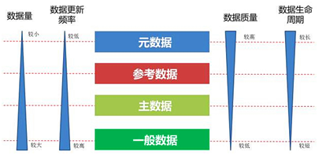
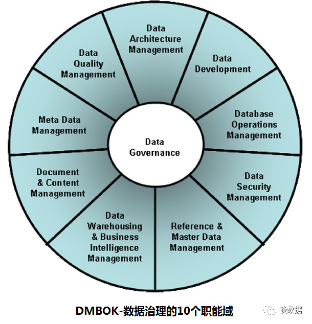
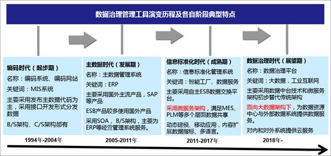
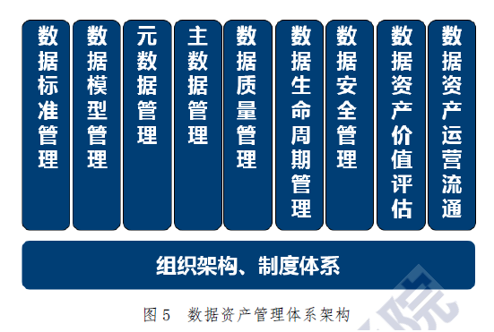
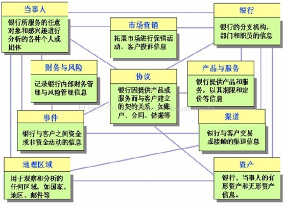
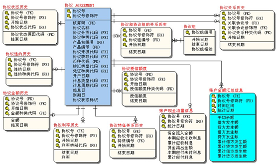
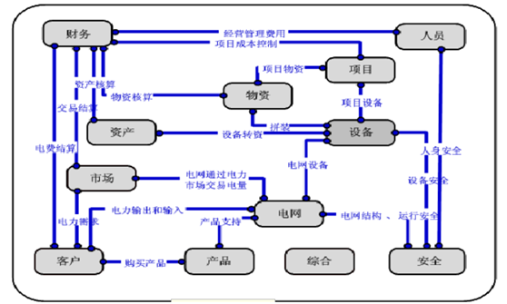
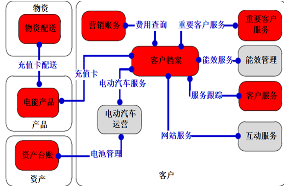
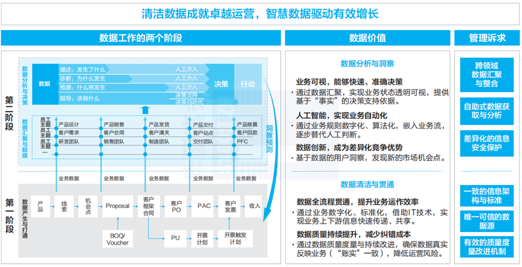
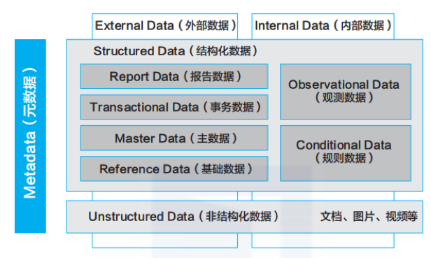

| 序号 | 修改时间  | 修改内容                                           | 修改人 | 审稿人 |
| ---- | --------- | -------------------------------------------------- | ------ | ------ |
| 1    | 2021-12-2 | 创建。迁移《云原生平台》、《BI专题》相关章节成文。 | Keefe  |        |
|      |           |                                                    |        |        |

---

[TOC]

---

#  1 概述

## 数据产品

**数据产品的发展阶段：**  数据库 -> 数据仓库 --> 数据平台 --> 数据中台

数据价值：存储 -> 交易 -> 分析 -> 赋能。

数据产品有二个大的方向，一是按照数据仓库建模理论发展而来的数据湖（数据仓库/数据湖-->湖仓一体），如阿里的Dataphin；二是大数据存储和计算，为AI服务的大数据产品，如阿里的Dataworks。

### 数据

数据一般可分为主数据、元数据、参考数据。

*  **元数据**：描述数据的数据。分技术、业务和操作元数据。用于描述企业数据的所有信息和数据，如结构、关系、安全需求等，除增加数据可读性外，也是后续数据管理的基础。
*  **主数据**：具有高度业务价值，可以在企业内部跨流程跨系统重复使用的数据。具有唯一、准确和权威的数据源。真实的企业业务数据，是企业的关键业务数据。
*  **参考数据**：对数据的解释，针对一些数据范围和取值的数据解释，让人们容易读取相关的数据。

备注：相对交易数据，主数据变换缓慢。

一般而言，企业中这三类数据与其它数据的数据量、质量需求，更新频率、数据生命周期的关系大致如下图：

 

图 4 企业三类数据的关系

数据的分类

*  按数据格式：结构化、非结构化
*  按数据参照程度：主数据、非主数据
*  按数据采集频道：实时、非实时
*  按使用性质：分析性、共享

### 血缘分析

血缘分析，又叫血统分析、血缘关系等，是数据治理的重要功能之一，一般都放在数据地图/数据管理模块下。

血缘分析可解决问题是数据出了错之后能明确知道是哪一步环节的哪个原始数据出问题了。

血缘分析是保证数据融合（聚合）的一个手段，通过血缘分析实现数据融合处理的可追溯。

血缘分析就划分为表结构血缘分析和记录级的血缘分析。

* 表级：一个字段来自于多张表。从目标表的目标字段出发，知道数据库中数据处理的规则，清楚的了解每个字段数据的来源。
* 记录级：从当前记录出发可以按时间查看该记录所有的变更过程。

单击某一个字段，可查看该字段的血缘关系；一个是以此字段为目标的血缘追溯，一个是以此字段为源的血缘追溯。

## 数据管理框架 DMBOK

DMBOK是由数据管理协会（DAMA）编撰的关于数据管理的专业书籍，一本DAMA 数据管理辞典。对于企业数据治理体系的建设有一定的指导性。

*DAMA 是数据管理协会的简称，是一个全球性数据管理和业务专业志愿人士组成的非营利协会，致力于数据管理的研究和实践。*

DMBOK将数据管理分为以下10个职能域：

- 数据控制：在数据管理和使用层面之上进行规划、监督和控制。
- 数据架构管理：定义数据资产管理蓝图。
- 数据开发：数据的分析、设计、实施、测试、部署、维护等工作。
- 数据操作管理：提供从数据获取到清除的技术支持。
- 数据安全管理：确保隐私、保密性和适当的访问权限等。
- 数据质量管理：定义、监测和提高数据质量。
- 参考数据和主数据管理：管理数据的黄金版本和副本。
- 数据仓库和商务智能管理：实现报告和分析。
- 文件和内容管理：管理数据库以外的数据
- 元数据管理：元数据的整合、控制以及提供元数据。

## 本章参考

* 一组图详解元数据、主数据与参考数据  [www.cbdio.com/BigData/2016-02/16/content_4617126.htm](http://www.cbdio.com/BigData/2016-02/16/content_4617126.htm)
* 数据治理的血缘分析 https://blog.csdn.net/ywm041004/article/details/84261811

# 2 数据治理

传统的IT治理是指，组织在信息化过程中需要建立的一种宏观的决策、协调及控制机制。其作用是明确IT决策责任、建立协调沟通机制，有效利用各种资源，控制信息化风险，促进IT与业务的融合，使IT为企业创造价值。建立自适应的信息安全能力，是新型IT治理的重要目标之一。目标是实现共赢。

在整个IT治理架构中，数据治理较为特殊，有首席数据官直接负责，横跨数据管理和风险管理两个闭环，从数据的生产、使用、挖掘和管理四个角度，为组织决策提供重要信息。

## 2.0 简介

说明：

* 编码时代**(起步期，1994-2004年)**：提供编码系统，发布主数据。
* 主数据时代**(发展期，2005年-2011年)**：ERP。多用SOA、B/S架构。
* 信息标准化时代**(成熟期，2012-2018年)**：ESB数据交换平台，多用微服务架构。
* 数据治理时代（展望期，2018-）：数据中台，采用面向大数据架构。

狭义上讲，数据治理是指对数据质量的管理、专注在数据本身。广义上讲，数据治理是对数据的全生命周期进行管理，包含数据采集、清洗、转换等传统数据集成和存储环节的工作、同时还包含数据资产目录、数据标准、质量、安全、数据开发、数据价值、数据服务与应用等，整个数据生命期而开展开的业务、技术和管理活动都属于数据治理范畴。有的专家干脆把广义的数据治理称为**数据资产管理**。

数据治理专注于将数据作为企事业单位数据资产进行应用和管理的一套管理机制，能够消除数据的不一致性，建立规范的数据应用标准，提高数据质量，实现数据内外部共享，并能够将数据作为组织的宝贵资产应用于业务、管理、战略决策中，发挥数据资产价值。

 

图 3 数据资产管理体系结构

说明：数据资产管理可分为以下产品，

* 数据标准：数据标准化就是研究、制定和推广应用统一的数据分类分级、记录格式及转换、编码等技术标准的过程。

* 数据模型：数据模型对上是承载数据业务需求的元数据，对下是数据标准管理的内容，同时，是数据质量指标和规则定义的起点，是主数据和参照数据设计的根本，是数据仓库和BI的核心，也是数据安全管控的对象。各个行业有自己的模型标准。比如金融业的Teradata FS-LDM和IBM FSDM。

* 元数据管理：元数据管理统一管控分布在企业各个角落的数据资源，企业涉及的业务元数据、技术元数据、管理元数据都是其管理的范畴。

* 主数据管理：主数据是企业最基础、最核心的数据，企业的一切业务基本都是基于主数据来开展的，是企业最重要的数据资产。

* 数据质量管理：在不同的数据治理项目中有时会被单独使用，有时配合元数据使用、有时又与主数据搭档。

* 数据生命周期管理：

* 数据安全：数据安全规则会随着不同行业、不同企业的需求不同而变换莫测，数据安全一般企业作为数据战略的重要组成。

**数据中台**： 以上数据产品组合在一起，就成了完整的数据中台。

**数据服务平台**：数据服务平台是数据治理的能力输出平台，持续的数据服务能力输出，披荆斩棘，为前端的数据分析和数据应用提供支撑。

## 2.1 数据模型

数据模型对上是承载数据业务需求的元数据，对下是数据标准管理的内容，同时，是数据质量指标和规则定义的起点，是主数据和参照数据设计的根本，是数据仓库和BI的核心，也是数据安全管控的对象。数据模型管理平台从功能上，主要包括：可视化建模、模型版本管理、数据模型管理、数据模型查询、数据模型浏览、数据模型分析等。

数据模型Data Model的过程：从概念性数据模型CDM -》 逻辑数据模型LDM -》 物理数据模型PDM。

数据主题域由业务信息按照其业务耦合程度聚合而成的高阶数据主题群，一般与业务域有着紧密的对应关系。例如：财务、物资、生产等。

数据主题域通过数据主题域视图和数据主题域关系视图来体现。

### 金融业

#### Teradata FS-LDM

　Teradata天睿公司（纽交所代码：TDC），是美国前十大上市软件公司之一。经过逾30 年的发展，Teradata天睿公司已经成为全球最大的专注于大数据分析、数据仓库和整合营销管理解决方案的供应商。 其提出一种先进的FS-LDM模型(Financial Services Logcial Data Model) --企业级数据模型，包括金融机构业务数据，囊括了银行约80%的业务数据，并把预定义的业务模板连接到核心银行业务数据和数据仓库中。

　Teradata FS-LDM是一个成熟产品，在一个集成的模型内支持保险、银行及证券，包含十大主题：当事人、产品、协议、事件、资产、财务、机构（即银行）、地域、营销、渠道。

 

图 5 Teradata FS-LDM十大主题划分

**BANK-LDM主题域模型设计采用分类设计的策略:**
 1、重点设计主题（客户、协议、事件、资产、财务）
 　特点：是模型中的重点主题，且在源系统中有丰富的数据来源和参照。
 　目标：尽量保持完整性、丰富性。
 　策略：按照FS-LDM的框架进行设计，同时补充银行的个性数据元素。
 2、自主设计主题（~~申请~~、营销活动、渠道、机构、产品）
 　特点：非核心主题，基本没有或者仅有非常少的数据来源和参照。
 　目标：保证模型架构的完整性和扩充性。
 　策略：按照FS-LDM进行设计，将来根据实际情况调整。
 3、简化设计主题（地域）
 　特点：模型的重要参考主题，一般情况下源系统有数据，但定义和使用方法与FS-LDM不匹配。
 　目标：暂不进行唯一地址识别，但要完整保留此类信息。
 　策略：暂作为客户等的属性信息进行设计。

**逻辑数据模型LDM，以协议主题实例：**

 

#### IBM FSDM

 

图 6 IBM FSDM

说明：FSLDM和FSDM相同主题有6个，分别是关系人（客户、当事人），合约（协议），产品，地点（地域），事件，资源项目（资产）。

FSDM独有主题有条件、分类和业务方向。

### 电信业

 

图 7 电信业的一级主题域（12种）

说明：十二大主题域分别是人员、客户、财务、资产、产品、市场、物资、项目、设备、电网、安全和综合。

 

图 8 电信业的二级主题域关系视图（部分）

## 2.2 元数据管理

元数据管理统一管控分布在企业各个角落的数据资源，企业涉及的业务元数据、技术元数据、管理元数据都是其管理的范畴，按照科学、有效的机制对元数据进行管理，并面向开发人员、最终用户提供元数据服务，以满足用户的业务需求，对企业业务系统和数据分析平台的开发、维护过程提供支持。元数据管理是企业数据治理的基础。

元数据管理平台从功能上，主要包括：元数据采集服务，应用开发支持服务，元数据访问服务、元数据管理服务和元数据分析服务。

元数据采集服务。元数据采集服务提供各类适配器满足以上各类元数据的采集，并将元数据整合处理后统一存储于中央元数据仓库，实现元数据的统一管理。这个过程中，数据采集适配器十分重要，元数据采集要能够适配各种DB、各类ETL、各类DW和Report产品，同时还需要适配各类结构化或半结构化数据源。

元数据管理服务。市场上主流的元数据管理产品，基本都包括元数据查询、元模型管理、元数据维护、元数据版本管理、元数据对比分析、元数据适配器、元数据同步管理、元数据生命周期管理等功能。

元数据访问服务。元数据访问服务是元数据管理软件提供的元数据访问的接口服务，一般支持REST或Webservice等接口协议。通过元数据访问服务支持企业元数据的共享，是企业数据治理的基础。

元数据分析服务：

* 血缘分析：告诉你数据来自哪里，都经过了哪些加工。

* 影响分析：告诉你数据都去了哪里，经过了哪些加工。

* 冷热度分析：告诉你哪些数据是企业常用数据，哪些数据属于僵死数据。

* 关联度分析：告诉你数据和其他数据的关系以及它们的关系是怎样建立的。
* 数据资产地图：告诉你有哪些数据，在哪里可以找到这些数据，能用这些数据干什么。

## 2.3 主数据管理

## 数据质量管理

## 示例：华为的数据治理

华为从 2007 年开始启动数据治理，历经两个阶段的持续变革，系统地建立了华为数据管理体系。

**第一阶段：2007 ～ 2016 年**

在这一阶段，华为设立数据管理专业组织，建立数据管理框架，发布数据管理政策，任命数据 Owner，通过统一信息架构与标准、唯一可信的数据源、有效的数据质量度量改进机制，实现了以下目标。

1.持续提升数据质量，减少纠错成本：通过数据质量度量与持续改进，确保数据真实反映业务，降低运营风险。

2.数据全流程贯通，提升业务运作效率：通过业务数字化、标准化，借助 IT 技术，实现业务上下游信息快速传递、共享。

**第二阶段：2017 年至今**

在这一阶段，华为建设数据底座，汇聚企业全域数据并对数据进行联接，通过数据服务、数据地图、数据安全防护与隐私保护，实现了数据随需共享、敏捷自助、安全透明的目标，支撑着华为数字化转型，实现了如下的数据价值。

1.业务可视，能够快速、准确决策：通过数据汇聚，实现业务状态透明可视，提供基于“事实”的决策支持依据。

2.人工智能，实现业务自动化：通过业务规则数字化、算法化，嵌入业务流，逐步替代人工判断。

3.数据创新，成为差异化竞争优势：基于数据的用户洞察， 发现新的市场机会点。

图 华为数据治理的发展历程

华为根据数据特性及治理方法的不同对数据进行了分类定义：内部数据和外部数据、结构化数据和非结构化数据、元数据。其中，结构化数据又进一步划分为基础数据、主数据、事务数据、报告数据、观测数据和规则数据。华为数据分类管理框架如下图所示。

华为的数据架构由四部分组成，分别是数据资产目录（五层）、数据模型（五层）、数据标准和数据分布。

*  数据资产目录：主题域分组、主题域、业务对象、属性组、属性
*  数据模型：ESAM(Enterprise Subject Area Model)、EBIM(Enterprise Business Information Model)、BALDM(Business Area)、APP LDM、APP PDM
*  数据标准：业务定义规范，如接口、模型设计/开发规范
*  数据分布： 数据地图dmap，可以很方便在业务元数据和技术元数据之间转换。
*  元数据管理：gData

**十一大主题域分组**

| 主题域分组  | 简介                      | 详述           |
| ----------- | ------------------------- | -------------- |
| IPD         | 集成产品开发。            |                |
| MTL         | Market  to Lead           | 市场到机会点。 |
| LTC         | Lead  to Cash             | 机会点到现金   |
| ITR         | Issue To Resolution       | 问题到解决方案 |
| DS          | Develop  Stragety         |                |
| CRM         | 客户关系管理              |                |
| SD          | Service  Deliver.服务交付 |                |
| Supply      | 物流供应                  |                |
| Manufacture | 制造                      |                |
| Procurment  | 采购                      |                |
| Manage  HR  | 管理HR                    |                |

备注：这十一大主题域之外，还包括一些跨领域的数据。如渠道销售、零售Retail、管理（包括财经、BT&IT、Business Support、投资）等等。另外华为新业务并还没有完全纳入新的主题域里。

表格 3 华为的数据资产目录

| 主题域分组  | 主题                                                 | 业务对象 |
| ----------- | ---------------------------------------------------- | -------- |
| IPD         | offering、                                           |          |
|             | 重量级团队、                                         |          |
|             | 需求、                                               |          |
|             | 研发项目                                             |          |
| MTL         | 细分市场、营销、市场洞察、销售                       |          |
| LTC         | 线索、机会点、客户合同、销售战略、解决方案           |          |
| ITR         | 技术服务请求、备件服务                               |          |
| DS          | SP  BP                                               |          |
| CRM         | 客户信息、政策、满意度                               |          |
| SD          | 交付资源、交付信息资产、交付项目                     |          |
| Supply      | 运输、计划、销售定单、库存、供应解决方案             |          |
| Manufacture | 制造资源、质量、工程能力、新产品导入、仓储           |          |
| Procurment  | 供应商、采购合同、采购PO、采购分类                   |          |
| Manage  HR  | 组织、人员、人与组织关系、组织应用、人员应用、侯选人 |          |

说明：

SCOR：Supply Chain Operation Reference，包括五方面，分别是Source/make/deliver/plan/Return。

## 本章参考

*  数据治理平台工具前世今生 https://blog.csdn.net/zhaodedong/article/details/101730629
* 数据治理系列 石秀峰谈数据  http://mp.weixin.qq.com/s?__biz=MzI1NzYwNTMzNw==&mid=2247484264&idx=1&sn=373ba796e62ecf7ced35924843fb3b87&chksm=ea15a8dedd6221c8613ba4e50b9ff54b04fe55f3e6bc205dc9b102b2b7d7af3b3b9276e53488&scene=21#wechat_redirect
* 面向数据中台的数据治理七把利剑  https://www.afenxi.com/94030.html
* 24张架构图把数据治理核心内容讲透了 www.uml.org.cn/bigdata/202107211.asp
* 华为数据之道：华为数据治理及数据分类管理框架和经验  https://www.infoq.cn/article/6JEOk7gkzYF4jk1OHNbv
* TeraData金融数据模型 https://www.cnblogs.com/oracle-dba/p/3903442.html
*  [Teradata在中国银行业的应用简介 - 豆丁网 (docin.com)](https://www.docin.com/p-1029454681.html)

# 3 数据中台

中台概念，2015年诞生于阿里的数据中台，2019年爆火。

数据中台是技术的概念，更是企业管理的概念。

数据中台居于前台和后台之间，是企业级的数据共享、能力复用平台，是数字化转型的基础和中枢系统。将企业全域海量、 多源、异构的数据整合资产化，为业务前台提供数据资源和能力的支撑，以实现数据驱动的精细化运营。

数据中台不是简单的一套软件系统或者一个标准化产品，更多的是一种强调资源整合、集中配置、能力沉淀、分步执行的 运作机制，是一系列数据组件或模块的集合，指向企业的业务场景。企业基于自身的信息化建设基础和业务特点对数据中 台的能力进行定义，基于能力定义选择和利用数据组件搭建中台。各类数据技术是构建数据中台的基础，能够高效对数据 进行统一收集、处理、储存、计算、分析和可视化呈现，使数据最终与业务链条结合，真正转化为企业核心资产。

而从广义上，数据中台更是一种企业组织管理模式和理念，集公司战略决心、组织架构、技术架构于一体，企业从战略上 构建统一的协同基座即中台化组织，以协调和支持各业务部门，用技术拓展商业边界，为新业务、新部门提供成长空间。

~~数据处理过程包括从数据集成（数据湖），到数据处理，再到数据消费。~~

数据中台包含数仓体系、数据服务集等，是一套数据运营机制，加速从数据到数据资产的价值转变，决策模式由“经验驱
动”向“分析驱动”转变。目前数据中台的形式主要有三种：数据湖、CDP、DMP。

数据中台产品的组成包括数据集成、数据地图、主数据管理等。

表格 数据中台产品详细比较

| 产品                                                         | 功能                                                         |  优势             |  劣势            |
| ------------------------------------------------------------ | ------------------------------------------------------------ | -------------------- | ------------------- |
| [华为ROMA](https://e.huawei.com/cn/products/industry-enablement/hybrid-integration-platform-roma) | （华为自己吃的狗粮）ROMA源自华为10年+的数字化实践，是华为智能体概念中的应用使能。 ROMA是汇聚New ICT能力，支撑行业客户“Applications /Business /Clouds /Devices” 全面集成的数据和技术融合平台。 应用与数据集成平台ROMA Connect源自华为10年+数字化转型实践。聚焦应用和数据联接，提供消息、数据、API、设备集成能力，帮助企业快速、简单的打通并管理Legacy系统与CloudNative应用，联接云上云下，消除数字鸿沟，构建业务敏捷性，驱动数字化转型。 | 覆盖非云原生企业     |                     |
| 华为DAYU大禹                                                 | 华为智能体概念中的数据使能。华为云智能数据湖运营平台 DAYU于 2020/12/15更名为 “数据湖治理中心DGC”。 目标：为大型政企客户量身定制感知业务、跨越孤立系统的数据资产智能管理解决方案，实现全域数据入湖，帮助政企客户从多角度、多层次、多粒度挖掘数据价值，实现数据驱动的数字化转型。 简单讲，从方法论入手，管理体系+技术平台双轮驱动，再通过应用场景实现数据价值释放的闭环。 | 华为数据中台         |                     |
| 阿里Dataphin                                                 | 智能数据构建与管理平台。面向各行各业大数据建设、管理及应用诉求，一站式提供从数据接入到数据消费全链路的智能数据构建与管理的大数据能力，包括产品、技术和方法论等，助力打造标准统一、融会贯通、资产化、服务化、闭环自优化的智能数据体系，以驱动创新。 通过输出阿里数据中台实战沉淀的大数据建设体系OneData+OneID +OneService(产品+技术+方法论)， 一站式提供集数据引入、规范定义、数据建模、数据研发、数据萃取的全链路智能数据构建及管理服务。 | 全链路数据构建和管理 | 不具备 机器学习能力 |
| 阿里Dataworks                                                | （阿里巴巴自己吃的狗粮）DataWorks基于MaxCompute/EMR/MC-Hologres等大数据计算引擎，为客户提供专业高效、安全可靠的一站式大数据开发与治理平台，自带阿里巴巴数据中台与数据治理最佳实践，赋能各行业数字化转型。每天阿里巴巴集团内部有数万名数据/算法工程师正在使用DataWorks，承担集团99%数据业务构建。 | 大数据的机器学习平台 |                     |

表格 数据中台框架整体对比

|        | 阿里巴巴                      | 华为       |
| ------ | ----------------------------- | ---------- |
| 产品   | Dataphin、Dataworks、Quick BI | ROMA、DAYU |
| 技术   |                               |            |
| 方法论 | OneID + OneModel + OneService | 数据治理   |

## 中台方法论

## 中台技术

相关文档：《[大数据开发.md](./大数据开发.md)》、《[数据库技术](./数据库技术.md)》、《[数据库架构](./数据库架构.md)》、《[BI专题.md](../BI专题.md)》

|            | 功能                                                         | 开源工具                                        | 商业工具                                      |
| ---------- | ------------------------------------------------------------ | ----------------------------------------------- | --------------------------------------------- |
| 数据集成   | 从日志或移动端采集数据                                       | Flume  Logstash  Scribe  Fiddler                |                                               |
|            | 传统ETL                                                      | Kettle                                          | Informatica、Datastage、微软DTS、Navicat、OWB |
|            | 数据转换                                                     | Sqoop OGG                                       |                                               |
|            | 异构数据源离线同步                                           | 阿里DataX                                       |                                               |
|            | 异构数据源实时同步                                           | Kafka                                           |                                               |
| 数据治理   | 对数据的全生命周期进行管理。 详见上方 数据治理章节        |                                                 | 华为ROMA/DAYU，阿里Dataphin/Dataworks         |
| 数据可视化 | 详见 《[数据可视化.md](../数据可视化.md)》、《[数据可视化工具.md](../../软件可复用/tools.工具/数据可视化工具.md)》 | Superset、Redash                                | PowerBI、TableAU、帆软BI、永洪BI、QuickBI     |
| 数据存储   | 详见 《[大数据开发.md](./大数据开发.md)》、《[数据库技术](./数据库技术.md)》 | Hive、HBase、MongoDB、Redis、RDS（MySQL/PG）... | Oracle                                        |
| 数据分析   | 详见 《[数据分析及案例.md](../软件工程/产品岗/数据分析及案例.md)》 |                                                 |                                               |

## 中台产品

表格 阿里dataphin和datawork功能比较

| 产品               | dataphin                                       | datawork                             |
| ------------------ | ---------------------------------------------- | ------------------------------------ |
| 简介               | 大数据仓库体系的生态化环境。推出时间在2018年。 | 大数据开发平台，早在2009年就有使用。 |
| 数据模型设计       | 有                                             | 没有                                 |
| 数据指标管理       | 有                                             | 没有                                 |
| 数据萃取、数据标签 | 有                                             | 没有                                 |
| 数据资产治理       | 有                                             | 没有                                 |
| SQL编辑            | 有                                             | 有                                   |
| 图形化调试平台     | 有                                             | 有                                   |
| 数据地图           | 有                                             | 有                                   |
| 数据质量管理       | 有                                             | 有                                   |
| 机器学习           | 没有                                           | 有                                   |

### 华为DGC

表格 华为DGC组件各版本功能比较

| **DGC组件**            | **初级版**                         | **基础版**                         | **高级版**                         | **专业版**                         | **企业版**                         |
| ---------------------- | ---------------------------------- | ---------------------------------- | ---------------------------------- | ---------------------------------- | ---------------------------------- |
| 数据集成之批量数据迁移 | √                                  | √                                  | √                                  | √                                  | √                                  |
| 数据集成之实时数据接入 | 支持，需另外购买实时数据接入增量包 | 支持，需另外购买实时数据接入增量包 | 支持，需另外购买实时数据接入增量包 | 支持，需另外购买实时数据接入增量包 | 支持，需另外购买实时数据接入增量包 |
| 管理中心               | √                                  | √                                  | √                                  | √                                  | √                                  |
| 规范设计               | x                                  | √                                  | √                                  | √                                  | √                                  |
| 数据开发               | √                                  | √                                  | √                                  | √                                  | √                                  |
| 数据质量               | x                                  | √                                  | √                                  | √                                  | √                                  |
| 数据资产               | x                                  | √                                  | √                                  | √                                  | √                                  |
| 数据服务               | x                                  | √                                  | √                                  | √                                  | √                                  |
| 数据安全               | √                                  | √                                  | √                                  | √                                  | √                                  |
| 基础包价格             |                                    | 18000元/月 180000元/年             | 360000元/年                        | 600000元/年                        |                                    |
| 增量包价格             |                                    |                                    |                                    |                                    |                                    |

### 阿里云上数据中台

阿里数据中台官网  https://dp.alibaba.com/

阿里云上数据中台内核能力框架体系：产品+技术+方法论。

产品：dataphin、QuickBI

技术：划分领域，每领域有不同的技术要求，使用不同的工具集合。

方法论：3One理论，OneID + OneModel + OneService

表格 阿里数据产品 dataphin/datawork比较

| 产品               | dataphin                                       | datawork                             |
| ------------------ | ---------------------------------------------- | ------------------------------------ |
| 简介               | 大数据仓库体系的生态化环境。推出时间在2018年。 | 大数据开发平台，早在2009年就有使用。 |
| 数据模型设计       | 有                                             | 没有                                 |
| 数据指标管理       | 有                                             | 没有                                 |
| 数据萃取、数据标签 | 有                                             | 没有                                 |
| 数据资产治理       | 有                                             | 没有                                 |
| SQL编辑            | 有                                             | 有                                   |
| 图形化调试平台     | 有                                             | 有                                   |
| 数据地图           | 有                                             | 有                                   |
| 数据质量管理       | 有                                             | 有                                   |
| 机器学习           | 没有                                           | 有                                   |

> 说明：Dataworks，一站式大数据开发治理平台，阿里巴巴十二年数据中台与数据治理最佳实践。是一个基于任务形式的数据调度平台，是一个工具，用于处理数据ETL的；
> Dataphin，是提供数据服务的，规范数据仓库建设，定义dwd层数据，定义原子，派生指标，形成主题式dws层数据，对外服务；
> 简单来说，一个是数据计算层的ETL产品，一个是数据服务层的。

#### 阿里Dataphin

表格 阿里Dataphin功能列表

| **功能**           | **描述**                                                     |
| ------------------ | ------------------------------------------------------------ |
| **平台管理**       | 平台管理是Dataphin的基础功能，包含账号管理、系统设置和智能引擎。该功能帮助您系统地了解和熟悉整个产品，快速开始工作，并进行必要的系统管理与控制，保障各模块正常运转。 |
| **全局设计**       | 基于业务全局，从顶层自下规划设计业务数据总线，包括划分命名空间、定义主题域及相关名词、划分管理单元（即项目）和定义数据源及计算引擎源。 |
| **数据引入**       | 数据引入基于全局设计定义的项目空间与物理数据源，将各业务系统、各类型的数据抽取加载至目标数据库。这个过程可以实现各类业务数据的同步与集成，助您完成基础数据中心建设，为后续进一步加工数据奠定基础。 |
| **规范定义**       | 基于全局设计定义的业务总线、数据引入构建的基础数据中心，根据业务数据需求，结构化地定义数据元素（例如维度、统计指标），保障数据无二义性地标准化、规范化生产。 |
| **建模研发**       | 基于规范定义的数据元素，设计与构建可视化的数据模型。数据模型提交发布后，系统智能自动化地生成代码与调度任务，完成公共数据中心的全托管建设。 |
| **编码研发**       | 基于通用的代码编辑页面，灵活地进行个性化的数据编码研发，完成任务发布。 |
| **资源及函数管理** | 支持管理各种资源包（例如JAR、文本文件），以满足部分数据处理需求。支持查找与使用内置的系统函数。 支持用户自定义函数，以满足数据研发的特殊加工需求。 |
| **数据萃取**       | 基于Dataphin数据建模研发沉淀的数据，萃取提供以目标对象为中心的数据打通和深度挖掘，并生成代码与调度任务，完成实体对象识别、连接及标签生产，可快速应用于各类业务。 |
| **调度运维**       | 对建模研发、编码研发生成的代码任务进行基于策略的调度与运维，确保所有任务正常有序地运行。调度运维操作包括：部署数据生产任务、查看任务运行情况、管理及维护任务之间的依赖关系。 |
| **元数据中心**     | 支持采集、解析和管理基础数据中心、公共数据中心、萃取数据中心的元数据。 |
| **资产分析**       | 在元数据中心基础上，深度分析元数据，实现数据资产化管理。 为您可视化地呈现资产分布、元数据详情等，方便您快速查找、深度了解数据资产。 |
| **即席查询**       | 支持用户通过自定义SQL等方式，查询数据资产中的数据。同时，通过查询分析引擎，快速获取物理表、逻辑表（即数据模型，或逻辑模型）的数据查询结果。 |
| **数据服务**       | 数据服务为您提供高效便捷的主题式查询功能及有效的全链路企业内API生命周期托管，真正实现低门槛API开发，帮助您更好地进行数据资产应用以实现价值化。 |

#### 阿里Dataworks

表格 阿里Datawork各版本功能比较

| 功能                        | 功能特性                   | 标准       | 专业       | 企业        | 旗舰版      |
| --------------------------- | -------------------------- | ---------- | ---------- | ----------- | ----------- |
| 计算引擎支持                | MaxCompute                 | √          | √          | √           | √           |
| E-MapReduce                 | √                          | √          | √          | √           |             |
| Hologres                    | √                          | √          | √          | √           |             |
| AnalyticDB PostgresSQL版    | √                          | √          | √          | √           |             |
| 数据集成                    | 离线同步                   | √          | √          | √           | √           |
| 实时同步                    | √                          | √          | √          | √           |             |
| 整库迁移                    | √                          | √          | √          | √           |             |
| 数据开发                    | 可视化任务开发及调度       | √          | √          | √           | √           |
| 全文搜索                    |                            | √          | √          | √           |             |
| 工作流流程控制              |                            | √          | √          | √           |             |
| 跨地域任务依赖调度          |                            |            | √          | √           |             |
| 自定义调度资源组            |                            |            | √          | √           |             |
| 任务运维智能诊断            |                            |            | √          | √           |             |
| 自定义节点                  |                            |            | √          | √           |             |
| 移动版任务运维/权限审批     |                            | √          | √          | √           |             |
| 数据治理                    | 数据目录/数据检索/数据详情 | √          | √          | √           | √           |
| 数据血缘                    |                            | √          | √          | √           |             |
| 敏感数据识别/风险识别大盘   |                            | √          | √          | √           |             |
| 数据动态脱敏                |                            | √          | √          | √           |             |
| 内置风险模型/扫描模型       |                            |            | √          | √           |             |
| 数据质量智能规则/规则模型库 |                            |            | √          | √           |             |
| 自定义数据质量报告          |                            |            | √          | √           |             |
| 存储、计算资源优化          |                            | √          | √          | √           |             |
| 数据服务                    | 可视化API构建              | √          | √          | √           | √           |
| 函数及过滤器                |                            | √          | √          | √           |             |
| 服务编排                    |                            |            | √          | √           |             |
| 开放及定制                  | DataWorks Open API         |            |            | √           | √           |
| 功能定制                    |                            |            |            | √           |             |
| 价格                        | 价格                       | ¥2500元/月 | ¥5000元/月 | ¥20000元/月 | ¥200万元/年 |

## 本章参考

*

# 4 数据中台工具

参见  《[数据管理工具.md](../../软件可复用/tools.工具/数据管理工具.md)》

# 参考资料

**产品官网**

* HW DAYU  https://www.huaweicloud.com/product/dayu.html
* HW ROMA https://www.huaweicloud.com/product/roma.html
* Alibaba  dataphin  https://dp.alibaba.com/product/dataphin
* Alibaba  dataworks  https://www.aliyun.com/product/bigdata/ide
* Alibaba  [Quick BI](https://www.aliyun.com/product/bigdata/bi)
* Amazon [SageMaker](https://aws.amazon.com/sagemaker)
* 腾讯QStack

**书籍&研究报告**

* DMBOK  数据管理协会（DAMA）编撰的关于数据管理的专业书籍
* 邓中华 《大数据大创新：阿里巴巴云上数据中台之道》 电子工业出版社 2018年11月
* 张旭戴丽訚赛华等著  《数据中台架构：企业数据化最佳实践》   电子工业出版社  2020-5
* 华为公司数据管理部《华为数据之道》 2021-2
* 艾瑞咨询《2019年中国数字中台行业研究报告》  2019.11

**公众号&专栏**

* 微信公众号 谈数据

**参考链接**

* 数据中台全景架构及模块解析！一文入门中台架构师！ https://blog.csdn.net/weixin_39468305/article/details/106245924
* 阿里架构总监一次讲透中台架构，13页PPT精华详解 https://developer.aliyun.com/article/717510
* 阿里巴巴全域数据建设  http://www.cbdio.com/BigData/2017-10/18/content_5618979.htm
* 第二届中国数据安全治理高峰论坛：通用数据安全治理框架及完整技术落地方案  http://www.aqniu.com/industry/34432.html
* 《2017中国大数据企业排行榜》V3.0发布  http://www.cbdio.com/BigData/2017-02/23/content_5455866.htm
* [基于标签体系的客户360°画像](http://mp.weixin.qq.com/s?__biz=MzI1NzYwNTMzNw==&mid=2247485561&idx=1&sn=615ed841f2522c6c9b4f5376ddecffec&chksm=ea15a3cfdd622ad9893521e324501b5a5113978b1095f279e311e8dafb4dc16ae893e5b19ae4&scene=21#wechat_redirect)

# 附录

## 标准&规范

1. 国家标准GB/T 36073-2018《数据管理能力成熟度评估模型》
2. 中国信息通信研究院云计算与大数据研究所CCSA TC601大数据技术标准推进委员会《数据资产管理实践白皮书（3.0）》

3. 中国信息通信研究院云计算与大数据研究所CCSA TC601大数据技术标准推进委员会《主数据管理实践白皮书（1.0）》

4. 中国电子技术标准化研究院 全国信息技术标准化技术委员会大数据标准工作组《工业大数据白皮书（2019版）》
5. The DAMA Guide to the Data Management Body of Knowledge
