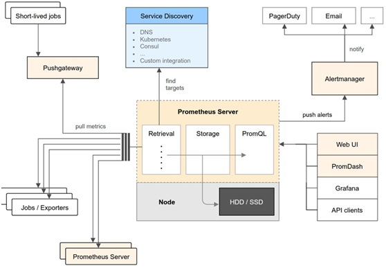
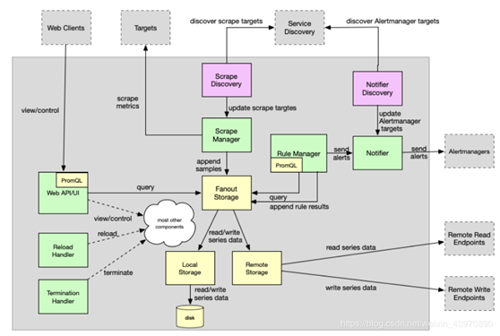
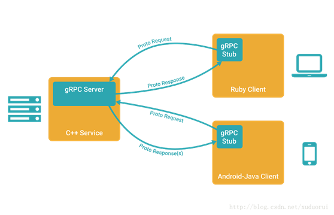
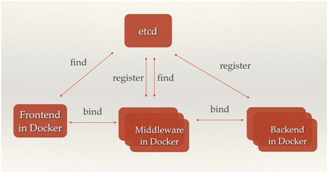

| 序号 | 修改时间 | 修改内容                     | 修改人 | 审稿人 |
| ---- | -------- | ---------------------------- | ------ | ------ |
| 1    | 2018-8-4 | 创建。从《微服务架构》拆分。 | Keefe |        |
|   2   |   2019-12-28       | Docker章节迁移另文。                           |  同上      |        |
| 3 | 2020-4-17 | Kubernetes章节迁移另文。 | 同上 | |

---

# 目录

[TOC]

---

# 1 CNCF项目列表

CNCF（Cloud Native Computing Foundation）于 2015 年 7 月成立，隶属于 Linux 基金会，初衷围绕“云原生”服务云计算，致力于维护和集成开源技术，支持编排容器化微服务架构应用。

CNCF 还帮助项目建立了治理结构。CNCF 提出了成熟度级别的概念：沙箱、孵化和毕业。这些级别分别对应下图中的创新者、早期采用者和早期大众。

表格 1 CNCF项目列表（按开源时间或加入CNCF时间升序排列）

| 时间 | 项目        | 简介                                                         | 主要贡献者                      | 备注                         |
| ---- | ----------- | ------------------------------------------------------------ | ------------------------------- | ---------------------------- |
| 2015 | Kubernetes  | 集群中管理跨多台主机容器化应用的开源系统；                   | google于2014年创建，2015年开源  | K8S最热门的容器编排平台。    |
|      | Prometheus  | 专注于时间序列数据，为客户端依赖及第三方数据消费提供广泛集成支持的开源监控解决方案； | SoundCloud于2012年创建。        | 系统及服务监控工具。         |
|      | OpenTracing | 与厂商无关的分布式追踪开源标准；                             |                                 |                              |
|      | Fluentd     | 创建统一日志层的开源数据收集器。                             | ElasticSearch公司开源。         |                              |
|      |             |                                                              |                                 |                              |
| 2017 | gRPC        | 现代化高性能开源远程调用框架                                 | google开源，                    |                              |
|      | Linkerd     | 2016年1月发布0.0.7版本，2017年1月加入CNCF。为微服务提供可靠性支持、自动化负载均衡、服务发现和运行时可恢复性的开源“服务网格”项目。Scala语言编写，运行于JVM，底层基于twitter的Finagle库。透明式服务网络。 | Buoyant优步创建并于2016年开源。 | 业界第一款Service Mesh产品。 |
|      | CoreDNS     | 快速灵活的构建 DNS 服务器的方案                              |                                 |                              |
|      | rkt         | 帮助开发者打包应用和依赖包，简化搭环境等部署工作，提高容器安全性和易用性的容器引擎。 |                                 | Pod原生容器引擎。            |
| ?    | Envoy       | 2016年9月发布1.0版本，2017年9月加入CNCF。为云原生应用程序设计的开源边缘和服务代理。Envoy是一种高性能C++分布式代理，专为单一服务和应用程序设计，还是一种为大型微服务服务网格架构设计的通信总线和通用数据平面。 | Lyft                            |                              |
|      | Jaeger      | 开源端到端分布式跟踪系统。                                   |                                 | 分布式跟踪。                 |
|      | Helm        | Kubernetes的包管理器。                                       |                                 |                              |
|      | Etcd        | 可靠的分布式键值存储项目，可用于存储分布式系统中关键的数据。 |                                 | 分布式键值存储               |
|      | CRI-O       | 遵守开放容器倡议(OCI)的情况下实现了Kubernetes运行时接口。    |                                 | 针对K8s的轻量运行时接口      |
|      | Isito       | 2017年5月发布。底层 基于Envoy。                              |                                 |                              |
|      | Conduit     | 尚未列入CNCF。                                               | Buoyant优步于2017年12月开源。   |                              |
| 2019 | KubeEdge    | 3月，华为云开源智能边缘项目KubeEdge加入CNCF社区，成为CNCF在智能边缘领域的首个正式项目。 | 华为云于2019年3月开源           | 智能边缘领域                 |
| 2020 |             |                                                              |                                 |                              |
| 2021 |             |                                                              |                                 |                              |

备注：

表格 CNCF项目列表（按功能）

| 功能              | 项目列表                                             | 说明 |
| ----------------- | ---------------------------------------------------- | ---- |
| 容器编排          | Kubernetes Helm                                      |      |
| 容器引擎          | Containerd Rocket                                    |      |
| 容器镜像仓库      | Notary  TUF                                          |      |
| 容器网络          | CNI                                                  |      |
| 服务网格&服务发现 | CoreDNS Linkerd Enovy                                |      |
| 容器运维监控      | Prometheus Fluentd Jaeger OpenTracing                |      |
| 消息通信          | GPRC NATS                                            |      |
| 数据库            | Vitness                                              |      |
| Sandbox项目       | Rook Spife Open_Policy_Agent CloudEvent Telepresence |      |

# 2 容器Docker

详见 [Docker用户手册.md](../tools.工具/Docker用户手册.md)

# 3 Kubernetes

详见 [kubernetes用户手册.md](../tools.工具/kubernetes用户手册.md)

# 4 Prometheus

Prometheus 是一套开源的监控、报警和时间序列数据库的组合，成立于 2012 年，由 SoundCloud 公司开发，此后许多组织接受和采用了 Prometheus，遂将其独立为开源项目。该项目使用 Go 语言开发，社区氛围非常活跃。

**关键功能包括：**

*  多维数据模型：metric，labels
*  灵活的查询语言：PromQL， 在同一个查询语句，可以对多个 metrics 进行乘法、加法、连接、取分数位等操作。
*  可独立部署，拆箱即用，不依赖分布式存储
*  通过Http pull的采集方式
*  通过push gateway来做push方式的兼容
*  通过静态配置或服务发现获取监控项
*  支持图表和dashboard等多种方式

## 4.1  架构

   

图 10 Prometheus组件架构

*  Prometheus Server： 采集和存储时序数据
*  client库： 用于对接 Prometheus Server, 可以查询和上报数据
*  push gateway处理短暂任务：用于批量，短期的监控数据的汇总节点，主要用于业务数据汇报等
*  定制化的exporters,比如：HAProxy， StatsD，Graphite等等， 汇报机器数据的插件
*  告警管理：Prometheus 可以配置 rules，然后定时查询数据，当条件触发的时候，会将 alert 推送到配置的 Alertmanager
*  多种多样的支持工具

   

图 11 Prometheus的整体技术架构

Prometheus的整体技术架构可以分为几个重要模块：
*  Main function：作为入口承担着各个组件的启动，连接，管理。以Actor-Like的模式协调组件的运行
*  Configuration：配置项的解析，验证，加载
*  Scrape discovery manager：服务发现管理器同抓取服务器通过同步channel通信，当配置改变时需要重启服务生效。
*  Scrape manager：抓取指标并发送到存储组件
*  Storage：
* Fanout Storage：存储的代理抽象层，屏蔽底层local storage和remote storage细节，samples向下双写，合并读取。
*  Remote Storage：Remote Storage创建了一个Queue管理器，基于负载轮流发送，读取客户端merge来自远端的数据。
* Local Storage：基于本地磁盘的轻量级时序数据库。
*  PromQL engine：查询表达式解析为抽象语法树和可执行查询，以Lazy Load的方式加载数据。
*  Rule manager：告警规则管理
*  Notifier：通知派发管理器
*  Notifier discovery：通知服务发现
*  Web UI and API：内嵌的管控界面，可运行查询表达式解析，结果展示。

## 本章参考

[1].  时序数据库连载系列：指标届的独角兽Prometheus https://blog.csdn.net/weixin_43970890/article/details/87938347

# 5 gRPC

## 5.1  简介

[gRPC](http://www.oschina.net/p/grpc-framework) 是一个高性能、开源和通用的 RPC 框架，面向移动和 HTTP/2 设计。目前提供 C、Java 和 Go 语言版本，分别是：grpc, grpc-java, grpc-go. 其中 C 版本支持 C, C++, Node.js, Python, Ruby, Objective-C, PHP 和 C# 支持.

gRPC 基于 HTTP/2 标准设计，带来诸如双向流、流控、头部压缩、单 TCP 连接上的多复用请求等特。这些特性使得其在移动设备上表现更好，更省电和节省空间占用。

gRPC 一开始由 google 开发，是一款语言中立、平台中立、开源的远程过程调用(RPC)系统。

在 gRPC 里客户端应用可以像调用本地对象一样直接调用另一台不同的机器上服务端应用的方法，使得您能够更容易地创建分布式应用和服务。

   

图 12 gRPC简图

**特性**

*  基于HTTP/2

HTTP/2 提供了连接多路复用、双向流、服务器推送、请求优先级、首部压缩等机制。可以节省带宽、降低TCP链接次数、节省CPU，帮助移动设备延长电池寿命等。gRPC 的协议设计上使用了HTTP2 现有的语义，请求和响应的数据使用HTTP Body 发送，其他的控制信息则用Header 表示。

*  IDL使用ProtoBuf

gRPC使用ProtoBuf来定义服务，ProtoBuf是由Google开发的一种数据序列化协议（类似于XML、JSON、hessian）。ProtoBuf能够将数据进行序列化，并广泛应用在数据存储、通信协议等方面。压缩和传输效率高，语法简单，表达力强。

*  多语言支持（C, C++, Python, PHP, Nodejs, C#, Objective-C、Golang、Java）

gRPC支持多种语言，并能够基于语言自动生成客户端和服务端功能库。目前已提供了C版本grpc、Java版本grpc-java 和 Go版本grpc-go，其它语言的版本正在积极开发中，其中，grpc支持C、C++、Node.js、Python、Ruby、Objective-C、PHP和C#等语言，grpc-java已经支持Android开发。

**优点：**

*  protobuf二进制消息，性能好/效率高（空间和时间效率都很不错）
*  proto文件生成目标代码，简单易用
*  序列化反序列化直接对应程序中的数据类，不需要解析后在进行映射(XML,JSON都是这种方式)
*  支持向前兼容（新加字段采用默认值）和向后兼容（忽略新加字段），简化升级
*  支持多种语言（可以把proto文件看做IDL文件）
*  Netty等一些框架集成

**缺点：**
*  GRPC尚未提供连接池，需要自行实现
*  尚未提供“服务发现”、“负载均衡”机制
*  因为基于HTTP2，绝大部多数HTTP Server、Nginx都尚不支持，即Nginx不能将GRPC请求作为HTTP请求来负载均衡，而是作为普通的TCP请求。（nginx1.9版本已支持）
*  Protobuf二进制可读性差（貌似提供了Text_Fromat功能）。默认不具备动态特性（可以通过动态定义生成消息类型或者动态编译支持）

## 5.2  架构

## 5.3  本章参考

[1].  gRPC 官方文档中文版 http://doc.oschina.net/grpc

[2].  gRPC https://blog.csdn.net/xuduorui/article/details/78278808

[3].  RPC框架性能基本比较测试 [www.useopen.net/blog/2015/rpc-performance.html](http://www.useopen.net/blog/2015/rpc-performance.html)

# 6  Etcd

Etcd是CoreOS 基于 Raft 开发的分布式 key-value 存储，可用于服务发现、共享配置以及一致性保障（如数据库选主、分布式锁等）。

etcd作为一个受到ZooKeeper与doozer启发而催生的项目，除了拥有与之类似的功能外，更专注于以下四点。

*  简单：基于HTTP+JSON的API让你用curl就可以轻松使用。

*  安全：可选SSL客户认证机制。

*  快速：每个实例每秒支持一千次写操作。

*  可信：使用Raft算法充分实现了分布式。

 

## 6.1  本章参考

[1].  ETCD 简介+使用 https://blog.csdn.net/bbwangj/article/details/82584988

# 参考资料

[1].  华为

