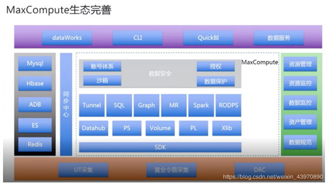
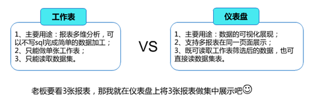
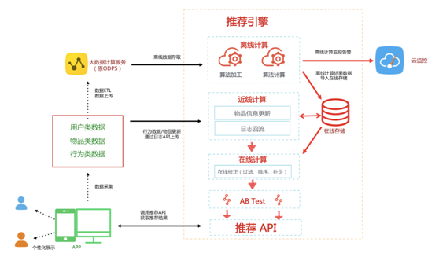
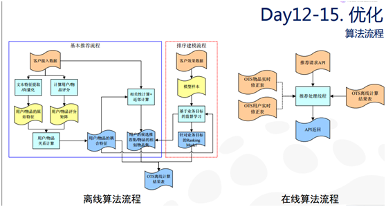
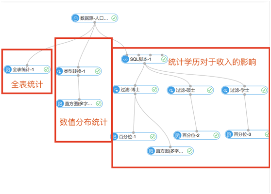
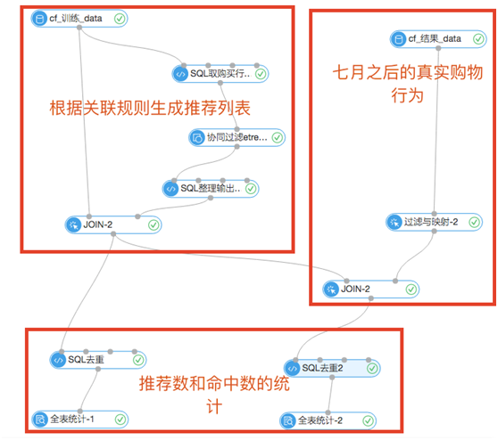
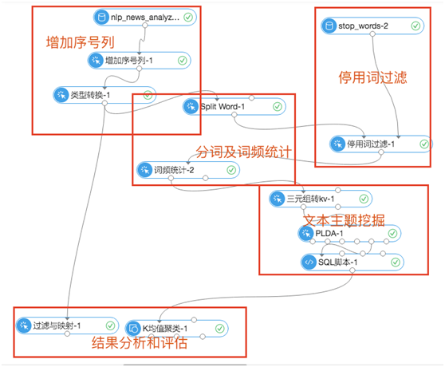
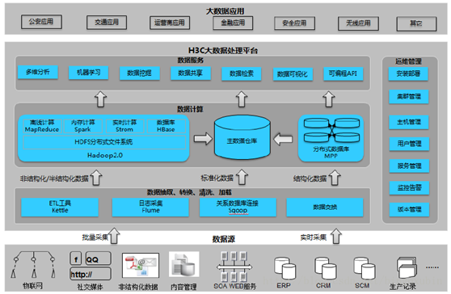
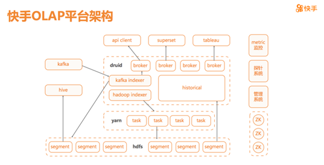
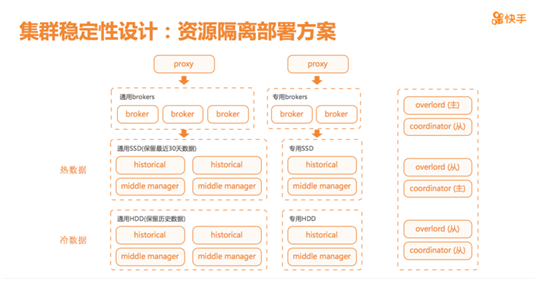

| 序号 | 修改时间  | 修改内容                         | 修改人 | 审稿人 |
| ---- | --------- | -------------------------------- | ------ | ------ |
| 1    | 2021-5-18  | 创建.将大数据分析平台迁移至此。                             | Keefe |        |
|      |           |                                  |        |        |

---

# 云平台概述

详见 《[云服务商比较](云服务商比较.md)》

表格 云服务头部厂商产品列表

| 厂商      | 云产品                                            | 数据中台.DAAS                                                | AI中台.AIAAS                                                 | 提供能力 |
| --------- | ------------------------------------------------- | ------------------------------------------------------------ | ------------------------------------------------------------ | -------- |
| Amazon    | [AWS](https://aws.amazon.com/)-Amazon Web Service | [SageMaker](https://aws.amazon.com/sagemaker)                | [AWS-AI](https://aws.amazon.com/cn/events/amazon-ai/)        | 全栈     |
| Google    | GCP-Google Cloud Platform                         |                                                              | [Colab](https://colab.sandbox.google.com/)                   | 全栈     |
| Alibaba   | [AliYun](http://aliyun.com/)                      | [Dataphin](https://dp.alibaba.com/product/dataphin) + [Quick BI](https://www.aliyun.com/product/bigdata/bi) | [PAI](https://cn.aliyun.com/product/bigdata/product/learn) (Studio/DWS/DLC/EAS) + [Dataworks](https://www.aliyun.com/product/bigdata/ide) | 全栈     |
| 华为      | [HuaweiCloud](https://www.huaweicloud.com/)       | [DAYU](https://www.huaweicloud.com/product/dayu.html)/[ROMA](https://www.huaweicloud.com/product/roma.html) | [ModelArts]( https://support.huaweicloud.com/modelarts/index.html ) | 全栈     |
| Microsoft | [Azure](https://azure.microsoft.com/)             |                                                              |                                                              | 全栈     |
| 腾讯      | [腾讯云](https://cloud.tencent.com/)              |                                                              | 云智天枢[timatrix](https://cloud.tencent.com/product/timatrix) | 全栈     |
| 百度      | [百度智能云](https://cloud.baidu.com/)            |                                                              | [飞桨](https://www.paddlepaddle.org.cn/)aistudio             | 全栈     |

备注：全栈指 IAAS+PAAS+SAAS，甚至还包括DAAS和AIAAS。头部厂商一般不直接提供SAAS（DAAS和AIAAS产品除外），这部分生态会提供给合作方和开发者。

## 数据中台

数据中台是技术的概念，更是企业管理的概念

数据中台居于前台和后台之间，是企业级的数据共享、能力复用平台，是数字化转型的基础和中枢系统。将企业全域海量、 多源、异构的数据整合资产化，为业务前台提供数据资源和能力的支撑，以实现数据驱动的精细化运营。

数据中台不是简单的一套软件系统或者一个标准化产品，更多的是一种强调资源整合、集中配置、能力沉淀、分步执行的 运作机制，是一系列数据组件或模块的集合，指向企业的业务场景。企业基于自身的信息化建设基础和业务特点对数据中 台的能力进行定义，基于能力定义选择和利用数据组件搭建中台。各类数据技术是构建数据中台的基础，能够高效对数据 进行统一收集、处理、储存、计算、分析和可视化呈现，使数据最终与业务链条结合，真正转化为企业核心资产。

而从广义上，数据中台更是一种企业组织管理模式和理念，集公司战略决心、组织架构、技术架构于一体，企业从战略上 构建统一的协同基座即中台化组织，以协调和支持各业务部门，用技术拓展商业边界，为新业务、新部门提供成长空间。

**数据产品的发展阶段：**  数据库 -> 数据仓库 --> 数据平台 --> 数据中台

数据价值：存储 -> 交易 -> 分析 -> 赋能。

~~数据处理过程包括从数据集成（数据湖），到数据处理，再到数据消费。~~

数据产品有二个大的方向，一是按照数据仓库建模理论发展而来的数据湖（数据仓库/数据湖-->湖仓一体），如阿里的Dataphin；二是大数据存储和计算，为AI服务的大数据产品，如阿里的Dataworks。

数据中台产品的组成包括数据集成、数据地图、主数据管理等。

表格 数据中台产品详细比较

| 产品                                                         | 功能                                                         |  优势             |  劣势            |
| ------------------------------------------------------------ | ------------------------------------------------------------ | -------------------- | ------------------- |
| [华为ROMA](https://e.huawei.com/cn/products/industry-enablement/hybrid-integration-platform-roma) | （华为自己吃的狗粮）ROMA源自华为10年+的数字化实践，是华为智能体概念中的应用使能。 ROMA是汇聚New ICT能力，支撑行业客户“Applications /Business /Clouds /Devices” 全面集成的数据和技术融合平台。 应用与数据集成平台ROMA Connect源自华为10年+数字化转型实践。聚焦应用和数据联接，提供消息、数据、API、设备集成能力，帮助企业快速、简单的打通并管理Legacy系统与CloudNative应用，联接云上云下，消除数字鸿沟，构建业务敏捷性，驱动数字化转型。 | 覆盖非云原生企业     |                     |
| 华为DAYU大禹                                                 | 华为智能体概念中的数据使能。华为云智能数据湖运营平台 DAYU于 2020/12/15更名为 “数据湖治理中心DGC”。 目标：为大型政企客户量身定制感知业务、跨越孤立系统的数据资产智能管理解决方案，实现全域数据入湖，帮助政企客户从多角度、多层次、多粒度挖掘数据价值，实现数据驱动的数字化转型。 简单讲，从方法论入手，管理体系+技术平台双轮驱动，再通过应用场景实现数据价值释放的闭环。 | 华为数据中台         |                     |
| 阿里Dataphin                                                 | 智能数据构建与管理平台。面向各行各业大数据建设、管理及应用诉求，一站式提供从数据接入到数据消费全链路的智能数据构建与管理的大数据能力，包括产品、技术和方法论等，助力打造标准统一、融会贯通、资产化、服务化、闭环自优化的智能数据体系，以驱动创新。 通过输出阿里数据中台实战沉淀的大数据建设体系OneData+OneID +OneService(产品+技术+方法论)， 一站式提供集数据引入、规范定义、数据建模、数据研发、数据萃取的全链路智能数据构建及管理服务。 | 全链路数据构建和管理 | 不具备 机器学习能力 |
| 阿里Dataworks                                                | （阿里巴巴自己吃的狗粮）DataWorks基于MaxCompute/EMR/MC-Hologres等大数据计算引擎，为客户提供专业高效、安全可靠的一站式大数据开发与治理平台，自带阿里巴巴数据中台与数据治理最佳实践，赋能各行业数字化转型。每天阿里巴巴集团内部有数万名数据/算法工程师正在使用DataWorks，承担集团99%数据业务构建。 | 大数据的机器学习平台 |                     |

> 备注：DataX 是阿里开源的一个异构数据源离线同步工具，致力于实现包括关系型数据库(MySQL、Oracle等)、HDFS、Hive、ODPS、HBase、FTP等各种异构数据源之间稳定高效的数据同步功能。

表格 数据中台框架整体对比

|        | 阿里巴巴                      | 华为       |
| ------ | ----------------------------- | ---------- |
| 产品   | Dataphin、Dataworks、Quick BI | ROMA、DAYU |
| 技术   |                               |            |
| 方法论 | OneID + OneModel + OneService | 数据治理   |

## AI中台

包括数据管理、算法管理（算法开发、训练）、模型管理（模型存储、更新）、服务管理（算法发布、部署）。

| 厂商      | 平台产品                                                     | 提供功能                                                     |
| --------- | ------------------------------------------------------------ | ------------------------------------------------------------ |
| Alibaba   | [PAI](https://cn.aliyun.com/product/bigdata/product/learn)（Dataworks、Studio/DSW/DLC/EAS） | PAI包括4个子产品，支持可视化建模Studio、交互式建模DSW、深度学习训练平台DLC、弹性推理平台EAS。 免费提供DSW作为阿里天池大赛的缺省开发环境，CPU不限制，GPU每年60小时。 |
| 华为      | ModelArts                                                    | 华为云长期扎根AI基础技术研究，覆盖计算机视觉、语音语义和决策优化三大AI领域，提出了六大基础研究计划，这些计划产生的许多研究成果以即插即用的方式逐步部署于ModelArts。 2020年，华为云发布了ModelArts 3.0，融合骨干模型、联邦学习、模型智能评估与诊断、高性能AI计算四大特性，并推出了基于MedelArts打造的业界首个全生命周期知识计算解决方案，加速行业AI落地。 |
| Amazon    | [SageMaker](https://aws.amazon.com/cn/sagemaker/)            |                                                              |
| 百度      | [飞桨](https://www.paddlepaddle.org.cn/)                     |                                                              |
| Google    | Colab                                                        |                                                              |
| Microsoft | [Azure](https://docs.microsoft.com/en-us/azure/machine-learning/) |                                                              |

AI开发平台如下：

* 百度AI平台  http://ai.baidu.com/ 

* 阿里AI平台  http://ai.alibaba.com/ 

* 腾讯AI平台  http://ai.tencent.com/ 

* 科大讯飞开放平台 [点击进入](https://www.xfyun.cn/)

* Face++旷视  [点击进入](https://www.faceplusplus.com.cn/)

* 360人工智能研究院 [点击进入](http://ai.360.cn/)

* 网易人工智能 [点击进入](https://ai.163.com/)

* 京东AI开放平台 [点击进入](http://neuhub.jd.com/)

* 小米AI开放平台 [点击进入](https://dev.mi.com/console/cloud/)

* 海康威视  [点击进入](https://open.hikvision.com/)

* OLAMI 欧拉密 AI  [点击进入](https://cn.olami.ai/)

* 云知声开放平台 [点击进入](http://dev.hivoice.cn/)

* 搜狗AI开放平台 - 知音 [点击进入](https://zhiyin.sogou.com/)

* 滴滴AI开放平台 [点击进入](http://ai.didiglobal.com/)

* 学而思教育AI开放平台 [点击进入](https://ai.xueersi.com/)

 

国外

* Amazon AI  https://aws.amazon.com/cn/events/amazon-ai/

* IBM人工智能-IBM Cloud Pak for Data  [点击进入](https://www.ibm.com/cn-zh/products/cloud-pak-for-data)

* 微软AI开放平台 [点击进入](https://azure.microsoft.com/zh-cn/free/ai/)

* 英特尔 AI Academy [点击进入](https://software.intel.com/zh-cn/ai)

# 主流云原生平台

## 1. 亚马逊云.AWS

2006 年，Amazon Web Services (AWS) 开始以 Web 服务的形式向企业提供 IT 基础设施服务，现在通常称为云计算。

- [Amazon SageMaker](https://aws.amazon.com/sagemaker)
- [PyTorch on AWS](https://aws.amazon.com/pytorch/)
- [AWS Deep Learning Containers](https://docs.aws.amazon.com/deep-learning-containers/latest/devguide/deep-learning-containers-ec2-tutorials-training.html#deep-learning-containers-ec2-tutorials-training-pytorch)
- [AWS Deep Learning AMIs](https://docs.aws.amazon.com/dlami/latest/devguide/tutorial-pytorch.html)

### Amazon SageMaker

Amazon SageMaker 通过整合专门为 ML 构建的广泛功能集，帮助数据科学家和开发人员快速准备、构建、训练和部署高质量的机器学习 (ML) 模型。

## 2. 阿里云

E-MapReduce 是构建于阿里云 ECS 弹性虚拟机之上，利用开源大数据生态系统，包括 Hadoop、Spark、Kafka、Storm，为用户提供集群、作业、数据等管理的一站式大数据处理分析服务。

**阿里云产品和服务**

本场景主要涉及以下云产品和服务：

* 云开发平台：云开发平台是阿里云所提供的一站式、全云端的开发平台，打开浏览器就可以开发、调试、上线。点击进入云开发平台。底层调用阿里云集团Serverless产品，可以实现低门槛开发、部署、调试，降低开发上手成本和运维成本。
* 小程序开发者工具（简称IDE）：是支付宝开放平台打造的“一站式小程序研发工具”。IDE不仅支持开发支付宝小程序，相同代码还通用于蚂蚁开放生态、可直接发布至淘宝、钉钉、高德等应用平台。
* 画蝶平台：阿里云视觉智能平台提供先进的图像，人脸人体,视频等共计150+项的人工智能技术，是达摩院基于阿里巴巴业务实践经验沉淀出的AI技术集合，与广大的阿里云用户共享AI领域最新的应用场景和技术服务，助力开发者及企业的智能化升级。

表格 阿里云存储产品列表

| 存储产品    | 时延                   | 吞吐     | 访问模式                                 |
| :---------- | :--------------------- | :------- | :--------------------------------------- |
| 文件存储NAS | 低时延（毫秒级）       | 数百Gbps | 上千个ECS通过POSIX接口并发访问，随机读写 |
| 对象存储OSS | 较低时延（几十毫秒级） | 数百Gbps | 数百万客户端通过WEB并发，追加写          |
| 块存储EBS   | 极低时延（微秒级）     | 数十Gbps | 单ECS通过POSIX接口访问，随机读写         |

### 云上数据中台

阿里数据中台官网  https://dp.alibaba.com/

阿里云上数据中台内核能力框架体系：产品+技术+方法论。

产品：dataphin、QuickBI

技术：划分领域，每领域有不同的技术要求，使用不同的工具集合。

方法论：3One理论，OneID + OneModel + OneService

表格 阿里数据产品 dataphin/datawork比较

| 产品               | dataphin                                       | datawork                             |
| ------------------ | ---------------------------------------------- | ------------------------------------ |
| 简介               | 大数据仓库体系的生态化环境。推出时间在2018年。 | 大数据开发平台，早在2009年就有使用。 |
| 数据模型设计       | 有                                             | 没有                                 |
| 数据指标管理       | 有                                             | 没有                                 |
| 数据萃取、数据标签 | 有                                             | 没有                                 |
| 数据资产治理       | 有                                             | 没有                                 |
| SQL编辑            | 有                                             | 有                                   |
| 图形化调试平台     | 有                                             | 有                                   |
| 数据地图           | 有                                             | 有                                   |
| 数据质量管理       | 有                                             | 有                                   |
| 机器学习           | 没有                                           | 有                                   |

> 说明：Dataworks，一站式大数据开发治理平台，阿里巴巴十二年数据中台与数据治理最佳实践。是一个基于任务形式的数据调度平台，是一个工具，用于处理数据ETL的；
> Dataphin，是提供数据服务的，规范数据仓库建设，定义dwd层数据，定义原子，派生指标，形成主题式dws层数据，对外服务；
> 简单来说，一个是数据计算层的ETL产品，一个是数据服务层的。

### 人工智能平台PAI

阿里云人工智能平台PAI  https://cn.aliyun.com/product/bigdata/product/learn

阿里云人工智能平台PAI（Platform of Artificial Intelligence）面向企业及开发者，提供轻量化、高性价比的云原生机器学习平台，涵盖PAI-Studio可视化建模平台、PAI-DSW云原生交互式建模平台、PAI-DLC云原生AI基础平台、PAI-EAS云原生弹性推理服务平台，支持千亿特征、万亿样本规模加速训练，百余落地场景，全面提升AI工程效率。

PAI包括四个子产品：

* PAI-Studio可视化建模平台：支持大规模分布式的传统机器学习、深度学习、强化学习训练；支持流批一体训练；封装上百种机器学习算法，拖拽式建模，自动调参，无编程玩转人工智能。
* PAI-DSW云原生交互式建模平台：灵活开放的交互式云端机器学习开发环境，内置JupyterLab、WebIDE及Terminal，适合不同业务场景及客户需求。开箱即用的开发建模环境，降低用户运维成本的同时，开放底层Sudo权限，给客户提供最大化定制化能力。集成PAI基础能力及教程，提升开发效率。
* PAI-DLC云原生AI基础平台：云原生一站式的深度学习训练平台，提供灵活、稳定、易用和高性能的机器学习训练环境。支持多种算法框架，超大规模分布式深度学习任务运行及自定义算法框架。
* PAI-EAS云原生弹性推理服务平台：PAI平台的模型在线预测服务，支持异构硬件（CPU/GPU）的模型加载，高吞吐，低延迟，支持大规模复杂模型的一键部署，实时自动扩缩容，全自动部署更新模型服务版本；支持高速直连调用，并提供全方位、高可靠的运维监控保障体系。

图 阿里云机器学习PAI 产品架构

机器学习PAI平台核心提供了从数据处理、模型开发、训练到部署的一站式服务。

PAI-Studio与PAI-DSW通过打通底层数据，提供可视化和交互式两种机器学习模型开发环境，PAI-DLC提供云原生深度学习训练平台，三种不同方式训练的模型，都可以一键部署到PAI-EAS，通过Restful API形式与业务打通。同时在业务层，PAI平台还提供智能推荐、用户增长、智能风控等解决方案。

PAI平台底层基于GPU/CPU等常见硬件，结合经典机器学习框架及阿里巴巴多年沉淀的计算引擎和容器服务，为PAI核心能力提供完整的服务支撑。丰富的算法、组件等智能生态市场，方便企业客户和用户找到适合的AI方案或形成交易。PAI平台真正实现企业自主可控的AI方案，全面提升机器学习工程效率。

#### PAI DSW

天池实验室是基于PAI DSW探索版开发的，PAI DSW（Data Science Workshop）是为算法开发者量身打造的云端开发环境，用户可在DSW中利用阿里云提供的CPU/GPU算力资源实现云端编程，无需任何运维配置即可直接开启Jupyter Notebook编写，调试，运行Python代码。DSW的主要面向用户是深度学习算法的开发者，其中内置了深度学习网络可视化建模并支持开源框架的安装。

DSW的主要面向用户是深度学习算法的开发者，其中内置了深度学习网络可视化建模并支持开源框架的安装。

#### Dataworks

Dataworks，在阿里集团内部为大家所熟知的部分是D2，在阿里云则是数加平台的主体-数据工厂。DataWorks（数据工场）具备全栈数据研发能力（数据集成与开发、 生产运维调度、离线与实时分析、数据质量治理与资产管理、安全防护、数据共享与服务、机器学习、数据应用搭建）的大数据平台。

DataWorks基于MaxCompute/EMR/MC-Hologres等大数据计算引擎，为客户提供专业高效、安全可靠的一站式大数据开发与治理平台，自带阿里巴巴数据中台与数据治理最佳实践，赋能各行业数字化转型。每天阿里巴巴集团内部有数万名数据/算法工程师正在使用DataWorks，承担集团99%数据业务构建。

### 数加平台

2016年阿里巴巴上海云栖大会“DT WORLD”上,阿里巴巴正式发布了“*阿里云数加平台*”，首批亮相20款产品。覆盖了数据采集、计算引擎、数据加工、数据分析、机器学习、数据应用等数据生产全链条。

阿里云数加平台由三大部分组成：

一、开发套件

1. 数据开发套件：

（1）大数据开发：集成可视化开发环境，可实现数据开发、调度、部署、运维、及数仓设计、数据质量管理等功能，

（2）BI报表工具，海量数据的实时在线分析、丰富的可视化效果，助您轻松完成数据分析、业务探查等，所见即所得。（特色报表：中国地图气泡表或色彩表）

（3）机器学习工具，集数据处理、特征工程、建模、离线预测为一体的机器学习平台,优质算法汇集,可视化编辑。

2. 应用开发套件：

（1）面向通用数据应用场景：提供数据应用开发的基础级工具，加速基础数据服务开发。如个性化推荐工具、数据可视化工具、快速BI站点搭建工具搭数、规则引擎工具等。

（2）面向行业垂直应用场景：提供行业相关性很高，适合特定场景的数据工具，如面向政府县级区域经济的可视化套件。

 

二、解决方案

数加针对不同的业务场景，基于平台提供的开发套件与行业服务商的能力，将多方产品串联，提供行业解决方案，如敏捷BI解决方案、交通预测解决方案、智能问答机器人等，一方面客户可以自行参考解决方案，以自助的方式完成解决方案的实施。另一方面，客户也可以咨询行业服务商或者阿里云大数据平台官方，根据客户场景，提供定制化的端到端的解决方案实施。

 

三、数据市场

访问：https://market.aliyun.com/chn/data

除了阿里云大数据官方的数据应用，我们会联合合作伙伴、ISV等来丰富大数据应用，打造大数据生态，以普惠大数据为使命，给用户提供更多更好的数据应用、数据API。

 

**aws大数据组件**

表格 12 AWS的大数据组件

| **组件类别**   | 组成                                                         | 处理过程                                                     |
| -------------- | ------------------------------------------------------------ | ------------------------------------------------------------ |
| 源目标         | OSS数据同步、写数据、读数据、MySQL数据同步                   | 数据来源多处，可以是数据库、本地文件上传。                   |
| **数据预处理** | 从二个子类和其它分述。                                       | 主要在数据进入算法流程前对数据进行去噪、填充缺失值、类型变换等操作。 |
|                | 采样过滤                                                     | 随机/加权/分层采样、过滤与映射                               |
|                | 数据合并                                                     | 合并行、列，调用SQL中JOIN、UNION                             |
|                | 其它：类型转化、增加序号号、拆分、缺失值补充、标准化、归一化、KEY-TO-TABLE、TALBE-TO-KV | 标准化：按比例将数据缩小，并落到一个区间。  归一化：作用是将每个特征的数值范围变为0到1之间。  拆分：ML中将一组数据按一定比例进行拆分，如7：3，即70%作为训练集，30%用于预测集。 |
| **特征过程**   | 从下面四个子类分述。                                         |                                                              |
|                | 特征变换                                                     |                                                              |
|                | 特征重要性评估                                               | 熵和基尼系数是表示这个特征区间对于目标值的影响。             |
|                | 特征选择                                                     | 过滤式特征选择：用来判断每个特征对于结果的影响。通过信息熵和基尼系数来表示，可以通过查看评估报告来显示最终的结果。 |
|                | 特征生成                                                     |                                                              |
| **统计分析**   | 包括协方差、数据视图、全表统计等等                           |                                                              |
| **机器学习**   | 从五个子类、评估和预测分述。                                 |                                                              |
|                | 二分类                                                       |                                                              |
|                | 多分类                                                       |                                                              |
|                | 聚类                                                         |                                                              |
|                | 回归                                                         | 线性回归，是利用数理统计中回归分析，来确定两种或两种以上变量间相互依赖的定量关系。  GBDT回归： |
|                | 关联推荐                                                     |                                                              |
|                | 评估                                                         | 评估方法有二分类、多分类、聚类、回归和混淆矩阵。评估模型的指标有准确率/召回率/F1等。 |
|                | 预测                                                         |                                                              |
| **文本分析**   | 包括分词、字符串相似度等等                                   |                                                              |
| **网络分析**   | 包括树深度、PageRank、最大联通子图、标签传播分类、标签传播聚类、单源最短路径等等。 | 最大联通子图：可以找到有通联关系的最大集合，排除无关元素。  单源最短路径：探查出每个人的一度人脉、二度人脉关系等。  标签传播分类：用已标记节点的标签信息去预测未标记节点的标签信息。 |
| 工具：SQL脚本  | SQL语法                                                      |                                                              |

备注：过滤通常可用SQL语句的WHERE限制来实现。

 

 

图 9 MaxCompute生态

#### BI

 

图 10阿里云BI流程

说明：**工作表里**的交叉表可以直播查看原始数据，类似excel或者phpmyadmin的数据展现（SQL查询），智能图表则可以切换成图表的显示。**仪器表**是excel里的各种图表。门户是各种数据的组合展现模板如日志分析模板，类似站长流量跟踪系统里的数据分析。

 

图 11 工作表VS仪表盘

说明：阿里云的BI类似phpmyadmin管理MySQL的数据可视化，但数据源更多，包括oracle等等；数据可视化展现更全面，可以多维报表同时展现，并且报表更丰富，如特有的中国地图气泡图/色彩图。

#### 推荐系统

##### 概述

推荐引擎（Recommendation Engine，以下简称RecEng，特指阿里云推荐引擎）是在阿里云计算环境下建立的一套推荐服务框架，目标是让广大中小互联网企业能够在这套框架上快速的搭建满足自身业务需求的推荐服务。

推荐服务通常由三部分组成：日志采集，推荐计算和产品对接。推荐服务首先需要采集产品中记录的用户行为日志到离线存储，然后在离线环境下利用推荐算法进行用户和物品的匹配计算，找出每个用户可能感兴趣的物品集合后，将这些预先计算好的结果推送到在线存储上，最终产品在有用户访问时通过在线API向推荐服务发起请求，获得该用户可能感兴趣的物品，完成推荐业务。

 

 

图 1 阿里云数加推荐系统流程图

 

**离线计算**

离线计算模块包含推荐业务、场景、离线算法流程的创建、编辑、删除操作，支持算法流程任务的启动、停止和日志查看，提供默认的离线推荐算法模板和创建自定义算法模板。推荐引擎中，离线流程和效果流程都是在离线计算的，离线数据规范中定义了这两类流程的数据规范。一般情况下，离线计算的输入和输出都是MaxCompute（原ODPS）表，所以离线数据规范其实上是一组MaxCompute表的格式规范，包括接入数据、中间数据和输出数据三类数据的格式规范。接入数据指客户离线提供的用户、物品、日志等数据，中间数据是在离线算法流程中产生的各种中间性质的结果数据表，输出数据是指推荐结果数据表，该结果最终将会被导入到在线存储中，供在线计算模块使用。

 

**在线计算**

推荐引擎的的在线计算负责的任务是推荐API接收到API请求时，实时对离线和近线修正产生的推荐结果进行过滤、排重、补足等处理；后者主要处理用户行为发生变化、推荐物品发生更新时，对离线推荐结果进行更新。

 

**近线计算**

推荐引擎的的近线计算主要处理用户行为发生变化、推荐物品发生更新时，对离线推荐结果进行更新。不像离线算法，天然以MaxCompute（原ODPS）表作为输入和输出，近线程序的输入数据可以来自多个数据源，如在线的表格存储（原OTS），以及用户的API请求，又或者是程序中的变量；输出可以是程序变量，或者写回在线存储，或者返回给用户。出于安全性考虑，推荐引擎提供了一组SDK供客户自定义在线代码读写在线存储（Table Store），不允许直接访问，所以需要定义每类在线存储的别名和格式。对于需要频繁使用的在线数据，无论其来自在线存储还是用户的API请求，RecEng会预先读好，保存在在线程序的变量中，客户自定义代码可以直接读写这些变量中的数据。

 

**A/B** **测试**

支持推荐算法流程的A/B测试，辅助推荐算法优化提升。允许一个场景下存在多条推荐流程（rec_path），A/B 测试也是针对同属于一个场景的不同推荐流程来进行的，在进行A/B 测试时，同一个场景下的每个推荐流程都会被分配一定的流量比例，这个比例是可以在产品界面中配置的。在执行推荐API时，推荐引擎第一步就会按照比例随机分配流量，把当前用户分配到某个推荐流程中，然后再执行这个推荐流程的在线流程。RecEng在分配流量时是完全随机的，不遵从任何规则，如某个用户一定要分配到某一条推荐流程中这样的规则。

 

**API**

推荐引擎提供多个API供客户用于业务系统对接，包括：启动数据预处理任务API、启动离线任务API、启动效果计算任务API、查询任务状态API、在线获取推荐结果API（推荐API）、在线数据更新API、系统日志采集API（日志API）。这些API需要客户集成，RecEng建议客户端将这些API统一集成在自己搭建的服务器上。

 

##### 开发流程

**1. 数据准备**

**数据源：数据表组成，可转换到mysql/json等格式，并进行数据预处理。**

| 表格                             | 字段                       | 简介                                                         |
| -------------------------------- | -------------------------- | ------------------------------------------------------------ |
| 用户表  user_meta                |                            | 描述用户元信息的数据表                                       |
| 用户属性维度表  user_meta_config |                            | 定义用户表中各元信息数据的类型                               |
| 物品表item_meta                  |                            | 描述物品元信息的数据表                                       |
| 物品属性维度表item_meta_config   |                            | 定义物品表中各元信息数据的类型                               |
| 行为表 user_behavior             | {userid, itemid, bhv_type} | 描述用户对物品的行为（包括搜索、点击、浏览、收藏等）信息的数据表 |
| 可推荐物品表rec_item_info        |                            | 可被推荐给用户的物品信息数据表，通常是物品表的子集           |

 

**2. 上传数据和预处理数据**

 

**3. 配置离线和在线算法**

 

 

**4. 从测试开发环境发布上线。**

 

**5. 效果测试**

 

#### 实验案例

表格 13 实验案例列表

| 序号 | 实验案例名称                                                 | 目的                                                         | 输入（数据源）                                               | 输出（结论）                                                 | 应用知识                       | 处理过程                                                     |
| ---- | ------------------------------------------------------------ | ------------------------------------------------------------ | ------------------------------------------------------------ | ------------------------------------------------------------ | ------------------------------ | ------------------------------------------------------------ |
| 1.   | [人口普查统计案例](https://help.aliyun.com/document_detail/34410.html?spm=5176.doc42600.6.557.bP7BaI) | 统计学历对于收入的影响                                       | [UCI开源数据集Adult](http://archive.ics.uci.edu/ml/datasets/Adult)（32561条） | {学历、收入}  结论：学历越高平均收入越高。                   | BI：数据统计、分析             | 类型转化（*income**字段~0/1)*。  全表统计/数据视图/类型转化/SQL语句/过滤。 |
| 2.   | [心脏病预测案例](https://help.aliyun.com/document_detail/34929.html?spm=5176.doc42600.6.554.bP7BaI) | 根据一组用户的体检指标预测另一组用户是否患有心脏病。         | [UCI开源数据集heart_disease](http://archive.ics.uci.edu/ml/datasets/Heart+Disease)（300多条） | {name，概率}  结论1：心跳数影响最大、性别没有影响。  结论2： | ML：逻辑回归二分类模型（线性） | 类型转化（性别~0/1、胸部疼痛程度0~3等等）、过滤式特征选择（得到特征权重）、归一化、拆分、混淆矩阵评估 |
| 3.   | [【图算法】金融风控实验](https://help.aliyun.com/document_detail/35357.html?spm=5176.doc42600.6.552.bP7BaI) | 算出图中每个人是欺诈用户的概率                               | {start_point、end_point、count.关系紧密度}                   | {用户，tag, 权重}                                            | ML：最大联通子图               | 最大联通子图、单源最短路径、标签传播分类                     |
| 4.   | [协同过滤做商品推荐](https://help.aliyun.com/document_detail/42600.html?spm=5176.product9091750_30212.6.270.ECSVab) |                                                              | 购买行为数据{user_id、item_id、active_type、active_date}     | 推荐列表和统计命中数                                         | 推荐：关联规则、协同过滤       |                                                              |
| 5.   | [回归算法做农业贷款发放预测](https://help.aliyun.com/document_detail/43135.html?spm=5176.doc42600.6.553.bP7BaI) | 通过农业贷款的历史发放情况，预测是否给预测集的用户发放他们需要的金额的贷款。 | 贷款训练集（200多条，历史贷款数据）、贷款预测集（当前申请贷款者） | {用户，申请贷款值，预期还款金额}                             | ML：线性回归                   | 类型转换（region 0~2、claim_type~0/1）                       |
| 6.   | [新闻分类案例](https://help.aliyun.com/document_detail/43471.html?spm=5176.doc42600.6.555.bP7BaI) | 通过PLDA算法挖掘文章的主题，通过主题权重的聚类，实现新闻自动分类。 | {category、title、 content}                                  | {docs_id, 类别id}                                            | ML：PLDA算法、聚类             | 增加序号列、停用词过滤、分词及词频统计、文本主题挖掘（三元组转V1，PLDA算法、K均值聚类）、结果分析和评估。 |
| 7.   | [学生考试成绩预测](https://help.aliyun.com/document_detail/43891.html?spm=5176.doc42600.6.558.bP7BaI) | 预测学生期末成绩。                                           | 某中学在校生的家庭背景数据以及在校行为数据                   | {字段、权重}  结论：medu最正相关，mjob负相关。               | ML：逻辑回归                   | 类型转化、归一化、逻辑回归二分类、预测、混淆矩阵             |
| 8.   | [雾霾天气预测](https://help.aliyun.com/document_detail/48700.html?spm=5176.doc42600.6.559.bP7BaI) | 预测雾霾天气（PM2.5/ PM10）最相关的因子                      | 北京2016年全年天气数据                                       | {字段，权重}  结论：二氧化氮是跟雾霾天气相关性最强。         | ML：逻辑回归                   | 类型转化、归一化、拆分、随机森林或逻辑回归二分类、预测       |

备注：1. 共8个实验。实验案例涉及机器学习、BI、推荐和AI。

2. BI的报表为仪表板（即各种图表的组合），工作表可以查看原始数据。

3. ML：一般要将非数值字段作类型转化，非数值字段可能有枚举（如星座）、二元值（如性别）、多元值等等。

 

参考资料：

[【玩转数据系列一】人口普查统计案例](https://yq.aliyun.com/articles/53862?spm=5176.100244.teamconlist.9.sXpb3b) 

[【玩转数据系列二】机器学习应用没那么难，这次教你玩心脏病预测](https://yq.aliyun.com/articles/54260?spm=5176.100244.teamconlist.7.sXpb3b) 

[【玩转数据系列三】利用图算法实现金融行业风控](https://yq.aliyun.com/articles/57261?spm=5176.100244.teamconlist.3.sXpb3b) 

[【玩转数据系列四】听说啤酒和尿布很配？本期教你用协同过滤做推荐](https://yq.aliyun.com/articles/57718?spm=5176.100244.teamconlist.3.RPKvxw) 

[【玩转数据系列五】农业贷款发放预测](https://yq.aliyun.com/articles/58722?spm=5176.100244.teamconlist.3.amS6rQ) 

[【玩转数据系列六】文本分析算法实现新闻自动分类](https://yq.aliyun.com/articles/59205?spm=5176.100244.teamconlist.3.EEa648) 

 

#### 实验1：人口普查统计

 

图 12 人口普查统计的数据流程

说明：

输入（数据源）：字段除了age/education_num/hours_per_week这三个字段是double类型外，其余字段是string类型。

输出：统计学历对于收入区间（0/1）的影响：{学位、最大，平均，最小}，

​     **结论：博硕士的平均收入区间是1，学士是0，说明学历高平均收入也高。**

数据处理过程：

* 全表统计/数据视图：目的就是对数据作个刷选。
* 类型转化：收入income字段是string，要作***类型转化\***。本案例将收入大于5万设值为1，低于5万设值为0。

select age,workclass,education,education_num,occupation,race,sex,hours_per_week,native_country, **(case income when '<=50K' then 0 else 1 end) as income**_result from **${t1}**;

* 直方图（多字段）：实质上也是报表的一种，数据展现。
* SQL脚本：执行单行SQL命令。
* 过滤：实质是SQL语句中的WHERE过滤。

 

#### 实验4：协同过滤做商品推荐

本文的业务场景如下：通过一份7月份前的用户购物行为数据，获取商品的关联关系，对用户7月份之后的购买形成推荐，并评估结果。比如用户甲某在7月份之前买了商品A，商品A与B强相关，我们就在7月份之后推荐了商品B，并探查这次推荐是否命中。

 

图 13 协同过滤商品推荐的数据流程

说明：以上由三个部分组成，分别是***推荐系统\***生成推荐列表、用户直实购物形为、推荐数和命中数的统计。

 协同过滤结果，表示的是商品的关联性。{目标商品，相似度概率}

 

#### 实验6：新闻分类（文本挖掘）

https://help.aliyun.com/document_detail/43471.html?spm=5176.doc30348.6.283.T4lbaj

一、背景

新闻分类是文本挖掘领域较为常见的场景。目前很多媒体或是内容生产商对于新闻这种文本的分类常常采用人肉打标的方式，消耗了大量的人力资源。本文尝试通过智能的文本挖掘算法对于新闻文本进行分类。无需任何人肉打标，完全由机器智能化实现。

本文通过PLDA算法挖掘文章的主题，通过主题权重的聚类，实现新闻自动分类。包括了分词、词型转换、停用词过滤、主题挖掘、聚类等流程。

 

二、数据集介绍

具体字段如下：

| 字段名   | 含义     | 类型   | 描述                           |
| -------- | -------- | ------ | ------------------------------ |
| category | 新闻类型 | string | 体育、女性、社会、军事、科技等 |
| title    | 标题     | string | 新闻标题                       |
| content  | 内容     | string | 新闻内容                       |

 

三、数据探索流程

首先，实验流程图：

 

实验可以大致分为五个模块，分别是增加序号列、停用词过滤、分词及词频统计、文本主题挖掘、结果分析和评估。

**文本主题挖掘**

使用PLDA文本挖掘组件需要先将文本转换成三元形式，append_id是每篇新闻的唯一标识，key_value字段中冒号前面的数字表示的是单词抽象成的数字标识（可以用汉字内码转数字生成word_id），冒号后面是对应的单词出现的频率。三元组组件生成结果如下： (append_id word_id word_freq)

在上一步完成了文本转数字的过程，下一步数据进入PLDA算法。PLDA算法又叫主题模型，算法可以定位代表每篇文章的主题的词语。本次试验设置了50个主题，PLDA有六个输出桩，第五个输出桩输出结果显示的是每篇文章对应的每个主题的概率。

 

### 本节参考

[1].   [https://data.aliyun.com/](https://data.aliyun.com/?spm=5176.doc30262.2.4.pyVvAG)

[2].   [阿里云数加机器学习平台](https://data.aliyun.com/product/learn?spm=a2c0j.7906235.header.11.I2EEKW)

[3].   aws推荐引擎示例教程 https://help.aliyun.com/document_detail/35065.html?spm=5176.doc30251.6.577.BW2OHy

[4].   [21天搭建个性化推荐系统](http://docs-aliyun.cn-hangzhou.oss.aliyun-inc.com/assets/attach/30369/cn_zh/1463551649394/21天搭建推荐系统 (1).pdf)

[5]. Dataphin和Dataworks的区别与各自定位？https://developer.aliyun.com/ask/135266

 

## 3. 华为云.Huawei Cloud

详见 《华为专题》

* HW ModelArts https://support.huaweicloud.com/modelarts/index.html 

* HW DAYU https://www.huaweicloud.com/product/dayu.html

* HW ROMA https://www.huaweicloud.com/product/roma.html

图 华为智能体

## Google Cloud Platform

- [Cloud Deep Learning VM Image](https://cloud.google.com/deep-learning-vm/docs/pytorch_start_instance)

- [Deep Learning Containers](https://cloud.google.com/ai-platform/deep-learning-containers/)

## Microsoft Azure

- [Azure Machine Learning](https://docs.microsoft.com/en-us/azure/machine-learning/how-to-train-pytorch)
- [Azure Functions](https://docs.microsoft.com/en-us/azure/azure-functions/machine-learning-pytorch?tabs=bash)

## 其它

### 腾讯云

**腾讯云智天枢**

腾讯云智天枢人工智能服务平台（TI Matrix Platform，下文中也叫云智天枢平台）是基于腾讯云和腾讯优图强大技术能力打造的全栈式人工智能服务平台，致力于帮助加速企业的数字化转型及促进 AI 行业生态共建。平台支持快速接入各种数据、算法和智能设备，并提供可视化编排工具进行服务和资源的管理及调度，进一步通过 AI 服务组件集成和标准化接口开放，降低 AI 应用开发成本。   

### 百度智能云

https://www.paddlepaddle.org.cn/

**飞桨 (PaddlePaddle)**

飞桨 (PaddlePaddle)以百度多年的深度学习技术研究和业务应用为基础，集深度学习核心框架、基础模型库、端到端开发套件、工具组件和服务平台于一体，2016 年正式开源，是全面开源开放、技术领先、功能完备的产业级深度学习平台。飞桨源于产业实践，始终致力于与产业深入融合。目前飞桨已广泛应用于工业、农业、服务业等，服务 265 万开发者，与合作伙伴一起帮助越来越多的行业完成 AI 赋能。

四大领先技术

* 开发便捷的深度学习框架
* 超大规模深度学习模型训练技术
* 多端多平台部署的高性能推理引擎
* 产业级开源模型库

## 本章参考

[1]. 阿里云机器学习PAI  https://cn.aliyun.com/product/bigdata/product/learn  

[2]. 阿里业务中台技术解决方案 https://www.aliyun.com/solution/bme/index?spm=5176.13856982.0.0.61176918lsqLps

[3]. 阿里架构总监一次讲透中台架构，13页PPT精华详解 https://developer.aliyun.com/article/717510?spm=5176.13333040.J_6866363310.5.477d8a27e9JUY7

# 其它云原生平台

| 平台名称  | 网址                  | 功能         | 备注                                                         |
| --------- | --------------------- | ------------ | ------------------------------------------------------------ |
| 蓝湖      | https://lanhuapp.com/ | 产品协作平台 | 无缝衔接产品、设计和研发流程。 相关工具或技能 ：Axure、切图（PS/XD/Sketch）。 Sketch只能在MAC系统使用。 |
| github    | https://github.com/   | 源码仓库管理 | 全球最流行的开源站点。没有私仓。                             |
| gitee     | https://gitee.com/    | 源码仓库管理 | 国内站点，网速和可用性有保障。 并且有免费私人仓库。       |
| dockerHub |                       | 容器镜像管理 |                                                              |
|           |                       | 云开发       |                                                              |

备注：企业协同办公平台主要有阿里钉钉、企业微信、字节飞书和华为welink。

# 企业平台示例

## H3C大数据平台Data Engine

**H3C历史**

2003年思科在美国突然起诉华为，为应对诉讼华为和3Com在杭州成立了华为3Com，其中华为拥有51%的股权，3Com拥有49%股份。

2005年的时候，3Com公司从华为手中又购得%2的股权，2006年3Com以8亿多美元收购了全部股份，同时华为3Com正式更名为H3C。

2014年HP收购3Com，华三成为HP全资子公司。

2016年紫光集团收购华三，并改名新华三。

关系链如下：

华三（2003~华为+3Com）-- 华三（2005~3Com） -- 华三（2014~HP） -- 新华三（2016~紫光）

 

H3C 大数据平台（Data Engine）采用开源社区 Apache Hadoop2.0 和 MPP 分布式数据库混合计算框架为用户提供一套完整的大数据平台解决方案，具备高性能、高可用、高扩展特性，可以为超大规模数据管理提供高性价比的通用计算存储能力。H3C 大数据平台提供数据采集转换、计算存储、分析挖掘、共享交换以及可视化等全系列功能，并广泛地用于支撑各类数据仓库系统、BI 系统和决策支持系统帮助用户构建海量数据处理系统，发现数据的内在价值。

 

图 14 华三大数据平台Data Engine的产品架构

H3C 大数据平台包含 4 个部分：

第一部分是运维管理，包括：安装部署、配置管理、主机管理、用户管理、服务管理、监控告警和安全管理等。

第二部分是数据 ETL，即获取、转换、加载，包括：关系数据库连接 Sqoop、日志采集 Flume、ETL 工具 Kettle。

第三部分是数据计算。MPP 采用分析型分布式数据库，存储高价值密度的结构化数据；Hadoop 存储非结构化/半结构化数据和低价值密度结构化数据。计算结果都存到数据仓库，数据仓库中的数据可直接用于分析和展示。数据仓库是面向主题的、集成的、稳定的且随时间不断变化的数据集合，用以支持经营管理中的决策制定过程。

第四部分数据服务，包括：机器学习、数据挖掘、数据检索、数据可视化、即席分析、SQL 和 API，为应用层提供服务和中间件调用。

 

**管理平台**

华三大数据平台Data Engine提供了web端的管理界面，集群部署完毕后访问https://ip:8443即可访问管理平台。

从Data Engine管理平台页面中左侧列表可以看出，平台提供各种服务，包括系统服务，数据存储，数据计算，数据服务，数据管理，MPP，以及其他服务。

其中系统服务中包括：Metrics，Kafka，Oozie，Slider，YARN，ZooKeeper，HUE。

数据存储包括：HDFS，HBase，PostgreSQL，Redis。

数据计算包括：MapReduce2，Spark，Storm，Tez。

数据服务包括：ElasticSearch，HAWQ，PXF，Hive，Mahout，Pig，Solr，HBase Indexer，Drill。

数据管理包括：Flume，Kettle，Sqoop。

MPP包括：MPP。 

其他服务包括：Zeppelin。

 

## 快手OLAP平台

 

图 15 快手 OLAP 的平台架构图

中间部分是 Druid 自有的组件，数据通过 kafka 实时摄入和离线从 Hive 数仓中批量导入。除此之外，我们还配套了完善的 Metric 系统，探针系统、Druid 数据源管理系统等。

 

 

图 16 快手druid-资源隔离部署方案

 

## 本章参考

[1].  H3C大数据产品介绍 https://blog.csdn.net/bingoxubin/article/details/79072132

[2].  h3c http://www.h3c.com/cn/Products___Technology/Products/Big_Data/Catalog/DataEngine/DataEngine/

[3].  快手万亿级实时 OLAP 平台的建设与实践 https://www.infoq.cn/article/IWfHmTig_KNAeEJKF8eS

[4]. Flink 在唯品会的实践 https://developer.aliyun.com/article/783782?spm=a2c6h.13528211.0.0.228c4307a8YHGR

# 参考资料

## 官网

* AWS https://aws.amazon.com/
* Azure https://azure.microsoft.com/
* GCP
* 阿里云  https://www.aliyun.com/
* 华为云 https://www.huaweicloud.com/
* 百度智能云 https://cloud.baidu.com/
* 腾讯云 https://cloud.tencent.com/

**书籍**

* 邓中华 《大数据大创新：阿里巴巴云上数据中台之道》 电子工业出版社 2018年11月

## 参考链接 

[1].  AWS https://aws.amazon.com/cn/about-aws/

[2].  微软解决方案体系结构 https://azure.microsoft.com/zh-cn/solutions/architecture/

[3]. DataX介绍以及优缺点分析 https://zhuanlan.zhihu.com/p/81817787

[4]. 数据中台全景架构及模块解析！一文入门中台架构师！ https://blog.csdn.net/weixin_39468305/article/details/106245924

