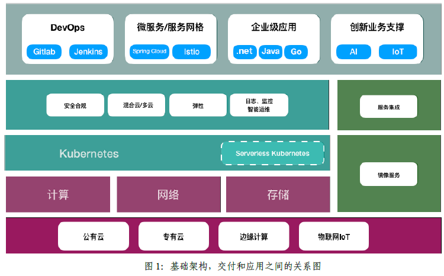
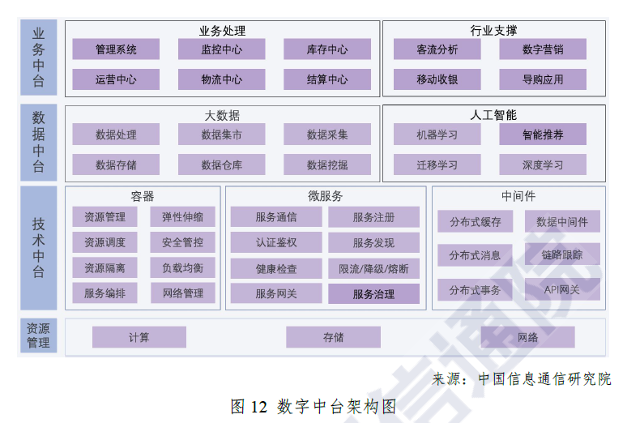
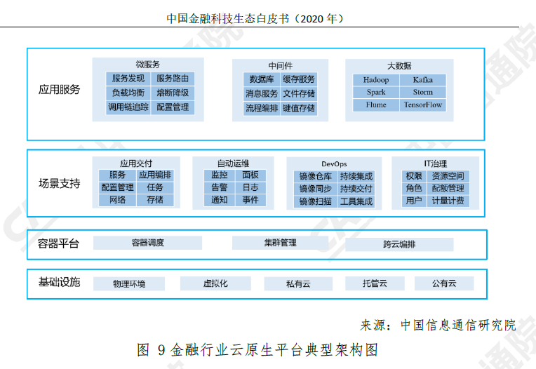
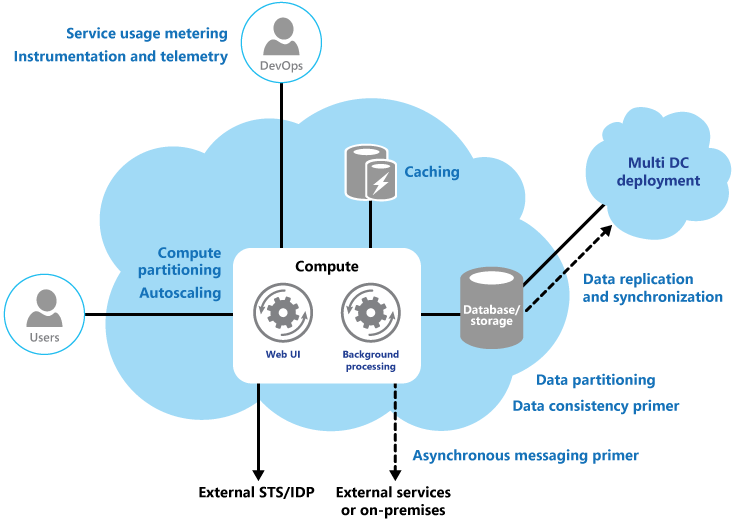
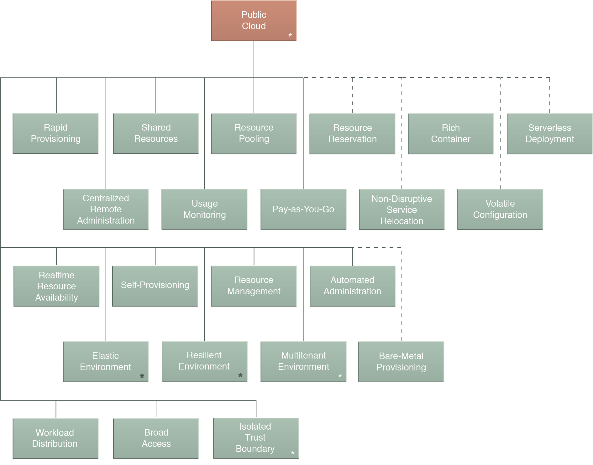

| 序号  | 修改时间     | 修改内容           | 修改人   | 审稿人 |
| --- | -------- | -------------- | ----- | --- |
| 1   | 2018-8-4 | 创建。从《微服务架构》拆分。 | Keefe |     |
|     |          |                |       |     |

    

---

# 目录

[TOC]

 

---

# 1 云原生

定义：云原生技术用于开发一类特别的应用程序，这类应用程序通过容器中的服务构建，然后按照微服务的形式部署，并通过 DevOps 敏捷流程以及可持续交付工作流在弹性基础设施上进行管理。

云原生 = 容器 + 微服务 + 容器编排 + devops（CI/CD）

**云原生组织**

* OCI：开放容器计划（Open Containers Initiative，OCI），这是一个轻量级、开放的治理结构（或项目），在 Linux 基金会的支持下产生，其明确的目的就是围绕容器格式和运行时创建开放的行业标准。

* **CNCF**，云原生计算基金（Cloud Native Computing Foundation），一个致力于云计算普及化和可持续化的开源软件组织。

## 1.1   云原生CNCF简介

[CNCF](https://www.cncf.io)（Cloud Native Computing Foundation）于 2015 年 7 月成立，隶属于 Linux 基金会，初衷围绕“云原生”服务云计算，致力于维护和集成开源技术，支持编排容器化微服务架构应用。

CNCF 还帮助项目建立了治理结构。CNCF 提出了成熟度级别的概念：沙箱、孵化和毕业。这些级别分别对应下图中的创新者、早期采用者和早期大众。

图 1 CNCF 项目成熟等级

CNCF项目列表 详见 《[CNCF云原生框架分析.md](./CNCF云原生框架分析.md)》

## 1.2  云服务成功案例

**Amazon**

电商。1995年创立；2006年推出AWS云服务；2007年推出kindle阅读器进军硬件市场。

**Netflix**

流媒体服务提供商。1997年创立；2009，开始使用AWS。

**Heroku**

Heroku 创办于 2007 年，是最早成熟的 PaaS 产品之一。Heroku 也是最早喊出“以应用为中心”，大规模帮助应用上云的产品。Heroku是闭源的封闭生态，因此后面K8s的出现很快使得Heroku影响力大减。

 

## 本章参考

[1].  值得考虑的9个开源云原生项目  http://3g.163.com/dy/article/EOSVH9QR0511D3QS.html

 

# 2 云原生架构

云原生架相关

* 十二要素应用程序：应用程序开发模式的集合。
* 微服务：将单体业务系统分解为独立可部署服务。
* 自服务敏捷基础设施：自服务平台。
* 基于API的协作：通过API进行服务间的交互。
* 搞脆弱性：自我实现和加强的应用程序。

## 2.1  云原生特性

云原生架构的特性

* 以云为基础架构IAAS
* 云服务 PAAS+SAAS
* 无服务器架构
* 可扩展：扩展策略有根据资源、时间段、消息队列长度、业务参数和预测。
* 高可用
* 敏捷
* 云优先

### 12-Factor 十二要素

2011 年，Heroku 的联合创始人 Adam Wiggins 根据针对上百万应用托管和运维的经验，发布了著名的 “十二要素应用宣言（The Twelve-Factor App）”。

12-Factor 为构建如下的 SaaS（软件即服务） 应用提供了方法论（目标）：

* 使用标准化流程自动配置，从而使新的开发者花费最少的学习成本加入这个项目。
* 和操作系统之间尽可能的划清界限，在各个系统中提供最大的可移植性。
* 适合部署在现代的云计算平台，从而在服务器和系统管理方面节省资源。
* 将开发环境和生产环境的差异降至最低，并使用持续交付实施敏捷开发。
* 可以在工具、架构和开发流程不发生明显变化的前提下实现扩展。
* 这套理论适用于任意语言和后端服务（数据库、消息队列、缓存等）开发的应用程序。

**十二要素详解**

1) 基准代码：一份基准代码（Codebase），多份部署（deploy）。通常会使用版本控制系统加以管理，如Git, Mercurial, Subversion。

2) 依赖：显式声明依赖关系（dependency），如maven或setup.py

3) 配置：在环境中存储配置。判断一个应用是否正确地将配置排除在代码之外，一个简单的方法是看该应用的基准代码是否可以立刻开源，而不用担心会暴露任何敏感的信息。12-Factor推荐将应用的配置存储于 环境变量 中（ env vars, env ）。

4) 后端服务：把后端服务(backing services)当作附加资源。部署可以按需加载或卸载资源。

5) 构建，发布，运行：严格分离构建和运行。

6) 进程：以一个或多个无状态进程运行应用。任何需要持久化的数据都要存储在 后端服务 内，比如数据库。

7) 端口绑定：通过端口绑定(Port binding)来提供服务。12-Factor 应用完全自我加载 而不依赖于任何网络服务器就可以创建一个面向网络的服务。互联网应用 通过端口绑定来提供服务 ，并监听发送至该端口的请求。

8) 并发：通过进程模型进行扩展。

9) 易处理：快速启动和优雅终止可最大化健壮性。易处理（disposable）的，意思是说它们可以瞬间开启或停止。这有利于快速、弹性的伸缩应用，迅速部署变化的 代码 或 配置 ，稳健的部署应用。

10) 开发环境与线上环境等价：尽可能的保持开发，预发布，线上环境相同。缩小时间、人员和工具差异。

11) 日志：把日志当作事件流。

12) 管理进程：后台管理任务当作一次性进程运行。

## 2.2  云原生参考架构

图 云原生的基础架构，交付和应用之间的关系图

DevOps 理念提倡开发、测试、运维之间的高度协同，从而在完成高频率部署的同时，提高生产环境的可靠性、稳定性、弹性以及安全性，这在很大程度上消除了频繁发布的风险。

图 云原生的数字中台应用架构 （ 来自中国信通信的2020报告）

数字中台是将企业的共性需求进行抽象，并打造成平台化、组件化的系统能力，以接口、组件等形式共享给各业务单元使用。使企业可以针对特定问题，快速灵活地调用资源构建解决方案，为业务的创新和迭代赋能。

数字中台可分为业务中台、数据中台和技术中台。

表格 1 云原生参考架构

| 参考架构             | 部署特点                    | 扩展性        | 可用性     | 安全性         |
| ---------------- | ----------------------- | ---------- | ------- | ----------- |
| WEB应用的IAAS部署     | 基于VM                    | 向上（加资源）、横向 | 多节点、SLA | 防火墙、HTTPS   |
| WEB应用的PAAS部署     | 基于DOCKER、K8S管理          | 横向、POD     | 多POD    | 防火墙、HTTPS   |
| WEB应用的云原生架构      | SpringCloud、K8S         | 横向         | 多实例     | 防火墙、HTTPS   |
| WEB应用的多站点部署（云原生） | SpringCloud、K8S、多数据中心DC | 横向、DC扩容    | 多实例     | 防火墙、HTTPS   |
| SAAS应用的混合云集成     | LDAP                    | 用户定义SLA    |         | 防火墙、HTTPS   |
| IOT应用的云原生架构      | 消息驱动、大数据                | 横向         |         | IOT网关、HTTPS |

## 2.3 云架构要素

成功的云解决方案需要重点关注卓越体系结构的这五大要素：成本、DevOps、复原能力、可伸缩性和安全性。

| 构成要素   | 说明                  |
| ------ | ------------------- |
| 成本     | 管理成本以便最大程度地提供实现的价值。 |
| DevOps | 让系统在生产环境中持续运行的操作过程。 |
| 复原     | 系统从故障中恢复并继续正常运行的能力。 |
| 可伸缩性   | 系统适应负载变化的能力。        |
| 安全     | 保护应用程序和数据免受威胁。      |

 

## 本章参考

[1]:  https://www.sohu.com/a/157185937_287582   "容器编排巅峰对决-Mesos/Swarm/Kubernetes比较"
[2]: www.sohu.com/a/240907122_545428 "拿下中石油千万级大单，灵雀云如何在容器行业脱颖而出 | 爱分析调研 "
[3]:  http://blog.didispace.com/12factor-zh-cn/  "云原生应用的12要素"

 

# 3 云原生设计模式

## 3.1 云原生问题域和指南

表格2 云开发领域问题（八类）~来自于windows Azure

| 类别     | 描述                                                                                                                                                                                             | 涉及模式和指南                                                                            |
| ------ | ---------------------------------------------------------------------------------------------------------------------------------------------------------------------------------------------- | ---------------------------------------------------------------------------------- |
| 可用性    | 可用性指系统正常工作时间所占的比例，通常以运行时间百分比度量。 可用性受系统错误、基础结构问题、恶意攻击和系统负载的影响。  云应用程序通常向用户提供服务级别协议 (SLA)，因此，它们在设计上必须能够最大程度地保持可用性。                                                                               | 限流 、健康监控、多数据中心、基于队列的负载均衡                                                           |
| 数据管理   | 数据管理是云应用程序的关键要素，影响大部分质量属性。 出于性能、可伸缩性或可用性等方面的原因，数据通常托管在不同的位置并跨多个服务器，这可能会带来一系列的挑战。 例如，必须保持数据一致性，通常需要将不同位置的数据进行同步。                                                                                | 缓存驻留、事件溯源、CQRS命令和职责分离、索引表、物化视图、分片 、静态内容托管、令牌秘钥、Guide（缓存、数据分片、数据一致性、数据复制和同步）        |
| 设计和实现  | 合理的设计包括很多因素（例如组件设计和部署中的一致性与连贯性）、可简化管理和部署的可维护性，以及可允许在其他应用程序和其他方案中使用的组件和子系统的可重用性。 在设计和实施阶段做出的决策对云托管应用程序和服务的质量和总拥有成本具有巨大影响。                                                                       | CQRS、计算资源合并、领导者选举、管道和过滤器、运行时重配、外部存储配置、静态资源托管                                       |
| 消息传送   | 云应用程序的分布性要求消息基础结构在理想情况下能以松散耦合的方式连接组件和服务，从而将可伸缩性最大化。 异步消息受到广泛使用并提供了诸多好处，但也带来了许多挑战，如消息排序、有害消息管理和幂等性等。                                                                                            | 计算资源合并、管道和过滤器、优先队列、基于队列的负载均衡、调度代理管理者、Guide（异步消息）                                   |
| 管理和监控  | 云应用程序在远程数据中心内运行，在此中心内，无法完全控制基础结构，或者在某些情况下无法控制操作系统。 与本地部署相比，管理和监视难度更大。 应用程序必须公开运行时信息，以便管理员和操作员管理和监视系统，支持不断变化的业务要求和定制，而无需停止或重新部署应用程序。                                                            | 外部存储配置、静态资源托管、健康监控、Guide（服务调用统计、）                                                  |
| 性能和伸缩性 | 性能是指系统在给定的时间间隔内执行任何操作的响应能力，可伸缩性则是系统能够应对负载增大且不影响性能或随时增加可用资源的能力。 云应用程序往往会遇到可变工作负载和活动高峰。 预测这些变化（尤其是在多租户方案中）几乎是不可能的。 应用程序应该能够在限制范围内扩大以满足需求高峰，并在需求减少时缩小。 可伸缩性不仅涉及计算实例，而且还涉及其他要素，例如数据存储、消息传送基础结构，等等。 | CQRS、缓存驻留、计算资源合并、事件溯源、物化视图、索引表、优先队列、基于队列的负载均衡、分片、限流、静态内容托管、Guide（缓存、可扩展、数据一致、数据分片） |
| 弹性  | 复原能力是指系统能够在发生故障后进行恰当处理，然后恢复正常。 由于云托管的性质（应用程序通常是多租户的、使用共享平台服务、争用资源和带宽、通过 Internet 通信、在市售硬件上运行），出现暂时性故障和持久性故障的可能性增大。 快速高效检测故障并恢复是保持复原能力所必需的。                                                     | 断路器、补偿事务、领导者选举、重试、调度代理管理者                                                          |
| 安全性    | 安全性是防止超出设计使用范围的恶意或意外操作，并防止泄露或丢失信息的系统能力。 云应用程序暴露在受信任的本地边界之外的 Internet 上，通常向公众开放，并可能为不受信任的用户提供服务。 应用程序的设计和部署必须防范它们受到恶意攻击，将访问权限限制给经过批准的用户，并保护敏感数据。                                                | 令牌秘钥、联合身份、门卫                                                                       |

]

图 云应用程序开发关联的主题

表格 云应用的十大主题指南

| 主题                                                                                                                                  | 描述                                                                                                                                                                                                                                                                                                                                                                                                                                                                                                                                                                  |
| ----------------------------------------------------------------------------------------------------------------------------------- | ------------------------------------------------------------------------------------------------------------------------------------------------------------------------------------------------------------------------------------------------------------------------------------------------------------------------------------------------------------------------------------------------------------------------------------------------------------------------------------------------------------------------------------------------------------------- |
| [Asynchronous Messaging Primer](https://docs.microsoft.com/en-us/previous-versions/msp-n-p/dn589781(v%3dpandp.10))                  | Messaging is a key strategy employed in many distributed environments  such as the cloud. It enables applications and services to communicate  and cooperate, and can help to build scalable and resilient solutions.  Messaging supports asynchronous operations, enabling you to decouple a  process that consumes a service from the process that implements the  service.                                                                                                                                                                                       |
| [Autoscaling Guidance](https://docs.microsoft.com/en-us/previous-versions/msp-n-p/dn589774(v%3dpandp.10))                           | Constantly monitoring performance and scaling a system to adapt to  fluctuating workloads to meet capacity targets and optimize operational  cost can be a labor-intensive process. It may not be feasible to perform these tasks manually. This is where autoscaling is useful.                                                                                                                                                                                                                                                                                    |
| [Caching Guidance](https://docs.microsoft.com/en-us/previous-versions/msp-n-p/dn589802(v%3dpandp.10))                               | Caching is a common technique that aims to improve the performance and  scalability of a system by temporarily copying frequently accessed data  to fast storage located close to the application. Caching is most  effective when an application instance repeatedly reads the same data,  especially if the original data store is slow relative to the speed of  the cache, it is subject to a high level of contention, or it is far  away resulting in network latency.                                                                                        |
| [Compute Partitioning Guidance](https://docs.microsoft.com/en-us/previous-versions/msp-n-p/dn589773(v%3dpandp.10))                  | When deploying an application to the cloud it may be desirable to  allocate the services and components it uses in a way that helps to  minimize running costs while maintaining the scalability, performance,  availability, and security of the application.                                                                                                                                                                                                                                                                                                      |
| [Data Consistency Primer](https://docs.microsoft.com/en-us/previous-versions/msp-n-p/dn589800(v%3dpandp.10))                        | Cloud applications typically use data that is dispersed across data  stores. Managing and maintaining data consistency in this environment  can become a critical aspect of the system, particularly in terms of the concurrency and availability issues that can arise. You frequently need to trade strong consistency for performance. This means that you may  need to design some aspects of your solutions around the notion of  eventual consistency and accept that the data that your applications use might not be completely consistent all of the time. |
| [Data Partitioning Guidance](https://docs.microsoft.com/en-us/previous-versions/msp-n-p/dn589795(v%3dpandp.10))                     | In many large-scale solutions, data is divided into separate partitions  that can be managed and accessed separately. The partitioning strategy  must be chosen carefully to maximize the benefits while minimizing  adverse effects. Partitioning can help to improve scalability, reduce  contention, and optimize performance.                                                                                                                                                                                                                                   |
| [Data Replication and Synchronization Guidance](https://docs.microsoft.com/en-us/previous-versions/msp-n-p/dn589787(v%3dpandp.10))  | When you deploy an application to more than one datacenter, such as  cloud and on-premises locations, you must consider how you will  replicate and synchronize the data each instance of the application uses in order to maximize availability and performance, ensure consistency,  and minimize data transfer costs between locations.                                                                                                                                                                                                                          |
| [Instrumentation and Telemetry Guidance](https://docs.microsoft.com/en-us/previous-versions/msp-n-p/dn589775(v%3dpandp.10))  远程监控指南 | Most applications will include diagnostics features that generate custom monitoring and debugging information, especially when an error occurs.  This is referred to as instrumentation, and is usually implemented by  adding event and error handling code to the application. The process of  gathering remote information that is collected by instrumentation is  usually referred to as telemetry.                                                                                                                                                            |
| [Multiple Datacenter Deployment Guidance](https://docs.microsoft.com/en-us/previous-versions/msp-n-p/dn589779(v%3dpandp.10))        | Deploying an application to more than one datacenter can provide  benefits such as increased availability and a better user experience  across wider geographical areas. However, there are challenges that must be resolved, such as data synchronization and regulatory limitations.                                                                                                                                                                                                                                                                              |
| [Service Metering Guidance](https://docs.microsoft.com/en-us/previous-versions/msp-n-p/dn589796(v%3dpandp.10))  服务计量指南              | You may need to meter the use of applications or services in order to  plan future requirements; to gain an understanding of how they are used; or to bill users, organization departments, or customers. This is a  common requirement, particularly in large corporations and for  independent software vendors and service providers.                                                                                                                                                                                                                            |

表格4  云原生DFX和设计模式对照表

| DFX  | 模式名    | 模式简介                   |
| ---- | ------ | ---------------------- |
| 可用性  | 限流     | 常用限流算法有令牌桶和漏洞（丢弃超量请求）。 |
|      | 熔断器    |                        |
|      | 断路器    | 适用于应用持久故障。             |
|      | RETRY  | 指定异常超时重试若干次。适用于应对瞬时故障。 |
|      | 服务降级   | 按降级粒度可分为接口、功能和服务。      |
|      | 健康终端监控 | 类似运营监控，定时监控API/服务的存活。  |
| 安全性  |        | 包括联合身份、门卫、令牌秘钥         |
|      | 联合身份   | 类似SSO中的验证。             |
|      | 门卫     |                        |
|      | 令牌秘钥   | 类似sGov，动态验证Token。      |
| 可扩展性 | ROUTE  |                        |
| 可修改性 |        | 包括外部配置存储、运行时重配         |
| 性能   |        | 包括缓存驻留、计算资源合并          |

## 3.2 云原生设计模式1 （适用于SAAS）

表格  云原生设计模式~来自于windows Azure (共37个，在2015年版24个上新增13个)

| 模式                                                                                                    | 摘要                                                                   |
| ----------------------------------------------------------------------------------------------------- | -------------------------------------------------------------------- |
| 【N】[代表](https://docs.microsoft.com/zh-cn/azure/architecture/patterns/ambassador)                      | 创建代表客户服务或应用程序发送网络请求的帮助程序服务。                                          |
| 【N】[防损层](https://docs.microsoft.com/zh-cn/azure/architecture/patterns/anti-corruption-layer)          | 在现代应用程序与旧系统之间实施外观或适配器层。                                              |
| 【N】[异步请求-答复](https://docs.microsoft.com/zh-cn/azure/architecture/patterns/async-request-reply)        | 在后端处理需要是异步处理但前端仍需要明确响应的情况下，将后端处理与前端主机分离。                             |
| 【N】[用于前端的后端](https://docs.microsoft.com/zh-cn/azure/architecture/patterns/backends-for-frontends)     | 创建单独的后端服务，供特定的前端应用程序或接口使用。                                           |
| 【N】[隔层](https://docs.microsoft.com/zh-cn/azure/architecture/patterns/bulkhead)                        | 将应用程序的元素隔离到池中，这样，如果一个元素发生失败，其他元素可继续工作。                               |
| [缓存端](https://docs.microsoft.com/zh-cn/azure/architecture/patterns/cache-aside)                       | 将数据按需从数据存储加载到缓存中                                                     |
| [协调](https://docs.microsoft.com/zh-cn/azure/architecture/patterns/choreography)                       | 让每项服务都参与决定业务运营的处理时间和处理方式，而不是依赖于一个中心型业务流程协调程序。                        |
| [断路器](https://docs.microsoft.com/zh-cn/azure/architecture/patterns/circuit-breaker)                   | 连接到远程服务或资源时处理故障，此类故障所需修复时间不定。                                        |
| 【N】[声明检查](https://docs.microsoft.com/zh-cn/azure/architecture/patterns/claim-check)                   | 将大型消息拆分成声明检查和有效负载，以免消息总线过载。                                          |
| [补偿事务](https://docs.microsoft.com/zh-cn/azure/architecture/patterns/compensating-transaction)         | 撤销一系列会共同定义最终一致操作的工作。                                                 |
| [竞争性使用者](https://docs.microsoft.com/zh-cn/azure/architecture/patterns/competing-consumers)            | 使多个并发使用者能够处理同一消息通道上收到的消息。                                            |
| [计算资源合并](https://docs.microsoft.com/zh-cn/azure/architecture/patterns/compute-resource-consolidation) | 将多个任务或操作合并到单个计算单元                                                    |
| [CQRS](https://docs.microsoft.com/zh-cn/azure/architecture/patterns/cqrs)                             | 使用独立接口将读取数据的操作与更新数据的操作分离。                                            |
| [事件溯源](https://docs.microsoft.com/zh-cn/azure/architecture/patterns/event-sourcing)                   | 使用只追加存储来记录描述域中数据采取的操作的完整系列事件。                                        |
| [外部配置存储](https://docs.microsoft.com/zh-cn/azure/architecture/patterns/external-configuration-store)   | 将配置信息从应用程序部署包移出，移到一个集中的位置。                                           |
| [联合标识](https://docs.microsoft.com/zh-cn/azure/architecture/patterns/federated-identity)               | 将身份验证委托给外部标识提供者。                                                     |
| 【N】[守护程序](https://docs.microsoft.com/zh-cn/azure/architecture/patterns/gatekeeper)                    | 通过使用专用的主机实例保护应用程序和服务，该实例用于充当客户端和应用程序或服务之间的中转站、验证和整理请求，并在它们之间传递请求和数据。 |
| 【N】[网关聚合](https://docs.microsoft.com/zh-cn/azure/architecture/patterns/gateway-aggregation)           | 使用网关可将多个单独请求聚合成一个请求。                                                 |
| 【N】[网关卸载](https://docs.microsoft.com/zh-cn/azure/architecture/patterns/gateway-offloading)            | 将共享或专用服务功能卸载到网关代理。                                                   |
| 【N】[网关路由](https://docs.microsoft.com/zh-cn/azure/architecture/patterns/gateway-routing)               | 使用单个终结点将请求路由到多个服务。                                                   |
| [运行状况终结点监视](https://docs.microsoft.com/zh-cn/azure/architecture/patterns/health-endpoint-monitoring)  | 在应用程序中实施可让外部工具通过公开终结点定期访问的功能检查。                                      |
| [索引表](https://docs.microsoft.com/zh-cn/azure/architecture/patterns/index-table)                       | 基于数据存储中经常由查询引用的字段创建索引。                                               |
| [领导选拔](https://docs.microsoft.com/zh-cn/azure/architecture/patterns/leader-election)                  | 通过选拔一个实例作为领导来负责管理其他实例，协调分布式应用程序中协作性任务实例集合所执行的操作。                     |
| [具体化视图](https://docs.microsoft.com/zh-cn/azure/architecture/patterns/materialized-view)               | 当未针对所需的查询操作完美设置数据的格式时，在一个或多个数据存储中基于数据生成预填充的视图。                       |
| [管道和筛选器](https://docs.microsoft.com/zh-cn/azure/architecture/patterns/pipes-and-filters)              | 将一个执行复杂处理的任务分解为一系列可重复使用的单个元素。                                        |
| [优先级队列](https://docs.microsoft.com/zh-cn/azure/architecture/patterns/priority-queue)                  | 为发送到服务的请求确定优先级，以便高优先级请求能够得到比低优先级请求更快速地接收和处理。                         |
| [发布方/订阅方](https://docs.microsoft.com/zh-cn/azure/architecture/patterns/publisher-subscriber)          | 使应用程序能够以异步方式向多个感兴趣的使用者公布事件，而无需将发送方与接收方耦合。                            |
| [基于队列的负载调控](https://docs.microsoft.com/zh-cn/azure/architecture/patterns/queue-based-load-leveling)   | 使用队列在任务与所调用的服务之间充当缓冲，从而缓解间歇性负载过大现象。                                  |
| [重试](https://docs.microsoft.com/zh-cn/azure/architecture/patterns/retry)                              | 当应用程序尝试连接到服务或网络资源时，使应用程序能够通过以透明方式重试先前失败的操作来处理预期的临时故障。                |
| [计划程序代理监督程序](https://docs.microsoft.com/zh-cn/azure/architecture/patterns/scheduler-agent-supervisor) | 跨一组分布式服务和其他远程资源协调一组操作。                                               |
| [分片](https://docs.microsoft.com/zh-cn/azure/architecture/patterns/sharding)                           | 将数据存储划分为一组水平分区或分片。                                                   |
| 【N】[Sidecar](https://docs.microsoft.com/zh-cn/azure/architecture/patterns/sidecar)                    | 将应用程序的组件部署到单独的进程或容器中，以提供隔离和封装。                                       |
| [静态内容托管](https://docs.microsoft.com/zh-cn/azure/architecture/patterns/static-content-hosting)         | 将静态内容部署到基于云的存储服务，再由后者将它们直接传送给客户端。                                    |
| 【N】[Strangler](https://docs.microsoft.com/zh-cn/azure/architecture/patterns/strangler)                | 通过将特定的功能片断逐渐取代为新的应用程序和服务，逐步迁移旧系统。                                    |
| [限制](https://docs.microsoft.com/zh-cn/azure/architecture/patterns/throttling)                         | 控制应用程序实例、单个租户或整个服务对资源的消耗。                                            |
| [附属密钥](https://docs.microsoft.com/zh-cn/azure/architecture/patterns/valet-key)                        | 使用令牌或密钥，向客户端授予对特定资源或服务的受限直接访问权限。                                     |

备注：【N】表示？

表格3 云原生设计模式~来自于windows Azure (24个，2014)

| 模式名       | 描述                                            | 背景和问题                  | 解决方案                                 | 应用场景                  |
| --------- | --------------------------------------------- | ---------------------- | ------------------------------------ | --------------------- |
| 缓存驻留      | 根据需要从数据存储器加载数据。                               |                        | 此模式可以用来改进性能，用于维护缓存和后台数据库的数据一致性。      |                       |
| 断路器       | 当连接远程服务或资源时，可能导致不定时间恢复系统的错误。                  |                        | 用于改进系统的稳定性和弹性。                       |                       |
| 补偿事务      | 如果一个或多个操作失败，就会取消执行的一系列工作。                     | 如何处理已经无法挽回的失败步骤        | 遵从最终一致性模型。通常用于实现复杂的业务过程和工作流。         | 针对发生 异常必须撤销的操作。       |
| 竞争消费者     | 允许多个并发消费者在相同的消息通道上处理接收的消息                     |                        |                                      |                       |
| 计算资源合并    |                                               |                        |                                      |                       |
| 命令和职责分离   | 通过隔离接口来分离更新和读操作。                              | 传统CRUD方法更麻烦，权限管理不安全    |                                      |                       |
| 事件溯源      | 构造领域对象的模式。使用只能追加的存储库来记录领域里数据库的完整操作序列。         | 传统CRUD方法只保存当前状态        | 使用一系列事件去处理对数据的操作。                    | 避免冲突；审计               |
| 外部配置存储    | 把配置信息从应用部署包移动到一个中心位置。（应用配置中心）                 |                        |                                      |                       |
| 联合身份      |                                               |                        |                                      |                       |
| 门卫        |                                               |                        |                                      |                       |
| 健康终结点监控   | 在应用中实现功能检查。                                   | SLA协议要求定期检测服务是否正确执行    | 通过向终结点发送请求来实现健康监控。                   | 检查可用性                 |
| 索引表       |                                               | 云应用RDS不提供二级索引          |                                      | 经常使用非主键来查询数据。         |
| 领导选举      | 选取一个实例作为领导者承担管理其它实例的责任，并通过这种方式协调一系列协作任务实例的运行。 | 任务实例是平等的。              | 选举机制：                                | 分布式任务需要协调并且没有天然的领导者。  |
| 物化视图      |                                               | 存储数据和读取数据者分离           | 提前生成一个适合结果集格式的物化视图。                  |                       |
| 管道和过滤器    | 可将一个处理复杂问题的任务分解为一系列可重用的离散元素。                  | 任务顺序可能变化，期望代码重用        | 将每个管理处理分解成一组离散组件（或过滤器），每个离散组件执行单个任务  |                       |
| 优先级队列     | 可为请求确定优先级，使得高优先级请求能够比优先处理。                    |                        | 支持消息优先级的队列                           |                       |
| 基于队列的负载均衡 |                                               |                        | 队列                                   |                       |
| 重试        | 连接服务或网络资源时，如果发生预期的瞬时故障，可以通过重试操作来处理故障。         | 服务可能因临时故障超时。           |                                      | 适用于暂时故障               |
| 运行时配置     | 重新配置时无需重新部署或启动的应用程序，有且于保持系统可用性。               | 日志组织或特定功能开关            | 依赖于应用程序托管环境中可用功能。                    |                       |
| 调度器代理监控   | 协调在分布式服务和其它远程资源上的行为。                          |                        | 定义三个角色：调度器、代理和管理者。                   | 进程位于分布式环境。            |
| 分片        | 存储和访问海量数据时，改进伸缩性。                             | 数据存储限制                 | 将数据划分为水平分区或分片。分片策略包括ID、范围、哈希等        |                       |
| 静态内容托管    | 将静态文件部署到一个基于云计算的存储服务，可以直接向用户传输这些文件的模式。        | 需要下载静态页面。              | 云计算托管存储比计算实例便宜。分开部署。                 |                       |
| 限流        | 控制资源消费的模式。                                    | 自动回收计算资源。              | 给应用程序设置软阀值，达到范围就开始限流。                | 保证SLA；阻止某租户垄断资源；应对暴流。 |
| 令牌秘钥      | 用令牌或者秘钥限制客户端对于特定资源或服务的访问。                     | 数据存储库无法进行客户端验证和授权控制访问。 | 限制对数据存储库的公开连接访问，提供给客户端一个可以验证的令牌或者秘钥。 |                       |

备注：1. 模式组合：

* 重试+断路器：重试模式适用用于处理瞬时故障，如果故障预计更持久，则要使用断路器模式。二者结合使用，以提供全面处理故障的方法。
* 外部配置存储+运行时重配：外部配置通知更新，应用程序能监测到配置变化。
2. 依赖于消息队列：管道过滤器、优先队列、竞争消费者、基于队列的负载均衡

## 3.3 云原生设计模式2 （适用于IAAS&PAAS）

| 模式组                | 模式     | 模式简介                                                                                                                                                     |
| ------------------ | ------ | -------------------------------------------------------------------------------------------------------------------------------------------------------- |
| 共享、伸缩性和弹性          |        | 17个模式，分别是共享资源、工作负载分布、动态可伸缩性、服务负载均衡、 弹性资源容量、弹性网络容量、LA虚拟服务器、LA虚拟交换机、 服务状态管理、存储工作负载管理、动态数据规范化、 跨存储设备垂直分层、存储设备内垂直数据分层、内存过度分配、 网卡聚合、广泛访问          |
|                    | 共享资源   | 如何发挥物理IT资源容量的潜力                                                                                                                                          |
|                    | 工作负载分布 | 如何避免IT资源过度使用                                                                                                                                             |
|                    | 动态可伸缩性 | IT资源如何自动伸缩，以应对需求的变动                                                                                                                                      |
|                    | 服务负载均衡 | 云服务如何适应增加的工作负载                                                                                                                                           |
| 可靠性、适应性和恢复         |        | 12个模式，分别是资源池化、资源保留、虚拟化管理器集群、 冗余存储、动态故障检测与恢复、多路径资源访问、 为VS建立冗余物理连接、同步操作状态、零停机时间、 存储维护窗口、VS自动崩溃恢复、非破坏性服务重定位                                        |
| 数据管理和存储            |        | 14个模式，分别是直接IO访问、直接LUN访问、单根IO虚拟化、 云存储静态数据加密、云存储数据生命周期管理、云存储数据管理、 云存储数据放置依从性检查、云存储设备屏蔽、云存储设备路径屏蔽、 云存储设备性能实施、虚拟磁盘扫拆分、子LUN分层、 基于RAID的数据放置、IP存储隔离 |
| 虚拟服务器、虚拟化管理器       |        |                                                                                                                                                          |
| 监控、配给和管理           |        |                                                                                                                                                          |
| 云服务和存储安全性          |        |                                                                                                                                                          |
| 网络安全性、身份和访问管理及信任保证 |        |                                                                                                                                                          |
| 复合模式组              |        | 17种模式，分别是私有云、公有云、SAAS、PAAS、 IAAS、弹性环境、多租户环境、适用性环境、云爆发、 云平衡、云身份验证、资源工作负载管理、隔离信任边界                                                                   |

### 共享、伸缩性和弹性模式组

表格 共享、伸缩性和弹性模式组里的模式列表

| 模式名       | 问题                              | 解决方案                                  | 应用场景                                               | 机制                                    |
| --------- | ------------------------------- | ------------------------------------- | -------------------------------------------------- | ------------------------------------- |
|  共享资源 | 为个人消费者分配专用 IT资源可能产生浪费，不能充分利用总容量 | 物理IT资源划分为较小容量的虚拟IT实例，配给到多个云消费者，以此实现共享 | 虚拟化技术共享物理IT资源的虚拟实例，每个虚拟化IT资源分配给一个云消费者，物理IT资源却是共享的。 | 审计监视器、云存储设备、云虚拟化管理器、虚拟CPU、虚拟RAM、虚拟服务器 |
| 工作负载分布    | 如何避免IT资源过度复用                    | IT资源进行水平伸缩，使用负载均衡系统在多个IT资源中分布运行工作时负载  | 云架构中加入负载均衡技术                                       | 负载平衡器、...                             |
| 动态可伸缩性    |                                 |                                       |                                                    |                                       |

### 复合模式组 Compound

复合模式其实是多个模式组的混合，是一种产品解决方案。

图  公有云的复合模式

说明：公有云是在私有云基础上，多租户的私有云基本类似公有云。

## 容器设计模式

区别于之前的面向对象的设计模式。

 表格 5 容器设计模式列表

| 容器数      | 模式名                            | 模式简介                                                                            |
| -------- | ------------------------------ | ------------------------------------------------------------------------------- |
| 单容器      |                                |                                                                                 |
| 单节点多容器组合 | 跨斗模式（Sidecar pattern）          | 多容器通过共享文件系统形成本地通信，共同提供一个微服务。                                                    |
|          | 外交官模式（Ambassador pattern）      | 应用容器和外交官容器共享一个网络IP地址，应用容器利用这个可重用的外交官容器作为代理来访问远程服务或资源。                           |
|          | 适配器模式（Adapter pattern）         | 应用容器提供应用功能，同时和一个适配器容器共享文件系统和一个网络IP地址，分布式系统管理平台可以利用适配器容器的统一接口，从应用容器收集日志和监控数据等信息。 |
| 多节点组合    | 选举模式（Election pattern）         | 一个可重用的选举器容器跟应用容器组合起来，提供为在分布式系统中的多个应用实例选举主控节点的问题。                                |
|          | 工作队列模式（Work queue pattern）     | 应用容器跟可重用的队列消息处理器，共同工作，可以并行地处理队列中海量的同类型并行计算业务。                                   |
|          | 分散收集模式（Scatter/gather pattern） | 通过先将大任务分割成诸多小任务处理，在收集汇总合并产生最终结果的模式，支持复杂任务的分布式计算。                                |

 

## 本章参考

[1]:  https://www.jianshu.com/p/020f699c41e6  "容器设计模式"
[2]:  http://www.dockerinfo.net/2067.html    "《Kubernetes与云原生应用》之容器设计模式"
[3]:  http://www.dockone.io/article/1547  "基于容器的分布式系统的设计模式"
[4]:  https://docs.microsoft.com/zh-cn/azure/architecture/patterns/  "windows azure云设计模式（持续更新）"
[5]:  https://docs.microsoft.com/en-us/previous-versions/msp-n-p/dn568099(v=pandp.10)   "Cloud Design Patterns: Prescriptive Architecture Guidance for Cloud Applications (2015)"

 

# 4 云原生技术

* Docker  详见 《[Docker用户手册.md](../软件可复用/tools.工具/Docker用户手册.md)》
* Kubernetes  详见 《[kubernetes用户手册.md](../../软件可复用/tools.工具/kubernetes用户手册.md)》
* 容器编排  详见 《[运维专题.md](../../软件工程/运维专题.md)》容器编译章节
* Serverless、Service Mesh  详见 《[微服务架构.md](../../软件可复用/arch.架构/微服务架构.md)》

 

## 本章参考

* 解读云原生的2021：抢占技术C位，迎来落地大爆发  https://mp.weixin.qq.com/s/9vaUJp2TzAEAIrHl8jhGvA

 

# 参考资料

**参考书籍**

* 《[云计算架构设计模式](https://docs.microsoft.com/zh-cn/azure/architecture/patterns/)》 微软模式与实践小组（微软P&P小组） 华中科技大学出版社  2017年10月
* 《[云计算设计模式](https://patterns.arcitura.com/cloud-computing-patterns)》 姚军译  机械工业出版社  2016.5
* 《Service Mesh实战 : 基于Linkerd和Kubernetes的微服务实践》 杨章显 / 机械工业出版社 / 2018-11

**参考资料**

[1]:  https://www.jianshu.com/p/f78864310827 "基于 Docker 的微服务架构实践"
