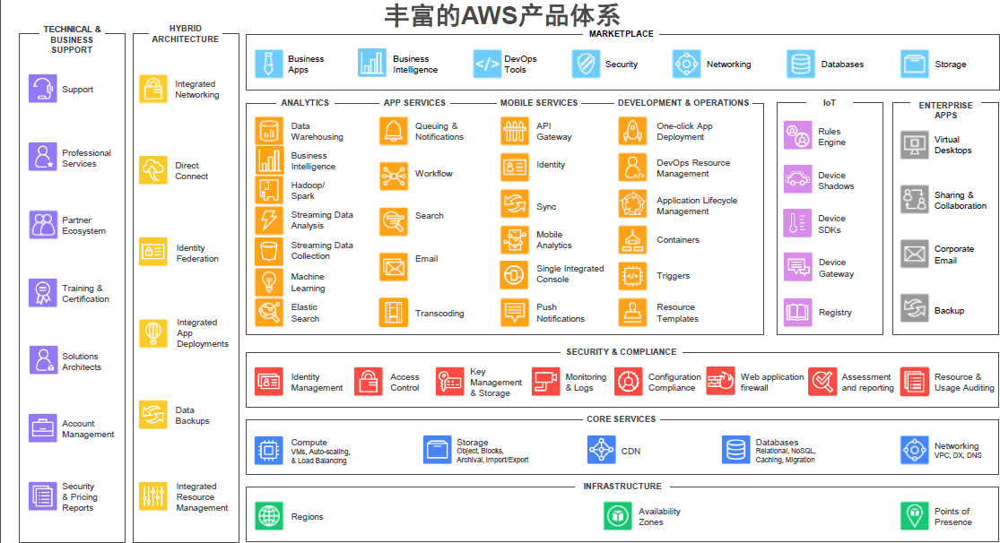
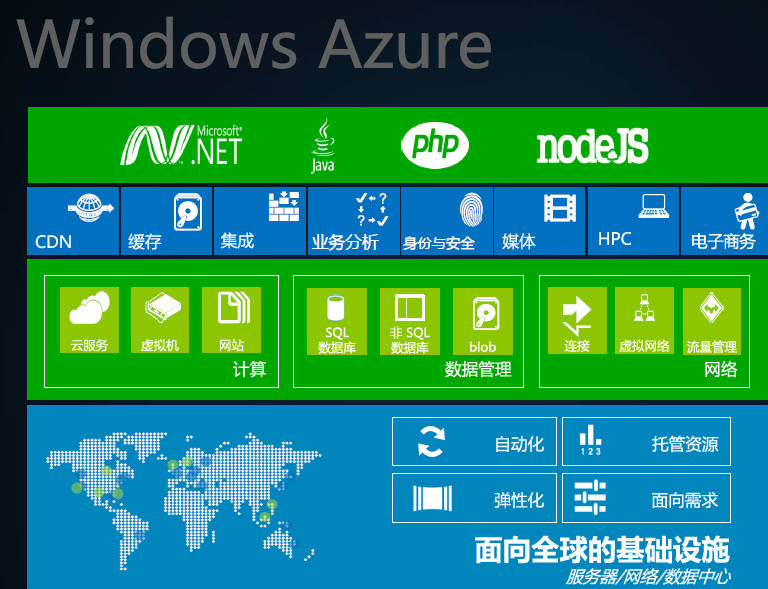
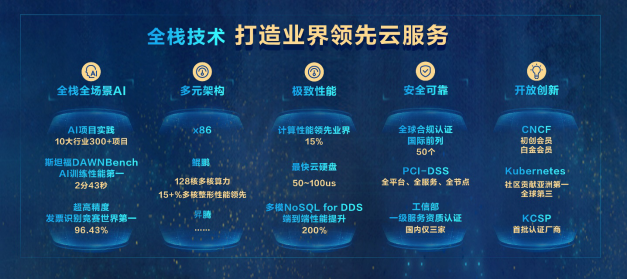

| 序号 | 修改时间   | 修改内容                       | 修改人 | 审稿人 |
| ---- | ---------- | ------------------------------ | ------ | ------ |
| 1    | 2019-12-14     | 创建。从《云计算专题》拆分。                          | 吴启福 |  |
| 2 | 2021-5-19 | 增加云服务试用章节 | 同上 |  |

---

[TOC]

----

## 1 云服务简介

 

图 5 云计算产业图

说明：
*  IAAS: 如云存储，各个提供相片文档存储的企业属于此范围。
*  PaaS: google的appengine提供了开发平台, 百度的框计算。
*  SaaS: 如瑞星云安全，阿里云软件等。

 

云计算受到国内外高度重视，业界纷纷推出不同类型(IaaS, PaaS, SaaS)的云平台。

2009年始，硬件厂商IBM、惠普、思科、富士通选择OpenStack的研发路线，最终硬件厂商的云计划宣告失败。 2016年惠普宣布关闭公有云平台Helion转向混合云，2017年3月，思科关闭公有云平台Inter-cloud转向混合云。

 

图 6 国内外各云服务提供商

## 2 国外云服务提供商

| 公司       | 研发进展                                                     |
| ---------- | ------------------------------------------------------------ |
| Amazon     | 向用户提供基于Amazon万亿级计算业务架构的云计算服务提供商。2019年占据全球48%的云计算市场。 |
| Google     | 推出自主研发的万亿级数据中心架构。                           |
| 微软       | 推出Windows Azure产品。                                      |
| IBM        | 推出Hulk和Main集群NAS硬件及软件产品。                        |
| Dell/EMC   | 推出Hulk和Main集群NAS硬件及软件产品。2015年10月，EMC被Dell收购。 |
| Oracle/Sun | 推出ZFS文件系统、低端x4500存储服务器和开源Solaris 10软件。   |
| NetApp     | 专门针对 NAS和AN产品的操作系统ONtap GX中提供了集群技术。     |
| 惠普       | 联播英特尔、雅虎推出云计算试验台。                           |
| ISilon     | 推出目前全球最大的NAS集群，此集群有100个节点，理论上支持2.3PB存储。 |

### Amazon~ AWS

https://aws.amazon.com/

http://www.amazonaws.cn/  ->  https://aws.amazon.com/cn

 Amazon Web Services (AWS) 是全球最全面、应用最广泛的云平台，从全球数据中心提供超过 175 项功能齐全的服务。数百万客户（包括增长最快速的初创公司、最大型企业和主要的政府机构）都在使用 AWS 来降低成本、提高敏捷性并加速创新。

AWS产品服务 

* 弹性存储：Simple Storage Service(S3)、块存储EBS、对象存储

* 服务器租用与托管服务Elastic Compute( EC) 。

* 数据库服务：Amazon Aurora(RDS)、DynomoDB(NoSQL)、ElasticCache(Cache)

* Lambda：无服务器，事件驱动的计算服务

  

### Microsoft~Azure

https://docs.azure.cn/zh-cn/

 

图 7  MS云计算架构

基于以上架构，微软能为企业提供两种云计算部署类型，即公共云和私有云。

公共云：由微软自己运营，为客户提供部署和应用服务。在公共云中，Windows Azure Platform是一个高度可扩展的服务平台，提供基于微软数据中心随用随付费的灵活的服务模式。

私有云：部署在客户的数据中心内部，基于客户个性化的性能和成本要求、面向服务的内部应用环境。这个云平台基于成熟的Windows Server和System Center等系列产品，并且能够与现有应用程序兼容。

**Windows Azure**

Windows Azure是微软基于[云计算](https://baike.baidu.com/item/云计算/9969353)的操作系统，现在更名为“Microsoft Azure”，和Azure Services Platform一样，是微软“软件和服务”技术的名称。Windows Azure的主要目标是为开发者提供一个平台，帮助开发可运行在[云服务器](https://baike.baidu.com/item/云服务器/6392664)、[数据中心](https://baike.baidu.com/item/数据中心/967340)、Web和PC上的应用程序。

Windows live**

 面对Google的挑战，微软试图以Windows Live为基础，联结起数以亿计的Windows用户，并向他们提供云计算，在线存储是微软迈出的关键一步，比尔.盖茨在2007年夏天说：“当你想到存储，就会想到Windows Live。”
*  Find and Discover Information（个人信息获取），如：Windows Live Search(个
*  性化搜索)
*  Enhance and Deepen Relationship（个人信息管理），如：Windows Live Mail(邮
*  件) ，Windows Live Messenger(即时通讯)
*  Explore and Find New Interest（社会化网络），如：Windows Live Spaces(Blog)
*  Protection and Performance（安全与维护），如：Windows Live Safety Center(在
*  线安全中心)
*  Microsoft Office Live（中小企业在线发布和管理系统），如：Microsoft Office
*  Live Basics(类似于企业Blog)
*  Xbox Live（游戏在线服务），如：Xbox Live Arcade on Xbox 360(游戏的在线下

载及购买服务)

 

**微软MSN服务将整合到Skype的网络**

微软今日（2012年11月7日）正式宣布MSN服务将在2013年第一季度停止使用（中国除外），整合到Skype的网络中。微软想要对Messenger 用户表明的价值主张如下：
*  Skype能支持更加广泛的设备，其中包括iPad和Android平板。
*  Skype能将IM(即时通信）、视频以及固网和移动通话服务合为一体。
*  Skype能提供手机视频通话服务。
*  Skype能提供Facebook好友视频通话服务。
*  Skype能提供群视频通话服务。

### Google

Google和微软之间日益激烈的对立将是一场史诗般的企业战争，将对两家公司的成功和发展产生重要影响，并规定着消费者和企业如何工作、购物、通讯，以及“过他们的数字生活”。

Google认为这一切将发生在遥远的数据中心中的服务器，用户可以通过许多有线和无线设备访问这些服务，这就是所谓的“云计算”（cloud computing）；微软也认为未来在于Web，但它的重心仍然是其桌面PC软件。而这正是它们的冲突之源。

施密特认为：“当今年早些时候Google推出一款名为Google Apps的软件包时，没有人认为微软会被彻底打败。而Google Apps只 不过是Google通过互联网向用户提供更大计算能力计划的一个步骤。他表示，对于大多数人而言，计算机是复杂而不可靠的。如果Google能够通过 Web提供计算服务，将是人们计算体验的真正改进。随着互联网连接速度的提高和互联网软件的改进，“云计算”能够完成的任务会越来越多。90%计算任务都 能够通过“云计算”技术完成，其中包括几乎所有的企业计算任务和白领员工的任务”。 

施密特相信，无论他如何努力地避免激怒微软，Google与微软的摩擦是不可避免的。当然了，微软也不会停滞不前，它已经在搜索和互联网广告领域投资数十亿美元，以赶超Google，但迄今为止并没有获得成功。它们还在其它一些领域相互争斗，例如Web地图、手机软件。

对于微软而言，施密特的言论无异于是战书。在计算机上安装的传统软件是微软的根本，其官员认为90%的计算任务将转移到基于Web的“云计算”环境中的想法是一种幻想。

微软企业部门总裁莱科斯表示，拿目前的市场与未来的市场进行比较是错误的。在莱科斯看来，Google的挑战在理下，对微软的攻击被误导了，也是自大的。Google关注的是自己的利益，它是为了削弱微软，而不是满足客户的需求。 

莱科斯指出，微软在产品开发和客户研究上花费了数年时间并投入了数十亿美元，仔细研究了员工和企业使用软件的方式。确实，微软的优势在于其在办公软件市场上巨大的领先优势。业界分析人士称，Google不能在桌面软件领域与微软直接对抗。桌面软件正在向Web软件转型。

分 析人士指出，与最近数年微软战胜的其它对手相比，Google是一家完全不同的竞争对手：其规模更大、发展速度更快、财力雄厚、对人才有吸引力。 Google“云计算”技术是开放的。由Google的工程师自己设计的数据中心在节能、速度、成本方面很有优势，使得它能够以极低的成本增添运算能力。

施密特表示，中小企业、大学、消费者会相对迅速地转向基于Web的“云计算”技术。他说，通过采用Google和其它厂商提供的Web产品，小型企业可以大幅度地降低成本和减少技术难题。为了获得成功，Google需要赢得包括企业在内的大量信徒的支持。

 

**Google (appengine)**
http://code.google.com/intl/zh-CN/appengine/

http://appgallery.appspot.com/

http://code.google.com/appengine/

 

#### GAE：Google App Engine

Google Apps
*  Google Docs：将文档存储在Google的服务器上，而不是自己的电脑上。
*  Google Gmail ：当用户需求激增，Google的云计算系统会自动为Gmail增加容量和处理器的数量，而无需人工干预。
依赖云计算，谷歌能以几乎可以忽略不计的成本增加新的服务
  - 如果新增的服务失败了，那没关系，关掉并且忘掉它就可以。
  - 如果成功了，系统会自动为它增加空间和处理能力。

### IBM

IBM计划建立一个相当规模的商业模式，在大型数据中心方面进行有意义的技术开拓工作，以此激发大家的商业兴趣，并且利用遍布于互联网上的远程主机进行更高效的运行、搜索信息以及编写程序。 

据分析人士称，在面向企业级云计算的市场中，IBM正在着力把自己打造成行业的领导者。这个公司的战略是，销售更多为云计算量身定制的硬件、软件和服务。从2008年春季开始，IBM将会提供适用于云计算的服务器电脑，包括主机。

IBM正在封装的云计算软件名为Hsdoop，运行在Linux操作系统上。Hadoop基于名为Nutch的开源搜索项目以及Google的MapReduce（映射化简）软件，MapReduce用于连接大量电脑扩展复杂的计算任务，用于大规模数据集（大于1TB）的并行运算。

IBM的执行官认为，这个策略就如同他对Linux的支持，Linux是一款开源的操作系统，向人们提供微软之外的新的选择。IBM对Linux的支持从2000年便已经开始，包括了在市场开拓和技术开发方面的投入，加速了Linux在企业用户之中的应用。

IBM负责系统和技术团队的高级副总裁Willian M.Zeilter宣称：“对我来说，这种感觉就像2000年对Linux。”

IBM现在有200位研究员专注于云计算的工作，并且Zeitler先生表示，在今后三年的阶段规划中，IBM还会投入巨资，但是他没有透露具体数量。

IBM在数据中心高效运行上做了很多努力，并且集中桌面电脑和其他设备，在数据中心中运行更多的计算任务。它们被命名为“自动的”、“有效的”[网格计算](http://www.hudong.com/wiki/网格计算)。

 

图 8 IBM云计算架构体系

### Oralce/Sun

**Oracle的大数据解决方案：Oracle --> Oracle RAC --> Oracle Exadata**

2009年Sun被Oracle收购。

2008 年5月，Sun在2008JavaOne开发者大会上宣布推出“Hydrazine”计划。至此，集结在“云计算”旗帜之下的软件供应商又增加了一位重量 级成员。基于“Hydrazine”计划，Sun希望利用其核心技术打造一个包含网络环境、数据中心和其他基础设施组件在内的完整解决方案，如Sun的 JavaFX丰富互联网应用程序技术、Sun的Glassfish应用服务器、Sun企业服务总线、Sun目录服务器、MySQL、 “廉价存储”和Sun的硬件，从而使得开发人员利用Sun平台创建托管应用与服务，并且不用到任何其它地方就可以利用这些应用程序和服务赚钱。此外，作为 “Hydrazine计划”的一部分，Sun还推出了“Insight计划”。这个分析功能可以让开发人员知道谁在使用他们的产品，并且利用这个功能注入广告或者赚钱。

凭借此举，Sun正式进军“云计算”领域，也由此展开了与IBM、微软、Google等巨头的新一轮竞技。

### Vmware

 

## 3  国内云服务提供商

表格 2 国内主要云服务商列表

| 云服务 | 国内云服务厂商  | 具体描述                    |
| ------ | --------------- | --------------------------- |
| IAAS   | 世纪互联        | 数据中心服务供应商          |
|        | 曙光公司        | 数据中心                    |
|        | 浪潮信息        | 行业云，IaaS解决方案        |
|        | 中兴通讯        | 服务器、彩云Cloud云平台     |
|        | 华为            | Fusion Cloud                |
| PAAS   | 百度            | 百度开放云计算平台          |
|        | 中国移动        | 移动互联网云服务            |
|        | 800Apps         | 客户关系管理系统的平台服务  |
|        | 阿里云          | 电子商务的云平台服务        |
|        | 金蝶            | 金蝶中间件                  |
|        | Sina App Engine | 分布式Web服务开发、运行平台 |
|        | 华为            | 华为云平台服务              |
| SAAS   | 启明星辰        | 掌握云安全核心技术          |
|        | 用友软件        | ERP                         |
|        | 金蝶友商网      | 在线管理电子商务服务        |
|        | aAbex           | 管理软件与电子商务服务      |
|        | ShopEx          | 电子商务软件及服务          |

 

### 阿里云

https://www.aliyun.com/ 

阿里云，阿里巴巴集团旗下云计算品牌，全球卓越的云计算技术和服务提供商。创立于2009年，在杭州、北京、硅谷等地设有研发中心和运营机构。

**阿里云大事记**

2008年9月，阿里巴巴确定“云计算”和“大数据”战略，决定自主研发大规模分布式计算操作系统“飞天” 。

2008年10月，**飞天**团队正式组建。

2009年9月，阿里云计算有限公司正式成立。

2018年11月26日，阿里巴巴集团宣布阿里云升级阿里云智能，加强技术、智能互联网的投入和建设。

2019年6月18日，**阿里钉钉**进入阿里云智能事业群，钉钉CEO陈航向阿里巴巴集团CTO兼阿里云智能事业群总裁张建锋汇报。

2019年9月26日，在云栖大会上，阿里云智能副总裁、阿里云智能计算平台事业部总经理贾扬清宣布，阿里云与Facebook达成合作。Facebook旗下的开源深度学习框架PyTorch将进驻阿里云机器学习平台。

2019年10月11日，阿里云确认拟全资收购长亭科技，收购完成后，长亭科技品牌及团队均保持独立。

2019年10月25日，IDC公布中国金融云市场排名：阿里云第一。

### 百度云

https://cloud.baidu.com/

早初百度云是网盘，但不受集团重视，发展滞后。

2012.8，百度推出云存储服务~百度云，免费最大2T永久空间。2016.10更名为[百度网盘](http://pan.baidu.com)。 

2015年，百度开放云正式开放运营；2016.10正式更名百度云。

2016年，百度正式对外发布了“[云计算](https://baike.baidu.com/item/云计算/9969353)+[大数据](https://baike.baidu.com/item/大数据/1356941)+[人工智能](https://baike.baidu.com/item/人工智能/9180)“（ABC战略~AI/Bigdata/Cloud）三位一体的云计算战略。

2019年4月11日，“百度云”品牌升级为“百度智能云”。

### 腾讯云

http://yun.qq.com/

云产品：TStack、TCE

### 华为云

公有云  https://www.huaweicloud.com/

2008年开始投入，2011年成立云BU，2017.8年升级为一级部门。2019.12.6成立华为云计算公司。

2019年3月，华为云发布全球合作伙伴体系HCPN（Huawei Cloud Partner Network），为伙伴赋能并提供全方位支持。2019年7月，华为云推出了鲲鹏云服务，并联合25家伙伴发布“华为云鲲鹏凌云伙伴计划”。

图  华为云全栈技术

华为云产品（云计算&大数据据，云BU）的解决方案可分为四部分，分别是私有云FusionCloud、大数据&AI FusionInsight、桌面云FusionAccess和虚拟化FusionSphere。

表格  华为的大数据&AI解决方案

| 解决方案                 | 简介                                                         | 备注                                                         |
| ------------------------ | ------------------------------------------------------------ | ------------------------------------------------------------ |
| 私有云 FusionCloud       | 华为FusionCloud私有云解决方案充分利用云计算和大数据技术，提供资源池化、全栈云服务能力，为客户提供融合资源池、托管云、混合云等场景下的解决方案。适配各个行业客户需求，帮助客户实现业务全面云化，推进行业数字化转型 | 2017年，IDC评的中国政务云市场领导者第一、中国OpenStock市场第一；GlobalData评的全球NFVI解决方案领导者。 |
| 桌面云  FusionAccess     | FusionAccess桌面云是基于华为云平台的一种虚拟桌面应用。通过在云平台上部署桌面云软件，终端用户可通过瘦客户端或者其他任何与网络相连的设备来访问跨平台应用程序及整个桌面。华为桌面云已经在全球拥有超过110万+用户，同时在中国保持市场销量第一。 | 2016年，IDC评的中国桌面虚拟化市场第一；Gartner评的全球桌面虚拟化关键能力第三。 |
| 虚拟化 FusionSphere      | 华为虚拟化解决方案是华为提供的服务器虚拟化产品套件，由服务器虚拟化产品、云管理软件、容灾备份软件、及系统运行洞察软件共同组成。主要实现硬件资源虚拟化，对虚拟资源、硬件资源集中管理，提供基础备份、容灾、多资源池（含异构）管理、云基础服务和基础设施性能可视化、性能管理等能力。 | 2016年，IDC评的服务器虚拟化市场全球第三，中国第一。          |
| 大数据&AI  FusionInsight | 华为大数据&AI平台是企业级大数据集成、存储、查询、分析以及人工智能统一基础平台，为企业快速构建海量数据信息处理系统。通过实时和非实时的分析和挖掘，帮助企业从海量数据信息中获取到真正的价值，及时洞察机会、预防风险。 | 2017年,Gartner、IDC的中国大数据厂商都排第一。                |

 **最新荣誉：**

2017年3月10日，[华为成为亚洲首家OpenStack白金会员](http://www.huawei.com/cn/news/2017/3/huawei-openstacks)

2017年4月20日，[华为荣膺六项云计算开源产业联盟大奖](http://www.huawei.com/cn/news/2017/4/huawei-OSCAR)（中国工信部主办）

2017年4月26日，[CarbonData成为Apache软件基金会顶级开源项目](http://www.huawei.com/cn/news/2017/4/Huawei-CarbonData)

2017年10月30日，[华为获得首届Kubernetes指导委员会席位 持续提升开源影响力](http://www.huawei.com/cn/news/2017/10/Huawei-Kubernetes-member)

 

**开源社区荣誉**

top2 OpenStack基金会白金会员及白金董事，社区贡献度全球排名第二

top6 CNCF白金会员，社区贡献国内第一，全球第六

top3 Hadoop社区全球第三

top4 Spark社区全球第四

### 瑞星云

 

图 9 瑞星云计算安全架构

 

### 新浪SAE

SAE: Sina App Engine. http://sae.sina.com.cn/

​    SAE是新浪云计算（简称浪云）战略的核心组成部分。自2009年上旬在新浪研发中心开始内部开发，2009年11月3日正式推出第一个Alpha版本（国内首个公有云计算平台），2010年2月1日发布了alpha2版本，2010年9月1日发布了beta版本，2011年5月17日正式开放注册。

   SAE就是分布式Web服务的开发、运行平台。（PAAS云服务平台）

 SAE的服务http://sae.sina.com.cn/?m=apistore存储类

| 服务类型 | 服务                                          | 备注 |
| -------- | --------------------------------------------- | ---- |
| 存储类   | MySQL,  Memcache, Counter, Storge, KVDB, Rank |      |
| 计算类   | Cron,  TaskQueue, Image, Mail, FetchUrl       |      |
| 功能类   | AppConfig,  TmpFS, 应用防火墙，应用体验等等   |      |
| 扩展服务 | 短信、地理位置、分词                          |      |

 

 

图 10 SAE安全架构

 

## 4 各家云服务比较

### 主要云服务提供商比较

| 公司            | 云产品                                                 | 云计算发展史                                                 | 优势                                          | 生态链                                                       |
| --------------- | ------------------------------------------------------ | ------------------------------------------------------------ | --------------------------------------------- | ------------------------------------------------------------ |
| Amazon          | [AWS](https://aws.amazon.com/)                         | 2002年开始布局。 2006年推出云平台，发布服务S3和EC2。2009年，推出虚拟私有云（Virtual Private Cloud）。2013年发布数据仓库服务RedShift。2014年发布无服务器计算Lambda。2015年发布AWS发布Snowball和Snowmobile。 | 全球TOP1。2019年占据全球公有云48%的市场份额。 | 2012年起，每年举办AWS re:Invent大会。                        |
| Microsoft       | [Azure](https://azure.microsoft.com)                   | 2010年启动Azure。2013.5微软授权世纪互联在中国运营和提供Windows Azure服务。 | 全球TOP2                                      |                                                              |
| Alibaba阿里巴巴 | [AliCloud](https://www.aliyun.com/ )                   | 2008.12组建飞天团队；2009.9成立阿里云计算公司。 2014年开始阿里云开始盈利。 2017年10月成立全球研究院-达摩院。 | 中国TOP1。2019年中国IAAS 43%的市场份额。      | 云栖大会（2009为地方网站峰值；2011阿里云开发者大会；2015年改现名） |
| Google          | GCP                                                    | 2008年，推出云业务Google App Engine（GAE）。 推出Google Cloud Platform. |                                               | Google开发者大会，分地区巡办。                               |
| IBM             |                                                        | 2013年IBM 20亿美元收购SoftLayer，正式进入公有云市场。 2016年初，IBM正式宣布将转型成为一家认知解决方案和云平台公司。 2018年8月，IBM 340亿美元收购红帽，转向混合云服务。 |                                               | IBM Think大会                                                |
| 华为            | [华为云](https://www.huaweicloud.com/)  HuaweiCloud | 2008年开始投入；2011年成立Cloud BU；2017.8年升级为一级部门。 2019.12，成立华为云计算公司。 |                                               | 华为全联连大会、华为开发者大会、华为生态大会                 |
| 腾讯            | [腾讯云](yun.qq.com)                                   | 2010.10，腾讯开放平台接入首批应用，腾讯云正式对外提供云服务（包括CDN 等）。 2013.9，腾讯云对外开放，云安全上线。 2014.6，腾讯云计算有限公司成立。2015.1，腾讯云服务市场上线。 | 中国TOP2。                                    | 腾讯开发者大会                                               |
| 百度            | [百度智能云](https://cloud.baidu.com/)                 | 2003年，分布式搜索系统。 2012.8，百度推出云存储服务~百度云（盘）。 2015年，百度开放云正式开放运营；2016.10发布百度云计算ABC战略，百度开放云正式更名百度云，原百度云（盘）更名为[百度网盘](http://pan.baidu.com)。 2019.4，百度云更名为百度智能云。 | 拥有中国最多的AI人才。                        | 百度开发者大会                                               |

### 云技术比较

表格 3 各家云计算技术对比表

|                 | 技术特性                              | 核心技术                           | 企业服务                                                     | 开发语言或工具     | 开源程序                 |
| --------------- | ------------------------------------- | ---------------------------------- | ------------------------------------------------------------ | ------------------ | ------------------------ |
| Amazon~AWS      | 可弹性配置的通用虚拟机器              | 虚拟化技术xgen                     | EC2(已商品化)  S3                                            | 不限定             | 完全开源                 |
| Microsoft~Azure | 整合不同装置与网络服务                | 10月PDC会议发表                    | 动态数据中心（IaaS） 解决方案。  开发测试云、（SaaS）。  Hyper-V™ Cloud  Windows Azure、Appliance  桌面虚拟化解决方案 | 与桌面开发方式相似 | 未知                     |
| Google          | 储存与计算的水平扩充能力（基础+平台） | MapReduce,  BigTable,  GFS         | 应用代管服务（Google App Engine）                            | python、Tensorflow | 公共设计架构，代码未开源 |
| 阿里巴巴~Aliyun |                                       | 飞天、阿里钉钉                     |                                                              |                    |                          |
| 腾讯云          |                                       | TStack、TCloud                     |                                                              |                    |                          |
| 百度云          |                                       |                                    |                                                              |                    |                          |
| 华为云          | 全栈                                  | FusionCloud、FusionInsight、welink |                                                              |                    |                          |

### 云市场排名

####  IAAS

表格 历年全球IAAS服务商份额排名 (Sorted By Vendor)

| 年份   | 咨询商  | TOP 1-5                                   | TOP 6-       | Other    |
| ------ | ------- | ----------------------------------------- | ------------ | -------- |
| 2017H1 | IDC     | AWS、Microsoft、IBM、Alibaba、Google、    | RackSpacee   |          |
| 2018   | IDC     | AWS、Microsoft、Alibaba、IBM、Google、    | Tencent      | 中国电信 |
| 2019   | Gartner | AWS、Microsoft、Google、Alibaba、Oracle、 | IBM          | Huawei   |
| 2020   | Gartner | AWS、Microsoft、Alibaba、Google、Oracle、 | IBM、Tencent |          |
| 2020   | IDC     | AWS、Microsoft、Alibaba、Google、IBM、    |              |          |

> 备注：1. 供应商Vendor和产品Product对照： Amaze指AWS-Amaze Web Service。Microsoft指Microsoft Azure。Google指GCP-Googe Cloud Platform。中国电信指电信天翼云。Oracle指[Oracle Cloud Infrastructure (Gen 2)](https://www.gartner.com/reviews/market/public-cloud-iaas/vendor/oracle/product/oracle-cloud-infrastructure-gen-2)
>
> 2. Gartner 在最新的2020报告里将IAAS和PAAS合在一起作为云市场考量。TOP6-？是将在四象限里的第6名之后的都会列入，比如2020年四象限者列入有7家，那么第6、7名都会列出。

图 Gartner：全球云基础设施即服务魔力象限（2019 年）

说明：全球IAAS市场领导者是Amazon、Microsoft和Google。

 

图 11 全球公有云(IAAS)服务市场份额2017H1（IDC)

说明：AWS领头羊优势明显。前五排名分别是AWS、微软云、IBM、阿里云和Google。

 

图 12 中国公有云(IAAS)服务市场份额2017H1（IDC)

说明：中国市场中国提供商占据前五，分别是阿里云、腾讯云、金山云、天翼云和Ucloud。

### 本章参考

[1]. Gartner的IAAS市场排名   https://www.gartner.com/reviews/market/public-cloud-iaas

[2]. 阿里集团业务登顶全国第一，腾讯和华为加起来都比不上 https://baijiahao.baidu.com/s?id=1697839359390572383&wfr=spider&for=pc

## 5 云服务试用

表格 云服务试用比较

|        | 试用产品                    | 试用说明                                                     |
| ------ | --------------------------- | ------------------------------------------------------------ |
| AWS    | Amazon EC2、Amazon S3和RDBS | AWS 免费套餐 (12 个月推广期)。                               |
| Aliyun | Data Science Workshop       | 免费提供DSW作为阿里天池大赛的缺省开发环境，默认8小时连接。CPU不限制，GPU每年60小时。 |
|        | 云服务器ECS                 | 1核2G，每年89元，可续费三年。                                |
| 华为云 |                             |                                                              |

AWS https://aws.amazon.com/cn/free/?sc_ichannel=ha&sc_icampaign=signin_prospects&sc_isegment=cn&sc_iplace=sign-in&sc_icontent=freetier&sc_segment=-1

### aliyun

表格 7 aws已购买云服务列表

| 产品            | 详情                                                         | 计费方式                                                     | 时间              |
| --------------- | ------------------------------------------------------------ | ------------------------------------------------------------ | ----------------- |
| **云服务器ECS** | 详见0aws-ubuntu的主机信息  ip:  123.56.21.231  root/         | IO（cpu，最差1核1GB) + 磁盘（40GB起） + 带宽（最少1MB/s)  此外考虑区域、操作系统。 | 半年（~20170630） |
| 数加-机器学习   | 企业别名：1805651026304759  子用户名称： dp_20161229_62562   子用户密码： OtWlGSKT |                                                              |                   |
|                 |                                                              |                                                              |                   |

 

aws-ubuntu的主机信息（已过期）

| 地域                                              | 华北 2                         |
| ------------------------------------------------- | ------------------------------ |
| 可用区                                            | 随机分配                       |
| I/O 优化实例                                      | I/O 优化实例                   |
| 实例规格                                          | 1 核 2GB                       |
| 网络类型                                          | 专有网络                       |
| 带宽                                              | 1Mbps（按固定带宽）            |
| 操作系统                                          | Ubuntu 14.04 64位              |
| 系统盘                                            | 40GB 高效云盘                  |
| 数据盘                                            | 20GB（高效云盘，不随实例释放） |
| 密码                                              | 已设置                         |
| 实例名称                                          | aws_ubuntu                     |
| 提示：专有网络带宽大于 0 将分配公网 IP 且不能解绑 |                                |

 

## 参考资料

[1]: http://code.google.com/intl/zh-CN/appengine/	"“google code”"
[2]: http://www.microsoft.com/china/cloud/solutions.aspx "微软云计算解决方案"
[3]: http://www.microsoft.com/windowsazure/
[4]: http://aws.amazon.com/documentation/ "Amazon (AWS)弹性计算云"
[5]: https://www.aliyun.com/
[6]: http://pan.baidu.com
[7]: http://sae.sina.com.cn/ "Sina App Engine"
[8]: https://yq.aliyun.com/articles/64374?spm=5176.8275292.620824.4.XsNEeL "盘古：阿里云飞天分布式存储系统设计深度解析"
[9]: http://yuanchuang.caijing.com.cn/2017/1122/4365196.shtml "华为的第四件大事：布局七年，隐形三年"
[10]: https://cloud.tencent.com/about/event "腾讯云发展历程"
[11]:  http://www.ibm.com/developerworks/cn/web/ar-cloudaws1/   "用 Amazon Web Services 进行云计算"
[12]:  https://www.gartner.com/doc/reprints?id=1-1CMAPXNO&ct=190709&st=sb  "Gartner IAAS 2019"
[13]:   http://www.cniteyes.com/archives/34476   "回望：AWS历史上的那些重要时刻"
[14]: www.cnr.cn/rdzx/cxxhl/zxxx/20190802/t20190802_524716762.shtml "中国公有云市场份额最新排名出炉，华为云增速超300%，位列Top5厂商增速第一"

