| 序号 | 修改时间   | 修改内容                       | 修改人 | 审稿人 |
| ---- | ---------- | ------------------------------ | ------ | ------ |
| 1    | 2010-5     | 创建                           | Keefe | Keefe |
| 2    | 2011-7-19  | 整理文档结构并填充             | 同上   |        |
| 3    | 2011-7-25  | 阐述hadoop内容                 | 同上   |        |
| 4    | 2016-10-24 | 增加云应用章节，大幅更新内容。 | 同上   |        |
| 5    | 2017-2-25  | 增加云架构实例章节             | 同上   |        |
| 6    | 2018-7-18  | 调整目录结构，更新云服务章节   | 同上   |        |
| 7    | 2019-12-14           | 更新头部云服务提供商相关内容                               |   同上     |        |
| 8 | 2021-10-30 | 将云服务、云安全、物联网章节迁移另文。 | 同上 | |

 
---

# 目录

[TOC]

**图目录**

[图 1 云计算的演进图... 5](#_Toc519720729)

[图 2 SPI云服务模型... 6](#_Toc519720730)

[图 3 云计算参考体系结构... 7](#_Toc519720731)

[图 4 云计算技术层次... 8](#_Toc519720732)

[图 5 云计算产业图... 9](#_Toc519720733)

[图 6 国内外各云服务提供商... 10](#_Toc519720734)

[图 8 MS云计算架构... 12](#_Toc519720735)

[图 7 IBM云计算架构体系... 15](#_Toc519720736)

[图 9 瑞星云计算安全架构... 17](#_Toc519720737)

[图 10 SAE安全架构... 18](#_Toc519720738)

[图 11 全球公有云(IAAS)服务市场份额2017H1（IDC) 20](#_Toc519720739)

[图 12 中国公有云(IAAS)服务市场份额2017H1（IDC) 21](#_Toc519720740)

[图 13 云存储系统结构模型... 26](#_Toc519720741)

[图 14 多租户技术图... 30](#_Toc519720742)

[图 15 多租户架构图... 30](#_Toc519720743)

[图 16 云计算系统的体系框架图... 32](#_Toc519720744)

[图 17 云计算安全架构... 33](#_Toc519720745)

[图 18 IBM信息安全框架... 34](#_Toc519720746)

[图 19 华为端管云协同的安全解决方案... 35](#_Toc519720747)

[图 20 小咖秀云服务结构... 36](#_Toc519720748)

**表目录**

[表格 1 云计算中的角色__ 7](#_Toc519720749)

[表格 2 国内主要云服务商列表__ 16](#_Toc519720750)

[表格 3 各家云计算技术对比表__ 18](#_Toc519720751)

[表格 4 物联网国内外发展现状__ 24](#_Toc519720752)

[表格 5 云盘事件列表__ 26](#_Toc519720753)

[表格 6 云计算核心技术列表__ 27](#_Toc519720754)

[表格 7 aws已购买云服务列表__ 36](#_Toc519720755)

[表格 8 云安全标准列表__ 38](#_Toc519720756)

 
---

# 1 概述

**定义**

**维基百科：**

云计算是一种能够将动态伸缩的虚拟资源通过互联网以服务的方式提供给

用户的计算模式，用户不需要知道如何管理那些支持云计算的基础设施。

**Whatis.com：**

云计算是一种通过网络连接来获取软件和服务的计算模式，云计算使得用

户可以获得使用超级计算机的体验，用户可以通过电脑或手机上的瘦客户端接

入云中获取需要的资源。

**The NIST Definition of Cloud Computing：**

Cloud computing is a model for enabling ubiquitous, convenient, ondemand

network access to a shared pool of configurable computing resources (e.g., networks, servers, storage, applications, and services) that can be rapidly provisioned and released with minimal

management effort or service provider interaction.

云计算是一个模型，该模型使用户能通过随需应变的网络，无处不在地、方便地访问可配置的计算资源（例如：网络、服务器、存储器和服务等）的共享池，而这些资源以最少的管理工作或通过与服务提供者的交互实现快速地供给和释放。

2009年年初，也就是金融危机最严重的时候，美国Salesforce公司公布了2008财年年度报告，数据显示公司云服务收入超过了10亿美元。从此很多公司开始进入云计算业务。

## 1.1  云计算的演进

 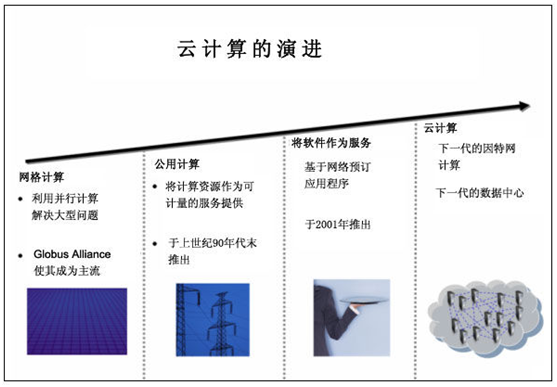

图 1 云计算的演进图

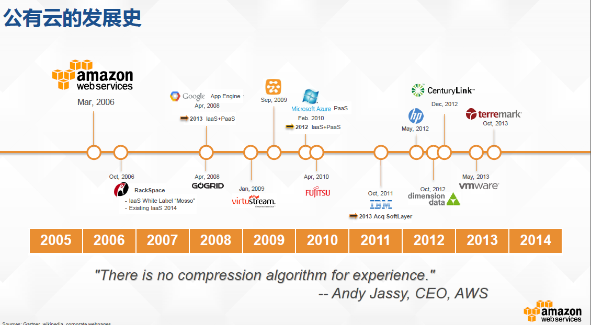

图  公有云发展史（2005~2014）

备注：2015年成立CNCF（云原生计算设施）。

## 1.2  云计算模型

根据NIST的定义，云计算分为：
*  三种服务模型：SaaS, PaaS, IaaS
*  三种部署模型：私有云、公有云、混合云

 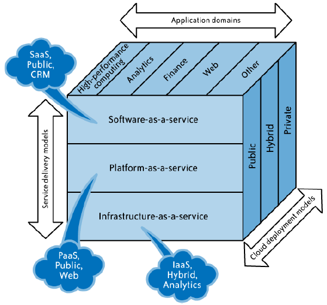

图 2 SPI云服务模型

### 服务模型

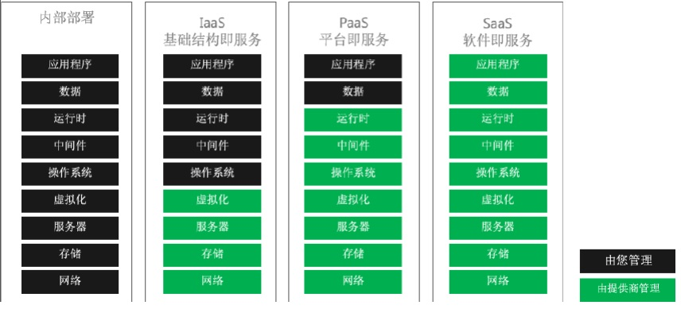

图 云计算服务模型-典型云服务

> 备注：SAAS是最成熟的模式，SAAS可以基于PAAS提供，也可基于IAAS提供。

新增二种服务

* DAAS：DaaS是数据即服务，英文全称是Date as a Server。云端部署好各种环境，收集大量数据并开始从中分析。最后把筛选、分析出来的数据作为服务。直白地说，就是大数据的一个类。涉及的服务有：客户关系管理（CRM）、企业资源规划（ERP）等等。

* AIAAS： AI作为一种服务。

### 部署模型

 表格 三种部署云的比较

| 分类   | 特点                     | 应用场景                                                     |
| ------ | ------------------------ | ------------------------------------------------------------ |
| 公有云 | 面向大众，价格实惠。     | 游戏、视频等等。                                             |
| 私有云 | 自建设备，数据隐私性好。 | 适合金融、政务等的大客户。其中托管私有云又叫专有云。 社区云或行业云是针对部分用户。 |
| 混合云 | 介于公有和私有之间       | 适合存量过度                                                 |

## 1.3  云计算的参考体系结构

 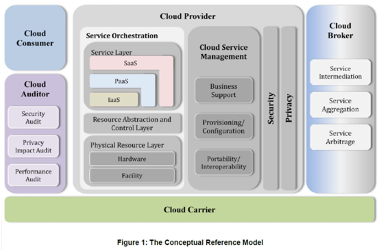

图 3 云计算参考体系结构

表格 1 云计算中的角色

| Actor           | Definition                                                   | 备注     |
| --------------- | ------------------------------------------------------------ | -------- |
| Cloud  Consumer | A  person or organization that maintains a business relationship with, and uses  service from, Cloud Providers. | 云用户   |
| Cloud  Provider | A  person, organization, or entity responsible for making a service available to  interested parties. | 云提供者 |
| Cloud  Auditor  | A  party that can conduct independent assessment of cloud services, information  system operations, performance and security of the cloud implementation. | 云审核者 |
| Cloud  Broker   | An  entity that manages the use, performance and delivery of cloud services, and  negotiates relationships between Cloud Providers and Cloud Consumers. | 云经纪人 |
| Cloud  Carrier  | An  intermediary that provides connectivity and transport of cloud services from  Cloud Providers to Cloud Consumers. 如网络运营网 | 云载体   |

 

图 4 云计算技术层次

**物理资源**

主要指能支持计算机正常运行的一些硬件设备及技术，可以是价格低廉的PC，也可以是价格昂贵的服务器及磁盘阵列等设备，可以通过现有网络技术和并行技术、分布式技术将分散的计算机组成一个能提供超强功能的集群用于计算和存储等云计算操作。

**虚拟化资源**

指一些可以实现一定操作具有一定功能，但其本身是虚拟而不是真实的资源，如：计算池，存储池和网络池、数据库资源等，通过软件技术来实现相关的虚拟化功能包括虚拟环境、虚拟系统、虚拟平台等。

**服务管理中间件**

在云计算技术中，中间件位于服务和服务器集群之间，提供管理和服务即云计算体系结构中的管理系统。
*  对标识、认证、授权、目录、安全性等服务进行标准化和操作
*  为应用提供统一的标准化程序接口和协议
*  隐藏底层硬件、操作系统和网络的异构性，统一管理网络资源。
*  用户管理包括用户身份验证、用户许可、用户定制管理；
*  资源管理包括负载均衡、资源监控、故障检测等；
*  安全管理包括身份验证、访问授权、安全审计、综合防护等；
*  映像管理包括映像创建、部署、管理等。

 

# 2  云服务

详见 《[云服务商比较.md](./云服务商比较.md)》

 

# 3   云应用

* 云安全  详见 《[安全技术.md](../../领域开发/安全技术.md)》

* 物联网  详见 《[IOT物联网技术.md](../../领域开发/IOT物联网技术.md)》

**典型应用云**
政务云、教育云、金融云、工业云、城市管理云、医疗健康云、位置服务云、环保云

## 云存储/云盘

云存储是一个以数据存储和管理为核心的云计算系统。

**云存储相关技术**
*  宽带网络技术为云存储服务和应用奠定了基础；
*  集群技术、分布式文件系统和网络计算技术实现存储设备之间协同工作；
*  CDN内容分发、P2P技术、数据压缩技术实现高效数据存储和管理；
*  存储虚拟化技术、存储网络化管理技术实现灵活、便利的存储服务；
*  通过WEB2.0技术可以使使用者的应用方式和可得到的服务更加灵活和多
*  样化；
*  通过加密、验证、访问控制、属性加密、安全传输协议、确定性删除等技
*  术保障用户隐私和和数据安全；
*  冗余编码、数据备份和容灾技术保证云存储中的数据的可靠性。

 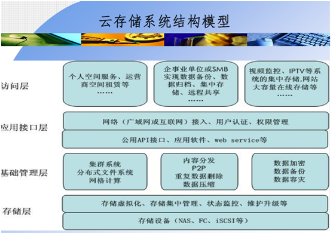

图 13 云存储系统结构模型

各大知名厂商都在致力于云存储方案的研发：
*  HP的CloudSystem；
*  IBM的SmartCloud解决方案；
*  EMC的Atmos云存储解决方案；
*  Microsoft的WindowsAzure存储、备份和恢复方案。

很多公司或机构基于开源系统构建云存储平台及其应用：
*  OpenStack中的Swift组件；
*  Hadoop大数据存储HDFS；
*  Cassandra；
*  FastDFS

表格 5 云盘事件列表

| 云盘服务商 | 简介                                                         | 事件                                                         |
| ---------- | ------------------------------------------------------------ | ------------------------------------------------------------ |
| 百度网盘   | 4亿用户，国内第一大云盘提供商。  分为[百度云](https://cloud.baidu.com/)（公有云平台）和[百度网盘](https://pan.baidu.com/)（个人云，原名百度云）。 | 2012.8，百度推出云存储服务~百度云，免费最大2T永久空间；2016.10更名为百度网盘。  2015年，百度开放云正式开放运营；2016.10正式更名百度云。 |
| 华为       | 1亿用户，国内第二大云盘提供商。                              | 2016.5，华为DBank关闭。                                      |
| 360        | 用户，国内第三大云盘提供商。                                 | 2016.10.20，360官方宣布将于2017年2月1日停止个人云存储服务。  |
| 其它       |                                                              | 2016.3，115和UC宣布关闭网盘服务。   2016.4，新浪微盘、迅雷快盘、腾讯微云关闭个人云存储服务。 |

备注：2016年以来，国内各大云盘提供商都以响应国家政策营造良好网络环境为借口，陆续关闭云盘服务。2021.12工信局要求网盘提供上下载无差别的速度。

 

## 本章参考

# 4 云计算的核心技术

**核心技术**：

- 大规模并行处理技术、分布式数据存储技术、资源虚拟化技术、资源调度管理技术、可信计算技术、智能云终端
- 商业云计算技术与开源云计算技术
- 云计算标准化技术

## 4.1  虚拟化技术

**虚拟化发展历程**

1950s 虚拟化概念提出

1960s 虚拟化在大型机上商用

操作系统虚拟内存；Java虚拟机；基于X86体系结构的服务器虚拟化技术。

**为什么要进行虚拟化**

降低运营成本；专注于管理；摆脱与硬件打交道的工作；加速应用部署；

提高应用兼容性
- 各种平台、操作系统、中间件的兼容性
- 技术角度进行封装、隔离

提高服务可用性
- 提高兼容性
- 便于备份、恢复

提升资源利用率

动态调度资源

降低能源消耗

表格   虚拟化技术列表

| 虚拟化技术   | 对应的云计算服务 | 相关的技术和产品                           |
| ------------ | ---------------- | ------------------------------------------ |
| 硬件虚拟化   | IaaS             | KVM, VMware, Xen,  OpenStack, CloudStack   |
| 系统虚拟化   | CaaS             | Docker, LXC, rkt, Kubernetes, Swarm, Mesos |
| 中间件虚拟化 | PaaS             | CloudFoundry, Heroku, Openshift            |

说明：IaaS-基础设施即服务，CaaS-容器即服务，PaaS-平台即服务。

表格 6 云计算核心技术列表

| 类别     | 虚拟化例子     | 技术原理                                                     |
| -------- | -------------- | ------------------------------------------------------------ |
| 基础设施 | VPN            | VPN的隧道协议主要有三种，PPTP、L2TP和IPSec。 其中PPTP和L2TP协议工作在OSI模型的第二层，又称为二层隧道协议；IPSec是第三层隧道协议。 |
|          | VLAN           | 虚拟局域网（VLAN）是一组逻辑上的设备和用户，这些设备和用户并不受物理位置的限制，可以根据功能、部门及应用等因素将它们组织起来，相互之间的通信就好像它们在同一个网段中一样  –VLAN工作在OSI参考模型的第2层和第3层，一个VLAN就是一个广播域，VLAN之间的通信通过第3层的路由器完成。  –VLAN网络可以是有混合的网络类型设备组成，比如：以太网、令牌网、FDDI等。 |
|          | 设备与IO虚拟化 |                                                              |
|          | SDN            | 软件定义网络（Software Defined Network，SDN）。美国斯坦福大学Clean-Slate课题研究组提出的一种新型网络创新架构，是网络虚拟化的一种实现方式。其核心技术OpenFlow通过将网络设备的控制面与数据面分离开来，从而实现了网络流量的灵活控制，使网络作为管道变得更加智能，为核心网络及应用的创新提供了良好的平台。 |
|  存储 | RAID           | Redundant Array of Inexpensive  Disks，磁盘阵列技术。RAID0/RAID1等标准。 |
|          | NAS            | Network Attached Storage，网络附加存储。                     |
|          | SAN            | Storage Area Network，存储区域网。                           |
|          | 内存           | 虚拟内存与物理内存的映射  影子页表法  页表写入法             |
| 系统     | Windows        |                                                              |
|          | LXC            | Linux Container，Linux容器。一种内核虚拟化技术，提供轻量级的虚拟化隔离进程和资源。 基于Linux内核的cgroups子系统，cgroups子系统是Linux内核提供的一个基于进程组的资源管理的框架，可以为特定的进程组限定可以使用的资源。 |
|          | Docker         | 基于进程容器(Processcontainer)的轻量级VM解决方案。           |
|          | KVM            | KVM~Kernel-based Virtual Machine，内核虚拟机。 开源虚拟化模块。集成在Linux的各个主要发行版本中  使用Linux自身的调度器进行管理 |
|          | Xen            | 一个开放源代码虚拟机监视器，由剑桥大学开发。它打算在单个计算机上运行多达100个满特征的操作系统。 |
| 软件     | Java虚拟机     |                                                              |
| 计算     | CPU虚拟化      | 传统方式：通过一系列手段改变序列次序。如  时间片轮转；短进程优先；中断。 本质是一种指令序列的调度机制。 |

### 4.1.1  实时迁移技术

将整个虚拟机的运行状态完整、快速地从原宿主机的硬件平台转移到新的宿主机硬件平台
*  实时性
*  内存页面不断滴从源虚拟机监视器拷贝到目标虚拟机监视器
*  拷贝结束后，目标虚拟机开始运行，虚拟机监视器切换到目标虚拟机上，源虚拟机终止
*  广泛应用于实时系统的硬件维护

### 4.1.2  虚拟化资源管理

## 4.2  多租户技术

多租户技术（英语：multi-tenancy technology）或称多重租赁技术，是一种软件架构技术，它是在探讨与实现如何于多用户的环境下共用相同的系统或程序组件，并且仍可确保各用户间数据的隔离性。

在多租户技术中，租户（tenant）是指使用系统或电脑运算资源的客户，但在多租户技术中，租户包含在系统中可识别为指定用户的一切数据，举凡帐户与统计信息（accounting data），用户在系统中建置的各式数据，以及用户本身的客制化应用程序环境等，都属于租户的范围，而租户所使用的则是基于供应商所开发或建置的应用系统或运算资源等，供应商所设计的应用系统会容纳数个以上的用户在同一个环境下使用，为了要让多个用户的环境能力同一个应用

程序与运算环境上使用，则应用程序与运算环境必须要特别设计，除了可以让系统平台可以允许同时让多份相同的应用程序运行外，保护租户数据的隐私与安全也是多租户技术的关键之一。

数据面（data approach）：供应商可以利用切割数据库（database），切割存储区（storage），切割结构描述（schema）或是表格（table）来隔离租户的数据，必要时会需要进行对称或非对称加密以保护敏感数据，但不同的隔离作法有不同的实现复杂度与风险。

程序面（application approach）：供应商可以利用应用程序挂载（hosting）环境，于进程（process）上切割不同租户的应用程序运行环境，在无法跨越进程通信的情况下，保护各租户的应用程序运行环境，但供应商的运算环境要够强。

系统面（system approach）：供应商可以利用虚拟化技术，将实体运算单元切割成不同的虚拟机，各租户可以使用其中一至数台的虚拟机来作为应用程序与数据的保存环境，但对供应商的运算能力要更要求。

多租户技术的实现重点，在于不同租户间应用程序环境的隔离（application context isolation）以及数据的隔离（data isolation)，以维持不同租户间应用程序不会相互干扰，同时数据的保密性也够强。

- 应用程序部份：通过进程或是支持多应用程序同时运行的装载环境（例如Web Server，像是Apache或IIS等）来做进程间的隔离，或是在同一个伺服程序（server）进程内以运行绪的方式隔离。

- 数据部份：通过不同的机制将不同租户的数据隔离，Force是采用中介数据（metadata）的技术来切割，微软MSDN 的技术文件则是展示了使用结构描述的方式隔离。

 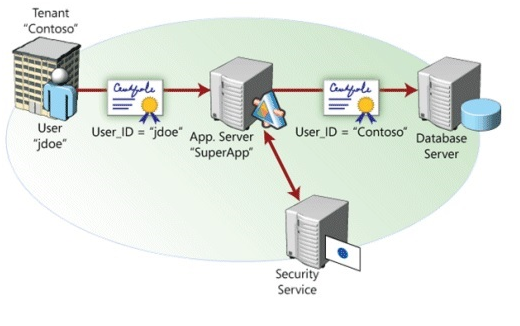

图 14 多租户技术图

应用实现对“多租户”的支持，需要相应的“多租户架构”（Multi-tenancy architecture）。

**经典的多租户架构：**
*  Shared nothing
*  Shared hardware
*  Shared everything

Gartner对当前云应用“多租户”架构进行了总结并给出了参考架构，如下：

 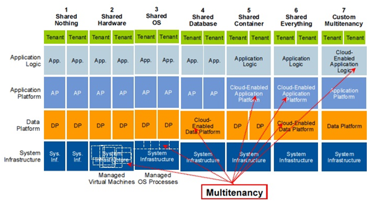

图 15 多租户参考架构图

## 4.3  Hadoop体系

详见 [《Hadoop体系.md》](../bigdata/Hadoop体系.md)

## 4.4  OpenStack

OpenStack是一个由NASA（[美国国家航空航天局](http://baike.baidu.com/view/85211.htm)）和Rackspace合作研发并发起的，以[Apache](http://baike.baidu.com/view/28283.htm)许可证授权的[自由软件](http://baike.baidu.com/view/20965.htm)和[开放源代码](http://baike.baidu.com/view/1708.htm)项目。

OpenStack是一个开源的云计算管理平台项目，由几个主要的组件组合起来完成具体工作。OpenStack支持几乎所有类型的云环境，项目目标是提供实施简单、可大规模扩展、丰富、标准统一的云计算管理平台。OpenStack通过各种互补的服务提供了基础设施即服务（IaaS）的解决方案，每个服务提供API以进行集成。

OpenStack是IaaS(基础设施即服务)组件，让任何人都可以自行建立和提供云端运算服务。

此外，OpenStack也用作建立防火墙内的“私有云”（Private Cloud），提供机构或企业内各部门共享资源。

**技术组成**
*  以Python编程语言编写
*  整合Tornado 网页服务器、Nebula运算平台
*  使用Twisted软件框架
*  遵循Open Virtualization Format、AMQP、SQLAlchemy等标准
*  虚拟机器软件支持包括：[KVM](http://baike.baidu.com/view/27773.htm)、[Xen](http://baike.baidu.com/view/697213.htm)、[VirtualBox](http://baike.baidu.com/view/1047853.htm)、QEMU、 LXC 等。

 

## 本章参考

* 百度百科-Xen  https://baike.baidu.com/item/Xen

# 5 云架构实例

## 5.1  云安全架构

 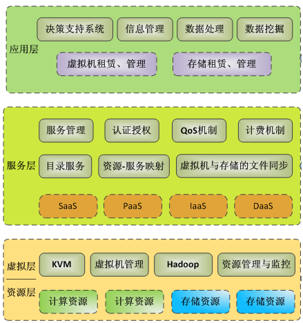

图 16 云计算系统的体系框架图

 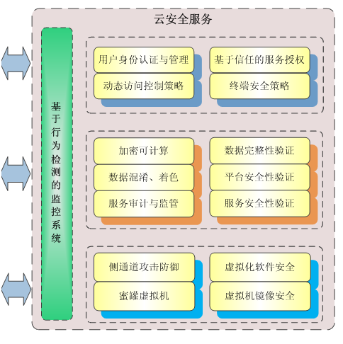

图 17 云计算安全架构

**云计算安全的非技术手段**
*  第三方认证：第三方认证是提升信任关系的一种有效手段，即采用一个中立机构对信任双方进行约束。
*  企业信誉：企业信誉对于任何一个竞争领域的企业来讲都是至关重要的。一般来讲，越大的企业对于自身信誉越看重，不会因为利益去窃取客户的数据。
*  合同约束：目前已经有很多云计算服务提供商推出了自己的云计算服务的服务水平协议（SLA)，这些协议从服务质量、技术支持和知识产权等方面对服务进行了规范，对服务提供者与使用者的权利和义务进行了明确。

### 5.1.1  IBM的云安全架构

 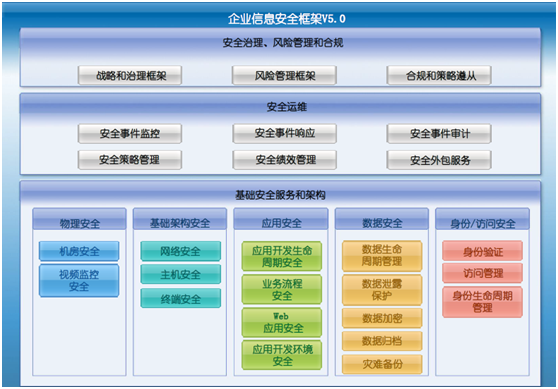

图 18 IBM信息安全框架

### 5.1.2  华为的云安全架构

 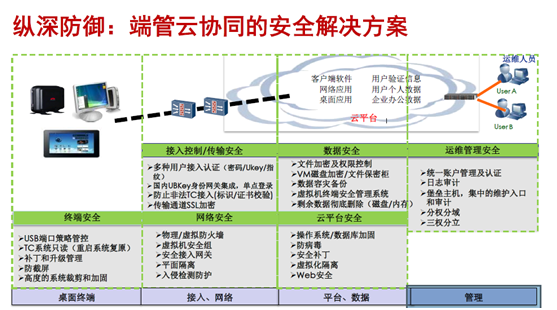

图 19 华为端管云协同的安全解决方案

云计算安全的核心控制点在云操作系统，云操作系统需要安全可控。
1. 从云平台的角度：虚拟机是云计算操作系统的一个应用
2. 从虚拟机的角度：云计算操作系统就是原来的硬件层

## 5.2  阿里云栖社区的云架构应用

阿里云栖社区 https://yq.aliyun.com

- 第九期：[《微博：一亿访问量背后的分钟级服务器扩容》](https://yq.aliyun.com/articles/18132?spm=5176.blog8530.yqblogcon1.11.w0IH6I)
- 第八期：[《有货：六层混合云架构打造中国最潮生态圈》](https://yq.aliyun.com/articles/15260?spm=5176.blog11259.yqblogcon1.11.HgzGsf)
- 第七期：[《美柚：最懂女性App背后的混合云架构与大数据服务》](https://yq.aliyun.com/articles/11259?spm=5176.blog7548.yqblogcon1.10.U8wUQB)
- 第六期：[《涂鸦科技：支撑从零暴增数十亿数据的背后，竟无专职运维！》](https://yq.aliyun.com/articles/8896?spm=5176.blog11259.yqblogcon1.11.eLBBDJ)
- 第五期：[《千万级用户App小咖秀：服务端架构设计分享》](https://yq.aliyun.com/articles/8530?spm=5176.blog11259.yqblogcon1.12.eLBBDJ)
- 第四期：[《空格App亿元A轮融资背后：云上多场景技术架构实践与经验》](https://yq.aliyun.com/articles/8306?spm=5176.blog11259.yqblogcon1.13.eLBBDJ)
- 第二期：[《游族网络：如何运维千台以上游戏云服务器》](https://yq.aliyun.com/articles/7548?spm=5176.blog11259.yqblogcon1.15.eLBBDJ)
- 第一期：[《淘宝丁奇：如何解决影响MySQL使用的9大问题》](https://yq.aliyun.com/edu/lesson/play/91?spm=5176.blog18132.yqblogcon1.17.14Ux3G)

### 小伽秀的云服务架构

 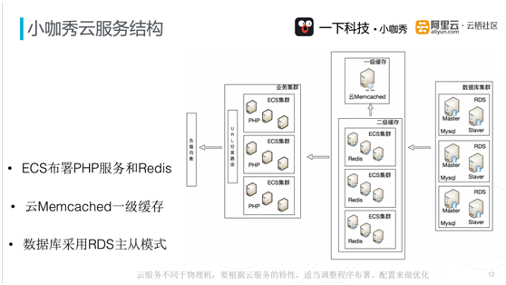

图 20 小咖秀云服务结构

说明：云服务架构的最前端采用负载均衡，可以通过流量分发扩展应用系统对外的服务能力，通过消除单点故障提升应用系统的可用性。中间是URL分发路由，内部的子系统通过ECS服务器搭建PHP集群。缓存部分分为一级缓存和二级缓存两个部分。一级缓存主要通过云Memcached搭建，二级缓存是在ECS部署的Redis搭建而成。最后端是数据库集群，开始阶段是采用自建的MySQL数据库。后期从自建MySQL迁移到RDS上，迁移中通过DPS热切换，切换时间仅用了几十秒的时间，并且迁移过程中没有停机。

 

## 本章参考

 

# 参考资料

**参考网站**

* 云计算新闻 http://www.cloudcomputing-china.cn/
* 中云网 [http://www.china-cloud.com](http://www.china-cloud.com/)
* 中国云计算网 http://www.cloudcomputing-china.cn/
* 云计算网 http://cloud.saaser.cn/
* 企业云计算网 http://www.ecloud.com.cn/
* 中国云计算联盟百科全书 http://www.chinacloud.org/wiki
* http://www.aboutyun.com
* Tungsten Fabric 为多云而生的 SDN  https://tungstenfabric.org.cn
* Kubernetes中文社区   http://docs.kubernetes.org.cn/

**参考文献**

* HFile: A Block-Indexed File Format to Store Sorted Key-Value Pairs for a thorough introduction Hbase Architecture 101

* Bigtable: A Distributed Storage System for Structured Data

 

# 附录

## 云计算组织

* 中国电子学会-云计算专家委员会
* 中国云计算技术与产业联盟
  - 由中国电子学会2010年1月22日发起成立，数十家云计算领先企业自愿组成的开放式、非营利性组织。
  - 中国移动集团公司、中国电信集团公司、中国联合网络通信集团有限公司、联想集团、华为、中兴通讯(南京)业务研究院、IBM、微软、英特尔中国研发中心、EMC中国卓越研发集团等近40家相关机构共同倡议成立。
  - 2012年初设置四个工作小组：云计算技术开发、云计算电子政务、云计算安全、云计算与移动互联。

-

