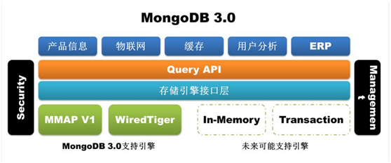
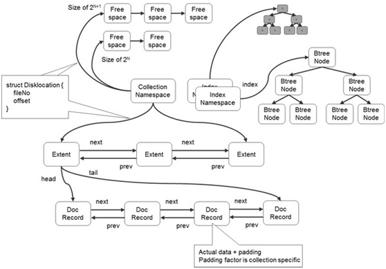
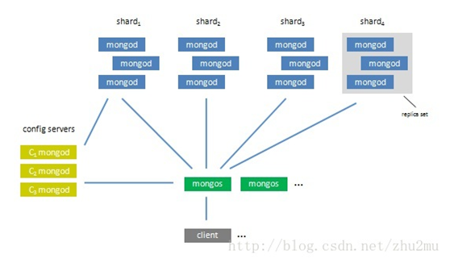
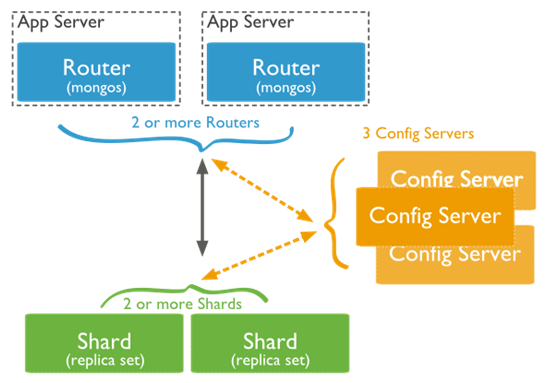

| 序号 | 修改时间  | 修改内容                                           | 修改人 | 审稿人 |
| ---- | --------- | -------------------------------------------------- | ------ | ------ |
| 1    | 2021-12-9 | 创建。从《数据库技术》、《数据库架构》迁移相关章节 | Keefe  | Keefe  |


---

[TOC]

---

# 简介

官网： https://www.mongodb.com/    http://www.mongodb.org/

官网文档：https://docs.mongodb.com/manual/

下载： https://www.mongodb.com/download-center  http://github.com/mongodb/mongo/downloads


**MongoDB** (from "humongous") is an open source, scalable, high-performance, schema-free, [document-oriented database](http://en.wikipedia.org/wiki/Document-oriented_database) written in the C++ programming language.

2017年10月19日在纳斯达克上市。

**查询工具**：RT、MongoChef

MongoDB是一个介于关系数据库和非关系数据库之间的产品，是非关系数据库当中功能最丰富，最像关系数据库的。他支持的数据结构非常松散，是类似 json的bjson格式，因此可以存储比较复杂的数据类型。Mongo最大的特点是他支持的查询语言非常强大，其语法有点类似于面向对象的查询语言，几乎可以实现类似关系数据库单表查询的绝大部分功能，而且还支持对数据建立索引。

Mongo主要解决的是海量数据的访问效率问题，根据官方的文档，当数据量达到50GB以上的时候，Mongo的数据库访问速度是MySQL的10 倍以上。Mongo的并发读写效率不是特别出色，根据官方提供的性能测试表明，大约每秒可以处理0.5万－1.5次读写请求

**MongoDB只支持对单行记录的原子性修改，并不支持对多行数据的原子操作。**


表格  MongoDB术语表

| SQL术语/概念 | MongoDB术语/概念 | 解释/说明                                |
| ------------ | ---------------- | ---------------------------------------- |
| database     | database         | 数据库                                   |
| table        | collection       | 数据库表/集合                            |
| row          | document         | 数据记录行/文档                          |
| column       | field            | 数据字段/域                              |
| index        | index            | 索引                                     |
| table joins  |                  | 表连接,MongoDB不支持，但可用内嵌文档BSON |
| primary key  | primary key      | 主键,MongoDB自动将_id字段设置为主键      |


**Mongodb的优点与不足**

**（1）Mongodb的不足之处**

1、在集群分片中的数据分布不均匀。

2、单机可靠性比较差。

3、大数据量持续插入，写入性能有较大波动。

4、磁盘空间占用比较大。


**（2）Mongodb的过人之处**

1. 无模式。

2. 查询与索引方式灵活，是最像SQL的Nosql

3. 支持复制集、主备、互为主备、自动分片等特性。


**MongoDB ObjectId**

MongoDB 的 _id (ObjectId)是系统自动生成的12字节唯一标识。但在某些情况下，我们可能需要实现 ObjectId 自动增长功能。由于 MongoDB 没有实现这个功能，我们可以通过编程的方式来实现。

ObjectId 是一个12字节 BSON 类型数据，有以下格式：

4BYTES(时间戳) + 3BYTES(机器标识码) + 2BYTES(进程id-PID) + 3BYTES(随机数)


**BSON格式**

　　BSON是由10gen开发的一个数据格式，目前主要用于MongoDB中，是MongoDB的数据存储格式。BSON基于JSON格式，选择JSON进行改造的原因主要是JSON的通用性及JSON的schemaless的特性。

　　二进制的JSON，JSON文档的二进制编码存储格式

　　BSON有JSON没有的Date和BinData

　　MongoDB中document以BSON形式存放


# 入门篇

**安装使用**

1)  程序安装

编译安装 build

```shell
# build: http://www.mongodb.org/display/DOCS/Building
# If you want to build everything (mongod, mongo, tools, etc):
$ scons .
# If you only want to build the database:
$ scons

# To install
$ scons --prefix=$INSTALL_PATH/mongo install
```


2）程序使用

mongo工具

 ```shell
COMPONENTS

  mongod - The database server.
  mongos - Sharding router.
  mongo  - The database shell (uses interactive javascript).

UTILITIES

  mongodump         - Create a binary dump of the contents of a database.
  mongorestore      - Restore data from the output created by mongodump.
  mongoexport       - Export the contents of a collection to JSON or CSV.
  mongoimport       - Import data from JSON, CSV or TSV.
  mongofiles        - Put, get and delete files from GridFS.
  mongostat         - Show the status of a running mongod/mongos.
  bsondump          - Convert BSON files into human-readable formats.
  mongoreplay       - Traffic capture and replay tool.
  mongotop          - Track time spent reading and writing data.
 ```


程序运行

```sh
# 启动服务端
$ ./mongod –dbpath=$DATA_PATH

# 程序可用性测试，启动客户端
$ /bin/mongo
```


**操作语法**

表格 28 MongoDB常用命令

| 命令组 | 命令                                               | 命令示例 (col~collection)                                    |
| ------ | -------------------------------------------------- | ------------------------------------------------------------ |
| 查询   | find find_one                                      | db.col.find({"likes":{$gt:50}})  db.col.find({},{"title":1,_id:0}).limit(2) |
| 插入   | insert insertOne insertMany                        | db.col.insert(  )                                            |
| 更新   | update save                                        |                                                              |
| 删除   | delete remove                                      | db.col.remove(<query>,  <justOne>)                           |
| 排序   | sort                                               | db.col.find().sort({KEY:1})                                  |
| 限制   | skim limit                                         | db.col.find().limit(NUMBER).skip(NUMBER)                     |
| 索引   | createindex ensureIndex <BR>getIndexes dropIndexes | db.col.createIndex({"title":1,"description":-1})             |
| 聚合   | aggregate distinct count                           |                                                              |
| 分析   | explain hint                                       | xxx.explain()                                                |
| 其它   | mapreduce regex                                    | db.col.find( {post_text:{$regex:"runoob"}}  )                |
| 管理   | show stats                                         | show dbs/collections/users/logs; db.stats()                  |

 条件操作符： `$gt $lt $gte $lte $in $nin $exists $regex`


# 高级篇

注意事项

*  mongodb的key值不能是特殊字符如非utf8字符、空格和引号、双引号、点和斜杠。
*  MongoDB只支持对单行记录的原子性修改，并不支持对多行数据的原子操作。
*  单个文档限制在16MB，如果要存储更大数据，考虑用GirdFS


1） 索引

* 索引种类：分为单列、组合、地理GPS、哈希、文本

* 索引类型：唯一、部分

**全文索引**

全文检索对每一个词建立一个索引，指明该词在文章中出现的次数和位置，当用户查询时，检索程序就根据事先建立的索引进行查找，并将查找的结果反馈给用户的检索方式。 MongoDB 从 2.4 版本开始支持全文检索，目前支持15种语言的全文索引。


2）正则表达式

MongoDB 使用 $regex 操作符来设置匹配字符串的正则表达式。

MongoDB使用PCRE (Perl Compatible Regular Expression) 作为正则表达式语言。

不同于全文检索，我们使用正则表达式不需要做任何配置。


3） 固定集合

```sql
# 创建固定集合db.createCollection("cappedLogCollection",{capped:true,size:10000})# 判断是否是固定集合db.cappedLogCollection.isCapped()
```


其它）

图查询 $graphLookup

```sql
db.employees.aggregate( [   {      $graphLookup: {         from: "employees",         startWith: "$reportsTo",         connectFromField: "reportsTo",         connectToField: "name",         as: "reportingHierarchy"      }   }] )
```


# 实践篇

**适用场景**

* 网站数据、缓存等大尺寸、低价值的数据

* 在高伸缩性的场景，用于对象及JSON数据的存储。

以下具备一条以上，就可以考虑选用MongoDB

* 我的数据量是有亿万级或者需要不断扩容
* 需要2000-3000以上的读写每秒
* 新应用，需求会变，数据模型无法确定
* 我需要整合多个外部数据源
* 我的系统需要99.999%高可用
* 我的系统需要大量的地理位置查询
* 我的系统需要提供最小的latency
* 我要管理的主要数据对象<10


| 慎用场景                                                     | 原因                                                         |
| :----------------------------------------------------------- | :----------------------------------------------------------- |
| PB 数据持久存储大数据分析数据湖                              | Hadoop、Spark提供更多分析运算功能和工具，并行计算能力更强 MongoDB + Hadoop/Spark |
| 搜索场景：文档有几十个字段，需要按照任意字段搜索并排序限制等 | 不建索引查询太慢，索引太多影响写入及更新操作                 |
| ERP、CRM或者类似复杂应用，几十上百个对象互相关联             | 关联支持较弱，事务较弱                                       |
| 需要参与远程事务，或者需要跨表，跨文档原子性更新的           | MongoDB  事务支持仅限于本机的单文档事务                      |
| 100% 写可用：任何时间写入不能停                              | MongoDB换主节点时候会有短暂的不可写设计所限                  |


**MongoDB查询技巧**

1. 限定返回结果条数和字段：可以减少开销。
2. 避免合用skip跳过大量结果。可以内置查询条件（需要用到带索引的排序字段），用上一次结果来计算下一次查询。
3. 避免使用`$where`。这个操作符不能用索引，需要先将BSON对象转化成JSON对象，才可以用`$where`表达式。通常它比常规查询慢得多。
4. MapReduce不能作实时查询。MapReduce有很好的聚合功能，用于统计，但执行时涉及远程交互，会比较慢。它适合处理大数据量的离线统计分析。


# 管理篇

MongoDB缺省数据库，有3个分别是Admin、local和config。

* Admin: 权限相关如用户创建授权。
* config:  配置信息相关
* local


配置文件 mongo.conf

```javascript
[mongod@MongoDB conf]$ vim mongod1.conf dbpath=/application/mongodb/datalogpath=/application/mongodb/log/mongodb.logport=27017logappend=1fork=1authorization=enabled  #登陆时是否验证
```

或者 YAML格式。


# 架构原理篇

MongoDB 是由C++语言编写的，是一个基于分布式文件存储的开源数据库系统。

## 存储结构

MongoDB3.0引入了插件式存储引擎API，为第三方的存储引擎厂商加入MongoDB提供了方便，这一变化无疑参考了MySQL的设计理念。

   

图 11 mongodb插件式存储引擎

备注：1. MMAP是MongoDB的原生存储引擎，有以下缺陷：耗费磁盘空间和内存空间且难以清理，库级别锁。

2. WiredTiger：收购存储引擎厂商WiredTiger，将WiredTiger存储引擎集成进3.0版本（仅在64位版本中提供）。支持文档级别并发控制；磁盘数据压缩。


**存储结构**

MongoDB的数据目录下主要存储有：预写日志(journal)、集合的数据（collection）、集合的索引（index）。


   

图 12 MongoDB数据文件内部结构

说明：Collection -- Extent -- Doc

*  MongoDB在数据存储上按命名空间来划分，一个Collection是一个命名空间，一个索引也是一个命名空间

*  同一个命名空间的数据被分成很多个Extent，Extent之间使用双向链表连接

*  在每一个Extent中，保存了具体每一行的数据，这些数据也是通过双向链接连接的

*  每一行数据存储空间不仅包括数据占用空间，还可能包含一部分附加空间，这使得在数据update变大后可以不移动位置

*  索引以BTree结构实现


MongoDB的逻辑结构是一种层次结构，主要由：文档(Document)、集合(Collection)、数据库(database)这三部分组成。

*  MongoDB的文档(Document)，相当于关系数据库中的一行记录。

*  多个文档组成一个集合(Collection)，相当于关系数据库的表。

*  多个集合(Collection)，扩及上组织在一起，就是数据库(database)。

*  一个MongoDB实例支持多个数据库(database)。


## 集群架构

**集群组件**

*  单机实例(mongod instance)：只有一个单机实例，客户端与其直接连接使用。

*  副本集(Replica sets)：至少3个节点组成（一主多从）。其中一个是主节点，负责处理客户端请求，其余的都是从节点，负责复制主节点上的数据。

*  分片(Sharding)：将一个集合的数据分别存储在不同的shard节点上减轻单机压力。

*  路由服务器(mongos)：负责把对应的数据请求请求转发到对应的shard服务器上mongos，相当于一个负载均衡器。

*  配置服务器(mongos)：存储所有数据库元信息（路由、分片）的配置。mongos本身没有物理存储分片服务器和数据路由信息，只是缓存在内存里，配置服务器则实际存储这些数据。

 


图 13 mongodb集群架构

单机mongod 组成副本集 -> 分片, 客户端通过mongos 读取 config servers的信息与分片通信，客户端程序感觉不到集群的存在，他只需要知道mongos服务器的ip和连接方式，至于它有多少个集群ip 都不需要关注，mongos 会自动选择。


   

图 14 MongoDB分片集群结构

上图中主要有如下所述三个主要组件：

*  Shard: 用于存储实际的数据块，实际生产环境中一个shard server角色可由几台机器组个一个replica set承担，防止主机单点故障
*  Config Server: mongod实例，存储了整个 ClusterMetadata，其中包括 chunk信息。
*  Query Routers: 前端路由，客户端由此接入，且让整个集群看上去像单一数据库，前端应用可以透明使用。


# 参考资料

* mongodb http://www.searchtb.com/2010/12/a-probe-into-the-mongodb.html
* MongoDB架构图解 https://blog.csdn.net/yujin2010good/article/details/53794305
* MongoDB集群架构分析 https://blog.csdn.net/zhu2mu/article/details/54970832
