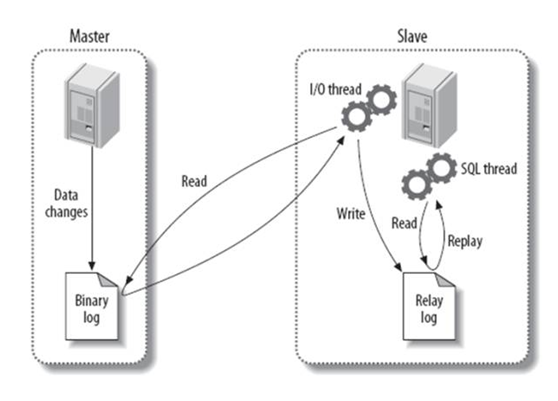
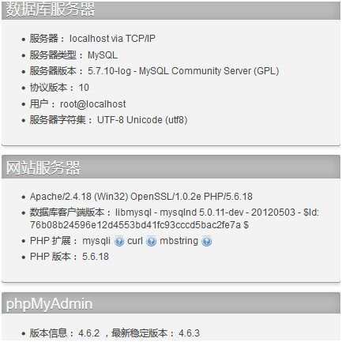

| 序号 | 修改时间  | 修改内容                                                     | 修改人 | 审稿人 |
| ---- | --------- | ------------------------------------------------------------ | ------ | ------ |
| 1    | 2006-2007 | 创建                                                         | Keefe  | Keefe  |
| 2    | 2016-5-5  | 整理合并文档                                                 | 同上   |        |
| 3    | 2016-6-16 | 更新常用SQL语句                                              | 同上   |        |
| 4    | 2016-6-29 | 将日期和时间相关内容单独成章节。                             | 同上   |        |
| 5    | 2016-8-4  | 增加定时统计、触发器和视图。                                 | 同上   |        |
| 6    | 2017-2-6  | 调整目录结构，增加MySQL主从复制和读写分离章节。              | 同上   |        |
| 7    | 2018-6-30 | 将MySQL底层实现章节迁移到《数据库技术》，本文只针对MySQL用户。 | 同上   |        |
| 8    | 2021-6-18 | 增加MySQL版本和产品线章节。                                  | 同上   |        |
| 9    | 2021-7-28 | 应用开发章节移入《MySQL源码剖析》。本文定位面向用户和DB管理员 。 | 同上   |        |


---

[TOC]

 

---

# 1 MySQL简介

**官网**

* [dev.mysql.com](http://dev.mysql.com/doc/mysql/en)

* http://doc.mysql.cn/


**下载**

- [MySQL Yum Repository](https://dev.mysql.com/downloads/repo/yum/)

- [MySQL APT Repository](https://dev.mysql.com/downloads/repo/apt/)

- [MySQL SUSE Repository](https://dev.mysql.com/downloads/repo/suse/)

  

- [MySQL Community Server](https://dev.mysql.com/downloads/mysql/)

- [MySQL Cluster](https://dev.mysql.com/downloads/cluster/)

- [MySQL Router](https://dev.mysql.com/downloads/router/)

- [MySQL Shell](https://dev.mysql.com/downloads/shell/)

- [MySQL Workbench](https://dev.mysql.com/downloads/workbench/)

  

- [MySQL Installer for Windows](https://dev.mysql.com/downloads/windows/)

- [MySQL for Visual Studio](https://dev.mysql.com/downloads/windows/visualstudio/)

- [C API (libmysqlclient)](https://dev.mysql.com/downloads/c-api/)

- [Connector/C++](https://dev.mysql.com/downloads/connector/cpp/)

- [Connector/J](https://dev.mysql.com/downloads/connector/j/)

- [Connector/NET](https://dev.mysql.com/downloads/connector/net/)

- [Connector/Node.js](https://dev.mysql.com/downloads/connector/nodejs/)

- [Connector/ODBC](https://dev.mysql.com/downloads/connector/odbc/)

- [Connector/Python](https://dev.mysql.com/downloads/connector/python/)

- [MySQL Native Driver for PHP](https://dev.mysql.com/downloads/connector/php-mysqlnd/)

  

- [MySQL Benchmark Tool](https://dev.mysql.com/downloads/benchmarks.html)

- [Time zone description tables](https://dev.mysql.com/downloads/timezones.html)

- [Download Archives](https://downloads.mysql.com/archives/)


## MySQL版本和产品线说明

表格 MySQL版本说明

| 版本  | 发布时间  | 特性说明                                                     |
| ----- | --------- | ------------------------------------------------------------ |
| 8.0   | 2016-9-12 | 最新版本8.0.27(2021-05)。<br/>Data dictionary. Atomic DDL. Upgrade procedure。安全和账号管理（**授权方式变化，root只允许localhost访问**）。<br>资源管理。表加密管理。InnoDB提升。优化...<br>数据库的缺省编码将改为 utf8mb4. 要先创建用户再授权。 |
| 7.1   |           |                                                              |
| 6.0   |           | MySQL Cluster版本。                                          |
| 5.7   | 2013-4-23 | 最新版本5.7.36(2021-05)。<br/>查询性能得以大幅提升，比 MySQL 5.6 提升 1 倍降低了建立数据库连接的时间。 |
| 5.6   | 2011-4-11 | 最新版本5.6.51(2021-01-20)。<br>InnoDB可以限制大量表打开的时候内存占用过多的问题，InnoDB性能加强。 |
| 5.5   | 2010.12   | 默认存储引擎更改为InnoDB。多个回滚段（Multiple Rollback Segments）。<br>InnoDB版本从原来的1023个并发提高到128K并发事务。 |
| 5.1   | 2008      | 增加了崩溃恢复功能的MyISAM，使用表级锁，但可以做到读写不冲突。 |
| 5.0.x |           | MyISAM引擎默认支持的表大小从4G提升到256T；<br>添加了存储过程、服务端游标、触发器、查询优化以及分布式事务功能。 |
| 4.0   | 2002      | 早期MySQL版本，基本没人用了。                                |
| 3.x   |           | 早期MySQL版本，基本没人用了。                                |

> Release Note: https://dev.mysql.com/doc/relnotes/mysql/8.0/en/
>
> 持续维护版本： 8.0/5.7/5.6这三个版本是MySQL Server官网持续更新维护的版本。

> 版本类别分为四种：Alpha版、Beta版、RC版(Release Candidate)、GA版(Generally Available)。


表格 MySQL产品线说明

| 产品                     | 用途                                                         |
| ------------------------ | ------------------------------------------------------------ |
| MySQL Community Server   | 社区版本，免费，但是Mysql不提供官方技术支持。                |
| MySQL Enterprise Edition | 该版本是收费版本，可以试用30天，包含以下组件                 |
| MySQL Cluster            | 免费版本                                                     |
| MySQL Cluster CGE        | 付费版本                                                     |
| MySQL Workbench SE       | MySQL Workbench （GUI Tool）是一款专为MySQL设计的ER/数据库建模工具。它是著名的数据库设计工具DBDesigner4的继任者。<br>你可以用MySQL Workbench设计和创建新的数据库图示，建立数据库文档，以及进行复杂的MySQL 迁移。<br>MySQL Workbench SE是商用版本。 |
| MySQL Workbench OSS      | 社区版                                                       |


### MySQL版本兼容 

**问题1： 在mysql5.6升级到5.7时常出现show_compatibility_56 报错**

报错信息：DBD::mysql::st execute failed: The 'INFORMATION_SCHEMA.GLOBAL_VARIABLES' feature is disabled; see the documentation for 'show_compatibility_56' at myawr.pl line 760.

背景：从mysql5.7.6开始information_schema.global_status已经开始被舍弃，为了兼容性，此时需要打开show_compatibility_56

解决方法： 打开show_compatibility_56 开头。

```mysql
mysql> show variables like '%show_compatibility_56%';
mysql> set global show_compatibility_56=on;
```


## MySQL安装

**常用的程序**

```
mysqld： mysql后台服务器
mysql:   mysql客户端
mysqladmin： 用来管理,常用于用户密码设定更改，权限刷新，创建数据库
mysqldump： 用来mysql备份
mysqld_safe 安全方式启动，可重设root密码
/usr/include/mysql/　   头文件路径
/usr/lib/mysql/libmysqlclient  库路径与库
```

安装：

```shell
$ yum install mysql-server
```


启动后台服务器: 

```shell
mysqld --port=3307 --defaults-file=/data/mysql3307/my.cnf  # 常规启动
mysqld_safe --port=3307 --defaults-file=/data/mysql3307/my.cnf  #安全方式启动
```

客户端连接： `mysql -u [user] -h [host] -P [port] -p`


### 阿里云ECS安装MySQL

参考： 阿里云服务器安装MYSQL数据库 https://blog.csdn.net/Edward_hjh/article/details/108483309?utm_medium=distribute.pc_relevant.none-task-blog-baidujs_baidulandingword-0&spm=1001.2101.3001.4242

对于阿里云ECS centos镜像里没有mysql-server包，需先下载，再安装，命令如下：

```shell
# 安装
$ rpm -ivh http://dev.mysql.com/get/mysql57-community-release-el7-8.noarch.rpm 
$ yum install mysql-server

# 设置开启服务，并启动服务
systemctl enable mysqld.service
systemctl start mysqld.service 

# 获取临时密码
grep 'temporary password' /var/log/mysqld.log

# 登陆
mysql -u root -p

# 修改密码
SET PASSWORD = PASSWORD('xxxxxx');

# 授权远程访问
GRANT ALL PRIVILEGES ON $DB$.* TO root@'%' IDENTIFIED BY '$PASSWD$' WITH GRANT OPTION;
 
# 立即激活权限
flush privileges;
```


### yum安装指定版本MySQL

说明：centos 8下实验未成功。系统包缺省已包括mysql-server 8.0

```shell
# 查看 yum安装包，可用 yum remove xx 移除
$ yum list installed | grep mysql

# 查看 rpm 安装包，可用 rpm -e xx 移除
$ rpm -qa|grep mysql

# 下载包 & 安装 mysql-community-release-el7-5.noarch.rpm 5.7.5 / 5.7.8
$ wget http://dev.mysql.com/get/mysql57-community-release-el7-8.noarch.rpm 
$ rpm -ivh mysql57-community-release-el7-8.noarch.rpm 

# 或者直接在线安装 
$ rpm -ivh http://dev.mysql.com/get/mysql57-community-release-el7-8.noarch.rpm 

# 安装前先禁止默认 mysql
$ yum module disable mysql

# 安装 mysql-community-server & mysql-server
$ yum install mysql-community-server
```


# 2  MySQL基础教程

## 2.1  SQL语法：SELECT/INSERT/UPDATE/DELETE

  [ALL | DISTINCT | DISTINCTROW ]

   [HIGH_PRIORITY]

   [STRAIGHT_JOIN]

   [SQL_SMALL_RESULT] [SQL_BIG_RESULT] [SQL_BUFFER_RESULT]

   [SQL_CACHE | SQL_NO_CACHE] [SQL_CALC_FOUND_ROWS]

**SELECT**
```mysql
  select_expr [, select_expr ...]
  [FROM table_references
  [WHERE where_condition]
  [GROUP BY {col_name | expr | position}
   [ASC | DESC], ... [WITH ROLLUP]]
  [HAVING where_condition]
  [ORDER BY {col_name | expr | position}
   [ASC | DESC], ...]
  [LIMIT {[offset,] row_count | row_count OFFSET offset}]
  [PROCEDURE procedure_name(argument_list)]
  [INTO OUTFILE 'file_name'
    [CHARACTER SET charset_name]
    export_options
   | INTO DUMPFILE 'file_name'
   | INTO var_name [, var_name]]
[FOR UPDATE | LOCK IN SHARE MODE]]
```

*  SELECT语句的JOIN语法：这些语法用于SELECT语句的*table_references*部分和多表DELETE和UPDATE语句：
*  SELECT语句的UNION语法

 

**INSERT：**
```mysql
INSERT [LOW_PRIORITY | DELAYED | HIGH_PRIORITY] [IGNORE]
  [INTO] tbl_name [(col_name,...)]
  VALUES ({expr | DEFAULT},...),(...),...
  [ ON DUPLICATE KEY UPDATE col_name=expr, ... ]

或：

INSERT [LOW_PRIORITY | DELAYED | HIGH_PRIORITY] [IGNORE]
  [INTO] tbl_name
  SET col_name={expr | DEFAULT}, ...
  [ ON DUPLICATE KEY UPDATE col_name=expr, ... ]

或：

INSERT [LOW_PRIORITY | HIGH_PRIORITY] [IGNORE]
  [INTO] tbl_name [(col_name,...)]
  SELECT ...
  [ ON DUPLICATE KEY UPDATE col_name=expr, ... ]
```

 

**UPDATE:**

Single-table语法：
```mysql
UPDATE [LOW_PRIORITY] [IGNORE] tbl_name
  SET col_name1=expr1 [, col_name2=expr2 ...]
   [WHERE where_definition]
  [ORDER BY ...]
  [LIMIT row_count]
```

Multiple-table语法：
```mysql
UPDATE [LOW_PRIORITY] [IGNORE] table_references
  SET col_name1=expr1 [, col_name2=expr2 ...]
  [WHERE where_definition]
```
UPDATE语法可以用新值更新原有表行中的各列。

 

**DELETE:**

单表语法：
```mysql
DELETE [LOW_PRIORITY] [QUICK] [IGNORE] FROM tbl_name
  [WHERE where_definition]
  [ORDER BY ...]
  [LIMIT row_count]
```

多表语法：
```mysql
DELETE [LOW_PRIORITY] [QUICK] [IGNORE]
  tbl_name[.*] [, tbl_name[.*] ...]
  FROM table_references
  [WHERE where_definition]
```


**INSERT ... SELECT语法**
```mysql
INSERT [LOW_PRIORITY | HIGH_PRIORITY] [IGNORE]
  [INTO] tbl_name [(col_name,...)]
  SELECT ...
  [ ON DUPLICATE KEY UPDATE col_name=expr, ... ]
```
使用INSERT...SELECT，您可以快速地从一个或多个表中向一个表中插入多个行。

示例：
```mysql
INSERT INTO tbl_temp2 (fld_id)
  SELECT tbl_temp1.fld_order_id
  FROM tbl_temp1 WHERE tbl_temp1.fld_order_id > 100;
```


**DO语法**
DO expr [, expr] ...


DO用于执行表达式，但是不返回任何结果。DO是SELECT expr的简化表达方式。DO有一个优势，就是如果您不太关心结果的话，DO的速度稍快。

DO主要用于执行有副作用的函数，比如RELEASE_LOCK()。

 

### 2.1.1  常用SQL语句

#### 2.1.1.1     SELECT 

**1)**   **查询结果添加序列号**

法1：

```mysql
SELECT (@rowno:=@rowno +1) AS row, anchor.name from anchor, (SELECT @rowno:=0) AS t
```

法2：
```mysql
SET @rowno=0;
SELECT @rowno:=@rowno+1 AS rowno, name, room_id FROM anchor LIMIT 1,5;
```


2)   查询排名或者获取某子段的排名值

结果集序列号
```mysql
SELECT name,`room_fans`, 
(SELECT COUNT(*)+1 FROM anchor WHERE a.`room_fans`<`room_fans`) AS sort 
FROM anchor as a;
```


列出某子段的全数据库排名

注意：NAME使用LIKE等于完全未使用索引，另外GROUP BY也要消耗时间。数据十万以上就很慢了，需30秒以上。
```mysql
SELECT name,room_fans, (SELECT COUNT(*)+1 FROM anchor WHERE a.room_fans<room_fans) AS sort FROM anchor as a WHERE name LIKE '%沈%' ORDER BY room_fans LIMIT 10 
```


#### 2.1.1.2     INSERT INTO
*  跨表插入
```mysql
INSERT INTO select_product(product_id, cast_id) SELECT cast.cast_id,product.product_id from cast,product WHERE cast.name='藍色しあん' AND product.pid='IPZ-733'
```

* 两表合并 （忽略自增长主键）
```mysql
INSERT ignore INTO tbl_name (字段1,字段2) SELECT 字段1,字段2 FROM tbl2_name
```

方案一：使用 ignore 关键字。INSERT ignore INTO
  INSERT IGNORE INTO table_1 (name) SELECT name FROM table_2;

方案二：使用 replace intok，先删除再增加，若VALUE不全会缺省。
```mysql
REPLACE INTO table_name(col_name, ...) VALUES (...);
 REPLACE INTO table_name (col_name, ...) SELECT ...;
 REPLACE INTO table_name SET col_name='value',
```

方案三：ON DUPLICATE KEY UPDATE 

`INSERT INTO table (a, b, c) VALUES (1, 2, 3) ON DUPLICATE KEY UPDATE c=c+1; UPDATE table SET c=c+1 WHERE a=1;`

 

示例1:
```mysql
INSERT ignore INTO star (name, name_en, realname, sex, nationality, occupation, born, height, weight, bust, waist, hips, blood, star, hometown, hobbies, intro, source_url, head_url, profile_url, groups) 
    SELECT name, name_en, realname, sex, nationality, occupation, born, height, weight, bust, waist, hips, blood, star, hometown, hobbies, intro, source_url, head_url, profile_url, 
    groups from star2;
```


示例1.2:
```mysql
INSERT ignore INTO anchor2(name,room_id,room_ctime,room_utime,room_title,room_classify,room_classify_b,room_fans,room_popularitys,source_url,head_url)
    SELECT name,room_id,room_ctime,room_utime,room_title,room_classify,room_classify_b,room_fans,room_popularitys,source_url,head_url 
    FROM anchor 
    WHERE source_url NOT LIKE 'http://www.panda%';
```


示例2:
```mysql
REPLACE INTO anchor2(name,room_id,room_ctime,room_utime,room_title,room_classify,room_classify_b,room_fans,room_popularitys,source_url,head_url) 
    SELECT name,room_id,room_ctime,room_utime,room_title,room_classify,room_classify_b,room_fans,room_popularitys,source_url,head_url 
    FROM anchor 
    WHERE source_url NOT LIKE 'http://www.panda%';
```


示例3:
```mysql
INSERT INTO anchor2(name,room_id,room_ctime,room_utime,room_title,room_classify,room_classify_b,room_fans,room_popularitys,source_url,head_url) 
    SELECT name,room_id,room_ctime,room_utime,room_title,room_classify,room_classify_b,room_fans,room_popularitys,source_url,head_url 
    FROM anchor 
    WHERE source_url NOT LIKE 'http://www.panda%' ON DUPLICATE KEY UPDATE anchor2.name=anchor.name;
```


#### 2.1.1.3     UPDATE修改数据
*  MySQL内部函数修改：如SUBSTRING, replace, avg, count等等。
```mysql
UPDATE cast SET bust="" WHERE bust LIKE 'カップ';
UPDATE cast SET bust=replace(bust,'カップ)','') WHERE bust LIKE 'B%'
UPDATE cast SET blood=replace(blood,'型','') WHERE blood LIKE '%型'
UPDATE cast SET blood=replace(blood,'-','') WHERE blood LIKE '----'
```

SELECT语句获取值，必需是单值 
```mysql
UPDATE cast SET bust=(select bust from cast WHERE bust LIKE '%カップ%')
```


#### 2.1.1.4     ALTER

1)   增加字段
```mysql
ALTER TABLE star ADD tags VARCHAR (255) DEFAULT NULL;
```


#### 2.1.1.5     批量操作数据

**批量插入：**

INSERT INTO tbl_name(field1,field2…) VALUES(value1,value2…)

 

**批量更新：**
*  单次更新：最慢，如update test_tbl set dr='2' where id=1;
*  replace into: 最快，如replace into test_tbl (id,dr) values (1,'2'),(2,'3'),...(x,'y');
*  insert into test_tbl (id,dr) values (1,'2'),(2,'3'),...(x,'y') on duplicate key update dr=values(dr);
*  创建临时表，先更新临时表，然后从临时表中update

```mysql
create temporary table tmp(id int(4) primary key,dr varchar(50));
 insert into tmp values (0,'gone'), (1,'xx'),...(m,'yy');
 update test_tbl, tmp set test_tbl.dr=tmp.dr where test_tbl.id=tmp.id; 
```
注意：这种方法需要用户有temporary 表的create 权限。

 

replace into 和insert into on duplicate key update的不同在于：
 - replace into　操作本质是对重复的记录先delete 后insert，如果更新的字段不全会将缺失的字段置为缺省值
 - insert into 则是只update重复记录，不会改变其它字段。

 

## 2.2  MySQL列类型

**bigint** 
 从 -2^63 (-9223372036854775808) 到 2^63-1 (9223372036854775807) 的整型数据（所有数字）。存储大小为 8 个字节。 
 P.S. bigint已经有长度了，在mysql建表中的length，只是用于显示的位数 

**int** 
 从 -2^31 (-2,147,483,648) 到 2^31 – 1 (2,147,483,647) 的整型数据（所有数字）。存储大小为 4 个字节。int 的 SQL-92 同义字为 integer。 

**smallint **
 从 -2^15 (-32,768) 到 2^15 – 1 (32,767) 的整型数据。存储大小为 2 个字节。 

**tinyint** 
 从 0 到 255 的整型数据。存储大小为 1 字节。

int(M) 在 integer 数据类型中，M 表示最大显示宽度。在 int(M) 中，M 的值跟 int(M) 所占多少存储空间并无任何关系。和数字位数也无关系 int(3)、int(4)、int(8) 在磁盘上都是占用 4 btyes 的存储空间。

 

表格 1 数字类型

| 类型                | 范围                                 | 说明                                                    | 示例                                                         |
| ------------------- | ------------------------------------ | ------------------------------------------------------- | ------------------------------------------------------------ |
| Char(N) [ binary]   | N=1~255 个字元   binary ：分辨大小写 | 固定长度                                                | std_name cahr(32) not null                                   |
| VarChar(N) [binary] | N=1~255 个字元   binary ：分辨大小写 | 可变长度                                                | std_address varchar(256)                                     |
| TinyBlob            | 最大长度255个字元(2^8-1)             | Blob (Binary large objects)储存二进位资料，且有分大小写 | memo text not null                                           |
| TinyText            | 最大长度255个字元(2^8-1)             |                                                         |                                                              |
| Blob                | 最大长度65535个字元(2^16-1)          |                                                         |                                                              |
| Text                | 最大长度65535个字元(2^16-1)          |                                                         |                                                              |
| MediumBlob          | 最大长度  16777215 个字元(2^24-1)    |                                                         |                                                              |
| MediumText          | 最大长度  16777215 个字元(2^24-1     |                                                         |                                                              |
| LongBlob            | 最大长度4294967295个字元 (2^32-1)    |                                                         |                                                              |
| LongText            | 最大长度4294967295个字元 (2^32-1)    |                                                         |                                                              |
| Enum                | 集合最大数目为65535                  | 列举(Enumeration)，Enum单选、Set复选                    | sex enum(1,0)   habby set(‘玩电玩’,'睡觉’,'看电影’,'听音乐’) |
| Set                 | 集合最大数目为64                     |                                                         |                                                              |

备注：辨別Null与Not Null ：Null为允许储存空值(Null)

 

表格 2 数值类型

| 类型                    | 范围                                     | 说明                                                  | 示例 |
| ----------------------- | ---------------------------------------- | ----------------------------------------------------- | ---- |
| TinyInt[M] [UNSIGNED]   | -128~127   UNSIGNED ： 0~255             | num tinyint unsigned                                  |      |
| SmallInt[M] [UNSIGNED]  | -32768~32767   UNSIGNED ：0~ 65535       |                                                       |      |
| MediumInt[M] [UNSIGNED] | -8388608~8388607   UNSIGNED ：0~16777215 |                                                       |      |
| Int[M] [UNSIGNED]       | -2^31~2^31-1   UNSIGNED ： 0~2^32        |                                                       |      |
| BigInt[M] [UNSIGNED]    | -2^63~2^63-1   UNSIGNED ： 0~2^64        |                                                       |      |
| Float [(M,D)]           | -3.4E+38~3.4E+38( 约 )                   | 注： M 为长度， D 为小数,Float 4 bytes,Double 8 bytes |      |
| Double [(M,D)]          | -1.79E+308~1.79E+308( 约 )               |                                                       |      |
| Decimal [(M,D)]         |                                          |                                                       |      |

备注：辨別ZeroFill：当宣告关键字ZeroFill为自动填满0，如 000021

 

## 2.3  使用用户变量

你可以清空MySQL用户变量以记录结果，不必将它们保存到客户端的临时变量中。（参见 [9.3节，“用户变量”](http://doc.mysql.cn/mysql5/refman-5.1-zh.html-chapter/language-structure.html#variables).）。

 

**用户变量**

可以先在用户变量中保存值然后在以后引用它；这样可以将值从一个语句传递到另一个语句。用户变量与连接有关。也就是说，一个客户端定义的变量不能被其它客户端看到或使用。当客户端退出时，该客户端连接的所有变量将自动释放。

用户变量的形式为@var_name，其中变量名var_name可以由当前字符集的文字数字字符、‘.’、‘_’和‘$’组成。 默认字符集是cp1252 (Latin1)。可以用mysqld的--default-character-set选项更改字符集。参见[5.10.1节，“数据和排序用字符集”](http://doc.mysql.cn/mysql5/refman-5.1-zh.html-chapter/database-administration.html#character-sets)。用户变量名对大小写不敏感。

设置用户变量的一个途径是执行SET语句：

SET @var_name = expr [, @var_name = expr] ...

对于SET，可以使用=或:=作为分配符。分配给每个变量的expr可以为整数、实数、字符串或者NULL值。

 

例如，要找出价格最高或最低的物品的，其方法是：
```mysql
mysql> SELECT @min_price:=MIN(price),@max_price:=MAX(price) FROM shop;
mysql> SELECT * FROM shop WHERE price=@min_price OR price=@max_price;
+---------+--------+-------+
| article | dealer | price |
+---------+--------+-------+
|   0003 | D   | 1.25 |
|  0004 | D   | 19.95 |
```


## 2.4  MySQL的日期和时间管理

参见 http://doc.mysql.cn/mysql5/refman-5.1-zh.html-chapter/functions.html#date-and-time-functions

### 2.4.1  日期和时间的列类型

要根据列类型的时间和日期类型来进行转化。

时间和日期类型有五种：DATE（格式：YY-MM-DD）, TIME（格式：HH:MM:SS）, DATETIME, TIMESTAMP（格式：秒数）, YEAR（格式：YYYY）。

 

表格 3 日期时间

| 类型      | 范围                                 | 说明 |
| --------- | ------------------------------------ | ---- |
| Date      | 日期(yyyy-mm-dd)                     |      |
| Time      | 时间(hh:mm:ss)                       |      |
| DateTime  | 日期与时间組合(yyyy-mm-dd  hh:mm:ss) |      |
| TimeStamp | yyyymmddhhmmss                       |      |
| Year      | 年份yyyy                             |      |

 

### 2.4.2  日期和时间的函数

1） 获取当前日期时间的函数：
*  NOW：返回DATETIME类型YYYY-MM-DD HH:MM:SS  
*  CURRENT_TIMESTAMP：同NOW
*  CURDATE: 返回DATE类型YYMM-MM-DD
*  CURTIME: 返回TIME类型HH:MM:SS
*  UNNIX_TIMESTAMP：返回1970年至今的秒数

 

**2）时间戳函数TIMESTAMP：**
*  unix_timestamp：返回1970年至今的秒数。
*  from_unixtime：将秒数转化为可读的时间格式。

```sql
mysql> select unix_timestamp();
+------------------+
| unix_timestamp() |
+------------------+
|    1490274715 |
 
mysql> select from_unixtime(1490273328, '%Y-%m-%d %H:%i:%S');
+------------------------------------------------+
| from_unixtime(1490273328, '%Y-%m-%d %H:%i:%S') |
+------------------------------------------------+
| 2017-03-23 20:48:48              |
+------------------------------------------------+
1 row in set (0.00 sec)
```


**3）日期和时间操作函数**

*月份操作:：PERIOD_ADD，PERIOD_DIFF

PERIOD_ADD(P,N) 
     增加N个月到阶段P（以格式YYMM或YYYYMM)。以格式YYYYMM返回值。注意阶段参数P不是日期值。 
     ```mysql
     mysql> select PERIOD_ADD(9801,2); 
     -> 199803 
     ```

*日期操作

DATE_ADD(date, INTERVAL expr type) 

DATE_SUB(date, INTERVAL expr type) 

ADDDATE(date, INTERVAL expr type) 

SUBDATE(date, INTERVAL expr type) 

参数说明：

*date* 参数是合法的日期表达式。*expr* 参数是您希望添加的时间间隔。
 type 参数可以是下列值：

MICROSECOND, SECOND, MINUTE, HOUR, DAY, WEEK, MONTH, QUARTER, YEAR, 

SECOND_MICROSECOND, MINUTE_MICROSECOND, MINUTE_SECOND, 

HOUR_MICROSECOND, HOUR_SECOND, HOUR_MINUTE, 

DAY_MICROSECOND, DAY_SECOND, DAY_MINUTE, DAY_HOUR, YEAR_MONT

 

**示例：**
```sql
mysql> select DATE_SUB(CURDATE(),INTERVAL 30 DAY);
+-------------------------------------+
| DATE_SUB(CURDATE(),INTERVAL 30 DAY) |
+-------------------------------------+
| 2016-05-30             |
+-------------------------------------+
1 row in set (0.00 sec)
```


4） **日期和时间格式的转化函数：**，

DATE类型：DATE, DATE_FORMAT，DAYOFWEEK，WEEKDAY，DAYOFYEAR，MONTH，DAYNAME，MONTHNAME，QUARTER，WEEK

TIME类型：HOUR(time) ，MINUTE，SECOND
* 日期和时间转化：EXTRACT
```mysql
mysql> SELECT EXTRACT(YEAR FROM '1999-07-02');
    -> 1999
```


### 2.4.3  日期和时间统计

**1) 按年/月/日/时的汇总统计**

* 按年汇总，统计： `SELECT date_format(ctime, '%Y') AS YEAR, count(*) FROM news GROUP BY YEAR;`
* 按月汇总，统计：`SELECT date_format(ctime, '%Y-%m') AS MONTH, count(*) FROM news GROUP BY MONTH;`
* 按季度汇总，统计： 
```mysql
SELECT date_format(ctime, '%Y') AS YEAR,FLOOR((date_format(ctime, '%m')+2)/3) AS QUARTER, count(*) 
    FROM news 
    GROUP BY concat(YEAR,QUARTER);
```

**按日汇总，统计：** 

`SELECT date_format(ctime, '%Y-%m-%d') AS DAY, count(*) FROM news GROUP BY DAY;`

**按时汇总，统计：** 

`SELECT date_format(ctime, '%Y-%m-%d %H') AS HOUR,count(*) FROM news GROUP BY HOUR;`

**某天按时统计：**
```mysql
SELECT date_format(ctime, '%Y-%m-%d %H ') AS HOUR,count(*) 
    FROM news 
    WHERE date_format(ctime, '%Y-%m-%d')='2016-06-20' 
    GROUP BY HOUR;
```


**本年统计:**

`SELECT * FROM tbl_name WHERE year(FROM_UNIXTIME(my_time)) = year(curdate())`

查询数据附带季度数:

`SELECT id, quarter(FROM_UNIXTIME(my_time)) FROM tbl_name;`

**本季度统计:**

`SELECT * FROM tbl_name WHERE quarter(FROM_UNIXTIME(my_time)) = quarter(curdate());`

**本月统计:**

`SELECT * FROM tbl_name WHERE month(my_time1) = month(curdate()) and year(my_time2) = year(curdate())`

**本周统计:**
`SELECT * FROM tbl_name WHERE month(my_time1) = month(curdate()) and week(my_time2) = week(curdate())`

 

**2）** **查询指定时间段的数据行**

**说明**：date_col是指列类型为DATETIME的数据列字段名称, date(column_time)是将column_time转化成date格式。DATE_SUB用来得到时间间隔。

查询一天：
```mysql
  SELECT * FROM tbl_name WHERE to_days(column_time) = to_days(now());
  SELECT * FROM tbl_name WHERE date(column_time) = curdate(); 
```

查询一周：

  `SELECT * FROM tbl_name WHERE DATE_SUB(CURDATE(), INTERVAL 7 DAY) <= date(column_time);`

查询一个月：
```mysql
  SELECT * FROM tbl_name WHERE DATE_SUB(CURDATE(), INTERVAL 1 MONTH) <= date(column_time);
  SELECT * FROM tbl_name WHERE DATE_SUB(CURDATE(), INTERVAL 30 DAY) <= date_col;
```

查询指定天数

 ` SELECT * FROM tbl_name WHERE DATE_SUB(CURDATE(), INTERVAL 2 DAY) <= date(column_time);`

N天内记录:

`SELECT * FROM tbl_name WHERE TO_DAYS(NOW())-TO_DAYS(时间字段)<=N`

 

//获取指定时间段的数据行统计数：时间戳秒数
```mysql
select count(*) from xyq7 
where insert_time<unix_timestamp() and insert_time>unix_timestamp('2016-04-13');
```


//统计一天内更新的数据行数，约2500行。
```mysql
mysql> select count(*) from xyq7 where unix_timestamp()-insert_time<3600*24;
| count(*) |
+----------+
|   2535 |
```


3）统计案例
//查询指定日期的行

示例1：有一个会员表，有个birthday字段，值为'YYYY-MM-DD'格式，现在要查询一个时间段内过生日的会员，比如'06-03'到'07-08'这个时间段内所有过生日的会员。
```mysql
Select * From user Where DATE_FORMAT(birthday,' %m-%d') >= '06-03' and DATE_FORMAT(birthday,'%m-%d') <= '07-08';
```


### 2.4.4  定时统计：存储过程和定时器

需求：一个庞大的日志表，现每天做定时统计一天的总数，放另一个表中，方便查看，运营。

旧方案：用脚本写好程序,用linux的crontab定时执行。

 

**第一步：编写存储程序（需了解基本的存储程序的语法）**

**第二步：开启定时器**
[show](http://localhost/phpMyAdmin/url.php?url=https://dev.mysql.com/doc/refman/5.5/en/show-variables.html) [VARIABLES](http://localhost/phpMyAdmin/url.php?url=https://dev.mysql.com/doc/refman/5.5/en/show-variables.html) LIKE “event”
| event_scheduler | OFF  |
```mysql 
$ show VARIABLES
| --------------- | ---- |
|                 |      |
$set global event_scheduler=1; 
```

**第三步：创建定时任务**

语法：

CREATE EVENT 的语法如下：
```mysql 
CREATE EVENT
[IF NOT EXISTS] ---------------------------------------------*标注1
event_name -----------------------------------------------------*标注2

ON SCHEDULE schedule ------------------------------------*标注3 
[ON COMPLETION [NOT] PRESERVE] -----------------*标注4
[ENABLE | DISABLE] ----------------------------------------*标注5 
[COMMENT 'comment'] --------------------------------------*标注6 
DO sql_statement -----------------------------------------------*标注7
```


## 2.5  集合运算

在MySQL中，只支持Union(并集)集合运算，而对于交集Intersect和差集Except并不支持。那么如何才能在MySQL中实现交集和差集呢？ 

 一般在MySQL中，我们可以通过in和not in来间接实现交集和差集，当然也有一定局限性，面对少量数据还可以，但数据量大了效率就会变得很低。


**求差集**：使用not in 求差集，但效率低

```mysql 
SELECT t1.* FROM t1  
WHERE 
name NOT IN 
(SELECT name FROM t2) 
```


**求交集**： 表t1/t2中，字段id、name和age都一样

```mysql 
SELECT id, NAME, age, COUNT(*) 
  FROM (SELECT id, NAME, age 
    FROM t1 
    UNION ALL 
    SELECT id, NAME, age 
    FROM t2 
    ) a 
  GROUP BY id, NAME, age 
  HAVING COUNT(*) > 1 
```
结果：
```
  id NAME  age COUNT(*) 
  1  小王   10 2 
  4  hello  40 2 
```


# 3  MySQL高级教程

## 3.1  触发器

MySQL 5.1包含对触发程序的支持。触发程序是与表有关的命名数据库对象，当表上出现特定事件时，将激活该对象。例如，下述语句将创建1个表和1个INSERT触发程序。触发程序将插入表中某一列的值加在一起：
```mysql 
mysql> CREATE TABLE account (acct_num INT, amount DECIMAL(10,2));
mysql> CREATE TRIGGER ins_sum BEFORE INSERT ON account
  -> FOR EACH ROW SET @sum = @sum + NEW.amount;
```

**触发器操作语句**
*  查询触发器：SHOW TRIGGERS [FROM schema_name];
*  删除触发器：DROP TRIGGER [IF EXISTS] [schema_name.]trigger_name
*  创建触发器：CREATE TRIGGER trigger_name trigger_time trigger_event ON tbl_name FOR EACH ROW trigger_stmt

 

**触发器创建语句
** CREATE TRIGGER trigger_name
 trigger_time
 trigger_event ON tbl_name
 FOR EACH ROW
 trigger_stmt

其中：
*  trigger_name：标识触发器名称，用户自行指定；
*  trigger_time：标识触发时机，取值为 BEFORE 或 AFTER；
*  trigger_event：标识触发事件，取值为 INSERT、UPDATE 或 DELETE；
*  tbl_name：标识建立触发器的表名，即在哪张表上建立触发器；
*  trigger_stmt：触发器程序体，可以是一句SQL语句，或者用 BEGIN 和 END 包含的多条语句。

由此可见，可以建立6种触发器，即：BEFORE INSERT、BEFORE UPDATE、BEFORE DELETE、AFTER INSERT、AFTER UPDATE、AFTER DELETE。

另外有一个限制是不能同时在一个表上建立2个相同类型的触发器，因此在一个表上最多建立6个触发器。

INSERT 型触发器：插入某一行时激活触发器，可能通过 INSERT、LOAD DATA、REPLACE 语句触发；
 UPDATE 型触发器：更改某一行时激活触发器，可能通过 UPDATE语句触发；
 DELETE 型触发器：删除某一行时激活触发器，可能通过 DELETE、REPLACE语句触发。

 

**BEGIN … END** **详解
** 在MySQL中，BEGIN … END 语句的语法为：

BEGIN
 [statement_list]
 END

 

**NEW** **与 OLD** **详解**

上述示例中使用了NEW关键字，和 MS SQL Server 中的 INSERTED 和 DELETED 类似，MySQL 中定义了 NEW 和 OLD，用来表示

触发器的所在表中，触发了触发器的那一行数据。

具体地：
 在 INSERT 型触发器中，NEW 用来表示将要（BEFORE）或已经（AFTER）插入的新数据；
 在 UPDATE 型触发器中，OLD 用来表示将要或已经被修改的原数据，NEW 用来表示将要或已经修改为的新数据；
 在 DELETE 型触发器中，OLD 用来表示将要或已经被删除的原数据；
 使用方法： NEW.columnName （columnName 为相应数据表某一列名）
 另外，OLD 是只读的，而 NEW 则可以在触发器中使用 SET 赋值，这样不会再次触发触发器，造成循环调用

**触发器的执行顺序**

我们建立的数据库一般都是 InnoDB 数据库，其上建立的表是事务性表，也就是事务安全的。这时，若SQL语句或触发器执行失败，MySQL 会回滚事务，有：

①如果 BEFORE 触发器执行失败，SQL 无法正确执行。
 ②SQL 执行失败时，AFTER 型触发器不会触发。
 ③AFTER 类型的触发器执行失败，SQL 会回滚。

 

IF表达式: 
*  IF(expr1,expr2,expr3) 按顺序返回不为NULL的一个。
*  IFNULL(expr1,expr2) 默认结果值为两个表达式中更加“通用”的一个(非NULL值)，顺序为STRING、 REAL或 INTEGER

 

**流程控制语句：IF/ELSEIF/ELSE**

IF search_condition THEN 

  statement_list 

[ELSEIF search_condition THEN] 

  statement_list ... 

[ELSE 

  statement_list] 

END IF 


```sql
示例一:  
delimiter //   
create trigger InsertUser  
before insert on user  
for each row  
Begin  
insert into user_group(uid,gid) values(new.uid,'group4444444444');  
end;//   
delimiter ;   
 
示例二  
delimiter //   
create trigger InsertUser  
before insert on user  
for each row  
Begin  
IF new.Type=2 then  
insert into user_group(uid,gid) values(new.uid,'group4444444444');  
else  
insert into user_group(uid,gid) values(new.uid,'group55555555555')  
END IF;   
end;//   
delimiter ;   
 
示例三：  
delimiter //   
create trigger InsertUser  
before insert on user  
for each row  
Begin  
IF new.room_classify_b!=''  THEN
  -- do nothing -- 
set @tmp=1; 
ELSEIF new.type=1 then  
insert into user_group(uid,gid) values(new.uid,'578d3369633b47bd9c1fe8bf905cbfb1');  
END IF;   
IF new.type=2 then  
 insert into user_group(uid,gid) values(new.uid,'387bcd57fc5a4c3c9de83ee210fef661');  
END IF;   
end;//   
delimiter ;  
```


常见错误提示：

mysql update new row is not allow in after trigger

解释：如果本表INSERT插入一行时，对本表的另一字段值进行修改，需要用到BEFORE而不能用AFTER。UPDATE时对本表的另一字段值进行修改，也只能用BEFORE。

 

## 3.2  视图

在5.1版MySQL服务器中提供了视图功能（包括可更新视图）。

本章讨论了下述主题：
*  使用CREATE VIEW或ALTER VIEW创建或更改视图。
*  使用DROP VIEW销毁视图。
*  使用SHOW CREATE VIEW显示视图元数据。

 

定义:视图是从一个或几个基本表导出的表，它与基本表不同，是一个虚表。

作用：

 1.简化操作,不用进行多表查询。

 2.当不同种类的用用户共享同一个数据库时,非常灵活,(用户以不同的方式看待同一数据. 

 3.视图对重构数据库提供了一定程度的逻辑独立性。 数据的逻辑独立性是指:如增加新的关系或对原有的关系增加新的字段,用户的应用程序不受影响.

 

比如：一个student表包括了全校所有院系的账户；可以创建院系视图只针对某院系的学生。

**高速查询缓存**

```mysql 
mysql> SHOW VARIABLES LIKE 'have_query_cache';**
mysql> SET SESSION query_cache_type = OFF;
```
要控制可以被缓存的具体查询结果的最大值，应设置query_cache_limit变量。 默认值是1MB。

 

为了监视查询缓存性能，使用SHOW STATUS查看缓存状态变量：
```mysql 
mysql> SHOW STATUS LIKE 'Qcache%';
```


## 3.3  复制Replication~主从库配置

                               

图 1 MySQL主从复制运行图

说明：
*  master：master开启二进制日志，主服务器将更新写入二进制日志文件，并维护文件的一个索引以跟踪日志循环。这些日志可以记录发送到从服务器的更新。
*  slave：slave的I/O thread读取master的二进制日志，将数据放到复制日志relay log；slave的SQL线程从复制日志读取数据并写入到数据库。当一个从服务器连接主服务器时，它通知主服务器从服务器在日志中读取的最后一次成功更新的位置。从服务器接收从那时起发生的任何更新，然后封锁并等待主服务器通知新的更新。

 

MySQL支持单向、异步复制，复制过程中一个服务器充当主服务器，而一个或多个其它服务器充当从服务器。(这与*同步*复制可以进行对比，*同步*复制是MySQL簇的一个特征—参见[第17章：](http://doc.mysql.cn/mysql5/refman-5.1-zh.html-chapter/ndbcluster.html)[*MySQL**簇*](http://doc.mysql.cn/mysql5/refman-5.1-zh.html-chapter/ndbcluster.html)）。

请注意当你进行复制时，所有对复制中的表的更新必须在主服务器上进行。否则，你必须要小心，以避免用户对主服务器上的表进行的更新与对从服务器上的表所进行的更新之间的冲突。

单向复制有利于健壮性、速度和系统管理：
*  主服务器/从服务器设置增加了健壮性。主服务器出现问题时，你可以切换到从服务器作为备份。
*  通过在主服务器和从服务器之间切分处理客户查询的负荷，可以得到更好的客户响应时间。SELECT查询可以发送到从服务器以降低主服务器的查询处理负荷。但修改数据的语句仍然应发送到主服务器，以便主服务器和从服务器保持同步。如果非更新查询为主，该负载均衡策略很有效，但一般是更新查询。
*  使用复制的另一个好处是可以使用一个从服务器执行备份，而不会干扰主服务器。在备份过程中主服务器可以继续处理更新。参见[5.9.1节，“数据库备份”](http://doc.mysql.cn/mysql5/refman-5.1-zh.html-chapter/database-administration.html#backup)。
*  发扬不同表引擎的优点。目前Myisam表的查询速度比innodb略快，而写入并发innodb比myIsam要好。那么，我们可以使用innodb作为master，处理高并发写入，使用master作为slave，接受查询。或在myisam slave中建立全文索引，解决innodb无全文索引的弱点。

 

**配置步骤**

1 确保主从MySQL服务版本兼容
2.  在主服务器上为服务器设置一个连接账户。该账户必须授予REPLICATION SLAVE权限。

配置用户复制权限：
```mysql 
mysql> create user repl;  //创建新用户
mysql> GRANT REPLICATION SLAVE ON *.*
  -> TO 'repl'@'%.mydomain.com' IDENTIFIED BY 'slavepass';
```

3. 执行FLUSH TABLES WITH READ LOCK语句清空所有表和块写入语句：
`mysql> FLUSH TABLES WITH READ LOCK;`

4. 主从服务器的配置my.cn(linux)/my.ini(windows). 

确保主服务器主机上my.cnf文件的[mysqld]部分包括一个log-bin选项。该部分还应有一个server-id=Master_id选项，其中master_id必须为1到232–1之间的一个正整数值。

**master**配置

```INI
[mysqld]
# master server settings
# 必选配置项：开启二进制日志，master-bin.index --> master-bin.000001
server-id=1
log-bin=master-bin
log-bin-index=master-bin.index
 
# 可选配置项
expire_logs_days=0 //日志永不过期
binlog-do-db=data //需要同步的二进制数据库名； 
log-slave-updates //把更新的记录写到二进制文件中； 
 slave-skip-errors //跳过错误，继续执行复制；
# 忽略以下mysql内部表
replicate-ignore-db = mysql
binlog-ignore-db = mysql
binlog-ignore-db = performance_schema
binlog-ignore-db = information_schema
```

**slaver**配置

```ini
[mysqld]
# slaver server settings：必选配置项
server-id=2
relay-log=slave-relay-bin
relay-log-index=slave-relay-bin.index
 
# 可选配置项
replicate-ignore-db=mysql  //不需要备份的数据库； 
 replicate-do-db=data  //需要备份的数据库
 
# 注：以下配置导致mysql不能正常启动，改在mysql终端用**change master to**执行
master-host=192.168.1.220
master-port=3306
master-user=
master-password=
master-connect-retry=60
report-host=192.168.1.220
```

**5.** **启动从服务器线程：**

说明：可在主服务器用show master status获取master_log_file的文件名和pos
```INI
change master to master_host='192.168.1.220', 
master_port=3306,
master_user='repl',
master_password='12341234',
master_log_file='master-bin.000001',
master_log_pos=0;
master_heartbeat_period = 10; //心跳包
```

mysql> START SLAVE；

执行这些程序后，从服务器应连接主服务器，并补充自从快照以来发生的任何更新。


**管理主从**
* 主服务器
```mysql 
mysql> show master status；
+-------------------+----------+--------------+------------------+
| File       | Position | Binlog_Do_DB | Binlog_Ignore_DB |
+-------------------+----------+--------------+------------------+
| master-bin.000001 | 25211325 |       |         |
+-------------------+----------+--------------+------------------+
```

* 从服务器
命令：reset slave; start slave, stop slave, change master to xxx; 
```mysql 
mysql> show slave status；
| Slave_IO_State               | Master_Host        | Master_User   | Master_Port           | Connect_Retry    | Master_Log_File   |
| -------------------------------- | ---------------------- | ----------------- | ------------------------- | -------------------- | --------------------- |
| Waiting for master to send event | 192.168.1.220          | repl              | 3306                      | 60                   | master-bin.000001     |
| Read_Master_Log_Pos          | Relay_Log_File     | Relay_Log_Pos | Relay_Master_Log_File | Slave_IO_Running | Slave_SQL_Running |
| 25211325                         | slave-relay-bin.000003 | 8755649           | master-bin.000001         | Yes                  | Yes                   |
$ cat master.info
$ cat relay-log.info
```


### 3.3.1  读写分离

**1) mysql-proxy实现读写分离
** MySQL Proxy是一个处于你的client端和MySQL server端之间的简单程序，它可以监测、分析或改变它们的通信。它使用灵活，没有限制，常见的用途包括：负载平衡，故障、查询分析，查询过滤和修改等等。
 MySQL Proxy就是这么一个中间层代理，简单的说，MySQL Proxy就是一个连接池，负责将前台应用的连接请求转发给后台的数据库，并且通过使用lua脚本，可以实现复杂的连接控制和过滤，从而实现读写分离和负载平衡。对于应用来说，MySQL Proxy是完全透明的，应用则只需要连接到MySQL Proxy的监听端口即可。当然，这样proxy机器可能成为单点失效，但完全可以使用多个proxy机器做为冗余，在应用服务器的连接池配置中配置到多个proxy的连接参数即可。
 MySQL Proxy更强大的一项功能是实现“读写分离”，基本原理是让主数据库处理事务性查询，让从库处理SELECT查询。数据库复制被用来把事务性查询导致的变更同步到集群中的从库。

**配置mysql-proxy
** 创建mysql-proxy配置文件，配置文件中的所有选择都不能加引号

vim /usr/local/mysql-proxy/mysql-proxy.conf
```ini
[mysql-proxy]
 daemon=true      #以后台守护进程方式启动
 keepalive=true      #当进程故障后自动重启
 log-level=debug     #设置日志级别为debug，可以在调试完成后改成info
 log-file=/var/log/mysql-proxy.log      #设置日志文件路径
 basedir=/usr/local/mysql-proxy      #设置mysql-proxy的家目录
 proxy-address=192.168.1.220:4040   #指定mysql-proxy的监听地址
 proxy-backend-addresses=192.168.1.220:3306          #设置后台主服务器
 proxy-read-only-backend-addresses=192.168.1.222:3306     #设置后台从服务器
 proxy-lua-script=/usr/local/mysql-proxy/share/doc/mysql-proxy/rw-splitting.lua  #设置读写分离脚本路径
 admin-address=192.168.1.220:4041  #设置mysql-proxy管理地址，需要admin插件
 admin-username=admin         #设置登录管理地址用户
 admin-password=admin         #设置管理用户密码
 admin-lua-script=/usr/local/mysql-proxy/share/doc/mysql-proxy/admin.lua  #设置管理后台lua脚本路径，改脚本默认没有要自动定义
```


配置完mysql-proxy.conf后需要确保该文件的权限是600，并确保包含个lua脚本
 通过配置文件启动mysql-proxy

$ /usr/local/mysql-proxy/bin/mysql-proxy --plugins=proxy --plugins=admin --defaults-file=mysql-proxy.conf
*  --plugins=proxy  #指定proxy插件，该配置写入配置文件无法启动
*  --plugins=admin  #指定admin插件
*  --defaults-file=mysql-proxy.conf   #指定配置文件

 

**启动测试**
 登录管理地址查看当前状态

`$ mysql -uadmin -padmin -h192.168.1.220 -P4041`

 

**2) mysqlnd_ms实现mysql读写分离
** mysqlnd_ms是mysqlnd的一个插件，该插件实现了连接保存和切换、负载均衡、读写分离的功能。要想使用mysqlnd_ms的读写分离功能必须在安装php时使用–with-mysqlnd。mysqlnd实现的功能是可以不需要在php服务器上安装mysql，在php5.3之前编译安装php需要通过–with-mysql=/path/to/mysql指定mysql的安装路径。

### 3.3.2  双主互备

 

 

### 3.3.3  常见问题

1.主机宕机

选择复制较全的一台从机升级为主机。

 

## 3.4 分区存储

### MySQL分区类型

*　RANGE: 基于属于一个给定连续区间的列值，把多行分配给分区。datetime类型字段要用TO_DAYS转换，timestamp类型字段要用UNIX_TIMESTAMP转换。
*　RANGE COLUMNS: 类型RANGE，但可作用到列
*　HASH: 基于用户定义的表达式的返回值来进行选择的分区，该表达式使用将要插入到表中的这些行的列值进行计算。这个函数可以包含MySQL中有效的、产生非负整数值的任何表达式。
*　KEY：类似于按HASH分区，区别在于KEY分区只支持计算一列或多列，且MySQL服务器提供其自身的哈希函数。必须有一列或多列包含整数值。
*　复合分区： 基于RANGE/LIST 类型的分区表中每个分区的再次分割。子分区可以是 HASH/KEY 等类型。


**分区常用操作**

创建表时分区： id分区


```mysql
CREATE TABLE `test`  (
  `id` bigint(20) NOT NULL AUTO_INCREMENT COMMENT '主键id',
  `description` varchar(512) CHARACTER SET utf8 COLLATE utf8_bin NULL DEFAULT NULL,
  `state` tinyint(4) NULL DEFAULT 0 COMMENT '0:未处理，1：处理中，2：处理完成，3：异常订单',
  `create_time` datetime(0) NULL DEFAULT NULL COMMENT '创建时间',
  PRIMARY KEY (`id`) USING BTREE,
  INDEX `etc_cg_document_i4`(`state`) USING BTREE,
) ENGINE = InnoDB AUTO_INCREMENT = 1 CHARACTER SET = utf8 COLLATE = utf8_bin ROW_FORMAT = Compact PARTITION BY RANGE (`id`)
    PARTITIONS 2
    (PARTITION `p1` VALUES LESS THAN (10000) ENGINE = InnoDB MAX_ROWS = 0 MIN_ROWS = 0 ,
    PARTITION `p2` VALUES LESS THAN (20000) ENGINE = InnoDB MAX_ROWS = 0 MIN_ROWS = 0 )
;
```


增加分区

```mysql
alter table test partition by range(id)(    
  partition p1 values less than (10000),    
  partition p2 values less than (20000));
);
```

删除指定分区： 如果删除分区，指定分区的数据也会同步删除。

```mysql
alter table test drop partition p1;
```

删除所有分区： 

`Alter table test remove partitioning; `   

 

查看分区信息

```mysql
SELECT PARTITION_NAME, TABLE_ROWS 
FROM INFORMATION_SCHEMA.PARTITIONS 
WHERE TABLE_NAME = 'test';
```


###  时间分区存储

对于datetime类型的字段（下面示例字段是`hiredata` ），Range和Range Columns能达到分区效果，HASH则无分区效果。最好将用于分区的字段与主键联合作为复合主键。

常见错误 ：

1. [Err] 1503 - A UNIQUE INDEX must include all columns in the table's partitioning function

```mysql
# 将原主键id 改为 联合主键(id,create_time)
alter table anchor2 modify id int;  	#取消自增
alter table anchor2 drop PRIMARY KEY;　 #删除主键
alter table anchor2 add PRIMARY KEY(id,room_utime);  #添加复合主键
alter table anchor2 modify  id int AUTO_INCREMENT; #id 改为自增
```


**RANGE示例**：用 TO_DAYS函数，分区对象只能是整数

```mysql
CREATE TABLE range_datetime(
    id INT,
    hiredate DATETIME
)
PARTITION BY RANGE (TO_DAYS(hiredate) ) (   #分区字段
    PARTITION p1 VALUES LESS THAN ( TO_DAYS('20151202') ),
    PARTITION p2 VALUES LESS THAN ( TO_DAYS('20151203') ),
    PARTITION p10 VALUES LESS THAN ( TO_DAYS('20151211') )
);
```

**RANGE COLUMNS示例**：基于列

```mysql
CREATE TABLE range_datetime(
    id INT,
    hiredate DATETIME
)
PARTITION BY RANGE COLUMNS(hiredate) ) (
    PARTITION p1 VALUES LESS THAN ( TO_DAYS('20151202') ),
    PARTITION p2 VALUES LESS THAN ( TO_DAYS('20151203') ),
    PARTITION p10 VALUES LESS THAN ( TO_DAYS('20151211') )
);
```


验证

```mysql
mysql> insert into range_columns select * from test;                                                                    
Query OK, 1000000 rows affected (9.20 sec)
Records: 1000000  Duplicates: 0  Warnings: 0

mysql> explain partitions select * from range_columns where hiredate >= '20151207124503' and hiredate<='20151210111230'; 
+----+-------------+---------------+--------------+------+---------------+------+---------+------+--------+-------------+
| id | select_type | table         | partitions   | type | possible_keys | key  | key_len | ref  | rows   | Extra       |
+----+-------------+---------------+--------------+------+---------------+------+---------+------+--------+-------------+
|  1 | SIMPLE      | range_columns | p7,p8,p9,p10 | ALL  | NULL          | NULL | NULL    | NULL | 400210 | Using where |
+----+-------------+---------------+--------------+------+---------------+------+---------+------+--------+-------------+
1 row in set (0.11 sec)
```


mysql重建表分区并保留数据的方法：

 1. 创建与原始表一样结构的新表，新分区。 
 2.  将原始表中数据复制到新表。  `insert into log2 select * from log;`

3. 删除原始表。 

4. 将新表名称改为原始表名称。 


### 每天自动增加分区

以下语句都可以在SQL编辑框里执行。

```mysql
#1.开启事件调度器（默认关闭）
SET GLOBAL event_scheduler = ON;  
#2.对已有数据先进行分区
ALTER TABLE position PARTITION BY RANGE(TO_DAYS(date))
(
    PARTITION p20181028 VALUES LESS THAN (TO_DAYS('2018-10-29')),
    PARTITION p20181029 VALUES LESS THAN (TO_DAYS('2018-10-30')),
    PARTITION p20181030 VALUES LESS THAN (TO_DAYS('2018-10-31'))
)
```

3. 分区脚本 

```mysql
use test;

DELIMITER ||
-- 删除存储过程
drop procedure if exists auto_set_partitions ||
-- 注意：使用该存储过程必须保证相应数据库表中至少有一个手动分区
-- 创建存储过程[通过数据库名和对应表名]-建多少个分区，分区时间间隔为多少
-- databasename：创建分区的数据库
-- tablename：创建分区的表的名称
-- partition_number：一次创建多少个分区
-- partitiontype：分区类型[0按天分区，1按月分区，2按年分区]
-- gaps：分区间隔，如果分区类型为0则表示每个分区的间隔为 gaps天；
--       如果分区类型为1则表示每个分区的间隔为 gaps月
--            如果分区类型为2则表示每个分区的间隔为 gaps年
create procedure auto_set_partitions (in databasename varchar(50) CHARACTER SET utf8mb4 COLLATE utf8mb4_unicode_ci,in tablename varchar(50) CHARACTER SET utf8mb4 COLLATE utf8mb4_unicode_ci, in partition_number int, in partitiontype int, in gaps int)
L_END:
begin     
    declare max_partition_description varchar(255) default '';
    declare p_name varchar(255) default 0;       
    declare p_description varchar(255) default 0;   
    declare isexist_partition varchar(255) default 0; 
 declare i int default 1;
  
 -- 查看对应数据库对应表是否已经有手动分区[自动分区前提是必须有手动分区]
    select partition_name into isexist_partition from information_schema.partitions where table_schema = databasename  and table_name = tablename limit 1;
    -- 如果不存在则打印错误并退出存储过程
    if isexist_partition <=> "" then
       select "partition table not is exist" as "ERROR";
       leave L_END;
    end if;
 
    -- 获取最大[降序获取]的分区描述[值]
    select partition_description into max_partition_description  from information_schema.partitions where table_schema = databasename  and table_name = tablename order by partition_description desc limit 1;
   
    -- 如果最大分区没有,说明没有手动分区,则无法创建自动分区
    if max_partition_description <=> "" then
       select "partition table is error" as "ERROR";
       leave L_END;
    end if;
 
    -- 替换前后的单引号[''两个引号表示一个单引号的转义]
    -- set max_partition_description = REPLACE(max_partition_description, '''', '');
     -- 或使用如下语句
     set max_partition_description = REPLACE(max_partition_description-1, '\'', '');
 
   -- 自动创建number个分区
    while (i <= partition_number) do
                 if (partitiontype = 0) then
                     -- 每个分区按天递增,递增gaps天
                     set p_description = DATE_ADD(FROM_DAYS(max_partition_description), interval i*gaps day); 
                 elseif (partitiontype = 1) then
                     -- 每个分区按月递增,递增gaps月
                     set p_description = DATE_ADD(FROM_DAYS(max_partition_description), interval i*gaps month); 
                 else 
                     -- 每个分区按年递增,递增gaps年
                     set p_description = DATE_ADD(FROM_DAYS(max_partition_description), interval i*gaps year);
                 end if;
                 -- 删除空格
                 set p_name = REPLACE(p_description, ' ', '');
                 -- 例如10.20的记录实际是less than 10.21
                 set p_description = DATE_ADD(p_description, interval 1 day); 
                 -- 如果有横杆替换为空
          set p_name = REPLACE(p_name, '-', '');
                 -- 删除时间冒号
                 set p_name = REPLACE(p_name, ':', '');
                 -- alter table tablename add partition ( partition pname values less than ('2017-02-20 10:05:56') );
          set @sql=CONCAT('ALTER TABLE ', tablename ,' ADD PARTITION ( PARTITION p', p_name ,' VALUES LESS THAN (TO_DAYS(\'', p_description ,'\')))');
                 -- set @sql=CONCAT('ALTER TABLE ', tablename ,' ADD PARTITION ( PARTITION p', p_name ,' VALUES LESS THAN (TO_DAYS(\'', p_description ,'\')))');
                 -- 打印sql变量
          -- select @sql;
                 -- 准备sql语句
          PREPARE stmt from @sql;
                 -- 执行sql语句
          EXECUTE stmt;
                 -- 释放资源
          DEALLOCATE PREPARE stmt;
                 -- 递增变量
          set i = (i + 1) ;
 
    end while;          
end ||
-- 恢复语句中断符
DELIMITER ;
```

4. 添加事件处理，每天执行一次  （下面示例数据库名test，表名position）

```mysql
DELIMITER ||
drop event if exists auto_set_partitions  ||
create event auto_set_partitions 
on schedule every 1 day
starts '2018-10-30 23:59:59'
do
BEGIN
    call auto_set_partitions('test', 'position', 1, 0, 1);
END ||
DELIMITER ;
```


- **修改事件**

```sql
ALTER EVENT
event_name

ON SCHEDULE schedule
[RENAME TO new_event_name][ON COMPLETION [NOT] PRESERVE]
[ENABLE | DISABLE][COMMENT 'comment']
DO sql_statement
```

**删除事件**

```sql
DROP EVENT [IF EXISTS] auto_set_partitions;
```

**查看事件是否开启**

```sql
show variables like 'event_scheduler';
```


## 本章参考

[1].   MySQL触发器使用详解 http://www.jb51.net/article/59552.htm

[2].   replication：http://doc.mysql.cn/mysql5/refman-5.1-zh.html-chapter/replication.html

[3].   MySQL主从同步、读写分离配置步骤 http://www.jb51.net/article/29818.htm

[4].  https://www.cnblogs.com/ExMan/p/10395615.html  "MySQL基于时间字段进行分区的方案总结"

[5]. https://blog.csdn.net/fdipzone/article/details/79769524  "mysql重建表分区并保留数据的方法"

[6]. https://www.jianshu.com/p/52f83d55eae5  "mysql分区：每天自动添加新分区"


# 4  MySQL优化

当使用MyISAM存储引擎时，MySQL使用极快速的表锁定，以便允许多次读或一次写。使用该存储引擎的最大问题出现在同一个表中进行混合稳定数据流更新与慢速选择。如果这只是某些表的问题，你可以使用另一个存储引擎。参见[第15章：](http://doc.mysql.cn/mysql5/refman-5.1-zh.html-chapter/storage-engines.html)[存储引擎和表类型](http://doc.mysql.cn/mysql5/refman-5.1-zh.html-chapter/storage-engines.html)。

MySQL可以使用事务表和非事务表。为了更容易地让非事务表顺利工作(如果出现问题不能回滚)，MySQL采用下述规则。请注意这些规则只适用于不运行在严格模式下或为INSERT或UPDATE使用IGNORE规定程序时。

·     所有列有默认值。请注意当运行在严格SQL模式(包括TRADITIONAL SQL模式)时，必须为NOT NULL列指定默认值。

·     如果向列内插入不合适的或超出范围的值，MySQL将该列设定为“最好的可能的值”，而不是报告错误。对于数字值，为0、可能的最小值或最大值。对于字符串，为空字符串或列内可以保存的字符串。请注意当运行在严格模式或TRADITIONAL SQL模式时该行为不 适用。

·     所有表达式的计算结果返回一个表示错误状况的信号。例如，1/0返回NULL。(使用ERROR_FOR_DIVISION_BY_ZERO SQL模式可以更改该行为)。

如果正使用非事务表，不应该使用MySQL来检查列的内容。一般情况，最安全的(通常是最快的)方法径是让应用程序确保只向数据库传递合法值。

 

## 4.1  优化数据库结构
*  使你的数据尽可能小：合适且较小的数据类型；
*  如果可能，声明列为NOT NULL
*  对于MyISAM表，如果没有任何变长列(VARCHAR、TEXT或BLOB列)，使用固定尺寸的记录格式。这比较快但是不幸地可能会浪费一些空间。
*  在MySQL/InnoDB中，InnoDB表使用更紧凑的存储格式。

 

## 4.2  优化SQL语句

### 4.2.1  SQL语句速度比较

| SQL语句 | 独特影响因素      | 改进关键                                  |
| ------- | ----------------- | ----------------------------------------- |
| INSERT  | 插入记录+插入索引 | 批量插入，50万记录5000~1000次批量最佳     |
| UPDATE  | 更新记录+更新索引 |                                           |
| DELETE  | 删除记录+删除索引 |                                           |
| SELECT  | 查询              | 批量获取，1000~5000次最佳。建立有效索引。 |

注：一个SQL查询的基本流程：

连接+发送SQL+分析SQL+执行SQL插入+返回结果+关闭。连接和发送的时间是相对最长的，所以数据库操作中连接池是个有效优化手段。

 

**INSERT语句的速度**

插入一个记录需要的时间由下列因素组成，其中的数字表示大约比例：

- 连接：(3)
- 发送查询给服务器：(2)
- 分析查询：(2)
- 插入记录：（1x记录大小）
- 插入索引：（1x索引）
- 关闭：(1)

这不考虑打开表的初始开销，每个并发运行的查询打开。

表的大小以logN (B树)的速度减慢索引的插入。

 

**UPDATE语句的速度**

更新查询的优化同SELECT查询一样，需要额外的写开销。写速度依赖于更新的数据大小和更新的索引的数量。没有更改的索引不被更新。

使更改更快的另一个方法是推迟更改然后在一行内进行多次更新。如果锁定表，同时做多个更新比一次做一个快得多。

请注意对使用动态记录格式的MyISAM表，更新一个较长总长的记录可能会切分记录。如果经常这样该，偶尔使用OPTIMIZE TABLE很重要。参见[13.5.2.5节，“OPTIMIZE TABLE语法”](http://doc.mysql.cn/mysql5/refman-5.1-zh.html-chapter/sql-syntax.html#optimize-table)。

 

**DELETE语句的速度**

删除一个记录的时间与索引数量确切成正比。为了更快速地删除记录，可以增加键高速缓冲的大小

 

**SELECT语句**

参考：索引

总的来说，要想使一个较慢速SELECT ... WHERE更快，应首先检查是否能增加一个索引。不同表之间的引用通常通过索引来完成。你可以使用EXPLAIN语句来确定SELECT语句使用哪些索引。

 

### 4.2.2  优化WHERE

 

### 4.2.3  优化ORDER BY和GROUP BY

**ORDER BY**

在某些情况中，MySQL可以使用一个索引来满足ORDER BY子句，而不需要额外的排序。

即使ORDER BY不确切匹配索引，只要WHERE子句中的所有未使用的索引部分和所有额外的ORDER BY 列为常数，就可以使用索引。

 

**GROUP BY**

满足GROUP BY子句的最一般的方法是扫描整个表并创建一个新的临时表，表中每个组的所有行应为连续的，然后使用该临时表来找到组并应用累积函数(如果有)。在某些情况中，MySQL能够做得更好，通过索引访问而不用创建临时表。

为GROUP BY使用索引的最重要的前提条件是 所有GROUP BY列引用同一索引的属性，并且索引按顺序保存其关键字(例如，这是B-树索引，而不是HASH索引)。是否用索引访问来代替临时表的使用还取决于在查询中使用了哪部分索引、为该部分指定的条件，以及选择的累积函数。

 

## 4.3  优化索引

查看表内索引：主键PRI、唯一UNI、索引MUL

- 如果键是PRI，则列是主键或多列主键中的列之一。
- 如果键是UNI，则该列是唯一索引的第一列。(唯一索引允许*多个空值*，但可以通过检查Null字段来判断该列是否允许空。)
- 如果键为MUL，则该列是非唯一索引的第一列，其中允许在列中多次出现给定值。

```shell
mysql> desc tbl_name
mysql> show index from tbl_name;
mysql> show keys from tbl_name;
mysql> CHECK TABLE tal_name
```


SQL_WHERE的限制条件只对其中一个索引起作用，因为多值限定时要将比较分散的索引放在前面以增加命中率，减少遍历。如年龄索引比性别索引高效。


*  每张表的主索引应该尽可能短。这使一行的识别容易而有效。
*  只创建你确实需要的索引。

在一些情形下，将一个经常被扫描的表分割为2个表是有益的。特别是如果它是一个动态格式的表，并且可能使用一个扫描表时能用来找出相关行的较小静态格式的表。

 ```sql
 CREATE [UNIQUE|FULLTEXT|SPATIAL] INDEX index_name
 
   [USING index_type]
 
   ON *tbl_name* (*index_col_name*,...)
 
 *index_col_name*:
   *col_name* [(*length*)] [ASC | DESC]
 ```


通常，当使用CREATE TABLE创建表时，也同时在表中创建了所有的索引。请参见[13.1.5节，“CREATE TABLE语法”](http://doc.mysql.cn/mysql5/refman-5.1-zh.html-chapter/sql-syntax.html#create-table)。CREATE INDEX允许您向已有的表中添加索引。

格式为（col1, col2,...）的一个列清单创建出一个多列索引。通过串接给定列中的值，确定索引值的格式。

对于CHAR和VARCHAR列，只用一列的一部分就可创建索引。创建索引时，使用col_name(length)语法，对前缀编制索引。前缀包括每列值的前length个字符。BLOB和TEXT列也可以编制索引，但是必须给出前缀长度。

此处展示的语句用于创建一个索引，索引使用列名称的前10个字符。

CREATE INDEX part_of_name ON customer (name(10));

因为多数名称的前10个字符通常不同，所以此索引不会比使用列的全名创建的索引速度慢很多。另外，使用列的一部分创建索引可以使索引文件大大减小，从而节省了大量的磁盘空间，有可能提高INSERT操作的速度。

前缀最长为255字节。对于MyISAM和InnoDB表，前缀最长为1000字节。注意前缀的限长以字节计，而CREATE INDEX语句中的前缀长度指的是字符的数目。对于使用多字节字符集的列，在指定列的前缀长度时，要考虑这一点。

在MySQL 5.1中：

·     只有当您正在使用MyISAM, InnoDB或BDB表类型时，您可以向有NULL值的列中添加索引。

·     只有当您正在使用MyISAM, BDB或InnoDB表类型时，您可以向BLOB或TEXT列中添加索引。

一个index_col_name规约可以以ASC或DESC为结尾。这些关键词将来可以扩展，用于指定递增或递减索引值存储。目前，这些关键词被分析，但是被忽略；索引值均以递增顺序存储。

 

## 4.4  优化数据库服务器 mysql_serverd

[7.5.1. 系统因素和启动参数的调节](http://doc.mysql.cn/mysql5/refman-5.1-zh.html-chapter/optimization.html#system)

[7.5.2. 调节服务器参数](http://doc.mysql.cn/mysql5/refman-5.1-zh.html-chapter/optimization.html#server-parameters)

[7.5.3. 控制查询优化器的性能](http://doc.mysql.cn/mysql5/refman-5.1-zh.html-chapter/optimization.html#controlling-optimizer)

[7.5.4. 编译和链接怎样影响MySQL的速度](http://doc.mysql.cn/mysql5/refman-5.1-zh.html-chapter/optimization.html#compile-and-link-options)

[7.5.5. MySQL如何使用内存](http://doc.mysql.cn/mysql5/refman-5.1-zh.html-chapter/optimization.html#memory-use)

[7.5.6. MySQL如何使用DNS](http://doc.mysql.cn/mysql5/refman-5.1-zh.html-chapter/optimization.html#dns)

 

## 4.5  修改配置文件 my.cnf/my.ini

my.cnf(linux)或者my.ini(windows)是MySQL数据库的配置文件，它存在多个地方，在/etc目录，数据目录和用户主目录都有。放在不同位置，里面的选项有不同的作用范围，下面是MySQL读取配置文件的顺序和作用。

mysql 读取配置文件的顺序:
* /etc/my.cnf       Global options.
* DATADIR/my.cnf      Server-specific options.
* defaults-extra-file   The file specified with the --defaults-extra-file option.
* ~/.my.cnf        User-specific options.

```ini
max_connections = 1000
 # MySQL的最大连接数，如果服务器的并发连接请求量比较大，建议调高此值，以增加并行连接数量，当然这建立在机器能支撑的情况下，因为如果连接数越多， 介于MySQL会为每个连接提供连接缓冲区，就会开销越多的内存，所以要适当调整该值，不能盲目提高设值。可以过'conn%'通配符查看当前状态的连接 数量，以定夺该值的大小。

open_files_limit = 65535
 # MySQL打开的文件描述符限制，默认最小1024;当open_files_limit没有被配置的时候，比较max_connections5和ulimit -n的值，哪个大用哪个，
 # 当open_file_limit被配置的时候，比较open_files_limit和max_connections5的值，哪个大用哪个。

thread_concurrency = 8  #一般建议数量等于同CPU数量核数.
query_cache_size = 512M #重点优化参数（主库 增删改-MyISAM）
query_cache_limit = 2M  #指定单个查询能够使用的缓冲区大小，缺省为1M

key_buffer_size = 384M
# key_buffer_size指定用于索引的缓冲区大小，增加它可得到更好处理的索引(对所有读和多重写)，到你能负担得起那样多。如果你使它太大，系 统将开始换页并且真的变慢了。对于内存在4GB左右的服务器该参数可设置为384M或512M。通过检查状态值Key_read_requests和 Key_reads,可以知道key_buffer_size设置是否合理。比例key_reads / key_read_requests应该尽可能的低，至少是1:100，1:1000更好(上述状态值可以使用SHOW STATUS LIKE ‘key_read%'获得)。注意：该参数值设置的过大反而会是服务器整体效率降低!

max_allowed_packet = 32M
# 增加该变量的值十分安全，这是因为仅当需要时才会分配额外内存。例如，仅当你发出长查询或mysqld必须返回大的结果行时mysqld才会分配更多内存。该变量之所以取较小默认值是一种预防措施，以捕获客户端和服务器之间的错误信息包，并确保不会因偶然使用大的信息包而导致内存溢出。

table_cache = 512
# table_cache 指定表高速缓存的大小。每当MySQL访问一个表时，如果在表缓冲区中还有空间，该表就被打开并放入其中，这样可以更快地访问表内容。通过检查峰值时间的 状态值Open_tables和Opened_tables，可以决定是否需要增加table_cache的值。如果你发现 open_tables等于table_cache，并且opened_tables在不断增长，那么你就需要增加table_cache的值了(上述状 态值可以使用SHOW STATUS LIKE ‘Open%tables'获得)。注意，不能盲目地把table_cache设置成很大的值。如果设置得太高，可能会造成文件描述符不足，从而造成性能 不稳定或者连接失败。
```


**提升性能的建议**:

1. 如果opened_tables太大,应该把my.cnf中的table_cache变大
2. 如果Key_reads太大,则应该把my.cnf中key_buffer_size变大.可以用Key_reads/Key_read_requests计算出cache失败率
3. 如果Handler_read_rnd太大,则你写的SQL语句里很多查询都是要扫描整个表,而没有发挥索引的键的作用
4. 如果Threads_created太大,就要增加my.cnf中thread_cache_size的值.可以用Threads_created/Connections计算cache命中率
5. 如果Created_tmp_disk_tables太大,就要增加my.cnf中tmp_table_size的值,用基于内存的临时表代替基于磁盘的

 

# 5 MySQL管理

## 5.1  MySQL管理常用命令

MySQL命令不区分大小写。建议程序中MySQL命令使用大写，字段名称用小写，便于区分。
*  SHELL端查看命令
```shell
shell> mysqld --verbose –help //得到mysqld服务器 默认缓存区的大小
shell> mysqladmin variables  //获得系统变量和状态信息
shell> mysqladmin extended-status
```

*  MySQL客户端查看常用命令
```mysql
SHOW VARIABLES; //查看DB实际变量
show database; //查看数据库
show tables; //查看表
SELECT count(*) from [table]; //获取表中记录条数
desc [tbl_name] //查看表结构
use [db_name]; //使用某数据库
```

*  查看数据库/表的实时状态

```mysql
 show status;  //运行服务器的统计和状态指标
 show table status from [db_name];
```


*  查看表的各种状况：存储等 （示例表名称为 `pet` ）

表存储分析： `SELECT * FROM tal_name PROCEDURE ANALYSE ( )`

检查表：`CHECK TABLE pet`    //检查表的错误，并且为MyISAM更新键的统计内容

分析表：`ANALYZE TABLE pet`   //分析并存储MyISAM和BDB表中键的分布

修复表：`REPAIR TABLE pet`    //修复被破坏的MyISAM表

优化表：`OPTIMIZE TABLE pet`   //可以清除已分配未使用的空间，常用在删除表中数据后

强制更新表：`FLUSH TABLE pet`

 

**说明**：对数据库的管理常规就是进行预防性的维护，以及修复那些出现问题的内容。主要工作就是检索/分析/修复/优化表。

​    MySQL非正常关闭或死机时会导致索引错误，需要使用myisamchk修复，而且当访问量大时出现非常频繁。

 

## 5.2  MySQL4.1权限管理
```shell
mysql> use mysql;
Reading table information for completion of table and column names
You can turn off this feature to get a quicker startup with -A
 
Database changed
mysql> show tables;
+---------------------------+
| Tables_in_mysql      |
+---------------------------+
| columns_priv       | 
| db            | 
| func           | 
| help_category       | 
| help_keyword       | 
| help_relation       | 
| help_topic        | 
| host           | 
| proc           | 
| procs_priv        | 
| tables_priv        | 
| time_zone         | 
| time_zone_leap_second   | 
| time_zone_name      | 
| time_zone_transition   | 
| time_zone_transition_type | 
| user           | 
+---------------------------+
17 rows in set (0.00 sec)
```


### 5.2.1  登陆访问控制

阶段1：连接证实

服务器基于你的身份和你是否能通过供应正确的口令验证身份来接受或拒绝连接。

你的身份基于2个信息： 
*  你从那个主机连接 
*  你的MySQL用户名

 

阶段2：请求证实

对在此连接上进来的每个请求，服务器检查你是否有足够的权限来执行它，它基于你希望执行的操作类型。这正是在授权表中的权限字段发挥作用的地方。

服务器在存取控制的两个阶段使用在`mysql`的数据库中的`user`、`db`和`host`表

 

**权限列表**

| 权限       | 列          | 上下文           |
| -------------- | --------------- | -------------------- |
| select     | Select_priv     | 表                   |
| insert     | Insert_priv     | 表                   |
| update     | Update_priv     | 表                   |
| delete     | Delete_priv     | 表                   |
| index      | Index_priv      | 表                   |
| alter      | Alter_priv      | 表                   |
| create     | Create_priv     | 数据库、表或索引     |
| drop       | Drop_priv       | 数据库或表           |
| grant      | Grant_priv      | 数据库或表           |
| references | References_priv | 数据库或表           |
| reload     | Reload_priv     | 服务器管理           |
| shutdown   | Shutdown_priv   | 服务器管理           |
| process    | Process_priv    | 服务器管理           |
| file       | File_priv       | 在服务器上的文件存取 |

 

不同角色所关心的问题(mysql数据库，系统数据库非应用数据库)

应用者： 是否能够访问，host, user, db; 关心字段：Host, User, Passwd

开发者：除应用者有的外，还包括tables_priv, column_priv

 

### 5.2.2  安全访问（ROOT/用户权限）

#### 5.2.2.1     指定路径启动

说明：例子中安装路径为 /data/mysql3307

$ /data/mysql3307/bin/mysqld --defaults-file=/data/mysql3307/my.cnf --port=3307 --basedir=/data/mysql3307 --datadir=/data/mysql3307/data --user=mysql --pid-file=/data/mysql3307/data/R720.pid --skip-locking --skip-name-resolve

如果用mysqld_safe启动，需要在安装路径才能启动（因为mysqld_safe是脚本，需要用到相对路径）。
```sh
# 启动
./bin/mysqld_safe --port=3307 --defaults-file=/data/mysql3307/my.cnf
# 关闭
./bin/mysqladmin –uroot –p –P 3307 shutdown
```


#### 5.2.2.2     为root设定密码

```sql
shell> mysql -u root mysql
mysql> UPDATE user SET Password=PASSWORD('new_password')
           WHERE user='root';
mysql> FLUSH PRIVILEGES;
```

或：（不好用）

```sql
shell> mysql -u root mysql
mysql> SET PASSWORD FOR root=PASSWORD('new_password');
```

或：［推荐］
```mysql
shell> mysqladmin -u root password new_password 
```

 

#### 5.2.2.3     向MySQL增加新用户权限~GRANT

你可以通过发出`GRANT`语句增加新用户：

grant 权限 on 数据库.* to 用户名@'登录主机' identified by '密码'

 注1：'登陆主机'：'%'表示所有ip; 'localhost' 表示本机;  '192.168.10.2' 特定IP 

 注2：登陆主机和密码必须用引号圈起来。若有特殊符号如_等，数据库用``圈起来。 
```mysql
shell> mysql --user=root mysql
mysql> GRANT ALL PRIVILEGES ON `game`.* TO test@'%' IDENTIFIED BY '123456';
```


8.x后版本授权发生变化，需要先加用户，再授权。将一条语句拆分成三条执行

```mysql
mysql> SELECT @@VERSION;
+-----------+
| @@VERSION |
+-----------+
| 8.0.21    |
+-----------+
1 row in set (0.00 sec)

#创建账户
create user 'root'@'1ocalhost' identified by  'password'

#赋予权限，with grant option这个选项表示该用户可以将自己拥有的权限授权给别人
grant all privileges on *.* to 'root'@'1ocalhost' with grant option

#改密码&授权超用户，flush privileges 命令本质上的作用是将当前user和privilige表中的用户信息/权限设置从mysql库(MySQL数据库的内置库)中提取到内存里
flush privileges;
```

> 备注：**8.x版本root只能用在localhost里。**


#### 5.2.2.4     忘记root密码

1.先停止mysql 

> shell > `/etc//init.d/mysql stop `

2.以--skip-grant-table 的参数启动mysqld 

> shell > `mysqld_safe --skip-grant-table`

3. 更改root 密码 123456 
```MYSQL
mysql> UPDATE user SET password=password('123456') WHERE user='root'; 
mysql> FLUSH PRIVILEGES; 
mysql> exit 
```

4. 重启mysql

shell >/etc//init.d/mysql restart 

 

## 5.3  MySQL备份和恢复

### 5.3.1  MySQL备份

备份一个数据库的另一个方法是使用mysqldump程序： 

1. 为你的数据库做一个完整的备份：
2. `shell> mysqldump --tab=/path/to/some/dir --opt –full`
或 `shell> mysqldump samp_db >/usr/archives/mysql/samp_db.1999-10-02`

第一项—    --tab保存了数据库路径，用于同一台机器或完全相同配置环境的机器．

第二项—  则是将指定数据库安全备份，可用到不同机器配置中，[推荐]

你也可以简单地拷贝所有的表文件(“*.frm”、“*.MYD”和“*.MYI”文件)，只要服务器不在更新任何东西。这两种方法各有优劣，mysqldump与数据库服务协作，安全备份但备份速度较慢．直接copy数据库目录，简单快速但可能备份不完整（对当前数据库操作会遗失数据）．

3. 停止mysqld如果它正在运行，然后以--log-update选项启动它。你将得到一个名为“hostname.n”形式的日志文件， 这里n是随着你每次执行mysqladmin refresh或mysqladmin     flush-logs、FLUSH LOGS语句、或重启服务器而递增的一个数字。这些日志文件向你提供了在你执行mysqldump处后面进行的复制数据库改变的所需信息。 
此外，要形成备份日志脚本，要系统自动进行常规备份和渐进式备份．


压缩备份：

`shell> mysqldump samp_db ｜tar zxvf >/usr/archives/mysql/samp_db.1999-10-02.tar.gz`

 

**导入导出参数：**

```
-default-character-set=latin1  #原数据库的字符编码
--set-charset=gbk              #要导出的数据库文件的编码，phpmyadin导出缺省是utf-8.
--where                        #导出WHERE语句，如导出一万行为'1 limit 10000'
```


### 5.3.2  MySQL恢复

根据备份的两种方法，选择对应的措施．
*  如果你用直接从数据库拷贝来的文件，将它们直接拷回数据库目录，然而，此时你需要在拷贝文件之前关闭数据库，然后重启它。
*  如果你用mysqldump产生的文件，将它作为mysql的输入。

指定--one-database选项使得mysql只执行你有兴趣恢复的数据库的查询。

```shell
shell> mysql --one-database db_name < update.392
```

数据库恢复： 

```shell
shell> mysql -u[user] -p [dbname] < [xxx.sql]
```


## 5.4  MySQL数据库安全

使用MySQL，安全问题不能不注意。以下是MySQL提示的23个注意事项：

1. 如果客户端和服务器端的连接需要跨越并通过不可信任的网络，那么就需要使用SSH隧道来加密该连接的通信。

2. 用set password语句来修改用户的密码（防止明文传输密码），三个步骤，先“mysql -u root”登陆数据库系统，然后“mysql> update mysql.user set password=password('newpwd')”，最后执行“flush privileges”就可以了。

3. 需要提防的攻击有，防偷听、篡改、回放、拒绝服务等，不涉及可用性和容错方面。对所有的连接、查询、其他操作使用基于ACL即访问控制列表的安全措施来完成。也有一些对SSL连接的支持。

4. 除了root用户外的其他任何用户不允许访问mysql主数据库中的user表；

加密后存放在user表中的加密后的用户密码一旦泄露，其他人可以随意用该用户名/密码相应的数据库；

5. 用grant和revoke语句来进行用户访问控制的工作；

6. 不使用明文密码，而是使用md5()和sha1()等单向的哈系函数来设置密码；

7. 不选用字典中的字来做密码；

8. 采用防火墙来去掉50%的外部危险，让数据库系统躲在防火墙后面工作，或放置在DMZ区域中；

9. 从因特网上用nmap来扫描3306端口，也可用telnet server_host 3306的方法测试，不能允许从非信任网络中访问数据库服务器的3306号TCP端口，因此需要在防火墙或路由器上做设定；

10. SQL注入：为了防止被恶意传入非法参数，例如where ID=234，别人却输入where ID=234 OR 1=1导致全部显示，所以在web的表单中使用''或""来用字符串，在动态URL中加入%22代表双引号、%23代表井号、%27代表单引号；传递未检查过的值给mysql数据库是非常危险的；

11. 在传递数据给mysql时检查一下大小；

12. 应用程序需要连接到数据库应该使用一般的用户帐号，只开放少数必要的权限给该用户；

13. 在各编程接口(C C++ PHP Perl Java JDBC等)中使用特定‘逃脱字符’函数（转义字符？mysql_real_escape_string）；在因特网上使用mysql数据库时一定少用传输明文的数据，而用SSL和SSH的加密方式数据来传输；

14. 学会使用tcpdump和strings工具来查看传输数据的安全性，例如tcpdump -l -i eth0 -w -src or dst port 3306 | strings。以普通用户来启动mysql数据库服务；

15. 不使用到表的联结符号，选用的参数 --skip-symbolic-links；

16. 确信在mysql目录中只有启动数据库服务的用户才可以对文件有读和写的权限；

17. 不许将process或super权限付给非管理用户，该mysqladmin processlist可以列举出当前执行的查询文本；super权限可用于切断客户端连接、改变服务器运行参数状态、控制拷贝复制数据库的服务器；

18.file权限不付给管理员以外的用户，防止出现load data '/etc/passwd'到表中再用select 显示出来的问题；

19. 如果不相信DNS服务公司的服务，可以在主机名称允许表中只设置IP数字地址；

20. 使用max_user_connections变量来使mysqld服务进程，对一个指定帐户限定连接数；

21.grant语句也支持资源控制选项；

22. 启动mysqld服务进程的安全选项开关，--local-infile=0 或1 若是0则客户端程序就无法使用local load data了，赋权的一个例子grant insert(user) on mysql.user to 'user_name'@'host_name';若使用--skip-grant-tables系统将对任何用户的访问不做任何访问控制，但可以用 mysqladmin flush-privileges或mysqladmin reload来开启访问控制；默认情况是show databases语句对所有用户开放，可以用--skip-show-databases来关闭掉。

23. 碰到Error 1045(28000) Access Denied for user 'root'@'localhost' (Using password:NO)错误时，你需要重新设置密码，具体方法是：先用--skip-grant-tables参数启动mysqld，然后执行 mysql -u root mysql,mysql>update user set password=password('newpassword') where user='root';mysql>Flush privileges;，最后重新启动mysql就可以了。

 


# 常见问题 FAQ

## 使用的常见问题

**常见的小问题：**
*  表名：数据库的表名不要使用MySQL保留关键字如desc/sql等等，否则插入失败。表名带有-，则表名需用引号圈起来，否则语法错误。

 

### 连接数过多

**数据库连接方式：短连接或持久连接。（连接池）**

当你试图连接到mysqld服务器时遇到“过多连接”错误，这表示所有可用的连接均已被其他客户端使用。

允许的连接数由max_connections系统变量控制。默认值为100。如果需要支持更多的连接，应使用该变量的较大值重启mysqld。

mysqld实际上允许max_connections+1个客户端进行连接。额外的连接保留给具有SUPER权限的账户。通过为系统管理员而不是普通用户授予SUPER权限（普通用户不应具有该权限），系统管理员能够连接到服务器，并使用SHOW PROCESSLIST来诊断问题，即使已连接的无特权客户端数已达到最大值也同样。请参见[13.5.4.16节，“SHOW PROCESSLIST语法”](http://doc.mysql.cn/mysql5/refman-5.1-zh.html-chapter/sql-syntax.html#show-processlist)。

 

## MySQL字符集乱码

### 1.数据库字符集

默认情况下，MySQL使用cp1252(Latin1)字符集根据Swedish/Finnish规则进行排序。这些 默认值适合美国和西欧大部分国家（server: latin1_swedish_ci, InnoDB）。

当客户端连接MySQL服务器时，服务器告诉客户端服务器的默认字符集是什么。客户端切换到该字符集进行连接。

MySQL对于字符集的指定可以到服务器，数据库，表，列，连接等。缺省字符集为latin1.

数据库字符集编码的**优先级**（小粒度优先）：表>数据库database>服务器server，因此表的缺省字符集同数据库，数据库的缺省字符器同服务器。

 

**1) 查看支持的字符集和校对** 

字符集是一套符号和编码。校对规则是在字符集内用于比较字符的一套规则。
```mysql
mysql> SHOW CHARSET;
mysql> SHOW COLLATION;
```


**2) 查看缺省的字符集和校对字符集** 

说明：
* character_set_server 是最先开始的,在编译时缺省设置,而linux缺省也是latin1,所以通常编译后此值缺省为latin1.
* character_set_database 创建数据库时若未设定,则缺省同character_set_server;创建表时未設定,则缺省为character_set_database; 创建字段时则缺省为表的选项.

下面命令如果是在刚进入mysql客户端，未调用use database前查看，则显示的是缺省字符集；否则显示的是当前正在使用数据的字符集。其中命令SET NAMES会立即改变client/connect/result的值。

```shell
mysql> SHOW VARIABLES LIKE 'character%'; 
+--------------------------+------------------------------------+
| Variable_name      | Value               |
+--------------------------+------------------------------------+
| character_set_client   | latin1               |
| character_set_connection | latin1               |
| character_set_database  | latin1               |
| character_set_results  | latin1               |
| character_set_server   | latin1               |
| character_set_system   | utf8                |
| character_sets_dir    | /data1/mysql/share/mysql/charsets/ |
+--------------------------+------------------------------------+
```

**处理流程**大概如下，

1）发送请求
 客户端(character_set_client）=》数据库连接(character_set_connection)=》存储(table,column)
2）返回请求
 存储(table,column)=》数据库连接(character_set_connection )=》客户端(character_set_results) 

* 数据库物理存储的字符集变量 ：character_set_system
*  数据库的字符集变量是character_set_database; 
* 服务器字符集变量是character_set_server; 
* 客户端发送查询使用的字符集：character_set_client 
* 服务器接收到查询后，将查询从character_set_client系统变量转换到character_set_connection. 
* 服务器返回查询结果到客户端使用的字符集: character_set_results 
* SET NAMES显示客户端发送的SQL语句中使用什么字符集, 影响到连接字符集client/connection/result三个变量。SET character_set则为默认数据库设置连接字符集。 
```sql
mysql> SHOW VARIABLES LIKE 'collation_%'; 
+----------------------+-------------------+
| Variable_name    | Value       |
+----------------------+-------------------+
| collation_connection | latin1_swedish_ci |
| collation_database  | latin1_swedish_ci |
| collation_server   | latin1_swedish_ci |
+----------------------+-------------------+
```


**3) 查看当前数据库/表/列的字符集** 

**注：SHOW VARIABLES看到的字符集就是当前正在使用数据库的字符集，非缺省字符集。**

mysql> status; 

查看database使用的字符集：show create database [db_name];

查看表的字符集：show create table [tbl_name];

查看数据库中每个表的字符集：SHOW FULL COLUMNS FROM [tbl_name];

综合查看：show table status from [db_name];

如果每一列后未说明字符集，则列的字符集和表一样。

 

**4) 修改MySQL字符集**

**以下set只能影响当前数据库，如果要影响缺省项，可修改my.ini或my.cnf**

//my.cnf
```ini
[client]
default-character-set=utf8

[mysql]
default-character-set=utf8

[mysqld]
init_connect='SET collation_connection = utf8_unicode_ci'
init_connect='SET NAMES utf8'
character-set-server=utf8 # 这个值会影响到server/database/表/列的缺省值
collation-server=utf8_unicode_ci
skip-character-set-client-handshake
```


**常规修改命令：**

a) 影响character_set_database
```mysql
set character_set_server=gbk; //设置默认新建数据库编码为gbk
alter database [db_name] character set utf8; //更改现有数据库编码
alter table [tbl_name] character set utf8; //更改现有数据库里表的编码
```

b) 影响连接字符集client/connection/result

SET NAMES显示客户端发送的SQL语句中使用什么字符集, 影响到连接字符集client/connection/result三个变量。

`SET NAMES UTF8`

c)    查询时代码编码（下例是PHP, utf8最好不要写成utf-8）

```mysql
mysql_query("set names ’utf8’ "); 
mysql_query("set character_set_client=utf8"); 
mysql_query("set character_set_results=utf8");
```

**MySQL字符集小结:** 

目前的处理方式是字段如果包含中文，使用GBK存储。而内部存储为UTF-8(charset_set_system)，而客户端取数据时，要将字段转化成GBK.要想显示正常，

1） 连接字符集变量与表的字符集变量一致。

若不一致，像phpmyadmin就不能正确识别中文，换了终端环境（如Linux登陆MySQL客户端，缺省字符集都是latin1; 而WINDOW下是utf-8），连接字符集可能发生改变，最好在插入和查询时都设置与存储字段一致的编码SET NAMES UTF8。

另外为了正确识别中文，只能选择utf8或者gbk，建议utf8因为若phpmyadmin的中文都用utf8来标识。

 

**2）平台locale和termianl要与表内容的实际字符集一致。**

附录：很烦很复杂的MySQL字符集

character_set_server 服务器使用字符集，默认是latin1

character_set_database 数据库使用字符集，可set character_set_database=’’

character_set_system 系统内部元数据使用字符集，默认是utf8

character_set_client 客户端指定字符集

character_set_connection 连接时使用的字符集

character_set_results 返回结果的字符集

校对字符集的latin1_swedish_ci是latin1的默认值

collation_connection latin1_swedish_ci

collation_database latin1_swedish_ci

collation_server latin1_swedish_ci

 

**备注：**

**utf8_general_ci和utf8_unicode_ci的差别**：主要在德语和法语上。对于我们中国人来说，一般使用general，因为general更快。

**utf8_bin_ci：**在字符对比时，unicode和general都不是大小写敏感的；如果要求大小写敏感的话，就使用**utf8_bin_ci.**

 

### 2.数据库表字段内容中文的正常显示

中文要正常显示，需用能够正确显示的 中文编码如gbk或者utf8。

数据库存储中常使用latin1，如果字段编码也是latin1，并且字段值出现了中文，那么这在MySQL客户端/PHPMYADMIN都不能正确显示中文。

如果要得到中文结果，需设置SET NAMES为支持中文正确显示的编码如GBK或者UTF8**（注意不是UTF-8）。**

注意：如果字段编码是latin1。

#### 数据库编码转化

情形1：（latin1-->utf-8）原始表和字段编码是latin1，目标表和字段编码是 utf-8。

解决方案：
*  转化多表：
*  转化单表（某表名game3） alter table game3 convert to character set utf8
*  转化字段（某字段名name）：

alter table game3 change name name varchar(255) character set utf8

注意：alter语句只改变了表或字段的结构，并没有改变已经存储数据的编码。

 

基本处理流程：

以原数据库表字段编码为latin1为例，目标编码utf8，数据库名test, 表名game3。

**方法1：手动和脚本处理（5步）**

1） 确定目标字段的编码：latin1（ISO-8859-1）

2） 导出原latin1的数据如data.sql（仅数据，要保证导出的文件不乱码才是正确的），相当于数据备份。

mysqldump -uroot -p12341234 --default-character-set=latin1 -q --single-transaction -t test game3> data.sql

3） 将字段所在表重建结构或仅对这个字段编码改为utf8（本例表为game3,字段为name）

备注：这个过程可能原字段的索引会超过1000字节而失效，可删除过长索引，等数据转化成功后重建新索引。因为gbk会导致长度增加2倍，utf8则是3倍左右。

全表：alter table game3 convert to character set utf8

字段：alter table game3 change name name varchar(255) character set utf8

4） 将原数据data.sql转化为utf8，并将set names的编码从latin1改为utf8。（如果目标字段编码是gbk，此处文件编码可以是utf8，但需将set names项改为gbk）。

此步可用editplus修改，也可用代码修改。
```sh
sed -i s/SET NAMES latin1/SET NAMES utf8/g `grep -rl "SET NAMES latin1" data.sql `
sed -i 's/latin1/utf8/g' data.sql
iconv -f gb18030 -c -t UTF-8 data.sql -o data_convert.sql
```

5) 导入数据

`mysql -uroot -p12341234 -f test < data2-u.sql`

 

**方法2：phpmyadmin导入导出处理（3步）**

1. 导出格式为文件编码为latin1的数据和结构SQL文件（导出文件中的中文要保证能正常显示。导出数据是插入操作；导出结构只是创建索引，真正的导出结构是在show create table ）。此步建议只导出数据，因为导出结构生成索引的过程常会出现索引过长的问题，可在数据导完后，单独创建索引。
2. 修改表或字段结构：包括清空原表，修改表或字段编码。可能需要手动在文件头添加SET NAMES语句和编码变量赋值语句。
3. 导入修改过SET NAMES UTF8（不能是其它编码）和文件编码已经转化成UTF-8的SQL文件。

这时浏览表内容，如果中文显示正常，则OK。

 

#### 字段中文乱码常见情形

字段内容中文的正常显示主要出现在三种情形：
*  情形1：MySQL客户端
*  情形2：PHPMyadmin
*  情形3：目标HTML页

 

**情形1：MySQL客户端中文显示乱码。**

**问题描述**：unix平台，locale和terminal都是GBK的情况下，进入mysql cmd, 查询可以正常显示中文内容。windows平台：cmd下进入mysql cmd, 查询显示中文乱码。

**解决方案**：这跟不同平台的MySQL客户端设置的缺省连接字符集相关。WINDOWS平台MySQL客户端连接字符集通常是GBK，而Linux平台则常是latin1.（如果连接SQL没有非ANSI字符，那么无需改变连接字符集；但结果集含中文者需要相应处理）。

 

SHOW VARIABLES LIKE 'character%'; 可获取到服务端缺省的连接/系统/存储字符集。

(因为表是latin1,后set names latin1，中文显示正常. 后改表为GBK, set除system后变量均为GBK,中文仍乱码）

 

**情形2：phpmyadin中文显示乱码**

在phpMyAdmin首页右侧中查看服务器字符集如下：

服务器字符集： UTF-8 Unicode (utf8)

 

 

在phpMyAdmin中创建数据库时指定字符集： 选择整理。

**备注**：若phpmyadmin浏览表时字段值不能正常显示页面，则也不能正确导入导出。

 

**情形3：HTML页面中文显示乱码**

解决页面中文乱码可从下面三个角度综合分析：（三者要保持一致，或最终显示文档要转化成相应编码）

1.页面文档编码
 2.数据库编码
 3.连接数据库时使用的编码(mysql_query(xxxxxxx)这里)

 

### 3.中文查找和全文索引

参考：全文搜索功能 

http://doc.mysql.cn/mysql5/refman-5.1-zh.html-chapter/functions.html#fulltext-boolean


中文查找有模糊查找和全文索引两种方式，其中模糊查找是正则表达式的字符匹配（未用到索引）；全文索引MySQL只支持英文索引，中文索引需要做一些特殊处理。

模糊查找: 没用到索引， LIKE， 使用%%分隔。 LIKE是用Regular Expression去做查询，所有语言都支持。 

示例：name LIKE '%%%s%%'

 

**全文索引**：MySQL支持全文索引和搜索功能，但只针对空格、逗号和点断句的语言（如拉丁语言系）。MySQL中的全文索引类型FULLTEXT的索引。 FULLTEXT 索引仅可用于 MyISAM 表；他们可以从CHAR、 VARCHAR或TEXT列中作为CREATE TABLE语句的一部分被创建，或是随后使用ALTER TABLE 或 CREATE INDEX被添加。对于较大的数据集，将你的资料输入一个没有FULLTEXT索引的表中，然后创建索引， 其速度比把资料输入现有FULLTEXT索引的速度更为快。

 

全文搜寻的语法： 
 MATCH (col1, col2,...)  AGAINST (expr [search_modifier]) 

三种搜寻方式： 
*  IN BOOLEAN MODE ：布尔模式~可以使用stopwords，不自动相关性排序。
*  IN NATURAL LANGUAGE MODE：自然语言模式 
*  IN NATURAL LANGUAGE MODE WITH QUERY EXPANSION / WITH QUERY EXPANSION ：查询扩展检索

 示例：

```mysql
SELECT * 
 FROM article 
 WHERE MATCH(title, body) 
 AGAINST ('xxx' IN NATURAL LANGUAGE MODE); 
```


 **注意事项**

预设搜寻是不分大小写，若要分大小写，columne的character set要从utf8改成utf8_bin。 

预设MATCH...AGAINST是以相关性排序，由高到低。 

MATCH(title, content)里的字段必须和FULLTEXT(title, content)里的字段一模一样。如果只要单查title或content一个字段，那得另外再建一个 FULLTEXT(title) 或 FULLTEXT(content)

 

**MySQL的FULLTEXT怎么断字： 
** 字母、数字、底线的组合视为一个字，不会把底线断字。 
 会被断字的字符：空白、逗号（,）与点（.），但不用这些断字的语言，如中文，就得自行手动断字。 

一些词在全文搜索中会被忽略： 

- 任何过于短的词都会被忽略。     全文搜索所能找到的词的默认最小长度为 4个字符。 
- 停止字中的词会被忽略。禁用词就是一个像“the” 或“some” 这样过于平常而被认为是不具语义的词。存在一个内置的停止字，     但它可以通过用户自定义列表被改写。请参见[12.7.5节，“微调MySQL全文搜索”](http://doc.mysql.cn/mysql5/refman-5.1-zh.html-chapter/functions.html#fulltext-fine-tuning)。

默认的停止字在[12.7.3节，“全文停止字”](http://doc.mysql.cn/mysql5/refman-5.1-zh.html-chapter/functions.html#fulltext-stopwords)中被给出。默认的最小单词长度和 停止字可以被改变，如[12.7.5节，“微调MySQL全文搜索”](http://doc.mysql.cn/mysql5/refman-5.1-zh.html-chapter/functions.html#fulltext-fine-tuning)中所述。

 

**中文全文索引**

步骤1 配置my.ini，在my.ini末尾添加如下：
```ini
# 修改全文检索的最小许可字符为2个字符或汉字（默认是4，但中文分词时会出现单字2字符~GBK，3字符~UTF-8）。
ft_min_word_len = 2

# 查询变量值：ft_min_word_len
$SHOW VARIABLES LIKE 'ft_min_word_len' 
```

**解决方案1**：整句的中文分词，并按urlencode、区位码、base64、拼音等进行编码使之以“字母+数字”的方式存储于数据库中。

**解决方案2:  扩展插件sphinx**

详见 《搜索引擎实现方案》章节SPHINX+MySQL

 

## MySQL存储二进制图片

参见：how-to-store-images-in-mysql http://www.phpfresher.com/php/how-to-store-images-in-mysql/

图片一般是文件路径保存，存储到关系数据库可算是一种反模式的形为。

通常图片存储到数据库，只适用于图片很小且数量较少的情形。

**图片表结构**

```sql
create table images (
image_id  serial,
filename  varchar(255) not null,
mime_type  varchar(255) not null,
file_size  int     not null,
file_data  Blob not null,
primary key (image_id),
index (filename)
);
```
说明：serial类型是自动递增数值。filename用来检索图片；file_data存储图片数据，类型（tinyblog最大255B，blog最大64KB，mediumblob 最大16MB，longblog最大4G）。

 

将图片数据写入表（python实现）： b是字符串，MySQLdb.Binary(b)转化成二进制数据 

`cursor.execute( "INSERT INTO Dem_Picture (PicData) VALUES (%s)" , (MySQLdb.Binary(b))`


# 参考资料

**官网文档**

* MySQL手册 http://dev.mysql.com/doc/refman/5.1/zh/pluggable-storage.html

* MySQL Glossary https://dev.mysql.com/doc/refman/5.7/en/glossary.html#glos_schema
* 存储引擎和表类型 http://doc.mysql.cn/mysql5/refman-5.1-zh.html-chapter/storage-engines.html
* charset  http://dev.mysql.com/doc/refman/5.1/zh/charset.html 
* 全文搜索功能 http://doc.mysql.cn/mysql5/refman-5.1-zh.html-chapter/functions.html#fulltext-boolean


**参考链接**

* [MySQL索引背后的数据结构及算法原理 ](http://blog.csdn.net/alaahong/article/details/8744820)http://blog.csdn.net/alaahong/article/details/8744820

* how-to-store-images-in-mysql http://www.phpfresher.com/php/how-to-store-images-in-mysql/

* 使用MySQL数据库的23个注意事项 http://www.3lian.com/edu/2011/08-24/8476.html

* 阿里云服务器安装MYSQL数据库 https://blog.csdn.net/Edward_hjh/article/details/108483309?utm_medium=distribute.pc_relevant.none-task-blog-baidujs_baidulandingword-0&spm=1001.2101.3001.4242
* MySQL配置文件my.cnf优化详解(mysql5.5) http://www.jb51.net/article/58538.htm
* http://lobert.iteye.com/blog/1953827  "实战mysql存储程序与定时器"
* https://www.w3cschool.cn/mysql/mysql-vge12oye.html  "MySQL交集和差集的实现方法"

 

