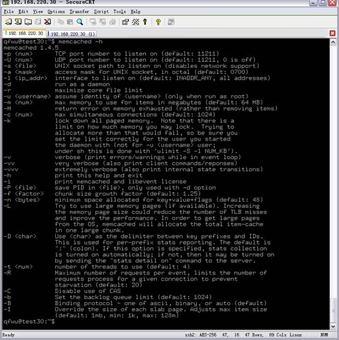
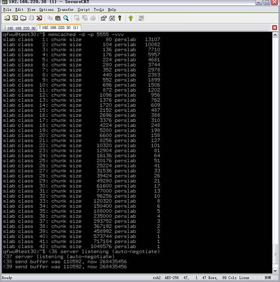
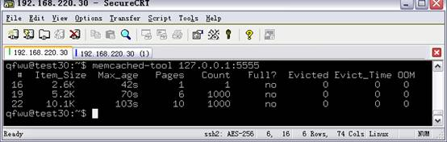
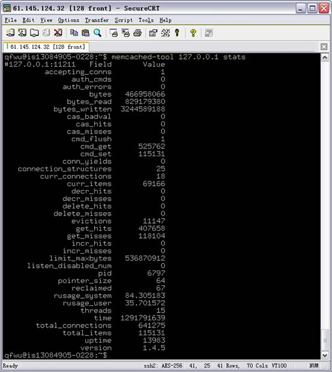
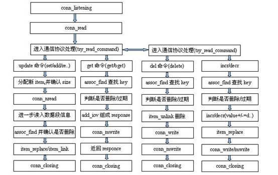
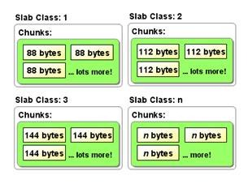

| 序号  | 修改时间       | 修改内容                                                      | 修改人   | 审稿人 |
| --- | ---------- | --------------------------------------------------------- | ----- | --- |
| 1   | 2010-11-15 | 创建                                                        | Keefe |     |
| 2   | 2010-11-19 | 增加小说所使用的缓存应用情况                                            | 同上    |     |
| 3   | 2010-12-8  | 增加memcache-tool工具使用说明，及整理文章结构                             | 同上    |     |
| 4   | 2010-12-9  | 增加memcache实现分析章节                                          | 同上    |     |
| 5   | 2011-2-15  | 因线上环境发现memcache连接过慢，重新考虑php的另外一个memcache扩展:  libmemcached | 同上    |     |
| 6   | 2011-2-24  | 因线上环境发现memcache可能丢包；加上UDP协议                               | 同上    |     |
| 7   | 2021-12-14 | 调整目录结构                                                    | 同上    |     |

<br><br><br>

---

# 目录

[TOC]

<br>

---

# 1 简介

官网： http://memcached.org/

libmemcached http://libmemcached.org/

最著名的KEY-VALUE开源数据库，常应用于WEB扩展应用，如twitter, facebook, mixi等。

**概述**：memcached 是以守护程序方式运行于一个或多个服务器中，随时接受客户端的连接操作，客户端可以由各种语言编写，目前已知的客户端 API 包括 Perl/PHP/Python/Ruby/Java/C#/C等. 然后客户端与 memcached 服务建立连接之后，进行存取对象了，每个被存取的对象都有一个唯一的标识符 key，存取操作均通过这个 key 进行，保存到 memcached 中的对象实际上是放置内存中的。

**特性**：支持文本和二进制协议；基于libevent的事件处理; 完全由客户端程序实现分布式。

## 1.1  服务器端程序

**linux下载:**  http://memcached.org/

**windows下载：**[**http://www.splinedancer.com/memcached-win32/**](http://www.splinedancer.com/memcached-win32/)

1) 安装

memcache依赖于[libevent](http://www.monkey.org/~provos/libevent/)库。

2. 启动与启动参数说明
   
   `/usr/bin/memcached -d -l 192.168.1.1 -p 11211 -m 128  -n 512 -vv -u httpd`
   
   参数解释：( man memcached或memcached –h )
   
   ```shell
   参数解释：( )
   -d 以守护程序（daemon）方式运行 memcached；
   -m 设置 memcached 可以使用的内存大小，单位为MB(default: 64 MB)；
   -l 设置监听的 IP 地址，(default: INADDR_ANY, all addresses)
   -u 指定用户，如果当前为 root 的话，需要使用此参数指定用户。
   -p <num>   TCP port number to listen on (default: 11211)
   -U <num>   UDP port number to listen on (default: 11211, 0 is off)
   -t <num>   number of threads to use (default: 4)
   -R      Maximum number of requests per event, limits the number of
       requests process for a given connection to prevent
       starvation (default: 20) 多并发时需要增大设置。
   -c <num>   max simultaneous connections (default: 1024)
   -n <num>   chunk_size初始设置大小，item所用的最小项
   ```

参数说明：不加任何参数时，memcache缺省启动TCP和UDP监听端口11211；缺省4个线程，20个并发连接；同时监听20个evnet;  启动-U如果不指定值，则会关闭UDP端口。



**服务器端程序提供服务：**

可调用方法：add()、get()、replace() 和 delete()等。

## 1.2  客户端支持

php要加memcached扩展. 目前php官网中提供了两种memcache扩展.

### 1.2.1 memcache

http://cn2.php.net/manual/en/book.memcache.php

1) Introduction

Memcache module provides handy procedural and object oriented interface to memcached, highly effective caching daemon, which was especially designed to decrease database load in dynamic web applications.

The Memcache module also provides a [session](http://cn2.php.net/manual/en/ref.session.php) handler (*memcache*).

More information about memcached can be found at [» http://www.memcached.org/](http://www.memcached.org/).

说明：本处的php-memcache扩展是与服务器端同出一源。

2) 安装

[**http://cn2.php.net/manual/en/memcache.installation.php**](http://cn2.php.net/manual/en/memcache.installation.php)

**windows:** http://downloads.php.net/pierre/

下载PHP对应版本的php_memcache.dll， 放到php/ext, 然后修改php的配置文件php.int, 增加如下一行：extension=php_memcache.dll

**Linux**:  http://pecl.php.net/get/memcache-2.1.2.tgz

将php_memcache.dll换成memcache.so, 其它过程同windows. 如果是编译安装，则加上*enable-memcache[=DIR]* 选项.

### 1.2.2 memcached

http://cn2.php.net/manual/en/book.memcached.php

1) Introduction

[memcached](http://www.memcached.org/) is a high-performance, distributed memory object caching system, generic in nature, but intended for use in speeding up dynamic web applications by alleviating database load.

This extension uses libmemcached library to provide API for communicating with memcached servers. It also provides a [session](http://cn2.php.net/manual/en/ref.session.php) handler (*memcached*).

Information about libmemcached can be found at http://libmemcached.org/libMemcached.html.

说明：此处扩展是使用libmemcached库提供API。

2) install

如果是编译安装，则加上**--with-libmemcached-dir=DIR选项;** **若需要压缩支持，则加上--with-zlib-dir=DIR;** Session handler support is enabled by default. To disable it, use **--disable-memcached-session** switch.

## 1.3   Test

1) **可用性测试**

法1: `$ make test`

法2: `$ telnet 127.0.0.1 11211`

**测试示例1: testmemcached.php (php)**

```php
<?php>
$mem = new Memcache;
$mem->connect('192.168.220.30', 5555) or die ("Could not connect");
$mem->set('key',"This is a test",0,0);
$val = $mem->get('key');
echo $val;
?>
```

显示结果：

NULL This is a test

**测试示例2: testmemcached.pl (perl)**

```perl\#!/usr/bin/perl
use strict;
use warnings;
use Cache::Memcached;

my $key = "foo2";
my $value = "bar2";
my $expires = 3600; # 1 hour
my $memcached = Cache::Memcached->new({
  servers => ["127.0.0.1:11211"],
  compress_threshold => 10_000
});

$memcached->add($key, $value, $expires);
my $ret = $memcached->get($key);
print "$ret\n";
```

2. **性能测试**

测试add方法

```php
<?php
ini_set('memcache.chunk_size',1024*15); //设置到15K
$mem=new Memcache();
$mem->addServer ("192.168.220.30",5555,false,1,0);
$start=microtime(true);
$str= str_repeat ("a",1024*10);  //10k数据
for($i=14000;$i>11000;$i--){
  $mem->add($i,$str,0, 0);
}
echo microtime(true)-$start;
echo "<br>finish.<br>"
?>
**//测试get**
$mem->get($i);
//测试del
$mem->delete($i);
```

结果分析：

本机add很快，远程add 1万次约需30sec，在item不太大时，约500次/sec.

get操作远比add快，远程get 1万次约需1.6sec，约5k~6k/sec.

del操作时间与get类似。

3. **并发测试**

4. **分布式测试**

```php<?php
$mem=new Memcache();
$mem->addServer ("192.168.220.104",11211,false,1,0);
$mem->addServer ("192.168.220.30",5555,false,1,0);
$start=microtime(true);
$str= str_repeat ("e",1024*1 );//10k数据
for($i=0;$i<500;$i++){
  $mem->set($i,$str,0, 0);
}
echo microtime(true)-$start;
echo "<br>finish.<br>"

?>
```

说明：需要加载的数据都分布到两台上，即机器A+机器B=实际数据数。这个分布式是由客户端来实现的。

<br>

# 2 运维篇

## 2.1   参数配置和优化

http://cn2.php.net/manual/en/book.memcache.php

**Memcache Configuration Options**

| Name                                                                                                               | Default    | Changeable  | Changelog                       |
| ------------------------------------------------------------------------------------------------------------------ | ---------- | ----------- | ------------------------------- |
| [memcache.allow_failover](http://cn2.php.net/manual/en/memcache.ini.php#ini.memcache.allow-failover)               | "1"        | PHP_INI_ALL | Available since memcache 2.0.2. |
| [memcache.max_failover_attempts](http://cn2.php.net/manual/en/memcache.ini.php#ini.memcache.max-failover-attempts) | "20"       | PHP_INI_ALL | Available since memcache 2.1.0. |
| [memcache.chunk_size](http://cn2.php.net/manual/en/memcache.ini.php#ini.memcache.chunk-size)                       | "8192"     | PHP_INI_ALL | Available since memcache 2.0.2. |
| [memcache.default_port](http://cn2.php.net/manual/en/memcache.ini.php#ini.memcache.default-port)                   | "11211"    | PHP_INI_ALL | Available since memcache 2.0.2. |
| [memcache.hash_strategy](http://cn2.php.net/manual/en/memcache.ini.php#ini.memcache.hash-strategy)                 | "standard" | PHP_INI_ALL | Available since memcache 2.2.0. |
| [memcache.hash_function](http://cn2.php.net/manual/en/memcache.ini.php#ini.memcache.hash-function)                 | "crc32"    | PHP_INI_ALL | Available since memcache 2.2.0. |
| session.save_handler                                                                                               | "files"    | PHP_INI_ALL | Available since memcache 2.1.2  |
| session.save_path                                                                                                  | ""         | PHP_INI_ALL | Available since memcache 2.1.2  |

php.ini

```shell
;;;;;;;;;;;;;;;;;;;
; Module Settings ;
;;;;;;;;;;;;;;;;;;;
[Memcache]
memcache.allow_failover = 1
memcache.max_failover_attempts=20
memcache.chunk_size =8192
memcache.default_port = 11211
```

**优化项**

1） 合理的参数配置，包括服务器端的启动参数和PHP扩展的初始配置如chunk_size, threads等。

2） Java, php中即可存储字节流也可存储对象。存储对象会调用各语言的serialize函数，会增大不少空间，需谨慎使用。

3） 存储项_set时可选择压缩，_get可自动解压。不推荐小字节内容进行压缩，效果不明显。

4） 数据内容不要过大，因为chunk_size是定长，过大会浪费内存。用工具检查内存使用情况，当slab class的page都用完后，将调用LRU算法。数据条数受限制于-m启动时所限制的内存。

## 2.2   memcache-tool使用

memcache-tool 用于监测memcache的存储使用情况

Usage: `memcached-tool <host[:port]> [mode]`

memcache-tool stats状态说明如下：+K `"y`#t yt0

| pid                   | memcache服务器的进程ID                                                 |
| --------------------- | ---------------------------------------------------------------- |
| uptime                | 服 务器已经运行的秒数                                                      |
| time                  | 服务器当前的unix时间戳                                                    |
| version               | memcache 版本                                                      |
| pointer_size          | 当前[操作系统](http://sunjun041640.blog.163.com/;)的指针大小（32位系统一般是32bit） |
| rusage_user           | 进 程的累计用户时间                                                       |
| rusage_system         | 进程的累计系统时间                                                        |
| curr_items            | 服 务器当前存储的items数量                                                 |
| total_items           | 从服务器启动以后存储的items总数量                                              |
| bytes                 | 当 前服务器存储items占用的字节数                                              |
| curr_connections      | 当前打开着的连接数                                                        |
| total_connections     | 从 服务器启动以后曾经打开过的连接数                                               |
| connection_structures | 服务器分配的连接 构造数                                                     |
| cmd_get               | get命令（获取）总请求次数                                                   |
| cmd_set               | set 命令（保存）总请求次数                                                  |
| get_hits              | 总命中次数                                                            |
| get_misses            | 总 未命中次数                                                          |
| evictions             | 为获取空闲内存而删除的items数（分配给memcache的空  间用满后需要删除旧的items来得到空间分配给新的items） |
| bytes_read            | 总读取字 节数（请求字节数）                                                   |
| bytes_written         | 总发送字节数（结果字节数）                                                    |
| limit_maxbytes        | 分 配给memcache的内存大小（字节）                                            |
| threads               | 当前线程数                                                            |



下图是memcache-tool 显示





简单计算公式：

1)  缓存命中率 = get_hits/cmd_get * 100%

2)  get_misses的数字加上get_hits应该等于cmd_get

3)  total_items == cmd_set == get_misses，当可用最大内存用光时，memcached就会删掉一些内容，等式就会不成立.

<br>

# 3 开发篇

**应用示例**

1) 存储项较大 (>8k)

memcachd缺省chunk_size大小是8k，可在php.ini重设。或如下面程序：

ini_set('memcache.chunk_size',1024*30); //设置到30K

2) Maximum execution time of 30 seconds exceeded

这是PHP的请求超时限制. 修改php.ini: max_execution_time = 300 或程序中

set_time_limit(时间)  //0为无限制

## PHP扩展

[**http://cn2.php.net/manual/en/class.memcache.php**](http://cn2.php.net/manual/en/class.memcache.php)

API如下，

```php
// add
bool Memcache::add (string $key , mixed $var [, int $flag [, int $expire]])
/*
//stores variable *var* with *key* only if such key doesn't exist at the server yet.
//flag : Use MEMCACHE_COMPRESSED to store the item compressed (uses zlib).
*/

// get
string Memcache::get ( string $key [, int &$flags ] )
array Memcache::get ( array $keys [, array &$flags ] )
Memcache::get() returns previously stored data if an item with such *key* exists on the server at this moment. can get string or array.

// del
bool Memcache::delete ( string $key [, int $timeout ] )

// replace
bool Memcache::replace ( string $key , mixed $var [, int $flag [, int $expire ]] )
//Memcache::replace() should be used to replace value of existing item with *key*. In case if item with such key doesn't exists, //Memcache::replace() returns **FALSE**.

// set — Store data at the server
bool Memcache::set ( string $key , mixed $var [, int $flag [, int $expire ]] )

// connect + addServer
bool Memcache::connect ( string $host [, int $port [, int $timeout ]] )
bool Memcache::addServer ( string $host [, int $port = 11211 [, bool $persistent [, int $weight [, int $timeout [, int $retry_interval [, bool $status [, callback $failure_callback [, int $timeoutms ]]]]]]]] )

$mem->addServer ("192.168.220.30",5555,false,1,0); //false: persistent;0:timeout
//说明：上述delete, addServer都有带timeout参数即本次操作的超时时间; add 带有存储项的过期时间，最多30days;


// flush — Flush all existing items at the server
bool Memcache::flush ( void )
//说明：flush不是马上就看到数据，flush操作只是标记了所有数据是过期数据，但要在有新的get请求时，才相应删除对应项。 （评价：典型的延迟删除策略，好!!!）
```

<br>

# 4 架构原理篇

## memcache字符串协议

存储命令

<command name> <key> <flags> <exptime> <bytes>\r\n

\- <command name> 是 set, add, 或者 repalce

\- <key> 是接下来的客户端所要求储存的数据的键值
 \- <flags> 是在取回内容时，与数据和发送块一同保存服务器上的任意16位无符号整形（用十进制来书写）。客户端可以用它作为“位域”来存储一些特定的信息；它对服务器是不透明的。
 \- <exptime> 是终止时间。如果为0，该项永不过期(虽然它可能被删除，以便为其他缓存项目腾出位置)。如果非0（Unix时间戳或当前时刻的秒偏移），到达终止时间后，客户端无法再获得这项内容。
 \- <bytes> 是随后的数据区块的字节长度，不包括用于分野的“\r\n”。它可以是0（这时后面跟随一个空的数据区块）。

**其它如：存回命令get,** **删除命令delete,** 增加减少命令incr/decr，状态stat

## UDP 协议

当来自客户端的连接数远大于TCP连接的上限时，可以使用基于UDP的接口。UDP接口不能保证传输到位，所以只有在不要求成功的操作中使用；比如被用于一个“get”请求时，会因不当的缓存处理而发生错误或回应有遗失。

每个UDP数据包都包含一个简单的帧头，数据之后的内容与TCP协议的描述类似。在执行所产生的数据流中，请求必须被包含在单独的一个UDP数据包中，但是回应可能跨越多个数据包。（只有“get”和“set”请求例外，跨越了多个数据包）

帧头有8字节长，如下（均由16位整数组成，网络字节顺序，高位在前）：

0-1 请求ID

2-3 序号

4-5 该信息的数据包总数

6-7 保留位，必须为0

请求ID有客户端提供。一般它会是一个从随机基数开始的递增值，不过客户端想用什么样的请求ID都可以。服务器的回应会包含一个和请求中的同样的 ID。客户端使用请求ID来区分每一个回应。任何一个没有请求ID的数据包，可能是之前的请求遭到延迟而造成的，应该被丢弃。序号的返回是从0到n- 1，n是该条信息的数据包数量。

# 5 源码剖析篇

**memcache客户端**的实现：通过socket网络连接 + memcache字符串协议。

**memcache服务端**的实现：libevent网络通讯 + slab allocation

**主要的技术实现点：**

内存分配：slab allocation, fixed-size memoryPool

内存更新算法：expiretime 或 LRU

分布式支持：由客户端实现。KEY值转化为HASH数值

HASH算法: a)机器数求余；b)consistence hash。

## 5.1 事件分发libevent

main函数使用了libevent进行事件处理。

libevent使用方式：evnet_init, event_set, event_add, event_dispatch

事件分发实现：

event_setàevent_handleràdrive_machine-à(根据不同事件类型，选择操作)

conn_listen: accept

conn_parse_commnd: try_read_commadnàprocess_command: process_get_commnd,…

(get/set/replace/delete…)

-àitem_get(thread.c)-àdo_item_get(items.c)-àassoc_find(assoc.c)-à



## 5.2  内存分配slab allocation

//Note: 内存分配的一些参数可通过配置文件获取或取缺省值。

内存分配：Slab Allocation机制。stab classà page à chunk_size

stab class数目由启动参数确定，stab class中的page使用完后，则调用LRU算法。chunk_size预分配若干固定尺寸，用来存储数据项，单个数据项不要超过此值，若超过，性能急降，存储项最大受限于stab class中的page总额。

page(1M)--> chunk (fixed-size) -à slabclass.

slabs_init（）: 初始化POWER_LARGEST个subclass,　 为每个Slab分配一个Page的内存空间，Page缺省为1MB，每个Page根据Slab规格被划分为若干个相同Size的Chunk，每个 Chunk里保存一个Item，每个Item同时包含了Item结构体、k和V，相同Size的Chunk合成一组Slab Class， subclass是个chunk的集合，每个chunk大小为2^n(n: classid) 或者 init_size*factor^n.　 如图例：

\#define POWER_LARGEST 200　//定义subclass id最大值

factor:　为影响因子，可变。



### 缓存查找find

accoc_find函数：

```php
   uint32_t hv = hash(key, nkey, 0);
   bucket = hv & hashbucket_num //default hashbucket_num = 1<<16 = 2^16 = 65536
```

通过bucket定位到相应的hashtable，然后通过memcmp（key, item）的方式找到value.（此时key值可能不同，有碰撞，可用拉链法解决）

效率评价：内存分配虽有部分浪费，但可重复使用。

### 缓存更新机制

1） 内存未使用完之前，只通过expiretime进行更新。

2） 内存使用完后，将通过expiretime和LRU进行更新。

**expiretime**

过期时间，是指每个缓存项都有设置一个过期时间如一小时，到了这个过期时间，在get取数据时，此项无效。（特别注意：memcache此时的实现，并没有线程来主动移除过期数据，只是在get操作时判断数据是否过期，如是则移除。如果没有数据来get, *内存将一直不释放，事实上，分配了的内存不会再释放到系统，而是回归到进程内的空闲内存池,* *这是资源管理模式的lease + prealloc**机制*）

**LRU**

最近最少使用更新。这个策略中，可以考虑到expiretime，可先将expiretime的替换，再把LRU的替换。

## 5.3  实现优化

提高空间利用率：如定长优化1)sizeof(item)=sizeof(chunk); 2)…

**测试1：HASH数求余**

```perl
#! /usr/bin/perl
# usage: $0 node1 node2 ...
use strict;
use warnings;
use String::CRC32;

my @nodes = @ARGV;
my @keys = ('a'..'z');
my %nodes;

foreach my $key ( @keys ) {
  my $hash = crc32($key);
  my $mod = $hash % ( $#nodes + 1 );
  my $server = $nodes[ $mod ];
  push @{ $nodes{ $server } }, $key;
}

foreach my $node ( sort keys %nodes ) {
  printf "%s: %s\n", $node, join ",", @{ $nodes{$node} };
}
```

# FAQ

1) 存储项长度变化的影响，如初始5k，后更新时15k.
   
   答：chunk_size缺省最大8k，如存储项长度超过插入速度将急降。此时可在php.ini或程序端修改chunk_size限制。

​     如原存储项内容更改，则需使用replace, 此时删除原内容，根据原内容重新插入。replace相当于del + add操作。

2) 存储项大小，存储项的条数和内存的关系
   
   答：因为memcached使用了slab allocation的内存分配方式，内存­-m决定了item最终存储的条数，而存储项的大小也决定了存储项的条数。 因此，要使内存利用率达到尽可能高，表现为memcached-tool检测时某些slab class项是否full.

slab class所能使用的内存-m用完后，将使用LRU算法来更新item.

<br>

# 参考资料

**官网**

* memcache官网： http://memcached.org/

* libmemcached http://libmemcached.org/

* libevent  http://www.monkey.org/~provos/libevent/

* php官方文档  http://cn2.php.net/manual/en/book.memcache.php

* php扩展  http://pecl.php.net

**参考链接**

* memcache机制分析 http://www.byejob.com/space.php?uid=17&do=blog&id=148

* memcached完全剖析　http://tech.idv2.com/2008/07/10/memcached-001/

* memcached深度分析 http://blog.developers.api.sina.com.cn/?p=124

* http://sunjun041640.blog.163.com/blog/static/256268322010389554457/
