| 序号 | 修改时间   | 修改内容                          | 修改人 | 审稿人 |
| ---- | ---------- | --------------------------------- | ------ | ------ |
| 1    | 2010-05-14 | 创建                              | Keefe  | Keefe  |
| 2    | 2010-7-16  | 添加NoSQL章节                     | 同上   |        |
| 3    | 2010-7-22  | 添加开源数据库的实现              | 同上   |        |
| 4    | 2010-11-11 | 更新memcached，TC的测试           | 同上   |        |
| 5    | 2010-12-9  | memcahe应用及实现部分抽出单独另文 | 同上   |        |
| 6    | 2012-2-8   | 更新mongondb内容                  | 同上   |        |
| 7    | 2014-10-23 | 更新内存数据库内容                | 同上   |        |
| 8    | 2016-6-13  | 增加关系数据库的范式分析          | 同上   |        |
| 9    | 2017-1-15  | 增加NewSQL章节                    | 同上   |        |
| 10   | 2017-9-18  | 更新关系数据库章节，增加oracle    | 同上   |        |
| 11   | 2018-3--18 | 增加SQL和数据库接口章节。         | 同上   |        |
| 12   | 2018-5-27  | 更新事务章节。                    | 同上   |        |
| 13   | 2019-7-13  | 更新事务隔离级别章节              | 同上   |        |
| 14   | 2021-8-24  | 更新RDBS常用SQL比较 章节          | 同上   |        |

<br><br><br>

---

# 目录

[TOC]

[目录... 1](#_Toc16344405)

[1    数据库概述... 6](#_Toc16344406)

[1.1       DBMS简史... 6](#_Toc16344407)

[1.1.1     数据库解决方案变迁... 7](#_Toc16344408)

[1.1.2     库架构演进... 8](#_Toc16344409)

[1.2       DBMS主要功能... 8](#_Toc16344410)

[1.3       数据库理论... 8](#_Toc16344411)

[1.3.1     ACID模型（RDBS）... 8](#_Toc16344412)

[1.3.2     分布式系统... 9](#_Toc16344413)

[1.4       数据库模型... 9](#_Toc16344414)

[1.5       事务Transaction. 10](#_Toc16344415)

[1.5.1     并发问题和隔离级别... 10](#_Toc16344416)

[1.5.2     数据库事务... 12](#_Toc16344417)

[1.5.3     分布式事务... 12](#_Toc16344418)

[1.6       SQL. 14](#_Toc16344419)

[1.6.1     ANSI SQL. 14](#_Toc16344420)

[1.6.2     PL/SQL. 15](#_Toc16344421)

[1.6.3     SQL Mode. 16](#_Toc16344422)

[1.7       数据库接口... 16](#_Toc16344423)

[1.7.1     ODBC. 17](#_Toc16344424)

[1.7.2     JDBC. 18](#_Toc16344425)

[1.8       数据库的分类... 19](#_Toc16344426)

[1.9       术语词典... 20](#_Toc16344427)

[1.10     本章参考... 20](#_Toc16344428)

[2    Relational关系数据库... 21](#_Toc16344429)

[2.1       关系理论... 21](#_Toc16344430)

[2.1.1     关系操作SQL. 22](#_Toc16344431)

[2.1.2     范式分析Normal Form.. 22](#_Toc16344432)

[2.2       MySQL. 23](#_Toc16344433)

[2.3       PostgreSQL. 23](#_Toc16344434)

[2.3.1     安装... 24](#_Toc16344435)

[2.3.2     使用... 24](#_Toc16344436)

[2.4       Oracle. 25](#_Toc16344437)

[2.4.1     Oracle RAC. 25](#_Toc16344438)

[2.4.2     Oracle客户端... 25](#_Toc16344439)

[2.5       Microsoft SQL Server. 25](#_Toc16344440)

[2.6       DB2. 25](#_Toc16344441)

[2.7       RDBS比较... 26](#_Toc16344442)

[2.7.1     模式Schema. 26](#_Toc16344443)

[2.7.2     多版本并发控制MVCC. 26](#_Toc16344444)

[2.7.3     MySQL和PostgreSQL. 26](#_Toc16344445)

[2.7.4     Oracle和PostgreSQL. 27](#_Toc16344446)

[2.8       本章参考... 27](#_Toc16344447)

[3    NoSQL非关系数据库... 27](#_Toc16344448)

[3.1       NoSQL分类... 28](#_Toc16344449)

[3.2       键值(key-value)数据库... 30](#_Toc16344450)

[3.2.1     Memcached. 31](#_Toc16344451)

[3.2.2     Redis. 32](#_Toc16344452)

[3.2.3     SSDB. 36](#_Toc16344453)

[3.2.4     Tokyo Cabinet和Tokoy Tyrant. 38](#_Toc16344454)

[3.3       列存储数据库... 38](#_Toc16344455)

[3.3.1     Cassandra. 38](#_Toc16344456)

[3.4       文档型数据库... 39](#_Toc16344457)

[3.4.1     MongoDB. 39](#_Toc16344458)

[3.5       图形数据库... 41](#_Toc16344459)

[3.6       本章参考... 42](#_Toc16344460)

[4    NewSQL. 42](#_Toc16344461)

[4.1       NewSQL分类... 42](#_Toc16344462)

[4.2       分布式数据库Distributed. 44](#_Toc16344463)

[4.2.1     阿里云DRDS分布式关系型数据库... 44](#_Toc16344464)

[4.3       HW Libra（高斯数据库）... 46](#_Toc16344465)

[4.4       本章参考... 46](#_Toc16344466)

[5    时序数据库 TSDB. 46](#_Toc16344467)

[5.1       简介... 46](#_Toc16344468)

[5.2       时序数据库比较... 47](#_Toc16344469)

[5.3       本章参考... 50](#_Toc16344470)

[6    SQL引擎... 50](#_Toc16344471)

[6.1       SQL引擎分类... 50](#_Toc16344472)

[6.2       OLAP分析型... 50](#_Toc16344473)

[6.2.1     Vertica (Vertica/HP) 53](#_Toc16344474)

[6.3       OLTP 事务型... 53](#_Toc16344475)

[6.4       SQL On Hadoop. 53](#_Toc16344476)

[6.4.1     简介和框架列表... 53](#_Toc16344477)

[6.4.2     Apache Drill 56](#_Toc16344478)

[6.5       本章参考... 58](#_Toc16344479)

[7    其它数据库... 58](#_Toc16344480)

[7.1       内存数据库 In-memory. 58](#_Toc16344481)

[7.1.1     简介... 58](#_Toc16344482)

[7.1.2     案例... 59](#_Toc16344483)

[7.2       嵌入式数据库 Embed. 59](#_Toc16344484)

[7.2.1     Berkeley DB. 59](#_Toc16344485)

[7.2.2     SQLite. 60](#_Toc16344486)

[7.3       搜索引擎... 61](#_Toc16344487)

[7.4       本章参考... 62](#_Toc16344488)

[8    各种数据库分析比较... 62](#_Toc16344489)

[8.1       数据库排行db-engines. 62](#_Toc16344490)

[8.2       数据库技术选型... 63](#_Toc16344491)

[8.2.1     基本信息... 63](#_Toc16344492)

[8.2.2     整体比较... 65](#_Toc16344493)

[8.3       DB性能比较... 66](#_Toc16344494)

[8.4       国产数据库产品列表... 66](#_Toc16344495)

[8.5       DB常用SQL比较... 66](#_Toc16344496)

[8.5.1     获取连续时间序列（日历/月历）... 67](#_Toc16344497)

[8.5.2     关系数据库SQL语句比较... 68](#_Toc16344498)

[8.5.3     Oracle和IQ常用SQL比较... 69](#_Toc16344499)

[8.6       本章参考... 69](#_Toc16344500)

[9    SQL调优... 70](#_Toc16344501)

[9.1       SQL JOIN.. 70](#_Toc16344502)

[9.2       SQL执行流程... 70](#_Toc16344503)

[9.3       本章参考... 72](#_Toc16344504)

[10       数据库大型应用实例... 72](#_Toc16344505)

[10.1     负载均衡技术... 72](#_Toc16344506)

[10.2     数据库的高可用HA. 73](#_Toc16344507)

[10.3     数据库的读写分离... 74](#_Toc16344508)

[10.4     数据库拆分(分布式) 76](#_Toc16344509)

[10.4.1    垂直/水平拆分（分库分表）... 76](#_Toc16344510)

[10.4.2    Sharding中间件... 78](#_Toc16344511)

[10.4.3    乐视的分库法... 79](#_Toc16344512)

[10.5     本章参考... 79](#_Toc16344513)

[参考资料... 80](#_Toc16344514)

[附录... 80](#_Toc16344515)

[DB官网... 80](#_Toc16344516)

[业界会议... 81](#_Toc16344517)


**图目录**

[图 1 数据库解决方案的变迁史... 7](#_Toc16344518)

[图 2 事务型数据库架构演进... 8](#_Toc16344519)

[图 3 Connector/ODBC Architecture Components. 18](#_Toc16344520)

[图 4 JDBC结构图... 19](#_Toc16344521)

[图 5 NewSQL分类... 43](#_Toc16344522)

[图 6 DRDS模块结构图... 45](#_Toc16344523)

[图 8 时序数据库示例... 47](#_Toc16344524)

[图 7时序数据库发展简史... 48](#_Toc16344525)

[图 9 OLAP实现方案对比... 52](#_Toc16344526)

[图 10 传统的SQL on Hadoop的实现方式（YARN之上）... 54](#_Toc16344527)

[图 11 Drill架构... 57](#_Toc16344528)

[图 12 ebay的读写分离：ebay的读写比率是260:1. 74](#_Toc16344529)

[图 13 微软的数据库分发... 75](#_Toc16344530)


**表目录**

[表格 1 数据库SQL分类... 7](#_Toc16344531)

[表格 2 并发事务引起的问题描述... 10](#_Toc16344532)

[表格 3 SQL 隔离级别和对应的并发问题对照表... 10](#_Toc16344533)

[表格 4 隔离级别原理... 11](#_Toc16344534)

[表格 5 各RDBMS 的事务处理机制... 12](#_Toc16344535)

[表格 6 分布式事务的典型方案... 13](#_Toc16344536)

[表格 7 MySQL支持的sql_mode模式（mysql5.0+）... 16](#_Toc16344537)

[表格 8 MyODBC版本... 17](#_Toc16344538)

[表格 9 数据库产品分类... 19](#_Toc16344539)

[表格 10 MySQL和PostgreSQL比较... 21](#_Toc16344540)

[表格 11 主键、外键和索引的区别... 22](#_Toc16344541)

[表格 12 PG的第三方组件... 23](#_Toc16344542)

[表格 13 PostgreSQL常用命令... 24](#_Toc16344543)

[表格 14 Schema在RDBS里的区别... 26](#_Toc16344544)

[表格 15 MVCC实现的两种方法比较... 26](#_Toc16344545)

[表格 16 MySQL VS PostgreSQL. 26](#_Toc16344546)

[表格 17 NoSQL比较表1. 28](#_Toc16344547)

[表格 18 NoSQL四种类别比较表2. 28](#_Toc16344548)

[表格 19 MongoDB和OrientDB比较... 29](#_Toc16344549)

[表格 20 KV数据库比较表... 30](#_Toc16344550)

[表格 21 Redis命令组... 33](#_Toc16344551)

[表格 22 Redis的结构类型及操作命令... 33](#_Toc16344552)

[表格 23 Redis各个数据类型应用场景... 34](#_Toc16344553)

[表格 24 Redis的业务场景示例... 35](#_Toc16344554)

[表格 25 REDIS示例：信纸电商销售的redis键模式... 36](#_Toc16344555)

[表格 26 REDIS示例：消息队列~模板/数据更新通知... 36](#_Toc16344556)

[表格 27 MongoDB术语表... 39](#_Toc16344557)

[表格 28 MongoDB常用命令... 40](#_Toc16344558)

[表格 29. 46](#_Toc16344559)

[表格 30 时序数据发展史... 48](#_Toc16344560)

[表格 31 主流时序数据库的功能比较... 49](#_Toc16344561)

[表格 34 OLAP系统的分类... 50](#_Toc16344562)

[表格 35 OLAP工具比较... 51](#_Toc16344563)

[表格 36 OLAP产品比较... 51](#_Toc16344564)

[表格 37 SAP和Sybase比较... 52](#_Toc16344565)

[表格 38 一流的SQL on Hadoop方案所带来的功能和业务好处... 53](#_Toc16344566)

[表格 39 SQL-on-Hadoop框架... 54](#_Toc16344567)

[表格 40 2016年数据库排行.. 62](#_Toc16344568)

[表格 41 商业数据库基本信息比较表... 63](#_Toc16344569)

[表格 42 开源存储系统比较表... 63](#_Toc16344570)

[表格 43 常见数据库比较表... 65](#_Toc16344571)

[表格 44 获取当前日期前三十天的日期... 67](#_Toc16344572)

[表格 45 关系数据库MySQL/Oracle/SQL Server的常用SQL语句比较列表... 68](#_Toc16344573)

[表格 46 Oracle和Sybase IQ常用SQL比较... 69](#_Toc16344574)

[表格 47 SQL JOIN详述... 70](#_Toc16344575)

[表格 48 SQL引擎执行查询类SQL语句的步骤说明... 71](#_Toc16344576)

[表格 49 各数据库的SQL执行计划... 71](#_Toc16344577)

[表格 50 Sharding中间件比较... 78](#_Toc16344578)
<br><br><br>

---

# 1 数据库概述

数据库（Database，港台地区称为资料库），可以被视为能够进行自动查询和修改的数据集。

DBMS主要功能

*  SQL语句操作
*  持久化存储
*  事务处理
*  并发访问支持
*  数据容灾机制（热备份，日志恢复，回滚）


**术语词典**

*  DBMS: Database Manager System
*  RDBMS: Relational database manager system 面向关系的DBMS
*  ODBMS: Object database manager system 面向对象的DBMS
*  NoSQL: Not only SQL, 泛指非关系型的数据库。 不需要SQL如各种K-V数据库和内存数据库。一般还避开了事务处理。
*  NewSQL: 对各种新的可扩展/高性能数据库的简称，这类数据库不仅具有[NoSQL](http://baike.baidu.com/view/2677528.htm)对海量数据的存储管理能力，还保持了传统[数据库](http://baike.baidu.com/view/1088.htm)支持[ACID](http://baike.baidu.com/view/600227.htm)和[SQL](http://baike.baidu.com/view/34.htm)等特性。
*  OLAP：Online Analytical Processing 联机分析处理（如在线查询数据返回非乱码字段）
*  ACID：An acronym standing for atomicity, consistency, isolation, and durability. 指数据库事务正确执行的四个基本要素的缩写。包含：原子性（Atomicity）、一致性（Consistency）、隔离性（Isolation）、持久性（Durability）。
*  CRUD：Create Read Update Delete


## 1.1  DBMS简史

1968年第一个DBMS上线，IBM在数据库领域发力甚早，比如System R，不过没有对外。

1979年，Relational Software公司(后来更名为Oracle公司)发布了第一个SQL产品：Oracle。

1983年，IBM推出了DB2。

80年代，面向对象的数据库问世，不过缺乏像SQL一样的标准接口而未能广为使用，不过面向对象数据库中一些想法，如支持XML等，在后来的NoSQL中又得到了应用。

90年代，出现了一些开源的数据库产品，如MySQL、Postgres。

00年代，大规模互联网应用给数据库带来了很大的冲击，这一阶段有些中间件的解决方案。有公司开始尝试搞分布式DBMS，最终导致了NoSQL运动。NoSQL里面最著名的是Google Bigtable和Amazon Dynamo。

00年代末，很多应用更强调强一致、支持事务，使用NoSQL的接口往往导致应用代码很复杂，这些因素最终促使了NewSQL的诞生，NewSQL初次出现在2011年的一篇论文中。


### 1.1.1 数据库解决方案变迁

 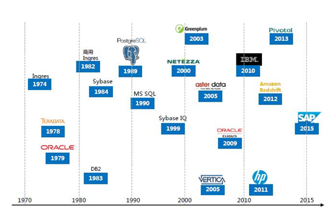


 

图 1 数据库解决方案的变迁史


表格 1 数据库SQL分类

| 类别   | 简述                                                         | 应用场景及示例                                               |
| ------ | ------------------------------------------------------------ | ------------------------------------------------------------ |
| SQL    | 关系数据库。                                                 | 多用于结构化数据的关系查询。如MySQL/PostgreSQL/Oracle/SQL  Server |
| NoSQL  | 不仅仅是SQL，可再分为KV、列式、文档、图计算。                | 多用于互联网应用。如Redis/Mongodb/HBase/                     |
| NewSQL | 新型关系数据库，多实现为MPP、列式。解决了RDBS的自动分表问题。 | 多用于传统BI的融合数仓。如Tidb、Gauss。                      |

备注：HBase不纯粹是列式存储（仅列簇），更是K/V数据库（RowKey）。


### 1.1.2 库架构演进

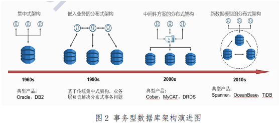

图 2 事务型数据库架构演进


## 1.2  数据库理论

### 1.2.1 ACID模型（RDBS）

关系数据库的ACID模型拥有高一致性 + 可靠性，丧失可用性：

*  Atomicity原子性：一个事务中所有操作都必须全部完成，要么全部不完成。

*  Consistency一致性：在事务开始或结束时，数据库应该在一致状态。

*  Isolation隔离性：事务将假定只有它自己在操作数据库，彼此不知晓。

*  Durability：一旦事务完成，就不能返回。

备注：隔离性是一个最常放松的一个。可以在数据操作过程中利用数据库的锁机制或者多版本并发控制机制获取更高的隔离等级。但是，随着数据库隔离级别的提高，数据的并发能力也会有所下降。所以，如何在并发性和隔离性之间做一个很好的权衡就成了一个至关重要的问题。


### 1.2.2 分布式系统

主要理论：CAP理论、BASE模型、一致性、

详见 另文《[分布式架构](分布式架构.md)》


### 1.2.3 数据库分类

表格  数据库产品分类

| 类别         | 细类     | 简述                           | 应用场景               |
| ------------ | -------- | ------------------------------ | ---------------------- |
| 数据实时性   | OLTP     | 事务型处理，需实时或低延迟。。 |                        |
|              | OLAP     | 在线处理。允许延迟。           |                        |
| 数据量规模   | 内存     | 数据量可以全放在内存           | 如内存数据库HANA       |
|              | 大量     | 内存无法全部放下               |                        |
|              | 海量     | 传统数据仓库无法入下           | Hadoop  HDFS分布式存储 |
| 数据查询性能 | 并行查询 | MPP                            |                        |


### 1.2.4  数据库模型

Common models include:

- [Hierarchical model](http://en.wikipedia.org/wiki/Hierarchical_database_model)
- [Network model](http://en.wikipedia.org/wiki/Network_model) 网状模型
- [Relational model](http://en.wikipedia.org/wiki/Relational_model) 关系模型
- [Entity-relationship](http://en.wikipedia.org/wiki/Entity-relationship) 实体关系模型
- [Object-relational model](http://en.wikipedia.org/wiki/Object-relational_model)
- [Object model](http://en.wikipedia.org/wiki/Object_model) 对象模型
- Document-oriented model 面向文档的模型(new)

 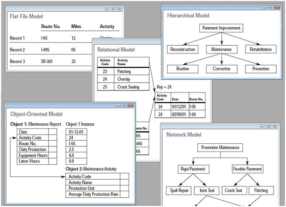


**存储模型**

根据数据存储的*逻辑结构*得到下列的存储模型：

*  table-oriented　如传统的关系数据库，表存储，用行存储方式，一行对应多字段。常见的如oracle, mysql, PostgreSQL等。


按照数据模型保存性质将当前NoSQL分为四种类型：

*  column-oriented 列存储，多字段记录，每字段一表。

*  document-oriented 如MongoDB

*  key/value store 目前NoSQL最流行的方式。一个key对应一个value.

*  graph图数据库，如InfiniteGraph和Neo4j.


## 1.3  事务Transaction

在关系数据库中，一个事务可以是一条SQL语句，一组SQL语句或整个程序。事务由事务开始(**begin transaction**)和事务结束(**end transaction**) 之间执行的全体操作组成。

事务是恢复和并发控制的基本单位。

事务使用ACID模型，具有4个属性：原子性、一致性、隔离性、持久性。

### 1.3.1 并发问题和隔离级别

并发事务常见问题：丢失更新、脏读、不可重读和幻读。

表格 2 并发事务引起的问题描述

| 问题                          | 描述                                                         | 结果        | 解决                       |
| ----------------------------- | ------------------------------------------------------------ | ----------- | -------------------------- |
| 丢失更新                      | A读—B读—A改—B改                                              | A更改丢失   |                            |
| Dirty  Read  脏读             | A改—B读—A回滚  一个事务处理过程里读取了另一个未提交的事务中的数据。 | B读无效值   | 一般要解决                 |
| Nonrepeatable  Read  不可重读 | A读—B改—A读                                                  | A读不一致   | REPEATABLE  READ  SNAPSHOT |
| Phantom  Read  幻读           | A读—B增删—A读  事务查询时没有增加范围锁。                    | A读或多或少 | SERIALIZABLE               |

备注：事务提交过程中，别的连接是可以查询操作的，但数据是旧的。


隔离级别用于决定如何控制并发用户读写数据的操作。例如读操作默认使用共享锁，写操作需要使用排它锁。

SQL 92标准定义了4种隔离级别（从高到低）分别是：可序列化(Serializable)、可重复读(Repeatable reads)、提交读(Read committed)、未提交读(Read uncommitted）。详见下表。

表格 3 SQL 隔离级别和对应的并发问题对照表

| Isolation Level   隔离级别  | Dirty Read   脏读 | Nonrepeatable Read   不可重读 | Phantom Read   幻读   | Serialization Anomaly   序列化异常 |
| --------------------------- | ----------------- | ----------------------------- | --------------------- | ---------------------------------- |
| Read  uncommitted  读未提交 | Possible          | Possible                      | Possible              | Possible                           |
| Read  committed  读已提交   | Not possible      | Possible                      | Possible              | Possible                           |
| Repeatable  read  可重复读  | Not possible      | Not possible                  | Not  possible in TiDB | Possible                           |
| Serializable  串行化        | Not possible      | Not possible                  | Not possible          | Not possible                       |


表格 4 隔离级别原理

| 隔离级别                    | 简述                                                         | 原理                                                         | 现象（并发问题）                               |
| --------------------------- | ------------------------------------------------------------ | ------------------------------------------------------------ | ---------------------------------------------- |
| Read  uncommitted  读未提交 | 最低的隔离级别。，一个事务可以读到另外一个事务未提交的数据。 | 事务在读数据的时候并未对数据加锁。事务在修改数据的时候只对数据增加[行级](http://www.hollischuang.com/archives/914)[共享锁](http://www.hollischuang.com/archives/923)。 | 都有。任何情况都无法保证。                     |
| Read  committed  读已提交   | 在一个事务修改数据过程中，如果事务还没提交，其他事务不能读该数据。 | 事务对当前被读取的数据加行级共享锁（当读到时才加锁），一旦读完该行，立即释放该行级共享锁；事务在更新某数据的瞬间，必须先对其加行级排他锁，直到事务结束才释放。 | 只解决了脏读。                                 |
| Repeatable  read  可重复读  | 可以解决不可重复读的问题。                                   | 事务在读取某数据的瞬间，必须先对其加行级共享锁，直到事务结束才释放；  事务在更新某数据的瞬间，必须先对其加行级排他锁，直到事务结束才释放。 | 可避免脏读、不可重复读的发生。                 |
| Serializable  串行化        | 最高的隔离级别。                                             | 事务在读取数据时，必须先对其加 表级共享锁 ，直到事务结束才释放；  事务在更新数据时，必须先对其加 表级排他锁 ，直到事务结束才释放。 | 解决所有。可避免脏读、不可重复读、幻读的发生。 |

备注：1. 锁机制~一般读操作使用共享锁，写操作使用排它锁。另外还要看锁的粒度是行级还是表级。

2. 序列化事务会产生以下效果：

*  无法读取其它事务已修改但未提交的记录。
*  在当前事务完成之前，其它事务不能修改目前事务已读取的记录。
*  在当前事务完成之前，其它事务所插入的新记录，其索引键值不能在当前事务的任何语句所读取的索引键范围中。

3. 四种事务隔离级别从隔离程度上越来越高，但同时在并发性上也就越来越低。


### 1.3.2 数据库事务

表格 5 各RDBMS 的事务处理机制

| DBMS       | 事务隔离级别                                                 | 事务SQL                                                      |
| ---------- | ------------------------------------------------------------ | ------------------------------------------------------------ |
| MySQL      | 4种分别是：  ① Serializable  ② Repeatable  read（默认级别）。 <BR>③ Read committed   ④ Read uncommitted | * 查看隔离级别  `select **@@tx_isolation**;`  <BR>* 查询正在执行的事务 ：  ` SELECT * FROM information_schema.INNODB_TRX`  <BR>* 查看正在锁、等待锁   INFORMATION_SCHEMA.INNODB_LOCKS、  INFORMATION_SCHEMA.INNODB_LOCK_WAITS; |
| Oracle     | 2种：Serializable和Read committed (默认级别)                 |                                                              |
| SQL Server | 6种：READ UNCOMMITED、READ COMMITED、REPEATABLE  READ、SERIALIZEABLE和SNAPSHOT（快照）、READ  COMMITED SNAPSHOT（已经提交读隔离）。 |                                                              |
| Postgre    |                                                              |                                                              |
| Redis      | 单个操作是原子性的。多个操作也支持事务，即原子性，通过MULTI和EXEC指令包起来。 | multi exec  watch unwatch discard                            |

备注：1. SELECT不需提交事务。DML语言，比如update，delete，insert等修改表中数据的需要commit; DDL语言，比如create，drop等改变表结构的，就不需要写commit（因为内部隐藏了commit）

2. 两阶段提交（2PC, Two-phase Commit）使用XA事务，是两阶段提交协议。MySQL从5.5版本开始支持，SQL Server 2005 开始支持，Oracle 7 开始支持。

XA协议分为以下两个阶段：

*  第一阶段：事务协调器要求每个涉及到事务的数据库预提交(precommit)此操作，并反映是否可以提交.

*  第二阶段：事务协调器要求每个数据库提交数据。


### 1.3.3 分布式事务

分布式系统主要参照CAP和BASE理论。

分布式事务就是指事务的参与者、支持事务的服务器、资源服务器以及事务管理器分别位于不同的分布式系统的不同节点之上。简单的说，就是一次大的操作由不同的小操作组成，这些小的操作分布在不同的服务器上，且属于不同的应用，分布式事务需要保证这些小操作要么全部成功，要么全部失败。本质上来说，分布式事务就是为了保证不同数据库的数据一致性。


表格 6 分布式事务的典型方案

|                        | 简介                                                         | 优点                                                         | 缺点                                                         |
| ---------------------- | ------------------------------------------------------------ | ------------------------------------------------------------ | ------------------------------------------------------------ |
| 两阶段提交（2PC）      | 强一致性。牺牲了一部分可用性来换取的一致性。                 | 尽量保证了数据的强一致，适合对数据强一致要求很高的关键领域。（其实也不能100%保证强一致） | 实现复杂，牺牲了可用性，对性能影响较大，不适合高并发高性能场景，如果分布式系统跨接口调用，目前 .NET 界还没有实现方案。 |
| 补偿事务（TCC）        | 即三阶段提交（3PC)。针对每个操作，都要注册一个与其对应的确认和补偿（撤销）操作。 | 跟2PC比起来，实现以及流程相对简单了一些，但数据的一致性比2PC也要差一些 | 在2,3步中都有可能失败。TCC属于应用层的一种补偿方式，所以需要程序员在实现的时候多写很多补偿的代码，在一些场景中，一些业务流程可能用TCC不太好定义及处理。 |
| 本地消息表（异步确保） | 将分布式事务拆分成本地事务进行处理，来源于eBay。             | 避免了分布式事务，实现了最终一致性。                         | 消息表会耦合到业务系统中，如果没有封装好的解决方案，会有很多杂活需要处理。 |
| MQ  事务消息           |                                                              | 实现了最终一致性，不需要依赖本地数据库事务。                 | 实现难度大，主流MQ不支持，没有.NET客户端，RocketMQ事务消息部分代码也未开源。 |
| Saga事务模型           | 又名长时间运行事务（Long-running-transaction）               |                                                              |                                                              |
| Paxos协议              | 分布式系统共识性的第一个实现方案。                           |                                                              |                                                              |

备注：2PC是强一致性，其它方案都是最终一致性。


**1.** **两阶段提交（2PC）**

两阶段提交这种解决方案属于牺牲了一部分可用性来换取的一致性。

优点： 尽量保证了数据的强一致，适合对数据强一致要求很高的关键领域。（其实也不能100%保证强一致）

缺点： 实现复杂，牺牲了可用性，对性能影响较大，不适合高并发高性能场景，如果分布式系统跨接口调用，目前 .NET 界还没有实现方案。


**2.** **被偿事务（TCC）**

核心思想是：针对每个操作，都要注册一个与其对应的确认和补偿（撤销）操作。它分为三个阶段：

*  Try 阶段主要是对业务系统做检测及资源预留

*  Confirm 阶段主要是对业务系统做确认提交，Try阶段执行成功并开始执行 Confirm阶段时，默认 Confirm阶段是不会出错的。即：只要Try成功，Confirm一定成功。

*  Cancel 阶段主要是在业务执行错误，需要回滚的状态下执行的业务取消，预留资源释放。


## 1.4 SQL

SQL: Structured Query Lanauage，结构化查询语言。

SQL包括 DDL（数据库操作语言）, [DCL](http://en.wikipedia.org/wiki/Data_Control_Language)（数据库控制语言）, [DML](http://en.wikipedia.org/wiki/Data_Manipulation_Language)（数据库管理语言）。
*  DML（data manipulation language），包括SELECT、UPDATE、INSERT、DELETE，这4条命令是用来对数据库里的数据进行操作的语言。
*  DDL（data definition language），主要的命令有CREATE、ALTER、DROP等，DDL主要是用在定义或改变表（TABLE）的结构，数据类型，表之间的链接和约束等初始化工作上，他们大多在建立表时使用。
*  DCL（Data Control Language）： 是数据库控制功能。是用来设置或更改数据库用户或角色权限的语句，包括（grant,deny,revoke等）语句。在默认状态下，只有sysadmin,dbcreator,db_owner或db_securityadmin等人员才有权力执行DCL。


| SQL       | 简介                                                         | 支持DB或框架           |
| --------- | ------------------------------------------------------------ | ---------------------- |
| ANSI  SQL | 最初是基于IBM的实现。1986年被ANSI批准的，1987被ISO批准为国际标准。 | 国际标准               |
| PLSQL     | 甲骨文公司在90年代初开发，以提高SQL的功能。                  | Oracle、TimesTen、DB 2 |
| HQL       | Hibernate  SQL Language。                                    | 仅限Hibernate          |
| TCL       | Transaction  Control Language，事务控制语言。                |                        |

备注：Hibernate是对JDBC的再封装，实现了对数据库操作更宽泛的统一和更好的可移植性。


### 1.4.1 ANSI SQL

“美国国家标准化组织(ANSI)”是一个核准多种行业标准的组织。SQL作为关系型数据库所使用的标准语言，最初是基于IBM的实现在1986年被批准的。1987年，“国际标准化组织(ISO)”把ANSI SQL作为国际标准。这个标准在1992年进行了修订(SQL-92)，1999年再次修订(SQL-99)。目前最新的是SQL-2011。


SQL-2003是由8个相关的文档组成，在不远的将来还可能增加其他文档，以扩展标准来适应新出现的技术。

第一部分：SQL/结构，指定实现一致性的一般性需求，定义SQL的基本概念；

第二部分：SQL/基础，定义SQL的原发和操作；

第三部分：SQL/调用级接口，定义程序编程与SQL的接口；

第四部分：SQL/持久存储模块，定义控制结构，进而定义SQL例程。还定义了包含SQL例程的模块；

第五部分：SQL/主机语言绑定，定义SQL的扩展，用户通过使用数据包裹支持外部[数据管理](https://baike.baidu.com/item/数据管理)，还定义了数据链类型；

第六部分：对象语言绑定，定义SQL的扩展，支持把SQL语句内嵌到用Java编写的程序；

第七部分：信息和定义方案：定义信息方案和定义方案的规范，提供与SQL数据相关的结构和安全信息；


### 1.4.2 PL/SQL

PL/SQL是是由甲骨文公司在90年代初开发，以提高SQL的功能。PL/SQL是Oracle数据库对SQL语句的扩展。在普通SQL语句的使用上增加了编程语言的特点，所以PL/SQL就是把数据操作和查询语句组织在PL/SQL代码的过程性单元中，通过逻辑判断、循环等操作实现复杂的功能或者计算的程序语言。


关于PL/ SQL值得注意的事实：

*  PL/SQL是一个完全可移植的，高性能的事务处理语言。

*  PL/SQL提供了内置的解释器以及OS独立编程环境。

*  PL/ SQL也可直接调用的命令行SQL* Plus接口。

*  直接调用也可以从外部编程语言调用数据库。

*  PL/SQL的一般语法是基于ADA和Pascal编程语言。

*  除了甲骨文，PL/SQL在TimesTen内存数据库和IBM DB2也可用。


PL/SQL具有以下特点：

*  PL/SQL紧密结合集成SQL。
*  它提供了广泛的错误检查。
*  它提供了大量的数据类型。
*  它提供了多种编程结构。
*  它支持通过函数和程序结构化编程。
*  它支持面向对象的编程。
*  它支持开发Web应用程序和服务器的页面。


1. 事务

```sql
 declare
 begin
 dbms_output.put_line('hello world');
 end;
```


2. 查看角色
    --dba：数据库管理员，系统最高权限，可以创建数据结构（表空间等）
    --resource：可以创建实体（表、视图），不可以创建数据库的结构
    --connect：连接的权限，可以登录数据库，但是不可以创建实体和不可以创建数据库结构

```SQL
select * from role_sys_privs;
grant connect to yc1;
```


### 1.4.3 SQL Mode

SQL Mode定义了sql语法，数据校验等。


**MySQL**

查看MySQL当前数据库使用的sql_mode：

`SELECT @@sql_mode`

表格 7 MySQL支持的sql_mode模式（mysql5.0+）

| 模式                | 简介                                                         |
| ------------------- | ------------------------------------------------------------ |
| ANSI                | 宽松模式，对插入数据进行校验，如果不符合定义类型或长度，对数据类型调整或截断保存，报warning警告。 |
| TRADITIONAL         | 严格模式，当向mysql数据库插入数据时，进行数据的严格校验，保证错误数据不能插入，报error错误。用于事物时，会进行事物的回滚。 |
| STRICT_TRANS_TABLES | 严格模式，进行数据的严格校验，错误数据不能插入，报error错误。 |


## 1.5  数据库接口

表格 各种数据库接口规范比较

|         | 简介                                       | 详述                                                         | 特点                                                         |
| ------- | ------------------------------------------ | ------------------------------------------------------------ | ------------------------------------------------------------ |
| ODBC    | Open  Database Connectivity                | 开放数据库连接。Microsoft为解决异构数据库间的数据共享而产生的，现已成为WOSA(The Windows Open System Arhitecture, Windows开放系统体系结构)的主要部分和基于Windows环境的一种数据库访问接口标准 | 用ODBC 可以访问各类计算机上的DB文件，甚至访问如Excel 表和ASCI I数据文件这类非数据库对象。 |
| JDBC    | Java DataBase Connectivity, Java数据库连接 | JDBC是一种用于执行SQL语句的Java API，可以为多种关系数据库提供统一访问，它由一组用[Java语言](https://baike.baidu.com/item/Java语言)编写的类和接口组成。JDBC提供了一种基准，据此可以构建更高级的工具和接口，使数据库开发人员能够编写数据库应用程序 | JDBC建立在 ODBC，保留了 ODBC 的基本设计特征。  JDBC  以 Java 风格与优点为基础并进行优化，因此更加易于使用 。 |
| ~~RDO~~ | Remote  Data Objects，远程数据对象         | RDO  已经发展到微软为新的程序推荐的[程序接口](https://baike.baidu.com/item/程序接口)---ADO~ ActiveX [数据对象](https://baike.baidu.com/item/数据对象)。 | 已被ADO取代。                                                |
| ADO     | ActiveX  Data Objects                      | [ActiveX数据对象](https://baike.baidu.com/item/ActiveX数据对象)。Microsoft提出的应用程序接口（[API](https://baike.baidu.com/item/API)）用以实现访问关系或非关系数据库中的数据。ADO是一种[面向对象](https://baike.baidu.com/item/面向对象)的[编程接口](https://baike.baidu.com/item/编程接口)，高层的对OLE DB的Automation封装接口。 |                                                              |
| OLE  DB | Object  Link and embed，对象连接与嵌入     | 微软的战略性的通向不同的数据源的低级应用程序接口。OLE DB不仅包括微软资助的标准数据接口开放数据库连通性（ODBC）的结构化查询语言（SQL）能力，还具有面向其他非[SQL数据类型](https://baike.baidu.com/item/SQL数据类型)的通路。作为微软的[组件对象模型](https://baike.baidu.com/item/组件对象模型)（COM）的一种设计，OLE DB是一组读写数据的方法（在过去可能被称为渠道）。 | OLE  DB 将传统的数据库系统划分为多个逻辑组件，这些组件之间相对独立又相互通信。最主要三部分为数据提供者Provider、数据服务提供者和服务组件。 |

备注： 1. 数据库接口一般有以下功能：与数据库建立连接、发送操作数据库的语句并处理结果。

2. JDBC和ODBC。两种接口都基于 X/Open SQL CLI（调用级接口）。
3. ODBC和OLE DB： ODBC 标准的对象是基于SQL 的数据源（SQL-Based Data Source），而OLE DB 的对象则是范围更为广泛的任何数据存储。从这个意义上说，符合ODBC 标准的数据源是符合OLE DB 标准的数据存储的子集。
4. ORM-Object Relational Mapping,就是对象映射关系. ORM框架实现的用途包括统一了数据库接口, 各语言的ORM框架有:  Python是SQLAlchemy,  Java是Herbinate.


表格  JDBC 连接与 JNDI 连接对比

|              | JDBC 连接数据库                                              | **JNDI 连接数据库**                                          |
| ------------ | ------------------------------------------------------------ | ------------------------------------------------------------ |
| 定义<br>     | JDBC是一种用于执行 SQL 语句的 Java API，可以为多种关系数据库提供统一访问 | JNDI (Java Naming and Directory Interface)是一个应用程序设计的 API，为开发人员提供了查找和访问各种命名和目录服务的通用、统一的接口，类似 JDBC，都是构建在抽象层上 |
| 连接方式区别 | JDBC 就是直接连接物理数据库，连接数据库比较快，但在程序中使用的话就比较烦琐，每次连接都要有一定的编码，和数据库的连接需要手动关闭 | 使用 JNDI 连接某个数据源，此数据源所连接的数据库都在应用服务器端定义 |
| 各自优势     | 在报表服务器部署后，如果数据库的相关参数变更，重新修改配置文件中的 JDBC 参数即可，只要保证数据源的名称不变，数据连接就无需修改；JDBC 避免了报表与数据库之间的紧耦合，和项目共用服务器的连接池，且连接速度比较快，使应用更加易于配置、易于部署 | JNDI只需要把数据库后台、驱动、URL、用户名、连接池等问题交给 J2EE 容器来配置和管理，然后对这些配置和管理进行引用即可 |


表格 URI比较

|            | URI                                                          | 备注              |
| ---------- | ------------------------------------------------------------ | ----------------- |
| JDBC       | jdbc:driver://host:port/dbname                               | jdbc:是固定前缀串 |
| SQLAlchemy | dialect[+driver]://user:password@host:port/dbname[?key=value&key=value...] |                   |

> 备注: 若无特殊说明, URI组成里的名词都为变量名.


### 1.5.1 ODBC

ODBC（开放式数据库连接性）为客户端程序提供了访问众多数据库或数据源的一种方式。ODBC是标准化的API，允许与SQL数据库服务器进行连接。它是根据SQL Access Group的规范开发的，它定义了一套函数调用、错误代码和数据类型，可将其用于开发独立于数据库的应用程序。通常情况下，当需要数据库独立或需要同时访问不同的数据源时，将用到ODBC。


**MyODBC**

表格 8 MyODBC版本

| Connector/ODBC | 发布时间 | 简介                                                         |
| -------------- | -------- | ------------------------------------------------------------ |
| MyODBC  2.50   |          | 32位ODBC驱动程序，                                           |
| MyODBC  3.51   | 2005     | 32位ODBC驱动程序，相比2.50，功能有所增强。支持ODBC  3.5x规范层次1（全部核心API +层次2特性） |
| MyODBC  5.3    |          | is  suitable for MySQL Server versions between 4.1 and 5.7.  |
| MyODBC 8       |          | adds MySQL Server 8.0 support, including [caching_sha2_password](https://dev.mysql.com/doc/refman/8.0/en/caching-sha2-pluggable-authentication.html) and the related [GET_SERVER_PUBLIC_KEY](https://dev.mysql.com/doc/connector-odbc/en/connector-odbc-configuration-connection-parameters.html#codbc-dsn-config-options) connection attribute. |


 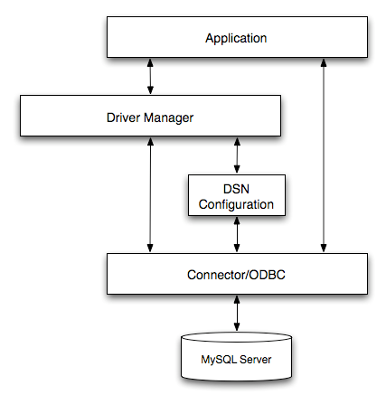

图 3 Connector/ODBC Architecture Components

MyODBC体系结构建立在5个组件上，
*  Application应用程序： 应用程序指的是通过调用ODBC API来访问MySQL服务器上数据的程序。应用程序使用标准的ODBC调用与驱动管理器进行通信。应用程序不关心数据的存储位置，存储方式，甚至不关心为访问数据而进行的系统配置方式。它仅需要知道数据源名（DSN）。对于使用OBDC的应用程序来说，其主要任务是提交SQL语句，并检索由这些语句生成的结果。
*  Driver Manager 驱动管理器：驱动管理器是用于管理应用程序和驱动程序间通信的库。
*  Connector/ODBC Driver驱动程序： 用于实施ODBC API所提供功能的库。它负责处理ODBC函数调用，将SQL请求提交给MySQL服务器，并将结果返回给应用程序。
*  DSN Configuration配置：ODBC.INI是ODBC配置文件，其中保存了连接到服务器所需的驱动信息和数据库信息。驱动管理器将使用它来确定加载哪个驱动程序（使用数据源名）。驱动程序将根据指定的DSN使用它来读取连接参数。
*  MySQL：MySQL服务器是数据源。


### 1.5.2 JDBC

JDBC是一种规范，它提供的接口，一套完整的，可移植的访问底层数据库的程序。

JDBC API支持两层和三层处理模型进行数据库访问，但在一般的JDBC体系结构由两层组成：

 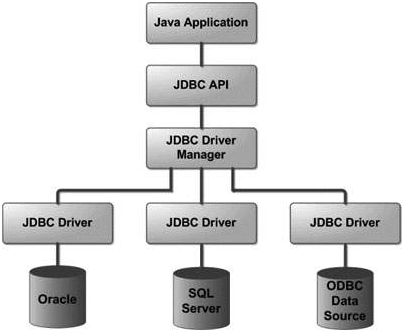

图 4 JDBC结构图

说明:

*  JDBC API: 提供了应用程序对JDBC的管理连接。JDBC API的使用驱动程序管理器和数据库特定的驱动程序提供透明的连接到异构数据库。

*  JDBC Driver API: 支持JDBC管理到驱动器连接。JDBC驱动程序管理器可确保正确的驱动程序来访问每个数据源。该驱动程序管理器能够支持连接到多个异构数据库的多个并发的驱动程序。


JDBC API提供了以下接口和类：

*  DriverManager: 这个类管理数据库驱动程序的列表。确定内容是否符合从Java应用程序使用的通信子协议正确的数据库驱动程序的连接请求。识别JDBC在一定子协议的第一个驱动器将被用来建立数据库连接。

*  Driver: 此接口处理与数据库服务器通信。很少直接直接使用驱动程序（Driver）对象，一般使用DriverManager中的对象，它用于管理此类型的对象。它也抽象与驱动程序对象工作相关的详细信息

*  Connection : 此接口与接触数据库的所有方法。连接对象表示通信上下文，即，与数据库中的所有的通信是通过此唯一的连接对象。

*  Statement : 可以使用这个接口创建的对象的SQL语句提交到数据库。一些派生的接口接受除执行存储过程的参数。

*  ResultSet: 这些对象保存从数据库后，执行使用Statement对象的SQL查询中检索数据。它作为一个迭代器，可以通过移动它来检索下一个数据。

*  SQLException: 这个类用于处理发生在数据库应用程序中的任何错误。


<br>

## 本章参考

[1]. 一张图清晰追溯数据库的发展历程（1962-2016年） [www.cbdio.com/BigData/2016-02/24/content_4651751.htm](http://www.cbdio.com/BigData/2016-02/24/content_4651751.htm)

[2]. [Dyanmo 最原始的一个pdf文档](http://s3.amazonaws.com/AllThingsDistributed/sosp/amazon-dynamo-sosp2007.pdf)

[3]. [Brewer教授的主页](http://www.cs.berkeley.edu/~brewer)

[4]. [伏地魔项目的中文文档](http://www.54chen.com/document/dynamo-based-systems.html)

[5]. [提出CAP原则的文档](http://www.cs.berkeley.edu/~brewer/cs262b-2004/PODC-keynote.pdf)

[6]. 一致性HASH算法详解 http://www.jianshu.com/p/e8fb89bb3a61

[7]. [一致性哈希的介绍](http://en.wikipedia.org/wiki/Consistent_hashing)

[8]. 分布式HASH　[Distributed hash table](http://en.wikipedia.org/wiki/Distributed_hash_table)

[9]. Map Reduce Execution　http://zh.wikipedia.org/wiki/MapReduce

[10]. JDBC教程 https://www.yiibai.com/jdbc/

[11]. 事务 [https://baike.baidu.com/item/%E4%BA%8B%E5%8A%A1/5945882](https://baike.baidu.com/item/事务/5945882)

[12]. Microsoft SQL Server中的事务与并发详解 https://www.cnblogs.com/edisonchou/p/6129717.html

[13]. 数据库事务的四大特性以及事务的隔离级别 https://www.cnblogs.com/fjdingsd/p/5273008.html

[14]. 深入分析事务的隔离级别 https://www.cnblogs.com/heyboom/p/9167394.html

[15]. 聊聊分布式事务，再说说解决方案 https://www.cnblogs.com/savorboard/p/distributed-system-transaction-consistency.html

[16]. 常用的分布式事务解决方案介绍有多少种？ https://www.zhihu.com/question/64921387/answer/225784480

[17]. MySQL的sql_mode模式 https://www.cnblogs.com/Zender/p/8270833.html

[18]. myodbc http://www.mysql.com/products/myodbc/

[19]. myodbc https://dev.mysql.com/doc/connector-odbc/en/

* JDBC的前世今生 https://blog.51cto.com/u_14854864/2553065


<br>

# 2 Relational关系数据库

## 2.1  关系理论

在[关系模型](http://zh.wikipedia.org/wiki/关系模型)中，**关系**是描述现实世界的[实体](http://zh.wikipedia.org/wiki/實體)及 其之间各种联系的单一的[数据结构](http://zh.wikipedia.org/wiki/数据结构)。由关系的名称和一组具有共同属性的无序的[多元组](http://zh.wikipedia.org/wiki/多元组)构成。关系可以看做是一个[笛卡尔积](http://zh.wikipedia.org/wiki/笛卡尔积)的有限[子集](http://zh.wikipedia.org/wiki/子集)， 笛卡尔积中的[元组](http://zh.wikipedia.org/wiki/元组)并不是全都有意义，只有有意义的那些才能成为关系。


表格 11 主键、外键和索引的区别

|      | 主键                                       | 外键                                                 | 索引                               |
| ---- | ------------------------------------------ | ---------------------------------------------------- | ---------------------------------- |
| 定义 | 唯一标识一条记录，不能有重复的，不允许为空 | 表的外键是另一表的主键, 外键可以有重复的, 可以是空值 | 该字段没有重复值，但可以有一个空值 |
| 作用 | 用来保证数据完整性                         | 用来和其他表建立联系用的                             | 是提高查询排序的速度               |
| 个数 | 主键只能有一个                             | 一个表可以有多个外键                                 | 一个表可以有多个惟一索引           |


### 2.1.1 关系操作SQL

关系模块中常用的操作包括：

**数据查询SELECT**
*  选择
*  投影
*  连接join: left/right/inner
*  并union
*  交
*  差
*  除

**数据操作**
*  增加INSERT
*  删除DELETE
*  修改UPDATE
*  更新UPDATE/FLUSH

### 2.1.2 范式分析Normal Form

设计关系[数据库](http://baike.baidu.com/view/1088.htm)时，遵从不同的规范[要求](http://baike.baidu.com/view/198817.htm)，设计出合理的关系型数据库，这些不同的规范要求被称为不同的范式，各种范式呈递次规范，越高的范式数据库冗余越小。

目前[关系数据库](http://baike.baidu.com/view/68348.htm)有六种范式：第一范式（1NF）、第二范式（2NF）、第三范式（3NF）、巴斯-科德范式（BCNF）、[第四范式](http://baike.baidu.com/view/176748.htm)(4NF）和[第五范式](http://baike.baidu.com/view/7170192.htm)（5NF，又称完美范式）。


第一范式（1NF）

所谓第一范式（1NF）是指在[关系模型](http://baike.baidu.com/view/176484.htm)中，对域添加的一个规范要求，所有的域都应该是原子性的，即数据库表的**每一列都是不可分割的原子数据项**，而不能是集合，数组，记录等非原子数据项。


第二范式（2NF）

在1NF的基础上，非码属性必须完全依赖于候选码（在1NF基础上消除非主属性对主码的部分函数依赖）。第二范式（2NF）**要求实体的属性完全依赖于主关键字。所谓完全依赖是指不能存在仅依赖主关键字一部分的属性**，如果存在，那么这个属性和主关键字的这一部分应该分离出来形成一个新的实体，新实体与原实体之间是一对多的关系。


第三范式（3NF）

在1NF基础上，**任何非主**[**属性**](http://baike.baidu.com/view/77730.htm)**不依赖于其它非主属性（在2NF基础上消除传递依赖）**


巴斯-科德范式（BCNF）

Boyce-Codd Normal Form（巴斯-科德范式）

在1NF基础上，任何非主属性不能对主键子集依赖（在3NF基础上消除对主码子集的依赖）

巴斯-科德范式（BCNF）是第三范式（3NF）的一个子集，即满足巴斯-科德范式（BCNF）必须满足第三范式（3NF）。


第一范式：要求字段原子化（无多值）; 存在主键（主键可以是多个字段的组合，一张表只能一个主键，主键也是唯一索引，相当于NOT NULL+UNIQUE）；无重复字段组；无冗余字段；

第二范式2NF：在第一范式基础上，无部分依赖（即组合关键字中某一关键字可以决定部分非关键字）；

EG：表(a,b,c,d,e,f) , 组合主键（a,b）->(c,d,e,f)， 其中(a)->(c,d)。

那么需拆表为：表1(a,b,e,f)，表2(a,c,d)

第三范式3NF：在第二范式基础上，无传递依赖；

​     EG: 关键字段 → 非关键字段x → 非关键字段y


满足范式要求的数据库设计是结构清晰的，同时可避免数据冗余和操作异常。这并不意味着不符合范式要求的设计一定是错误的，在数据库表中存在1：1或1：N关系这种较特殊的情况下，合并导致的不符合范式要求反而是合理的。


## 2.2  MySQL

详见 《[MySQL使用指南.md](./MySQL使用指南.md)》


## 2.3  PostgreSQL

详见 《[postgres用户手册.md](./postgres用户手册.md)》


## 2.4   Oracle

### 2.4.1 Oracle RAC

RAC是real application clusters的缩写，译为“实时应用集群”， 是Oracle新版数据库中采用的一项新技术，是高可用性的一种，也是Oracle数据库支持[网格计算](https://baike.baidu.com/item/网格计算)环境的核心技术。


### 2.4.2 Oracle客户端

**Oracle客户端**：32位或64位，oci..dll

**开发客户端**：PL/SQL Developer，A full-featured IDE providing a powerful editor and debugging capabilities, specifically designed for developing stored program units for Oracle databases.

只能访问32位的oci.dll，在64位机上可通过菜单上的‘工具’-‘首选项’进入内容选择oracle和oci库的位置（oci.dll必须是32位的），再修改net/admin/xxx.ora转换名称，即可正常通过本机32位oracle的客户端访问远程oracle数据库。

**python模块**：cx_Oracle

**编码问题**：设置环境变量 `NLS_LANG=SIMPLIFIED CHINESE_CHINA.ZHS16GBK`


**修改数据库的地址（连接字符串）**

```
DB_localhost =
 (DESCRIPTION =
 (ADDRESS = (PROTOCOL=TCP)(HOST=localhost)(PORT=1521))
 (CONNECT_DATA=(SERVER=DEDICATED) (SERVICE_NAME=orcl.lan) )
 )
```


## 2.5  Microsoft SQL Server


## 2.6  DB2


## RDBS比较

### 模式Schema

模式(Schema): 是数据库的组织和结构，schemas and schemata都可以作为复数形式。模式中包含了schema对象，可以是表(table)、列(column)、数据类型(data type)、视图(view)、存储过程(stored procedures)、关系(relationships)、主键(primary key)、外键(foreign key)等。数据库模式可以用一个可视化的图来表示，它显示了数据库对象及其相互之间的关系。为了区分不同的集合（数据库/Schema对象），就需要给不同的集合起不同的名字，默认情况下一个用户对应一个集合，用户的schema名等于用户名，并作为该用户缺省schema。

ISO/IEC 9075-1 SQL标准中将schema定义为描述符的持久命名集合（a persistent, named collection of descriptors）。不同RDBS对Schema的定义不同。


表格 14 Schema在RDBS里的区别

| DB         | 含义                                                         |
| ---------- | ------------------------------------------------------------ |
| MySQL      | 概念上，模式是一组相互关联的数据库对象，如表，表列，列的数据类型，索引，外键等等。物理上， 模式与数据库是同义的。 |
| Oralce     | Oracle的schema与数据库用户密切相关。schema是数据或模式对象的逻辑结构的集合，由数据库用户拥有，并且与该用户具有相同的名称，也就是说每个用户拥有一个独立的schema。某些对象可以存储在数据库中，但不能存储在schema中。 |
| PostgreSQL | 一个数据库可以包含多个Schema，不同schema下可以有相同名称的表、函数等对象且互相不冲突。Schema用来管理一组对象，相当于MySQL里的数据库概念。PG里的Schema是指定的表集合，可以包含视图，索引，序列，数据类型，运算符和函数。 |
| SQL Server | schema中包含了数据库的表，字段，数据类型以及主键和外键的名称。 |

 备注：都支持`CREATE SCHEMA`语句。


### 多版本并发控制MVCC

*MVCC*(Mutil-Version Concurrency Control),就是多版本并发控制。*MVCC* 是一种并发控制的方法,一般在数据库管理系统中,实现对数据库的并发访问。

MVCC实现主要有两种方法：回滚法和插入法。

表格 15 MVCC实现的两种方法比较

|          | 方法一                                                       | 方法二                                 |
| -------- | ------------------------------------------------------------ | -------------------------------------- |
| 简述     | 写数据时，把旧数据移到一个单独的地方如回滚段，读时从回滚段取旧数据。 | 写数据时，旧数据不删除，把新数据插入。 |
| 实现例子 | MySQL INNODB、Oracle                                         | PostgreSQL                             |
| 优点     |                                                              | 查询快，不影响插入。                   |
| 缺点     | 节约存储空间。                                               | 旧数据占用空间。                       |


### MySQL和PostgreSQL

表格  MySQL和PostgreSQL比较

|                 | MySQL                                                        | PostgreSQL                       |
| --------------- | ------------------------------------------------------------ | -------------------------------- |
| 简介            |                                                              |                                  |
| 比较版本        | 5.7.6                                                        | 9.4.1                            |
| ANSI标准兼容性  | 如果客户喜欢，他们就会支持非标准扩展                         | 一开始就将标准构建到平台         |
| ACID遵从性      | 9个存储引擎，但只有MyIsam和InnoDB与大部分用户有关。其中InnoDB为默认存储引擎 。 | 一个存储引擎                     |
| 无锁表修改      | 表级锁                                                       | 行级锁                           |
| 子查询          | 较弱，不支持全外连接                                         | 优秀                             |
| JSON支持和NoSQL | 无                                                           | 增加了JSON支持                   |
| 许可            | GPL                                                          | 类似MIT                          |
| 数据一致性      | 开发人员需要将服务器设定为严格SQL模式才能数据验证            | 数据插入和更新之前进行严格的验证 |
| 服务器扩展      | 提供了插件程序API，  支持C/C++或任何兼容C的语言，从5.7.3版本开始支持全文搜索。 | 支持的语言更多。                 |

备注：MySQL和PostgreSQL是最有名的两个开源关系数据库。MariaDB为MySQL创建者Monty Widenius创建的一个MySQL分支。


表格  MySQL VS PostgreSQL

|                | MySQL                                                        | PostgreSQL                                                   |
| -------------- | ------------------------------------------------------------ | ------------------------------------------------------------ |
| SQL标准实现    | 较简单                                                       | √ 功能更完善、更严谨                                         |
| 查询场景       | 优化器较简单，系统表、运算符、数据类型的实现都很精简，非常适合简单的查询操作 | √ 对表连接支持较完整，优化器的功能较完整，支持的索引类型很多，复杂查询能力较强； |
| 表组织形式     | 采用索引组织表，适合基于主键匹配的查询、删改操作，但是对表结构设计存在约束； | √ 主表采用堆表存放，数据量更大                               |
| 复制           | 基于binlog的逻辑复制                                         | √ 物理复制，数据的一致性更加可靠，复制性能更高，对主机性能的影响也更小。 |
| 存储过程       | 较弱。                                                       | √ 功能更强，具备本地缓存执行计划的能力                       |
| MVCC           | √ 基于回滚段实现。更优。                                     | 新老数据一起存放的基于XID实现。                              |
| 并发           | MySQL的存储引擎插件化机制，存在锁机制复杂影响并发的问题      | MVCC的实现机制定时触发VACUUM，导致并发能力下降；若清理不及时，还可能引发数据膨胀。 |
| 存储插件化机制 | √ 应用场景更加广泛，如innodb适合事务处理场景外，myisam适合静态数据的查询场景。 | 不支持                                                       |
| 分区           | √ 主要体现在分区个数达到上千上万后的处理性能差异较大，性能更好。 | 基于继承表的分区实现                                         |

备注：postgresql和mysql相比，postgresql更加适合严格的企业应用场景（比如金融、电信、ERP、CRM），而MySQL则是更加适合业务逻辑相对简单、对数据可靠性要求比较低的互联网场景（比如google、facebook、alibaba）。


### Oracle和PostgreSQL


<br>

## 本章参考

* [SQL Server Glossary](https://msdn.microsoft.com/en-us/library/ms165911.aspx). SQL Server 2016 Technical Documentation. Microsoft Developer Network. Retrieved 6 June 2016.


<br>

# 3  NoSQL非关系数据库

NoSQL: Not only SQL 不仅仅是SQL。

​     其产生背景是在数据量和访问量逐渐增大的情况下下，人为地去添加机器或者切分数据到不同的机器，变得越来越困难，人力成本越来越高，于是便开始有了这样的 项目，它们的本意是提高数据存储的自动化程度，减少人为干预的时间，让负载更加均匀等。

​     NoSQL数据库在以下的这几种情况下比较适用：1、数据模型比较简单；2、需要灵活性更强的IT系统；3、对数据库性能要求较高；4、不需要高度的数据一致性；5、对于给定key，比较容易映射复杂值的环境。


现在**NoSQL** 运动丰富了拓展了BASE思想，可按照具体情况定制特别方案，比如忽视一致性，获得高可用性等等，NoSQL应该有下面两个流派：

1. Key-Value存储，如Amaze Dynamo等，可根据CAP三原则灵活选择不同倾向的数据库产品。
2. 领域模型 + 分布式[**缓存**](http://www.jdon.com/jivejdon/tags/313) + 存储 （[Qi4j和](http://www.jdon.com/jivejdon/thread/37186)[**NoSQL**](http://www.jdon.com/jivejdon/tags/8600)运 动），可根据CAP三原则结合自己项目定制灵活的分布式方案，难度高。

**共同点**：都是关系数据库SQL以外的可选方案，逻辑随着数据分布，任何模型都可以自己持久化，将数据处理和数据存储分离，将读和写分离，存储可以是异步或同步，取决于对一致性的要求程度。
**不同点**：NOSQL之类的Key-Value存储产品是和关系数据库头碰头的产品BOX，可以适合非 Java如PHP RUBY等领域，是一种可以拿来就用的产品，而领域模型 + 分布式缓存 + 存储是一种复杂的架构解决方案，不是产品，但这种方式更灵活，更应该是架构师必须掌握的。

## 3.1 NoSQL分类

按照数据模型保存性质，将当前[NoSQL](http://www.jdon.com/jivejdon/tags/8600)分为四种类型type：

1. Key-value stores键值存储, 主要会使用到一个[哈希表](http://baike.baidu.com/view/329976.htm)，这个表中有一个特定的键和一个指针指向特定的数据。保存keys+BLOBs (二进制大对象Binary Large OBjects)

2. Table-oriented 列存储，面向表, 通常是用来应对分布式存储的海量数据。主要有Google的BigTable和Cassandra.

3. Document- oriented面向文本, 文本是一种类似XML文档，该类型的数据模型是版本化的文档，半结构化的文档以特定的格式存储，比如JSON。MongoDB 和 CouchDB

4. Graph-oriented 面向图论. 如Neo4J.


表格 17 NoSQL比较表1

| Data model              | Performance | Scalability     | Flexibility | Complexity | Functionality                                                |
| ----------------------- | ----------- | --------------- | ----------- | ---------- | ------------------------------------------------------------ |
| Relational database     | variable    | variable        | low         | moderate   | [relational algebra](https://en.wikipedia.org/wiki/Relational_algebra) |
| Key–value store         | high        | high            | high        | none       | variable (none)                                              |
| Graph database          | variable    | variable        | high        | high       | [graph   theory](https://en.wikipedia.org/wiki/Graph_theory) |
| Document-oriented store | high        | variable (high) | high        | low        | variable (low)                                               |
| Column-oriented store   | high        | high            | moderate    | low        | minimal                                                      |


表格 18 NoSQL四种类别比较表2

| 分类                   | Examples举例                                          | 典型应用场景                                                 | 数据模型                                        | 优点                                                         | 缺点                                                         |
| ---------------------- | ----------------------------------------------------- | ------------------------------------------------------------ | ----------------------------------------------- | ------------------------------------------------------------ | ------------------------------------------------------------ |
| 键值（key-value）      | Redis,   Tokyo Cabinet/Tyrant, Voldemort, Oracle  BDB | 内容缓存，主要用于处理大量数据的高访问负载，也用于一些日志系统等等。 | Key 指向 Value 的键值对，通常用hash table来实现 | 查找速度快                                                   | 数据无结构化，通常只被当作字符串或者二进制数据               |
| 列存储数据库Table      | HBase,   Cassandra,   Riak                            | 分布式的文件系统                                             | 以列簇式存储，将同一列数据存在一起              | 查找速度快，可扩展性强，更容易进行分布式扩展                 | 功能相对局限                                                 |
| 文档型数据库  Document | MongoDB,  CouchDB,                                    | Web应用（与Key-Value类似，Value是结构化的，不同的是数据库能够了解Value的内容） | Key-Value对应的键值对，Value为结构化数据        | 数据结构要求不严格，表结构可变，不需要像关系型数据库一样需要预先定义表结构 | 查询性能不高，而且缺乏统一的查询语法。                       |
| 图形数据库  (Graph)    | Neo4J, InfoGrid, Infinite Graph                       | 社交网络，推荐系统等。专注于构建关系图谱                     | 图结构                                          | 利用图结构相关算法。比如最短路径寻址，N度关系查找等          | 很多时候需要对整个图做计算才能得出需要的信息，而且这种结构不太好做分布式的集群方案。 |


对于NoSQL并没有一个明确的范围和定义，但是他们都普遍存在下面一些共同特征：
*  不需要预定义模式：不需要事先定义数据模式，预定义表结构。数据中的每条记录都可能有不同的属性和格式。当插入数据时，并不需要预先定义它们的模式。
*  无共享架构：相对于将所有数据存储的存储区域网络中的全共享架构。NoSQL往往将数据划分后存储在各个本地服务器上。因为从本地磁盘读取数据的性能往往好于通过网络传输读取数据的性能，从而提高了系统的性能。
*  弹性可扩展：可以在系统运行的时候，动态增加或者删除结点。不需要停机维护，数据可以自动迁移。
*  分区：相对于将数据存放于同一个节点，NoSQL数据库需要将数据进行分区，将记录分散在多个节点上面。并且通常分区的同时还要做复制。这样既提高了并行性能，又能保证没有单点失效的问题。
*  异步复制：和RAID存储系统不同的是，NoSQL中的复制，往往是基于日志的异步复制。这样，数据就可以尽快地写入一个节点，而不会被网络传输引起迟延。缺点是并不总是能保证一致性，这样的方式在出现故障的时候，可能会丢失少量的数据。
*  BASE：相对于事务严格的ACID特性，NoSQL数据库保证的是BASE特性。BASE是最终一致性和软事务。


MongoDB和OrientDB包含许多常见功能，但引擎是根本不同的。 MongoDB是纯文档数据库，OrientDB是一个具有图形引擎的混合文档。

表格 19 MongoDB和OrientDB比较

| 特性       | MongoDB                                                      | OrientDB                                                     |
| ---------- | ------------------------------------------------------------ | ------------------------------------------------------------ |
| 关系       | 使用RDBMS JOINS创建实体之间的关系。 它具有高运行时成本，并且当数据库规模增加时不扩展。 | 嵌入和连接文档，如关系数据库。 它使用从图形数据库世界采取的直接，超快速链接。 |
| Fetch Plan | 成本高的加入操作。                                           | 轻松返回带有互连文档的完整图形。                             |
| 事务       | 不支持ACID事务，但它支持原子操作。                           | 支持ACID事务和原子操作。                                     |
| 查询语言   | 具有基于JSON自己的语言。                                     | 查询语言是建立在SQL。                                        |
| 索引       | 对所有索引使用B树算法。                                      | 支持三种不同的索引算法，使用户可以实现最佳性能。             |
| 存储引擎   | 使用内存映射技术。                                           | 使用存储引擎名称LOCAL和PLOCAL。                              |


## 3.2   键值(key-value)数据库

采用key-value形式的存储，可以极大的增强系统的可扩展性（scalability）。

key-value与relational数据库的区别

 

key-value store
*  Dynamo (Amazon)
*  **Cassandra (Facebook)**
*  **Voldemort (Linkedln)**
*  PNUTS (Yahoo)
*  Bigtable (Google)
*  **HyperTable**

注：粗体的为开源产品。


表格 20 KV数据库比较表

| 项目名称                                                     | 语言   | 容错性                    | 持久性存储介质                             | 客户端协议                  | 数据模型                   | 文档 | 赞助商/社区         |
| ------------------------------------------------------------ | ------ | ------------------------- | ------------------------------------------ | --------------------------- | -------------------------- | ---- | ------------------- |
| [Project Voldemort](http://project-voldemort.com/)           | Java   | 分区, 复制,   read-repair | Pluggable: BerkleyDB,   Mysql              | Java API                    | Structured /   blob / text | A    | Linkedin, no        |
| [Ringo](http://github.com/tuulos/ringo/tree/master)          | Erlang | 分区, 复制,    immutable  | Custom  on-disk   (append only log)        | HTTP                        | blob                       | B    | 诺基亚, no          |
| [Scalaris](http://code.google.com/p/scalaris/)               | Erlang | 分区, 复制,   paxos       | In-memory only                             | Erlang,  Java,   HTTP       | blob                       | B    | OnScale,  no        |
| [Kai](http://kai.wiki.sourceforge.net/)                      | Erlang | 分区, 复制                | On-disk  Dets file                         | Memcached                   | blob                       | B    | no                  |
| [Dynomite](http://github.com/cliffmoon/dynomite/tree/master) | Erlang | 分区, 复制                | Pluggable:  couch,   dets                  | Custom  ascii,   Thrift     | blob                       | C    | Powerset,  no       |
| [MemcacheDB](http://memcachedb.org/)                         | C      | 复制                      | BerkleyDB                                  | Memcached                   | blob                       | B    | 新浪网, some        |
| [ThruDB](http://code.google.com/p/thrudb/)                   | C++    | 复制                      | Pluggable:  BerkleyDB,   Custom, Mysql, S3 | Thrift                      | Document   oriented        | C+   | Third  rail, unsure |
| [CouchDB](http://couchdb.apache.org/)                        | Erlang | 分区                      | Custom  on-disk                            | HTTP,  json                 | Document   oriented (json) | A    | Apache,  yes        |
| [Cassandra](http://code.google.com/p/the-cassandra-project/) | Java   | 分区                      | Custom  on-disk                            | Thrift                      | Bigtable  meets   Dynamo   | F    | Facebook,  no       |
| [HBase](http://hadoop.apache.org/hbase/)                     | Java   | 分区                      | Custom  on-disk                            | Custom  API,   Thrift, Rest | **Bigtable**               | A    | Apache,  yes        |
| [Hypertable](http://hypertable.org/)                         | C++    | 分区                      | Custom  on-disk   (HDFS, KFS)              | Thrift,  other              | Bigtable                   | A    | Zvents,  百度, yes  |
| [Tokyo Tyrant](http://tokyocabinet.sourceforge.net/index.html) | C      | 复制                      | Tokyo  Cabinet                             | Memcached,   HTTP, other    | blob                       | A    | mixi.jp,  no        |
| Redis                                                        | C      | 分区、复制                |                                            |                             | Structured  /blob          |      | VMware,  Pivotal    |


### 3.2.1 Memcached

详见 《[memcache用户手册.md](./memcache用户手册.md)》


### 3.2.2 Redis

详见 《[redis用户手册.md](./redis用户手册.md)》


### 3.2.3 SSDB

SSDB 是一个 C/C++ 语言开发的高性能 NoSQL 数据库, 支持 KV, list, map(hash), zset(sorted set),qlist(队列) 等数据结构, 用来替代或者与 Redis 配合存储十亿级别列表的数据。


**1** **安装使用**

```shell
wget --no-check-certificate https://github.com/ideawu/ssdb/archive/master.zip
unzip master
cd ssdb-master
make
# optional, install ssdb in /usr/local/ssdb
sudo make install

# 启动服务
./ssdb-server ssdb.conf
# or start as daemon
./ssdb-server -d ssdb.conf
```

 使用：telnet 或者 nc 命令或者redis客户端连接到 SSDB 服务器


**2特性**
*  替代 Redis 数据库, Redis 的 100 倍容量
*  LevelDB 网络支持, 使用 C/C++ 开发
*  Redis API 兼容, 支持 Redis 客户端
*  适合存储集合数据, 如 list, hash, zset...
*  客户端 API 支持的语言包括: [C++](http://ssdb.io/docs/cpp/), [PHP](http://ssdb.io/docs/zh_cn/php/), Python, [Java](http://ssdb.io/docs/java/), Go
*  持久化的队列服务
*  主从复制, 负载均衡


3. PHP API
```php
<?php
require_once('SSDB.php');
$ssdb = new SimpleSSDB('127.0.0.1', 8888);
$resp = $ssdb->set('key', '123');
$resp = $ssdb->get('key');
echo $resp; // output: 123
?>
```

4. SSDB 相关使用限制

最大 Key长度200 字节

最大 Value 长度31MB

最大请求或响应长度 31MB

单个 HASH 中的元素数量 9,223,372,036,854,775,807

单个 ZSET 中的元素数量  9,223,372,036,854,775,807

单个 QUEUE 中的元素数量  9,223,372,036,854,775,807

命令最多参数个数所有参数加起来体积不超过 31MB 大小


### 3.2.4 Tokyo Cabinet和Tokoy Tyrant

TC和TT的开发者是日本人Mikio Hirabayashi，主要被用在日本最大的SNS网站mixi.jp上，TC发展的时间最早，现在已经是一个非常成熟的项目，也是Kye-Value 数据库领域最大的热点，现在被广泛的应用在很多很多网站上。TC是一个高性能的存储引擎，而TT提供了多线程高并发服务器，性能也非常出色，每秒可以处理 4-5万次读写操作。


**1)** **程序运行**

TC: libtokyocabinet.so 为存储引擎，无需运行


TT:

$./ttserver

usage:

 ./ttserver [-host name] [-port num] [-thnum num] [-tout num] [-dmn] [-pid path] [-kl] [-log path] [-ld|-le] [-ulog path] [-ulim num] [-uas] [-sid num] [-mhost name] [-mport num] [-rts path] [-rcc] [-skel name] [-mul num] [-ext path] [-extpc name period] [-mask expr] [-unmask expr] [dbname]

说明：根据参数dbname名来确定使用的TC数据库类型。 数据库名的命名方式被Tokyo Cabinet的抽象API指定。
*  如果数据库名为"*"，表示内存hash数据库。
*  如果数据库名为"+"表示内存tree数据库。
*  如果数据库名为".tch",则数据库为hash数据库。
*  如果数据库名的后缀为".tcb"，数据库将为B+ tree数据库。
*  如果数据库名的后缀为".tcf"。则数据库将为fixed-length数据库。
*  如果数据库名的后缀为".tct",则数据将为一个table数据库（有表的概念）。


**2)** **程序提供服务**

read/write/replace


**3)** **程序可用性测试**

$make check


## 3.3   列存储数据库

典型：Hbase、Cassandra

详见： 《大数据开发》、《云计算专题》、《google技术专题》

SAP IQ（IQ 12,1994年）是第一个商用的列式数据库。


### Cassandra

Cassandra是一套开源分布式[NoSQL](https://baike.baidu.com/item/NoSQL)数据库系统。它最初由[Facebook](https://baike.baidu.com/item/Facebook)开发，用于储存收件箱等简单格式数据，集[Google](https://baike.baidu.com/item/Google)[BigTable](https://baike.baidu.com/item/BigTable)的数据模型与[Amazon](https://baike.baidu.com/item/Amazon) Dynamo的完全分布式的架构于一身。Facebook于2008将 Cassandra 开源。此后由于Cassandra良好的[可扩展性](https://baike.baidu.com/item/可扩展性/8669999)，被[Digg](https://baike.baidu.com/item/Digg)、[Twitter](https://baike.baidu.com/item/Twitter)等知名[Web 2.0](https://baike.baidu.com/item/Web 2.0)网站所采纳，成为了一种流行的分布式结构化数据存储方案。


## 3.4   文档型数据库

MongoDB 详见 《[MongoDB用户手册.md](./MongoDB用户手册.md)》


## 3.5   图形数据库

图形数据库，以InfiniteGraph和Neo4j为代表，以类似于图的结构存储数据，便于探索数据之间的联系，可应用于产品推荐和社交网络。
 针对大型图的计算，目前通用的图计算软件主要包括两种：
*  第一种主要是基于遍历算法的、实时的图数据库，如Neo4j、OrientDB、DEX和 Infinite Graph。
*  第二种则是以图顶点为中心的、基于消息传递批处理的并行引擎，如GoldenOrb、Giraph、Pregel和Hama，这些图处理软件主要是基于BSP模型实现的并行图处理系统。


一次BSP(Bulk Synchronous Parallel Computing Model，块同步并行计算模型,又称“大同步”模型)计算过程包括一系列全局超步（所谓的超步就是计算中的一次迭代），每个超步主要包括三个组件：
*  局部计算：每个参与的处理器都有自身的计算任务。
*  通讯：处理器群相互交换数据。
*  栅栏同步(Barrier Synchronization)：当一个处理器遇到“路障”（或栅栏），会等到其他所有处理器完成它们的计算步骤。


<br>

## 本章参考

[1]. NoSQL Link Archive http://nosql-database.org/

[2]. NoSQL数据库笔谈 http://docs.google.com/View?id=dc23x53c_64db5px4f6

[3]. 满足极高读写性能需求的Key-Value数据库  http://blog.csdn.net/seared2008/archive/2010/03/01/5335048.aspx

[4]. Cassandra简介 https://www.cnblogs.com/loveis715/p/5299495.html

[5]. cassandra教程 https://www.w3cschool.cn/cassandra/

[6]. SSDB数据库使用手册 https://www.w3cschool.cn/ssdb/

* 百度、新浪、Mixi、Apache社区赞助的开源key-value分布式存储系统  http://blog.s135.com/post/394/

<br>

# 4 NewSQL

NewSQL 是对各种新的可扩展/高性能数据库的简称，这类数据库不仅具有NoSQL对海量数据的存储管理能力，还保持了传统数据库支持ACID和SQL等特性。

## 4.1 NewSQL分类

NewSQL是指一类关系型数据库，即有NoSQL的扩展性，又支持ACID事务。已知的第一个NewSQL系统叫做[H-Store](http://baike.baidu.com/view/10852647.htm)，它是一个分布式并行内存数据库系统。

NewSQL系统虽然在的内部结构变化很大，但是它们有两个显着的共同特点：

(1) 它们都支持[关系数据模型](http://baike.baidu.com/view/3309779.htm)，

(2) 它们都使用SQL作为其主要的接口。


NewSQL分成三类：New Architecture（分布式）、Transparent Sharding Middleware（中间件）、Database-as-a-Service（DAAS，云数据库）。

**第一类：New Architecture（分布式）**是全新的数据库平台，它们均采取了不同的设计方法。New Architecture主要针对分布式架构。

它们大概分两类：

(1) 这类数据库工作在一个分布式集群的节点上，其中每个节点拥有一个数据子集。 SQL查询被分成查询片段发送给自己所在的数据的节点上执行。这些数据库可以通过添加额外的节点来线性扩展。现有的这类数据库有： Google [Spanner](http://baike.baidu.com/view/8852781.htm), [VoltDB](http://baike.baidu.com/view/9367705.htm), Clustrix, NuoDB.

(2) 这些数据库系统通常有一个单一的主节点的数据源。它们有一组节点用来做事务处理，这些节点接到特定的SQL查询后，会把它所需的所有数据从主节点上取回来后执行SQL查询，再返回结果。


**第二类：Transparent Sharding Middleware（中间件）**，系统提供了 **分片** 的中间件层，数据库自动分割在多个节点运行。中间件思路下，有一个中心组件用来路由请求、协调事务（应该是协调完成分布式事务）、管理数据分布、副本复制、数据在节点间分区。每个节点上都运行一个单机版的数据库实例，上面有一个组件用于该实例与中心组件交互。整个集群对外是一个逻辑实例。

优势：应用往往已经很适合这种架构，所以不需要做什么改动。

劣势：单节点上的传统数据库是面向磁盘设计的，针对大内存和多核机器无法高效利用；另外就是复杂查询的查询计划和优化在中间件和各节点上会有重复工作。

典型系统：dbShards、MariaDB MaxScale、ScaleArc、ScaleBase。


**第三类：Database-as-a-Service云数据库**

典型系统：Amazon Aurora、ClearDB


其它：高度优化的SQL存储引擎。这些系统提供了MySQL相同的编程接口，但扩展性比内置的引擎InnoDB更好。这类数据库系统有：TokuDB, MemSQL。

 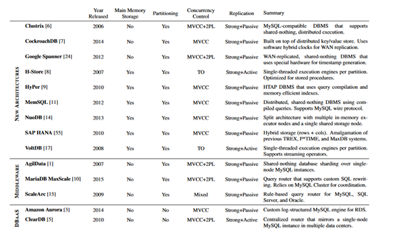


图 5 NewSQL分类


## 4.2 分布式数据库Distributed

**分布式数据库**是用计算机网络将物理上分散的多个数据库单元连接起来组成的一个逻辑上统一的数据库。每个被连接起来的数据库单元称为站点或结点。分布式数据库有一个统一 的数据库管理系统来进行管理，称为分布式数据库管理系统。

分布式数据库的基本特点包括：物理分布性、逻辑整体性和站点自治性。从这三个基本特点还可以导出的其它特点有：数据分布透明性、集中与自治相结合的 控制机制、适当的数据冗余度和事务管理的分布性。

分布式数据库按照各站点中数据库管理系统的数据模型的异同分为异构型分布式数据库和同构型分布式数据库，按照*控制系统的类型*分为全局控制集中性、全 局控制分散型和全局控制可变型。


容错处理：Dynamo及Chubby的可靠的分布式设计思想替换双机写，心跳等山寨容错处理。


### 阿里云DRDS分布式关系型数据库

[DRDS](https://www.aliyun.com/product/drds/)（ Distributed Relational Database Service）是阿里巴巴自主研发致力于解决单机数据库服务瓶颈问题而推出的分布式数据库产品。 DRDS 高度兼容 MySQL 协议和语法、支持自动化水平拆分、平滑扩容、弹性扩展、透明读写分离、分布式事务、具备分布式数据库全生命周期的运维管控能力。DRDS前身为淘宝TDDL，是近千核心应用首选组件，已稳定服务8年以上。


 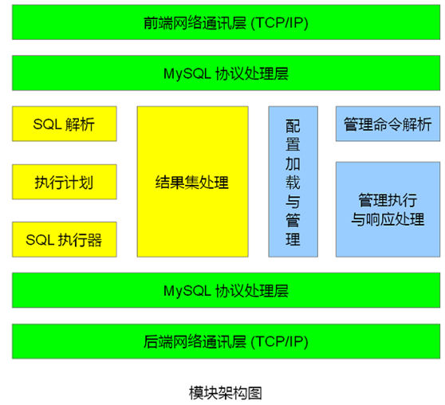

图 6 DRDS模块结构图


**分布式SQL执行引擎**

分布式SQL引擎主要的目的就是实现与单机数据库SQL引擎的完全兼容。目前我们的SQL引擎能够做到与MySQL的SQL引擎全兼容，包括各类join和各类复杂函数等。他主要包含SQL解析、优化、执行和合并四个流程，如下图绿色部分：


**按需数据库集群平滑扩缩**

DRDS允许应用按需将新的单机存储加入或移出集群，DRDS则能够保证应用在迁移流程中实现不停机扩容缩容。


**小表广播**

小表广播也是我们在分布式数据库领域内最常用的工具之一，他的核心目的其实都是一个 – 尽可能让查询只发生在单机


**分布式事务套件**

在阿里巴巴的业务体系中存在着非常多的需要事务类的场景，下单减库存，账务，都是事务场景最集中的部分。

而我们处理事务的方法却和传统应用处理事务的方案不大一样，我们非常强调事务的最终一致性和异步化。利用这种方式，能够极大的降低分布式系统中锁持有的时间，从而极大地提升系统的性能。


<br>

## 本章参考

[1]. Dynamo: Amazon’s Highly Available Key-value Store　http://www.allthingsdistributed.com/files/amazon-dynamo-sosp2007.pdf

[2]. [Bigtable: A Distributed Storage System for Structured Data](http://labs.google.com/papers/bigtable.html) -(official paper; [PDF](http://labs.google.com/papers/bigtable-osdi06.pdf))

[3]. 阿里云DRDS https://www.aliyun.com/product/drds/

[4]. 跨时代的分布式数据库 – 阿里云DRDS详解 https://help.aliyun.com/document_detail/42600.html

<br>

# 5 时序数据库 TSDB

## 5.1 简介

时序数据库（Time Series Database）是用于存储和管理时间序列数据的专业化数据库。时序数据库特别适用于物联网设备监控和互联网业务监控场景。

time series database (TSDB) is a software system that is optimized for handling time series data, arrays of numbers indexed by time (a datetime or a datetime range)

以上是维基百科对于时序数据库的定义。可以把它拆解成3个方面来看：时序特性，数据特性，数据库特性。


表格 29


 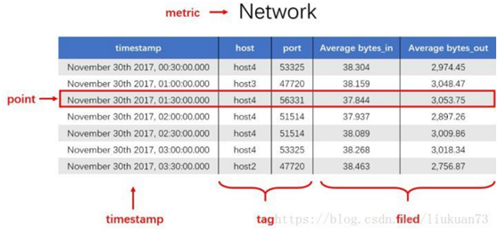

图 7 时序数据库示例

下面介绍下时序数据库的一些基本概念（不同的时序数据库称呼略有不同）。
*  度量（metric）：监测数据的指标，例如风力和温度。相当于关系型数据库中的table
*  标签（tag）：指标项监测针对的具体对象，属于指定度量下的数据子类别。一个标签（Tag）由一个标签键（TagKey）和一个对应的标签值（TagValue）组成。

​     例如在监测数据的时候，指定度量（Metric）是“气温”，“城市（TagKey）= 杭州（TagValue）”就是一个标签（Tag），则监测的就是杭州市的气温。更多标签示例：机房 = A 、IP = 172.220.110.1。
*  域（field）：在指定度量下数据的子类别，一般情况下存放的是会随着时间戳的变化而变化的数据。一个metric可支持多个field，如metric为风力，该度量可以有两个field：direction和speed。
*  度量值（value）：度量对应的数值，如56°C、1000r/s等（实际中不带单位）。如果有多个field，每个field都有相应的value。不同的field支持不同的数据类型写入。对于同一个field，如果写入了某个数据类型的value之后，相同的field不允许写入其他数据类型
*  时间戳（Timestamp）：数据（度量值）产生的时间点。
*  数据点 (Data Point) ：针对监测对象的某项指标（由度量和标签定义）按特定时间间隔（连续的时间戳）采集的每个度量值就是一个数据点。1个metric+1个field（可选）+1个timestamp+1个value + n个tag（n>=1）”唯一定义了一个数据点。相当于关系型数据库中的row。
*  时间序列（Time Series）：1个metric+1个field（可选） +n个tag（n>=1）”定义了一个时间序列。主要是针对某个监测对象的某项指标（由度量和标签定义）的描述。某个时间序列上产生的数据值的增加，不会导致时间序列的增加。


## 5.2   时序数据库比较


 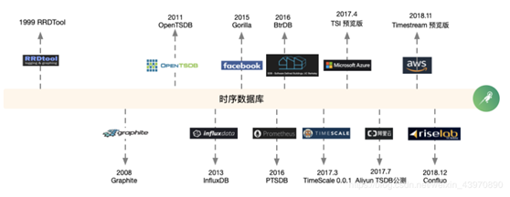

图 8时序数据库发展简史

表格 30 时序数据发展史

|              | 简介                                                         | 示例               |
| ------------ | ------------------------------------------------------------ | ------------------ |
| 第一代       | 来源于监控领域，数据模型比较单一，单机容量受限，并且内嵌于监控告警方案。 | RRDTool，Wishper   |
| 基于通用存储 | 继承通用存储优势的基础上，利用时序的特性规避部分通用存储的劣势，并且在数据模型，聚合分析方面做了贴合时序的大量创新。 | OpenTSDB，KairosDB |
| 垂直型TSDB   | 具备更加高级的数据处理能力，高效的压缩算法和符合时序特征的存储引擎。 | InfluxDB、         |


表格 时序数据库简介

| 类别      | TSDB                  | 简介                                                         |
| --------- | --------------------- | ------------------------------------------------------------ |
| 公有云    | AWS Timestream        | 2018.11 Amazon在AWS re Invent大会发布Timestream预览版。适用于 IoT 和运营应用程序等场景。阿里云TSDB。 |
| 公有云    | Azure Series Insights | 2017.4 Microsoft发布时序见解预览版，提供的完全托管、端到端的存储和查询高度情景化loT时序数据解决方案。强大的可视化效果用于基于资产的数据见解和丰富的交互式临时数据分析。  针对数据类型分为暖数据分析和原始数据分析，按照存储空间和查询量分别计费。 |
| <br/>开源 | OpenTSDB              | 一个分布式的、可伸缩的时间序列数据库. 引入metric，tags等概念设计了一套针对时序场景的数据模型，底层采用HBase作为存储，利用时序场景的特性，采用特殊的rowkey方式，来提高时序的聚合和查询能力。 |
|           | Prometheus            | Prometheus 是一套开源的监控、报警和时间序列数据库的组合，成立于 2012 年，由 SoundCloud 公司开发，此后许多组织接受和采用了 Prometheus，遂将其独立为开源项目。该项目使用 Go 语言开发，社区氛围非常活跃。  会将所有采集到的样本数据以时间序列（time-series）的方式保存在内存数据库中，并且定时保存到硬盘上。需要远端存储来保证可靠和扩展性。 |
|           | InfluxDB              | 单机开源的时序数据库,由Go语言编写，无需特殊的环境依赖，简单方便。采用独有的TSMT结构实现高性能的读写。分布式需要商业化支持。 |
|           | Timescale             | 面向SQL生态的时序数据库，固定Schema，底层基于PG，按时间管理chunk table。 |
|           | Graphite              | 2006年开源，python实现。                                     |
| 学术      | BTrDB                 | 面向高精度时序数据的存储应用，设计并提出了 "time-partitioning version-annotated copy-on-write  tree" 的数据结构，为每一条时间线构建了一棵树，并且引入版本的概念处理数据的乱序场景。 |
|           | Confluo               | 设计了新型的数据结构”Atomic  MultiLog“，采用现代CPU硬件支持的原子指令集，支持百万级数据点高并发写入，毫秒级在线查询，占用很少的的CPU资源实现即席查询。 |
|           | Chronixdb             | 基于Solr提供了时序存储，并且实现了特有的无损压缩算法，可以与Spark集成，提供丰富的时序分析能力。 |
| 商业&工业 | PI                    | OSI软件公司开发的大型实时数据库，广泛应用于电力，化工等行业，采用了旋转门压缩专利技术和独到的二次过滤技术，使进入到PI数据库的数据经过了最有效的压缩，极大地节省了硬盘空间。 |
|           | KDB                   | Kx System开发的时间序列数据库，通常用于处理交易行情相关数据。支持流、内存计算和实时分析Billion级别的记录以及快速访问TB级别的历史数据。 |
|           | Gorilla               | Facebook的一个基于内存的时序数据库，采用了一种新的时间序列压缩算法。可以将数据从16字节压缩到平均1.37字节，缩小12倍.并且设计了针对压缩算法的内存数据结构.在保持对单个时间序列进行时间段查找的同时也能快速和高效的进行全数据扫描。   通过将时间序列数据写到不同地域的主机中，容忍单节点故障，网络切换，甚至是整个数据中心故障。 |


表格 31 主流时序数据库的功能比较

| TSDB          | 简介                                                         | 适用场景 | 实时 | 聚合分析 | 类SQL | 维护 | 集群     |
| ------------- | ------------------------------------------------------------ | -------- | ---- | -------- | ----- | ---- | -------- |
| Graphite      | 提供丰富函数支持  支持自动Downsample  对Grafana的支持最好。<br/>性能较差：whisper存储引擎 IOPS高；carbon组件CPU利用率高。 |          | 弱   | 弱       |       | 简单 |          |
| InfluxDB      | metric + Tags；实时数据Downsample；高效存储。<br/>缺点是存在前后版本兼容问题。 |          | 弱   | 弱       |       | 简单 | 开源版无 |
| OpenTSDB      | metric + Tags；集群方案成熟                                  |          | 弱   | 弱       |       | 复杂 | √        |
| Prometheus    | metric + Tags；适用于容器监控；  丰富查询                    |          | 弱   | 弱       |       | 简单 | 无       |
| Druid         | 嵌套列式存储；分布式容错架构                                 |          | √    | 强       | √     | 复杂 |          |
| ElasticSearch | 全文检索；支持查询原始数据；   灵活性高、社区活跃。<br/>缺点是无列式；硬件资源要求高。 |          |      | 强       |       | 复杂 |          |
| ClickHouse    | 分布式容错；  缺点是较年轻，不支持数据更新和删除。           |          | √    | 强       | √     |      | 弱       |


<br>

## 本章参考

[1]. 时序数据库介绍https://www.cnblogs.com/badboy200800/p/10981052.html

[2]. 时序数据库连载系列：时序数据库那些事 https://blog.csdn.net/weixin_43970890/article/details/87916971

<br>

# 6 SQL引擎

## 6.1 SQL引擎分类

SQL查询主要考虑以下功能：

* 明细数据查询：亿级以上。
* 聚合查询：group by
* join关联查询

非功能属性考虑存储空间、查询性能等等。


SQL引擎根据数据实时性要求可分为OLAP（分析型）和OLTP（事务型）。

* OLAP分析型  详见 《[OLAP分析型数据库.md](./OLAP分析型数据库.md)》
* OLTP 事务型  参见 《数据库技术》事务型数据库架构演进
* OLAP和OLTP融合型 如OceanBase


表格 OLTP数据库列表

| 类别           | 简介                     | 产品示例                               |
| -------------- | ------------------------ | -------------------------------------- |
| RDBS           | 支持事务回滚和外键关联。 | Oracle、MySQL、PostgreSQL、MSSQL       |
| 基于MySQL      | NewSQL，海量分布式RDBS   | TiDB                                   |
| 基于PostgreSQL |                          | Greenplum Redshift 华为高斯gauss~libra |


## 6.2   SQL On Hadoop

### 简介和框架列表

表格 36 一流的SQL on Hadoop方案所带来的功能和业务好处

| HA                           | 业务好处                                                     |
| ---------------------------- | ------------------------------------------------------------ |
| 丰富且合规的SQL支持          | 功能强大的可移植SQL应用程序。能够利用基于SQL的数据分析和数据可视化工具的大型生态系统。 |
| 符合TPC-DS规格               | TPC-DS帮助确保所有级别的SQL查询得到处理，从而广泛支持各种使用案例并避免企业级实施期间出现意外。 |
| 灵活高效的连接               | 以显著降低的拥有成本摆脱企业数据仓库工作负载。               |
| 线性可扩展性                 | 以显著降低的拥有成本摆脱企业数据仓库工作负载。               |
| 一体化深度分析与机器学习功能 | 以SQL需要的统计学、数学和机器学习算法启用使用案例。          |
| 数据联合能力                 | 在实施端对端分析使用案例过程中，利用多种企业和外部数据资产降低数据重构成本。 |
| 高可用性和容错功能           | 确保业务连续性并摆脱更多来自企业数据仓库的关键业务分析。     |
| 原生Hadoop文件格式支持       | 减少的ETL和数据移动直接使分析解决方案的拥有成本更低。        |

 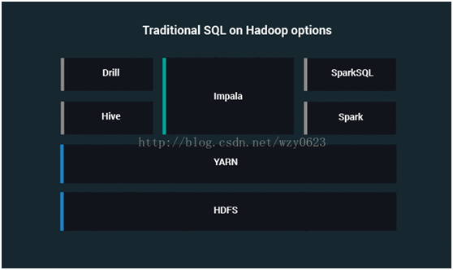

 图 10 传统的SQL on Hadoop的实现方式（YARN之上）


表格 37 SQL-on-Hadoop框架

| 框架                                                         | 简述                                                         | 功能                                                         | 应用场景                                                     |
| ------------------------------------------------------------ | ------------------------------------------------------------ | ------------------------------------------------------------ | ------------------------------------------------------------ |
| [Apache Hive](https://hive.apache.org/)                      | Hive是原始的SQL-on-Hadoop解决方案。它是一个开源的Java项目，能够将SQL转换成一系列可以在标准的Hadoop TaskTrackers上运行的MapReduce任务。Hive通过一个metastore（本身就是一个数据库）存储表模式、分区和位置以期提供像MySQL一样的功能。它支持大部分MySQL语法，同时使用相似的 database/table/view约定组织数据集。原始开发者是[Facebook](http://facebook.com/)。 | Hive-QL，一个类似于SQL的查询接口。  一个命令行客户端。  通过中央服务支持元数据共享。  JDBC 驱动。  多语言 Apache  Thrift 驱动。  一个用于创建自定义函数和转换的Java API。 | 缺省。查询性能较低。  替代方案：[Apache Tez](http://tez.incubator.apache.org/) |
| [Cloudera Impala](http://www.cloudera.com/content/cloudera/en/products-and-services/cdh/impala.html) | [Cloudera](http://cloudera.com/)于2012年推出的一个针对Hadoop的开源的“交互式”SQL查询引擎。  使用HDFS 和HBase，并利用了Hive 元数据。不使用MR，使用Impala守护进程处理查询请求。Impala目前并不支持YARN。  为了最大限度地发挥Impala的优势你需要将自己的数据存储为特定的文件格式（[Parquet](http://parquet.io/)）。 | ANSI-92 SQL语法支持。  HIVE-QL支持。  一个命令行客户端。  ODBC 驱动。  与Hive  metastore互操作以实现跨平台的模式共享。  一个用于创建函数和转换的C++  API。 | 查询要求比HIVE快。                                           |
| Presto                                                       | [Facebook](http://facebook.com/)于2012年推出的Java语言开发的、开源的“交互式”SQL查询引擎。2013年开源。  与Impala相似的是，它的性能也依赖于特定的数据存储格式（[RCFile](https://en.wikipedia.org/wiki/RCFile)）。 | ANSI-SQL语法支持 (可能是ANSI-92)。  JDBC 驱动。  一个用于从已有数据源中读取数据的“连接器”集合。连接器包括：HDFS、Hive和Cassandra。  与Hive  metastore交互以实现模式共享。 | 同上                                                         |
| [Shark](http://shark.cs.berkeley.edu/)                       | UC Berkeley大学使用Scala语言开发的一个开源SQL查询引擎。Shark构建在已有的 [Apache Spark](http://spark.apache.org/)数据处理引擎之上。 | 类似于SQL的查询语言支持，支持大部分Hive-QL。  一个命令行客户端（基本上是Hive客户端）。  与Hive  metastore交互以实现模式共享。  支持已有的Hive 扩展，例如UDFs和SerDes。 |                                                              |
| [Apache Drill](http://incubator.apache.org/drill/)           | 针对Hadoop的、开源的“交互式”SQL查询引擎。Drill由[MapR](http://www.mapr.com/)在2012年推出。需要安装工作节点（drillbits）。不同的是Drill旨在支持多种后端存储（HDFS、HBase、MongoDB），同时它的一个重点是复杂的嵌套数据集（例如JSON）。 | ANSI SQL兼容。  能够与一些后端存储和元数据存储交互（Hive、HBase、MongoDB）。  UDFs扩展框架、存储插件。 | Alpha阶段                                                    |
| Apache  [HAWQ](http://hawq.apache.org/)                      | 作为[EMC Pivotal](http://www.gopivotal.com/)公司专有Hadoop版本“Pivotal HD”的一部分提供。  2018.8.22成为Apache TLP。 | 完整的SQL语法支持。  能够通过Pivotal  Xtension框架（PXF）与Hive和HBase互操作。  能够与Pivotal  GemFire XD（内存实时数据库）互操作。 | 与Pivotal公司提供的Hadoop版本配合使用。                      |
| Spark SQL                                                    |                                                              |                                                              |                                                              |
| [BigSQL](http://pic.dhe.ibm.com/infocenter/pdsh/v1r0m0/index.jsp?topic=%2Fcom.ibm.swg.im.infosphere.biginsights.welcome.doc%2Fdoc%2Fwelcome.html) | 作为[IBM](http://ibm.com/)公司专有Hadoop版本“[Big Insights](http://pic.dhe.ibm.com/infocenter/pdsh/v1r0m0/index.jsp?topic=%2Fcom.ibm.swg.im.infosphere.biginsights.welcome.doc%2Fdoc%2Fwelcome.html)”的一部分提供。 | JDBC和ODBC 驱动。  广泛的SQL支持。  可能有一个命令行客户端。 | 与IBM公司提供的Hadoop版本配合使用。                          |
| [Apache Phoenix](http://phoenix.apache.org/)                 | 用于[Apache HBase](http://hbase.apache.org/)的开源SQL引擎。它的目标是通过一个嵌入的JDBC驱动对存储在HBase中的数据提供低延迟查询。  Phoenix提供了HBase数据的读、写操作。 | 一个JDBC驱动。  一个命令行客户端。  批量加载数据的机制。  能够创建新表，或者映射到已有的HBase数据。 | 与HBase配合使用。                                            |
| [Apache Tajo](http://tajo.apache.org/)                       | 在HDFS之上构建一个先进的数据仓库系统。虽然它支持外部表和Hive数据集（通过[HCatalog](http://hortonworks.com/hadoop/hcatalog/)），但是它的重点是数据管理，提供低延迟的数据访问，以及为更传统的ETL提供工具。它也需要在数据节点上部署Tajo特定的工作进程。 | ANSI SQL兼容。  JDBC 驱动。  集成Hive  metastore能够访问Hive数据集。  一个命令行客户端。  一个自定义函数API。 | 社区不够繁荣，不推荐。                                       |

备注：Hive详见《Hadoop体系》；Presto、Impala、HAWQ详见《数据库架构》。


### Apache Drill

Apache Drill是一个低延迟的分布式海量数据（涵盖结构化、半结构化以及嵌套数据）交互式查询引擎，使用ANSI SQL兼容语法，支持本地文件、HDFS、HBase、MongoDB等后端存储，支持Parquet、JSON、CSV、TSV、PSV等数据格式。本质上Apache Drill是一个分布式的mpp（大规模并行处理）查询层。Drill的目的在于支持更广泛的数据源，数据格式，以及查询语言。受Google的Dremel启发，Drill满足上千节点的PB级别数据的交互式商业智能分析场景。


**Drill的优势**
*  学习成本低
*  低延迟的SQL查询
*  动态查询自描述数据文件（json，text，Parquet），MPR-DB/Hbase表，不需要元数据定义的hive元数据。ANSI SQL。
*  嵌套数据支持
*  与ApacheHive一体化（Hive表和视图的查询，支持所有的Hive文件格式和HiveUDFS）
*  BI/SQL工具集成使用标准的JDBC驱动程序
*  访问多个数据源：hive、hbase、dfs
*  用户自定义UDF
*  高性能（设计上高吞吐量和低延迟，不使用通用的执行引擎，柱形矢量引擎）

#### Drill安装使用

依赖组件：JDK 7、ZooKeeper

**安装配置启动**

1)     解压Apache Drill

2)     修改zookeeper配置文件：apache-drill-1.8.0/conf/drill-override.conf

3)     配置Drill ：apache-drill-1.8.0/conf/drill-env.sh #可加大内存

4)     启动Drill ：bin/drillbits.sh start

5)     连接到Drill

```shell
## 使用drill-override.conf配置文件进行默认连接
$ ./bin/drill-conf   # 以下的查询测试都采用此方式进行连接

## 使用命令行自己指定参数进行连接
$ ./bin/sqlline -u jdbc:drill:schema=hive;zk=master:2181,slave2:2181,slave3:2181
```


**使用**

| 数据源   | 示例SQL                                                      |
| -------- | ------------------------------------------------------------ |
| hive     | select  * from hive.test.trackingtable t where  CONVERT_FROM(t.page_name, 'UTF8') = '后台系统' limit 10; |
| hbase    | `SELECT CONVERT_FROM(row_key, 'UTF8') AS studentid, CONVERT_FROM(students.account.name, 'UTF8') AS name FROM hbase.students where CONVERT_FROM(students.account.name, 'UTF8') = '爱丽丝' limit 10;` |
| mongo    | `select *  from mongo.scrapdb.weather_curr LIMIT 10;`        |
| hdfs     | SELECT  columns[0],columns[1] FROM hdfs.`/BASEDATA/MASTERDATA/test.csv`  where columns[0] = '是是是' LIMIT 10; |
| postgres | `select * from posgres.public.pet t where t.name='用户' LIMIT 10;` |

备注：1. 配置中文支持：

```shell
vi apache-drill-1.0.0/conf/drill-env.sh
export DRILL_SHELL_JAVA_OPTS="-Dsaffron.default.charset=UTF-16LE
```


#### Drill架构

Drill的核心是DrillBit服务，主要负责接收客户端的请求，处理查询，并将结果返回给客户端。
DrillBit能够安装和运行在hadoop集群中所需要的节点上形成一个分布式环境。当DrillBit运行在集群上的节点上时，能够最大程度的实现数据本地化的执行，不要进行网络和节点间的数据移动。Drill使用Zookeeper来维护和管理集群节点和节点的健康状况。
 尽管DrillBit运行在Hadoop集群中，不过他不依赖与hadoop集群，可以运行在任何的分布式系统中。

 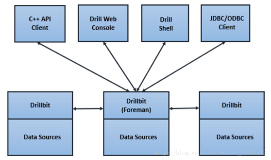

图 11 Drill架构

说明：

当提交一个Drill查询时，客户端或应用程序以SQL语句的方式发送查询给Drill集群中的DrillBit。DrillBit处理运行在每个活动节点上的查询计划和执行查询，以及跨集群分发查询任务以实现数据本地性的最大化。


<br>

## 本章参考

[1]: 8个值得关注的SQL-on-Hadoop框架 [www.infoq.com/cn/news/2014/06/sql-on-hadoop](http://www.infoq.com/cn/news/2014/06/sql-on-hadoop)

[2]: 简书Apache drill https://www.jianshu.com/p/8899039876d9

<br>

# 7 其它数据库

## 7.1 内存数据库 In-memory

内存数据库，顾名思义就是将数据放在内存中直接操作的数据库。相对于[磁盘](http://baike.baidu.com/view/157418.htm)，内存的数据读写速度要高出几个数量级，将数据保存在内存中相比从磁盘上访问能够极大地提高应用的性能。

### 7.1.1 简介

内存数据库抛弃了磁盘数据管理的传统方式，基于全部数据都在内存中重新设计了[体系结构](http://baike.baidu.com/view/1188494.htm)，并且在[数据缓存](http://baike.baidu.com/view/32571.htm)、快速算法、并行操作方面也进行了相应的改进，所以[数据处理](http://baike.baidu.com/view/51860.htm)速度比[传统数据库](http://baike.baidu.com/view/1437981.htm)的数据处理速度要快很多，一般都在10倍以上。内存数据库的最大特点是其“主拷贝”或“工作版本”常驻内存，即活动[事务](http://baike.baidu.com/view/121511.htm)只与实时内存数据库的内存拷贝打交道。

定义:设有[数据库系统](http://baike.baidu.com/view/7809.htm)DBS，DB为DBS中的数据库，DBM(t)为在时刻t，DB在内存的数据集，DBM(t)属于DB。TS为DBS中所有可能的[事务](http://baike.baidu.com/view/121511.htm)构成的集合。AT(t)为在时刻t处于活动状态的[事务](http://baike.baidu.com/view/121511.htm)集，AT(t)属于TS。Dt(T)为[事务](http://baike.baidu.com/view/121511.htm)T在时刻t所操作的数据集，

Dt(T)属于DB。若在任意时刻t，均有:

任意T属于AT(t) Dt(T)属于DBM(t)成立，则称DBS为一个内存[数据库系统](http://baike.baidu.com/view/7809.htm)，简称为MMDBS;DB为一个内存数据库，简称为MMDB。

常见的例子有[MySQL](http://baike.baidu.com/view/24816.htm)的MEMORY存储引擎、[eXtremeDB](http://baike.baidu.com/view/1558709.htm)、TT、[FastDB](http://baike.baidu.com/view/1579443.htm)、[SQLite](http://baike.baidu.com/view/19310.htm)、Microsoft SQL Server Compact等


内存数据库从范型上可以分为关系型内存数据库和键值型内存数据库。在实际应用中内存数据库主要是配合oracle或mysql等大型关系数据库使用，关注性能，作用类似于缓存，并不注重数据完整性和数据一致性。基于键值型的内存数据库比关系型更加易于使用，性能和可扩展性更好，因此在应用上比关系型的内存数据库使用更多。

### 7.1.2 案例

**需求实例**：电信计费系统中的二次批价和实时累账。二次批价是关于套餐优惠计费，实时累账时计算月初到昨天的话费统计额。

**设计方案**：数据划分，将一部分常用数据放在内存供查询，另一部持久化存储数据放在磁盘。如用户基本信息，套餐信息，实时话费统计信息放在内存中；（此方案明显优于共享内存，接口可标准化，可扩展）

内存与磁盘的同步方式：

1）磁盘到内存的同步：增量表，程序先查增量表，有则更新内存；否则查内存

2）内存到磁盘的同步：磁盘此时是内存数据的备份。


## 7.2   嵌入式数据库 Embed

### 7.2.1 Berkeley DB

DB是嵌入式数据库系统，而不是常见的关系/对象型数据库，对SQL语言不支持，也不提供数据库常见的高级功能，如存储过程，触发器等。


**设计思想**

DB的设计思想是简单、小巧、可靠、高性能。如果说一些主流数据库系统是大而全的话，那么DB就可称为小而精。DB提供了一系列应用程序接口 （API），调用本身很简单，应用程序和DB所提供的库在一起编译成为可执行程序。这种方式从两方面极大提高了DB的效率。第一：DB库和应用程序运行在 同一个地址空间，没有客户端程序和数据库服务器之间昂贵的网络通讯开销，也没有本地主机进程之间的通讯；第二：不需要对SQL代码解码，对数据的访问直截 了当。

DB对需要管理的数据看法很简单，DB数据库包含若干条记录，每一个记录由关键字和数据（KEY/VALUE）构成。数据可以是简单的数据类型， 也可以是复杂的数据类型，例如C语言中结构。DB对数据类型不做任何解释, 完全由程序员自行处理，典型的C语言指针的"自由"风格。如果把记录看成一个有n个字段的表，那么第1个字段为表的主键，第2--n个字段对应了其它数 据。DB应用程序通常使用多个DB数据库，从某种意义上看，也就是关系数据库中的多个表。DB库非常紧凑，不超过500K，但可以管理大至256T的数据 量。

DB的设计充分体现了UNIX的基于工具的哲学，即若干简单工具的组合可以实现强大的功能。DB的每一个基础功能模块都被设计为独立的,也即意味着 其使用领域并不局限于DB本身。例如加锁子系统可以用于非DB应用程序的通用操作，内存共享缓冲池子系统可以用于在内存中基于页面的文件缓冲。


download: http://linux.softpedia.com/get/Database/Database-Engines/Berkeley-DB-75.shtml

1) 程序安装

```shell
$ ../dist/configure
$ make
$ make install
```


2) 程序提供服务

dbcreate(&dbp), dbp->open(), put, get, close


3) 程序可用性测试

compile:  `gcc test.c  -ldb -lpthread –I[INCLUDE_PATH] -L[LIB_PATH]`
```c
/***
 * Access methods.
 ***/
typedef enum {
    DB_BTREE=1,
    DB_HASH=2,
    DB_RECNO=3,
    DB_QUEUE=4,
    DB_UNKNOWN=5          /* Figure it out on open. */
} DBTYPE;
```


### 7.2.2 SQLite

SQLite是目前最流行的开源嵌入式数据库，和很多其他嵌入式存储引擎相比(NoSQL)，如

BerkeleyDB、MemBASE等，SQLite可以很好的支持关系型数据库所具备的一些基本特征，

如标准SQL语法、事务、数据表和索引等。

SQLite的主要特征：

1. 管理简单，甚至可以认为无需管理。

2. 操作方便，SQLite生成的数据库文件可以在各个平台无缝移植。

3. 可以非常方便


**SQLite的主要优势在于灵巧、快速和可靠性高。**

**SQLite的主要优点：**

1. 一致性的文件格式：可以当作文件使用。

2. 在嵌入式或移动设备上的应用

3. 内部数据库

4. 数据分析，比CSV文件方便。

5. 产品Demo和测：减少系统部署时间。

**相比RDBMS，SQLite的一些劣势：**
1.C/S应用的多客户端
2.大数据量：查询效率较低，超大数据并不支持。
3.高并发


### 7.2.3 H2

官网  http://www.h2database.com/

H2 是一个用 Java 开发的嵌入式数据库，它本身只是一个类库，即只有一个 jar 文件，可以直接嵌入到应用项目中。H2 主要有如下三个用途：

第一个用途，也是最常使用的用途就在于可以同应用程序打包在一起发布，这样可以非常方便地存储少量结构化数据。

第二个用途是用于单元测试。启动速度快，而且可以关闭持久化功能，每一个用例执行完随即还原到初始状态。

第三个用途是作为缓存，即当做内存数据库，作为NoSQL的一个补充。当某些场景下数据模型必须为关系型，可以拿它当Memcached使，作为后端MySQL/Oracle的一个缓冲层，缓存一些不经常变化但需要频繁访问的数据，比如字典表、权限表。


**H2特性**：

* 高性能
* 开源
* 纯Java
* 支持嵌入式、服务器和集群
* 强安全特性
* 数据库文件可以加密


 **H2 目录结构**

```shell
h2
　|---bin
　|    |---h2-1.1.116.jar　　//H2数据库的jar包（驱动也在里面）
　|    |---h2.bat　　//Windows控制台启动脚本
　|    |---h2.sh　　 //Linux控制台启动脚本
　|    |---h2w.bat　　//Windows控制台启动脚本（不带黑屏窗口）
　|---docs　　   //H2数据库的帮助文档（内有H2数据库的使用手册）
　|---service　　//通过wrapper包装成服务。
　|---src　　    //H2数据库的源代码
　|---build.bat　　//windows构建脚本
　|---build.sh　　 //linux构建脚本
```


**H2 连接方式**

H2 支持以下三种连接模式：

1）嵌入式模式（使用 JDBC 的本地连接）

2）服务器模式（使用 JDBC 或 ODBC 在 TCP/IP 上的远程连接）

3）混合模式（本地和远程连接同时进行）


**Database File Layout**

The following files are created for persistent databases:

| File Name        | Description                                                  | Number of Files                 |
| :--------------- | :----------------------------------------------------------- | :------------------------------ |
| test.mv.db       | Database file. Contains the transaction log, indexes, and data for all tables. Format: `<database>.mv.db` | 1 per database                  |
| test.newFile     | Temporary file for database compaction. Contains the new MVStore file. Format: `<database>.newFile` | 0 or 1 per database             |
| test.tempFile    | Temporary file for database compaction. Contains the temporary MVStore file. Format: `<database>.tempFile` | 0 or 1 per database             |
| test.lock.db     | Database lock file. Automatically (re-)created while the database is in use. Format: `<database>.lock.db` | 1 per database (only if in use) |
| test.trace.db    | Trace file (if the trace option is enabled). Contains trace information. Format: `<database>.trace.db` Renamed to `<database>.trace.db.old` if too big. | 0 or 1 per database             |
| test.123.temp.db | Temporary file. Contains a temporary blob or a large result set. Format: `<database>.<id>.temp.db` | 1 per object                    |


## 7.3   搜索引擎

详见 本人《搜索引擎相关文档》

Search engines are [NoSQL](https://db-engines.com/en/article/NoSQL) [database management systems](https://db-engines.com/en/article/Database+Management+System) dedicated to the search for data content. In addition to general optimization for this type of application, the specialization consists in typically offering the following features:
*  Support for complex search expressions  支持复杂搜索表达式
*  Full text search   全文搜索
*  Stemming (reducing inflected words to their stem)    词干（减少词干变化的词）
*  Ranking and grouping of search results  搜索结果评分和分组
*  Geospatial search   地理检索
*  Distributed search for high scalability   高可用分布式检索


| 搜索引擎                                                     | Description                                                  | 诞生 | 语言 | 特性 | Developer                  | License     |
| ------------------------------------------------------------ | ------------------------------------------------------------ | ---- | ---- | ---- | -------------------------- | ----------- |
| [Elasticsearch](https://db-engines.com/en/system/Elasticsearch) | A  modern search and analytics engine based on [Apache Lucene](http://lucene.apache.org/) | 2010 | Java |      | Elastic                    | Open Source |
| [Splunk](https://db-engines.com/en/system/Splunk)            | Analytics  Platform for Big Data                             | 2003 |      |      | Splunk Inc.             | commercial  |
| [Solr](https://db-engines.com/en/system/Solr)                | A  widely used [enterprise   search engine](https://db-engines.com/en/article/Search+Engines) based on [Apache   Lucene](http://lucene.apache.org/) | 2004 | Java |      | Apache Software Foundation | Open Source |
| [MarkLogic](https://db-engines.com/en/system/MarkLogic)      | Operational  and transactional Enterprise NoSQL database     | 2001 | C++  |      | MarkLogic Corp.         | commercial  |
| [Sphinx](https://db-engines.com/en/system/Sphinx)            | Open  source search engine for searching in data from different sources, e.g.  relational databases | 2001 | C++  |      | Sphinx Technologies Inc.   | Open Source |
| [Microsoft Azure Search](https://db-engines.com/en/system/Microsoft+Azure+Search) |                                                              |      |      |      |                            | commercial |
| [Algolia](https://db-engines.com/en/system/Algolia)          |                                                              |      |      |      |                            |             |
| [Google Search Appliance](https://db-engines.com/en/system/Google+Search+Appliance) |                                                              |      |      |      |                            | commercial |
| [Amazon CloudSearch](https://db-engines.com/en/system/Amazon+CloudSearch) |                                                              |      |      |      |                            | commercial |


<br>

## 本章参考

* 嵌入式数据库系统Berkeley DB http://www.ibm.com/developerworks/cn/linux/l-embdb/index.html#resources

* H2 数据库使用简介 https://www.cnblogs.com/cnjavahome/p/8995650.html

<br>

# 8 各种数据库分析比较

## 8.1  数据库排行db-engines

表格 38 2016年数据库排行

| Rank       | **DBMS**   | **Database Model** | Score                                                        |                                                              |            |        |        |
| ---------- | ---------- | ------------------ | ------------------------------------------------------------ | ------------------------------------------------------------ | ---------- | ------ | ------ |
| Jan   2017 | Dec   2016 | Jan   2016         | Jan   2017                                                   | Dec   2016                                                   | Jan   2016 |        |        |
| 1.      | 1.      | 1.              | [**Oracle**        ](http://db-engines.com/en/system/Oracle) | [**Relational DBMS**](http://db-engines.com/en/article/RDBMS) | 1416.72    | +12.32 | -79.36 |
| 2.      | 2.      | 2.              | [**MySQL**        ](http://db-engines.com/en/system/MySQL)   | [**Relational DBMS**](http://db-engines.com/en/article/RDBMS) | 1366.29    | -8.12  | +67.03 |
| 3.      | 3.      | 3.              | [**Microsoft SQL   Server**](http://db-engines.com/en/system/Microsoft+SQL+Server) | [**Relational DBMS**](http://db-engines.com/en/article/RDBMS) | 1220.95    | -5.70  | +76.89 |
| 4.      | 5.      | 4.              | [**MongoDB**        ](http://db-engines.com/en/system/MongoDB) | [**Document store**](http://db-engines.com/en/article/Document+Stores) | 331.90     | +3.22  | +25.88 |
| 5.      | 4.      | 5.              | [**PostgreSQL**](http://db-engines.com/en/system/PostgreSQL) | [**Relational DBMS**](http://db-engines.com/en/article/RDBMS) | 330.37     | +0.35  | +47.97 |
| 6.      | 6.      | 6.              | [**DB2**](http://db-engines.com/en/system/DB2)               | [**Relational DBMS**](http://db-engines.com/en/article/RDBMS) | 182.49     | -1.85  | -13.88 |
| 7.      | 7.      | 8.              | [**Cassandra**        ](http://db-engines.com/en/system/Cassandra) | [**Wide column   store**](http://db-engines.com/en/article/Wide+Column+Stores) | 136.44     | +2.16  | +5.49  |
| 8.      | 8.      | 7.              | [**Microsoft Access**](http://db-engines.com/en/system/Microsoft+Access) | [**Relational DBMS**](http://db-engines.com/en/article/RDBMS) | 127.45     | +2.75  | -6.59  |
| 9.      | 9.      | 10.             | [**Redis**        ](http://db-engines.com/en/system/Redis)   | [**Key-value store**](http://db-engines.com/en/article/Key-value+Stores) | 118.70     | -1.20  | +17.54 |
| 10.     | 10.     | 9.              | [**SQLite**](http://db-engines.com/en/system/SQLite)         | [**Relational DBMS**](http://db-engines.com/en/article/RDBMS) | 112.38     | +1.54  | +8.64  |
| 11.     | 11.     | 12.             | [**Elasticsearch**        ](http://db-engines.com/en/system/Elasticsearch) | [**Search engine**](http://db-engines.com/en/article/Search+Engines) | 106.17     | +2.90  | +28.96 |
| 12.     | 12.     | 14.             | [**Teradata**](http://db-engines.com/en/system/Teradata)     | [**Relational DBMS**](http://db-engines.com/en/article/RDBMS) | 74.17      | +0.79  | -0.78  |
| 13.     | 13.     | 11.             | [**SAP Adaptive   Server**](http://db-engines.com/en/system/SAP+Adaptive+Server) | [**Relational DBMS**](http://db-engines.com/en/article/RDBMS) | 69.10      | -1.32  | -14.08 |
| 14.     | 14.     | 13.             | [**Solr**](http://db-engines.com/en/system/Solr)             | [**Search engine**](http://db-engines.com/en/article/Search+Engines) | 68.08      | -0.92  | -7.32  |
| 15.     | 15.     | 16.             | [**HBase**](http://db-engines.com/en/system/HBase)           | [**Wide column   store**](http://db-engines.com/en/article/Wide+Column+Stores) | 59.14      | +0.51  | +5.77  |
| 16.     | 16.     | 18.             | [**Splunk**](http://db-engines.com/en/system/Splunk)         | [**Search engine**](http://db-engines.com/en/article/Search+Engines) | 55.49      | +0.57  | +12.37 |
| 17.     | 17.     | 17.             | [**FileMaker**](http://db-engines.com/en/system/FileMaker)   | [**Relational DBMS**](http://db-engines.com/en/article/RDBMS) | 53.49      | -0.63  | +4.66  |
| 18.     | 18.     | 19.             | [**SAP HANA**        ](http://db-engines.com/en/system/SAP+HANA) | [**Relational DBMS**](http://db-engines.com/en/article/RDBMS) | 51.93      | +0.16  | +13.32 |
| 19.     | 19.     | 15.             | [**Hive**](http://db-engines.com/en/system/Hive)             | [**Relational DBMS**](http://db-engines.com/en/article/RDBMS) | 51.14      | +1.74  | -2.45  |
| 20.     | 20.     | 23.             | [**MariaDB**](http://db-engines.com/en/system/MariaDB)       | [**Relational DBMS**](http://db-engines.com/en/article/RDBMS) | 45.04      | +0.95  | +17.28 |


## 8.2   数据库技术选型

支持模式Schema的数据库：Postgres、Hive、Impala、Oracle

### 8.2.1 基本信息

表格 39 商业数据库基本信息比较表

| Database                                               | Maintainer                                                   | First   public release date | Latest   stable version   Latest   release date | [Software    licens](http://en.wikipedia.org/wiki/Software_license) | website                                 |
| ------------------------------------------------------ | ------------------------------------------------------------ | --------------------------- | ----------------------------------------------- | ------------------------------------------------------------ | --------------------------------------- |
| [Oracle](http://en.wikipedia.org/wiki/Oracle_database) | [Oracle Corporation](http://en.wikipedia.org/wiki/Oracle_Corporation) | 197911??November  1979      | 11g  Release 2   September  2009                | [Proprietary](http://en.wikipedia.org/wiki/Proprietary_software) | [www.oracle.com](http://www.oracle.com) |
| [SQLBase](http://en.wikipedia.org/wiki/SQLBase)        | [Unify Corp.](http://www.unify.com/Products/SQLBase)         | 1982                        | 11.5 November                                   | [Proprietary](http://en.wikipedia.org/wiki/Proprietary_Software) 200811?? |                                         |
| SQL  Server                                            | Microsoft                                                    |                             |                                                 |                                                              |                                         |


表格 40 开源存储系统比较表

| softwareName                                                 | Desc                                                         | current   version                                            | Copyright(c)                                                 | License                                                      | Note                                                         |
| ------------------------------------------------------------ | ------------------------------------------------------------ | ------------------------------------------------------------ | ------------------------------------------------------------ | ------------------------------------------------------------ | ------------------------------------------------------------ |
| [**Berkeley DB**](http://www.oracle.com/database/berkeley-db/db/index.html) | a  high-performance [embedded database](http://en.wikipedia.org/wiki/Embedded_database) | 5.0.21                                                       | 1986-1994  UC; Sleepycat, later Oracle.                   | BSD,  then [Sleepycat License](http://en.wikipedia.org/wiki/Sleepycat_License) | http://www.oracle.com/database/berkeley-db/db/               |
| [MySQL](http://en.wikipedia.org/wiki/MySQL)                  | The  most popular opensource database.                    | 5.1.46    201004062010-04-06                                 | 1995-2010  [Sun   Microsystems](http://en.wikipedia.org/wiki/Sun_Microsystems) (now [Oracle Corporation](http://en.wikipedia.org/wiki/Oracle_Corporation)) | [GPL](http://en.wikipedia.org/wiki/GNU_General_Public_License) or [Proprietary](http://en.wikipedia.org/wiki/Proprietary_software) | [www.mysql.com](http://www.mysql.com)                        |
| [SQLite](http://en.wikipedia.org/wiki/SQLite)                | [D.   Richard Hipp](http://en.wikipedia.org/wiki/D._Richard_Hipp) | 3.6.22    20100106[6 January 2010](http://sqlite.org/releaselog/3_6_22.html) | August  17, 2000                                             | [Public   domain](http://en.wikipedia.org/wiki/Public_domain) | http://sqlite.org                                            |
| memcached                                                    | A  high-performance, general-purposed, distributed memory object caching system. | 1.4.5 (2010-4-3)                                             | 2003  Brad  Fitzpatrick                                      | BSD                                                          | http://memcached.org/  Memcached  was originally developed by Brad Fitzpatrick for [LiveJournal](http://www.livejournal.com) in 2003.  Author:  http://bradfitz.com/ |
| CacheMoney  Gem                                              | an  open-source write-through caching library.            |                                                              | twitter                                                      | Apache  2.0                                                  | http://github.com/nkallen/cache-money                        |
| [**MongoDB**](http://www.mongodb.org/)                       | a  scalable, high-performance, [open source](http://www.mongodb.org/display/DOCS/Source+Code),  document-oriented database. | 1.4.4  6/29/2010                                             | 2009  [10gen](http://en.wikipedia.org/w/index.php?title=10gen&action=edit&redlink=1) | GNU  AGPL v3.0 (drivers: Apache license)                     | http://www.mongodb.org/  Author：Dwight  Merriman（前DoubleClick  CEO/CTO） |
| [**Redis**](http://code.google.com/p/redis/)                 | an [open-source](http://en.wikipedia.org/wiki/Open-source_software), networked, in-memory,  persistent, journaled, key-value data store. | 1.2.6 /  March 26, 2010                                      | 2009--2010  [Salvatore Sanfilippo](http://en.wikipedia.org/w/index.php?title=Salvatore_Sanfilippo&action=edit&redlink=1) | BSD                                                          | http://code.google.com/p/redis/                              |
| [**Tokyo   Cabinet / Tyrant**](http://1978th.net/)           | lightweight  database library                                | tc-1.4.45  tt-1.1.40                                         | 2006--  Mikio  Hirabayashi                                   | LGPL                                                         | http://1978th.net/  nice  talk [»](http://www.infoq.com/presentations/grigorik-tokyo-cabinet-recipes), slides [»](http://www.scribd.com/doc/12016121/Tokyo-Cabinet-and-Tokyo-Tyrant-Presentation),  mailto:mhirarin@gmail.com  example: http://mixi.jp/ |
| [**Voldemort**](http://project-voldemort.com/)               | Open-Source  implementation of Amazons Dynamo Key-Value Store. | Release  0.81 2010-06-16                                     | 2008-2009  LinkedIn, Inc                                     | Apache  2.0                                                  | http://project-voldemort.com/                                |
| [**Cassandra**](http://incubator.apache.org/cassandra/)      | a  highly scalable second-generation distributed database.   | 0.6.3  (released on 2010-06-29                               | Facebook  in 2008, [Apache   committers](http://wiki.apache.org/cassandra/Committers) now. | Apache  2.0                                                  | http://cassandra.apache.org/  Brief: bringing together [Dynamo's](http://www.allthingsdistributed.com/2007/10/amazons_dynamo.html)  fully distributed design and [Bigtable's](http://labs.google.com/papers/bigtable.html)  ColumnFamily-based data model.  example:  facebook, twitter, digg… |
| [hypertable](http://hypertable.org)                          | An  Open Source, High Performance, Scalable Database         | 0.9.3.4aAlpha  / June 23, 2010                               | Zvents  Inc.                                              | GPL2                                                         | http://hypertable.org/  In  January 2009, [Baidu](http://en.wikipedia.org/wiki/Baidu),  the leading Chinese language search engine, became a project sponsor. |
| [Hadoop / HBase](http://hadoop.apache.org/)                  | a [software framework](http://en.wikipedia.org/wiki/Software_framework) that supports  data-intensive [distributed applications](http://en.wikipedia.org/wiki/Distributed_computing) under a [free   license](http://en.wikipedia.org/wiki/Free_software).[[](http://en.wikipedia.org/wiki/Hadoop#cite_note-0) | 0.20.2  / February 26, 2010                                  | 2005-  [Apache Software Foundation](http://en.wikipedia.org/wiki/Apache_Software_Foundation) | Apache  2.0                                                  | http://hadoop.apache.org/                                    |

**说明：**满足高读写性能需求可选用Redis, Tokyn Cabinet/Tyrant, Flare; 满足海量数据存储和访问可选用MongoDB, CouchDB等；满足高可扩展性和可用性可用Cassandra, Voldemont.


### 8.2.2 整体比较

表格 41 常见数据库比较表

| 数据库名称 | 简介                    | 功能                                                         | 性能           |
| ---------- | ----------------------- | ------------------------------------------------------------ | -------------- |
| FastDb     | 关系型内存数据库系统。  | 具备实时能力及便利的C++接口。<br>FastDB针对应用程序通过控制读访问模式作了优化。通过降低数据传输的开销和非常有效的锁机制提供了高速的查询。对每一个使用数据库的应用数据库文件被影射到虚拟内存空间中。因此查询在应用的上下文中执行而不需要切换上下文以及数据传输。<br>fastdb中并发访问数据库的同步机制通过原子指令实现，几乎不增加查询的开销。 |                |
| Memcached  | K-V（纯内存）。         | 主要用做数据库的数据高速缓冲，并不能完全称为数据库。         | 整体性能最好。 |
| Redis      | 高性能的key-value数据库 | Redis是一个开源的使用ANSI [C语言](http://baike.baidu.com/view/1219.htm)编写、支持网络、可基于内存亦可持久化的日志型、Key-Value[数据库](http://baike.baidu.com/view/1088.htm)，并提供多种语言的API。<br>单进程单线程模型，多核不能充分使用。 | 读性能更佳。   |
| SSDB       | K-V DB                  | 一个高性能的支持丰富数据结构的 NoSQL 数据库, 用于替代 Redis.  C/C++ 开发。<br>和Redis兼容。 | 对内存的需求小 |
| H2         | 关系型数据库。          |                                                              |                |
| PostgreSQL | NewSQL                  | 复杂查询、外键、触发器、试图、事务完整性、MVCC(多版本并发控制) |                |


### 8.2.3 存储引擎比较

表格  存储引擎比较列表

|             | MySQL InnoDB | MySQL NDB     | Oracle    | MongoDB MAPI     | MongoDB WiredTiger |
| :---------- | :----------- | :------------ | :-------- | :--------------- | :----------------- |
| 事务        | YES          | YES           | ES        | NO               | NO                 |
| 锁粒度      | ROW-level    | ROW-level     | ROW-level | Collection-level | Document-level     |
| Geospatial  | YES          | YES           | YES       | YES              | YES                |
| MVCC        | YES          | NO            | YES       | NO               | NO                 |
| Replication | YES          | YES           | YES       | YES              | YES                |
| 外键        | YES          | YES(From 7.3) | YES       | NO               | NO                 |
| 数据库集群  | NO           | YES           | YES       | YES              | YES                |
| B-TREE索引  | YES          | YES           | YES       | YES              | YES                |
| 全文检索    | YES          | NO            | YES       | YES              | YES                |
| 数据压缩    | YES          | NO            | YES       | NO               | YES                |
| 存储限制    | 64TB         | 384EB         | NO        | NO               | NO                 |
| 表分区      | YES          | YES           | YES       | YES (分片)       | YES (分片)         |


## 8.3   DB性能比较

详见 另作《[基准测试](基准测试.md)》 TPC-H 章节


## 8.4   国产数据库产品列表

**公司团队**
*  腾讯系：TDSQL、TXSQL、Tbase、PhxSQL
*  阿里系三个团队：阿里巴巴集团数据库事业部、阿里云、Oceanbase
*  华为系三个团队：2012高斯Gauss、2012分布式实验室、华为云（IT企业产品线）
*  其他互联网：京东云、百度、小米


**类别**
*  大型通用数据库系列： GBase(南大通用)、人大金仓、达梦、神州通用、
*  NewSQL：TiDB(PingCAP)、SequoiaDB(巨杉)
*  基于PostgreSQL：Greenplum中国团队、Gauss、HighGo DB、亚信南京AntDB、中兴GoldenDB 、飞象、HAWQ
*  基于MySQL：TiDB(PingCAP)、MySQL中国区研发成员、爱可生、上海热璞、万里开源、OneSQL、
*  基于DB2：DB2中国研发团队、EsgynDB中国团队、国家电网、中国移动苏州研究院、
*  基于Informix：GBase(南大通用)、华胜信泰、福建星瑞格、
*  分析型系列/大数据系列：Kylin创业团队Kyligence、星环科技、柏睿数据RapidsDB、酷克数据、偶数科技、
*  其他：Haisql、许继集团SG-RDB、Cedar、上容、天曦TXDB、HHDB、博阳数据管理系统、东方国信、优炫云数据库、新华三、鼎天盛华Huayisoft、HUABASE


## 8.5   DB常用SQL比较

| 类型     | 函数说明                                                     | 备注                         |
| -------- | ------------------------------------------------------------ | ---------------------------- |
| 聚合函数 | avg/sum/count                                                |                              |
| 时间格式 | date: YY-MM--DD  time: HH-MM-SS  datetime: YY-MM--DD HH-MM-SS  strftime: 格式化字符串  timestamp：秒数 |                              |
| 类型转化 | 将expr转化为target_type   CAST(expr AS target_type)          | cast (timestamp as datetime) |
|          |                                                              |                              |


### 8.5.1 获取连续时间序列（日历/月历）

表格 42 获取当前日期前三十天的日期

| DB         | SQL                                                          |
| ---------- | ------------------------------------------------------------ |
| Oracle     | 法1:  `select  to_char(trunc(current_timestamp) - level,  'YYYY-MM-DD') as date_dt  from dual  connect by level <= 30`  <BR>法2:  `SELECT TRUNC(SYSDATE,  'MM') + ROWNUM - 1  FROM DUAL   CONNECT BY ROWNUM <= TO_NUMBER(TO_CHAR(LAST_DAY(SYSDATE), 'dd'))` |
| MySQL      | `set @mycnt = 1;  select  date_add(date(now()),interval @mycnt :=@mycnt - 1 day) as day   from bbk.users  limit 31`  <BR>法1:  `SELECT  @num:=@num-1 num,  DATE_ADD(DATE_FORMAT(now(),  '%Y-%m-%d'),INTERVAL @num DAY) as xx_date  FROM bbk.users a, (select @num:=1) num_t  WHERE  @num < 30 ;`  <BR>法2:  `select date_add(date(now()),interval  @i:=@i-1 day) as date   from ( select 1 union all select 1 union  all select 1 union all select 1) as tmp,  (select @i:= 1) t` |
| SQL Server | `select convert(varchar(10),dateadd(dd,number,dateadd(month,-1,getdate())),120)  as dt   from master..spt_values    where type='P' and    dateadd(dd,number,dateadd(month,-1,getdate()))<=getdate()` |
| SQLite     | 时间格式必须是类似YY-MM-DD这种，时间函数才能生效，如果不是 '-' 分隔，月/天 不是两位数将会出错。  常用时间函数：date time  datetime strtftime julianday  可用excel的自定义格式将：yy-m-d转化成yy-mm-dd |
| PostgreSQL |                                                              |

备注：表中SQL语句未全部验证。

// Oracle查询未来半年的所有月份

```sql
SELECT to_char(add_months(SYSDATE, ROWNUM), 'yyyy-mm')
FROM dual
CONNECT BY ROWNUM <= 6
```


### 8.5.2 关系数据库SQL语句比较

表格 43 关系数据库MySQL/Oracle/SQL Server的常用SQL语句比较列表

| **数据库**         | **MySQL**                                           | **Oracle**                                                   | **SQL Server**                                     |
| ------------------ | --------------------------------------------------- | ------------------------------------------------------------ | -------------------------------------------------- |
| **创建用户**       |                                                     |                                                              |                                                    |
| **创建数据库**     | create database [db]                                |                                                              |                                                    |
| **查询数据库名**   | show databases;                                     | 无库名，只有表空间                                           |                                                    |
| 查询表名           | show tables;                                        | select * from users_;  <br>select table_name, tablespace_name from user_tables [where table_name=表名] | select name from sysobjects where  xtype='u'       |
| **查询表结构**     | DESC [tbl_name]                                     | 从系统表中找                                                 |                                                    |
| **获取总行数**     | select count(*)                                     | select  count(1)                                             |                                                    |
| **获取某列不重数** | select  distinct count(column)                      | 同MySQL                                                      |                                                    |
| **限制返回条数**   | limit [num]                                         | where  rownum < [num]                                        | top [num]                                          |
| **结果排序**       | order by xxx asc/desc                               | 同MySQL                                                      |                                                    |
| **结果分组**       | group by                                            | 同MySQL                                                      |                                                    |
| 空值处理           | ifnull()                                            | Nvl()                                                        | isnull()                                           |
| 字符串拼接         | concat()                                            | \|\|                                                         | +                                                  |
| 获取系统时间       | now()                                               | sysdate                                                      | getdate()                                          |
| 日期格式化         | date_format(xcs_received_date,'%Y%m%d')             | to_char(sysdate,'yyyymmdd')                                  | convert(varchar(8),getdate(),112)                  |
| 检查有表再删除     | drop table if exists tablename                      | select count(**1**) from user_tables where table_name = 'xxx' | IF  OBJECT_ID('xxx') IS NOT NULL                   |
| rownum为列         | select a.* ,@rownum:=@rownum+1 as rownum            | 可直接当作字段使用，自动生成序列                             | 同Oracle                                           |
| 主键自增长         | create table tb(id int auto increment primary key ) | ORACLE没有自动增长的数据类型，需要建立一个自动增长的序列号，插入记录时要把序列号的下一个值赋于此字段。例：使用序列自动增长：<br/> create sequence se_id；start with 1；increment by 1<br/> --使用序列实现自动增长：se_id.nextval | create table tb(id int identity(1,1) primary key ) |

备注：SQL语句大小写不敏感，语句之间用 ';' 分隔。

* 常用字符串函数：replace revert substring concat strcmp length lower trim oct hex
* 自动提交auto commit：MySQL/SQLServer默认自动提交，Oracle不自动提交，需要用户手动提交。


**字符串替换**

```
update <TABLE> set specification =replace(specification,'  ',' ')
```


**子查询**

可以在下列[]的位置用另外一个select语句来替换

```sql
# SELECT [] FROM [] WHRE []
select *from emp t where t.sal>(select *from emp e where e.empno=7654);
select *from (select *from emp) where rownum>0;
```


**定义变量**

```sql
# SQLServer
Begin
DECLARE @count int
SET @count=123
Select @count
end

# MySQL
set @num1=(select max(rank) From tmp_ud_test where is_member=1)/3;
set @num2=(select max(rank) From tmp_ud_test where is_member=1)/3*2;
set @num3=(select max(rank) From tmp_ud_test where is_member=1)/3*3;

update tmp_ud_test a set type=
case when   a.rank<=@num1 then 1
when   @num1<a.rank and a.rank<=@num2 then 2
when @num2<a.rank   and a.rank<=@num3 then 3 end
where a.is_member=1;

# Oracle
declare
   count    number := 20;
   currtime  date := sysdate;

 begin
      update xxx set aa=count ,bb=currtime;
 end;
```


**获取分组的前几名 **

场景：查询出每个班级成绩最高的前三名学生，用到的表名及字段如下

Table: tmp_class_score,  班级：class_id,  成绩：score

```sql
# MySQL
select * from (
select b.*,@rownum:=@rownum+1 ,
if(@pdept=b.class_id,@rank:=@rank+1,@rank:=1) as rank,
@pdept:=b.class_id
from (
select * from tmp_class_score order by class_id, score desc
) b ,(select @rownum :=0 , @pdept := null ,@rank:=0) c ) result
where rank<=3;

# Oracle
Select
From (select a.*,row_number() over(partition by class_id order by score) rank
from tmp_class_score a)
where rank<=3

# Sqlserver
同Oracle
```

说明：Sqlserver 及Mysql还有rank () OVER 用替换row_number()over 实现并列排序，就是如果一个班级最高的成绩有2个人那用这个函数，取出来的排序，这2个同学显示序号都是1，这2个同学下面的同学显示的序号就会跳过2直接为3。


### 8.5.3 Oracle和IQ常用SQL比较

表格 44 Oracle和Sybase IQ常用SQL比较

|              | Oracle                                                       | Sybase IQ                                                    |
| ------------ | ------------------------------------------------------------ | ------------------------------------------------------------ |
| 客户端       | sqlplus                                                      | isql 或 dbisql （图形界面）                                  |
| 连接数据库   | sqlplus / as sysdba                                          | isql -Udba -PSQL -Sasiq_demo                                 |
| 查看版本     | select version from v$instance;                              | select @@version                                             |
| 查虚拟表     | select * from dual                                           | select * from dummy                                          |
| 看表结构     | desc tbl_name                                                | sp_iqcolumn (tbl_name)                                       |
| 查看会话     | select * from v$session                                      | sp_iqconnection                                              |
| 查看当前用户 | show user                                                    | select user                                                  |
| 启动进程     | ckpt                                                         | iqsrv                                                        |
| 系统视图     | dba_users   database_properties   dba_source   dba_triggers  dba_views | sysusers      sysoption      sysprocedure   systrigger      sysviews |


<br>

## 本章参考

*  https://db-engines.com/en/ranking

* IPC-H http://www.tpc.org/tpch/

* 2017年数据库技术盘点 http://blog.csdn.net/fl63zv9zou86950w/article/details/79427905

* ODBS https://en.wikipedia.org/wiki/Comparison_of_object_database_management_systems

* RDBS https://en.wikipedia.org/wiki/Comparison_of_relational_database_management_systems

* sql server, mysql， oracle平时用法的区别 https://www.cnblogs.com/cherxu/p/6856262.html

<br>

# 9 SQL调优

## 9.1 SQL JOIN

表格 45 SQL JOIN详述

| JOIN连接             | 描述                                             | 备注           |
| -------------------- | ------------------------------------------------ | -------------- |
| INNER  JOIN          | 内连接。取交集。                                 | 缺省           |
| LEFT                 | 左连接，以左表为主，右表未匹配的为null           | 支持           |
| RIGHT                | 右连接                                           | SQLite不支持。 |
| FULL                 | 全连接，相当于LEFT UNION RIGHT                   | 一般不支持。   |
| Cross                | 交叉连接，乘积，即组合运算。                     |                |
| UNION  /  UNION  ALL | 要求有共同的列数。UNION会排重，UNION显示所有行。 |                |

备注：1. 一般结果行数 INNER JOIN < (LEFT , RIGHT) < FULL

2. 内/外连接：内连接为INNER JOIN，其它都是外连接。INNER/OUTER关键词可省略。

3. JOIN的计算方法：取ON关联字段的两表交集值，再根据交集值在各表的记录行数相乘，最后再加交集值的相乘结果相加。


## 9.2   SQL执行流程

SQL引擎从接受SQL语句到执行SQL语句需要经历的步骤如下图和下表所示。其中，红色字体部分为DBA可以介入实施调优的环节。

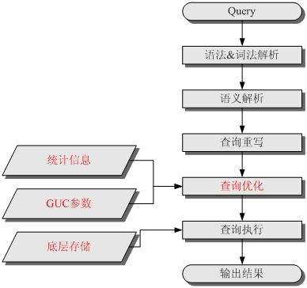

图1 SQL引擎执行查询类SQL语句的流程


表格 46 SQL引擎执行查询类SQL语句的步骤说明

| 步骤               | 说明                                                         |
| ------------------ | ------------------------------------------------------------ |
| 1、词法&  语法解析 | 按照约定的SQL语句规则，把输入的SQL语句从字符串转化为格式化结构(Stmt)。 |
| 2、语义解析        | 将“词法&语法解析”输出的格式化结构转化为数据库可以识别的对象。 |
| 3、查询重写        | 根据规则把“语义解析”的输出等价转化为执行上更为优化的结构。   |
| 4、查询优化        | 根据“查询重写”的输出和数据库内部的统计信息规划SQL语句具体的执行方式，也就是执行计划。统计信息和GUC参数对查询优化（执行计划）的影响，请参见[调优手段之统计信息](http://localhost:7890/pages/YZH07284/01/YZH07284/01/resources/zh-cn_topic_0118490247.html?ft=0&fe=10&hib=5.11.4.1&id=ZH-CN_TOPIC_0118490247#ZH-CN_TOPIC_0118490247__zh-cn_topic_0118337840_sa2061c6c1a114abe867c65372b7ddcab)和[调优手段之GUC参数](http://localhost:7890/pages/YZH07284/01/YZH07284/01/resources/zh-cn_topic_0118490247.html?ft=0&fe=10&hib=5.11.4.1&id=ZH-CN_TOPIC_0118490247#ZH-CN_TOPIC_0118490247__zh-cn_topic_0118337840_s3b6760a6255040148db86da9bd98d640)。 |
| 5、查询执行        | 根据“查询优化”规划的执行路径执行SQL查询语句。底层存储方式的选择合理性，将影响查询执行效率。详见[调优手段之底层存储](http://localhost:7890/pages/YZH07284/01/YZH07284/01/resources/zh-cn_topic_0118490247.html?ft=0&fe=10&hib=5.11.4.1&id=ZH-CN_TOPIC_0118490247#ZH-CN_TOPIC_0118490247__zh-cn_topic_0118337840_s2af0218d1d454a09914dd1cfb76e401c)。 |


表格 47 各数据库的SQL执行计划

| 数据库   | 语法            |
| -------- | --------------- |
| MySQL    | EXPLAIN  '$SQL' |
| Oracle   | 执行计划        |
| Postgres | EXPLAIN         |
| Mongo    | EXPLAIN         |


<br>

## 本章参考

<br>

# 10 数据库大型应用实例

随着互联网应用的广泛普及，海量数据的存储和访问成为了系统设计的瓶颈问题。对于一个大型的互联网应用，每天百万级甚至上亿的PV无疑对数据库造成了相当高的负载。对于系统的稳定性和扩展性造成了极大的问题。

## 10.1  负载均衡技术

负载均衡集群是由一组相互独立的计算机系统构成，通过常规网络或专用网络进行连接，由路由器衔接在一起，各节点相互协作、共同负载、均衡压力，对客户端来说，整个群集可以视为一台具有超高性能的独立服务器。

**1**、实现原理
实现数据库的负载均衡技术，首先要有一个可以控制连接数据库的控制端。在这里，它截断了数据库和程序的直接连接，由所有的程序来访问这个中间层，然后再由中间层来访问数据库。这样，我们就可以具体控制访问某个数据库了，然后还可以根据数据库的当前负载采取有效的均衡策略，来调整每次连接到哪个数据库。

**2**、实现多数据库数据同步
对于负载均衡，最重要的就是所有服务器的数据都是实时同步的。这是一个集群所必需的，因为，如果数不据实时、不同步，那么用户从一台服务器读出的数据，就 有别于从另一台服务器读出的数据，这是不能允许的。所以必须实现数据库的数据同步。这样，在查询的时候就可以有多个资源，实现均衡。比较常用的方法是 Moebius for SQL Server集群，Moebius for SQL Server集群采用将核心程序驻留在每个机器的数据库中的办法，这个核心程序称为Moebius for SQL Server 中间件，主要作用是监测数据库内数据的变化并将变化的数据同步到其他数据库中。数据同步完成后客户端才会得到响应，同步过程是并发完成的，所以同步到多个数据库和同步到一个数据库的时间基本相等；另外同步的过程是在事务的环境下完成的，保证了多份数据在任何时刻数据的一致性。正因Moebius 中间件宿主在数据库中的创新，让中间件不但能知道数据的变化，而且知道引起数据变化的SQL语句，根据SQL语句的类型智能的采取不同的数据同步的策略以 保证数据同步成本的最小化。

 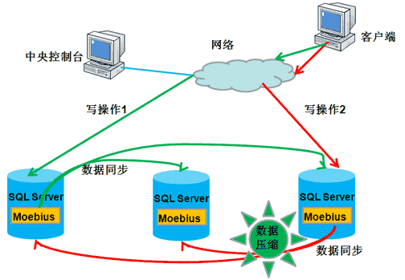

数据条数很少，数据内容也不大，则直接同步数据
 数据条数很少，但是里面包含大数据类型，比如文本，二进制数据等，则先对数据进行压缩然后再同步，从而减少网络带宽的占用和传输所用的时间。
 数据条数很多，此时中间件会拿到造成数据变化的SQL语句， 然后对SQL语句进行解析，分析其执行计划和执行成本，并选择是同步数据还是同步SQL语句到其他的数据库中。此种情况应用在对表结构进行调整或者批量更改数据的时候非常有用。

**3**、优缺点

**优点**

 (1) 扩展性强：当系统要更高数据库处理速度时，只要简单地增加数据库服务器就可以得到扩展。
 (2) 可维护性：当某节点发生故障时，系统会自动检测故障并转移故障节点的应用，保证数据库的持续工作。
 (3) 安全性：因为数据会同步的多台服务器上，可以实现数据集的冗余，通过多份数据来保证安全性。另外它成功地将数据库放到了内网之中，更好地保护了数据库的安全性。
 (4) 易用性：对应用来说完全透明，集群暴露出来的就是一个IP。

**缺点：**

(1) 不能够按照Web服务器的处理能力分配负载。

(2) 负载均衡器(控制端)故障，会导致整个数据库系统瘫痪。


## 10.2  数据库的高可用HA

主要有三种方案实现主从切换，如下

* 基于配置中心
*  基于Keepalived：指定虚拟IP~VIP，主从互发心跳包，确认对方存活（时间周期delay_loop），若主机故障，则主机上keepalived自杀；从机 keepalived检测不到主机心跳，则接管VIP，接受写请求成为主机。
* 基于MHA


## 10.3  数据库的读写分离

1. **实现原理**：

读写分离简单的说是把对数据库读和写的操作分开对应不同的数据库服务器，这样能有效地减轻数据库压力，也能减轻io压力。主数据库提供写操 作，从数据库提供读操作，其实在很多系统中，主要是读的操作。当主数据库进行写操作时，数据要同步到从的数据库，这样才能有效保证数据库完整性。

 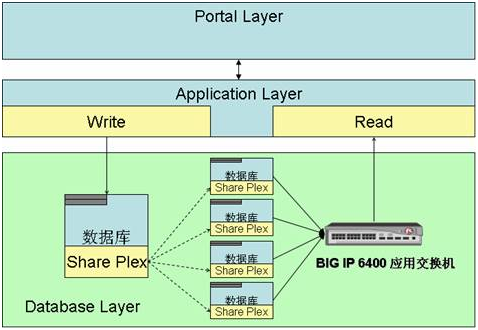

图 12 ebay的读写分离：ebay的读写比率是260:1

 

图 13 微软的数据库分发


2. **实现方法**：

在MS Sql server中可以使用发布定义的方式实现数据库复制，实现读写分离，复制是将一组数据从一个数据源拷贝到多个数据源的技术，是将一份数据发布到多个存储 站点上的有效方式。使用复制技术，用户可以将一份数据发布到多台服务器上。复制技术可以确保分布在不同地点的数据自动同步更新，从而保证数据的一致性。 SQL SERVER复制技术类型有三种，分别是：快照复制、事务复制、合并复制。SQL SERVER 主要采用出版物、订阅的方式来处理复制。源数据所在的服务器是出版服务器，负责发表数据。出版服务器把要发表的数据的所有改变情况的拷贝复制到分发服务 器，分发服务器包含有一个分发数据库，可接收数据的所有改变，并保存这些改变，再把这些改变分发给订阅服务器。

3. 优缺点

(1)数据的实时性差：数据不是实时步到自读服务器上的，当数据写入主服务器后，要在下次同步后才能查询到。

(2)数据量大时同步效率差：单表数据量过大时插入和更新因索引,磁盘IO等问题，性能会变的很差。

(3)同时连接多个（至少两个）数据库：至少要连接到两个数据数据库，实际的读写操作是在程序代码中完成的，容易引起混乱

(4)读具有高性能高可靠性和可伸缩：只读服务器，因为没有写操作，会大大减轻磁盘IO等性能问题，大大提高效率；只读服务器可以采用负载均衡，主数据库发布到多个只读服务器上实现读操作的可伸缩性。


## 10.4    数据库拆分(分布式)

### 垂直/水平拆分（分库分表）

首先进行垂直切分，按照表的内容将不同的表划分到不同的数据库中。（业务内容切分)

然后是水平切分，根据用户的ID将不同用户的内容再划分的不同的数据库中。


通过某种特定的条件，将存放在同一个数据库中的数据分散存放到多个数据库上，实现分布存储，通过路由规则路由访问特定的数据库，这样一来每次访问面对的就不是单台服务器了，而是N台服务器，这样就可以降低单台机器的负载压力。

* 垂直(**纵向)拆分**：是指按功能模块拆分，比如分为订单库、商品库、用户库…这种方式多个数据库之间的表结构不同。

* 水平(横向)拆分：将同一个表的数据进行分块保存到不同的数据库中，这些数据库中的表结构完全相同。

 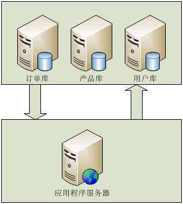

图  表结构不同的**垂直(纵向)拆分**图


 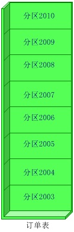

图  表结构相同的水平(横向)拆分图


**垂直(纵向)拆分**

1，**实现原理**：使用垂直拆分，主要要看应用类型是否合适这种拆分方式，如系统可以分为，订单系统，商品管理系统，用户管理系统业务系统比较明的，垂直拆分能很好的起到分散数据库压力的作用。业务模块不明晰，耦合（表关联）度比较高的系统不适合使用这种拆分方式。但是垂直拆分方式并不能彻底解决所有压力问题，例如有一个5000w的订单表，操作起来订单库的压力仍然很大，如我们需要在这个表中增加（insert）一条新的数据，insert完毕后，数据库会针对这 张表重新建立索引，5000w行数据建立索引的系统开销还是不容忽视的，反过来，假如我们将这个表分成100个table呢，从table_001一直到table_100，5000w行数据平均下来，每个子表里边就只有50万行数据，这时候我们向一张只有50w行数据的table中insert数据后建立索引的时间就会呈数量级的下降，极大了提高了DB的运行时效率，提高了DB的并发量，这种拆分就是横向拆分

2，**实现方法**：垂直拆分方式实现起来比较简单，根据表名访问不同的数据库就可以了。


**水平(横向)拆分**

(1)**顺序拆分**：如可以按订单的日前按年份才分，2003年的放在db1中，2004年的db2,以此类推。当然也可以按主键标准拆分。

优点：可部分迁移

缺点：数据分布不均，可能2003年的订单有100W，2008年的有500W。

(2)**hash取模分**： 对user_id进行hash（或者如果user_id是数值型的话直接使用user_id的值也可），然后用一个特定的数字，比如应用中需要将一个数据库切分成4个数据库的话，我们就用4这个数字对user_id的hash值进行取模运算，也就是user_id%4,这样的话每次运算就有四种可能：结果 为1的时候对应DB1；结果为2的时候对应DB2；结果为3的时候对应DB3；结果为0的时候对应DB4，这样一来就非常均匀的将数据分配到4个DB中。
 优点：数据分布均匀
 缺点：数据迁移的时候麻烦；不能按照机器性能分摊数据 。
 (3)在认证库中保存数据库配置
 就是建立一个DB，这个DB单独保存user_id到DB的映射关系，每次访问数据库的时候都要先查询一次这个数据库，以得到具体的DB信息，然后才能进行我们需要的查询操作。
 优点：灵活性强，一对一关系
 缺点：每次查询之前都要多一次查询，会造成一定的性能损失。


分库分表的主要问题
*  ACID原则：保证数据一致性，如Binlog（二进制日志）、
*  多表之间的关联查询
*  无法使用外键约束
*  无法使用全局ID，如Oracle的Sequence、MySQL的AUTO_INCREMENT自增ID。


### Sharding中间件

MySQL Cluster和MySQL Sharding
*  MySQL Cluster是数据库集群，主要用于提升数据库的并行处理能力。
*  MySQL Sharding是分片，不仅可以提升数据库的并行处理能力，还解决单表数据量大的问题。


表格 48 Sharding中间件比较

| 功能       | Cobar | MyCat | TDDL          | Shark    |
| ---------- | ----- | ----- | ------------- | -------- |
| 是否开源   | √     | √     | 部分          | √        |
| 架构模型   | Proxy | Proxy | 应用集成      | 应用集成 |
| 数据库支持 | MySQL | 任意  | MySQL、Oracle | MySQL    |
| 外围依赖   | 无    | 无    | Diamond       | 无       |
| 读写分离   | √     | √     | √             | √        |
| 分库分表   | √     | √     | √             | √        |

备注：


### 分库分表示例

**1）根据用户ID（简称uid）进行分库分表**

根据uid计算数据库、表编号： （表数TBL_NUM固定为10，数据库数DB_NUM可取任意值，为2的整数指数倍~4/8/16/32/64）
*  数据库编号（分库号） = (uid / TBL_NUM) % DB_NUM + 1
*  表编号（分表号） = uid % TBL_NUM （0~9）

当uid=9527时，根据上面的算法，其实是把uid分成了两部分952和7，其中952模8加1等于1为数据库编号，而7则为表编号。所以uid=9527的订单信息需要去DB1库中的order_7表查找。

**分库分表信息存储字节数**
*  分库DB_NUM <=10：1（分库）+1（分表）= 2byte
*  分库DB_NUM >10：2（分库）+1（分表）= 3byte

使用DB_NUM= 64来做冗余分库信息。实际库编号=(数据库编号- 1) % 8 + 1

如上例：uid=9957，分库号57，分表号7，分库分表存储为‘577’，实际分库号需二次计算得(57-1)%8+1=1。


**2）订单ID结构**

订单为全局唯一。


| 版本号 | 分库分表信息 | timestamp | 机器号 | 自增序列号 |
| ------ | ------------ | --------- | ------ | ---------- |
|        |              |           |        |            |


## 10.5 跨库查询

微服务架构下，原先单库join查询已经不能满足要求，每个拆分的微服务对应一个数据库实例，而且部署在不同的服务器上。一个请求可能需要从多个数据库获取数据，所以要解决跨库查询问题。

跨库查询的方法：

* 库冗余字段：需要定期同步冗余字段数据，不然会产生脏数据。

* 聚合服务封装查询：对外提供一个API，后台去聚合跨库查询结果。

* 表视图查询：如果涉及到不同数据库表之间的join查询，可以在其中某一数据库的表上建立视图（view）关系。但要求

  - 数据库需要部署在同一台服务器上

  - 数据库账户密码必须相同，也就是在同一个schema下

* 多数据源查询：
* 分库分表，使用数据库中间件


表格  各种数据库的跨库查询方式

|            | MySQL            | PostgreSQL           | SQLServer                 |
| ---------- | ---------------- | -------------------- | ------------------------- |
| 同实例或库 | db_name.tbl_name | schema_name.tbl_name | db_name.tbl_name          |
| 扩展       |                  | dblink、postgres_fdw | opendatasource/openrowset |


**MySQL跨库查询**

MySQL跨库查询支持同是MySQL的数据库之间进行关联查询，有以下方式，

* 在表名前加上数据库名用于显式指定数据库，例如：db_name.tbl_name
* JOIN语句
* UNION语句

MySQL跨库查询示例

```mysql
SELECT database1.table1.field1,
       database2.table1.field1
FROM database1.table1,
      database.table1
WHERE database1.table1.age > 12;
```


**PostgreSQL跨库查询**

常见三种方式

* 同一个数据库，不可schema。可在查询时加上 schema.table_name。
* dblink  先安装扩展，dblink_connect、JOIN dblink、dblink_disconnect
* postgres_fdw  先安装扩展，CREATE SERVER、CREATE USER MAPPING、CREATE FOREIGN TABLE

dblink跨库访问：dblink 是 PostgreSQL 的一个模块，支持从数据库会话中连接到其他数据库。

```sql
# 安装dblink连接: 创建扩展
postgres=# CREATE EXTENSION dblink;
CREATE EXTENSION

# 创建dblink连接：dblink_connect 本地连接/远程连接
postgres=# SELECT dblink_connect('remote_dblink_test', 'dbname=remotedb hostaddr=10.9.10.24 port=5432 user=postgres password=postgres');
 dblink_connect
<br>

----------------
 OK
(1 row)

# 跨库查询：JOIN dblink
postgres=# SELECT u.id, name, create_time FROM userinfo u JOIN dblink('remote_dblink_test', 'SELECT * FROM remote_test;') AS t(id int, ival int, create_time timestamptz) ON u.id = t.id;
 id | name |          create_time
<br>

----+------+-------------------------------
  1 | Eric | 2019-05-09 15:34:42.599409+08
  2 | Tom  | 2019-05-09 15:34:42.599409+08
(2 rows)

# 关闭dblink连接：dblink_disconnect
postgres=# SELECT dblink_disconnect('local_dblink_test');
 dblink_disconnect
<br>

-------------------
 OK
(1 row)
```


<br>

## 本章参考

* 数据库大型应用解决方案总结 http://blog.jobbole.com/88336/

* Web站点数据库分布存储浅谈 http://blog.csdn.net/starxu85/article/details/2585304

* 芒果（~轻量级极速数据层访问框架）主页：http://mango.jfaster.org/

* 每秒处理10万订单乐视集团支付架构 http://www.iteye.com/news/31550

* PostgreSQL 数据库跨库查询  https://blog.japinli.top/2019/05/cross-database-querying-in-postgresql/


<br>

# 参考资料

**相关文章**
*  另文《[数据库架构](./数据库架构.md)》


**权威链接**

*  db-engines http://db-engines.com/en/ranking

*  IPC-H http://www.tpc.org/tpch/


**经典论文**

[1]. [Brewer's CAP Theorem](http://www.julianbrowne.com/article/viewer/brewers-cap-theorem)
[2]. 《Spanner: Google’s Globally-Distributed Database》 2012
[3]. 《What’s Really New with NewSQL?》 ACM , 2016
[4]. 《Spanner: Becoming a SQL System》 Google 2017
[5]. 《Amazon Aurora: Design Considerations for High Throughput Cloud Native Relational Databases》 Amazon 2017 SIGMOD
[6]. 《七周七数据库》 [[美\]Eric Redmond](https://book.douban.com/search/Eric Redmond) 人民邮电出版社 2013


**参考链接**
[1]. https://db-engines.com/
[2]. http://en.wikipedia.org/wiki/Comparison_of_relational_database_management_systems
[3]. http://en.wikipedia.org/wiki/NoSQL
[4]. http://en.wikipedia.org/wiki/In-memory_database
[5]. http://en.wikipedia.org/wiki/Comparison_of_relational_database_management_systems
[6]. libevent http://monkey.org/~provos/libevent/
[7]. Scalability, Availability & Stability Patterns http://www.slideshare.net/jboner/scalability-availability-stability-patterns
[8]. 领域驱动设计，云架构 http://www.jdon.com/jivejdon/tags/8600
[9]. 内存数据库内核开发探索  http://www.cnblogs.com/konyel/archive/2009/06/30/1513807.html

* 解读数据库的2021：资本进来添了一把火，开源已占据半壁江山  https://mp.weixin.qq.com/s/0ZbzfM3bPq4mlnZd_EMplg


<br>

# 附录

## DB官网

**RDBS**

*  Oracle https://www.oracle.com/database/
*  MySQL  https://www.mysql.com/
*  PostgreSQL  https://www.postgresql.org/
*  Microsoft SQL Server https://www.microsoft.com/en-us/sql-server/
*  DB2 https://www.ibm.com/analytics/db2
*  SQLite  https://www.sqlite.org/
*  H2 http://www.h2database.com/
*  MariaDB   https://mariadb.com/  https://mariadb.org/


**NoSQL**

*  MongoDB  https://www.mongodb.com/    http://www.mongodb.org/
*  memcached http://memcached.org/   http://code.google.com/p/memcached/wiki/Clients  http://www.danga.com/memcached/
*  libmemcached http://libmemcached.org/libMemcached.html
*  couchbase  https://www.couchbase.com/
*  Redis http://redis.io/    [Redis中文官方网站](http://www.redis.cn/)
*  SSDB http://ssdb.io/zh_cn/
*  tokyocabinet  http://1978th.net/tokyocabinet/
*  Apache Cassandra https://cassandra.apache.org/
*  Apache Hive    http://hive.apache.org/
*  Apache HBase   http://hbase.apache.org/
*  Neo4j   https://neo4j.com/


**NewSQL**

*  Apache Kylin http://kylin.apache.org
*  Apache Tidb https://www.pingcap.com/
*  SAP HANA https://www.sap.com/
*  SAP IQ http://infocenter.sybase.com/
*  Presto  https://prestodb.io/
*  [**Teradata**](http://db-engines.com/en/system/Teradata)   https://www.teradata.com/
*  ClickHouse https://clickhouse.tech/
*  Greenplum  https://greenplum.org/


**云数据库**

*  阿里云DRDS https://www.aliyun.com/product/drds/
*  Amazon Redshift  https://aws.amazon.com/redshift/
*  Microsoft Azure Synapse Analytics  https://azure.microsoft.com/services/synapse-analytics/


**时序数据库**

- [InfluxDB](https://db-engines.com/en/system/InfluxDB)
- [Kdb+](https://db-engines.com/en/system/Kdb%2B)
- [Prometheus](https://db-engines.com/en/system/Prometheus)
- [Graphite](https://db-engines.com/en/system/Graphite)
- [TimescaleDB](https://db-engines.com/en/system/TimescaleDB)


**SearchEngine**

* Elasticsearch  https://www.elastic.co/elasticsearch/
* Apache Solr  https://lucene.apache.org/solr/
* Splunk  https://www.splunk.com/


**官方文档**

*  MongoDB 官方英文文档：https://docs.mongodb.com/manual/


## 业界会议

**数据库库业界会议**

*  ACM SIGMOD（Special Interest Group on Management Of Data.）数据管理国际会议，数据库领域具有最高学术地位的国际性学术会议。会议的目的是在全球范围内为数据库领域的研究者、开发者以及用户提供一个探索最新学术思想和研究方法、交流开发技巧、工具以及经验的平台，引导和促进数据库学科的发展。
*  VLDB（Very Large Data Bases）
*  ICDE：International Conference on Data Engineering 数据工程国际会议。是数据和数据库领域的顶级会议。
*  KDD

说明：ACM SIGMOD, VLDB, ICDE号称国际数据库业界三大会议。

国内规模较大的数据库学术会议有中国数据库技术学会（NDBC）和中国大数据技术大会（BDTC）。

