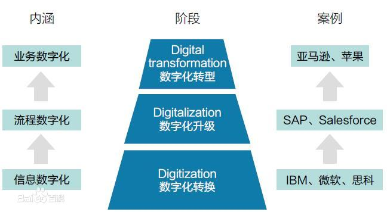
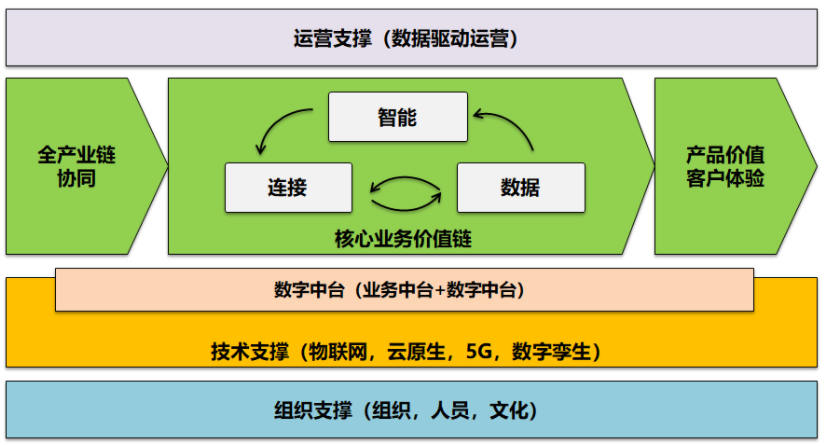
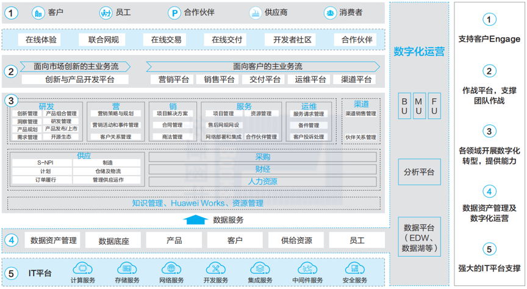
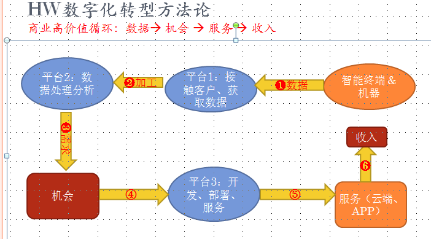
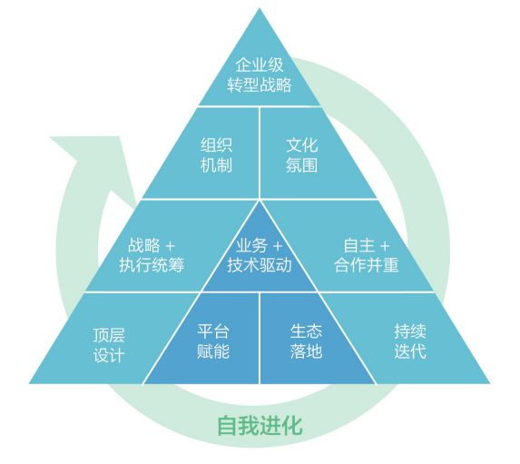
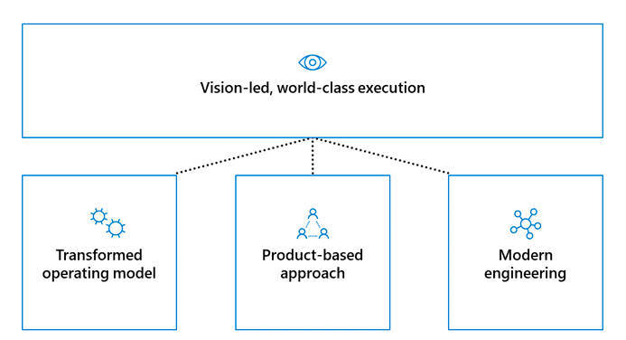

| 序号 | 修改时间  | 修改内容 | 修改人 | 审稿人 |
| ---- | --------- | -------- | ------ | ------ |
| 1    | 2021-4-13 | 创建     | Keefe |        |
|      |           |          |        |        |

   

---

[TOC]

 

---

# 1 简介

百度百科**定义**：数字化转型（Digital transformation）是建立在数字化转换（Digitization）、数字化升级（Digitalization）基础上， 进一步触及公司核心业务，以新建一种商业模式为目标的高层次转型。数字化转型Digital transformation是开发数字化技术及支持能力以新建一个富有活力的[数字化商业模式](https://baike.baidu.com/item/数字化商业模式/9733249)。

数字化转型表明，只有企业对其业务进行系统性、彻底的（或重大和完全的）重新定义——而不仅仅是IT，而是对组织活动、流程、业务模式和员工能力的方方面面进行重新定义的时候，成功才会得以实现。

2020年5月13日下午，国家发展改革委官网发布“[数字化转型伙伴行动](https://baike.baidu.com/item/数字化转型伙伴行动/50059958)”倡议。

图 数字化商业模式

说明：

* 数字化转换：信息数字化，模拟数据到01二进制。
* 数字化升级：流程数字化，典型是各类IT应用系统。
* 数字化转型：业务数字化，典型代表亚马逊，苹果。

## 数字化转型能力框架

说明：企业数字化是将当前的数字技术应用到企业的战略和业务目标达成。

* 核心业务价值链
  * 连接：万物互联，解决人和人，人和物，物和物的连接问题。
  * 数据：连接后产生集成和协同，协同过程自然会产生数据。
  * 智能：数据经过加工和提炼，形成智能化分析应用。

* 组织支撑：包括了组织，人员，文化，过程等内容。

* 技术支撑：包括了云原生，物联网，5G和数字孪生等，也包括数字中台构建。
* 运营支撑：核心是基于数据驱动思维下，以价值创造为目标的持续改进。

## 数字员工

“数字员工（Digital Employee）”是企业基于不同的岗位工作内容，通过智能化的方式创造出来的虚拟员工，它服务于人类员工，用以提升生产力和创造力。

数字员工已然成为现代企业提高运营效率的一个有效手段。

数字员工为三类，分别是作业型、助手型和专家型。

第一类是作业型数字员工，针对重复场景时，数字员工帮助自动化执行。比如商城客服人员，在面对大量的咨询时，简单重复的问题由数字员工回答，而自有员工可以解答疑难问题与新问题，同时转身成为数字员工的训练师，通过知识管理与运营提升数字员工服务水平，保障客户服务满意度。

第二类是助手型数字员工，面向员工信息收集等日常工作，提供参考与辅助，减轻人类员工注意力的耗散，帮助他们聚焦更具创造性的工作。比如项目经理（每天需要与不同部门的同事，协同获取信息，有了数字员工的能力后，能随时查看项目进度、经营状态、专家资源，针对项目异常还能及时预警，而项目经理有了更多的精力与客户沟通、处理项目问题，保障项目交付进度与质量。

第三类是专家型数字员工，通过数据智能，从广度、深度、复杂性等方面，增强人类员工的思维能力。某营销专家拥有全国五十多个城市两百多万广告点位的资源，通过多维数据+AI算法模型构建的营销数字机器人，实现优质资源高效利用，提升投放效果。广告投资变得更有价值。

## B端产品

详见 《[产品管理-B端.md](../软件工程/产品岗/产品管理-B端.md)》

## 术语

* 信息化：信息化是一种管理手段，信息化的工作就是把管理信息化。
* 数字化：数字化则是推进信息化的最好方法。目前应用的企业信息化管理系统主要有：OA办公自动化系统；用于管理客户关系的CRM系统；MES制造执行管理系统； MDC生产数据及设备状态信息采集分析管理系统；PDM制造过程数据文档管理系统等。
* 数据化：数据化是指问题转化为可制表分析的量化形式的过程。最直观的就是企业形形色色的报表和报告。
* 数据化运营：数据化管理=数据分析+服务业务+改善管理。数据化运营（约等于）数据化管理，前者常见于互联网行业，上升到所有行业其实都叫数据化管理。
* 数字化运营：类似数据化运营。
* 数字员工：在信息化工作中，我们使用一种技术，模拟员工进行信息化工作，我们称之为“数字员工”。

 

## 本章参考

* 解密鸿源云道第三期：企业数字员工 建好用好规模化普惠人工智能 https://hw.shixizhi.huawei.com/knowledge/knowledgeDetail.htm?schoolId=1390222376536522753&articleId=1442779297735483394
* 再论数字化转型-转什么，如何转？  https://www.toutiao.com/i6924085574961725966?wid=1642559097726

 

# 2 数字化转型方法论

## 2.1 华为数字化转型

2017 年，华为提出了企业的新愿景：“把数字世界带入每个人、每个家庭、每个组织，构建万物互联的智能世界”。同时， 华为公司董事、CIO 陶景文提出了“实现全联接的智能华为，成为行业标杆”的数字化转型目标。随后，华为基于愿景确定了数字化转型的蓝图和框架， 统一规划、分层次开展，最终实现客户交互方式的转变，实现内部运营效率和效益的提升。

2018年，华为CIO提出高价值循环链。

2019年，华为发表了白皮书《企业数字化转型方法论》，正式提出了：企业数字化转型“1234法”。

2020年，数字化转型要以支撑企业主业成功为目标，以业务重构为核心，构建数字能力为基础。华为结合自己的实践，建设了数字化使能平台鸿源云道。

### 数字化转型蓝图

华为数字化转型蓝图包括 5 项举措，其中，举措 4 涉及数据治理和数字化运营，是华为数字化转型的关键，承接了打破数据孤岛、确保源头数据准确、促进数据共享、保障数据隐私与安全等目标。

### 高价值循环链

高价值循环： 数据 --> 机会 --> 服务 --> 收入

### 企业数字化转型“1234法”

该方法论包含4个部分：

　　**一个战略**。就是要把企业数字化转型战略，定为**企业的一级战略**，进行全局谋划，配备战略级资源的支持。

　　**二个保障**。通过**组织转型**，激发组织活力；通过**文化转型**，创造转型氛围。

　　**三个核心原则**。**战略统筹**、**技术业务驱动**、**自主&合作并行**作为三个核心原则。将核心原则贯穿转型全过程，保证转型始终在正确的道路上。

　　**四个关键行动**。包括**顶层设计、平台赋能、生态协同、持续迭代**，通过四个关键行动控制转型关键过程。

## 2.2 微软

Microsoft Digital以愿景为导向的产品思维，其实际目标是发现最有效和最高效的解决方案，这些解决方案将对转型的重点领域产生最大的影响，使愿景成为现实。

图 Microsoft Digital的数字化转型方法论（2021.5）

**转型运营模式**

基于转变后的运营模式，Microsoft Digital可以摆脱基于预算的决策和方向，而转向交付明确和优先的业务成果。通过这种模式，Microsoft Digital通过赋予业务团队和员工自主权和决策能力，从而达成赋能。每个业务组都保持自己的愿景，并有自由根据该愿景来确定工作的优先次序。然而，这些工作仍然需要与总体的Microsoft Digital愿景保持一致，并在每年的集中审核中被评估两次。这确保了整个组织的工作得到正确的优先安排和拨款。转型后的运营模式的例子包括：

- 集中拨款和优先排序：Microsoft Digital已经从分散的、以部门为中心的预算模式转变为Microsoft Digital拥有预算的集中模式。过去，微软的业务部门，例如财务和营销部门，驱动预算和项目。现在，Microsoft Digital可以利用自己的项目优先权，根据自己的愿景来驱动预算和项目。
- 内包核心系统和工程：Microsoft Digital正在用训练有素的全职员工，管理对微软的成功最为关键的系统。历史上，Microsoft Digital将这项工作的大部分外包出去。然而，Microsoft Digital正在将其带回自己员工的控制之下，并保留知识产权。Microsoft Digital希望自己的员工参与到最重要的内部产品的设计、开发和运营之中。
- 将衡量标准集中在业务成果上：Microsoft Digital的指标反映了所推动的业务成果，而不是传统的IT运营指标。为了成功转型，与Microsoft Digital的愿景保持一致并为组织的成功做出贡献是首要任务。因此，Microsoft Digital衡量成功的方式是基于业务成果，而不是其它武断的衡量标准。

**基于产品的业务方法**

为了使Microsoft Digital建立和运行的服务能够在全球范围执行，Microsoft Digital正在对流程采取基于产品的方法。Microsoft Digital希望专注于开发有助于实现愿景的解决方案，并希望在开发中使用敏捷开发方法和以产品为中心的管理。对Microsoft Digital业务采取基于产品的方法意味着：

- 创建愿景和业务驱动的任务表：Microsoft Digital确保任何投入资源的事情都与Microsoft Digital的愿景相一致。Microsoft Digital要求内部团队始终以微软的最佳利益为重，而如果与愿景不一致，就应该受到质疑——不管是谁在质疑。Microsoft Digital希望为内外部客户提供最好的产品。
- 专注于技能发展和DevOps结构： DevOps将开发人员的管理生命周期扩展到版本发布之外。使用 DevOps 方法，Microsoft Digital中构建解决方案的人员要对他们编写的每一行代码的操作、修复、故障排除和所有权负责。DevOps方法和敏捷方法使Microsoft Digital员工在解决方案的开发过程中和使用后都关注它的成功。这带来了产品功能更流畅的进化，以及对功能的关注，而不是对功能的增加。
- 转向产品管理：管理产品而不是项目。产品管理让Microsoft Digital团队专注于产品的成功，而不是项目的完成。Microsoft Digital产品经理参与了整个过程，从管理与利益相关者的关系到理解产品的技术基础。建立在DevOps结构之上的产品管理，帮助确保开发解决方案的团队，能够感受到这些投入会在后续的成功中体现，而不仅仅是最新版本的发布。

**贯穿所有流程的现代工程和设计实践**

现代工程侧重于提供一套通用的工具和自动化，通过实现持续集成和交付实践，向员工提供代码和新功能。Microsoft Digital优先考虑对业务最有效的结果，根据对任务清单中的排序进行交付。Microsoft Digital增加了遥测功能，以监测客户的使用模式，这为Microsoft Digital服务和客户体验的健康程度提供了洞察力。Microsoft Digital希望消除组织中的功能孤岛，增加基础设施、应用程序和服务的连接和整合方式。在这一切的背后，Microsoft Digital有一套统一的标准来保护和帮助员工。

Microsoft Digital通过以下方式为未来进行设计：

- 建立一致的设计系统：Microsoft Digital正在微软员工和客户在所有的产品和解决方案中创造一个一致的、连贯的、无缝的体验。这意味着建立设计和用户体验的优先级和标准，并创建一个共享原则和准则的内部目录，使整个组织保持同步。从历史上看，Microsoft IT的开发是孤立的，这导致了不同的用户体验和不同工具之间的不同步。现在，Microsoft Digital正在对工作进行总体评估，并仔细检查用户体验，以提升用户的生产力。
- 创建集成和互联的服务：Microsoft Digital转向云计算增加了开发过程的整体灵活性，并加快了向公司交付价值的速度。Microsoft Digital通过将产品和服务组合重新定义为一个微服务架构来实现这一目标，该架构促进了代码重用，并通过API实现了跨服务的依赖性。这进一步使Microsoft Digital能够提供无缝和集成的体验，将数据和工具结合在一起，为用户提供直观的体验和新的洞察力。
- 在工作流程中建立隐私、安全和可访问性标准：Microsoft Digital集成了一些工具，支持工程师在解决方案中建立改进的隐私度、安全性和可访问性。如果没有这些标准和自动化策略，Microsoft Digital将不得不随着情况的变化进行返工和清理。这样做成本更高，并且会影响向用户发布的速度。创建在整个组织范围内应用的标准，并从一开始就创造一个信任Microsoft Digital工程实践的环境。Microsoft Digital在这一领域的创新，确保解决方案也有利于客户，因为这些解决方案也被集成到微软的商用产品中。

## 效率革命，以人为中心（腾讯云，2020）

数字化转型的本质是一场效率的革命

那么如何理解数字化转型？国资委最近发布了2020年国有企业数字化转型100个代表性案例。从这些案例中不难看出，数字化转型是一个万花筒，千企千面。但如果我们将这些转型做一个高度抽象的话，会发现数字化转型的底层逻辑是一样的，都是一场效率的革命。所有转型都是围绕连接效率、数据效率以及决策效率展开的。

## 埃森哲数字化转型“三步曲”

埃森哲数字化转型方法论，围绕企业三大价值维度：**数字化运营、主营业务增长、商业创新**。

埃森哲的企业数字化方法论，提出了转型三步曲：

​    **第一步：制定数字化转型目标**

企业领导层需要对未来技术发展、行业发展、消费者趋势等诸多因素进行综合分析，定义对本公司最优的数字化目标。

比如沃尔玛的转型目标就是提升营销精准度，他们建立了基于用户行为和偏好的算法模型，为用户推送最感兴趣的商品，为沃尔玛带来了10%～15%的交易量提升。

　**第二步：采取数字化转型行动**

企业需要在全公司范围内提升各方对数字化转型的认同感，并建立起数字化思维方式。

为打造数字化企业，企业应当借助产业物联网、人工智能和敏捷创新等数字技术对其运营进行改造升级，提高内部运营效率。

比如，一家日本连锁便利店，采集并分析了来自全球4000万忠实用户的数据，用以优化营销投资方案和改善货架空间分配及利用率，该项目为其带来了125万美元的利润，以及超过1.25亿美元的年收入增长。

　**第三步：达成数字化转型成果**

数字化转型的诸多努力最终要落到可持续的数字化商业模式，以及能支持该商业模式成功运行的运营模式上。

埃森哲数字化转型方法论，提出了5大关键行动：

　　1、制定面向未来的数字化战略。

　　2、数字生态建设，实现全面业务升级。

　　3、打通研发、产品、用户，实现智能创造价值。

　　4、产品服务智能化升级，打造全生命周期用户差异化服务。

　　5、建立高韧性、高扩展性和敏捷性组织，支持业务发展和调整。

## 麦肯锡数字化转型四步法

麦肯锡对全球 150家企业进行了深入诊断调查。经过对各大企业在数字领域表现的考察，可以将数字化转型成功与否归结为4点：

**第一，传统型企业必须仔细考虑可供它们选择的战略。**能够在行业中起到颠覆作用的全球性玩家始终是少数。而能够借助数字平台，制定实际标准，并能最终建设整个生态系统的公司更是寥寥无几。95%至99%的传统型企业必须选择一条不同的道路，**这条道路不能只在既定业务的边缘旁侧敲击，而是要全心全意地采取一套清晰的数字战略。**

**第二，数字化能否成功，取决于能否依据战略，培养出相应的数字能力，并达到可观的规模。**一旦培养出合适的能力，即便消费者的消费心理和行为不断变化，公司也能适时、适当地做出调整。

**第三，大数据分析、数字内容管理和搜索引擎优化等技术能力固然重要，但总有不完善的时候，而强大且灵活的企业文化可弥补该缺陷。**

**第四，公司需要调整其组织结构、人才发展、融资机制和关键绩效指标(KPI)，让这些内容与自身的数字战略保持一致。**

总体而言，要想在数字时代紧跟潮流，传统型企业的高管团队可以遵循上述四点建议构建企业未来发展规划。

 

## 本章参考

* 腾讯数字化转型思考：“以人为中心”是国企数字化转型的底层逻辑 https://baijiahao.baidu.com/s?id=1697035684613323306&wfr=spider&for=pc
* 数字化转型知识方法系列 www.sasac.gov.cn/n4470048/n13461446/n15927611/n16058233/index.html
* ERP已死，“中台”已凉，“低代码”称王！ https://www.163.com/dy/article/G8H8AECD051181V0.html
* 华为数据之道：华为数据治理及数据分类管理框架和经验  https://www.infoq.cn/article/6JEOk7gkzYF4jk1OHNbv
* [麦肯锡数字化转型四步法](http://mp.weixin.qq.com/s?__biz=MzI1NzYwNTMzNw==&mid=2247488504&idx=1&sn=f19e447f6ec1ce765e76ff12b4314c1c&chksm=ea15b84edd62315845098cdae7235b358772caabe67746d1d3bca0846ac2bfb4c4087eda0718&scene=21#wechat_redirect)

 

# 3  数字化转型案例

## 华为业务的数字化转型实践

正如华为公司轮值董事长郭平曾说的：自己的降落伞自己先背着跳一回，华为通过在自身实施数字化改造，把 所有的风险和困难都经历一遍，以便后续为客户提供更好的价值服务。

华为提出了数字化转型的目标：在未来3～5年率先实现数字化华为，实现大平台支撑下的精兵作战。对外，要对准作战，通过与客户交易过程的数字化，实现客户、消费者、合作伙伴、供应商和员工这5类用户的ROADS体验（Real-time 实时、On-demand 按需、All-online 全在线、DIY 服务自助、Socia l社交化），提高客户满意度；对内，实现各业务领域的数字化与服务化，打通跨领域的信息断点，达到领先于行业的运营效率。

在华为 9 大核心业务的数字化转型实践中，全方位采用了华为领先的 ICT 产品及解决方案和创新的数字平台， 例如云数据中心、园区网络、网络安全、视频云平台、融合通信、边缘计算物联网（EC-IoT）、eLTE 宽带无线接 入等等。

表格 华为用户画像和业务对象

| 用户画像                                | 人-机                        | 业务对象                                                 |
| --------------------------------------- | ---------------------------- | -------------------------------------------------------- |
| 18万+员工 50万供应商 百万合作伙伴 | 智能客服、搜索推荐 风控   | 万级项目 百万合同 百万站点 千万采购 千亿资金 |
| 10亿+消费者                             | 用户画像、智能客服、千人千面 | 千万支付                                                 |

表格 华为9 大核心业务的数字化转型实践列表

| 业务                   | 北京                                                         | 上云方案                                                     | 案例                                                         |
| ---------------------- | ------------------------------------------------------------ | ------------------------------------------------------------ | ------------------------------------------------------------ |
| 研发上云  全球协同  | 华为最重要的一块业务就是研发，近十年投入研发费用超过4850亿元人民币，目前华为在全球有14个研发中心，36个联合创新中心，1500个实验室，8万多名研发人员。 华为工程师在同时研发一个产品的时候，涉及流程、工具、数据、编译环境等多个环节。例如北研所、欧研所、印研所等分布在全球的工程师协作研发某高端网络产品，要进行联调，需要申请环境装备、搭建IT环境、找地方，过去的“烟囱式”实验室环境导致准备周期可能要1个月甚至更长。 | 华为依托华为云打造“研发云”，将研发涉及的环节进行了服务化解耦，为研发提供仿真云、持续集成云、设计云、桌面云、杀毒云、测试云、分析云七种服务。 通过代码上云，建设10万桌面云，奠定研发全面云化基础；通过作业上云，重构研发作业模式，大幅提升研发效率，利用百万级虚拟机集中管理和调配，实现分钟级环境准备，资源复用率提升2.5倍；通过研发作业上云，实现了跨区域全球协同研发，使得作业时间缩短50%，加快产品上市周期；并通过云上云下隔离，重构安全架构。 | 基于无线 5G 核心仿真场景 15.2 天下降到13.2小时。             |
| 大平台能力支撑销售作战 | 相比于其他业务，销售具有较大的不确定性，数字化挑战很大。过去，一线的指挥官即使发现增长不足，也不 能迅速知道到底是线索出了问题，还是项目成功率出了问题，或是某个大客户项目出了问题。 | 通过将团队协作空间、项目管理服务、知识平台和专家资源平台集于一体的大平台能力支撑销售，华为面向销 售项目团队的不同角色，构建不同的用户体验。 例如，通过指挥系统为管理者提供战场可视的数字化指挥体验，通 过作战系统为项目经理以及项目铁三角提供销售项目运作线下到线上的体验，通过自动化系统为合同商务提供线上 作业自动化和智能体验，提升团队协同水平和业务运作效率，改善一线用户体验。 | 客户投资决策周期由 16 周缩短到 4 周。商用周期整体缩短 50% 以上。 |
| 集成服务交付实时可视   | 交付被华为高层、客户以及合作伙伴一致认为是 华为改变最大的。华为的交付业务非常复杂，例如网 络设备的交付，要进行交付实施、验收、项目管理、 外包管理、资源管理等多个环节 | 现在通过将资源管理、外包管理、站点验收、收货、 技术支持、人员管理都集成在一个作战平台上，通过 服务化的架构，华为为交付人员构建了一个一站式的 服务交付平台和一系列 IT 装备，实现一线交付业务在 线、实时、可视、高效。华为在西安有一个交付指挥中心， 在大屏运营中心可以看到全球交付的项目，甚至每一 个站点的执行情况。 | 华为每天平均交付 300 个站点，覆，交付进度提高 30%，单站成本下降 13% 。 |
| 全球制造运营与指挥中心 | 计划准确率往往是各个制造型的企业最难管理的， 华为也同样如此。尤其是手机这种“海鲜类”产品， 如果一个计划出错，出现几万台、几十万台或者百万 台的库存就是灾难性的。 | 通过建设全球制造运营与指挥中心，华为将全 球供应商的供货情况以及全球市场的需求情况通过服 务化方式进行集成，并围绕各个业务场景构建了实时 决策系统，包括供应商来料预警、大数据质量预警、 预测性维护、智能云诊断、软件云管理、测试网络安 全监控等。 |                                                              |
| 智慧物流与数字化仓储   | 华为在全球 170 多个国家有四大供应中心，许多高价值货物在全球流转，过去想要知道某批货的具体流转情况 非常困难。 | 华为已经实现了对全球 100 多个仓库的数据接入，对进出库都实现了可视管理。同时，华为总体 账实一致率大幅度提升，提高了资产运营效率。 | 通过 EI 技术可以提升 20% 的分拣装箱效率，物流使用 EI 做路径规划可节省例外开销成本 30% 。 |
| 财务快速结账和自动支付 | 华为在全球有 200 多家子公司，130 多个代表处，要遵守 3 类会计准则（中国、国际、本地），原来结一次账的时间周期很长。 | 通过交易核算自动化，ERP 优化（跨账套关账、跨账套产生分录、减少手工帐），数据调度优化（一天多调和 自动定时调度），数据质量监控（交易数据质量提前检查），以及提升数据分析平台的性能，华为已经实现了全球 结账监控，实现过程可跟踪、可管理。 | 月度财务报告 3 天出初稿，5 天出终稿，年度财务报告 11 天就能完成初稿。 |
| 全连接协同办公         | 华为目前约有 18 万名员工分布在全球 1000 多个办公地点，日常工作涉及各种应用软件，移动办公建设初期， 为快速满足业务需求，先后建设多个体验不一致、集成度差的烟囱式移动 APP，华为员工即时沟通、邮件处理、信 息公告、文档处理和业务审批等被分隔在多个独立 APP。 | 华为打造了一个云化、移动化的全连接协同平台 WeLink，为员工提供连接人、连接知识、连接业务、连接设 备的全连接 Living Service，融合 IM、邮件、视频会议、视频直播、知识、业务待办、智能装备等先进的协同服务 与技术，极大的提升单兵作战、团队协同和跨地域协作的整体效率。 以 WeLink 视频会议为例，其已经融入到华为 站点远程验收、客户远程沟通、远程面试等多个场景领域，为华为人的内外沟通提供实时连接的桥梁，同时降低企 业出差成本。 | 2017 年年初发布，每日活跃用户达 12 万。                      |
| 华为智慧园区           | 华为的园区分布在全球 170 多个国家和地区，需要管理超过 400 万个联接对象。 | 华为计划汇聚园区 24 个子系统，打通数据，建立全球统一的数字化运营中心，以实现提升安全防护、提升响 应速度和提升服务体验三大目标。华为智慧园区以 1+1+1（一套 ICT 基础设施、一个数字化使能平台、一个智能运营中心）的模式构建了一个真正意义上的全联接数字园区。其中，数字化使能平台融合了视频云平台、大数据平台、 集成通信平台、IoT 平台和其他支撑平台（GIS/BIM、应用引擎等），打造成统一数据底座，向下对接 ICT 基础设 施汇集多元数据，向上提供统一接口，支撑智能运营中心（IOC）应用。 | 项目投入运营以来，安防事件响应时间从 7.5 分钟降低到 2 分钟，处置 效率提升了 50%；员工、访客在园区的体验也变得智能；综合能效下降 10%，设备寿命延长 10%。 |
| 手机电商               | 2017 年华为（含荣耀）智能手机全年发货 1.53 亿台，线上是一个重要销售渠道. | 华为打造了“智能交易中台 iDeal”，实现订单快速处理，前、中、后分层解耦的 IT 架构，支持 1 小时 100 万订单，100 亿美金日销售额处理。 |                                                              |

IT资产要素七种：计算、存储、网络、数据、应用、用户、装备

华为企业智能实践： “场景，数据，算法，算力”四位一体

## 微软自身的数字化转型

微软已经将自身从一家传统软件公司转变为一家以数字产品和服务为主的数字业务优先的公司，微软公司自身也运营在云与AI等数字技术之上。

微软数字型转型主导组织：内部IT -->  CSEO  --> Microsoft Digital

微软自身的数字化转型由微软CSEO组织所领导和负责。微软CSEO的全称为Core Service Engineering & Operation（核心服务工程与运营），这个组织的前身就是微软内部IT。在微软自身数字化转型的过程，微软内部IT的功能和职责发生了变化，相应也改名为CSEO。而CSEO后来也再次更名为Microsoft Digital，其用意非常明显——大胆地再次刷新微软的数字业务，让微软的数字业务成为业界的标杆和样板。

2021年5月，Microsoft Digital团队发表了一篇文章，简单明了地总结了微软内部IT的数字化转型历程。

* 必要性：颠覆一直是业务转型的催化剂。

* 驱动力：以愿景为引领是微软数字化转型的主要驱动力。

Microsoft Digital为质量、交付、成本和合规性设定了高标准，方法包括遵守重要的指导方针，指导如何实现愿景以及如何指挥行动。这包括：

- 将成果与愿景联系起来，明确优先次序。
- 将用户体验置于设计的中心。
- 在特定角色的领域中培养能力和深度知识。
- 投资核心平台和系统以提高工程生产力。
- 使用数据和洞察力不断评估所用的方法并确定其优先级，确保实现最重要的目标，并与愿景保持一致。

确定支持愿景的优先事项

* 以云为中心的架构
* 企业安全
* 数据与智能
* 以客户为中心
* 更高生产力的企业

 

## 本章参考

* 华为借助云计算和人工智能的数字化转型实践.2018  https://e.huawei.com/topic/huawei-own-digital-transformation/cn/index.html
* [Inside the transformation of IT at Microsoft](https://www.microsoft.com/en-us/insidetrack/inside-the-transformation-of-it-and-operations-at-microsoft#:~:text=Microsoft Chief Digital Officer (CDO) Kurt DelBene is)
* 两年市值翻一倍达两万亿美元，微软数字化转型历程 | IDCF  https://segmentfault.com/a/1190000040467282?sort=votes
* 华为陶景文：企业数字化转型之道 (2019.10)  https://www.sohu.com/a/350625806_187871
* 陶景文：从华为变迁看数字化转型的门道 （2018.8） https://www.sohu.com/a/249431908_114838
* 熊康：从华为实践看企业数字化转型  https://mp.weixin.qq.com/s/-yL1RQAgzBvYqX65eNQ7Aw
* 不到 3 年覆盖 25 个行业，华润集团系统上云比例超过 99%  https://baijiahao.baidu.com/s?id=1743909753694297640

  

# 4 行业数字化转型

详见 《[行业数字化转型.md](./行业数字化转型.md)》

  

# 参考资料

## 专题

* 腾讯研究院  https://author.baidu.com/home?from=bjh_article&app_id=1552411615871680
* 国资委-国有企业数字化转型  http://www.sasac.gov.cn/n4470048/n13461446/n15927611/index.html
* 华为《行业数字化转型方法论白皮书》 2019
* 德勤《数字化转型新篇章：通往智能化的“道法术”》

## 参考链接

* 百度百科-数字化转型  https://baike.baidu.com/item/%E6%95%B0%E5%AD%97%E5%8C%96%E8%BD%AC%E5%9E%8B/20797860?fr=aladdin
* 再论数字化转型——转什么，如何转？ http://news.sohu.com/a/517797480_121124367 

