| 序号 | 修改时间  | 修改内容                         | 修改人 | 审稿人 |
| ---- | --------- | -------------------------------- | ------ | ------ |
| 1    | 2016-8-1  | 创建                             | Keefe |        |
| 2    | 2017-10-8 | 新增大数据挖掘实例章节           | 同上   |        |
| 3    | 2018-4-1  | 增加大数据分析平台：华为、阿里。 | 同上   |        |
| 4    | 2018-7-12 | 增加IT咨询公司~IDC和Gartner      | 同上   |        |
| 5    | 2018-9-9  | 迁移出个人数据分析章节另文。     | 同上   |        |
| 6 | 2021-11-30 | 将公开统计数据章节迁移到《开放数据集》 | 同上 |        |


---


# 目录

[TOC]


**表目录**

[表格 1国际组织的统计数据发布情况__ 5](#_Toc16335332)

[表格 2民间机构的统计数据发布情况__ 6](#_Toc16335333)

[表格 3中国经济的统计数据来源__ 7](#_Toc16335334)

[表格 4中国互联网的官方统计数据来源__ 7](#_Toc16335335)

[表格 5中国具体行业的统计数据来源__ 8](#_Toc16335336)

[表格 6美国的统计数据来源__ 9](#_Toc16335337)

[表格 7主要经济体的统计数据来源__ 9](#_Toc16335338)

[表格 8 大数据分析商列表__ 10](#_Toc16335339)

[表格 9金融业数据来源和统计分析__ 15](#_Toc16335340)

[表格 10 大数据的行业中的应用__ 18](#_Toc16335341)

[表格 11 大数据挖掘案例列表__ 21](#_Toc16335342)

[表格 12 AWS的大数据组件__ 24](#_Toc16335343)

[表格 14 实验案例列表__ 30](#_Toc16335344)


---

# 1  数据分析方法

数据分析：基本统计、趋势分析、情感分析、回归分析

**基本统计**：性别、地区、累计分布等等。

**情感分析**：对微博正文切词，然后进行情感判别。我想了两个思路，第一个基于切词、情感词典和极性词的情感判别；第二个是基于机器学习的（与垃圾分类类似，进行情感分类；可以训练个分类器试试）。当时实现了第一个，判别了每条微博正文的情感value。然后与性别、省份做了交叉分析。


 数据处理：自然语言处理技术

统计和分析：地域占比，文本情感分析，A/B TEST，TOP N排行榜

数据挖掘：建模，聚类，分类和排名

模型预测：预测模型，机器学习，建模仿真


## 1.1   分析理论

### IBM 3A 5步方法论

2012年5月17日，IBM正式在中国市场发布了智慧的分析洞察(Smarter Analytics)，并从实战角度推出一套完整的方法论从转变信息到分析结果，再从分析结果到业务成果的整体途径，IBM将其总结为“3A5步”。

“3A5步”分别是掌控信息(Align)、获悉洞察(Anticipate)、采取行动(Act)、学习(Learn)和转型(Transform)。针对每一步、每一阶段，IBM都为用户提供了相应的软硬件产品和咨询服务。

​                       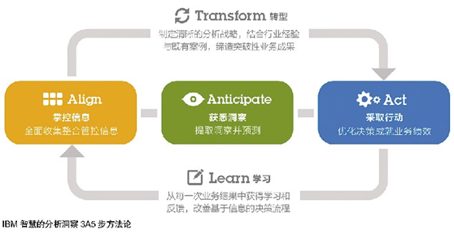

图 1 IBM 3A5步方法论

针对每一步、每一阶段，IBM都为用户提供了相应的软硬件产品和咨询服务。

　　第一步掌控信息：全面收集、整合、掌控信息。随着大数据时代的企业需求不断增加，IBM推出大数据平台、分析型数据仓库等解决方案，致力于对非结构化数据、流数据等新型数据的处理和掌控。

　　第二步获悉洞察：提取洞察并预测。自2005年开始，IBM在业务分析领域不断加大投资和收购力度。目前，IBM具有全面的分析能力，包括财务绩效管理、商业智能、预测分析、内容分析和风险分析。

　　第三步采取行动：优化决策成就业务绩效。通过将掌握的信息通过分析获取洞察，用到决策平台或决策流程中，帮助企业业务人员和企业高管等决策者实现业务绩效的优化。

　　第四步学习：从每一次业务结果中获得学习和反馈，改善基于信息的决策流程。以Watson为例，从信息证据和行动结果中进行学习，在每次迭代中获取更智慧的解决方案。

　　第五步转型：制定清晰的分析战略，结合行业经验和既有案例，缔造突破性业务成果。通过确定业务的优先级分析目标、清晰一致的策略，找到新的方法、业务创新模式;通过已经有的行业解决方案和其他客户的最佳实践，识别新的业务机会和价值。


## 1.2   常规分析方法

### 数学分析

参考： 本人另作《[数学的应用实践](../science/数学的应用实践.md)》

数据预处理：有效性、错误检测

相关系数：

回归分析: 线性规划

成分分析：

统计分析：


### 运营分析

参考： 本人另作《[运营专题](../软件工程/运营专题.md)》


### 公众舆情分析

基于全网公开发布数据、传播路径和受众群体画像，利用*语义分析*、*情感算法*和*机器学习*，分析公众对品牌形象、热点事件和公共政策的认知趋势。


**热词分析**

挖掘网络的热议词语，分析这个词语相关联的词语网络，通过词语网络筛选相应的详细舆情信息，同时可以结合用户情感及舆情媒体来源来快速定位想要查看的信息，帮助企业聚类用户反馈，提升企业形象及优化产品体验。


**舆情分析**

自定义关键词组来爬取全网的舆情信息，支持各种新闻媒体、贴吧、微信、微博、论坛站点的爬取；然后根据这些舆情内容分析关注度及情感走势、渠道分布、热门事件等。


**媒体传播路径分析**

对单条微博的传播情况进行多维度分析，完整呈现微博的传播路径、曝光及转发量，通过传播账号识别传播者的情感分析、账号类型及地域性别等。


**事件分析**

挖掘网络上的热门事件，通过事件脉络及趋势分析全观事件内容，同时挖掘出事件涉及最多的主体有哪些，分析与这些主体有关联的词语，点击关联词语，可以搜索到对应的详情舆情，分析渠道来源及情感强弱。


## 1.3  BI

详见 《[BI专题](../BI专题.md)》


## 本章参考


# 2 数据分析步骤

数据集来源 可参考 《[开放数据集说明](开放数据集说明.md)》

通用型，以 https://www.kaggle.com/marcio486/sales-data-for-a-chain-of-brazilian-stores/data 巴西连锁店销售数据为例：

1. 加载数据：如果数据量过大，可分块读取
2. 分析数据整体情况：查看数据有无缺失值，数据类型Dtype，数据统计分析基本项
3. 数据清洗：清空上一步发现的异常数据（如数值不在限定范围，重复数据），缺失数据填充

```python
import pandas
# 加载数据
data = pd.read_csv('')
# 分块读取
data = data.get_chunk(30000)
data.head()

# 查看数据有无缺失值，数据类型Dtype，数据统计分析基本项
data.isnull().sum
data.info()
data.describe()

# 清除无效数据
```

说明：上面步骤基本也是ETL过程。


# 3 典型数据分析

四大业务场景：

*  用户画像：服务于产品研发设计人员；针对业务需求；精准营销。
*  销售收入分析：
*  物流分析
*  财务分析


## 舆情分析

### 简介

在时下互联网信息的浪潮下，信息的传播速度远超我们的想象。微博里一条大V的帖子，朋友圈的一个状态更新，热门论坛的一条新闻，购物平台的购物评价，可能会产生数以万计的转发，关注，点赞。如果是一些非理性负面的评论会激发人们的负面感，甚至影响到消费者对企业品牌的认同，如果不能及时的采取正确的应对措施，会造成难以估计的损失。所以我们需要一个高效的全网舆情分析系统，帮助我们实时的观测舆情。

舆情分析包括但不限于
* 舆情的影响力诊断，从传播量级和扩散趋势来做预测，确定是否最终形成舆情。
* 传播路径分析，分析舆情传播的关键路径。
* 用户画像，对舆情的参与者提供共性特征勾勒，如性别，年龄，地域和感兴趣话题。
* 情感分析，分析新闻或者评价是正面还是负面。情感分类后进行统计聚合。
* 预警设置，我们支持舆情讨论量阈值设置，达到阈值后通知推送业务方，避免错过舆情的黄金参与时间。

 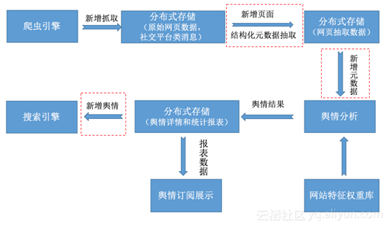


图 5 舆情分析数据流


 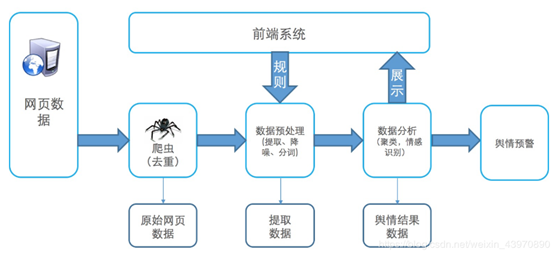

图 6  舆情系统业务流程
* 原始网页存储库，这个库需要能支持海量数据，低成本，低延时写入。网页数据写入后，要做实时结构化提取，提取出来的数据再进行降噪，分词，图片ocr处理等。对分词文本，图片进行情感识别产生舆情数据结果集。传统的离线全量计算很难满足舆情系统的时效性需求。
* 计算引擎在做数据处理时，可能还需要从存储库中获取一些元数据，例如用户信息，情感词元数据信息等。
* 除了实时的计算链路，对存量数据定期要做一些聚类，优化我们的情感词识别库，或者上游根据业务需要触发情感处理规则更新，根据新的情感打标库对存量数据做一次舆情计算。

舆情的结果数据集有不同类的使用需求。对于重大舆情，需要做实时的预警。完整的舆情结果数据展示层需要支持全文检索，灵活的属性字段组合查询。业务上可能根据属性字段中的置信度，舆情时间，或者关键词组合进行分析。

### 架构

 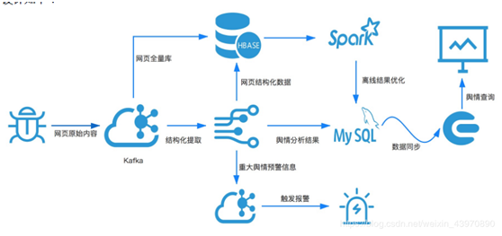

图 7 开源舆情架构图

1)     系统的最上游是分布式的爬虫引擎，根据抓取任务抓取订阅的网页原文内容。爬虫会把抓取到的网页内容实时写入Kafka队列，进入Kafka队列的数据根据前面描述的计算需求，会实时流入流计算引擎（例如Spark或者Flink），也会持久化存储在Hbase，进行全量数据的存储。全量网页的存储可以满足网页爬取去重，批量离线计算的需求。

2)     流计算会对原始网页进行结构化提取，将非结构化网页内容转化为结构数据并进行分词，例如提取出网页的标题，作者，摘要等，对正文和摘要内容进行分词。提取和分词结果会写回Hbase。结构化提取和分词后，流计算引擎会结合情感词库进行网页情感分析，判断是否有舆情产生。

3)     流计算引擎分析的舆情结果存储Mysql或者Hbase数据库中，为了方便结果集的搜索查看，需要把数据同步到一个搜索引擎例如Elasticsearch，方便进行属性字段的组合查询。如果是重大的舆情时间，需要写入Kafka队列触发舆情报警。

4)     全量的结构化数据会定期通过Spark系统进行离线计算，更新情感词库或者接受新的计算策略重新计算历史数据修正实时计算的结果。


 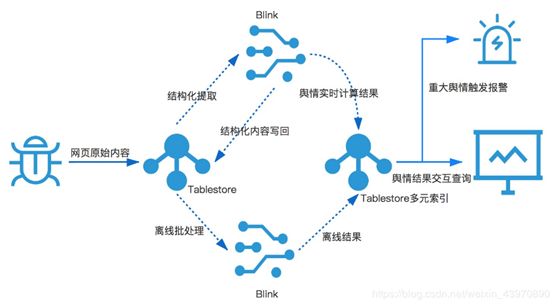

图 8 云上舆情大数据架构


## [数据冰山 - 知乎专栏](http://zhuanlan.zhihu.com/hemingke)

汽车之家

[大数据画像：宝马车主究竟有多任性？ - 数据冰山 - 知乎专栏](http://zhuanlan.zhihu.com/hemingke/20573253) 利用论坛发言的抓取以及NLP，对各种车型的车主做画像。


**天猫、京东、淘宝等电商网站**

[超越咨询顾问的算力，在用户理解和维护：大数据改变管理咨询（三） - 数据冰山 - 知乎专栏](http://zhuanlan.zhihu.com/hemingke/20583037)，抓取各大电商的评论及销量数据，对各种商品（颗粒度可到款式）沿时间序列的销量以及用户的消费场景进行分析。


**58同城的房产、安居客、Q房网、搜房等房产网站**

[下半年深圳房价将如何发展 - 数据冰山 - 知乎专栏](http://zhuanlan.zhihu.com/hemingke/20135185)，抓取房产买卖及租售信息，对热热闹闹的房价问题进行分析。


**大众点评、美团网等餐饮及消费类网站**

[黄焖鸡米饭是怎么火起来的？ - 何明科的回答](https://www.zhihu.com/question/24331936/answer/48616123)，抓取各种店面的开业情况以及用户消费和评价，了解周边变化的口味，所谓是“舌尖上的爬虫”。


**58同城等分类信息网站**

[花10万买贡茶配方，贵不贵？ - 何明科的回答](https://www.zhihu.com/question/39843548/answer/83532516)，抓取招商加盟的数据，对定价进行分析，帮助网友解惑。


**拉勾网、中华英才网等招聘网站**
 [互联网行业哪个职位比较有前途？ - 数据冰山 - 知乎专栏](http://zhuanlan.zhihu.com/hemingke/20217862)，抓取各类职位信息，分析最热门的职位以及薪水。


**挂号网等医疗信息网站**
 [如何评价挂号网？ - 何明科的回答](https://www.zhihu.com/question/25564657/answer/44862007)，抓取医生信息并于宏观情况进行交叉对比。


**应用宝等App市场**
 [你用 Python 做过什么有趣的数据挖掘/分析项目？ - 何明科的回答](https://www.zhihu.com/question/28975391/answer/82797746)，对各个App的发展情况进行跟踪及预测。（顺便吹一下牛，我们这个榜单很早就发现小红书App的快速增长趋势以及在年轻人中的极佳口碑）


**携程、去哪儿及12306等交通出行类网站**
 [你用 Python 做过什么有趣的数据挖掘/分析项目？ - 何明科的回答](https://www.zhihu.com/question/28975391/answer/82797746)，对航班及高铁等信息进行抓取，能从一个侧面反映经济是否正在走入下行通道。


**雪球等财经类网站**
 抓取雪球KOL或者高回报用户的行为，找出推荐股票


**58同城二手车、易车等汽车类网站**
 [一年当中买车的最佳时间为何时？ - 何明科的回答](https://www.zhihu.com/question/30086195/answer/47825568)和[什么品牌或者型号的二手车残值高？更保值？反之，什么类型的贬值较快？ - 二手车](https://www.zhihu.com/question/20931757)，找出最佳的买车时间以及最保值的汽车。


**神州租车、一嗨租车等租车类网站**
 抓取它们列举出来的租车信息，长期跟踪租车价格及数量等信息


**各类信托网站**
 通过抓取信托的数据，了解信托项目的类型及规模


## 本章参考

* 基于大数据的舆情分析系统架构 - 架构篇 https://blog.csdn.net/weixin_43970890/article/details/90905293
* 百亿级全网舆情分析系统存储设计 https://yq.aliyun.com/articles/265024
* [巴西连锁店销售数据分析 - 知乎 (zhihu.com)](https://zhuanlan.zhihu.com/p/183161426)


# 数据分析行业案例

相关文档 参见  《[行业业务知识.md](../软件工程/产品岗/行业业务知识.md)》

大数据发展趋势：Gartner技术成熟曲线。

大数据行业画像：[FirstMark](http://firstmarkcap.com/)

表格 行业的典型应用场景

| 行业 | 目的       | 应用场景                                                     |
| ---- | ---------- | ------------------------------------------------------------ |
| 治理 | 治理更对症 | 舆情监控、监控视频分析、群体性事件预测、宏观经济数据监控民生应用创新 |
| 交通 | 畅行更无阻 | 车流密度监控、交通拥堵疏导、公交线路优化、城市功能区划分     |
| 零售 | 营销更精准 | 推荐系统、计算广告                                           |
| 电商 |            | 打造也客户价值为核心的用户、营销、商品、流量、仓储、配送、客服等一体化分析场景。 |
| 金融 | 风控更有效 | 可以针对理财产品、客户收益、信贷管理、客户流水等场景进行分析。<br>两个时间（授信前后）、三个对象（个人、企业、市场）、新技术（金融科技、区块链BlockChain）  <br>个人：精准营销、风险定价、反欺诈  企业：风险监控、风险定位、反欺诈  市场：量化交易、财富组合管理 |
| 保险 |            | 可以做赔偿金和保险费用分析、客户分析、风险分析、产品分析等。 |
| 体育 | 竞技更具像 | 体能建模、转会评估、教学管理、战术分析                       |
| 教育 | 学习更个性 | 可以针对渠道转化漏斗的转化率、不同课程的受欢迎程度、家长的反馈以及讲师评分等进行分析。<br>三个维度（平台、内容和工具），五个对象（主管部门、校长、老师、家长和学生） |
| 医疗 | 看病更靠谱 | 互联网医疗、医疗大数据、医疗管理、医学研究。<br>可以围绕药品运营、供应链、财务、市场营销、电商渠道、生意等场景进行分析 |
| 旅游 | 服务更周全 | 三时间（旅游前中后）、四对象（主管部门、景区、商家、游客）   |
| 农业 | 案例更清晰 | 农业机械化、优化播种、精准施肥                               |
| 制造 | 流程更高效 | 围绕企业采购、生产、销售、配送、库存各场景进行分析。<br>故障诊断、产品创新、工业物联网、供应链优化 |
| 汽车 |            | 通过对车辆数据、道路数据、环境感知数据等海量信息的处理分析，<br>汽车服务商对车主进行精细化的管理，提供一站式汽车服务方案。 |


## 金融业

示例： [python 获取中国证券网的公告](https://link.zhihu.com/?target=http%3A//www.30daydo.com/article/59)


 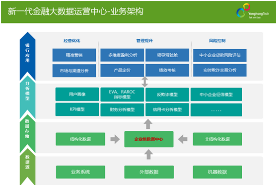

图 16 金融业业务架构

说明：考核银行盈利的传统指标包括ROE（[股权收益率](https://baike.baidu.com/item/股权收益率)）和ROA（[资产回报率](https://baike.baidu.com/item/资产回报率)），这种指标最大的缺点是没有将风险考虑在内。它们的计算公式分别为：

*  ROE=净收益/[所有者权益](https://baike.baidu.com/item/所有者权益)
*  ROA=净收益/平均资产价值

1.EVA模型：*经济增加值模型*(Economic Value Added) 是Stern Stewart咨询公司开发的一种新型的价值分析工具和业绩评价指标，EVA是基于剩余收益思想发展起来的新型价值模型。其公式为：EVA(t) = E(t) － r×C(t)－1

其中，EVA(t) 为公司在第t时间阶段创造的经济增加值大小； E(t) 为公司在t时间阶段使用该资产获得的实际收益；r 单位资产的使用成本； C(t)－1 为t时间阶段初使用的资产净值。

2. RAROC：RAROC（Risk Adjusted Return on Capital）即风险调整资本收益，是由信孚银行（Banker Trust）于20世纪70年代提出来的，RAROC其最初的目的是为了度量银行信贷资产组合的风险。

3. 精准营销：如何认识客户；客户需要的是什么；如何有效地营销和销售；如何提升客户价值和保持客户忠诚度。

 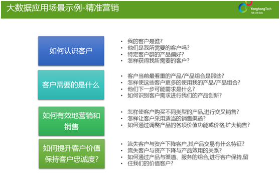

图 17 金融业-精准营销

 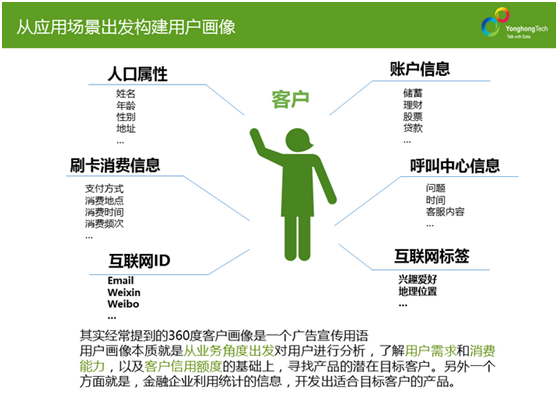

图 18 金融业-用户画像


 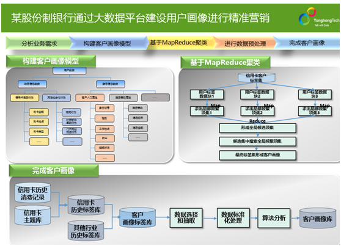

图 19 金融业-通过大数据平台建设用户画像进行精准营销


## 电商

示例：[爬取京东,亚马逊商城的数据违法吗? - 互联网](https://www.zhihu.com/question/20568741)


电商的基本流程可归纳为：需求 - 查看宝贝 - 购买 - 售后体验。

电商行业一般分为3类指标，分别是流量、交易和商品指标。

**1、流量指标（客户行为数据）**

流量指标提供了店铺整体流量的概貌，能够帮助我们了解店铺整体的流量规模、质量、结构，并了解流量的变化趋势。

**关键指标：访客数、浏览量、跳失率、平均停留时间**

表格 11 店铺流量指标详述

| **指标**         | **简介**                                       | **作用**                                 |
| ---------------- | ---------------------------------------------- | ---------------------------------------- |
| **访客数UV**     | 单位时间内访问店铺页面或商品详情页的去重人数。 | 点击率的数据必须在一定量级才有参考价值。 |
| **浏览量PV**     | 单位时间内访问店铺页面或商品详情页的次数。     | 值越大，表明内容越受欢迎。               |
| **跳失率**       | 单位时间内PV=1的访客数/总访问数                | 值越低，表明流量的质量越好               |
| **平均停留时间** | 总停留时长/访客数，单位为秒。                  | 值越大，表明内容越受欢迎。               |

**备注：单位时间通常指一天。**

1、每日uv、pv等等……

2、热区图（把用户的行为做一个简单的可视化呈现，看看哪里点的最多，活动页面下面几屏有没有热度，如果下面有想要主推的利润高的产品，要及时往上挪）

3、转化漏斗（从访问、注册、加购、下单、付款做一个漏斗，看到底哪个环节流失客户最多，有bug修bug，有流程不顺要改善）


**推广数据**

1、推广总费用，总收入，ROI

2、各渠道费用，点击量，收入，ROI（可以用分组条图或柱线图来展示各渠道的费用与收入，投入高的渠道效果不一定好，通过对比可以筛选性价比最高的推广渠道）


**2、交易指标**

交易指标提供了店铺的整体交易情况。从访客到下单到支付的交易漏斗。

**关键指标：支付金额、转化率**

表格 12 电商交易指标详述

| **指标** | **简介**                                                     | **作用**                           |
| -------- | ------------------------------------------------------------ | ---------------------------------- |
| 支付金额 | 买家拍下后支付给卖家的金额，当天购买当天申请退款的卖家未当于处理的也计算在内。 | 判断一个店铺的规模以及市场影响力。 |
| 转化率   | 即来访客户成交占比的比例。统计时间内，支付买家数/访客数      |                                    |

**备注：淘宝将店铺分为钻石、黄金、白银、青铜等不同级别，主要的参考标准就是支付金额。**

**商品方面**

1、销售数据商品方面：1、总销售额，总销量

2、热销商品top N，热销品类top N （这些是件数，也就是销量）

3、商品销售额贡献top N，品类销售额贡献 top N （这些是金额，有些大件商品）还可以看的更细一点，每件商品的利润不一样，可以算出来：

4、利润额贡献top N，品类利润额贡献 top N。——以上有助于你划分哪些商品来引流，哪些商品来促销。

5、浏览量商品最高 top N，浏览量品类最高 top N。——看看有啥商品浏览量高却卖不出去的，要调查原因是价格不好还是什么？


**客户方面**

*  总访客、新访客、新注册用户、客单价用户地域分布、用户设备来源分布（浏览器或设备）、用户渠道来源分布（访问网站、百度推广、券妈妈之类的……）
*  活动期间访问趋势（一般是个线图 横轴是时间 纵轴是访问量 多线图还可以加一根销售额）


**3、商品指标**

**商品指标分析了与商品相关的浏览访客加购偏好异常商品等。**

关键指标：加购件数、商品收藏次数、异常商品数

表格 13电商商品指标详述

| **指标**     | **简介**                                         | **作用**                                 |
| ------------ | ------------------------------------------------ | ---------------------------------------- |
| 加购件数     | 统计时间内，访客将商品加入购物车的商品件数总和。 | 代表了消费者对产品的偏好度               |
| 商品收藏次数 | 统计时间内，商品被访客收藏的总次数               | 权重次于加购件数，一定程度上代表了人气。 |
| 异常商品数   | 出现各种异常导致的商品去重数。                   | 对于爆款影响很大，需要监控。             |


市场数据一般可做：行业分析、产品演变、子类目市场分析、商品属性分析、人群定位及价格定位分析、竞争对手分析、全店诊断分析、新老客户行为分析、买家分析、广告效果分析、库存分析。


### 示例：2017.11.11（购物节）

### 示例：2018.6.18（年中销售节）

#### 广告数据

拓端数据显示，5月30日至6月6日期间，消费者讨论最多的关键词、声量第一的是”天猫“，天猫以声量数12275位居618关键词搜索榜首。而在618的网络声量中，天猫的相关讨论均占据了40%以上内容。

”天猫618掀价格战：大家电比京东贵我就赔！“内容的转发，从媒体源数据对比中可见，此话题在微信的传播速度稍快于微博。


#### 销售数据

据星图统计数字显示，在6.1-6.18日整个促销期内，全网47家电商（包括综合性电商及垂直类电商），实现的总销售额为2844.7亿元。按照销售额排名的话，前五名分别是京东、天猫、拼多多、苏宁和唯品会。

从华为商城的促销数据来看，618当天的销售额约是平常日的5倍左右，销售日过后恢复平常状态。


**1.平台热销产品**

京东：累计下单额为1592亿。

天猫：

苏宁：持续稳居海尔、美的、海信、西门子、格力等品牌最大渠道。超市、母婴等迎来爆发，雀巢奶粉、泰国金枕头榴莲、雪花啤酒等闯入单品订单排行榜前十名。


**2.类品：手机品牌**

销量

京东：小米、荣耀、苹果、华为、360、锤子、魅族、OPPO、努比亚、vivo。

天猫：小米、苹果、荣耀、华为、魅族、vivo、OPPO、三星、中兴和酷系。

苏宁：小米、荣耀、魅族、华为、OPPO。


销售额

京东：苹果、荣耀、小米、华为、OPPO。

天猫：苹果、小米、荣耀、华为、vivo、魅族、三星、OPPO、美图和努比亚。

苏宁：苹果、荣耀、小米、华为、三星。

小米创始人雷军晒出的战绩显示，6月1日至18日，小米手机夺得天猫、京东、苏宁三大平台手机销量第一。


### 本节参考

[1]. 电商运营如何做数据分析？ https://www.zhihu.com/question/47393031/answer/260229398

[2]. 【618数据】全网47家电商总销售额2844.7亿元 京东618排第一 [www.yangqiu.cn/i100ec/4132192.html](http://www.yangqiu.cn/i100ec/4132192.html)

[3]. 【大数据部落】618电商大数据分析报告  [www.sohu.com/a/151327831_826434](http://www.sohu.com/a/151327831_826434)


## 零售业

零售业包括了采购--库存--销售的流程。

零售业的核心问题：

1）如何快速地把商品卖出去

2）要卖哪些商品，需要进多少货。


1. 体系化的思路。

对于线下零售，可以有商品、店铺、顾客、员工，中间是财务。

业绩指标分成零售、金额、数量、交易笔数、客流类、平均单价、折扣率等等


## 制造业

**库存分析**

库存分析关键指标：库存天数、库销比


四类八大案例如下:

1.改善制造业的生产流程

*  案例1：某生物医药公司产能因素分析
*  案例2: 芜湖格力生产效率分析

2.定制产品设计

*  案例3：某大型制造公司精益生产
*  案例4：红领服装定制

3.更好的质量保证

*  案例5：因特尔芯片测试
*  案例6：芜湖格力生产线监控

4.理解用户需求

*  案例7：美的，改善产品设计打造爆款产品

5.市场竞争分析

*  案例8 海尔零售市场分析


## 社交网站

社交之**知乎**

[知乎社交网络分析（上）：基本统计](http://link.zhihu.com/?target=http%3A//www.jianshu.com/p/60ffb949113f)
 [知乎社交网络分析（下）：关注网络](http://link.zhihu.com/?target=http%3A//www.jianshu.com/p/3b2a1895a12d)

[带逛传万世 因有我参与 - 挖掘知乎里有趣的东西 - 知乎专栏](http://zhuanlan.zhihu.com/grapeot/20597170)
 [你们最爱的知乎头像 - 挖掘知乎里有趣的东西 - 知乎专栏](http://zhuanlan.zhihu.com/grapeot/20562686)
 [头像带逛 - 挖掘知乎里有趣的东西 - 知乎专栏](http://zhuanlan.zhihu.com/grapeot/20555637)

[沧海横流，看行业起伏（2015年） - 数据冰山 - 知乎专栏](http://zhuanlan.zhihu.com/hemingke/20559922)

[知乎用户信息爬虫（规模化爬取）](https://link.zhihu.com/?target=http%3A//aljun.me/post/22)

[知乎用户图谱（用户数据分析）](https://link.zhihu.com/?target=http%3A//aljun.me/post/23)

[python爬虫 推送知乎文章到kindle电子书](https://link.zhihu.com/?target=http%3A//30daydo.com/article/7)

[编辑推荐 - 发现](https://www.zhihu.com/explore/recommendations)


**其它社交**

[如何利用爬虫爬微信公众号的内容？ - 移动互联网](https://www.zhihu.com/question/31285583)

[风向标-微信公众账号和文章的导航及推荐](https://link.zhihu.com/?target=http%3A//www.fxbiao.net/)

[陌陌](https://link.zhihu.com/?target=http%3A//www.apptool.com.cn/index.php/home/apprank/apprank/id/48)

[Python自定义豆瓣电影种类，排行，点评的爬取与存储](https://link.zhihu.com/?target=http%3A//blog.csdn.net/mrlevo520/article/details/51966992)

[基于python豆瓣自定义电影抓取](https://link.zhihu.com/?target=http%3A//download.csdn.net/detail/mrlevo520/9581491)

根据情绪预测股市[http://battleofthequants.net/wp-content/uploads/2013/03/2010-10-15_JOCS_Twitter_Mood.pdf](http://link.zhihu.com/?target=http%3A//battleofthequants.net/wp-content/uploads/2013/03/2010-10-15_JOCS_Twitter_Mood.pdf)


## 其它

**生活**

**MMUbee Android:** [MMUbee - Android Apps on Google Play](https://link.zhihu.com/?target=https%3A//play.google.com/store/apps/details%3Fid%3Dmy.zh.mmubee%26hl%3Den)


**招聘网站**

* [爬下拉勾网数据进行分析--傅sir的个人主页|Alan_fu's Blog|程序设计](http://link.zhihu.com/?target=http%3A//fualan.com/article/44/)


**其它**：

* [apptool，应用工具，app排名查询，app排名优化，app排名，应用市场排名](https://link.zhihu.com/?target=http%3A//www.apptool.com.cn/index.php/home/)一条数据狗的上海房价研究 https://zhuanlan.zhihu.com/p/20827121
* 全球网络设备 [zoomeye.org/statistic/device](https://link.zhihu.com/?target=http%3A//www.zoomeye.org/statistic/device)
* 全球 Web 服务 [zoomeye.org/statistic/w](https://link.zhihu.com/?target=http%3A//www.zoomeye.org/statistic/web)eb
* [你是怎样利用互联网赚到自己的第一桶金的？ - 知乎用户的回答](http://www.zhihu.com/question/28278308/answer/40654262)


## 本章参考

* 制造业大数据如何创造高价值生产 ——五大场景八大案例深度解析 https://ask.hellobi.com/blog/yonghongtech/6735

* 新一代银行大数据运营中心解决方案 https://ask.hellobi.com/blog/yonghongtech/3775

* 永洪BI-仪表盘DEMO  http://public.yonghongtech.com/bi/?au_act=login&adminv=demo&passv=Yonghong123


# 数据挖掘案例

## 大数据挖掘案例列表

表格 11 大数据挖掘案例列表

| 案例名称                           | 背景与挖掘目标                                       | 数据获取                                                   | 数据预处理                                                   | 模型构建                                        | 模型检验                      | 模型应用                             |
| ---------------------------------- | ---------------------------------------------------- | ---------------------------------------------------------- | ------------------------------------------------------------ | ----------------------------------------------- | ----------------------------- | ------------------------------------ |
| 电力窃漏电用户自动识别             | 目标：自动检查、判断用户是否存在漏电行为。           | 营销系统获取用户数据；电力计量自动化系统获取实时用电数据。 | 异常值~拉氏插值。  指标：电量趋势下降指标、线损率、告警类指标 | LM神经网络或  DT决策树                          | 分类结果的混淆矩阵。  ROC曲线 |                                      |
| 航空公司客户价值分析               | 客户分类；  比较客户价值；客户个性化服务。           | 客户基本信息；乘机信息；积分信息。                         | 航空公司LRFMC模型或RFM模型。                                 | K中心聚类                                       |                               | 会员升级与保级；首次兑换；交叉销售。 |
| 中医证型关联规则挖掘               | 挖掘患者症状与中医证型之间的关联关系。               | 问卷调查。                                                 | 证型系数；数据离散化                                         | 关联规则                                        |                               |                                      |
| 基于水色图像的水质评价             | 基于计算机视觉，以专家经验为基础，水质分级判别。     | 采集图像。图像特征：颜色                                   | 图像切割和颜色矩特征提取。  颜色直方图。                     | SVM                                             |                               |                                      |
| 家电电器用户行为分析与事件识别     | 识别用户                                             | 热水器采集                                                 | 属性构造（4类属性指标：时长、频率、用水的量化、用水的波动）  | 神经网络                                        |                               |                                      |
| 应用系统负载分析与磁盘容量预测     |                                                      | CPU/内存/磁盘使用信息                                      |                                                              | 平衡性检验、白噪声检验、模型识别                | 检验残差序列是否为白噪声      | 容量预测                             |
| 电子商务网站用户行为分析及服务推荐 | 用户访问推荐                                         | 用户访问日志                                               |                                                              | 推荐系统（协同过滤CF）                          |                               |                                      |
| 财政收入影响因素分析及预测模型     | 识别影响财务收入的关键特征                           |                                                            | 相关系数矩阵                                                 | 回归；神经网络                                  |                               | 灰色预测                             |
| 基于基站定位数据的商圈分析         | 对基站分群；  对商圈分群。                           | 移动运营商提供的接口数据                                   |                                                              | 谱系聚类                                        |                               |                                      |
| 电商产品评论数据情感分析           | 分析某产品的用户情感倾向。从评论中挖掘出产品优劣点。 | 某产品的文本评论数据                                       | 文本去重；文本机械压缩去词；短句删除；文本分词。             | 神经网络语言模型NNLM；语义网络分析；LDA主题模型 |                               |                                      |
|                                    |                                                      |                                                            |                                                              |                                                 |                               |                                      |
| 案例名称                           | 背景与挖掘目标                                       | 数据获取                                                   | 数据预处理                                                   | 模型构建                                        | 模型检验                      | 模型应用                             |

备注：

1. ROC：受试者工作特征曲线 （receiver operating characteristic curve，简称ROC曲线），又称为[感受性](https://baike.baidu.com/item/感受性)曲线（sensitivity curve）。以假阳性概率（False positive rate）为[横轴](https://baike.baidu.com/item/横轴)，击中概率为纵轴所组成的坐标图，和被试在特定刺激条件下由于采用不同的判断标准得出的不同结果画出的曲线。在ROC曲线上，最靠近坐标图左上方的点为敏感性和特异性均较高的临界值。曲线下面积越大越准确。

2. 航空公司LRFMC模型：用来识别客户价值的五个指标。统计时间段为观察窗口时间，一般单位为月。

| 模型  | L                                      | R                    | F        | M          | C                                |
| ----- | -------------------------------------- | -------------------- | -------- | ---------- | -------------------------------- |
| LRFMC | *会员入会时间***距观察窗口结束的月数** | 客户最近一次坐飞机-- | 飞行次数 | 总飞行里程 | 乘坐舱位所对应的*平均折扣系数*。 |

3. 图像特征包括颜色、纹理、形状和空间关系特征等等。颜色特征主要包括颜色直方图和颜色矩方法。一幅图像的色彩分布也可认为是一种概率分布，因此图像可以用其各阶矩来表示。对于一幅RGB颜色空间的图像，具有R/G/B三个颜色通道，9个分量。

* 颜色直方图反应的是图像中颜色的组成分布。
* 颜色矩包括各个颜色通道的一、二、三阶矩。一阶颜色矩采用一阶原点矩，反映图像的整体明暗程度；二阶颜色矩采用二阶中心矩的平方根，反映图像颜色的分布范围；三阶颜色矩采用三阶中心矩的立方根，反映图像颜色分布的对称性。


## 本章参考

* 大数据公司挖掘数据价值的49个典型案例 https://mp.weixin.qq.com/s/OiiHUaD44gOXd2l6u-bzoQ
* 数据指标体系建立和应用步骤探讨 https://mp.weixin.qq.com/s/w_ludLpKyG2P5J8TGAeVjw


# 参考资料

**书籍**
* 《Python数据分析与挖掘实战》 [张良均](https://book.douban.com/search/张良均) / [王路](https://book.douban.com/search/王路) / [谭立云](https://book.douban.com/search/谭立云) / [苏剑林](https://book.douban.com/search/苏剑林) 机械工业出版社 2016-1 9787111521235
* 《Storm分布式实时计算模式》吉奥兹 (P.Taylor Goetz)、奥尼尔机械工业出版社 / 2015-1-1
* 《Storm实时数据处理》（澳）Quinton Anderson / 卢誉声 / 机械工业出版社 / 2014-6
* 《Hadoop技术内幕 : 深入解析MapReduce架构设计与实现原理》 董西成 / 机械工业出版社 / 2013-5
* 《Hadoop技术内幕 : 深入解析Hadoop Common和HDFS架构设计与实现原理》 蔡斌、陈湘萍 / 机械工业出版社 / 2013-4


**网站**
* [数据冰山](https://zhuanlan.zhihu.com/hemingke)-知乎专栏  https://zhuanlan.zhihu.com/p/20217862
* IT桔子 http://www.itjuzi.com
* FirstMark   http://firstmarkcap.com


**参考链接**

* 有哪些网站用爬虫爬取能得到很有价值的数据？https://www.zhihu.com/question/36132174

* 能利用爬虫技术做到哪些很酷很有趣很有用的事情 https://www.zhihu.com/question/27621722
* 深入对比数据科学工具箱：Python3 和 R 之争[2020版]  https://segmentfault.com/a/1190000021653567


# 附录

## 主要大数据分析商

备注：咨询师报告里的Q1-Q4（Quarter，季度），H1-H2（Half year，上半年/下半年），E（预测）

表格  大数据分析商列表

| 网站                                      | 简介                                                         | 提供数据内容                                                 | 备注                                                  |
| ----------------------------------------- | ------------------------------------------------------------ | ------------------------------------------------------------ | ----------------------------------------------------- |
| [alexa](http://www.alexa.com/)            | Alexa是一家专门发布网站世界排名的网站。以搜索引擎起家的Alexa创建于1996年4月（美国），目的是让互联网网友在分享虚拟世界资源的同时，更多地参与互联网资源的组织。1999年，被亚马逊公司以约价值两亿五千万美元的股票买下。 | 查看网站流量及排名                                           | 需要安装alexa工具栏才会被计入流量，欧美比较流行准确。 |
| 百度：[百度指数](http://index.baidu.com/) | [百度指数](http://baike.baidu.com/view/1235.htm)是以百度海量[网民](http://baike.baidu.com/view/7657.htm)行为数据为基础的数据分享平台，是当前互联网乃至整个数据时代最重要的统计分析平台之一，自发布之日便成为众多企业营销决策的重要依据。<BR>百度指数能够告诉用户：某个关键词在百度的搜索规模有多大，一段时间内的涨跌态势以及相关的新闻舆论变化，关注这些词的网民是什么样的，分布在哪里，同时还搜了哪些相关的  词，帮助用户优化数字营销活动方案。  <br>截至2014年，[百度指数](http://baike.baidu.com/view/1235.htm)的主要功能模块有：基于单个词的趋势研究（包含整体趋势、PC趋势还有移动趋势）、需求图谱、舆情管家、人群画像；基于行业的整体趋势、地域分布、人群属性、搜索时间特征。 | 百度统计、  百度指数、  百度搜索风云榜  基于搜索引擎的查询词趋势研究。 | 适合作关键词热度分析、竞品挖掘、目标人群画像等        |
| 谷歌                                      |                                                              | Google Analytics、  DoubleClick Ad Planner  Google Trends    |                                                       |
| [艾瑞咨询](http://www.iresearch.com.cn/)  | iResearch*艾瑞咨询*成立于2002年,由杨伟庆发起创立, 是最早涉及互联网研究的第三方机构，致力成为中国大数据时代下最佳互联网收视率及消费者洞察公司。 | 互联网大数据研究。                                           |                                                       |
| [易观分析](http://www.analysys.cn)        | *易观*国际成立于2000年,是中国信息化、互联网和新媒体以及电信运营行业规模最大的基于互联网的高科技智囊机构。 | 移动互联网大数据分析                                         |                                                       |
| [新榜](http://www.newrank.cn/)            | 新榜定位于内容创业服务平台，用以衡量传播价值、品牌价值、投资价值的新榜指数，已经成为中国移动互联网内容价值标准。  中国最早提供微信公众号内容数据价值评估的第三方机构。 | 评估内容价值，包括微信、微博、网红。                         | 适合作微信公众号流量分析                              |
| QuestMobile                               | QuestMobile(贵士移动) 专注于移动互联网数据研究，创建于2014年。创始人原易观国际员工。 |                                                              |                                                       |
| 友盟                                      | 移动互联网                                                   | APP统计                                                      |                                                       |
| [Gartner](https://www.gartner.com/)       | 创建于1979年，全球最早和最权威的IT研究与顾问咨询公司。       | 研究范围覆盖全部IT产业                                       |                                                       |
| [IDC](https://www.idc.com/)               |                                                              | PC调查数据                                                   |                                                       |
| Compete                                   |                                                              |                                                              |                                                       |
| [Wind](http://www.wind.com.cn/)           | 中国大陆领先的金融数据、信息和软件服务企业，总部位于[上海](https://baike.baidu.com/item/上海)[陆家嘴金融中心](https://baike.baidu.com/item/陆家嘴金融中心)。<br>Wind已建成国内完整、准确的以金融证券数据为核心一流的大型金融工程和财经数据仓库。 | 资讯是[中国大陆](https://baike.baidu.com/item/中国大陆/5944925)金融数据、信息和[软件](https://baike.baidu.com/item/软件)服务企业. |                                                       |

备注：1. IDC和Gartner是国际最具知名度的两家专业的IT研究与顾问咨询公司。


### IDC

https://www.idc.com/

国际数据公司是[国际数据集团](https://baike.baidu.com/item/国际数据集团/10563111)旗下全资子公司，全称是International Data Corporation。国际数据公司（IDC）是全球著名的信息技术、电信行业和消费科技咨询、顾问和活动服务专业提供商。成立于1964年，IDC在全球拥有超过1100名分析师，为110多个国家的技术和行业发展机遇提供全球化、区域化和本地化的专业视角及服务。IDC的分析和洞察助力IT专业人士、业务主管和投资机构制定基于事实的技术决策，以实现关键业务目标。IDC于1986年正式在中国设立分支机构，是最早进入中国市场的全球著名的科技市场研究机构。在中国，IDC分析师专注于本地ICT市场研究，与本地市场高度结合，研究领域覆盖硬件、软件、服务、互联网、各类新兴技术以及企业数字化转型等方面。


### Gartner

https://www.gartner.com/

Gartner Group公司成立于1979年，它是第一家信息技术研究和分析的公司。2017年Gartner 26亿美元收购CEB拓展商业调研服务。

Gartner (高德纳，又译顾能公司，NYSE: IT and ITB)全球最具权威的IT研究与顾问咨询公司，成立于1979年，总部设在美国康涅狄克州斯坦福。其研究范围覆盖全部IT产业，就IT的研究、发展、评估、应用、市场等领域，为客户提供客观、公正的论证报告及市场调研报告，协助客户进行市场分析、技术选择、项目论证、投资决策。为决策者在投资风险和管理、营销策略、发展方向等重大问题上提供重要咨询建议，帮助决策者作出正确抉择。

Gartner由四大部分组成，旨在向客户提供在促进高效使用IT方面所需的全面的研究与咨询服务，这些部分包括：

1、Gartner Research & Advisory Services(Gartner研究与咨询服务)

2、Gartner Consulting(Gartner咨询)

3、Gartner Measurement(Gartner评测)

4、Gartner Community(Gartner社区)


#### 魔力象限(Magic Quadrant)

**二个维度**：执行力Execute、远见性Vision

**作用**：主要用来选择卖家vendor。对于有意向找一家能满足自身需求的公司的投资者以及力图在市场中PK掉竞争者且可获得优势的企业来说，魔力象限研究报告用处极大。

案例1：国外很多客户选择供应商时，只考虑出现在魔力四象限的企业。

案例2：华为用魔力四象限来衡量自己的国际化战略。通用存储-华为在2010-2011进入到特定领域象限，2013-2015进入到挑战者象限；2016~进入到领导者象限。


​     魔力象限是在某一特定时间内的对市场情况进行的图形化描述。 魔力象限(Magic Quadrant)由Gartner公司于2006年9月25日取得“魔力象限”注册版权，并可以在获得许可的情况下重复使用。它根据Gartner公司的定义，它描述了Gartner公司依据标准对该市场内的厂商所进行的分析。

​     与单纯的给出统计数字或者列表为公司排名不同，魔力象限使用二维模型去阐释公司间的实力及差异。魔力象限基于公司发展前景的完备性和执行能力，将构成竞争的公司分成四个不同的部分。

* 利基型企业：特定领域者（Niche Players）。公司发展前景的完备性和执行能力方面都得低分的公司也许占有一定的市场份额，但还是比不上规模大一些的厂商。这些公司通常关注功能性或其他特定领域，要么就是新成立的公司。
* 有远见者：了解市场动态并且有潜力进行创新，但也许尚缺乏执行这些的能力。虽然这是早期市场中的企业标准，但是在较为成熟的市场中，有远见者则常常要么是设法实现的小企业，要么是不想按常理出牌的大厂商。
* 挑战者：执行能力高，但缺少强劲的发展势头。挑战者往往是大型一点的成熟厂商并且不愿打破其当前的发展计划。随着公司的发展他们完全有实力成为行业领袖。
* 行业领袖：公司发展前景的完备性和执行能力方面均得高分的行业领袖往往是大型的成熟公司、拥有大量客户群并且在市场上知名度极高。行业领袖在市场中有巨大的拉力，甚至有实力影响市场的整体发展方向。


 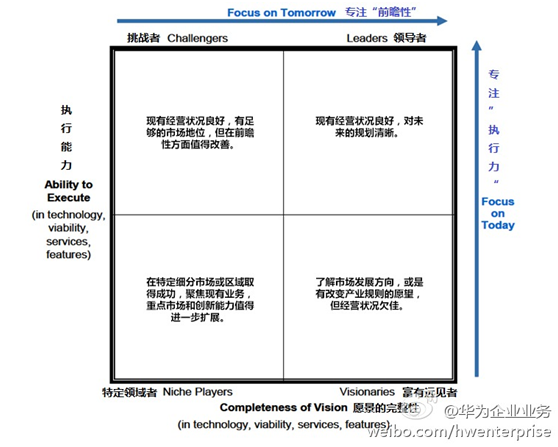

图  Gartner魔力四象限（Magic Quadrant）

备注：尽管似乎行业领袖类别中的公司总是首选，Gartner还是建议用户对所有象限进行一一检测，因为每类的企业都有其值得注意的独一无二的强项和弱项。同时更应注意到，魔力象限设计之初是为了减少厂商搜索，并不是为用户选择厂商而指明道路的。

 

图  魔力四象限示例： 2012年BI市场


#### Gartner的技术成熟曲线

技术成熟度曲线（The Hype Cycle），又称技术循环曲线，光环曲线，炒作周期，指的是企业用来评估新科技的可见度，利用时间轴与市面上的可见度(媒体曝光度)决定要不要采用新科技的一种工具。

1995年开始，高德纳咨询公司依其专业分析预测与推论各种新科技的成熟演变速度及要达到成熟所需的时间，分成5个阶段：

* 科技诞生的促动期 (Technology Trigger)：在此阶段，随着媒体大肆的报道过度，非理性的渲染，产品的知名度无所不在，然而随着这个科技的缺点、问题、限制出现，失败的案例大于成功的案例，例如:.com公司 1998~2000年之间的非理性疯狂飙升期。
* 过高期望的峰值（Peak of Inflated Expectations）：早期公众的过分关注演绎出了一系列成功的故事——当然同时也有众多失败的例子。对于失败，有些公司采取了补救措施，而大部分却无动于衷。
* 泡沫化的底谷期 (Trough of Disillusionment)：在历经前面阶段所存活的科技经过多方扎实有重点的试验，而对此科技的适用范围及限制是以客观的并实际的了解，成功并能存活的经营模式逐渐成长。
* 稳步爬升的光明期 (Slope of Enlightenment)：在此阶段，有一新科技的诞生，在市面上受到主要媒体与业界高度的注意，例如:1996年的Internet ，Web。
* 实质生产的高峰期 (Plateau of Productivity)：在此阶段，新科技产生的利益与潜力被市场实际接受，实质支援此经营模式的工具、方法论经过数代的演进，进入了非常成熟的阶段

 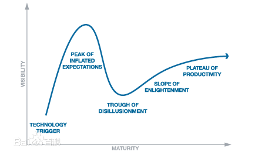

 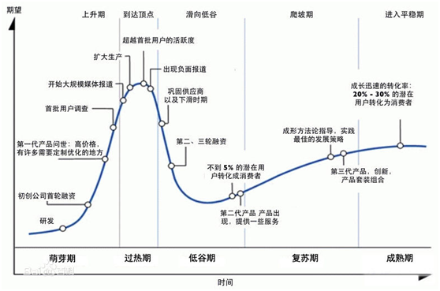

图  Gartner技术成熟度曲线

