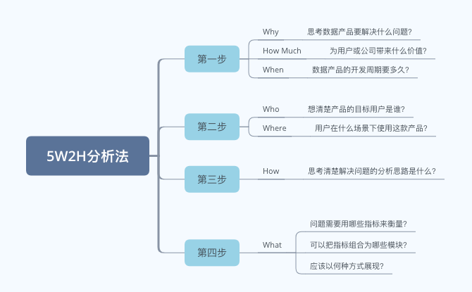
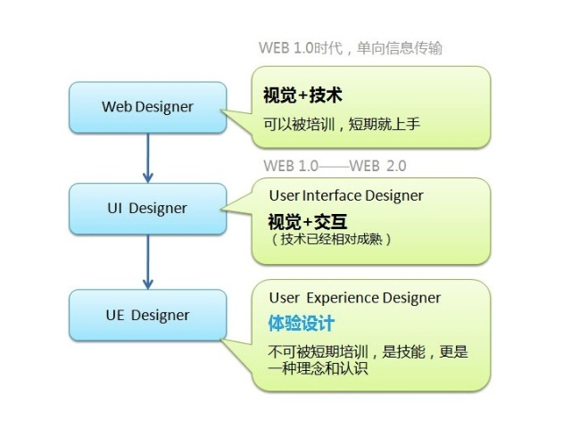
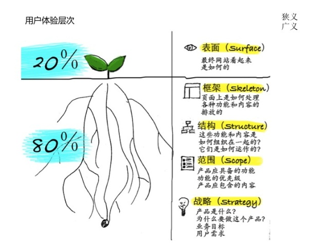
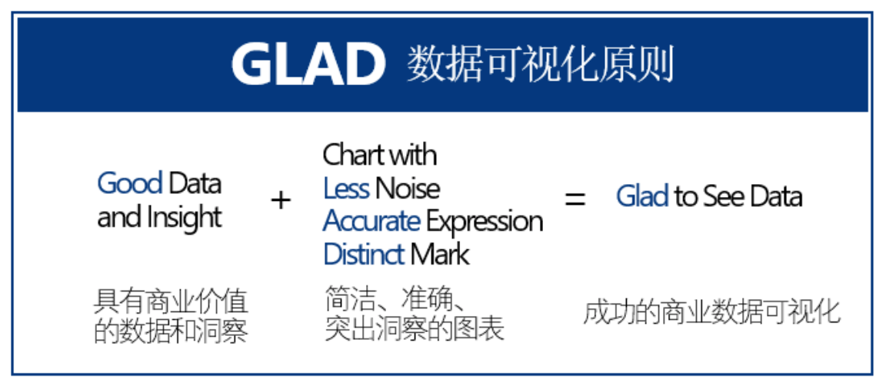
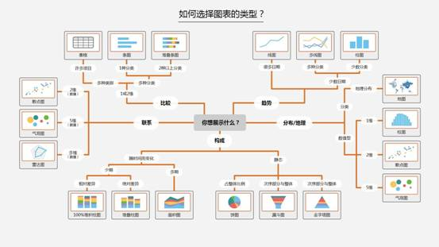
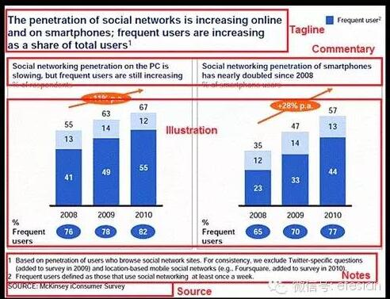

| 序号 | 修改时间  | 修改内容 | 修改人 | 审稿人 |
| ---- | --------- | -------- | ------ | ------ |
| 1    | 2018-8-28 | 创建     | Keefe |        |
| 2 | 2021-11-24 | 增加图形语法、视觉设计、可视化评分标准章节。 | 同上 |        |


---

[TOC]


---

# 1  数据可视化理论

## 1.1 方法论

数据可视化的目的就是呈现问题、能给出解决问题的方向和思路，好的数据可视化都是从问题出发，答案结束，尽可能的让每一个图表都具有灵魂。


**数据可视化4步工作法**

分析逻辑：明确应用场景 -- 确定框架结构 -- 确定指标、维度 -- 校核明细数据

图形语言：  面 --   线、点  --  各类图元类型


**5W2H分析法**

参见 《运营专题》相关章节




上的问题思路归结到报表可视化中，即可以总结为以下流程：

`分析问题 -> 确定目标用户和使用场景 -> 确定分析思路 --> 确定指针 --> 确定可视化蓝图 --> 开发模板 --> 使用报表`


## 1.2  设计

### 设计心理学

* 格式塔心理学，完形心理学。格式塔原理注重整体的统一。
* 形状心理学：不同形状有特定含义。
* 颜色心理学：不同颜色有特定含义。


#### 格式塔心理学(Gestalt)

格式塔心理学（Gestalt Psychology），又叫完形心理学，是西方现代心理学的主要学派之一，诞生于德国1912年，后来在美国得到进一步发展。该学派既反对美国构造主义心理学的元素主义，也反对行为主义心理学的刺激—反应公式，主张研究直接经验（即意识）和行为，强调经验和行为的整体性，认为整体不等于并且大于部分之和，主张以整体的动力结构观来研究心理现象。该学派的创始人是[韦特海默](https://baike.baidu.com/item/韦特海默/4025307)，代表人物还有[苛勒](https://baike.baidu.com/item/苛勒/4025357)和[考夫卡](https://baike.baidu.com/item/考夫卡)。

格式塔心理学是由德国心理学家组成的研究小组试图解释人类视觉的工作原理。他们观察了许多重要的视觉现象并对它们编订了目录。其中最基础的发现是人类视觉是整体的：我们的视觉系统自动对视觉输入构建结构，并在神经系统层面上感知整体和统一的形状、图形和物体，而不是只看到互不相连的边、线和区域。“形状”和“图形”在德语中是Gestalt，因此这些理论也称做视觉感知的格式塔原理。

格式塔心理学感知理论最基本的法则是简单精练法则，倾向于将事物理解为一个整体，而不是分割成部分。所以格式塔法则又称为完图法则。


**格式塔原理**(Gestalt)是设计心理学里具备纲领性和指导性的设计法则，我们非常熟悉的设计4原则「对齐、重复、对比、亲密」其实就是格式塔原理的另一种总结。

<u>七大原理</u>：接近性原理；相似性原理；连续性原理；封闭性原理；对称性原理；主体/背景原理；共同命运原理。

备注：在现实世界的视觉场景中，各种格式塔原理并不是孤立的，而是共同起作用，在工作中用每一条原理来考量各个设计元素之间的关系是否符合设计初衷。

1、接近性原理（注：强调的是位置）

接近性原理说的是物体之间的相对距离会影响我们感知它是否以及如何组织在一起。互相靠近（相对于其它物体）的物体看起来属于一组，而那些距离较远的则自动划为组外。

2、相似性原理（注：强调的是内容）

如果其它因素相同，那么相似的物体看起来归属于一组。

3、连续性原理

视觉倾向于感知连续的形式而不是离散的碎片。


4、封闭性原理

视觉系统自动尝试将敞开的图形关闭起来，从而将其感知为完整的物体而不是分散的碎片。

5、对称性原理

我们倾向于分解复杂的场景来降低复杂度。


6、主体/背景原理

我们的大脑将视觉区域分为主体和背景。主体包括一个场景中占据我们主要注意力的所有元素，其余则是背景。

7、共同命运

与接近性、相似永生原理相关，都影响我们感知的物体是否成组。指出一起运动的物体被感知为属于一组或者是彼此相关的。


#### 形状心理学

人们的潜意识对不同的形状也有不同的反应：

- 圆形、椭圆形：传达积极的信息，通常与社区或关系有关；
- 正方形、三角形：传达强烈的信息，通常与强度和稳定性有关；
- 垂直线：表示强度或力量。
- 水平线：表示平静、相等或安静。


#### **色彩心理学**

色彩心理透过视觉开始，从知觉、感情而到记忆、思想、意志、象征等，其反应与变化是极为复杂的。色彩的应用，很重视这种因果关系，即由对色彩的经验积累而变成对色彩的心理规范，当受到什么刺激后能产生什么反应，都是色彩心理所要探讨的内容。

心理颜色视觉上的六种基本感觉，是红、黄、绿、蓝加上白和黑。

表格   心理颜色释读与穿搭适合场合

| 颜色     | 解读                                                         | 穿搭适合场合                                                 | 关键词   |
| -------- | ------------------------------------------------------------ | ------------------------------------------------------------ | -------- |
| 黑色     | 象征酷炫、威望、高雅、低调、创意；也意味着执着、隐藏、防御，端视服饰的款式与风格而定。 | 黑色为大多数主管或白领专业人士所喜爱，当你需要极度威望、表现专业、展现品味、不想引人注目或想专心处理事情时，例如高级主管的日常穿著、主持演示文稿、在公开场合演讲、写企划案、创作、从事跟“美”、“设计”有关的工作时，可以穿黑色。 | 权威专业 |
| 灰色     | 象征诚恳、沉稳、考究。其中的铁灰、炭灰、暗灰，在无形中散发出智能、成功、强烈威望等强烈讯息；中灰与淡灰色则带有哲学家的沉静。当灰色服饰质感不佳时，整个人看起来会黯淡无光、没精神，甚至造成邋遢、不干净的错觉。 | 灰色在威望中带着精确，特别受金融业人士喜爱；当你需要表现智能、成功、威望、诚恳、认真、沉稳等场合时，可穿著灰色衣服现身。 | 权威精确 |
| 白色     | 象征纯洁、神圣、善良、信任与开放；但身上白色面积太大，会给人疏离、梦幻的感觉。 | 当你需要赢得做事干净俐落的信任感时可穿白色上衣，像基本款的白衬衫就是粉领族的必备单品。 | <br>信任 |
| 海军蓝   | 象征威望、保守、专业、中规中矩与务实。穿著海军蓝时，配色的技巧如果没有拿捏好，会给人呆板、没创意、缺乏趣味的印象。 | 海军蓝适合强调一板一眼具执行力的专业人士。希望别人认真听你说话、表现专业威望时，不妨也穿深蓝色单品，例如：参加商务会议、记者会、提案演示文稿、到企业文化较保守的公司面试、或讲演严肃或传统主题时。 | 执行力   |
| 咖啡色系 | 典雅中蕴含安定、沉静、平和、亲切等意象，给人情绪稳定、容易相处的感觉。没有搭配好的话，会让人感到沉闷、单调、老气、缺乏活力。 | 当需要表现友善亲切时可以穿棕褐、咖啡色系的服饰，例如：参加部门会议或午餐汇报时、募款时、做问卷调查时。当不想招摇或引人注目时褐色、棕色、咖啡色系也是很好的选择。 | 友善亲切 |
| 红色     | 红色象征轰轰烈烈、热情、性感、威望、自信，是个能量充沛的色彩--全然的自我、全然的自信、全然的要别人注意你。不过有时候会给人血腥、暴力、忌妒、控制的印象，容易造成心理压力，因此与人谈判或协商时则不宜穿红色；预期有火爆场面时，也请避免穿红色。 | 当你想要在大型场合中展现自信与威望的时候，可以让红色单品助你一臂之力。 | 自信威望 |
| 粉红色   | 粉红象征温柔、甜美、浪漫、没有压力，可以软化攻击、安抚浮躁。比粉红色更深一点的桃红色则象征着女性化的热情，比起粉红色的浪漫，桃红色是更为洒脱、大方的色彩。在需要威望的场合，不宜穿大面积的粉红色，并且需要与其它较具威望感的色彩做搭配。而桃红色的艳丽则很容易把人淹没，也不宜大面积使用。 | 当你要和女性谈公事、提案，或者需要源源不绝的创意时、安慰别人时、从事咨询工作时，粉红色都是很好的选择。 | 温柔     |
| 橙色     | 橙色富于母爱或大姐姐的热心特质、给人亲切、坦率、开朗、健康的感觉；介于橙色和粉红色之间的粉橘色，则是浪漫中带着成熟的色彩，让人感到安适、放心，但若是搭配不好，便显得俗气。 | 橙色是从事社会服务工作时，特别是需要阳光般的温情时最适合的色彩之一。 | 阳光     |
| 黄色     | 黄色是极其温暖的颜色，能刺激大脑中与焦虑有关的区域，具有警告的效果，所以雨具、雨衣多半是黄色。艳黄色象征信心、聪明、希望；淡黄色显得天真、浪漫、娇嫩。提醒你，艳黄色有不稳定、招摇，甚至挑衅的味道，不适合在任何可能引起冲突的场合如谈判场合穿著。 | 黄色适合在任何快乐的场合穿著，譬如生日会、同学会；也适合在希望引起人注意时穿著。 | 欢快     |
| 绿色     | 绿色给人无限的安全感受，在人际关系的协调上可扮演重要的角色。绿色象征自由和平、新鲜舒适；黄绿色给人清新、有活力、快乐的感受；明度较低的草绿、墨绿、橄榄绿则给人沉稳、知性的印象。绿色的负面意义，暗示了隐藏、被动，不小心就会穿出没有创意、出世的感觉，在团体中容易失去参与感，所以在搭配上需要其它色彩来调和。 | 绿色是参加任何环保、动物保育活动、休闲活动时很适合的颜色，也很适合做心灵沉潜时穿著。 | 安全     |
| 蓝色     | 蓝色是灵性知性兼具的色彩，在色彩心理学的测试中发现几乎没有人对蓝色反感。明亮的天空蓝，象征希望、理想、独立；深蓝，意味着诚实、信赖与威望。正蓝、宝蓝在热情中带着坚定与智能；淡蓝、粉蓝可以让自己、也让对方完全放松。蓝色在美术设计上，是应用度最广的颜色；在穿著上，同样也是最没有禁忌的颜色，只要是适合你“皮肤色彩属性”的蓝色，并且搭配得宜，都可以放心穿著。 | 想要使心情平静时、需要思考时、与人谈判或协商时、想要对方听你讲话时可穿蓝色。 | 知性     |
| 紫色     | 紫色是优雅、浪漫、梦幻、清爽。紫色的光频最高。淡紫色的浪漫，不同于粉红小女孩式的，而是像隔着一层薄纱，带有高冷、孤傲的感觉；而亮紫色、艳紫色则是魅力十足、有点狂野又难以探测的华丽浪漫。若时、地、人不对，穿著紫色可能会造成高傲、矫揉造作、轻佻的错觉。 | 当你想要与众不同，或想要表现浪漫中带着冷傲感的时候可以穿紫色服饰。 | 浪漫冷傲 |

心理学家认为，人的第一感觉就是视觉，而对视觉影响最大的则是色彩。人的行为之所以受到色彩的影响，是因人的行为很多时候容易受情绪的支配。颜色源于大自然的先天的色彩，蓝色的天空、鲜红的血液、金色的太阳……看到这些与大自然先天的色彩一样的颜色，自然就会联想到与这些自然物相关的感觉体验，这是最原始的影响。这也可能是不同地域、不同国度和民族、不同性格的人对一些颜色具有共同感觉体验的原因。


### 视觉设计

视觉理论 详见 《[计算机视觉](./AI/计算机视觉.md)》颜色模型章节


**布局**

分清数据间的主次关系，根据数据主次关系确认布局。

- [驾驶舱布局](https://help.fanruan.com/dvg/doc-view-24.html)    分清主、次、辅。主居中显示，次两侧显示，辅助分析的内容通过钻取和轮播展示。
- [多级分析页面布局](https://help.fanruan.com/dvg/doc-view-12.html)   通常为“总 - 分 -分”的结构，多维度地展示数据的全貌，帮助阅读者发现当前问题。
- BI分析报表  二栏，左栏分析方法说明、公式和结论；右栏分析内容说明和图表。
- [移动端布局](https://help.fanruan.com/dvg/doc-view-9.html)   横向TAB导航 + 页面布局（折叠、列表式...）。

布局注意事项有间距相等，合理留白。


**展示类型**

* **大屏**：是以大屏幕为载体进行可视化展示的统称。大屏的终极目标是通过大屏幕的可视化，帮助用户洞悉业务数据，在脑海中高效处理信息、快速做出应答。按应用场景可分为物联网大屏和展示分析大屏两大类。大屏需要专门采购硬件，布局需要特别设计（大屏有些专用图表），背景、特效都需要特别设置。
* **驾驶舱**：驾驶舱的展示大多有一个特定的主题或是分类。从战略的角度而言，自上而下大致归纳为三种：战略型、分析型和操作型驾驶舱。驾驶舱也可以从不同角度多维度分析如角色、行业和场景。
  * 战略型：作用主要是让使用者快速掌握企业的运营情况，并据此快速做出决策，对过去做出总结或是对未来拟定战略性目标。这里的运营情况主要是过去已经发生的事。因此战略型的驾驶舱<u>不需要实时</u>的数据展示，只是对关键任务信息的简洁视觉显示，这些简洁而直观的信息有助于管理人员迅速实现决策和定位和诊断出不良运营存在的问题。战略型驾驶舱，能够帮管理者随时同步汇报结果，从而让部门和企业在正确的方向上朝着目标努力。
  * 分析型：作用主要是让管理者不仅可以看到到表层的信息，还可以深入探究表层现象发生的原因。通过钻取联动过滤等操作，从现象出发，沿着数据的脉络去寻找原因。比如销售业绩为什么下降，回款时间长的原因又是什么。分析型驾驶舱更多的是落实战略到战术执行层面的中层管理人员服务，这部分需要更多体现的是问题直接显性化，优先级排序，关联直接采取行动的方式推进。
  * 操作型：强调持续、实时的信息汇报。所以对数据的时效性比较高。操作型驾驶舱，用于监控每日进度和产出，以保证预期计划和实际达成业绩的相符，也就是保证战略目标分解到每一天的完成度（daily check），这样的驾驶舱，提供了有关信息，让我们能够在小问题演变成棘手的大风险之前，及时解决并有助于递增地提高业绩。操作型驾驶舱需要从业务需求出发，实现业务操作的提醒、监控和预警功能。
* **仪表板**：Dashboard，也叫看板、仪表盘。目标是条理性，让用户理解数据观点。布局可以简单标准化。交互较多。

表格 大屏和仪表板比较

| 比较项   |               大屏               |             仪表板             |
| :------- | :------------------------------: | :----------------------------: |
| 对象     |   群体，领导层、公众、全体员工   |    个体，领导个体、个体员工    |
| 目标     |    冲击感，让用户产生深刻印象    |   条理性，让用户理解数据观点   |
| 场景     |        监控、专题、领导等        | 业务KPI、用户分析、营销增长等  |
| 方式     |             物理大屏             |           电脑、手机           |
| 频率     |                低                |               高               |
| 地点     |               固定               |             不固定             |
| 共享     |            所有人共享            |       按角色甚至个人定制       |
| 布局     |   复杂，考虑尺寸、效果、拼缝等   |        简单，相对标准化        |
| 风格     |               炫酷               |              简洁              |
| 色彩     |   深色系背景图，色彩多，渐变多   | 浅色系纯色背景，色彩少，无渐变 |
| 图表     | 定制化强，象形图多，需设计师参与 | 标准化强，使用线饼柱等常规图表 |
| 3D图表   |               较多               |              较少              |
| 操作交互 |             无或较少             |  较多，需要筛选、切换、下钻等  |
| 动态效果 |            动态效果多            |           基本静态图           |
| 数据更新 |       定时自动更新、清缓存       |          手动刷新更新          |
| 设计重点 |        效果优先，指标辅助        |       指标优先，图表辅助       |
| 硬件要求 |    高性能、独立显卡的高配电脑    |    普通配置的电脑、手机即可    |
| 变更成本 |                高                |               低               |


**配色**

在使用颜色的时候可以遵循以下的配色一致性原则：

* 指标数值一致性
* 语义颜色一致性：参考日常颜色的实际含义，如红绿灯、股市。红色危险，橙色预警，绿色正常。
* 指标颜色一致性
* 色系颜色一致性


### 交互设计

**术语名词：**

- UI：User Interface
- UE:	User Experience 用户体验
- UCD: User Center Design	用户为中心的设计


**产品框架设计理论-用户体验五要素**

产品框架基于用户体验五要素：战略层、范围层、结构层、框架层、表现层，来进行制定。


**产品框架设计理论-7（±2）信息块效应**

人类头脑最好的状态能记忆含有7±2项信息块，在记忆了5-9项信息后人类的头脑就开始出错。假如你的短时记忆像一般人那样，你可能会回忆出5~9个单位，即7±2个，这个有趣的现象就是神奇的7±2效应。这个规律最早是在19世纪中叶，由爱尔兰哲学家威廉汉密尔顿观察到的。


**产品框架设计理论-卡片分类法**

卡片分类法是一种规划和设计互联网产品或者软件产品的信息构架的方法。它属于用户研究中的一种方法，简单来说就是用户来对信息卡片（或者是菜单卡片）进行归类，从而得出信息关联性的一种方法。我们最后把关联性更强的菜单放在一起，就形成了较为科学的一套信息分组。


**交互设计的历史**：网页设计 ->  UI  -> UED



图 交互设计的历史


**用户体验的层次**



图 用户体验的层次


**UED**的组成：

视觉设计 + 交互设计 + 用户研究 + 前端开发 + 文案撰写


交互设计的一些准则

- **最少移动原则**, 费茨法则（Fitts’ Law，1954）是一则人机交互法则。它阐述了：快速移动到目标的时间是离目标距离与目标大小的函数。目标距离愈远，目标面积愈小，则移动到目标的耗时愈久。 费茨法则适用于手或手指进行实体触摸或显示器上用指针虚拟指向。
- **漏斗法则**: 尽量减少操作步骤和界面跳转，每增加一个操作步骤或者界面切换，就有可能流失10％的用户。
- **过度设计**的判定：设计路径坏死；功能堆积与复杂；功能重复与冗余；


**移动设备的交互设计**

广义的手势

1. 利用鼠标、光标的轨迹模拟手势
2. 在物理硬件上的手势: android有4个缺省键HOME, return, menu, search.
3. 在触摸屏上的手势: 主要有长按Press、轻触Tap、滑动Flick、拖动Drag、旋转spin、~~缩放~~、摇动spread这八种手势。点击Tap/Click, 双击Double Click.
4. 远距离体感: 通过摄像头，传感器等捕捉手甚至整个身体的姿势，来进行控制。
5. 未来手势：利用全息投影以及传感器，在空间或者投影上直接操作。


常见的一些设计：

- 控件的隐藏设计
- 顺畅的返回及导航设计
- 轻巧的移位与重叠设计


**Android的交互设计**

- 布局  ：Screen  box
- 意图动作
  1. 单击，长按，拖拽，pinch……
- 意图对象
  1. 物理按键，menu，置于屏幕对象，状态栏
- 反馈
- 导航
- 其它


## 1.3 图形语法

法国制图师 Jacques Bertin 在研究了大量的图表案例之后，发表了可视化图表设计与制图的奠基之作《the Semiology of Graphics》。

图表作为数据可视化的重要载体，各类统计图表的描述和绘制，有着非常坚实的理论基础，而且是数学描述的形式化系统，这就是图形语法《The Grammar of Graphics》的内容。这本书非常好地体现了“思维抽象”。

**基本结构**

Wilkinson 认为图形构造分为三个步骤，规范定义（Specification）、组装（Assembly）和显示（Display）。

规范定义描述了如何将不同的图形对象“翻译”为形式化语言，由六部分组成：

- **Data：数据**，从数据集中创建变量的数据操作
- **Trans：转换**，数据变量之间的转换，例如排序
- **Scale：标度**，标度转换，例如 log 转换
- **Coord：坐标**，定义坐标系统，例如极坐标
- **Element：图形**，及其视觉属性，例如点图和颜色
- **Guide：参考**，图形对象间的比较、分类和对齐等，例如图例

组装则是根据规范定义绘制出画面，需要处理几何、布局、美学属性等等问题。

展示则是指具体的显示枚举，如屏幕、纸张、视频等等，虽然我们现在大部分场景下是在计算机相关的平台上展示。由此看来，规范定义是整个图形语法的基础。


**视觉编码**

Specification 中关于 Element 图形的描述，其实在 1967 年已经有学者研究过了。Bertin 在 《Semiology of Graphics》一书中定量地阐述了图形符号与信息之间的对应关系，奠定了可视化编码的理论基础。Bertin 认为视觉编码由两部组成，**视觉标记**（Visual Marks）和用于控制标记视觉特征的**视觉通道**。

* 视觉标记：图形符号有点、线、面三种。

* 视觉通道则分为位置变量和视觉变量（Visual Variables）。位置变量1种，视觉变量6种。
  * 位置变量包括二维平面上 *x* 和 *y* 位置，
  * 视觉变量则包括尺寸 *size_、明度 _value_、纹理 _texture_、颜色 _color_、方向 _orientation* 和形状 _shape_。


**实现**

图形语法目前已经有了不少的实现，如开头提到的 ggplot2、vega、Bokeh、G2 等等。图形语法严格来说是一种思想，并不是一个真正意义上的实现标准，所以这些实现并不能互相兼容，有些实现为了兼顾实际的使用场景，也没有完全遵循图形语法的原始定义。


## 1.4 可视化评分标准

马世权老师在「乐见数据：商业数据可视化思维」里提出，一个成功的商业数据可视化要满足两要素：

- 提供足够的商业价值
- 帮助读者快速理解信息

那什么是好的商业数据可视化图表？

答案：符合 GLAD 原则的图表。



图 GLAD 数据可视化原则

说明：GLAD: Good Less Accurate Distinct.  **Good** Data and Insight +  Chart with **Less** Noise **Accurate** Express, **Distinct** Mark = Glad to See Data

| 项目 | 中文含义                       | 思考问题                                               | 评分标准                                                     | 不恰当问题举例                                               |
| ---- | ------------------------------ | ------------------------------------------------------ | ------------------------------------------------------------ | ------------------------------------------------------------ |
| G    | 图表的灵魂：发现好数据与好洞察 | 数据是否恰当                                           | 如类别和度量使用恰当，得1分                                  | 类别的不恰当使用: 类别不符合MECE原则，有重叠、有遗漏；分类不均匀 <br>度量指标的不恰当使用: 绝对值指标与相对值指标混淆；时间段指标与时间点指标混淆 |
|      |                                | 洞察在哪个层次                                         | 描述型分析：1分 <br/>诊断／预测型分析：2分 <br/>指导型分析：3分 |                                                              |
| L    | 降噪：简约至上                 | 特效／颜色／字体是否有明显「噪声」                     | 如无明显噪声，得1分                                          |                                                              |
|      |                                | 辅助信息（文字／标签／图例／标尺等）是否有明显「噪声」 | 如无明显噪声，得1分                                          |                                                              |
| A    | 精准表达：提升数据表达的准确度 | 图形元素的精确度是否过低                               | 如图形元素选择准确，得1分                                    |                                                              |
|      |                                | 数据密度是否合适                                       | 如数据密度合适，得1分                                        | 过低会造成图表的丰富度不够，没有回答读者的问题 <br/>过高会导致负载过重，读者无法理解图表想要传达的信息 |
|      |                                | 数据显示效果是否准确                                   | 如显示效果准确，读者不必做算术题，得1分                      |                                                              |
| D    | 画龙点睛：突出洞察信息的标识   | 是否有突出洞察的标识                                   | 如洞察信息做明显突出区分，得1分                              |                                                              |


## 本章参考

* 以Apple Music为例，为你解读格式塔7大法则 https://www.uisdc.com/apple-music-example-gestalt-7-law
* 交互七大定律之格式塔原理 https://www.jianshu.com/p/85db79592a9e

* 百度百科-格式塔心理学 https://baike.baidu.com/item/格式塔心理学
* [色彩心理学（色彩心理学理论）_百度百科 (baidu.com)](https://baike.baidu.com/item/色彩心理学/1171402)
* 超全面！交互设计的基础方法和理论总结（上） https://www.uisdc.com/ux-basic-method-theory-summary-1

* 数据可视化图形语法简史 https://my.oschina.net/kener/blog/1620513
* 从图形语法理解各类图表库 https://segmentfault.com/a/1190000037751886
* [聊下图形语法“The Grammar of Graphics”](https://link.segmentfault.com/?enc=n7lTzPigGMUTRZhW7Ln9rg%3D%3D.tAq08%2BrH6Rz54ENE1IoltC5ISfcnxWGweVHf2eFPNA0IvAfkbba8WkdsiA5cthFW)
* [大屏设计](https://help.fanruan.com/dvg/doc-view-106.html#)
* [移动端布局](https://help.fanruan.com/dvg/doc-view-9.html)
* 交互设计实用指南 http://ued.taobao.com/blog/category/ixd_guide/
* 移动设备手势设计初探 http://cdc.tencent.com/?p=4226
* 交互设计那些事儿 http://www.chinaz.com/manage/2011/1009/212786_2.shtml
* 手机产品交互设计原则 http://ucdchina.com/snap/7059


# 2  数据类型

##  2.1 地理信息

狭义的地理编码是指将地址或地名描述转换为地球表面上相应位置的功能，比如北京这个地名，它被地理编码后的经纬度坐标为（东经116°20′、北纬39°56′），其逆向地理编码是将坐标（东经116°20′、北纬39°56′）转化为北京这个地名。广义的地理编码应包含二进制、文本、矢量、图像等多种形式表示的地物实体到位置坐标的转换。

地理编码不仅有字符集编码的技术特征，更有位置编码的特征。


**GNSS 全球导航卫星系统**

GNSS的全称是：Global Navigation Satellite System。它是所有在轨工作的卫星导航定位系统的总称包括GPS、俄罗斯的GLONASS、欧盟的Galileo和中国的COMPASS（北斗）。


### 坐标系

**坐标术语**

SRS：spatial reference system 空间参考系统

CRS：coordinate reference system 坐标参考系统

GCS（Geographic Coordinate Systems）：地理坐标系统

GEOCCS：地心坐标系统

GEOGCS：地理坐标系统

PROJCS：投影坐标系统


表格 各种坐标系比较

| 地标系名        | 简介                                                 | 备注                                                         |
| --------------- | ---------------------------------------------------- | ------------------------------------------------------------ |
| **WGS-84**      | World Geodetic System，地心坐标系，GPS原始坐标体系。 | 坐标原点为地球质心，其地心空间直角坐标系的Z轴指向国际时间局（BIH）1984.0定义的协议地极（CTP）方向，X轴指向BIH1984.0的协议子午面和CTP赤道的交点，Y轴与Z轴、X轴垂直构成右手坐标系，称为1984年世界大地坐标系。这是一个国际协议地球参考系统（ITRS），是目前国际上统一采用的大地坐标系。GPS广播星历是以WGS-84坐标系为根据的。 |
| WGS84 Web墨卡托 | 2005年谷歌在谷歌地图中首次使用的。                   | 属于投影坐标系。如今主流的Web地图几乎都是使用的Web墨卡托，如国外的 Google Maps，OpenStreetMap，Bing Map，ArcGIS 和 Heremaps 等，国内的百度地图、高德地图、腾讯地图和天地图等也是基于Web墨卡托。 |
| **GCJ-02**      | GCJ-国测局，国测局坐标，火星坐标系。                 | 国测局02年发布的坐标体系，它是一种对经纬度数据的加密算法，即加入随机的偏差。加密后的坐标也常被大家称为“火星坐标系统”。 |
| CGCS2000        | China Geodetic Coordinate System，中国大地坐标系     | 2000国家大地坐标系是全球地心坐标系在我国的具体体现，其原点为包括海洋和大气的整个地球的质量中心。<br>天地图使用了CGCS2000。 |
| BD-09           | 百度坐标系                                           | 百度中国地图所采用的坐标系，由GCJ-02进行进一步的偏移算法得到。 |

备注：1. 中国使用过的坐标系有：北京54坐标系，西安80坐标系。如今CGCS2000已成为新的国家标准。

2. 互联网地图在国内必须至少使用GCJ-02进行首次加密，不允许直接使用WGS-84坐标下的地理数据，同时任何坐标系均不可转换为WGS-84坐标。国内几个地图服务商的坐标系基本上延用GCJ-02或基于GCJ-02进行进一步的偏移算法得到。GCJ-02偏移的如百度、搜狗和图吧，GCJ-02直接使用的如高德。


表格 各地图服务商比较

| 地国     | 坐标系                          | 中国/外国                                | 引入方式                                         |
| -------- | ------------------------------- | ---------------------------------------- | ------------------------------------------------ |
| 高德地图 | 国内GCJ02                       | 目前只支持国内                           | 除了本身的freamework包之外还需引入多个系统类库。 |
| 百度     | 国内BMK09LL和BMK09MC，国外WGS84 | 全球。国内外看到的数据一致。             | 同上                                             |
| 苹果     | 国内GCJ02，国外WGS84            | 全球。国外没限制，国内不可看国外数据。   | 只需引入2个系统类库，CoreLocation和Mapkit        |
| 谷歌     | WGS84                           | 全球。但国内目前无法使用SDK，只能使用WEB |                                                  |
| Mapbox   | WGS84                           | 全球。但国内访问略慢。                   | 只需引入一个Mapbox.framework类库即可。           |

备注：


### 国家及城市代码

ISO3316为标准国家及城市代码，如 [ISO-3166-2:CN](https://en.wikipedia.org/wiki/ISO_3166-2:CN)为中国省份代码，(e.g. `CN-91` -> `CN-HK`)  已经支持用2个字母替代2个数字，但仍兼容数字。

国家代码(Country codes, cc)支持以下四种类型，

* ccn:  国家代码数值
* cca2: 国家代码2个字母
* cca3: 国家代码3个字母
* name:  使用英文简称，如cn是中国。


### 空间数据编码语言

空间数据编码语言有 WKT、GML、GeoJSON等，用于空间信息数据的存储、表达与交换等。

国际组织有 开放式地理信息系统协会OGC (Open GIS Consortium)、ISO等。 OGC由许多私人公司、政府机构、学术团体咨询机构组成的一个国际性会员组织，致力于地理空间数据与地理处理标准的开发，其首要任务是建立一个开放式的地理数据互操作规范。

| 编码格式 | 英文全名                   | 制定组织或维护者                | 简介                                                         |
| -------- | -------------------------- | ------------------------------- | ------------------------------------------------------------ |
| WKT      | Well-known text            | OGC                             | 空间数据ASCII文本表示语言，用于表示矢量几何对象、空间参照系统及空间参照系统之间的转换。 |
| WKB      | Well-known binary          | OGC                             | 空间数据的binary二进制表示语言，解决了WKT表达方式冗余的问题，便于传输和在数据库中存储相同的信息。 |
| GML      | Geographic Markup Language | OGC                             | XML（标准通用标记语言的子集）格式，用来表达地理信息要素。它提供一个表达地理信息要素的语言模型，同时可以用来在Internet上进行数据交换，由xml扩展而来。 |
| GeoJSON  |                            |                                 | GeoJSON对象可以表示几何、特征或者特征集合。                  |
| TopoJSON |                            | D3作者Mike Bostock              | GeoJSON 按拓扑学编码后的扩展形式。TopoJSON 中的每一个几何体都是通过将共享边（被称为arcs）整合后组成的。TopoJSON 拓扑表示共享一个称为弧的位置序列的一个或多个几何。因此，其文件比GeoJSON小。 |
| KML      | Keyhole Markup Language    | Google 旗下Keyhole 公司 --> OGC | 一种基于XML 的标记语言，利用XML语法格式描述地理空间数据(如点、线、面、多边形和模型等)，适合网络环境下的地理信息协作与共享。<br>2008 年4月，KML的最新版本2.2 被OGC 宣布为开放地理信息编码标准，并改由OGC 维护和发展。 |


**GeoJSON**

GeoJSON是一种对各种地理数据结构进行编码的格式，基于Javascript对象表示法(JavaScript Object Notation, 简称JSON)的地理空间信息数据交换格式。GeoJSON对象可以表示几何、特征或者特征集合。GeoJSON支持下面几何类型：Point（点）、LineString（线）、Polygon（面）、多点、多线、多面和几何集合。

GeoJSON里的特征包含一个几何对象和其他属性，特征集合表示一系列特征。一个完整的GeoJSON数据结构总是一个（JSON术语里的）对象。

- GeoJSON对象可能有任何数目成员（名/值对）。
- GeoJSON对象必须有一个名字为"type"的成员。这个成员的值是由GeoJSON对象的类型所确定的字符串。不同的`type`会有不同的`coordinates`值。
- type成员的值必须是下面之一："Point", "MultiPoint", "LineString", "MultiLineString", "Polygon", "MultiPolygon", "GeometryCollection", "Feature", 或者 "FeatureCollection"。
- GeoJSON对象可能有一个可选的"crs"成员，它的值必须是一个坐标参考系统的对象。
- GeoJSON对象可能有一个"bbox"成员，它的值必须是边界框数组。

中国国家地图geojson文件示例：

```json
{
	"type": "FeatureCollection",
	"crs": {
		"type": "name",
		"properties": {
			"name": "urn:ogc:def:crs:OGC:1.3:CRS84"
		}
	},
	"features": [
		{
			"type": "Feature",
			"properties": {
				"ISO": "CN-65",
				"NAME_1": "新疆"	# 修改此处
			},
			"geometry": {
				"type": "Polygon",
				"coordinates": [[
                    [77.88313195800004,35.431068420000048],...]
                ]]
             }
		}
	]     
}
```


##  2.2 社交网络数据


##  2.3 文本数据

词频：词云wordCloud

词向量：Term Vector，用来计算文档相似性


##  2.4 多媒体数据

###  2.5.1 图像


###  2.5.2 音频


###  2.5.3 视频


## 本章参考

* 常用坐标系汇总 https://blog.csdn.net/idomyway/article/details/86312312?utm_medium=distribute.pc_relevant.none-task-blog-2~default~baidujs_title~default-1.no_search_link&spm=1001.2101.3001.4242.2
* 百度百科geojson  https://baike.baidu.com/item/GeoJson
* 编码与解码:从计算机字符编码到地理信息编码 https://blog.csdn.net/lijie45655/article/details/81188104


# 3  图表类型

## 3.1  图表简史

数据可视化的目的在于用图形化的手段，清晰有效地传达和沟通信息。常言道“一图胜千言”，原因就在于人能迅速获取和高效解读视觉信息。数据可视化的领域很广，历史也非常悠久。我们熟知的统计图表，譬如柱状图、折线图、饼图等，早在18世纪就已面世了。

| 时间         | 图表             | 说明                                                         |
| ------------ | ---------------- | ------------------------------------------------------------ |
| 18世纪       | 线、面、柱、饼图 | William Playfair 发明。                                      |
| 19世纪50年代 | 玫瑰图           | 南丁格尔19世纪50年代绘制的“玫瑰图”。                         |
| 1861         | 拿破仑东征       | 法国工程师 Charles Joseph Minard 1861年绘制的“拿破仑东征”    |
| ...          |                  |                                                              |
| 1990s        |                  | 在GPL 开发过程中，Leland Wilkinson 编写了《*The* *Grammar* *of* *Graphics*》一书，形式化的描述了*图形语法*的设计和实现。 |


## 3.2 图表类型选择




图 1 如何选择图表的类型


表格 图表类型选择

| 分类      | 图表            | 特性                                                         | 应用场景                                                     |
| --------- | --------------- | ------------------------------------------------------------ | ------------------------------------------------------------ |
| 构成      |                 | 包括时序相关的和静态的。时序相关的如：堆叠面积/柱形。静态的如屏饼状、漏斗和金字塔图。 |                                                              |
|           | 饼状图          | 显示各项的大小与各项总和的比例。适用简单的占比比例图，在不要求数据精细的情况适用。 | 单维度的占比分析                                             |
|           | 金字塔          |                                                              |                                                              |
|           | 漏斗            | 优势:在网站分析中，通常用于转化率比较，它不仅能展示用户从进入网站到实现购买的最终转化率，还可以展示每个步骤的转化率，能够直观地发现和说明问题所在。  <br>劣势:单一漏斗图无法评价网站某个关键流程中各步骤转化率的好坏。 | 适用于业务流程多的流程分析，显示各流程的转化率。             |
|           | 面积图          | 延伸图表：堆积面积图、百分比堆积面积图，堆积图可以显示部分与整体之间（或者几个数据变量之间）的关系。 | 强调数量随时间而变化的程度，也可用于引起人们对总值趋势的注意。 |
| 联系      |                 | 维度从二维、五维到多维                                       |                                                              |
|           | 散点图          | 二维或三维。散点图适用于三维数据集，但其中只有两维需要比较。 |                                                              |
|           | 气泡图          | 三或四维，其中只有两维能精确辨识。                           |                                                              |
|           | 雷达图          | 多维。适用于多维数据（四维以上），且每个维度必须可以排序，数据点一般不超过6个。 | 了解公司各项数据指标的变动情形及其好坏趋向。                 |
|           | 词云图          | 优势：很酷炫、很直观的图表。  <br>劣势：使用场景单一，一般用来做词频。 | 显示词频，可以用来做一些用户画像、用户标签的工作。           |
| 趋势/比较 |                 |                                                              |                                                              |
|           | 柱状图/  条形图 | 适合中小规模的二维数据集，但只需比较一个维度。肉眼对柱子高低敏感。  延伸图表：堆积、百分比堆积柱状图 | 用于显示一段时间内的数据变化或显示各项之间的比较情况。       |
|           | 折线图          | 适合二维的大数据集，还适合多个二维数据集的比较。             | 适合数据走势分析                                             |
|           | 指标卡          | 很直观告诉看图者数据的最终结果。只是单一的数据展示。         | 显示某个数据结果&同环比数据。                                |
| 地图      |                 | 适用于有空间位置的数据集。BDP支持地址转经纬度功能，可制作行政地图（面积图）、行政地图（气泡图）、热力地图、轨迹地图等6种经纬度地图。 |                                                              |
|           | 中国地图        | 可以展示全国数据分布，也可以展示区县数据分布。               | **用户地域分析**                                             |
|           | 国家地图        |                                                              |                                                              |
| 双轴图    |                 | 柱状图+折线图的结合                                          | 数据走势、数据同环比对比                                     |
| 其它      |                 |                                                              |                                                              |
|           | 子弹图          |                                                              | **分析多个数据指标的完成进度**                               |
|           | 色块图          | 作用于二维数据的热力图，由小色块代表某个维度的值。特别适合用于数据量较大、且具有连续性的数据进行分析 |                                                              |
|           | 计量图          | 类似进度条，表达效果很明确，数据场景比较单一。               | 一般用来显示项目的完成进度。                                 |
|           | 瀑布图          | 优势：展示两个数据点之间的演变过程，还可以展示数据是如何累计的。  劣势：没有柱状图、条形图的使用场景多。 | 采用绝对值与相对值结合的方式                                 |
|           | 桑基图          | 特定类型的流程图                                             |                                                              |
|           | 旭日图          | 分层看数据很直观，逐层下钻看数据。                           | 可以表达清晰的层级和归属关系                                 |

备注：地图GIS信息有国际标准。


表格  图元的维度

| 基本图元    | 第1维度  | 第2维度 | 第3维度  | 第r维度      | 第5维度      |
| ----------- | -------- | ------- | -------- | ------------ | ------------ |
| 树形图      | 面积大小 | 颜色    |          |              |              |
| 饼状图/条形 | 扇面大小 |         |          |              |              |
| 折线图      | X轴      | Y轴     | 次坐标轴 | 颜色         |              |
| 面积图      | X轴      | Y轴     | 次坐标轴 | 颜色         |              |
| 柱形图      | X轴      | Y轴     | 次坐标轴 | 颜色         | 宽窄         |
| 散点图      | X轴      | Y轴     | 大小     | 颜色         | （符号）形状 |
| 填充地图    | 坐标位置 | 颜色    |          |              |              |
| 符号地图    | 坐标位置 | 大小    | 颜色     | （符号）形状 |              |
| 雷达图      | 高低     | 颜色    |          |              |              |
| 股份图      | X轴      | Y轴     | 颜色     |              |              |

备注：维度次序是按照重要性排列。


**相对关系**

| 相对关系 |             定义             |                  示例                  |
| :------: | :--------------------------: | :------------------------------------: |
| 时间趋势 | 业务指标随着时间的推移而变化 |       销售额在 5 年内的增长情况        |
| 频率分布 |    同一指标的不同维度分析    |         某公司人员的年龄段分布         |
|  相关性  |     某两个指标之间的关系     |          工资的涨幅与工龄无关          |
| 排名对比 |     对不同的对象进行排名     | A 区域在 8 月的销售额远超其他 5 个区域 |
|   占比   |    个体在整体中占有的比例    |  A 类业务的收入在整个公司中占据了 50%  |


从相对关系到最适合你的信息的图表形式。

|   相对关系   |      **图表**      |             定义             |                  示例                  |
| :----------: | :----------------: | :--------------------------: | :------------------------------------: |
|     占比     |      **饼图**      |    个体在整体中占有的比例    |  A 类业务的收入在整个公司中占据了 50%  |
|   排名对比   |     **条形图**     |     对不同的对象进行排名     | A 区域在 8 月的销售额远超其他 5 个区域 |
|   时间趋势   | **折线图，柱形图** | 业务指标随着时间的推移而变化 |       销售额在 5 年内的增长情况        |
|   频率分布   | **折线图，柱形图** |    同一指标的不同维度分析    |         某公司人员的年龄段分布         |
|    相关性    | **散点图，条形图** |     某两个指标之间的关系     |          工资的涨幅与工龄无关          |
| 位置（补充） |        地图        |  以位置分布关系进行类别对比  |                                        |


### 大屏图表

一般情况下，大屏使用的图表类型中**柱形图&条形图>=饼图&圆环图>=折线图&面积图>仪表盘类>=地图类>雷达图>词云=漏斗图>……**

| **常用程度** | **图表分类**  | **细分类型或变体**                    | **帮助文档**                                                 | **推荐指数** |
| ------------ | ------------- | ------------------------------------- | ------------------------------------------------------------ | ------------ |
| 一梯队       | 柱形图&条形图 | 普通柱形图                            | https://help.fanruan.com/finereport/doc-view-1400.html       | ☆☆☆☆☆        |
|              |               | 特殊形状柱形图                        | https://help.fanruan.com/finereport/doc-view-3776.html       | ☆☆☆          |
|              |               | 普通条形图                            | https://help.fanruan.com/finereport/doc-view-3361.html       | ☆☆☆☆         |
|              |               | 轮播条形图                            | https://help.fanruan.com/finereport/doc-view-3836.html       | ☆☆☆          |
|              |               | 自定义形状条形图                      | https://help.fanruan.com/finereport/doc-view-1293.html       | ☆☆☆          |
|              |               | 堆积柱形图； <br>堆积条形图           | https://help.fanruan.com/finereport/doc-view-3425.html； <br/>https://help.fanruan.com/finereport/doc-view-3361.html | ☆☆☆☆         |
|              |               | 双向条形图（旋风图）                  | https://help.fanruan.com/finereport/doc-view-1937            | ☆☆☆          |
|              | 饼图&环形图   | 普通饼图                              | https://help.finereport.com/doc-view-776.html                | ☆☆☆☆☆        |
|              |               | 普通环形图                            | https://help.finereport.com/doc-view-776.html                | ☆☆☆☆☆        |
|              |               | 轮播饼图                              | https://help.fanruan.com/finereport/doc-view-3883.html       | ☆☆☆☆         |
|              |               | 多层饼图                              | https://help.finereport.com/doc-view-1582.html               | ☆☆☆          |
|              | 折线图&面积图 | 普通折线图                            | https://help.fanruan.com/finereport/doc-view-1505.html       | ☆☆☆☆☆        |
|              |               | 普通面积图                            | https://help.fanruan.com/finereport/doc-view-3379.html       | ☆☆☆☆☆        |
|              |               | 柱形折线组合图                        | https://help.fanruan.com/finereport/doc-view-3421.html       | ☆☆☆☆☆        |
|              | 指标卡&表格   | 普通指标卡（通过报表块制作）          | https://help.fanruan.com/finereport/doc-view-649.html        | ☆☆☆☆☆        |
|              |               | 轮播指标卡； <br/>粒子计数器          | https://help.finereport.com/doc-view-2480.html； <br/>https://help.finereport.com/doc-view-2479.html | ☆☆☆☆         |
|              |               | 普通表格（通过报表块制作）            | https://help.fanruan.com/finereport/doc-view-649.html        | ☆☆☆☆☆        |
| 二梯队       | 仪表盘        | 环形仪表盘                            | https://help.fanruan.com/finereport/doc-view-1325.html       | ☆☆☆☆☆        |
|              |               | 轮播仪表盘                            | https://help.finereport.com/doc-view-2582.html               | ☆☆☆☆         |
|              |               | 水球图                                | https://help.finereport.com/doc-view-2665.html               | ☆☆☆☆         |
|              |               | 像素点图                              | https://help.fanruan.com/finereport/doc-view-3778.html       | ☆☆☆          |
|              | 地图          | 点地图                                | https://help.fanruan.com/finereport/doc-view-1585.html       | ☆☆☆☆         |
|              |               | 流向地图                              | https://help.fanruan.com/finereport/doc-view-1699.html       | ☆☆☆☆         |
|              |               | 区域地图                              | https://help.fanruan.com/finereport/doc-view-1583.html       | ☆☆☆☆☆        |
|              |               | 轮播gis点地图； <br/>轮播三维组合地图 | https://help.finereport.com/doc-view-2486.html； <br/>https://help.finereport.com/doc-view-2840.html | ☆☆☆☆☆        |
|              |               | 场景地图                              | https://help.finereport.com/doc-view-3635.html               | ☆☆☆☆☆        |
|              | 目录类        | 轮播目录齿轮                          | https://help.finereport.com/doc-view-2485.html               | ☆☆☆☆         |
|              |               | 智慧树图                              | https://help.fanruan.com/finereport/doc-view-3745.html       | ☆☆☆☆         |
| 三梯队       | 雷达图        | ——                                    | https://help.fanruan.com/finereport/doc-view-1426.html       | ☆☆☆          |
|              | 漏斗图        | ——                                    | https://help.fanruan.com/finereport/doc-view-1654.html       | ☆☆☆          |
|              | 词云图        | ——                                    | https://help.fanruan.com/finereport/doc-view-1700.html       | ☆☆☆          |


## 本章参考

* 大屏常用图表及其应用场景 https://help.fanruan.com/dvg/doc-view-106.html

* 30多种常见的数据图表，职场人必备技能啊！ https://zhuanlan.zhihu.com/p/23221414?refer=haizhibdp

* Chart Suggestions: A Thought Starter (Andrew Abela) http://www.infographicsblog.com/chart-suggestions-a-thought-starter-andrew-abela/


# 数据可视化专题

## 数据可视化工具

详见  《[数据可视化工具.md](../软件可复用/tools.工具/数据可视化工具.md)》


## 用数据讲故事

### 故事制作步骤

可分为六步：

一：理解上下文

二：选择合适图表。

三：消除杂乱。使用视觉认知的格式塔原理。

四：引导受众的注意。通过文字、图表的前注意属性如字体大小、颜色。

五：像设计师一样思考。突出内容，无障碍。

六：讲故事。好的叙述结构、清晰的故事逻辑。


### 咨询公司的Deck

外企有的把PPT叫做Deck，Deck是一层层叠起来，来源于老式幻灯机的使用场景。

咨询公司的deck一般有以下几种使命：

* Proposal——用于投标/竞标/讲标
* Report——用于项目中对客户的汇报
* Deliverable——作为项目的交付品
* Thesis——类似于whitepaper，用于表达观点，pitch客户

归根到底，PPT的使命在于展示咨询顾问们的观点，而这样的使命也就决定了咨询公司的deck与其他PPT（如产品发布会、工作汇报等）有着很大的不同。


咨询公司的deck一般由三部分组成：

Part 1 Summary：一些关键性的结论的罗列，具体参考前文展示的BCG的executive summary；除此以外，在正式汇报中，还应把此次汇报的Objective（比如是否需要客户高层做决策）描述清楚，这部分一般不会出现在正式agenda中；

Part 2 正文：

Part 3 附录：主要是对正文内容的一些支撑，有一些繁杂的数据分析、推倒方法等并不适合放在正文中一并汇报，而是放在附录中。


咨询公司的slide一般有五大要素：

1. Tagline：标题栏，用简单的话概括整页的内容
2. Illustration：配图，整页的核心，用数据图表或其他类型的图（如流程图、架构图等），说明本页要表达的核心内容
3. Commentary：对配图的描述与解释
4. Notes：对整页slide的补充说明，一般是数据口径、名词定义等内容
5. Source：所有数据及信息的来源



图 2 咨询公司的slide的五大要素


Storyline是对整个咨询项目工作的高度总结与概括，决定了所有的信息将会如何呈现在客户眼前。

**PPT制作的七步骤：**

Setp 1，Storyline

Step 2，分页内容梳理

Step 3，单页内容的相关数据整理，与逻辑梳理

Step 4，在白板或纸面绘制slides草稿，并修改一万遍

Step 5，在电脑上绘制slides，并修改一万遍

Step 6，被老板枪毙，以上过程重来 T_T

Step 7，整合所有slides成为完整的deck，并持续修订


**图表**

定量：柱状图、饼图、拆线图、点图、面积图（堆积图、市场地图）、雷达图

定性：图表（主要用于非数据）、Harvey Ball、甘特图、路径图、泳道图


## 本章参考

[1]. 干货 | 讲真，做个专业咨询Deck需要以下3大步骤 http://dy.163.com/v2/article/detail/CQLMEB5T0518C6RU.html


# 参考资料

**参考书目**   [豆瓣数据可视化书单](https://book.douban.com/tag/数据可视化)

* [用数据讲故事 ](https://book.douban.com/subject/27108685/)  [美] Cole Nussbaumer Knaflic / 陆　昊、吴梦颖 / 人民邮电出版社 / 2017-8
* [数据产品经理必修课：从零经验到令人惊艳 ](https://book.douban.com/subject/30185228/) 李鑫 / 电子工业出版社 / 2018-4
* [人人都是产品经理2.0 : 写给泛产品经理 ](https://book.douban.com/subject/27029547/) 苏杰 / 电子工业出版社 / 2017-5 /
* 用图表说话 : 麦肯锡商务沟通完全工具箱(珍藏版)  [美]基恩•泽拉兹尼 / 马晓路、马洪德 / 清华大学出版社 / 2013-10-1 / 48
* 数据可视化 陈为、沈则潜 / 电子工业出版社 / 2013-12 / 128.00元
* 《[The Grammar of Graphics](https://link.segmentfault.com/?enc=mZIWAZIG5ufDfpO690HdWQ%3D%3D.7Be70yJLLLnry9wk8kN5fFUTdlJKVifjwbdqyrFdtZHyIc8tHSqdrBjS%2B4BKap2b)》图元语法 Wilkinson  1999年初版，2005年再版（开发SYSTAT图形包时积累总结）
* 《[The Semiology of Graphics](https://link.segmentfault.com/?enc=ggRPwggQBKrxtaUY7epQfA%3D%3D.wMXNcT2PDjCYyiCMI%2B06fcdvRJtYwfm7FJHCRec7Mlk9vTm2KyoxDxAhIGsl90re)》   [法] Jacques Bertin   可视化奠基之作
* 《[Data Points](https://link.segmentfault.com/?enc=WSJejkkicmUgB3C8BIdcPg%3D%3D.g3ceSAQ%2F1tongFH5PdzPoFj3RDbz6JXQsO7E2e8EmzcL%2B46R2izmSyyhHilPsLN%2B)》


**教程**

* [GPS原理与应用课程整理汇总【更新中】](https://malagis.com/principle-and-application-gps-course-summary.html)
* [《地图学》课程整理汇总](https://malagis.com/the-map-curriculum-summary.html)
* [《空间数据库》课程整理汇总](https://malagis.com/the-spatial-database-course-summary.html)
* [《数字高程模型》课程整理汇总](https://malagis.com/digital-elevation-model-summary.html)


**参考网站**

* UCD [http://ucdchina.com](http://ucdchina.com/)
* geojson  https://geojson.org/   http://geojson.io
* OGS  http://www.opengis.org
* 麻辣GIS  https://malagis.com/


**参考链接**

*  [BigDataView: 100套大数据可视化炫酷大屏Html5模板；包含行业：社区、物业、政务、交通、金融银行等，全网最新、最多，最全、最酷、最炫大数据可视化模板。陆续更新中 (gitee.com)](https://gitee.com/iGaoWei/big-data-view#https://igaowei.github.io/BigDataView/web/023 医院大数据展示/views/)
*  帆软-可视化指南  https://help.fanruan.com/dvg/doc-view-128.html
*  [数据可视化最佳实践](https://help.fanruan.com/dvg/doc-view-67.html)
*  [可视化评分标准](https://help.fanruan.com/dvg/doc-view-80.html#)
*  永洪BI-仪表盘DEMO  http://public.yonghongtech.com/bi/?au_act=login&adminv=demo&passv=Yonghong123


# 附录

## 图表术语（中英文）

表格  图表Graphics/Plots/Diagram的基本名词

| **名词**       | **描述**                                                     |
| -------------- | ------------------------------------------------------------ |
| chart          | 是指一个完整的图表，如折线图，饼图等“基本”图表类型或由基本图表组合而成的“混搭”图表，可能包括坐标轴、图例等 |
| axis           | 直角坐标系中的一个坐标轴，坐标轴可分为类目型、数值型或时间型 |
| xAxis          | 直角坐标系中的横轴，通常并默认为类目型                       |
| yAxis          | 直角坐标系中的纵轴，通常并默认为数值型                       |
| grid           | 直角坐标系中除坐标轴外的绘图网格，用于定义直角系整体布局     |
| legend         | 图例，表述数据和图形的关联                                   |
| dataRange      | 值域选择，常用于展现地域数据时选择值域范围                   |
| dataZoom       | 数据区域缩放，常用于展现大量数据时选择可视范围               |
| roamController | 缩放漫游组件，搭配地图使用                                   |
| toolbox        | 辅助工具箱，辅助功能，如添加标线，框选缩放等                 |
| tooltip        | 气泡提示框，常用于展现更详细的数据                           |
| timeline       | 时间轴，常用于展现同一系列数据在时间维度上的多份数据         |
| series         | 数据系列，一个图表可能包含多个系列，每一个系列可能包含多个数据 |


表格  图表名词

| **名词**       | **描述**                                                     |
| -------------- | ------------------------------------------------------------ |
| Line Chart     | 折线图，堆积折线图，区域图，堆积区域图。                     |
| bar            | 柱形图（纵向），堆积柱形图，条形图（横向），堆积条形图。     |
| histograms bar | 柱形图（横向）                                               |
| scatter        | 散点图，气泡图。散点图至少需要横纵两个数据，更高维度数据加入时可以映射为颜色或大小，当映射到大小时则为气泡图 |
| k              | K线图，蜡烛图。常用于展现股票交易数据。                      |
| pie            | 饼图，圆环图。饼图支持两种（半径、面积）南丁格尔玫瑰图模式。 |
| radar          | 雷达图，填充雷达图。高维度数据展现的常用图表。               |
| chord          | 和弦图。常用于展现关系数据，外层为圆环图，可体现数据占比关系，内层为各个扇形间相互连接的弦，可体现关系数据 |
| force          | 力导布局图。常用于展现复杂关系网络聚类布局。                 |
| map            | 地图。内置世界地图、中国及中国34个省市自治区地图数据、可通过标准GeoJson扩展地图类型。支持svg扩展类地图应用，如室内地图、运动场、物件构造等。 |
| heatmap        | 热力图。用于展现密度分布信息，支持与地图、百度地图插件联合使用。 |
| gauge          | 仪表盘。用于展现关键指标数据，常见于BI类系统。               |
| funnel         | 漏斗图。用于展现数据经过筛选、过滤等流程处理后发生的数据变化，常见于BI类系统。 |
| evnetRiver     | 事件河流图。常用于展示具有时间属性的多个事件，以及事件随时间的演化。 |
| treemap        | 矩形式树状结构图，简称：矩形树图。用于展示树形数据结构，优势是能最大限度展示节点的尺寸特征。 |
| venn           | 韦恩图。用于展示集合以及它们的交集。                         |
| tree           | 树图。用于展示树形数据结构各节点的层级关系                   |
| wordCloud      | 词云。词云是关键词的视觉化描述，用于汇总用户生成的标签或一个网站的文字内容 |
| processing     | 趋势图  processing/procedures diagram                        |
| processing     | 程序图  processing/procedures diagram                        |
| flowchart      | 流程图  flowchart diagram                                    |
| sequence       | 序列图  sequence diagram                                     |

备注：常用的图表框架有echart、D3.

