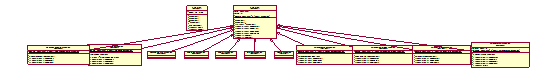
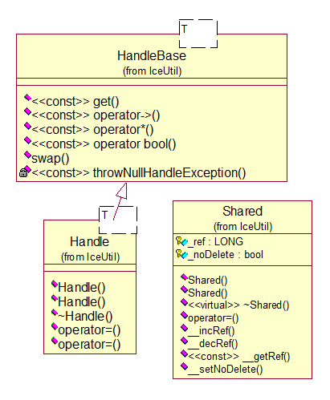

| 序号 | 修改时间 | 修改内容 | 修改人 | 审稿人 |
| ---- | -------- | -------- | ------ | ------ |
| 1    | 2017-9-4 | 创建     | Keefe | Keefe |
|      |          |          |        |        |
---

 

# 目录

[目录... 1](#_Toc492291440)

[1       概述... 2](#_Toc492291441)

[1.1        C语言概述... 2](#_Toc492291442)

[1.1.1         C语言关键字... 2](#_Toc492291443)

[1.2        C++语言概述... 3](#_Toc492291444)

[1.2.1         C++关键字... 3](#_Toc492291445)

[1.3        本章参考... 4](#_Toc492291446)

[2       C语言基础... 4](#_Toc492291447)

[2.1        C数据类型... 4](#_Toc492291448)

[2.1.1         typedef 5](#_Toc492291449)

[2.1.2         强制类型转换... 6](#_Toc492291450)

[2.2        C预处理器... 6](#_Toc492291451)

[2.3        变量与变量作用域... 7](#_Toc492291452)

[2.3.1         C 存储类... 8](#_Toc492291453)

[2.3.2         位域... 8](#_Toc492291454)

[2.4        指针、函数指针与回调函数... 9](#_Toc492291455)

[2.5        本章参考... 9](#_Toc492291456)

[3       C++语言教程... 10](#_Toc492291457)

[3.1        操作符重载... 10](#_Toc492291458)

[3.2        C++模板... 10](#_Toc492291459)

[3.3        异常处理... 10](#_Toc492291460)

[3.4        本章参考... 11](#_Toc492291461)

[4       C++高级开发... 11](#_Toc492291462)

[4.1        STL函数库... 11](#_Toc492291463)

[4.2        本章参考... 11](#_Toc492291464)

[5       参考资料... 11](#_Toc492291465)

 

---

# 1 概述
## 1.1  C语言概述
C 语言是一种通用的、面向过程式的计算机程序设计语言。1972 年，为了移植与开发 UNIX 操作系统，丹尼斯·里奇在贝尔电话实验室设计开发了 C 语言。
UNIX 操作系统，C编译器，和几乎所有的 UNIX 应用程序都是用 C 语言编写的。由于各种原因，C 语言现在已经成为一种广泛使用的专业语言。

**C11**
C11（也被称为C1X）指ISO标准ISO/IEC 9899:2011，是当前最新的C语言标准。在它之前的C语言标准为C99。
**新特性**
*  对齐处理（Alignment）的标准化（包括_Alignas标志符，alignof运算符，aligned_alloc函数以及<stdalign.h>头文件）。
*  _Noreturn 函数标记，类似于 gcc 的 __attribute__((noreturn))。
*  _Generic 关键字。
*  多线程（Multithreading）支持，包括：
_Thread_local存储类型标识符，<threads.h>头文件，里面包含了线程的创建和管理函数。
_Atomic类型修饰符和<stdatomic.h>头文件。
*  增强的Unicode的支持。基于C Unicode技术报告ISO/IEC TR 19769:2004，增强了对Unicode的支持。包括为UTF-16/UTF-32编码增加了char16_t和char32_t数据类型，提供了包含unicode字符串转换函数的头文件<uchar.h>。
*  删除了 gets() 函数，使用一个新的更安全的函数gets_s()替代。
*  增加了边界检查函数接口，定义了新的安全的函数，例如 fopen_s()，strcat_s() 等等。
*  增加了更多浮点处理宏(宏)。
*  匿名结构体/联合体支持。这个在gcc早已存在，C11将其引入标准。
*  静态断言（Static assertions），_Static_assert()，在解释 #if 和 #error 之后被处理。
*  新的 fopen() 模式，("…x")。类似 POSIX 中的 O_CREAT|O_EXCL，在文件锁中比较常用。
*  新增 quick_exit() 函数作为第三种终止程序的方式。当 exit()失败时可以做最少的清理工作。

## 1.2   C++语言概述
C++ 是一种中级语言，它是由 Bjarne Stroustrup 于 1979 年在贝尔实验室开始设计开发的。C++ 进一步扩充和完善了 C 语言，是一种面向对象的程序设计语言。C++ 可运行于多种平台上，如 Windows、MAC 操作系统以及 UNIX 的各种版本。

## 本章参考


# 2 C语言基础

## 2.1   C数据类型
表格 3 C数据类型列表

| 类型     | 细类型           | 类型描述                                                     | 类型声明                                                     |
| -------- | ---------------- | ------------------------------------------------------------ | ------------------------------------------------------------ |
| 基本     | 整数型           | 缺省无符号，包括char,   int, short, long                     | type   var-name                                              |
|          | 浮点型           | 包括float,   double, long double                             | type   var-name                                              |
| 枚举     | enum             | 也是算术类型，被用来定义在程序中只能赋予其一定的离散整数值的变量。 |                                                              |
| void     | void             | void 表明没有可用的值。如函数返回值、函数参数、指针。        |                                                              |
| 派生类型 | 指针 *           | 指针是一个变量，其值为另一个变量的地址，即，内存位置的直接地址。访问指针地址使用 &操作符。 | `type *var-name;`                                            |
|          | 数组             | 存储一个固定大小的相同类型元素的顺序集合。                   | `type arrayName [ arraySize ];`                              |
|          | 结构体    struct | 结构体是 C 编程中另一种用户自定义的可用的数据类型，它允许您存储不同类型的数据项。   结构体语句说明：**structure tag** 是可选的，每个 member definition 是标准的变量定义，结结构变量也是可选的。 | struct [structure tag] {  member definition;          member definition;          ...      member definition;    } [one or more structure variables]; |
|          | 共用体   union   | 共用体是一种特殊的数据类型，允许您在相同的内存位置存储不同的数据类型。您可以定义一个带有多成员的共用体，但是任何时候只能有一个成员带有值。共用体提供了一种使用相同的内存位置的有效方式。 | union [union tag] { member definition;   member definition; ... member definition; } [one or more union variables]; |
|          | 函数             | 是一组一起执行一个任务的语句。函数还有很多叫法，比如方法、子例程或程序等等。 | return_type function_name( parameter list   )   {        body of the function   } |

> 备注：要注意基本数据类型的存储大小和数值范围。


### 2.1.1  typedef

C 语言提供了 **typedef** 关键字，您可以使用它来为类型取一个新的名字。
示例1：下面为单字节数字定义了一个术语 **BYTE**：
`typedef unsigned char BYTE;`

示例2：定义了一个结构体和结构体指针变量

```c
typedef struct LinkNode
{
    DataType data;
    struct LinkNode* next;
} LinkNode,*pLinkNode; //结点结构体
```
**typedef vs #define**
\#define 是 C 指令，用于为各种数据类型定义别名，与 typedef 类似，但是它们有以下几点不同：
*  typedef 仅限于为类型定义符号名称，#define 不仅可以为类型定义别名，也能为数值定义别名，比如您可以定义 1 为 ONE。
*  typedef 是由编译器执行解释的，#define 语句是由预编译器进行处理的。

### 2.1.2  强制类型转换
强制类型转换是把变量从一种类型转换为另一种数据类型。例如，如果您想存储一个 long 类型的值到一个简单的整型中，您需要把 long 类型强制转换为 int 类型。您可以使用**强制类型转换运算符**来把值显式地从一种类型转换为另一种类型，如下所示：
`(type_name) expression`

常用的算术转换不适用于赋值运算符、逻辑运算符 && 和 ||。

## 2.2  C预处理器
C 预处理器不是编译器的组成部分，但是它是编译过程中一个单独的步骤。简言之，C 预处理器只不过是一个文本替换工具而已，它们会指示编译器在实际编译之前完成所需的预处理。我们将把 C 预处理器（C Preprocessor）简写为 CPP。
所有的预处理器命令都是以井号（#）开头。它必须是第一个非空字符，为了增强可读性，预处理器指令应从第一列开始。下面列出了所有重要的预处理器指令：
表格 4 C预处理器指令列表

| 指令     | 描述                                                        | 示例                                                        |
| -------- | ----------------------------------------------------------- | ----------------------------------------------------------- |
| #define  | 定义宏                                                      | #define MAX_ARRAY_LENGTH 20                                 |
| #include | 包含一个源代码文件                                          | #include <stdio.h>   #include "myheader.h"                  |
| #undef   | 取消已定义的宏                                              | #undef    FILE_SIZE   #define FILE_SIZE 42                  |
| #ifdef   | 如果宏已经定义，则返回真                                    |                                                             |
| #ifndef  | 如果宏没有定义，则返回真                                    | #ifndef MESSAGE        #define MESSAGE "You wish!"   #endif |
| #if      | 如果给定条件为真，则编译下面代码                            |                                                             |
| #else    | #if 的替代方案                                              |                                                             |
| #elif    | 如果前面的 #if 给定条件不为真，当前条件为真，则编译下面代码 |                                                             |
| #endif   | 结束一个   #if……#else 条件编译块                            |                                                             |
| #error   | 当遇到标准错误时，输出错误消息                              |                                                             |
| #pragma  | 使用标准化方法，向编译器发布特殊的命令到编译器中            |                                                             |

**预定义宏**
ANSI C 定义了许多宏。在编程中您可以使用这些宏，但是不同直接修改这些预定义的宏。
表格 5 ANSI C预定义宏列表

| 宏       | 描述                                                  |
| -------- | ----------------------------------------------------- |
| __DATE__ | 当前日期，一个以   "MMM DD YYYY" 格式表示的字符常量。 |
| __TIME__ | 当前时间，一个以   "HH:MM:SS" 格式表示的字符常量。    |
| __FILE__ | 这会包含当前文件名，一个字符串常量。                  |
| __LINE__ | 这会包含当前行号，一个十进制常量。                    |
| __STDC__ | 当编译器以 ANSI 标准编译时，则定义为 1。              |

预处理器运算符
C 预处理器提供了下列的运算符来帮助您创建宏：
宏延续运算符（\）：一个宏通常写在一个单行上。但是如果宏太长，一个单行容纳不下，则使用宏延续运算符（\）。
字符串常量化运算符（#）
标记粘贴运算符（##）

表格 6 C预处理器运算符列表

| 预处理器运算符          | 描述                                                         | 示例                                                         |
| ----------------------- | ------------------------------------------------------------ | ------------------------------------------------------------ |
| 宏延续运算符（\）       | 一个宏通常写在一个单行上。但是如果宏太长，一个单行容纳不下，则使用宏延续运算符（\）。 | #define    message_for(a, b)  \         printf(#a " and " #b ": We love you!\n") |
| 字符串常量化运算符（#） | 在宏定义中，当需要把一个宏的参数转换为字符串常量时，则使用字符串常量化运算符（#）。 |                                                              |
| 标记粘贴运算符（##）    | 宏定义内的标记粘贴运算符（##）会合并两个参数。它允许在宏定义中两个独立的标记被合并为一个标记。 | #define tokenpaster(n) printf   ("token" #n " = %d", token##n) |
| 参数化的宏              | 参数列表是括在圆括号内，且必须紧跟在宏名称的后边。宏名称和左圆括号之间不允许有空格。 | #define square(x) ((x) * (x))                                |

## 2.3  变量与变量作用域
任何一种编程中，作用域是程序中定义的变量所存在的区域，超过该区域变量就不能被访问。C 语言中有三个地方可以声明变量：
*  在函数或块内部的局部变量
*  在所有函数外部的全局变量
*  在形式参数的函数参数定义中

### 2.3.1  C 存储类
存储类定义 C 程序中变量/函数的范围（可见性）和生命周期。这些说明符放置在它们所修饰的类型之前。下面列出 C 程序中可用的存储类：

表格 7 C 存储类列表

| **存储类** | **简介**                                                     | **生命周期**                     | **示例**  |
| ---------- | ------------------------------------------------------------ | -------------------------------- | --------- |
| auto       | 所有局部变量默认的存储类。                                   | 函数内部                         |           |
| register   | 定义存储在寄存器中而不是   RAM 中的局部变量。这意味着变量的最大尺寸等于寄存器的大小。寄存器只用于需要快速访问的变量，比如计数器。还应注意的是，定义 'register' 并不意味着变量将被存储在寄存器中，它意味着变量可能存储在寄存器中，这取决于硬件和实现的限制。 | 代表了寄存器变量，不在内存中使用 |           |
| static     | 指示编译器在程序的生命周期内保持局部变量的存在，而不需要在每次它进入和离开作用域时进行创建和销毁。因此，使用 static 修饰局部变量可以在函数调用之间保持局部变量的值。全局变量的默认存储类，使变量的作用域限制在声明它的文件内。 | 变量在程序生命周期内可见         |           |
| extern     | 用于提供一个全局变量的引用，全局变量对所有的程序文件都是可见的。可以在其他文件中使用 extern 来得到已定义的变量或函数的引用。可以这么理解，extern 是用来在另一个文件中声明一个全局变量或函数。 | 全局变量，即对程序内所有文件可见 |           |
| volatile   | 提醒编译器它后面所定义的变量随时都有可能改变。               | 随时从内存读取。                 |           |
| restrict   | 通过允许编译器优化某几种代码增强了计算支持。它只可用于指针，并表明指针是访问一个数据对象的惟一且初始的方式。 |                                  | C99新增。 |
| inline     | 只用于函数，告诉编译器不用函数调用，用类似宏展开的形式内联到代码里。在函数体较短（非递归、回调）的情况下，编译性能有所提升。 |                                  | C99新增。 |

### 2.3.2  位域
位域是带有预定义宽度的变量。
**位域声明：**
```c
{
  type [member_name] : width ;
};
```
**示例：**
```c
struct
{
  unsigned int widthValidated : 1;
  unsigned int heightValidated : 1;
}
```
说明：sizeof(status)=2，如果没使用位域符则是8byte.

## 2.4  指针、函数指针与回调函数
**Data declarations (about point)** 5. Using the variable a, give definitions for the following: a) An integer 
 b) A pointer to an integer 
 c) A pointer to a pointer to an integer 
 d) An array of 10 integers 
 e) An array of 10 pointers to integers 
 f) A pointer to an array of 10 integers 
 g) A pointer to a function that takes an integer as an argument and returns an integer 
 h) An array of ten pointers to functions that take an integer argument and return an integer 
The answers are: 
 a) int a; // An integer 
 b) int *a; // A pointer to an integer 
 c) int **a; // A pointer to a pointer to an integer 
 d) int a[10]; // An array of 10 integers 
 e) int *a[10]; // An array of 10 pointers to integers 
 f) int (*a)[10]; // A pointer to an array of 10 integers 
 g) int (*a)(int); // A pointer to a function a that takes an integer argument and returns an integer 
 h) int (*a[10])(int); // An array of 10 pointers to functions that take an integer argument and return an integer 说明:a为数组名,有10个指向函数的指针.函数带有一个整形参数和整形返回值. 

**函数指针**
函数指针是指向函数的指针变量。
通常我们说的指针变量是指向一个整型、字符型或数组等变量，而函数指针是指向函数。
函数指针可以像一般函数一样，用于调用函数、传递参数。
函数指针变量的声明：
typedef int (*fun_ptr)(int,int); // 声明一个指向同样参数、返回值的函数指针类型

**回调函数** 
函数指针作为某个函数的参数
函数指针变量可以作为某个函数的参数来使用的，回调函数就是一个通过函数指针调用的函数。
简单讲：回调函数是由别人的函数执行时调用你实现的函数。

## 本章参考


# 3  C++语言教程

## 3.1  操作符重载
可以重定义或重载大部分 C++ 内置的运算符。这样，您就能使用自定义类型的运算符。
重载的运算符是带有特殊名称的函数，函数名是由关键字 operator 和其后要重载的运算符符号构成的。与其他函数一样，重载运算符有一个返回类型和一个参数列表。
`Box operator+(const Box&);`


## 3.2  泛型编程：C++模板

模板是泛型编程的基础，泛型编程即以一种独立于任何特定类型的方式编写代码。
模板是创建泛型类或函数的蓝图或公式。库容器，比如迭代器和算法，都是泛型编程的例子，它们都使用了模板的概念。
每个容器都有一个单一的定义，比如向量，我们可以定义许多不同类型的向量，比如 vector <int> 或 vector <string>。

**函数模板**
模板函数定义的一般形式如下所示：
template <class type> ret-type func-name(parameter list)
{
   // 函数的主体
}
在这里，type 是函数所使用的数据类型的占位符名称。这个名称可以在函数定义中使用。


## 3.3  异常处理

异常处理机制exception

   


C++ 异常是指在程序运行时发生的特殊情况，比如尝试除以零的操作。
异常提供了一种转移程序控制权的方式。C++ 异常处理涉及到三个关键字：try、catch、throw。

*  throw: 当问题出现时，程序会抛出一个异常。这是通过使用 throw 关键字来完成的。
*  catch: 在您想要处理问题的地方，通过异常处理程序捕获异常。catch 关键字用于捕获异常。
*  try: try 块中的代码标识将被激活的特定异常。它后面通常跟着一个或多个 catch 块。

**使用 try/catch** **语句的语法如下所示：**
```c++
try
{
   // 保护代码
}catch( ExceptionName e1 )
{
   // catch 块
}catch( ExceptionName e2 )
{
   // catch 块
}catch( ExceptionName eN )
{
   // catch 块
}
```


## 3.5 指针的处理
 方法1：引用计数法，将所有对象都使用指针，继承share，使用handle<>
 方法2：智能指针auto_ptr
   


## 本章参考


# 4  C++高级开发

## STL函数库

详见 [stl学习笔记](../media/软件可复用/library.函数库/stl学习笔记.md)


# 参考资料

[1]: C语言教程 http://www.runoob.com/cprogramming/c-tutorial.html

[2]: C++语言教程 http://www.runoob.com/cplusplus/cpp-tutorial.html

[3]: [C++ Programming Language Tutorials](http://www.cs.wustl.edu/~schmidt/C++/) − C++ 编程语言教程

[4]: [C++ Programming](http://en.wikibooks.org/wiki/C++_Programming) − 这本书涵盖了 C++ 语言编程、软件交互设计、C++ 语言的现实生活应用

[5]: [C++ FAQ](http://www.parashift.com/c++-faq-lite/index.html#table-of-contents) − C++ 常见问题

[6]: [Free Country](http://www.thefreecountry.com/sourcecode/cpp.shtml) − Free Country 提供了免费的 C++ 源代码和 C++ 库，这些源代码和库涵盖了压缩、存档、游戏编程、标准模板库和 GUI 编程等 C++ 编程领域

[7]: [C and C++ Users Group](http://www.hal9k.com/cug/) − C 和 C++ 的用户团体提供了免费的涵盖各种编程领域 C++ 项目的源代码，包括 AI、动画、编译器、数据库、调试、加密、游戏、图形、GUI、语言工具、系统编程等
