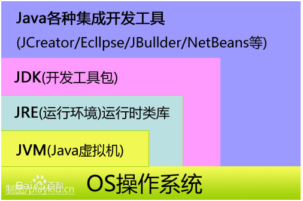
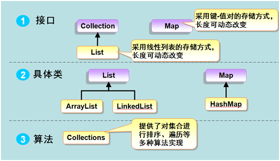
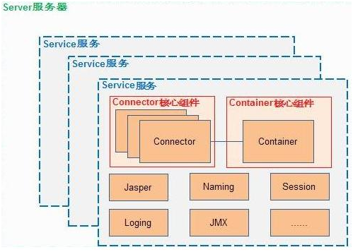
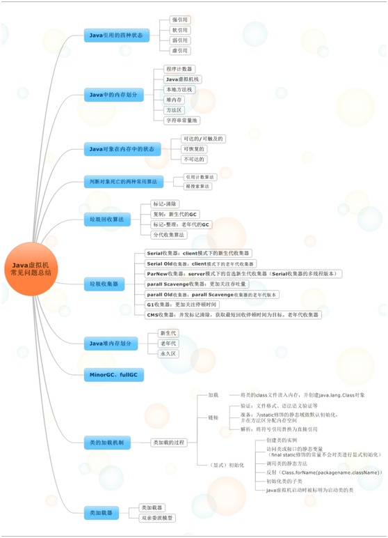
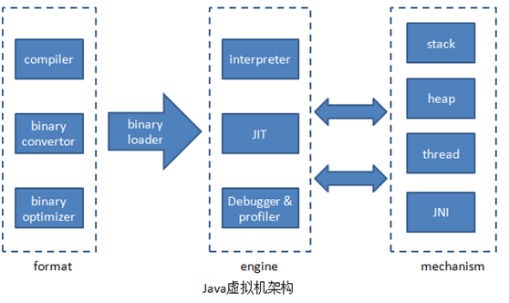
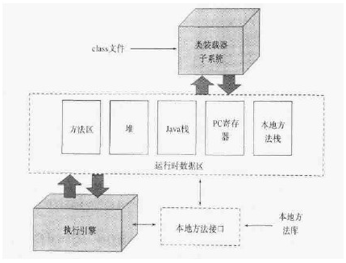
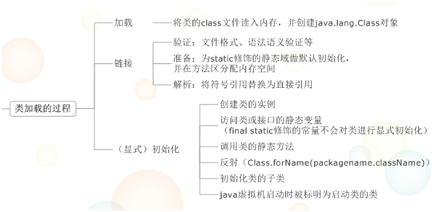
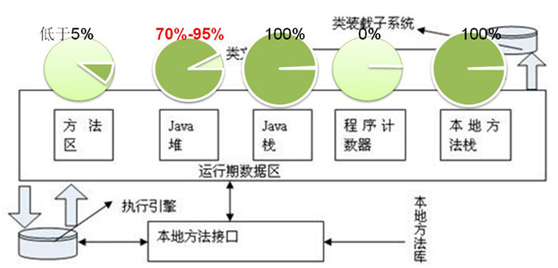
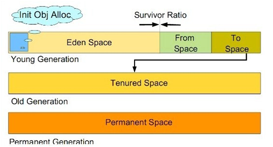
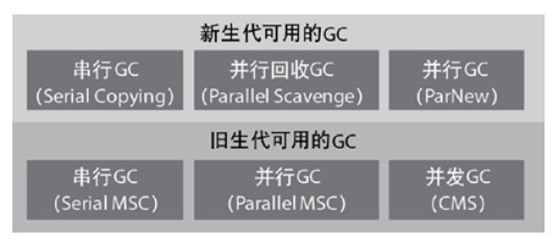

| 序号  | 修改时间       | 修改内容                       | 修改人   | 审稿人   |
| --- | ---------- | -------------------------- | ----- | ----- |
| 1   | 2010-5-19  | 创建                         | Keefe | Keefe |
| 2   | 2010-6-26  | 增加Java语言历史，tomcat内容        | 同上    |       |
| 3   | 2010-12-22 | 补充tomcat环境配置部分             | 同上    |       |
| 4   | 2010-12-24 | 补充Eclipse环境配置部分            | 同上    |       |
| 5   | 2011-1-11  | 增加J2SE的组件章节                | 同上    |       |
| 6   | 2011-7-7   | 更新tomcat的配置设置。             | 同上    |       |
| 7   | 2011-7-21  | 补充JVM原理的内容                 | 同上    |       |
| 8   | 2012-3-6   | 更新JVM的内存管理                 | 同上    |       |
| 9   | 2013-8-5   | 增加tomcat/eclipse的windows部分 | 同上    |       |
| 10  | 2017-1-20  | 微调章节内容，移出框架内容另文。           | 同上    |       |
| 11  | 2017-8-20  | 更新JDK版本特性                  | 同上    |       |
| 12  | 2018-3-18  | 增加WAR和JAR打包章节              | 同上    |       |
| 13  | 2018-6-9   | JVM单独成章。                   | 同上    |       |
| 14  | 2021-11-19 | 更新JDK版本                    | 同上    |       |

<br><br><br>

---

# 目录

[TOC]

表目录

[表格 1 Java history. 4](#_Toc516381296)

[表格 2 JDK版本列表... 5](#_Toc516381297)

[表格 3 J2SE component 8](#_Toc516381298)

[表格 4 J2SE基本组件说明... 9](#_Toc516381299)

[表格 6 抽象类和接口的区别列表... 11](#_Toc516381300)

[表格 5 Java常用工具列表... 14](#_Toc516381301)

[表格7 Java开发工具列表... 14](#_Toc516381302)

[表格8tomcat版本... 17](#_Toc516381303)

[表格9 tomcat配置文件列表... 20](#_Toc516381304)

图目录

[图 1 JDK结构图__ 5](#_Toc516381305)

[图2 Java集合框架(Collection)体系图__ 13](#_Toc516381306)

[图3 tomcat framework_ 18](#_Toc516381307)

[图4 JVM架构__ 28](#_Toc516381308)

[图5 JVM的内部结构图__ 29](#_Toc516381309)

[图6 JVM运行时数据区的垃圾回收比例统计(IBM) 31](#_Toc516381310)

[图 7 JVM堆内存划分__ 32](#_Toc516381311)

[图8 各种垃圾收集器__ 34](#_Toc516381312)

<br>

---

# 1.  Java概述

Java: A simple, object-oriented, distributed,  interpreted, robust, secure, architecture-
neutral, portable, high- performance, multi-threaded, and dynamic language。
Java具有简单、面向对象、分布式、解释执行、健壮、安全、结构中立、可移植、高性能、多线程、动态的特点。

Java 是由Sun Microsystems公司于1995年5月推出的高级程序设计语言。
Java可运行于多个平台，如Windows, Mac OS，及其他多种UNIX版本的系统。

## 1.1  Java历史

表格 1 Java history

| 年份   | Java的发展历史                                                                                         |
| ---- | ------------------------------------------------------------------------------------------------- |
| 1991 | Green   Project小组成立； Java的前身Oak诞生。                                                                |
| 1995 | Java语言正式发布，Sun公司推出。                                                                               |
| 1996 | JDK1.0发布，10大OS提供商宣布支持Java技术。                                                                      |
| 1997 | JDK1.1发布；<br/>4月2日，JavaOne会议召开，参与者逾一万人，创当时全球同 类会议规模之纪录；<br>9月，JavaDeveloperConnection社区成员超过十万   。 |
| 1998 | Swing推出；12月8日，JDK1.2(Java2企业平台J2EE)发布。                                                            |
| 1999 | JSP/Servlet诞生。Java平台划分为J2SE、J2EE、J2ME。                                                            |
| 2000 | JDK1.3发布，成为JDK的重要里程碑。                                                                             |
| 2002 | J2SE1.4发布，Java的计算能力有了大幅提升。                                                                        |
| 2004 | J2SE1.5发布，并更名 J2SE5.0                                                                             |
| 2005 | Java SE6发布。Sun以 **OpenJDK** 开源Java。                                                               |
| 2006 | SUN公司发布 JRE6.0。                                                                                   |
| 2010 | 4月，Oracle宣布收购SUN公司，Java转向Oracle开发平台。                                                              |
| 2016 | IBM开源其Java虚拟机J9，贡献给Eclipse基金会管理，命名为**OpenJ9**。                                                    |
| 2017 | 8月，Oracle将Java EE（Java Enterprise Edition，J2EE）移交给开源组织Eclipse基金会接手。9月，Java9发布。                    |
| 2018 | 3月，Java EE更名为Jakarta EE，Java 10发布。                                                                |
| ...  |                                                                                                   |
| 2022 |                                                                                                   |

备注：JDK版本变迁详见 JDK章节。

## 1.2 JDK

* JRE:  Java Runtime Enviroment, Java运行环境。

* JDK(Java Development Kit)是Sun Microsystems针对Java开发员的产品。JDK 是整个Java的核心，包括了JRE，一堆Java工具和Java基础的类库(rt.jar)。JDK包含的Java工具有javac, jar, javadoc, jdb, appletviewer, javap, Jconsole. 目前提供JDK的有Oracle支持的 openjdk。

* JVM：Java Virtual Machine, JVM实例对应了一个独立运行的Java程序，而 JVM执行引擎实例则对应了属于用户运行程序的线程。
  
  ```shell
  # 此命令打印出 JDK、JRE、JVM的基本配置信息。
  $ java -version
  
  # 下面显示是 Oracle JDK的打印信息
  java version "1.8.0_121"
  Java(TM) SE Runtime Environment (build 1.8.0_121-b13)
  Java HotSpot(TM) 64-Bit Server VM (build 25.121-b13, mixed mode)
  ```
  
  

图 1 JDK结构图

### OpenJDK

OpenJDK官网：http://openjdk.java.net/

Java最早由SUN公司(Sun Microsystems，发起于美国斯坦福大学，SUN是Stanford University Network的缩写)发明，2006年SUN公司将Java开源，此时的JDK即为OpenJDK。

OpenJDK是Java SE的开源实现，他由SUN和Java社区提供支持，2009年Oracle收购了Sun公司，自此 Java的维护方之一的SUN也变成了Oracle。

大多数JDK都是在OpenJDK的基础上编写实现的，比如IBM J9，Azul Zulu，Azul Zing和Oracle JDK。几乎现有的所有JDK都派生自OpenJDK，他们之间不同的是许可证.

|            | 协议 Licence      | 维护者    |
| ---------- | --------------- | ------ |
| OpenJDK    | GPL v2          | 开源社区   |
| Oracle JDK | Oracle二进制代码许可协议 | Oracle |

**OpenJDK只包含最精简的JDK**：OpenJDK不包含其他的软件包，比如Rhino Java DB JAXP...，并且可以分离的软件包也都是尽量的分离。

OpenJDK不包含Deployment(部署)功能：部署的功能包括：Browser Plugin、Java Web Start、以及Java控制面板。

### Java版本特性

说明:  [JEP](http://openjdk.java.net/jeps/0)（Java Enhancement Proposals，Java增强提案）,  JDK更新参见  [OpenJDK: JDK Updates Project (java.net)](http://openjdk.java.net/projects/jdk-updates/)

表格 2 JDK版本列表

| 版本                                                 | 名称                    | 发行日期       |
| -------------------------------------------------- | --------------------- | ---------- |
| JDK 1.0                                            | Oak(橡树)               | 1996-01-23 |
| JDK 1.1                                            | none（无）               | 1997-02-19 |
| JDK 1.1.4                                          | Sparkler（宝石）          | 1997-09-12 |
| JDK 1.1.5                                          | Pumpkin（南瓜）           | 1997-12-13 |
| JDK 1.1.6                                          | Abigail（阿比盖尔–女子名）     | 1998-04-24 |
| JDK 1.1.7                                          | Brutus（布鲁图–古罗马政治家和将军） | 1998-09-28 |
| JDK 1.1.8                                          | Chelsea（切尔西–城市名）      | 1999-04-08 |
| J2SE 1.2                                           | Playground（运动场）       | 1998-12-04 |
| J2SE 1.2.1                                         | none（无）               | 1999-03-30 |
| J2SE 1.2.2                                         | Cricket（蟋蟀）           | 1999-07-08 |
| J2SE 1.3                                           | Kestrel（美洲红隼）         | 2000-05-08 |
| J2SE 1.3.1                                         | Ladybird（瓢虫）          | 2001-05-17 |
| J2SE 1.4.0                                         | Merlin（灰背隼）           | 2002-02-13 |
| J2SE 1.4.1                                         | grasshopper（蚱蜢）       | 2002-09-16 |
| J2SE 1.4.2                                         | Mantis（螳螂）            | 2003-06-26 |
| **Java SE 5.0 (1.5.0)**                            | Tiger（老虎）             | 2004-09-30 |
| Java SE 6.0 (1.6.0)                                | Mustang（野马）           | 2006-04    |
| Java SE 7.0 (1.7.0)                                | Dolphin（海豚）           | 2011-07-28 |
| Java SE 8.0 (1.8.0)                                | Spider（蜘蛛）            | 2014-03-18 |
| Java SE 9.0                                        | none（无）               | 2017-09-21 |
| JDK [10](http://openjdk.java.net/projects/jdk/10/) |                       | 2018-03-20 |
| JDK 11                                             |                       | 2018-09-25 |
| JDK 12                                             |                       | 2019-03-19 |
| JDK 13                                             |                       | 2019-09-17 |
| JDK 14                                             |                       | 2020-03-17 |
| JDK 15                                             |                       | 2020-09-25 |
| JDK [16](http://openjdk.java.net/projects/jdk/16/) |                       | 2021-03-16 |
| JDK [17](http://openjdk.java.net/projects/jdk/17/) |                       | 2021-09-14 |
| JDK 18                                             |                       |            |

备注：从上方的 JDK各个版本发布时间和版本名称表 可以看到，Java大体有3大类命名方式：`JDK`、`J2SE`、`Java SE`。

1. 从 JDK 5.0开始，不再叫 J2SE，改名为 Java SE了。OpenJDK是Java SE的开源版本。上面列举的版本从5.0开始,  已经是OpenJDK的版本。
2. 2017年9月，Java 采用了基于时间发布的策略，每 6 个月一个版本(以前是2年一个版本)。Java 10是采用新的发布策略之后的第一个版本。

表格 Java各版本特性

| 版本                                                                  | 特性                                                                                                                                                                                                                                                                                                                                                                                                                                                                                                                                                                                                                                                                                          |
| ------------------------------------------------------------------- | ------------------------------------------------------------------------------------------------------------------------------------------------------------------------------------------------------------------------------------------------------------------------------------------------------------------------------------------------------------------------------------------------------------------------------------------------------------------------------------------------------------------------------------------------------------------------------------------------------------------------------------------------------------------------------------------- |
| JDK 1.0                                                             | 初代版本，伟大的一个里程碑，但是是纯解释运行，使用外挂 JIT，性能比较差，运行速度慢。                                                                                                                                                                                                                                                                                                                                                                                                                                                                                                                                                                                                                                                |
| ...                                                                 |                                                                                                                                                                                                                                                                                                                                                                                                                                                                                                                                                                                                                                                                                             |
| Java 5                                                              | 1.引入泛型功能（伪泛型）<br/>2.增强循环，可以使用迭代循环，Iterator<br/>3.支持自动装箱和自动拆箱<br/>4.支持类型安全的枚举<br/>5.支持可变参数<br/>6.支持静态引入<br/>7.支持元数据（注解）功能<br/>8.引入Java Instrumentation                                                                                                                                                                                                                                                                                                                                                                                                                                                                                                                                       |
| Java 6                                                              | 1.支持脚本语言<br/>2.引入JDBC 4.0 API<br/>3.引入Java Compiler API<br/>4.支持可插拔注解                                                                                                                                                                                                                                                                                                                                                                                                                                                                                                                                                                                                                       |
| Java 7                                                              | switch中添加对String类型的支持<br/>数字字面量的改进 / 数值可加下划<br/>异常处理（捕获多个异常） try-with-resources<br/>增强泛型推断<br/>JSR203 NIO2.0（AIO）新IO的支持<br/>JSR292与InvokeDynamic指令<br/>Path接口、DirectoryStream、Files、WatchService（重要接口更新）<br/>fork/join framework                                                                                                                                                                                                                                                                                                                                                                                                                                                            |
| Java 8                                                              | 1.支持lambda表达式<br/>2.支持集合的Stream流处理<br/>3.支持Functional函数式接口<br/>4.对各个类支持了很多对应的lambda增强方法<br/>5.增强接口，支持了接口的默认和静态的具体方法<br/>6.支持LocalDate等时间包，以改进原有Date<br/>7.支持Optional来改进Null值的处理<br/>8.优化了HashMap和ConcurrentHashMap                                                                                                                                                                                                                                                                                                                                                                                                                                                                          |
| Java 9                                                              | 1.支持Java平台级模块系统，既模块化<br/>2.支持了JShell，既类似node.js, python一样的命令行工具，对待简单的东西，可以直接命令测试<br/>3.改进Javadoc, 使得Javadoc可以搜索<br/>4.支持了List.of(), Set.of(), Map.of()的方式初始化不可变集合，省略了大量代码，语法糖<br/>5.改进的Stream API，比如ofNullable(),dropWhile(),takeWhile()等<br/>6.增强接口，支持了私有接口具体方法，补充了Java8默认和静态方法的支持<br/>7.把G1垃圾收集器作为默认的垃圾收集器，并标注CMS为过时收集器<br/>8.引入了响应式流Reactive Streams API, 支持了响应式编程<br/>9.支持了HTTP/2客户端                                                                                                                                                                                                                                                                                                    |
| Java 10                                                             | 1.支持了局部变量的类型推导，支持了局部变量的var声明<br/>2.优化改进了G1垃圾回收器，采用并行化mark-sweep-compact算法                                                                                                                                                                                                                                                                                                                                                                                                                                                                                                                                                                                                                   |
| Java 11                                                             | 1.简化了启动单个源代码文件的方法，使得小白命令式编译运行Java文件变成更加简单，java Helloworld.java 即可<br/>2.增加支持了一个叫Epsilon的低开销垃圾收集器<br/>3.增加支持了一个叫ZGC(Z Garbage Collector)的可伸缩低延迟垃圾收集器, 相比G1，停顿时间有了很大的改进，稳定在10ms以下<br/>4.重写了HttpClient,提供了新的标准化HttpClient API, 以后不再需要引入apache包的HttpClient或是okhttp就能支持高性能的网络5.编程<br/>6.增加了对TLS 1.3的支持<br/>7.允许了飞行记录器进行商用下的使用<br/>8.更好的支持了动态语言，在JVM层面增加了invokedynamic指令<br/>9.支持了在lambda内部使用var声明局部变量                                                                                                                                                                                                                                                                                            |
| Java 12                                                             | 1.引入了一个叫Shenandoah 低停顿的实验性垃圾收集器<br/>2.改进了G1垃圾收集器<br/>3.引入了实验性的预览版Switch语句优化，可以省略break语句，合并多个case<br/>4.引入了JVM的常量API, 有助于一些分析的实现                                                                                                                                                                                                                                                                                                                                                                                                                                                                                                                                                             |
| Java 13                                                             | 1.增强优化了ZGC垃圾收集器, 归还未使用的堆内存给操作系统<br/>2.将Java12引入的预览版Switch语法提为正式版，使得Switch的使用更加的顺滑和流畅<br/>3.支持了"""字符串块功能                                                                                                                                                                                                                                                                                                                                                                                                                                                                                                                                                                                     |
| Java 14                                                             | Java 14的JEP极多,此处只列举几个: <br>改进的switch表达式，第一次出现在Java 12和13中，在Java 14中获得了完全的支持 <br/>instanceof支持模式匹配（语言特性） <br/>NullPointerException（JVM特性）                                                                                                                                                                                                                                                                                                                                                                                                                                                                                                                                                    |
| [Java 15](http://openjdk.java.net/projects/jdk/15/)                 | 339:    Edwards-Curve Digital Signature Algorithm (EdDSA)<br/>360:    Sealed Classes (Preview)<br/>371:    Hidden Classes<br/>372:    Remove the Nashorn JavaScript Engine<br/>373:    Reimplement the Legacy DatagramSocket API<br/>374:    Disable and Deprecate Biased Locking<br/>375:    Pattern Matching for instanceof (Second Preview)<br/>377:    ZGC: A Scalable Low-Latency Garbage Collector<br/>378:    Text Blocks<br/>379:    Shenandoah: A Low-Pause-Time Garbage Collector<br/>381:    Remove the Solaris and SPARC Ports<br/>383:    Foreign-Memory Access API (Second Incubator)<br/>384:    Records (Second Preview)<br/>385:    Deprecate RMI Activation for Removal   |
| [Java 16](http://openjdk.java.net/projects/jdk/16/)                 | 338:    Vector API (Incubator)<br/>347:    Enable C++14 Language Features<br/>357:    Migrate from Mercurial to Git<br/>369:    Migrate to GitHub<br/>376:    ZGC: Concurrent Thread-Stack Processing<br/>380:    Unix-Domain Socket Channels<br/>386:    Alpine Linux Port<br/>387:    Elastic Metaspace<br/>388:    Windows/AArch64 Port<br/>389:    Foreign Linker API (Incubator)<br/>390:    Warnings for Value-Based Classes<br/>392:    Packaging Tool<br/>393:    Foreign-Memory Access API (Third Incubator)<br/>394:    Pattern Matching for instanceof<br/>395:    Records<br/>396:    Strongly Encapsulate JDK Internals by Default<br/>397:    Sealed Classes (Second Preview) |
| [JDK 17 ](https://wiki.openjdk.java.net/display/JDKUpdates/JDK+17u) | 306: Restore Always-Strict Floating-Point Semantics<br/>356: Enhanced Pseudo-Random Number Generators<br/>382: New macOS Rendering Pipeline<br/>391: macOS/AArch64 Port<br/>398: Deprecate the Applet API for Removal<br/>403: Strongly Encapsulate JDK Internals<br/>406: Pattern Matching for switch (Preview)<br/>407: Remove RMI Activation<br/>409: Sealed Classes<br/>410: Remove the Experimental AOT and JIT Compiler<br/>411: Deprecate the Security Manager for Removal<br/>412: Foreign Function & Memory API (Incubator)<br/>414: Vector API (Second Incubator)<br/>415: Context-Specific Deserialization Filters                                                               |

## 1.3 Java平台

Java是一个可以在不同操作系统（例如windows,unix等）上运行的编程语言，Java平台是指运行在各种终端（如pc、服务器、移动设备、嵌入式设备）的系统软件。PC机上的java程序是用javaSE开发出来的，服务器端的java程序是用javaEE开发出来的，移动设备的java程序是用javaME开发出来的。

Java 2平台包括：标准版（J2SE ~ Standard）、企业版（J2EE ~Enterprise）和微缩版（J2ME  ~ Micro）三个版本。J2SE,J2ME和J2EE,这也就是SunONE(Open NetEnvironment)体系。
类的组成（API的覆盖范围）

* J2EE 包含J2SE 中的类，并且还包含用于开发企业级应用的类。比如：[EJB](https://baike.baidu.com/item/EJB)、[servlet](https://baike.baidu.com/item/servlet)、JSP、[XML](https://baike.baidu.com/item/XML)、事务控制。
* J2SE 包含那些构成[Java语言](https://baike.baidu.com/item/Java语言)核心的类。比如：数据库连接、接口定义、输入/输出、[网络编程](https://baike.baidu.com/item/网络编程)。
* J2ME 包含J2SE中一部分类，再增加一些[CLDC](https://baike.baidu.com/item/CLDC)等方面的特性。

应用场景

* J2EE用于企业应用，支持分布式部署。如电子商务网站和ERP系统。
* J2SE用于桌面应用，也是J2EE的基础。
* J2ME用于小型设备，多用于消费类电子产品（多嵌入式系统）的软件开发。比如：呼机、智能卡、手机、PDA、机顶盒。

开发能力（从大到小）：J2EE > J2SE > J2ME。

范围：J2SE包含于J2EE中，J2ME包含了J2SE的核心类，但新添加了一些专有类。

### Java SE Component

The two principal products in the Java SE platform are: Java Development Kit (JDK) and Java SE Runtime Environment (JRE).
The JDK is a superset of the JRE, and contains everything that is in the JRE, plus tools such as the compilers and debuggers necessary for developing applets and applications. The Java Runtime Environment (JRE) provides the libraries, the Java Virtual Machine, and other components to run applets and applications written in the Java programming language.

The following conceptual diagram illustrates all the component technologies in Java SE platform and how they fit together.

表格 3  J2SE component

| component                                                                                                      | detail                                                                                                                                                                                                                                                                                                                                                                                                                                                                                                                                                                                                                                                                                                                                                                                                                                                                                                                                                                                                                                                                                                                                                                                                                                                                                                                                                                                                                                                                                                                                                                                                                       |                                                                                                                                                                                                                      |                                                                                                   |
| -------------------------------------------------------------------------------------------------------------- | ---------------------------------------------------------------------------------------------------------------------------------------------------------------------------------------------------------------------------------------------------------------------------------------------------------------------------------------------------------------------------------------------------------------------------------------------------------------------------------------------------------------------------------------------------------------------------------------------------------------------------------------------------------------------------------------------------------------------------------------------------------------------------------------------------------------------------------------------------------------------------------------------------------------------------------------------------------------------------------------------------------------------------------------------------------------------------------------------------------------------------------------------------------------------------------------------------------------------------------------------------------------------------------------------------------------------------------------------------------------------------------------------------------------------------------------------------------------------------------------------------------------------------------------------------------------------------------------------------------------------------- | -------------------------------------------------------------------------------------------------------------------------------------------------------------------------------------------------------------------- | ------------------------------------------------------------------------------------------------- |
| [JDK](http://download.oracle.com/javase/6/docs/technotes/guides/index.html#jre-jdk)                            |                                                                                                                                                                                                                                                                                                                                                                                                                                                                                                                                                                                                                                                                                                                                                                                                                                                                                                                                                                                                                                                                                                                                                                                                                                                                                                                                                                                                                                                                                                                                                                                                                              | [Java Language ](http://download.oracle.com/javase/6/docs/technotes/guides/language/index.html)                                                                                                                      | [Java   Language ](http://download.oracle.com/javase/6/docs/technotes/guides/language/index.html) |
| [Tools & Tool APIs ](http://download.oracle.com/javase/6/docs/technotes/tools/index.html)                      | [Java](http://download.oracle.com/javase/6/docs/technotes/tools/windows/java.html)  [Javac](http://download.oracle.com/javase/6/docs/technotes/guides/javac/index.html)  [Javadoc](http://download.oracle.com/javase/6/docs/technotes/guides/javadoc/index.html)  [apt](http://download.oracle.com/javase/6/docs/technotes/guides/apt/index.html)  [jar](http://download.oracle.com/javase/6/docs/technotes/guides/jar/index.html)  [Javap](http://download.oracle.com/javase/6/docs/technotes/tools/windows/javap.html)  [JPDA](http://download.oracle.com/javase/6/docs/technotes/guides/jpda/index.html)  [JConsole](http://download.oracle.com/javase/6/docs/technotes/tools/index.html#jconsole)  [Java VisualVM ](http://download.oracle.com/javase/6/docs/technotes/guides/visualvm/index.html)   [Security](http://download.oracle.com/javase/6/docs/technotes/tools/index.html#security)  [Intl](http://download.oracle.com/javase/6/docs/technotes/tools/index.html#intl)  [RMI](http://download.oracle.com/javase/6/docs/technotes/tools/index.html#rmi)  [IDL](http://download.oracle.com/javase/6/docs/technotes/tools/index.html#idl)  [Deploy](http://download.oracle.com/javase/6/docs/technotes/tools/index.html#deployment)  [Monitoring](http://download.oracle.com/javase/6/docs/technotes/tools/index.html#monitor)  [Troubleshoot](http://download.oracle.com/javase/6/docs/technotes/tools/index.html#troubleshoot)  [Scripting](http://download.oracle.com/javase/6/docs/technotes/tools/index.html#scripting)  [JVM TI](http://download.oracle.com/javase/6/docs/technotes/guides/jvmti/index.html) |                                                                                                                                                                                                                      |                                                                                                   |
| [JRE](http://download.oracle.com/javase/6/docs/technotes/guides/index.html#jre-jdk)                            | [RIAs](http://download.oracle.com/javase/6/docs/technotes/guides/jweb/index.html)                                                                                                                                                                                                                                                                                                                                                                                                                                                                                                                                                                                                                                                                                                                                                                                                                                                                                                                                                                                                                                                                                                                                                                                                                                                                                                                                                                                                                                                                                                                                            | [Java Web Start ](http://download.oracle.com/javase/6/docs/technotes/guides/javaws/index.html) [Applet / Java Plug-in ](http://download.oracle.com/javase/6/docs/technotes/guides/jweb/applet/applet_dev_guide.html) |                                                                                                   |
| [User Interface Toolkits ](http://download.oracle.com/javase/6/docs/technotes/guides/index.html#userinterface) | [AWT](http://download.oracle.com/javase/6/docs/technotes/guides/awt/index.html)  [Swing](http://download.oracle.com/javase/6/docs/technotes/guides/swing/index.html)  [Java 2D ](http://download.oracle.com/javase/6/docs/technotes/guides/2d/index.html)  [Accessibility](http://download.oracle.com/javase/6/docs/technotes/guides/access/index.html)  [Drag n Drop ](http://download.oracle.com/javase/6/docs/technotes/guides/dragndrop/index.html)  [Input Methods ](http://download.oracle.com/javase/6/docs/technotes/guides/imf/index.html)  [Image I/O ](http://download.oracle.com/javase/6/docs/technotes/guides/imageio/index.html)  [Print Service ](http://download.oracle.com/javase/6/docs/technotes/guides/jps/index.html)  [Sound](http://download.oracle.com/javase/6/docs/technotes/guides/sound/index.html)                                                                                                                                                                                                                                                                                                                                                                                                                                                                                                                                                                                                                                                                                                                                                                                             |                                                                                                                                                                                                                      |                                                                                                   |
| [Integration Libraries ](http://download.oracle.com/javase/6/docs/technotes/guides/index.html#integration)     | [IDL](http://download.oracle.com/javase/6/docs/technotes/guides/idl/index.html)  [JDBC](http://download.oracle.com/javase/6/docs/technotes/guides/jdbc/index.html)  [JNDI](http://download.oracle.com/javase/6/docs/technotes/guides/jndi/index.html) [RMI](http://download.oracle.com/javase/6/docs/technotes/guides/rmi/index.html) [RMI-IIOP](http://download.oracle.com/javase/6/docs/technotes/guides/rmi-iiop/index.html) [Scripting](http://download.oracle.com/javase/6/docs/technotes/guides/scripting/index.html)                                                                                                                                                                                                                                                                                                                                                                                                                                                                                                                                                                                                                                                                                                                                                                                                                                                                                                                                                                                                                                                                                                  |                                                                                                                                                                                                                      |                                                                                                   |
| [Other Base Libraries ](http://download.oracle.com/javase/6/docs/technotes/guides/index.html#otherbase)        | [Beans](http://download.oracle.com/javase/6/docs/technotes/guides/beans/index.html) [Intl Support ](http://download.oracle.com/javase/6/docs/technotes/guides/intl/index.html) [Input/Output](http://download.oracle.com/javase/6/docs/technotes/guides/io/index.html) [JMX](http://download.oracle.com/javase/6/docs/technotes/guides/jmx/index.html) [JNI](http://download.oracle.com/javase/6/docs/technotes/guides/jni/index.html) [Math](http://download.oracle.com/javase/6/docs/technotes/guides/math/index.html)   [Networking](http://download.oracle.com/javase/6/docs/technotes/guides/net/index.html) [Override  Mechanism ](http://download.oracle.com/javase/6/docs/technotes/guides/standards/index.html)  [Security](http://download.oracle.com/javase/6/docs/technotes/guides/security/index.html)  [Serialization](http://download.oracle.com/javase/6/docs/technotes/guides/serialization/index.html)    [Extension  Mechanism ](http://download.oracle.com/javase/6/docs/technotes/guides/extensions/index.html) [xml JAXP ](http://download.oracle.com/javase/6/docs/technotes/guides/xml/index.html)                                                                                                                                                                                                                                                                                                                                                                                                                                                                                                   |                                                                                                                                                                                                                      |                                                                                                   |
| [lang and util Base Libraries ](http://download.oracle.com/javase/6/docs/technotes/guides/index.html#langutil) | [lang and util](http://download.oracle.com/javase/6/docs/technotes/guides/lang/index.html) [Collections ](http://download.oracle.com/javase/6/docs/technotes/guides/collections/index.html) [Concurrency Utilities ](http://download.oracle.com/javase/6/docs/technotes/guides/concurrency/index.html) [JAR ](http://download.oracle.com/javase/6/docs/technotes/guides/jar/index.html) [Logging](http://download.oracle.com/javase/6/docs/technotes/guides/logging/index.html) [Management](http://download.oracle.com/javase/6/docs/technotes/guides/management/index.html) [Preferences API](http://download.oracle.com/javase/6/docs/technotes/guides/preferences/index.html) [Ref Objects ](http://download.oracle.com/javase/6/docs/api/java/lang/ref/package-summary.html) [Reflection](http://download.oracle.com/javase/6/docs/technotes/guides/reflection/index.html) [Regular Expressions ](http://download.oracle.com/javase/6/docs/api/java/util/regex/package-summary.html) [Versioning](http://download.oracle.com/javase/6/docs/technotes/guides/versioning/index.html) [Zip](http://download.oracle.com/javase/6/docs/api/java/util/zip/package-summary.html) [Instrumentation](http://download.oracle.com/javase/6/docs/technotes/guides/instrumentation/index.html)                                                                                                                                                                                                                                                                                                                                       |                                                                                                                                                                                                                      |                                                                                                   |
| [Java Virtual Machine ](http://download.oracle.com/javase/6/docs/technotes/guides/vm/index.html)               | [Java Hotspot Client and Server VM](http://download.oracle.com/javase/6/docs/technotes/guides/vm/index.html)                                                                                                                                                                                                                                                                                                                                                                                                                                                                                                                                                                                                                                                                                                                                                                                                                                                                                                                                                                                                                                                                                                                                                                                                                                                                                                                                                                                                                                                                                                                 |                                                                                                                                                                                                                      |                                                                                                   |

说明：RPC（Remote Procedure Call Protocol）远程过程调用协议，通过网络从远程计算机上请求调用某种服务。

表格 4 J2SE基本组件说明

| 缩写    | 全名                                     | 简介                                                                                                                                                                                                                                                                |
| ----- | -------------------------------------- | ----------------------------------------------------------------------------------------------------------------------------------------------------------------------------------------------------------------------------------------------------------------- |
| JS    | Java Servlet                           | 运行于服务器上的一个小程序,   提供应用程序接口, 通过它可以简单快速地开发并扩展服务器功能, 将来有可能取代CGI.                                                                                                                                                                                                      |
| JSP   | Java Server Page                       | 提供一种简单快速的方法来创建动态网页. Java Servlets的一种扩展.表现类似PHP/ASP，在html代码中嵌入Java/php/asp代码. JSP 在运行时被编译成servlet、request、response、session等，jsp内置对象实际是在servlet API定义的。                                                                                                             |
| EJB   | Enterprise Java Bean                   | 定义了一个应用程序接口, 可以使程序员快速开发,发布和管理跨平台的基于组件的企业级应用程序（为中间件, EJB容器）。                                                                                                                                                                                                       |
| JIT   | Just-In-Time Compiler                  | 即时编译器。                                                                                                                                                                                                                                                            |
| CLDC  | Connected Limited Device Configuration | 有限连接设备配置，是为运行在资源非常有限的设备（例如[寻呼机](https://baike.baidu.com/item/寻呼机/1440759)或者[手机](https://baike.baidu.com/item/手机/6342)）上的[J2ME](https://baike.baidu.com/item/J2ME/204201)应用程序制订的架构。规范内容包括目标机器的特性、[虚拟机](https://baike.baidu.com/item/虚拟机)规范和基本的API等等。 有1.0和1.1两个版本。 |
| JNI   | Java Native Interface                  | Java本机接口，提供了从Java虚拟机（JVM）进入JVM运行所在计算机的本机世界的入口。通过使用这个入口，Java程序员可以使用十分昂贵或者不可能以Java代码重写的旧的本机代码。JNI允许本机代码调用JVM、创建并访问对象、调用对象方法以及访问实例变量。开发人员所付出的代价是，这样做失去了Java平台“编写一次，到处运行”的优势，因为任何被调用的本机代码将受到特殊平台的约束。                                                                  |
| JDBC  | Java Database Connectivity             | 基于SQL标准Java数据库连接，其基本功能和设计与ODBC相似。                                                                                                                                                                                                                                 |
| IDL   | Interface   Define Language            | Java接口描述语言，Java和COBRA之间的连接                                                                                                                                                                                                                                        |
| RMI   | Remote Method Invocation               | Java远程方法调用。能够让在客户端Java虚拟机上的对象像调用本地对象一样调用服务端java 虚拟机中的对象上的方法。                                                                                                                                                                                                      |
| JNDI  | Java Naming and Directory Interface    | Java名字与目录服务                                                                                                                                                                                                                                                       |
| JTS   | Java Transaction Service               | Java事务管理服务                                                                                                                                                                                                                                                        |
| JTA   | Java Transaction API                   | JTA允许应用程序执行分布式事务处理                                                                                                                                                                                                                                                |
| JMAPI | Java Management API                    | Java网络管理API                                                                                                                                                                                                                                                       |
| JMS   | Java Message Service                   | Java消息传递服务                                                                                                                                                                                                                                                        |

<br>

## 本章参考

* Java的各个版本和各个版本的历史版本号的关系与解读 https://lijunde.blog.csdn.net/article/details/91351603
* JDK的版本号解惑 https://blog.csdn.net/bisal/article/details/118947676
* Java 7～14各个版本新特性详解 https://blog.csdn.net/smallspot/article/details/105540222
* Java1.0-1.11各个版本的新特性 https://www.cnblogs.com/Ranyuangang/p/9707712.html
* Java 各个版本的特性一览 https://blog.csdn.net/qq_35387940/article/details/104754505
* OpenJDK和Oracle JDK有什么区别和联系？ https://cloud.tencent.com/developer/article/1598291

<br>

# 2  Java语言教程

Java与C++的比较
Java是纯面向对象语言，而C++是混合语言，即支持结构化也支持面向对象。

Java语言注意点

* static class要求类名与文件名相同，否则编译出错。
* 执行java程序找不到main class, 则要加classpath, 如java –classpath . xxx

Java编译
// 生成.class文件，
// Note：windows命令行下执行编译命令，要求.java文件编码需要ANSI（否则文件中的GBK字符无法解析，如‘编码 GBK 的不可映射字符“错误”’），而在eclipse则要与缺省文件编码相同。

```shell
$ javac *.java
# 或者加上文件编码参数
$ javac -encoding utf-8 *.java
# 如果路径没找到，则加 -classpath .
$javac -classpath . *.java
```

<br>

## 2.1  Java的面向对象OO

面向对象有三个基本特性：继承、封装、多态。
Java重写(Override)与重载(Overload)

* 重写(Override)是子类对父类的允许访问的方法的实现过程进行重新编写,返回值和形参都不能改变。即外壳不变，核心重写！当需要在子类中调用父类的被重写方法时，要使用super关键字。
* 重载(overloading)是在一个类里面，方法名字相同，而参数不同。返回类型可以相同也可以不同。每个重载的方法（或者构造函数）都必须有一个独一无二的参数类型列表。最常用的地方就是构造器的重载。
  小结：方法的重写(Overriding)和重载(Overloading)是java多态性的不同表现，重写是父类与子类之间多态性（类似OO中的继承）的一种表现，重载可以理解成多态的具体表现形式（类似OO中的多态）。

抽象类abstract和接口Interface

* 抽象类，抽象类除了不能实例化对象之外，类的其它功能依然存在，成员变量、成员方法和构造方法的访问方式和普通类一样。Abstract关键字同样可以用来声明抽象方法，抽象方法只包含一个方法名，而没有方法体（抽象类中不一定包含抽象方法，但是有抽象方法的类必定是抽象类）。
* 接口（英文：Interface），在Java编程语言中是一个抽象类型，是抽象方法的集合，接口通常以interface来声明。一个类通过继承接口的方式，从而来继承接口的抽象方法。接口不是类。类描述对象的属性和方法。接口则包含类要实现的方法。
  小结：抽象类和接口都不能实例化，两者都要由子类的extends继承来实现。

表格 5 抽象类和接口的区别列表

|       | Abstract   class                         | Interface                                                  |
| ----- | ---------------------------------------- | ---------------------------------------------------------- |
| 实例化   | 不能                                       | 不能                                                         |
| 类     | 一种继承关系，一个类只能使用一次继承关系。可以通过继承多个接口实现多重继承    | 一个类可以实现多个interface                                         |
| 数据成员  | 可有自己的。                                   | 静态的不能被修改即必须是static final，一般不在此定义                           |
| 布置，方法 | 可以私有的，非abstract方法，必须实现                   | 不可有私有的，默认是public，abstract 类型                               |
| 成员变量  | 可有私有的，默认是friendly 型，其值可以在子类中重新定义，也可以重新赋值 | 不可有私有的，默认是public static final 型，且必须给其初值，实现类中不能重新定义，不能改变其值。 |
| 设计理念  | 表示的是“is-a”关系                             | 表示的是“like-a”关系                                             |
| 实现    | 需要继承，要用extends                           | 要用implements                                               |
| 其它    | 可以有静态代码块和静态方法                            | 不能含有静态代码块以及静态方法(用static修饰的方法)。                             |

## 2.2   Java的数据结构

数据类型分为两种：

* 基本类型：基本类型的变量持有原始值。
* 引用类型：引用类型的变量持有引用值。引用值是指对某个对象的引用，而不是该对象本身。

Java工具包提供了强大的数据结构。在Java中的数据结构主要包括以下几种接口和类：

* 枚举（Enumeration）

* 位集合（BitSet）

* 向量（Vector）

* 栈（Stack）

* 字典（Dictionary）

* 哈希表（Hashtable）

* 属性（Properties）

* 集合框架(Collection)

**1.Hashtable和HashMap**

```java
public class HashMap<K,V> extends AbstractMap<K,V>
  implements Map<K,V>, Cloneable, Serializable {
}
```

说明：AbstractMap也是implements实现接口Map。

```java
public class Hashtable<K,V>
   extends Dictionary<K,V>
   implements Map<K,V>, Cloneable, java.io.Serializable {
}
```

说明：Hashtable继承自Dictionary抽象类

　　HashMap允许将null作为一个entry的key或者value，而Hashtable不允许。
　　还有就是，HashMap把Hashtable的contains方法去掉了，改成containsvalue和containsKey。因为contains方法容易让人引起误解。
　　最大的不同是，Hashtable的方法是Synchronize的，而HashMap不是，在多个线程访问Hashtable时，不需要自己为它的方法实现同步，而HashMap就必须为之提供外同步。
　　Hashtable和HashMap采用的hash/rehash算法都大概一样，所以性能不会有很大的差异。

**2.集合框架(Collection)**
   
图2 Java集合框架(Collection)体系图
说明：上图方框是青色填充为接口如Collection/List/Map，其它方框为具体类。

* Collection是最基本的集合接口，一个Collection代表一组Object的集合，这些Object被称作Collection的元素。根据用途的不同，Collection又划分为List与Set。List下的ArrayList和LinkedList不是线程安全的（方法没使用同步关键字synchronized），Vector和Stack是线程安全的。

* Collections为算法具体类。
  
  ```sh
  java.util.Collection [I]
  +--java.util.List [I]
  +--java.util.ArrayList [C]
  +--java.util.LinkedList [C]
  +--java.util.Vector [C]
     +--java.util.Stack
  +--java.util.Set [I]
  +--java.util.HashSet [C]
  +--java.util.SortedSet [I]
     +--java.util.TreeSet [C]
  java.util.Map [I]
  +--java.util.SortedMap [I]
  +--java.util.TreeMap [C]
  +--java.util.Hashtable [C]
  +--java.util.HashMap [C]
  +--java.util.LinkedHashMap [C]
  +--java.util.WeakHashMap [C]
  说明：[I]：接口，[C]：类
  ```

**3.并发队列**
Java的并发包提供了三个常用的并发队列实现，分别是：ConcurrentLinkedQueue、LinkedBlockingQueue和ArrayBlockingQueue。

* ArrayBlockingQueue是初始容量固定的阻塞队列，我们可以用来作为数据库模块成功竞拍的队列，比如有10个商品，那么我们就设定一个10大小的数组队列。

* ConcurrentLinkedQueue使用的是CAS原语无锁队列实现，是一个异步队列，入队的速度很快，出队进行了加锁，性能稍慢。

* LinkedBlockingQueue也是阻塞的队列，入队和出队都用了加锁，当队空的时候线程会暂时阻塞。

应用案例：秒杀系统入队需求要远大于出队需求，一般不会出现队空的情况，所以可以选择ConcurrentLinkedQueue来作为我们的请求队列实现。

<br>

# 3  Java开发环境

## 3.1  Java开发工具

表格 6 Java常用工具列表

| 工具           | 使用                                                                          | 示例             |
| ------------ | --------------------------------------------------------------------------- | -------------- |
| javac        | 编译器，将源程序转成字节码                                                               | javac xxx.java |
| java         | 运行编译后的java程序（.class后缀的）                                                     | java xxx       |
| jar          | 打包工具，将相关的类文件打包成一个文件                                                         |                |
| javadoc      | 文档生成器，从源码注释中提取文档                                                            |                |
| jdb          | debugger，查错工具                                                               |                |
| appletviewer | 小程序浏览器，一种执行HTML文件上的Java小程序的Java浏览器。                                         |                |
| javah        | 产生可以调用Java过程的C过程，或建立能被Java程序调用的C过程的头文件。                                     |                |
| javap        | Java反汇编器，显示编译类文件中的可访问功能和数据，同时显示[字节代码](https://baike.baidu.com/item/字节代码)含义。 |                |
| jconsole     | Java进行系统调试和监控的工具                                                            |                |

表格7 Java开发工具列表

| component                                    | type             | downloadnewest                                                         | env                                                                                                   | Note                    |
| -------------------------------------------- | ---------------- | ---------------------------------------------------------------------- | ----------------------------------------------------------------------------------------------------- | ----------------------- |
| JavaJDK                                      | 开发工具包            | http://Java.sun.com/Javase/downloads/                                  | exportJava_HOMECLASSPATHPATH   openjdk-7-jre-OpenJDKJavaruntime,usingHotspotJIT                       | 详见表下内容。                 |
| [Tomcat](http://tomcat.apache.org/)          | JSP/   Servlet容器 | http://tomcat.apache.org/                                              | CATALINA_HOME=/var/lib/tomcat6   CATALINA_BASE;JRE_HOME;Java_OPTS;CLASSPATH;   http://localhost:8080/ | 解析静态页面不如Apache          |
| [Eclipse](http://www.Eclipse.org/downloads/) | IDE              | [http://www.Eclipse.org/downloads/](http://www.eclipse.org/downloads/) | 2001年IBM开发并开源。                                                                                        |                         |
| NetBeans                                     | IDE              |                                                                        | Sun公司在2000年创立。                                                                                        |                         |
| WTP                                          | 框架               | http://download.Eclipse.org/webtools/downloads/                        | 用来开发web和JavaEE应用。                                                                                     | webtoolpackage/platform |
| [ant](http://ant.apache.org/)                | 项目构建工具           | http://ant.apache.org/                                                 |                                                                                                       |                         |
| [maven](http://maven.apache.org/)            | 项目构建工具           | http://maven.apache.org/                                               |                                                                                                       | 类似cmake、make            |

> 备注：1. ubuntu 14.04 apt源只有openjdk 6/7，若需安装JDK 8需加PPA源，openjdk 9要求64位机器。

```shell
$ sudo add-apt-repository ppa:webupd8team/java
$ sudo apt-get update
$ apt-get install oracle-java8-installer
```

### 3.1.1  Java的环境变量

```INI
Java_HOME=/usr/lib/jvm/Java-6-sun
CLASSPATH=.:$Java_HOME/lib
PATH=$Java_HOME/bin:$PATH
export Java_HOME CLASSPATHPATH
```

备注：在classpath未设置好的情况下，编码和运行需指定classpath,示例如下：
`$ javac -classpath./weka.jar;./MessageClassifier.Java`

检查java命令和JAVA_HOME环境变量，以下命令在ubuntu14.04下执行。

```sh
$java -version
java version"1.7.0_121"
OpenJDK Runtime Environment(IcedTea2.6.8)(7u121-2.6.8-1ubuntu0.14.04.1)
OpenJDK 64-Bit ServerVM(build24.121-b00, mixedmode)
$echo $JAVA_HOME
/usr/lib/jvm/java-7-openjdk-i386
```

### 3.1.2  WAR和JAR打包

Java Servlet规定定义了WAR(Web Application Archive)的文件格式及结构。
WAR是针对web项目的，同时war包也是为了方便部署。在WEB项目中也能跑JAR包。EAR是J2EE标准的JAR包，只能在支持J2EE的环境下使用EAR包。比如在tomcat中就不能使用ear方式，但是在weblogic中两种都可以。
JAR和WAR包的本质区别应该在于目录的结构，其打包的命令都是jar去完成的。

WAR包
WAR (Web Application Archive)网络应用程序文件，是与平台无关的文件格式，它允许将许多文件组合成一个压缩文件。war专用在web方面 。
WAR包的文件结构：sample_webapp.war

```sh
sample_webapp/    // (Webapp RootFolder)
  |-- index.html    / /(HTMLDocument)
  |-- index.jsp        // (JSPPages)
  |— images
  |— META-INF
  |— WEB-INF
          |   web.xml                // WAR包的描述文件
          |— classes
          |          action.class       // java类文件，编译后的字节码
          |— lib
                    other.jar         // 依赖的jar包
                    share.jar
```

说明：JSP文件可以安装在WEB应用程序任何位置除了WEB-INF下。通常源码目录src放在WEB-INF目录下，与classes同级。而Eclipse会强制在根目录下放work用来存储临时文件，在WEB-INF内放src.WAR实际上与zip包完全一样，将后缀名改为zip就可解压。

JAR包: EAR
Jar(Java Archive File，Java 归档文件）是与平台无关的文件格式，它允许将许多文件组合成一个压缩文件。它与ZIP文件基本一致，除多包含META-INF/MANIFEST.MF文件。
在打包可执行jar文件时，通常会有一个指定Main-Class入口的文件MANIFEST.MF，一般这个文件是放置在META-INF目录。MANIFEST.MF是证书和校验数据,用来提供部署信息，很多情况下存放了类文件信息.
打包jar有两类，包含main入口和不包含main入口的（大概的意思是比如一些jar是直接类库引用的，不需要执行，这些就不用包含main入口），这里一般都是包含main入口的进行测试。包含main入口也叫做可执行jar文件。
为 J2EE 应用程序创建的 JAR 文件是 EAR 文件（企业 JAR 文件）。
针对企业级项目，实际上EAR包中包含WAR包和几个企业级项目的配置文件而已，一般服务器选择WebSphere等，都会使用EAR包。
典型的ear包内部结构如下：

```sh
app.ear
   |   ejb.jar                // ejb-jar包
   |   other.jar              // 普通的jar包
   |   webapp.war         　　// war包
   |
   |—META-INF
          application.xml 　 // EAR描述文件
```

打包工具或命令
可用JDK的jar命令进行打解包（jar命令类似tar）。
JAR包的classes可用一些反编译工具将.class还原成java文件。如xjad或Eclipse自带的jad工具。
eclipse导出jar包：File --> export -->

## 3.2 Tomcat使用手册

### 3.2.1  简介

简介：tomcat同时支持servlet和JSP。部署Java程序一可使用jar/war包，二可直接使用Javaclass和lib，对web应用程序可通过manager程序来进行web管理。
Tomcat安装后缺省首页：http://localhost:8080/

Apache Tomcat® is an open source software implementation of the Java Servlet and Java Server Pages technologies. Different versions of Apache Tomcat are available for different versions of the Servlet and JSPspecifications. The mapping between the specifications and the respective Apache Tomcat versionsis:
表格8 tomcat版本

| ServletSpec | JSPSpec   | ELSpec    | WebSocketSpec | JASPICSpec | Apache Tomcat Version | LatestReleasedVersion | SupportedJavaVersions                    |
| ----------- | --------- | --------- | ------------- | ---------- | --------------------- | --------------------- | ---------------------------------------- |
| 4.0         | TBD(2.4?) | TBD(3.1?) | TBD(1.2?)     | 1.1        | 9.0.x                 | 9.0.0.M19(alpha)      | 8 and later                              |
| 3.1         | 2.3       | 3.0       | 1.1           | 1.1        | 8.5.x                 | 8.5.13                | 7 and later                              |
| 3.1         | 2.3       | 3.0       | 1.1           | N/A        | 8.0.x(superseded)     | 8.0.43(superseded)    | 7 and later                              |
| 3.0         | 2.2       | 2.2       | 1.1           | N/A        | 7.0.x                 | 7.0.77                | 6 and later    (7 and laterforWebSocket) |
| 2.5         | 2.1       | 2.1       | N/A           | N/A        | 6.0.x                 | 6.0.51                | 5 and later                              |
| 2.4         | 2.0       | N/A       | N/A           | N/A        | 5.5.x(archived)       | 5.5.36(archived)      | 1.4 and later                            |
| 2.3         | 1.2       | N/A       | N/A           | N/A        | 4.1.x(archived)       | 4.1.40(archived)      | 1.3 and later                            |
| 2.2         | 1.1       | N/A       | N/A           | N/A        | 3.3.x(archived)       | 3.3.2(archived)       | 1.1 and later                            |

备注：不同的规格有着各自不同的tomcat版本。

### 3.2.2  Tomcat框架

   
图3 tomcat framework
//server.xml,核心元素包括{server{service{connector,engine{realm,host{context}}}}}

```xml
<Server port="8005" shutdown="SHUTDOWN">
<Service name="Catalina">
<Connector port="8080" protocol="HTTP/1.1"/>
<Connector port="8009" protocol="AJP/1.3" redirectPort="8443"/>
<Engine name="Catalina" defaultHost="localhost">
<Realm className="org.apache.catalina.realm.UserDatabaseRealm"/>
    <Hos tname="localhost" appBase="webapps"
            <Context path="" docBase="E:\workspace\" debug="1" reloadable="true"/>
    </Host>
  </Engine>
 </Service>
</Server>
```

备注：HTTP PROTOCOL定义的端口才是在浏览器页面上用到的端口。
AJP（Apache JServ Protocol）是定向包协议。因为性能原因，使用[二进制](https://baike.baidu.com/item/二进制/361457)格式来传输可读性文本。WEB服务器通过 [TCP](https://baike.baidu.com/item/TCP/33012)连接 和 [SERVLET](https://baike.baidu.com/item/SERVLET/477555)容器连接。

### 3.2.3  启动与程序环境

Windows: 只需安装后点击tomcat图标启动.
Linux: 以下说明针对ubuntu下的tomcat启动配置。
启动脚本: /etc/init.d/tomcat6restart
真实启动脚本为：$CATALINE_HOME/catalina.sh

```shell
denny@denny-laptop:~$ls/usr/share/tomcat6
bin lib webapps
denny@denny-laptop:~$ls/var/lib/tomcat6/
lrwxrwxrwx1 root  root 122010-05-0919:03 conf->/etc/tomcat6
lrwxrwxrwx1 root  root 172010-05-0919:03 logs->../../log/tomcat6
drwxrwxr-x4 root tomcat640962010-05-0921:20 webapps
lrwxrwxrwx1 root  root 192010-05-0919:03 work->../../cache/tomcat6
```

| $CATALINA_HOME下目录 | 详细说明                                                                                                                                                                                                     |
| ----------------- | -------------------------------------------------------------------------------------------------------------------------------------------------------------------------------------------------------- |
| conf              | 配置文件，详情参考上节                                                                                                                                                                                              |
| logs              | 日志文件。   catalina.*.log主要日志文件，由server.xml中的FileLogger产生。catalina.out标准输出与标准错误文件。   localhost_access.*.log标准的WEB访问日志，由server.xml中的AccessLogValue设定.   localhost.*.logHost中的事件记录，由server.xml中的FileLogger产生. |
| webapps           | 缺省的web程序的工作目录.http://localhost:8080/后进入的目录就是此目录下ROOT--缺省WEB目录，每个WEB目录下需要有WEB-INF目录，WEB-INF要大写的；WEB-INF目录可放lib,class，其中必需有web.xml作为servlet的配置文件；缺省首页是index.jsp或index.html;                                |
| lib               | 用来存放第三方的jar库                                                                                                                                                                                             |
| work              | 用来JSP片面生成的中间代码。                                                                                                                                                                                          |
| 备注：               |                                                                                                                                                                                                          |

* tomcat主目录：ubuntu中apt安装tomcat后，tomcat主目录是/var/lib/tomcat6,而/usr/share/tomcat6目录只有lib的jar有用。
* 版本差异：Tomcat有5.5和6.0等多个版本，其中5.5中的jasper-runtime.jar, jsp-api.jar, servlet-api.jar在6.0中已合并到jasper.jar。

### 3.2.4  应用程序布署

Tomcat提供了servlet与JSP规范的实现。
程序部署方式
自动布署：将WAR包或应用程序整个目录复制到$CATILINA_HOME/webapps目录下，运行时WAR包会自动解压。
手动布署：指定程序位置：在$CATILINA_HOME/conf/server.xml修改Host和其下的Context路径。
管理布署程序：manager
布署细节：

1) 布署servlet：在WEB-INF/web.xml修改servlet-mapping元素。
2) 布署JSP：JSP文件可以安装在WEB应用程序任何位置除了WEB-INF下。
3) 构建JAR和WAR包：使用JDK命令tar打解包，也可将文件后缀名改为zip后，用相应解压工具操作。WAR包只需放在webapps目录下，运行时会自动解压缩（自动部署）。

### 3.2.5  配置文件

表格9 tomcat配置文件列表

| 路径                  | 文件名              | 详细说明                                                                                                                                                                                    |
| ------------------- | ---------------- | --------------------------------------------------------------------------------------------------------------------------------------------------------------------------------------- |
| $CATALINA_HOME/conf | server.xml       | tomcat的主要配置文件.核心元素包括{server{service{connector,engine{realm,host{context}}}}}   server.xml元素属性详解如下:   [http://ideabean.Javaeye.com/blog/437067](http://ideabean.javaeye.com/blog/437067) |
|                     | web.xml          | servlet与其它WEB应用程序设定的配置文件，需符合servlet规范的标准格式                                                                                                                                              |
|                     | tomcat-users.xml | tomcat的userDatabaseRealm作验证用的角色，用户以及密码的默认清单                                                                                                                                             |
|                     | catalina.policy  | tomcat的J2Se的安全防护原则文件                                                                                                                                                                    |
| $WEBDIR/WEB-INF     | web.xml          | 应用程序servlet的配置文件                                                                                                                                                                        |

配置示例:

1) servlet的配置
   
         WEB-INF/web.xml，web-app为根元素。
   
   ```xml
   <?xmlversion="1.0"encoding="UTF-8"?>
   <web-app xmlns=http://Java.sun.com/xml/ns/j2ee xmlns:xsi=http://www.w3.org/2001/XMLSchema-instance xsi:schemaLocation=" http://Java.sun.com/xml/ns/j2ee/web-app_2_4.xsd" version="2.4">
   <servlet>
   <servlet-name>HelloWorld</servlet-name>
   <servlet-class>test.HelloWorld</servlet-class>
   </servlet>
   <servlet-mapping>
   <servlet-name>HelloWorld</servlet-name>
   <url-pattern>/HelloWorld</url-pattern>
   </servlet-mapping>
   </web-app>
   ```
   
   说明:
   <servlet>注册servelet，其中servlet-name为注册名称，可用在url和其它定制中；servlet-class设置servlet的相对路径。
   <servlet-mapping>设置servlet的URL规则，使用url-pattern标签。
   此外，listerner类用于特定事件（如产生或删除）发生于整个应用程序或特定的HTTP会话时，系统会通知的程序。

2) 虚拟主机与目录的配置
   
   $TOMCAT_HOEM/conf /server.xml
   
   ```xml
   <Host name="localhost"  appBase="webapps"  unpackWARs="true"  autoDeploy="true"
   xml Validation="false"  xmlNamespaceAware="false">
   <Context path=""  docBase=""debug="0"/>
   <Context path="/myapp"  docBase="D:\myapp" debug="0" reloadable="true" crossContext="true"/>
   </Host>
   ```
   
   说明：appBase默认目录，相对于服务器docBase的相对或绝对路径。Context中的path指请求URL的前缀，上例为[http://localhost/path/.path](http://localhost/path/.path相对于虚拟主机Host的URL) 相对于虚拟主机Host的URL；docBase应用程序的绝对路径。

### 3.2.6  Tomcat性能调优

**1、增加连接数**
调整server.xml中connector线程池的参数。
在tomcat配置文件server.xml中的<Connector.../>配置中，和连接数相关的参数有：

* minProcessors：最小空闲连接线程数，用于提高系统处理性能，默认值为10

* maxProcessors：最大连接线程数，即：并发处理的最大请求数，默认值为75

* acceptCount：允许的最大连接数，应大于等于maxProcessors，默认值为100

* enableLookups：是否反查域名，取值为：true或false。为了提高处理能力，应设置为false

* connectionTimeout：网络连接超时，单位：毫秒。设置为0表示永不超时，通常可设置为30000毫秒。
  
  ```xml
  <Connector port="80"  protocol="HTTP/1.1"
  maxHttpHeaderSize="8192"
  maxThreads="100" minSpareThreads="75"  maxSpareThreads="30"
  enableLookups="false"  redirectPort="8443"  acceptCount="200"
  connectionTimeout="30000" disableUploadTimeout="true"/>
  ```
  
  说明：此外enableLookups设为false,则停用了DNS查询。DNS查询用以记录在访问日志，关闭此查询可以节省网络，内存开销。

**2、加大使用内存**
常见内存错误：java.lang.OutOfMemoryError
说明：此错误包括两种类型，一是Java heap space；二是PermGenSpace。

a)   **Java heap space**
JVM堆的设置是指Java程序运行过程中JVM可以调配使用的内存空间的设置.JVM在启动的时候会自动设置Heapsize的值，其初始空间(即-Xms)是物理内存的1/64，最大空间(-Xmx)是物理内存的1/4。可以利用JVM提供的-Xmn -Xms -Xmx等选项可进行设置。而当前机器内存通常都大于4G。即{Xms,Xmx}={62M,1G}
Java的垃圾回收功能即JVM的内存管理机制称为垃圾回收机制(GC)。
在JVM中如果98％的时间是用于GC且可用的Heapsize不足2％的时候将抛出此异常信息。
解决办法：手动设置JVMHeap（堆）的大小。

b)  **PermGenspace**
   PermGenspace的全称是Permanent Generation space，是指内存的永久保存区域。这块内存主要是被JVM存放Class和Meta信息的，Class在被Load的时候被放入PermGenspace区域，它和存放Instance的Heap区域不同,sun的GC不会在主程序运行期对PermGenspace进行清理，所以如果你的APP会载入很多CLASS的话，就很可能出现PermGenspace溢出。
   解决方法：手动设置MaxPermSize大小
   最终解决方法：
   在启动脚本catalina.sh中增加下行：
   `Java_OPTS='-server –Xms256m -Xmx1536m -XX:PermSize=128M -XX:MaxPermSize=256M'`

<br>

# 4 Java高级开发

## 4.1  并发

### 4.1.1  多线程

在Java中实现一个线程有两种方法，

* 第一是实现Runnable接口实现它的run（）方法，
* 第二种是继承Thread类，覆盖它的run（）方法。

Java有三种方法可以使终止线程：

1) 使用退出标志，使线程正常退出，也就是当run方法完成后线程终止。
2) 使用stop方法强行终止线程（不推荐使用，因为stop和suspend、resume一样，也可能发生不可预料的结果）。
3) 使用interrupt方法中断线程。

## 4.2  Servlet

### 4.2.1  Servlet的开发

Servlet通常称为服务器端小程序，用于处理和响应客户端的请求。
Servlet是个特殊的Java类，这个Java类必须继承HttpServlet。每个Servlet可以响应客户端的请求。
Servlet提供了不同的方法用于响应客户端请求。

* doGet   : 用于响应客户端的get请求

* doPost  : 用于响应客户端的post请求

* doPut   : 用于响应客户端的put请求

* doDelete: 用于响应客户端的delete请求

* service(HttpServletRequest  request,   [可以响应客户端所有类型的请求]
  HttpServletResponse response)
  throws ServletException,java.io.IOException
  其它方法：

* init(Servletconfig config)  : 创建Servlet实例时，调用的初始化方法。

* destory()   : 销毁Servlet实例时，自动调用的资源回收方法。

JSP Servlet的配置: 编译好的Servlet源文件并不能响应用户请求，还必须将其编译成class文件。将编译后的.class 文件放在WEB-INF/classes路径下，如果Servlet有包，则还应该将class文件放在对应的包路径下。
       为了让Servlet能响应用户请求，还必须将Servlet配置在Web应用中。配置Servlet时，需要修改web.xml文件。

配置Servlet需要配置两个部分：

* 配置Servlet的名字：对应web.xml中的<servlet/>元素
* 配置Servlet的URL ：对应web.xml中的<servlet-mapping/>元素

Servlet的生命周期
Servlet在容器中运行，其实例的创建以及销毁等都不是由程序员决定的，而是由容器进行控制的。
Servlet的创建有两个选择：

- 客户端请求对应的Servlet时，创建Servlet实例：大部分的Servlet都是这种Servlet
- Web应用启动时，立刻创建Servlet实例：即load-on-startup Servlet

**Servlet的生命周期过程: **

```shell
Begin
  ---> 创建实例完成
  ---> 初始化[init]
  ---> 响应客户端请求[doGet,doPost,service]
  ---> 被销毁[dstroy] --->
End
```

使用Servlet作为控制器
使用Servlet作为表现层的工作量太大，所有的HTML标签都需要使用页面输出流生成。

因此使用Servlet作为表现层有如下三个劣势：

* 开发效率低，所有的HTML标签都需使用页面输出流完成

* 不利于团队协作，美工人员无法参与Servlet界面的开发

* 程序可维护性差，即使修改一个按钮的标题，读需要重新编辑Java代码，并重新编译

## 4.3  GUI开发

GUI：图形用户界面。

| 框架    | 简介                                                                                                                                                 | 应用场景或实例                |
| ----- | -------------------------------------------------------------------------------------------------------------------------------------------------- | ---------------------- |
| Swing | 是一个用于开发Java应用程序用户界面的开发工具包，是基础类库，1998年推出。                                                                                                           |                        |
| *AWT* | AbstractWindowingToolkit，Sun开发的一个跨平台GUI开发工具包。<br>AWT是Java基础类(JFC)的一部分，为Java程序提供图形用户界面(GUI)的标准API。AWT框架底层使用原生窗口部件(nativewidgets)构建，只能使用各个平台窗口部件的子集。 |                        |
| *SWT* | StandardWidgetToolkit，标准部件工具包。SWT是一个开源的GUI编程框架，与AWT/Swing有相似的用处。                                                                                   | IDE-eclipse是用*SWT*开发的。 |

# 5  Java FAQ

## 5.1  Java新手问题

**编译问题javac**
1）Public class helloworld must be defined in a file called"HelloWorld.java".
Java有规定：一个.java源文件只能定义一个public的类（和多个非public的类），且文件名必须与这个public的类名一致。

2）javac编译出现“编码GBK的不可映射字符“错误””
法1：转换文件编码。记事本打开java源文件； 另存为选择ANSI编码，保存覆盖即可。
法2：javac参数里加上-encoding utf-8
备注：Java编码规范里要求源文件必须是utf-8编码。

3）javac编译出现“仅当显式请求注释处理时才接受类名称“xxxxxx”“
发生原因：运行javac编译时没有加上扩展名。
解决方法：加上.java扩展名重新编译即可,"xxxxxx.java"。

4）找不到或无法加载主类
可能.class未生成。若已生成class文件，则是classpath问题。可用-classpath .导入当前路径，即可解决。

**包加载问题 package**
1). java.lang.ClassNotFoundException
这个异常是很多原本在JB等开发环境中开发的程序员，把JB下的程序包放在WTk下编译经常出现的问题，异常的解释是"指定的类不存在"，这里主要考虑一下类的名称和路径是否正确即可，如果是在JB下做的程序包，一般都是默认加上Package的，所以转到WTK下后要注意把Package的路径加上。

2). xxx [*Can* *not* *resolve* *type*](http://java.syntaxerrors.info/index.php?title=Cannot_resolve_type)
import xxx所在的包。

其它问题
1）CLASSPATH问题：Exception in thread"main"java.lang.NoClassDefFoundError
设定CLASSPATH，然后java–classpath.xxx

2）Could not reserve enough space for object heap
错误输入：
Erroro ccurred during initialization of VM
Could not reserve enough space for object heap
Error:Could not create the JavaVirtualMachine.
Error:After exception has occurred.Program will exit.
解决方法：

```shell
set JAVA_OPTS=-Xms512m-Xmx512m-XX:MaxPermSize=256m
export_JAVA_OPTIONS="-Xms512m-Xmx512m"
```

3). eclipse导入一个项目之后没有JRE System Library怎么办？
解决方法：
右键项目工程-->>properties->>java bulid path -->>>libraries -->>add library -->>JRE System Library

## 5.2  Java常见调试问题

1) java.lang.NullPointerException
   异常的解释是"程序遇上了空指针"，简单地说就是调用了未经初始化的对象或者是不存在的对象，这个错误经常出现在创建图片，调用数组这些操作中，比如图片未经初始化，或者图片创建时的路径错误等等。

2) JSP unload

```java
publicv oiddoFilter(ServletRequest request, ServletResponse response,
    FilterChain chain)    throws IOException, ServletException {
    System.out.println("到达过滤器");
    request.setCharacterEncoding("UTF-8");
    response.setContentType("text/html; charset=UTF-8");
    chain.doFilter(request, response);
}
```

# 6 JVM原理

JVM：Java Virtual Machine, JVM实例对应了一个独立运行的Java程序，而JVM执行引擎实例则对应了属于用户运行程序的线程。

HotSpot VM
HotSpot VM是Sun JDK和OpenJDK中所带的虚拟机，也是目前使用范围最广的Java虚拟机。
HotSpot VM的热点代码探测能力可以通过执行计数器找出最具有编译价值的代码，然后通知JIT编译器以方法为单位进行编译。

JVM的生命周期
一个运行时的Java虚拟机负责运行一个Java程序。当启动一个Java程序时，一个虚拟机实例也就诞生了。当程序关闭退出，这个虚拟机实例也就随之消亡。如果在同一台计算机上同时运行三个Java程序，将得到三个Java虚拟机实例。每个Java程序都运行于它自己的Java虚拟机实例中。当程序中的所有的非守护线程都终止时，虚拟机实例自动退出。

## 6.1  JVM的体系结构

   


图4JVM架构
说明：

* *JIT*编译器,英文写作Just-In-TimeCompiler

* JNI：Java本机接口（JavaNativeInterface），提供了从Java虚拟机（JVM)进入JVM运行所在计算机的本机世界的入口。

​     在Java假虚拟机规范中，一个虚拟机实例的行为时分别按照子系统、内存区、数据类型以及指令这几个术语来描述的。这些组成部分一起展示了抽象的虚拟机的内部抽象体系结构。
   
图5 JVM的内部结构图
说明：JVM的内部体系结构分为三部分，分别是：类装载器（ClassLoader)子系统，运行时数据区，和执行引擎。

* 类装载器，顾名思义，就是用来装载.class文件的。JVM的两种类装载器包括：启动类装载器和用户自定义类装载器，启动类装载器是JVM实现的一部分，用户自定义类装载器则是Java程序的一部分，必须是ClassLoader类的子类。
* 运行时数据区：主要包括方法区，堆，Java栈，PC寄存器，本地方法栈。
* 执行引擎：它或者在执行字节码，或者执行本地方法。

### 6.1.1  Java的类加载过程

Java类加载器是Java运行时环境（Java Runtime Environment）的一部分，负责动态加载Java类到Java虚拟机的内存空间中。类通常是按需加载，即第一次使用该类时才加载。由于有了类加载器，Java运行时系统不需要知道文件与文件系统。每个Java类必须由某个类加载器装入到内存。
   
Java虚拟机通过装载、连接和初始化一个类型，使该类型可以被正在运行的Java程序使用。

* 装载：把二进制形式的Java类型读入Java虚拟机中。
* 连接：把装载的二进制形式的类型数据合并到虚拟机的运行时状态中去。执行验证、准备以及解析(可选)。
* 验证：确保Java类型数据格式正确并且适合于Java虚拟机使用。
* 准备：负责为该类型分配它所需内存。
* 解析：把常量池中的符号引用转换为直接引用。(可推迟到运行中的程序真正使用某个符号引用时再解析)
* 初始化：为类变量赋适当的初始值

所有Java虚拟机实现必须在每个类或接口首次主动使用时初始化。以下六种情况符合主动使用的要求：

* 当创建某个类的新实例时(new、反射、克隆、序列化)
* 调用某个类的静态方法
* 使用某个类或接口的静态字段，或对该字段赋值(用final修饰的静态字段除外，它被初始化为一个编译时常量表达式)
* 当调用JavaAPI的某些反射方法时。
* 初始化某个类的子类时。
* 当虚拟机启动时被标明为启动类的类。
  除以上六种情况，所有其他使用Java类型的方式都是被动的，它们不会导致Java类型的初始化。

### 6.1.2  JVM的运行时数据区

   
图6JVM运行时数据区的垃圾回收比例统计(IBM)
JVM运行时数据区说明：

* 方法区MethodArea:线程共享的区域，存储已经被虚拟机加载的类class信息、常量、静态变量、即时编译器编译后的代码等数据。
* 堆Heap：线程共享的区域，存储对象实例，以及给数组分配的内存区域也在这里。用于存放对象引用和对象本身。一个java虚拟机实例中只存在一个堆空间，存放一些对象信息。Java的运行依赖于合理的堆大小，并且JVM需要从操作系统那获取有限的堆内存，用于支撑整个JVM生命周期。
* 虚拟机栈：线程隔离的区域，每个线程都有自己的虚拟机栈，生命周期和线程相同。虚拟机栈描述方法执行的内存模型，以站栈帧为单位，每个栈帧存储和方法运行有关的局部变量表、操作数栈、动态链接、方法返回地址等信息。用于为每个线程存储本地变量和操作数。java虚拟机直接对java栈进行两种操作，以帧为单位的压栈和出栈（非线程共享）。JVM的栈空间大小是内建的，如[Linux](http://lib.csdn.net/base/linux)为256K。Windows32位Java6默认320K，Windows64位则为1024K。
* 本地方法栈（非线程共享）：线程隔离，和虚拟机栈类似，是虚拟机调用Native方法时使用的。
* 程序计数器（非线程共享）：线程隔离的区域，每个线程都有自己的程序计数器，存储程序当前执行的字节码的行号。
  备注：线程隔离（即线程专有的）的数据区有虚拟机栈、本地方法栈和程序计数器。线程共享的是方法区和堆Heap。

JVM运行时数据区的回收比例

* 100%回收：Java栈和本地方法栈中的数据，因为有后进先出的原则，当我取下面的数据之前，必须要把栈顶的元素出栈，因此回收率可认为是100%。
* 频繁回收：Java堆中的数据，用完马上回收。
* 基本不回收：方法区主要存放类与类之间关系的数据，而这部分数据被加载到内存之后，基本上是不会发生变更的。
* 从不回收：程序计数器主要用户记录线程执行的行号等一些信息，这块区域也是被认为是唯一一块不会内存溢出的区域。

### 6.1.3  JVM堆内存分布

   
图 7 JVM堆内存划分
根据对象的存活率（年龄），Java对内存划分为3种：年轻代（Young Generation）、年老代（Old Gen）、持久代（Perm Gen）。

* 年轻代（New）：年轻代用来存放JVM刚分配的Java对象。年轻代又分为三块区域，分别是Eden（伊甸区）、2个存活区（S0/S1）。
* 年老代（Tenured)：年轻代中经过垃圾回收没有回收掉的对象将被Copy到年老代
* 永久代（Perm）：永久代存放Class、Method元信息，其大小跟项目的规模、类、方法的量有关，一般设置为128M就足够，设置原则是预留30%的空间。
  备注：其中New和Tenured属于堆内存，堆内存会从JVM启动参数（-Xmx:3G）指定的内存中分配，Perm不属于堆内存，有虚拟机直接分配，但可以通-XX:PermSize-XX:MaxPermSize等参数调整其大小。

## 6.2  JVM的垃圾回收(GC)

在Java中，通过new关键字来为对象分配内存的，而内存的释放是由垃圾收集器（GC）来回收的。
Java引用的四种状态，有四种，分别如下：

* 强引用：只要引用存在，垃圾回收器永远不会回收。如Object obj=new Object();
* 软引用：非必须引用，内存溢出之前进行回收，如SoftReference<Object> sf=new SoftReference<Object>(obj);
* 弱引用：第二次垃圾回收时回收，如WeakReference<Object> wf=new WeakReference<Object>(obj);
* 虚引用（幽灵/幻影引用）：垃圾回收时回收，无法通过引用取到对象值，如PhantomReference<Object> pf=new PhantomReference<Object>(obj);

GC主要处理的是对象的回收操作，那么什么时候会触发一个对象的回收的呢？
1、对象没有引用
2、作用域发生未捕获异常
3、程序在作用域正常执行完毕
4、程序执行了System.exit()
5、程序发生意外终止（被杀进程等）
JVM的GC机制包括垃圾收集算法、回收算法和垃圾收集器。

Java的垃圾回收概述（GC）
内存对象分代，对不同生命周期的对象使用不同的垃圾回收算法。
1）新生代垃圾回收
HotSpot中新生代被划分为3个区域： Eden区、两个相对小点的区域From Survivor和To Survior。

* 按照规定 新对象首先分配在Eden中[如果新对象过大，会直接分配在老生代中]。
* 在GC中 Eden区的对象会被移动到Survivor中 直到对象满足一定的年纪[熬过GC的次数]会被移动到老生带。
  2）老年代的垃圾回收

垃圾收集算法

1. JDK1.2之前，使用的是引用计数器算法。

2. 根搜索算法：根搜索算法是从离散数学中的图论引入的，程序把所有的引用关系看作一张图，从一个节点GCROOT开始，寻找对应的引用节点，找到这个节点以后，继续寻找这个节点的引用节点，当所有的引用节点寻找完毕之后，剩余的节点则被认为是没有被引用到的节点，即无用的节点。
   目前java中可作为GCRoot的对象有
* 虚拟机栈中引用的对象（本地变量表）
* 方法区中静态属性引用的对象
* 方法区中常量引用的对象
* 本地方法栈中引用的对象（Native对象）

回收算法

| 回收<br>算法 | 算法详述                                                                                         | 优劣                                                   | 应用               |
| -------- | -------------------------------------------------------------------------------------------- | ---------------------------------------------------- | ---------------- |
| 标记-清除    | 标记阶段：先通过根节点，标记所有从根节点开始的可达对象。因此，未被标记的对象就是未被引用的垃圾对象；<br>清除阶段：清除所有未被标记的对象                       | 标记和清除的过程效率不高（标记和清除都需要从头遍历到尾）。标记清除后会产生大量不连续的碎片。       |                  |
| 复制       | 将原有的内存空间分为两块，每次只使用其中一块，在垃圾回收时，将正在使用的内存中的存活对象复制到未使用的内存块中，然后清除正在使用的内存块中的所有对象。                  | 优点是效率较高，内存连续。<br/>缺点是空间浪费较多。                         | 新生代内存回收（MinorGC） |
| 标记-整理    | 标记阶段：先通过根节点，标记所有从根节点开始的可达对象。因此，未被标记的对象就是未被引用的垃圾对象。<br/>整理阶段：将将所有的存活对象压缩到内存的一端；之后，清理边界外所有的空间。 | 优点：不会产生内存碎片。<br/>缺点：在标记的基础之上还需要进行对象的移动，成本相对较高，效率也不高。 | 老年代内存回收（Full GC） |

备注：JVM为了优化内存的回收，进行了分代回收的方式。

它们的区别如下：（>表示前者要优于后者，=表示两者效果一样）

（1）效率：复制算法 > 标记/整理算法 > 标记/清除算法（此处的效率只是简单的对比时间复杂度，实际情况不一定如此）。

（2）内存整齐度：复制算法=标记/整理算法>标记/清除算法。

（3）内存利用率：标记/整理算法=标记/清除算法>复制算法。

垃圾收集器
典型的垃圾收集器有G1、CMS。
垃圾回收器又分为串行回收方式、并行回收方式合并发回收方式执行，分别运用于不同的场景。如下图所示
   
图8各种垃圾收集器

Minor GC和Full GC
GC分为两种：Minor GC和Full GC
1） Minor GC：
　Minor GC是发生在新生代中的垃圾收集动作，采用的是复制算法。
对象在Eden和From区出生后，在经过一次Minor GC后，如果对象还存活，并且能够被to区所容纳，那么在使用复制算法时这些存活对象就会被复制到to区域，然后清理掉Eden区和from区，并将这些对象的年龄设置为1，以后对象在Survivor区每熬过一次Minor GC，就将对象的年龄+1，当对象的年龄达到某个值时（默认是15岁，可以通过参数 --XX:MaxTenuringThreshold设置），这些对象就会成为老年代。
但这也是不一定的，对于一些较大的对象（即需要分配一块较大的连续内存空间）则是直接进入老年代。
2）Full GC：
　Full GC是发生在老年代的垃圾收集动作，采用的是标记-清除/整理算法。
老年代里的对象几乎都是在Survivor区熬过来的，不会那么容易死掉。因此Full GC发生的次数不会有Minor GC那么频繁，并且做一次Full GC要比做一次Minor GC的时间要长。
    另外，如果采用的是标记-清除算法的话会产生许多碎片，此后如果需要为较大的对象分配内存空间时，若无法找到足够的连续的内存空间，就会提前触发一次GC。

## 6.3   JVM性能调优

可从以下几个方面进行性能调优：

* 线程池：解决用户响应时间长的问题。调优项：corePoolSize、maximumPoolSize、keepAliveTime和workQueue。
* 连接池
* JVM启动参数：调整各代的内存比例和垃圾回收算法，提高吞吐量
* 程序算法：改进程序逻辑算法提高性能

### 6.3.1  JVM参数

1. 参数分类
* -标准参数，功能和输出的参数都是很稳定的 在未来的JVM版本中不会改变 可以使用java -help检索出所有的标准参数
* -X参数：非标准化参数 在未来的版本可能会改变 所有的参数都用-X开始 可以使用java -X检索 但是注意没有-Xcomp
* -XX参数：非标准 很长一段时间不会列出来 用于JVM开发的debug和调优
  对于布尔类型的参数，我们有”+”或”-“，然后才设置JVM选项的实际名称。例如，-XX:+<name>用于激活<name>选项，而-XX:-<name>用于注销选项。
  对于需要非布尔值的参数，如string或者integer，我们先写参数的名称，后面加上”=”，最后赋值。例如， -XX:<name>=<value>给<name>赋值<value>。

常规参数示例
1 ) -server 和 -client
有两种类型的HotSpot JVM
a ) server：默认为堆提供了一个更大的空间和并行的垃圾收集器 并且在运行时可以更大程度的优化代码
b ) client：客户端虚拟机有较小的默认堆内存 可以缩短JVM启动的时间和占用更少的内存 客户端的JVM只有在32位操作系统中才有

2）-Xint,-Xcomp和-Xmixed

* -Xint指令: int是interpretation的简称翻译解释的意思意味着强制JVM执行所有的字节码这会降低运行速度[10倍左右]。
* -Xcomp指令: comp是Compile的简称编译的意思意味着JVM在第一次使用时会把所有的字节码编译成本地代码从而带来最大程度的优化，虽然比-Xint的效率要高，但是它没有让JVM启动JIT编译器的全部功能，JIT编译器一般会在运行时创建方法使用文件然后一步步的优化每个方法，因此该指令还是会造成一定的效率衰减。
* -Xmixed指令: JVM在运行时可以动态的把字节码编译成本地代码。默认开启了混合模式，因此无需显示的指定，混合模式平均速度最快。

3）-XX:+PrintComilation和-XX:+CITime

* -XX:+PrintComilation：简单的输出一些关于从字节码转成本地代码的编译过程，每当一个方法被编译时 就输出一行-XX:+PrintCompilation，每行都包含顺序号[唯一的编译任务ID]和已编译方法的名称和大小和额外信息。
* CITime：用于在JVM关闭时获得各种编译的统计信息。

**内存管理参数**

- 新生代[young generation]: 存储新分配的和较年轻的对象
- 老生代[old generation]: 存储着长寿的对象
- 永久代[permanent generation]: 存储需要伴随整个JVM生命周期的对象 比如已加载的对象的类定义或者String对象内部Cache

| 参数                                                     | 参数详述                                                                                  | 备注          |
| ------------------------------------------------------ | ------------------------------------------------------------------------------------- | ----------- |
| -Xms  <br/>-Xmx                                        | -Xms是 -XX:InitialHeapSize的简写 表示的是初始化堆的大小.<br/>-Xmx 是 -XX:MaxHeapSize的简写 表示的是设置堆的最大大小. | 一般这两者值设置相同。 |
| -XX:+HeapDumpOnOutOfMemoryError <br/>-XX:HeapDumpPath  |                                                                                       |             |
| -XX:OnOutOfMemoryError                                 |                                                                                       |             |
| XX:PermSize  <br/>-XX:MaxPermSize                      | -XX:PermSize:设置永久代的初始大小。<br>-XX:MaxPermSize:设置永久代的最大大小。                               |             |
| -XX:InitialCodeCacheSize<br/>-XX:ReservedCodeCacheSize |                                                                                       |             |

### 6.3.2  JVM内存查看工具

| 工具       | 简介                                                           | 备注                          |
| -------- | ------------------------------------------------------------ | --------------------------- |
| jps      | 查看java进程，常用参数   -m查看main方法名及参数；   -v查看JVM参数   -l列出main方法包全称。 | 很适合用来查看Java进程，再根据进程PID详细定位。 |
| jmap     | 查看Java进程内存。常用方法有：   jmap   -heap [pid]                       | 可以在jps上进一步查看内存使用状况。         |
| jinfo    | 查看JVM详情。   jinfo   [pid]                                     |                             |
| jstat    | 查看Java进程的内存使用情况和垃圾回收。   jstat   -gcutil [pid]                | 统计信息。                       |
| jconsole | 图形端的java内存查看                                                 | 可查看的内容很全面。                  |

备注：非root或属主用户的进程无法查看。

<br>

## 本章参考

[1]. JVM [http://www.pusuo.net/2010/jvmresearch/](http://www.pusuo.net/2010/jvmresearch/)
[2]. 深入理解JVM--JVM垃圾回收机制 http://jbutton.iteye.com/blog/1569746
[3]. 《深入理解JAVA虚拟机》——学习笔记 [http://www.cnblogs.com/gl-developer/p/6502600.html](http://www.cnblogs.com/gl-developer/p/6502600.html)
[4]. JVM类加载三步走 https://github.com/hadyang/interview/blob/master/java/jvm-class-load-init.md
[5].  深入剖析Java类加载机制 http://blog.csdn.net/love_Javc_you/article/details/38081683
[6].  Java虚拟机详解----JVM常见问题总结 http://www.cnblogs.com/smyhvae/p/4810168.html
[7].  JVM 参数使用总结 https://blog.csdn.net/Thousa_Ho/article/details/77278656

<br><br>

# Reference

**官网**

* JDK官网：http://openjdk.java.net/

* JDK 9  http://openjdk.java.net/projects/jdk9/

* JDK 8 http://www.oracle.com/technetwork/java/javase/downloads/jdk8-downloads-2133151.html

* Oracle Java Archive  http://www.oracle.com/technetwork/java/archive-139210.html

* Java SE6 Component [http://download.oracle.com/Javase/6/docs/index.html](http://download.oracle.com/javase/6/docs/index.html)

* tomcat  http://tomcat.apache.org/

* Eclipse  http://www.Eclipse.org/downloads/

* ~~Javase~~  http://Java.sun.com/Javase/downloads/

* [http://Java.sun.com/blueprints/corej2eepatterns/Patterns/index.html](http://java.sun.com/blueprints/corej2eepatterns/Patterns/index.html)

* [http://Java.sun.com/developer/technicalArticles/J2EE/despat/](http://java.sun.com/developer/technicalArticles/J2EE/despat/)

**书籍**

* 《深入Java虚拟机(原书第二版)》
* 《深入理解Java虚拟机：JVM高级特性与最佳实践(第2版)》
* 《HotSpot实战》 陈涛 人民邮电出版社 2014

相关文档

* 《[多语言开发](./多语言开发.md)》、《[项目开发环境工具.md](../软件可复用/tools.工具/项目开发环境工具.md)》

**参考资料**

* Java资源大全中文版 https://github.com/jobbole/awesome-java-cn

* Java教程 http://www.runoob.com/java/

* Java实例 http://www.runoob.com/java/java-examples.html

* EJB的体系结构 http://www.uml.org.cn/j2ee/2009112011.asp

* 我的java问题排查工具单 https://yq.aliyun.com/articles/69520?spm=5176.100238.goodcont.99.Mm6xRL

* Java中的JAR/EAR/WAR包的文件夹结构说明（转）http://www.cnblogs.com/EasonJim/p/6498804.html

* Java RMI与RPC的区别 https://www.cnblogs.com/ygj0930/p/6542811.html
