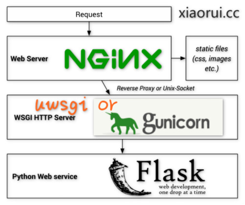
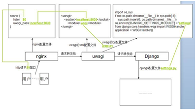

| 序号 | 修改时间   | 修改内容            | 修改人 | 审稿人 |
| ---- | ---------- | -------------------------------- | ------ | ------ |
| 1    | 2016-5-18  | 创建   | Keefe | Keefe |
| 2    | 2016-6-19  | 更新常用开发库      | 同上   |        |
| 3    | 2016-8-16  | 更新SQL操作失败分析 | 同上   |        |
| 4    | 2016-9-8   | 更新python源码阅读  | 同上   |        |
| 5    | 2016-10-27 | 更新python常用模块和模块安装     | 同上   |        |
| 6    | 2017-8-30  | 更新python特殊语法和内部模块章节 | 同上   |        |
| 7    | 2017-10-8  | 更新python开发库章节 | 同上   |        |
| 8    | 2018-3-20  | 增加常用算法/数据结构章节        | 同上   |        |
| 9    | 2018-7-11  | 增加IDE~jupyter章节 | 同上   |        |
| 10 | 2021-6-11 | 更新python语言版本和更新装饰器内容。<br>迁移python源码剖析章节另文。 | 同上 |        |
| 11 | 2021-11-19 | 更新python各版本特性 | 同上 | |


<br>

---

# 目录

[TOC]


<br>

---

# 1  Python概述
## 1.1  Python简介
**发展历史**
Python 是由 Guido van Rossum 在八十年代末和九十年代初，在荷兰国家数学和计算机科学研究所设计出来的。
Python 本身也是由诸多其他语言发展而来的,这包括 ABC、Modula-3、C、C++、Algol-68、SmallTalk、Unix shell 和其他的脚本语言等等。
像 Perl 语言一样，Python 源代码同样遵循 GPL(GNU General Public License)协议。
现在 Python 是由一个核心开发团队在维护，Guido van Rossum 仍然占据着至关重要的作用，指导其进展。

**Python 特点**
1. 易于学习：Python有相对较少的关键字，结构简单，和一个明确定义的语法，学习起来更加简单。
2. 易于阅读：Python代码定义的更清晰。
3. 易于维护：Python的成功在于它的源代码是相当容易维护的。
4. 一个广泛的标准库：Python的最大的优势之一是丰富的库，跨平台的，在UNIX，Windows和Macintosh兼容很好。
5. 互动模式：互动模式的支持，您可以从终端输入执行代码并获得结果的语言，互动的测试和调试代码片断。
6. 可移植：基于其开放源代码的特性，Python已经被移植（也就是使其工作）到许多平台。
7. 可扩展：如果你需要一段运行很快的关键代码，或者是想要编写一些不愿开放的算法，你可以使用C或C++完成那部分程序，然后从你的Python程序中调用。
8. 数据库：Python提供所有主要的商业数据库的接口。
9. GUI编程：Python支持GUI可以创建和移植到许多系统调用。
10. 可嵌入: 你可以将Python嵌入到C/C++程序，让你的程序的用户获得"脚本化"的能力。


```bash
# 进入python的交互式界面
$ python -i
```


## 1.2   Python语言及版本


Python是一种解释型、面向对象、动态数据类型的高级程序设计语言。
Python由Guido van Rossum于1989年底发明，第一个公开发行版发行于1991年。
像Perl语言一样, Python 源代码同样遵循 GPL(GNU General Public License)协议。

Python 是一个高层次的结合了解释性、编译性、互动性和面向对象的脚本语言。
Python 的设计具有很强的可读性，相比其他语言经常使用英文关键字，其他语言的一些标点符号，它具有比其他语言更有特色语法结构。
*  Python 是一种解释型语言： 这意味着开发过程中没有了编译这个环节。类似于PHP和Perl语言。
*  python是编译型语言：python -m *.py可以生成pyc字节码文件，此字节码可以直接在虚拟机中运行。
*  Python 是交互式语言： 这意味着，您可以在一个Python提示符，直接互动执行写你的程序。
*  Python 是面向对象语言: 这意味着Python支持面向对象的风格或代码封装在对象的编程技术。
*  Python 是初学者的语言：Python 对初级程序员而言，是一种伟大的语言，它支持广泛的应用程序开发，从简单的文字处理到 WWW 浏览器再到游戏。
*  python还支持函数式编程。


[For more information visit the Python Developer's Guide](https://devguide.python.org/#status-of-python-branches).

表格 python版本活跃状态

| Branch | Schedule                                                | Status   | First release | End-of-life  | Release manager       |
| ------ | ------------------------------------------------------- | -------- | ------------- | ------------ | --------------------- |
| main   | [**PEP 664**](https://www.python.org/dev/peps/pep-0664) | features | *2022-10-03*  | *2027-10*    | Pablo Galindo Salgado |
| 3.10   | [**PEP 619**](https://www.python.org/dev/peps/pep-0619) | bugfix   | 2021-10-04    | *2026-10*    | Pablo Galindo Salgado |
| 3.9    | [**PEP 596**](https://www.python.org/dev/peps/pep-0596) | bugfix   | 2020-10-05    | *2025-10*    | Łukasz Langa          |
| 3.8    | [**PEP 569**](https://www.python.org/dev/peps/pep-0569) | security | 2019-10-14    | *2024-10*    | Łukasz Langa          |
| 3.7    | [**PEP 537**](https://www.python.org/dev/peps/pep-0537) | security | 2018-06-27    | *2023-06-27* | Ned Deily             |
| 3.6    | [**PEP 494**](https://www.python.org/dev/peps/pep-0494) | security | 2016-12-23    | *2021-12-23* | Ned Deily             |

>  备注:
>
>  *PEP*, *Python* Enhancement Proposals的缩写。一个*PEP*是一份为*Python*社区提供各种增强功能的技术规格，也是提交新特性，以便让社区指出问题，精确化技术文档的提案。
>
>  TBD: To Be Discussed 待讨论


表格 End-of-life branches

| Branch | Schedule                                                | First release | End-of-life | Release manager                     | 摘要            |
| ------ | ------------------------------------------------------- | ------------- | ----------- | ----------------------------------- | --------------- |
| 3.5    | [**PEP 478**](https://www.python.org/dev/peps/pep-0478) | 2015-09-13    | 2020-09-30  | Larry Hastings                      |                 |
| 3.4    | [**PEP 429**](https://www.python.org/dev/peps/pep-0429) | 2014-03-16    | 2019-03-18  | Larry Hastings                      |                 |
| 3.3    | [**PEP 398**](https://www.python.org/dev/peps/pep-0398) | 2012-09-29    | 2017-09-29  | Georg Brandl,<br>Ned Deily (3.3.7+) |                 |
| 3.2    | [**PEP 392**](https://www.python.org/dev/peps/pep-0392) | 2011-02-20    | 2016-02-20  | Georg Brandl                        |                 |
| 3.1    | [**PEP 375**](https://www.python.org/dev/peps/pep-0375) | 2009-06-27    | 2012-04-09  | Benjamin Peterson                   |                 |
| 3.0    | [**PEP 361**](https://www.python.org/dev/peps/pep-0361) | 2008-12-03    | 2009-06-27  | Barry Warsaw                        |                 |
| 2.7    | [**PEP 373**](https://www.python.org/dev/peps/pep-0373) | 2010-07-03    | 2020-01-01  | Benjamin Peterson                   | 2.x系列最终版本 |
| 2.6    | [**PEP 361**](https://www.python.org/dev/peps/pep-0361) | 2008-10-01    | 2013-10-29  | Barry Warsaw                        |                 |


表格 Python各版本特性详述

| 版本 | 特性 Features                                                | 备注                                                         |
| ---- | ------------------------------------------------------------ | ------------------------------------------------------------ |
| 3.10 | [PEP 604](https://www.python.org/dev/peps/pep-0604), Allow writing union types as `X | Y` <br/>[PEP 612](https://www.python.org/dev/peps/pep-0612), Parameter Specification Variables <br/>[PEP 613](https://www.python.org/dev/peps/pep-0613), Explicit Type Aliases <br/>[PEP 618](https://www.python.org/dev/peps/pep-0618), Add Optional Length-Checking To `zip` <br/>[PEP 626](https://www.python.org/dev/peps/pep-0626), Precise line numbers for debugging and other tools <br/>[PEP 634](https://www.python.org/dev/peps/pep-0634), [PEP 635](https://www.python.org/dev/peps/pep-0635), [PEP 636](https://www.python.org/dev/peps/pep-0636), Structural Pattern Matching <br/>[PEP 644](https://www.python.org/dev/peps/pep-0644), Require OpenSSL 1.1.1 or newer <br/>[PEP 624](https://www.python.org/dev/peps/pep-0624), Remove Py_UNICODE encoder APIs <br/>[PEP 597](https://www.python.org/dev/peps/pep-0597), Add optional EncodingWarning | [Features for 3.10](https://www.python.org/dev/peps/pep-0619/#toc-entry-7) |
| 3.9  | [PEP 573](https://www.python.org/dev/peps/pep-0573), Module State Access from C Extension Methods  <br/>[PEP 584](https://www.python.org/dev/peps/pep-0584), Add Union Operators To dict <br/>[PEP 585](https://www.python.org/dev/peps/pep-0585), Type Hinting Generics In Standard Collections  <br/>[PEP 593](https://www.python.org/dev/peps/pep-0593), Flexible function and variable annotations <br/>[PEP 614](https://www.python.org/dev/peps/pep-0614), Relaxing Grammar Restrictions On Decorators <br/>[PEP 615](https://www.python.org/dev/peps/pep-0615), Support for the IANA Time Zone Database in the Standard Library <br/>[PEP 616](https://www.python.org/dev/peps/pep-0616), String methods to remove prefixes and suffixes  <br/>[PEP 617](https://www.python.org/dev/peps/pep-0617), New PEG parser for CPython | [Features for 3.9](https://www.python.org/dev/peps/pep-0596/#toc-entry-8) |
| 3.8  | [PEP 570](https://www.python.org/dev/peps/pep-0570), Positional-only arguments [PEP 572](https://www.python.org/dev/peps/pep-0572), Assignment Expressions [PEP 574](https://www.python.org/dev/peps/pep-0574), Pickle protocol 5 with out-of-band data <br/>[PEP 578](https://www.python.org/dev/peps/pep-0578), Runtime audit hooks [PEP 587](https://www.python.org/dev/peps/pep-0587), Python Initialization Configuration <br/>[PEP 590](https://www.python.org/dev/peps/pep-0590), Vectorcall: a fast calling protocol for CPython <br/>Typing-related: [PEP 591](https://www.python.org/dev/peps/pep-0591) (Final qualifier), [PEP 586](https://www.python.org/dev/peps/pep-0586) (Literal types), and [PEP 589](https://www.python.org/dev/peps/pep-0589) (TypedDict) <br/>Parallel filesystem cache for compiled bytecode. Debug builds share ABI as release builds. f-strings support a handy `=` specifier for debugging. <br/>`continue` is now legal in `finally:` blocks. <br/>on Windows, the default `asyncio` event loop is now `ProactorEventLoop`. <br/>on macOS, the *spawn* start method is now used by default in `multiprocessing`. <br/>`multiprocessing` can now use shared memory segments to avoid pickling costs between processes. <br/>`typed_ast` is merged back to CPython. `LOAD_GLOBAL` is now 40% faster. <br/>`pickle` now uses Protocol 4 by default, improving performance | [Features for 3.8](https://www.python.org/dev/peps/pep-0569/#toc-entry-8) <br>多进程, 事件循环 |
| 3.7  | [PEP 538](https://www.python.org/dev/peps/pep-0538), Coercing the legacy C locale to a UTF-8 based locale <br/>[PEP 539](https://www.python.org/dev/peps/pep-0539), A New C-API for Thread-Local Storage in CPython <br/>[PEP 540](https://www.python.org/dev/peps/pep-0540), `UTF-8` mode [PEP 552](https://www.python.org/dev/peps/pep-0552), Deterministic `pyc` [PEP 553](https://www.python.org/dev/peps/pep-0553), Built-in breakpoint() <br/>[PEP 557](https://www.python.org/dev/peps/pep-0557), Data Classes [PEP 560](https://www.python.org/dev/peps/pep-0560), Core support for typing module and generic types <br/>[PEP 562](https://www.python.org/dev/peps/pep-0562), Module `__getattr__` and `__dir__` [PEP 563](https://www.python.org/dev/peps/pep-0563), Postponed Evaluation of Annotations <br/>[PEP 564](https://www.python.org/dev/peps/pep-0564), Time functions with nanosecond resolution <br/>[PEP 565](https://www.python.org/dev/peps/pep-0565), Show DeprecationWarning in __main__ [PEP 567](https://www.python.org/dev/peps/pep-0567), Context Variables | [Features for 3.7](https://www.python.org/dev/peps/pep-0537/#toc-entry-19) |
| 3.6  | [PEP 468](https://www.python.org/dev/peps/pep-0468), Preserving Keyword Argument Order [PEP 487](https://www.python.org/dev/peps/pep-0487), Simpler customization of class creation  <br/>[PEP 495](https://www.python.org/dev/peps/pep-0495), Local Time Disambiguation [PEP 498](https://www.python.org/dev/peps/pep-0498), Literal String Formatting  <br/>[PEP 506](https://www.python.org/dev/peps/pep-0506), Adding A Secrets Module To The Standard Library [PEP 509](https://www.python.org/dev/peps/pep-0509), Add a private version to dict  <br/>[PEP 515](https://www.python.org/dev/peps/pep-0515), Underscores in Numeric Literals [PEP 519](https://www.python.org/dev/peps/pep-0519), Adding a file system path protocol  <br/>[PEP 520](https://www.python.org/dev/peps/pep-0520), Preserving Class Attribute Definition Order [PEP 523](https://www.python.org/dev/peps/pep-0523), Adding a frame evaluation API to CPython  <br/>[PEP 524](https://www.python.org/dev/peps/pep-0524), Make os.urandom() blocking on Linux (during system startup)  <br/>[PEP 525](https://www.python.org/dev/peps/pep-0525), Asynchronous Generators (provisional) [PEP 526](https://www.python.org/dev/peps/pep-0526), Syntax for Variable Annotations (provisional)  <br/>[PEP 528](https://www.python.org/dev/peps/pep-0528), Change Windows console encoding to UTF-8 (provisional)  <br/>[PEP 529](https://www.python.org/dev/peps/pep-0529), Change Windows filesystem encoding to UTF-8 (provisional)  <br/>[PEP 530](https://www.python.org/dev/peps/pep-0530), Asynchronous Comprehensions | [Features for 3.6](https://www.python.org/dev/peps/pep-0494/#toc-entry-22) <br>asyncio成为标准库 |
| 3.5  |                                                              | [Features for 3.5](https://www.python.org/dev/peps/pep-0478/#toc-entry-4) |
| ...  |                                                              |                                                              |
| 2.7  |                                                              |                                                              |


## 1.3  Python解释器

python是编程语言，而不是运行时环境。python有几个实现，分别是CPython、Cython、Jython、IronPython和PyPy。
表格 1 各种python解释器比较列表


| 解释器实现 | 简介     | 应用场景  |
| ---------- | ------------------------------------------------------------ | ------------------------------------------------------------ |
| Anaconda   | 公司推的，带免费版和商业版插件。成熟的科学计算环境，包括了常用的   Numpy,Scipy，matplotlib和networkx 等，以及 beautiful-soup，requests，flask，tornado   等网络相关的扩展。   提供了Python2.7和Python3.4两个版本，使用conda管理python扩展。 | 科学计算领域包括数据挖掘和机器学习。   $ conda list   $ conda install xxx |
| **CPython** | C语言实现，使用最广泛，是缺省的python解释器。有GIL机制。     | 通用。    |
| PyPy       | python语言实现的解释器，拥有的JIT编译、增量垃圾收集等诸多先进特性。pypy3去除了GIL。   编译安装需依赖python模块pycparser，将python代码转换成C代码，再编译成二进制文件。 | 脚本需经常运行，不需要完全支持第三方库。        |
| Cython     | 将Python代码转换成C语言代码，再进行编译。       | 一般作为C扩展生成动态库，供python模块导入。     |
| Jython     | Python用于JVM的一个成熟实验。      | 与Java混用。          |
| Rython     | Python与R语言的结合。  | 与R混用。 |
| IronPython | 微软针对自家开发的，基于.NET的python实现。      | 与C#混用。            |

备注：pypy在长期运行脚本中，提升性能显著。


## 1.4  py/pyc/pyo/pyd
表格 2 python各种文件格式

| 名称 | 简介         | 生成方式            |
| ---- | -------------------------------------- | ---------------------------------------------------------- |
| py   | python源文件  |        |
| pyc  | python编译后的字节码      | `python -m py_compile *.py` 或者 `python -m compileall *.py` |
| pyo  | python编译优化后的字节码。   -O 或 -OO | python -O -m py_compile *.py   或 -OO 去除注释，文件更小。 |
| pyd  | python动态库。            |        |

备注：1. 字节码bytecode是二进制文件，pyo和pyc文件都是字节码(python3.5后优化后的文件也是以pyc文件存储)。字节码文件只是加快了加载速度, 并不能加快运行速度.
2. **py_compile** 模块可编译生成各种文件格式。


## 1.5 python编译安装

命令

```shell
# 安装依赖包 centos:
$yum install -y gcc make build-essential libreadline-dev libsqlite3-dev wget curl llvm libncurses5-dev libncursesw5-dev xz-utils tk-dev libffi-dev liblzma-dev
$yum install libssl-dev zlib1g-dev libbz2-dev

# 编译命令：--with-ssl 需要 bz2 ssl开发库
$cd $PYTHON_PATH
$./configure --prefix=/usr/local/Python3.8 --with-ssl --enable-optimizations
$make
$make install
```


<br>

# 2  Python语言教程

## 2.1   python对象

在 Python 中，一切都是对象，并且几乎一切都有属性和方法。所有的函数都有一个内置的` __doc__` 属性，它会返回在函数源代码中定义的 doc string。
self 只有对象实例化（即隐式调用`__init__`）才能使用self, public属性不需实例化也能调用。因此对于结构类要求在__init__外初始化所有公共属性。

### 2.1.1  对象概述
**包package**
包是一个分层次的文件目录结构，它定义了一个由模块及子包，和子包下的子包等组成的 Python 的应用环境。
简单来说，包就是文件夹，但该文件夹下必须存在 __init__.py 文件, 该文件的内容可以为空。

**闭包**
如果在一个内部函数里，对在外部作用域的变量进行引用，那么内部函数就被认为是闭包。用Python的语言介绍就是，调用一个函数A，这个函数A返回了一个函数B给你，这个返回的函数B就叫做闭包。
 装饰器就是一个闭包。

表格 3 python对象列表 types

| 对象名   | 简介     | 内建类型            |
| -------- | ------------------------------------------------------------ | ------------------- |
| 对象     |          | ObjectType          |
| 模块     | 一个py文件就是一个模块。           | ModuleType          |
| 类       |          | ClassType           |
| 实例     | 对象赋值后即为一个实例。           | InstanceType        |
| 函数     | 类似C中的函数，无需实例化即可调用。 | FunctionType        |
| 方法     | 类中定义的函数叫方法，第一个参数为实例，约定名称为self。<br>类的方法若用了@staticmethod 就成了FunctionType | MethodType          |
| 内建函数 |          | BuiltinFunctionType |
| 内建方法 |          | BuiltinMethodType   |
| 切片     | 如使用符号 `[start:end:step]`    | slice  |
| 代码     | 通过调用内建函数compile() 可得到代码对象。      | code   |
| 跟踪对象 | 异常诊断信息。        | TracebackType       |
| 帧对象   | python执行栈。        | FrameType           |
| 省略器   | 用在切片对象中，起记号使用。       | EllipsisType        |
| 生成器   | 带有yield的函数被称为生成器。类似迭代器，但生成一次，每次迭代返回当前迭代值。<br>调用生成器函数时会创建生成器对象。生成器类要实现2个内置方法`__iter__`, `__next__` | GeneratorType       |
| 迭代器   | 可以使用 “for··· in ···” 来操作。<BR>迭代器是访问集合元素的一种方式，可以从头访问到尾。内部实现用next方法访问下个元素。 |        |
| xrange   | python3.x去除了此类型 | XRangeType          |
| None     | python的NULL对象      | NoneType          |

备注：1. 对象类型详见内建类型。常用数据结构也有各自的内置类型。
2. 查看对象的类型：type(object)。
3. 查看对象能引用的名字列表：dir(object)。一般都具有以下属性：`__all__, __builtins__, __doc__, __file__, __name__, __package__`。
4. 对象调用callable(object) ： 用来确定对象是否可以函数操作符() 来调用。
Return [True](https://docs.python.org/2/library/constants.html#True) if the object argument appears callable, [False](https://docs.python.org/2/library/constants.html#False) if not.
class instances are callable if they have a [__call__()](https://docs.python.org/2/reference/datamodel.html#object.__call__) method.

示例：
```python
>>> callable(dir)
True
>>> callable('fuck')
False
```

**类和实例**
**示例：**
```python
>>> class Foo():
... 	pass
...
>>> type(Foo)
<type 'classobj'>
>>> f=Foo()
>>> type(f)
<type 'instance'>
```

### 2.1.2  对象引用、深拷贝和浅拷贝
**可用getattr获取对象引用。**
**getattr(...)**
    getattr(object, name[, default]) -> value
   Get a named attribute from an object; getattr(x, 'y') is equivalent to x.y.

```PYTHON
>>> getattr({}, "clear")
<built-in method clear of dict object at 0x07204660>
>>> getattr([], "pop")
<built-in method pop of list object at 0x071C2288>
>>> getattr((), "pop")
Traceback (most recent call last):
  File "<interactive input>", line 1, in <module>
AttributeError: 'tuple' object has no attribute 'pop'
```
**说明：上述例子中dict有clear 方法，tuple无pop方法，list有pop方法。**

1）对象引用，引用和原对象的修改会同步变化。python中对象的赋值（=）都是进行对象引用（内存地址）传递。
2）深拷贝deepcopy

```python
import copy
copy.deepcopy( )
```

**3）浅拷贝**copy
```python
import copy
copy.copy( )
```

浅拷贝就只会使用原始元素的引用（内存地址）
当我们使用下面的操作的时候，会产生浅拷贝的效果：
* 使用切片[:]操作
* 使用工厂函数（如list/dir/set）
* 使用copy模块中的copy()函数

**小结：**
* Python中对象的赋值都是进行对象引用（内存地址）传递
* 使用copy.copy()，可以进行对象的浅拷贝，它复制了对象，但对于对象中的元素，依然使用原始的引用.
* 如果需要复制一个容器对象，以及它里面的所有元素（包含元素的子元素），可以使用copy.deepcopy()进行深拷贝。
* 对于非容器类型（如数字、字符串、和其他’原子’类型的对象）没有被拷贝一说
* 如果元祖变量只包含原子类型对象，则不能深拷。


## 2.2  标准库Standard Library

详见 《[python源码剖析](python源码剖析.md)》标准库章节


**保留关键字keyword**有：

*  简单表达式：assert pass del print return yield break continue import global exec
*  控制流：if while for try with
*  内建常量constant有：False True None NotImplemented Ellipsis `__debug__`

表格 4 python标准库/模块列表


| 功能       | 模块 或类名 | 简介     | 备注     |
| ---------- | ------------- | ------------------------------------------------------------ | ------------------------------------------------------------ |
| 系统       | sys           | 系统模块，包含了跟python解析器和环境相关的变量和函数。<br>  [System-specific   parameters and functions](https://docs.python.org/2/library/sys.html). | `sys.modules` 包含了你在 IDE 中运行的所有程序所导入的所有模块。 |
|            | os            | 操作系统相关的模块，如路径path     |          |
| 内建       | `__builtin__` | [**__builtin__** —   Built-in objects](https://docs.python.org/2/library/__builtin__.html) |          |
| 字符串     | string        | 字符串操作函数库      |          |
|            | re            | 正则表达 式           |          |
| 日期时间   | datetime      |          |          |
| 文件操作   |  | 包括os.path, stat, filecomp, glob...     |          |
| 数据持久化 |  | 包括mysql_python, sqlite3          |          |
| 文件格式   |  | zip, csv, |          |
| 模块分发   | distutils     | [Building   and installing Python modules](https://docs.python.org/2/library/distutils.html) |          |
|            | ensurepip     | [Bootstrapping the pip installer](https://docs.python.org/2/library/ensurepip.html) |          |


## 2.3  表达式

### 2.3.1  控制流
if/for/while的表达式可以用()圈起来，也可以不用。pass空语句，可用来填充空函数或空表达式。

* if：if语句组成有if/elif/else.
     if xx:  #非常强大的判断语句，支持NULL,容器空(无需len函数)的判断
* for iterating_var in sequence:  相当于不断调用sequence.next方法
* while: 支持continue, break.


**for 循环的本质**

```python
for x in [1, 2, 3, 4, 5]:
    pass
```

相当于：

```python
# 首先获取可迭代对象
it = iter([1, 2, 3, 4, 5])
while True:
    try:
        next(it)
    except StopIteration:
        # 遇到StopIteration就跳出循环, 且自动频闭StopIteration异常
        break
```


### 2.3.2  with语句与上下文管理

with语句支持在上下文管理器对象控制下的上下文中执行一系列语句。已经加入对上下文管理协议支持的还有模块 threading、decimal 等。

* **上下文管理协议**（Context Management Protocol）：包含方法 `__enter__`() 和 `__exit__`()，支持该协议的对象要实现这两个方法。
* **上下文管理器**（Context Manager）：支持上下文管理协议的对象，这种对象实现了 `__enter__()` 和 `__exit__() `方法。上下文管理器定义执行 with 语句时要建立的运行时上下文，负责执行 with 语句块上下文中的进入与退出操作。通常使用 with 语句调用上下文管理器，也可以通过直接调用其方法来使用。

**应用场景**：用在资源需要管控的情形，如安全用锁，函数计时，DB连接操作，文件操作。

上下文类示例： 上下文管理器实现计时器

```python
# coding:utf-8
import time

class TimeTrace:
    def __init__(self, f):
        self.f = f
        print(f.__doc__)	#打印函数文档

    def __now(self):
        return time.time()

    def __enter__(self):	#进入
        self.start = self.__now()
        return self

    def __exit__(self, exc_type, exc_val, tb):	#退出
        self.end = self.__now()
        print('cost {}'.format(self.end - self.start))

    def __call__(self, n):	#调用
        start = self.__now()
        val = self.f(n)
        end = self.__now()
        print('{}, {}, {}, cost: {} seconds'.format(self.f.__name__, n, val,
                                                    (end - start)))
        return val


def fib(n):
    """
    fib 斐波那契递归计算
    :params n 个数
    :return 当前斐波那契数值
    """
    if n <= 1:
        return n
    return fib(n - 1) + fib(n - 2)


with TimeTrace(fib) as fib:	#上下文调用
    print(fib(5))
```


with 语句的语法格式

```
with context_expression [as target(s)]:
   with-body
```

with调用示例：

```python
with open(r'somefileName') as somefile:
   for line in somefile:
       print line
       # ...more code
```

说明：这里使用了 with 语句，不管在处理文件过程中是否发生异常，都能保证 with 语句执行完毕后已经关闭了打开的文件句柄。比较起来，使用 with 语句可以减少编码量。

另外python库中还有一个模块contextlib，使你不用构造含有`__enter__, __exit__`的类就可以使用with。


### 2.3.3  三元表达式

*  variable = a if exper else b
*  variable = (exper and [b] or [c])[0]
*  variable = exper and b or c
示例：取两值中较大者max
```python
a,b=1,2
max = (a if a > b else b)
max = (a > b and [a] or [b])[0] #list
max = (a > b and a or b)
```

说明：and/or/if语句中，如果前面为False，那么后面部分将不执行。

## 2.4  字符串与字符串函数
格式化字符串：
*  字符串连接用’+’,  ‘+=’，如str1=’fuck1’;  str2= ‘fuck2’ + str1
*  非字符串转化成字符串，使用%，格式串符号详见表格 12 python字符串格式化符号。
如 len=2; str=’len=%d’ %(len)
说明：%格式化符号的速度会比+的性能会高些。


字符串转化为元组、列表和字典:

```python
eval(str)
#字符串转为元组，返回：(1, 2, 3)
print tuple(eval("(1,2,3)"))
#字符串转为列表，返回：[1, 2, 3]
print list(eval("(1,2,3)"))
#字符串转为字典，返回：<type 'dict'>
print type(eval("{'name':'ljq', 'age':24}"))
```

**元组、列表和字典转化为字符串**:  str(sequence)


**Python转义字符**
在需要在字符中使用特殊字符时，python用反斜杠(\)转义字符。如下表：
表格 10Python转义字符列表

| 转义字符 | 描述           |
| ------------ | -------------------------------------------- |
| \(在行尾时)  | 续行符 |
| \\           | 反斜杠符号         |
| \'           | 单引号 |
| \"           | 双引号 |
| \a           | 响铃   |
| \b           | 退格(Backspace)    |
| \e           | 转义   |
| \000         | 空    |
| \n           | 换行   |
| \v           | 纵向制表符         |
| \t           | 横向制表符         |
| \r           | 回车   |
| \f           | 换页   |
| \oyy         | 八进制数，yy代表的字符，例如：\o12代表换行   |
| \xyy         | 十六进制数，yy代表的字符，例如：\x0a代表换行 |
| \other       | 其它的字符以普通格式输出        |


**Python字符串运算符**
下表实例变量a值为字符串"Hello"，b变量值为"Python"：

表格 11 Python字符串运算符

| 操作符 | 描述     | 实例   |
| ------ | ------------------------------------------------------------ | -------------------------------------------- |
| +      | 字符串连接            | a + b 输出结果：   HelloPython  |
| *      | 重复输出字符串        | a*2 输出结果：HelloHello        |
| []     | 通过索引获取字符串中字符           | a[1] 输出结果 e    |
| [ : ]  | 截取字符串中的一部分   | a[1:4] 输出结果 el* |
| in     | 成员运算符 - 如果字符串中包含给定的字符返回 True | H in a 输出结果 1  |
| not in | 成员运算符 - 如果字符串中不包含给定的字符返回 True           | M not in a 输出结果 1           |
| r/R    | 原始字符串 - 原始字符串：所有的字符串都是直接按照字面的意思来使用，没有转义特殊或不能打印的字符。   原始字符串除在字符串的第一个引号前加上字母"r"（可以大小写）以外，与普通字符串有着几乎完全相同的语法。 | print r'\n' 输出 \n   和 print R'\n' 输出 \n |
| %      | 格式字符串            |       |


表格 12 python字符串格式化符号

| 符号 | 描述       |
| ---- | ------------------------------------ |
| %c   | 格式化字符及其ASCII码   |
| %s   | 格式化字符串            |
| %d   | 格式化整数  |
| %u   | 格式化无符号整型        |
| %o   | 格式化无符号八进制数    |
| %x   | 格式化无符号十六进制数  |
| %X   | 格式化无符号十六进制数（大写）       |
| %f   | 格式化浮点数字，可指定小数点后的精度 |
| %e   | 用科学计数法格式化浮点数 |
| %E   | 作用同%e，用科学计数法格式化浮点数   |
| %g   | %f和%e的简写            |
| %G   | %f和%E的简写            |
| %p   | 用十六进制数格式化变量的地址         |


表格 13格式化操作符辅助指令

| 符号  | 功能     |
| ----- | ------------------------------------------------------------ |
| *     | 定义宽度或者小数点精度 |
| -     | 用做左对齐            |
| +     | 在正数前面显示加号( + )            |
| <sp>  | 在正数前面显示空格    |
| #     | 在八进制数前面显示零('0')，在十六进制前面显示'0x'或者'0X'(取决于用的是'x'还是'X') |
| 0     | 显示的数字前面填充'0'而不是默认的空格           |
| %     | '%%'输出一个单一的'%'  |
| (var) | 映射变量(字典参数)    |
| m.n.  | m 是显示的最小总宽度,n 是小数点后的位数(如果可用的话)        |

> 备注：字符串不能与数值相加，需将数值转化为字符串或用%来格式化。


**Python三引号（triple quotes）**
python中三引号可以将复杂的字符串进行复制:
python三引号允许一个字符串跨多行，字符串中可以包含换行符、制表符以及其他特殊字符。三引号的语法是一对连续的单引号或者双引号（通常都是成对的用）。
python三引号常用作文档注释。

**Python的字符串内建函数**
字符串方法是从python1.6到2.0慢慢加进来的——它们也被加到了Jython中。
这些方法实现了string模块的大部分方法，如下表所示列出了目前字符串内建支持的方法，所有的方法都包含了对Unicode的支持，有一些甚至是专门用于Unicode的。
表格 14 Python的字符串内建函数

| 方法     | 描述     |
| ------------------------------------------------------------ | ------------------------------------------------------------ |
| [string.capitalize()](http://www.runoob.com/python/att-string-capitalize.html) | 把字符串的第一个字符大写           |
| [string.center(width)](http://www.runoob.com/python/att-string-center.html) | 返回一个原字符串居中,并使用空格填充至长度 width 的新字符串   |
| [string.count(str,   beg=0, end=len(string))](http://www.runoob.com/python/att-string-count.html) | 返回 str 在 string 里面出现的次数，如果 beg 或者 end 指定则返回指定范围内 str 出现的次数 |
| [string.decode(encoding='UTF-8',   errors='strict')](http://www.runoob.com/python/att-string-decode.html) | 以 encoding 指定的编码格式解码 string，如果出错默认报一个 ValueError 的 异 常 ，   除 非 errors 指 定 的 是 'ignore' 或   者'replace' |
| [string.encode(encoding='UTF-8',   errors='strict')](http://www.runoob.com/python/att-string-encode.html) | 以 encoding 指定的编码格式编码 string，如果出错默认报一个ValueError 的异常，除非 errors 指定的是'ignore'或者'replace' |
| [string.endswith(obj,   beg=0, end=len(string))](http://www.runoob.com/python/att-string-endswith.html) | 检查字符串是否以 obj 结束，如果beg 或者 end 指定则检查指定的范围内是否以 obj 结束，如果是，返回 True,否则返回 False. |
| [string.expandtabs(tabsize=8)](http://www.runoob.com/python/att-string-expandtabs.html) | 把字符串 string 中的   tab 符号转为空格，tab 符号默认的空格数是 8。 |
| [string.find(str, beg=0, end=len(string))](http://www.runoob.com/python/att-string-find.html) | 检测 str 是否包含在 string 中，如果 beg 和   end 指定范围，则检查是否包含在指定范围内，如果是返回开始的索引值，否则返回-1 |
| [string.index(str, beg=0, end=len(string))](http://www.runoob.com/python/att-string-index.html) | 跟find()方法一样，只不过如果str不在 string中会报一个异常. |
| [string.isalnum()](http://www.runoob.com/python/att-string-isalnum.html) | 如果 string 至少有一个字符并且所有字符都是字母或数字则返   回 True,否则返回 False |
| [string.isalpha()](http://www.runoob.com/python/att-string-isalpha.html) | 如果 string 至少有一个字符并且所有字符都是字母则返回 True,   否则返回 False |
| [string.isdecimal()](http://www.runoob.com/python/att-string-isdecimal.html) | 如果 string 只包含十进制数字则返回 True 否则返回 False.  |
| [string.isdigit()](http://www.runoob.com/python/att-string-isdigit.html) | 如果 string 只包含数字则返回 True 否则返回 False.     |
| [string.islower()](http://www.runoob.com/python/att-string-islower.html) | 如果 string 中包含至少一个区分大小写的字符，并且所有这些(区分大小写的)字符都是小写，则返回   True，否则返回 False |
| [string.isnumeric()](http://www.runoob.com/python/att-string-isnumeric.html) | 如果 string 中只包含数字字符，则返回 True，否则返回 False    |
| [string.isspace()](http://www.runoob.com/python/att-string-isspace.html) | 如果 string 中只包含空格，则返回 True，否则返回 False.   |
| [string.istitle()](http://www.runoob.com/python/att-string-istitle.html) | 如果 string 是标题化的(见 title())则返回 True，否则返回 False |
| [string.isupper()](http://www.runoob.com/python/att-string-isupper.html) | 如果 string 中包含至少一个区分大小写的字符，并且所有这些(区分大小写的)字符都是大写，则返回   True，否则返回 False |
| [string.join(seq)](http://www.runoob.com/python/att-string-join.html) | 以 string 作为分隔符，将   seq 中所有的元素(的字符串表示)合并为一个新的字符串 |
| [string.ljust(width)](http://www.runoob.com/python/att-string-ljust.html) | 返回一个原字符串左对齐,并使用空格填充至长度 width 的新字符串 |
| [string.lower()](http://www.runoob.com/python/att-string-lower.html) | 转换 string 中所有大写字符为小写.        |
| [string.lstrip()](http://www.runoob.com/python/att-string-lstrip.html) | 截掉 string 左边的空格 |
| [string.maketrans(intab,   outtab\])](http://www.runoob.com/python/att-string-maketrans.html) | maketrans() 方法用于创建字符映射的转换表，对于接受两个参数的最简单的调用方式，第一个参数是字符串，表示需要转换的字符，第二个参数也是字符串表示转换的目标。 |
| [max(str)](http://www.runoob.com/python/att-string-max.html) | 返回字符串 str 中最大的字母。      |
| [min(str)](http://www.runoob.com/python/att-string-min.html) | 返回字符串 str 中最小的字母。      |
| [string.partition(str)](http://www.runoob.com/python/att-string-partition.html) | 有点像 find()和   split()的结合体,从 str 出现的第一个位置起,把 字 符 串 string 分 成 一 个 3 元 素 的 元 组   (string_pre_str,str,string_post_str),如果 string 中不包含str 则 string_pre_str == string. |
| [string.replace(str1,   str2,  num=string.count(str1))](http://www.runoob.com/python/att-string-replace.html) | 把 string 中的 str1 替换成 str2,如果 num 指定，则替换不超过 num 次. |
| [string.rfind(str,   beg=0,end=len(string) )](http://www.runoob.com/python/att-string-rfind.html) | 类似于 find()函数，不过是从右边开始查找. |
| [string.rindex(   str, beg=0,end=len(string))](http://www.runoob.com/python/att-string-rindex.html) | 类似于 index()，不过是从右边开始.        |
| [string.rjust(width)](http://www.runoob.com/python/att-string-rjust.html) | 返回一个原字符串右对齐,并使用空格填充至长度 width 的新字符串 |
| string.rpartition(str) | 类似于 partition()函数,不过是从右边开始查找. |
| [string.rstrip()](http://www.runoob.com/python/att-string-rstrip.html) | 删除 string 字符串末尾的空格.  |
| [string.split(str="",   num=string.count(str))](http://www.runoob.com/python/att-string-split.html) | 以 str 为分隔符切片   string，如果 num有指定值，则仅分隔 num 个子字符串 |
| [string.splitlines(num=string.count('\n'))](http://www.runoob.com/python/att-string-splitlines.html) | 按照行分隔，返回一个包含各行作为元素的列表，如果 num 指定则仅切片 num 个行. |
| [string.startswith(obj,   beg=0,end=len(string))](http://www.runoob.com/python/att-string-startswith.html) | 检查字符串是否是以 obj 开头，是则返回 True，否则返回 False。如果beg 和 end 指定值，则在指定范围内检查. |
| [string.strip([obj\])](http://www.runoob.com/python/att-string-strip.html) | 在 string 上执行   lstrip()和 rstrip()          |
| [string.swapcase()](http://www.runoob.com/python/att-string-swapcase.html) | 翻转 string 中的大小写 |
| [string.title()](http://www.runoob.com/python/att-string-title.html) | 返回"标题化"的 string,就是说所有单词都是以大写开始，其余字母均为小写(见 istitle()) |
| [string.translate(str,   del="")](http://www.runoob.com/python/att-string-translate.html) | 根据 str 给出的表(包含 256 个字符)转换 string   的字符,   要过滤掉的字符放到 del 参数中 |
| [string.upper()](http://www.runoob.com/python/att-string-upper.html) | 转换 string 中的小写字母为大写     |
| [string.zfill(width)](http://www.runoob.com/python/att-string-zfill.html) | 返回长度为 width 的字符串，原字符串 string 右对齐，前面填充0 |
| [string.isdecimal()](http://www.runoob.com/python/att-string-isdecimal.html) | isdecimal()方法检查字符串是否只包含十进制字符。这种方法只存在于unicode对象。 |


## 2.5  正则表达式

**说明**：regex和字符串函数的实现都是C/C++引擎。对于简单情况下，正则表达式一般比字符串函数慢一些。对于一个正则表达式被多次使用的情况下（如提取所有url），可采用预编译re.compile，这会比直接使用re.search/re.findall会快一些。

```sh
    This module exports the following functions:
       match    Match a regular expression pattern to the beginning of a string.
       search   Search a string for the presence of a pattern.
       sub      Substitute occurrences of a pattern found in a string.
       subn     Same as sub, but also return the number of substitutions made.
       split    Split a string by the occurrences of a pattern.
       findal*  Find all occurrences of a pattern in a string.
       finditer Return an iterator yielding a match object for each match.
       compile  Compile a pattern into a RegexObject.
       purge    Clear the regular expression cache.
       escape   Backslash all non-alphanumerics in a string.
```
 ```python
import re
pattern = ur'特技：#c4DBAF4(\W+)#'
matchobj = re.search(pattern, desc, re.IGNORECASE)
if matchobj != None:
    self.stunt = matchobj.group(1)
 ```


前缀：u表示unicode字符串，r 表示不转义的原始字符串
re.search：正则查找。扫描整个字符串并返回第一个成功的匹配。
re.search(pattern, string, flags=0)
re.match：正则匹配。re.match 尝试从字符串的**起始**位置匹配一个模式，如果不是起始位置匹配成功的话，match()就返回none。
re.match(pattern, string, flags=0)
re.sub: 正则替换。
re.sub(pattern, repl, string, count=0, flags=0)  #repl为表达式或函数
注：re.match只匹配字符串的开始，如果字符串开始不符合正则表达式，则匹配失败，函数返回None；而re.search匹配整个字符串，直到找到一个匹配。

**多个匹配**：
re.findal*  返回一个匹配列表
```python
 matchobj = re.findall(ur'#c4DBAF4(\W+)#Y', desc)
```


### 2.5.1  正则表达式修饰符与模式

正则表达式修饰符 - 可选标志
正则表达式可以包含一些可选标志修饰符来控制匹配的模式。修饰符被指定为一个可选的标志。多个标志可以通过按位 OR(|) 它们来指定。如 re.I | re.M 被设置成 I 和 M 标志：
表格 15正则表达式修饰符 - 可选标志
| 修饰符 | 描述     |
| ------ | ------------------------------------------------------------ |
| re.I   | 使匹配对大小写不敏感   |
| re.*   | 做本地化识别（locale-aware）匹配   |
| re.M   | 多行匹配，影响 ^ 和 $  |
| re.S   | 使 . 匹配包括换行在内的所有字符    |
| re.U   | 根据Unicode字符集解析字符。这个标志影响 \w, \W, \b, \B.  |
| re.X   | 该标志通过给予你更灵活的格式以便你将正则表达式写得更易于理解。 |

> 说明：贪婪匹配是(.*)，非贪婪匹配是(.*?)。 实际使用中 如页面寻找链接href，要使用非贪婪匹配。


**正则表达式模式**
模式字符串使用特殊的语法来表示一个正则表达式：
字母和数字表示他们自身。一个正则表达式模式中的字母和数字匹配同样的字符串。
多数字母和数字前加一个反斜杠时会拥有不同的含义。
标点符号只有被转义时才匹配自身，否则它们表示特殊的含义。
反斜杠本身需要使用反斜杠转义。
由于正则表达式通常都包含反斜杠，所以你最好使用原始字符串来表示它们。模式元素(如 r'/t'，等价于'//t')匹配相应的特殊字符。
下表列出了正则表达式模式语法中的特殊元素。如果你使用模式的同时提供了可选的标志参数，某些模式元素的含义会改变。
表格 16正则表达式模式

| 模式        | 描述     |
| ----------- | ------------------------------------------------------------ |
| ^           | 匹配字符串的开头      |
| $           | 匹配字符串的末尾。    |
| .    | 匹配任意字符，除了换行符，当re.DOTALL标记被指定时，则可以匹配包括换行符的任意字符。 |
| [...]       | 用来表示一组字符,单独列出：[amk]   匹配 'a'，'m'或'k'        |
| [^...]      | 不在[]中的字符：[^abc] 匹配除了a,b,c之外的字符。 |
| re*         | 匹配0个或多个的表达式。            |
| re+         | 匹配1个或多个的表达式。            |
| re?         | 匹配0个或1个由前面的正则表达式定义的片段，非贪婪方式         |
| re{ n}      |          |
| re{ n,}     | 精确匹配n个前面表达式。            |
| re{ n, m}   | 匹配 n 到 m 次由前面的正则表达式定义的片段，贪婪方式         |
| a\| b       | 匹配a或b  |
| (re)        | G匹配括号内的表达式，也表示一个组  |
| (?imx)      | 正则表达式包含三种可选标志：i, m, 或 x 。只影响括号中的区域。 |
| (?-imx)     | 正则表达式关闭 i, m, 或 x   可选标志。只影响括号中的区域。   |
| (?: re)     | 类似 (...), 但是不表示一个组       |
| (?imx: re)  | 在括号中使用i, m, 或 x 可选标志    |
| (?-imx: re) | 在括号中不使用i, m, 或 x 可选标志  |
| (?#...)     | 注释. |
| (?= re)     | 前向肯定界定符。如果所含正则表达式，以 ... 表示，在当前位置成功匹配时成功，否则失败。但一旦所含表达式已经尝试，匹配引擎根本没有提高；模式的剩余部分还要尝试界定符的右边。 |
| (?! re)     | 前向否定界定符。与肯定界定符相反；当所含表达式不能在字符串当前位置匹配时成功 |
| (?> re)     | 匹配的独立模式，省去回溯。         |
| \w          | 匹配字母数字          |
| \W          | 匹配非字母数字        |
| \s          | 匹配任意空白字符，等价于 [\t\n\r\f].     |
| \S          | 匹配任意非空字符      |
| \d          | 匹配任意数字，等价于 [0-9]. |
| \D          | 匹配任意非数字        |
| \A          | 匹配字符串开始        |
| \Z          | 匹配字符串结束，如果是存在换行，只匹配到换行前的结束字符串。c |
| \z          | 匹配字符串结束        |
| \G          | 匹配最后匹配完成的位置。           |
| \b          | 匹配一个单词边界，也就是指单词和空格间的位置。例如， 'er\b' 可以匹配"never" 中的 'er'，但不能匹配 "verb" 中的 'er'。 |
| \B          | 匹配非单词边界。'er\B' 能匹配 "verb" 中的 'er'，但不能匹配 "never" 中的 'er'。 |
| \n, \t, 等. | 匹配一个换行符。匹配一个制表符。等  |
| \1...\9     | 匹配第n个分组的子表达式。          |
| \10         | 匹配第n个分组的子表达式，如果它经匹配。否则指的是八进制字符码的表达式。 |


### 2.5.2  正则表达式实例

表格 字符匹配
| 实例   | 描述           |
| ------ | -------------- |
| python | 匹配 "python". |
| [Pp]ython]  | 匹配 "Python" 或 "python"         |
| rub[ye]     | 匹配 "ruby" 或 "rube" |
| [aeiou]     | 匹配中括号内的任意一个字母        |
| [0-9]       | 匹配任何数字。类似于 [0123456789] |
| [a-z]       | 匹配任何小写字母     |
| [A-Z]       | 匹配任何大写字母     |
| [a-zA-Z0-9] | 匹配任何字母及数字   |
| [^aeiou]    | 除了aeiou字母以外的所有字符       |
| [^0-9]      | 匹配除了数字外的字符 |


表格 特殊字符类

| 实例 | 描述                                                         |
| ---- | ------------------------------------------------------------ |
| .    | 匹配除 "\n" 之外的任何单个字符。要匹配包括 '\n' 在内的任何字符，请使用象 '[.\n]' 的模式。 |
| \d   | 匹配一个数字字符。等价于 [0-9]。                             |
| \D   | 匹配一个非数字字符。等价于 [^0-9]。                          |
| \s   | 匹配任何空白字符，包括空格、制表符、换页符等等。等价于 [ \f\n\r\t\v]。 |
| \S   | 匹配任何非空白字符。等价于 [^ \f\n\r\t\v]。                  |
| \w   | 匹配包括下划线的任何单词字符。等价于'[A-Za-z0-9_]'。         |
| \W   | 匹配任何非单词字符。等价于 '[^A-Za-z0-9_]'。                 |


## 2.6   异常处理

断言：assert
`__debug__`：内置的只读变量，可用在DEBUG模式下进行额外的检查。

### 2.6.1  异常捕捉、抛出
**异常捕捉：try语句、try-except、try-finally。**
```python
try：
	监控这里的异常
except Exception[, reason]：
     异常处理代码
Finally:
   无论正常还是异常都要处理的代码
else:
   无异常时处理的语句。实际用处不大。
```
**断言：**
他是一句必须等价于布尔真的判定。
断言是通过assert语句实现的，你可以简简单单的想像为 raise-if语句。

**触发异常**raise
我们可以使用raise语句自己触发异常
raise语法格式如下：
raise [Exception [, args [, traceback]]]


### 2.6.2  跟踪异常

**1）采用traceback(跟踪)模块查看异常**
   发生异常时，Python能“记住”引发的异常以及程序的当前状态。Python还维护着traceback（跟踪）对象，其中含有异常发生时与函数调用 堆栈有关的信息。记住，异常可能在一系列嵌套较深的函数调用中引发。程序调用每个函数时，Python会在“函数调用堆栈”的起始处插入函数名。一旦异常 被引发，Python会搜索一个相应的异常处理程序。如果当前函数中没有异常处理程序，当前函数会终止执行，Python会搜索当前函数的调用函数，并以 此类推，直到发现匹配的异常处理程序，或者Python抵达主程序为止。这一查找合适的异常处理程序的过程就称为“堆栈辗转开解”（Stack Unwinding）。解释器一方面维护着与放置堆栈中的函数有关的信息，另一方面也维护着与已从堆栈中“辗转开解”的函数有关的信息。
格式:
```python
try:
 	block
except:
    traceback.print_exc()
```
示例:  excpetion/traceback.py


**2） 采用sys模块回溯最后的异常**
```python
import sys
 try:
    block
 except:
    info=sys.exc_info()
    print info[0],":",info[1]
```

或者以如下的形式:
```python
import sys
tp,val,td = sys.exc_info()
```
sys.exc_info()的返回值是一个tuple, (type, value/message, traceback)
这里的type ---- 异常的类型
value/message ---- 异常的信息或者参数
traceback ---- 包含调用栈信息的对象。
从这点上可以看出此方法涵盖了traceback.


### 2.6.3  用户自定义异常

通过创建一个新的异常类，程序可以命名它们自己的异常。异常应该是典型的继承自Exception类，通过直接或间接的方式。

所有的标准/内建异常都是从根异常派生的，目前，有3个直接从BaseException派生的异常子类：SystemExit，KeyboardInterrupt和Exception。其它的所有的内建异常都是Exception的子类。
表格 17 python标准异常
| **异常名称** | **描述**    |
| ------------------------- | -------------------------------------------------- |
| BaseException | 所有异常的基类           |
| SystemExit   | 解释器请求退出           |
| KeyboardInterrupt         | 用户中断执行(通常是输入^C)            |
| Exception    | 常规错误的基类           |
| StopIteration | 迭代器没有更多的值       |
| GeneratorExit | 生成器(generator)发生异常来通知退出   |
| StandardError | 所有的内建标准异常的基类  |
| ArithmeticError           | 所有数值计算错误的基类   |
| FloatingPointError        | 浮点计算错误 |
| OverflowError | 数值运算超出最大限制     |
| ZeroDivisionError         | 除(或取模)零 (所有数据类型)           |
| AssertionError            | 断言语句失败 |
| AttributeError            | 对象没有这个属性         |
| EOFError     | 没有内建输入,到达EOF 标记 |
| EnvironmentError          | 操作系统错误的基类       |
| IOError      | 输入/输出操作失败        |
| OSError      | 操作系统错误 |
| WindowsError | 系统调用失败 |
| ImportError  | 导入模块/对象失败        |
| LookupError  | 无效数据查询的基类       |
| IndexError   | 序列中没有此索引(index)  |
| KeyError     | 映射中没有这个键         |
| MemoryError  | 内存溢出错误(对于Python 解释器不是致命的)          |
| NameError    | 未声明/初始化对象 (没有属性)          |
| UnboundLocalError         | 访问未初始化的本地变量   |
| ReferenceError            | 弱引用(Weak reference)试图访问已经垃圾回收了的对象 |
| RuntimeError | 一般的运行时错误         |
| NotImplementedError       | 尚未实现的方法           |
| SyntaxError  | Python 语法错误          |
| IndentationError          | 缩进错误    |
| TabError     | Tab 和空格混用           |
| SystemError  | 一般的解释器系统错误     |
| TypeError    | 对类型无效的操作         |
| ValueError   | 传入无效的参数           |
| UnicodeError | Unicode 相关的错误       |
| UnicodeDecodeError        | Unicode 解码时的错误     |
| UnicodeEncodeError        | Unicode 编码时错误       |
| UnicodeTranslateError     | Unicode 转换时错误       |
| Warning      | 警告的基类   |
| DeprecationWarning        | 关于被弃用的特征的警告   |
| FutureWarning | 关于构造将来语义会有改变的警告        |
| OverflowWarning           | 旧的关于自动提升为长整型(long)的警告  |
| PendingDeprecationWarning | 关于特性将会被废弃的警告  |
| RuntimeWarning            | 可疑的运行时行为(runtime behavior)的警告           |
| SyntaxWarning | 可疑的语法的警告         |
| UserWarning  | 用户代码生成的警告       |


## 2.7  函数式编程

*  装饰器@：可以把函数作为参数。
*  yield和生成器。
*  lamda运算符


## 2.8  中文编码

详见《[中文化专题](中文化专题.md)》python章节。


**py文件编码声明**

Python默认ASCII编码，如包含中文，为防止乱码，往往需要在编码开头重新声明编码类型
常用的形式有以下几种，放在码文件的第一行或第二行.  下文示例中 <encoding name>为utf-8

```python
#-*- coding:utf-8 -*-
#coding=utf-8
#coding:utf-8
```


<br>

## 本章参考

[1]. http://www.jb51.net/article/64040.htm
[2]. 如何理解Python装饰器？ https://www.zhihu.com/question/26930016
[3]. Python LEGB规则 http://www.jianshu.com/p/3b72ba5a209c
[4]. `Python-__builtin__与__builtins__的区别与关系` http://blog.sina.com.cn/s/blog_8a18c33d01019yek.html
[5]. python 多继承详解http://www.pythontab.com/html/2013/pythonhexinbiancheng_0828/550.html
[6]. 浅谈 Python 的 with 语句https://www.ibm.com/developerworks/cn/opensource/os-cn-pythonwith/


<br>

# 3   Python开发环境

## 3.1  模块module
Python 模块(Module)，是一个 Python 文件，以.py 结尾，包含了 Python 对象定义和Python语句。
*  模块让你能够有逻辑地组织你的 Python 代码段。
*  把相关的代码分配到一个模块里能让你的代码更好用，更易懂。
*  模块能定义函数，类和变量，模块里也能包含可执行的代码。
### 3.1.1  python的名字空间
**LEGB含义解释：**
*  L-Local(function)；函数内的名字空间
*  E-Enclosing(function)；外部嵌套函数的名字空间(例如closure), locals
*  G-Global(module)；函数定义所在模块（文件）的名字空间
*  B-Builtin(Python)；Python内置模块的名字空间
**说明**：Python的命名空间是一个字典`__dict__`，字典内保存了变量名称与对象之间的映射关系，因此，查找变量名就是在命名空间字典中查找键-值对。LEGB规定了查找一个名称的顺序为：Local function -->Enclosing function-->Global module-->Builtin

 使用函数外部的变量x之前需要使用global关键字。

### 3.1.2  模块安装
**模块安装工具：**ez_setup或者pip(更佳，支持自动寻找依赖库)

模块按照(python2.7/python3.5.x/x86/x64）有四种组合，*其中python3.5.x + x64在win8.1 64位系统下完全正常；python3.5在WINDOWS平台要求在vista以上的版本。*
表格 18 不同OS下的第三方模块的缺省安装路径

| Platform    | Standard installation location          | Default value           |
| --------------- | ------------------------------------------- | ---------------------------------------- |
| Unix (pure)     | *prefix*/lib/python*X.Y*/site-packages      | /usr/local/lib/python*X.Y*/site-packages |
| Unix (non-pure) | *exec-prefix*/lib/python*X.Y*/site-packages | /usr/local/lib/python*X.Y*/site-packages |
| Windows         | *prefix*\Lib\site-packages     | C:\Python*XY*\Lib\site-packages          |
> Notes: 第三方模块放在site-packages，自定义路径寻找*.pth也是放在此路径下，各OS的模块安装路径略有不同。
1. Most Linux distributions include Python as a standard part of the system, so prefix and exec-prefix are usually both /usr on Linux. If you build Python yourself on Linux (or any Unix-like system), the default prefix and exec-prefix are /usr/local.
2. The default installation directory on Windows was C:\Program Files\Python under Python 1.6a1, 1.5.2, and earlier.


第三方模块下载站（提供WINDOWS二进制安装）

*  官方编译版本：pypi https://pypi.python.org
*  非官方编译版本：Unofficial Windows Binaries for Python Extension Packages http://www.lfd.uci.edu/~gohlke/pythonlibs/

提供下载的文件有三种形式，
* 一是压缩源文件，解压后进入目录执行python setup.py install
* 二是whl文件，用pip install [wml]
* 三是windows二进制程序，点击安装。

备注：1. 要注意区分不同平台架构，一般有三种x86、x64(AMD/IA)和arm(手机)。
2. whl本质上是个压缩压缩包，里面包含了py文件，以及经过编译的pyd文件。使得可以在不具备编译环境的情况下，选择合适自己的python环境进行安装。


**模块安装方法**
单文件模块：直接把文件拷贝到$python_dir/lib
多文件模块：

*  ez_setup安装
*  pip安装
*  python setup.py install安**装**


**setup.py和pip**
表面上，python setup.py install和pip install都是用来安装python包的，实际上，pip提供了更多的特性，更易于使用。体现在以下几个方面：
pip会自动下载依赖，而如果使用setup.py，则需要手动搜索和下载；
pip会自动管理包的信息，使卸载/更新更加方便和容易，使用pip uninstall即可。而使用setup.py，必须手动删除，有时容易出错。
pip提供了对virtualenv更好的整合。


#### 3.1.2.1  pip安装：3rd第三方模块

说明：pip实质是个脚本（Linux下可cat查看），其执行与对应的python解释程序相关，其模块安装后也是放在相应的python解释器的site-packages。

| | 简介     |            |
| ----------- | ------------------------------------------------------------ | ------------------------------------------------- |
| 安装pip工具 | **# ubuntu下安装pip**<br>$ apt-get   install python-pip <br>**# windows下安装pip** <br>$ cd PYTHON_PATH/script<br>$ easy_instal   pip  <br># pypy下安装pip   <br>$ pypy get-pip.py install | # 更新pip   <br>$ python -m pip install --upgrade pip |
| pip 路径    | windows: $PYTHON_PATH/script   linux: $PYTHON_PATH/bin       | pypy类似cpython的安装方式。          |
| pip常用命令 | pip freeze   其它：show search ...       | 查看已安装的模块        |
| 离线下载    | $ pip download -d [DST_DIR] [package]           | 可自动下载模块及依赖包。 |
| 离线安装    | $ pip install --no-index -f [DST_DIR] [package] |            |
备注：1. pypy下pip的下载路径：https://bootstrap.pypa.io/get-pip.py

2. pip command

```SH
Usage:
  pip <command> [options]

Commands:
  install        Install packages.
  download       Download packages.
  uninstall      Uninstall packages.
  freeze         Output installed packages in requirements format.
  list           List installed packages.
  show           Show information about installed packages.
  check          Verify installed packages have compatible dependencies.
  search         Search PyPI for packages.
  whee*          Build wheels from your requirements.
  hash           Compute hashes of package archives.
  completion     A helper command used for command completion.
  help           Show help for commands.
```

查看已安装模块
```SH
$ pip freeze
click==6.7
Flask==0.12.2
itsdangerous==0.24
Jinja2==2.10
keras==2.0.8
MarkupSafe==1.0
numpy==1.13.3
opencv-python==3.3.0.10d
```

#### 3.1.2.2  ez_setup/setuptools安装(egg方式已弃)
```sh
# 安装 setuptools
$apt-get install python-setuptools    #ubuntu
$python easy_setup.py   # windows
```

**或者编译安装**
下载ez_setup.py,运行python ez_setup.py， ez_setup.py只有一个最新版本，需要配合官网python最新版本使用。
ez_setup.py下载：https://bootstrap.pypa.io/ez_setup.py
For Windows without PowerShell 3 or for installation without a command-line, download [ez_setup.py](https://bootstrap.pypa.io/ez_setup.py) using your preferred web browser or other technique and “run” that file.

**ez_setup**
easy_install [module]
easy_install *.egg
虽然Python的模块可以拷贝安装，但是一般情况下推荐制作一个安装包，即写一个setup.py文件来安装。

#### 3.1.2.3  pycharm的conda安装
conda是IDE pycharm的软件包管理工具。
```sh
$ conda list
# 创建名称(-n)为superset，python版本为3.4的虚拟环境
$ conda create -n superset python=3.4
# 激活
$ activate superset
# 安装 ipykernel以便jupyter兼容python2/3
$ conda install -n py27 ipykernel
$ python -m ipykernel install --user
```

#### 3.1.2.4 WINDOWS平台的的模块编译器
windows平台安装python扩展模块，需要指定编译器。
**1）mingw 的gcc（不推荐）**
可能问题：python标准库是用VC编译的，而扩展包如果用mingw编译，可能产生兼容性。而且64位平台这方面尤其突出。
安装MinGW，然后在“..python安装路径...\Lib\distutils”下新建一个文件distutils.cfg，在这文件里面指定编译器为mingw32
如：
[build]
compiler=mingw32

**2）VC运行库支持**
说明：VS2008作为运行库的基础，是为了让python扩展库支持WINDOWS主流编译器VS2008以后的版本，并不是版本越高就越适用，版本太低将不再支持。
**可以下载 VCForPython27**
SET VS90COMNTOOLS=%VS100COMNTOOLS%
如果是VS2008, 为VS90
如果是VS2010, 为VS100
如果是VS2012, 为VS110
如果是VS2013, 为VS120
如果是VS2015, 为VS13 0
或者修改 `\$PYTHON\Lib\distutils\msvc9compiler.py` **第243行，**

```python
# toolskey = "VS%0.f0COMNTOOLS" % version
toolskey = "VS90.f0COMNTOOLS"
```


### 3.1.3  模块导入import
可以用import导入的模块共有以下四类：
*  使用python写的程序(.py文件)
*  C或C++扩展（已编译为共享库或者DLL文件）
*  包（包含多个模块）
*  内建模块（使用C编写并已链接到python解释器内）

Python 模块导入import
```python
import module_name[,module1,...]
```
from module import *|child[,child1,...]
说明：
 多次重复使用import语句时，不会重新加载被指定的模块，只是把对该模块的内存地址给引用到本地变量环境。
导入模块可用相对路径如：.  ..  …
```python
from .core import *
from .. spidermodult/util/util import ..
```


#### 3.1.3.1 重新导入reload

**作用：** 对已经加载的模块进行重新加载，一般用于原模块有变化等特殊情况，reload前该模块必须已经import过。
Eg.:

```python
import os
reload(os)
```

 说明：
 reload会重新加载已加载的模块，但原来已经使用的实例还是会使用旧的模块，而新生产的实例会使用新的模块；reload后还是用原来的内存地址；不能支持from。。import。。格式的模块进行重新加载。

导入上一级目录
```python
import os,sys
parentdir = os.path.dirname(os.path.dirname(os.path.abspath(__file__)))
sys.path.insert(0,parentdir)
```


#### 3.1.3.2 动态导入__import__/del

**__import__**
 作用：
 说明：内建 `__import__` 函数与 `import` 语句的既定目标相同，但它是一个真正的函数，并接受一个字符串参数。
```python
>>>sys = __import__('sys')
# 或者
>>> sys = __import__('sys', fromlist = ['stdin'])
# 等同于
>>> import sys
>>> sys
<module 'sys' (built-in)>
```

e.g：

```python
__import__(module_name[, globals[, locals[, fromlist]]]) #可选参数默认为globals(),locals(),[]
__import__('os')
__import__('os',globals(),locals(),['path','pip'])  #等价于from os import path
```

pip说明：
通常在动态加载时可以使用到这个函数，比如你希望加载某个文件夹下的所用模块，但是其下的模块名称又会经常变化时，就可以使用这个函数动态加载所有模块了，最常见的场景就是插件功能的支持。

**导入模块列表**

```PYTHON
>>> moduleNames = ['sys', 'os', 're', 'unittest']
>>> modules = map(__import__, moduleNames)
```

**del  [模块名]**
可删除模块名，然后使用import**重新**导入。这个适用于正在编写的单元测试模块。


#### 3.1.3.3 import导入失败

**问题描述：import导入父层同级目录或更高层的模块失败。**
问题**详述**：sys.path.append()不能起作用。只能导入执行程序的子目录以下的模块。
影响：测试模块只能移动到main.py(主程序)的主目录下执行，很麻烦，也很乱。对自动化批量测试影响更大。
解决途径：这个问题实际是python模块搜索路径的问题。
法1：sys.path.append()无效。
法2：修改系统环境变量 PYTHONPATH。

```shell
# shell
export PYTHONPATH=<YOUR MODULE PATH>
# cmd
set PYTHONPATH=<YOUR MODULE PATH>
```

法3：增加mypkpath.pth到python可识别的路径（mypkpath为自己全名的路径文件，后缀pth必需)，里面写上模块所在的目录全路径即可。
如：mypkpath.pth d:/project/topicspider/newspider
linux(ubuntu)：/usr/local/lib/python2.7/dist-packages
\# windows目录变了dist-packages --> site-packages
windows: C:\dev\Python27_x86/lib/dist-packages

另外测试程序中使用了logging模块的相对路径，因此要测试程序目录放相应的配置文件。

```shell
#!/bin/bash
#$dir
if []; then
  # linux
  dstdir='/usr/local/lib/python2.7/dist-packages'
else
  # windows
  dstdir='C:\dev\Python27_x86/lib/dist-packages'
fi
echo `pwd` > mypkpath.pth
PYTHON=`which python`
MV=`which mv`

def function get_winpath()
{
  return dirname $PYTHON
}
$MV mypkpath.pth $dstdir
```


**问题描述2：相对路径导入错误**
相对路径导入，如from  .  ..  … import ，..直接与模块名相连，不留空格。
错误1：ValueError: Attempted relative import in non-package
错误原因：python 使用一个模块的属性 **name** 来决定他在包结构中的位置，所以当直接执行 cat.py 时，**name** = \’**main**\’，cat.py 被当作顶层模块来处理了，自然不可能导入上层的任何对象了。
结论：模块可使用相对路径工，使用相对路径进行导入的文件，不能再当作主文件执行。

错误2：ValueError: Attempted relative import beyond toplevel package
错误描述：到达了包的最顶层，而最顶层不是一个包。
 解决方法：在main.py同级添加一个目录mod，包含components和utilities，并在mod中添加一个**init**.py，即可解决

错误2：**no module named ***
错误描述：在指定路径下没有找到该模块。
另外：在main.py执行的时候，没有指定路径的文件默认与main.py是同一路径。


#### 3.1.3.4 包的导入`__init__.py`

假如子目录中也有 __init__.py 那么它就是这个包的子包了。当你将一个包作为模块导入（比如从 xml 导入 dom ）的时候，实际上导入了它的 __init__.py 文件。
__init__.py 文件定义了包的属性和方法。其实它可以什么也不定义；可以只是一个空文件，但是必须存在。如果 __init__.py 不存在，这个目录就仅仅是一个目录，而不是一个包，它就不能被导入或者包含其它的模块和嵌套包。

可用__all__配置需要导入的模块。
示例：
__all__=["modualA","modualB"]
from modualA import *
导入模块modualA里的所有成员（如果定义了__all__那么就导出列表中的所有，否则默认导出不以下划线开头的所有成员~即非内置成员）。

### 3.1.4  模块的搜索路径

打印模块的搜索路径 ： `sys.path`

**1) windows**

```python
>>> import sys
>>> sys.path
['', 'D:\\dev\\python\\Python27.12_x86\\lib\\site-packages\\scrapy-1.4.0-py2.7.egg', 'D:\\dev\\python\\Python27.12_x86\\lib\\site-packages\\service_identity-17.0.0-py2.7.egg', 'C:\\windows\\SYSTEM32\\python27.zip',
...
'D:\\dev\\python\\Python27.12_x86\\DLLs', 'D:\\dev\\python\\Python27.12_x86\\lib', 'D:\\dev\\python\\Python27.12_x86\\lib\\plat-win', 'D:\\dev\\python\\Python27.12_x86', 'D:\\dev\\python\\Python27.12_x86\\lib\\site-packages', 'D:\\dev\\python\\Python27.12_x86\\lib\\site-packages\\win32\\lib']

```

**2) linux**

```python
>>> import sys
>>> sys.path
['', '/usr/lib/python2.7', '/usr/lib/python2.7/plat-i386-linux-gnu', '/usr/lib/python2.7/lib-tk', '/usr/lib/python2.7/lib-old', '/usr/lib/python2.7/lib-dynload', '/usr/local/lib/python2.7/dist-packages', '/usr/lib/python2.7/dist-packages', '/usr/lib/python2.7/dist-packages/PILcompat', '/home/denny/git/oschina/topicspider', '/usr/lib/python2.7/dist-packages/gtk-2.0', '/usr/lib/pymodules/python2.7', '/usr/lib/python2.7/dist-packages/ubuntu-sso-client']

```

**搜索路径顺序**
python模块导入有个搜索路径顺序，分别是python安装程序和安装库路径、当前路径、自定义路径(后缀名pth, 放在python安装库路径)。
*  windows下安装库路径：$PYTHON/lib/site-packages/
*  linux下安装库路径：/usr/lib/python2.7/dist-packages/

当你导入一个模块，Python 解析器对模块位置的**搜索顺序**是：
1、当前目录
2、如果不在当前目录，Python 则搜索在 shell 变量 PYTHONPATH 下的每个目录。
3、如果都找不到，Python会察看默认路径。UNIX下，默认路径一般为/usr/local/lib/python/。
备注：模块搜索路径存储在 system 模块的 sys.path 变量中。变量里包含当前目录，PYTHONPATH和由安装过程决定的默认目录。

**修改搜索路径**
法1：sys.path.append('xxx')
法2：修改SHELL环境变量 PYTHONPATH


### 3.1.5  项目结构和模块打包

**代码配置：setup.py/setup.cfg/setuptools/pip**

* setup.py  打包文件配置，配置了依赖模块和模块的基本信息。必需。
* setup.cfg 打包文件配置扩展， 可选。
* setuptools/pip:  模块在线安装工具

源码的入口是setup.py文件中插件式开发入口点entry_points。

1)  **项目结构**

项目内含多个文件时的结构示例
```sh
/home/work/projectname
  -- MANIFEST.in   # 可选，指定捆绑的文件
  -- README.rst   # 开发环境设置流程，现在常用markdown文件
  -- packagename/
     -- __init__.py
     -- module.py
  -- setup.py  # 必选，设置程序包的基本信息
  -- requirements.txt # 可选，管理依赖包。
```
2. **setup.py**

```shell
$ python setup.py --help
Common commands: (see '--help-commands' for more)

  setup.py **build**      will build the package underneath 'build/'
  setup.py **install**    will install the package

Global options:
  --verbose (-v)      run verbosely (default)
  --quiet (-q)        run quietly (turns verbosity off)
  --dry-run (-n)      don't actually do anything
  --help (-h)         show detailed help message
  --no-user-cfg       ignore pydistutils.cfg in your home directory
  --command-packages  list of packages that provide distutils commands

Information display options (just display information, ignore any commands)
  --help-commands     list all available commands
  --name print package name
  --version (-V)      print package version
  --fullname          print <package name>-<version>
  --author            print the author's name
  --author-emai*      print the author's email address
  --maintainer        print the maintainer's name
  --maintainer-emai*  print the maintainer's email address
  --contact           print the maintainer's name if known, else the author's
  --contact-emai*     print the maintainer's email address if known, else the
        author's
  --url  print the URL for this package
  --license           print the license of the package
  --licence           alias for --license
  --description       print the package description
  --long-description  print the long package description
  --platforms         print the list of platforms
  --classifiers       print the list of classifiers
  --keywords          print the list of keywords
  --provides          print the list of packages/modules provided
  --requires          print the list of packages/modules required
  --obsoletes         print the list of packages/modules made obsolete
更多参数可见：[https://setuptools.readthedocs.io/en/latest/setuptools.html](https://setuptools.readthedocs.io/en/latest/setuptools.html#metadata)

usage: setup.py [global_opts] cmd1 [cmd1_opts] [cmd2 [cmd2_opts] ...]
   or: setup.py --help [cmd1 cmd2 ...]
   or: setup.py --help-commands
   or: setup.py cmd --help
```


假设你要分发一个叫foo的模块，文件名foo.py，那么setup.py内容如下：
```python
from distutils.core import setup   # by sdist
from setuptools import setup   # by bdist_egg
setup(name='foo',
     version='1.0',
     py_modules=['foo'],   # 模块文件名
     #插件式开发入口 entry_points
     entry_points = {'console_scripts': [
 'rst2pdf = project_a.tools.pdfgen [reST]',
 'rst2html = project_a.tools.htmlgen',
 # more script entry points ...
 ]}
)
```

**setup.py文件的使用:**
```SH
$ python setup.py build #编译
$ python setup.py install    #安装

# 执行以下不同命令分别生成不同的分发包，在dist目录下。
$ python setup.py sdist   # 源码包，生成$name.tar.gz或$name.zip
$ python setup.py bdist   # 二进制包
$ python setup.py bdist_egg   # egg包，生成$name.egg
$ python setup.py bdist_wininst   # windows环境下生成$name.exe
$ python setup.py bdist_wheel --universa*  # 生成同时支持python2和python3的wheel包
$ python setup.py bdist_rpm   # xunix环境在dist目录下生成$name.rpm
```

使用者拿到这个包后，解压，到foo-1.0目录下执行：python setup.py install，
如果是zip文件，会被拷贝到python类路径下($PYTHON\Lib\site-packages)，可以被导入使用。
如果安装是egg文件，会把egg文件拷贝到dist-packages目录下。
可以运行下面的命令查看所有格式的支持：
```shell
$ python setup.py bdist --help-formats
List of available distribution formats:
  --formats=rpm      RPM distribution
  --formats=gztar    gzip'ed tar file
  --formats=bztar    bzip2'ed tar file
  --formats=ztar     compressed tar file
  --formats=tar      tar file
  --formats=wininst  Windows executable installer
  --formats=zip      ZIP file
  --formats=msi      Microsoft Installer
```

**setup函数还有一些参数：**
1、packages
 告诉Distutils需要处理那些包（包含__init__.py的文件夹）
 2、package_dir
 告诉Distutils哪些目录下的文件被映射到哪个源码包，感觉好像是一个相对路径的定义。一个例子：package_dir = {'': 'lib'}，表示以lib为主目录。
 3、ext_modules
 是一个包含Extension实例的列表，Extension的定义也有一些参数。
 4、ext_package
 定义extension的相对路径
 5、requires 定义依赖哪些模块
 6、provides
 定义可以为哪些模块提供依赖
 7、scripts
 指定python源码文件，可以从命令行执行。在安装时指定--install-script
 8、package_data
 通常包含与包实现相关的一些数据文件或类似于readme的文件。
9、data_files
 指定其他的一些文件（如配置文件）

执行sdist命令时，默认会打包哪些东西呢？
*  所有由py_modules或packages指定的源码文件
*  所有由ext_modules或libraries指定的C源码文件
*  由scripts指定的脚本文件
*  类似于test/test*.py的文件
*  README.txt或README，setup.py，setup.cfg
*  所有package_data或data_files指定的文件


**MANIFEST.in**
MANIFEST.in 文件的编写规则可参考：https://docs.python.org/3.6/distutils/sourcedist.html
打包数据文件，manifest template，名为MANIFEST.in，定义如何生成MANIFEST文件，内容就是需要包含在分发包中的文件。一个MANIFEST.in文件如下：

```sh
include *.txt
recursive-include examples *.txt *.py
prune examples/sample?/build

**用requirements.txt来管理依赖包**
# 创建requirements.txt
$ pip freeze > requirements.txt
# 用 requirements.txt 进行安装
$ pip install -r requirements.txt
```


3. **setup.cfg**

setup.cfg提供一种方式，可以让包的开发者提供命令的默认选项，同时为用户提供修改的机会。对setup.cfg的解析，是在setup.py之后，在命令行执行前。
setup.cfg文件的形式类似于
[command]
option=value
...
其中，command是Distutils的命令参数，option是参数选项，可以通过python setup.py --help build_ext方式获取。


4. **Setuptools**

上面的setup.py和setup.cfg都是遵循python标准库中的Distutils，而setuptools工具针对Python官方 的distutils做了很多针对性的功能增强，比如依赖检查，动态扩展等。很多高级功能我就不详述了，自己也没有用过，等用的时候再作补充。详情可参见[这里](https://pythonhosted.org/setuptools/setuptools.html)。


5. **上传到pypi**：  详见 《[项目开发环境工具.md](../软件可复用/tools.工具/项目开发环境工具.md)》


## 3.2   Python常用模块
说明：本章所说的常用模块为个人所常用的。在3.4 见下方 的常见开发库收集了常用标准库和第三方库，两者多有交叉。

表格 19 python常用第三方模块列表
| 模块名      | 简介     | 备注     | 模块安装/导入示例   |
| -------------------------------------------------- | ------------------------------------------------------------ | ------------------------------------------------------------ | --------------------------------------------- |
| mysql-pthon  | mysql的python接口。最新[MySQL-python 1.2.5](https://pypi.python.org/pypi/MySQL-python/1.2.5)。 | 官网只提供python 2.7.x的32位版本，64位版本需要自行编译。pip安装易出错，可下载官方二进制文件安装。   64位编译参考：http://blog.csdn.net/daniel_h1986/article/details/49446423 | pip install mysql-python       import MySQLdb |
| pyquery     | jquery库的python版本。   [pyquery 1.2.17](https://pypi.python.org/pypi/pyquery/1.2.17)。 | 依赖库cssselect、libboost、lxml等等。若lxml报错，可先单独装lxml.whl，然后再安装pyquery. | from pyquery import PyQuery      |
| pyv8        | google v8的python版本。   最新[PyV8 1.0-dev](https://pypi.python.org/pypi/PyV8/1.0-dev)。 | PyV8-1.0-preview-r443.win32-py2.7  | import pyv8         |
| [libsvm](http://www.csie.ntu.edu.tw/~cjlin/libsvm) | 机器学习库。          | http://www.csie.ntu.edu.tw/~cjlin/libsvm   windows需VC库支持。 |        |
| pybloomfiltermmap        | 布隆过滤库   [pybloomfiltermmap3 0.4.15](https://pypi.python.org/pypi/pybloomfiltermmap3/0.4.15) | A Bloom filter (bloomfilter) for Python 3   built on mmap.   依赖库cython | from pybloomfilter import BloomFilter         |
备注：1. 模块名为pip安装时的名称，模块导入名不一定同模块名相同，可能带有目录。有些模块用pip安装易出错，如mysql-python, pyv8，可用官网提供的二进制文件安装或者源码安装。

2. libsvm: 在libsvm-3.16的python文件夹下主要包括了两个文件svm.py和svmutil.py。svm.py接口主要包括了一些low-level的应用。svm.py主要运用了四个**数据结构**: svm_node, svm_problem, svm_parameter和svm_model。

3. *wxPython*是Python语言的一套优秀的GUI图形库。允许Python程序员很方便的创建完整的、功能键全的GUI用户界面。

### 3.2.1  主模块__main__
在Python中，一个代码文件就是一个模块，一个模块就是一个代码文件;用来启动Python或者说首先执行的那个文件(相当 于C语言中main主函数所在的C文件)的模块名被Python命名为__main__，称为主模块，而对于其它被主模块或其他非主模块导入的模块，它们 的模块名则是文件名本身(除了后缀.py、.pyc或.pyo等)。每个模块都有一个名为`__name__`的属性，它表示着该模块的名字。除此之外，主模 块与其它非主模块之间还有一点区别，比如：`from __future__ import absolute_import`语句在非主模块中可以正常使用，反而在主模块中，好像没有什么效果——有等无。

**__name__ = "__main__"**  使用了此名，在作为模块调用时就不会执行(__main__缩进体内)的代码。对于测试程序非常实用。
   调用外部模块时，除非使用reload(module_name)，否则只会执行调用方法体。
   reload模块后，调用的外部模块除(__main__缩进体内)的不执行，其它语句仍会执行。
   非调用模块则只会执行(__main__缩进体内)和之前的语句。

在Python中, pydoc以及单元测试要求模块必须是可导入的. 你的代码应该在执行主程序前总是检查 if __name__ == '__main__' , 这样当模块被导入时主程序就不会被执行.
```python
def main():
     ...

if __name__ == '__main__':
   main()
```
所有的顶级代码在模块导入时都会被执行. 要小心不要去调用函数, 创建对象, 或者执行那些不应该在使用pydoc时执行的操作。

### 3.2.2  site模块
Constants added by the site module

The [site](https://docs.python.org/2/library/site.html#module-site) module (which is imported automatically during startup, except if the [-S](https://docs.python.org/2/using/cmdline.html#id2) command-line option is given) adds several constants to the built-in namespace. They are useful for the interactive interpreter shell and should not be used in programs.

quit([code=None])
exit([code=None])
Objects that when printed, print a message like “Use quit() or Ctrl-D (i.e. EOF) to exit”, and when called, raise SystemExit with the specified exit code.

copyright
license
credits
Objects that when printed, print a message like “Type license() to see the full license text”, and when called, display the corresponding text in a pager-like fashion (one screen at a time).

### 3.2.3  sys模块
包含了跟python解析器和环境相关的变量和函数。

**Dynamic objects:**
```
    argv -- command line arguments; argv[0] is the script pathname if known
   path -- module search path; path[0] is the script directory, else ''
   modules -- dictionary of loaded modules

   displayhook -- called to show results in an interactive session
   excepthook -- called to handle any uncaught exception other than SystemExit
     To customize printing in an interactive session or to install a custom
     top-level exception handler, assign other functions to replace these.

   exitfunc -- if sys.exitfunc exists, this routine is called when Python exits
     Assigning to sys.exitfunc is deprecated; use the atexit module instead.

   stdin -- standard input file object; used by raw_input() and input()
   stdout -- standard output file object; used by the print statement
   stderr -- standard error object; used for error messages
     By assigning other file objects (or objects that behave like files)
     to these, it is possible to redirect all of the interpreter's I/O.

   last_type -- type of last uncaught exception
   last_value -- value of last uncaught exception
   last_traceback -- traceback of last uncaught exception
     These three are only available in an interactive session after a
     traceback has been printed.

   exc_type -- type of exception currently being handled
   exc_value -- value of exception currently being handled
   exc_traceback -- traceback of exception currently being handled
     The function exc_info() should be used instead of these three,
     because it is thread-safe.
```
**Static objects:**
```
    float_info -- a dict with information about the float inplementation.
   long_info -- a struct sequence with information about the long implementation.
   maxint -- the largest supported integer (the smallest is -maxint-1)
   maxsize -- the largest supported length of containers.
   maxunicode -- the largest supported character
   builtin_module_names -- tuple of module names built into this interpreter
   version -- the version of this interpreter as a string
   version_info -- version information as a named tuple
   hexversion -- version information encoded as a single integer
   **copyright** -- copyright notice pertaining to this interpreter
   platform -- platform identifier
   executable -- absolute path of the executable binary of the Python interpreter
   prefix -- prefix used to find the Python library
   exec_prefix -- prefix used to find the machine-specific Python library
   float_repr_style -- string indicating the style of repr() output for floats
   dllhandle -- [Windows only] integer handle of the Python DLL
   winver -- [Windows only] version number of the Python DLL
   __stdin__ -- the original stdin; don't touch!
   __stdout__ -- the original stdout; don't touch!
   __stderr__ -- the original stderr; don't touch!
   __displayhook__ -- the original displayhook; don't touch!
   __excepthook__ -- the original excepthook; don't touch!
```

**Functions:**
```sh
   displayhook() -- print an object to the screen, and save it in __builtin__._
   excepthook() -- print an exception and its traceback to sys.stderr
   exc_info() -- return thread-safe information about the current exception
   exc_clear() -- clear the exception state for the current thread
   exit() -- exit the interpreter by raising SystemExit
   getdlopenflags() -- returns flags to be used for dlopen() calls
   getprofile() -- get the global profiling function
   getrefcount() -- return the reference count for an object (plus one :-)
   getrecursionlimit() -- return the max recursion depth for the interpreter
   getsizeof() -- return the size of an object in bytes
   gettrace() -- get the global debug tracing function
   setcheckinterval() -- control how often the interpreter checks for events
   setdlopenflags() -- set the flags to be used for dlopen() calls
   setprofile() -- set the global profiling function
   setrecursionlimit() -- set the max recursion depth for the interpreter
   settrace() -- set the global debug tracing function
```

示例：
**DATA**

```​
    __stderr__ = <open file '<stderr>', mode 'w'>
   __stdin__ = <open file '<stdin>', mode 'r'>
   __stdout__ = <open file '<stdout>', mode 'w'>
   api_version = 1013
   appargv = ['']
   appargvoffset = 0
   argv = ['']
   builtin_module_names = ('__builtin__', '__main__', '_ast', '_bisect', ...
   byteorder = 'little'
   copyright = 'Copyright (c) 2001-2016 Python Software Foundati...ematis...
   dllhandle = 496304128
   dont_write_bytecode = False
   exc_value = TypeError("<module 'sys' (built-in)> is a built-in module"...
   exec_prefix = r'D:\dev\python\Python27.12_x86'
   executable = r'D:\dev\python\Python27.12_x86\Lib\site-packages\pythonw...
   flags = sys.flags(debug=0, py3k_warning=0, division_warn...unicode=0, ...
   float_info = sys.float_info(max=1.7976931348623157e+308, max_...epsilo...
   float_repr_style = 'short'
   hexversion = 34016496
   long_info = sys.long_info(bits_per_digit=15, sizeof_digit=2)
   maxint = 2147483647
   maxsize = 2147483647
   maxunicode = 65535
   meta_path = []
   modules = {'Queue': <module 'Queue' from 'D:\dev\python\Python27.12_x8...
   path = ['', r'D:\dev\python\Python27.12_x86\lib\site-packages\scrapy-1...
   path_hooks = [<type 'zipimport.zipimporter'>]
   path_importer_cache = {'': None, r'C:\windows\SYSTEM32\python27.zip': ...
   platform = 'win32'
   prefix = r'D:\dev\python\Python27.12_x86'
   ps1 = '>>> '
   ps2 = '... '
   py3kwarning = False
   stderr = <pywin.framework.interact.InteractiveView instance>
   stdin = <open file '<stdin>', mode 'r'>
   stdout = <pywin.framework.interact.InteractiveView instance>
   subversion = ('CPython', '', '')
   version = '2.7.12 (v2.7.12:d33e0cf91556, Jun 27 2016, 15:19:22) [MSC v...
   version_info = sys.version_info(major=2, minor=7, micro=12, releaselev...
   warnoptions = []
   winver = '2.7'
```

### 3.2.4  traceback模块
用来收集代码跟踪信息。
```python
import traceback
traceback.format_exc()  # 格式化异常，把异常栈以字符串的形式返回， traceback.print_exc()   # 异常栈输出
```
```python
# 备注：以下三种方式的打印结果一样。
print(traceback.format_exc()
traceback.print_exc()
traceback.print_exception(sys.exc_info())
```
日志模块logging里也集成了traceback模块

```python
import logging
try:
    z=5/0
except Exception:
    logging.exception("divide 0 error")		# 相当于 traceback.print_exc()
    logging.error("divide 0 error", exc_info=True) # 同上
```


## 3.3  Python常用开发工具


表格 20 python程序列表

| 程序           | 简介     | 备注     |
| ----------------------------------------------------- | ------------------------------------------------------------ | ------------------------------------------------------------ |
| Python 2.6/2.7  | 目前大多数应用支持。   python2.7.6以后的版本自带pip。        | 语法与3.x有差别。     |
| Python 3.x     |          | 最新版本3.5.x, 但3.5.x在WINDOWS平台要求Vista以后的版本。     |
| Pip            | 模块安装   Pip install [module]    | setuptools            |
| Pylint         | Python语法静态检测    | 依赖库：logilab-astng-0.24.3, logilab-common,   optik-1.5.3, pylint，需依次安装 |
| -logilab-astng   ~[Astroid](https://www.astroid.org/) | Python Abstract Syntax Tree New   Generations.   Astroid is the new name for the former   logilab-astng python package, the core of the [pylint](http://www.pylint.org/) code checker. | http://www.logilab.org/856/      [Astroid](https://www.astroid.org/)~Python   AST On steroids. |
| -logilab-common |          | http://www.logilab.org/848/        |
| [optik](http://optik.sourceforge.net/) |          | http://optik.sourceforge.net/      |
| [pylint](http://www.pylint.org/)       |          | http://www.logilab.org/project/pylint           |
| pyreverse      | 代码转化成模型        | 安装pylint即已安装，但显示dot文件需graphviz支持。            |
| IDLE           | 缺省GUI   |          |
| pythonwin      | Python for Window Extensions       | [pypiwin32 219](https://pypi.python.org/pypi/pypiwin32/219)   http://sourceforge.net/projects/pywin32/files/pywin32 |

备注：32机只能装32位的python；64位机能同时装32和64位的python程序，具体使用中通过环境变量或全路径来识别版本。


表格 21 python常用开发工具列表（按功能分类）

| 功能 | 相关工具  | 备注     |
| -------- | ------------------------------------------------------------ | ------------------------------------------------------------ |
| <BR>IDE  | 详见 IDE章节 | pycharm常作为科学计算环境，安装了科学计算所需要的常用包如scipy,numpy和pandas等。spyder用以科学计算。 |
| 静态检测 | pylint/pycheck   <br>coverage~代码覆盖率统计   |          |
| 反向建模 | pyreverse | 生成的.dot，显示成图片需软件graphviz支持        |
| 文档化   | pydoc |          |
| 测试工具 | 文档测试：doctest<br>单元测试：unittest,   nosettest,    pytest，tox | nosetests:   自动查找当前目录下包含"Test"字符串的目录和文件进行测试。   安装：`pip install nose` |
| 监控调试 | trace/cgitb/   pdb~调试            |          |
| 性能     | profile pstats   timeit |          |
| exe打包  | py2exe/pyinstaller    |          |
| 反编译   | uncompyle2            |          |
| 运维 | 自动化运维：Ansible/Fabric/SaltStack <br>进程管理：supervisor | 详见 《[运维专题.md](../软件工程/运维专题.md)》 |


**其它python工具**

*  awesome-python
*  pycrumbs
*  python-github-projects
*  python_reference
*  pythonidae

*  win32com  https://sourceforge.net/projects/pywin32/files/pywin32/
*  Appium Python Client https://github.com/appium/python-client/tree/master


### 3.3.1  IDE

表格 常见python IDE

| IDE                     | 自动补全 | 代码更改检测 | 调试 | 语法检查 | 开源 | 备注                   | 推荐度 |
| ----------------------- | -------- | ------------ | ---- | -------- | ---- | ---------------------- | ------ |
| **Eclipse+Pydev**       | 有       | 有           | 类VC | 有       | 开源 | 比较费资源             | 高     |
| Ulipad                  | 有       | 有           | WPDB | 自动     | 开源 |                        | 中     |
| Eric                    | 有       | 有           | 类VC | 自动     | 开源 |                        | 中     |
| PythonWin               | 手动     | 有           | 用库 | 无       | 开源 | 简洁版，Win only       | 中     |
| IDLE                    | 手动     | 有           | 用库 | 无       | 开源 | 自带                   | 低     |
| SPE                     | 无       | 有           | WPDB | 存盘     | 开源 |                        | 中     |
| BoA                     | 手动     | 手动         | 类VC | 无       | 开源 | 中文支持差             | 中     |
| WingIDE                 | 有       | 有           | 类VC | 手动     | 共享 |                        | 中+    |
| Komodo                  | 无       | 有           | 类VC | 手动     | 共享 |                        | 中+    |
| VIM+插件                | 有       | 无           | 无   | 无       | 开源 |                        | 中     |
| Emacs+插件              | 有       | 无           | 无   | 无       | 开源 |                        | 中     |
| VS.net+<br>VisualPython | 无       | 有           | 类VC | 无       | 共享 | 弃                     | 差     |
| **Jupyter**             | 无       | 无           | 有   | 无       | 开源 | 适用于AI开发、远程调试 | 高     |
| **Pycharm**             | 有       | 有           | 有   | 有       |      | 分社区版和商业版       | 高     |
| **VSCode**              | 有       | 有           | 有   | 有       | 开源 | 适合全栈开发           | 高     |

Eclipse + Pydev、Pycharm  详见 《[项目开发环境工具](../软件可复用/tools.工具/项目开发环境工具.md)》IDE章节

Jupyter  详见 《[Jupyter用户手册](../tools.工具/Jupyter用户手册.md)》


### 3.3.2  静态检测 pylint/pycheck
EG:  pylint –E [*.py]

```sh
Usage:  pylint [options] module_or_package
   --rcfile=<file>     Specify a configuration file.
   --init-hook=<code>  Python code to execute, usually for sys.path
          manipulation such as pygtk.require().
   -E, --errors-only   In error mode, checkers without error messages are
          disabled and for others, only the ERROR messages are
		displayed, and no reports are done by default
```


### 3.3.3  反向建模 pyreverse

* -A包括父类，-S包括关联，-p生成的文件名，以.dot为后缀
$ pyreverse -A -S [xxx.py] -p xxx
* dot的查看：需软件graphviz支持。
下载：http://www.graphviz.org/Download_windows.php
使用: dot -Txxx [?.dot]  //xxx为输出的文件格式，如jpg/png/pdf等等。
 ```shell
Usage:
  pyreverse [options] <packages>
  create UML diagrams for classes and modules in <packages>

Options:
  -h, --help            show this help message and exit
  -f <mode>, --filter-mode=<mode>
          filter attributes and functions according to
          <mode>. Correct modes are :
          'PUB_ONLY' filter all non public attributes
          [DEFAULT], equivalent to PRIVATE+SPECIAL_A
          'ALL' no filter   'SPECIAL'
          filter Python special functions
          except constructor   'OTHER'
          filter protected and private
          attributes [current: PUB_ONLY]
  -c <class>, --class=<class>
          create a class diagram with all classes related to
          <class>; this uses by default the options -ASmy
          [current: none]
  -a <ancestor>, --show-ancestors=<ancestor>
          show <ancestor> generations of ancestor classes not in
          <projects>
  -A, --all-ancestors   show all ancestors off all classes in <projects>
  -s <ass_level>, --show-associated=<ass_level>
          show <ass_level> levels of associated classes not in
          <projects>
  -S, --all-associated  show recursively all associated off all associated
          classes
  -b, --show-builtin    include builtin objects in representation of classes
  -m [yn], --module-names=[yn]
          include module name in representation of classes
  -k, --only-classnames
          don't show attributes and methods in the class boxes;
          this disables -f values
  -o <format>, --output=<format>
          create a *.<format> output file if format available.
          [current: dot]
  --ignore=<file>       add <file> (may be a directory) to the black list. It
          should be a base name, not a path. [current: CVS]
  -p <project name>, --project=<project name>
          set the project name. [current: No Name]
 ```


### 3.3.4  文档化工具 pydoc
[pydoc](http://docs.python.org/3.3/library/pydoc.html)模块可以根据源代码中的docstrings为任何可导入模块生成格式良好的文档。

**文档化注释**
**说明：文件头在声明完编码后，加 *'''* 文件内容描述 DESCRIPTION *'''*
**然后，在类名、类的成员函数，函数名下方的块注释会自动被pydoc模块识别。**
**用help(文件名 或 类/函数)就可得到文档化注释。**

**示例**：python_doc.py
```python
#!/usr/bin/env python
# -*-coding: utf-8 -*-
*文档快速生成注释的方法介绍,首先我们要用到__all__属性*
*在Py中使用为导出__all__中的所有类、函数、变量成员等*
*在模块使用__all__属性可避免相互引用时命名冲突*
@refer: python快速生成注释文档的方法 http://www.cnblogs.com/cookie1026/p/6093188.html

__all__ = ['Login', 'check', 'Shop', 'upDateIt', 'findIt', 'deleteIt', 'createIt']


class Login:
   '''
   测试注释一可以写上此类的作用说明等
   例如此方法用来写登录
   '''

   def __init__(self):
       '''
       初始化你要的参数说明
       那么登录可能要用到
       用户名username
       密码password
       '''
       pass

   def check(self):
       '''
       协商你要实现的功能说明
       功能也有很多例如验证
       判断语句，验证码之类的
       '''
       pass


class Shop:
   '''
   商品类所包含的属性及方法
   update改/更新
   find查找
   delete删除
   create添加
   '''

   def __init__(self):
       '''
       初始化商品的价格、日期、分类等
       '''
       pass

   def upDateIt(self):
       '''
       用来更新商品信息
       '''
       pass

   def findIt(self):
       '''
       查找商品信息
       '''
       pass

   def deleteIt(self):
       '''
       删除过期下架商品信息
       '''
       pass

   def createIt(self):
       '''
       创建新商品及上架信息
       '''
       pass

if __name__ == "__main__":
   # 导入的需要自身的文件名，如本文件python_doc
   import python_doc
   print help(python_doc)

```

### 3.3.5  测试工具

表格 python常用测试工具列表

| 工具       | 简介    | 导入           | 使用            |
| ---------- | ---------------------------------------------------------- | --------------------------- | ------------------------------------------------------ |
| Doctest    | 该模块可以从源代码或独立文件的例子中抽取出测试用例。       | import doctest | python -m doctest  xx.py     |
| Unittest   | 标准库。Unittest,   TestCase,TestSuit   setUp(),tearDown() | import unittest | python -m unittest  xx.py    |
| pytest     | 第三方模块，能自动发现并执行测试，并生成报表xml格式。      | import pytest  | pytest --junix-xml =xxx.xml  |
| nosetests  | 自动搜索带test串的文件或目录     |   | nosetests <cmd>  |
| pytest-cov | pytest的覆盖率报告   |   | pytest   --cov=<src>         |
| coverage   | 代码覆盖率工具。    |   | coverage   --source=<src> -m pytest && coverage report |
| webtest    | 用于web功能测试的库。对WSGI应用执行模拟请求并获取结果。    | from webtest import TestApp |    |
| tox        | 管理配置多个测试环境。           |   | 配合virtualenv   |

备注：pycharm支持 unittest/nosetests/pytest。


表格  unittest/pytest/nose测试工具比较

|   | unittest  | pytest    | nose  |
| ---------------------------------------- | ------------------------------------------------------------ | ------------------------------------------------------------ | ------------------------------ |
| 简介           | 全功能的自动化测试框架。           | 能自动发现并执行测试，并生成报表xml格式。       | 自动搜索带test串的文件或目录。 |
| 模块           | 标准库    | 第三方模块            | 第三方模块。      |
| 主要特性       | 测试准备, 预定义测试集(predefined   test suite)、测试发现    | 测试准备、测试发现、用例分类       |      |
| 执行器         | 自己写    | py.test或pytest       | nosetests         |
| 测试发现(test discovery) / 用例规则      | 测试文件必须先import unittest   测试类必须继承unittest.TestCase   测试方法必须以“test_”开头   测试类必须要有unittest.main()方法 | 查找指定目录中以 test 开头的目录   递归遍历目录。    查找文件名以 test_ 开头的文件。   查找以 Test 开头的类(该类不能有 init 方法)。   查找以 test_ 开头的函数和方法并进行测试。 | test开头的方法即可 |
| 用例前置和后置/测试准备(test   fixtures) | setUp/tearDown针对所有用例         | 提供了模块级、函数级、类级、方法级的setup/teardown,使用更灵活 |      |
| 配置文件       |          | 默认的ini文件查找顺序为：pytest.ini,   tox.ini, setup.cfg。只到第一个[pytest]部分被发现。 |      |
| fixture        | 只有setup/teardown。   | 使用范围可以是function,module,class,session。   |      |
| 断言           | assertEqual、assertIn、assertTrueassertFalse、assertxx       | 断言表达式            |      |
| 报告           | HTMLTestRunnerNew库   unittest-xml-reporting    | pytest-HTML、allure   |      |
| 失败重跑       | 无       | pytest-rerunfailures插件           |      |
| 参数化         | 依赖ddt库 | 直接使用   @pytest.mark.parametrize 装饰器      | 依赖ddt库         |
| 用例分类执行   | 默认执行全部的用例，可以通过加载testsuite执行用例套件；      | @pytest.mark   来标记测试用例，执行命令加上参数“-m”即可运行标记的用例 |      |
| 用例跳过       | 支持。unittest.skip。  | 支持。@pytest.mark.skipif          | 支持  |
| 日志           | 无       | pytest xx.py --resultlog=xxx       |      |
| 插件           |          | 很多。    |      |
| 并发           |          | pytest-xdist          | 命令行并发        |

> 备注：1. setup/teardown是特殊的fixture。

2. 安装测试模块 `$ pip install pytest nose toxs`


#### 3.3.5.1 unittest

   unittest提供了test cases、test suites、test fixtures、test runner相关的类,让测试更加明确、方便、可控。使用unittest编写用例,必须遵守以下规则:
* 测试文件必须先import unittest
* 测试类必须继承unittest.TestCase
* 测试方法必须以“test_”开头
* 测试类必须要有unittest.main()方法

#### 3.3.5.2 pytest
pytest是一个非常成熟的全功能的Python测试框架，主要特点有以下几点：
1. 简单灵活，容易上手，文档丰富；
2. 支持**参数化**，可以细粒度地控制要测试的测试用例；
3. 能够支持简单的单元测试和复杂的**功能测试**，还可以用来做selenium/appnium等自动化测试. 接口自动化测试（pytest+requests）;
4. pytest具有很多**第三方插件**，并且可以自定义扩展，比较好用的如pytest-selenium（集成selenium）. pytest-html（完美html测试报告生成）. pytest-rerunfailures（失败case重复执行）. pytest-xdist（多CPU分发）等；
5. 测试用例的skip和xfail处理；
6. 可以很好的和CI工具结合，例如jenkins
7. 兼容unittest和nose测试集**

**配置文件查找规则**
pytest默认的ini文件查找顺序为：pytest.ini, tox.ini, setup.cfg。只到第一个[pytest]部分被发现。

setup.cfg的配置段已升级为 [tool:pytest]

**用例查找规则**
如果不带参数运行 pytest，那么其先从配置文件(pytest.ini，tox.ini，setup.cfg)中查找配置项 testpaths指定的路径中的 test case，如果没有则从当前目录开始查找，否者，命令行参数就用于目录、文件查找。查找的规则如下：
  - 查找指定目录中以 test 开头的目录
  - 递归遍历目录，除非目录指定了不同递归
  - 查找文件名以 test_ 开头的文件
  - 查找以 Test 开头的类(该类不能有 init 方法)
  - 查找以 test_ 开头的函数和方法并进行测试
如果要从默认的查找规则中忽略查找路径，可以加上 --ingore 参数，例如：
`pytest --ignore=tests/test_foobar.py`

**命令行**
```sh
$ py.test -h
usage: py.test [options] [file_or_dir] [file_or_dir] [...]

positional arguments:
  file_or_dir

general:
  -k EXPRESSION         only run tests which match the given substring
          expression. An expression is a python evaluatable
          expression where all names are substring-matched
          against test names and their parent classes. Example:
          -k 'test_method or test_other' matches all test
          functions and classes whose name contains
          'test_method' or 'test_other', while -k 'not
          test_method' matches those that don't contain
          'test_method' in their names. -k 'not test_method and
          not test_other' will eliminate the matches.
          Additionally keywords are matched to classes and
          functions containing extra names in their
          'extra_keyword_matches' set, as well as functions
          which have names assigned directly to them.
  -m MARKEXPR           only run tests matching given mark expression.
          example: -m 'mark1 and not mark2'.
  --markers show markers (builtin, plugin and per-project ones)


# 部分参数介绍
   # 运行指定 marker 的测试，如smoke冒烟测试
  pytest -m MARKEXPR

  # 运行匹配的测试
  py.test -k stringexpr

  # 失败时调用 PDB
  py.test --pdb
```

**断言**
通常情况下使用 assert 语句就能对大多数测试进行断言。对于异常断言，可以使用上下文管理器 pytest.raises：
```python
   def test_zero_division():
       with pytest.raises(ZeroDivisionError):
           1 / 0
```

**Fixtures**
fixture 是 pytest 特有的功能，它用 pytest.fixture 标识，定义在函数前面。在编写测试函数的时候，可以将此函数名称做为传入参数，pytest 将会以依赖注入方式，将该函数的返回值作为测试函数的传入参数。
s`etup/teardown` 是指在模块、函数、类开始运行以及结束运行时执行一些动作。比如在一个函数中测试一个数据库应用，测需要在函数开始前连接数据库，在函数运行结束后断开与数据库的连接。setup/teardown 是特殊的 fixture.
pytest.fixture(scope='function', params=None, autouse=False, ids=None)

**作用范围 ：**

*  scope: session/modules/class/function
*  auto_use=True，默认是False，是否自动调用
调用方式：
*  作为参数调用
*  在执行行或函数前面 @pytest.mark.usefixtures('xxx')

参数化
*  向函数传参：@pytest.mark.parametrize('val1, val2', [('v1','v2'),])
*  fixture参数化： @pytest.fixture(params=None)

**第三方插件**
    pytest-randomly: 测试顺序随机
    pytest-xdist: 分布式测试
    pytest-cov: 生成测试覆盖率报告
    pytest-pep8: 检测代码是否符合 PEP8 规范
    pytest-flakes: 检测代码风格
    pytest-html: 生成 html 报告
    pytest-rerunfailures: 失败重试
    pytest-timeout: 超时测试
    pytest-sugar：测试进度条


#### 3.3.5.3 tox

tox是命令行工具，它允许测试在多个环境运行。不仅可用tox来测试不同的python环境（如py26,py37)，还可用来测试不同的依赖配置和操作系统配置。

安装tox
```sh
$ pip install tox
$ tox
```

**配置文件 tox.ini**
```ini
[tox]
envlist = py27,py36

[testenv]
deps=pytest
commands=pytest

[pytest]
addopts = -rsxX -l --tb=short --strict
markers =
  smoke: Run the smoke test test functions
  get: Run the test functions that test tasks.get()
```

### 3.3.6  监控调试trace/cgitb/pdb
[trace](http://docs.python.org/3.3/library/trace.html)模块可以监控Python执行程序的方式，同时生成一个报表来显示程序的每一行执行的次数。这些信息可以用来发现未被自动化测试集所覆盖的程序执行路径，也 可以用来研究程序调用图，进而发现模块之间的依赖关系。编写并执行测试可以发现绝大多数程序中的问题，Python使得debug工作变得更加简单，这是 因为在大部分情况下，Python都能够将未被处理的错误打印到控制台中，我们称这些错误信息为traceback。如果程序不是在文本控制台中运行 的，traceback也能够将错误信息输出到日志文件或是消息对话框中。当标准的traceback无法提供足够的信息时，可以使用cgitb 模块来查看各级栈和源代码上下文中的详细信息，比如局部变量。

[cgitb](http://docs.python.org/3.3/library/cgitb.html)模块还能够将这些跟踪信息以HTML的形式输出，用来报告web应用中的错误。
一旦发现了问题出在哪里后，就需要使用到交互式调试器进入到代码中进行调试工作了，[pdb](http://docs.python.org/3.3/library/pdb.html)模块能够很好地胜任这项工作。该模块可以显示出程序在错误产生时的执行路径，同时可以动态地调整对象和代码进行调试。当程序通过测试并调试后，下一步就是要将注意力放到性能上了。

### 3.3.7  exe打包py2exe/PyInstaller
代码冻结freeze。

常用的python打包exe工具有：cxfreeze、py2exe、pyinstaller

| Solution    | Windows | Linux | OS X | Python 3 | License | One-file mode | Zipfile import | Eggs | pkg_resources support |
| :---------- | :------ | :---- | :--- | :------- | :------ | :------------ | :------------- | :--- | :-------------------- |
| bbFreeze    | yes     | yes   | yes  | no       | MIT     | no            | yes            | yes  | yes                   |
| py2exe      | yes     | no    | no   | yes      | MIT     | yes           | yes            | no   | no                    |
| pyInstaller | yes     | yes   | yes  | yes      | GPL     | yes           | no             | yes  | no                    |
| cx_Freeze   | yes     | yes   | yes  | yes      | PSF     | no            | yes            | yes  | no                    |
| py2app      | no      | no    | yes  | yes      | MIT     | no            | yes            | yes  | yes                   |

>  所有解决方案，除了py2app以外，需要在目标机器上安装了Microsoft Visual C++ dll。 只有PyInstaller可通过传递 `--onefile` 到 `Configure.py` 中， 创建绑定了合适dll、可以自运行的exe文件。


```python
# 测试源码：main.py
print('This is a py2exe test.')
for x in range(1,10):
   print('Twhis num is '+str(x))
input("waiting")
```

**1) py2exe**
版本需求：RuntimeError: This package requires Python 3.3 or later

```python
# 配置脚本：setup.py
from distutils.core import setup
import py2exe
setup(console=['main.py'])
```


注意console的值是我们需要生成可执行程序的脚本名
步骤如下：(打包后exe在build/)
1. 安装：pip install py2exe
2. 进入需要打包的程序目录
3. SHELL端命令：python setup.py py2exe


**2) PyInstaller**
步骤如下：(打包后exe在dist/)

1. 输入pip install PyInstaller

2. 进入需要打包的程序目录

3. SHELL端命令：pyinstaller  [需要打包的程序（脚本）名称]

   ```shell
   pyinstaller -f xxx.py  # 生成单个二进制文件
   pyinstaller -D xxx  # 生成目录
   ```


以一个多文件和目录的Python项目为例，项目文件包含：1.Python源代码文件；2.图标资源文件；3.其它资源文件。

编辑打包的配置文件.spec文件（pyinstaller -d xxx.py打包时会自动生成默认的xxx.spec）

```python
# -*- mode: python -*-
block_cipher = None

SETUP_DIR = 'D:\\install_test\\FASTPLOT\\'
a = Analysis(	# 输入，分析py文件的依赖模块，并生成相应的信息
    		['fastplot.py',
        	 'D:\\install_test\\FASTPLOT\\lib\\app\\start.py']
             pathex=['D:\\install_test\\DAGUI-0.1\\bin'],
             binaries=[],
             datas=[(SETUP_DIR+'lib\\icon','lib\\icon'),(SETUP_DIR+'data','data')],	# 数据/资源文件，如图标、文档
    		# 隐藏依赖模块，打包后执行程序出现no module name xxx时，要手动在这加入遗漏模块
             hiddenimports=['pandas','pandas._libs','pandas._libs.tslibs.np_datetime'],
             hookspath=[],
             runtime_hooks=[],
             excludes=[],	# 不打包的依赖模块
             win_no_prefer_redirects=False,
             win_private_assemblies=False,
             cipher=block_cipher)
pyz = PYZ(a.pure, a.zipped_data,	# 包含程序运行需要的所有依赖
             cipher=block_cipher)
exe = EXE(pyz,	#　根据上面两项生成
          a.scripts,
          exclude_binaries=True,
          name='fastplot',
          debug=False,
          strip=False,
          upx=True,
          console=False )
coll = COLLECT(exe,	# 生成其他部分的输出文件夹，COLLECT也可以没有
               a.binaries,
               a.zipfiles,
               a.datas,
               strip=False,
               upx=True,
               name='fastplot')
```


pyinstaller 打包常见问题

* 目录路径发生变化： 使用相对路径的冻结目录。
* no moudle name xxx:  将隐藏依赖包添加 上spec文件
* xxx.dll 没找到


### 3.3.8  性能优化 cProfile/pstats/timeit

详见 《[性能优化](./性能优化.md)》


### 本节参考

[1]. Python 程序员必知必会的开发者工具 http://blog.jobbole.com/58226/
[2]. 10款最好的python IDE http://www.runoob.com/w3cnote/best-python-ide-for-developers.html
[3]. 用 pytest 测试 python 代码 https://www.cnblogs.com/paisenpython/p/10339453.html
[4]. Python测试框架对比----unittest, pytest, nose, robot framework对比 https://www.cnblogs.com/bonelee/p/11122758.html


## 3.4  Python常用开发库

### 3.4.1  常用开发库列表
表格 23 用过的python常用库（按类别划分）
| 类别       | 库名     | 介绍     |
| -------------- | ------------------------------------------------------------ | ------------------------------------------------------------ |
| 网络       | urllib    | Open an arbitrary URL. 仅可接受URL。示例: urllib.urlopen   提供urlencode方法用来GET查询字符串的产生，而urllib2没有。 |
|   | ~~urllib2~~ | (仅在python2)  An extensible library for opening URLs using a variety of protocols. <br>urllib2可以接受一个Request类的实例来设置URL请求的headers。示例：`urllib2.urlopen(); urllib2.Request()` |
|   | urllib3   | 仅在python3           |
|   | httplib   | httplib实现了HTTP和HTTPS的客户端协议，一般不直接使用，在更高层的封装模块中（urllib,urllib2）使用了它的http实现。 |
|   | requests  | Requests HTTP library，依赖urllib3  |
|   | Twisted   | 基于事件驱动的网络引擎框架。       |
|   | pycurl    | 网络库（绑定libcurl）。           |
| 数据解析   | pyquery   | jquery的python版本。   |
|  | beautiful soup |          |
|          | feedparse       | feed协议解析器 |
|   | re       | 标准类库，正则表达式   |
| 存储       | SQLAlchemy | 数据库存储ORM |
|  | pysqlite | 嵌入式数据库SQLite的python接口。 |
|   | python_mysql          | mysql   |
|   | cx_Oracle | oracle   |
|   | pymongo   | mongo DB  |
|   | pyredis   | redis    |
| 可视化     | pillow | pillow基于PIL，兼容python3。PIL-Python Imaging Library，python图像库，支持python2。 |
|   | matplotlib            | 绘图库。依赖于pillow。 |
| | [seaborn](http://seaborn.pydata.org/) | 统计数据可视化，基于matplotlib的加强版。可以很方便画各种图。 |
|   | wordcloud | 词云     |
| 爬虫框架 |  |  |
| | grab | 网络爬虫框架（基于pycurl/multicur）。 |
| | scrapy | 网络爬虫框架（基于twisted），性能很好，扩展性很好的框架，稍作改造就能成为分布式爬虫。 |
| | pyspider | 一个强大的爬虫系统。 |
| | cola | 一个分布式爬虫框架。 |
| | portia | 基于Scrapy的可视化爬虫。 |
| | restkit | Python的HTTP资源工具包。它可以让你轻松地访问HTTP资源，并围绕它建立的对象。 |
| | demiurge | 基于PyQuery的爬虫微框架。 |
| 浏览器与仿真 | selenium | 自动化真正的浏览器（Chrome浏览器，火狐浏览器，Opera浏览器，IE浏览器）。 |
| | Ghost.py | 对PyQt的webkit的封装（需要PyQT）。 |
| | Spynner | 对PyQt的webkit的封装（需要PyQT）。 |
| | Splinter | 通用API浏览器模拟器（selenium web驱动，Django客户端，Zope）。 |
| 其它       | config    | 配置文件  |
|   | logging   | 日志记录  |

备注：1. urllib2在Python3已拆分更名为urllib.request和urllib.error.


### 3.4.2  网络编程

表格 网络编程相关的库

| 功能         | 库                   | 简介                                                         |
| ------------ | -------------------- | ------------------------------------------------------------ |
| 网络         |                      |                                                              |
| 异步网络     |                      |                                                              |
| 网络地址操作 |                      |                                                              |
| WebSocket    | Crossbar             | 开源的应用消息传递路由器（Python实现的用于Autobahn的WebSocket和WAMP）。 |
|              | AutobahnPython       | 提供了WebSocket协议和WAMP协议的Python实现并且开源。          |
|              | WebSocket-for-Python | Python                                                       |
| DNS解析      | dnsyo                | 在全球超过1500个的DNS服务器上检查你的DNS。                   |
|              | pycares              | c-ares的接口。c-ares是进行DNS请求和异步名称决议的C语言库。   |
| 代理服务器   | shadowsocks          | 一个快速隧道代理，可帮你穿透防火墙（支持TCP和UDP，TFO，多用户和平滑重启，目的IP黑名单）。 |
|              | tproxy               | tproxy是一个简单的TCP路由代理（第7层），基于Gevent，用Python进行配置。 |
| 电子邮件     | flanker              | 电子邮件地址和Mime解析库。                                   |
|              | Talon                | Mailgun库用于提取消息的报价和签名。                          |

#### 3.4.2.1 网络
通用
*  urllib -网络库(stdlib)。
*  requests -网络库。
*  grab – 网络库（基于pycurl）。
*  pycurl – 网络库（绑定libcurl）。
*  urllib3 – Python HTTP库，安全连接池、支持文件post、可用性高。
*  httplib2 – 网络库。
*  RoboBrowser – 一个简单的、极具Python风格的Python库，无需独立的浏览器即可浏览网页。
*  MechanicalSoup -一个与网站自动交互Python库。
*  mechanize -有状态、可编程的Web浏览库。
*  socket – 底层网络接口(stdlib)。
*  Unirest for Python – Unirest是一套可用于多种语言的轻量级的HTTP库。
*  hyper – Python的HTTP/2客户端。
*  PySocks – SocksiPy更新并积极维护的版本，包括错误修复和一些其他的特征。作为socket模块的直接替换。
异步
*  treq – 类似于requests的API（基于twisted）。
*  aiohttp – asyncio的HTTP客户端/服务器(PEP-3156)。

#### 3.4.2.2    异步网络编程
异步网络编程库
*  asyncio – （在Python 3.4 +版本以上的 Python标准库）异步I/O，时间循环，协同程序和任务。
*  Twisted – 基于事件驱动的网络引擎框架。
*  Tornado – 一个网络框架和异步网络库。
*  pulsar – Python事件驱动的并发框架。
*  diesel – Python的基于绿色事件的I/O框架。
*  gevent – 一个使用greenlet 的基于协程的Python网络库。
*  eventlet – 有WSGI支持的异步框架。
*  Tomorrow – 异步代码的奇妙的修饰语法。

#### 3.4.2.3   网址和网络地址操作
解析/修改网址和网络地址库。
* URL
o    furl – 一个小的Python库，使得操纵URL简单化。
o    purl – 一个简单的不可改变的URL以及一个干净的用于调试和操作的API。
o    urllib.parse – 用于打破统一资源定位器（URL）的字符串在组件（寻址方案，网络位置，路径等）之间的隔断，为了结合组件到一个URL字符串，并将“相对URL”转化为一个绝对URL，称之为“基本URL”。
o    tldextract – 从URL的注册域和子域中准确分离TLD，使用公共后缀列表。
* 网络地址
o    netaddr – 用于显示和操纵网络地址的Python库。


### 3.4.3  HTML/XML等数据解析和处理
#### 3.4.3.1   HTML/XML解析器
通用
*  lxml – C语言编写高效HTML/ XML处理库。支持XPath。
*  cssselect – 解析DOM树和CSS选择器。
*  pyquery – 解析DOM树和jQuery选择器。
*  BeautifulSoup – 低效HTML/ XML处理库，纯Python实现。
*  html5lib – 根据WHATWG规范生成HTML/ XML文档的DOM。该规范被用在现在所有的浏览器上。
*  feedparser – 解析RSS/ATOM feeds。
*  MarkupSafe – 为XML/HTML/XHTML提供了安全转义的字符串。
*  xmltodict – 一个可以让你在处理XML时感觉像在处理JSON一样的Python模块。
*  xhtml2pdf – 将HTML/CSS转换为PDF。
*  untangle – 轻松实现将XML文件转换为Python对象。

清理
*  Bleach – 清理HTML（需要html5lib）。
*  sanitize – 为混乱的数据世界带来清明。

#### 3.4.3.2    网页内容提取
提取网页内容的库。
* HTML页面的文本和元数据
o    newspaper – 用Python进行新闻提取、文章提取和内容策展。
o    html2text – 将HTML转为Markdown格式文本。
o    python-goose – HTML内容/文章提取器。
o    lassie – 人性化的网页内容检索工具
o    micawber – 一个从网址中提取丰富内容的小库。
o    sumy -一个自动汇总文本文件和HTML网页的模块
o    Haul – 一个可扩展的图像爬虫。
o    python-readability – arc90 readability工具的快速Python接口。
o    scrapely – 从HTML网页中提取结构化数据的库。给出了一些Web页面和数据提取的示例，scrapely为所有类似的网页构建一个分析器。

**视频**
* youtube-dl – 一个从YouTube下载视频的小命令行程序。
* you-get – Python3的YouTube、优酷/ Niconico视频下载器。


**维基**

*  WikiTeam – 下载和保存wikis的工具。

#### 3.4.3.3    文本处理
用于解析和操作简单文本的库。
通用
* difflib – （Python标准库）帮助进行差异化比较。
* Levenshtein – 快速计算Levenshtein距离和字符串相似度。
* fuzzywuzzy – 模糊字符串匹配。
* esmre – 正则表达式加速器。
* ftfy – 自动整理Unicode文本，减少碎片化。
转换
* unidecode – 将Unicode文本转为ASCII。
字符编码
* uniout – 打印可读字符，而不是被转义的字符串。
* chardet – 兼容 Python的2/3的字符编码器。
* xpinyin – 一个将中国汉字转为拼音的库。
* pangu.py – 格式化文本中CJK和字母数字的间距。
Slug化
* awesome-slugify – 一个可以保留unicode的Python slugify库。
* python-slugify – 一个可以将Unicode转为ASCII的Python slugify库。
* unicode-slugify – 一个可以将生成Unicode slugs的工具。
* pytils – 处理俄语字符串的简单工具（包括pytils.translit.slugify）。
通用解析器
* PLY – lex和yacc解析工具的Python实现。
* pyparsing – 一个通用框架的生成语法分析器。
人的名字
* python-nameparser -解析人的名字的组件。
电话号码
* phonenumbers -解析，格式化，存储和验证国际电话号码。
用户代理字符串
* python-user-agents – 浏览器用户代理的解析器。
* HTTP Agent Parser – Python的HTTP代理分析器。

#### 3.4.3.4   特定格式文件处理
解析和处理特定文本格式的库。
通用
* tablib – 一个把数据导出为XLS、CSV、JSON、YAML等格式的模块。
* textract – 从各种文件中提取文本，比如 Word、PowerPoint、PDF等。
* messytables – 解析混乱的表格数据的工具。
* rows – 一个常用数据接口，支持的格式很多（目前支持CSV，HTML，XLS，TXT – 将来还会提供更多！）。
Office
* python-docx – 读取，查询和修改的Microsoft Word2007/2008的docx文件。
* xlwt / xlrd – 从Excel文件读取写入数据和格式信息。
* XlsxWriter – 一个创建Excel.xlsx文件的Python模块。
* xlwings – 一个BSD许可的库，可以很容易地在Excel中调用Python，反之亦然。
* openpyxl – 一个用于读取和写入的Excel2010 XLSX/ XLSM/ xltx/ XLTM文件的库。
* Marmir – 提取Python数据结构并将其转换为电子表格。
PDF
* PDFMiner – 一个从PDF文档中提取信息的工具。
* PyPDF2 – 一个能够分割、合并和转换PDF页面的库。
* ReportLab – 允许快速创建丰富的PDF文档。
* pdftables – 直接从PDF文件中提取表格。
Markdown
* Python-Markdown – 一个用Python实现的John Gruber的Markdown。
* Mistune – 速度最快，功能全面的Markdown纯Python解析器。
* markdown2 – 一个完全用Python实现的快速的Markdown。
YAML
* PyYAML – 一个Python的YAML解析器。
CSS
* cssutils – 一个Python的CSS库。
ATOM/RSS
* feedparser – 通用的feed解析器。
SQL
* sqlparse – 一个非验证的SQL语句分析器。
HTTP
* HTTP
* http-parser – C语言实现的HTTP请求/响应消息解析器。
微格式
*  opengraph – 一个用来解析Open Graph协议标签的Python模块。可移植的执行体
*  pefile – 一个多平台的用于解析和处理可移植执行体（即PE）文件的模块。
PSD
*  psd-tools – 将Adobe Photoshop PSD（即PE）文件读取到Python数据结构。


### 3.4.4  多线程和并发

表格 多线程和并发库列表

| 功能     | 库                 | 简介                                                         |
| -------- | ------------------ | ------------------------------------------------------------ |
| 多重处理 | threading          | Python标准库的线程运行。对于I/O密集型任务很有效。对于CPU绑定的任务没用，因为python GIL。 |
|          | thread             | 此模块功能较简单，不推荐使用。                               |
|          | multiprocessing    | 标准的Python库运行多进程。                                   |
|          | concurrent-futures | concurrent-futures模块为调用异步执行提供了一个高层次的接口。 |
|          | subprocess         | 完全跳过线程，使用进程来实现。父子进程。                     |
| 队列     | celery             | 基于分布式消息传递的异步任务队列/作业队列。                  |
|          | huey               | 小型多线程任务队列。                                         |
|          | mrq                | Mr.Queue 使用redis & Gevent  的Python分布式工作任务队列。    |
|          | RQ                 | 基于Redis的轻量级任务队列管理器。                            |
|          | simpleq            | 一个简单的，可无限扩展，基于Amazon SQS的队列。               |
|          | python-gearman     | Gearman的Python API。                                        |
| 云计算   | picloud            | 云端执行Python代码。                                         |
|          | dominoup.com       | 云端执行R，Python和matlab代码。                              |


<br>

## 本章参考

[1].  关于python中的setup.py  http://python.jobbole.com/82077/

[2].  python下import 模块使用相对路径 http://www.dai3.com/python-import.html

[3].  Python项目的打包方法  https://blog.csdn.net/weixin_42052836/article/details/82315118

[4].  Python六大框架对比，Web2py略胜一筹http://www.pythontab.com/html/2014/pythonweb_0106/659.html

[5].  彻底解决 error: Unable to find vcvarsall.bat http://blog.csdn.net/secretx/article/details/17472107

[6].  python常用开发库  http://www.jb51.net/article/78960.htm

[7].  Python 程序员必知必会的开发者工具 http://blog.jobbole.com/58226/


<br>

# 4 Python高级开发

## 4.1  python多版本并存

**使用**：直接调用全路径python，区分CPU位数（32/64位）、操作系统（linux/windows/mac），区分python2.7和python 3.x。

```shell
# 全路径调用python的解释器
$ /d/dev/python/python27/python xxx.py   # python 2.7
$ /d/dev/python/python35/python xxx.py   # python 3.5
$ /d/dev/python/pypy2/pypy xxx.py   	# pypy 2.5.8
```

**备注**：32位的python 2.7可算是第三方库支持最丰富的版本。

*  用virtualenv来管理不同版本的python，
*  或用全路径访问python，各个python版本有自己的安装路径。

### 4.1.1  virtualenv切换python版本
一个环境下同时运行多个项目，而每个项目依赖于不同的模块。
为了更清楚地理清模块的依赖关系，为了避免模板版本冲突，故可使用virtualenv来管理每个项目自己独特的环境(包括拷贝独立的python.exe、pip/setuptools)，通过独有环境生成requirements.txt。每个virtaulenv环境将占用约15MB。
1. 在线安装
```sh
$ pip install virtualenv

# 下载离线包
$ pip download $package
$ pip install --download ${HOME}/.pip-packages'
```

2. 离线安装
 $ pip install --no-index --find-links=file://${HOME}/.pip-packages/'

**搭建virutalenv环境**
*  创建环境，会在当前目录下自动生成gameprice-env目录，目录初始大小在30MB左右。若删除此目录，则相当于彻底删除了这个环境。
*  刚开始创建环境(缺省--clear), 可用pip freeze查看当前环境已安装的第三方库，缺省为空；后续激活环境后pip安装的软件会放在此目录下。
*  搭建环境过程会自动复制pip和python二进制程序。
*  搭建完成后如果移动环境目录，则需要修改bin目录里的activate和pip里面的环境变量，这样才能保证正常找到环境里python路径。
*  *virtualenv不能混用，python2和python3都需要安装自己的virtualenv。*

```sh
# -p 指定解释器,如下目录venv使用python2.7
$ virtualenv -p /usr/bin/python2.7 --clear gameprice-env

# 环境初始化时的目录结构
 (gameprice-env) denny@denny-ubuntu:~/venv/gameprice-env$ ls
bin  include  lib  loca*  pip-selfcheck.json
```

**启动、停止virtaulenv**
```shell
# (LINUX环境）
$ source bin/activate
(venv)$ deactivate
# (WINDOWS环境）
$ script/activate
$ script/deactivate

Usage: virtualenv [OPTIONS] DEST_DIR

Options:
  --version show program's version number and exit
  -h, --help            show this help message and exit
  -v, --verbose         Increase verbosity.
  -q, --quiet           Decrease verbosity.
  -p PYTHON_EXE, --python=PYTHON_EXE
          The Python interpreter to use, e.g.,
          --python=python2.5 will use the python2.5 interpreter
          to create the new environment.  The default is the
          interpreter that virtualenv was installed with
          (e:\dev\python\python27_amd64\python.exe)
  --clear  Clear out the non-root install and start from scratch.
  --no-site-packages    DEPRECATED. Retained only for backward compatibility.
          Not having access to global site-packages is now the
          default behavior.（可以直接使用python版本已安装的库，不推荐）
  --system-site-packages
          Give the virtual environment access to the global
          site-packages.
  --always-copy         Always copy files rather than symlinking.
  --unzip-setuptools    Unzip Setuptools when installing it.
  --relocatable         Make an EXISTING virtualenv environment relocatable.
          This fixes up scripts and makes all .pth files
          relative.
  --no-setuptools       Do not install setuptools in the new virtualenv.
  --no-pip Do not install pip in the new virtualenv.
  --no-whee*            Do not install wheel in the new virtualenv.
  --extra-search-dir=DIR
          Directory to look for setuptools/pip distributions in.
          This option can be used multiple times.
  --download            Download preinstalled packages from PyPI.
  --no-download, --never-download
          Do not download preinstalled packages from PyPI.
  --prompt=PROMPT       Provides an alternative prompt prefix for this
          environment.
  --setuptools          DEPRECATED. Retained only for backward compatibility.
          This option has no effect.
  --distribute          DEPRECATED. Retained only for backward compatibility.
          This option has no effect.

```

高级篇：virtualenvwrapper

virtualenvwrapper管理虚拟环境，可将虚拟环境都安装在一个目录。
```sh
$ pip install virtualenvwrapper
$ mkdir $HOME/.virtualenvs
# 修改.bashrc
export WORKON_HOME=$HOME/.virtualenvs
source /usr/local/bin/virtualenvwrapper.sh
```

### 4.1.2  python2和python3的区别

说明：python2.7于2020.1.1起终止支持。

**查看python版本**
1）未进入python shell
```sh
$ python --version
Python 3.6.5
```
2) python shell
```sh
>>> import sys
>>> sys.version_info.major
3
```
表格 24 python2和python3的比较列表

|            | python 2.x            | python 3  |
| ---------- | ------------------------------------------------------------ | ------------------------------------------------------------ |
| print      | print表达式           | print函数，强制使用()  |
| 异常except | except exc, var       | except exc as var     |
| 编码       | 默认编码为ASCII。有   ASCII str() 类型，unicode() 是单独的，不是 byte 类型。   转码需先decode再encode。 | 默认编码为Unicode。Unicode   (utf-8) 字符串，以及字节类：byte 和   bytearrays。 |
| 除法运算   | 当除数是浮点值，相除才是浮点数。如2/4=0, 2.0/4=0.5           | 整数之间的相除，结果也会是浮点数。  |
| 第三方库   | 仅在python 2：Twisted,   py2exe, PI*            |          |
| Queue      | Queue    | 重命名为queue. |
| xrange     | 包括     | 合并入range           |
| long       | 包括     | 合并入int |
| re         | 标识符re.U            | 去除re.U相关          |
| types      |          |          |
| 搜索路径   | 默认先当前目录，再系统路径sys.path  | 系统路径之外的要显式指明路径，如当前目录加. |

表格 25 urllib/urlib2在python2和python3的变化

|           | python 2     | python 3  |
| --------- | ------------------------- | ------------------------------------------------------------ |
| urllib    |  | 功能调整为5个模块：request   error parse        |
|           | import urllib | import   urllib.request,urllib.error,urllib.parse            |
|           | import urlparse           | import urllib.parse   |
|           | splittype,splithost quote | urllib.request模块   from urllib.request import   urlopen,splittype |
|           | urlencode    | urllib. parse模块   from urllib.parse import urlencode       |
| urllib2   | 存在         | 不存在，功能已分拆到urliib和urllib3，如urlopen  |
| urllib2   | import urllib2            | import urllib.request,urllib.error  |
|           | urllib2.urlopen           | urllib.request.urlopen |
|           | urllib2.Request           | urllib.request.Request |
| CookieJar | cookielib.CookieJar       | http.CookieJar        |

**兼容python 2.7和python 3.5**

```python
# compatible.py
# print
# print in python 2.x is keyword, but in python 3.x is functions
# method 1: don't recommend
import keyword
if 'print' in keyword.kwlist:
   from __future__ import print_function

# method 2
from distutils.log import warn as printf
printf('hello')

# method 3
import sys
sys.stdout.write('hello!n')

# urlopen
# urlopen in python 2.x in urllib/urllib2, in python 3.x in urllib.requet
try:
   from urllib2 import urlopen
except ImportError:
   from urllib.request import urlopen

#  StringIO
try:
   from io import ByteIO as StringIO
except ImportError:
   try:
       from cStringIO import StringIO
   except ImportError:
       from StringIO import StringIO
```


表格 PEP：Python Enhancement Proposals（python加强特性）

| feature          | optional in（可选） | mandatory in（必需） | effect                                             |
| ---------------- | ------------------- | -------------------- | -------------------------------------------------- |
| nested_scopes    | 2.1.0b1             | 2.2                  | PEP 227: Statically Nested Scopes                  |
| generators       | 2.2.0a1             | 2.3                  | PEP 255: Simple Generators                         |
| division         | 2.2.0a2             | 3                    | PEP 238: Changing the Division Operator            |
| absolute_import  | 2.5.0a1             | 2.7                  | PEP 328: Imports: Multi-Line and Absolute/Relative |
| with_statement   | 2.5.0a1             | 2.6                  | PEP 343: The “with” Statement                      |
| print_function   | 2.6.0a2             | 3                    | PEP 3105: Make print a function                    |
| unicode_literals | 2.6.0a2             | 3                    | PEP 3112: Bytes literals in Python 3000            |

说明：python2.7于2020.1.1终止支持，因此现在的python3版本无需再使用上述导入，已经默认支持。


## 4.2     python安全编码

表格 26  已知不安全的库列表

| 库名           | 解决方案    | 库名            | 解决方案 |
| -------------- | ----------- | --------------- | -------- |
| ast            | | multiprocessing |          |
| bastion        | | os.exec         |          |
| commands       | | os.popen        |          |
| cookie         | | os.spawn        |          |
| cPickle/pickle | | os.system       |          |
| eval           | 换用ast.literal_eval | parser          |          |
| marshal        | | pipes           |          |
| mktemp         | 使用mktemps | pty |          |
| rexec          | | urlib2          |          |
| shelve         | | urlparse        |          |
| subprocess     | | yaml          |          |
| tarfile        | | zipfile         |          |
备注：
1.time.sleep
因为time模块的广泛使用，有一定几率IO异常。

2.随机数
Python中的random模块用于生成随机数，虽然提供了多种方法，但都是伪随机数。
使用/dev/random的随机数。
 ```python
>>> import random
>>> dir(random)
['BPF', 'LOG4', 'NV_MAGICCONST', 'RECIP_BPF', 'Random', 'SG_MAGICCONST', 'SystemRandom', 'TWOPI', 'WichmannHill', '_BuiltinMethodType', '_MethodType', '__all__', '__builtins__', '__doc__', '__file__', '__name__', '__package__', '_acos', '_ceil', '_cos', '_e', '_exp', '_hashlib', '_hexlify', '_inst', '_log', '_pi', '_random', '_sin', '_sqrt', '_test', '_test_generator', '_urandom', '_warn', 'betavariate', 'choice', 'division', 'expovariate', 'gammavariate', 'gauss', 'getrandbits', 'getstate', 'jumpahead', 'lognormvariate', 'normalvariate', 'paretovariate', 'randint', 'random', 'randrange', 'sample', 'seed', 'setstate', 'shuffle', 'triangular', 'uniform', 'vonmisesvariate', 'weibullvariate']

 ```


### 安全遍历容器

python的dict和list不是线程安全的。可用list(dict.keys())获取副本进行遍历。

```python
def save_del():
    dict1 = {"a": "apple", "b": "banana", "c": "0", "d": "0", "o": "orange"}
    # for k in list(dict1):  # get copy of keys for traversal，list->list(xx.keys())
    for k in [k for k in dict1]:
        print(k, dict1[k])
        if dict1[k] == '0':
            dict1.pop(k)
        print(k, dict1.get(k), dict1)
```

输出：

```shell
a apple
a apple {'a': 'apple', 'b': 'banana', 'c': '0', 'd': '0', 'o': 'orange'}
b banana
b banana {'a': 'apple', 'b': 'banana', 'c': '0', 'd': '0', 'o': 'orange'}
c 0
c None {'a': 'apple', 'b': 'banana', 'd': '0', 'o': 'orange'}
d 0
d None {'a': 'apple', 'b': 'banana', 'o': 'orange'}
o orange
o orange {'a': 'apple', 'b': 'banana', 'o': 'orange'}
```


遍历性能比较如下：keys性能最好。

```python
#!/usr/bin/python
from time import clock
def calc_loop_time():
    l = [(x, x) for x in range(10000)]
    d = dict(l)
    t0 = clock()
    for i in d:
        t = i + d[i]
    t1 = clock()

    for k, v in d.items():
        t = k + v
    t2 = clock()

    # for k, v in d.iteritems(): # unexist methods
    #     t = k + v
    t3 = clock()

    for k, v in zip(d.keys(), d.values()):
        t = k + v
    t4 = clock()

    print(t1 - t0, t2 - t1, t3 - t2, t4 - t3)
```


### 安全库

* [PyCrypto](https://pypi.org/project/pycrypto/) （弃）:  最新版本2.6.1（更新于2013.10.18），PyCrypto is written and tested using Python version 2.1 through 3.3.  由于长期不更新且不支持python3.3+，不建议再使用此库，请换用PyCryptodome。

* [PyCryptodome](https://pypi.org/project/pycryptodome/): PyCryptodome是PyCrypto的一个分支。基于PyCrypto2.6.1. 最新版本3.9.1（更新于2020.2.21）。It supports Python 2.6 and 2.7, Python 3.4 and newer, and PyPy.

  ```shell
  $pip install PyCryptodome
  ```


* [cryptography](https://cryptography.io)：也是常用的加密库。


## 4.3  python并发

python并发主要有多进程multiprocessing、多线程thread和协程Coroutine。
并发机制包括socket、[asynchat](https://docs.python.org/2/library/asynchat.html#module-asynchat)、 [asyncore](https://docs.python.org/2/library/asyncore.html#module-asyncore)(select)。
**应用场景：**

* cpu密集型: line>多进程>多线程；
* io密集型：多进程>line>多线程
* http密集型：多线程>多进程>line，推荐多线程。

**结论**：1. 在单核情况下，串行有应用场景。在多核情况下，一般不考虑串行。
2. 综合场景下，多进程是上述最优选择；但在网络请求场景下（如多线程下载多文件），首选多线程。
3. 大批量写数据库的同一张表，用串行比多线程或多进程写更高效。因为数据库写表要上锁。

**说明**：Python的多线程处理计算密集型(CPU Bound)任务是一个众所周知的大坑，比如多线程解析html文件。这时最好用多进程分别做解析任务，然后将解析好的文件收集起来。

表格 27 python进程和线程比较列表

|          | 进程     | 线程  |
| -------- | ------------------------------------------------------------ | ------------------------------------------- |
| 实现     | from multiprocessing import Process | from threading import Thread |
| 同步机制 | 包括锁Lock、RLock、Condition条件变量、<br>Semaphore、BoundedSemaphore边界信号量、Event事件等。 | 同进程。          |
| 优点     | 综合性能较好。     | 网络IO性能较好，适合http密集型。            |
| 缺点     | 消耗更多的内存。 | GIL存在，实质是串行执行，不能发挥多核优势。 |

> 说明：
1. 同步机制在进程和线程都同样适用。进程是资源分配的最小单位，线程是操作系统进行运算(CPU)调度的最小单位。线程存活在进程里，共享进程大部分资源。
2. 精灵进程/线程：加上daemon属性。

3. 协程：对于套接字打开较多（如1000个），可用IO多路复用（epoll/select）来解决。可在任务队列Queue的任务函数体尾加yield，然后在 queue.next()中唤醒。


表格 池化比较

|             | 进程                                               | 线程                                                 |
| ----------- | -------------------------------------------------- | ---------------------------------------------------- |
| 实现1（弃） | from multiprocessing import Pool                   | from multiprocessing.dummy import Pool as ThreadPool |
| futures实现 | from concurrent.futures import ProcessPoolExecutor | from concurrent.futures import ThreadPoolExecutor    |

备注：concurrent.futures池化实现保持了接口一致，主要方法submit、shutdown；done、result。

```python
from concurrent.futures import ThreadPoolExecutor, wait
pool = ThreadPoolExecutor(max_workers=POOL_SIZE)
f_list = []
for i in range(TASK_SIZE):
    msg = "hello %d" % (i)
    future = pool.submit(work, msg, 1)
    f_list.append(future)
    print(future.done())  # 线程任务一提交即往下执行,
    wait(f_list)  # 此处缺省会阻塞等待任务都执行完
    for future in f_list:
        print(future.result())
        pool.shutdown()
```


表格 28 gunicorn工作方式比较列表

| 工作方式 | IO模式      | 备注          |
| -------- | ----------- | ------------- |
| sync     | 同步等待    | 缺省模式      |
| eventlet | 协程        |  |
| gevent   | 协程，epoll | pip install gevent |
| tornado  | | 装饰器+Future |
| gthread  | 线程        | glib的线程，--threads只在这种方式下起作用。 |

> 备注：python3.4+里concurrent.futures.Future和asyncio.Future这两个类都来表示可能完成或者尚未完成的延迟计算。与Twisted中的Deferred类、Tornado框架中的Future类的功能类似。


### 4.3.1  多进程

```python
>>> dir(multiprocessing)
['Array', 'AuthenticationError', 'BoundedSemaphore', 'BufferTooShort', 'Condition', 'Event', 'JoinableQueue', 'Lock', 'Manager', 'Pipe', 'Pool', 'Process', 'ProcessError', 'Queue', 'RLock', 'RawArray', 'RawValue', 'SUBDEBUG', 'SUBWARNING', 'Semaphore', 'TimeoutError', 'Value', '__all__', '__author__', '__builtins__', '__doc__', '__file__', '__name__', '__package__', '__path__', '__version__', '_multiprocessing', 'active_children', 'allow_connection_pickling', 'cpu_count', 'current_process', 'freeze_support', 'get_logger', 'log_to_stderr', 'os', 'process', 'set_executable', 'sys', 'util']
```
继承自multiprocessing.Process
进程间通信IPC包括signal、pipe(popen2)、subprocess、Queue（python 3中为queue模块）和共享内存。
进程池实现：

```python
# 进程池1：简单进程池 Pool(), map, map_async, apply, apply_async
from multiprocessing import Pool
pool = Pool(3)　　# 池的工作进程数为3个;不传入参数，会创建一个动态控制大小的进程池
# testFL:要处理的数据列表，run：处理testFL列表中数据的函数
pool.map(run, testFL)	# map会使进程阻塞直到结果返回
pool.close()  # 关闭进程池，不再接受新的进程
pool.join()   # 主进程阻塞等待子进程的退出
```


共享内存：实际机制是mmap，创建共享值和数组，即Value()和Array()。
对于python复杂对象提供托管对象来共享对象，sharedctypes与Manager，
*  Manager效率较低，但支持远程共享内存。
*  sharedctypes效率较高，快Manager两个数量级，在多进程访问时与普通内存访问相当


### 4.3.2  多线程

**Pthread和Gthread**
*  Pthread即POSIX thread，Posix线程是一个POSIX标准线程，该标准定义内部API创建和操纵线程。
*  Gthread调用的是Glib库中的线程部分；GLib是GTK+和GNOME工程的基础底层核心程序库，是一个综合用途的实用的轻量级的C程序库。
 ```python
>>> dir(threading)
['BoundedSemaphore', 'Condition', 'Event', 'Lock', 'RLock', 'Semaphore', 'Thread', 'ThreadError', 'Timer', '_BoundedSemaphore', '_Condition', '_DummyThread', '_Event', '_MainThread', '_RLock', '_Semaphore', '_Timer', '_VERBOSE', '_Verbose', '__all__', '__builtins__', '__doc__', '__file__', '__name__', '__package__', '_active', '_active_limbo_lock', '_after_fork', '_allocate_lock', '_count', '_counter', '_deque', '_enumerate', '_format_exc', '_get_ident', '_limbo', '_newname', '_pickSomeNonDaemonThread', '_profile_hook', '_shutdown', '_sleep', '_start_new_thread', '_sys', '_test', '_time', '_trace_hook', 'activeCount', 'active_count', 'currentThread', 'current_thread', 'enumerate', 'local', 'setprofile', 'settrace', 'stack_size', 'warnings']

>>> dir(threading.Thread)
['_Thread__bootstrap', '_Thread__bootstrap_inner', '_Thread__delete', '_Thread__exc_clear', '_Thread__exc_info', '_Thread__initialized', '_Thread__stop', '__class__', '__delattr__', '__dict__', '__doc__', '__format__', '__getattribute__', '__hash__', '__init__', '__module__', '__new__', '__reduce__', '__reduce_ex__', '__repr__', '__setattr__', '__sizeof__', '__str__', '__subclasshook__', '__weakref__', '_block', '_note', '_reset_internal_locks', '_set_daemon', '_set_ident', 'daemon', 'getName', 'ident', 'isAlive', 'isDaemon', 'is_alive', 'join', 'name', 'run', 'setDaemon', 'setName', 'start']

>>> import thread
>>> dir(thread)
['LockType', '__doc__', '__name__', '__package__', '_count', '_local', 'allocate', 'allocate_lock', 'error', 'exit', 'exit_thread', 'get_ident', 'interrupt_main', 'stack_size', 'start_new', 'start_new_thread']
 ```


**全局解释性锁（Global Interpreter Lock, GIL）**
Python并不支持真正意义上的多线程。Python中提供了[多线程包](https://docs.python.org/2/library/threading.html)，但是如果你想通过多线程提高代码的速度，使用多线程包并不是个好主意。Python中有一个被称为Global Interpreter Lock（GIL）的东西，它会确保任何时候你的多个线程中，只有一个被执行。线程的执行速度非常之快，会让你误以为线程是并行执行的，但是实际上都是轮流执行。经过GIL这一道关卡处理，会增加执行的开销。这意味着，如果你想提高代码的运行速度，使用threading包并不是一个很好的方法。

表格 29 python多线程模块列表
| 模块名称     | 说明     | 备注  |
| ------------ | ------------------------------------------------------------ | ------------------ |
| thread       | 只有一种原子操作。不支持守护线程。  | 不建议使用此模块。 |
| threading    | 线程对象threading.Thread，支持较多的同步机制。没有读写锁，只有可重入锁RLock。 | OK    |
| Queue        | python2已删，同步的先进先出队列FIFO。源码在lib/Queue.c。<br>python3的Queue是线程安全的，from queue import Queue | OK                 |
| mutex        | 互斥对象。            |       |
| SocketServer | 具有线程控制的TCP和UDP管理器       |       |


#### 4.3.2.1 线程安全

python窗口中[threading.Queue](https://docs.python.org/2/library/queue.html)是线程安全的（使用了threading模块的同步机制Lock/Condition），而其它的容器如list/dict是线程不安全的。
多线程编程的准标准库[posix pthread](https://computing.llnl.gov/tutorials/pthreads/)库拥有rwlock, 而python2.7自带的threading库没有读写锁，只有可重入锁RLock。

*  可重入锁。 可重入锁是指同一个锁可以多次被同一线程加锁而不会死锁。 实现可重入锁的目的是防止递归函数内的加锁行为，或者某些场景内无法获取锁A是否已经被加锁，这时如果不使用可重入锁就会对同一锁多次重复加锁，导致立即死锁。
*  读写锁。 读写锁与一般锁最大的区别是对同一共享资源多个线程的读取行为是并行的，同时保持该资源同一时刻只能由一个写进程独占，且写请求相对读请求有更高的优先级以防止writer starvation。( 一般锁同一时刻只能由一个线程独占，不论是读进程还是写进程， 即读写都是串行的，而读写锁读是并行的，写是串行的。**读写锁的特点是：**
  *  当且仅当 锁没有被写进程占用且没有写请求时，可以获得读权限锁
  *  当且仅当 锁没有被占用且没有读写请求时，可以获得写权限锁


**多锁的嵌套使用方式**
正确的实现应该是按照C++中的RAII（resource acquisition is initialization， 资源获取初始化）原则加解锁， 在Python中使用with语法

 ```python
lockA=threading.lock()
lockB=threading.lock()
with lockA:
  with lockB:
   Foo();
  Bar()
 ```

在python的threading模块中，提供了三种锁，如下
*  基本锁 threading.Lock
*  读锁 threading.RLock 可读入锁，嵌套锁
*  threading.BoundedSemaphore


#### 4.3.2.2 子线程销毁

1)   与父线程一起销毁：set Daemon=True，当父线程关闭时子线程也跟着释放。Thread.join用于等待线程数据。
2)   退出标记：子线程中循环判断一个标志位，在主线程中改变该标志位，子线程读到标志位改变，就结束自己。
3)   （不推荐）使用ctypes强行杀掉线程。强行杀线程，可能会导致进程资源崩溃。


法1：父线程法

```python
# 实现Thread获取结果: get_result
class MyThread(threading.Thread):
    result = None
    def __init__(self, target, args, name=''):
        threading.Thread.__init__(self)
        self.name = name
        self.target = target
        self.args = args

    def get_result(self):
        """ get result """
        return self.result

    def run(self):
        print('starting', self.name, 'at:', ctime())
        self.result = self.target(*self.args)
        print(self.name, 'finished at:', ctime())

# 为了限制真实请求时间或函数执行时间的装饰器
def timeout_limit_by_parent_thread(limit_time):
    """
    :param limit_time: 设置最大允许执行时长,单位:秒
    :return: 未超时返回被装饰函数返回值,超时则返回 None
    """

    def functions(func):
        # 执行操作
        def run(*params):
            from mythread import MyThread
            thre_func = MyThread(target=func, args=params)
            # 主线程结束(超出时长),则线程方法结束
            thre_func.setDaemon(True)  # 必需
            thre_func.start()
            # 计算分段沉睡次数
            sleep_num = int(limit_time // 1)
            sleep_nums = round(limit_time % 1, 1)
            # 多次短暂沉睡并尝试获取返回值
            for i in range(sleep_num):
                time.sleep(1)
                infor = thre_func.get_result()
                if infor:
                    return infor
            time.sleep(sleep_nums)
            # 最终返回值(不论线程是否已结束)
            res = thre_func.get_result()
            if res:
                return res
            else:
                return "请求超时"  # 超时返回  可以自定义

        return run

    return functions
```


**法2：退出标记法**

```python
def consumer_threading():
  t1_stop= threading.Event()
  t1 = threading.Thread(target=thread1, args=(1, t1_stop))

  t2_stop = threading.Event()
  t2 = threading.Thread(target=thread2,  args=(2, t2_stop))

  time.sleep(duration)
  # stop the thread2
  t2_stop.set()

def thread1(arg1, stop_event):
  while(not stop_event.is_set()):
     #similar to time.sleep()
     stop_event.wait(time)
     pass

def thread2(arg1, stop_event):
  while(not stop_event.is_set()):
     stop_event.wait(time)
     pass
```


**法3：ctypes**

```python
import ctypes
def terminate_thread(thread):
   if not thread.isAlive():
       return

   exc = ctypes.py_object(SystemExit)
   res = ctypes.pythonapi.PyThreadState_SetAsyncExc(
       ctypes.c_long(thread.ident), exc)
   if res == 0:
       raise ValueError("nonexistent thread id")
   elif res > 1:
       ctypes.pythonapi.PyThreadState_SetAsyncExc(thread.ident, None)
       raise SystemError("PyThreadState_SetAsyncExc failed")

```

### 4.3.3  协程
协程，又称微线程，纤程。英文名Coroutine。python3.5 PEP492引入带async/await语法的协程。

*协程*是一种用户态的轻量级线程。 协程拥有自己的寄存器上下文和栈。线程是由操作系统调度分配CPU，而协程是程序控制执行。

**子程序和协程**
子程序，或者称为函数，在所有语言中都是层级调用，比如A调用B，B在执行过程中又调用了C，C执行完毕返回，B执行完毕返回，最后是A执行完毕。
所以子程序调用是通过栈实现的，一个线程就是执行一个子程序。子程序调用总是一个入口，一次返回，调用顺序是明确的。
协程的调用和子程序不同。协程看上去也是子程序，但执行过程中，在子程序内部可中断，然后转而执行别的子程序，在适当的时候再返回来接着执行。
注意，在一个子程序中中断，去执行其他子程序，不是函数调用，有点类似CPU的中断。
协程可从调用方接受数据，调用方是通过send(datum)的方式把数据提供给协程使用，而不是next(...)函数，通常调用方会把值推送给协程。
**协程的特点**：“子程序就是协程的一种特例。”

**协程的优点：**
　　（1）在同一个线程执行，无需线程上下文切换的开销，协程避免了无意义的调度，由此可以提高性能（但也因此，程序员必须自己承担调度的责任；同时，协程也失去了标准线程使用多CPU的能力）。
　　（2）无需原子操作锁定及同步的开销（在协程中控制共享资源不加锁，只需要判断状态）。
　　（3）方便切换控制流，简化编程模型。
　　（4）高并发+高扩展性+低成本：一个CPU支持上万的协程都不是问题。所以很适合用于高并发处理。

**协程的缺点：**
　　（1）无法利用多核资源：协程的本质是个单线程,它不能同时将 单个CPU 的多个核用上,协程需要和进程配合才能运行在多CPU上.当然我们日常所编写的绝大部分应用都没有这个必要，除非是cpu密集型应用。
　　（2）进行阻塞（Blocking）操作（如IO时）会阻塞掉整个程序。

**如何利用多核CPU**
因为协程是一个线程执行，那怎么利用多核CPU呢？最简单的方法是多进程+协程，既充分利用多核，又充分发挥协程的高效率，可获得极高的性能。

Python对协程的支持是通过generator实现的。
在generator中，我们不但可以通过for循环来迭代，还可以不断调用next()函数获取由yield语句返回的下一个值。

python3.4+后的协程*coroutine*标准用法

```python
# 定义1：原生协程async + 处理异常await
async def read_data(db):
    data = await db.fetch('SELECT ...')
    ...

# 定义2：
@types.coroutine
def process_data(db):
    data = yield from read_data(db)
    ...
```


**python3 线程实现**
**（1）yield实现协程效果示**
Python的yield不但可以返回一个值，它还可以接收调用者发出的参数。

```python
def consumer():	#消费者
   r = ''
   while True:
       n = yield r  # r为产出值。若yield后无表达式，则产出为None，
       if not n:
           return
       print('[CONSUMER] Consuming %s...' % n)
       r = '200 OK'

def produce(c):	#生产者，生成数据
   c.send(None)  # 激活生成器，也可调用next(c)?
   n = 0
   while n < 5:
       n = n + 1
       print('[PRODUCER] Producing %s...' % n)
       r = c.send(n) # 调用方发送数据给生成器
       print('[PRODUCER] Consumer return: %s' % r)
   c.close()  # 关闭生成器

c = consumer()
produce(c)
```

输出

```sh
[PRODUCER] Producing 1...
[CONSUMER] Consuming 1...
[PRODUCER] Consumer return: 200 OK
[PRODUCER] Producing 2...
[CONSUMER] Consuming 2...
[PRODUCER] Consumer return: 200 OK
[PRODUCER] Producing 3...
[CONSUMER] Consuming 3...
[PRODUCER] Consumer return: 200 OK
[PRODUCER] Producing 4...
[CONSUMER] Consuming 4...
[PRODUCER] Consumer return: 200 OK
[PRODUCER] Producing 5...
[CONSUMER] Consuming 5...
[PRODUCER] Consumer return: 200 OK
```


**（2）greenlet模块实现程序间切换执行**

```python
import greenlet
def A():
    print('a.....')
    g2.switch()  #切换至B
    print('a....2')
    g2.switch()
def B():
    print('b.....')
    g1.switch()  #切换至A
    print('b....2')

#调用
g1 = greenlet.greenlet(A) #启动一个线程
g2 = greenlet.greenlet(B)
g1.switch()
```

输出

```sh
a.....
b.....
a....2
b....2
```


（3）gevent实现协程

Gevent 是一个第三方库，可以轻松通过gevent实现协程程，在gevent中用到的主要模式是Greenlet, 它是以C扩展模块形式接入Python的轻量级协程。 Greenlet全部运行在主程序操作系统进程的内部，但它们被协作式地调度。
gevent会主动识别程序内部的IO操作，当子程序遇到IO后，切换到别的子程序。如果所有的子程序都进入IO，则阻塞。
```PYTHON
import gevent
def foo():
    print('running in foo')
    gevent.sleep(2)
    print('com back from bar in to foo')
def bar():
    print('running in bar')
    gevent.sleep(2)
    print('com back from foo in to bar')
gevent.joinall([      # 创建线程并行执行程序，碰到IO就切换
    gevent.spawn(foo),
    gevent.spawn(bar),
])
```

输出

```sh
running in foo
running in bar
com back from bar in to foo
com back from foo in to bar

[<Greenlet at 0xaa2e4ea48: _run>, <Greenlet at 0xaa2e4ed48: _run>]
```


### 4.3.4  WSGI

   
备注：上图nginx主要处理静态文件，动态文件通过wsgi http server转发请求到web server。

**WSGI**: Web服务器网关接口（Python Web Server Gateway Interface，缩写为WSGI）是为[Python](https://baike.baidu.com/item/Python)语言定义的[Web服务器](https://baike.baidu.com/item/Web服务器)和Web应用程序或框架之间的一种简单而通用的接口。自从WSGI被开发出来以后，许多其它语言中也出现了类似接口。

```sh
2003年：原初的Python版本
2007年：Rack，Ruby版本
2008年：LuaWSAPI，Lua版本
2009年：JSGI，JavaScript版本
2009年：PSGI，Perl版本
2010年：Hack，Haskell版本
```

WSGI是一种通信协议，它不是服务器、python模块、框架、API或者任何软件，只是一种描述web服务器（如nginx，uWSGI等服务器）如何与web应用程序（如用Django、Flask框架写的程序）通信的规范。WSGI Server 他的意义在于让我们专心去写web application，而不用专注于网络底层实现。

WSGI 没有官方的实现，因为WSGI更像一个协议。只要遵照这些协议,WSGI应用(Application)都可以在任何服务器(Server)上运行，反之亦然。

WSGI标准在 PEP 333中定义并被许多框架实现，其中包括现广泛使用的Django框架。WSGI是基于现存的[CGI](https://baike.baidu.com/item/CGI)标准而设计的。

WSGI区分为两个部分：一为“服务器”或“网关”，另一为“应用程序”或“应用框架”。在处理一个WSGI请求时，服务器会为应用程序提供环境信息及一个回调函数（Callback Function）。当应用程序完成处理请求后，透过前述的回调函数，将结果回传给服务器。

用Python语言写的一个符合WSGI的“Hello World”应用程序如下所示：

```python
def app(environ, start_response):
    start_response('200 OK', [('Content-Type', 'text/plain')])
    yield "Hello world!\n"
```


表格 30 gunicorn和uwsgi比较列表

|            | gunicorn | uwsgi/uWSGI           |
| ---------- | ---------------------------------------------- | ------------------------------------------------------------ |
| 简介       | master+N worker。缺省同步模式(worker select）  | 2个端口。socker fd监听。使用uwsgi避免了重复解析http协议，处理效率更高。 |
| 实现语言   | python   | c        |
| 支持协议   | http、tcp socket、unix domain、WSGI            | http、tcp socket、unix domain 、uwsgi、WSGI     |
| 超时       | --timeout            |          |
| 常连接     | --keepalive (缺省)   | --http-keepalive      |
| gevent支持 | -k gevent            | --gevent  |
| 启动       | gunicorn -w 3 -b 0.0.0.1:5000 xx:app -k gevent | uwsgi  --gevent 500 --gevent-monkey-patch  --http   127.0.0.1:5000  --callable app   --wsgi-file xx.py --http-keepalive --master |
| 优点       | 专门提供给python。   | 性能会更些。          |

备注：二者都是prefork模式。gunicorn和uWSGI都是工具，需要安装。wsgi和uwsgi是二种不同协议，uwsgi的传输速度更快。


#### gunicorn

wsgi是服务端和客户端交互的接口规范，wsgi服务器的作用是接受和分析用户的请求，调用应用程序进行处理并返回结果。wsgi服务器或叫做应用服务器，python里面一般用uwsgi和gunicorn，都是广泛应用和比较成熟的。

gunicorn是一个python Wsgi http server，只支持在Unix系统上运行(依赖于linux的fcntl)，来源于Ruby的unicorn项目。Gunicorn使用prefork master-worker模型（在gunicorn中，master被称为arbiter），能够与各种wsgi web框架协作。
示例

```sh
gunicorn \
    -w 10 \
    -k gevent \
    --timeout 120 \
    -b 0.0.0.0:6666 \
    --limit-request-line 0 \
    --limit-request-field_size 0 \
    --statsd-host localhost:8125 \
    superset:app    # flask框架是 <filename:$Flask>；django框架是 <dirname.wsgi>
```

**参数说明：（可归类为Server、调试、安全、日志）**

```sh
-w [nums] 工作进程数。建议值2-4 x $(NUM_CORES)， 缺省为1。
-D 后台运行
-k gevent采用事件模型（缺省是同步模式sync）。worker进程的工作方式，有 sync, eventlet, gevent, tornado, gthread。
-threads [nums]  工作进程中线程的数量。建议值2-4 x $(NUM_CORES)， 缺省值1。此配置只适用于gthread 进程工作方式。
-b 	监听IP和端口
--timeout 	连接超时时间
--preload 	预加载数据，所有进程共用一份数据（共享数据只读，不可写）
--reload 	当代码有修改时，自动重启workers。适用于开发环境。
--keepalive [seconds] server保持长连接时间
```

**gunicorn和nginx**
1.nginx用作https，gunicorn在0.16 之前是不支持https的
2.gunicorn不支持http1.1
3.有了反向代理的存在，可以使后端使用不同版本的server成为可能，可以做到灰度发布等。
4.日志，nginx输出的标准日志包含了常用的访问信息，可以直接做简单的访问分析，而gunicorn的日志还需要配置。


#### uWSGI

*  uWSGI：uWSGI是一个全功能的HTTP服务器，实现了WSGI协议、uwsgi协议、http协议等。它要做的就是把HTTP协议转化成语言支持的网络协议。比如把HTTP协议转化成WSGI协议，让Python可以直接使用。
*  uwsgi：是uWSGI服务器的独占通信协议（线路协议），用于定义传输信息的类型(type of information)。每一个uwsgi packet前4byte为传输信息类型的描述，与WSGI协议是两种东西，据说该协议是fcgi协议的10倍快。定义了在uWSGI服务器上与其他网络服务器进行数据的通讯。

   
图 3 nginx+uwsgi+django关联


**安装 uwsgi**

uwsgi: https://pypi.python.org/pypi/uWSGI

uwsgi 参数详解：http://uwsgi-docs.readthedocs.org/en/latest/Options.html

```shell
pip install uwsgi
uwsgi --version    # 查看 uwsgi 版本
```

测试 uwsgi 是否正常：

新建 test.py 文件，内容如下：

```python
def application(env, start_response):
    start_response('200 OK', [('Content-Type','text/html')])
    return "Hello World"
```


**方法1： 终端运行：**

```shell
uwsgi --http :8001 --wsgi-file test.py
```


**方法2：配置nginx**

**uwsgi 配置**

uwsgi支持ini、xml等多种配置方式，本文以 ini 为例， 在/etc/目录下新建uwsgi9090.ini，添加如下配置：

```shell
[uwsgi]
socket = 127.0.0.1:9090
master = true         //主进程
vhost = true          //多站模式
no-site = true        //多站模式时不设置入口模块和文件
workers = 2           //子进程数
reload-mercy = 10
vacuum = true         //退出、重启时清理文件
max-requests = 1000
limit-as = 512
buffer-size = 30000
pidfile = /var/run/uwsgi9090.pid    //pid文件，用于下面的脚本启动、停止该进程
daemonize = /website/uwsgi9090.log
```

**Nginx 配置**

找到nginx的安装目录（如：/usr/local/nginx/），打开conf/nginx.conf文件，修改server配置：

```nginx
server {
        listen       80;
        server_name  localhost;

        location / {
            include  uwsgi_params;
            uwsgi_pass  127.0.0.1:9090; //必须和uwsgi中的设置一致
            uwsgi_param UWSGI_SCRIPT demosite.wsgi;  //入口文件，即wsgi.py相对于项目根目录的位置，“.”相当于一层目录
            uwsgi_param UWSGI_CHDIR /demosite;       //项目根目录
            index  index.html index.htm;
            client_max_body_size 35m;
        }
    }
```

```shell
# 运行
uwsgi --ini /etc/uwsgi9090.ini &
/usr/local/nginx/sbin/nginx
```

在浏览器内输入：http://127.0.0.1:8001，查看是否有"Hello World"输出，若没有输出，请检查你的安装过程。


### 4.3.5 ASGI

ASGI是异步的WSGI。

工具：uvicorn


### 4.3.6 函数超时的处理方法

函数超时处理的主要场合是长时间任务卡住了，主动放弃；限制某个任务的最长执行时间。

* 进程超时：
* 线程超时：有三种方法，分别是与父线程一起退出，退出标记法 和 杀线程。

| 方法              | 原理                                                       | 函数所在线程退出 | 缺点                                 |
| ----------------- | ---------------------------------------------------------- | ---------------- | ------------------------------------ |
| event_let         | 事件通知。`import eventlet`                                | 否               | 不能用在执行函数里出现子进程         |
| signal 设置装饰器 | signal信号通知机制。`import signal`                        |                  | 只能用在UNIX系列。                   |
| Timer             | 定时器监听，只能用在本线程。`from threading import Timer ` | 否               | 只用在本线程，卡死线程并不能真正终止 |
| 父线程退出        | 子进程跟踪着父线程退出。`son_thread.setDaemon(True)`       | 否               |                                      |
| 杀线程            | `import ctypes`                                            | 是               | 可能导致进程崩溃                     |
| pebble            | 进程超时。                                                 |                  |                                      |

备注：线程的函数超时退出机制实质上并没有真正终止执行函数所在线程的实际运行，只是切换了线程执行，需要显式杀线程才能真正终止执行函数的运行。


```python
from pebble import concurrent
from concurrent.futures import TimeoutError
from third_party_lib import unstable_function

@concurrent.process(timeout=10)
def function(arg, kwarg=0):
    unstable_function(arg, kwarg=kwarg)

future = function(1, kwarg=1)

try:
    results = future.result()
except TimeoutError as error:
    print("unstable_function took longer than %d seconds" % error.args[1])
except ProcessExpired as error:
    print("%s. Exit code: %d" % (error, error.exitcode))
except Exception as error:
    print("unstable_function raised %s" % error)
    print(error.traceback)  # Python's traceback of remote process
```


## 4.4  python内存管理

### 内存使用
关于内存的限量使用，在实现时可以为缓存设定一个阀值，缓存满了就先暂停所有的文件扫描和解析进程，等缓存快没了的时候再继续，在Linux上使用 SIGSTOP和SIGCONT信号可以很容易就实现这一功能。相比之下，如何准确的获取缓存对象所占用的内存大小倒是比较困难，折中的办法是统计整个进 程的内存占用或是[间接的方法](http://stackoverflow.com/questions/563840/how-can-i-check-the-memory-usage-of-objects-in-ipython/565382#565382)，或者干脆通过限制缓存对象的数目来做限制（这个比较弱智的感觉）。
关于内存的节约使用，大家都知道一般的Python对象都会自动创建一个[`__dict__`](https://docs.python.org/2/library/stdtypes.html#object.__dict__)属性来存储其他的属性，然而不太广为人知的是，Python的内置类型dict是一个内存大户，当Python对象少的时候可能很难发现，如果在内存里存储十万或一百万个Python对象时，用Memory Profiler（比如[Heapy](http://guppy-pe.sourceforge.net/#Heapy)）做下profiling你会发现，光是__dict__本身（不包括存在__dict__里的数据）就能吃掉你巨量的内存。
通过设置类属性[`__slots__`](https://docs.python.org/release/2.5.2/ref/slots.html)可以禁止__dict__属性的自动创建，其中一个成功故事在[这里](http://tech.oyster.com/save-ram-with-python-slots/)，这个哥们通过__slots__节约了9G内存。需要说明的是，__slots__会带来一些[负面作用](http://stackoverflow.com/questions/472000/python-slots)，比较明显的一个是，使用version 0版本的pickle协议序列化定义了__slots__属性的对象会有报错，但使用更高级别的pickle协议则没问题[4](http://blog.atime.me/note/sphinx-coreseek-summary.html#fn:4)（一般很少用到cPickle的[protocol version 0](https://docs.python.org/2.7/library/pickle.html#data-stream-format)，因为又慢又占空间)。
另外缓存所使用的数据结构也比较重要，直接用Python的内置类型list肯定不行，因为缓存应该是一个FIFO的队列，而del(list[0])操作是O(n)的复杂度[5](http://blog.atime.me/note/sphinx-coreseek-summary.html#fn:5)，用collections.deque比较合适。

<br>

### 内存回收机制GC

类似JVM的GC机制，Python内存回收机制主要是引用计数。

详见 《[Python源码剖析](Python源码剖析.md)》内存分配章节


### 内存共享


## 4.5  图形端开发

* Tkinter/tikinter: python gui标准库
* wxPython：wxPython是一款开源软件，是 Python 语言的一套优秀的 GUI 图形库，允许 Python 程序员很方便的创建完整的、功能健全的 GUI 用户界面。
* Jython：Jython  程序可以和 Java 无缝集成。除了一些标准模块，Jython 使用 Java 的模块。Jython 几乎拥有标准的Python 中不依赖于 C 语言的全部模块。比如，Jython 的用户界面将使用 Swing，AWT或者 SWT。Jython 可以被动态或静态地编译成 Java 字节码。
* pyautogui：纯Python的GUI自动化工具，其目的是可以用程序自动控制鼠标和键盘操作，多平台支持（Windows，OS X，Linux）。
* Qt
* GTK


### Tkinter

Tkinter模块("Tk 接口")是Python的标准Tk GUI工具包的接口。
Tk 和 Tkinter 可以在大多数的 Unix 平台下使用,同样可以应用在 Windows 和 Macintosh 系统里。
Tk8.0 的后续版本可以实现本地窗口风格,并良好地运行在绝大多数平台中。

python2.x 版本使用的库名为 Tkinter。
Python3.x 版本使用的库名为 tkinter,即首写字母 T 为小写。

```python
import tkinter
```


## 4.6 SOAP

在深入学习 SOAP web 服务之前，你需要安装三个库：PyXML、fpconst 和 SOAPpy。


## 4.7  项目实例


### 12306抢票

12306 售票网站新版验证码识别对抗 https://zhuanlan.zhihu.com/p/19979300
https://gist.github.com/Evi1m0/fbbdb1ba7c66cc4e1bb2


### QQ模拟登陆

http://www.2cto.com/Article/201603/493457.html
https://github.com/LeoHuang2015/qqloginjs


<br>

## 本章参考

[1]. python2和python3的区别http://www.runoob.com/python/python-2x-3x.html

[2]. Python 安全编码指南 http://python.jobbole.com/82746/

[3]. 使用python实现可重入的公平读写锁 http://blog.csdn.net/vcbin/article/details/51181121

[4]. Python多进程通信Queue、Pipe、Value、Array实例 http://www.jb51.net/article/57666.htm

[5]. 百度百科-wsgi  https://baike.baidu.com/item/wsgi/3381529

[6]. Django Nginx+uwsgi 安装配置 https://www.runoob.com/django/django-nginx-uwsgi.html

[7]. Python协程深入理解https://www.cnblogs.com/zhaof/p/7631851.html

[8]. python3之协程 https://www.cnblogs.com/zhangxinqi/p/8337207.html

[9]. gunicorn简书 https://www.jianshu.com/p/69e75fc3e08e

[10]. 深入理解uwsgi和gunicorn网络模型 [http://xiaorui.cc/2017/02/16/%e6%b7%b1%e5%85%a5%e7%90%86%e8%a7%a3uwsgi%e5%92%8cgunicorn%e7%bd%91%e7%bb%9c%e6%a8%a1%e5%9e%8b%e4%b8%8a/](http://xiaorui.cc/2017/02/16/深入理解uwsgi和gunicorn网络模型上/)


# 5  python扩展与嵌入

## 5.1   直接使用C语言程序
```python
# 调用C语言写的动态库so
from ctypes import cdll
check_prime_type = cdll.LoadLibrary('./xxx.so').check_prime()

# 调用C标准库
from ctypes import cdll
dll =  cdll.LoadLibrary('libc.so.6')  # linux
dll = msvcrt  # windows
random_num = (dll.random(100))
```


## 5.2   扩展C库
详见  [《多语言开发》](./多语言开发.md)之跨语言开发章节。


## 5.3   pypy

pypy是用python语言实现的，具有JIT特性的python解释器。在长期运行程序中，能自动优化，效率有若干倍的提升。

**安装篇**
*  二进制安装。
*  源码安装：如果linux环境出现库不匹配，可用源码安装。
  -  依赖的python模块：pycparser
  -  依赖的必选C库有：cffi, ctypes，libz，libbz2，libexpat1，libexpat1
  -  编译速度较慢，编译时间达到2小时。
  -  编译时32位机约需3G内存，64位机约需5G内存。

编译步骤：
```shell
hg clone https://bitbucket.org/pypy/pypy
cd pypy/pypy/goal
# choose one version
pypy ../../rpython/bin/rpython -Ojit targetpypystandalone           # get the JIT version
pypy ../../rpython/bin/rpython -O2 targetpypystandalone # get the no-jit version
pypy ../../rpython/bin/rpython -O2 --sandbox targetpypystandalone   # get the sandbox version
```
编译后，将在pypy/goal/目录下，出现pypy-c，可将软链接pypy到/usr/bin/

**使用篇**
无需修改python原代码。直接调用pypy。
`$ pypy xxx.py`

## 5.4   Jython~Java


<br>

## 本章参考

[1]. 《Python参考手册（第4版）》相应章节
[2]. pypy http://pypy.org/
[3]. http://pypy.org/download.html#building-from-source
[4]. 浅谈 Python 程序和 C 程序的整合https://www.ibm.com/developerworks/cn/linux/l-cn-pythonandc/


<br>

# 6 Python FAQ

可用help(module/method)获取到代码的文档化串。

**indent** 缩进，python对格式要求非常来历。建议要求tab = 4 space，且extand tab(tab instead by space)，编辑器要求能够显示tab符号。


## 6.1 Python编译安装问题

**Q1: centos python 3 ModuleNotFoundError: No module named '_bz2'**

报错信息：

```shell
  File "/home/ai/venv/superset-py38-venv/lib/python3.8/site-packages/pandas/io/formats/format.py", line 99, in <module>
    from pandas.io.common import stringify_path
  File "/home/ai/venv/superset-py38-venv/lib/python3.8/site-packages/pandas/io/common.py", line 4, in <module>
    import bz2
  File "/usr/local/python3.8/lib/python3.8/bz2.py", line 19, in <module>
    from _bz2 import BZ2Compressor, BZ2Decompressor
ModuleNotFoundError: No module named '_bz2'
```

原因：缺少Python3.6+的bz2模块需要的so文件

解决方法：1. 重新编译安装:  `yum install libzip2-devel && ./configure && make && make install`

2. （推荐）下载所缺少的SO(如_bz2.cpython-38-x86_64-linux-gnu.so) 拷到 /usr/local/python38/lib/python3.8/lib-dynload/


## 6.2 Python调试问题

**Q1: Segment Error(core store)**

LINUX下可用dmesg查看错误信息。


**Q2: pip升级后报错 no module pip**

解决方法：执行下列命令后即修复。

```shell
# 法1：简易
pip -m ensurepip
python -m pip install --upgrade pip

# 法2：下载后安装
wget 'https://bootstrap.pypa.io/get-pip.py'
python get-pip.py
```


Q3:  python3.8.10下命令行执行 ipython 报错

问题描述：  

```shell
File "/home/keefe/venv/ai-env/lib/python3.8/site-packages/IPython/core/interactiveshell.py", line 788, in init_virtualenv
    new_path = p.readlink()
AttributeError: 'PosixPath' object has no attribute 'readlink'
If you suspect this is an IPython 8.1.0 bug, please report it at:
    https://github.com/ipython/ipython/issues
```

解决方法：此ipython 8.1.0回退到8.0，然后命令行执行 ipython正常执行。


## 6.3 Python模块问题

### DB模块

1. **MySQL: 操作失败**

mysql语句操作失败一方面是编码问题，字段值含有非ascii字符，将字符编码转化为UTF-8基本可解决； 另一方面主要是字符转义问题，字段值中有特殊字符需要转义（如,引号）。
**特别注意**：`SET NAMES UTF8;`

**字符转义问题**
pthon MySQLdb cursor.execute(query, args)使用两个参数时，会自动进行转义; 其中第二个参数args是一个列表类型。
args可以是duple, list，不需将字段值加双引号””，程序中会自动转码。
**示例1：带参数**
name是字符串，id是数值，sql语句一律使用%s，因为paras里类型是string。

```python
sql = "update table set name=%s where id=%s"
paras=[]
paras.append(name.encode(‘utf-8’, ‘ignore’)    #若有非ascii字符需明确指定编码
paras.append(id)
```

**示例2：不带参数**
转义函数：MySQLdb.escape_string(str)， str需要是可识别的编码
```python
name=name.encode(‘utf-8’, ‘ignore’)   #此时name是可识别编码，否则会报错
name= MySQLdb.escape_string(name)     #此时转义后，type(name)=’str’
```


2. **Oracle:  cx_oralce版本报错 **

描述： Cannot locate a 64-bit Oracle Client library: "libclntsh.so: cannot open shared object file: No such file or directory".

解决方法：下载instantclient_21_1， 环境变量指定库路径。

```shell
# 下载
# 不可用 https://www.oracle.com/cn/database/technology/linuxx86-64soft.html
# 可用 https://www.oracle.com/database/technologies/instant-client/linux-x86-64-downloads.html
# 注意第三方工具如：PL/SQL Developer和Toad的版本，32位的要对应32位的OracleInstant Client，不要因为系统是64位的就下载64位的，这个要注意。

# 示例版本： /opt/oracle/instantclient_21_3
cd /opt/oracle
unzip instantclient-basic-linux.x64-12.2.0.1.0.zip

# 添加链接：一般可能已经有了
cd /opt/oracle/instantclient_21_3
ln -s libclntsh.so.12.1 libclntsh.so
ln -s libocci.so.12.1 libocci.so

sudo yum install libaio

# 设置库路径
sudo sh -c "echo /opt/oracle/instantclient_21_3 > \
  /etc/ld.so.conf.d/oracle-instantclient.conf"
sudo ldconfig
# 或者 设置库环境变量
export LD_LIBRARY_PATH=/opt/oracle/instantclient_21_3:$LD_LIBRARY_PATH

# 测试
$ python -c 'import cx_Oracle'
```


3. **SQLite:  ModuleNotFoundError: No module named '_sqlite3' **

报错信息：ModuleNotFoundError: No module named '_sqlite3

原因：安装python的时候没有找到sqlite3.so的库。

解决方法：`yum install sqlite*`  然后重新编译python或者重新安装python。


### celery broker使用redis集群

环境：py3.7，celery4.3.0（依赖redis>=3.0），redis-py-cluster1.3.6（依赖redis==2.10.6)。
问题：问py3.7如何同时用redis集群和celery？ celery borken如何配置多节点Redis集群。

答：要用celery最新版本，并且redis-py-cluster版本也要升级。


### 其它模块

**Q1: centos import pandas时报错**

报错信息：import pandas时报错如下：

```shell
/usr/local/lib/python3.6/site-packages/pandas/compat/__init__.py:120: UserWarning: Could not import the lzma module.
Your installed Python is incomplete. Attempting to use lzma compression will result in
 a RuntimeError.
  warnings.warn(msg)
```

原因：要严格按照模块依赖的版本安装。"pandas>=1.1.2, <1.2",  并且安装依赖模块backports.lzma（不用标准库，很恶心）。

解决方法：

```shell
$ sudo yum install xz-devel		#若未安装xz-devel，将会报缺少lzma.h文件.
$ pip install backports.lzma	#_lzma是python3.3后加入的标准库，但pandas用了backports.lzma（可以兼容python3.3之前）。为啥pandas不跟标准库对齐，还有谁用这么老的python版本？

# 然后还要修改 python库里lzma.py
$ find /usr/local/python38/ -iname "lzma.py"
/usr/local/python38/lib/python3.8/lzma.py

$vi /usr/local/python38/lib/python3.8/lzma.py
try:
    from _lzma import *
    from _lzma import _encode_filter_properties, _decode_filter_properties
except:  # except里新增
    from backports.lzma import *
    from backports.lzma import _encode_filter_properties, _decode_filter_properties
```

补充说明：

```shell
$ pip show backports.lzma
Name: backports.lzma
Version: 0.0.14
Summary: Backport of Python 3.3's 'lzma' module for XZ/LZMA compressed files.
Home-page: https://github.com/peterjc/backports.lzma
Author: Peter Cock, based on work by Nadeem Vawda and Per Oyvind Karlsen
Author-email: p.j.a.cock@googlemail.com
License: 3-clause BSD License
Location: /home/ai/venv/superset-py38-env/lib/python3.8/site-packages
Requires:
Required-by:
```


**Q2: pyquery & beautifulSoup**

**错误1：AttributeError: 'XPathExpr' object has no attribute 'add_post_condition'**
解决方案：版本问题。重新安装pyquery

```sh
pip uninstall pyquery
pip install git+git://github.com/gawel/pyquery.git
```

**错误2：定位标签的类型错误**
解决方案：beautifulsoup使用unicode标签，pyquery使用str标签。


<br>

## 本章参考


<br>

# 参考资料

**官网&官网文档**

* [Python.org](http://www.python.org/)
* [python.cn](http://python.cn/)
* python官方扩展库package index  https://pypi.python.org
* python非官方扩展库 http://www.lfd.uci.edu/~gohlke/pythonlibs/
* wxpython https://www.wxpython.org
* pypy http://pypy.org/
* Tkinter教程 https://tkdocs.com/tutorial/index.html
* pytest文档 https://docs.pytest.org/en/latest/mark.html
* Making a PyPI-friendly README https://packaging.python.org/guides/making-a-pypi-friendly-readme/
* WSGI-[pep-0333 ](https://www.python.org/dev/peps/pep-0333/)   https://www.python.org/dev/peps/pep-0333/
* gunicorn  http://gunicorn.org/
* gunicorn官网文档 http://gunicorn.readthedocs.io/en/latest/


## 参考链接

* Python 资源大全中文版 [awesome-python-cn](https://github.com/jobbole/awesome-python-cn)
* python教程 http://www.runoob.com/python
* Python最佳实践指南！ https://pythonguidecn.readthedocs.io/zh/latest/
* python代码加密——编译与反编译方法总结 https://blog.csdn.net/submarineas/article/details/93723421
* 如何防止你的代码被窃取？Python代码加密方案汇总（带实例验证） https://blog.csdn.net/weixin_43207777/article/details/108351862
* Python源码寻宝记——地图篇 https://www.lightxue.com/python-internals-locate-source-code
* python在命令行下使用google翻译(带语音) http://www.jb51.net/article/45789.htm
* python实现中文分词FMM算法实例 [www.jb51.net/article/69315.htm](http://www.jb51.net/article/69315.htm)
* Python 中的 HTTP 服务器 https://server.51cto.com/sOS-600979.htm


## 参考书目

[1]. Toby Segaran / 莫映、王开福 《集体智慧编程》/ 电子工业出版社 / 2015-3
[2]. Wesley J. Chun 《Python核心编程》（第2版）  人民邮电出版社  2008-6 http://www.linuxidc.com/Linux/2013-06/85425.htm
[3]. Wesley J. Chun 《Python核心编程》（第3版）  人民邮电出版社  2016-5
[4]. 《[Python性能分析与优化 ](https://book.douban.com/subject/26819420/)Mastering Python High Performance》Fernando Doglio / 陶俊杰、陈小莉 / 人民邮电出版社 / 2016-6-1
[5]. [Python数据分析与挖掘实战 ](https://book.douban.com/subject/26677686/) 机械工业出版社 2016-1
[6]. pthon基础教程（第2版） 说明：最后十章是十个有意思的项目。
[7]. 深入 Python :Dive Into Python http://cn.diveintopython.org/  很多小项目实例
[8]. python参考手册（第4版） 说明：内容有一定深度。
[9]. [Python源码剖析 : 深度探索动态语言核心技术](https://book.douban.com/subject/3117898/) 陈儒 / 电子工业出版社 / 2008-6
[10].  [Python灰帽子 : 黑客与逆向工程师的Python编程之道 ](https://book.douban.com/subject/6025284/)[美] Justin Seitz / 丁赟卿 译、崔孝晨 审校 / 电子工业出版社 / 2011-3
[11].  [*Learning to Program*](http://www.freenetpages.co.uk/hp/alan.gauld/)
[12].  [*How to Think Like a Computer Scientist*](http://www.ibiblio.org/obp/thinkCSpy/)
[13].  [Thinking in Python](http://www.mindview.net/Books/TIPython)
[14].  周伟,宗杰 《Python开发技术详解》 http://www.linuxidc.com/Linux/2013-11/92693.htm

