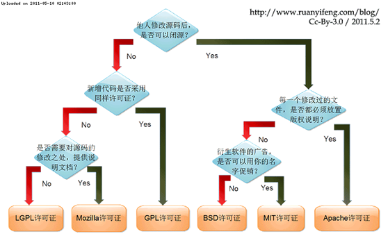

| 序号  | 修改时间       | 修改内容                                              | 修改人   | 审稿人 |
| --- | ---------- | ------------------------------------------------- | ----- | --- |
| 1   | 2010-6-12  | 创建                                                | Keefe |     |
| 2   | 2010-7-12  | 增加SNS项目和其它常用的开源列表                                 | 同上    |     |
| 3   | 2010-7-17  | 增加开源存储系统章节，补充各软件的copyright                        | 同上    |     |
| 4   | 2010-9-21  | 完善HOWTODO自定义安装章节                                  | 同上    |     |
| 5   | 2011-5-26  | 增加curl等新库                                         | 同上    |     |
| 6   | 2016-3-25  | 增加个人建站开源软件。 文章更名：《开源使用纪录》改名为《开源软件开发指南》。        | 同上    |     |
| 7   | 2016-10-12 | 更新开源站点。                                           | 同上    |     |
| 8   | 2017-1-4   | 详列Java框架                                          | 同上    |     |
| 9   | 2017-9-23  | 增加开源动态/开源开发章节。                                    | 同上    |     |
| 10  | 2018-4-12  | 增加知名企业开源情况章节。                                     | 同上    |     |
| 11  | 2021-10-9  | 增加办公软件合规，开源软件选型章节。                                | 同上    |     |
| 12  | 2021-11-3  | 更新ASF章节、开源风险章节                                    | 同上    |     |
| 13  | 2021-12-30 | 《开源软件开发指南》更名为《开源生态》， 迁移库/框架/系统章节另文《开源软件可复用技术》。 | 同上    |     |
| 14  | 2022-8-15  | 知名企业开源章节增加OSPD内容。                                 | 同上    |     |

 

 

---

# 目录

[TOC]

表格目录

[表格 1 全球重要开源事件列表... 3](#_Toc17291799)

[表格 2 国内开源的几波浪潮... 3](#_Toc17291800)

[表格 3 国内重要开源事件列表... 4](#_Toc17291801)

[表格 4 影响较大的开源线下交流会议... 4](#_Toc17291802)

[表格 5 开源社区站点列表... 4](#_Toc17291803)

[表格 6 github上的有用资源列表... 5](#_Toc17291804)

[表格 7 Apache TLP的中国开发者主导项目列表... 6](#_Toc17291805)

[表格 8 国外名企的开源动态... 7](#_Toc17291806)

[表格 9 国内名企的开源动态... 7](#_Toc17291807)

[表格 10 开源软件许可协议License列表... 9](#_Toc17291808)

[表格 11 常见开源协议比较表... 9](#_Toc17291809)

[表格 12 开源侵权事件列表... 10](#_Toc17291810)

图目录

[图 1 开源软件许可协议义务限制图__ 10](#_Toc17291822)

[图 2 开源软件与其它软件的特征对比__ 10](#_Toc17291823)

 

 

---

# 1 开源动态

开源圈有一句老话：“独行快，众行远”，无论是对于一个开源项目和开源社区，还是对中国开源的发展，我们都应该将它们作为一场“长跑”来对待。流水不争先，争的是滔滔不绝，开源发展需要靠中国的高校和普及开源教育机构等长期地输送开源人才；更关键的是，需要企业、开发者共同持续投入，推出更多有前瞻性和技术引领性的优秀开源项目。

## 1.1  开源史

### 全球开源史

表格 1  全球重要开源事件列表

| 时间   | 事件                                                                                                                                                                       | 影响                                                                                   |
| ---- | ------------------------------------------------------------------------------------------------------------------------------------------------------------------------ | ------------------------------------------------------------------------------------ |
| 1980 | Usenet(即“新闻讨论组”)                                                                                                                                                         | Usenet是当今互联网论坛的先驱，它比万维网早整整十年。                                                        |
| 1983 | 理查•斯托曼发起GNU计划。                                                                                                                                                           | 随着开源软件的增多，GNU通用公共许可证(GPL)也随之诞生。                                                      |
| 1989 | William和Lynne Jolitz开发386 BSD操作系统，1992年他们发布386BSD操作系统(也称Jolix)。                                                                                                          | 这是第一个完全自由开源的BSD版 本，独/立于AT&T许可证。                                                      |
| 1991 | Linus Torvalds创建Linux。                                                                                                                                                   | 开源史上最重要的事件。                                                                          |
| 1993 | Redhat红帽成立。                                                                                                                                                              |                                                                                      |
| 1994 | MySQL的启动。Michael Widenius和David Axmark两人着手开发MySQL，并于1995年发布第一个版本。                                                                                                        | MySQL已成为开源数据库解决方案首选。2008年，Sun以10亿美元收购MySQL AB公司；2009年，Oracle以74亿美元收购Sun。             |
| 1996 | Apache称霸互联网。                                                                                                                                                             |                                                                                      |
| 1998 | Netscape的浏览器开源。                                                                                                                                                          |                                                                                      |
| 2004 | Canonical公司发布Ubuntu。                                                                                                                                                     |                                                                                      |
| 2010 | 美国国家航空航天局和Rackspace合作研发的OpenStack。Hadoop开源。                                                                                                                              | 这个是开源云计算、大数据的开端。                                                                     |
| 2018 | 6月，微软以75亿美元收购全球最大的代码托管平台Github。 10月，Cloudera和Hortonwork宣布合并。 10月，MongoDB 宣布其开源许可证从 GNU AGPLv3 切换到 Server Side Public License (SSPL)。 11月，图数据库 Neo4j 也宣布企业版彻底闭源。 | 本年度是云厂商和开源厂商/社区冲突最激烈的一年。 微软收购Github引发开发者信任问题。 针对云服务商将开源软件作为云服务，MongoDB 首先切换协议。 |
| 2020 | 12月，Redhat宣布停止支持CentOS。                                                                                                                                                  | Centos是Redhat AS/ES/WS的社区版本，免费使用，是最具影响力的linux发布版之一。2014年，Redhat收购了CentOS。            |
| 2021 | K8S宣布v1.2后弃用Docker。 1月，Elastic宣布ES v7.11起，更换协议至SSPL和 Elastic License 双重协议。 12月，开源软件公司 HashiCorp（HCP）正式在纳斯达克挂牌上市，成为今年全球市值最高的开源公司。                                   | 2021 年有三家通过开源软件提供公共云服务的商业公司在美股上市，分别是 Confluent、HashiCorp 和 GitLab，市值均超百亿美元。          |

> 备注：1. Sun: 来自于美国斯坦福大学，是开源史上非常重要的一家公司，其主要开源产品有 Java、OpenOffice（1999年收购StarSuite公司）、MySQL（2008年收购MySQLAB公司）等，2009年被Oracle收购。
> 
> 2. Redhat: Redhat是开源linux的主要领导者。2014年，Redhat收购了CentOS；2020.12，Redhat宣布停止支持CentOS。2019年IBM以340亿美金收购Redhat。
> 3. ElasticSearch: 2010年Elasticsearch 以 Apache 2 开源。2012 年，Banon 成立 Elastic，提供围绕 Elasticsearch 订阅、托管和培训等服务。2021 年 1 月，Elastic宣布更换双重协议。2021 年 4 月，亚马逊云科技将分叉项目 Elasticsearch OpenDistro 重新命名为 OpenSearch。

### 国内开源史

表格 2  国内开源的几波浪潮

| 时间          | 事件                                                                      | 影响                                |
| ----------- | ----------------------------------------------------------------------- | --------------------------------- |
| 1999~  2002 | 红旗Linux、蓝点Linux等的发布。                                                    | 这一时期开源主要发生在政府推动，高校和研究机构。          |
| 2005~  2006 | LinuxWorld  China的成功举办。                                                 | 国内的红旗 Linux、联想等大企业也推出了自己的开源企业级应用。 |
| 2007~  2010 | 2007，CSDN王开源在比尔盖茨在北大演讲时举牌“Free  Software，Open Source”。                  | 开源和自由软件第一次进入普通人的视野。               |
| 2010~  2019 | 云计算、大数据和移动互联网成为推动开源行业主流，政府推动力减弱。                                        |                                   |
| 2020-       | 2020年，TiDB 开发商 PingCAP、emqttd 开发商 EMQ 等一批国内原生开源创企获得上亿元融资，中国开源产业发展进入快车道。 |                                   |

表格 3  国内重要开源事件列表

| 时间   | 事件                                                                                                                                                                                     | 影响                            |
| ---- | -------------------------------------------------------------------------------------------------------------------------------------------------------------------------------------- | ----------------------------- |
| 2013 | 百度开源Echarts，2018年1月进入 Apache 孵化器，2021.1.26成为TLP。                                                                                                                                       | Echarts是数据可视化领域最具影响力的 JS库。    |
| 2014 | 10月，eBay中国开发的Kylin开源，2015.11成为Apache顶级项目(TLP)。                                                                                                                                         | 截止2021.12，中国公司或个人主导的TLP共有16个。 |
| 2017 | 9月，百度开源基RPC框架brpc。                                                                                                                                                                     |                               |
| 2019 | 8月1日，Spring Cloud Alibaba从Spring Cloud 孵化器正式毕业。                                                                                                                                        | Spring 社区的首个国产开源项目顺利毕业。       |
| 2020 | 年初，木兰宽松许可证第二版（MulanPSL v2）通过 OSI 认证，成为中国首个被国际开源社区认可的开源协议。 8 月，工信部等部门联合 Gitee 建设中国独立的开源托管平台。 9月，中国首个开源基金会-开放原子开源基金会（OpenAtom Foundation）成立。 9.10华为HDC大会上，华为宣布HarmonyOS 2.0开源。 | 截止2021.12，开源基金会共有10个孵化项目。     |
| 2021 | 3 月，国家十四五发展规划中首次提及“开源”，明确指出“支持数字技术开源社区等创新联合体发展，完善开源知识产权和法律体系，鼓励企业开放软件源代码、硬件设计和应用服务”。 9月，PingCAP 和中国信通院联合撰写的业内首个《开源社区成熟度白皮书》。                                                        | 开源软件在国内开始受到各行各业的广泛重视。         |
| 2022 |                                                                                                                                                                                        |                               |

## 1.2  开源社区

表格 开源社区分类

| 开源社区 | Linux社区   | Apache OODT | Apache HTTPD | Ubuntu社区 |
| ---- | --------- | ----------- | ------------ | -------- |
| 参与者  | 任何人       | 相对稳定的团队     | 任何人          | 相对稳定的团队  |
| 决策机制 | 创始人和资助者   | 根据贡献度形成决策机制 | 根据贡献度形成决策机制  | 创始人和资助者  |
| 开源模式 | 集市模式；独裁模式 | 大教堂；精英      | 精英；集市        | 独裁；大教堂   |

> Apache OODT：面向对象的数据技术（OODT，Object Oriented Data Technology）。OODT最初是由NASA的喷气推进实验室Pasadena创建的，它支持地理上分布式的透明整合、异构计算以及通过元数据中间件实现的数据源。2010年12月，成为Apache TLP。
> 
> Apache HTTPD：The Apache HTTP Server ("httpd") was launched in 1995 and it has been the most popular web server on the Internet since April 1996.

表格  开源社区站点列表

| 网站名称         | 类别       | 网址                                                     | 简介                                                                                                                                                                                                                                              | 备注     |
| ------------ | -------- | ------------------------------------------------------ | ----------------------------------------------------------------------------------------------------------------------------------------------------------------------------------------------------------------------------------------------- | ------ |
| 开源中国社区       | 社区       | http://www.oschina.net                                 |                                                                                                                                                                                                                                                 | 推荐     |
| 码云           | 代码托管     | http://gitee.com/                                      | [oschina](http://git.oschina.net/  )旗下，2018.7域名更改为gitee.com。 主要提供基于[Git](http://lib.csdn.net/base/git)的版本托管服务，可以手动或隔日自动更新github相应仓库。 可提供免费私有仓库，中国区域访问稳定，速度快。                                                                             | 强推  |
| github       | 代码托管     | http://github.com/                                     | 位于旧金山，由[Chris Wanstrath](https://github.com/defunkt), [PJ Hyett](https://github.com/pjhyett) 与[Tom Preston-Werner](https://github.com/mojombo)三位开发者在2008年4月创办。主要提供基于[Git](http://lib.csdn.net/base/git)的版本托管服务。2018年被微软收购。 Git公共仓库免费，私有仓库付费。 | 强推     |
| gitlab       | 代码托管     | https://about.gitlab.com/                              | Google旗下。利用 Ruby on Rails 一个开源的版本管理系统，实现一个自托管的Git项目仓库，可通过Web界面进行访问公开的或者私人项目。2011年成立，2021年于美国纳斯达克上市。                                                                                                                                             |        |
| Linux kernel |          | [ftp://ftp.kernel.org/pub/](ftp://ftp.kernel.org/pub/) | about linux kenrnel                                                                                                                                                                                                                             |        |
| java         | business | https://www.oracle.com/java/                           | 原Sun Developer Netword (SDN) [Java](http://java.sun.com/)社区。2009年Sun被Oracle收购后，原社区挂到Oracle官网。                                                                                                                                                   |        |
| codeproject  | 代码托管     | http://www.codeproject.com/                            | 代码仓库，已经没落。                                                                                                                                                                                                                                      |        |
| sourceforge  | 代码托管     | http://sourceforge.net/                                | 代码仓库，已经没落。                                                                                                                                                                                                                                      |        |
| rpmfind      | 二进制仓库    | http://www.rpmfind.net/                                | rpm包                                                                                                                                                                                                                                            |        |
| CSDN         | 社区       | http://www.csdn.net/                                   | 国内老牌技术社区，以技术博客出名。                                                                                                                                                                                                                               |        |
| 源码之家         | 代码托管     | http://www.mycodes.net/                                | 国产源码站，几乎都有提供每个软件的前后台页面，方面快速寻找目标源码。                                                                                                                                                                                                              |        |
| PHP开源网       | 代码托管     | http://www.php-open.org/                               | 国产PHP开源项目网站                                                                                                                                                                                                                                     |        |
| 思否           | 问答       | https://segmentfault.com/                              | 国产编程问答交流社区平台。                                                                                                                                                                                                                                   |        |

### 全球开源组织

表格  全球性开源组织列表

| 组织名称      | 网址                              | 成立时间      | 简介                                                                       |
| --------- | ------------------------------- | --------- | ------------------------------------------------------------------------ |
| FSF       | http://www.fsf.org              | 1985-10   | The [Free Software Foundation](http://www.fsf.org) (FSF)  自由软件基金会。       |
| GNU       | http://www.gnu.org/             |           | FSF最重要的计划。                                                               |
| Linux基金会  | https://www.linuxfoundation.org | 2000      |                                                                          |
| Apache    | http://www.apache.org/          | 2009      | The Apache Software Foundation(ASF)。全球最大的非盈利开源组织。                        |
| OpenInfra | https://openinfra.dev/          | 2012-9    | 前身为[OpenStack](https://www.openstack.org/)基金会。2020年底改现名。专注于云计算平台的操作系统开源。 |
| CNCF      | https://www.cncf.io             | 2015-7    | Cloud Native Computing Foundation 云原生计算基金会。 隶属于Linux基金会。                 |
| OpenAtom  | https://www.openatom.org/       | 2020-6-15 | 开放原子开源基金会，中国首个开源基金会。                                                     |

#### 自由软件基金会 (FSF)

官网：https://www.fsf.org/

自由软件基金会（Free Software Foundation，[FSF](https://baike.baidu.com/item/FSF/2356953)）是一个致力于推广自由软件、促进计算机用户自由的美国民间非盈利性组织。它于1985年10月由[理查德·斯托曼](https://baike.baidu.com/item/理查德·斯托曼/486922)建立。其主要工作是执行[GNU计划](https://baike.baidu.com/item/GNU计划/981157)，开发更多的自由软件，完善自由软件理念。

2002年11月25日自由软件基金会向个人提供自由软件基金会附属会员的可能性。到2005年3月它拥有3400多位附属会员。2003年3月5日它向商业企业提供公司保护计划，到2004年4月它拥有45位公司保护。

#### Linux基金会

官网：[Linux Foundation - Decentralized innovation, built with trust](https://www.linuxfoundation.org/)

2000年，Linux基金会（Linux Foundation）成立，赞助Linux创始人[Linus Torvalds](https://baike.baidu.com/item/Linus Torvalds)的工作，该基金会并通过领先的技术，和来自世界各地的开发人员合作。Linux基金会保护，其成员和开源开发社区资源，以确保Linux仍然是免费的，技术上先进的Linux。

Linux基金会有三个不同等级的会员：银级、金级、白金级。各级别会员需承担的责任有所差别，白金级别会员同时拥有董事会席位，每年需缴纳会费50万美元。

2010年11月2日，中国移动正式加入Linux基金会，成为金级会员。这是Linux基金会在中国的第一个会员企业。

**CNCF**

参见 《[CNCF云原生框架分析.md](../../大数据与AI/cloud/CNCF云原生框架分析.md)》

CNCF（Cloud Native Computing Foundation，云原生计算基金会）于 2015 年 7 月成立，隶属于 Linux 基金会，初衷围绕“云原生”服务云计算，致力于维护和集成开源技术，支持编排容器化微服务架构应用。

CNCF 还帮助项目建立了治理结构。CNCF 提出了成熟度级别的概念：沙箱、孵化和毕业。这些级别分别对应下图中的创新者、早期采用者和早期大众。

#### Apache软件基金会 (ASF)

官网：https://apache.org/

**关于 Apache 软件基金会 (ASF)**   --2021.8官网介绍

Apache 软件基金会（ASF）成立于 1999 年，是世界上最大的开源基金会，管理着 2.27 亿多行代码，并 100% 免费向公众提供价值超过 200 亿美元的软件。ASF 的全志愿者社区从最初的 21 位创始人监督 Apache HTTP 服务器发展到现在的 813 位个人成员和 206 个项目管理委员会，他们通过 ASF 的择优程序，与近 8000 位 Committer 合作，成功地领导了 350 多个 Apache 项目和计划。Apache 软件几乎是每一个终端用户计算设备的组成部分，从笔记本电脑到平板电脑，再到企业的移动设备和关键任务应用。Apache 项目为大部分的互联网提供了动力，管理着 exabytes 的数据，执行着 teraflops 的操作，并在几乎每个行业中存储着数十亿的对象。商业友好和允许的 Apache 许可证 v2 是一个开放源码的行业标准，帮助启动了价值十亿美元的公司，并使全球无数的用户受益。ASF 是美国 501 (c)(3) 非营利性慈善组织，由个人捐款和企业赞助商资助，包括 Aetna、阿里巴巴云计算、亚马逊网络服务、Anonymous、百度、彭博社、Budget Direct、Capital One、Cloudera、Comcast、Didi Chuxing、Facebook、Google、Handshake、华为、IBM、Microsoft、Pineapple Fund、Red Hat、Reprise Software、Target、腾讯、Union Investment、Verizon Media 和 Workday。欲了解更多信息，请访问 http://apache.org/ 和 https://twitter.com/TheASF。

© Apache 软件基金会。 "Apache"、 "ECharts"、 "Apache ECharts"、 "Airflow"、 "Apache Airflow"、 "Superset"、 "Apache Superset" 和 "ApacheCon" 是 Apache 软件基金会在美国和/或其他国家的注册商标或商标。所有其他品牌和商标都是其各自所有者的财产。

**关于 Apache 孵化器 Incubator**

Apache 孵化器是希望成为 Apache 软件基金会工作一部分的项目和代码库的主要进入途径。所有来自外部组织的代码捐赠和现有的外部项目都要通过孵化器进入 ASF，以达到以下目的 1）确保所有的捐赠符合 ASF 的法律标准；以及 2）开发新的社区，遵守我们的指导原则。所有新接受的项目都必须进行孵化，直到进一步的审查表明基础设施、通信和决策过程已经稳定下来，与其他成功的 ASF 项目一致。虽然孵化状态不一定反映了代码的完整性或稳定性，但它确实表明该项目尚未得到 ASF 的完全认可。欲了解更多信息，请访问 http://incubator.apache.org/ 。

并非所有项目都从孵化器“毕业”； 有些已经退休Retried。 那些退役的项目可以在孵化器的[Project page](http://incubator.apache.org/projects/index.html#retired)上找到。

**关于Apache Attic**

When should a project move to the Attic?

Projects whose PMC are unable to muster 3 votes for a release, who have no active committers or are unable to fulfill their reporting duties to the board are all good candidates for the Attic.  PMC 无法获得 3 票以进行发布、没有活跃提交者或无法履行向董事会报告职责的项目都是 Attic 的好候选人。

Apache Attic 是一种机制，它建立于 2008 年 11 月，其旨在提供流程和解决方案，以使 Apache 项目在完全结束其生命时便能清楚地被知道。

具体来说，它的目的是：

- 不影响用户
- 对代码库提供受限制的监督
- 在没有项目管理委员会（PMC）的情况下对活动用户列表进行监督

但它不致力于：重建社区、修正 bug、发布新版本。

一个项目可以通过两种机制进入 Attic：管理项目的管理委员会（PMC）决定要该项目迁移进入 Attic，或者 Apache 软件基金会的董事会解散 PMC 并选择迁移该项目。

离开 Attic 的方法也有多种：

- fork 该项目
- 在 Apache 孵化器中重新启动社区
- 为项目重新创建 PMC
- 转移到现有的 PMC

截止到2019.6，全球共有771位 ASF Member，中国仅13位。ASF Member相当于ASF的股东。

2021 年，ASF 迎来 441 名新的提交者，目前总计有 8484 名提交者。2021 年选举了 40 名新的基金会成员，共有 816 名活跃成员。

**项目动态** （2021年）

- 项目和子项目总数——351 个
- 顶级项目（TLP）——**200** 个
- 退休迁移至 Apache Attic 顶级项目和子项目——23 个
- 进入孵化器的新项目——5 个
- 从孵化器毕业的顶级项目——6 个
- 孵化器退休项目——2 个

表格 7 Apache中国开发者主导项目列表

| 项目                                                       | Start Date | End Date   | TLP Date  | 赞助.Apache  Sponsor               | 简介                                                                                                                                                                                          |
| -------------------------------------------------------- | ---------- | ---------- | --------- | -------------------------------- | ------------------------------------------------------------------------------------------------------------------------------------------------------------------------------------------- |
| [Kylin](https://kylin.apache.org/)                       | 2014-11-25 | 2015-11-18 |           | eBay中国团队、Kyligence（上海跬智信息技术有限公司） | Kylin是OLAP加速引擎，最初由eBay中国团队开发（Kylin开源社区负责人韩卿）并于2014.10发布到github开源，2015.11成为Apache顶级项目(TLP)。2016年3月，原Kylin 核心团队组建公司Kyligence（上海跬智信息技术有限公司）。                                                   |
| [Eagle](https://eagle.apache.org/)                       | 2015-10-26 | 2016-12-21 | 2017-1    | eBay中国团队                         | eBay开源的大数据安全方案。                                                                                                                                                                             |
| [HAWQ](https://hawq.apache.org/)                         | 2015-09-04 | 2018-08-15 | 2018-8-22 | Pivotal中国团队                      | 全称Hadoop With Query（带查询Hadoop），Pivotal中国团队（Pivotal HAWQ团队负责人~常雷）于2011年开发原型，2015年开源。                                                                                                         |
| [CarbonData](https://carbondata.apache.org/)             | 2016-06-02 | 2017-04-19 |           | 华为                               | 华为开源的大数据存储方案                                                                                                                                                                                |
| [RocketMQ](http://rocketmq.apache.org/)                  | 2016-11-21 | 2017-09-20 |           | 阿里                               | 阿里开源的分布式消息中间件。前身为MetaQ，3.0后更名为RocketMQ。                                                                                                                                                     |
| ~~Weex~~                                                 | 2016-11-30 | 2021-05-12 | --        | 阿里                               | Weex是构建移动跨平台高性能的UI框架。 The Weex podling retired on 2021-05-14                                                                                                                             |
| [Griffin](https://griffin.apache.org/)                   | 2016-12-05 | 2018-11-21 |           | eBay中国团队                         | Griffin is a open source Data Quality solution for distributed data systems at any scale in both streaming or batch data context                                                            |
| [ServiceComb](https://servicecomb.apache.org/)           | 2017-11-22 | 2018-10-17 |           | 华为                               | ServiceComb is a microservice framework that provides a set of tools and components to make development and deployment of cloud applications easier. 开箱即用、高性能、兼容流行生态、支持多语言的一站式开源微服务解决方案。 |
| [SkyWalking](https://skywalking.apache.org/)             | 2017-12-08 | 2019-04-17 |           | 个人-                              | 分布式系统的应用程序性能监视工具，专为微服务、云原生架构和基于容器（Docker、K8s、Mesos）架构而设计。提供分布式追踪、服务网格遥测分析、度量聚合和可视化一体化解决方案。                                                                                                  |
| [ECharts](https://echarts.apache.org/)                   | 2018-01-18 | 2020-12-16 | 2021-1-26 | 百度                               | ECharts 是一个直观、可交互、强大的可视化图表库，非常适合用来作为商业级的图表演示。2013 年起源于百度，2018年1月进入 Apache 孵化器。                                                                                                              |
| [Dubbo](https://dubbo.apache.org/)                       | 2018-02-16 | 2019-05-15 |           | 阿里                               | Dubbo is a high-performance, lightweight, java based RPC framework.                                                                                                                         |
| [Doris](http://doris.incubator.apache.org) (原 Palo)      | 2018-07-18 | --         | --        | 百度                               | 基于MPP的分析型数据仓库系统。                                                                                                                                                                            |
| [ShardingSphere](https://shardingsphere.apache.org/)     | 2018-11-10 | 2020-04-16 |           | 京东                               | ShardingSphere related to a database clustering system providing data sharding, distributed transactions, and distributed database management.                                              |
| [brpc](http://incubator.apache.org/projects/brpc.html)   | 2018-11-13 | --         | --        | 百度                               | brpc is an industrial-grade RPC framework for building reliable and high-performance services.                                                                                              |
| [IoTDB](https://iotdb.apache.org/)                       | 2018-11-18 | 2020-09-18 |           | 清华                               | IoTDB is a data store for managing large amounts of time series data such as timestamped data from IoT sensors in industrial applications.                                                  |
| [DolphinScheduler](https://dolphinscheduler.apache.org/) | 2019-08-29 | 2021-03-17 |           | 易观                               | (原 EasyScheduler) DolphinScheduler is a distributed ETL scheduling engine with powerful DAG visualization interface. 2018年5月，EasyScheduler在易观千帆成功上线使用。2019年3月，发布第一个开源版本1.0。              |
| ...                                                      |            |            |           |                                  |                                                                                                                                                                                             |

备注：Start Date --End Date指的是项目在Apache孵化器开始和结束的时间，一般项目从孵化器毕业一个月内即成为Apache项级项目(Top Level Project, TLP)。

1. 截止到2019.10，国内只有16个项目成功进入了ASF。

### 中国开源组织

表格  中国开源组织列表

| 组织名                      | 主管机构    | 职责                                                                                                                 | 关键成员                                  | 成立时间      | 背景                                      |
| ------------------------ | ------- | ------------------------------------------------------------------------------------------------------------------ | ------------------------------------- | --------- | --------------------------------------- |
| 中国开源软件推进联盟.COPU          |  工信部 | 打破MS OS的长期垄断                                                                                                       | 永中、金山、中文2000、中科红旗、IBM、HP、INTEL、NOVELL | 2004-7-22 | 2004年，Ubuntu出现。                         |
| 开源中国 OSChina             | 商业公司    |                                                                                                                    |                                       | 2008-8    |                                         |
| 中国开源云联盟.COSCL            | 工信部     | 整合中国OpenStack资源。                                                                                                   | INTEL、新浪、中标软件                         | 2012-8    |                                         |
| 中国人工智能开源软件发展联盟.AOSS      | 工信部     | 宗旨就是推动我国人工智能开源软件技术和产业发展，主要任务包括积极推动我国自主产权人工智能开源软件的研发攻关以及应用推广，积极推动人工智能开源软件社区建设，营造技术研发环境和氛围。                          |                                       | 2018-9    | 2016 年，谷歌研发的围棋人工智能 AlphaGo 战胜人类世界冠军李世石。 |
| 中国RISC-V产业联盟             |         | 秉承开放、合作、平等、互利的原则，致力于解决中国 RISC-V 领域共同面对的关键问题，建立中国国产自主、可控、安全的 RISC-V 异构计算平台，促进形成贯穿IP 核、芯片、软件、系统、应用等环节的 RISC-V 产业生态链。 | 五十余家 RISC-V 领域相关企业以及十余家大学和研究机构        | 2018-9    | 2010 年 RISC-V 指令集诞生。                    |
| 中国开放指令生态(RISC-V)联盟.CRVIC |         |                                                                                                                    | 中科院计算所、北大、清华、阿里-中天微、百度、中芯国际           | 2018-10   |                                         |
| 开放原子开源基金会                |         | 中国首个开源基金会。致力于推动全球开源产业发展的非营利机构。                                                                                     | 阿里巴巴、百度、华为、浪潮、360、腾讯、招商银行             | 2020-6-15 |                                         |

> 备注：以上组织基本上依托于MIIT（Ministry of Information Industry, 工信部）。

#### 开源中国 OSCHINA

成立时间：2008 年 8 月

在智能手机普及之前，人们获取信息的渠道非常有限，尤其是软件开发相关的前沿技术信息，更不用说在国内仍鲜为人知的开源软件技术。

2008 年，凭借个人对于开源软件的满腔热情，希望让国内更多的开发者了解、学习和参与开源，开源爱好者红薯手写 1 万多行代码创建了开源中国（OSCHINA）社区网站。

OSCHINA 目前已建立了相当完善的开源软件分类数据库，收录全球知名开源项目近 5 万款，涉及几百个不同的分类。围绕这些开源项目，OSCHINA 为中国开发者提供了最新开源资讯、软件更新资讯、技术分享和交流的技术平台。2013 年，OSCHINA 建立了代码托管与 DevOps 平台“码云 Gitee”，为广大开发者提供团队协作、源码托管、代码质量分析、代码评审、测试、CI/CD 与代码演示等功能。

经过在开源领域超过十年的深耕，以及与中国本土开源环境的结合，推动了中国开源领域的快速发展。OSCHINA 目前已发展成为国内知名的开源技术社区，社区有 500 万开发者活跃，长期致力于推动国内开源软件的应用和发展，提升本土开源能力，以及为开源生态环境的优化提供支持。

#### 开放原子开源基金会 (OAF)

官网：https://www.openatom.org/

[开放原子开源基金会](https://www.openatom.org/)（OpenAtom Foundation，OAF，简称“开源基金会”）是致力于推动全球开源产业发展的非营利机构，由阿里巴巴、百度、华为、浪潮、360、腾讯、招商银行联合发起，于 2020 年 6 月登记成立，“立足中国，面向世界”，是我国在开源领域的首个基金会。 开源基金会的服务范围包括开源软件、开源硬件、开源芯片及开源内容等，为各类开源项目提供中立的知识产权托管，保证项目的持续发展不受第三方影响，通过开放治理寻求更丰富的社区资源的支持与帮助，包括募集并管理资金，提供法律、财务等专业支持。

表格  开放原子开源基金会当前孵化项目

| 项目                                            | Start Date | End Date | TLP Date | 赞助.Sponsor                                    | 简介                                                                                                                                                                                                                                   |
| --------------------------------------------- | ---------- | -------- | -------- | --------------------------------------------- | ------------------------------------------------------------------------------------------------------------------------------------------------------------------------------------------------------------------------------------ |
| Xuper Chain                                   | 2020-9     |          |          | 百度                                            | 2019年5月，百度基于持续多年在区块链技术与应用领域的研究与探索，推出了完全自主知识产权的区块链底层技术——超级链（[XuperChain](https://baike.baidu.com/item/XuperChain/22940117)）并正式开源。 2020年9月，[百度超级链](https://baike.baidu.com/item/百度超级链/55709435)成为**首个捐赠给开放原子开源基金会的项目**。             |
| ZNBase                                        |            |          |          | 浪潮                                            | 云原生分布式数据库。                                                                                                                                                                                                                           |
| 鸿蒙 [OpenHarmony](https://openharmony.cn)      | 2020-9     |          |          | 华为                                            | 定位是一款面向全场景的开源[分布式操作系统](https://baike.baidu.com/item/分布式操作系统/2475063)。 2019年8月，华为在华为开发者大会2019上正式发布鸿蒙系统HarmonyOS。 2020年9月，开放原子开源基金会接受华为捐赠的智能终端操作系统基础能力相关代码，随后进行开源。                                                               |
| PIKA                                          |            |          |          | 360                                           | PIKA 是 DBA 和基础架构组联合开发的类 Redis 存储系统。                                                                                                                                                                                                  |
| TKEStack                                      |            |          |          | 腾讯                                            | 腾讯开源的一款集强壮性和易用性于一身的企业级容器编排引擎。                                                                                                                                                                                                        |
| UUBML                                         |            |          |          | [浪潮](https://baike.baidu.com/item/浪潮/3409705) | UBML 建模开发体系是浪潮开源的面向企业软件的低代码开发平台核心基础。                                                                                                                                                                                                 |
| TencentOS Tiny                                |            |          |          | 腾讯                                            | 腾讯公司孵化的一款低功耗、低资源占用物联网的终端操作系统。                                                                                                                                                                                                        |
| Alios Things                                  |            |          |          | 阿里巴巴                                          | 面向 IoT 领域的轻量级物联网[嵌入式操作系统](https://baike.baidu.com/item/嵌入式操作系统/361747)。                                                                                                                                                              |
| 欧拉 [openEuler](https://www.openeuler.org/zh/) | 2021-11-9  |          |          | [华为](https://baike.baidu.com/item/华为/298705)  | 面向数字基础设施的操作系统，支持服务器、 云计算、边缘计算、嵌入式等应用场景，支持多样性计算，致力于提供安全、稳定、易用的操作系统。通过为应用提供确定性保障能力，支持 OT 领域应用及 OT 与 ICT 的融合。 2019年9月，华为宣布服务器操作系统EulerOS开源，名为openEuler，欧拉开源社区同步上线。 2021年11月9日，华为正式宣布将欧拉开源操作系统全量代码、品牌商标、社区基础设施等相关资产，捐赠给开放原子开源基金会。 |
| 龙蜥 OpenAnolis                                 | 2021-11-4  |          |          | 龙蜥社区                                          | 已出现在百度百科词条里，尚未在官网列出。                                                                                                                                                                                                                 |

> 备注：截止2021.12，共有10个孵化项目。华为捐赠项目是重量级的，而且文档很齐全，有单独的项目网站。

### 代码托管

#### Github~代码托管

github是一家位于旧金山的公司，由[Chris Wanstrath](https://github.com/defunkt), [PJ Hyett](https://github.com/pjhyett) 与[Tom Preston-Werner](https://github.com/mojombo)三位开发者在2008年4月创办。迄今拥有59名全职员工，主要提供基于[Git](http://lib.csdn.net/base/git)的版本托管服务。2018年被MS以75亿美元收购。

2021年增加了1600万新用户，使其用户总数达到7300万。

表格 6 github上的有用资源列表

| 有用脚本或  程序                                                | 简介                                                                                                                                                                                                                                                                                                                                                                                                | 备注   |
| -------------------------------------------------------- | ------------------------------------------------------------------------------------------------------------------------------------------------------------------------------------------------------------------------------------------------------------------------------------------------------------------------------------------------------------------------------------------------- | ---- |
| jekyll                                                   | 个人博客。可以在Github上快速搭建一个基于jekyll的博客系统。  参考[GitHub   Pages](http://pages.github.com/)                                                                                                                                                                                                                                                                                                                 | 推荐   |
| [GitStats](https://github.com/trybeee/GitStats)          | 借助于[GitStats](https://github.com/trybeee/GitStats)，我们能很好地统计自己的每个项目的工作量，从而看到工作进展。                                                                                                                                                                                                                                                                                                                  | 自我监督 |
| [codeshelver](https://www.codeshelver.com/)              | 给git库做标签                                                                                                                                                                                                                                                                                                                                                                                          |      |
| [gollum](https://github.com/github/gollum)               | [gollum](https://github.com/github/gollum)是一个基于git的轻型wiki系统。                                                                                                                                                                                                                                                                                                                                      |      |
| [GitHubwatcher](https://github.com/DAddYE/githubwatcher) | 监测重点项目  [GitHubwatcher](https://github.com/DAddYE/githubwatcher)适用于通知不频繁的情景。                                                                                                                                                                                                                                                                                                                      |      |
| [osh-my-zsh](https://github.com/robbyrussell/oh-my-zsh)  | 将终端从bash改为zsh之后，可考虑安装社区驱动的zsh配置文件，含有多个插件。可参考旧文[zsh与oh-my-zsh](http://www.yangzhiping.com/tech/zsh-oh-my-zsh.html)                                                                                                                                                                                                                                                                                 |      |
| [yourchili](https://github.com/ericpaulbishop/yourchili) | 服务器各类安装shell，比如安装nginx等。                                                                                                                                                                                                                                                                                                                                                                          |      |
| [gitignore](https://github.com/GitHub/gitignore)         | GitHub官方出品                                                                                                                                                                                                                                                                                                                                                                                        |      |
| [GitHub简历生成器](http://resume.github.com/)                 | [http://resume.github.io/?#username#](http://resume.github.io/?#username)  NumEricR（非GitHub工作人员）基于GitHub Pages功能做了一个简历生成器，使用极其简单，登陆网站[GitHub简历生成器](http://resume.github.com/)，填入你的GitHub网站用户名即可。  开始有了第三方网站提供基于GitHub的人才招聘服务，例如：  [GitHire](http://githire.com/):通过它，可以找出你所在地区的程序员。  [Gitalytics.com](http://www.gitalytics.com/)：通过它，能评估某位程序员在GitHub、LinkedIn、StackOverflow、hackernews等多个网站的影响力。 | 简历   |
| ...                                                      |                                                                                                                                                                                                                                                                                                                                                                                                   |      |

#### Gitlab

2021年10 月 14 日，全球第二大开源代码托管平台 GitLab 正式在纳斯达克上市，市值接近 150 亿美元。12 月，GitLab 公司宣布收购 Opstrace，用以扩展其 DevOps 平台。

#### Gitee

2013年，由开源中国创建。

据统计，Gitee 2021 年注册开发者增长超 180 万，总用户数量超过 800 万。

### 会议交流

表格 影响较大的开源线下交流会议

| 开源会议        | 简介                                                                                                                                                                                        |
| ----------- | ----------------------------------------------------------------------------------------------------------------------------------------------------------------------------------------- |
| CSDN源创会     | 全国城市巡回举办，主要目的是为了扩大开源社区影响力。                                                                                                                                                                |
| InfoQ       | ArchSummit全球架构师峰会、全球软件开发大会[QCon](https://baike.baidu.com/item/%E5%85%A8%E7%90%83%E8%BD%AF%E4%BB%B6%E5%BC%80%E5%8F%91%E5%A4%A7%E4%BC%9A/17451747?fromtitle=qcon&fromid=4820228&fr=aladdin) |
| 杭州云栖大会      | 阿里云的年度开发者大会，约在10月份举办。                                                                                                                                                                     |
| 稀土开发者大会     | [稀土掘金](https://juejin.cn/)是面向全球中文开发者的技术内容分享与交流平台。2021年首届稀土开发者大会。                                                                                                                          |
| 开放原子开源基金会峰会 |                                                                                                                                                                                           |

## 1.3  知名企业开源情况

***OSPD***:  Open Source Program Office，即开源办公室。

早在 2004 年，谷歌就已经成立了自己的 OSPO，这也是最早成立的一批 OSPO。随后，微软、Adobe、Netflix、英特尔等知名科技公司纷纷跟进，普及速度迅速。

OSPO 有不同的组织形式，有的是虚拟组织，有的是实体组织。大多数 OSPO 都是直接向公司的 CTO/COO/CEO 这个级别汇报的。

内源（Inner Source）一词最初是 Tim O'Reilly 在 2000 年创造的，是指在组织内建立类似开源的文化。也就是说，公司可能仍然在开发闭源软件，但在内部开放开发，建立透明文化。内源其实是一个很好的企业开源过渡步骤。

在 Linux 基金会名下，有一个专门致力于普及 OSPO 的工作组，叫做 TODO。在 Linux 基金会 TODO 小组的定义中，OSPO 的职能包括设置代码使用、分发、选择、审计相关政策、培训开发人员、确保法律合规以及促进和建立有利于组织战略的社区参与。

2022 年 2 月，TODO 工作组发布的 OSPO 报告里提出了 “OSPO 成熟的 5 个阶段”：

阶段 0：使用开源 

阶段 1：提供开源合规性和库存的支持，并教育开发者 

阶段 2：布道开源软件的使用方式，培养参与氛围和开源生态 

阶段 3：主导开源项目，并发展社区 

阶段 4：成为开源社区的战略决策的合作伙伴。

表格  商业公司名下开发者&开源社区

| 公司名    | 开发者&开源社区网址                                                   | 简介                                             | OSPD成立时间 |
| ------ | ------------------------------------------------------------ | ---------------------------------------------- | -------- |
| Google | http://code.google.com/  http://www.google.com/codesearch | Google旗下代码托管、代码搜索平台。                           | 2004     |
| IBM    | http://www.ibm.com/developerworks/                           | IBM的开发者社区。                                     |          |
| MSDN   | http://msdn.microsoft.com/                                   | 微软开发者网络。                                       |          |
| 百度     | https://opensource.baidu.com/                                | Echart, Paddlepaddle                           | 2013     |
| 华为     | https://opensource.huawei.com/                               | 华为开源。2000年开始接触并探索开源。2008年，华为成立开源能力中心，积极贡献上游社区。 | 2015     |
| 阿里巴巴   | https://opensource.alibaba.com/                              | 阿里开源                                           | 2015     |
| 腾讯     | https://opensource.tencent.com                               | 腾讯开源。2010年，腾讯提出拥抱开源的战略。                        | 2019.6   |
| 字节     |                                                              |                                                | 2022.5   |

表格  国外名企的开源动态（只统计github托管项目）

| 公司名                                                        | 开源简介                                                                                                                                                                 | 开源产品列表                                                                                                                                     |
| ---------------------------------------------------------- | -------------------------------------------------------------------------------------------------------------------------------------------------------------------- | ------------------------------------------------------------------------------------------------------------------------------------------ |
| [Google](https://github.com/google)                        | 在开源和贡献开源方面，Google 一直是行业的典范。  截止2018-4，Google 在 GitHub 上有1294 个仓库，1793 名活跃用户。                                                                                     | **TensorFlow** Spark protobuf Kubernetes **Angular** material-design-icons Guava Guava MDL GRPC Guetzli Leveldb Lighthouse                 |
| [Facebook](https://github.com/facebook)                    | Facebook开源项目涉及的领域有移动工具多样化、大数据、客户端web库、后台运行时和基础设施，还有通过开放计算项目涉及到的服务器和存储硬件等等。  截止2018-4，Facebook在 GitHub 上有178 个仓库，197 名活跃用户。收到了39k次fork、提交了79k个commit，拥有242k个关注者…… | 移动开发：Buck Rebound  Origami Stetho Infer   WEB开发**：React** Js、HHVM Flux Flow fb-flo Jest Nuclide    后端开发：Hive Presto Osquery RocksDB |
| [Microsoft](https://www.diycode.cc/developers/Microsoft)   | 截止2018-4，Microsoft在 GitHub 上有1716  个仓库，3778 名活跃用户。                                                                                                                   |                                                                                                                                            |
| [apache](https://www.diycode.cc/developers/apache)         | 截止2018-4，Apache在 GitHub 上有1532 个仓库，470 名活跃用户。                                                                                                                        | 详见下面章节ASF                                                                                                                                  |
| [airbnb](https://www.diycode.cc/developers/airbnb)         |                                                                                                                                                                      |                                                                                                                                            |
| [github](https://www.diycode.cc/developers/github)         |                                                                                                                                                                      |                                                                                                                                            |
| [square](https://www.diycode.cc/developers/square)         |                                                                                                                                                                      |                                                                                                                                            |
| [angular](https://www.diycode.cc/developers/angular)       |                                                                                                                                                                      |                                                                                                                                            |
| [tensorflow](https://www.diycode.cc/developers/tensorflow) |                                                                                                                                                                      |                                                                                                                                            |
| [LinkedIn](https://github.com/linkedln)                    |                                                                                                                                                                      | Kafka、Pinot                                                                                                                                |
| Pivotal/EMC                                                |                                                                                                                                                                      | RabbitMQ GreenPlum HAWQ Redis  Spring                                                                                                      |
| amazon                                                     |                                                                                                                                                                      |                                                                                                                                            |
| [IBM](https://github.com/IBM)                              | [Open Source – Open Source @ IBM site](https://www.ibm.com/opensource/) 截止2021-12，IBM在 GitHub 上有2.3k+个仓库，3.5k+名活跃用户，每月15k+提交。                                     |                                                                                                                                            |

表格 9 国内名企的开源动态（只统计github托管项目）

| 公司                                   | 开源官网                                    | 开源简介                                      | 仓库数(2018.4/2021.9) | 开发者(2018.4/2021.9) | 开源产品列表                                                                                            |
| ------------------------------------ | --------------------------------------- | ----------------------------------------- | ------------------ | ------------------ | ------------------------------------------------------------------------------------------------- |
|  [阿里](https://github.com/alibaba) | [阿里开源](https://opensource.alibaba.com/) | 全球开源贡献组织排第6名。 截止2018-4，186个仓库，121个开发者。 | 186/377            | 121/151            | Dubbo RockerMQ weex  fastjson p3c...                                                           |
| [华为](https://github.com/huawei)      | [华为开源](https://opensource.huawei.com/)  | 截止2018-4，110个仓库。2021.9仓库数减少到102。          | 110/102            | no public members  | Cabondata [ServiceComb](https://servicecomb.apache.org/)  OpenStack Spark Hadoop HarmonyOS ... |
| [腾讯](https://github.com/tencent)     | [腾讯开源](https://opensource.tencent.com/) | 全球开源贡献组织排第15名。截止2018-4，51个仓库。             | 51/133             | /5                 |                                                                                                   |
| [百度](https://github.com/baidu)       |                                         | 截止2018-4，50个仓库，9个开发者。截止2021-9，90个仓库。      | 50/90              | no public members  | eCharts Doris bprc  PaddlePaddle ...                                                           |
| 京东                                   |                                         |                                           |                    |                    | [ShardingSphere](https://shardingsphere.apache.org/)                                              |
| [新浪](https://github.com/sina)        |                                         |                                           |                    |                    |                                                                                                   |
| [小米](https://github.com/xiaomi)      |                                         | 普通社区一样运作。                                 | /10                |                    |                                                                                                   |

备注：数据时间2018-4-12，中国企业排名2017年后上升很慢。

 

## 本章参考

[1].   细数开源历史上的十个重大事件 http://www.iteye.com/news/29264-open-source

[2].   佟辉 —— 回顾中国的开源浪潮 http://www.oschina.net/news/59158/foss-in-china

[3].   阿里巴巴开源技术汇总：115个软件  https://yq.aliyun.com/articles/48972

[4].   15个你必须知道的Facebook开源项目 https://blog.csdn.net/guiyecheng/article/details/70141951

[5].   开源巨献：Google最热门60款开源项目 https://www.jianshu.com/p/6f554a96e60e

[6].   GitHub 全球 Developers, Organizations and Repositories 排行榜 https://www.diycode.cc/trends

[7].   知乎-中国开源现状如何？ https://www.zhihu.com/question/21965679

[8].   Kylin(麒麟）——来自eBay研发的开源OLAP Engine 2014年11月19日（周三）19:30-21:30 http://www.chinahadoop.cn/course/107

* 如何高效利用GitHub http://www.yangzhiping.com/tech/github.html
* 被仰望和遗忘过的Cloudera，能否王者归来？ https://baijiahao.baidu.com/s?id=1663480990383102877&wfr=spider&for=pc
* 红帽 与 CentOS 之间的恩怨情仇 https://baijiahao.baidu.com/s?id=1686276870815012960&wfr=spider&for=pc
* CentOS:被 Red Hat 抛弃后,我更有活力了 https://new.qq.com/omn/20201222/20201222A02Q6G00.html
* Amazon Elasticsearch Service正式更名，云厂商和开源社区间必有一战？  https://36kr.com/p/1391055344270083
* 从开源小白到 Apache Member，阿里技术小哥的成长之路 https://blog.csdn.net/weixin_44326589/article/details/90764318
* 欧洲调研机构盘点七大中国开源组织  https://mp.weixin.qq.com/s/0uDZ4kJbDoRMxn52g1xR2A
* 2021 年 Apache 年度报告 （译）https://mp.weixin.qq.com/s/wNoI3vHYERg-iG2tQ9ZfLQ  （原文）https://blogs.apache.org/foundation/entry/apache-in-2021-by-the
* OpenInfra基金会与白金成员：开源基础设施的下一个十年  https://baijiahao.baidu.com/s?id=1702344743427464579   2021.6
* OpenStack基金会和董事们的那些事  https://blog.csdn.net/karamos/article/details/80121633  2016.1
* 解读开源的2021：从“开发者亚文化”，变成主流软件开发模式  https://mp.weixin.qq.com/s/SgI9tFUlr4ugTbsIWC9Krg
* Linux基金会企业开源指南系列之一——公司如何创建开源项目办公室  https://opensourceway.community/posts/opensource_enterprise_guide/creating-an-open-source-program/
* 大厂争先成立的 “开源办公室” 有啥门道？  https://c.m.163.com/news/a/H8DDTSFM0511CUMI.html
* 从企业视角看开源软件：华为开源5年的实践经验  https://new.qq.com/rain/a/20200806A09G9400
* 揭秘百度开源治理实践 https://zhuanlan.zhihu.com/p/391688472

  

# 2 开源开发

一款开源软件能否在商业上成功，很大程度上依赖三件事： 成功的 user case(用例)、活跃的社区和一个好故事。

## 2.1  开源软件许可协议

The key point **：copyrighted by their respective authors**

许可协议是指用来授权其他人具有某种使用你的作品的权利。

开源许可协议 使人们免去了研究那些专业的许可条款的麻烦，使人们更方便的对开源项目贡献出自己的代码。而且它还能保护你作为作品的原创作者，确保你至少拥有由于贡献参与而带来的署名荣誉。它还能用来阻止其他人企图声明对你的作品拥有所有权的行为。

权限Permissions：Commercial use商业使用、Modification修改、Distribution分发、Private use私用

限制Limitations:  Liability责任、Warranty保修

从 RMS （Richard Mattew Stallman）捣鼓出 GPL 开始，开源许可证发展到现在已经有了上百种，但流行的其实并不多。原教旨一些，只有被 **OSI （Open Source Intiative）**认可才能称之为开源许可证，而其它一些例如 SSPL、Elastic 等都是商业许可证。那些官方认证的开源许可证被罗列在了 OSI 官网上。

OSI 官网将所有其认可的开源许可证分为“流行且广泛使用或拥有强大社区”的许可证、国际许可证、特殊用途许可证、不可重复使用的许可证、被取代的许可证等几大类，详情大家可戳：https://opensource.org/licenses/category

**BSD开源协议**

BSD开源协议是一个给于使用者很大自由的协议。基本上使用者可以”为所欲为”,可以自由的使用，修改源代码，也可以将修改后的代码作为开源或者专有软件再发布。

但”为所欲为”的前提当你发布使用了BSD协议的代码，或则以BSD协议代码为基础做二次开发自己的产品时，需要满足三个条件：

1. 如果再发布的产品中包含源代码，则在源代码中必须带有原来代码中的BSD协议。
2. 如果再发布的只是二进制类库/软件，则需要在类库/软件的文档和版权声明中包含原来代码中的BSD协议。
3. 不可以用开源代码的作者/机构名字和原来产品的名字做市场推广。

BSD 代码鼓励代码共享，但需要尊重代码作者的著作权。BSD由于允许使用者修改和重新发布代码，也允许使用或在BSD代码上开发商业软件发布和销售，因此是对 商业集成很友好的协议。而很多的公司企业在选用开源产品的时候都首选BSD协议，因为可以完全控制这些第三方的代码，在必要的时候可以修改或者二次开发。

表格 10 开源软件许可协议License列表

| 协议                                                        | 简介                                                                                                                                | 权利Rights                                       | 义务                                   | Distribution of “the Work”                                         | 典型软件                   |
| --------------------------------------------------------- | --------------------------------------------------------------------------------------------------------------------------------- | ---------------------------------------------- | ------------------------------------ | ------------------------------------------------------------------ | ---------------------- |
| GPL                                                       | [GNU General Public](http://www.opensource.org/licenses/gpl-2.0.php) 有v2和v3。 v2限制闭源商用。 v3在v2基础上限制分发闭源软件，如硬件设备上的软件。          | freedom to distribute copies, share and change | 使用了GPL发布的部分代码的项目也要使用GPL              | Not allowed with software whose license is not GNU GPL compatible. | Linux, LibreOffice     |
| LGPL                                                      | [Lesser General Public Licence ](http://www.opensource.org/licenses/lgpl-2.1.php)，GNU的类库。也有v2和v3。                                 | 适用于类库，能够被非GPL或非开源软件引用。                         |                                      | Allowed  with some restrictions：                                   |                        |
| Apache-2                                                  | [Apache License, 2.0](http://www.opensource.org/licenses/apache2.0.php) (2004) 全球最大的非盈利开源组织Apache所采用的协议。                       | 即可用于拷贝权，也可用于专利权                                |                                      | Allowed.                                                           | ASF旗下软件都是              |
| BSD                                                       | [New and Simplified BSD licenses](http://www.opensource.org/licenses/bsd-license.php)， SBSD即BSD-2，限制类似MIT； NBSD即BSD-3，禁止用原作者促销 |                                                |                                      | Allowed.                                                           |                        |
| ISC                                                       | 也称 OpenBSD 许可证。它是一个自由软件许可证，兼容 GNU GPL。                                                                                            |                                                |                                      |                                                                    | D3                     |
| [MIT](http://www.opensource.org/licenses/mit-license.php) | 作者只想保留版权，而无任何其他了限制。                                                                                                               |                                                |                                      | Allowed.                                                           | Vue, React,            |
| MPL                                                       | The Mozilla Public License(1998)                                                                                                  |                                                |                                      | Allowed.                                                           |                        |
| SSPL                                                      | Server Side Public License、服务器端公共许可证。 2018年，MongoDB 创建的许可证，它体现了开源的原则，同时提供了对公共云提供商的保护。                                          |                                                | 将产品作为服务提供，那么还必须公开发布任何修改以及您自己管理层的源代码。 | Allowed.                                                           | MongoDB, ElasticSearch |
| CC                                                        | Creative Commons (CC) 并非严格意义上的开源许可，它主要用于设计。 Creative Commons 有多种协议，每种都提供了相应授权模式，最严厉的组合是“署名，非商用，不能衍生新作品”。                       |                                                |                                      |                                                                    |                        |

表格 11 常见开源协议比较表

|                        | GPL | LGPL | MPL | BSD | Apache2 |
| ---------------------- | --- | ---- | --- | --- | ------- |
| 不受限制的阅读、使用、修改及发表源代码    | √   | √    | √   | √   | √       |
| 在没有OSS许可的情况下与专有软件连接、发布 |     | √    | √   | √   | √       |
| 通过修改源代码重新发布为专有软件（商用）   |     |      |     | √   | √       |
| 版权拥有者相比其它贡献者拥有某些特权     |     |      | √   |     |         |

 对开源的限制程序大致可排序为：BSD < MIT < Apache < LGPL < Mozilla < GPL2

 

图 1 开源软件许可协议义务限制图

 说明：上图右分支（MIT=SBSD>NBSD>Apache）对商用友好。BSD v2和MIT基本一样，但BSD v3修改协议不允许用原作者名字促销。

## 2.2  开源风险

 开源软件与其它软件的特征对比

| 软件类型                    | 是否免费   | 是否允许复制 | 是否允许传播 | 是否允许修改 |
| ----------------------- | ------ | ------ | ------ | ------ |
| 开源 Open Source Software | 不一定    | 是      | 是      | 是      |
| 公有 Public Domain        | 免费     | 是      | 是      | 是      |
| 商业 Business             | 否      | 否      | 是      | 否      |
| 试用 Try Before U Buy     | 试用期内免费 | 是      | 是      | 否      |
| 共享源代码 Shared Source     | 否      | 否      | 是      | 否      |

开源软件在给全世界的开发者和用户带来便利的同时，也存在着技术风险、法律风险和供应链安全风险三大挑战。

- **技术风险**:  在大量开源项目、开源组件存在安全漏洞，且漏洞数量近年来逐年递增，其中系统信息泄露、密码管理以及恶意代码植入是开源面临的主要技术风险。

- **法律风险**：主要涉及技术/商业泄密风险、合同违约风险、开源许可证风险（未明确许可证或许可证冲突风险）和知识产权风险（著作权风险、专利风险、商标风险）。
  
  **供应链安全风险**： 指的是开源技术在分发、使用和再开发过程中各个环节中存在的“卡脖子”风险，包括重依赖、低维护和出口管制等风险。

专利保护的独占性与开源软件所倡导的自由共享精神是不相容的。以下几个可能会对开源造成影响：专利制度。侵权代码的流入。严重的侵权责任。各国软件专利制度的独立性和差异性。

### 技术风险

**开源安全**

奇安信《2021 中国软件供应链安全分析报告》显示，2020 年全年，奇安信代码安全实验室对 1364 个开源软件源代码进行了安全缺陷检测，代码总量为 124296804 行，共发现安全缺陷 1859129 个，其中高危缺陷 117738 个，整体缺陷密度为 14.96 个 / 千行，高危缺陷密度为 0.95 个 / 千行。并且，开源软件之间的关联依赖，导致开源软件的漏洞管理非常复杂。

这也意味着在开源软件中，约每 1000 行代码里面就有一个高危软件缺陷。

**安全漏洞典型案例**：Apache Log4j远程执行漏洞事件。

Apache Log4j 是 Java 开发领域应用非常广泛的一款开源日志框架。根据谷歌安全团队的统计，截至 2021 年 12 月 16 日，来自 Maven Central 的 35,863 个可用 Java 组件依赖于 Log4j。这意味着 Maven Central 上超过 8% 的软件包里至少有一个版本会受此漏洞影响。

2021年12月，Apache log4j被发现存在远程执行漏洞，90%以上基于java开发的应用平台都会受到影响。Log4j 漏洞发生后，因影响范围大、危险程度高吸引了安全圈所有人的目光。中国工信部专门针对 Log4j 漏洞给出了风险提示；美国白宫还针对 Log4j 漏洞专门召开开源软件安全峰会，参与者包括谷歌、苹果、亚马逊、微软和其他主要开源组织如Apache、Oracle、GitHub 和 Linux 开源基金会等，共同讨论开源软件的安全性。

### 法律风险

表格 12 开源侵权事件列表

| 事件                    | 简介                                                                                                                                                                             | 影响                                     |
| --------------------- | ------------------------------------------------------------------------------------------------------------------------------------------------------------------------------ | -------------------------------------- |
| 麒麟操作系统与FreeBSD代码事件    | 2006年4月27日网友Dancefire的一篇技术分析文章中指出，通过对麒麟操作系统进行反汇编，麒麟操作系统与美国开放源代码的FreeBSD 操作系统5.3版本相似度竟然在90%以上。                                                                                  |                                        |
| 绿坝盗用OpenCV事件          | 2009年6月12日，美国密歇根大学计算机科学与工程系J. Alex Halderman教授发表了一份绿坝分析报告，其中提到绿坝包含多个安全漏洞，建议安装了的用户立即卸载。 报告还指出，绿坝违反了开源协议。OpenCV采用的是BSD许可证，当商业软件使用其开源程序时，需要在软件版权信息中加上BSD许可证声明，绿坝并未在其软件中加入这一声明。 | 绿坝事后做了更正。                              |
| 腾讯QQ影音与暴风影音侵权FFmpeg事件 | FFmpeg是一个跨平台的视频和音频流方案，属于自由软件，采用LGPL或GPL许可证（依据你选择的组件）。                                                                                                                          |                                        |
| Skype被起诉违反了GPLv2许可协议  | 2007年2月，自由软件基金会(FSF,Free  Software Foundation)认为Skype基于Linux的Skype WiFi电话使用了GPLv2代码，但却没有按照许可证的要求发布修改后的代码。                                                                      | 德国一法庭调查后认定事实确凿，宣判Skype违反了协议规定，GPL获得胜利。 |

## 2.3  开源软件选型

**开源三要素**

1. 协议Licence：即游戏规则，如MIT，Apache 2, BSD等。对于需要商用的需要考虑依赖的开源库是否支持商业目的。
2. 社区模式：组织方式。如全球最大的开源社区组织Apache。好的社区可以让开源有规划roadmap。
3. 商业模式：本质。如技术服务、双重授权（类似双版本发行）、捐赠、广告、增值产品和云端部署等。

**商业模式——利他，是最好的利己**

开源是利他主义的，专有软件或私有软件是利己主义的，而开源的商业模式也是利己主义的。利他主义的开源与利己主义的商业模式结合在一起，才能为开源真正做贡献。

开源有三种主流的盈利模式:

**第一种是靠技术服务盈利**。开源软件后面的运维、部署、咨询、升级等等，统称为技术服务。不是所有软件都适合开源，最典型的就是前端开源框架很少能实现商业化，而后端开源则水到渠成，能吸引大量的资本。一个软件越贴近于底层就越有开源的潜力，因为越贴近底层基础设施往往越通用。

**第二种是双版本发行。** 双版本指的是开源社区版本和企业版本共存，在企业版里会有一些增值功能，像数据基础软件里面的审计、数据加密、用户管理等功能，只在企业版本里有。

**第三种是云端部署。** 这也是近10年来比较流行的模式，把开源版本在云上部署好，提供一个安全、高效、可用且跨云的方案，让用户省去运维、部署的麻烦。有不少反例，如ES、MongoDB开源产品所在公司为此修改开源协议，改成双重授权，限制云服务商的不劳而获、非正常竞争。还有一些开源产品直接闭源了。

### 开源质量管理

开源虽好，但开源软件因为不是商业开发，并没有严格的质量管理，有不少安全隐患。需要根据开源的使用程度，采用不同的开源质量管理策略。

1. Maven中心仓思想
2. IBM BCT分层：
   - Baby：白盒模式，完全不管开源质量，直接使用。
   - Cat：介于黑白之间，有选择使用。
   - Teddy：黑盒功能。完全了解开源内部细节，有针对性地更改。

对于开源软件质量检测，目前也有一些工具可供试用。

* 代码质量管理的开源平台 Sonar

## 2.4 开源&商用双驱产品

很多商业公司主导开发的软件，为吸收开源力量，会分别推出社区版和付费版。比如Pycharm。

表格 商业公司旗下的开源产品

| 类别      | 商业公司                                                       | 说明                                                                                                                                 | 商用版                                                              | 开源&社区版                                                      | 开源协议                                                                                    |
| ------- | ---------------------------------------------------------- | ---------------------------------------------------------------------------------------------------------------------------------- | ---------------------------------------------------------------- | ----------------------------------------------------------- | --------------------------------------------------------------------------------------- |
|  OS | [Redhat](https://www.redhat.com/)                          | 红帽是开源OS领导者。RHL基础上推出开源版Fedore。 2014年收购RHL的社区主要力量CentOS，2021年Redhat宣布不再维护CentOS。                                                  | RHL                                                              | Fedore、CentOS                                               |                                                                                         |
| IDE     | [JetBrains](https://www.jetbrains.com/pycharm/)            | PythonIDE                                                                                                                          | Pycharm **Professional**                                         | Pycharm **Community**                                       |                                                                                         |
| ETL     | Pentaho/[Hitachi Vantara](https://www.hitachivantara.com/) | Pentaho 2005年收购开源ETL工具Kettle，2010年Pentaho被 [Hitachi Vantara](https://www.hitachivantara.com/)收购。                                   | Pentaho Data Integration                                         | [pentaho-kettle](https://github.com/pentaho/pentaho-kettle) | [Apache-2.0 License](https://github.com/pentaho/pentaho-kettle/blob/master/LICENSE.txt) |
| 大数据     | Pivotal/EMC                                                | Pivotal公司成立于2003年，2006年推出了首款产品；2010年被EMC收购。                                                                                        | [pivotal-gpdb](https://network.pivotal.io/products/pivotal-gpdb) | [greenplum-db](https://github.com/greenplum-db/gpdb)        | Apache-2/商业                                                                             |
| 大数据     | Cloudera                                                   | 开源软件基础架构Hadoop的大数据解决方案。2018年10月，均为开源平台的*Cloudera*与Hortonworks公司宣布他们以52亿美元的价格合并。                                                    | CDP                                                              |                                                             |                                                                                         |
| 大数据     | Elastic                                                    | 2010 年，Shay Banon 在标准 Apache 2 开源许可下将 Elasticsearch 开源。2012 年，Banon 成立 Elastic，提供围绕 Elasticsearch订阅、托管和培训等服务，2018 年上市，估值在 20亿美元左右。 | Elastic License                                                  |                                                             | Elastic/SSPL                                                                            |

说明：开源和商业双驱的产品一般会针对不同场景推出相应协议。

开源商业模式，即先让用户喜欢上软件的免费开源版本，再在之后的生产应用当中付费来获取额外的企业功能与技术支持。

但2009年以后，云服务商托管开源组件的做法严重挑战了此商业模式，由此导致新开源协议的推出，如Mozilla的SSPL 和Elastic的 Elastic协议。

2021 年，Clickhouse、Tebula（Apache Iceberg 背后的商业公司）、Firebolt 以及国内诸多新兴创业公司为这一领域带来了很好的讨论度。2022 年，也许会成为企业级大数据平台 / 服务一个新兴周期的“元年”。

2021年，三家国际开源企业 IPO，分别是 Confluent、HashiCorp 和 GitLab，市值均超百亿美元。此外，海外的其它开源商业公司 DataBricks 和 Mongo DB 估值和市值均超过 300 亿美元，分布式数据库企业 Cockroach Labs 近期宣布再获 2.73 亿美元融资，估值达 50 亿美元。

- 2021 年 6 月 25 日，Apache Kafka 商业化公司 Confluent 正式登陆纳斯达克，首日开涨 25%，市值超过 110 亿美元。
- 2021年 8 月 29 日，Apache Iceberg 的创建者 Ryan Blue、Dan Weeks 和 Netflix 数据架构总监 Jason Reid 宣布从风投 a16z 处拿到了 A 轮融资，正式成立围绕 Apache Iceberg 构建新型数据平台的商业公司 Tabular。
- 2021 年 8 月 31 日，大数据初创公司 Databricks 宣布获得 16 亿美元 H 轮融资，最新估值飙升至 380 亿美元，距离上一轮 10 亿美元的 G 轮融资仅仅过去 7 个月时间。
- 2021 年 9 月 20 日，ClickHouse 的创建者 Alexey 正式从 Yandex 独立出来并成立了一个公司：ClickHouse, Inc。同时 ClickHouse 公司获得由 Index Ventures 和 Benchmark 领投的 5000 万美元 A 轮融资，Yandex 也参与其中。
- 2021 年 10 月 12 日，基于开源的 Apache Pulsar 的商业化公司 StreamNative 宣布获得 2300 万美元 A 轮融资。

 

## 本章参考

* licenses http://www.opensource.org/licenses/alphabetical
* licenses http://developer.kde.org/documentation/licensing/licenses_summary.html
* [各类许可证及其评论 - GNU 工程 - 自由软件基金会](http://www.gnu.org/licenses/license-list.html)  http://www.gnu.org/licenses/license-list.html
* https://choosealicense.rustwiki.org/
* 开源软件知识产权风险  http://www.hyqb.sh.cn/publish/portal2/tab227/info1258.htm
* 最近几年的国内开源软件侵权事件 http://blog.csdn.net/sunjing/article/details/4815685
* 中国信通院《开源生态白皮书》 2021
* 破圈，2021年影响中国开源未来的十大热点 https://mp.weixin.qq.com/s/4fbT_Ew6TsEh0mTZ_TVzZA
* 每 1000 行代码有 14 个安全缺陷，开源软件的安全令人堪忧  https://www.infoq.cn/article/7LxAlkslCBOgtdl8qITl
* 阻止你变现的，从来都不是开源许可证  https://mp.weixin.qq.com/s/CR0LGkFebiad5IQEvib8iQ

  

# 3  办公软件合规&开源替换

一般非标办公软件指涉及到盗版、侵权的商业软件。

表格 非标软件的开源替换（不含开发相关工具）

| 类别     | 非标软件              | 开源替换                                          | 说明                                                                                                                                                                                     |
| ------ | ----------------- | --------------------------------------------- | -------------------------------------------------------------------------------------------------------------------------------------------------------------------------------------- |
|  办公 | 微软Office          | [LibreOffice](https://zh-cn.libreoffice.org/) | 一套可与其他主要办公室软件相容的个人办公软件，包含6大组件：文本文档，电子表格，演示文稿，公式，绘图，资料库。LibreOffice是OpenOffice的衍生版本，目标是成为跨平台免费强大的个人办公软件。                                                                                |
|        | MS Outlook        | Foxmail                                       | 优秀的国产电子邮件客户端软件。提供基于Internet标准的电子邮件收发、数字签名和加密、本地邮箱邮件搜索及反垃圾邮件等多项功能。Foxmail致力于为您提供更便捷、更舒适的产品使用体验。                                                                                         |
|        | MS Project        | OpenProj                                      | OpenProj中文版是一个非常好用的项目管理工具。OpenProj中文版可以完美运行在Unix、Linux、Windows或Mac系统上。OpenProj是所有微软项目桌面应用的替代品，你也可以把它当成mpp文件阅读器来用，可以打开.mpp以及.mpx格式的文件，满足用户对不同格式文件的阅读需求。                                 |
| 压缩     | WinRAR            | 7-ZIP                                         | 轻巧便捷，压缩率极高的压缩软件。源自LZ77的优化改进的LZMA算法，具有高压缩率、可变的字典大小、高解压速率、低解压内存消耗等优点，现已被很多脚本安装程序作为默认的压缩算法。                                                                                               |
| 图像     | Adobe PhotoShop   | GIMP                                          | GIMP即可以作为简单的画图程序，也能作为专家级的照片处理程序，包括照片润饰、图像合成和创建图像、在线批处理系统、或大批量图像渲染器，以及图像格式转换器等。GIMP具有可延伸性和可扩展性。高级脚本接口允许用户通过编写简单的脚本完成各种图像处理过程。                                                           |
|        | Adobe Illustrator | Inkscape                                      | Inkscape是一款外国开发的开源矢量图形编辑软件，与Illustrator、Freehand、CorelDraw、Xara X  等其他软件相似。该软件的开发目标是成为一套强力的绘图软件，且能完全遵循与支持XML、SVG及CSS等开放性的标准格式。Inkscape是一套跨平台性的应用程序，Windows、Mac OS X、Linux及类UNIX版等操作系统。 |
|        | Adobe Premiere    | Kdenlive                                      | Kdenlive 是一套开源的视频非线编辑软件。Kdenlive 可以通过 FFmpeg 编辑所有格式的视频文件，这就意味着DV、HDV、mpeg、avi、mp4、mov、flv、ogg、wav、mp3和vorbis这些格式都将被支持。                                                                 |
|        | xMind             | ?                                             |                                                                                                                                                                                        |
| 制图     | AutoCAD           | LibreCAD                                      | 其它如OpenSCAD、FreeCAD                                                                                                                                                                    |

表格 常用开发软件开源替换

| 开发细类     | 非标软件                   | 开源替换                                                                  | 说明                                                                                                                                                                                                                                                                         |
| -------- | ---------------------- | --------------------------------------------------------------------- | -------------------------------------------------------------------------------------------------------------------------------------------------------------------------------------------------------------------------------------------------------------------------- |
| 设计图      | MS Visio               | Draw.io                                                               | Draw.io 是一个强大简洁的在线的绘图网站，支持流程图，UML图，架构图，原型图等图标。                                                                                                                                                                                                                             |
|          | MS Visio               | Dia Diagram Editor                                                    | Dia Diagram Editor是一款开源的电脑绘图软件，简称“Dia”，可以用来绘制流程图、网络图、数据库模型等多种类型的图形，并且支持打开多种光栅和矢量图格式，支持通过Python编写脚本，编程开发人员可以使用该软件作为CASE工具从其图纸生成代码框架。                                                                                                                                        |
|          | xMind                  |                                                                       |                                                                                                                                                                                                                                                                            |
|          | AxureRP                |                                                                       |                                                                                                                                                                                                                                                                            |
| UML      | Rose                   | umbrello                                                              |                                                                                                                                                                                                                                                                            |
| DB建模     | Erwin                  | xdata                                                                 |                                                                                                                                                                                                                                                                            |
| DB       | navicat                | [DBeaven社区版](https://dbeaver.io/)                                     | DBeaver 是一个可视化通用数据库管理工具和 SQL 客户端，支持 MySQL、PostgreSQL、Oracle、DB2、MSSQL、Sybase、Mimer、HSQLDB 与 Derby，以及其它兼容 JDBC 的数据库。                                                                                                                                                        |
| FTP      | Xftp                   | WinSCP、[Filezilla](https://www.filezilla.cn/)                         | WinSCP 是一个 Windows 环境下使用的 SSH 的开源图形化 SFTP 客户端。同时支持 SCP 协议。它的主要功能是在本地与远程计算机间安全地复制文件，并且可以直接编辑文件。                                                                                                                                                                             |
|          | Xshell                 | PuTTY                                                                 | （难用，不能保存会话）PuTTY是一款串行接口连接软件，多用于远程登录控制功能。相对于其他同类软件来说，PuTTY绝对称得上是出色的工具之一，PuTTY轻盈小巧、无需安装，操作简单易上手，非常适合用来远程管理操作。                                                                                                                                                                |
|          | Xshell                 | [FinalShell](http://www.hostbuf.com/c/131.html)                       | (推荐)FinalShell是一体化的的服务器,网络管理软件,不仅是ssh客户端,还是功能强大的开发,运维工具,充分满足开发,运维需求。特色功能：免费海外服务器远程桌面加速,ssh加速,双边tcp加速,内网穿透。                                                                                                                                                                 |
|          | SecureCRT              | [MobaXterm Home Edition](https://mobaxterm.mobatek.net/download.html) |                                                                                                                                                                                                                                                                            |
| IDE      | IDEA                   | [Eclipse]([http://www.Eclipse.org/)                                   | 其它如[Visual Studio Code](https://code.visualstudio.com/).                                                                                                                                                                                                                   |
|          | Anaconda               | Pycharm社区版                                                            |                                                                                                                                                                                                                                                                            |
|          | UltraEdit/ Editplus | Notepad++, Notepadqq                                                  | Notepad++是windows环境开源编辑器。notepadqq则是跨平台的开源编辑器。                                                                                                                                                                                                                             |
|          | SourceInsight          | TheSource-NavigatorIDE                                                |                                                                                                                                                                                                                                                                            |
| 比对       | Beyond Compare         | [winMerge](https://winmerge.org/downloads/?lang=en)                   | winMerge仅支持windows环境。支持三个文件对比，而且支持表格、图像文件对比，以易于理解和处理的可视化文本格式显示差异。                                                                                                                                                                                                          |
|          | Beyond Compare         | [DiffMerge](http://sourcegear.com/diffmerge/downloads.php)            | 支持win, linux和mac环境。支持文件和目录比对，但展示结果是平铺显示。                                                                                                                                                                                                                                   |
| markdown | Typora                 | [marktext](https://github.com/marktext/marktext)                      | Typora是一个可见可编辑的 Markdown 编辑器。Typora于2021.11.23起开启付费模式。 marktext: A simple and elegant markdown editor, available for Linux, macOS and Windows.  [notable](https://github.com/notable/notable): The Markdown-based note-taking app that doesn't suck. 类似网易云笔记，但不支持目录。 |

 

# 4 开源软件可复用技术

详见 《[开源软件可复用技术.md](./开源软件可复用技术.md)》

  

# 参考资料

**开源社区官网**

* Apache https://apache.org/
* Linux基金会  https://www.linuxfoundation.org/
* 自由软件基金会 (FSF)   https://www.fsf.org/
* 开放原子开源基金会   https://www.openatom.org/
* OSI官网  https://opensource.org

**名企github开源地址**

https://github.com/google

https://github.com/facebook

https://github.com/microsoft

https://github.com/apache

https://github.com/alibaba

https://github.com/tencent

https://github.com/baidu

**Apache国内主导项目官网**

* [Apache DolphinScheduler | 博客](https://dolphinscheduler.apache.org/zh-cn/blog/index.html)

**名企自身开源站点**

* [Open Source – Open Source @ IBM site](https://www.ibm.com/opensource/)
* https://opensource.apple.com/
* [华为开源](https://opensource.huawei.com/)   常不对外开放
* [阿里开源](https://opensource.alibaba.com/)
* [腾讯开源](https://opensource.tencent.com/)

 

**参考文档**

* Python 资源大全中文版 https://github.com/jobbole/awesome-python-cn

* PHP 资源大全中文版 https://github.com/jobbole/awesome-php-cn

* Java 资源大全中文版 https://github.com/jobbole/awesome-java-cn

* C++ 资源大全中文版 https://github.com/jobbole/awesome-cpp-cn

* OPEN开发经验库 http://www.open-open.com

**参考链接**

* 程序员如何从零开展一个有价值的开源项目?  https://zhuanlan.zhihu.com/p/386491259
* 国外最流行的几个外包接活平台简要介绍  http://www.freelancer-life.cn/freelancer-websites/international-platform.html
* 高效学习开源项目的五大步骤！  https://mp.weixin.qq.com/s/YDAV4WhwK4in7BLN_Q07vw
* 《[开源治理白皮书](http://www.caict.ac.cn/kxyj/qwfb/ztbg/201804/P020180323313495961952.pdf)》 中国信通院  2018.3
* github推荐仓库  https://github.com/Wechat-ggGitHub/Awesome-GitHub-Repo
* [HelloGitHub 分享 GitHub 上入门级、有趣的开源项目](https://www.hellogithub.com/)
* 2022 中国开源开发者报告  https://gitee.com/report/china-open-source-2022/
* 中国开源创业观察 2022  https://gitee.com/report/china-open-source-2022/startup-insight

 

 

# 附录

## 语义化版本号

表格 软件的版本名称

| 版本flag                  | 含义                                                                                   |
| ----------------------- | ------------------------------------------------------------------------------------ |
| Final                   | 正式版，软件的正式版本，修正了Alpha版和Beta版的Bug。                                                     |
| Trial                   | 试用版，软件在功能或时间上有所限制，如果想解除限制，需要购买零售版。                                                   |
| Retail - RTL            | 零售版。                                                                                 |
| Free                    | 免费版。                                                                                 |
| Full                    | 完全版。                                                                                 |
| Alpha -α                | 内部测试版，通常在Beta版发布之前推出。相当于SIT版本。                                                       |
| Beta -β                 | 测试版，正式版推出之前发布的版本。以上两种测试版本Bug可能较多。相当于UAT版本。                                           |
| Gamma -λ                | 测试版，此时产品已经相当成熟，只需在个别地方再做进一步的优化处理即可上市发行。                                              |
| Final/RELEASE           | 正式版，软件的正式版本，修正了Alpha版和Beta版的Bug。                                                     |
| RC                      | Release Candidate，候选发布版。该阶段的软件类似于最终版的一个发行观察期， 基本只修复比较严重的BUG                       |
| SR                      | 修正版或更新版，修正了正式版推出后发现的Bug。                                                             |
| GA                      | General Availability，稳定版，正式发布的版本，同RELEASE、Stable、production。                         |
| Pro                     | 专业版，需要注册后才能解除限制，否则为评估版本。                                                             |
| Plus                    | 加强版。                                                                                 |
| Delux                   | 豪华版。Plus版和Delux版区别不大，比普通版本多了一些附加功能。                                                  |
| Build                   | 开发版，内部标号，同一版本可以有多个Build号，通常Build后面的数字越大，软件版本越新。某些软件后面的数字为发布时间，例如regex-2020.1.10      |
| SP                      | Service Pack，升级包。(如:Windows　XP　SP　2/Vista　SP　1)                                      |
| RTM                     | (Release to Manufacture)是给工厂大量压片的版本，内容跟正式版是一样的，不过RTM版也有出限制、评估版的。但是和正式版本的主要程序代码都是一样的。 |
| OEM                     | 是给计算机厂商随着计算机贩卖的，也就是随机版。只能随机器出货，不能零售。只能全新安装，不能从旧有操作系统升级。包装不像零售版精美，通常只有一面CD和说明书(授权书)。  |
| Unregistered            | 未注册版，通常没有时间限制，在功能上相对于正式版做了一定的限制。可注册或购买成为正式版。                                         |
| Demo                    | 演示版，仅仅集成了正式版中的几个功能，不能升级成正式版。                                                         |
| Lite/Mini               | 精简版、迷你版，只有最基本的功能。同Mini。                                                              |
| Pre -Preview            | 预览版，（M1/M2）里程碑版。                                                                     |
| Corporation　&Enterprise | 企业版                                                                                  |
| Standard                | 标准版                                                                                  |

**版本号使用示例**

表格 Sprint Boot和Sprint Cloud的版本号构成

|         | Sprint Boot                   | Sprint Cloud       |
| ------- | ----------------------------- | ------------------ |
| 版本号     | 数字（主.次.修改）                    | 单词表示，首字母越靠后表示版本号越大 |
| 版本tag   | 希腊字母（Base/Alpha/Beta/RELEASE） | 英文单词（GA、PRE、RC、SR） |
| 完整版本号示例 | 2.0.3 RELEASE                 | Greenwich.SR5      |

备注：1. 用版本tag表示当前版本处于哪个开发阶段。

2. SprintCloud版本号这样设计的目的是为了更好的管理每个SpringCloud子项目的清单，避免自己的版本号与子项目的版本号混淆。

**实践**

可将工程分为项目project 和 产品 product。

* 项目级版本号：日期，如$project-2019.11.12
* 产品级版本号：major-minjor-patchlevel，其中偶数minjor表示稳定版本，奇数minjor表示不稳定分支。如$product-0.2.1
