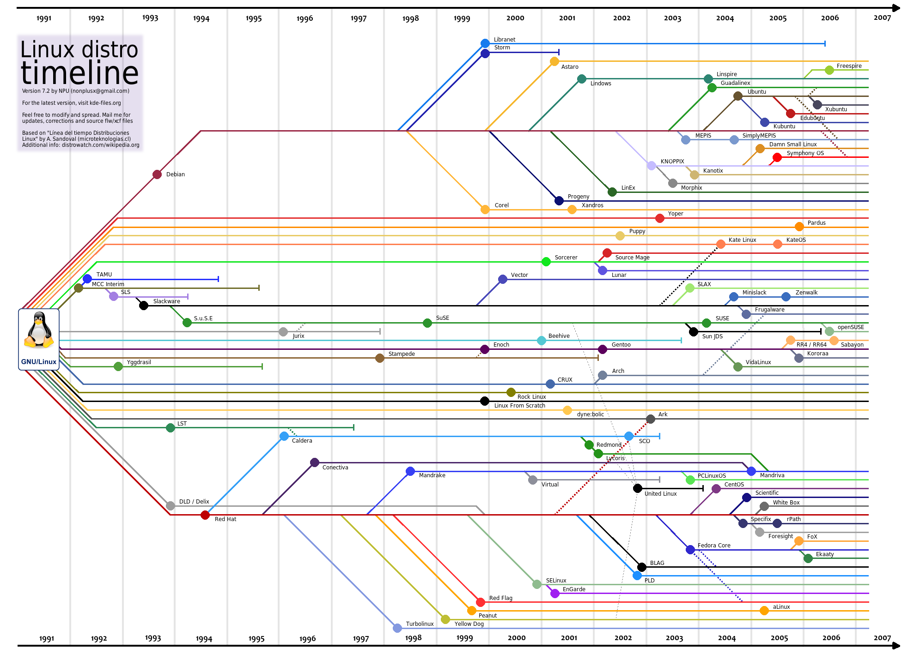

| 序号  | 修改时间       | 修改内容                         | 修改人   | 审稿人   |
| --- | ---------- | ---------------------------- | ----- | ----- |
| 1   | 2009.9     | 创建                           | Keefe | Keefe |
| 2   | 2009-12-27 | 增加x86的地址转换机制,  linux进程的内存分配  | 同上    |       |
| 3   | 2011-6-30  | 增加设备驱动；建立图表目录                | 同上    |       |
| 4   | 2018-3-30  | 将内核专题内容迁移到《内核开发系列》；增加OS版本章节。 | 同上    |       |
| 5   | 2021-11-24 | 转化成MD格式，增加ubuntu、centos章节    | 同上    |       |

<br>

<br>

---

# 目录

[TOC]

**图目录**

​    [图  ](#_Toc510286115)[1  windows](#_Toc510286115)[体系结构](#_Toc510286115)[    9](#_Toc510286115)

​    [图  ](#_Toc510286116)[2  UNIX](#_Toc510286116)[体系结构](#_Toc510286116)[    10](#_Toc510286116)

​    [图  ](#_Toc510286117)[3  GNU/Linux ](#_Toc510286117)[操作系统的基本体系结构](#_Toc510286117)[    10](#_Toc510286117)

​    [图  ](#_Toc510286118)[4  Linux ](#_Toc510286118)[内核的一个体系结构透视图](#_Toc510286118)[    11](#_Toc510286118)

​    [图  ](#_Toc510286119)[5  linux0.11 ](#_Toc510286119)[物理内存分配区域图](#_Toc510286119)[    12](#_Toc510286119)

​    [图  ](#_Toc510286120)[6  The Win32 API provides different levels of memory management for  versatility in application programming.    14](#_Toc510286120)

​    [图  ](#_Toc510286121)[7  80386](#_Toc510286121)[的地址转换](#_Toc510286121)[    15](#_Toc510286121)

​    [图  ](#_Toc510286122)[8   Linux](#_Toc510286122)[进程地址空间](#_Toc510286122)[    16](#_Toc510286122)

​    [图  ](#_Toc510286123)[9  Address Space of a Process Under Linux above v2.0    17](#_Toc510286123)

​    [图  ](#_Toc510286124)[10  linux0.11](#_Toc510286124)[的进程在逻辑](#_Toc510286124)[/](#_Toc510286124)[虚拟地址空间的分布](#_Toc510286124)[    17](#_Toc510286124)

​    [图  ](#_Toc510286125)[11  windows](#_Toc510286125)[系统地址空间](#_Toc510286125)[    18](#_Toc510286125)

​    [图  ](#_Toc510286126)[12  windows](#_Toc510286126)[用户地址空间](#_Toc510286126)[    19](#_Toc510286126)

​    [图  ](#_Toc510286127)[13  ](#_Toc510286127)[线程的状态与操作](#_Toc510286127)[    20](#_Toc510286127)

​    [图  ](#_Toc510286128)[14  linux](#_Toc510286128)[进程状态转化图](#_Toc510286128)[    21](#_Toc510286128)

​    [图  ](#_Toc510286129)[15  NT](#_Toc510286129)[线程状态转化图](#_Toc510286129)[    22](#_Toc510286129)

​    [图  ](#_Toc510286130)[16  solaris](#_Toc510286130)[进程的数据结构](#_Toc510286130)[    24](#_Toc510286130)

​    [图  ](#_Toc510286131)[17  linux](#_Toc510286131)[设备驱动分层结构示意图](#_Toc510286131)[    26](#_Toc510286131)

​    [图  ](#_Toc510286132)[18  linux](#_Toc510286132)[字符设备驱动程序数据结构示意图](#_Toc510286132)[    26](#_Toc510286132)

​    [图  ](#_Toc510286133)[19  linux](#_Toc510286133)[块设备驱动程序数据结构示意图](#_Toc510286133)[    27](#_Toc510286133)

​    [图  ](#_Toc510286134)[20   ](#_Toc510286134)[常规文件系统模型分层结构示意图](#_Toc510286134)[    29](#_Toc510286134)

​    [图  ](#_Toc510286135)[21  windows](#_Toc510286135)[文件系统模型](#_Toc510286135)[    30](#_Toc510286135)

​    [图  ](#_Toc510286136)[22  Linux](#_Toc510286136)[文件系统的逻辑结构](#_Toc510286136)[    31](#_Toc510286136)

​    [图  ](#_Toc510286137)[23  FAT](#_Toc510286137)[分区结构图](#_Toc510286137)[    32](#_Toc510286137)

​    [图  ](#_Toc510286138)[24  Minix](#_Toc510286138)[文件系统布局图](#_Toc510286138)[    33](#_Toc510286138)

​    [图  ](#_Toc510286139)[25  TCP/IP ](#_Toc510286139)[四层使用示例](#_Toc510286139)[    35](#_Toc510286139)

​    [图  ](#_Toc510286140)[26  ISO](#_Toc510286140)[七层模型图](#_Toc510286140)[    35](#_Toc510286140)

​    [图  ](#_Toc510286141)[27  ](#_Toc510286141)[两种网络体系结构层次对应](#_Toc510286141)[    36](#_Toc510286141)

​    [图  ](#_Toc510286142)[28  Linux ](#_Toc510286142)[网络栈结构](#_Toc510286142)[    36](#_Toc510286142)

<br>

<br>

---

# 1 简介

## 1.1 OS执行示例：hello world

操作系统做什么，以下面程序为例．

```c
#include <stdio.h>
int main(int argc, char *argv[])
{
    puts("hello world");
    return 0;
}
```

说明:

- ​    用户告诉操作系统执行hello程序

- ​    操作系统找到该程序，检查其类型    //检查可执行程序类型，如elf, exe, com...

- ​    检查程序首部，找出正文和数据的地址

- ​    文件系统找到第一个磁盘块

- ​    父进程需要创建一个新的子进程，执行hello程序

- ​    操作系统需要将执行文件映射到进程结构

- ​    操作系统设置CPU上下文环境，并跳到程序开始处

- ​    程序第一条指令执行，失败，缺页中断发生    //OS使用内存分页管理机制,每个进程拥有一个自己的页表.

- ​    操作系统分配一页内存，并将代码从磁盘读入，继续执行

- ​    更多的缺页中断，读入更多的页面

- ​    程序执行系统调用，在文件描述符中写一字符串 //stdout

- ​    操作系统检查字符串的位置是否正确

- ​    操作系统找到字符串被送往的设备

- ​    设备是一个伪终端，由一个进程控制

- ​    操作系统将字符串送给该进程

- ​    该进程告诉窗口系统它要显示字符串    //窗口子系统

- ​    窗口系统确定这是一个合法的操作，然后将字符串转换成像素

- ​    窗口系统将像素写入存储映像区

- ​    视频硬件将像素表示转换成一组模拟信号控制显示器（重画屏幕）

- ​    显示器发射电子束

- ​    你在屏幕上看到hello world

**操作系统概念:** 是计算机系统中的一个系统软件，是一些程序模块的集合.

## 1.2 OS版本

### Unix


图 1 unix家族图谱

说明：不同颜色代表一个流行分支。unix主要发展出以下分支：BSD(1978)、 Linux(1991)、Solaris(1992).

表格 1 UNIX和类Unix操作系统列表

| NIX System V 家族    | [A/UX](http://baike.baidu.com/searchword/?word=A%2FUX&pic=1&sug=1&enc=utf8)                 | [AIX](http://baike.baidu.com/subview/349664/349664.htm)                                         | [HP-UX](http://baike.baidu.com/subview/58963/58963.htm)                             | [IRIX](http://baike.baidu.com/subview/3373083/3373083.htm)                      |
| ------------------ | ------------------------------------------------------------------------------------------- | ----------------------------------------------------------------------------------------------- | ----------------------------------------------------------------------------------- | ------------------------------------------------------------------------------- |
|                    | [LynxOS](http://baike.baidu.com/subview/954794/954794.htm)                                  | [SCO  OpenServer ](http://baike.baidu.com/searchword/?word=SCO OpenServer&pic=1&sug=1&enc=utf8) | [Tru64](http://baike.baidu.com/subview/1297274/1297274.htm)                         | [Xenix](http://baike.baidu.com/subview/102293/102293.htm)                       |
|                    | [Solaris](http://baike.baidu.com/subview/329359/5113665.htm)                                | [OS/2  ](http://baike.baidu.com/subview/108542/108542.htm)                                      |                                                                                     |                                                                                 |
| BSD UNIX-386 BSD家族 | [BSD/OS](http://baike.baidu.com/searchword/?word=BSD%2FOS&pic=1&sug=1&enc=utf8)             | [FreeBSD](http://baike.baidu.com/subview/21459/21459.htm)                                       | [NetBSD](http://baike.baidu.com/subview/288469/288469.htm)                          | [NEXTSTEP](http://baike.baidu.com/subview/1524995/1524995.htm)                  |
|                    | [Mac  OS X ](http://baike.baidu.com/subview/24778/24778.htm)                                | [iOS](http://baike.baidu.com/subview/158983/8747673.htm)                                        | [OpenBSD](http://baike.baidu.com/subview/337596/337596.htm)                         | [SUN  OS ](http://baike.baidu.com/searchword/?word=SUN OS&pic=1&sug=1&enc=utf8) |
|                    | [OpenSolaris](http://baike.baidu.com/subview/1355867/1355867.htm)                           |                                                                                                 |                                                                                     |                                                                                 |
| UNIX-Like          | [GNU](http://baike.baidu.com/subview/36272/36272.htm)                                       | [Linux](http://baike.baidu.com/subview/1634/7331705.htm)                                        | [Android](http://baike.baidu.com/subview/1241829/9322617.htm)                       | [Debian](http://baike.baidu.com/subview/40687/40687.htm)                        |
|                    | [Ubuntu](http://baike.baidu.com/subview/4236/4236.htm)                                      | [Red  Hat ](http://baike.baidu.com/subview/1139590/1139590.htm)                                 | [Linux  Mint ](http://baike.baidu.com/subview/872449/872449.htm)                    | [Minix](http://baike.baidu.com/subview/390953/390953.htm)                       |
|                    | [QNX  ](http://baike.baidu.com/subview/711108/711108.htm)                                   | [GNU/Linux](http://baike.baidu.com/subview/2560767/2560767.htm)                                 | [GNU/Hurd](http://baike.baidu.com/searchword/?word=GNU%2FHurd&pic=1&sug=1&enc=utf8) | [Debian  GNU/Hurd](http://baike.baidu.com/subview/9173428/9183442.htm)          |
|                    | [GNU/kFreeBSD](http://baike.baidu.com/searchword/?word=GNU%2FkFreeBSD&pic=1&sug=1&enc=utf8) | [StartOS](http://baike.baidu.com/subview/9148046/9156070.htm)                                   |                                                                                     |                                                                                 |
| 其他                 | [DOS](http://baike.baidu.com/subview/365/7971327.htm)                                       | [MS-DOS](http://baike.baidu.com/subview/61797/61797.htm)                                        | [Windows](http://baike.baidu.com/subview/4821/4821.htm)                             | [React  OS ](http://baike.baidu.com/view/5097385.htm)                           |

备注：

### Linux

#### Linux内核

Linux内核指的是一个由Linus Torvalds负责维护，提供硬件抽象层、硬盘及文件系统控制及多任务功能的系统核心程序。

查看内核版本： `cat /proc/version`  或者 `uname -a`

```shell
[root@localhost ~]$ cat /proc/version
Linux version 4.19.91-23.al7.x86_64 (mockbuild@koji.alibaba-inc.com) (gcc version 4.8.5 20150623 (Red Hat 4.8.5-44) (GCC)) #1 SMP Tue Mar 23 18:02:34 CST 2021

[root@localhost ~]$ uname -a
Linux localhost 4.19.91-23.al7.x86_64 #1 SMP Tue Mar 23 18:02:34 CST 2021 x86_64 x86_64 x86_64 GNU/Linux
```

Linux内核使用三种不同的版本编号方式
    第一种方式用于1.0版本之前（包括1.0）。第一个版本是0.01，紧接着是0.02、0.03、0.10、0.11、0.12、0.95、0.96、0.97、0.98、0.99和之后的1.0。

​    第二种方式用于1.0之后到2.6，数字由三部分“A.B.C”，A代表主版本号，B代表次主版本号，C代表较小的末版本号。只有在内核发生很大变化时（历史上只发生过两次，1994年的1.0,1996年的2.0），A才变化。可以通过数字B来判断Linux是否稳定，偶数的B代表稳定版，奇数的B代表开发版。C代表一些bug修复，安全更新，新特性和驱动的次数。

  （当前）第三种方式从2004年2.6.0版本开始，使用一种“time-based”的方式。3.0版本之前，是一种“A.B.C.D”的格式。七年里，前两个数字A.B即“2.6”保持不变，C随着新版本的发布而增加，D代表一些bug修复，安全更新，添加新特性和驱动的次数。3.0版本之后是“A.B.C”格式，B随着新版本的发布而增加，C代表一些bug修复，安全更新，新特性和驱动的次数。

表格 Longterm release kernels

| Version | Maintainer                       | Released   | Projected EOL |
| ------- | -------------------------------- | ---------- | ------------- |
| 5.10    | Greg Kroah-Hartman & Sasha Levin | 2020-12-13 | Dec, 2026     |
| 5.4     | Greg Kroah-Hartman & Sasha Levin | 2019-11-24 | Dec, 2025     |
| 4.19    | Greg Kroah-Hartman & Sasha Levin | 2018-10-22 | Dec, 2024     |
| 4.14    | Greg Kroah-Hartman & Sasha Levin | 2017-11-12 | Jan, 2024     |
| 4.9     | Greg Kroah-Hartman & Sasha Levin | 2016-12-11 | Jan, 2023     |
| 4.4     | Greg Kroah-Hartman & Sasha Levin | 2016-01-10 | Feb, 2022     |

表格 内核版本号列表

| 内核版本号      | 时间         | 内核发展史                                                                                                                                                                                                                                                                     |
| ---------- | ---------- | ------------------------------------------------------------------------------------------------------------------------------------------------------------------------------------------------------------------------------------------------------------------------- |
| 0.00       | 1991.2.4   | 两个进程分别显示AAA BBB                                                                                                                                                                                                                                                           |
| 0.01       | 1991.9.17  | 第一个正式向外公布的Linux内核版本                                                                                                                                                                                                                                                       |
| 0.02       | 1991.10.5  | Linus Torvalds将当时最初的0.02内核版本发布到了Minix新闻组，很快就得到了反应。Linus Torvalds在这种简单的任务切换机制上进行扩展，并在很多热心支持者的帮助下开发和推出了Linux的第一个稳定的工作版本。                                                                                                                                                    |
| 0.03       | 1991.10.5  |                                                                                                                                                                                                                                                                           |
| 0.10       | 1991.10    | Linux0.10版本内核发布，0.11版本随后在1991年12月推出，当时它被发布在Internet上，供人们免费使用。                                                                                                                                                                                                             |
| 0.11       | 1991.12.8  | 基本可以正常运行的内核版本                                                                                                                                                                                                                                                             |
| 0.12       | 1992.1.15  | 主要加入对数学协处理器的软件模拟程序                                                                                                                                                                                                                                                        |
| 0.95（0.13） | 1992.3.8   | 开始加入虚拟文件系统思想的内核版本                                                                                                                                                                                                                                                         |
| 0.96       | 1992.5.12  | 开始加入网络支持和虚拟文件系统                                                                                                                                                                                                                                                           |
| 0.97       | 1992.8.1   |                                                                                                                                                                                                                                                                           |
| 0.98       | 1992.9.29  |                                                                                                                                                                                                                                                                           |
| 0.99       | 1992.12.13 |                                                                                                                                                                                                                                                                           |
| 1.0        | 1994.3.14  | Linux1.0版本内核发布，使用它的用户越来越多，而且Linux系统的核心开发队伍也建起来了。                                                                                                                                                                                                                          |
| 1.2        | 1995.3.7   |                                                                                                                                                                                                                                                                           |
| 2.0        | 1996.2.9   |                                                                                                                                                                                                                                                                           |
| 2.2        | 1999.1.26  |                                                                                                                                                                                                                                                                           |
| 2.4        | 2001.1.4   | Linux2.4.0版本内核发布。                                                                                                                                                                                                                                                         |
| 2.6        | 2003.12.17 | Linux2.6版本内核发布，与2.4内核版本相比，它在很多方面进行了改进，如支持多处理器配置和64位计算，它还支持实现高效率线和处理的本机POSIX线程库(NPTL)。实际上，性能、安全性和驱动程序的改进是整个2.6.x内核的关键。                                                                                                                                                     |
| 2.6.12     | 2005.6     | 社区开始使用 git 进行管理后的第一个大版本                                                                                                                                                                                                                                                   |
| 2.6.15     | 2006       | Linux2.6.15版本内核发布。它对IPv6的支持在这个内核中有了很大的改进。PowerPC用户现在有了一个用于64位和32位PowerPC的泛型树，它使这两种架构上的内核编辑成为可能。                                                                                                                                                                           |
| 2.6.30     | 2009.6     | 改善了文件系统、加入了完整性检验补丁、TOMOYO Linux 安全模块、可靠的数据报套接字（datagram socket)协议支持、对象存储设备支持、FS-Cache 文件系统缓存层、nilfs 文件系统、线程中断处理支持等等。                                                                                                                                                      |
| 2.6.32     | 2009.12    | 增添了虚拟化内存 de-duplicacion、重写了 writeback 代码、改进了 Btrfs 文件系统、添加了 ATI R600/R700 3D 和 KMS 支持、CFQ 低传输延迟时间模式、perf timechart 工具、内存控制器支持 soft limits、支持 S+Core 架构、支持 Intel Moorestown 及其新的固件接口、支持运行时电源管理、以及新的驱动。                                                                     |
| 2.6.34     | 2010.5     | 添加了 Ceph 和 LogFS 两个新的文件系统，其中前者为分布式的文件系统，后者是适用于 Flash 设备的文件系统。Linux Kernel 2.6.34 的其他特性包括新的 Vhost net、改进了 Btrfs 文件系统、对 Kprobes jump 进行了优化、新的 perf 功能、RCU lockdep、Generalized TTL Security Mechanism (RFC 5082) 及 private VLAN proxy arp (RFC 3069) 支持、asynchronous 挂起恢复等等。 |
| 2.6.36     | 2010.10    | Tilera 处理器架构支持、新的文件通知接口 fanotify、Intel 显卡上实现 KMS 和 KDB 的整合、并行管理工作队列、Intel i3/5 平台上内置显卡和 CPU 的智能电源管理、CIFS 文件系统本地缓存、改善虚拟内存的层级结构，提升桌面操作响应速度、改善虚拟内存溢出终结器的算法、整合了 AppArmor 安全模型（注：与 SELinux 基于文件的标注不同， AppArmor 是基于路径的）。                                                        |
| 2.6.39     | 2011.5.18  | 2.6.x系列最终版本，经历39个版本，跨度约7.5年。<BR>加入了IPset框架，提高规则匹配速度，更新媒体控制系统等。                                                                                                                                                                                                            |
| 3.0        | 2011.7.21  |                                                                                                                                                                                                                                                                           |
| 3.19.0     | 2015.2     | 3.x系列最终版本，经历19个版本，跨度约4.5年。<BR>为多种触控板增加多点触控支持。3.18+支持overlay文件系统。                                                                                                                                                                                                          |
| 4.0        | 2015.4     |                                                                                                                                                                                                                                                                           |
| 4.20       | 2018.12.23 | 4.x系列最终版本，经历20个版本，跨度约3.5年。<BR>                                                                                                                                                                                                                                            |
| 5.0        | 2019.3.3   |                                                                                                                                                                                                                                                                           |
| 5.10       | 2020.12.13 | 5.x系列最终版本，经历个版本，跨度 年。<BR>                                                                                                                                                                                                                                                 |

> ReleaseLog https://www.kernel.org/category/releases.html
> 
> 版本号：a.b.0一般简写为a.b，如3.0.0可简写为3.0
> 
> 版本更新规律：2.6以后，大概2-3个月一个大版本。

另外内核版本还有第二种方式（尾巴补充了构建描述信息）：major.minor.patch-build.desc

示例：2.26.35-rc5

1、major：表示主版本号，有结构性变化时才变更。

2、minor：表示次版本号，新增功能时才发生变化；一般奇数表示测试版，偶数表示生产版。

3、patch：表示对次版本的修订次数或补丁包数。

4、build：表示编译（或构建）的次数，每次编译可能对少量程序做优化或修改，但一般没有大的（可控的）功能变化。

5、desc：用来描述当前的版本特殊信息；其信息由编译时指定，具有较大的随意性，但也有一些描述标识是常用的，比如： rc（release candidate侯选版本）、smp（表示支持多处理器）、pp（pre-patch测试版本）、EL(企业发布版)、mm、fc（Fedora Core）

#### Linux发行版

Linux的发行版是由Linux内核与各种常用软件的集合产品，如今全球大约有数百款的Linux发行版本。Linux的发行版本可以大体分为两类，一类是商业公司维护的发行版本，一类是社区组织维护的发行版本，前者以著名的Redhat（RHEL）为代表，后者以Debian为代表。

查看发行版本：`lsb_release -a`  或者 `cat /etc/redhat-release`

```shell
# LSB：Linux Standard Base, lsb_release命令用来显示LSB和特定版本的相关信息。此命令只有部分linux有，如alinux
[root@localhost ~]$ lsb_release -a
LSB Version:    :core-4.1-amd64:core-4.1-noarch
Distributor ID: AlibabaCloud(AliyunLinux)
Description:    Alibaba Cloud Linux (Aliyun Linux) release 2.1903 LTS (Hunting Beagle)
Release:        2.1903
Codename:       HuntingBeagle

# /etc/redhat-release: 此文件只有基于redhat的发行版才有，如centos,fedora
[root@localhost ~]$ cat /etc/redhat-release
CentOS Linux release 8.1.1911 (Core)
```

表格 Linux发行版 (列表)

| **基于Debian**    | [Debian](http://baike.baidu.com/view/40687.htm)                     | [Ubuntu](http://baike.baidu.com/view/4236.htm)           | [Linux Mint](http://baike.baidu.com/view/872449.htm)       | [sidux](http://baike.baidu.com/searchword/?word=sidux&pic=1&sug=1&enc=utf8)               |
| --------------- | ------------------------------------------------------------------- | -------------------------------------------------------- | ---------------------------------------------------------- | ----------------------------------------------------------------------------------------- |
|                 | [Knoppix](http://baike.baidu.com/view/638124.htm)                   | [MEPIS](http://baike.baidu.com/view/745998.htm)          | [Chromium OS](http://baike.baidu.com/view/4657115.htm)     | [Google Chrome OS](http://baike.baidu.com/view/2627636.htm)                               |
|                 | [CrunchBang Linux](http://baike.baidu.com/view/9300153.htm)         |                                                          |                                                            |                                                                                           |
| **基于Red Hat**   | [Red Hat Enterprise Linux](http://baike.baidu.com/view/1389601.htm) | [Fedora](http://baike.baidu.com/view/182182.htm)         | [CentOS](http://baike.baidu.com/view/26404.htm)            | [Oracle Linux](http://baike.baidu.com/view/4615585.htm)                                   |
|                 | [Scientific Linux](http://baike.baidu.com/view/4076421.htm)         |                                                          |                                                            |                                                                                           |
| **基于Mandriva**  | [Mandriva Linux](http://baike.baidu.com/view/1525837.htm)           | [PCLinuxOS](http://baike.baidu.com/view/1215788.htm)     | [Unity Linux](http://baike.baidu.com/view/9300626.htm)     | [Mageia](http://baike.baidu.com/view/4720774.htm)                                         |
| **基于Gentoo**    | [Gentoo Linux](http://baike.baidu.com/view/66593.htm)               | [Sabayon Linux](http://baike.baidu.com/view/1525544.htm) | [Calculate Linux](http://baike.baidu.com/view/9301132.htm) | [Funtoo Linux](http://baike.baidu.com/searchword/?word=Funtoo Linux&pic=1&sug=1&enc=utf8) |
| **基于Slackware** | [Slackware](http://baike.baidu.com/view/10899.htm)                  |                                                          |                                                            |                                                                                           |
| **其它**          | [SUSE](http://baike.baidu.com/view/10440.htm)                       | [Arch Linux](http://baike.baidu.com/view/2090428.htm)    |                                                            |                                                                                           |



图 2 Linux分支图

>  备注：1. Redhat:  Redhat红帽是开源OS领导者，RHL基础上发布2个linux分支，分别是Fedora (追求新功能/快速免费版)和 付费企业发行版*Red Hat Enterprise Linux(RHEL)* 。2014年，Redhat收购RHL的社区主要力量CentOS（使用RHEL开放源代码编译而成的免费开源版本，号称100%兼容RHEL），centos仍保持免费。2018年，Redhat被IBM以340亿美元收购，Redhat仍独立运营。2020.12，Redhat宣布停止维护centos(最新版本centos 8)。
> 
> 2. Ubuntu:  2014年以后开源Linux最受欢迎的分支之一。

### Soalris

Solaris 是一种基于 Unix 的操作系统，最初由 Sun Microsystems（后来被 Oracle 公司收购）开发和推出。Solaris 操作系统主要用于服务器和工作站环境。2005年6月14日，Sun公司将正在开发中的Solaris 11的源代码以[CDDL](https://baike.baidu.com/item/CDDL/3804194?fromModule=lemma_inlink)许可开放，这一开放版本就是[OpenSolaris](https://baike.baidu.com/item/OpenSolaris/10465263?fromModule=lemma_inlink)。

Solaris 以其稳定性、可靠性和强大的特性闻名。它具有先进的多任务处理能力、可扩展性和安全性，适合高性能计算和企业级应用。Solaris 提供了广泛的功能，包括可靠的文件系统、网络协议栈、虚拟化技术、容器化支持以及高级的系统管理和监控工具。

Solaris 还引入了许多创新的特性，如 DTrace（动态跟踪工具）、ZFS（高级文件系统）、Containers（容器技术）和 Zones（区域），这些特性提供了更好的性能、可靠性和管理能力。

尽管 Solaris 曾经是一款非常流行的操作系统，但是在近年来，由于市场竞争的变化和其他因素的影响，其用户群体和影响力有所减弱。然而，Solaris 仍然在某些特定的领域和企业中得到使用和支持，特别是在需要高性能、高可靠性和安全性的环境中。

UFS是Solaris OS 中缺省的基于磁盘的文件系统。

Sun Solaris 10 操作系统的特点：

1. 通过优化可在许多硬件上使用。

2. 计算机不能侵入。

3. 和Linux应用程序可同步运行。

表格  Solaris操作系统版本历史

| **Solaris版本**       | **内核版本**    | **发布日期**   |
| ------------------- | ----------- | ---------- |
| Oracle Solaris 11.3 | <br>        | 2015.10.28 |
| Oracle Solaris 11.2 | <br>        | 2014.5.6   |
| Oracle Solaris 11.1 | <br>        | 2012.10.5  |
| Oracle Solaris 11   | SunOS 5.11  | 2011.11.11 |
| Sun Solaris 10      | SunOS 5.10  | 2005.1.31  |
| Sun Solaris 9       | SunOS 5.9   | 2002.5.22  |
| Sun Solaris 8       | SunOS 5.8   | 2000.2     |
| Sun Solaris 7       | SunOS 5.7   | 1998.11    |
| Sun Solaris 2.6     | SunOS 5.6   | 1997.7     |
| Sun Solaris 2.5.1   | SunOS 5.5.1 | 1996.5     |
| Sun Solaris 2.5     | SunOS 5.5   | 1995.11    |

### Windows

Windows版本历史 详见  《Microsoft微软专题.md》Windows 章节<br>

### Android

官网  https://developer.android.google.cn/

Android本质上还是一个Linux系统，只不过Google对它进行了裁剪和定制。

安卓（Android）是一种基于Linux内核（不包含GNU组件）的自由及开放源代码的操作系统。主要使用于移动设备，如智能手机和平板电脑，由美国Google公司和开放手机联盟领导及开发。Android操作系统最初由Andy Rubin开发，主要支持手机。2005年8月由Google收购注资。2007年11月，Google与84家硬件制造商、软件开发商及电信营运商组建开放手机联盟共同研发改良Android系统。随后Google以Apache开源许可证的授权方式，发布了Android的源代码。

表格  Android版本详细

| 名称                         | 发布时间       | 版本名         | API等级 | 特性            |
| -------------------------- | ---------- | ----------- | ----- | ------------- |
| Android 12                 |            |             |       |               |
| Android 11                 | 2020-9     | 11.0        | 30    |               |
| Android 10                 | 2019-5     | 10.0        | 29    |               |
| Android Pie                | 2018-5     | 9.0         | 28    |               |
| Android Oreo               | 2017-8     | 8.0-8.1     | 26-27 | 画中画           |
| Android Nougat             | 2016-8     | 7.0-7.1.2   | 24-25 | 通知栏快捷回复；多任务切换 |
| Android Marshmallow        | 2015-9     | 6.0-6.0.1   | 23    |               |
| Android Lollipop           | 2014-10    | 5.0-5.1.1   | 21-22 |               |
| Android KitKat             | 2013-9     | 4.4-4.4.4   | 19-20 |               |
| Android Jelly Bean         | 2012-6     | 4.1-4.3     | 16-18 |               |
| Android Ice Cream Sandwich | 2011-9     | 4.0.1-4.0.4 | 14-15 |               |
| Android Honeycomb          | 2011-2/5/7 | 3.0-3.2     | 11-13 |               |
| Android Gingerbread        | 2010-12    | 2.3-2.3.7   | 9-10  |               |
| Android Froyo              | 2010-2     | 2.2         | 8     |               |
| Android Eclair             | 2009-12    | 2.0-2.1     | 5-7   |               |
| Android Donut              | 2008-9     | 1.6         | 4     |               |
| Android Cupcake            | 2008-9     | 1.5         | 3     |               |
| -                          | 2008-9     | 1.1         | 2     |               |
| -                          | 2008-9     | 1.0         | 1     |               |

### MacOS

macOS是一套由苹果开发的运行于[Macintosh](https://baike.baidu.com/item/Macintosh/8310244)系列电脑上的操作系统。macOS是首个在商用领域成功的图形用户界面操作系统。

macOS版本详见 《Apple专题.md》macOS章节


### HarmonyOS

* OpenHarmony https://gitee.com/openharmony
* 鸿蒙学堂  https://hmxt.org/

华为推出的一款面向万物互联的全场景分布式操作系统。除了鸿蒙手机,鸿蒙还支持平板、智能穿戴、智慧屏和车机等多种终端设备，OpenHarmony是其对应的开源项目。

OpenHarmony是由开放原子开源基金会（OpenAtom Foundation）孵化及运营的开源项目，目标是面向全场景、全连接、全智能时代，基于开源的方式，搭建一个智能终端设备操作系统的框架和平台，促进万物互联产业的繁荣发展。

<br>

## 1.3 OS体系结构

操作系统结构分类: 整体式(单一内核)、层次式、虚拟机、微内核.

Linux 1991年由芬兰人Linus设计完成,源于教学用的Minix..

Solaris 源于1982的SUN OS,属于1981BSD4.1的分支.(BSD一系实现)

Unix/Linux系统属于*单一内核*模块结构.

Windows NT 融合了层次式和微内核操作系统的设计思想.

### Windows NT/2K/XP/2003体系结构


图 1 windows体系结构

### Unix体系结构图


图 2 UNIX体系结构

### Linux内核体系结构


图 3 GNU/Linux 操作系统的基本体系结构

linux体系结构说明：user mode 进程需要通过glibc作一个到kernel mode 的转换。


图 4 Linux 内核的一个体系结构透视图

### MacOS混合内核

NeXTSTEP是采用的卡内基梅隆大学开发的Mach微内核系统，GUI系统是以Mac OS Classic为基础进行开发，两者进行了很好的结合。最后变成了内核 Darwin。

一个简单的OS X和Darwin内核版本的公式：

```shell
If （OSX.Version == 10.x.y)
    Darwin.version = (4+x).y
```

OS X和 iOS 分层架构

- 用户层：Aqua、DashBoard、Spotlight和辅助功能（accessibility）等。
- 应用框架层：包括Cocoa、Carbon和Java。而在iOS中只有Cocoa（严格的说是 Cocoa Touch）。
- 核心框架：有时候称为图形和媒体层。包括核心框架、OpenGL和QucikTime。
- Darwin：操作系统核心——包括内核和UNIX shell环境。

shell ：常见的shell基本都支持 sh、bash、 csh、 tcsh、 ksh、 zsh，Mac OS X 10.15以后默认使用zsh替换bash。zsh的配置文件为~/.zshrc。

文件系统：10.13以后版本使用**Apple File System**(**APFS**)作为文件系统，用于取代之前的HFS+文件系统。

**目录系统**

* *UNIX的系统目录*: OS X是一个符合UNIX标准的系统，因此也有那些标准UNIX具有的目录结构如/bin, /sbin/, /usr, /etc, /dev, /tmp, /var；

* *OS X特有的目录结构*：基本都是大写字母开头如/Applications, /Developer, /Library, /Network, /Users, /Volumes, /Cores。

**Bundle**

Bundle不止是应用程序的根基，也是框架，插件，小物件（widget）甚至内核扩展的根基。

苹果的定义**：*一种标准化的层次结构，保存了可执行代码以及代码所需要的资源。***

- A *bundle* is a directory with a standardized hierarchical structure that holds executable code and the resources used by that code.

***简单来讲，就是一种目录结构，按这种目录结构进行组织的文件夹，都可以称之为bundle。***

**iOS Application Bundle 结构（目录名通常以.app结尾）**

```text
MyApp.app
   MyApp   # Executable（必须）每个应用程序必须有一个可执行文件。这个文件是应用程序的入口点以及其他静态链接到应用程序的代码。
   MyAppIcon.png
   MySearchIcon.png
   Info.plist   #（必须）一种结构化的属性文档，基于XML。操作系统依赖这个文件区分应用程序和其他关联文件。
   Default.png
   MainWindow.nib
   Settings.bundle
   MySettingsIcon.png
   iTunesArtwork
   en.lproj
      MyImage.png
   fr.lproj
      MyImage.png
```

### HarmonyOS体系结构

**技术架构**

OpenHarmony整体遵从分层设计，从下向上依次为：内核层、系统服务层、框架层和应用层。系统功能按照“系统 > 子系统 > 组件”逐级展开，在多设备部署场景下，支持根据实际需求裁剪某些非必要的组件。OpenHarmony技术架构如下所示：


**内核层**

- 内核子系统：采用 <u>多内核</u>（Linux内核或者LiteOS）设计，支持针对不同资源受限设备选用适合的OS内核。内核抽象层（KAL，Kernel Abstract Layer）通过屏蔽多内核差异，对上层提供基础的内核能力，包括进程/线程管理、内存管理、文件系统、网络管理和外设管理等。
- 驱动子系统：驱动框架（HDF）是系统硬件生态开放的基础，提供统一外设访问能力和驱动开发、管理框架。

**系统服务层**

系统服务层是OpenHarmony的核心能力集合，通过框架层对应用程序提供服务。该层包含以下几个部分：

- 系统基本能力子系统集：为分布式应用在多设备上的运行、调度、迁移等操作提供了基础能力，由分布式软总线、分布式数据管理、分布式任务调度、公共基础库、多模输入、图形、安全、AI等子系统组成。
- 基础软件服务子系统集：提供公共的、通用的软件服务，由事件通知、电话、多媒体、DFX（Design For X） 等子系统组成。
- 增强软件服务子系统集：提供针对不同设备的、差异化的能力增强型软件服务，由智慧屏专有业务、穿戴专有业务、IoT专有业务等子系统组成。
- 硬件服务子系统集：提供硬件服务，由位置服务、生物特征识别、穿戴专有硬件服务、IoT专有硬件服务等子系统组成。

根据不同设备形态的部署环境，基础软件服务子系统集、增强软件服务子系统集、硬件服务子系统集内部可以按子系统粒度裁剪，每个子系统内部又可以按功能粒度裁剪。

**框架层**

框架层为应用开发提供了C/C++/JS等多语言的用户程序框架和Ability框架，适用于JS语言的JS UI框架，以及各种软硬件服务对外开放的多语言框架API。根据系统的组件化裁剪程度，设备支持的API也会有所不同。

**应用层**

应用层包括系统应用和第三方非系统应用。应用由一个或多个FA（Feature Ability）或PA（Particle Ability）组成。其中，FA有UI界面，提供与用户交互的能力；而PA无UI界面，提供后台运行任务的能力以及统一的数据访问抽象。基于FA/PA开发的应用，能够实现特定的业务功能，支持跨设备调度与分发，为用户提供一致、高效的应用体验。

<br>

## 本章参考

* 百度百科：Linux, Unix, Windows, Soalris, Android, MacOS, HarmonyOS
* 百度百科- Linux版本 [https://baike.baidu.com/item/Linux%E7%89%88%E6%9C%AC](https://baike.baidu.com/item/Linux版本)
* 百度百科- windows版本 [https://baike.baidu.com/item/Windows%E6%93%8D%E4%BD%9C%E7%B3%BB%E7%BB%9F](https://baike.baidu.com/item/Windows操作系统)
* linux kernel http://www.ibm.com/developerworks/cn/linux/theme/kernel/timseries.html?ca=drs-tp2608
* Solaris : http://developers.sun.com/solaris/learning/new2/index.jsp
* CentOS:被 Red Hat 抛弃后,我更有活力了 https://new.qq.com/omn/20201222/20201222A02Q6G00.html
* 华为鲲鹏深度解析：定位中国Intel，重塑国产IT生态价值体系  https://baijiahao.baidu.com/s?id=1668822564646181000&wfr=spider&for=pc
* Android历史版本  https://baike.baidu.com/item/Android%E5%8E%86%E5%8F%B2%E7%89%88%E6%9C%AC
* 苹果 MacOS 操作系统版本历史汇总 http://www.dayanzai.me/mac-operating-system-versions.html
* Mac OS X和macOS版本的完整列表 https://www.imymac.com/zh-CN/mac-tips/mac-os-versions.html

<br><br>

# 2 存储管理

**存储体系**:　寄存器，cache, 内存，磁盘．

**存储管理的任务**

- 内存空间的管理，分配，回收。

记录内存的使用：位示图，内存分配表

- 存储共享：如内存的覆盖技术。

覆盖overlay: 常用于系统程序的内存管理，要求熟悉覆盖结构，如程序段的划分

- 存储保护：通常由硬件完成保护功能，软件辅助。如常用基址，限长寄存器来判断是否段越界。

- 内存扩充：如虚拟存储技术

- 地址转换

**内存机制**

**内存管理机制**: 分区、分页、分段、段页式。

**windows**物理内存使用分页管理，使用二页级表。

**Linux**物理内存使用分页管理，使用二级页表。

**交换技术**：进程在内存与外存之间的动态调度, 常用于分时系统

**写时复制机制**: 进程fork时并不马上分配内存空间，而是在要使用时才分配内存空间。将分配的时间延迟到进程真正使用的时候，提高了内存利用率。

**程序性局部性原理**：包括空间局部性和时间局部性。

如文件高速缓存，快表等

## 2.1 虚拟存储技术(VM)

目的: 使的进程能够使用比内存还大的页面文件。用cpu时间和外存空间来换取内存空间的技术（资源转化技术）。

内存分配页大小（常见大小）

- 4096 4k
- 16384 16K
- 65536 64k

4K环境上编译的，无法在16和64上运行，反之可以。

因此，建议统一在64K的 机器上编译。

Linux环境可用 `getconf PAGESIZE` 可查看页大小，一般默认是4K，鲲鹏芯片架构是64K。

```shell
# Aliyun x86_64
$ uname -a
Linux iZ2zebj7eoe7terrup37y4Z 4.19.91-23.al7.x86_64 #1 SMP Tue Mar 23 18:02:34 CST 2021 x86_64 x86_64 x86_64 GNU/Linux
$ getconf PAGESIZE
4096

# huaweiyun, kunpeng aarch64
$ uname -a
Linux ecs-4ed9 4.18.0-147.5.1.el8_1.aarch64 #1 SMP Tue Feb 4 23:44:08 UTC 2020 aarch64 aarch64 aarch64 GNU/Linux
$ getconf PAGESIZE
65536
```

## 2.2 内存空间的使用


图 5 linux0.11 物理内存分配区域图

说明: linux0.11内核,默认最多支持16M.

## 2.3 内存的分配

### Linux

常用的内存分配库

* ptmalloc: 基础库，最为稳定的内存管理器，无论在什么环境下都能适应，但是分配效率相对较低。
* [tcmalloc](https://github.com/google/tcmalloc): google开源的线程缓存分配。针对多核情况有所优化，性能有所提高，但是内存占用稍高，大内存分配容易出现CPU飙升。
* [jemalloc](https://github.com/jemalloc/jemalloc):  facebook开源。内存占用更高，但是在多核多线程下的表现也最为优异。

**内核空间分配**1G: 映射到物理内存, 是连续的. 其中用到两种内存分配方式，整页分配_get_free_page（大内存）、slab分配kmalloc（小内存）。此外vmalloc也是在内核空间分配,只是分配的是内核虚拟空间,然后通过内核页表分配到分散的内存中,因此是不连续的,通常用于大于128kb空间时的分配.

**用户空间分配**3G: 每个进程都有自己的页表, CR3记录当前的进程页表首地址. 进程访问内存通过逻辑地址+CR3来得到物理地址. 此处主要通过mmap来分配内存, 一开始并不直接分配只是个虚拟地址, 只是要使用时发生缺页中断才真正分配物理页面.

**glibc malloc实现:**

**linux查看进程虚拟地址空间方法**

```shell
# 反汇编目标程序，查看程序静态结构**
$ objdump -d [proc]
# 查看运行进程的虚拟地址空间**
$ cat /proc/{pid}/maps**
```

### Windows

用户空间内存分配方式

- ​    以页为单位的虚拟内存分配方式
  - 函数（Virtualxxx）
- ​    内存映射文件
  - 函数（CreateFileMapping,  MapViewOfFile）
- ​    内存堆方法
  - Heapxxx  和早期的接口Localxxx  和Globalxxx）

## 2.4 Windows内存管理


图 6 The Win32 API provides different levels of memory management for versatility in application programming.

## 本章参考

<br>

# 3  进程/线程

**进程**process:　进程是具有独立功能的程序关于某个数据集合上的一次运行活动，是系统进行***资源分配***和调度的独立单位．又称任务task. 进程的***两个属性***: 资源分配和cpu调度.

**线程** **thread:** 有时称轻量级进程, 进程中的一个运行实体, 是一个CPU调度单位，将原来进程的两个属性分开处理．

## 3.1 IA32的地址转换机制

逻辑地址: (48bit = 32位段地址 : 16位段偏移)指令中访问存储空间的地址, 由逻辑地址确定的存储空间称为逻辑地址空间. 也叫虚拟地址空间, 管理的逻辑地址空间可达2^48=64T.

*线性地址*: (32bit)若没有启用分页机制, 则386中线性地址就是物理地址.

物理地址: (32bit)物理内存的地址, 物理内存地址空间大小由地址总线长度决定.32位的地址总路线可寻址2^32=4G.

早期IA32 8位寻址，直接物理寻址。后来16位物理内存分段，每段64k.再后来保护模式引入，实现了物理内存分页，每页4kb.

**分段机制**: x86对虚拟地址进行分段管理, 把虚拟地址空间分为大小不同(?)的存储段, 一个段最大可达2^32=4GB, 64T的虚拟地址空间最多可分为64T/4GB=16K个段. 其中全局地址空间和局部地址空间最多可以各有8K个段，称为全局段和局部段。使用段描述符表记录各个进程使用的段空间位置、大小和有关属性。GDT为全局一个, LDT为每个进程一个.

​    逻辑地址转换成线性地址: 逻辑地址[段选择符16bit：段内偏移地址32bit] 1) 看段选择符的T1=0还是1，知道当前要转换是GDT中的段，还是LDT中的段，再根据相应寄存器GDTR/LDTR，得到其地址和大小,得数组。2) 拿出段选择符中前13位，可以在这个数组中，查找到对应的段描述符，即可找到段基址base; 3) 把Base + offset，就是要转换的线性地址.

​    在linux下, 逻辑地址总是等于线性地址. 因为从v2.2时, linux所有进程使用相同的逻辑地址空间,也就是不再使用LDT(除了wine的模仿VM86模式), 并规定段基址是0,段界限是4G, 这样将段机制就绕过去了.

**分页机制**: 物理内存分页,每页大小4kb. 每个进程都有自己的页目录表. CR3寄存器存放当前进程的页目录表首地址. 进程通过线性地址+CR3经过转换得到物理地址.

​    线性地址转换成物理地址: 二级页表, 通过线性地址[页目录索引10bit: 页表索引10bit: offset 12bit]. 1)从CR3取出当前进程页目录表首地址; 2)通过线性地址前10位得到页目录项指向的页表地址;3)通过线性地址的页表索引找到物理页; 4)通过线性地址的offset找到内存的物理地址. (4GB = 2^10 * 2^10 * 2^12 = 2^32). 页目录项和页表项各占4byte, 二级页表所占的空间为: 2^10 *4 +2^10 *4 = 8KB

​    实际使用中, 有三,四甚至五级页表.

图 7 80386的地址转换

注：上述所说的地址转换通常由硬件来完成.

## 3.2 进程的虚拟地址空间

各个进程的存储区域彼此隔离，每个进程都可以独立使用自己的虚拟地址空间，从而保证了进程的信息安全。每个地进程虚拟进址空间4G，其中3G的用户空间，1G的内核空间。

### Linux

查看进程的地址空间：

```shell
$ cat /proc/{pid}/maps
$ vmstat
```

linux 通过二级页表来管理物理页面。

虚拟地址格式： 32bit {段地址，段偏移}

表格  Linux进程地址空间

| **地址**        | **作用**                   | **说明**                  |
| ------------- | ------------------------ | ----------------------- |
| >=0xc000 0000 | 内核虚拟存储器                  | 用户代码不可见区域               |
| <0xc000 0000  | Stack（用户栈）               | ESP指向栈顶                 |
|               | ↓  ↑                     | 空闲内存                    |
| >=0x4000 0000 | 文件映射区                    |                         |
| <0x4000 0000  | ↑                        | 空闲内存                    |
|               | Heap(运行时堆)               | 通过brk/sbrk系统调用扩大堆，向上增长。 |
|               | .data、.bss(读写段)          | 从可执行文件中加载               |
| >=0x0804 8000 | .init、.text、.rodata(只读段) | 从可执行文件中加载               |
| <0x0804 8000  | 保留区域                     |                         |


图 9 Address Space of a Process Under Linux above v2.0

说明:

* Every 32-bit architecture limits the addressable memory to 4 GB.
* The upper quarter of the virtual address space is reserved for the Linux kernel.
* Shared libraries, such as glibc, are stored at 1 GB and higher.


图 10 linux0.11的进程在逻辑/虚拟地址空间的分布

说明: Linux0.11所有进程共享一个4G的线性地址空间.

### Windows


图 11 windows系统地址空间

**系统工作集链表   描述系统工作集的工作集链表数据结构**

- **系统高速缓存   用来映射在系统高速缓存中打开的文件的虚拟空间**
- **分页缓冲池  可分页系统内存堆**
- **系统PTE缓冲池**，用来映射系统页面
- **非分页缓冲池  不可分页的系统内存堆**


图 12 windows用户地址空间

### Soalris

NOTE: 0x0—0x8048000 (非0x80480000)        stack

图表：solaris地址空间

## 3.3 进程/线程状态转换

**进程状态模型**: 三状态(运行,就绪,等待), 五状态(增加创建,挂起), 七状态(增加阻塞,挂起分为阻塞挂起和就绪挂起)

**线程状态基本模型:**

线程的基本状态: 执行runnable、就绪、阻塞

线程的基本操作:

- 派生：线程在进程内派生出来，它即可由进程派生，也可由线程派生。
- 阻塞（Block）：如果一个线程在执行过程中需要等待某个事件发生，则被阻塞。Sleep,suspend,  IO等待或者等待某个对象则进入阻塞态.
- 激活（unblock）：如果阻塞线程的事件发生，则该线程被激活并进入就绪队列。
- 调度（schedule）：选择一个就绪线程进入执行状态。
- 结束（Finish）：如果一个线程执行结束，它的寄存器上下文以及堆栈内容等将被释放。


图 13 线程的状态与操作

### Linux进程状态转换

Linux的进程分为五状态，状态及状态转换如下：

* TASK_RUNNING(运行)：进程是可执行的，它或者正在执行，或者在运行队列中等待执行。这是进程在用户空间中执行惟一可能的状态，可以应用到内核空间中正在执行的进程。

* TASK_INTERRUPTIBLE(可中断)：进程正在睡眠，等待某些条件的达成。一旦这些条件达成，内核就会把进程状态设置为运行。处于此状态的进程也会因为接收到信号而提前被唤醒并投入运行。

* TASK_UNINTERRUPTIBLE(不可中断)：除了不会因为接收到信号而被唤醒从而投入运行外，这个状态与可中断状态相同。这个状态通常在进 程必须在等待时不受干扰或等待事件很快就会发生时出现。由于处于此状态的任务对信号不作响应，所以没可中断状态使用广。

* TASK_ZOMBIE(僵死)：该进程已经结束了，但是其父进程还没有调用wait4()系统调用。为了父进程能够获知它的消息，子进程的进程描述符仍然被保留着。一旦父进程调用wait4(),进程描述符就会释放。

* TASK_STOPPED(停止)：进程停止运行，进程在投入运行


图 14 linux进程状态转化图

### Solaris进程,内核线程和LWP的关系

Solaris支持内核线程、轻权进程和用户线程。一个进程可有大量用户线程；大量用户线程复用少量的轻权进程，轻权进程与内核线程一一对应。

- 用户级线程在调用核心服务时（如文件读写），需要“捆绑(bound)”在一个LWP上。永久捆绑（一个LWP固定被一个用户级线程占用，该LWP移到LWP池之外）和临时捆绑（从LWP池中临时分配一个未被占用的LWP）。
- 在调用系统服务时，如果所有LWP已被其他用户级线程所占用（捆绑），则该线程阻塞直到有可用的LWP。
- 如果LWP执行系统线程时阻塞（如read()调用），则当前捆绑在LWP上的用户级线程也阻塞。

### Windows NT线程状态转化


图 15 NT线程状态转化图

NT的线程状态如下：

1. ​    就绪状态：进程已获得除处理机外的所需资源，等待执行。
2. ​    备用状态：特定处理器的执行对象，系统中每个处理器上只能有一个处于备用状态的线程。
3. ​    运行状态：完成描述表切换，线程进入运行状态，直到内核抢先、时间片用完、线程终止或进行等待状态。
4. ​    等待状态：线程等待对象句柄，以同步它的执行。等待结束时，根据优先级进入运行、就绪状态。
5. ​    转换状态：线程在准备执行而其内核堆栈处于外存时，线程进入转换状态；当其内核堆栈调回内存，线程进入就绪状态。
6. ​    终止状态：线程执行完就进入终止状态；如执行体有一指向线程对象的指针，可将线程对象重新初始化，并再次使用。

### 跨平台线程对象设计

**基本状态**: 新线程态, 可运行态, 非运行态, 死亡态

**基本操作**:

​    Create()    线程创建,进入新线程态

​    Start()    线程启动,进入run(),

​    Run() 线程实际执行函数,进入可运行态

​    Suspend(),Sleep(),wait() 线程进入非运行态

​    Stop()或者线程函数run()执行完成, 线程进入死亡态.

**线程状态说明**

● 新线程态(New Thread)
 　产生一个Thread对象就生成一个新线程。当线程处于"新线程"状态时,仅仅是一个空线程对象,它还没有分配到系统资源。因此只能启动或终止它。任何其他操作都会引发异常。
● 可运行态(Runnable)

　 start()方法产生运行线程所必须的资源,调度线程执行,并且调用线程的run()方法。在这时线程处于可运行态。该状态不称为运行态是因为这时的 线程并不总是一直占用处理机。特别是对于只有一个处理机的PC而言,任何时刻只能有一个处于可运行态的线程占用处理 机。Java通过调度来实现多线程对处理机的共享。

● 非运行态(Not Runnable)

　　当以下事件发生时,线程进入非运行态。

　　①suspend()方法被调用;

　　②sleep()方法被调用;

　　③线程使用wait()来等待条件变量;

​        ④线程处于I/O等待。

● 死亡态(Dead)

   当run()方法返回,或别的线程调用stop()方法,线程进入死亡态 。通常Applet使用它的stop()方法来终止它产生的所有线程。

## 3.4 进程/线程实现

**线程的实现机制** (三种)

- ​    一是内核线程，内核以线程为基础调度. 如linux,windows；
- ​    二是用户线程, 完全由应用程序来管理, 内核不知线程的存在.
- ​    三是内核线程和用户线程的结合，如solaris．

**进程的实现**

windows的进程结构:　线程列表+对象列表+VAD列表. VAD，Virtue Address Descriptors

是用来描述进程虚拟地址空间状态, 每个VAD描述了对应的地址范围,保护属性等.

### Solaris


图 16 solaris进程的数据结构

## 3.5 进程/线程调度

**进程管理结构**：进程控制块PCB, 用它来记录进程的外部特征，描述进程的运动变化过程（又称进程描述符、进程属性）

PCB组织方式(链表, 索引, 进程队列等)

链接结构：

- 同一状态进程的PCB组成一个链表，不同状态对应多个不同的链表
- 就绪链表、阻塞链表

索引结构：对具有相同状态的进程，分别设置各自的PCB索引表，表明PCB在PCB表中的地址

进程队列：不同状态进程分别组成队列, 如运行队列、就绪队列、等待队列

### 调度算法

原则: 公平, 高效.

衡量因素: 响应时间, 周转时间, 吞吐量

常见算法:

- **先进先出进程调度算法（FIFO）**

- **基于优先数的调度（HPF—Highest Priority First）**

- **时间片轮转调度算** **(RR—Round Robin)**:  **时间片选择问题：固定时间片,** **可变时间片**

- **多级队列反馈调度算法**

各操作系统调度实现

- UNIX  **动态优先数法**
- 5.3BSD **多级反馈队列法**
- Windows **基于优先级的抢占式多任务调度**
- Linux 抢占式调度
- Solaris 综合调度算法

## 本章参考

<br><br>

# 4 文件系统

## 4.1 文件系统简述

文件管理系统简称文件系统，文件系统是操作系统用于明确存储设备（常见的是磁盘，也有基于NAND Flash的固态硬盘）或分区上的文件的方法和数据结构；即在存储设备上组织文件的方法。

文件系统由三部分组成：文件系统的接口，对对象操纵和管理的软件集合，对象及属性。从系统角度来看，文件系统是对文件存储设备的空间进行组织和分配，负责文件存储并对存入的文件进行保护和检索的系统。具体地说，它负责为用户建立文件，存入、读出、修改、转储文件，控制文件的存取，当用户不再使用时撤销文件等。

文件系统的功能包括：管理和调度文件的存储空间，提供文件的逻辑结构、物理结构和存储方法;实现文件从标识到实际地址的映射，实现文件的控制操作和存取操作，实现文件信息的共享并提供可靠的文件保密和保护措施，提供文件的安全措施。

**文件系统逻辑结构**是依照文件的内容的逻辑关系组织文件结构，属于用户可见的。文件的逻辑结构可以分为无结构的流式文件和有结构的记录式文件。

**文件系统物理结构**(在物理存储空间的存放组织方式):  以文件物理块作为分配的基本单位。可分为

* 连续文件：
* 链接文件：link是unix/linux独有。包括软链接和硬链接。
* 索引文件：

**文件系统分类**：

* 硬盘文件系统：如ext2/ext3/ext4文件系统
* 网络文件系统：包括NFS CODA AFS等
* 特殊的文件系统：如/proc,  pipe,  tmpfs

**文件系统实现**

1)内存中数据结构：系统打开文件表(整个系统一张)，用户打开文件表(每个进程一个)

2)外存中空间管理：位图位，空闲块或链表

3)记录成组或分解：用来提高存储空间的利用率（单个记录占用空间大小）

文件目录：使用FCB(File Control Block).

文件目录结构: 1)b treee; 2) linux的inode。

**文件系统管理方式**

1)传统的卷管理,如FAT,NTFS等;

2)基于存储池的管理: 如ZFS

3)分布式文件系统, 如GFS

**文件系统性能指标**：

1)文件名，目录名长度: 如从minix的14个字符到fat的255个字符;

2)文件卷大小：从minix的64M；

3)是否支持文件备份恢复

4)快速查询目录树．

5)容错性:

6)安全性: 用户组,属主分级权限,

7)可靠性: 允许磁盘坏块,不允许到其它节点.

文件系统的基本单位：文件簇(fat,ntfs)、磁盘块/盘块(minix)、逻辑块、物理块

物理存储的基本单位: 扇区

文件系统的基本单位通常是扇区的整数倍。

## 4.2 虚拟文件系统VFS

除了linux标准的文件系统Ext2/Ext3/Ext4外，存在很多种文件系统，比如reiserfs, xfs, Windows的vfat NTFS，网络文件系统nfs 以及flash 文件系统jffs2, yaffs/yaffs2 ubifs。linux通过叫做VFS的中间层最这些文件系统提供了完美的支持。


图 文件系统VFS层抽象

**VFS存在的意义**

1. 向上对应用层提供一个标准的文件操作接口；

2. 对下向文件系统提供一个灵活的接口，以便其他操作系统的文件系统可以方便的移植到Linux上；

3. VFS内部则通过系列高效的管理机制，比如inode cache, dentry cache 以及文件系统的预读等技术，使得底层文件系统不需沉溺到复杂的内核操作，即可获得高性能；

4. 此外VFS把一些复杂的操作分尽量抽象到VFS内部，使得底层文件系统实现更简单。

虚拟文件系统包括：【/dev/】、【/proc/】和【/sys/】等，它们下面的任何文件都不会占有硬盘的空间，因为虚拟文件系统只是一个抽象的对应方式，并没有任何实体的文件存在硬盘中。 它的作用是什么？虚拟文件系统作为User Space与Kernel Space之间的桥梁，当用户的应用程序（Application）需要任何的硬件设备时，要先通过虚拟文件系统或系统模块，向Kernel请求支持。也就是说User Space中的应用程序无法直接和Kernel Space交互，必须通过中间的虚拟文件系统。

**VFS 对象类型**

VFS通用模型包含以下类型对象：以linux的VFS为例

1. super block 超级块

存储文件系统相关的信息，对于磁盘文件系统来说，这个对象通常对应磁盘上的一个文件系统控制块（磁盘super block）。

2. inode 索引节点

存储一个文件相关的信息，对于磁盘文件系统，这个对象通常对应磁盘上的一个文件控制块(磁盘inode)。每一个inode都对应一个编号，可以在文件系统内唯一标识这个文件。

3. file 文件

file是和进程相关的，file代表一个打开的文件，file和inode之间是多对一的关系，因为多个进程可以打开同一个文件，系统会为每一次打开都创建一个file结构。

4. dentry 目录项

底层文件系统的许多操作严重依赖文件的inode，在进行文件操作前，我们需要根据路径名找到文件对应的inode。我们知道文件系统是树状结构的，因此需要从根目录通过目录树找到要操作的文件或目录，这个遍历过程涉及到磁盘操作，非常耗时。根据局部性原理，很有必要把这个查找过程cache起来，dentry就是为了加快目录遍历操作引入的数据结构。

每一个基于磁盘的文件系统，都有特定的方法用来构建目录树。一般来说有两种方式：

1. 磁盘上保存着目录项

2. 通过磁盘文件的父子关系重建目录项

## 4.3 文件系统模型


图 17 常规文件系统模型分层结构示意图

**说明:**

- 文件系统接口
  
   定义了一组使用和操作文件的方法

- 逻辑文件系统层
  
   使用目录结构为文件组织模块提供所需的信息，并负责文件的保护和安全

- 文件组织模块层
  
  负责对具体文件以及这些文件的逻辑块和物理块进行操作

- 基本文件系统层
  
  主要向相应的设备驱动程序发出读写磁盘物理块的一般命令

- 基本I/O控制层
  
   由设备驱动程序和中断处理程序组成，实现内存和磁盘系统之间的信息传输

### Windows文件系统模型


图 18 windows文件系统模型

说明：FSD(文件驱动程序)分为本地FSD和远程FSD

- 本地FSD：允许用户访问本地计算机的数据
- 远程FSD：允许用户通过网络访问远程计算机上的数据

### Linux文件系统模型

进程与文件的关联数据结构：

- fs_struct结构，它包含两个指向VFS索引节点的指针，分别指向root(即根目录节点)和pwd(即当前目录节点)；
- files_struct结构，它保存该进程打开文件的有关信息, 如下图所示


图 19 Linux文件系统的逻辑结构

表格 Linux的设备文件

| 设备名    | 路径              | 说明                       |
| ------ | --------------- | ------------------------ |
| 基本设备文件 | /dev/sd*        | 设备文件有二个代码，分别是主/次号        |
| 总线     | /dev/bus        | 一般只有一个子目录 usb            |
| 硬盘     | /dev/disk       |                          |
| 输入     | /dev/input      |                          |
| 逻辑卷    | /dev/mapper     | 每个逻辑卷LV都在此目录下对应一个文件      |
| vpn    | /dev/net        | 目录中默认会有一个tun设置文件，用来建立VPN |
| 终端     | /dev/pts        | 当用户通过非本机登陆时，产生的可使用终端界面   |
| 共享共享   | /dev/shm        |                          |
|        | /dev/.udev      |                          |
| 逻辑卷    | /dev/VolGroup00 | 存放的是指向该VG包含的LV的设备文件链接    |

查看设备文件命令：`$ ls blk`

## 4.4 各种文件系统结构

表格  各种文件系统列表

| 文件系统                                      | 简介                                                                                                                                          | 备注         |
| ----------------------------------------- | ------------------------------------------------------------------------------------------------------------------------------------------- | ---------- |
| FAT                                       | File Allocation Table，文件配置表。版本有fat, fat16和fat32。现在所说的fat一般指fat32。<br>由微软发明并拥有部分专利的文件系统，供MS-DOS使用，也是所有非NT核心的微软窗口使用的文件系统。软盘和绝大多数操作系统都支持的文件系统。 | 跨OS支持      |
| fat16                                     | FAT16使用了16位的空间来表示每个扇区(Sector)配置文件的情形，故称之为FAT16。<br/>Windows 下的 fatl6 ，在 Linux 中识别为 fat。                                                     |            |
| vfat                                      | Windows 下的 fat32 文件系统，在 Linux 中识别为 vfat。支持最大 32GB 的分区和最大 4GB 的文件                                                                            |            |
| HFS                                       | 分层文件系统（Hierarchical File System，HFS）是一种由苹果电脑开发，并使用在Mac OS上的文件系统。最初被设计用于软盘和硬盘，同时也可以在在只读媒体如CD-ROM上见到。                                         | Mac 默认     |
| UFS                                       | 基于BSD高速文件系统的传统UNIX文件系统，是Solaris的默认文件系统。                                                                                                     | Solaris默认  |
| NTFS                                      | Windows NT所采用的独特的文件系统结构。支持最大 2TB 的分区和最大 64GB 的文件。                                                                                           | Windows默认  |
| Ext4                                      | Ext3 的改进版，修改了 Ext3 中部分重要的数据结构。Ext4 可以提供更佳的性能和可靠性。<br>2008年12月后Linux内核2.6.28+成为稳定版。支持最大 1EB 的分区和最大16TB 的文件。                                  | Linux默认、日志 |
| [ext3](https://baike.baidu.com/item/ext3) | 一种日志文件系统，是对ext2系统的扩展，于2001年发布，Linux内核2.4.15+默认支持。<br/>支持最大 16TB 的分区和最大 2TB 的文件。                                                             |            |
| [ext2](https://baike.baidu.com/item/ext2) | Ext 文件系统的升级版本，于1993 年发布，Red Hat Linux 7.2 版本以前的系统默认都是 Ext2 文件系统。<br/>支持最大 16TB 的分区和最大 2TB 的文件(1TB=1024GB=1024x1024KB)                       |            |
| Ext                                       | Linux 中最早的文件系统，由于在性能和兼容性上具有很多缺陷，现在已经很少使用。                                                                                                   |            |
| VMFS                                      | VMware Virtual Machine File System （VMFS ）是一种高性能的群集文件系统，它使[虚拟化技术](https://baike.baidu.com/item/虚拟化技术)的应用超出了单个系统的限制。                         | 虚拟化        |
| overlay                                   | docker使用overlay文件系统来构建和管理镜像与容器的磁盘结构。                                                                                                        | 虚拟化        |
| Btrfs                                     | Oracle于2007年宣布并进行中的copy-on-write文件系统。目标是取代Linux目前的ext3文件系统，改善ext3的限制。                                                                       |            |
| ZFS                                       | 源自于Sun Microsystems为Solaris操作系统开发的文件系统。ZFS是一个具有高存储容量、文件系统与卷管理概念整合、崭新的磁盘逻辑结构的轻量级文件系统，同时也是一个便捷的存储池管理系统。ZFS是一个使用CDDL协议条款授权的开源项目。               |            |
| HFS+                                      | 1998年，苹果电脑发布了HFS+，其改善了HFS对磁盘空间的地址定位效率低下，并加入了其它的改进。                                                                                          |            |
| JFS                                       | JOURNAL FILE SYSTEM，一种字节级日志文件系统，借鉴了数据库保护系统的技术，以日志的形式记录文件的变化。                                                                                | 日志         |
| XFS                                       | Silicon Graphics，Inc. 于 90 年代初开发的文件系统。它至今仍作为 SGI 基于 IRIX 的产品（从工作站到超级计算机）的底层文件系统来使用。                                                         |            |
| ReFS                                      | （Resilient File System，弹性文件系统）是在Windows 8.1和Server® 2012中新引入的一个文件系统。ReFS是与NTFS大部分兼容的，其主要目的 是为了保持较高的稳定性，可以自动验证数据是否损坏，并尽力恢复数据。                |            |
| VXFS                                      | VeritasFileSystem(VxFS）是首个商业日志记录文件系统。                                                                                                       | 日志         |
| NFS                                       | NFS 是网络文件系统(Network File System)的缩写，是用来实现不同主机之间文件共享的一种网络服务，本地主机可以通过挂载的方式使用远程共享的资源。                                                          | 网络         |
| swap                                      | swap 是 Linux 中用于交换分区的文件系统(类似于 Windows 中的虚拟内存)，当内存不够用时，使用交换分区暂时替代内存。一般大小不超过内存的 2 倍。可用命令`vmstat`查看分区使用情况。                                     | 虚拟         |
| proc                                      | Linux 中基于内存的虚拟文件系统，用来管理内存存储目录 /proc                                                                                                         | 虚拟         |
| sysfs                                     | 和 proc —样，也是基于内存的虚拟文件系统，用来管理内存存储目录 /sysfs                                                                                                   | 虚拟         |
| tmpfs                                     | 也是一种基于内存的虚拟文件系统，不过也可以使用 swap 交换分区                                                                                                           | 虚拟         |
| MINIX                                     | Mini UNIX.                                                                                                                                  |            |
| CDFS                                      | 大部分的光盘的文件系统，只能在CD-R或CD-RW上读取。                                                                                                               | 光盘缺省       |

表格  exFAT、NTFS、FAT分区比较

| 文件系统  | 操作系统                     | 最小扇区     | 最大扇区    | 最大单一文件     | 最大格式化容量               | 档案数量       |
| ----- | ------------------------ | -------- | ------- | ---------- | --------------------- | ---------- |
| FAT32 | Win 95 OSR2之后            | 512bytes | 64KB    | 2bytes-4GB | 2TB(但NT内核系统限制为32GB）   | 4194304    |
| NTFS  | Win2000之后                | 512bytes | 64KB    | 受最大分割容量    | 2TB~256TB（受MBR影响）     | 无          |
| exFAT | Win CE 6/Vista SP1/Win 8 | 512bytes | 32768KB | 16EB（理论值）  | 16EB（理论值）（目前支持到256TB） | 至少可以大于1000 |

### FAT

对于使用FAT32文件系统的每个逻辑盘内部空间又可划分为三部分，依次是引导区（BOOT区）、文件分配表区（FAT区）、数据区（DATA区）。引导区和文件分配表区又合称为系统区，占据整个逻辑盘前端很小的空间，存放有关管理信息。数据区才是逻辑盘用来存放文件内容的区域，该区域以簇为分配单位来使用。

**磁盘分区**: 可把一个物理磁盘划分为若干个相互独立的空间，每部分称为一个磁盘分区。

文件卷 (volume)=逻辑驱动器

**引导扇区** (Boot Sector): 包含用于描述卷的各种信息，利用这些信息才能访问文件系统

**MBR** (Master Boot Record): 主引导记录。X86上，MBR使用系统分区上的引导扇区来装载操作系统的核心文件。

主引导记录分区结构=主引导记录+分区表+0x55AA

EBR: Extend Boot Record, 扩展引导记录, 引导扇区的内容.

EBR引导扇区的结构: (位于整个硬盘的0柱面0磁头1扇区,硬盘的第1扇区,512byte)

| 字节偏移量  (16进制) | 域长    | 样值  (16进制) | 含义                                             |
| ------------- | ----- | ---------- | ---------------------------------------------- |
| 00            | 3字节   | EB 3C 90   | 转移指令                                           |
| 03            | 8字节   | MSDOS5.0   | 文本格式的OEM名                                      |
| 0B            | 25字节  |            | BIOS参数块 (BIOS Parameter Block, BPB)            |
| 24            | 26字节  |            | 扩展BIOS参数块(Extended BIOS Parameter Block, EBPB) |
| 3E            | 448字节 |            | 引导代码                                           |
| 1FE           | 2字节   | 55 AA      | 扇区结束标记                                         |

BPB结构: 略

EPB结构: 略

**物理磁盘的结构:**

MBR+分区1 + EBR+分区2 + EBR+分区3...


图 20 FAT分区结构图

**FAT卷的结构:**

引导扇区+文件分配表1+文件分配表2+...+根目录+其它目录和文件

### NTFS

[NTFS文件系统](https://baike.baidu.com/item/NTFS文件系统)是一个基于安全性的文件系统，是Windows NT所采用的独特的文件系统结构，它是建立在保护文件和目录数据基础上，同时照顾节省存储资源、减少磁盘占用量的一种先进的文件系统。

### MINIX

Minix的名称取自英语Mini UNIX.


图 21 Minix文件系统布局图

说明：

- **引导块** 是计算机加电启动时可由ROM BIOS自动读入的执行代码和数据。但并非所有盘都用作引导设备，所以对于不用于引导的盘片，这一盘块中可以不含代码
- 超级块 主要功能是给出文件系统各个部分的大小，其中包含描叙文件系统布局的信息。
- i节点位图 用于说明i节点是否被使用，每个位代表一个i节点，其中第0号i节点为被使用。
- 区段位图 用于说明区段的使用情况，同样是每个位代表一个区段，其中第0号区段未使用。使用区段的目的是，确保同一个文件的磁盘块位于同一个柱面上.(区段＝逻辑块)
- i节点部分存放着文件系统中文件和目录名的索引节点，每个文件或目录名都有一个i节点。每个i节点结构中存放着对应文件的相关信息。

**说明**：

Minix/unix文件系统中，open-->sys_open-->

一个文件目录名对应于一个inode节点，inode节点又对应了一定的磁盘块号。

### Ext4

EXT4是第四代扩展文件系统（英语：Fourth extended filesystem，缩写为 ext4）是Linux系统下的日志文件系统，是ext3文件系统的后继版本。

Ext4是由Ext3的维护者Theodore Tso领导的开发团队实现的，并引入到Linux2.6.19内核中。

### Overlay

一个 overlay 文件系统包含两个文件系统，一个 upper 文件系统和一个 lower 文件系统，是一种新型的联合文件系统。overlay是“覆盖…上面”的意思，overlay文件系统则表示一个文件系统覆盖在另一个文件系统上面。overlay文件系统分为lowerdir、upperdir、merged， 对外统一展示为merged，uperdir和lower的同名文件会被upperdir覆盖。

* upper文件系统通常是可写的；
* lower文件系统则是只读，

这就表示着，当我们对 overlay 文件系统做任何的变更，都只会修改 upper 文件系统中的文件。

挂载文件系统的基本命令如下：

`mount -t overlay overlay -o lowerdir=lower1:lower2:lower3,upperdir=upper,workdir=work merged`

其中"lower1:lower2:lower3"表示不同的lower层目录，不同的目录使用":"分隔，层次关系依次为lower1 > lower2 > lower3（注：多lower层功能支持在Linux-4.0合入，Linux-3.18版本只能指定一个lower dir）；然后upper和work目录分别表示upper层目录和文件系统挂载后用于存放临时和间接文件的工作基目录（work base dir），最后的merged目录就是最终的挂载点目录。
挂载选项支持（即"-o"参数）：
1）lowerdir=xxx：指定用户需要挂载的lower层目录（支持多lower，最大支持500层）；
2）upperdir=xxx：指定用户需要挂载的upper层目录；
3）workdir=xxx：指定文件系统的工作基础目录，挂载后内容会被清空，且在使用过程中其内容用户不可见；
4）default_permissions：功能未使用；
5）redirect_dir=on/off：开启或关闭redirect directory特性，开启后可支持merged目录和纯lower层目录的rename/renameat系统调用；
6）index=on/off：开启或关闭index特性，开启后可避免hardlink copyup broken问题。

其中lowerdir、upperdir和workdir为基本的挂载选项，redirect_dir和index涉及overlayfs为功能支持选项，除非内核编译时默认启动，否则默认情况下这两个选项不启用。

上下层同名文件覆盖和上下层同名目录合并的**原理**：

用户在overlayfs的merge目录中查看文件时，会调用内核的getdents系统调用。一般情况下该系统调用会调用文件系统接口，它仅会遍历当前目录中的所有目录项并返回给用户，所以用户能够看到这个目录下的所有文件或子目录。但在overlayfs中，如果目录不是仅来自单独的一层（当前时多层合并的或者其中可能存在曾经发生过合并的迹象），它会逐级遍历扫描所有层的同名目录，然后把各层目录中的内容返回给用户，因此用户就会感觉到上下层同名目录合并；与此同时，如果在遍历扫描的过程中发现了同名的文件，它会判断该文件来自那一层，从而忽略来自lower层的文件而只显示来自upper层的文件，因此用户会感觉到上下层同名文件覆盖。

### tmpfs

tmpfs，临时文件系统，是一种基于内存的文件系统，它和虚拟磁盘ramdisk比较类似像，但不完全相同，和ramdisk一样，tmpfs可以使用RAM，但它也可以使用swap分区来存储。

因为tmpfs是直接建立在VM之上的，用一个简单的mount命令就可以创建tmpfs文件系统了。

```shell
$ mount tmpfs /mnt/tmpfs -t tmpfs
```

优势

* 动态文件系统大小
* 速度快

### UFS

Solaris 10典型的文件系统类型为UFS文件系统，但它也允许在/etc/default/fs中定义其他文件类型。在Solaris 10上，UFS文件系统驻留在硬盘上，这些硬盘同时具有原始设备接口和块设备接口，这两个接口分别位于/dev/rdsk目录和/dev/dsk目录中。Solaris 10文件系统所建立的每一个分区都在/dev/dsk和/dev/rdsk中有其自己的对应项。一个UFS文件系统的组成包括如下几部分。

* 引导块（boot block）：在文件系统可引导的情况下，引导块中包含有引导数据。

* 超级块（super block）：超级块中包含有关i节点的位置、文件系统大小、块数目，以及状态等信息。

* i节点（inode）：存储文件系统的文件细节信息。

* 数据块（data block）：实际存储的文件。

<br>

## 本章参考

* 虚拟文件系统：VFS  https://blog.csdn.net/derek_yi/article/details/20297309
* linux 文件系统_Linux常见的文件系统有哪些  https://blog.csdn.net/weixin_39899691/article/details/111265550
* 深入理解overlayfs（二）：使用与原理分析  https://blog.csdn.net/luckyapple1028/article/details/78075358

<br><br>

# 5 网络接口(TCP/IP)

## 5.1 网络体系结构

### IEEE TCP/IP 4层模型

　┌────────┐┌─┬─┬─┬─┬─┬─┬─┬─┬─┬─┬─┐
 　│　　　　　　　　││Ｄ│Ｆ│Ｗ│Ｆ│Ｈ│Ｇ│Ｔ│Ｉ│Ｓ│Ｕ│　│
 　│　　　　　　　　││Ｎ│Ｉ│Ｈ│Ｔ│Ｔ│Ｏ│Ｅ│Ｒ│Ｍ│Ｓ│其│
 　│第四层，应用层　││Ｓ│Ｎ│Ｏ│Ｐ│Ｔ│Ｐ│Ｌ│Ｃ│Ｔ│Ｅ│　│
 　│　　　　　　　　││　│Ｇ│Ｉ│　│Ｐ│Ｈ│Ｎ│　│Ｐ│Ｎ│　│
 　│　　　　　　　　││　│Ｅ│Ｓ│　│　│Ｅ│Ｅ│　│　│Ｅ│它│
 　│　　　　　　　　││　│Ｒ│　│　│　│Ｒ│Ｔ│　│　│Ｔ│　│
 　└────────┘└─┴─┴─┴─┴─┴─┴─┴─┴─┴─┴─┘
 　┌────────┐┌─────────┬───────────┐
 　│第三层，传输层　││　　　ＴＣＰ　　　│　　　　ＵＤＰ　　　　│
 　└────────┘└─────────┴───────────┘
 　┌────────┐┌─────┬────┬──────────┐
 　│　　　　　　　　││　　　　　│ＩＣＭＰ│　　　　　　　　　　│
 　│第二层，网间层　││　　　　　└────┘　　　　　　　　　　│
 　│　　　　　　　　││　　　　　　　ＩＰ　　　　　　　　　　　　│
 　└────────┘└─────────────────────┘
 　┌────────┐┌─────────┬───────────┐
 　│第一层，网络接口││ＡＲＰ／ＲＡＲＰ　│　　　　其它　　　　　│
 　└────────┘└─────────┴───────────┘

图 21 TCP/IP四层协议簇


图 22 TCP/IP 四层使用示例

### ISO/OSI七层模型


图 23 ISO七层模型图


图 24 两种网络体系结构层次对应

## 本章参考

<br><br>

# 专题

## X86体系的中断机制实现

**基本术语**

- 中断定义: CPU对系统发生的某个事件作出的一种反应.
- 中断过程: CPU暂停正在执行的程序，保留现场后自动转去执行相应事件的处理程序，处理完成后返回断点，继续执行被打断的程序
- 中断源:
- 中断响应:

中断的分类(广义的中断): 中断、故障、陷阱、终止

**中断** --由硬件信号引发的，分为可屏蔽和不可屏蔽中断

**异常** --由指令执行引发的，比如除零异常

**系统调用** -- 异常的一种，用户态到系统态的唯一入口

***IDTR/GDTR/LDTR*** 描述符表寄存器DTR是一个48位的寄存器，其低16位保存中断描述符表的大小，高32位保存IDT的基址.

IDT: 与GDT和LDT表类似，IDT也是由8字节长描述符组成的一个数组。与GDT不同的是，表中第1项可以包含描述符。在保护模式下，中断向量表中的表项由8个字节组成，中断向量表也改叫做中断描述符表IDT（InterruptDescriptor Table）。其中的每个表项叫做一个门描述符（gate descriptor），“门”的含义是当中断发生时必须先通过这些门，然后才能进入相应的处理程序。

GDT: 在Protected Mode下，把这些长度为64-bit的段描述符放入一个数组中，而将段寄存器中的值作为下标索引来间接引用（事实上，是将段寄存器中的高13 -bit的内容作为索引）。这个全局的数组就是GDT。事实上，在GDT中存放的不仅仅是段描述符，还有其它描述符，它们都是64-bit长.

LDT:

**实现**

一是外部中断(硬件中断),靠两块8259和CPU协作实现的。外设要做的只是把中断信号发送到 8259的某个特定引脚上，这样8259就会为此中断分配一个标识——也就是通常所说的中断向量，通过中断向量，CPU就能够在以中断向量为索引的表—— 中断向量表——里找到中断服务程序，由它决定具体如何处理中断。(主要的是建立硬件中断与向量号之间的对应关系IRQ!--->int!)

二是指令中断int n, n即向量号,它类似于调用门的使用.

**问题1: 共有几种描述符类型?**

**问题2: 门描述符和段描述符的区别在哪?**

答:

段描述符的结构：{段基址base 4byte, 段界限limit 2byte, 属性Attr 2byte}, 总共8byte.

门描述符的结构：{段选择字selector 2byte, offset 4byte, Attr 2byte},总共8byte.门描述符用以中断实现.

**问题3: 以map<key,value>的角度来看这些数据结构GDT,LDT,IDT?**

答:

1)IDT: key为中断向量号, value为门描述符; 通过中断向量号找到IDT中对应的门描述符,

通过门描述符的slectoror在GDT中找到实际中断服务程序所在的段描述符,然后找到实际中断服务程序的物理地址.

2)GDT: key为selector,value为段描述符.

3)LDT: 类似GDT.

<br>

## OS故事

用故事的形式来抽象操作系统的一些核心组件．

**1 进程同步通信**

1)PV操作原语

2)生产者消费者问题（Ｐ－Ｃ）

　读者写者问题

　哲学家就餐问题

**2 死锁**

1)死锁示例：十字路口交通死锁（道路是资源），在职研究生求学（时间和精力是资源）

2)死锁避免：银行家算法

**3 操作系统历史**

硬件发展：电子管-->晶体管-->集成电路-->

人类生产：采集狩猎-->农业-->工业-->

**4 调度算法**（应用于cpu分配，磁盘驱动, 页面转换）

1) 优先级调度：售票窗口的军人学生窗口，公交车上的老幼专座，银行的vip客户

2) 短任务优先：超市里的快速通道

3) 电梯调度：

4) FIFO: 排队队列

### 哲学家进餐问题

**问题描述**：五个哲学家围坐在一张圆桌周围，每个哲学家面前都有一碟通心面，由于面条很滑，所以要两把叉子才能夹住。相邻两个碟子之间有一把叉子。哲学家的生活包括两种活动：即吃饭和思考。当一个哲学家觉得饿时，他就试图分两次去取他左边和右边的叉子，每次拿一把，但不分次序。如果成功地获得了两把叉子，他就开始吃饭，吃完以后放下叉子继续思考。

问题就是：为每一个哲学家写一段程序来描述其行为，要求不能死锁

下列代码是最浅显的解法：过程take_fork 将一直等到所指定的叉子可用，然后将其取用。

```c
#define  N  5                              /*哲学家数目*/
void philosopher(int i)                     /*I：哲学家号从0到4号*/
{
   while(TRUE){
    think( );                            /*哲学家正在思考*/
    take_fork(i);                        /*取左面叉子*/
    take_fork((I+1)%N);                  /*取右面叉子；％为取余*/
    eat();                               /*吃面*/
    put_fork(i);                         /*放回左面叉子*/
    put_fork((I+1)%N);                    /*放回右面叉子*/
    }
}
```

遗憾的是，这种解法是错误的。设想所有五位哲学家都同时拿起左面的叉子，则他们都拿不到右面的叉子，于是发生死锁。

将程序修改一下，规定在拿到左叉后，查看右面的叉子是否可用。如果不可用，则显放下左叉，等一段时间在重复整个过程。尽管与前一种的原因不同，但这种解法也是错误的，可能在某一瞬间，所有的哲学家都同时启动这个算法，拿起左叉，看到右叉又不可用，又都放下左叉，等一会，又同时拿起左叉，如此这样永远重复下去。所有的程序都在运行，但却无法取得进展，这种情况就称为饥饿。

改进的代码：

```c
#define  N  5
#define  left(i-1)%N
#define  right(i+1)%N
#define  thingking  0
#define  hungry  1
#define  eating   2

typedef   int semaphore;
int state[N];
semaphore mutex=1;
semaphore s[N];
void philosopher(int i)
{
    while(TRUE){
      think();
      take_forks(i);
      eat();
      put_forks(i);
    }
}
void  take_forks(int i)
{
    down(&mutex);
    state[i]=hungry;
    test(i);
    up(&mutex);
    down(&s[i]);
}
void  put_forks(int i);
{
    down(&mutex);
    state[i]=thinking;
    test(left);
    test(right);
    up(&mutex);
 }
void test(i)
{
    if (state[i]= =hungry&&state[left]!=eating&&state[right]!=eating){
        state[i]=eating;
        up(&s[i]);
    }
}
```

### 读者-写者问题

**为数据库访问建立了一个模型**

对于多个竞争进程互斥地访问有限资源这类问题的建模

代码如下：

```c
typedef  int  semaphore;
          semaphore mutex=1;
semaphore db=1;
int rc=0;
void reader(void)
{
    while (TRUE){
       down(&mutex);
       rc=rc+1;
       if (rc= = 1) down(&db);
       up(&mutex);
       read_data_base();
        down(&mutex);
        rc=rc-1;
        if(rc= =0) up(&db);
        up(&mutex);
        use_data_read();
    }
}

void writer(void)
{
    while(TRUE){
      think_up_data();
      down(&db);
      write_data_base();
      up(&db);
    }
}
```

### 生产者-消费者问题

**问题描述**：两个进程共享一个公共的固定大小的缓冲区。生产者将信息放入缓冲区，消费者，从缓冲区中取出信息。

**分析**: 麻烦之处在于当缓冲区已满，而此时生产者还想向其中放入一个新的数据项的情况。解决办法是让生产者睡眠，待消费者从缓冲区中取走一个或多个数据项时再唤醒它。同样的，当消费者试图从缓冲区中取数据而发现缓冲区为空时，它就睡眠。知道生产者向其中放入一些数据时再将其唤醒。

**解决方案**：为了跟踪缓冲区中数据项数，我们需要一个变量COUNT，如果缓冲区最多存放N个数据项，则生产者代码将首先检查COUNT是否达到N，若是，则生产者睡眠；否则生产者向缓冲区中放入一个数据项并将COUNT的值增1。

​          消费者代码类似：首先看COUNT是否为0，若是则睡眠；否则从中取走一个数据项并将COUNT的值减1。每个进程同时也检测另一个是否应睡眠，若不应睡眠则唤醒之。

​          生产者－消费者代码如下：

```c
#define  N  100                            /*缓冲区内的槽数*/
int count=0;                                 /*缓冲区内数据项个数*/

void producer(void)
{
     while (true){                               /*无限循环*/
      produce_item();                        /*产生下一个数据项*/
      if (count= =N) sleep();                  /*缓冲区满，进入睡眠*/
      enter_item();                        /*将一个数据项放入缓冲区*/
      count=count+1 ;                    /*缓冲区内数据项个数增1*/
      if (count= =1) wakeup(consumer)      /*缓冲区为空？*/
    }
}
void consumer(void)
{
     while(true){                            /*无限循环*/
        if(count= =0) sleep();                 /*缓冲区为空，进入睡眠*/
        remove_item();                    /*从缓冲区中取走一个数据项*/
        count=count-1;                       /*缓冲区中数据项个数减1*/
        if (count= =N-1) wakeup(producer)       /*缓冲区满？*/
        consume_item();                       /*打印数据项*/
      }
}
```

可能出现以下情况：

缓冲区为空，消费者刚刚读取COUNT的值发现它为0。此时调度程序决定暂停消费者并启动运行生产者。生产者向缓冲区中加入一个数据项，将COUNT加1。现在COUNT的值变成了1。它推断认为由于COUNT刚才为0，所以消费者此时很可能在睡眠，于是生产者调用WAKEUP来唤醒消费者。

遗憾的是，消费者此时在逻辑上并未睡眠，所以唤醒信号丢失。当消费者下次运行时，它将测试先前读到的COUNT值，发现它为0，于是去睡眠。这样生产者迟早会填满整个缓冲区，然后睡眠。这样一来两个进程都将永远睡眠下去。

实质在于发给一个未睡眠进程的唤醒信号被丢失了。

弥补方案：修改规则，加上一个唤醒等待位，当向一个清醒的进程发送一个唤醒信号时，将该位置位。随后当进程要睡眠时，如果唤醒等待位为1，则将该位置0，而进程仍然保持清醒。——原则上并未解决问题，只是弥补措施。

**用信号量解决生产者-消费者问题**

   操作系统只需在执行以下操作时短暂地关掉中断，这些操作包括：检测信号量修改信号量以及在需要时使进程睡眠。

   该解决方案使用了三个信号量：FULL用来记录满的缓冲槽数目，EMPTY记录空的缓冲槽总数，MUTEX用来确保生产者和消费者不会同时访问缓冲区。FULL的初值为0，EMPTY的初值为缓冲区内槽的数目，MUTEX初值为1。两个和多个进程使用的初值为1的信号量保证同时只有一个进程可以进入临界区，它被称作二进制信号量。

使用信号量的生产者－消费者问题代码如下：

```c
#define  N  100                         /*缓冲区内槽数*/
typedef  int  semaphore;                  /*信号量是一种特殊的整形变量*/
semaphore  mutex=1;                     /*控制对临界区的访问*/
semaphore  empty=N;                    /*记录缓冲区内空的槽数*/
semaphore  full=0;                       /*记录缓冲区内满的槽数*/

void  producer(void)
{
      int item;
    while(true){                       /*TRUE为常量1*/
        produce_item(&item);            /*产生一个需放入缓冲区的数据项*/
        down(&empty);                 /*递减空槽数*/
        down(&mutex);                 /*进入临界区*/
        enter_item(item);                /*将一个新数据项放入缓冲区*/
        up(&mutex);                   /*离开临界区*/
        up(&full);                     /*递增满槽数*/
    }
}
void consumer(void)
{
       int item;
    while(true){                /*无限循环*/
        down(&full);                /*递减满槽数*/
        down(&mutex);                /*进入临界区*/
        remove_item(&item);             /*从缓冲区中取走一个数据项*/
        up(&mutex);                   /*离开临界区*/
        up(&empty);                   /*递增空槽数*/
        consume_item(item);              /*对数据项进行操作*/
    }
}
```

<br><br>

<br>

# 参考资料

**参考书目**

- 《[linux内核源码剖析.md](../源码剖析/linux内核源码剖析.md)》
- 《[linux内核同步机制分析.md](../源码剖析/linux内核同步机制分析.md)》
- 《[OS用户手册.md](../软件可复用/tools.工具/os用户手册.md)》

**参考链接**

* http://www.unix-center.net/bbs/redirect.php?fid=5&tid=8760&goto=nextoldset
* IBM development Linux 内核专题  http://www.ibm.com/developerworks/cn/linux/theme/kernel/?ca=drs-tp1808
* M.Tim Jones  Linux 网络栈剖析 http://www.ibm.com/developerworks/cn/linux/l-linux-networking-stack/index.html  2007.7.16

<br>

# 附录

## Elf文件格式

**The Executable and Linking Format(ELF)** was originally developed and published by UNIX System Laboratories  (USL) as part of the Application Binary Interface (ABI). The Tool Interface Standards committee(TIS) has selected the evolving ELF standard as a portable object file format that works on 32-bit Intel Architecture environments for a variety of operating systems.
