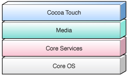
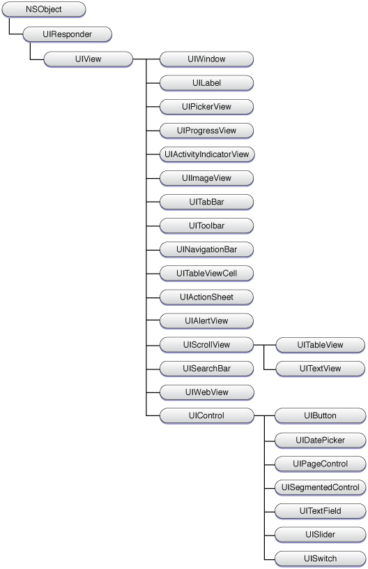
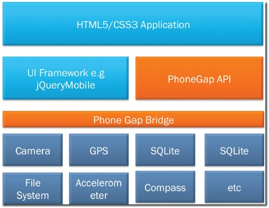

| 序号  | 修改时间       | 修改内容           | 修改人   | 审稿人 |
| --- | ---------- | -------------- | ----- | --- |
| 1   | 2012-02-02 | 创建             | Keefe |     |
| 2   | 2012-3-2   | 增加iphone应用开发章节 | 同上    |     |
| 3   | 2012-3-21  | 更新应用市场         | 同上    |     |
| 4   | 2013-8-6   | 更新中国的应用市场列表    | 同上    |     |
| 5   | 2017-3-31  | 更新移动技术选型       | 同上    |     |
|     |            |                |       |     |

<br><br><br>

---

目录

[TOC]

**表目录**

[表格 1 移动设备列表__ 3](#_Toc510788162)

[表格 2 操作系统原生平台列表__ 3](#_Toc510788163)

[表格 3 第三方平台列表__ 4](#_Toc510788164)

[表格 4 中国的应用市场列表__ 5](#_Toc510788165)

[表格 5 移动开发的技术方案比较__ 11](#_Toc510788166)

<br>

---

# 1  移动设备概览

表格 1 移动设备列表

| 手机      | 制造商  | OS      | 状态  | 简介              | 备注     |
| ------- | ---- | ------- | --- | --------------- | ------ |
| iphone  | 苹果   | IOS     |     |                 | 利润率最高。 |
| 三星      | 三星   |         |     |                 |        |
| 荣耀      | 华为   |         |     |                 |        |
| MIUI    | 小米科技 | Android |     | MIUI+小米手机+UCWEB |        |
| OPhone  | 中国移动 | Android | 滞后  | 自定制的Android系统   |        |
| Lephone | 联想   | Android |     | 自定制的Android系统   |        |
| M9      | 魅族   | Android |     | 仿照Apple         |        |

备注：来自于http://en.wikipedia.org/wiki/List_of_Android_devices

<br>

# 2  应用市场 App Market

[**iphone**](http://www.apple.com/itunes/):  全球唯一iTunes Store约有40万应用。应用平均价格为2美元。

[**Android**](http://android.market.com):  开放的应用市场。

**总发行量**： Android电子市场超过37%的应用被以各种原因删除，App Store删除的应用约占24%。应用被删除的原因包括多次测试、不兼容最新版系统、开发者放弃，以及应用质量较低等。

## 2.1   Operating system-native platforms

表格 2 操作系统原生平台列表

| Name                                                                                                         | Established | Status                                        | Owner                                                                                                             | Available  apps        | Download  count                                                                                                                                                                               | Installed  base | Device  platform                                                                                                                                                                      | Developer's  cut per sale | Developer  fees                                                 |
| ------------------------------------------------------------------------------------------------------------ | ----------- | --------------------------------------------- | ----------------------------------------------------------------------------------------------------------------- | ---------------------- | --------------------------------------------------------------------------------------------------------------------------------------------------------------------------------------------- | --------------- | ------------------------------------------------------------------------------------------------------------------------------------------------------------------------------------- | ------------------------- | --------------------------------------------------------------- |
| [Windows Phone Marketplace](http://en.wikipedia.org/wiki/Windows_Phone_Marketplace)                          | 2010-10-21  | Live                                          | Microsoft                                                                                                         | 61,479                 |                                                                                                                                                                                               | 5 million       | [Windows   Phone](http://en.wikipedia.org/wiki/Windows_Phone)                                                                                                                         | 70%                       |                                                                 |
| [Software Store (Palm)](http://en.wikipedia.org/w/index.php?title=Palm_Software_Store&action=edit&redlink=1) | 2008        | Closed                                        | [Palm](http://en.wikipedia.org/wiki/Palm,_Inc.)                                                                   | 5,000                  |                                                                                                                                                                                               |                 |                                                                                                                                                                                       |                           |                                                                 |
| [Download   Fun/Download Catalog](http://en.wikipedia.org/wiki/Danger_Hiptop)                                | 2002        | [Closed](http://software.palm.com/us/mobile/) | [Danger, Inc.](http://en.wikipedia.org/wiki/Danger_(company))/[Microsoft](http://en.wikipedia.org/wiki/Microsoft) | Unknown                |                                                                                                                                                                                               |                 |                                                                                                                                                                                       |                           |                                                                 |
| Nokia Store                                                                                                  | 26-May-09   | Live                                          | Nokia                                                                                                             | 116,583 (Dec 2011)[20] | ~4 [billion](http://en.wikipedia.org/wiki/1000000000_(number))                                                                                                                                | 825 million     | [Symbian](http://en.wikipedia.org/wiki/Symbian)   [MeeGo](http://en.wikipedia.org/wiki/MeeGo)   [Maemo](http://en.wikipedia.org/wiki/Maemo)   [S40](http://en.wikipedia.org/wiki/S40) | 70%                       | 1 [€](http://en.wikipedia.org/wiki/Euro)                        |
| App World                                                                                                    | 1-Apr-09    | Live                                          | RIM                                                                                                               | 43,000                 |                                                                                                                                                                                               | 70 million      | [BlackBerry   OS](http://en.wikipedia.org/wiki/BlackBerry_OS)                                                                                                                         | 70%                       | Free                                                            |
| [App Store ](http://www.apple.com/itunes/)                                                                   | 10-Jul-08   | Live                                          | Apple                                                                                                             | 550,000                | 18 [billion](http://en.wikipedia.org/wiki/1000000000_(number))   (Oct 2011)[[11\]](http://en.wikipedia.org/wiki/List_of_digital_distribution_platforms_for_mobile_devices#cite_note-apple-13) | 315 million     | [iOS](http://en.wikipedia.org/wiki/IOS_(Apple))                                                                                                                                       | 70%                       | [US$](http://en.wikipedia.org/wiki/United_States_dollar)99/year |
| App Catalog                                                                                                  | 6-Jun-09    | Live                                          | Palm/HP                                                                                                           | 7,062                  |                                                                                                                                                                                               | 2.6 million     | [webOS](http://en.wikipedia.org/wiki/WebOS)                                                                                                                                           | 70%                       | Free                                                            |
| [Google Play Store](http://en.wikipedia.org/wiki/Google_Play_Store)                                          | 2008-10-22  | Live                                          | Google                                                                                                            | 450,000   (Jan 2012)   | 10 [billion](http://en.wikipedia.org/wiki/1000000000_(number))                                                                                                                                | 190 million     | [Android](http://en.wikipedia.org/wiki/Android_(operating_system))                                                                                                                    | 70%                       | [US$](http://en.wikipedia.org/wiki/United_States_dollar)25      |

备注：都允许非个人开发者发布Allows individual developers to publish;  IDE除了Apple针对企业用户收费外其它平台都免费。[Google Play Store](http://en.wikipedia.org/wiki/Google_Play_Store) 2012.3.7由android market更名过来。

## 2.2   Third-party platforms

表格 3 第三方平台列表

| Name                                                                                     | Established | Status                                 | Owner                                                                                                                                                                                                                                                           | Available  apps(K) | Download  count                                               | Installed  base | Device  platform                                                   | Developer's  cut per sale | Developer  fees | Development  tool(s)                                                                                         |
| ---------------------------------------------------------------------------------------- | ----------- | -------------------------------------- | --------------------------------------------------------------------------------------------------------------------------------------------------------------------------------------------------------------------------------------------------------------- | ------------------ | ------------------------------------------------------------- | --------------- | ------------------------------------------------------------------ | ------------------------- | --------------- | ------------------------------------------------------------------------------------------------------------ |
| [Amazon   Appstore](http://en.wikipedia.org/wiki/Amazon_Appstore)                        | 2011-3      | [Live](http://www.amazon.com/appstore) | [Amazon.com](http://en.wikipedia.org/wiki/Amazon.com)                                                                                                                                                                                                           | 21.5               | Unknown                                                       | Unknown         | [Android](http://en.wikipedia.org/wiki/Android_(operating_system)) | 70%                       | US$99/year      | [Android   SDK](http://en.wikipedia.org/wiki/Android_SDK)                                                    |
| [Appitalism](http://en.wikipedia.org/w/index.php?title=Appitalism&action=edit&redlink=1) | 2010        | [Live](http://www.amazon.com/appstore) | [Appitalism](http://en.wikipedia.org/w/index.php?title=Appitalism&action=edit&redlink=1), [Mobile Streams](http://en.wikipedia.org/w/index.php?title=Mobile_Streams&action=edit&redlink=1), [Simon   Buckingham](http://en.wikipedia.org/wiki/Simon_Buckingham) | 719                | 3 million                                                     | Unknown         | **Multiple**                                                       | Unknown                   | Free            | [Android   SDK](http://en.wikipedia.org/wiki/Android_SDK), [Java   ME](http://en.wikipedia.org/wiki/Java_ME) |
| [FastApp](http://en.wikipedia.org/w/index.php?title=FastApp&action=edit&redlink=1)       | 2009        | [Live](http://www.amazon.com/appstore) | [FastApp](http://en.wikipedia.org/w/index.php?title=FastApp&action=edit&redlink=1)                                                                                                                                                                              | 442                | Unknown                                                       | Unknown         | Multiple                                                           |                           | Free            |                                                                                                              |
| [GetJar](http://en.wikipedia.org/wiki/GetJar)                                            | 2004        | [Live](http://www.amazon.com/appstore) |                                                                                                                                                                                                                                                                 | 257                | 2 [billion](http://en.wikipedia.org/wiki/1000000000_(number)) |                 | Multiple                                                           |                           | Free            |                                                                                                              |
| [Cellmania](http://en.wikipedia.org/w/index.php?title=Cellmania&action=edit&redlink=1)   | 1999-6      | [Live](http://www.amazon.com/appstore) | [General Software](http://en.wikipedia.org/w/index.php?title=General_Software&action=edit&redlink=1)                                                                                                                                                            | 200                |                                                               |                 | Multiple                                                           |                           | Free            |                                                                                                              |
| [Indiroid](http://en.wikipedia.org/w/index.php?title=Indiroid&action=edit&redlink=1)     | 2011-8      | [Live](http://www.amazon.com/appstore) |                                                                                                                                                                                                                                                                 | 170                |                                                               |                 |                                                                    |                           | Free            |                                                                                                              |
| [SmartAppFinder](http://en.wikipedia.org/wiki/SmartAppFinder)                            | 2010-10     | [Live](http://www.amazon.com/appstore) | [SmartAppFinder](http://en.wikipedia.org/wiki/SmartAppFinder)                                                                                                                                                                                                   | 12                 |                                                               |                 | [Android](http://en.wikipedia.org/wiki/Android_(operating_system)) |                           |                 |                                                                                                              |

备注：第三方平台主要是Android平台。开发账号基本是免费。（除Amazon）。应用统计时间在2011年。

## 2.3   中国的应用市场列表

表格 4 中国的应用市场列表

| **序号** | **名称**                                            | **应用分类** | **游戏分类** | **应用程序总数** | 版本更新 | 应用数目    | Owner                                 | Established |
| ------ | ------------------------------------------------- | -------- | -------- | ---------- | ---- | ------- | ------------------------------------- | ----------- |
| 1.     | [优亿市场](http://www.eoemarket.com/)                 | 8        | 8        | 54,640     |      |         | eoeAndroid                            |             |
| 2.     | [机锋市场](http://apk.gfan.com/Index/Index.html)      | 23       | 13       | 52,400     |      |         | [机锋网](http://www.gfan.com/)           | 2009.1      |
| 3.     | [应用汇](http://www.appchina.com/)                   | 15       | 7        | 21,791     | 优    |         | 北京掌汇天下科技                              |             |
| 4.     | [木蚂蚁市场](http://www.mumayi.com/company/about.html) | 20       | 10       | 21,781     |      | 10,000+ | 木蚂蚁                                   | 2010        |
| 5.     | [爱米软件商店](http://www.aimi8.com/)                   | 10       | 8        | 19,992     |      |         | 和睿新蜂                                  | 2009        |
| 6.     | [历趣市场](http://www.liqucn.com/)                    | 8        | 6        | 14,075     |      |         | 历趣                                    | 2009        |
| 7.     | 安致市场                                              | 19       | 16       | 13,982     | 无    | 无       | [安卓在线](http://www.androidonline.net/) |             |
| 8.     | [3G安卓市场](http://ggm.3g.cn/)                       | 14       | 10       | 12,692     | 优    |         | 3G门户网                                 |             |
| 9.     | [安卓市场](http://apk.hiapk.com/)                     | 11       | 6        | 8,488      |      |         | 网龙安卓网                                 | 2011.3      |
| 10.    | 应用宝                                               | 19       | 10       | 5,438      |      |         | 腾讯                                    |             |
| 11.    | 安智市场                                              |          |          |            |      |         | [安智网](http://www.anzhi.com/)          | 2010.2      |
| 12.    | 乐酷市场                                              |          |          |            |      |         | [乐酷网](http://www.lecoo.com/)          | 2006.1      |

**备注**：2011年12月12日, 据艾媒咨询统计，目前*中国*手机*应用*开发者总数约100万人，其中苹果iOS平台14万，谷歌的*Android*超过70万。

## 2.4   Android Google Market

### 2.4.1 应用开放接口API

**Intent方式**

**1)**   **寻找某个应用**

uri:

```
market:// search?q=<search_query>
market:// search?q= pub:<publisher_name>

Uri uri = Uri.parse("market://search?q=pname:pkg_name");
Intent it = new Intent(Intent.ACTION_VIEW, uri);
startActivity(it);
//where pkg_name is the full package path for an application
```

**2)**   **显示某个应用的相关信息**

```
uri:  market://details?id=<package_name>
Uri uri = Uri.parse("market://details?id=app_id");
Intent it = new Intent(Intent.ACTION_VIEW, uri);
startActivity(it);
```

**URl页面方式**

```
// Display the details screen for a specific application
http://market.android.com/details?id=<package_name>

// Search for applications using a general string query.
http://market.android.com/search?q=<query>

//Search for applications by publisher name
http://market.android.com/search?q=pub:<publisher_name>
```

### 2.4.2 Google Market机制

2012.3.7 android market域名变更为:  https://play.google.com/store/apps/

* 我的订单: 保存有所有从google market下载的应用；

* 我的应用库: 保存所有手机中安装过的应用且在market有的应用。

因此，无论是从market下载的还是其它源下载的，凡是market有的，google market都会通知更新。(通知更新是android手机缺省内置的一个update service用来接收market push通知，并向本机用户通知. )

**排名机制：**

用户留存率：也称用户回访率, =回访用户/新用户.

* 回访用户的时间窗口: 判断用户是否继续使用程序需要定义一定的时间范围。一般说来，7天或14天回访是行业里比较通用的定义。

* 从新用户到回访用户的时间窗口: 时间窗口与回访率成反比。时间越短，回访越高。

* 新用户的时间窗口

**影响Market排名的可能因素**

* 已安装用户数: 最重要

* 增长率（加速度）: 比如3-5天的用户增长率

* 连续增长（速度）:

* 保留数: 流行软件格式已定，保留排名

* 评分: 很重要

## 2.5   本章参考

**官网**

* http://www.apple.com/itunes/

* http://android.market.com

**参考链接**

[1].   http://en.wikipedia.org/wiki/List_of_digital_distribution_platforms_for_mobile_devices

[2].   http://news.21cn.com/world/guojijunshi/2012/01/05/10371380_3.shtml

[3].  google market机制 http://www.mobile20.com.cn/android-market-ranking-rules/

<br>

# 3   应用搜索

http://chomp.com/

<br>

# 4 开发者

## 4.1  开发者工具

友盟统计：http://www.umeng.com/doc/home.html

Google Analyse: http://code.google.com/intl/zh-CN/apis/analytics/docs/mobile/android.html

给开发人员和设计师的18个手机应用 http://www.weste.net/2011/11-25/78171.html

## 4.2  Android应用开发

详见 《Android开发》文档。

## 4.3  IOS应用开发

适用平台: iphone, ipad

**开发语言**：Object C

开发工具：Xocde, Interface Builder, Instruments

开发框架：Fundation, UIKit

**常用网站：**

https://developer.apple.com/resources/

https://developer.apple.com/library/ios/navigation/

iphone应用程序编程指南http://www.apple.com.cn/developer/iphone/library/documentation/iPhone/Conceptual/iPhoneOSProgrammingGuide/ApplicationEnvironment/ApplicationEnvironment.html#//apple_ref/doc/uid/TP40007072-CH7-SW2

http://www.cocoachina.com/

http://www.idev101.com/

### 4.3.1 Object C语法

**Methods方法声明**：(-为对象方法,+为类方法)

-/+(返回值)方法名1:(type)参数1 方法名2:(type)参数2

如: --(void)main:(char*)p

Methods方法调用： [Object Message] 支持嵌套。

* [object method];

* [object methodWithInput:input];

对象的方法可以返回值:

* output = [object methodWithOutput];

* output = [object methodWithInputAndOutput:input];

### 4.3.2 UI设计

### 4.3.3 应用开发

​     

图 1  iOS technology layers



图 2 iphone视图层次结构

# 5  移动技术选型

三大开发平台：Android、IOS、Windows（基本不考虑）

三大开发模式

* Native App原生应用：用平台特定的开发语言（Android: Java、Kotlin； IOS：Objective-C、Swift）所开发的应用。

* Web App：主要采用统一标准的HTML等WEB技术开发的应用。常用方案有HTML 5。

* Hybird App：结合上述两种，可以安装也可以WEB访问。

表格 5 移动开发的技术方案比较

| 技术方案   | 优点                     | 缺点                                | 应用场景                                                          |
| ------ | ---------------------- | --------------------------------- | ------------------------------------------------------------- |
| Native | 用户体验更好；可访问本地资源；打开速度更好。 | 跨平台移植麻烦；多版本维护成本较高。                | 要求硬件性能、讲究动画效果、追求用户体验的应用，最好分平台实现。                              |
| HTML5  | 无安装成本；开发成本低；移动终端适配容易。  | 浏览体验比不上原生应用；  无法调用本地资源；  不支持离线模式； | 作为对非核心业务在移动端的入口补足，或者是作为用户轻量、低频使用的体验增强。                        |
| Hybird | 某些界面可以原生开发；降低多平台成本。    | 用于WEB端的内容降低了用户体验；离线访问实现较难。        | Cordova/**PhoneGap**则更适用于对Mobile预算有限的公司、创业团队，或者对App进行快速的上线验证。 |

备注：1. React Native~用JavaScript来实现逻辑的原生应用。主要用于没有复杂动画效果的一般应用。

2. Hybird App开发较为出名的有PhoneGap、AppScan等等。

## 5.1  Native原生应用

使用原生开发，能够方便地添加动画效果，调用底层硬件，所有的限制仅仅是来自平台的限制。

### 5.1.1 React Native

它脱胎于React，因为React基于Virtual DOM来进行界面渲染，所以用Native的View来替换掉原本React的HTML DOM就顺理成章的引出了React Native的概念。

## 5.2  HTML5

  Mobile Webkit是目前对标准支持最好的移动浏览器，它支持所有的XHTML特性，同时对HTML5的支持也非常棒。如果你的项目只针对iPhone 和(或) Android，完全可以使用HTML 5来编码。

​     事实上作为又一个很强劲的趋势，HTML 5众望所归要成为下一代的网页标准，Google、apple、opera和微软等互联网巨头一直在努力推广和推进HTML 5。opera认为HTML 5是统一移动互联网的关键。

在 HTML5 中只有一种文档类型声明DTD：

`<!DOCTYPE html>`

## 5.3  Hybird

Hybird是一种兼顾Native与HTML的开发模式，但根据实现的不同，还可以再细分为两种实现方案：

* 在Native App中使用WebView加载远端Web资源

* 使用Cordova/PhoneGap等框架通过WebView加载本地资源进行页面渲染

### 5.3.1 **PhoneGap**

WebView: Activity的setContentView()来显示网页视图。

使用HTML+CSS+Js开发的Web App, 会被PhoneGap包装成WebView, 嵌入到发布App中。

**PhoneGap**是一个用基于HTML，CSS和JavaScript的，创建移动跨平台移动应用程序的快速开发平台。它使开发者能够利用 iPhone，Android，Palm，Symbian，WP7，Bada和Blackberry智能手机的核心功能——包括地理定位，加速器，联系 人，声音和振动等，此外PhoneGap拥有丰富的插件，可以以此扩展无限的功能。PhoneGap是免费的，但是它需要特定平台提供的附加软件，例如 iPhone的iPhone SDK，Android的Android SDK等，

详细方法请见：http://phonegap.com/start#android

优点：在Eclipse中加入SDK，编程自由，完美适应不同设备屏幕大小，适合高手使用。

缺点：没有使用布局，直接加载网页，不能添加广告。

 

图  phonegap的应用结构图

### 5.3.2 其它方法：HTML5转化成WEB APP

**使用Rexsee在线生成**（http://www.rexsee.com ）

Rexsee是开源的Android开发平台，支持开发者以标准化Web开发模式，使用HTML5、CSS3、Javascript快速实现移动应 用。会HTML就会Android。你要做的只是将做好的HTML5 应用上传到Rexsee服务器，很快，会编译成标准的APK安装文件。

优点：一键生成，适学普通人使用

缺点：直接封装，无法添加广告。

**appMobi Html5 XDK** **在线生成**（使用了PhoneGap插件http://www.appmobi.com/ ）

一个Google chrome插件，安装后，建立新工程，然后将已开发的HTML5应用放至指定文件夹中，即可直接封装成APK文件，使用了PhoneGap SDK，还提供实时预览，这是其它方法无法做到的事情。

## 5.4   其它的移动开发技术

**1)  symbian os**

根据功能不同不同作的匹分: T/C/R/M类.

OS主要的设计模式: 客户端-服务器模式,框架插件模型, 异步服务,微内核.

**2)**  **mobile widget**

Widget（微技）是一种基于互联网Web的小应用，通常实现某个特定的功能。2008年初流行一时.

**3)** **Adobe flex**

Flex技术是一种基于标准编程模型的高效RIA(Rich Inernet Application)开发产品集. 最初于Macromedia公司于2004年发布.

发展历史: flex1, flex2, flex3, flash

开发环境: Adobe flex builder + Elips Studio.

开发原理: 通过Elips Studio作为一个插件,转入到Adobe Flex BUilder中.

<br>

# 参考资料

**官网**

* android http://developer.android.com/guide/index.html

* iphone https://developer.apple.com/resources/cases/

**参考链接**

[1].   浅谈移动应用的技术选型  http://blog.jobbole.com/106157/?utm_source=blog.jobbole.com&utm_medium=relatedPosts

[2].   [W3Schools: HTML5 Tutorial](http://www.w3schools.com/html5/default.asp)

[3].   [HTML5 Demos And Examples](http://html5demos.com/)

[4].   [HTML5中文教程](http://www.w3school.com.cn/html5/)

* 手机QQ Hybrid 的架构演进  https://mp.weixin.qq.com/s/B3vhWtpg_ceDQ3aRbdr7AA
