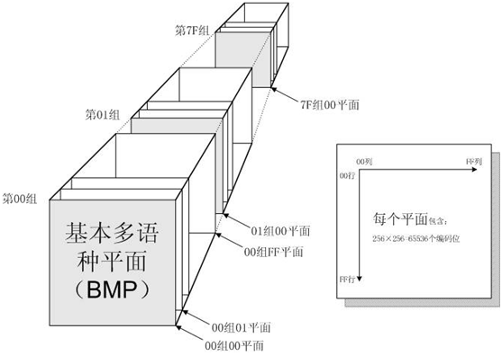
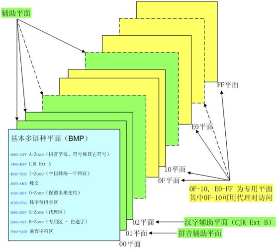
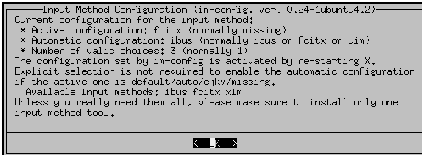
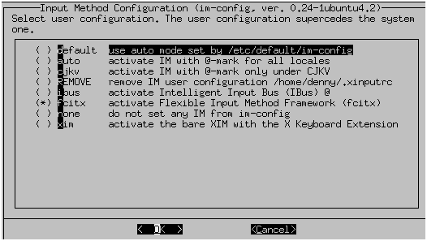

| 序号 | 修改时间   | 修改内容                                                     | 修改人 | 审稿人 |
| ---- | ---------- | ------------------------------------------------------------ | ------ | ------ |
| 1    | 2006-2007  | 创建                                                         | Keefe |        |
| 2    | 2010-6-15  | 调整文章结构，补充修正部分内容                               | 同上   |        |
| 3    | 2010-6-16  | 增加汉字编码函数，工具章节                                   | 同上   |        |
| 4    | 2010-6-28  | 增加汉字编码区域详细描述，图表目录                           | 同上   |        |
| 5    | 2010-12-23 | 增加国际化专题和Java的国际化                                 | 同上   |        |
| 6    | 2011-3-25  | 调整文章结构，强调国际化，弱化本地化。<br>分章为历史/标准/产品/OS/软件/函数库/企业等专题。 | 同上   |        |
| 7    | 2011-6-8   | 增加URL编码                                                  | 同上   |        |
| 8    | 2011-07-15 | 增补iconv的参数忽略处理                                      | 同上   |        |
| 9    | 2011-07-25 | vi显示乱码的存储大小端问题解决方法                           | 同上   |        |
| 10   | 2011-9-14  | 增加浏览器对网页，URL编码的处理                              | 同上   |        |
| 11   | 2011-09-21 | 增加简繁，拼音转换的内容                                     | 同上   |        |
| 12   | 2011-11-23 | 补充HTML/XML/URL预留字符的区别                               | 同上   |        |
| 13   | 2013-8-23  | MySQL缺省字符集问题latin1                                    | 同上   |        |
| 14   | 2016-5-2   | 增加sourceInsight的中文注释显示问题                          | 同上   |        |
| 15   | 2016-6-21  | 增加linux的输入法框架                                        | 同上   |        |
| 16   | 2016-7-13  | 将MySQL数据库中文化章节移动到《MySQL使用指南》。             | 同上   |        |
| 17   | 2016-10-12 | 更新中文输入法及部分章节微调                                 | 同上   |        |
| 18   | 2017-10-28 | 增加oracle的语法变量，python的json传输                       | 同上   |        |
| 19 | 2021-9-1 | 增加字符串国际化通用方案章节 | 同上 |        |


---

目录

[1       本地化、国际化的历史和标准... 4](#_Toc496963419)

[1.1         综述... 4](#_Toc496963420)

[1.1.1        范围... 4](#_Toc496963421)

[1.2         字符编码的发展... 6](#_Toc496963422)

[1.3         Unicode国际标准... 7](#_Toc496963423)

[1.3.1        历史简介... 7](#_Toc496963424)

[1.3.2        UCS. 8](#_Toc496963425)

[1.3.3        ISO 8859. 11](#_Toc496963426)

[1.3.4        UTF-8. 12](#_Toc496963427)

[1.4         中文字符集标准... 13](#_Toc496963428)

[1.4.1        GB2312. 15](#_Toc496963429)

[1.4.2        GBK. 15](#_Toc496963430)

[1.4.3        GB18030. 16](#_Toc496963431)

[1.4.4        TW-BIG5--大五码... 16](#_Toc496963432)

[1.4.5        Hong Kong GCCS. 17](#_Toc496963433)

[1.5         字符集环境常用约定... 17](#_Toc496963434)

[1.5.1        软件开发编码常用约定... 17](#_Toc496963435)

[1.5.2        编码常见特殊符号... 18](#_Toc496963436)

[2       中文编码开发... 19](#_Toc496963437)

[2.1         汉字编码转化规律... 19](#_Toc496963438)

[2.2         中文处理常用函数... 21](#_Toc496963439)

[2.2.1        判断是否是ASCII 21](#_Toc496963440)

[2.2.2        判断是否汉字... 21](#_Toc496963441)

[2.2.3        得到GB码的ANSI数值... 23](#_Toc496963442)

[2.2.4        对汉字进行hash. 23](#_Toc496963443)

[2.2.5        各种编码之间的转换... 24](#_Toc496963444)

[2.2.6        汉字编码常用函数... 28](#_Toc496963445)

[2.3         中文处理常用工具... 30](#_Toc496963446)

[3       中文信息处理产品... 30](#_Toc496963447)

[3.1         中文输入法... 30](#_Toc496963448)

[3.1.1        ubuntu 14.04的输入法input method. 31](#_Toc496963449)

[3.1.2        Windows的输入法... 33](#_Toc496963450)

[3.2         中文信息处理小工具... 33](#_Toc496963451)

[3.2.1        简繁转化... 33](#_Toc496963452)

[3.2.2        汉字转化拼音（全拼，简拼）... 38](#_Toc496963453)

[4       操作系统的国际化示例... 38](#_Toc496963454)

[4.1         MS OS的国际化... 38](#_Toc496963455)

[4.1.1        本地编码转化... 38](#_Toc496963456)

[4.1.2        开发环境... 39](#_Toc496963457)

[4.2         Linux的国际化... 40](#_Toc496963458)

[4.2.1        Locale机制... 41](#_Toc496963459)

[4.2.2        file实现... 42](#_Toc496963460)

[4.2.3        Linux常见乱码问题... 42](#_Toc496963461)

[5       编程语言... 43](#_Toc496963462)

[5.1         Java的国际化... 43](#_Toc496963463)

[5.1.1        Java的国际化基础... 43](#_Toc496963464)

[5.1.2        Java的中文问题... 44](#_Toc496963465)

[5.1.3        Java中文化和国际化攻略... 45](#_Toc496963466)

[5.2         python的国际化... 45](#_Toc496963467)

[5.2.1        encode/decode. 45](#_Toc496963468)

[5.2.2        eval 46](#_Toc496963469)

[5.2.3        json. 47](#_Toc496963470)

[6       数据库... 47](#_Toc496963471)

[6.1         mysql的中文化... 47](#_Toc496963472)

[6.2         oracle的中文化... 47](#_Toc496963473)

[7       软件/函数库的国际化示例... 48](#_Toc496963474)

[7.1         libxml2的中文支持... 48](#_Toc496963475)

[7.2         aspseek的中文化... 48](#_Toc496963476)

[7.3         浏览器的编码处理(URL,网页) 49](#_Toc496963477)

[7.3.1         URLencode/HTML_entity_encode. 49](#_Toc496963478)

[7.3.2         浏览器处理HTTP请求编码... 50](#_Toc496963479)

[7.3.3         浏览器处理网页编码... 51](#_Toc496963480)

[7.4         souceInsight的中文注释显示... 51](#_Toc496963481)

[7.5         csv转化成excel 52](#_Toc496963482)

[8       企业的国际化示例... 52](#_Toc496963483)

[8.1         MS. 52](#_Toc496963484)

[8.2         IBM.. 52](#_Toc496963485)

[8.3         阿里巴巴... 52](#_Toc496963486)

[FAQ.. 53](#_Toc496963487)

[参考资料... 55](#_Toc496963488)


表目录


[表格 1 字符集列表... 7](#_Toc496963489)

[表格 2 BMP中的字符分配情况... 11](#_Toc496963490)

[表格 3 汉字编码列表... 14](#_Toc496963491)

[表格 4 编码常见特殊符号列表... 18](#_Toc496963492)

[表格 5  GB2312字区与编码范围... 19](#_Toc496963493)

[表格 6 BIG5字区与编码范围... 20](#_Toc496963494)

[表格 7 七个扩充字... 20](#_Toc496963495)

[表格 8 汉字编码规则... 21](#_Toc496963496)

[表格 9 linux平台常见的输入法框架input method列表... 32](#_Toc496963497)

[表格 10 各个字符集的使用区别... 39](#_Toc496963498)

[表格 11 URL的预留字符，格式“%hh”. 49](#_Toc496963499)

[表格 12 HTML实体字符示例... 49](#_Toc496963500)

[表格 13 xml的预留字符... 50](#_Toc496963501)


图目录

[图 1 BMP平面... 9](#_Toc496963502)

[图 2 辅助平面... 10](#_Toc496963503)


---


# 1  本地化、国际化的历史和标准

本文的结构是先讲述国际化和本地化的来源和发展； 然后讲述中文化过程中的重要一环—中文汉字编码标准； 接着讲述一些经典的中文产品如中文输入化，中文编码开发； 再接着讲述流行的函数库/软件的国际化过程，如Linux/Windows，MySQL/LIBXML2/ASPSEEK等。最后是一些企业的国际化历程。


## 1.1   综述

在信息领域，国际化与本地化(Internationalization and localization)是指调整软件，使之能适用于不同的语言及地区。


国际化是指在设计软件，将软件与特定语言及地区脱钩的过程。当软件被移植到不同的语言及地区时，软件本身不用做内部工程上的改变或修正。本地化则是指当移植软件时，加上与特定[区域设置](http://zh.wikipedia.org/wiki/区域设置)有关的信息和翻译文件的过程。 国际化和本地化之间的区别虽然微妙，但却很重要。国际化意味着产品有适用于任何地方的“潜力”；本地化则是为了更适合于“特定”地方的使用，而另外增添的特色。用一项产品来说，国际化只需做一次，但本地化则要针对不同的区域各做一次。 这两者之间是互补的，并且两者合起来才能让一个系统适用于各地。


基于他们的英文单字长度过长，常被分别简称成i18n（18意味着在国际化这个单字中，i 和 n 之间有 18 个字母）及L10n。使用大写的 L 以利区分 i18n 中的 i 。

在如[微软](http://zh.wikipedia.org/wiki/微軟)及[IBM](http://zh.wikipedia.org/wiki/IBM)等企业中，则会使用[全球化](http://zh.wikipedia.org/wiki/全球化)来表示此两者的合称。[[1\]](http://zh.wikipedia.org/wiki/I18n#cite_note-0)[[2\]](http://zh.wikipedia.org/wiki/I18n#cite_note-1)在英文中，也会使用 g11n做为简称。


**范围**

国际化与本地化工作的焦点包括：

- 语言

- - 电子文件

  - - 字母。目前大部分的系统都采用[Unicode](http://zh.wikipedia.org/wiki/Unicode)为标准来解决[字符编码](http://zh.wikipedia.org/wiki/字符编码)。
    - 不同的数字命名系统。
    - 书写方向。譬如[德语](http://zh.wikipedia.org/wiki/德語)是从左到右，而[波斯语](http://zh.wikipedia.org/wiki/波斯語)、[希伯来语](http://zh.wikipedia.org/wiki/希伯來語)和[阿拉伯语](http://zh.wikipedia.org/wiki/阿拉伯語)是由右到左。
    - 相同语言在不同地区的拼法差异，如[美国英语](http://zh.wikipedia.org/wiki/美國英語)、[加拿大英语](http://zh.wikipedia.org/wiki/加拿大英语)使用localization，而[英国英语](http://zh.wikipedia.org/wiki/英國英語)和[澳洲英语](http://zh.wikipedia.org/wiki/澳洲英語)使用localisation。
    - 文件处理上的差异，如某些文字存在大小写，其它则否。字母顺序。

  - 文字的图像表示（打印物、内含联机图片）。

  - 读法（音频）

  - 视频的字幕

- [文化](http://zh.wikipedia.org/wiki/文化)

- - 图片和颜色：这牵涉到理解和文化适宜的议题。
  - 名字和称谓
  - 政府给定的编码（如美国的[社会安全码](http://zh.wikipedia.org/w/index.php?title=社會安全碼&action=edit&redlink=1)，英国的[National Insurance number](http://zh.wikipedia.org/w/index.php?title=National_Insurance_number&action=edit&redlink=1)，爱沙尼亚的[Isikukood](http://zh.wikipedia.org/w/index.php?title=Isikukood&action=edit&redlink=1)及其它各国的[身份证](http://zh.wikipedia.org/wiki/身份證)号码）和护照
  - 电话号码、地址和国际[邮递区号](http://zh.wikipedia.org/wiki/郵遞區號)
  - [货币](http://zh.wikipedia.org/wiki/貨幣)（符号、货币标志的位置）
  - [度量衡](http://zh.wikipedia.org/wiki/度量衡)
  - 纸张大小

- 书写习惯

- - 日期跟时间的格式，包含各式[日历](http://zh.wikipedia.org/wiki/日历)。
  - 时区（在国际场合会使用[世界标准时间](http://zh.wikipedia.org/wiki/世界标准时间)）
  - 数字格式（小数点、分隔点的位置、分隔所用的字符）

- 产品和服务所要面向的法规

只属于本地化的主题有：

- [翻译](http://zh.wikipedia.org/wiki/翻译)
- 针对特定语言（如[东亚语言](http://zh.wikipedia.org/wiki/東亞語言)）的特别支持
- 符合当地习惯
- 符合当地的[道德](http://zh.wikipedia.org/wiki/道德)观念
- 针对当地撰写内容
- 符号
- 排序方法
- [美学](http://zh.wikipedia.org/wiki/美学)
- 当地的文化价值和社会环境


## 1.2   字符编码的发展

单字节编码

ASCII  (American Standard Code for Information Interchange， “美国信息交换标准码）, 1968年由[ANSI](http://en.wikipedia.org/wiki/American_National_Standards_Institute)制定。它使用7 bits来表示一个字符，总共表示128个字符。

ASCII扩展  1987年ISO推出ISO8859-1，是[国际标准化组织](http://zh.wikipedia.org/wiki/國際標準化組織)内[ISO/IEC 8859](http://zh.wikipedia.org/wiki/ISO/IEC_8859)的第一个8位字符集，后面陆续又推出总共15个字符集。ISO8859-1 共2^8=256个字符，统一了绝大多数西欧语言所用到的字符。后此标准采纳为ISO-10646标准,  Unicode的最开头256个字符编码和ISO-8859-1是一一对应的。参见 1.3.3


1)      多字节编码

因各地区文字差异，各自定义了本地区的编码。如中国的GBK, 日本的JIS0208，韩国的KSC5601，台湾地区的CNS11643等.


2)      国际统一标准UNICODE

UCS--  1984--?


下表为各种字符集。

| Character   sets                                             | beief                                                        |
| ------------------------------------------------------------ | ------------------------------------------------------------ |
| Early   telecommunications                                   | [ASCII](http://en.wikipedia.org/wiki/ASCII) · [ISO/IEC 646](http://en.wikipedia.org/wiki/ISO/IEC_646) · [ISO/IEC 6937](http://en.wikipedia.org/wiki/ISO/IEC_6937) · [T.61](http://en.wikipedia.org/wiki/T.61_(ITU-T_recommendation)) · [sixbit code pages](http://en.wikipedia.org/wiki/Sixbit_code_pages)    · [Baudot code](http://en.wikipedia.org/wiki/Baudot_code) · [Morse code](http://en.wikipedia.org/wiki/Morse_code) |
| ISO/IEC   8859                                               | [-1](http://en.wikipedia.org/wiki/ISO/IEC_8859-1) ·   [-2](http://en.wikipedia.org/wiki/ISO/IEC_8859-2) ·   [-3](http://en.wikipedia.org/wiki/ISO/IEC_8859-3) ·   [-4](http://en.wikipedia.org/wiki/ISO/IEC_8859-4) ·   [-5](http://en.wikipedia.org/wiki/ISO/IEC_8859-5) ·   [-6](http://en.wikipedia.org/wiki/ISO/IEC_8859-6) ·   [-7](http://en.wikipedia.org/wiki/ISO/IEC_8859-7) ·   [-8](http://en.wikipedia.org/wiki/ISO/IEC_8859-8) ·   [-9](http://en.wikipedia.org/wiki/ISO/IEC_8859-9) ·   [-10](http://en.wikipedia.org/wiki/ISO/IEC_8859-10) ·   [-11](http://en.wikipedia.org/wiki/ISO/IEC_8859-11) ·   [-12](http://en.wikipedia.org/wiki/ISO/IEC_8859-12) ·   [-13](http://en.wikipedia.org/wiki/ISO/IEC_8859-13) ·   [-14](http://en.wikipedia.org/wiki/ISO/IEC_8859-14) ·   [-15](http://en.wikipedia.org/wiki/ISO/IEC_8859-15) ·   [-16](http://en.wikipedia.org/wiki/ISO/IEC_8859-16) |
| Bibliographic   use                                          | [ANSEL](http://en.wikipedia.org/wiki/ANSEL) ·   ISO 5426 / 5426-2 / 5427 / 5428 / [6438](http://en.wikipedia.org/wiki/ISO_6438) /   6861 / 6862 / 10585 / 10586 / 10754    /   11822 · [MARC-8](http://en.wikipedia.org/wiki/MARC-8) |
| Nationa*   standards                                         | [ArmSCII](http://en.wikipedia.org/wiki/ArmSCII) · [CNS 11643](http://en.wikipedia.org/wiki/CNS_11643) · [GOST 10859](http://en.wikipedia.org/wiki/GOST_10859) · [GB 2312](http://en.wikipedia.org/wiki/GB_2312) · [HKSCS](http://en.wikipedia.org/wiki/HKSCS) · [ISCII](http://en.wikipedia.org/wiki/ISCII) · [JIS X 0201](http://en.wikipedia.org/wiki/JIS_X_0201)    · [JIS X 0208](http://en.wikipedia.org/wiki/JIS_X_0208) · [JIS X 0212](http://en.wikipedia.org/wiki/JIS_X_0212) · [JIS X 0213](http://en.wikipedia.org/wiki/JIS_X_0213) · [KPS 9566](http://en.wikipedia.org/wiki/KPS_9566) · [KS X 1001](http://en.wikipedia.org/wiki/KS_X_1001) · [PASCII](http://en.wikipedia.org/wiki/Perso-Arabic_Script_Code_for_Information_Interchange) ·   [TIS-620](http://en.wikipedia.org/wiki/TIS-620) ·    [TSCII](http://en.wikipedia.org/wiki/TSCII) ·   [VISCII](http://en.wikipedia.org/wiki/VISCII) ·   [YUSCII](http://en.wikipedia.org/wiki/YUSCII) |
| [EUC](http://en.wikipedia.org/wiki/Extended_Unix_Code)       | [CN](http://en.wikipedia.org/wiki/EUC-CN) ·   [JP](http://en.wikipedia.org/wiki/EUC-JP) ·   [KR](http://en.wikipedia.org/wiki/EUC-KR) ·   [TW](http://en.wikipedia.org/wiki/EUC-TW) |
| [ISO/IEC 2022](http://en.wikipedia.org/wiki/ISO/IEC_2022)    | CN ·   [JP](http://en.wikipedia.org/wiki/ISO-2022-JP) ·   [KR](http://en.wikipedia.org/wiki/ISO-2022-KR) ·   [CCCII](http://en.wikipedia.org/wiki/CCCII) |
| [MacOS codepages ("scripts")](http://en.wikipedia.org/wiki/Category:Mac_OS_character_encodings) | [Arabic](http://en.wikipedia.org/wiki/MacArabic_encoding) · [CentralEurRoman](http://en.wikipedia.org/wiki/Macintosh_Central_European_encoding) ·   ChineseSimp / [EUC-CN](http://en.wikipedia.org/wiki/EUC-CN) ·   ChineseTrad / [Big5](http://en.wikipedia.org/wiki/Big5) ·   Croatian    · [Cyrillic](http://en.wikipedia.org/wiki/MacCyrillic_encoding) · Devanagari ·   Dingbats · Farsi · Greek · Gujarati · Gurmukhi ·   Hebrew    · [Icelandic](http://en.wikipedia.org/wiki/MacIceland)    Japanese / [ShiftJIS](http://en.wikipedia.org/wiki/Shift_JIS) · Korean / [EUC-KR](http://en.wikipedia.org/wiki/EUC-KR) ·   [Roman](http://en.wikipedia.org/wiki/Mac_OS_Roman) ·   Romanian · Symbol · Thai / [TIS-620](http://en.wikipedia.org/wiki/TIS-620) ·   Turkish · Ukrainian |
| [DOS codepages](http://en.wikipedia.org/wiki/Category:DOS_code_pages) | [437](http://en.wikipedia.org/wiki/Code_page_437) ·   [720](http://en.wikipedia.org/wiki/Code_page_720) ·   [737](http://en.wikipedia.org/wiki/Code_page_737) ·   [775](http://en.wikipedia.org/wiki/Code_page_775) ·   [850](http://en.wikipedia.org/wiki/Code_page_850) ·   [852](http://en.wikipedia.org/wiki/Code_page_852) ·   [855](http://en.wikipedia.org/wiki/Code_page_855) ·   [857](http://en.wikipedia.org/wiki/Code_page_857) ·   [858](http://en.wikipedia.org/wiki/Code_page_858) ·   [860](http://en.wikipedia.org/wiki/Code_page_860) ·   [861](http://en.wikipedia.org/wiki/Code_page_861) ·   [862](http://en.wikipedia.org/wiki/Code_page_862) ·   [863](http://en.wikipedia.org/wiki/Code_page_863) ·   [864](http://en.wikipedia.org/w/index.php?title=Code_page_864&action=edit&redlink=1) · [865](http://en.wikipedia.org/wiki/Code_page_865)    · [866](http://en.wikipedia.org/wiki/Code_page_866) ·   [869](http://en.wikipedia.org/wiki/Code_page_869) ·   [Kamenický](http://en.wikipedia.org/wiki/Kamenický_encoding) · [Mazovia](http://en.wikipedia.org/wiki/Mazovia_encoding) ·   [MIK](http://en.wikipedia.org/wiki/MIK_Code_page) ·   [Iran System](http://en.wikipedia.org/wiki/Iran_System_encoding_standard) |
| [Windows codepages](http://en.wikipedia.org/wiki/Category:Windows_code_pages) | [874](http://en.wikipedia.org/wiki/Windows-874) /   [TIS-620](http://en.wikipedia.org/wiki/TIS-620) ·   [932](http://en.wikipedia.org/wiki/Code_page_932) /   [ShiftJIS](http://en.wikipedia.org/wiki/Shift_JIS) ·   [936](http://en.wikipedia.org/wiki/Code_page_936) /   [GBK](http://en.wikipedia.org/wiki/GBK) · [949](http://en.wikipedia.org/wiki/Code_page_949) /   [EUC-KR](http://en.wikipedia.org/wiki/EUC-KR) ·   [950](http://en.wikipedia.org/wiki/Code_page_950) /   [Big5](http://en.wikipedia.org/wiki/Big5) · [1250](http://en.wikipedia.org/wiki/Windows-1250) ·   [1251](http://en.wikipedia.org/wiki/Windows-1251)    · [1252](http://en.wikipedia.org/wiki/Windows-1252) ·   [1253](http://en.wikipedia.org/wiki/Windows-1253) ·   [1254](http://en.wikipedia.org/wiki/Windows-1254) ·   [1255](http://en.wikipedia.org/wiki/Windows-1255) ·   [1256](http://en.wikipedia.org/wiki/Windows-1256) ·   [1257](http://en.wikipedia.org/wiki/Windows-1257) ·   [1258](http://en.wikipedia.org/wiki/Windows-1258) ·   [1361](http://en.wikipedia.org/w/index.php?title=Code_page_1361&action=edit&redlink=1) · [54936](http://en.wikipedia.org/wiki/Windows-54936) /   [GB18030](http://en.wikipedia.org/wiki/GB_18030) |
| [EBCDIC codepages](http://en.wikipedia.org/wiki/Category:EBCDIC_code_pages) | [37/1140](http://en.wikipedia.org/wiki/EBCDIC_037) ·   273/1141 · 277/1142 · 278/1143 · 280/1144 ·   284/1145 · [285/1146](http://en.wikipedia.org/wiki/EBCDIC_285) · 297/1147    ·   420/16804 · 424/12712 · [500/1148](http://en.wikipedia.org/wiki/EBCDIC_500) ·   838/1160 · 871/1149 · [875/9067](http://en.wikipedia.org/wiki/EBCDIC_875) ·   [930/1390](http://en.wikipedia.org/wiki/EBCDIC_930)    ·   933/1364 · 937/1371 · 935/1388 · 939/1399 ·   1025/1154 · 1026/1155 · [1047/924](http://en.wikipedia.org/wiki/EBCDIC_1047)    ·   1112/1156 · 1122/1157 · 1123/1158 · 1130/1164 · [JEF](http://en.wikipedia.org/wiki/JEF_codepage) ·   [KEIS](http://en.wikipedia.org/wiki/KEIS) |
| Platform   specific                                          | [ATASCII](http://en.wikipedia.org/wiki/ATASCII) · [CDC display code](http://en.wikipedia.org/wiki/CDC_display_code) · [DEC-MCS](http://en.wikipedia.org/wiki/Multinational_Character_Set) · [DEC Radix-50](http://en.wikipedia.org/wiki/DEC_Radix-50) · [Fieldata](http://en.wikipedia.org/wiki/Fieldata) · [GSM 03.38](http://en.wikipedia.org/wiki/GSM_03.38)    · [HP roman8](http://en.wikipedia.org/wiki/HP_roman8) · [PETSCII](http://en.wikipedia.org/wiki/PETSCII) · [TI calculator   character sets](http://en.wikipedia.org/wiki/TI_calculator_character_sets) · [ZX Spectrum   character set](http://en.wikipedia.org/wiki/ZX_Spectrum_character_set) |
| [Unicode](http://en.wikipedia.org/wiki/Unicode) / [ISO/IEC 10646](http://en.wikipedia.org/wiki/ISO/IEC_10646) | [UTF-8](http://en.wikipedia.org/wiki/UTF-8) · [UTF-16/UCS-2](http://en.wikipedia.org/wiki/UTF-16/UCS-2) · [UTF-32/UCS-4](http://en.wikipedia.org/wiki/UTF-32/UCS-4) · [UTF-7](http://en.wikipedia.org/wiki/UTF-7) · [UTF-EBCDIC](http://en.wikipedia.org/wiki/UTF-EBCDIC) · [GB 18030](http://en.wikipedia.org/wiki/GB_18030)    · [SCSU](http://en.wikipedia.org/wiki/Standard_Compression_Scheme_for_Unicode) · [BOCU-1](http://en.wikipedia.org/wiki/Binary_Ordered_Compression_for_Unicode) |
| Miscellaneous   codepages                                    | [APL](http://en.wikipedia.org/wiki/APL_(codepage)) ·   [Cork](http://en.wikipedia.org/wiki/Cork_encoding) ·   [HZ](http://en.wikipedia.org/wiki/HZ_(character_encoding)) · [IBM code page 1133](http://en.wikipedia.org/wiki/Code_page_1133) ·   [KOI8](http://en.wikipedia.org/wiki/KOI_character_encodings) · [TRON](http://en.wikipedia.org/wiki/TRON_(encoding)) |
| Related   topics                                             | [control character](http://en.wikipedia.org/wiki/Control_character) ([C0 C1](http://en.wikipedia.org/wiki/C0_and_C1_control_codes)) · [CCSID](http://en.wikipedia.org/wiki/CCSID) · [charset detection](http://en.wikipedia.org/wiki/Charset_detection) · [Han unification](http://en.wikipedia.org/wiki/Han_unification)    · [ISO 6429/IEC 6429/ANSI X3.64](http://en.wikipedia.org/wiki/ISO/IEC_6429) · [mojibake](http://en.wikipedia.org/wiki/Mojibake) |

表格 1 字符集列表


## 1.3   Unicode国际标准

标准制定组织：Unicode学术学会与[ISO](http://zh.wikipedia.org/wiki/ISO)国际标准化组织

### 1.3.1   历史简介

国际标准组织于1984年4月成立ISO/IECJTC1/SC2/WG2工作组，针对各国文字、符号进行统一性编码。1991年美国跨国公司成立UnicodeConsortium，并于1991年10月与WG2达成协议，采用同一编码字集。目前Unicode是采用16位编码体系，其字符集内容与ISO10646的BMP(BasicMultilingualPlane)相同。

版本变迁：

v1:1991.10

v2:1997.7

v3: 1999年9月；涵盖了来自ISO 10646-1的十六位元通用字符集(UCS)基本多文种平面(Basic Multilingual Plane)

Unicode 3.1：2001年3月；新增从ISO 10646-2定义的辅助平面(Supplementary Planes)

v4:2003.4

v5:2006.7


Unicode编码系统可分为编码方式和实现方式两个层次。

编码方式：

Unicode的编码方式与[ISO 10646](http://zh.wikipedia.org/zh-cn/ISO_10646)的[通用字符集](http://zh.wikipedia.org/zh-cn/通用字符集)(Universal Character Set，UCS)概念相对应，目前实际应用的Unicode版本对应于[UCS-2](http://zh.wikipedia.org/zh-cn/UCS-2)，使用16[位](http://zh.wikipedia.org/zh-cn/位)的编码空间。也就是每个字符占用2个[字节](http://zh.wikipedia.org/zh-cn/字节)。这样理论上一共最多可以表示216即65536个字符。Unicode 标准始终使用十六进制数字，而且在书写时在前面加上前缀“U+”，例如字母“A”的编码为 004116 。所以“A”的编码书写为“U+0041”。

上述16位Unicode字符构成[基本多文种平面](http://zh.wikipedia.org/zh-cn/基本多文種平面)(Basic Multilingual Plane，简称BMP)。最新(但未实际广泛使用)的Unicode版本定义了16个[辅助平面](http://zh.wikipedia.org/zh-cn/辅助平面)，两者合起来至少需要占据21位的编码空间，比3字节略少。但事实上辅助平面字符仍然占用4字节编码空间， 与[UCS-4](http://zh.wikipedia.org/zh-cn/UCS-4)保持一致。


实现方式：

Unicode的实现方式不同于编码方式。一个字符的Unicode编码是确定的。但是在实际传输过程中，由于不同[系统平台](http://zh.wikipedia.org/zh-cn/系统平台)的设计不一定一致，以及出于节省空间的目的，对Unicode编码的实现方式有所不同。Unicode的实现方式称为Unicode转换格式(Unicode Translation Format，简称为UTF)。


### 1.3.2   UCS

UCS的结构

UCS的结构是一个四维的编码空间，每一维由一个字节（八位二进制位）组成，范围是00到FF。总体上分为128个群组(Group 00-7F)，每一群组由256个平面(Plane 00-FF)组成，每一平面有256行(Row 00-FF)，每一行256个编码位(Cell 00-FF)。 所以，每一平面包括256 ×256个字符位(Character Position 0000-FFFF)。

整个编码字符集的每个字符都由4个字节，按“组-面-行-列”的顺序表示。所以UCS的可编码空间为：128 × 256 × 256 × 256 = 231。

UCS将其第一个平面(00群组中的00平面)称作基本多语种平面（Basic Multilingual Plane，BMP）。


UCS的表现形式：

*  UCS-4，4Byte；

*  UCS-2，2Byte访问BMP，通过代理对来访问其它平面。

*  UTF-16，定长2Byte，使用代理对来访问其它平面，类似UCS-2；

*  UTF-8，变长，对UCS-2用1-3字节，若UCS-2使用代理对（surrogate pair），则可用到4Byte, UCS-4用6Byte。总体而言，对于西方字符，可用较少的字节来表示；而对于不常用或东方文字需要更多的字节>2Byte.

*  GB18030, 变长，GB18030编码是中国大陆的国家标准，在字汇上等同于Unicode，在编码上和GB2312编码以及GBK编码兼容.

解读：要准确表述一个UCS编码，需要用一个四元组来表示，即{group, plane, row, cell}， 每元用一个字节来表示，所以需4个字节。在实际USC过程，实质上只到了一个组中的17个平面，其余目前都是空白。因此，表示一个字符实际中并不需要这么多字节。如UTF-8第一个字节表示了西方语言中ASCII，而前二个字节又表示了BMP平面 65535个全世界最常用的字符。只要在BMP平面外的文字才需要用到二个字节以上。


​                 

图 1 BMP平面


   

图 2 辅助平面


| 区间                            | 描述                                                         |
| ------------------------------- | ------------------------------------------------------------ |
| （0000-1FFF）基本拼音字符区     | 包括所有拼读文字的字母拼音和音标。它的字符集一般较小，如：拉丁文、西里尔文、希腊文、希伯来文、阿拉伯文、泰文、天成文书（梵文）等。 |
| （2000-28FF）符号区             | 包括许多种用于标点、数学、化学、科技及其它特殊用途上的“符号”和“丁贝符”（示意图形符号）。 |
| （2E80-33FF）中日韩语音及符号区 | 包括用于中国、日本、韩国语言中的标点、符号、字根（笔画）及发音等字符。 |
| （3400-9FA5）中日韩汉字字符区   | 由27,484个中日韩（越）的统一汉字组成。                       |
| （A000-A4C6）彝族字符区         | 由1,165个中国南方彝族音节和50个其字根组成。                  |
| （AC00-D7A3）韩字符拼音区       | 由11,172个预先组合的韩字符拼音音节组成。                     |
| （D800-DFFF）代理区             | 这个区被平分为1024个“高半代理区”（D800-DBFF）码位和1024个“低半代理区”（DC00-DFFF）码位，用来形成代理对，可以得到超过一百万个扩充编码位。 |
| （E000-F8FF）私人专用区         | 包含6,400个编码位，用于用户或开发商自行定义的字符编码。      |
| （F900-FA2D）兼容字符区         | 包括一些被许多行业协会和国家标准广泛使用的字符，但在Unicode编码中有不同的表现形式。包含一些专用字符。 |

表格 2 BMP中的字符分配情况


### 1.3.3   ISO 8859

[ISO 8859](http://zh.wikipedia.org/wiki/ISO/IEC_8859)，全称ISO/IEC 8859，是[国际标准化组织](http://zh.wikipedia.org/wiki/國際標準化組織)（ISO）及[国际电工委员会](http://zh.wikipedia.org/wiki/国际电工委员会)（IEC）联合制定的一系列8[位](http://zh.wikipedia.org/wiki/位)字符集的标准，现时定义了15个字符集。每个字集定义最多96个字母或符号，在0xA0-0xFF根据不同字符集放入不同的字符。


ISO 8859-1，正式编号为ISO/IEC 8859-1:1998，又称Latin-1或“西欧语 言”，是[国际标准化组织](http://zh.wikipedia.org/zh-cn/國際標準化組織)内[ISO/IEC 8859](http://zh.wikipedia.org/zh-cn/ISO/IEC_8859)的 第一个8位字符集。它以[ASCII](http://zh.wikipedia.org/zh-cn/ASCII)为 基础，在空置的0xA0-0xFF的范围内，加入96个字母及符号，藉以供使用[附加符号](http://zh.wikipedia.org/zh-cn/附加符号)的[拉丁字母](http://zh.wikipedia.org/zh-cn/拉丁字母)语言使用。


各种ISO 8859字符集

- [ISO/IEC 8859-1](http://zh.wikipedia.org/wiki/ISO/IEC_8859-1)      (Latin-1) - 西欧语言
- [ISO/IEC 8859-2](http://zh.wikipedia.org/wiki/ISO/IEC_8859-2)      (Latin-2) - 中欧语言
- [ISO/IEC 8859-3](http://zh.wikipedia.org/wiki/ISO/IEC_8859-3)      (Latin-3) - 南欧语言。[世界语](http://zh.wikipedia.org/wiki/世界语)也可用此字符集显示。
- [ISO/IEC 8859-4](http://zh.wikipedia.org/wiki/ISO/IEC_8859-4)      (Latin-4) - 北欧语言
- [ISO/IEC 8859-5](http://zh.wikipedia.org/wiki/ISO/IEC_8859-5)      (Cyrillic) - [斯拉夫语言](http://zh.wikipedia.org/wiki/西里尔字母)
- [ISO/IEC 8859-6](http://zh.wikipedia.org/wiki/ISO/IEC_8859-6)      (Arabic) - [阿拉伯语](http://zh.wikipedia.org/wiki/阿拉伯语)
- [ISO/IEC 8859-7](http://zh.wikipedia.org/wiki/ISO/IEC_8859-7)      (Greek) - [希腊语](http://zh.wikipedia.org/wiki/希腊语)
- [ISO/IEC 8859-8](http://zh.wikipedia.org/wiki/ISO/IEC_8859-8)      (Hebrew) - [希伯来语](http://zh.wikipedia.org/wiki/希伯来语)（视觉顺序）

·         ISO 8859-8-I - 希伯来语（逻辑顺序）

- [ISO/IEC 8859-9](http://zh.wikipedia.org/wiki/ISO/IEC_8859-9)（Latin-5 或 Turkish）- 它把Latin-1的[冰岛语](http://zh.wikipedia.org/wiki/冰岛语)字母换走，加入[土耳其语](http://zh.wikipedia.org/wiki/土耳其语)字母。
- [ISO/IEC 8859-10](http://zh.wikipedia.org/wiki/ISO/IEC_8859-10)（Latin-6 或 Nordic）- [北日耳曼语支](http://zh.wikipedia.org/wiki/北日耳曼语支)，用来代替Latin-4。
- [ISO/IEC 8859-11](http://zh.wikipedia.org/wiki/ISO/IEC_8859-11)      (Thai) - [泰语](http://zh.wikipedia.org/wiki/泰语)，从泰国的 TIS620 标准字集演化而来。
- [ISO/IEC 8859-13](http://zh.wikipedia.org/wiki/ISO/IEC_8859-13)（Latin-7 或 Baltic      Rim）- [波罗的语族](http://zh.wikipedia.org/wiki/波罗的语族)
- [ISO/IEC 8859-14](http://zh.wikipedia.org/wiki/ISO/IEC_8859-14)（Latin-8 或 Celtic）- [凯尔特语族](http://zh.wikipedia.org/wiki/凯尔特语族)
- [ISO/IEC 8859-15](http://zh.wikipedia.org/wiki/ISO/IEC_8859-15)      (Latin-9) - 西欧语言，加入Latin-1欠缺的[芬兰语](http://zh.wikipedia.org/wiki/芬兰语)字母和大写[法语](http://zh.wikipedia.org/wiki/法语)重音字母，以及[欧元](http://zh.wikipedia.org/wiki/欧元)（€）符号。
- [ISO/IEC 8859-16](http://zh.wikipedia.org/wiki/ISO/IEC_8859-16)      (Latin-10) - 东南欧语言。主要供[罗马尼亚语](http://zh.wikipedia.org/wiki/罗马尼亚语)使用，并加入欧元符号。

由于[英语](http://zh.wikipedia.org/wiki/英语)没有任何重音字母（不计[外来词](http://zh.wikipedia.org/wiki/外来词)），故可使用以上十五个字集中的任何一个来表示。

特别注意：ISO 8859规定的字符是无法兼容中文字符的。

### 1.3.4   UTF-8

UTF-8是我们常用的编码方式，UTF-8是UNICODE的一种变长字符编码，由Ken Thompson于1992年创建。现在已经标准化 为RFC 3629。

在web开发中使用UTF-8编码能完全解决字符集问题。其实UTF-8是Unicode字符集的一种物理实现，它描述了如何高效的存储Unicode的内码(就是上面说的字符在字符集的顺序码)，RFC2044文档(http://www.ietf.org/rfc/rfc2044.txt?number=2044)描述了如何从一个内码转换成UTF-8格式的算法。英文不好没关系，看这个转换表就会马上明白了：

   UCS-4 range (hex.)           UTF-8 octet sequence (binary)
    0000 0000-0000 007F   0xxxxxxx
    0000 0080-0000 07FF   110xxxxx 10xxxxxx
    0000 0800-0000 FFFF   1110xxxx 10xxxxxx 10xxxxxx
    0001 0000-001F FFFF   11110xxx 10xxxxxx 10xxxxxx 10xxxxxx
    0020 0000-03FF FFFF   111110xx 10xxxxxx 10xxxxxx 10xxxxxx 10xxxxxx
    0400 0000-7FFF FFFF   1111110x 10xxxxxx ... 10xxxxxx

​         上面的表格左边是16进制表示的Unicode内码，最后一行的16进制数“7FFF FFFF”是UTF-8所能表示的内码的最大值，换成10进制是这样的一个数：2147483647(够大吧:))上面表格中右边一列就是UTF-8的二进制格式,转换规则可谓一目了然。

[UTF-8](http://wiki.ccw.com.cn/UTF-8) 编码，这是一种变长编码，它将基本7位ASCII字符仍用7位编码表示，占用一个字节(首位补0)。而遇到与其它 Unicode 字符混合的情况，将按一定算法转换，每个字符使用1-3个字节编码，并利用首位为0或1进行识别。这样对以7位ASCII字符为主的西文文档就大大节省了编码长度(具体方案参见[UTF-8](http://wiki.ccw.com.cn/UTF-8))。

UTF-8 使用可变长度字节储存，使计算机程序设计变得复杂。 (故此，在计算机程序或操作系统内部，多采用[UCS-2](http://wiki.ccw.com.cn/UTF-16)编码。)

在旧式的中文、日文及韩文编码之中，每字符都使用2字节储存，而UTF-8须使用3字节。 (采用[UTF-16](http://wiki.ccw.com.cn/UTF-16)编码则可只使用2字节储存。(编者言：事实上UTF-8又是一种美国标准的做法，为了节约编码空间而不考虑国际通用性的一种造成事实的美国标准。)

将一个 ASCII 或 Latin-1 的文件转换成 UCS-2 只需简单地在每个 ASCII 字节前插入 0x00。如果要转换成 UCS-4, 则必须在每个 ASCII 字节前插入三个 0x00。

​    UTF-8不使用大尾序和小尾序的形式。每个使用UTF-8储存的字符，除了第一个字节外，其余字节的头两个位都是以 "10" 开始，使文字处理器能够较快地找出每个字符的开始位置。

```
* 0xxxxxxx                                               (00-7f)
* 110xxxxx 10xxxxxx                                      (c0-df)(80-bf)
* 1110xxxx 10xxxxxx 10xxxxxx                             (e0-ef)(80-bf)(80-bf)
* 11110xxx 10xxxxxx 10xxxxxx 10xxxxxx                    (f0-f7)(80-bf)(80-bf)(80-bf)
* 111110xx 10xxxxxx 10xxxxxx 10xxxxxx 10xxxxxx           (f8-fb)(80-bf)(80-bf)(80-bf)(80-bf)
* 1111110x 10xxxxxx 10xxxxxx 10xxxxxx 10xxxxxx 10xxxxxx  (fc-fd)(80-bf)(80-bf)(80-bf)(80-bf)(80-bf)
```


## 1.4   中文字符集标准

中文信息处理标准简介：

 1、 GB2312-80《信息交换用汉字编码字符集-基本集》(1980年)
 2、 GB 13000.1-93《信息技术 通用多八位编码字符集(UCS) 第一部分：体系结构和基本多文种平面》(1993年)
 3、 《汉字内码规范(GBK)》1.0版(1995年)
 4、 GB 18030-2000《信息技术 信息交换用汉字编码字符集 基本集的扩充》(2000年)

参与组织：[国家质量技术监督局](http://www.sac.gov.cn/templet/default/) 信息产业部 国标GB


ISO/IEC 10646简介

​       ISO/IEC 10646的研制目的是对世界上所有文字统一编码，以实现多文种同时处理。ISO/IEC 10646有两个部分：
 　　ISO/IEC 10646-1《第一部分：体系结构与基本多文种平面》。这部分收录了西方主要文字(如拉丁文)、中东和东方文字(如阿拉伯文和朝鲜文)、汉字 (27484个)，其他文字(如蒙古文、藏文等)。ISO/IEC 10646-1的第一版于1993年发布，最新版本是2000年发布的第二版。
 　　ISO/IEC 10646-2《第二部分：补充平面》。这部分收录了罕用文字、死亡文字、超过40000汉字、符号等。

参与组织：ISO


下表为汉字编码列表

| 编码                                                         | 汉字编码区域                                            | 编码方式       | 字符集         | 组织/颁发年份                   | 备注                                                         |
| ------------------------------------------------------------ | ------------------------------------------------------- | -------------- | -------------- | ------------------------------- | ------------------------------------------------------------ |
| GB2312                                                       | 0xB0A1--0xF7FE                                          | 双字节         | 6763           | 国标 1980                       | 最基本的中文字符集，区位码（94行，94列）                     |
| [GBK](http://zh.wikipedia.org/zh-cn/GBK)                     | 0x8140-0xFEFE                                           | 双字节         | 21003          |                                 | 对应MS的[CP936](http://zh.wikipedia.org/w/index.php?title=CP936&action=edit&redlink=1), 非国标，但为业界事实标准 |
| GB18030                                                      |                                                         | 一二四字节变长 | 27533/   70244 | 国标 v1:2000   v2:2005          | GB18030-2005,      2006.5开始实施。                          |
| [BIG5](http://zh.wikipedia.org/zh-cn/Big5)                   | 0xA140--0xF9FE,   0xA1A1 - 0xF9FE                       | 双字节         | 13053          | 台湾   v1:1984   v2:2003        | 普及于繁体中文区域                                           |
| [CNS11643](http://zh.wikipedia.org/zh-cn/CNS11643)           |                                                         |                | 48027          | 台湾    v1:   1986   v6:   2004 | 为台湾各种内码提供转换                                       |
| GCCS/   HKSCS-2008                                           |                                                         | 双字节         | 3049+/   5009+ | HK    v1:   1995   v5:   2008   | 香港政府为BIG5添加的字符集GCCS                               |
|                                                              |                                                         |                |                |                                 |                                                              |
| UNICODE   ([UCS-2](http://zh.wikipedia.org/zh-cn/UCS-2))     | BMP(0平面)   CJK   Compatibility Ideographs (F900–FAFF) | 双字节         |                | Unicode   Consortium   1991     | v1:1991.10   v2:1997.7   v3:1999.9   v4:2003.4   v5:2006.7   |
| [ISO/IEC 10646](http://zh.wikipedia.org/zh-cn/ISO/IEC_10646) |                                                         |                |                | ISO                             |                                                              |
| UTF-8                                                        |                                                         | 变长           |                | ANSI                            |                                                              |

表格 3 汉字编码列表


### 1.4.1   GB2312

范围：0xA1A1--0xFEFE

汉字范围：0xB0A1--0xF7FE

编码方式：

GB2312规 定"对任意一个图形字符都采用两个字节表示，每个字节均采用七位编码表示"，习惯上称第一个字节为"高字节"，第二个字节为"低字节"。

字符集：

​       GB2312(1980年)一共收录了7445个字符，包括6763个汉字和682个其它符号。汉字区的内码范围高字节从B0-F7，低字节从A1-FE，占用的码位是72*94=6768。其中有5个空位是D7FA-D7FE。

与ASCII有重叠，通行方法是将GB码两个字节的最高位置1以示区别。

背景知识：

GB2312码是中华人民共和国国家汉字信息交换用编码，全称《信息交换用汉字编码字符集--基本集》，由国家标准总局发布，1981年5月1日实施，通行于大陆。新加坡等地也使用此编码。该字符集是几乎所有的中文系统和国际化的软件都支持的中文字符集，这也是最基本的中文字符集。其编码范围是高位0xa1－0xfe，低位也是0xa1-0xfe；汉字从0xb0a1开始，结束于0xf7fe。16-87区为汉字区(0xb0-0xf7)。故而GB2312最多能表示6763个汉字。


备注：

·         GB2312的原文还是区位码，从区位码到内码，需要在高字节和低字节上分别加上A0。(  94行，94列)

·         在DBCS中，GB内码的存储格式始终是big endian，即高位在前。

·         GB2312的两个字节的最高位都是1。但符合这个条件的码位只有128*128=16384个。所以GBK和GB18030的低字节最高位都可能不是1。不过这不影响DBCS字符流的解析：在读取DBCS字符流时，只要遇到高位为1的字节，就可以将下两个字节作为一个双字节编码，而不用管低字节的高位是什么。

关键词：　中国国家标准，gb2312, 汉字：

### 1.4.2   GBK

范围：0×8140 - 0xFEFE

汉字范围：

GBK/2：OXBOA1-F7FE, 收录 GB2312 汉字 6763 个，按原序排列；

GBK/3：OX8140-AOFE，收录 CJK 汉字 6080 个；

GBK/4：OXAA40-FEAO，收录 CJK 汉字和增补的汉字 8160 个。

编码方式：

GBK 亦采用双字节表示，总体编码范围为 8140-FEFE 之间，首字节在 81-FE 之间，尾字节在 40-FE 之间，剔除 XX7F 一条线。

字符集：

GBK 共收入21886个汉字和图形符号，包括：

GB2312 中的全部汉字、非汉字符号;

BIG5 中的全部汉字;

与 ISO-10646 相应的国家标准 GB13000 中的其它 CJK 汉字;

以上合计 20902 个汉字。

其它汉字、部首、符号，共计 984 个。

背景知识：

​       GBK 向下与 GB2312 完全兼容，向上支持 ISO-10646 国际标准，是一种过渡时期的编码实现方式。

GBK是GB2312-80的扩展，是向上兼容的。它包含了20902个汉字，其编码范围是0x8140-0xfefe，剔除高位0x80的字位。其所有字符都可以一对一映射到Unicode2.0。


备注：

微软公司自Windows 95 简体中文版开始支持 GBK 代码，标准叫法是 Windows codepage 936，也叫做 GBK(国家标准)，它也是 8-bit 的变长编码。据我所知 GBK从来没成为正式的国家标准，只不过因为Windows 的普及，它已经成为事实上的标准了。但目前的多数搜索引擎都不能很好地支持 GBK 汉字。


### 1.4.3   GB18030

GB18030 是最新的汉字编码字符集国家标准, 向下兼容 GBK 和 GB2312 标准。

编码方式：

GB18030 编码是一二四字节变长编码。

一字节部分从 0×0~0×7F 与 ASCII编码兼容。

二字节部分： 首字节从 0×81~0xFE, 尾字节从 0×40~0×7E 以及0×80~0xFE, 与 GBK标准基本兼容。

四字节部分：

第一字节从 0×81~0xFE, 第二字节从 0×30~0×39, 第三和第四字节的范围和前两个字节分别相同。 四字节部分覆盖了从 0×0080 开始, 除去二字节部分已经覆盖的所有 Unicode 3.1 码位。也就是说, GB18030 编码在码位空间上做到了与 Unicode 标准一一对应,这一点与 UTF-8 编码类似。


### 1.4.4   TW-BIG5--大五码

范围：0xA140 - 0xF9FE, 0xA1A1 - 0xF9FE

编码方式：

每个字由两个字节组 成，其第一字节编码范围为0xA1~0xF9，第二字节编码范围为0×40~0×7E与0xA1~0xFE。

字符集：

总计收入13868个字 (包括5401个常用字、7652 个次常用字、7个扩充字、以及808个各式符号)。

背景知识：

Big5是台湾的IIIT1984年发明的,CNS 11643-1992( Chinese National Standard)是扩展版本,主要大家用的还是big5。BIG5又称大五码或五大码，1984年由台湾财团法人信息工业策进会和五间软件公司宏碁 (Acer)、神通 (MiTAC)、佳佳、零壹 (Zero One)、大众 (FIC)创立，故称大五码。


### 1.4.5   Hong Kong GCCS

Hong Kong GCCS是香港政府1995年为big5加的3049个字,(Government Chinese Character Set)香港增补字符集(HKSCS)是后来的标准,包括了Big5和ISO10646的编码,所以HKSCS的big5版是补充了GCCS的增强版。


## 1.5   字符集环境常用约定

### 1.5.1   XML/HTML/URL字符集

**URI编码规范**  http://www.w3.org/International/O-URL-code.html

**HTML**[**字符实体**](http://www.w3school.com.cn/html/html_entities.asp) http://www.w3school.com.cn/html/html_entities.asp


[XML](http://wiki.ccw.com.cn/XML)及其子集[HTML](http://wiki.ccw.com.cn/HTML)采用[UTF-8](http://wiki.ccw.com.cn/UTF-8)作为[标准字集](http://wiki.ccw.com.cn/index.php?title=标准字集&action=edit)。

现在于HTML和XML，我们可以利用&#nnn;的格式显示特定的字符。nnn代表该字符的十进位Unicode代码。如果想采用十六进位代码的话，要在编码之前加上x字符。XML要特殊处理5个字符: { “ ‘ & < > }

ISO-8859-1 is the default character set in most browsers.

Reserved Characters in HTML

Some characters are reserved in HTML and XHTML. For example, you cannot use the greater than or less than signs within your text because the browser could mistake them for markup.

HTML and XHTML processors must support the five special characters listed in the table below:

表格 4 xml的预留字符


Note: Entity names are case sensitive!


表格 6  HTML实体字符示例


**备注**：实体名称是区分大小写的。格式分实体数字（十进制数字表示，格式为&#dd;）和实体名称（字符串表示, 格式为&s;）HTML实体格式与XML实体格式相同。


表格 5 URL的预留字符，格式“%hh”


### 1.5.2   软件开发编码常用约定

| 显示节点                 | 当前编码            | 现约定编码 | 说明                                                         |
| ------------------------ | ------------------- | ---------- | ------------------------------------------------------------ |
| 中文分词词典             | GBK                 | GBK        | 分词时利用GBK内码规则，只能使用中文编码。                    |
| XML本地文件              | 编码声明            | 编码声明   | 要遵守XML头里的编码声明, 如<?xml version="1.0" encoding="GBK?> |
| WAP页面WML格式           | UTF-8               | UTF-8      | 目前移动互联网似乎都习惯用UTF-8。中文页面虽然长度增加了些，但似乎可以接受。 |
| JSP页面                  |                     | UTF-8      | 本项目无，pageEncoding属性                                   |
| HTML页面                 |                     | UTF-8      | 本项目无，国内大站似乎多是GBK系列。meta元素的content   type属性 |
| URIEncoding              | Tomcat为UTF-8       | UTF-8      | URL两种情况带非ASCII字符：一是页面名称；二是参数。本项目只考虑参数情况。此处参数指传递的URL。 |
|                          |                     |            |                                                              |
| 引擎搜索结果XML数据      | 除小说外，其余是GBK | UTF-8      | news似乎也是UTF-8？                                          |
| 引擎源数据库存储         | latin1              | UTF-8      | DB/Table/字段编码缺省是latin1                                |
| Java HttpServlet响应页面 | UTF-8               | UTF-8      | 设置request/response的characterEncoding、content   type属性. 如：response.setContentType("text/html; charset=UTF-8"); |
| 用户输入字符转码         | GBK                 | GBK        | 字符编码有较大的地区差异。中文地区用户输入通常是GBK编码。要将其转换为特定编码。 |
|                          |                     |            |                                                              |

注：当前编码指在3G工作时的编码环境。

### 1.5.3   编码常见特殊符号

表格 7 编码常见特殊符号列表

| char   | Hex  | Dec   | Oct    | 说明              |
| ------ | ---- | ----- | ------ | ----------------- |
| ?      | 3F   | 63    | 77     | 乱码符号          |
| \r     | 0D   | 13    | 15     | CR，退格          |
| \n     | 0A   | 10    | 12     | LF，换行          |
| 0xFFEF |      | 65519 | 177757 | UNICODE文件头标识 |
| 0xFFFD |      |       |        | � Java乱码字符    |
| <      | 3C   | 60    | 74     |                   |
| >      | 3E   | 62    | 76     |                   |
| &      | 26   | 38    | 46     |                   |
|        |      |       |        |                   |


## 本章参考

**规范、标准和组织**

[1]. W3C规范

*  [文本排版](http://www.w3.org/TR/css3-text/#text-layout)

*  [Directional focus navigation](http://www.w3.org/TR/css3-ui/#nav-dir)

*  [书写模式](http://www.w3.org/TR/xsl/slice7.html#writing-mode)

[2]. IETF规范

*  [应用程序中的域名国际化 (IDNA)](http://www.ietf.org/rfc/rfc3490.txt)

*  [IETF的国际化的术语](http://www.ietf.org/rfc/rfc3536.txt)

[3]. Unicode学术学会

[4]. [ISO](http://zh.wikipedia.org/wiki/ISO)国际标准化组织

[5]. [中国电子技术标准化研究所cesi  ](http://www.cesi.ac.cn/)http://www.cesi.ac.cn/

[6]. [国家质量技术监督局](http://www.sac.gov.cn/templet/default/)


**参考链接**

[1]. I18n http://zh.wikipedia.org/wiki/I18n

[2]. [i18n软件介绍](http://www.debian.org/doc/manuals/intro-i18n/)

[3]. [Open directory of links to internationalization resources and related material](http://www.i18ngurus.com/)

[4]. [Information for developers about localisation of Free and Open Source Software](http://localisationdev.org/)

[5]. [Free/Open Source Software: Localization Primer](http://www.iosn.net/l10n/foss-localization-primer/foss-localization-primer.pdf) (PDF, 1.25 Megabytes)

[6]. ["Free/Open Source Software: Localization" KnowProSE Remix 1.0](http://www.knowprose.com/fosslocal) (HTML-Wikipedia Remix of PDF primer)

[7]. [Translate Tookit guide to localizing Free/Open Source Software](http://translate.sourceforge.net/wiki/guide/start)

[8]. [KDE国际化网站](http://i18n.kde.org/index.php)

[9]. [Hurricane Transparent Website Localization Platform](http://www.translationbooth.com/hurricane/)

[10].[World Wide Navi 软件国际化工具](http://www.kokusaika.jp/zh/product/wwnavi.html)

[11].[中国本地化网](http://www.l10n.cn/)

[12].中文化和国际化问题权威解析之一：字符编码发展历程 http://blog.csdn.net/sfdev/archive/2009/01/14/3770706.aspx


# 2  中文编码开发

## 2.1   汉字编码转化规律

说明：这里的汉字特指中文简体汉字，泛指中文简体汉字，台湾香港使用的繁体汉字，日本韩国使用的汉字及东南亚华人使用的汉字。


GB2312

第一节字，行码0xA1-0xFE

第二节字，列码0x40-0x7E, 0xA1-0xFE，每行157个汉字

​      其中：1-3/38-40行(A1-A3, C6-C8) 全角字母、符号

​            4-39行(A4-C6)  一级汉字5401字

​           41-89行(C9-F9)  二级汉字7652字

​      例如：BIG5码16行121列同样表示“啊”字，编码为0xB0DA。


BIG5

第一节字，行码0xA1-0xFE

第二节字，列码0x40-0x7E, 0xA1-0xFE，每行157个汉字

​      其中：1-3/38-40行(A1-A3, C6-C8) 全角字母、符号

​            4-39行(A4-C6)  一级汉字5401字

​           41-89行(C9-F9)  二级汉字7652字

   例如：BIG5码16行121列同样表示“啊”字，编码为0xB0DA。


#### GB2312字区与编码范围

范围：0xA1A1--0xFEFE＝{41377, 65278}

| 编码区域 (hex)     | 字区              | 说明         |                                                     |
| ------------------ | ----------------- | ------------ | --------------------------------------------------- |
| 高字节High         | 低字节Low         |              |                                                     |
| A1—AF              | A1---FF           | 汉字标点符号 | {0xA1A1, AFFF}={41377, 45055                        |
| B0--F7   (176-247) | A1—FE   (160-254) | 汉字         | {0xB0A1, F7FE}={45217, 63486}   6768个，其中5个空位 |
| A1                 | A1                | 全角空格     | {160,160}                                           |
| A3(163)            | *                 | 全角符号     | DBCToSBC:   *(p+1)-128                              |
|                    |                   |              |                                                     |

表格 8  GB2312字区与编码范围

注： 汉字所属拼音范围：{0xA1A1—0xD7F9}=无符号{41377, 55289}=有符号{-20319, -10247}


#### BIG5字区与编码范围

| 第一字节 | 第二字节         | 字区                                                  | 制定  |
| -------- | ---------------- | ----------------------------------------------------- | ----- |
| A1..A2   | 40..7E,   A1..FE | 各种符号区                                            | 1984  |
| A3       | 40..7E,   A1..BF | 各种符号区 (包括标点符号、ASCII 全角符号、注音符号等) | 1984  |
| A3       | E1               | 欧元符号                                              | CP950 |
| A4..C5   | 40..7E,   A1..FE | 常用字区                                              | 1984  |
| C6       | 40..7E           | 常用字区                                              | 1984  |
| C6       | A1..FE           | 罕用符号区                                            | 倚天  |
| C7       | 40..7E,   A1..FE | 罕用符号区 (包括日文、俄文等)                         | 倚天  |
| C8       | 40..7E,   A1..D3 | 罕用符号区 (包括俄文、输入法特殊符号等)               | 倚天  |
| C9..F8   | 40..7E,   A1..FE | 次常用字区                                            | 1984  |
| F9       | 40..7E,   A1..D5 | 次常用字区                                            | 1984  |
| F9       | D6..DC           | 七个扩充字                                            | 倚天  |
| F9       | DD..FE           | 表格符号区                                            | 倚天  |

表格 9 BIG5字区与编码范围


| 扩充字 | BIG5 码 | Unicode    码 | BIG5_1984    的同义字 |
| ------ | ------- | ------------- | --------------------- |
| 碁     | 0xF9D6  | 0x88CF        | 棋                    |
| 锈     | 0xF9D7  | 0x92B9        | 锈                    |
| 里     | 0xF9D8  | 0x7CA7        | 里                    |
| 墙     | 0xF9D9  | 0x58BB        | 墙                    |
| 恒     | 0xF9DA  | 0x6052        | 恒                    |
| 妆     | 0xF9DB  | 0x7881        | 妆                    |
| 娴     | 0xF9DC  | 0x5AFA        | 娴                    |

表格 10 七个扩充字

#### 汉字编码规则

| 编码               | 第一个字节                | 第二个字节                              | 第三个字节    | 第四个字节  |
| ------------------ | ------------------------- | --------------------------------------- | ------------- | ----------- |
| GB2312             | 0xB0 -   0xF7   (176-247) | 0xA0 -   0xFE   (160-254)               |               |             |
| GBK                | 0x81 -   0xFE   (129-254) | 0x40 -   0xFE   (64—254)                |               |             |
| BIG5               | 0x81 -   0xFE   (129-254) | 0x40-0x7E(64-126)   0xA1－0xFE(161-254) |               |             |
| GB18030   的双字节 | 0x81 -   0xFE             | 0x40 -   0x7E, 0x80 - 0xFE              |               |             |
| GB18030   的四字节 | 0x81 -   0xFE             | 0x30 -   0x39                           | 0x81 -   0xFE | 0x30 - 0x39 |

表格 11 汉字编码规则


## 2.2   中文处理常用函数

### 2.2.1   判断是否是ASCII

```c
/*------------------------------------------------------------------------
 Procedure:     IsAscii ID:1
 Purpose:       判断一个字符(8Byte)是否是一个ASCII字符。
 Input:         一个无符号的字符。
 Output:        如果是ASCII字符，则输出1。
 Errors:        如果不是ASCII字符，则输出0。
------------------------------------------------------------------------*/
int IsAscii(unsigned char character)
{
	if (character>0 && character<128)
		return 1;
	else
		return 0;
}
```


### 2.2.2   判断是否汉字

#### 2.2.2.1 GB2312

```c
/*------------------------------------------------------------------------
 Procedure:     IsChineseStandard ID:1
 Purpose:       判断中文字的编码形式。(一个字由2个字符组成)
 Input:         字的第一个字符指针。
 Output:        如果是中文GB2312编码，那么当字是汉字则返回0，当字是标
                点则返回1。
 Errors:        当字的第一个字符是ASCII码，则返回2，其它编码形式则返
                回3。
------------------------------------------------------------------------*/
int IsChineseStandard(unsigned char *CharP)
{
	int checkCode;
	if (*CharP>=0xB0 && *CharP<=0xF7 && *(CharP+1)>=0xA1 && *(CharP+1)<=0xFE){ //汉字判断
		checkCode=0;
		return checkCode;
	}
	else if (*CharP>=0xA1 && *CharP<=0xAF && *(CharP+1)>=0xA1 && *(CharP+1)<=0xFF) //汉字标点判断
		return 1;
	else if (IsAscii(*CharP)) //先考虑是ASCII码吗
		return 2;
	else
		return 3; //余下的则为其它编码形式
}
```

#### 2.2.2.2 GBK

```c
bool isGBKCode(const string& strIn)
{
    unsigned char ch1;
    unsigned char ch2;
    if (strIn.size() >= 2) {
        ch1 = (unsigned char)strIn.at(0);
        ch2 = (unsigned char)strIn.at(1);

        if (ch1>=129 && ch1<=254 && ch2>=64 && ch2<=254)
            return true;
        else return false;
    }
    else return false;
}
```

#### 2.2.2.3 Unicode

汉字的编码区域是：0x4E00-9FA5

```c
bool isChineseChar(unsigned char* ch)
{
    if( *ch>=0x4E && *ch<=9F && *(ch+1)>=0 && *(ch+1)<=A5)
        return true;
    return false;
}
```

#### 2.2.2.4 UTF-8

汉字的编码区域是：0080-xxxx


### 2.2.3   得到GB码的ANSI数值

```c
// return:
// brief  unsigned int: {0xB0A1, F7FE}={45217, 63486}
//	signed int: {}
int PinyinConv::getGBValue(const char* src, int type)
{
        // return unsigned  int
        if( 1 == type )
        {
                return (unsigned char)src[0]*256+(unsigned char)src[1];
        }
        else
        {      // return signed int
            int hightByte = 256 + src[0];
            int lowByte = 256 + src[1];
            int iascii = (256 * hightByte + lowByte) - 256 * 256;
            return iascii;
        }
        return 0;
}
```


### 2.2.4   对汉字进行hash

为了查找汉字方便，常利用汉字的编码规则来定制HASH函数。

Note: C1表示第一字节，C2表示第二字节。要使用unsigned char.


GB2312 HASH  （每行94列）

公式：(C1-176)*94 + (C2-161)

实现：GBindex = ((unsigned char)GBword.at(0)-176)*94 + (unsigned char)GBword.at(1) - 161;


GBK HASH

公式：(C1-0x81)*190+( C2-0x40)-( C2/128)

实现：GBKindex = ((unsigned char)GBKword[0]-129)*190 +

​               ((unsigned char)GBKword[1]-64) - (unsigned char)GBKword[1]/128;


### 2.2.5   各种编码之间的转换

**场景**：如果原来是GBK，非乱码能正常显示。要作以下转换：

GBK—》ISO8859-1 –》 GBK    //转换成功，后面生成的GBK能正常显示，中间的ISO8859-1为乱码显示。

GBK—》UTF-8 –》 GBK   //转换成功，中间的UTF8和通过UTF8转的GBK都正常显示。

GBK—》ISO8859-1 –》UTF-8 –》GBK    //中间的ISO8859乱码；中间的UTF8和最后转成的GBK有可能乱码。

**结论**：不要多次转换。最好选定一种作为中间转码。首选UTF-8，因为UTF-8是多字节编码，可以显示全球绝大多数文字，包括中文在内。而其它的如ISO8859系列只能显示某个区域的语言。因为ISO8859系列是单字节编码，最多显示2^8=256个字符。


**例1：输入为GBK，中间有多种编码的数据源，最后显示为GBK**

GBK –》 UTF8- --》BIG5 –》UTF8 –》GBK

说明：此过程中，UTF8为中间编码。GBK，BIG5都只跟UTF8交互。


**例2： Windows NT内核为UNICODE存储**

ANSI –》UNICODE（内核） --》 ANSI；

UNICODE –》 UNICODE（内核）--》 UNICODE

说明：用户输入ANSI字符（各区域字符）或UNICODE字符， 传入参数转为UNICDE，进入内核处理，得到UNICODE结果，将UNICODE结果转为与用户输入一致的字符ANSI字符或UNICODE字符。在这种体系体系下，应用程序如果也用UNICODE编译，那么会减少编码转换的过程，提高性能。而MS通过UNICODE可以实现全球范围内内核同步更新。


#### 2.2.5.1 UTF-8与Unicode的转换

```c
/*--------------------------------------------------------------------------------------------------------------------
UTF-8就是以8位为单元对UCS进行编码。从UCS-2到UTF-8的编码方式如下：

UCS-2编码(16进制) UTF-8 字节流(二进制)
0000 - 007F 0xxxxxxx
0080 - 07FF 110xxxxx 10xxxxxx
0800 - FFFF 1110xxxx 10xxxxxx 10xxxxxx

例如“汉”字的Unicode编码是6C49。6C49在0800-FFFF之间，所以肯定要用3字节模板了：
1110xxxx 10xxxxxx 10xxxxxx。
将6C49写成二进制是：0110 110001 001001， 用这个比特流依次代替模板中的x，得到：11100110 10110001 10001001，即E6 B1 89。
--------------------------------------------------------------------------------------------------------------------*/
// 先根据转换规则计算UTF-8串长度,同时根据输出缓冲区大小判断可以转换的UCS2码数量
// 转换
int UCS2ToUTF-8(const unsigned short *UCS, unsigned char *cbuf, int cbuf_len)
{
	int i, j, l, max_i;
	unsigned short w, w1;

	i = 0;
	max_i = 0;
	j = 0;
	w = UCS[i];
	while (w) {
		if ( w <= 0x7f ) {
			l = 1;
		}
		else if ( w <= 0x7ff ) {
			l = 2;
		}
		else {
			l = 3;
		}

		j += l;		// 累计输出长度
		if ( j <= cbuf_len ) {
			max_i = i;
		}
		i++;		// 下一个UCS2
		w = UCS[i];
	}

	if ( !cbuf || ( cbuf_len == 0 ) ) {
		return j;
	}

	j = 0;
	for  ( i = 0; i <= max_i; i++ ) {
		w = UCS[i];
		if ( w <= 0x7f ) {
			l = 1;
			cbuf[j++] = (unsigned char)w;
		}
		else if ( w <= 0x7ff ) {
			l = 2;
			w1 = cut_word(w, 10, 6);
			cbuf[j++] = 0xc0|w1;
			w1 = cut_word(w, 5, 0);
			cbuf[j++] = 0x80|w1;
		}
		else {
			l = 3;
			w1 = cut_word(w, 15, 12);
			cbuf[j++] = 0xe0|w1;
			w1 = cut_word(w, 11, 6);
			cbuf[j++] = 0x80|w1;
			w1 = cut_word(w, 5, 0);
			cbuf[j++] = 0x80|w1;
		}
	}

	return j;
}


// 先根据转换规则计算UCS2串长度, 输出缓冲区大小判断需要转换的UCS2码数量
// 转换
int UTF-8ToUCS2(const unsigned char *s, unsigned short *wbuf, int wbuf_len)
{
	int i, j, k;
	unsigned char c;
	unsigned char c3, c2, c4;

	i = 0;
	j = 0;
	c = s[i++];
	while (c) {
		c3 = c & 0xe0;
		c4 = c & 0xf0;
		if ( (c & 0x80) == 0 ) {
			// 单字节
		}
		else if ( c3 == 0xc0 ) {
			c2 = s[i++] & 0xc0;
			if ( c2 != 0x80 ) {
				break;
			}
		}
		else if ( c4 == 0xe0 ) {
			c2 = s[i++] & 0xc0;
			if ( c2 != 0x80 ) {
				break;
			}
			c2 = s[i++] & 0xc0;
			if ( c2 != 0x80 ) {
				break;
			}
		}
		else {
			break;	// 错误,认为结束
		}
		j++;
		c = s[i++];
	}
	if ( !wbuf || ( wbuf_len == 0 ) ) {
		return j;
	}

	if ( wbuf_len < j ) {
		j = wbuf_len;
	}

	i = 0;
	for ( k = 0; k < j; k++ ) {
		c = s[i++];
		c3 = c & 0xe0;
		c4 = c & 0xf0;
		if ( (c & 0x80) == 0 ) {
			// 单字节
			wbuf[k] = c;
		}
		else if ( c3 == 0xc0 ) {
			// 取自两个字节
			wbuf[k] = (c & 0x1f) << 6;
			c = s[i++];
			wbuf[k] |= ( c & 0x3f );
		}
		else if ( c4 == 0xe0 ) {
			// 取自3个字节
			wbuf[k] = c << 12;
			c = s[i++];
			wbuf[k] |= ( (c & 0x3f) << 6 );
			c = s[i++];
			wbuf[k] |= (c & 0x3f);
		}
	}
	return j;
}
```


#### 2.2.5.2 GBK与Unicode的转换

```c
static int getUniLenOfGbStr( const unsigned char *p )
{
	int len = 0;
	while ( *p ) {
		if ( *p & 0x80 ) {
			p += 2;
		}
		else {
			p += 1;
		}
		len++;
	}
	return len;
}


static int getGbLenOfUniStr( const unsigned short *p )
{
	int len = 0;
	while ( *p ) {
		if ( *p < 0x80 ) {
			len += 1;
		}
		else {
			len += 2;	/* convert unsupport char to ?? */
		}
		p++;
	}
	return len;
}
```

### 2.2.6   汉字编码常用函数

1) 字符串函数

//中文字符的比较,避免前一个汉字的后一个字节与后一个汉字的前一个字节组合出现的问题

```c
//return: 0--match; else--no match int CStrnCmp(const char *s1, const char *s2, size_t len)
{
    char *pBak = (char *)s1;
    char *pEnd = (char *)s2 + len;
    while (s2 < pEnd)
    {
        if (*s2 < 0)
        {       //chinese word
            if (*s2 != *s1 || *(s2+1) != *(s1+1))
                return -1;
            s1 += 2;
            s2 += 2;
        }
        else
        {       //lower case
            if (LCase(*s2) != LCase(*s1))
                return -1;
            s2++;
            s1++;
        }
    }
    return 0;
}

//return: Non-NULL--find, NULL--no find
char *CStrStr(const char *src, const char *needle)
{
    char *t = (char *)src;
    size_t slen = strlen(needle);
    while (*t)
    {
        if (memcmp(t, needle, slen) == 0)
        {
            return t;
        }
        if (*t < 0)
        {
            if (*(t + 1) < 0)
                t += 2;
            else
                t += 1;
        }
        else
            t += 1;
    }
    return NULL;
}
```


## 2.3   中文处理常用工具

1) vim

查看文件编码： set filencoding

在.vimrc中配置以下，可以让vim自动识别编码

```shell
"set file encoding
set fileencodings=UTF-8,UCS-bom,gb18030,GBK,gb2312,cp936
```

2) iconv 编码转换

```shell
# convert code script
CODE="$(which iconv)"
for i in `find ./$1 -type f`;
  do $CODE $i -f gb2312 -t UTF-8 -o ${i}.tmp && mv ${i}.tmp $i;
done

# convert code tool: convmv
convmv - filename encoding conversion tool
convmv -r -f gb2312 -t UTF-8 /你文件所在目录 --notest 0
# -r 是说明connmv支持递归，可对整个目录进行批量转化

# libiconv
# iconv_open，参数tocode支持两个后缀：//TRANSLIT; //IGNORE; 忽略
iconv("GBK//IGNORE", "UTF-8);  //将UTF－8转化为GBK，如无效字符，则忽略此字符，继续转码。
```


# 3  中文信息处理产品

## 3.1 中文输入法

中文[输入法](http://baike.baidu.com/view/38725.htm)是指为了将[汉字输入](http://baike.baidu.com/view/381450.htm)计算机或手机等电子设备而采用的编码方法，是[中文信息处理](http://baike.baidu.com/view/638201.htm)的重要技术。中文输入法从1980年代发展起来的，经历几个阶段：单字输入、词语输入、整句输入。对于中文输入法的要求是以单字输入为基础达到全面覆盖；以词语输入为主干达到快速易用；整句输入还处于发展之中。最初使用的有全拼输入法、双拼输入法和王玛[五笔](http://baike.baidu.com/view/4350.htm)输入法。较流行的中文输入法有：搜狗拼音输入法、谷歌拼音输入法、紫光拼音、拼音加加、黑马神拼、王玛五笔、智能五笔、[万能五笔](http://baike.baidu.com/view/53682.htm)、注音输入法、粤语拼音输入法、仓颉输入法、行列输入法等。


### 3.1.1   ubuntu 14.04的输入法input method

ubuntu支持三种输入框架：ibus(缺省自带), fcitx和xim，三种输入法可同时并存。

**具体输入法设置**入口：system settings à Text Entry ->

**输入法框架设置**入口：System settings -> language support 里选择 keyboard input method 为 ibus（一般可选为ibus/fcitx/none)

设置完输入法，注销当前用户即可生效。

//查看当前支持的输入法框架input method， 图示如下

$im-config



说明：上图输入法框架有3各路选择，但只有ibus是 正常项。


   

说明：上图说明可安装的输入法框架配置。

表格 12 linux平台常见的输入法框架input method列表

| input-   method                       | 简介                                                         | 管理工具                    | 备注                                                         |
| ------------------------------------- | ------------------------------------------------------------ | --------------------------- | ------------------------------------------------------------ |
| Ibus~Intelligent   Input Bus          | Ibus输入法是一个基于Python开发的全新输入法框架。   IBus是[GNU/Linux](http://baike.baidu.com/view/2560767.htm)和[类UNIX](http://baike.baidu.com/view/3289073.htm)操作系统下的以[GPL](http://baike.baidu.com/view/130692.htm)协议分发源代码的[开源](http://baike.baidu.com/view/9664.htm)免费多语言输入法框架。   因为它采用了总线（Bus）式的架构，所以命名为Bus。IBus支持多种输入法，如拼音输入法（包括全/简/双拼），并支持基于码表的输入法，如五笔、郑码、二笔和仓颉等输入法，是多个流行的[GNU/Linux](http://baike.baidu.com/view/2560767.htm)发行版（如[Debian](http://baike.baidu.com/view/40687.htm)，[RedHat](http://baike.baidu.com/view/82246.htm)等）的默认非英文输入法平台。 | system settings->Text Entry | 系统缺省自带，中文输入法较难用。不可删除，若删除会导致system setting丢失。   重装安装命令为：   $sudo apt-get   install ubuntu-desktop |
| Fcitx~ Free   Chinese Input Toy for X | Fcitx[ˈfaɪtɪks]中文名为小企鹅输入法，是一个以 GPL 方式发布的输入法框架， 编写它的目是为桌面环境提供一个灵活的输入方案。Fcitx支持XIM和GTK2，GTK3，QT4的IM Module，可为支持 XIM 的 X 应用程序提供输入服务。<br>fcitx 的源码包内提供了区位和全/简/双拼，并支持基于码表的输入法（自带五笔、二笔和仓颉等输入法码表）。可以输入UTF-8编码中的文字。 | fcitx-config-gtk3           | 推荐.   常用有sogou/google的拼音输入法、极点五笔等等。       |
| xim                                   | Ubuntu 7.10之前的X桌面的缺省*输入法*始终是Xim。              |                             |                                                              |
| SCIM~ Smart Common Input Method       | SCIM即智能通用输入法平台。 SCIM是一款linux操作系统上非常优秀的文字输入平台，支持中文/韩文/日文等许多种语言。它本身自带拼音、内码等输入法，同时提供简单的程序接口，方便程序员便捷的对其进行扩充。   使用C++编程语言写成，完全支持面向对象。 |                             |                                                              |
|                                       |                                                              |                             |                                                              |

说明：每一种输入方法自带不同的管理工具，与系统自带那个不是同一个管理工具。linux支持的桌面主要是gtk和gnome。


### 3.1.2   Windows的输入法

Windows中文输入法框架非常多，实现方式有五笔、拼音（包括全拼、双拼和简拼）、全码、五笔拼音混合等。现在比较流行实用的输入法是搜狗五笔拼音输入法。

| 输入法     | 简介                               | 优点                           | 缺点                                                         |
| ---------- | ---------------------------------- | ------------------------------ | ------------------------------------------------------------ |
| 搜狗输入法 | 搜狗开发。结合五笔和拼音，可混输。 | 在线词典，基于点击的推荐输入。 | WIN8下开多个窗口时会出现多个输入法窗口，而且无法消除。   建议全局就一个输入法窗口。 |
|            |                                    |                                |                                                              |
|            |                                    |                                |                                                              |


## 3.2   中文信息处理小工具

### 3.2.1   简繁转化

由于繁体文字大多分布在BIG5，而且BIG5的汉字无法在GBK正常显示，因此能针对GBK中出现的繁体将其转化成简体。对于是两种编码，则可调用iconv进行编码间转换。

关键：**简繁转换词库** **（167组）**

```python
function charjt(){
	return '啊阿埃挨哎唉哀皑癌蔼矮艾碍爱隘鞍氨安俺按暗岸胺案肮昂盎凹敖熬翱袄傲奥懊澳芭捌扒叭吧笆八疤巴拔跋靶把耙坝霸罢爸白柏百摆佰败拜稗斑班搬扳般颁板版扮拌伴瓣半办绊邦帮梆榜膀绑棒磅蚌镑傍谤苞胞包褒剥薄雹保堡饱宝抱报暴豹鲍爆杯碑悲卑北辈背贝钡倍狈备惫焙被奔苯本笨崩绷甭泵蹦迸逼鼻比鄙笔彼碧蓖蔽毕毙毖币庇痹闭敝弊必辟壁臂避陛鞭边编贬扁便变卞辨辩辫遍标彪膘表鳖憋别瘪彬斌濒滨宾摈兵冰柄丙秉饼炳病并玻菠播拨钵波博勃搏铂箔伯帛舶脖膊渤泊驳捕卜哺补埠不布步簿部怖擦猜裁材才财睬踩采彩菜蔡餐参蚕残惭惨灿苍舱仓沧藏操糙槽曹草厕策侧册测层蹭插叉茬茶查碴搽察岔差诧拆柴豺搀掺蝉馋谗缠铲产阐颤昌猖场尝常长偿肠厂敞畅唱倡超抄钞朝嘲潮巢吵炒车扯撤掣彻澈郴臣辰尘晨忱沉陈趁衬撑称城橙成呈乘程惩澄诚承逞骋秤吃痴持匙池迟弛驰耻齿侈尺赤翅斥炽充冲虫崇宠抽酬畴踌稠愁筹仇绸瞅丑臭初出橱厨躇锄雏滁除楚础储矗搐触处揣川穿椽传船喘串疮窗幢床闯创吹炊捶锤垂春椿醇唇淳纯蠢戳绰疵茨磁雌辞慈瓷词此刺赐次聪葱囱匆从丛凑粗醋簇促蹿篡窜摧崔催脆瘁粹淬翠村存寸磋撮搓措挫错搭达答瘩打大呆歹傣戴带殆代贷袋待逮怠耽担丹单郸掸胆旦氮但惮淡诞弹蛋当挡党荡档刀捣蹈倒岛祷导到稻悼道盗德得的蹬灯登等瞪凳邓堤低滴迪敌笛狄涤翟嫡抵底地蒂第帝弟递缔颠掂滇碘点典靛垫电佃甸店惦奠淀殿碉叼雕凋刁掉吊钓调跌爹碟蝶迭谍叠丁盯叮钉顶鼎锭定订丢东冬董懂动栋侗恫冻洞兜抖斗陡豆逗痘都督毒犊独读堵睹赌杜镀肚度渡妒端短锻段断缎堆兑队对墩吨蹲敦顿囤钝盾遁掇哆多夺垛躲朵跺舵剁惰堕蛾峨鹅俄额讹娥恶厄扼遏鄂饿恩而儿耳尔饵洱二贰发罚筏伐乏阀法珐藩帆番翻樊矾钒繁凡烦反返范贩犯饭泛坊芳方肪房防妨仿访纺放菲非啡飞肥匪诽吠肺废沸费芬酚吩氛分纷坟焚汾粉奋份忿愤粪丰封枫蜂峰锋风疯烽逢冯缝讽奉凤佛否夫敷肤孵扶拂辐幅氟符伏俘服浮涪福袱弗甫抚辅俯釜斧脯腑府腐赴副覆赋复傅付阜父腹负富讣附妇缚咐噶嘎该改概钙盖溉干甘杆柑竿肝赶感秆敢赣冈刚钢缸肛纲岗港杠篙皋高膏羔糕搞镐稿告哥歌搁戈鸽胳疙割革葛格蛤阁隔铬个各给根跟耕更庚羹埂耿梗工攻功恭龚供躬公宫弓巩汞拱贡共钩勾沟苟狗垢构购够辜菇咕箍估沽孤姑鼓古蛊骨谷股故顾固雇刮瓜剐寡挂褂乖拐怪棺关官冠观管馆罐惯灌贯光广逛瑰规圭硅归龟闺轨鬼诡癸桂柜跪贵刽辊滚棍锅郭国果裹过哈骸孩海氦亥害骇酣憨邯韩含涵寒函喊罕翰撼捍旱憾悍焊汗汉夯杭航壕嚎豪毫郝好耗号浩呵喝荷菏核禾和何合盒貉阂河涸赫褐鹤贺嘿黑痕很狠恨哼亨横衡恒轰哄烘虹鸿洪宏弘红喉侯猴吼厚候后呼乎忽瑚壶葫胡蝴狐糊湖弧虎唬护互沪户花哗华猾滑画划化话槐徊怀淮坏欢环桓还缓换患唤痪豢焕涣宦幻荒慌黄磺蝗簧皇凰惶煌晃幌恍谎灰挥辉徽恢蛔回毁悔慧卉惠晦贿秽会烩汇讳诲绘荤昏婚魂浑混豁活伙火获或惑霍货祸击圾基机畸稽积箕肌饥迹激讥鸡姬绩缉吉极棘辑籍集及急疾汲即嫉级挤几脊己蓟技冀季伎祭剂悸济寄寂计记既忌际继纪嘉枷夹佳家加荚颊贾甲钾假稼价架驾嫁歼监坚尖笺间煎兼肩艰奸缄茧检柬碱硷拣捡简俭剪减荐槛鉴践贱见键箭件健舰剑饯渐溅涧建僵姜将浆江疆蒋桨奖讲匠酱降蕉椒礁焦胶交郊浇骄娇嚼搅铰矫侥脚狡角饺缴绞剿教酵轿较叫窖揭接皆秸街阶截劫节茎睛晶鲸京惊精粳经井警景颈静境敬镜径痉靖竟竞净炯窘揪究纠玖韭久灸九酒厩救旧臼舅咎就疚鞠拘狙疽居驹菊局咀矩举沮聚拒据巨具距踞锯俱句惧炬剧捐鹃娟倦眷卷绢撅攫抉掘倔爵桔杰捷睫竭洁结解姐戒藉芥界借介疥诫届巾筋斤金今津襟紧锦仅谨进靳晋禁近烬浸尽劲荆兢觉决诀绝均菌钧军君峻俊竣浚郡骏喀咖卡咯开揩楷凯慨刊堪勘坎砍看康慷糠扛抗亢炕考拷烤靠坷苛柯棵磕颗科壳咳可渴克刻客课肯啃垦恳坑吭空恐孔控抠口扣寇枯哭窟苦酷库裤夸垮挎跨胯块筷侩快宽款匡筐狂框矿眶旷况亏盔岿窥葵奎魁傀馈愧溃坤昆捆困括扩廓阔垃拉喇蜡腊辣啦莱来赖蓝婪栏拦篮阑兰澜谰揽览懒缆烂滥琅榔狼廊郎朗浪捞劳牢老佬姥酪烙涝勒乐雷镭蕾磊累儡垒擂肋类泪棱楞冷厘梨犁黎篱狸离漓理李里鲤礼莉荔吏栗丽厉励砾历利傈例俐痢立粒沥隶力璃哩俩联莲连镰廉怜涟帘敛脸链恋炼练粮凉梁粱良两辆量晾亮谅撩聊僚疗燎寥辽潦了撂镣廖料列裂烈劣猎琳林磷霖临邻鳞淋凛赁吝拎玲菱零龄铃伶羚凌灵陵岭领另令溜琉榴硫馏留刘瘤流柳六龙聋咙笼窿隆垄拢陇楼娄搂篓漏陋芦卢颅庐炉掳卤虏鲁麓碌露路赂鹿潞禄录陆戮驴吕铝侣旅履屡缕虑氯律率滤绿峦挛孪滦卵乱掠略抡轮伦仑沦纶论萝螺罗逻锣箩骡裸落洛骆络妈麻玛码蚂马骂嘛吗埋买麦卖迈脉瞒馒蛮满蔓曼慢漫谩芒茫盲氓忙莽猫茅锚毛矛铆卯茂冒帽貌贸么玫枚梅酶霉煤没眉媒镁每美昧寐妹媚门闷们萌蒙檬盟锰猛梦孟眯醚靡糜迷谜弥米秘觅泌蜜密幂棉眠绵冕免勉娩缅面苗描瞄藐秒渺庙妙蔑灭民抿皿敏悯闽明螟鸣铭名命谬摸摹蘑模膜磨摩魔抹末莫墨默沫漠寞陌谋牟某拇牡亩姆母墓暮幕募慕木目睦牧穆拿哪呐钠那娜纳氖乃奶耐奈南男难囊挠脑恼闹淖呢馁内嫩能妮霓倪泥尼拟你匿腻逆溺蔫拈年碾撵捻念娘酿鸟尿捏聂孽啮镊镍涅您柠狞凝宁拧泞牛扭钮纽脓浓农弄奴努怒女暖虐疟挪懦糯诺哦欧鸥殴藕呕偶沤啪趴爬帕怕琶拍排牌徘湃派攀潘盘磐盼畔判叛乓庞旁耪胖抛咆刨炮袍跑泡呸胚培裴赔陪配佩沛喷盆砰抨烹澎彭蓬棚硼篷膨朋鹏捧碰坯砒霹批披劈琵毗啤脾疲皮匹痞僻屁譬篇偏片骗飘漂瓢票撇瞥拼频贫品聘乒坪苹萍平凭瓶评屏坡泼颇婆破魄迫粕剖扑铺仆莆葡菩蒲埔朴圃普浦谱曝瀑期欺栖戚妻七凄漆柒沏其棋奇歧畦崎脐齐旗祈祁骑起岂乞企启契砌器气迄弃汽泣讫掐洽牵扦钎铅千迁签仟谦乾黔钱钳前潜遣浅谴堑嵌欠歉枪呛腔羌墙蔷强抢橇锹敲悄桥瞧乔侨巧鞘撬翘峭俏窍切茄且怯窃钦侵亲秦琴勤芹擒禽寝沁青轻氢倾卿清擎晴氰情顷请庆琼穷秋丘邱球求囚酋泅趋区蛆曲躯屈驱渠取娶龋趣去圈颧权醛泉全痊拳犬券劝缺炔瘸却鹊榷确雀裙群然燃冉染瓤壤攘嚷让饶扰绕惹热壬仁人忍韧任认刃妊纫扔仍日戎茸蓉荣融熔溶容绒冗揉柔肉茹蠕儒孺如辱乳汝入褥软阮蕊瑞锐闰润若弱撒洒萨腮鳃塞赛三叁伞散桑嗓丧搔骚扫嫂瑟色涩森僧莎砂杀刹沙纱傻啥煞筛晒珊苫杉山删煽衫闪陕擅赡膳善汕扇缮墒伤商赏晌上尚裳梢捎稍烧芍勺韶少哨邵绍奢赊蛇舌舍赦摄射慑涉社设砷申呻伸身深娠绅神沈审婶甚肾慎渗声生甥牲升绳省盛剩胜圣师失狮施湿诗尸虱十石拾时什食蚀实识史矢使屎驶始式示士世柿事拭誓逝势是嗜噬适仕侍释饰氏市恃室视试收手首守寿授售受瘦兽蔬枢梳殊抒输叔舒淑疏书赎孰熟薯暑曙署蜀黍鼠属术述树束戍竖墅庶数漱恕刷耍摔衰甩帅栓拴霜双爽谁水睡税吮瞬顺舜说硕朔烁斯撕嘶思私司丝死肆寺嗣四伺似饲巳松耸怂颂送宋讼诵搜艘擞嗽苏酥俗素速粟僳塑溯宿诉肃酸蒜算虽隋随绥髓碎岁穗遂隧祟孙损笋蓑梭唆缩琐索锁所塌他它她塔獭挞蹋踏胎苔抬台泰酞太态汰坍摊贪瘫滩坛檀痰潭谭谈坦毯袒碳探叹炭汤塘搪堂棠膛唐糖倘躺淌趟烫掏涛滔绦萄桃逃淘陶讨套特藤腾疼誊梯剔踢锑提题蹄啼体替嚏惕涕剃屉天添填田甜恬舔腆挑条迢眺跳贴铁帖厅听烃汀廷停亭庭挺艇通桐酮瞳同铜彤童桶捅筒统痛偷投头透凸秃突图徒途涂屠土吐兔湍团推颓腿蜕褪退吞屯臀拖托脱鸵陀驮驼椭妥拓唾挖哇蛙洼娃瓦袜歪外豌弯湾玩顽丸烷完碗挽晚皖惋宛婉万腕汪王亡枉网往旺望忘妄威巍微危韦违桅围唯惟为潍维苇萎委伟伪尾纬未蔚味畏胃喂魏位渭谓尉慰卫瘟温蚊文闻纹吻稳紊问嗡翁瓮挝蜗涡窝我斡卧握沃巫呜钨乌污诬屋无芜梧吾吴毋武五捂午舞伍侮坞戊雾晤物勿务悟误昔熙析西硒矽晰嘻吸锡牺稀息希悉膝夕惜熄烯溪汐犀檄袭席习媳喜铣洗系隙戏细瞎虾匣霞辖暇峡侠狭下厦夏吓掀锨先仙鲜纤咸贤衔舷闲涎弦嫌显险现献县腺馅羡宪陷限线相厢镶香箱襄湘乡翔祥详想响享项巷橡像向象萧硝霄削哮嚣销消宵淆晓小孝校肖啸笑效楔些歇蝎鞋协挟携邪斜胁谐写械卸蟹懈泄泻谢屑薪芯锌欣辛新忻心信衅星腥猩惺兴刑型形邢行醒幸杏性姓兄凶胸匈汹雄熊休修羞朽嗅锈秀袖绣墟戌需虚嘘须徐许蓄酗叙旭序畜恤絮婿绪续轩喧宣悬旋玄选癣眩绚靴薛学穴雪血勋熏循旬询寻驯巡殉汛训讯逊迅压押鸦鸭呀丫芽牙蚜崖衙涯雅哑亚讶焉咽阉烟淹盐严研蜒岩延言颜阎炎沿奄掩眼衍演艳堰燕厌砚雁唁彦焰宴谚验殃央鸯秧杨扬佯疡羊洋阳氧仰痒养样漾邀腰妖瑶摇尧遥窑谣姚咬舀药要耀椰噎耶爷野冶也页掖业叶曳腋夜液一壹医揖铱依伊衣颐夷遗移仪胰疑沂宜姨彝椅蚁倚已乙矣以艺抑易邑屹亿役臆逸肄疫亦裔意毅忆义益溢诣议谊译异翼翌绎茵荫因殷音阴姻吟银淫寅饮尹引隐印英樱婴鹰应缨莹萤营荧蝇迎赢盈影颖硬映哟拥佣臃痈庸雍踊蛹咏泳涌永恿勇用幽优悠忧尤由邮铀犹油游酉有友右佑釉诱又幼迂淤于盂榆虞愚舆余俞逾鱼愉渝渔隅予娱雨与屿禹宇语羽玉域芋郁吁遇喻峪御愈欲狱育誉浴寓裕预豫驭鸳渊冤元垣袁原援辕园员圆猿源缘远苑愿怨院曰约越跃钥岳粤月悦阅耘云郧匀陨允运蕴酝晕韵孕匝砸杂栽哉灾宰载再在咱攒暂赞赃脏葬遭糟凿藻枣早澡蚤躁噪造皂灶燥责择则泽贼怎增憎曾赠扎喳渣札轧铡闸眨栅榨咋乍炸诈摘斋宅窄债寨瞻毡詹粘沾盏斩辗崭展蘸栈占战站湛绽樟章彰漳张掌涨杖丈帐账仗胀瘴障招昭找沼赵照罩兆肇召遮折哲蛰辙者锗蔗这浙珍斟真甄砧臻贞针侦枕疹诊震振镇阵蒸挣睁征狰争怔整拯正政帧症郑证芝枝支吱蜘知肢脂汁之织职直植殖执值侄址指止趾只旨纸志挚掷至致置帜峙制智秩稚质炙痔滞治窒中盅忠钟衷终种肿重仲众舟周州洲诌粥轴肘帚咒皱宙昼骤珠株蛛朱猪诸诛逐竹烛煮拄瞩嘱主著柱助蛀贮铸筑住注祝驻抓爪拽专砖转撰赚篆桩庄装妆撞壮状椎锥追赘坠缀谆准捉拙卓桌琢茁酌啄着灼浊兹咨资姿滋淄孜紫仔籽滓子自渍字鬃棕踪宗综总纵邹走奏揍租足卒族祖诅阻组钻纂嘴醉最罪尊遵昨左佐柞做作坐座';
}


function charft()
{
	return '啊阿埃挨哎唉哀皚癌藹矮艾礙愛隘鞍氨安俺按暗岸胺案肮昂盎凹敖熬翺襖傲奧懊澳芭捌扒叭吧笆八疤巴拔跋靶把耙壩霸罷爸白柏百擺佰敗拜稗斑班搬扳般頒板版扮拌伴瓣半辦絆邦幫梆榜膀綁棒磅蚌鎊傍謗苞胞包褒剝薄雹保堡飽寶抱報暴豹鮑爆杯碑悲卑北輩背貝鋇倍狽備憊焙被奔苯本笨崩繃甭泵蹦迸逼鼻比鄙筆彼碧蓖蔽畢斃毖幣庇痹閉敝弊必辟壁臂避陛鞭邊編貶扁便變卞辨辯辮遍標彪膘表鼈憋別癟彬斌瀕濱賓擯兵冰柄丙秉餅炳病並玻菠播撥缽波博勃搏鉑箔伯帛舶脖膊渤泊駁捕蔔哺補埠不布步簿部怖擦猜裁材才財睬踩采彩菜蔡餐參蠶殘慚慘燦蒼艙倉滄藏操糙槽曹草廁策側冊測層蹭插叉茬茶查碴搽察岔差詫拆柴豺攙摻蟬饞讒纏鏟産闡顫昌猖場嘗常長償腸廠敞暢唱倡超抄鈔朝嘲潮巢吵炒車扯撤掣徹澈郴臣辰塵晨忱沈陳趁襯撐稱城橙成呈乘程懲澄誠承逞騁秤吃癡持匙池遲弛馳恥齒侈尺赤翅斥熾充沖蟲崇寵抽酬疇躊稠愁籌仇綢瞅醜臭初出櫥廚躇鋤雛滁除楚礎儲矗搐觸處揣川穿椽傳船喘串瘡窗幢床闖創吹炊捶錘垂春椿醇唇淳純蠢戳綽疵茨磁雌辭慈瓷詞此刺賜次聰蔥囪匆從叢湊粗醋簇促躥篡竄摧崔催脆瘁粹淬翠村存寸磋撮搓措挫錯搭達答瘩打大呆歹傣戴帶殆代貸袋待逮怠耽擔丹單鄲撣膽旦氮但憚淡誕彈蛋當擋黨蕩檔刀搗蹈倒島禱導到稻悼道盜德得的蹬燈登等瞪凳鄧堤低滴迪敵笛狄滌翟嫡抵底地蒂第帝弟遞締顛掂滇碘點典靛墊電佃甸店惦奠澱殿碉叼雕凋刁掉吊釣調跌爹碟蝶叠諜疊丁盯叮釘頂鼎錠定訂丟東冬董懂動棟侗恫凍洞兜抖鬥陡豆逗痘都督毒犢獨讀堵睹賭杜鍍肚度渡妒端短鍛段斷緞堆兌隊對墩噸蹲敦頓囤鈍盾遁掇哆多奪垛躲朵跺舵剁惰墮蛾峨鵝俄額訛娥惡厄扼遏鄂餓恩而兒耳爾餌洱二貳發罰筏伐乏閥法琺藩帆番翻樊礬釩繁凡煩反返範販犯飯泛坊芳方肪房防妨仿訪紡放菲非啡飛肥匪誹吠肺廢沸費芬酚吩氛分紛墳焚汾粉奮份忿憤糞豐封楓蜂峰鋒風瘋烽逢馮縫諷奉鳳佛否夫敷膚孵扶拂輻幅氟符伏俘服浮涪福袱弗甫撫輔俯釜斧脯腑府腐赴副覆賦複傅付阜父腹負富訃附婦縛咐噶嘎該改概鈣蓋溉幹甘杆柑竿肝趕感稈敢贛岡剛鋼缸肛綱崗港杠篙臯高膏羔糕搞鎬稿告哥歌擱戈鴿胳疙割革葛格蛤閣隔鉻個各給根跟耕更庚羹埂耿梗工攻功恭龔供躬公宮弓鞏汞拱貢共鈎勾溝苟狗垢構購夠辜菇咕箍估沽孤姑鼓古蠱骨谷股故顧固雇刮瓜剮寡挂褂乖拐怪棺關官冠觀管館罐慣灌貫光廣逛瑰規圭矽歸龜閨軌鬼詭癸桂櫃跪貴劊輥滾棍鍋郭國果裹過哈骸孩海氦亥害駭酣憨邯韓含涵寒函喊罕翰撼捍旱憾悍焊汗漢夯杭航壕嚎豪毫郝好耗號浩呵喝荷菏核禾和何合盒貉閡河涸赫褐鶴賀嘿黑痕很狠恨哼亨橫衡恒轟哄烘虹鴻洪宏弘紅喉侯猴吼厚候後呼乎忽瑚壺葫胡蝴狐糊湖弧虎唬護互滬戶花嘩華猾滑畫劃化話槐徊懷淮壞歡環桓還緩換患喚瘓豢煥渙宦幻荒慌黃磺蝗簧皇凰惶煌晃幌恍謊灰揮輝徽恢蛔回毀悔慧卉惠晦賄穢會燴彙諱誨繪葷昏婚魂渾混豁活夥火獲或惑霍貨禍擊圾基機畸稽積箕肌饑迹激譏雞姬績緝吉極棘輯籍集及急疾汲即嫉級擠幾脊己薊技冀季伎祭劑悸濟寄寂計記既忌際繼紀嘉枷夾佳家加莢頰賈甲鉀假稼價架駕嫁殲監堅尖箋間煎兼肩艱奸緘繭檢柬堿鹼揀撿簡儉剪減薦檻鑒踐賤見鍵箭件健艦劍餞漸濺澗建僵姜將漿江疆蔣槳獎講匠醬降蕉椒礁焦膠交郊澆驕嬌嚼攪鉸矯僥腳狡角餃繳絞剿教酵轎較叫窖揭接皆稭街階截劫節莖睛晶鯨京驚精粳經井警景頸靜境敬鏡徑痙靖竟競淨炯窘揪究糾玖韭久灸九酒廄救舊臼舅咎就疚鞠拘狙疽居駒菊局咀矩舉沮聚拒據巨具距踞鋸俱句懼炬劇捐鵑娟倦眷卷絹撅攫抉掘倔爵桔傑捷睫竭潔結解姐戒藉芥界借介疥誡屆巾筋斤金今津襟緊錦僅謹進靳晉禁近燼浸盡勁荊兢覺決訣絕均菌鈞軍君峻俊竣浚郡駿喀咖卡咯開揩楷凱慨刊堪勘坎砍看康慷糠扛抗亢炕考拷烤靠坷苛柯棵磕顆科殼咳可渴克刻客課肯啃墾懇坑吭空恐孔控摳口扣寇枯哭窟苦酷庫褲誇垮挎跨胯塊筷儈快寬款匡筐狂框礦眶曠況虧盔巋窺葵奎魁傀饋愧潰坤昆捆困括擴廓闊垃拉喇蠟臘辣啦萊來賴藍婪欄攔籃闌蘭瀾讕攬覽懶纜爛濫琅榔狼廊郎朗浪撈勞牢老佬姥酪烙澇勒樂雷鐳蕾磊累儡壘擂肋類淚棱楞冷厘梨犁黎籬狸離漓理李裏鯉禮莉荔吏栗麗厲勵礫曆利傈例俐痢立粒瀝隸力璃哩倆聯蓮連鐮廉憐漣簾斂臉鏈戀煉練糧涼梁粱良兩輛量晾亮諒撩聊僚療燎寥遼潦了撂鐐廖料列裂烈劣獵琳林磷霖臨鄰鱗淋凜賃吝拎玲菱零齡鈴伶羚淩靈陵嶺領另令溜琉榴硫餾留劉瘤流柳六龍聾嚨籠窿隆壟攏隴樓婁摟簍漏陋蘆盧顱廬爐擄鹵虜魯麓碌露路賂鹿潞祿錄陸戮驢呂鋁侶旅履屢縷慮氯律率濾綠巒攣孿灤卵亂掠略掄輪倫侖淪綸論蘿螺羅邏鑼籮騾裸落洛駱絡媽麻瑪碼螞馬罵嘛嗎埋買麥賣邁脈瞞饅蠻滿蔓曼慢漫謾芒茫盲氓忙莽貓茅錨毛矛鉚卯茂冒帽貌貿麽玫枚梅酶黴煤沒眉媒鎂每美昧寐妹媚門悶們萌蒙檬盟錳猛夢孟眯醚靡糜迷謎彌米秘覓泌蜜密冪棉眠綿冕免勉娩緬面苗描瞄藐秒渺廟妙蔑滅民抿皿敏憫閩明螟鳴銘名命謬摸摹蘑模膜磨摩魔抹末莫墨默沫漠寞陌謀牟某拇牡畝姆母墓暮幕募慕木目睦牧穆拿哪呐鈉那娜納氖乃奶耐奈南男難囊撓腦惱鬧淖呢餒內嫩能妮霓倪泥尼擬妳匿膩逆溺蔫拈年碾攆撚念娘釀鳥尿捏聶孽齧鑷鎳涅您檸獰凝甯擰濘牛扭鈕紐膿濃農弄奴努怒女暖虐瘧挪懦糯諾哦歐鷗毆藕嘔偶漚啪趴爬帕怕琶拍排牌徘湃派攀潘盤磐盼畔判叛乓龐旁耪胖抛咆刨炮袍跑泡呸胚培裴賠陪配佩沛噴盆砰抨烹澎彭蓬棚硼篷膨朋鵬捧碰坯砒霹批披劈琵毗啤脾疲皮匹痞僻屁譬篇偏片騙飄漂瓢票撇瞥拼頻貧品聘乒坪蘋萍平憑瓶評屏坡潑頗婆破魄迫粕剖撲鋪仆莆葡菩蒲埔樸圃普浦譜曝瀑期欺棲戚妻七淒漆柒沏其棋奇歧畦崎臍齊旗祈祁騎起豈乞企啓契砌器氣迄棄汽泣訖掐洽牽扡釺鉛千遷簽仟謙乾黔錢鉗前潛遣淺譴塹嵌欠歉槍嗆腔羌牆薔強搶橇鍬敲悄橋瞧喬僑巧鞘撬翹峭俏竅切茄且怯竊欽侵親秦琴勤芹擒禽寢沁青輕氫傾卿清擎晴氰情頃請慶瓊窮秋丘邱球求囚酋泅趨區蛆曲軀屈驅渠取娶齲趣去圈顴權醛泉全痊拳犬券勸缺炔瘸卻鵲榷確雀裙群然燃冉染瓤壤攘嚷讓饒擾繞惹熱壬仁人忍韌任認刃妊紉扔仍日戎茸蓉榮融熔溶容絨冗揉柔肉茹蠕儒孺如辱乳汝入褥軟阮蕊瑞銳閏潤若弱撒灑薩腮鰓塞賽三三傘散桑嗓喪搔騷掃嫂瑟色澀森僧莎砂殺刹沙紗傻啥煞篩曬珊苫杉山刪煽衫閃陝擅贍膳善汕扇繕墒傷商賞晌上尚裳梢捎稍燒芍勺韶少哨邵紹奢賒蛇舌舍赦攝射懾涉社設砷申呻伸身深娠紳神沈審嬸甚腎慎滲聲生甥牲升繩省盛剩勝聖師失獅施濕詩屍虱十石拾時什食蝕實識史矢使屎駛始式示士世柿事拭誓逝勢是嗜噬適仕侍釋飾氏市恃室視試收手首守壽授售受瘦獸蔬樞梳殊抒輸叔舒淑疏書贖孰熟薯暑曙署蜀黍鼠屬術述樹束戍豎墅庶數漱恕刷耍摔衰甩帥栓拴霜雙爽誰水睡稅吮瞬順舜說碩朔爍斯撕嘶思私司絲死肆寺嗣四伺似飼巳松聳慫頌送宋訟誦搜艘擻嗽蘇酥俗素速粟僳塑溯宿訴肅酸蒜算雖隋隨綏髓碎歲穗遂隧祟孫損筍蓑梭唆縮瑣索鎖所塌他它她塔獺撻蹋踏胎苔擡台泰酞太態汰坍攤貪癱灘壇檀痰潭譚談坦毯袒碳探歎炭湯塘搪堂棠膛唐糖倘躺淌趟燙掏濤滔縧萄桃逃淘陶討套特藤騰疼謄梯剔踢銻提題蹄啼體替嚏惕涕剃屜天添填田甜恬舔腆挑條迢眺跳貼鐵帖廳聽烴汀廷停亭庭挺艇通桐酮瞳同銅彤童桶捅筒統痛偷投頭透凸禿突圖徒途塗屠土吐兔湍團推頹腿蛻褪退吞屯臀拖托脫鴕陀馱駝橢妥拓唾挖哇蛙窪娃瓦襪歪外豌彎灣玩頑丸烷完碗挽晚皖惋宛婉萬腕汪王亡枉網往旺望忘妄威巍微危韋違桅圍唯惟爲濰維葦萎委偉僞尾緯未蔚味畏胃喂魏位渭謂尉慰衛瘟溫蚊文聞紋吻穩紊問嗡翁甕撾蝸渦窩我斡臥握沃巫嗚鎢烏汙誣屋無蕪梧吾吳毋武五捂午舞伍侮塢戊霧晤物勿務悟誤昔熙析西硒矽晰嘻吸錫犧稀息希悉膝夕惜熄烯溪汐犀檄襲席習媳喜銑洗系隙戲細瞎蝦匣霞轄暇峽俠狹下廈夏嚇掀鍁先仙鮮纖鹹賢銜舷閑涎弦嫌顯險現獻縣腺餡羨憲陷限線相廂鑲香箱襄湘鄉翔祥詳想響享項巷橡像向象蕭硝霄削哮囂銷消宵淆曉小孝校肖嘯笑效楔些歇蠍鞋協挾攜邪斜脅諧寫械卸蟹懈泄瀉謝屑薪芯鋅欣辛新忻心信釁星腥猩惺興刑型形邢行醒幸杏性姓兄凶胸匈洶雄熊休修羞朽嗅鏽秀袖繡墟戌需虛噓須徐許蓄酗敘旭序畜恤絮婿緒續軒喧宣懸旋玄選癬眩絢靴薛學穴雪血勳熏循旬詢尋馴巡殉汛訓訊遜迅壓押鴉鴨呀丫芽牙蚜崖衙涯雅啞亞訝焉咽閹煙淹鹽嚴研蜒岩延言顔閻炎沿奄掩眼衍演豔堰燕厭硯雁唁彥焰宴諺驗殃央鴦秧楊揚佯瘍羊洋陽氧仰癢養樣漾邀腰妖瑤搖堯遙窯謠姚咬舀藥要耀椰噎耶爺野冶也頁掖業葉曳腋夜液壹壹醫揖銥依伊衣頤夷遺移儀胰疑沂宜姨彜椅蟻倚已乙矣以藝抑易邑屹億役臆逸肄疫亦裔意毅憶義益溢詣議誼譯異翼翌繹茵蔭因殷音陰姻吟銀淫寅飲尹引隱印英櫻嬰鷹應纓瑩螢營熒蠅迎贏盈影穎硬映喲擁傭臃癰庸雍踴蛹詠泳湧永恿勇用幽優悠憂尤由郵鈾猶油遊酉有友右佑釉誘又幼迂淤于盂榆虞愚輿余俞逾魚愉渝漁隅予娛雨與嶼禹宇語羽玉域芋郁籲遇喻峪禦愈欲獄育譽浴寓裕預豫馭鴛淵冤元垣袁原援轅園員圓猿源緣遠苑願怨院曰約越躍鑰嶽粵月悅閱耘雲鄖勻隕允運蘊醞暈韻孕匝砸雜栽哉災宰載再在咱攢暫贊贓髒葬遭糟鑿藻棗早澡蚤躁噪造皂竈燥責擇則澤賊怎增憎曾贈紮喳渣劄軋鍘閘眨柵榨咋乍炸詐摘齋宅窄債寨瞻氈詹粘沾盞斬輾嶄展蘸棧占戰站湛綻樟章彰漳張掌漲杖丈帳賬仗脹瘴障招昭找沼趙照罩兆肇召遮折哲蟄轍者鍺蔗這浙珍斟真甄砧臻貞針偵枕疹診震振鎮陣蒸掙睜征猙爭怔整拯正政幀症鄭證芝枝支吱蜘知肢脂汁之織職直植殖執值侄址指止趾只旨紙志摯擲至致置幟峙制智秩稚質炙痔滯治窒中盅忠鍾衷終種腫重仲衆舟周州洲謅粥軸肘帚咒皺宙晝驟珠株蛛朱豬諸誅逐竹燭煮拄矚囑主著柱助蛀貯鑄築住注祝駐抓爪拽專磚轉撰賺篆樁莊裝妝撞壯狀椎錐追贅墜綴諄准捉拙卓桌琢茁酌啄著灼濁茲咨資姿滋淄孜紫仔籽滓子自漬字鬃棕蹤宗綜總縱鄒走奏揍租足卒族祖詛阻組鑽纂嘴醉最罪尊遵昨左佐柞做作坐座';

}
```


### 3.2.2  汉字转化拼音（全拼，简拼）

原理：根据GB2312的区位码分布规律。若干编码区域内是同一个音。

关键：**拼音词库**  (396组)

说明：对于非GB2312的汉字，需要加入自定义拼音词库，在搜索缺省词库前先搜索自定义词库。对于一字多音无法准确判断。


# 4  操作系统的国际化示例

## 4.1   MS OS的国际化

MS早期版本使用代码页codepage来实现国际化. WIN2000内核以后使用UNICODE进行编码。

### 4.1.1   本地编码转化

在Windows XP中文操作系统下用editplsu转换一个带中文字符的文件(unix, gb2312,).

文件内容：china中国

结果1：utf8=GBK=ANSI=9, Unicode=16=(5+2)*2+2, big5=8, west=8

结果2:  UTF8=GBK=ANSI < UNICODE;

结果3: big5和west乱码，并且文件长度小于原文件大小。

结果4: big5和west转化的乱码文件再转为GBK后，仍然乱码。转化不成功。

editplus convert show:  gb18030/GBK编码显示为ANSI。


结论1：Windows平台的ANSI等效于当地的字符集，如中国大陆内，ANSI显示的相当于GBK系列。

结论2:  GBK系列目前都是双字节编码，因此大小一致。而UTF-8是多字节编码，在中文字符不多的情形下，（只对中文字符进行UTF8存储），用的长度只比GBK稍多一点。而简体汉字如果相同big5或者west西欧字符来存储，会导致乱码。


数据存储说明：

Windows使用两种存储方式，一是UNICODE；另一是ANSI。数据存储过程中，判断前2字节，如果是0xFEFF，则说明是UNICDOE小端存储；如果是0xFFEF，则是UNICODE大端存储；否则是ANSI存储。

1) UNICODE存储，则不管是否ASCII，都使用两字节存。

2) ANSI存储：如果是ASCII字符，则一字节存；如非ASCII字符，则判断用什么编码：如是GBK，则两字节存；如UTF8，则二到三字节不等。使用上面流程，则可最大可能地节省空间。对非ASCII编码调用相应的编码进行存储，这对于欧美字符占据主要信息的世界来说，是一个理想的方案。


### 4.1.2   开发环境

Windows 2000/NT系统的内核是UNICODE, 通常vc创建的工程默认都是ANSI代码。如果调用任何一个Windows函数并给它传递一个ANSI字符串，那么系统首先要将字符串转换成Unicode，然后将Unicode字符串传递给操作系统。如果希望函数返回ANSI字符串，系统就会首先将Unicode字符串转换成ANSI字符串，然后将结果返回给你的应用程序。

因此应用程序使用UNICODE编译的话，会提高效率。 在vc7.0以上在工程的属性页中的“字符集”选上"使用Unicode 字符集"即可。


MS VS开发环境提供了两类函数，一是ANSI函数，另外是UNICODE函数。_UNICODE宏用于C运行期头文件，而UNICODE宏则用于Windows头文件。当编译源代码模块时，通常必须同时定义这两个宏。


| 字符集     | ANSI                     | UNICODE                       | ANSI/UNICODE                 |
| ---------- | ------------------------ | ----------------------------- | ---------------------------- |
| 数据类型   | CHAR,     PSTR,   LPCSTR | WCHAR ,      PWSTR ,   PCWSTR | TCHAR，   PTSTR,   LPCTSTR。 |
| 字符串常量 | “string”                 | L“string”                     | T(“string”)或_TEXT(“string”) |
| 函数特征   | 以str开头,    如strcpy   | 以wcs开头,    如wcscpy        | 以_tcs开头,    如_tcscpy     |

表格 13 各个字符集的使用区别

注：MBCS字符集以_mbs开头，如_mbscpy.


字符集的转换函数

ANSIàUNICODE: MultiByteToWideChar, L, A2W宏

UNICODE->ANSI: WideCharToMultiByte, W2A宏


编写符合ANSI和Unicode的应用程序
 (1)   将文本串视为字符数组，而不是chars数组或字节数组。
 (2)   将通用数据类型（如TCHAR和PTSTR）用于文本字符和字符串。
 (3)   将显式数据类型（如BYTE和PBYTE）用于字节、字节指针和数据缓存。
 (4)   将TEXT宏用于原义字符和字符串。
 (5)   执行全局性替换（例如用PTSTR替换PSTR）。
 (6)   修改字符串运算问题。例如函数通常希望在字符中传递一个缓存的大小，而不是字节。这意味着不应该传递sizeof(szBuffer),而应该传递（sizeof(szBuffer)/sizeof(TCHAR)。另外，如果需要为字符串分配一个内存块，并且拥有该字符串中的字符数目，那么请记住要按字节来分配内存。这就是说，应该调用
 malloc(nCharacters   *sizeof(TCHAR)),而不是调用malloc(nCharacters)。


## 4.2   Linux的国际化

参看： [i18n软件介绍](http://www.debian.org/doc/manuals/intro-i18n/)


什么是我心目中的真正、彻底支持中文的 Linux操作系统呢？我想它至少应该：

★ 有可以输入输出中文的控制台。

★ 所有命令的提示和出错信息会用中文表达。

★ 所有的库函数和应用软件都不需要特殊方法处理中文。

★ 所有的man pages可以用中文显示。

★ Xwindow下的应用程序不需要特殊改动就可以输入、输出中文。


Linux中文化有两个历程,一是本地化(Localization),即如何将系统中的其它语言的信息转变为本地的文字。对于Linux具体而言，就是要让应用程序的界面、提示信息变成中文。二是国际化(Internationalization),即是如何透明地处理各种语言文字，在不需要对应用程序做改动的前提下，能够显示、输入、处理各种语言。


影响Linux中文信息处理的关键是中文信息编码. 在中国，中文信息编码由政府负责制定并监督实施。这是为了保证对于所有的系统中文的编码都是一致的，能够互相进行操作。从计算机的应用开始，我国已经颁布了多种中文信息编码标准，常用的是GB2312-1980，GB12345，GB13000(GBK)，以及最新标准GB18030。值得一提的是，最新的GB18030标准将要作为强制标准实行，所有不支持GB18030标准的软件将不能作为产品出售。在这些标准都是向下兼容的.如GB18030向下兼容 GBK 和 GB2312 标准。


Linux平台下解决世界上各种语言的处理的最好方式是xteam的Linux产品I18N.

在Linux上实现I18N，所要做的工作是：

* 使Linux核心支持I18N。
* 使glibc支持I18N。glibc是Linux系统中最底层的支持软件，通过glibc中提供的locale机制，应用程序能够实现I18N。
* 使XWindow支持I18N。Xwindow是Linux下最常用的图形界面系统，它采用了Xlocale机制为应用程序提供I18N支持。
* 使其它应用程序如Java、Mozilla支持I18N。Java、Mozilla等跨平台应用提供自己的I18N支持


### 4.2.1  Locale机制

Locale 是软件在运行时的语言环境, 它包括语言(Language), 地域 (Territory) 和字符集(Codeset)。一个locale的书写格式为: 语言[_地域[.字符集]].

locale存放目录(计385)：/usr/lib/locale/xx_xx.xx/

locale定义文件(计243)： /usr/share/i18n/locales/xx_xx

字符集文件存放目录（计220）：/usr/share/i18n/charmaps/  //如iso88591…


以中文环境为例：$locale –a |grep zh

语言为zh; 地域有4个，分别是CN/HK/SG/TW; 字符集zh_CN有gb18030/gbk/gb2312/utf8，而HK,TW则有繁体字符集big5/hkscs。

 ```shell
$ locale
LANG=en_US.UTF-8
LC_CTYPE="en_US.UTF-8"                    #用户所使用的语言符号及其分类
LC_NUMERIC="en_US.UTF-8"                #数字
LC_TIME="en_US.UTF-8"                      #时间显示格式
LC_COLLATE="en_US.UTF-8"                #比较和排序习惯
LC_MONETARY="en_US.UTF-8"             #LC_MONETARY
LC_MESSAGES="en_US.UTF-8"             #信息主要是提示信息,错误信息, 状态信息, 标题, 标签, 按钮和菜单等
LC_PAPER="en_US.UTF-8"                    #默认纸张尺寸大小
LC_NAME="en_US.UTF-8"                     #姓名书写方式
LC_ADDRESS="en_US.UTF-8"               #地址书写方式
LC_TELEPHONE="en_US.UTF-8"             #电话号码书写方式
LC_MEASUREMENT="en_US.UTF-8"        #度量衡表达方式
LC_IDENTIFICATION="en_US.UTF-8"      #对自身包含信息的概述
LC_ALL=
 ```


 所有的字符集用Unicode编号索引的。Unicode用统一的编号来索引目前已知的全部的 符号。而字符集则是这些符号的编码方式，或者说是在网络传输，计算机内部通信的时候，对于不同字符的表达方式，Unicode是一个静态的概念，字符集是 一个动态的概念，是每一个字符传递或传输的具体形式.

 **优先级的关系：** ` LC_ALL > LC_* > LANG `
 LC_ALL的值将覆盖所有其他的locale设定

 **查看zh_CN使用的编码：** /usr/lib/locale/zh_CN/LC_* 说明了使用何种编码


**修改默认字符集:** 把default的字符集由utf-8改做GBK，

```shell
[root@btirsvr31 ~]# more /etc/sysconfig/i18n
#LANG="en_US.UTF-8"
#SUPPORTED="zh_CN.UTF-8:zh_CN:zh:en_US.UTF-8:en_US:en"
#SYSFONT="latarcyrheb-sun16"

LANG="zh_CN.GBK"
SUPPORTED="zh_CN.GBK:zh_CN:zh:en_US.UTF-8:en_US:en"
SYSFONT="latarcyrheb-sun16"
```


### 4.2.2   gettext

**文件格式**

*  .POT：文本
*  .PO：portable object，文本
*  .MO：machine object，二进制

 格式转化： pot -> po -> mo


**工具**

*  xgettext 从输入文件抽取翻译字符串

*  msgfmt 将PO文件编译成MO文件

*  [poEdit ](http://www.poedit.net/) PO编辑器

*  gettext 进行翻译


**PO文件格式**
```sh
#: lib/error.c:116
msgid "Unknown system error"
msgstr "Error desconegut del sistema"
```

示例：xgettext从PHP文件中提取翻译字符串
```sh
xgettext -j –from-code=UTF-8 /home/projectA/host/www/control/home/index.view.php –default-domain=www_base –output-dir=/home/projectA/locale/en_US/LC_MESSAGES
```

```shell
# msgfmt：po编辑翻译后，生成mo文件
msgfmt -o /home/ProjectA/locale/en_US/LC_MESSAGES/www_base.mo /home/projectA/locale/en_US/LC_MESSAGES/www_base.po
```


php-gettext的安装和使用 (ubuntu平台下)

1. Installation of gettext package: `sudo apt-get install php-gettext  `

2. Install locales: see all locales in the file vim /usr/share/i18n/SUPPORTED

3. 设置文件目录结构;如: Locale/zh_CN/LC_MESSAGES 或者 Locale/en_US/LC_MESSAGES

4. 如果是smarty模板(使用{t}你好{/t}标记)。生成.c格式的文件;如: `php -q tsmarty2c.php $file >text.c `

5. 生成.po格式的文件:  `xgettext -o Dh.po --join-existing --omit-header --no-location text.c `

6. 生成.mo格式的文件:  `msgfmt Dh.po -o Dh.mo  `

7. 移动mo文件到相应的Locale/en_US/LC_MESSAGES文件夹下面.


### 4.2.3   file实现

Linux平台提供了file函数来查看文件编码。

实际应用中，发现对于中文字符都用ISO8859来显示，事实上ISO8859的字符是不能跟中文字符对应的。ISO8859本质上还是单字节存储，只是选用的字符集不同而已，共有15种字符集可供选择，每个字符集都是96个ASCII扩展，96个扩展+128 ASCII = 224个字符。其中ISO8859-1是西欧字符集，使用最为广泛，常是许多知名软件的缺省字符集，如MySQL。


### 4.2.4  Linux常见乱码问题

**Q1: 远程连上一台linux服务器，用ls看远程文件时,中文文件名乱码?**

答: 实际情形如下:

```shell
[denny@im ~]$ ll
?????? 14400
-rw-r--r--   1 denny cvs      909  6??  5 10:47 alexa.txt
-rw-------   1 denny cvs   511431  8??  1 14:55 aspseek?о?.pdf
```

这时可先用glibc提供的locale机制,查看下远程的编码语言环境，发现远程使用的编码环境是gb18030，这时如果我们要正确显示中文,可在远程登陆的Terminal中设置编码语言(注: 这种方式是改变终端显示编码来解决中文文件名问题)。

此外，用more/less/cat查看带有中文的文件内容，若是乱码，则要将终端显示编码调整到与文件编码一致。（与文件名乱码方式相同）


**Q2: 远程连上Linux服务器后，改变了多种终端显示编码还是显示中文文件名乱码，怎么办?**

答: 如果在改变终端后,还是显示乱码,要不1)你统端支持的显示编码有限,没有对应原有文件名编码格式的选项; 2)这个文件原先并不是远程服务器的,是从别处下载来的,那说明这个文件编码格式并不是与你远程服务器的当前语言环境是一致的.这时我们可以尝试改变远程服务器机的语言环境,使用locale.

```shell
# 或者其它编码格式
export LANG=zh_CN.UTF-8
```

如果改后,这个文件能正确显示，说明这个文件名原是这种格式的。为了下次登陆后,能正确显示这个文件名，可将上面那个命令写入/etc/profile或者$HOME/.profile里。


**Q3: 本地语言环境是UTF-8，远程是gb2312，将远程文件下载到本地后，这个文件名乱码,怎么办?**

答:  这种情况比较麻烦,一般的远程下载工具并不会根据你的本地环境来调整编码格式，甚至你连接上远程上，看到的文件名可能是乱码，这种情形跟Q1类似，可在下载工具如gftp的选项中将remote charset 设置为gb2312，就能正确显示远程中文文件名，但下载后的文件格式仍然是gb2312编码的，在本地可能就会显示乱码。

这边有一种办法是: 借助第三方工具，将编码格式进行转化，如linux编码轮换工具convmv，使用如下:

```shell
# -r 是说明connmv支持递归，可对整个目录进行批量转化
convmv -r -f gb2312 -t UTF-8 /你文件所在目录 --notest 0
```


**Q4: VI显示中文乱码？**

答： Vim 有四个跟字符编码方式有关的选项，encoding、fileencoding、fileencodings、termencoding (这些选项可能的取值请参考 Vim 在线帮助 :help encoding-names)，它们的意义如下:

  1、encoding: Vim 内部使用的字符编码方式，包括 Vim 的 buffer (缓冲区)、菜单文本、消息文本等。用户手册上建议只在 .vimrc 中改变它的值，事实上似乎也只有在 .vimrc 中改变它的值才有意义。

  2、fileencoding: Vim 中当前编辑的文件的字符编码方式，Vim 保存文件时也会将文件保存为这种字符编码方式  (不管是否新文件都如此)，网上是这样介绍的，但是我这样做在.vimrc中定义为utf-8似乎没有作用，只能在打开vim文件时手动设置才会起效，不知道什么原因。

  3、fileencodings: Vim 启动时会按照它所列出的字符编码方式逐一探测即将打开的文件的字符编码方式，并且将  fileencoding 设置为最终探测到的字符编码方式。因此最好将 Unicode 编码方式放到这个列表的最前面，将拉丁语系编码方式  latin1 放到最后面。

  4、termencoding: Vim 所工作的终端 (或者 Windows 的 Console 窗口) 的字符编码方式。这个选项在 Windows 下对我们常用的 GUI 模式的 gVim 无效，而对 Console 模式的 Vim 而言就是 Windows  控制台的代码页，并且通常我们不需要改变它。

VI显示会参考locale设置。先用vi中命令set fileencoding或file命令查看文件实际的编码FILECODE，然后将locale中的编码设置为与FILECODE一致。如文件是GBK ，则export LC_ALL=zh_CN.GBK; 若是utf-8， 则export LC_ALL=zh_CN.UTF-8;

```ini
# ~/.vimrc 设置参考
set fileencodings=utf-8,ucs-bom,gb18030,gbk,gb2312,cp936
set termencoding=utf-8
set encoding=utf-8
```

​       此外，对于同一种编码，在不同CPU架构机器上也可能显示乱码， 即存储大小端问题。如原文件在INTER CPU下是UTF-8；然后上传到AMD机上，这时文件仍然是UTF-8，但文件传输时可能会修改字节存储顺序，结果在环境相同情况下，文件乱码显示。因此，上传文件要么使用压缩文件；要么传输发生在同一类型CPU架构机器上。


**Q5:  mp3乱码**

　linux下所有的播放器都会出现不同程度的编码问题．因为中国大多数的mp3都是gbk/gb2312编码的．

mp3的标签类型和编码，现在主要存在这几种标准，ID3v1、ID3v2 2.3、ID3v2 2.4、APEv2。它们分别支持的编码为

ID3v1：只支持ISO--8859-1

ID3v2 2.3：ISO--8859-1、UTF-16

ID3v2 2.4：ISO--8859-1、UTF-16、UTF-8

APEv2：UTF-8


  一首mp3的标签是可以包含多种类型的，当一首mp3同时含有ID3v1、ID3v2 2.3、ID3v2 2.4、APEv2这4种类型中两种以上的时候，播放器对mp3标签的读取顺序一般是由上往下的，APEv2(前提是播放器支持此编码的读取)---ID3v2---ID3v1。

解决方法：(编码转化)

```shell
$ sudo apt-get install python-mutagen
$ mid3iconv -e gbk *.mp3 --remove-v1
```


## 本章参考

[1].  gettext  http://www.gnu.org/software/gettext/

[2].  [**poEdit** ](http://www.poedit.net/) http://www.poedit.net/

[3].  VIM显示utf-8文档乱码解决方法 https://www.cnblogs.com/fiberhome/p/7338129.html


# 5   编程语言

## 0 字符串国际化通用方案

一般字符串国际化有几种方法：

* locale 区域，参见 linux的Locale机制。
* babel:
* humanize:  人性化，可以实现时间的本地化，如x 天之前, x分钟之后


### babel

babel最主要就是使用其提供的关于语言国际化和本土化命令。实现以下功能：

- extrace_messages
- init_catalog
- compile_catalog
- update_catalog


命令行提供参数有：

- -i 输入文件
- -o 输出文件
- -d 输出目录
- -D domain名称（可选项）
- -l locale名称

对应命令行 (工具 pybabel 对应到 flask fab )

```shell
$ pip install babel

# extrace： 抽取生成 pot文件，需要指定抽取配置文件 babel.cfg。 相当于 相当于flask fab bable-extract
pybabel extract -o project_name/locale/project_name.pot .
# 示例：-k是提取标签,默认识别标鉴_ __ t
$ pybabel extract -F superset/translations/babel.cfg -k _ -k __ -k t -k tn -k tct -o translations2/msg.pot .

# init： pot文件 转化成 po文件，pot/po容格式类似,
# 生成文件为$locale/LC_MESSAGES/xx.po，如果未指定locale，那么会生成所有的支持语种
pybabel init -i project_name/locale/project_name.pot -D project_name -d project_name/locale --locale zh_CN
$ pybabel init -i translations2/msg.pot -d translations2 -l zh

# compile：po文件 转化成 mo文件，如falsk_appbuilder或者humanize真正使用的文件是mo格式. 相当于flask fab bable-compile
pybabel compile -D project_name -d project_name/locale/
$ pybabel compile -d project_name -l zh

# update
pybable update -D project_name -d project_name/locale/
```


**扩展 po2json**： 一般程序用mo格式。但有些程序要使用json格式如superset，这里需要用工具如po2json 将po格式转化成 json。

po格式转化成json格式

```shell
# (OK推荐)js实现的po2json：npm install po2json -g, 参数-d domain, -f format -p pretty
$ po2json -d superset -f jed1.x -p ./messages.po ./messages.json

# python实现的po2json: pip install po2json
# (OK)linux终端下执行成功：po2json [locale_path] [output_path] [domain]， output_path目录要求有语种对应的js如zh.js
$ po2json translate2 translate messages
# windows下执行没报错，也没生成文件: -X 指定编码，windows终端缺省编码是gbk会报编码错误。将po2json目录下__init__.py复制为main.py
$ python -X utf8 -m po2json.main translations2 translations messages
```

**po转化成mo**:  在linux环境，po转化成mo还可以使用msgfmt。

命令示例：`msgfmt ./messages.po -o ./messages.mo`


babel.cfg 示例

```ini
#[ignore: superset-frontend/node_modules/**]
[python: superset/**.py]
[jinja2: superset/**/templates/**.html]
[javascript: superset-frontend/src/**.js]
[javascript: superset-frontend/src/**.jsx]
[javascript: superset-frontend/src/**.tsx]

encoding = utf-8
```

说明：ignore是放弃扫描文件。


**messages.po示例**

纯文本格式，三行内容（第一行变量位置，第二行msgid-字符串值，第三行msgstr-翻译串）。

如果不想重新抽取文件，可直接在po文件按格式添加内容，再转化成mo或json格式。

```ini
# Chinese translations for Apache Superset.
msgid ""
msgstr ""
"Project-Id-Version: Apache Superset 0.22.1\n"
"Report-Msgid-Bugs-To: zhouyao94@qq.com\n"
"POT-Creation-Date: 2021-01-22 15:56-0300\n"
"PO-Revision-Date: 2019-01-04 22:19+0800\n"
"Last-Translator: \n"
"Language-Team: zh <benedictjin2016@gmail.com>\n"
"Language: zh\n"
"MIME-Version: 1.0\n"
"Content-Type: text/plain; charset=UTF-8\n"
"Content-Transfer-Encoding: 8bit\n"
"Plural-Forms: nplurals=1; plural=0\n"
"Generated-By: Babel 2.8.0\n"

# 说明：纯文本格式，三行内容（第一行变量位置，第二行msgid-字符串值，第三行msgstr-翻译串）。示例如下：
#: superset/app.py:225
msgid "Home"
msgstr ""

#: superset/app.py:230 superset/views/annotations.py:119
msgid "Annotation Layers"
msgstr "注解层"
```


#### python实现

模块名：babel   或者 flask_babel(依赖babel模块)

**flask_babel**

Flask-Babel 是一个 [Flask](http://flask.pocoo.org/) 的扩展，在 [babel](http://babel.edgewall.org/), [pytz](http://pytz.sourceforge.net/) 和 [speaklater](http://pypi.python.org/pypi/speaklater) 的帮助下添加 i18n 和 l10n 支持到任何 Flask 应用。它内置了一个时间格式化的支持，同样内置了一个非常简单和友好的 [`gettext`](http://docs.python.org/library/gettext.html#module-gettext) 翻译的接口。

三个重要变量：

* BABEL_DEFAULT_LOCALE 地域。缺省地域。如果没有指定地域且选择器已经注册，默认是 `'en'`。
* BABEL_DEFAULT_TIMEZONE 时区。用户默认使用的时区。默认是 `'UTC'`。选用默认值的时候，你的应用内部必须使用该时区。
* BABEL_DOMAIN

```python
# flask_babel/__init__.py
from flask import current_app, request
from flask.ctx import has_request_context
from babel import dates, numbers, support, Locale

class Babel(object):
    """Central controller class that can be used to configure how
    Flask-Babel behaves.  Each application that wants to use Flask-Babel
    has to create, or run :meth:`init_app` on, an instance of this class
    after the configuration was initialized.
    """

    default_date_formats = ImmutableDict({
        'time':             'medium',
        'date':             'medium',
        'datetime':         'medium',
        'time.short':       None,
        'time.medium':      None,
        'time.full':        None,
        'time.long':        None,
        'date.short':       None,
        'date.medium':      None,
        'date.full':        None,
        'date.long':        None,
        'datetime.short':   None,
        'datetime.medium':  None,
        'datetime.full':    None,
        'datetime.long':    None,
    })

    def __init__(self, app=None, default_locale='en', default_timezone='UTC',
                 default_domain='messages', date_formats=None,
                 configure_jinja=True):
        self._default_locale = default_locale
        self._default_timezone = default_timezone
        self._default_domain = default_domain
        self._date_formats = date_formats
        self._configure_jinja = configure_jinja
        self.app = app
        self.locale_selector_func = None
        self.timezone_selector_func = None

        if app is not None:
            self.init_app(app)

    def init_app(self, app):
        """ 初始化APP，用到一些传入变量： """
        self.app = app
        app.babel_instance = self
        if not hasattr(app, 'extensions'):
            app.extensions = {}
        app.extensions['babel'] = self

        # 重要变量：BABEL_DEFAULT_LOCALE语种 BABEL_DEFAULT_TIMEZONE时区
        app.config.setdefault('BABEL_DEFAULT_LOCALE', self._default_locale)
        app.config.setdefault('BABEL_DEFAULT_TIMEZONE', self._default_timezone)
        app.config.setdefault('BABEL_DOMAIN', self._default_domain)
        if self._date_formats is None:
            self._date_formats = self.default_date_formats.copy()


def gettext(string, **variables):
    """Translates a string with the current locale and passes in the
    given keyword arguments as mapping to a string formatting string.
    ::
        gettext(u'Hello World!')
        gettext(u'Hello %(name)s!', name='World')
    """
    t = get_translations()
    if t is None:
        return string if not variables else string % variables
    s = t.ugettext(string)
    return s if not variables else s % variables
_ = gettext


def lazy_gettext(string, **variables):
    """ 晚获取，作为字符串时才翻译 """
    return LazyString(gettext, string, **variables)
```

使用示例：

```python
# *.py
from flask_babel import gettext as __
label = __('good man')

# *.html  jinja2模板
{{_('需要汉化的按钮字符')}}
```


#### JS实现

JS的本地化实现是moment.js。

JS的babel模块只是JavaScript编译，将浏览器未实现的ECMAScript规范语法转化成可运行的低版本语法 。

```shell
# 安装babel: babel核心 和 babel的ES6和React语法包
npm install babel-core --save-dev
npm install babel-preset-es2015 babel-preset-react --save-dev

# 配置babel：.babelrc 或者 bable.config.js
{
    "presets": ["es2015", "react"]
}
```


### humanize

humanize模块可实现人性化 和 本地化功能。humanize本地化功能依赖于babel模块。

* 整数：  intcomma  intword  apnumber
* 时间和日期：naturalday  naturaldate   naturaldelta  naturaltime
* 文件大小/浮点数：fractional
* 本地化：humanize.i18n.activate('zh_CN')   humanize.i18n.deactivate()

示例：如2 days ago自动转化成2天之前。

```python
# python服务端 humanize
# 激活环境：lang_flag
import humanize

def localized_naturaltime(time: datetime, locale: str) -> str:
   # 人性化时间
   humanize.i18n.activate(locale)
   naturalized = humanize.naturaltime(time)
   humanize.i18n.deactivate(locale)
   return naturalized

>>> import datetime
>>> humanize.naturaltime(datetime.datetime.now() - datetime.timedelta(seconds=3600))
'an hour ago'

# 本地化激活
>>> humanize.i18n.activate('zh_CN')
>>> humanize.naturaltime(datetime.datetime.now() - datetime.timedelta(seconds=3600))
'1小时之前'
```


**客户端**： 使用 moment.js  (lang-flag)
`moment.locale('zh-CN');`


## 5.1   Java的国际化

### 5.1.1   Java的国际化基础

Java的字符类型

和C语言不同，Java的字符类型“char”是一个16位长的整数，而C语言的char是8位，等同于一个字节，只能表示单字节的字符（拉丁语系文字）。所以Java可以直接用一个char来表示一个Unicode字符


**编码（encoding）**

当今多数计算机系统，都是以字节为存储运算的基本单元。这就使得在Java中，用Unicode表示的字符串无法直接写到文件中或保存到数据库中。必须以某一种方式，将字符串转换成便于传输和存储的字节流才行。这种将Unicode字符转换成字节的操作，就叫做“字符编码”（encoding）。

Java常用Big-endian（高位字节在前，低位字节在后）的UTF-8编码


**解码（decoding）**

同样的，如果我们要从文件或数据库中读取文本数据，因为我们读到的是一个字节流，所以我们需要使用正确的编码方法，将字节流恢复成字符流。这个操作叫做“解码”（decoding）。

如果指定了错误的编码方法，那么就会得到不正确的字符流。和编码过程类似，Unicode规定，在解码时，发现“看不懂”的字节，一律用“�（0xFFFD）”表示。


**Java I/O**

在Java中，主要是通过输入输出流来进行编码和解码的。输入输出流分成两种：

*  字节流（Octet Stream） ：从java.io.InputStream或java.io.OutputStream派生的，负责读写字节（byte）。

*  字符流（Character Stream） ： 从java.io.Reader或java.io.Writer派生的，负责读写字符（char）。

另一种常见的编码和解码的方法，是通过Java的String类完成的。


### 5.1.2   Java的中文问题

中文乱码问题表象：？，错字等等。

**中文乱码问题输入源：**

  程序内嵌的中文，我们在程序里直接书写中文字符串。

  文本文件，利用FileInputStream读入文件内容并转换成字符。

  XML文件，利用XML解析器读入内存。

  数据库，利用SQL查询，取得的结果。

  模板文件，例如Velocity或WebMacro模板，我们使用模板生成WEB页面。

  JSP页面，在JSP生成的WEB页面。

  用户通过浏览器提交的表单。


**中文乱码问题转换和输出环节：**

  文本通过response.getWriter()输出到浏览器端。

  浏览器读取服务器的HTTP响应，并将响应中包含的HTML页面显示在浏览器上。

  文本可能被写入XML文件、文本文件、数据库中。


问题解决的方法

1）  程序中内嵌中文：新建Java源文件时，javac会使用系统默认的编码：在中文Windows上，默认是GBK，在英文Linux上，默认是ISO-8859-1。若有中文字符，需指定文件编码，-encoding。

2）  XML字符：XML标准极为严格地遵守Unicode标准， 因此含有中文字符的XML文件需指定字符编码，如下，

<?xml version="1.0" encoding="GB2312"?>

3）  数据库： 数据库通常本身可以设置以何种编码存储文本，其次，JDBC驱动客户端要与数据库内置编码类型一致。

4）  JSP页面：JSP是一种特殊的WEB页面，在第一次使用时，被自动编译成一个普通的servlet。在JSP的开头指定JSP的字符编码：

<%@page contentType="text/html; charset=GBK"%>

5）  servlet字符流输入：

response.setContentType("text/html; charset=GBK");

response.getWriter()

6）  其它…


### 5.1.3   Java中文化和国际化攻略

1)      使用UTF-8作为WEB页面的编码。使用如下语句设置content type：

response.setContentType("text/html; charset=UTF-8");

并且在

WEB页的HTML中设置标记：

<meta http-equiv="Content-Type" content="text/html; charset=UTF-8"/>
对于Turbine，可在其配置文件中设置：

locale.default.charset=UTF-8

Turbine将根据上述设置，自动为你设置content type。


2)       仍然可以使用GBK来书写页面模板。对于以Velocity为模板系统的Turbine，需要在Turbine的配置文件中设置：

services.VelocityService.input.encoding=GBK

模板的内容将以

GBK的方式转换成Unicode，最后以UTF-8的方式输出到用户浏览器。

3)      使用UTF-8解码用户输入的表单。


## 5.2   Python的国际化

**py文件编码声明**

Python默认ASCII编码，如包含中文，为防止乱码，往往需要在编码开头重新声明编码类型
常用的形式有以下几种，放在码文件的第一行或第二行.  下文示例中 <encoding name>为utf-8

```python
# -*- coding: utf-8 -*-
# coding=utf-8
# coding: utf-8
```

### 5.2.1   encode/decode

python的默认的编码是ascii，字符串在Python内部的表示是unicode编码。

* decode: 是将字符按照传入参数的编码格式解码成unicode.

* encode: 是将unicode字符按照传入参数的编码格式编码。

* Unicode: 同decode, 将字符按照传入参数的编码格式解码成unicode。

```shell
class unicode(basestring)
 |  unicode(object='') -> unicode object
 |  unicode(string[, encoding[, errors]]) -> unicode object
```


示例：将GBK串转化UTF-8，

```python
$ str_cn='中国'
$ str_cn.decode(‘gbk’).encode(‘utf-8’)
$ unicode(str_cn, 'gbk')
```

如果未指定decode就进行encode, 则会按照以下规则将字符转成unicode,再进行encode.

1)      文件开始编码声明：`# -*- coding: utf-8 -*-` 或  `#coding=utf-8`

2)      系统缺省编码（一般是ascii）：`sys.getdefaultencoding()`

3)      输入输出终端编码：`sys.stdout.encoding `

4)      设置系统缺省编码：sys.setdefaultencoding('utf8')，要先reload(sys)，否则会报错，没有 setdefaultencoding方法

```python
# 仅限于python27, python3+默认utf8
>>> import sys
>>> reload(sys)
>>> sys.setdefaultencoding('utf8')
>>> sys.getdefaultencoding()
'utf8'
```

对一个unicode编码的字符串在进行解码会出错，所以在编码未知的情况下要先判断其编码方式是否为unicode，可以用isinstance(str, unicode)。

​    不仅是中文，以后处理含非ascii编码的字符串时，都可以遵循以下步骤：

1、确定源字符的编码格式，假设是utf8；

2、使用unicode()或decode()转换成unicode编码，如str1.decode('utf8')，或者unicode(str1, 'utf8');

3、把处理后字符串用encode()编码成指定格式。

示例：

```python
# coding:GBK
'''
瑄-->
gb2312: error
GBK：AC75  --> '\xacu'
UniCode：U+x7444  (&#29764;) -->u'\u7444'
utf8:  --> '\xe7\x91\x84'
'''
## test2: unicode, encode, decode, type
a = '徐若瑄'
b = u'徐若瑄'
x=unicode("瑄", "gbk")
#x=_
type(x)
print x
print x.encode('gbk')
prin.encode('utf8')
```


### 5.2.2   eval/ast.literal_eval

**eval(source[, globals[, locals]]) -> value**

Evaluate the source in the context of globals and locals.

​    The source may be a string representing a Python expression

​    or a code object as returned by compile().

​    The globals must be a dictionary and locals can be any mapping,

​    defaulting to the current globals and locals.

​    If only globals is given, locals defaults to it.


说明：将上下文的全局或局部变量转化。将字符串string对象转化为有效的表达式参与求值运算返回计算结果。

示例：

```python
str_dic1=str({} ))
eval(dic1)  # 将字符串重新转化成字节码里的字典或其它映射变量。

[1, 2, 3, 4]
>>> str1='[1,2,3,4]'
>>> eval(str1)
[1, 2, 3, 4]
>>> type(eval(str1))
<class 'list'>
```

危险使用示例：(示例在python3.6以后无法执行，需要将import 改成 `__import__`)

```python
# 1、获取到文件列表
eval("import('os').system('ls -l')")
# 如果，当前目录中恰好有一个文件，名为a.txt，则恶意用户变读取到了文件中的内容。
eval("open('a.txt').read()")
# 如果，当前目录中恰好有一个文件，名为a.txt，则恶意用户删除了该文件。/q ：指定静音状态。不提示您确认删除
eval("import('os').system('rm -rf a.txt')")

>>> eval("__import__('os').system('whoami')")
0
```


**ast.literal_eval**

ast.literal_eval是python针对eval方法存在的安全漏洞而提出的一种安全处理方式。
简单点说ast模块就是帮助Python应用来处理抽象的语法解析的。而该模块下的literal_eval()函数：则会判断需要计算的内容计算后是不是合法的Python类型，如果是则进行运算，否则就不进行运算。
比如下面查看系统文件的操作就会被拒绝，而只会执行合法的python类型，从而大大降低了系统的危险性

```python
>>> ast.literal_eval("__import__('os').system('whoami')")
Traceback (most recent call last):
  File "<input>", line 1, in <module>
  File "D:\dev\langs\python\python38\lib\ast.py", line 99, in literal_eval
    return _convert(node_or_string)
  File "D:\dev\langs\python\python38\lib\ast.py", line 98, in _convert
    return _convert_signed_num(node)
  File "D:\dev\langs\python\python38\lib\ast.py", line 75, in _convert_signed_num
    return _convert_num(node)
  File "D:\dev\langs\python\python38\lib\ast.py", line 66, in _convert_num
    _raise_malformed_node(node)
  File "D:\dev\langs\python\python38\lib\ast.py", line 63, in _raise_malformed_node
    raise ValueError(f'malformed node or string: {node!r}')
ValueError: malformed node or string: <_ast.Call object at 0x000001CE9D24B280>
```


### 5.2.3   json

```python
import json
>>> dir(json)
['JSONDecodeError', 'JSONDecoder', 'JSONEncoder', '__all__', '__author__', '__builtins__', '__cached__', '__doc__', '__file__', '__loader__', '__name__', '__package__', '__path__', '__spec__', '__version__', '_default_decoder', '_default_encoder', 'codecs', 'decoder', 'detect_encoding', 'dump', 'dumps', 'encoder', 'load', 'loads', 'scanner']

# 在HTTP POST传输中，将参数值为复杂数据结构的内容转化成字符串，否则传送失败。
json.dumps( )，

# json串保存正常显示中文内容:  内容不显示为ascii，比如保存为json文件，保存到数据库时中文能正常阅读
dic = {"key":"with中文内容"}
json.dumps(dic, ensure_ascii=False)
```


## 本章参考

* 中文化和国际化问题权威解析之二：Java国际化基础http://blog.csdn.net/sfdev/archive/2009/01/13/3771134.aspx

* 中文化和国际化问题权威解析之三：Java中文问题分析http://blog.csdn.net/sfdev/article/details/3771441

* 中文化和国际化问题权威解析之四：Java中文化和国际化攻略 http://blog.csdn.net/sfdev/archive/2009/01/15/3772605.aspx

* python eval和其替代函数ast.literal_eval方法 https://blog.csdn.net/py_tester/article/details/101856570
* python humanize https://www.worldlink.com.cn/zh_tw/osdir/python-humanize.html


# 6   数据库

## 6.1  MySQL的中文化

详见：《MySQL使用指南》MySQL字符集乱码章节


### 6.1.1   编程语言设置编码

**MySQL字符编码**：表存储，查询/连接/结果(SET NAMES)都要用UTF8，这样才能保证中文正常显示。如果原始网页数据源是GB2312，下载下来后要decode('gb2312')，然后在插入DB时encode('utf8').

设置连接编码：SET NAMES UTF8

```python
# python
import MySQLdb
import MySQLdb.cursors
self._execute('SET NAMES UTF8;')
```


### 6.1.2   UTF8和UTF8M4

2002 年 3 月 28 日，MySQL 开发者在第一个 MySQL 4.1 预览版中使用了 RFC 2279（旧版的 UTF-8 标准，最多支持每个字符 3 个字节）。

2003 年，RFC 3629（新版的UTF-8 标准，每个字符最多四个字节。）才出现。

2010 年，MySQL 重新发布了“utf8mb4”来支持真正的 UTF-8。

因此：

*  MySQL 的“utf8mb4”是真正的“UTF-8”。

*  MySQL 的“utf8”是一种“专属的编码”，它能够编码的 Unicode 字符并不多。


## 6.2  Oracle的中文化

客户端：PL/SQL Develop

oracle客户端的NLS_LANG设置及编码转换

​      ①在Oracle客户端向[服务器](http://product.it168.com/list/b/0402_1.shtml)端提交SQL语句时，Oracle客户端根据NLS_LANG和数据库字符集，对从应用程序接传送过来的字符串编码进行转换处理。如果NLS_LANG与数据库字符集相同，不作转换，否则要转换成数据库字符集并传送到[服务器](http://product.pcpop.com/Server/10734_1.html)。服务器在接收到字符串编码之后，对于普通的CHAR或VARCHAR2类型，直接存储;对于NCHAR或NVARCHAR2类型，服务器端将其转换为国家字符集再存储。

​      ①在Oracle客户端向[服务器](http://product.it168.com/list/b/0402_1.shtml)端提交SQL语句时，Oracle客户端根据NLS_LANG和数据库字符集，对从应用程序接传送过来的字符串编码进行转换处理。如果NLS_LANG与数据库字符集相同，不作转换，否则要转换成数据库字符集并传送到[服务器](http://product.pcpop.com/Server/10734_1.html)。服务器在接收到字符串编码之后，对于普通的CHAR或VARCHAR2类型，直接存储;对于NCHAR或NVARCHAR2类型，服务器端将其转换为国家字符集再存储。


**查看可用字符集**

```sql
SELECT * FROM v$nls_parameters;
或
select * from nls_database_parameters
或
select userenv(‘language’) from dual;
```


**设置 NLS_LANG**

```python
#1.windows环境 cmd
# 常用中文字符集
set NLS_LANG=SIMPLIFIED CHINESE_CHINA.ZHS16GBK

#常用unicode字符集
set NLS_LANG=american_america.AL32UTF8 set NLS_LANG=american_america.AL32UTF8

#2.linux环境 shell
export NLS_LANG="Simplified Chinese_china".ZHS16GBK

#3.python，设置环境变量要在导入cx_Oralce之前。
import os
os.environ[‘NLS_LANG‘] = ‘SIMPLIFIED CHINESE_CHINA.UTF8‘
#或者
os.environ[‘NLS_LANG‘] = ‘SIMPLIFIED CHINESE_CHINA.ZHS16GBK‘

# 先设置NLS_LANG环境变量，再设入cx_Oracle.
import cx_Oralce
```


## 本章参考

[1]. python用cx_Oracle连接oracle编码问题解决办法http://www.bubuko.com/infodetail-1968367.html

[2]. 永远不要在MySQL中使用“utf8” [www.cnblogs.com/taostaryu/p/9335749.html](http://www.cnblogs.com/taostaryu/p/9335749.html)


# 7  软件/函数库的国际化示例

## 7.1   libxml2的中文支持

详见：《[using libxml2](http://blog.csdn.net/wqf363/archive/2006/11/16/1388941.aspx)》

libxml2是流行的跨平台XML解析库，其内部采用UTF-8处理。载入XML文件（不管是什么编码格式，但要求与XML标记编码相同，如不同，则无法解析XML），解析后的内容就成了UTF8，如果要输出，则要将其转换成GBK格式或相应的环境。


UTF-8 <---> 其它编码(以GBK为例)


## 7.2   aspseek的中文化

详见：《aspseek analyse》

1)中文字符集的支持：charset

2)支持中文显示: lang

3)支持中文查找:

4)中文切词支持：word Segmentation


## 7.3   浏览器的编码处理(URL,网页)

### 7.3.1   URLencode/HTML_entity_encode

详见 1.5.1 XML/HTML/URL字符集 见上方


**背景**：在因特网上传送URL，只能采用[ASCII字符集](http://www.w3schools.com/cn/tags/ref_ascii.asp)。URL编码要做的，就是将URL转换为有效的ASCII字符格式。在进行URL编码时，每一个非安全的ASCII字符都被替换为“%hh”格式，其中hh为两位十六进制数，它对应于该字符在ISO-8859-1字符集里的编码值。

URL字符串里不能含有空格，在进行URL编码时，**空格**全部被替换为加号（+）。

​       [HTML URL编码](http://www.w3schools.com/cn/tags/ref_urlencode.asp)不同于字符编码。URI编码是为了对参数中可能会导致歧义的字符进行特殊处理。URL同[HTML 符号](http://www.w3schools.com/cn/tags/ref_symbols.asp)/*HTML**实体字符*,  **XML预留字符**含义类似。

URL编解码：urlencoding  urldncoding

HTML编解码：html_entity_encode  html_entity_decode

javascirpt中有三个encode函数分别为: escape, encodeURI, encodeURICompent。 其中后两种使用utf-8进行编码。


**URI的组成:** protocol:domain:port/contextPath/servletPath/pathInfo?queryString#segment

*  protocol协议：如http, ssh等
*  domain域名：如[www.sina.com](http://www.sina.com)
*  port端口：http缺省为80
*  contextPath: 对于tomcat,  contextPath是在server.xml中配置。
*  servletPath: 对于java servlet, 在web.xml中配置。
*  queryString: GET方式的查询串，格式为xxx=xxx;
*  segment: 片段标志符，用来指示浏览器出现的锚点位置，常为div id.


在URL中中文字符通常出现在以下两个地方：
 (1)、queryString中的参数值，比如http://search.china.alibaba.com/search/offer_search.htm?keywords=中国
 (2)、servlet path，比如：http://search.china.alibaba.com/selloffer/中国.html


**urlencode实现示例**

```php
<?php
function myUrlEncode($string) {
    $entities = array('%21', '%2A', '%27', '%28', '%29', '%3B', '%3A', '%40', '%26', '%3D', '%2B', '%24', '%2C', '%2F', '%3F', '%25', '%23', '%5B', '%5D');
    $replacements = array('!', '*', "'", "(", ")", ";", ":", "@", "&", "=", "+", "$", ",", "/", "?", "%", "#", "[", "]");
    return str_replace($entities, $replacements, urlencode($string));
}
?>
```


### 7.3.2   浏览器处理HTTP请求编码

处理流程：浏览器请求-à服务器端接收—》服务器端处理并发送à浏览器接到响应。

浏览器对服务器端，与服务器端到浏览器的处理逻辑一致。下面只讲浏览器到服务器端的处理过程。（请求过程）

**1.**   **GET请求**

*  URL中无中文，则首先*浏览器*对URI  ISO8859-1编码，*服务器端*ISO8859-1解码。

*  URL中带中文。则首先a)*浏览器*对中文进行URLENCODE， b)然后再进行URL ISO编码；c)服务器端先URL ISO解码， d)再对中文进行URLDECODE。 {URLENCODE—>ISOàISOàURLDECODE}


注：URLENCODE的处理差异。

1) 直接请求页面。那么不同的浏览器对流程（a）处理不同。经过测试

*  火狐：会用GB2312进行urlEncode

*  IE则不进行编码

*  Chrome：则用UTF-8


2) 如果不是直接请求（如点击链接）。那么浏览器也会对中文进行编码
 此时浏览器会用使用当前页的编码方式进行编码。


**2.**  POST请求**

类似GET请求中URL带中文的处理方式。


### 7.3.3   浏览器处理网页编码

一个网页下载后，按照下列顺序解读网页编码。
*  Reponse Header响应头Content-type中是否有charset=XXX信息.  (curl -–head www.xxx.com)
*  html文件**meta**标签中charset=xxx的值。对于中文编码即GB系列，如是是GB2312，碰到不能解析的编码，则会用GBK尝试。有下面三种charset的情形，按优先级排列:
*  <?xml version="1.0" encoding="utf-8"?>
* <meta content="text/html; charset=utf-8" http-equiv="Content-Type">
*  <meta charset=”UTF-8”>
*  再无，使用OS的缺省编码。如中文操作系统则是GBK。
备注：PHP实现时，header(‘chartset’)优先于<meta charset>


## 7.4  csv转化成excel

csv文件若是utf-8或gbk，用excel打开里面中文会乱码。

这是因为excel打开的要是ansi编码，将csv先转码成ANSI，再用excel打开就正常显示了。


## 本章参考

[1]. 深入浅出URL编码 http://blog.csdn.net/yzhz/archive/2007/07/03/1676796.aspx

[2]. URI编码规范  http://www.w3.org/International/O-URL-code.html

[3]. HTML字符集 http://www.w3schools.com/tags/ref_entities.asp

[4]. HTML字符实体 http://www.w3school.com.cn/html/html_entities.asp

[5]. 让Source Insight完美支持中文注释  http://blog.chinaunix.net/uid-10540984-id-3214137.html


# 8  企业的国际化示例

## 8.1   MS

参见：[Microsoft Globalization Step-by-Step Guide](http://www.microsoft.com/globaldev/getwr/steps/wrguide.mspx)


## 8.2   IBM

参见：[IBM Globalization web site](http://www.ibm.com/software/globalization/)


## 8.3   阿里巴巴


## 8.4   华为


## 本章参考

[1]. [IBM Globalization web site](http://www.ibm.com/software/globalization/)

[2]. [Microsoft Globalization Step-by-Step Guide](http://www.microsoft.com/globaldev/getwr/steps/wrguide.mspx)


# FAQ

FAQ1: 什么是Unicode编码？

Unicode是一种字符编码方法，不过它是由国际组织设计，可以容纳全世界所有语言文字的编码方案。是一种国际标准。Unicode的学名是"Universal Multiple-Octet Coded Character Set"，简称为UCS。UCS可以看作是"Unicode Character Set"的缩写。[编者言：Unicode是一种世界语言文字通用标准，不过关于世界语言文字的标准全球有2种：一是iso组织的iso10646, 另一种是软件制造商的协议Unicode，当然一个世界出现2个标准是非常无聊的事情，所以这2套标准正在慢慢兼容。类似的网络协议也有2个标准：分别是iso的7层协议以及软件制造商们的tcp/ip协议――事实上的使用标准，呵，国际标准总是落后与民间标准，真他妈的官僚]

UCS只是规定如何编码，并没有规定如何传输、保存这个编码。例如“汉”字的UCS编码是6C49，我可以用4个ascii数字来传输、保存这个编码；也可以用UTF-8编码:3个连续的字节E6 B1 89来表示它。关键在于通信双方都要认可。UTF-8、UTF-7、UTF-16都是被广泛接受的方案。UTF-8的一个特别的好处是它与ISO-8859-1完全兼容。UTF是“UCS Transformation Format”的缩写。


FAQ2：什么是utf编码？

UTF-8就是对Unicode编码的一种实现， UTF-8的一个特别的好处是它与ISO-8859-1完全兼容。

UTF-8就是以8位为单元对UCS进行编码。从UCS-2到UTF-8的编码方式如下：
 　　　　　UCS-2编码(16进制)　　　　　　UTF-8 字节流(二进制)
 　　　　　0000 - 007F　　　　　　　　　0xxxxxxx
 　　　　　0080 - 07FF　　　　　　　　　110xxxxx 10xxxxxx
 　　　　　0800 - FFFF　　　　　　　　　1110xxxx 10xxxxxx 10xxxxxx


FAQ3：使用Windows记事本的“另存为”，可以在GBK、Unicode、Unicode big endian和UTF-8这几种编码方式间相互转换。同样是txt文件，Windows是怎样识别编码方式的呢？

ANSI字符集定义：ASCII字符集，以及由此派生并兼容的字符集，如：GB2312，正式的名称为MBCS(Multi-Byte Chactacter System，多字节字符系统)，通常也称为ANSI字符集。

由于每种语言都制定了自己的字符集，导致最后存在的各种字符集实在太多，在国际交流中要经常转换字符集非常不便。因此，产生了Unicode字符集，它固定使用16 bits(两个字节)来表示一个字符，共可以表示65536个字符. 目前通用的实现方式是 UTF-16小尾序(BOM)、UTF-16大尾序(BOM)和 UTF-8。在[微软公司](http://wiki.ccw.com.cn/微软公司)[Windows XP](http://wiki.ccw.com.cn/Windows_XP)[操作系统](http://wiki.ccw.com.cn/操作系统)附带的记事本中，“另存为”[对话框](http://wiki.ccw.com.cn/index.php?title=对话框&action=edit)可以选择的四种编码方式除去非 Unicode 编码的 ANSI 外，其余三种“Unicode”、“Unicode big endian”和“UTF-8”即分别对应这三种实现方式。

当一个软件打开一个文本时，它要做的第一件事是决定这个文本究竟是使用哪种字符集的哪种编码保存的。软件一般采用三种方式来决定文本的字符集和编码：
 检测文件头标识，提示用户选择，根据一定的规则猜测
 最标准的途径是检测文本最开头的几个字节，开头字节 Charset/encoding,如下表：
 EF BB BF      UTF-8
 FE FF           UTF-16/UCS-2, little endian
 FF FE           UTF-16/UCS-2, big endian
 FF FE 00 00  UTF-32/UCS-4, little endian.
 00 00 FE FF  UTF-32/UCS-4, big-endian.


FAQ4：Unicode中的汉字编码区域是什么？

1993年产生了包含中日韩(CJK)汉字的Unicode 汉字标准ISO 10646.1。

ISO 10646.1汉字标准使用编码0x4E00-9FA5，共包含20902个汉字。其中：

大陆(S)提出的汉字17124个，台湾(T)提出的汉字17258个; S与T的并集，即中国(C)提出的汉字为20158个。 日本(J)提出的汉字为12157个，中国未提出的690个(Ja); 韩国(K)提出的汉字为7477个，其中中国未提出的90个(Ka); Ja与Ka并集共744字。


FAQ5：UCS2, ucs4,UTF-8,utf16,utf32之间有什么关系？

UCS是"Unicode Character Set"的缩写，UCS有两种格式：UCS-2和UCS-4。顾名思义，UCS-2就是用两个字节编码，UCS-4就是用4个字节(实际上只用了31位，最高位必须为0)编码。目前的用于实用的 Unicode 版本对应于 [UCS-2](http://wiki.ccw.com.cn/index.php?title=UCS-2&action=edit)，使用16[位](http://wiki.ccw.com.cn/位)的编码空间。也就是每个字符占用2个[字节](http://wiki.ccw.com.cn/字节)

UTF-8就是对Unicode编码的一种实现， UTF-8的一个特别的好处是它与ISO-8859-1完全兼容。

UTF-16以16位为单元对UCS进行编码。对于小于0x10000的UCS码，UTF-16编码就等于UCS码对应的16位无符号整数。对于不小于0x10000的UCS码，定义了一个算法。不过由于实际使用的UCS2，或者UCS4的BMP必然小于0x10000，所以就目前而言，可以认为UTF-16和UCS-2基本相同。但UCS-2只是一个编码方案，UTF-16却要用于实际的传输，所以就不得不考虑字节序的问题。
 　　UTF-32


FAQ6：gb2312中区位码与内码的关系？

GB2312的原文还是区位码，从区位码到内码，需要在高字节和低字节上分别加上A0。

GB2312的原文”是指国家1980年的一个标准《中华人民共和国国家标准 信息交换用汉字编码字符集 基本集 GB 2312-80》。这个标准用两个数来编码汉字和中文符号。第一个数称为“区”，第二个数称为“位”。所以也称为区位码。1-9区是中文符号，16-55区是一级汉字，56-87区是二级汉字。

内码是指计算机使用的缺省编码方式。早期操作系统的内码是与语言相关的.现在的Windows在内部统一使用Unicode，然后用代码页适应各种语言,“内码”的概念就比较模糊了。微软一般将缺省代码页指定的编码说成是内码，在特殊的场合也会说自己的内码是Unicode，例如在GB18030问题的处理上。
 　　再说区位码，啊的区位码是1601，写成16进制是0x10,0x01。这和计算机广泛使用的ASCII编码冲突。为了兼容00-7f的ASCII编码，我们在区位码的高、低字节上分别加上A0。这样“啊”的编码就成为B0A1。我们将加过两个A0的编码也称为GB2312编码，虽然GB2312的原文根本没提到这一点。


FAQ7: 各种编码之间是否兼容?

ASCII、GB2312、GBK到GB18030的编码方法是向下兼容的。而Unicode只与ASCII兼容(更准确地说，是与ISO-8859-1兼容)，与GB码不兼容。例如“汉”字的Unicode编码是6C49，而GB码是BABA。


FAQ8：各种编码之间怎么进行转换？

Unicode是一种世界语言文字的通用标准，各种不同的编码要进行相互转换，可通过Unicode进行中转。如UTF-8要转化为GBK，就先要将UTF-8转化为Unicode，然后又把Unicode转换为GBK.


FAQ9：什么是codepage技术？

在非 Unicode 环境下，由于不同国家和地区采用的字符集不一致，很可能出现无法正常显示所有字符的情况。微软公司使用了[代码页](http://wiki.ccw.com.cn/index.php?title=代码页&action=edit)(Codepage)转换表的技术来过渡性的部分解决这一问题，即通过指定的转换表将非 Unicode 的字符编码转换为同一字符对应的系统内部使用的 Unicode 编码。可以在“语言与区域设置”中选择一个代码页作为非 Unicode 编码所采用的默认编码方式，如936为简体中文GBK，950为正体中文Big5(皆指PC上使用的)。


# 参考资料

[1]. 国标查询 http://220.181.176.161/stdlinfo/servlet/com.sac.sacQuery.GjbzcxServlet
[2]. UTF-8, a transformation format of ISO 10646  [RFC 3629](http://www.ietf.org/rfc/rfc3629.txt)
[3]. http://zh.wikipedia.org/zh-cn/Unicode
[4]. UNICODE BMP [http://zh.wikipedia.org/zh-cn/%E5%9F%BA%E6%9C%AC%E5%A4%9A%E6%96%87%E7%A8%AE%E5%B9%B3%E9%9D%A2](http://zh.wikipedia.org/zh-cn/基本多文種平面)
[5]. http://seba.ulyssis.org/thesis/docs/gb2312-80.pdf
[6]. http://seba.ulyssis.org/thesis/docs/gb18030.pdf
[7]. http://wiki.ccw.com.cn/Unicode
[8]. [UTF-8和Unicode FAQ](file:///D:\yuncai\swap\UTF-8和Unicode FAQ) 　http://www.linuxforum.net/books/UTF-8-Unicode.html
