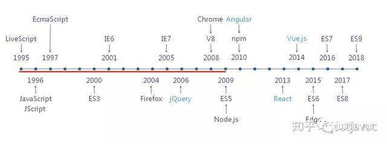
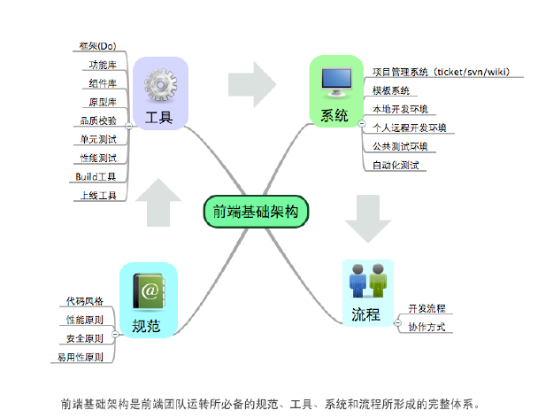
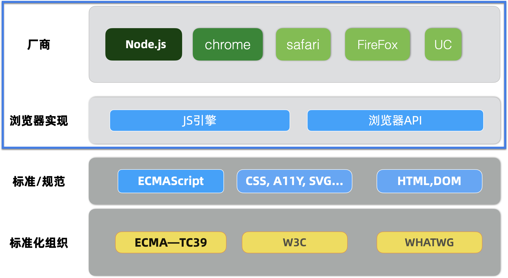
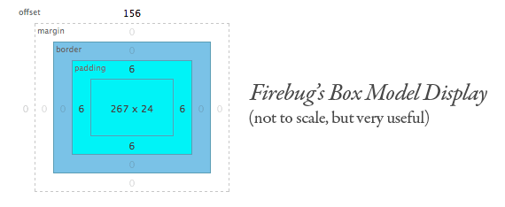
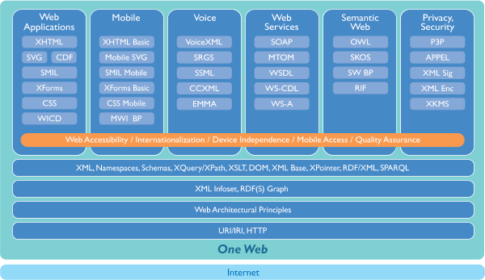

| 序号 | 修改时     | 修改内容                                               | 修改人 | 审稿人 |
| :--- | ---------- | ------------------------------------------------------ | ------ | ------ |
| 1    | 2017-1-4   | 创建，合并《AJAX技术》和《移动网站开发》里的前端知识。 | Keefe  | Keefe  |
| 2    | 2018-7-1   | 增加SVG章节                                            | 同上   |        |
| 3    | 2021-11-18 | 更新前端开发概述部分                                   | 同上   |        |
|      |            |                                                        |        |        |


# 目录

[TOC]


---

# 1  前端开发概述

前端开发包括

* 前端页面展现：HTML/CSS/JavaScript

* 后端业务逻辑处理：PHP/ASP/Python/...

* 数据库访问：ADO/MYSQL/ORM/...

 狭义的前端只能前端页面层，广义的前端则包括了页面+后端逻辑。


**易用性是网页开发质量的一个重要组成。**

前端基础可简单认为：html + css + JavaScript

进一步扩展，则

* html, xhtml, xml,
* css -> xsl
* JavaScript, browser script; ….


## 前端开发史



前端开发模式的演进，主要有四个阶段。

1. 基于模板渲染的动态页面：此阶段无前后端的分离。

2. 基于 AJAX 的前后端分离：2015年AJAX出现，开始出现前端工程师职位。

3. 基于 Node.js 的前端工程化：2009年Node.js出现，随着 Node.js 一同出现的还有 CommonJS 规范和 npm 包管理机制。随后也出现了 Grunt、Gulp、Webpack 等一系列基于 Node.js 的前端开发构建工具。2013 年前后，前端三大框架 React.js/Angular/Vue.js 相继发布第一个版本。前端开发开始变得规范化、标准化、工程化。

4. 基于 Node.js 的全栈开发。随着微服务的兴起，在微服务和前端中间，加了一个 BFF（Backend For Frontend） 层，由 BFF 对接口进行聚合、裁剪后，再输出给前端。


表格  淘宝的前端开发史

| 年代      | 简介                                                | 主要技能                                                     |
| --------- | --------------------------------------------------- | ------------------------------------------------------------ |
| 2003~2006 | 静态页面、嵌套表格、单一浏览器、兼职开发            | HTML/CSS/JS，SEO                                             |
| 2006~2007 | 增加了交互、视觉设计，专门设立WEB前端工程师职位。   | 新增：标准兼容（W3C/HTML4/JS）、调试工具（Firebug）、用户体验 |
| 2007~2008 | 大量使用AJAX，内容剧增                              | 新增：栅格化、库/框架(YUI2/tbra)、部署（jslint/YC/ant)、组件库、性能优化 |
| 2009-2010 | 前端性能问题、组件本地化、多人协作/前端架构的模块化 | 新增：前端架构(yui3、kissy)                                  |
| 2010~2011 | 移动终端、大屏、OPOA（单页应用）                    | 新增：前端MVC、HTML5/CSS3、移动终端                          |
| 2012~     | FSAS~函数作为服务。云计算时代的前端。               |                                                              |


根据关注面不同，前端开发大概也可以分为三层：

* 应用层开发，更加偏业务侧逻辑，关注业务逻辑/业务特性/业务领域建模，因此会有开发体验，用户体验，复用性和安全性等等作为衡量指标。
* 框架类库的开发，关注通用性和跨业务封装，因此衡量指标是：工程/工效，性能，稳定性，基础设施抽象，安全兜底。
* 系统级的开发，有大量的操作系统接口需要关注，因此要求对操作系统层还是要有所感知。


## 前端架构

前端基础架构是前端运转团队所必需的规范、工具、系统和流程所形成的完整体系。




###  SPA

SPA~Single Page Application，单页面应用。将渲染HTML的工作全部交给前端。

SPA相对于 之前的MAP（多页应用），有以下不同：

优点

* 前端掌控路由，用户体验更佳。
* 可移植，可离线使用。
* 服务器端提供的是干净数据接口，具备高度的可复用性。
* HTML资源作为静态资源，易于部署。
* 前后端完全分离，各自维护源码，无须而合。

**缺点**

* SEO不友好，难度较高
* 前进后退管理麻烦
* 初次加载消耗高（白屏时间）。

**优化**

*　SEO用 #!来替换 #，因为google会采集 带#!的URL
*　记录浏览历史路由，来管理前进后退。
*　加载优化：页面压缩；渐次加载。


SPA 前端实现方式  通常有2种：

* 修改 url 中 Hash：通过hashchange事件，监听#后字符变化

* 利用 H5 中的 history： back(), forward(), go()，pushState()和 replaceState()


### Serverless

Serverless = FAAS+ BAAS。

*  FAAS（Function as a Service） 就是一些运行函数的平台，比如阿里云的函数计算、AWS 的 Lambda 等。
*  BAAS（Backend as a Service）则是一些后端云服务，比如云数据库、对象存储、消息队列等。利用 BAAS，可以极大简化我们的应用开发难度。

Serverless 的主要特点有：

* 事件驱动

* 函数在 FAAS平台中，需要通过一系列的事件来驱动函数执行。

* 无状态

* 因为每次函数执行，可能使用的都是不同的容器，无法进行内存或数据共享。如果要共享数据，则只能通过第三方服务，比如 Redis 等。

* 无运维

* 使用 Serverless 我们不需要关心服务器，不需要关心运维。这也是 Serverless 思想的核心。

* 低成本

* 使用 Serverless 成本很低，因为我们只需要为每次函数的运行付费。函数不运行，则不花钱，也不会浪费服务器资源

  

图  Serverless 服务中的前端解决方案架构图


## 前端标准化

前端的运行时：浏览器，是一套完全由国际开源组织标准化的应用，而且标准规范对底层操作系统运行环境的封装非常完善，底层操作系统完全透明。

从标准化的维度来分，浏览器大致可以分为3层：浏览器厂商与实现，标准规范，标准化组织。




说明：1. 浏览器厂商和实现 详见 《[浏览器开发](../领域开发/浏览器开发.md)》

2. 标准规范：主要包括HTML、CSS、JavaScript和ECMAScript。HTML和CSS是由WHATWG和W3C这2个开源组织维护，JavaScript是ECMAScript的实现，ECMAScript（即ECMA-262）是由ECMA的TC39技术组维护。
3. 标准化组织：主要是三大组织。WHATWG主要维护HTML和DOM规范，还维护了Fetch API，Stream API， MIME type等。W3C主要维护CSS，XHTML规范，还维护了SVG，XML， A11y等等规范。ECMA主要维护ECMAScript规范。


## 前端工程化

详见 《[前端工程化工具](前端工程化工具.md)》


## 前端技术趋势

**前端业界基础建设**


## 本章参考

* 你应该了解的前端标准化  https://developer.aliyun.com/article/796448
* 【你应该了解的】前端通用国际化解决方案  https://juejin.cn/post/6844904032121815054
* 你应该知道的前端趋势——前端技术浪潮与应用(2020.4)  https://segmentfault.com/a/1190000039922482


# 2  标记语言

标记语言，Markup Language，是一种将文本以及文本相关的其他信息结合起来，展现出关于文档结构和数据处理细节的电脑文字编码。与文本相关的其他信息（包括文本的结构和表示信息等）与原来的文本结合在一起，但是使用[标记](https://baike.baidu.com/item/标记/23734923)进行标识。

标记语言通常可以分为三类：标识性的、过程性的以及描述性的。

* 标识性的：Presentational，标记文档的结构信息。如wiki
* 过程性的：Procedural   一般用于文字的表达，通常对于文本编辑者可见,并且被软件依其出现顺序依次解读 。过程性置标语言的范例有 nroff, [troff](https://baike.baidu.com/item/troff), [TeX](https://baike.baidu.com/item/TeX), Lout 以及 [PostScript](https://baike.baidu.com/item/PostScript). 过程性置标语言被广泛应用在专业出版领域。
* 描述性的：有时被称为逻辑标记或概念上的标记，鼓励作者编写的方式描述概念上，而非视觉上。

常见标记语言有：[HTML](https://baike.baidu.com/item/HTML)  [XML](http://zh.wikipedia.org/wiki/XML)  [XHTML](http://zh.wikipedia.org/wiki/XHTML)


## 2.1 HTML

1989年，欧洲粒子物理实验室（[CERT](https://baike.baidu.com/item/CERT)）的研究员Tim Berners-Lee和Anders Berglund共同创建了一种基于标记的语言HTML，他可看做[标准通用标记语言](https://baike.baidu.com/item/标准通用标记语言)的简单应用，开始时仅仅提供一种对静态文本的信息显示的方法，后来越来越多的标签产生，两大浏览器厂商微软和网景格式，甚至创建了自己的产品的兼容标签，使[HTML](https://baike.baidu.com/item/HTML)变得臃肿不堪，兼容性不好。

**HTML** **是** **Web** **上的通用标记语言。**早期的HTML语法被定义成较松散的规则，以有助于不熟悉网络出版的人采用。网页浏览器接受了这个现实，并且可以显示语法不严格的网页。使用[XML](http://zh.wikipedia.org/wiki/XML)的严格规则的[XHTML](http://zh.wikipedia.org/wiki/XHTML)（可扩展超文本置标语言）是[W3C](http://zh.wikipedia.org/wiki/W3C)计划中的HTML的接替者。虽然很多人认为它已经成为当前的HTML标准，但是它实际上是一个独立的、和HTML平行发展的标准。W3C目前的建议是使用XHTML 1.1、XHTML 1.0或者HTML 4.01进行网络出版。

HTML文档中，第一个标签是<html>。这个标签告诉浏览器这是HTML文档的开始。HTML文档的最后一个标签是</html>，这个标签告诉浏览器这是HTML文档的终止。

 在<head>和</head>标签之间文本的是头信息。在浏览器窗口中，头信息是不被显示的。
 在<title>和</title>标签之间的文本是文档标题，它被显示在浏览器窗口的标题栏。
 在<body>和</body>标签之间的文本是正文，会被显示在浏览器中。
 在<b>和</b>标签之间的文本会以加粗字体显示。


**HTML文档**是由HTML元素组成的文本文件。
 **HTML元素**是预定义的正在使用的HTML标签。Eg:<html>是一个html标签，html是元素名称，标签可拥有属性。

HTML规定了一些基本标签，排版，背景颜色样式，文本格式。

HTML还包括下面内容：链接（href）, 表格（table）,框架（frameset），表单(<form><input type=”” value=””></form>), 图像（img）,列表等。


**重要的html元素**

**ID属性:** ID属性用于定义一个元素的独特的样式。一个CSS规则如:

`#wdg97 { font-size: larger }`

可以通过ID属性应用到HTML中:

<P ID=wdg97>欢迎访问Web Design Group及TV water 168!</P>

此外：ID是用来标识一个元素，一段html正文的有力工具。（非常重要）


SPAN元素：**SPAN**元素被加入到HTML中以允许网页制作者给出样式但无须附加在一个HTML的结构元素上。**SPAN**在样式表中作为一个选择符使用，而且它也能接受[**STYLE**](http://www.htmlhelp.com/zh/reference/css/style-html.html#inlining%23inlining)、[**CLASS**](http://www.htmlhelp.com/zh/reference/css/style-html.html#class%23class)和[**ID**](http://www.htmlhelp.com/zh/reference/css/style-html.html#id%23id)属性。

DIV元素：**DIV**元素在功能上与[**SPAN**](http://www.htmlhelp.com/zh/reference/css/style-html.html#span%23span)元素相似，最主要的差别在于**DIV** ("division"，"部分"的简称)是一个[块级元素](http://www.htmlhelp.com/reference/html40/block.html)。


### 2.1.1 HTML

-  [超文本置标语言（第一版）](http://www.w3.org/MarkUp/draft-ietf-iiir-html-01.txt)——在1993年6月发为[互联网工程工作小组](http://zh.wikipedia.org/wiki/互联网工程工作小组)（[IETF](http://zh.wikipedia.org/wiki/IETF)）工作草案发布（并非标准）.
-  [HTML 2.0](http://www.ietf.org/rfc/rfc1866.txt)——[1995](http://zh.wikipedia.org/wiki/1995年)[年](http://zh.wikipedia.org/wiki/1995年)11月作为[RFC](http://zh.wikipedia.org/wiki/RFC) 1866发布，在[RFC  2854](http://tools.ietf.org/html/rfc2854)于2000年6月发布之后被宣布已经过时
-  [HTML 3.2](http://www.w3.org/TR/REC-html32)——[1996](http://zh.wikipedia.org/wiki/1996年)[年](http://zh.wikipedia.org/wiki/1996年)[1](http://zh.wikipedia.org/wiki/1月14日)[月14日](http://zh.wikipedia.org/wiki/1月14日)，W3C推荐标准
-  [HTML 4.0](http://www.w3.org/TR/REC-html40)——[1997](http://zh.wikipedia.org/wiki/1997年)[年](http://zh.wikipedia.org/wiki/1997年)[12](http://zh.wikipedia.org/wiki/12月18日)[月18日](http://zh.wikipedia.org/wiki/12月18日)，W3C推荐标准
-  [HTML 4.01](http://www.w3.org/TR/html401)（微小改进）——[1999](http://zh.wikipedia.org/wiki/1999年)[年](http://zh.wikipedia.org/wiki/1999年)[12](http://zh.wikipedia.org/wiki/12月24日)[月24日](http://zh.wikipedia.org/wiki/12月24日)，W3C推荐标准
-  [ISO/IEC  15445:2000](http://www.purl.org/NET/ISO+IEC.15445/15445.html)（“[ISO](http://zh.wikipedia.org/wiki/ISO) HTML”）——[2000](http://zh.wikipedia.org/wiki/2000年)[年](http://zh.wikipedia.org/wiki/2000年)[5](http://zh.wikipedia.org/wiki/5月15日)[月15日](http://zh.wikipedia.org/wiki/5月15日)发布，基于严格的HTML 4.01语法，是[国际标准化组织](http://zh.wikipedia.org/wiki/国际标准化组织)和[国际电工委员会](http://zh.wikipedia.org/wiki/国际电工委员会)的标准。


表格 2 W3C HTML 规范和时间线

| 规范                                                       | 推荐                        |
| ---------------------------------------------------------- | --------------------------- |
| [HTML 3.2](http://www.w3.org/TR/REC-html32)                | 1997 年 1 月 14 日          |
| [HTML 4.0](http://www.w3.org/TR/1998/REC-html40-19980424/) | 1998 年 5 月 24 日          |
| [HTML 4.01](http://www.w3.org/TR/html401/)                 | 1999 年 12 月 24 日         |
| [HTML 5](http://www.w3.org/TR/html5/)                      | 2010 年6月24 日（最新草案） |


The global structure of an HTML document

An HTML 4 document is composed of three parts:

1.  a line containing [HTML version information](http://www.w3.org/TR/1999/REC-html401-19991224/struct/global.html#version-info), (可选)
2.  a declarative header section (delimited by the [HEAD](http://www.w3.org/TR/1999/REC-html401-19991224/struct/global.html#edef-HEAD) element),
3.  a body, which contains the document's actual content. The body may be implemented by the [BODY](http://www.w3.org/TR/1999/REC-html401-19991224/struct/global.html#edef-BODY) element or the [FRAMESET](http://www.w3.org/TR/1999/REC-html401-19991224/present/frames.html#edef-FRAMESET) element.

White space (spaces, newlines, tabs, and comments) may appear before or after each section. Sections 2 and 3 should be delimited by the [HTML](http://www.w3.org/TR/1999/REC-html401-19991224/struct/global.html#edef-HTML) element.

Here's an example of a simple HTML document:

```html
<!DOCTYPE HTML PUBLIC "-//W3C//DTD HTML 4.01//EN"
   "http://www.w3.org/TR/html4/strict.dtd">
<HTML>
   <HEAD>
      <TITLE>My first HTML document</TITLE>
   </HEAD>
   <BODY>
      <P>Hello world!
   </BODY>
</HTML>
```


### 2.1.2 HTML5

**HTML5** **是** **W3C** **与** **WHATWG** **合作的结果。**

WHATWG 致力于 web 表单和应用程序，而 W3C 专注于 XHTML 2.0。在 2006 年，双方决定进行合作，来创建一个新版本的 HTML。

**为** **HTML5** **建立的一些规则：**

- 新特性应该基于 HTML、CSS、DOM 以及JavaScript。
- 减少对外部插件的需求（比如 Flash）
- 更优秀的错误处理
- 更多取代脚本的标记
- HTML5 应该独立于设备
- 开发进程应对公众透明


**HTML5** **中的一些有趣的新特性：**

- 用于绘画的 canvas 元素
- 用于媒介回放的 video 和 audio 元素
- 对本地离线存储的更好的支持
- 新的特殊内容元素，比如 article、footer、header、nav、section
- 新的表单控件，比如 calendar、date、time、email、url、search


## 2.2 XHTML

XHTML 是更严格更纯净的 HTML 代码。

-  [XHTML 1.0](http://www.w3.org/TR/xhtml1/)——发布于[2000](http://zh.wikipedia.org/wiki/2000年)[年](http://zh.wikipedia.org/wiki/2000年)1月26日，是W3C推荐标准，后来经过修订于2002年8月1日重新发布。
  -  XHTML Basic  1.0
  -  XHTML MP 1.0  (即相当于WAP2.0)
-  [XHTML 1.1](http://www.w3.org/TR/xhtml11/)，于2001年5月31日发布，W3C推荐标准。
-  [XHTML 2.0](http://www.w3.org/TR/xhtml2/)，W3C工作草案。
-  [XHTML 5](http://zh.wikipedia.org/wiki/XHTML_5)，从XHTML 1.x的更新版，基于[HTML 5](http://www.w3.org/html/wg/html5/)[草案](http://www.w3.org/html/wg/html5/)。


表格 3 W3C XHTML规范和时间线表

| 规范                       | 草案/提议           | 推荐                |
| -------------------------- | ------------------- | ------------------- |
| XHTML 1.0                  |                     | 2000 年 1 月 26 日  |
| XHTML 1.0 修订版           |                     | 2002 年 8 月 1 日   |
| XHTML 1.1                  |                     | 2001 年 5 月 31 日  |
| XHTML Modules              |                     | 2001 年 4 月 10 日  |
| XHTML Modules 1.1          |                     | 2008 年 10 月 8 日  |
| XHTML Basic                |                     | 2000 年 12 月 19 日 |
| XHTML Basic 1.1            |                     | 2008 年 7 月 29 日  |
| XHTML Events               |                     | 2003 年 10 月 14 日 |
| XHTML Print                |                     | 2006 年 9 月 20 日  |
| XHTML Media Types (SE)     | 2009 年 1 月 16 日  |                     |
| XHTML 2.0                  | 2006 年 7 月 26 日  |                     |
| XForms 1.0                 |                     | 2003 年 10 月 14 日 |
| XForms 1.0 (Third Edition) |                     | 2007 年 10 月 29 日 |
| XForms 1.1                 | 2009 年 10 月 20 日 |                     |
| XLink                      |                     | 2001 年 6 月 27 日  |
| HLink                      | 2002 年 9 月 13 日  |                     |


#### XHTML Basic

表格 4 XHTML Basic支持的模块列表

| 模块     | 元素/属性                                                    |
| -------- | ------------------------------------------------------------ |
| 结构     | html,head,title,body                                         |
| 文字     | abbr,acronym,address,blockquote,br,cite,code,dfn,div,em, h1,h2,h3,h4,h5,h6,kbd,p,pre,q,samp,span,strong,var |
| 链接     | a                                                            |
| 列表     | dl,dt,dd,ol,ul,li                                            |
| 表单     | button,fieldset,form,input,label,legend,select,optgroup,option,textarea |
| 表格     | caption,table,td,th,tr                                       |
| 图片     | img                                                          |
| 对象     | object,param                                                 |
| 表现     | b,big,hr,i,small,sub,sup,tt                                  |
| 元信息   | meta                                                         |
| 链接     | link                                                         |
| base     | base                                                         |
| 事件     | onblur,onfocus,onload,onunload,onreset,onsubmit,onchange     |
| 脚本     | script,noscript                                              |
| 样式     | 支持style元素                                                |
| 样式属性 | 支持style属性                                                |
| 目标     | 支持target属性                                               |


**不支持的内容：**

不支持外部CSS文件

不支持嵌套table；

不支持thead、tbody、tfood等；

不支持name属性；

不支持框架；

不支持del、ins、basefont、center、dir、font、isindex、menu、sstricke、u等元素。


**注意事项：**

对事件的支持依赖具体的浏览器支持，有些浏览器不一定支持这些事件；

webkit支持更多的事件

opera mini由于是基于自己的代理服务器，有些事件是不支持的，详见：JavaScript support in Opera Mini 4

#### **XHTML MP**

正如之前提到的，XHTML MP是对XHTML Basic的一个扩展，所以XHTML MP有更好的适用性。而XHTML MP对于Basic最大的优势就是支持外部样式文件——虽然这会导致多一个HTTP请求。


XHTML MP支持下面三种MIME类型

```html
application/vnd.wap.xhtml+xml
application/xhtml+xml
text/html
```


详见： [XHTML ](http://www.php42.com/index.php/web/66-mobile-xhtml-mp/188-xhtml-mp-tutorial)[移动概要 (XHTML MP) / WAP 2.0 教程 ](http://www.php42.com/index.php/web/66-mobile-xhtml-mp/188-xhtml-mp-tutorial)

这些是 XHTML MP 所丢失的主要的 WML 语言的特征:

- XHTML MP 不支持 Deck 与 Card
- XHTML MP 不支持计时器
- XHTML MP 不支持事件
- XHTML MP 不支持变量
- XHTML MP 不支持客户端脚本
- XHTML MP 不支持对软键 (accesskey) 编程
- XHTML MP 不支持 <u> 标签
- XHTML MP 的输入字段不支持格式化属性
- XHTML MP 不支持用锚链接发送数据

#### html升级到xhtml

为了将站点从 HTML 转换为 XHTML，可参考下列步骤：

1. 添加文件类型声明: 要有doctype，否则浏览器显示可能出错。
2. 小写的标签和属性名: xhtml大小写敏感，所以都用小写。
3. 给所有属性加上引号: w3c xhtml标准要求。
4. 空标签：<hr> , <br> 和 ：xhtml不允许空标签。改为<hr />,<br />
5. 验证站点: [XHTML Validator](http://validator.w3.org/check/referer)

页面清理工具：[Dave Raggett ](http://www.w3.org/People/Raggett/tidy/)[的 HTML TIDY](http://www.w3.org/People/Raggett/tidy/)

网站重构：[XHTML ](http://w3school.com.cn/xhtml/xhtml_structural_01.asp)[结构化](http://w3school.com.cn/xhtml/xhtml_structural_01.asp)


## 2.3 XML

**XML** **被设计用来描述、存储、传送及交换数据。**

可扩展置标语言（[英语](http://zh.wikipedia.org/wiki/英语)：eXtensible Markup Language，简称:XML），又称可扩展标记语言，是一种[置标语言](http://zh.wikipedia.org/wiki/置标语言)。XML是从[标准通用置标语言](http://zh.wikipedia.org/wiki/标准通用置标语言)（SGML）中简化修改出来的。它主要用到的有可扩展置标语言、[可扩展样式语言](http://zh.wikipedia.org/wiki/可扩展样式语言)（XSL）、[XBRL](http://zh.wikipedia.org/wiki/XBRL)和[XPath](http://zh.wikipedia.org/wiki/XPath)等。

**特性：**

- 只负责内容描述，不处理内容显示(显示信息可由css, xslt完成)
- 可扩展的，结构化数据
- 文档结构有效性可通过DTD或XML Schema来验证。

XML文档组成：元素，属性，实体，PCDATA，CDATA。

XML命名空间提供了一种可以把元素、属性、名字和URL地址引用相互关联的方法。


表格 5 W3C XML规范和时间线

| 规范                      | 草案/提议         | 推荐                |
| ------------------------- | ----------------- | ------------------- |
| XML 1.0                   |                   | 1998 年 2 月 10 日  |
| XML 1.0 (2.Ed)            |                   | 2000 年 10 月 6 日  |
| XML 1.0 (3.Ed)            |                   | 2004 年 2 月 4 日   |
| XML 1.1                   |                   | 2004 月 2 月 4 日   |
| XML 1.1 (2.Ed)            |                   | 2006 年 8 月 16 日  |
| XML 1.0 Namespaces        |                   | 1999 年 1 月 14 日  |
| XML 1.0 Namespaces SE     |                   | 2004 年 3 月 4 日   |
| XML 1.1 Namespaces        |                   | 2004 年 3 月 4 日   |
| XML 1.1 Namespaces SE     |                   | 2006 年 8 月 16 日  |
| XML Infoset               |                   | 2001 年 10 月 24 日 |
| XML Infoset (2.Ed)        |                   | 2004 年 2 月 4 日   |
| XML Base                  |                   | 2001 年 6 月 27 日  |
| XLink 1.0                 |                   | 2001 年 6 月 27 日  |
| XPointer Framework        |                   | 2003 年 3 月 25 日  |
| XPointer element() scheme |                   | 2003 年 3 月 25 日  |
| XPointer xmlns() scheme   |                   | 2003 年 3 月 25 日  |
| XInclude 1.0              |                   | 2004 年 12 月 20 日 |
| XInclude 1.0 SE           |                   | 2006 年 11 月 15 日 |
| XML Processing Model      | 2004 年 4 月 5 日 |                     |
| XMLHttpRequest Object     | 2010 年 8 月 3 日 |                     |


### 2.3.1 DTD/XML Schema

- DTD: Document Type Definition**文档类型定义，可定义合法的XML文档构建模块。它使用一系列合法的元素来定义文档的结构。DTD** **可被成行地声明于** **XML** **文档中，也可作为一个外部引用。**
- XML Schema 用于定义XML文档的合法元素，类似DTD。

#### DTD的文档声明

参考：

http://www.w3.org/QA/2002/04/valid-dtd-list.html

 http://gutfeldt.ch/matthias/articles/doctypeswitch/table.html


<!DOCTYPE> 声明必须是 HTML 文档的第一行，位于 <html> 标签之前。

<!DOCTYPE> 声明不是 HTML 标签；它是指示 web 浏览器关于页面使用哪个 HTML 版本进行编写的指令。

在 HTML 4.01 中，<!DOCTYPE> 声明引用 DTD，因为 HTML 4.01 基于 SGML。DTD 规定了标记语言的规则，这样浏览器才能正确地呈现内容。

HTML5 不基于 SGML，所以不需要引用 DTD。

在 HTML 4.01 中有三种 <!DOCTYPE> 声明。在 HTML5 中只有一种：

<!DOCTYPE html>


**HTML 4.01的三种文档声明**

1. **内部的文档声明**

**<!DOCTYPE** **根元素** **[元素声明]>**


1. **外部文档声明**

假如 DTD 位于 XML 源文件的外部，那么它应通过下面的语法被封装在一个 DOCTYPE 定义中：

**<!DOCTYPE** **根元素** **SYSTEM "xxx.dtd">**

xxx.dtd元素声明:

<!ELEMENT 元素名称 内容声明>


1. **公共的文档声明**DOCTYPE

结构组成：

**<!DOCTYPE [根元素] PUBLIC “[TYPE[DTD所有者]//[DTD描述]//[ISO639语言标识符]” “URL”**

TYPE: 如果是ISO标准，则为ISO；如没有标准化组织同意，则为’-‘; 如果有非ISO的标准化组成同意，则为’+’;

示例：

<!DOCTYPE html PUBLIC "-//W3C//DTD XHTML Basic 1.0//EN"

"http://www.w3.org/TR/xhtml-basic/xhtml-basic10.dtd">

说明： 上例中，根元素是html, type为非标准，所有者是w3c, DTD描述是DTD XHTML Basic 1.0, 语言为EN—英语，DTD URL是"http://www.w3.org/TR/xhtml-basic/xhtml-basic10.dtd"


示例：

```xml
<?xml version="1.0" encoding="utf-8"?>
<!DOCTYPE wml PUBLIC "-//WAPFORUM//DTD WML 1.1//EN" "http://www.wapforum.org/DTD/wml_1.1.xml">
```


php输出

```php+HTML
<?
// header("Content-type: text/vnd.wap.wml");
echo("<?xml version="1.0"?>\n");
echo("<!DOCTYPE wml PUBLIC "-//WAPFORUM//DTD WML 1.1//EN"
//"http://www.wapforum.org/DTD/wml_1.1.xml">\n");
?>
```


##### 公共DOCTYPE列表

因为浏览器每次更新都会改进标准模式，但是网页的更新肯定要滞后于浏览器的发展，所以总有一些网页不能与时俱进，要正确显示这些网页，浏览器就需要向后兼容。

当代浏览器，包括IE、Firefox、Safari和Opera都有各自不同两种模式：Quirks 和 Standards

[Quirks](http://en.wikipedia.org/wiki/Quirks_mode)[模式](http://en.wikipedia.org/wiki/Quirks_mode): 另类模式是一种用于网页浏览器的技术名称，该模式用于让浏览器向后兼容为旧有浏览器设计的页面，取代完全兼容与W3C和IETF标准的标准模式。

Standards模式：又称Compliance, 支持DOCTYPE转换，完全兼容与W3C和IETF标准。


IE8支持三种工作模式：

- Quirks mode：保持与现有内容兼容性。
- Standards mode：与IE7一样，兼容现有内容。
- Super Standards：对于开发人员，如果需要最好兼容IE8，可以使用简单插入元素实现更好的兼容新。

IE8的默认工作模式是Quirks模式。


To validate a document must contain a proper [Document Type Declaration](http://en.wikipedia.org/wiki/Document_Type_Declaration), or DOCTYPE, depending on the version of specification followed:

表格 6 DOCTYPE列表

| 标识语言                                                     | 简述                                                         | DTD举例                                                      |
| ------------------------------------------------------------ | ------------------------------------------------------------ | ------------------------------------------------------------ |
| HTML 5                                                       | 只有一种DTD声明。                                            | <!DOCTYPE html>                                              |
| HTML 4.01 Strict                                             | 该 DTD 包含所有 HTML 元素和属性，但不包括展示性的和弃用的元素（比如 font）。不允许框架集（Framesets）。 | <!DOCTYPE HTML PUBLIC "-//W3C//DTD HTML 4.01//EN" "http://www.w3.org/TR/html4/strict.dtd"> |
| HTML 4.01 Transitional                                       | 该 DTD 包含所有 HTML 元素和属性，包括展示性的和弃用的元素（比如 font）。不允许框架集（Framesets）。 | <!DOCTYPE HTML PUBLIC "-//W3C//DTD HTML 4.01 Transitional//EN"   "http://www.w3.org/TR/html4/loose.dtd"> |
| HTML 4.01 Frameset                                           | 该 DTD 等同于 HTML 4.01 Transitional，但允许框架集内容。     | <!DOCTYPE HTML PUBLIC "-//W3C//DTD HTML 4.01 Frameset//EN"   "http://www.w3.org/TR/html4/frameset.dtd"> |
| [XHTML 1.0](http://www.w3.org/TR/xhtml1/)  [Strict](http://www.w3.org/TR/xhtml1/DTD/xhtml1-strict.dtd) | 该 DTD 包含所有 HTML 元素和属性，但不包括展示性的和弃用的元素（比如 font）。不允许框架集（Framesets）。必须以格式正确的 XML 来编写标记。 | <!DOCTYPE html PUBLIC "-//W3C//DTD XHTML 1.0 Strict//EN"   "http://www.w3.org/TR/xhtml1/DTD/xhtml1-strict.dtd"> |
| XHTML 1.0 [Transitional](http://www.w3.org/TR/xhtml1/DTD/xhtml1-transitional.dtd) | 该 DTD 包含所有 HTML 元素和属性，包括展示性的和弃用的元素（比如 font）。不允许框架集（Framesets）。必须以格式正确的 XML 来编写标记。 | <!DOCTYPE html PUBLIC "-//W3C//DTD XHTML 1.0 Transitional//EN" " http://www.w3.org/TR/xhtml1/DTD/xhtml1-transitional.dtd"> |
| XHTML 1.0 [Frameset](http://www.w3.org/TR/xhtml1/DTD/xhtml1-frameset.dtd) | 该 DTD 等同于 XHTML 1.0 Transitional，但允许框架集内容。     | <!DOCTYPE html PUBLIC "-//W3C//DTD XHTML 1.0 Frameset//EN"   "http://www.w3.org/TR/xhtml1/DTD/xhtml1-frameset.dtd"> |
| [XHTML 1.1](http://www.w3.org/TR/xhtml11/)                   | 该 DTD 等同于 XHTML 1.0 Strict，但允许添加模型（例如提供对东亚语系的 ruby 支持）。 | <!DOCTYPE html PUBLIC "-//W3C//DTD XHTML 1.1//EN" "http://www.w3.org/TR/xhtml11/DTD/xhtml11.dtd"> |
| XHTML Mobile 1.0                                             | XHTML移动版，先后有1.0、1.1、1.2版本。 相应的DTD将1.0或者10改为相应的数字。 | <!DOCTYPE html PUBLIC "-//WAPFORUM//DTD XHTML Mobile 1.0//EN" "http://www.wapforum.org/DTD/xhtml-mobile10.dtd"> |
| [XHTML Basic 1.1](http://www.w3.org/TR/2006/WD-xhtml-basic-20060705) |                                                              | <!DOCTYPE html PUBLIC "-//W3C//DTD XHTML Basic 1.1//EN" "http://www.w3.org/TR/xhtml-basic/xhtml-basic11.dtd"> |


表格 7 HTML5/HTML 4.01/XHTML的元素列表

| **标签**                                         | **HTML5**  | **HTML 4.01 / XHTML 1.0** |  |      | **XHTML 1.1** |
| ------------------------------------------------ | ---------- | ------------------------- | ------------- | ---- | ---- |
|                                                  |           | **Transitional**          | **Strict** | **Frameset** |      |
| [<a>](http://www.w3school.com.cn/tags/tag_a.asp) | Yes        | Yes                       | Yes           | Yes  | Yes  |
| <abbr>               | Yes  | Yes  | Yes  | Yes  | Yes  |
| <acronym>            | No   | Yes  | Yes  | Yes  | Yes  |
| <address>            | Yes  | Yes  | Yes  | Yes  | Yes  |
| <applet>             | No   | Yes  | No   | Yes  | No   |
| <area>               | Yes  | Yes  | Yes  | Yes  | No   |
| <article>            | Yes  | No   | No   | No   | No   |
| <aside>              | Yes  | No   | No   | No   | No   |
| <audio>              | Yes  | No   | No   | No   | No   |
| <b>                  | Yes  | Yes  | Yes  | Yes  | Yes  |
| <base>               | Yes  | Yes  | Yes  | Yes  | Yes  |
| <basefont>           | No   | Yes  | No   | Yes  | No   |
| <bdi>                | Yes  | No   | No   | No   | No   |
| <bdo>                | Yes  | Yes  | Yes  | Yes  | No   |
| <big>                | No   | Yes  | Yes  | Yes  | Yes  |
| <blockquote>         | Yes  | Yes  | Yes  | Yes  | Yes  |
| <body>               | Yes  | Yes  | Yes  | Yes  | Yes  |
| <br>                 | Yes  | Yes  | Yes  | Yes  | Yes  |
| <button>             | Yes  | Yes  | Yes  | Yes  | Yes  |
| <canvas>             | Yes  | No   | No   | No   | No   |
| <caption>            | Yes  | Yes  | Yes  | Yes  | Yes  |
| <center>             | No   | Yes  | No   | Yes  | No   |
| <cite>               | Yes  | Yes  | Yes  | Yes  | Yes  |
| <code>               | Yes  | Yes  | Yes  | Yes  | Yes  |
| <col>                | Yes  | Yes  | Yes  | Yes  | No   |
| <colgroup>           | Yes  | Yes  | Yes  | Yes  | No   |
| <command>            | Yes  | No   | No   | No   | No   |
| <datalist>           | Yes  | No   | No   | No   | No   |
| <dd>                 | Yes  | Yes  | Yes  | Yes  | Yes  |
| <del>                | Yes  | Yes  | Yes  | Yes  | No   |
| <details>            | Yes  | No   | No   | No   | No   |
| <dfn>                | Yes  | Yes  | Yes  | Yes  | Yes  |
| <dir>                | No   | Yes  | No   | Yes  | No   |
| <div>                | Yes  | Yes  | Yes  | Yes  | Yes  |
| <dl>                 | Yes  | Yes  | Yes  | Yes  | Yes  |
| <dt>                 | Yes  | Yes  | Yes  | Yes  | Yes  |
| <em>                 | Yes  | Yes  | Yes  | Yes  | Yes  |
| <embed>              | Yes  | No   | No   | No   | No   |
| <fieldset>           | Yes  | Yes  | Yes  | Yes  | Yes  |
| <figcaption>         | Yes  | No   | No   | No   | No   |
| <figure>             | Yes  | No   | No   | No   | No   |
| <font>               | No   | Yes  | No   | Yes  | No   |
| <footer>             | Yes  | No   | No   | No   | No   |
| <form>               | Yes  | Yes  | Yes  | Yes  | Yes  |
| <frame>              | No   | No   | No   | Yes  | No   |
| <frameset>           | No   | No   | No   | Yes  | No   |
| <head>               | Yes  | Yes  | Yes  | Yes  | Yes  |
| <header>             | Yes  | No   | No   | No   | No   |
| <h1>   to <h6> | Yes  | Yes  | Yes  | Yes  | Yes  |
| <hr>                 | Yes  | Yes  | Yes  | Yes  | Yes  |
| <html>               | Yes  | Yes  | Yes  | Yes  | Yes  |
| <i>                  | Yes  | Yes  | Yes  | Yes  | Yes  |
| <iframe>             | Yes  | Yes  | No   | Yes  | No   |
|                 | Yes  | Yes  | Yes  | Yes  | Yes  |
| <input>              | Yes  | Yes  | Yes  | Yes  | Yes  |
| <ins>                | Yes  | Yes  | Yes  | Yes  | No   |
| <keygen>             | Yes  | No   | No   | No   | No   |
| <kbd>                | Yes  | Yes  | Yes  | Yes  | Yes  |
| <label>              | Yes  | Yes  | Yes  | Yes  | Yes  |
| <legend>             | Yes  | Yes  | Yes  | Yes  | Yes  |
| <li>                 | Yes  | Yes  | Yes  | Yes  | Yes  |
| <link>               | Yes  | Yes  | Yes  | Yes  | Yes  |
| <map>                | Yes  | Yes  | Yes  | Yes  | No   |
| <mark>               | Yes  | No   | No   | No   | No   |
| <menu>               | Yes  | Yes  | No   | Yes  | No   |
| <meta>               | Yes  | Yes  | Yes  | Yes  | Yes  |
| <meter>              | Yes  | No   | No   | No   | No   |
| <nav>                | Yes  | No   | No   | No   | No   |
| <noframes>           | No   | Yes  | No   | Yes  | No   |
| <noscript>           | Yes  | Yes  | Yes  | Yes  | Yes  |
| <object>             | Yes  | Yes  | Yes  | Yes  | Yes  |
| <ol>                 | Yes  | Yes  | Yes  | Yes  | Yes  |
| <optgroup>           | Yes  | Yes  | Yes  | Yes  | Yes  |
| <option>             | Yes  | Yes  | Yes  | Yes  | Yes  |
| <output>             | Yes  | No   | No   | No   | No   |
| <p>                  | Yes  | Yes  | Yes  | Yes  | Yes  |
| <param>              | Yes  | Yes  | Yes  | Yes  | Yes  |
| <pre>                | Yes  | Yes  | Yes  | Yes  | Yes  |
| <progress>           | Yes  | No   | No   | No   | No   |
| <q>                  | Yes  | Yes  | Yes  | Yes  | Yes  |
| <rp>                 | Yes  | No   | No   | No   | No   |
| <rt>                 | Yes  | No   | No   | No   | No   |
| <ruby>               | Yes  | No   | No   | No   | No   |
| <s>                  | Yes  | Yes  | No   | Yes  | No   |
| <samp>               | Yes  | Yes  | Yes  | Yes  | Yes  |
| <script>             | Yes  | Yes  | Yes  | Yes  | Yes  |
| <section>            | Yes  | No   | No   | No   | No   |
| <select>             | Yes  | Yes  | Yes  | Yes  | Yes  |
| <small>              | Yes  | Yes  | Yes  | Yes  | Yes  |
| <source>             | Yes  | No   | No   | No   | No   |
| <span>               | Yes  | Yes  | Yes  | Yes  | Yes  |
| <strike>             | No   | Yes  | No   | Yes  | No   |
| <strong>             | Yes  | Yes  | Yes  | Yes  | Yes  |
| <style>              | Yes  | Yes  | Yes  | Yes  | Yes  |
| <sub>                | Yes  | Yes  | Yes  | Yes  | Yes  |
| <summary>            | Yes  | No   | No   | No   | No   |
| <sup>                | Yes  | Yes  | Yes  | Yes  | Yes  |
| <table>              | Yes  | Yes  | Yes  | Yes  | Yes  |
| <tbody>              | Yes  | Yes  | Yes  | Yes  | No   |
| <td>                 | Yes  | Yes  | Yes  | Yes  | Yes  |
| <textarea>           | Yes  | Yes  | Yes  | Yes  | Yes  |
| <tfoot>              | Yes  | Yes  | Yes  | Yes  | No   |
| <th>                 | Yes  | Yes  | Yes  | Yes  | Yes  |
| <thead>              | Yes  | Yes  | Yes  | Yes  | No   |
| <time>               | Yes  | No   | No   | No   | No   |
| <title>              | Yes  | Yes  | Yes  | Yes  | Yes  |
| <tr>                 | Yes  | Yes  | Yes  | Yes  | Yes  |
| <track>              | Yes  | No   | No   | No   | No   |
| <tt>                 | No   | Yes  | Yes  | Yes  | Yes  |
| <u>                  | No   | Yes  | No   | Yes  | No   |
| <ul>                 | Yes  | Yes  | Yes  | Yes  | Yes  |
| <var>                | Yes  | Yes  | Yes  | Yes  | Yes  |
| <video>              | Yes  | No   | No   | No   | No   |
| <wbr>                | Yes  | No   | No   | No   | No   |

备注：HTML5不支持框架类标签noframes/frameset/frame、字体类标签font/big/strike/tt/u、布局类标签center。参考http://www.w3school.com.cn/tags/html_ref_dtd.asp

#### XML Schema W3C活动

XML 1.0 支持可定义文档结构的 DTD。

XML Schema 对应用程序、文档结构、属性和数据类型有着更良好的支持。

未来的 XML 版本有赖于 XML Schema 来定义 XML 文档的类型。

XML Schema 的结构（XML Schema Structure）规定了 XML Schema 的定义语言。

XML Schema 的数据类型为 XML 规定了可扩展的数据类型。


表格 8 W3C XML 规范和时间线

| 规范                             | 草案/提议           | 推荐                |
| -------------------------------- | ------------------- | ------------------- |
| XML Schema                       |                     | 2001 年 5 月 2 日   |
| XML Schema Structures            |                     | 2001 年 5 月 2 日   |
| XML Schema Datatypes             |                     | 2001 年 5 月 2 日   |
| XML Schema (2.Ed)                |                     | 2004 年 10 月 28 日 |
| XML Schema Structures (2.Ed)     |                     | 2004 年 10 月 28 日 |
| XML Schema Datatypes (2.Ed)      |                     | 2004 年 10 月 28 日 |
| XML Schema Component Designators | 2008 年 11 月 17 日 |                     |
| XML Schema 1.1: Structures       |                     | 2009 年 4 月 30 日  |
| XML Schema 1.1: Datatypes        |                     | 2009 年 4 月 30 日  |


## 2.4 样式表：CSS/XSL

**样式表可描述文件如何被显示、念出或打印。**

W3C支持两种类型的样式表：CSS 和 XSL。

层叠样式表（Cascading Style Sheets，简写为CSS），又称串樣式列表，由[W3C](http://zh.wikipedia.org/wiki/W3C)定义和维护的标准，一种用来为结构化文档（如HTML文档或XML应用）添加样式（字体、间距和颜色等）的计算机语言。目前最新版本是CSS 2.1，为W3C的候选推荐标准。下一版本CSS 3仍然在开发过程中。





### 2.4.1 CSS

**CSS的一些属性**

**STYLE:** 一个样式表可以使用**STYLE**元素在文档中嵌入. 放在文档的HEAD部分。此外，也可使用**STYLE**属性内联在html文本中。示例如下：

```css
<STYLE TYPE="text/css" MEDIA=screen>
<!--
  BODY  { background: url(foo.gif) red; color: black }
  .note { margin-left: 5em; margin-right: 5em }
-->
</STYLE>
```


**LINK：**一个外部的样式表可以通过**LINK**元素连接到HTML文档中，也是在文档的HEAD部分。示例如下：

`<LINK REL=StyleSheet HREF="style.css" TYPE="text/css" MEDIA=screen>`


**CLASS：**class属性用于指定元素属于何种样式的类。例如，样式表可以加入punk和warning类，示例如下：

.punk    { color: lime; background: #ff80c0 }

P.warning { font-weight: bolder; color: red; background: white }

这些类可以使用CLASS属性在HTML中引用。


### 2.4.2 CSS3

CSS3 完全向后兼容，因此您不必改变现有的设计。浏览器通常支持 CSS2。


**CSS3** **模块**

CSS3 被划分为模块。

其中最重要的 CSS3 模块包括：

- 选择器
- 框模型
- 背景和边框
- 文本效果
- 2D/3D 转换
- 动画
- 多列布局
- 用户界面


### 2.4.3 XSL

XSLT 是首选的 XML 样式表语言。

XSLT (eXtensible Stylesheet Language Transformations) 远比 CSS 更加完善。

使用 XSLT 的方法之一是在浏览器显示 XML 文件之前，先把它转换为 HTML

`<?xml-stylesheet type="text/xsl" href="simple.xsl"?>`

XSL由两种语言组成:一种是变换语言(eXtensibleStyleLanguageTransform，以简称XSLT)，它能够把数据从一种XML表示变换到另一种表示;另一种是格式化语言，用来描述如何将内容显示给读者。

在一般情况下，所使用的XSL主要是前一种变换语言XSLT。通过使用XSL可以生成若干变换. 其中XML到HTML是最常用的转换。


**XSL Stylesheet Language Family: Transformation and Formatting Objects**

- [The  Extensible Stylesheet Language Family](http://www.w3.org/Style/XSL/)
- [W3C  Extensible Stylesheet Language, XSL 1.1 ](http://www.w3.org/TR/xsl/)
   5 December 2006
  - Transformation
  - **Formatting  Objects**


### 2.4.4 标准

#### W3C CSS活动

**CSS** **版本：**

[Level 1 (Recommendation)](http://www.w3.org/TR/CSS1)

[Level 2 (Recommendation)](http://www.w3.org/TR/CSS2/)

[Level 2 Revision 1 (Candidate Recommendation)](http://www.w3.org/TR/CSS21/)


**CSS Mobile Profile 2.0**

W3C Candidate Recommendation 10 December 2008

http://www.w3.org/TR/css-mobile/


表格 9 W3C CSS 规范和时间线

| 规范                          | 草案/提议           | 推荐                |
| ----------------------------- | ------------------- | ------------------- |
| CSS 1                         |                     | 1996 年 12 月 17 日 |
| CSS 1 (Revised)               |                     | 1999 年 1 月 11 日  |
| CSS 2                         |                     | 1998 年 5 月 12 日  |
| CSS 2.1                       | 2007 年 7 月 19 日  |                     |
| CSS 2 Mobile                  | 2007 年 10 月 19 日 |                     |
| CSS 2 TV                      | 2003 年 5 月 14 日  |                     |
| CSS 2 Print                   | 2006 年 10 月 13 日 |                     |
| CSS 3                         | 2001 年 5 月 23 日  |                     |
| CSS 3 Namespace               | 2006 年 8 月 28 日  |                     |
| CSS 3 User Interface          | 2004 年 5 月 11 日  |                     |
| CSS 3 Selectors               | 2005 年 12 月 15 日 |                     |
| CSS 3 Fonts                   | 2002 年 8 月 2 日   |                     |
| CSS 3 Web Fonts               | 2002 年 8 月 2 日   |                     |
| CSS 3 Colors                  | 2003 年 5 月 14 日  |                     |
| CSS 3 TV                      | 2003 年 5 月 14 日  |                     |
| CSS 3 Backgrounds and borders | 2005 年 2 月 16 日  |                     |
| CSS 3 Text                    | 2007 年 3 月 6 日   |                     |
| CSS 3 Lists                   | 2002 年 11 月 7 日  |                     |
| CSS 3 Line                    | 2002 年 5 月 15 日  |                     |
| CSS 3 Box model               | 2007 年 8 月 9 日   |                     |
| CSS 3 Multi column            | 2007 年 6 月 6 日   |                     |
| CSS 3 Ruby                    | 2003 年 5 月 14 日  |                     |
| CSS 3 Border                  | 2005 年 3 月 16 日  |                     |
| CSS 3 Speech                  | 2004 年 12 月 16 日 |                     |
| CSS 3 Paged Media (PM)        | 2006 年 10 月 10 日 |                     |
| CSS 3 Generated PM            | 2007 年 5 月 4 日   |                     |
| CSS 3 Print                   | 2006 年 10 月 13 日 |                     |
| CSS 3 Values                  | 2006 年 9 月 19 日  |                     |
| CSS 3 Cascade                 | 2005 年 12 月 15 日 |                     |
| CSS 3 Template Layout         | 2009 年 4 月 2 日   |                     |


#### W3C XSL活动

表格 10 W3C XSL 规范和时间线

| 规范                  | 草案/提议          | 推荐                |
| --------------------- | ------------------ | ------------------- |
| XSL 1.0 (XSL-FO)      |                    | 2001 年 10 月 15 日 |
| XSL 1.1               |                    | 2006 年 12 月 5 日  |
| XSLT 1.0              |                    | 1999 年 11 月 16 日 |
| XSLT 1.1              | 2001 年 8 月 24 日 |                     |
| XSLT 2.0 Requirements | 2001 年 2 月 14 日 |                     |
| XSLT 2.0              |                    | 2007 年 1 月 23 日  |


### 2.4.5 CSS/XSL使用方法

CSS is providing increasingly more powerful printing capabilities.

```css
<link rel="stylesheet" type="text/css" media="all" href="screen.css" />
<link rel="stylesheet" type="text/css" media="print" href="print.css" />
```


**XHTML MP样式表使用方法**

**外部样式表：**
通过一个在XML 声明(<?xml>)后而不是在<head>元素中定义的 XML处理指令，如下所示:

`<?xml-stylesheet href="mystylesheet.css" media="handheld" type="text/css" ?>`

通过在<head>元素中定义的一个或多个<link>元素，例如：
` <link href="mystyle.css" type="text/css" rel="stylesheet"/>`

**内部样式表：**

还可以通过在嵌套于<head>元素中的<style>元素里定义样式属性来创建一个内部样式表。


注意，除了样式表，还可以利用属性 style 把样式应用于个别元素。其优先级顺序为：
 \1. 首先应用浏览器的默认样式。
 \2. 外部样式表覆盖默认样式。
 \3. 文档头元素中的 style 元素覆盖外部样式表。
 \4. 位于一个标签中的行内样式覆盖之前只对该标签定义的所有样式。


## 2.5 DOM

**文档对象模型** **(DOM)** **是一个平台，一个中立于语言的应用程序编程接口** **(API)，允许程序访问并更改文档的内容、结构和样式。**

 它提供了文件的结构表述，让你可以改变其中的內容及可见物。

　 所有WEB开发人员可操作及建立文件的属性、方法及事件都以对象来展现（例如，document 就代表“文件本身“这个对像，table 对象则代表 HTML 的表格对象等等）。这些对象可以由当今大多数的浏览器以 Script 来取用。

一个用HTML或XHTML构建的网页也可以看作是一组结构化的数据，这些数据被封在DOM（Document Object Model）中，DOM提供了网页中各个对象的读写的支持。


表格 11 W3C DOM 规范和时间线

| 规范                        | 草案/提议           | 推荐                |
| --------------------------- | ------------------- | ------------------- |
| DOM Level 1                 |                     | 1998 年 10 月 1 日  |
| DOM Level 1 (SE)            | 2000 年 9 月 29 日  |                     |
| DOM Level 2 Core            |                     | 2000 年 11 月 13 日 |
| DOM Level 2 HTML            |                     | 2003 年 1 月 9 日   |
| DOM Level 2 Views           |                     | 2000 年 11 月 13 日 |
| DOM Level 2 Style           |                     | 2000 年 11 月 13 日 |
| DOM Level 2 Events          |                     | 2000 年 11 月 13 日 |
| DOM Level 2 Traversal-Range |                     | 2000 年 11 月 13 日 |
| DOM Level 3 Requirements    | 2004 年 2 月 26 日  |                     |
| DOM Level 3 Core            |                     | 2004 年 4 月 7 日   |
| DOM Level 3 Events          | 2007 年 12 月 21 日 |                     |
| DOM Level 3 Load and Save   |                     | 2004 年 4 月 7 日   |
| DOM Level 3 Validation      |                     | 2004 年 1 月 27 日  |
| DOM Level 3 XPath           | 2004 年 2 月 26 日  |                     |
| DOM Level 3 Views           | 2004 年 2 月 26 日  |                     |


## 2.6 SVG

SVG 意为可缩放矢量图形（Scalable Vector Graphics）。

SVG 使用 XML 格式定义图像。

可缩放的矢量图形 - Scalable Vector Graphics (SVG)

SVG 是一门用于在 XML 中描述二位图形的语言。

SVG 运行三种类型的图形对象：矢量图形形状、图像和文本。

特性设置包括了变换、裁剪路径、alpha 遮罩、滤镜效果、模版对象以及可扩展性。

[W3C SVG 1.1 ](http://www.w3.org/TR/SVG11/)[推荐标准](http://www.w3.org/TR/SVG11/)

[W3C SVG 1.2 ](http://www.w3.org/TR/SVG12/)[工作草案](http://www.w3.org/TR/SVG12/)


## 其它标识语言

Web Accessibility Initiative (WAI)

WAI 定义了如何使残障人士更易使用 Web 内容的指导方针。

WAI 通过技术、指导方针、工具、教育、研究以及开发项目，为 "Web accessibility for all" 这个目标而努力。

[W3C WAI ](http://www.w3.org/TR/WAI-WEBCONTENT/)[推荐标准](http://www.w3.org/TR/WAI-WEBCONTENT/)


数学标记语言 - Mathematical Markup Language (MathML)

MathML 是一项用于描述数学符号的 XML 标准。

MathML 的目标的使数学能够在 Web 上被提供、接受和处理，就像 HTML 可以令文本实现的功能一样。

[W3C MathML ](http://www.w3.org/TR/REC-MathML/)[推荐标准](http://www.w3.org/TR/REC-MathML/)


墨水标记语言 - Ink Markup Language (InkML)

InkML 是用于表达数字墨水数据的 XML 数据格式，这类数据的输入是通过作为多通路系统组成部分的电子笔或输入笔。

[W3C InkML ](http://www.w3.org/TR/InkML/)[工作草案](http://www.w3.org/TR/InkML/)


国际化 - Internationalization

W3C 国际化活动的目标是，在 W3C 内部以及与其他组织一起，建议并调整任何技术、协定、指导方针和活动，使得在不同的语言、脚本和文化范畴内更易在全球范围内使用 W3C 技术。

[W3C ](http://www.w3.org/International/)[国际化活动](http://www.w3.org/International/)


语音浏览器活动

W3C 的语音浏览器活动的工作是使人们可以通过口语指令和语音合成进行交互，以扩展 Web（的使用范畴）。

[语音可扩展标记语言 （VoiceXML）](http://www.w3.org/TR/voicexml20/)

[语音合成标记语言 （VoiceXML）](http://www.w3.org/TR/speech-synthesis/)

[语音识别语法规范](http://www.w3.org/TR/speech-grammar/)

[语音浏览器呼叫控制 （CCXML）](http://www.w3.org/TR/ccxml/)


## 本章参考

1. http://www.w3.org/MarkUp/
2. [HTML 4.01 ](http://w3school.com.cn/tags/index.asp)[参考手册](http://w3school.com.cn/tags/index.asp)
3. HTML4主页 [W3C  HTML4](http://www.w3.org/TR/html4/)[说明书](http://www.w3.org/TR/html4/)
4. XML主页 http://www.w3.org/XML/
5. [W3C  XML Schema ](http://www.w3.org/XML/Schema)[主页](http://www.w3.org/XML/Schema): http://www.w3.org/XML/Schema
6. [W3C  CSS ](http://www.w3.org/Style/css)[主页](http://www.w3.org/Style/css): http://www.w3.org/Style/css
7. [W3C  XSL ](http://www.w3.org/Style/xsl)[主页](http://www.w3.org/Style/xsl): http://www.w3.org/Style/xsl
8. [W3C  DOM ](http://www.w3.org/dom)[主页](http://www.w3.org/dom) http://www.w3.org/dom
9. SVG http://www.w3school.com.cn/svg/index.asp
10. 标记语言 [标记语言_百度百科 (baidu.com)](https://baike.baidu.com/item/标记语言)


# 3  脚本语言

## 脚本语言概述

脚本语言又被称为扩建的语言，或者动态语言，是一种编程语言，用来控制软件应用程序，脚本通常以文本（如[ASCII](https://baike.baidu.com/item/ASCII)）保存，只在被调用时进行解释或编译。


**Browser Script**

- [Learn  JavaScript](http://w3schools.com/js/default.asp)
- [Learn  HTML DOM](http://w3schools.com/htmldom/default.asp)
- [Learn  DHTML](http://w3schools.com/dhtml/default.asp)
- [Learn  VBScript](http://w3schools.com/vbscript/default.asp)
- [Learn  AJAX](http://w3schools.com/ajax/default.asp)
- [Learn  jQuery](http://w3schools.com/jquery/default.asp)
- [Learn  E4X](http://w3schools.com/e4x/default.asp)


**Server Script**

 [Learn SQL](http://w3schools.com/sql/default.asp)
 [Learn ASP](http://w3schools.com/asp/default.asp)
 [Learn ADO](http://w3schools.com/ado/default.asp)
 [Learn PHP](http://w3schools.com/php/default.asp)
 [Learn ASP.NET](http://w3schools.com/aspnet/default.asp)
 [Learn Razor](http://w3schools.com/razor/default.asp)
 [Learn .NET Mobile](http://w3schools.com/dotnetmobile/default.asp)


## JavaScript

1995年12月，升阳与网景联合发表了JavaScript。

JS及其相关语言

* JS- Javascript
* Typescript是JS的超集。
* JSX：JS的扩展。React框架用了JSX语法。


## ECMAScript

ECMAScript是一种由Ecma国际（前身为欧洲计算机制造商协会，European Computer Manufacturers Association）通过ECMA-262标准化的脚本程序设计语言。ECMAScript最初由网景的布兰登·艾克开发，原命名为Mocha，后改名为LiveScript，最后重命名为JavaScript。JavaScript、微软的JScript和Adobe的ActionScript都是ECMAScript的实现子集。<br>

ES是ECMAScript的简称。

表格  ECMAScript-ES版本

| 版本 | 发布时间  | 特性                                                         |
| ---- | --------- | ------------------------------------------------------------ |
| 3.0  | 1999-12   | 成为JavaScript的通行标准，得到了广泛支持。                   |
| 4.0  |           |                                                              |
| 5.0  |           |                                                              |
| 6.0  | 2015-6-17 | 即*ECMAScript 2015*。ES6提出了许多新的语言特性，比如箭头函数、类（Class）、生成器（Generator）、Promise等等。<br>其中Generator和Promise都可以被用于对异步调用的增强。 |


参考文档

- [es6features](https://github.com/lukehoban/es6features)：ECMAScript 6 特性概述。

- [es6-features](https://github.com/rse/es6-features)：ECMAScript 6： 特性概述和比较。

- [ECMAScript 6 compatibility table](http://kangax.github.io/compat-table/es6/)：Compatibility tables 展示了各种平台上所有 ECMAScript 6 特性的支持程度。

- [Babel (Formerly 6to5)](https://github.com/babel/babel)：将 ES6+ 代码转换成原生 ES5。

- [Traceur compiler](https://github.com/google/traceur-compiler)：ES6 特性转 ES5。包括 classes、generators、promises、destructuring patterns、default parameters 等。


**ES６语法**:  参见 TypeScript 语法。


**ES置文件**

ES置文件在项目根目录里，文件名以 `.eslintrc.*` 为名。

配置参数

```tsx
rules: {
    "规则名": [规则值, 规则配置] #规则值0-off，1-info,2-error
}
```

示例如下，

```js
module.exports = {
  root: true,
  parser: 'babel-eslint',
  parserOptions: {
    //设置"script"（默认）或"module"如果你的代码是在ECMAScript中的模块。
    sourceType: 'module'
  },
  env: {
    browser: true,
  },
  // https://github.com/feross/standard/blob/master/RULES.md#javascript-standard-style
  extends: 'standard',
  // required to lint *.vue files
  plugins: [
    'html'
  ],
  // add your custom rules here
  'rules': {
    // allow paren-less arrow functions
    'arrow-parens': 0,
    // allow async-await
    'generator-star-spacing': 0,
    // allow debugger during development
    'no-debugger': process.env.NODE_ENV === 'production' ? 2 : 0,
    "no-unused-vars": [2, {
      // 允许声明未使用变量
      "vars": "local",
      // 参数不检查
      "args": "none"
    }],
    // 关闭语句强制分号结尾
    "semi": [0],
    //空行最多不能超过100行
    "no-multiple-empty-lines": [0, {"max": 100}],
    //关闭禁止混用tab和空格
    "no-mixed-spaces-and-tabs": [0],
  }
}
```


## TypeScript

TypeScript 是 JavaScript 的一个超集，主要提供了类型系统和对 ES6 的支持，它由 Microsoft 开发，代码开源于 GitHub 上。它可以编译成纯 JavaScript。编译出来的 JavaScript 可以运行在任何浏览器上。TypeScript 编译工具可以运行在任何服务器和任何系统上。TypeScript 是开源的。
它的第一个版本发布于 2012 年 10 月，经历了多次更新后，现在已成为前端社区中不可忽视的力量，不仅在 Microsoft 内部得到广泛运用，而且 Angular2、Vue3 也都使用了 TypeScript 作为开发语言。

* 特点：提供类型系统和es6的支持
* 安装： `npm install -g typescript`
  * 编译 TypeScript 文件，生成hello.js：`tsc hello.ts`

优点：

1. 增加代码的可读性和可维护性
   * 类型系统是最好的文档
   * 在编译阶段就发现错误，比运行时发现错误好
   * 增加了编辑器和ide的功能，代码不全、接口提示、跳转到定义、重构
2. 包容性
   .js文件可重命名为.ts文件。
   不显式的定义类型，也能自动作出类型推论。
   可定义一切类型。
   即使typescript编译报错，也可生成js文件。
   兼容第三方库，即使第三方库不是用ts写的，也可编写单独的类型文件供ts读取。


**TS语法**

表格 TS基本语法

| 语法     | 语法项  | 定义                   | 说明                                                         |
| -------- | ------- | ---------------------- | ------------------------------------------------------------ |
| 类型     |         |                        | unknown(高度类似any), void(高度类似undefined),  never, any, undefined |
|          | unknown | 不可预先定义的类型     | 在很多场景下，它可以替代 any 的功能同时保留静态检查的能力。  |
|          | void    | 空                     | void 和 undefined 功能高度类似，可以在逻辑上避免不小心使用了空指针导致的错误。某种程度undefined 是 void 的一个子集。 |
|          | never   | 没法正常结束返回的类型 | 一个必定会报错或者死循环的函数会返回这样的类型。             |
| 运算符   |         |                        | !  ?.  ??  _  \|\|  `三元运算符a?b:c`                        |
|          | !       | 非空断言运算符         | 可以用在变量名或者函数名之后，用来强调对应的元素是非 null。示例`callback!();` |
|          | ?.      | 可选链运算符           | 作用于编译阶段的非空判断。用来判断左侧的表达式是否是 null，如果是则会停止表达式运行，可以减少我们大量的&&运算。 |
|          | ??      | 空值合并运算符         | ??与\|\|的功能是相似的，区别在于??在左侧表达式结果为 null 或者 undefined 时，才会返回右侧表达式。 |
|          | _       | 数字分隔符             | _可以用来对长数字做任意的分隔，主要设计是为了便于数字的阅读，编译出来的代码是没有下划线的。 |
|          | …       | 扩展运算符             | 用于取出参数对象中的所有可遍历属性，拷贝到当前对象之中。     |
| 操作符   |         |                        |                                                              |
|          | keyof   | 键值获取               | keyof 可以获取一个类型所有键值，返回一个联合类型             |
|          | typeof  | 实例类型获取           | typeof 是获取一个对象/实例的类型                             |
|          | in      | 遍历 属性              | in 只能用在类型的定义中，可以对枚举类型进行遍历              |
| 泛型     |         |                        | 语法格式：类型名<泛型列表> 具体类型定义                      |
|          | extends | 泛型约束&泛型条件      | 语法格式：`类型名 extends 类型`   或  `类型名A extends 类型A ？类型B: 类型C` |
|          | infer   | 泛型判断               |                                                              |
| 泛型工具 |         |                        | Partical<T>  Record<K, T>  Pick<T, K>   Exclude<T, U>  Omit<T, K>  ReturnType<T>  Required<T> |

> 其它：`: `用于指定一个类型。`=>`用于函数的执行逻辑。

```tsx
// ts函数示例：const fun=()=>{}，支持函数内嵌套定义函数，如下面onClick函数里定义了stopQuery方法。
// onClick函数名作为常量，相当于 const onClick=(arg1:type, arg2:type...):void => {};
const onClick = (
  shouldShowStopButton: boolean,
  allowAsync: boolean,
  runQuery: (c?: boolean) => void = () => undefined,
  stopQuery = () => {},
): void => {
  if (shouldShowStopButton) return stopQuery();
  if (allowAsync) {
    return runQuery(true);
  }
  return runQuery(false);
};
```


## 本章参考


# FAQ

**Q1：点击了菜单，跳转正常，但浏览器地址栏显示URL不正确。**

A1：原因1）URL前面路径相同情况下，POST方法时，不会更新URL的。

原因2）可能是域名二次跳转，导致浏览器地址栏不更新。

原因3）

Response.Redirect 是通知客户端浏览器（客户端浏览器，地址栏地址发生变化）跳转的。
Server.Transfer 是在服务端跳转（客户端浏览器，地址栏地址不发生变化）。


## 本章参考


# 参考资料

**规范和标准化组织官网**

* whatwg  https://html.spec.whatwg.org/multipage/
* W3C  https://www.w3.org
* ECMA   https://www.ecma-international.org/
* CSS  https://www.w3.org/Style/CSS/
* ECMAScript  https://262.ecma-international.org/


**框架&工具官网**

* webpack https://webpack.js.org/
* Vue JS  https://cli.vuejs.org
* react  https://www.reactjs.org


**框架&工具官网文档中文版**

* babel中文文档  https://www.babeljs.cn/

* react官网中文文档  https://zh-hans.reactjs.org

* boostrap中文网  https://www.bootcss.com/

* webpack中文文档 https://www.webpackjs.com/concepts/


相关文档

* 《[浏览器开发](../领域开发/浏览器开发.md)》


**开发站点**

* 中文文档  https://docschina.org/
* w3schools http://www.w3schools.com/
* w3schools中文 http://www.w3school.com.cn/
* javascript资料大全 https://github.com/jobbole/awesome-javascript-cn
* 前端代码在线验证  https://codepen.io/
* [SlideShare - Share PPT](http://www.slideshare.net/) —— 在线PPT分享，资源丰富
* [Google Doctype](http://code.google.com/doctype/) —— Web开发人员的百科全书
* [IBM Developers中国](http://www.ibm.com/developerworks/cn/web/) ([Web 前端开发技术专题](http://www.ibm.com/developerworks/cn/web/wa-front/))
* [网页设计师](http://www.w3cn.org) http://www.w3cn.org/ (too old, until 200602)
* 站长工具 http://tool.chinaz.com/

- https://css-tricks.com/the-css-box-model/
- [蓝色理想](http://bbs.blueidea.com/)


**参考链接**

- 《[让你受益匪浅的前端技术干货系列](https://github.com/jobbole/awesome-front-posts)》
- 《[如果有人让你推荐前端技术书，请让他看这个列表](https://github.com/jobbole/awesome-web-dev-books)》
- 《[CSS 资源大全中文版](https://github.com/jobbole/awesome-css-cn)》


# 附录

## 前端术语


表格  前端术语列表

| 缩写       | 英文全名                        | 中文名                                                       | 详述                                                         |
| ---------- | ------------------------------- | ------------------------------------------------------------ | ------------------------------------------------------------ |
| HTML       | Hyper Text Markup Language      | 超文本标识语言                                               | 它包括一系列标签．通过这些标签可以将网络上的文档格式统一，使分散的Internet资源连接为一个逻辑整体。HTML文本是由HTML命令组成的描述性文本，HTML命令可以说明文字，图形、动画、声音、表格、链接等。 |
| XHTML      | Extensible HTML                 | 可扩展HTML                                                   | XHTML 使用XML重新定义了HTML 4.01的语法。XHTML 1.0是HTML的下一个版本。更多的[请参考我们的XHTML 指南](http://www.leftworld.net/online/xml/xhtml/index.htm)。 |
| XML        | Extensible Markup Language      | 扩展标识语言                                                 | XML是从[标准通用置标语言](http://zh.wikipedia.org/wiki/标准通用置标语言)（SGML）中简化修改出来的。它主要用到的有可扩展置标语言、[可扩展样式语言](http://zh.wikipedia.org/wiki/可扩展样式语言)（XSL）、[XBRL](http://zh.wikipedia.org/wiki/XBRL)和[XPath](http://zh.wikipedia.org/wiki/XPath)等。 |
| CSS        | Cascading Style Sheets          | 层叠样式表单                                                 | CSS 样式单可以为XML文档添加显示信息。                        |
| PostCSS    |                                 | CSS预编译                                                    | 被称作CSS的Babel。                                           |
| XSL        | Extensible Style Sheet Language | 可扩展样式单语言                                             | XSL由三部分组成: XML文档转换（XML Document Transformation ，又叫XSLT）,模式匹配语法（ a pattern matching syntax ，又叫XPath),  格式话对象（ a formatting object  interpretation，XSL FO）。 |
| DOM        | Document Object Model           | 文档对象模型                                                 | DOM定义了XML文档的接口、属性和方法。 [更多请参考 DOM 指南](http://www.leftworld.net/online/xml/dom/index.htm)。 |
| BOM        | BrowserObjectModel              | 浏览器对象模型                                               | 用于描述这种对象与对象之间层次关系的模型，浏览器对象模型提供了独立于内容的、可以与浏览器窗口进行互动的对象结构。BOM由多个对象组成，其中代表浏览器窗口的Window对象是BOM的顶层对象，其他对象都是该对象的子对象。 |
| XPath      | XML Pattern Matching            | XML匹配模式                                                  | XPath是一种用于标识XML文档各个部分的语言。这是一种为了XSLT 和 XPointer而设计出来的语言。XPath是用于在XML文件上寻找信息的一种语言。XPath用于操纵XML文件上的元素和属性。 |
| DTD        | Document Type Definition        | 文档类型定义                                                 | DTD可定义合法的XML文档构建模块。它使用一系列合法的元素来定义文档的结构。DTD 可被成行地声明于 XML 文档中，也可作为一个外部引用。 |
| RDF        | Resource Description Framework  | 资源描述框架                                                 | 描述网络中资源的 W3C  标准。RDF 是一个框架，用来描述网络资源，诸如网页的标题、作者、修改日期、内容以及版权信息等。 |
| SVG        | Scalable  Vector Graphics       | 可缩放矢量图形                                               | SVG 使用 XML 格式定义图像。                                  |
| AJAX       | Asynchronous JavaScript and XML | 异步的 JavaScript 和 XML                                     | AJAX 不是新的编程语言，而是一种使用现有标准的新方法。        |
| SSR        | Server Side Render              | 服务器端渲染                                                 | MOCK服务提供服务器端渲染所需的页面初始数据。                 |
| URI        | Uniform Resource Locator        | [统一资源定位符](https://baike.baidu.com/item/统一资源定位符/4438100) | URI是一个用于标识某一互联网资源名称的字符串。 该种标识允许用户对任何（包括本地和互联网）的资源通过特定的协议进行交互操作。URI由包括确定语法和相关协议的方案所定义。 |
| URN        | Uniform Resource Name           | [统一资源名称](https://baike.baidu.com/item/统一资源名称/4437154) | URN是URI（Uniform Resource Identifier）的子集。              |
| W3C        | The World Wide Web Consortium   | 全球互联网联盟                                               | W3C于1994年10月在MIT成立。W3C是一个致力于“尽展万维网潜能”的国际性联盟。W3C最重要的工作就是制定网络规范，或者描述一些构造Web的技术。 |
| ECMAScript |                                 |                                                              | 简称ES。ECMAScript是通过ECMA-262标准化的脚本程序设计语言。JavaScript、微软的JScript和Adobe的ActionScript都是ECMAScript的实现子集。 |

> 备注：URI的格式如下：
> `[协议名]://[用户名]:[密码]@[服务器地址]:[服务器端口号]/[路径]?[查询字符串]#[片段ID]`


**其它术语**

* Reflow，也称作Layout，中文叫回流，一般意味着元素的内容、结构、位置或尺寸发生了变化，需要重新计算样式和渲染树，这个过程称为Reflow。

* Repaint，中文重绘，意味着元素发生的改变只是影响了元素的一些外观之类的时候（例如，背景色，边框颜色，文字颜色等），此时只需要应用新样式绘制这个元素就OK了，这个过程称为Repaint。


## 标准化组织

个人加入标准化组织有三个前置条件：

1. 英文好。W3C虽然有中文社区，但英文阅读和书写能力还是比较重要的。ECMA对非英语言更不友好，基本需要英语口语能力很强。
2. 熟读标准和规范文档。在标准化组织中，这些文档是大家的基础背景知识，尤其是了解英文专业词汇。
3. 有参与或者推进的具体议题。这点其实尤为重要，有切实具体的推进议题，才有动力持续克服议题推进的障碍，并在技术小组中维持活跃度。


**ECMA**

ECMA也是面向自己的会员开放，会员是机构为单位，会员需要申请，并获得ECMA的委员会投票同意加入，每年需支付年费。同样加入会员后，就可以参与到各个技术委员会TCs，影响相应的议题。例如ECMAScript就是由TC39技术委员会维护的。除了ECMAScript，ECMA的TCs维护着Dart，C++，C#等规范。相对于W3C，国内加入ECMA的大厂较少一些，360第一个加入ECMA之后，阿里巴巴紧随其后，今年字节跳动也加入了ECMA。


**WHATWG**

最难参与的标准化组织是WHATWG，WHATWG相对封闭，由核心浏览器厂商组成的steward进行管理，steward并不对外招收会员，由内部成员自己维护规范，但是通过Github issue的方式吸收社区的反馈意见，具体是否采纳社区反馈，由2-3名核心editor决定。


### W3C



图 w3c_architecture


**W3C简介**

全球互联网联盟（The World Wide Web Consortium ，W3C）于1994年10月在MIT成立。W3C是一个致力于“尽展万维网潜能”的国际性联盟。W3C最重要的工作就是制定网络规范，或者描述一些构造Web的技术。

主要通过发展各种WWW协议来领导Web。比如HTML, CSS 和 XML都是由W3C制定的。

- W3C 指万维网联盟（*World Wide Web Consortium*）
- W3C 被创建于 *1994* *年* *10* *月*
- W3C 由 *Tim Berners-Lee* 创立
- W3C 由*web* *的发明人*创立
- W3C 以*会员机构*的形式进行组织
- W3C 致力于*对**web* *进行标准化*
- W3C 创建并维护了 *WWW* *标准*
- W3C 标准被称为 *W3C* *推荐标准（**W3C Recommendations**）*

W3C 最重要的工作是发展 web 规范，也就是描述 web 通信协议（比如 HTML 和 XML）和其他构建模块的“推荐标准”。


**W3C标准化程序与标准**

**W3C标准化程序**

W3C 的标准化程序分为 7 个不同的步骤。

在 W3C 发布某个新标准的过程中，规范是通过下面的严格程序由一个简单的理念逐步确立为推荐标准的：

1. W3C 收到一份提交
2. 由 W3C 发布一份记录
3. 由 W3C 创建一个工作组
4. 由 W3C 发布一份工作*草案*
5. 由 W3C 发布一份*候选*的推荐
6. 由 W3C 发布一份被*提议*的推荐
7. 由 W3C 发布推荐


**W3C标准**

WEB标准不是某一个标准，而是一系列标准的集合。网页主要由三部分组成：结构（Structure）、表现（Presentation）和行为（Behavior）。因此标准也可由这三部分组成。

- **结构：**[**HTML**](http://www.w3.org/MarkUp/) [**XML**  ](http://www.w3.org/TR/2000/REC-XML-20001006) [**XHTML**](http://www.w3.org/TR/xhtml1)
- **表现：**[**CSS**](http://www.w3.org/TR/CSS2/)  [XSL](http://w3school.com.cn/xsl/index.asp)
- **行为：**[**DOM**](http://www.w3.org/DOM/) [ECMAScript](http://www.ecma.ch/ecma1/STAND/ECMA-262.HTM)


**W3C验证器**

[Unicorn](http://validator.w3.org/unicorn/) **w3c统一验证器** http://validator.w3.org/unicorn/

[HTML and markup validator](http://validator.w3.org/) http://validator.w3.org/

[CSS validator](http://jigsaw.w3.org/css-validator/), http://jigsaw.w3.org/css-validator/

[mobileOK checker](http://validator.w3.org/mobile/), http://validator.w3.org/mobile/

xml验证器 -- http://www.w3schools.com/xml/xml_validator.asp

wml验证器(IE) -- http://www.w3schools.com/wap/validator.asp post传递url

[W3C MWI](http://www.w3.org/2005/MWI/Tests/)[测试套装工作组](http://www.w3.org/2005/MWI/Tests/) http://www.w3.org/2005/MWI/Tests/


**W3C开放资源**

[Open Source Software](http://www.w3.org/Status.html).  http://www.w3.org/Status.html

- [HTML Tidy](http://www.w3.org/People/Raggett/tidy/)

- [HTML Slidy](http://www.w3.org/Talks/Tools/Slidy2/)


**站点**

- [W3C](http://www.w3.org/) ([香港](http://www.w3c.org.hk/)，[中国)](http://www.chinaw3c.org/)
- **w3schools** ([en](http://www.w3schools.com/), [cn](http://www.w3schools.com/cn))
- w3school http://www.w3school.com.cn/
-  [W3C  HTML](http://www.w3.org/2005/11/Translations/Lists/ListLang-zh-hans.html)文档中文翻译  http://www.w3.org/2005/11/Translations/Lists/ListLang-zh-hans.html
-  W3CHINA  http://www.w3china.org    成立于2002年.
- 中国万维网W3C协会 http://www.webw3c.org/   成立于2008年7月.


## UED常用资源工具

User Experience Design，用户体验设计,简称*UED.*


**常用Firefox插件**
支付宝安全控件](https://addons.mozilla.org/zh-CN/firefox/addon/6707) 和 [旺旺协议](https://addons.mozilla.org/zh-CN/firefox/addon/8625) —— 网购专用，Firefox+浦发网银，无敌了

Adblock Plus ——广告拦截

Google Toolbar for Firefox ——

[Firecooike](https://addons.mozilla.org/zh-CN/firefox/addon/6683) —— 支持Cookie的查看和编辑

[Jiffy](https://addons.mozilla.org/zh-CN/firefox/addon/7613) —— 调试性能的，用起来比较麻烦，没试过

[YSlow](https://addons.mozilla.org/zh-CN/firefox/addon/5369) ——yahoo美国开发的一个页面评分插件

[Pixel Perfect](https://addons.mozilla.org/zh-CN/firefox/addon/7943) —— 把设计稿直接拖到Firefox里进行对比

[Rainbow for Firebug](https://addons.mozilla.org/zh-CN/firefox/addon/7575) —— JS高亮，性能不是很理想

[Fiddler ](https://addons.mozilla.org/zh-CN/firefox/addon/9373)[开关](https://addons.mozilla.org/zh-CN/firefox/addon/9373) —— 简化在Firefox里切换Fiddler的操作，感谢Taobao UED的空帏同学

[DevBoi](https://addons.mozilla.org/en-US/firefox/addon/1673) —— 把Html, Dom, JavaScript等手册放在侧栏里，可以自定义增加，快捷键Ctrl+F9。

[RefControl](https://addons.mozilla.org/zh-CN/firefox/addon/953) —— 针对每个站点发送想要的HTTP Referer

[**Fire FTP**](https://addons.mozilla.org/en-US/firefox/addon/fireftp/)

[Firebug](https://addons.mozilla.org/zh-CN/firefox/addon/1843) —— 这个不用介绍了吧，附空帏的[外部编辑器乱码修正版](http://www.quchao.com/entry/fix-encoding-bug-with-open-with-editor-in-firebug/)

[**Web Developer**](https://addons.mozilla.org/en-US/firefox/addon/web-developer/) —— Web 开发者扩展，增加了Web开发者常用的开发工具

[DOM Inspector](https://addons.mozilla.org/zh-CN/firefox/addon/dom-inspector-6622/) —— can inspect and edit the live DOM of any web document or XUL application.

[HttpFox](https://addons.mozilla.org/zh-CN/firefox/addon/6647) —— 查看当前Http链接状态，类似IE下的HttpWatch

[FoxyProxy](https://addons.mozilla.org/zh-CN/firefox/addon/2464) —— 穿墙工具，配合[专业代理公布器](http://www.8558.org/)使用很和谐

[User Agent Switcher](https://addons.mozilla.org/zh-CN/firefox/addon/59) —— 切换User-Agent，同时开发iphone和web版本的时候很方便

[wmlbrowser](https://addons.mozilla.org/zh-CN/firefox/addon/wmlbrowser/) ——Simulate WAP browsing by viewing WML (Wireless Markup Language) pages.


**常用在线工具**

[Beautify JavaScript](http://jsbeautifier.org/) —— JavaScript格式化工具

[CSSTidy](http://www.osxcn.com/csstidy/) —— CSS格式化工具

[AJAX Libraries API](http://code.google.com/apis/ajaxlibs/)

[Regex Tester](http://regexpal.com/)

[CSS Compressor](http://www.cssdrive.com/index.php/main/csscompressor/) —— CSS压缩

CSS3样式生成器：http://www.css88.com/tool/css3Preview/

CSS3渐变样式生成器 http://www.colorzilla.com/gradient-editor/

CSS3动画制作工具Sencha Animator：http://www.sencha.com/products/animator/

Encode Data URL http://www.css88.com/tool/DataURL/

[GUID ](http://www.guidgen.com/)[生成器](http://www.guidgen.com/) —— 做某些东西(Firefox插件)时需要唯一资源标志符时用

[CodeBox](http://box.linxz.cn/)：在线代码编辑


**测试资源test suit：**

- [W3C  MWI](http://www.w3.org/2005/MWI/Tests/)[测试套装工作组](http://www.w3.org/2005/MWI/Tests/) http://www.w3.org/2005/MWI/Tests/
- [PPK](http://www.quirksmode.org/m/)[的移动测试套装](http://www.quirksmode.org/m/) http://www.quirksmode.org/m/


## HTML排版

表格 12 HTML排版常用的文字相关属性

| 属性名称        | 功能描述     | 设置值                                                       | 例                              |
| --------------- | ------------ | ------------------------------------------------------------ | ------------------------------- |
| color           | 文字颜色     | 颜色的英文名或十六进制的rgb色                                | color:red color:#f00f01         |
| font-family     | 文字字型     | 字型名称                                                     | font-family:宋体                |
| font-size       | 文字大小     | pt、in、cm、px、xx-small、x-small、small、medium、large、x-large、xx-large | font-size:x-large font-size:1cm |
| font-weight     | 文字粗细     | extra-light、light、demi-light、medium、demi-bold、bold、extra-bold | font-weight:light               |
| font-style      | 字型样式     | normal、italic                                               | font-style:italic               |
| text-align      | 文字位置     | center、right、left                                          | text-align:left                 |
| text-indent     | 文字缩排     | pt（点）in（英寸）cm（厘米）px（像素）                       | text-indent:20pt                |
| text-transform  | 大小写转换   | capitalize、uppercase、lowercase                             | text-transform:uppercase        |
| text-decoration | 文字加线设置 | underline、ouerline、line-through                            | text-decora：underline          |


表格 13 HTML排版常用的版面排列属性

| 属性名称         | 功能描述         | 设置值与单位                         |
| ---------------- | ---------------- | ------------------------------------ |
| display          | 组件的显示状态   | none、block、inline                  |
| width            | 组件的宽度       | pt、in、cm、px                       |
| background-color | 组件的背景颜色   | 颜色英文名或十六进制rgb              |
| padding          | 组件与四边的距离 | pt、in、cm、px                       |
| padding-left     | 组件与左边的距离 | pt、in、cm、px                       |
| padding-right    | 组件与右边的距离 | pt、in、cm、px                       |
| padding-top      | 组件与上边的距离 | pt、in、cm、px                       |
| padding-bottom   | 组件与下边的距离 | pt、in、cm、px                       |
| border           | 方形边框         |                                      |
| border-left      | 方形的左边框     |                                      |
| border-right     | 方形的左边框     |                                      |
| border-top       | 方形的上边框     |                                      |
| border-bottom    | 方形的下边框     |                                      |
| border-color     | 方形边框的颜色   | 颜色的英文名或十六进制rgb            |
| border-wide      | 方形边框的宽度   | thin 、medium、thick、pt、in、cm、px |
| border-style     | 方形边框的样式   | none、dotted、solid、double          |


## XSL的运算符

表格  XSL运算符与特殊字符

| 运算符 |      | 描述                                                         |
| ------ | ---- | ------------------------------------------------------------ |
| /      |      | 选择子元素，返回左侧元素的直接子元素；如果"/"位于最左侧表示选择根结点的直接子元素 |
| //     |      | 递归下降，不论深度，搜索指定的元素；如果位于最左侧表示从根结点出发递归下降搜索指定元素 |
| **.**  |      | 表示当前元素                                                 |
| *      |      | 通配符，选择任意元素，不考虑名字                             |
| @      |      | 取得属性值，作为属性名的前缀                                 |
| `@*`   |      | 通配符，选择任意属性，不考虑名字                             |
| **:**  |      | 名字作用范围分隔符，将名字作用范围前缀与元素或属性名分隔开来 |
| `!*`   |      | 在相关节点上应用指定方法                                     |
| ()*    |      | 分组，明确指定优先顺序                                       |
| []     |      | 应用过滤样式                                                 |
| `[]*`  |      | 下标运算符，用于在集合中指示元素                             |


表格  XSL逻辑运算符

| 可选方式        |      | 描述   |
| --------------- | ---- | ------ |
| and $and$ 或 && |      | 逻辑与 |
| or $or$ 或 \|\| |      | 逻辑或 |
| not() $not$     |      | 逻辑非 |


表格  XSL关系运算符

| 可选方式   | 描述                                               |
| ---------- | -------------------------------------------------- |
| = 或 $eq$  | 相等                                               |
| = 或 $ieq$ | 相等（不区分大小写）                               |
| != 或 $ne$ | 不等                                               |
| $ine$      | 不等（不区分大小写）                               |
| < 或 $lt$  | 小于                                               |
| $ilt$      | 小于（不区分大小写）                               |
| <= 或 $le$ | 小于等于                                           |
| $ile$      | 小于等于（不区分大小写）                           |
| > 或 $gt$  | 大于                                               |
| $igt$      | 大于（不区分大小写）                               |
| >= 或 $ge$ | 大于等于                                           |
| $ige$      | 大于等于（不区分大小写）                           |
| $all$      | 集合运算符，如果集合中所有项目均满足条件则返回"真" |
| $any$      | 集合运算符，如果集合中任意项目满足条件则返回"真"   |
| \|         | 集合运算符，返回两个集合的联合                     |

