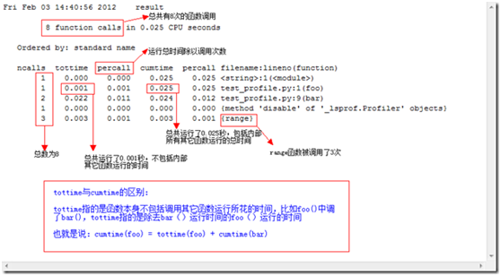

| 序号 | 修改时间  | 修改内容           | 修改人 | 审稿人 |
| ---- | --------- | ------------------ | ------ | ------ |
| 1    | 2017-9-17 | 创建               | 吴启福 | 吴启福 |
| 2    | 2018-3-12 | 更新调整目录结构。 | 同上   |        |
|      |           |                    |        |        |


---

# 目录

[目录. 1](#_Toc524042384)

[1       性能优化概述. 3](#_Toc524042385)

[1.1         性能分析方法. 3](#_Toc524042386)

[1.2         性能分析方法论. 3](#_Toc524042387)

[1.3         性能分析指标. 4](#_Toc524042388)

[1.4         性能分析文件. 4](#_Toc524042389)

[1.5         常见性能工具. 4](#_Toc524042390)

[1.5.1   kcachegrind/qcachegrind 5](#_Toc524042391)

[1.6         本章参考. 5](#_Toc524042392)

[2       并行和并发. 5](#_Toc524042393)

[2.1         并发处理. 6](#_Toc524042394)

[2.2         并行算法. 6](#_Toc524042395)

[2.3     OS内部的同步和通信机制. 6](#_Toc524042396)

[2.3.1   进程间通信 IPC 6](#_Toc524042397)

[2.3.2   线程间通信. 8](#_Toc524042398)

[2.3.3   同步和通信FAQ 11](#_Toc524042399)

[2.4         本章参考. 12](#_Toc524042400)

[3       编程语言的特性优化. 12](#_Toc524042401)

[3.1     python 12](#_Toc524042402)

[3.1.1   python常规优化项. 13](#_Toc524042403)

[3.1.2   time/timeit 14](#_Toc524042404)

[3.1.3   cProfile/pstats/profile 14](#_Toc524042405)

[3.1.4   可视化pyprof2calltree/runsnakerun 16](#_Toc524042406)

[3.1.5   其它优化项. 16](#_Toc524042407)

[3.1.6   本节参考. 17](#_Toc524042408)

[3.2     C/C++ 17](#_Toc524042409)

[3.2.1   gprof 17](#_Toc524042410)

[3.2.2   本节参考. 17](#_Toc524042411)

[3.3     Java 17](#_Toc524042412)

[3.3.1   本节参考. 18](#_Toc524042413)

[3.4         本章参考. 19](#_Toc524042414)

[4       解释器优化JIT 19](#_Toc524042415)

[5       DB优化. 19](#_Toc524042416)

[6       参考资料. 19](#_Toc524042417)

 


---


# 1  性能优化概述

## 1.1  性能分析方法

性能是各种质量模型中不可或缺的质量属性。

用 场景 - 战略 - 战术的方法来分析性能。

 性能战术目标：对在一定时间限制内到达系统的事件生成一个响应．

 

## 1.2  性能分析方法论

性能分析软件有两类方法论：基于事件的性能分析和统计式性能分析。

表格 1 性能分析方法论

| 方法论   | Event-based                                                  | Statistical Profile                                          |
| -------- | ------------------------------------------------------------ | ------------------------------------------------------------ |
| 支持语言 | Java的JVMT1;    .NET事件跟踪                                 |                                                              |
| 概述     | 也称轨迹性能分析器。是通过收集程序执行过程中的具体事件进行工作的。 | 以固定的时间间隔对程序计数器进行抽样统计，它的结果是对真实值的统计近似。 |
| 优点     | 分析较为全面。                                               | 分析数据更少，对性能造成的影响更小                           |
| 缺点     | 通常监听事件较多，产生的数据量比较大。对性能造成的影响较大。 |                                                              |
| python   | cProfile、pstats                                             | statprof、lsprof、   line_profile、kernprof                  |
| java     |                                                              |                                                              |
| c++      | gprof kprof                                                  |                                                              |

备注：1.  各种性能分析工具生成的统计报告prof有类似的格式，可用dot等工具将报告可视化。一般需要安装graphviz和gprof2dot。

**下载**  

- graphviz  http://www.graphviz.org/Download_windows.php 

- gprof2dot http://www.51testing.com/?uid-13997-action-viewspace-itemid-79952

2. 内存分析工具：C++使用valgrind，kcachegrind适用于C/C++/python，Runsnakerun针对python。

 

## 1.3  性能分析指标
* 运行时间
* 内存消耗

 

## 1.4  性能分析文件

python可用cProfile生成，示例如下：

```sh
# 生成性能分析文件，本例保存文件名为del.prof
$ python -m cProfile -o del.prof del.py

# 性能分析文件可转化点阵图，并转化成图片
$ gprof2dot -f pstats [xxx.prof] | dot -Tpng -o [xxx.png] 
```


## 1.5  常见性能工具

**linux环境常用工具：top free uptime netstat iostat df  ps  pstree** 
*  top：监控系统资源综合情况 
*  查看cpu： cat /proc/cpuinfo 
*  查看内存：free 或 cat /proc/meminfo 
*  查看负载：uptime 或 cat /proc/loadavg 
*  查看网络连接：netstat 
*  查看设备IO ：iostat 

 

**编程语言专用工具** 

* Python工具：cprofile pstats line_prof… 

* Java工具: jps jstat Jprofiler [VisualVM](http://developer.51cto.com/art/201203/326397.htm)… 

* c/c++: gprof  valgrind 

 

**可视化工具** 

各种性能分析工具生成的统计报告prof有类似的格式，可将prof格式先转化 dot格式，再用dot转化成图片，将报告可视化。一般需要安装graphviz和gprof2dot。 

​    其它工具还有kcachegrind/qcachegrind/pyprof2calltree

 

**性能测试工具** 

WEB：curl siege ab 

 

**工具下载**

*  qcachegrind  https://sourceforge.net/projects/qcachegrind-fixed-source 

 

### 1.5.1  kcachegrind/qcachegrind

支持语言：C/C/++/PYTHON

安装：可直接用pip安装pyprof2calltree

简介：可直接处理性能分析文件如gprof生成的，生成图形化报告。

 qcachegrind目录内含dot命令

```sh
$ pyprof2calltree -i [*.prof] -k  
# 或者
$ pyprof2calltree -i [*.prof] -o [] 
```


## 1.6  本章参考

 

# 2  并行和并发

**并发和并行**
* 并发Concurrent：指两个或多个事件在同一时间间隔内发生，事件可*交互*处理。
* 并行Parallel：并行是指两个或者多个事件在同一时刻发生，事件可*同时*处理。

备注：并行程序需要多核CPU支持。并发程序常发生在单核CPU的进程/线程间同步。

 

**并行架构：**
* SMP -> MPP，
* 位级 -> 指令级 --> 数据级 --> 任务级

 

表格 2 常见的并发和并行模型

| 模型            | 特点                                                  | 应用场景                               |
| --------------- | ----------------------------------------------------- | -------------------------------------- |
| 线程与锁        | 并发模型的基础                                        |                                        |
| 函数式编程      | 可以函数内同步，消除可变状态                          |                                        |
| Clojure         | 分离标识与状态，Clojure介于指令式编程和函数式编程之间 |                                        |
| actor           | 适用性很广。侧重于通道两端的实体。                    | 共享内存或分布式内存，可解决地理分布型 |
| 通信顺序进程CSP | Communication Sequential Process,侧重于传递消息的通道 |                                        |
| 数据级并行      | GPU、OpenGL                                           |                                        |
| Lamda架构       | 综合批处理和流式处理。                                | 大数据问题。                           |
| 网格计算        | Gird，一种松耦合地建立分布式集群的方法。              | 异构且地理分布的                       |
| Fork/Join       |                                                       | 分治算法                               |
| 反应式编程      | Reactive Programming.                                 |                                        |
| 元组空间        | 分布式联想记忆，可用于实现进程间通信。                |                                        |

 

## 2.1  并发处理

###  悲观锁和乐观锁

**悲观锁**：总是假设最坏的情况，每次去拿数据的时候都认为别人会修改，所以每次在拿数据的时候都会上锁，这样别人想拿这个数据就会阻塞直到它拿到锁（共享资源每次只给一个线程使用，其它线程阻塞，用完后再把资源转让给其它线程）。

示例：传统的关系型数据库里边就用到了很多这种锁机制，比如行锁，表锁等，读锁，写锁等，都是在做操作之前先上锁（开了事务操作就是悲观锁）。Java中synchronized和ReentrantLock等独占锁就是悲观锁思想的实现。


**乐观锁**：总是假设最好的情况，每次去拿数据的时候都认为别人不会修改，所以不会上锁，但是在更新的时候会判断一下在此期间别人有没有去更新这个数据，可以使用版本号机制和CAS算法实现。

示例：乐观锁适用于多读的应用类型，这样可以提高吞吐量，像数据库提供的类似于write_condition机制，其实都是提供的乐观锁。在Java中java.util.concurrent.atomic包下面的原子变量类就是使用了乐观锁的一种实现方式CAS实现的。

1. 版本号机制：版本号可以是数值也可以是timestamp。比如数据库超卖情形，

   先查询-获取商品ID当前的库存和版本。当版本一致，库存数据>0时，可以扣减库存并修改版本（version递增或者version等于update_timestamp）。

2. CAS, **compare and swap（比较与交换）**，是一种有名的**无锁算法**。无锁编程，即不使用锁的情况下实现多线程之间的变量同步，也就是在没有线程被阻塞的情况下实现变量的同步，所以也叫非阻塞同步（Non-blocking Synchronization）。

**简单的来说CAS适用于写比较少的情况下（多读场景，冲突一般较少），synchronized适用于写比较多的情况下（多写场景，冲突一般较多）**


### 线程和锁

使用类型：排他锁、读写锁是悲观锁，共享锁是乐观锁。

表格 3 锁的类型

| 锁类型     | 功能           | 应用场景 |
| ---------- | -------------- | -------- |
| 原子自旋锁 | 内核粒度的锁。 |          |
| 排他锁     |                | 只写     |
| 共享只读锁 |                |          |
| 读写锁     |                |          |

 

### 多进程和锁

进程锁主要通过 文件锁形式来实现。比如fork多进程的日志并发写问题。


### 分布式锁

详见 《分布式架构》分布式锁章节


分布式锁实现方式：

*  Redis实现：`SET NX EX`原子操作，当KEY不存在时，SET NX返回成功，并且设置这个KEY的过期时间；当KEY已存在，SET NX返回失败。
*  ZK实现：zookeeper实现了paxos一致性协议；ZK临时节点支持客户端断连后自动删除；ZK支持WATCHER机制。


## 2.2  并行算法 

 可参照 《[大数据计算框架](../大数据与AI/bigdata/大数据计算框架.md)》


## 2.3  OS内部的同步和通信机制

**同步和通信**
* 同步：在并发程序设计中，各进程对公共变量的访问必须加以制约，这种制约称为同步。进程间的同步是通过同步机制实现的。典型如PV操作和管道。
* 通信：一般线程间的同步称为通信。

### 2.3.1  进程间通信 IPC

IPC（Inter-Process Communication，进程间通信）。

每个进程有自己独立的用户空间，一般而言不能互相访问；但内核空间是各个进程共享的，所以进程间通信必须通过内核进行。进程间通信一般发生了用户态和内核态间的数据交互。

除此以外，那就是双方都可以访问的外设（如数据库、文件）。在这个意义上，两个进程当然也可以通过磁盘上的普通文件交换信息，或者通过“注册表”或其它数据库中的某些表项和记录交换信息。广义上这也是进程间通信的手段，但是一般都不把这算作“进程间通信”。因为那些通信手段的效率太低了，而人们对进程间通信的要求是要有一定的实时性。


**WINDOWS进程间通信**

表格 4 WINDOWS提供的进程间通信方式

| 机制                    | 简介                                                         | 备注                          |
| ----------------------- | ------------------------------------------------------------ | ----------------------------- |
| 剪贴板Clipboard         | CWnd类中提供了支持。                                         | 16位系统常用                  |
| COM/DCOM                | 通过COM系统的代理存根方式进行进程间数据交换，但只能够表现在对接口函数的调用时传送数据，通过DCOM可以在不同主机间传送数据。 |                               |
| DDE                     | Dynamic Data Exchange 动态数据交换。                         | 16位系统常用                  |
| File Mapping   文件映射 | 可用来共享内存                                               | 32位系统新增                  |
| Mailslots   邮件槽      | 可在不同主机间交换数据，分为服务器方和客户方，双方可以通过其进行数据交换，在Win9X下只支持邮件槽客户。 | 32位系统新增                  |
| Pipes管道               | 无名/匿名管道：在父子进程间交换数据。   <br>有名管道：可在不同主机间交换数据，分为服务器方和客户方。 | 在Win9X下只支持有名管道客户。 |
| RPC   远程过程调用      | 很少使用，原因有两个：复杂而且与UNIX系统的RCP并不完全兼容。但COM/DCOM的调用是建立在RPC的基础上的。 |                               |
| Sockets   网络套接口    | 可在不同主机间交换数据，分为服务器方和客户方。               | 通用                          |
| WM_COPYDATA             | 通过发送WM_COPYDATA消息并将数据放在参数中来传递数据给其他进程。 |                               |

 备注：管道、剪贴板都是WINDOWS从UNIX迁移过来的IPC方式。


**UNIX进程间通信**

进程间通信主要包括管道、系统IPC(包括消息队列、信号量、共享存储)、 SOCKET。

管道包括三种：

1)  普通管道PIPE：用完即销毁。通常有种限制，一是半双工，只能单向传输；二是只能在父子进程间使用。如shell中的 | 符号。

2)  流管道s_pipe：去除了第一种限制，可以双向传输。

3)  命名管道name_pipe：去除了第二种限制，可以在许多并不相关的进程之间进行通讯。

系统IPC的三种方式类同，都是使用了内核里的标识符来识别。

表格  UNIX进程间通信常用方式详解

| IPC方式       | 原理                                                         | 优点                   | 缺点                         | 示例               |
| ------------- | ------------------------------------------------------------ | ---------------------- | ---------------------------- | ------------------ |
| 无名/命名PIPE | 类似文件描述符，有读、写二个描述符。`int pipe(int fd[2])`，UNIX中管道通过空文件来实现。<br>数据缓存在内核，遵照先进先出原则。管道生命周期在进程内。 | 实现简单               | 通信效率低，不适合频率通信。 | shell中的\|, popen |
| 流管道s_pipe  | 可以双向传输                                                 | 同上                   | 同上                         |                    |
| 消息队列      | 保存在内存的消息链表。通信不及时，有大小限制。<br>内核定义`MSGMAX` 和 `MSGMNB`，分别是队列消息体最大长度和队列的最大长度。 |                        | 不适合大数据传输             |                    |
| 共享内存      | 各进程用一块虚拟内存空间映射到同一块物理内存空间。存在多进程写冲突导致的数据覆盖问题。 | 减少内核态和用户态交互 | 不适合进程写数据。           | 粘贴板             |
| 信号量        | 解决共享内存的写冲突而来的保护机制，使得共享内存在任意时刻只被一个进程访问。<br>实际上是一个整型计数器，实现机制是二种原子操作P和V。<br>主要用于实现进程间的同步和互斥， 而不是用于缓存进程间通信数据。 | 进程间的保护机制       | 不缓存进程间通信数据         |                    |
| 信号          | 异常情况下的工作模式，用信号通知进程。<br>进程间通信的唯一异步通信机制。 | 异常时工作模式         |                              | kill命令使用信号   |
| socket        | 以上都属于同一台主机的IPC。跨主机的IPC使用SOCKET。           | 跨主机通信             |                              |                    |


表格 5 UNIX进程间通信类型效率比较

| 类型             | 无连接 | 可靠 | 流控制 | 数据格式   | 消息类型优先级 |
| ---------------- | ------ | ---- | ------ | ---------- | -------------- |
| 普通PIPE         | N      | Y    | Y      | 字节流     | N              |
| 流PIPE           | N      | Y    | Y      | 字节流     | N              |
| 命名PIPE(FIFO)   | N      | Y    | Y      | 字节流     | N              |
| 消息队列         | N      | Y    | Y      | 有         | Y              |
| 信号量           | N      | Y    | Y      | 整型计数器 | Y              |
| 共享存储         | N      | Y    | Y      | 有         | Y              |
| UNIX流SOCKET     | N      | Y    | Y      | 有         | N              |
| UNIX数据包SOCKET | **Y**  | Y    | N      | 有         | N              |

备注：
* 无连接：指无需调用某种形式的OPEN，就有发送消息的能力
* 流控制：如果系统资源短缺或者不能接收更多消息，则发送进程能进行流量控制

 

### 2.3.2  线程间通信 

#### 2.3.2.1  WINDOWS线程同步机制

表格 6 WINDOWS线程同步机制比较

|                            | 适用范围                                    | 特性                                                         | 函数                                                   |
| -------------------------- | ------------------------------------------- | ------------------------------------------------------------ | ------------------------------------------------------ |
| 临界区   CRITICAL_SECTION  | 单一进程的各线程之间用来排它性占有          | 局部性对象; 快速而有效. 无法监测是否被线程放弃               | EnterCriticalSection LeaveCriticalSection              |
| Mutex                      | 不同线程之间用来排它性占有                  | 核心对象, 可以使用wait进行等待,只能被拥有线程所释放          | CreateMutex ReleaseMutex                               |
| 信号量    semaphore        | 用来限制资源占用                            | 核心对象,没有拥有者,任何线程都可释放                         | CreateSemaphore OpenSemaphore   ReleaseSemaphore       |
| Event                      | 同来控制对象信号的接收,常与信号系统结合起来 | 核心对象                                                     | CreateEvent OpenEvent PulseEvent SetEvent   ResetEvent |
| Interlocked                | 简单的原子操作                              | 如写文件中对文件中字节范围的锁定_locking                     |                                                        |
| 完全端口   completion port | 网络异步接收,包括文件读写                   | 由OS来控制读写, 是windows平台最有效的同步机制,相当于linux的AIO或者非阻塞socket+epoll | CreateIoCompletionPort   GetQueuedCompletionStatus     |
|                            |                                             |                                                              |                                                        |

NOTE: 1. 线程之间的同步使用一些核心对象：如thread, process, evnet, mutex, semaphore.
2. 线程同步中很重要的可归纳为锁系统lock和信号系统signal~等待函数
* lock包括: CRITICAL_SECTION, Mutex,
* wait function: WaitForMultipleObjects, WaitForSingleObject, Sleep

等待函数使用核心对象的handle作为参数，如果handle被激发，则执行下一步。

handle被激发的条件： (handle是一段内存指针，为了掩藏内部实现而作的一个类型转化指针）

激发：－－－我的理解是资源未被战胜。

未激发： －－－资源正在被占用。

eg：

1) thread, process被终止，则激发。

2) event: 要通过它的API来手动激发，是最灵活的激发方式，可被所有线程使用。

3) mutex: 没被任何线程所拥有，则激发。


**示例1:  event**
```c
//事件机制: 设置一个全局event对象,这个只能等待最多64个对象,而且要用WaitForMultipleObjects来监视线程handle数组. 不如完全端口completion port
HANDLE ghWriteEvent; 
HANDLE ghThreads[THREADCOUNT];
//(1)创建个手动事件,一开始不接受任何信号no signel
// ResetEvent: 用来信号重置,同CreateEvent or OpenEvent 
ghWriteEvent = CreateEvent( 
   NULL,               // default security attributes
   TRUE,               // manual-reset event
   FALSE,              // initial state is nonsignaled
   TEXT("WriteEvent")  // object name
   ); 
//(2)产生一堆线程,设置事件响应信号signal, 
if (! SetEvent(ghWriteEvent) ) 
{
   printf("SetEvent failed (%d)\n", GetLastError());
   return;
}
//(3)设置线程等待事件,所有线程都接到这个事件,,这里对线程进行了同步,只有所有线程都执行了,才执行下一步
dwWaitResult = WaitForMultipleObjects(
   THREADCOUNT,   // number of handles in array
   ghThreads,     // array of thread handles
   TRUE,          // wait until all are signaled
   INFINITE);
{
//(3.1)其中每个线程函数都在等待事件对象,这里也对线程进行了同步,只有得到signal的线程才执行下一步
dwWaitResult = WaitForSingleObject( 
     ghWriteEvent, // event handle
     INFINITE);    // indefinite wait
}
//(4)关闭了这个全局事件
CloseHandle(ghWriteEvent)
CloseEvents();
```


**示例2: completion port**

 (1) 创建完成端口, 与一个监听socket发生关联 CreateIoCompletionPort

 (2) 产生一堆线程,让线程在完全端口循环等待. CreateThread--(WorkerThread)--GetQueuedCompletionStatus

 (3) 接收监听socket的读写请求accept,将accept socket与完全端口关联,....?

 

### 2.3.3 各语言的同步机制实现方法

|              | 概述                                                         | 进程间通信IPC                     | 线程间通信                                                   |
| ------------ | ------------------------------------------------------------ | --------------------------------- | ------------------------------------------------------------ |
| 通用同步机制 | 锁（文件锁/线程锁/互斥锁/读写锁）、系统IPC(包括消息队列、信号量、共享存储) | socket、pipe                      |                                                              |
| C++          |                                                              |                                   |                                                              |
| Python       | 进程安全队列Queue、管道、信号、共享内存pepple                | from multiprocessing import Queue | thread 或者   threading                                      |
| Java         | java的每个对象都有一个内置锁，使用synchronized关键字可激活内置锁，可用来修饰方法、代码块进行同步。   public synchronized   void save(){}   synchronized(object){  } |                                   | 多线程：继承Thread类，实现run方法；实现Runnable接口，实现run方法。<br> `new Thread(new   Runnable()   {    public   synchronized void run() { }   } `  **volatile特殊域变量** |
| Ruby         |                                                              |                                   |                                                              |
| NodeJS       |                                                              |                                   |                                                              |

备注：1. Java同步机制：主要有四种分别是原子操作、violation、Synchronized、lock。
* 原子操作：原子为不可再分操作。只有对象的读取和赋值是原子操作。int i=10 是原子操作。int x = y；不是原子操作
* violation：可见关键字，用于线程间同步。
* Synchronized：内部隐示锁，可用来同步方法和代码块。
* lock： ReentrantLock(显示锁) + ReentrantReadWriteLock(读写锁)

2. Python池化

   ```python
   from multiprocessing import Pool  # 进程池
   from multiprocessing.dummy importPool as ThreadPool  # 线程池
   ```

   

**关于Lock对象和synchronized关键字的选择：** 

a. 最好两个都不用，使用一种java.util.concurrent包提供的机制， 能够帮助用户处理所有与锁相关的代码。 

b. 如果synchronized关键字能满足用户的需求，就用synchronized，因为它能简化代码 

c. 如果需要更高级的功能，就用ReentrantLock类，此时要注意及时释放锁，否则会出现死锁，通常在finally代码释放锁 。

 

### 2.3.4  同步和通信FAQ

**FAQ1：管道与文件描述符，文件指针的关系?**

答：其实管道的使用方法与文件类似，都能使用read，write，open等普通IO函数. 管道描述符来类似于文件描述符。事实上，管道使用的描述符， 文件指针和文件描述符最终都会转化成系统中SOCKET描述符. 都受到系统内核中SOCKET描述符的限制。本质上LINUX内核源码中管道是通过空文件来实现.

 

**FAQ2：管道的使用方法?**

答：主要有下面几种方法：

1). pipe， 创建一个管道，返回2个管道描述符.通常用于父子进程之间通讯. 

2). popen， pclose：这种方式只返回一个管道描述符，常用于通信另一方是stdin or stdout; 

3). mkpipe：命名管道， 在许多进程之间进行交互.

 

**FAQ3：管道与系统IPC之间的优劣比较?**

答：管道：优点是所有的UNIX实现都支持， 并且在最后一个访问管道的进程终止后，管道就被完全删除；缺陷是管道只允许单向传输或者用于父子进程之间.

​    系统IPC：优点是功能强大，能在毫不相关进程之间进行通讯。缺陷是关键字KEY_T使用了内核标识，占用了内核资源，而且只能被显式删除，而且不能使用SOCKET的一些机制，例如select，epoll等.

 

**FAQ4：WINDOS进程间通信与LINUX进程间通信的关系?**

答：事实上，WINDOS的进程通信大部分移植于UNIX。 WINDOS的剪贴板，文件映射等都可从UNIX进程通信的共享存储中找到影子. 

 

**FAQ5：进程间通信与线程间通信之间的关系? **

答：因为WINDOWS运行的实体是线程， 狭义上的进程间通信其实是指分属于不同进程的线程之间的通讯.而单个进程之间的线程同步问题可归并为一种特殊的进程通信.它要用到内核支持的系统调用来保持线程之间同步. 通常用到的一些线程同步方法包括：Event， Mutex， 信号量Semaphore， 临界区资源等.


## 2.4     本章参考

参考图书

* 《七周七并发模型》
* 《UNIX环境高级编程》

参考文章

[1]: https://docs.microsoft.com/zh-cn/windows/win32/sync/synchronization-functions?redirectedfrom=MSDN  "windows同步函数"
[2]:  http://www.yuanma.org/data/2006/1213/article_1945.htm   "进程间通信的11种办法"
[3]: LINUX环境间进程通信---无名管道工作机制研究

[4]: https://blog.csdn.net/WantFlyDaCheng/article/details/108162473  “进程间通信”


# 3  编程语言的特性优化

## 3.1  python

Python程序是通过解释器执行的，解释器的输入是原有程序的字节码编译版本。这个字节码编译版本可以在程序执行时动态地生成，也可以在程序打包的时候就生成。


表格 7 python性能优化工具列表

| 工具                              | 说明                                                         | 示例                                                         |
| --------------------------------- | ------------------------------------------------------------ | ------------------------------------------------------------ |
| time.clock()<br>time.perf_count() | 获取真实秒数 real seconds <BR>python3.8+ clock移除，用perf_count替代 | time.clock()                                                 |
| time.time()                       | 获取CPU秒数 cpu seconds                                      | time.time()                                                  |
| timeit                            | 获取代码的执行时间                                           | >>> from timeit import   timeit   >>> timeit('math.sqrt(2)',   'import math')   0.30733676198524246 |
| sys.getsizeof                     | 获取对象的内存占用情况                                       | >>> sys.getsizeof(1)   12   >>> sys.getsizeof('hello world')   34 |
| sys.setprofile                    | 跟踪python或C的事件call/return/exception                     |                                                              |
|                                   |                                                              |                                                              |
| profile                           | 纯python模块，Class   for profiling Python code.             |                                                              |
| cProfile                          | C扩展实现的运行时分析器，基于lsprof，效率较高。   Python interface for the 'lsprof'   profiler.Compatible with the 'profile' module. | $ python -m cProfile -s calls slow.py -o   []                |
| pstats                            | 读取和操作cProfile生成结果按照指定字段排序。   Class for printing reports on profiled   python code. | $ python -m pstats [.py]                                     |
| line_profile                      | 可行分析。                                                   |                                                              |
|                                   |                                                              |                                                              |
| hotshot                           | 纯C模块，基本废弃。                                          |                                                              |
| dis                               | 反汇编                                                       |                                                              |

说明：1. cProfile基于lsprof，与profile模块兼容。kernprof/pstats工具可用来分析上述模块生成的文件，输出排序或需要字段的性能报告。

2. getsizeof可以用以分析python对象的内存占用情况（以字节为单位）。对于列表、元组和字典等容器，得到的是容器对象本身的大小，而不是容器中包含所有对象的累积。

3. 调优策略：理解程序：理解算法，使用内置类型。减少使用.操作符访问。减少使用类层次。

 

### 3.1.1  python常规优化项

1. 改进算法：用dict和set查询，远比list快多了。

2. **列表生成表达式和生成器**

示例：生成10000个1~100的偶数

法1：列表生成表达式

`even_list = [ x for range(10000) if x%2 == 0]`

法2：for循环

```python
even_list = []
for x in xrange(10000):
  if x % 2 == 0:
	even_list.append(x)
```

法3：生成器

使用xrange代替range，使用for遍历生成器对象。

说明：列表生成表达式效率要远高于for循环，生成器也减少了调用次数。
* 列表表达式 []
* 字典表达式 例：K/V互换 {v:k for k,v in xxx_dic.items()} 
* 集合表达式 类似列表表达式，只是[]替换成{}

 

3.  if表达式：if A and B，A为False时不再执行B

4. 字符串：使用join比+会更好些(非绝对)。

5. ctypes：调用C语言so或者直接调用C标准库

```python
# 示例：获取100内的随机数，调用C标准库rand()
from ctypes import cdll
libc=cdll.LoadLibrary('libc.so.6'  # linux
libc=msvcrt  # windows
rands = (libc.rand() % 100)
```

6. while 1比while true好。

7. x>y>z 级联比 x>y and y>z要好。


### 3.1.2  time/timeit

**time**

代码：

```python
time.time()   # real time，返回公元元年到现在的秒数
time.clock()  # cpu time
```

命令行

$ time [cmd]

 

开发者可以使用[profile](http://docs.python.org/3.3/library/profile.html)以及[timit](http://docs.python.org/3.3/library/timeit.html)模块来测试程序的速度，找出程序中到底是哪里很慢，进而对这部分代码独立出来进行调优的工作。

 

**timeit**

Tool for measuring execution time of small code snippets.

Command line usage:

   python timeit.py [-n N] [-r N] [-s S] [-t] [-c] [-h] [--] [statement]

 

### 3.1.3  cProfile/pstats/profile

**cProfile**

1) 代码中调用：可指定性能分析文件输出名称
```python
pc = cProfile.Profile()
cProfile.run('stat', 'del.prof' )
```

2) 命令行调用，cProfile+pstats，
```shell
# 生成性能分析文件，本例保存文件名为del.prof
$ python -m cProfile -o del. prof del.py
# 调用命令分析统计文件生成格式化报告
$ python -c "import pstats; p=pstats.Stats('del.prof).sort_stats('cumtime').print_stats()"
```


表格 8 cProfile输出字段含义表

| ncalls                    | 函数的被调用次数                               |
| ------------------------- | ---------------------------------------------- |
| tottime                   | 函数总计运行时间，除去函数中调用的函数运行时间 |
| percall                   | 函数运行一次的平均时间，等于tottime/ncalls     |
| cumtime                   | 函数总计运行时间，含调用的函数运行时间         |
| percall                   | 函数运行一次的平均时间，等于cumtime/ncalls     |
| filename:lineno(function) | 函数所在的文件名，函数的行号，函数名           |

备注：cumtime > totime。

 

​                                                  

图 1 cProfile输出截图

 

**pstats的类Stats**

可以通过profile的另一个类Stats来解决多格式输出的问题。

| strip_dirs()                   | 用以除去文件名前名的路径信息。          |
| ------------------------------ | --------------------------------------- |
| add(filename,[…])              | 把profile的输出文件加入Stats实例中统计  |
| dump_stats(filename)           | 把Stats的统计结果保存到文件             |
| sort_stats(key,[…])            | 最重要的一个函数，用以排序profile的输出 |
| reverse_order()                | 把Stats实例里的数据反序重排             |
| print_stats([restriction,…])   | 把Stats报表输出到stdout                 |
| print_callers([restriction,…]) | 输出调用了指定的函数的函数的相关信息    |
| print_callees([restriction,…]) | 输出指定的函数调用过的函数的相关信息    |

备注：最重要的函数就是sort_stats和print_stats。sort_stats的参数排序项name/ncalls/totime/cumtime可用数值-1/0/1/2代替。

 

### 3.1.4  可视化pyprof2calltree/runsnakerun

**安装**

```shell
$ pip install -U wxPython
$ pip install pyprof2calltree
$ pip install runsnakerun squaremap
```

说明：pyprof2calltree与kcachegrind配合使用。runsnake需要wxPython支持。

 **使用**

```shell
$ pyprof2calltree -i [*.prof] -k
$ runsnake [*.prof]

# gprof2dot可视化输出，需安装 graphviz和gprof2dot
$ gprof2dot -f pstats [xxx.prof] | dot -Tpng -o [xxx.png]
```


### 3.1.5  其它优化项

[compileall](http://docs.python.org/3.3/library/compileall.html)模块可以处理程序打包的事宜，它暴露出了打包相关的接口，该接口能够被安装程序和打包工具用来生成包含模块字节码的文件。同时，在开发环境中，compileall模块也可以用来验证源文件是否包含了语法错误。

在源代码级别，[pyclbr](http://docs.python.org/3.3/library/pyclbr.html)模块提供了一个类查看器，方便文本编辑器或是其他程序对Python程序中有意思的字符进行扫描，比如函数或者是类。在提供了类查看器以后，就无需引入代码，这样就避免了潜在的副作用影响。

文件查找没有使用Python标准库os的walk函数，当文件数量较多时，walk函数的效率会比较低。有兴趣的可以看下一个叫[betterwalk](https://github.com/benhoyt/betterwalk)的第三方库，据称比os.walk快不少。实际项目中，因为待索引文件的目录结构固定且很有规律，直接用os.listdir和os.lstat即可解决，os.lstat可以获取文件的最后修改日期，在建立增量索引的时候非常有用。

html文件的解析使用了口碑很给力的lxml库，用lxml解析html文件时通常有多种方法，使用之前最好仔细看一下lxml各个函数的[benchmark](http://lxml.de/performance.html)，了解一下哪种方法更快一些，比如使用xpath查找html节点时，lxml的XPath类比xpath()函数要快好几倍。

 

### 3.1.6  本节参考

[1].   Python优化第一步: 性能分析实践https://zhuanlan.zhihu.com/p/24495603

[2].   python用profile、hotshot、timeit协助程序性能优化 http://blog.csdn.net/tantexian/article/details/40856071

[3].   关于Python Profilers性能分析器http://www.cnblogs.com/btchenguang/archive/2012/02/03/2337112.html 

[4].   Python性能优化指南 http://blog.csdn.net/zhoudaxia/article/details/23853609

 

## 3.2  C/C++

### 3.2.1  gprof

```shell
$ g++ -pg -g  -o test test.cc
$./test   //会生成gmon.out
$ gprof ./test > prof.log

# gprof2dot生成点阵文件，dot将文件转化成图片
$ gprof2dot -f pstats [xxx.prof] | dot -Tpng -o [xxx.png]
```


### 本节参考

[1].   linux环境下 C++性能测试工具 gprof + kprof + gprof2dot http://www.cnblogs.com/rocketfan/archive/2009/11/15/1603465.html 

 

## 3.3     Java

表格 Java的性能优化工具

| 工具                                                         | 简介                                                         | 优点                                                         | 缺点 |
| ------------------------------------------------------------ | ------------------------------------------------------------ | ------------------------------------------------------------ | ---- |
| [Spring   Insight](http://developer.51cto.com/art/201005/202725.htm) |                                                              | 无缝集成Google Speed Tracer                                  |      |
| [JProbe](http://developer.51cto.com/art/201203/326454.htm)   |                                                              |                                                              |      |
| [YourKit](http://developer.51cto.com/art/201203/326454.htm)  | 业界领先的Java剖析工具。                                     |                                                              |      |
| [JProfiler](http://developer.51cto.com/art/201203/326402.htm) | JProfiler由ej-technologies   GmbH开发的商业授权的Java性能分析工具，主要为Java   EE和Java SE应用所设计。 | JProfiler集CPU、内存和线程性能分析于一体，可以用于分析性能瓶颈、内存泄漏、CPU负载和解决线程相关的问题，并且支持本地性能分析（分析与JProfiler软件安装在同一台机的应用）和远程性能分析（它可以分析远程没有安装JProfiler机器上的应用） |      |
| [VisualVM](http://developer.51cto.com/art/201203/326397.htm) | NetBeans平台派生的工具，遵循模块化的架构思想。               | Visual VM允许你获取Java程序的详细信息，只要它在一个Java虚拟机（JVM）上运行即可。生成的数据可以由JDK工具生成和读取，多个Java程序的所有数据和信息都可以很方便地进行查看，包括本地和远程的运行程序。Visual VM可以进行CPU性能分析、内存性能分析，进行GC、保存快照等。 |      |
| [GC Viewer](http://www.tagtraum.com/gcviewer.html)           | 开源工具，由Tagtraum Industries Incorporated开发。可以对vmflags -verboase:gc和-Xloggc:等Java VM选项产生的数据进行可视化分析。 | GC Viewer可以用于计算GC（垃圾回收）相关的性能数据记录，包括吞吐、累积暂停、最长时间的暂停等等。当你想要通过改变生成大小和设置初始堆大小来调整某个特定应用的GC时，它尤其有用。 |      |
| [Eclipse内存分析器(Eclipse Memory   Analyzer)](http://www.eclipse.org/mat/) | 可以帮助你找到内存泄漏和减少内存损耗的Java堆分析器。它更适合作为一个分析Java堆栈和计算大小的工具集，也可以用于监测内存泄漏和反模式带来的内存损耗。 |                                                              |      |

 

### 本节参考

[1].   [Java几款性能分析工具的对](http://developer.51cto.com/art/201203/326355.htm)比 http://developer.51cto.com/art/201204/327130.htm 

[2].     九大工具助你玩转Java性能优化http://www.importnew.com/12324.html 


## 3.4  本章参考

 

# 4  解释器优化JIT

 JIT[编译器](https://baike.baidu.com/item/编译器)，英文写作Just-In-Time Compiler，中文意思是即时编译器。JIT是一种提高程序运行效率的方法。
通常，程序有两种运行方式：静态编译与动态解释。静态编译的程序在执行前全部被翻译为机器码，而解释执行的则是一句一句边运行边翻译。
事实上，JIT[编译器](https://baike.baidu.com/item/编译器)分成两种：经济编译器和普通编译器。普通JIT[编译器](https://baike.baidu.com/item/编译器)则是缺省的运行时配置，它会对其产生的代码进行即时优化。JIT编译器可以经过准确调节达到当前运行时状态，结果可以完成一些预编译语言无法完成的工作：更高效地利用和分配CPU寄存器。在适当的情况下实施低级[代码优化](https://baike.baidu.com/item/代码优化)，比如常量重叠、拷贝复制、取消范围检查、取消常规副[表达式](https://baike.baidu.com/item/表达式)以及方法内联等。

## **Android中的JIT**
JIT是在2.2版本提出的，目的是为了提高Android的运行速度，一直存活到4.4版本，因为在4.4之后的ROM中，就不存在Dalvik虚拟机（类似JVM）了。
使用Java开发android，在编译打包APK文件时，会经过以下流程

* Java编译器将应用中所有Java文件编译为class文件

*  dx工具将应用编译输出的类文件转换为Dalvik字节码，即dex文件
   Google在2.2版本添加了JIT编译器，当App运行时，每当遇到一个新类，JIT编译器就会对这个类进行编译，经过编译后的代码，会被优化成相当精简的原生型指令码（即native code），这样在下次执行到相同逻辑的时候，速度就会更快。
   Google在4.4之后推出了ART，用来替换Dalvik。在4.4版本上，两种运行时环境共存，可以相互切换，但是在5.0+，Dalvik虚拟机则被彻底的丢弃，全部采用ART。
   在ART 环境中，应用在第一次安装的时候，字节码就会预先编译成机器码，使其成为真正的本地应用。之后打开App的时候，不需要额外的翻译工作，直接使用本地机器码运行，因此运行速度提高。
   ART与Dalvik相比，还是有缺点的。
   
* ART需要应用程序在安装时，就把程序代码转换成机器语言，所以这会消耗掉更多的存储空间，但消耗掉空间的增幅通常不会超过应用代码包大小的20%

*  由于有了一个转码的过程，所以应用安装时间难免会延长。
   AOT是”Ahead Of Time”的缩写，指的就是ART(Anroid RunTime)这种运行方式。
   

**JIT/ART/Dalvik/AOT四个名词之间的关系**：

* JIT代表运行时编译策略，也可以理解成一种运行时编译器，是为了加快Dalvik虚拟机解释dex速度提出的一种技术方案，来缓存频繁使用的本地机器码

* ART和Dalvik都算是一种Android运行时环境，或者叫做虚拟机，用来解释dex类型文件。但是ART是安装时解释，Dalvik是运行时解释

*  AOT可以理解为一种编译策略，即运行前编译，ART虚拟机的主要特征就是AOT

## **Java中的JIT**
最早的Java建置方案是由一套转译程式（interpreter），将每个Java指令都转译成对等的微处理器指令，并根据转译后的指令先后次序依序执行，由于一个Java指令可能被转译成十几或数十几个对等的微处理器指令，这种模式执行的速度相当缓慢。针对这个问题，业界首先开发出JIT（just in time）编译器。当Java执行runtime环境时，每遇到一个新的类别（class：类别是Java程式中的功能群组），类别是Java程式中的功能群组－JIT编译器在此时就会针对这个类别进行编译（compile）作业。经过编译后的程式，被优化成相当精简的原生型指令码（native code），这种程式的执行速度相当快。
基于对JIT的经验，业界发展出动态[编译器](https://baike.baidu.com/item/编译器)（dynamic [compiler](https://baike.baidu.com/item/compiler)），动态编译器仅针对较常被执行的程式码进行编译，其余部分仍使用转译程式来执行。也就是说，动态编译器会研判是否要编译每个类别。动态编译器拥有两项利器：一是转译器，另一则是JIT，它透过智慧机制针对每个类别进行分析，然后决定使用这两种利器的哪一种来达到最佳化的效果。动态编译器针对程式的特性或者是让程式执行几个循环，再根据结果决定是否编译这段程式码。


## **Pypy Python的JIT实现**

RPython实现的是Python代码的解析器，目前Pypy只实现了Python到C的编译，也就是说编译器的后端实现了直接转成了机器码。
pypy实现JIT的过程：
1.RPython的功能就是实现词法的分析
2.Pypy会根据RPython生成的中间文件，进行后期编译，因为RPython具有的静态类型，实现JIT更简单。

**JIT** **页面渲染**
JIT 页面渲染是 COMSHARP CMS 为了实现网站内容即时更新而开发的页面生成技术，JIT页面渲染引擎直接从数据库获取网站最新内容，瞬间生成页面输出给访问者，并通过 URL 转写技术实现纯静态地址。JIT 页面渲染技术是针对传统 CMS 生成静态 HTML 文件而言。传统 CMS 由于使用脚本代码模板技术，页面生成前，需要将数据库中的页面内容用外部模板进行解析与渲染，导致严重的性能问题，为了解决这个问题，传统 CMS 一般采用生成 HTML 静态文件技术，即，在内容创作完成后，对全站的内容执行一个静态 HTML 文件生成过程，最终，全站内容以静态 HTML 文件的形式存在。静态 HTML 文件技术最显著的优势是性能出众，然而这种技术最严重的问题在于，用户对站点任何修改与更新，必须首先经过一次全站 HTML 文件重新生成过程，然后才能被访问者看到。根据不同 CMS 产品的性能和站点规模，这个 HTML 生成过程可能长到十几分钟到几十分钟或更长。 


## 本章参考

[1]:  [Pypy Python的JIT实现](http://www.cnblogs.com/hitfire/articles/4502199.html)http://www.cnblogs.com/hitfire/articles/4502199.html 
[2]:  JIT编译器 [https://baike.baidu.com/item/JIT%E7%BC%96%E8%AF%91%E5%99%A8/3793585](https://baike.baidu.com/item/JIT编译器/3793585) 

 

# 5  DB优化

DB优化首先要找出性能瓶颈,如应用场景是否合理、索引是否有效。
一般可先查看DB SQL的执行计划。


# 参考资料

