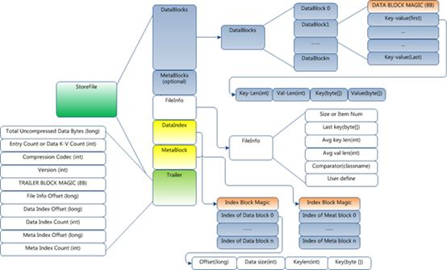
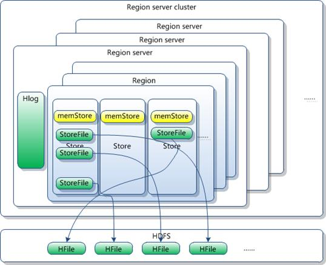
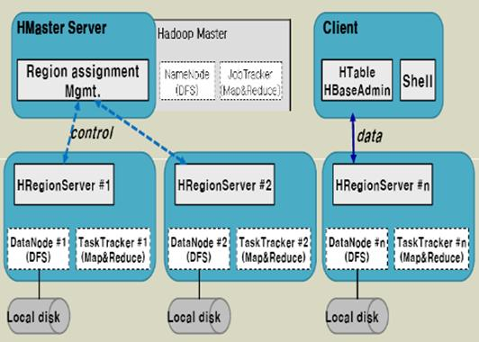
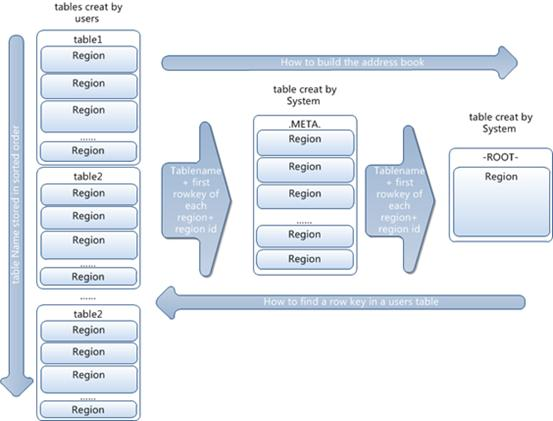

| 序号 | 修改时间  | 修改内容 | 修改人 | 审稿人      |
| ---- | --------- | -------- | ------ | ----------- |
| 1    | 2018-8-10 | 创建     | Keefe  | KeefeKeefe |
|      |           |          |        |             |


---

目录

[1    概述... 2](#_Toc521715011)

[2    Hadoop(HDFS + MR) 2](#_Toc521715012)

[2.1    Hadoop运行过程... 2](#_Toc521715013)

[2.2    Hadoop源码分析... 2](#_Toc521715014)

[2.3    HDFS分布式文件系统... 3](#_Toc521715015)

[2.3.1     HDFS架构... 4](#_Toc521715016)

[2.3.2     运行机制—可靠性保障... 5](#_Toc521715017)

[2.3.3     运行机制—读文件流程... 6](#_Toc521715018)

[2.3.4     运行机制—写文件流程... 6](#_Toc521715019)

[2.4    MapReduce分布式计算... 7](#_Toc521715020)

[程序示例... 9](#_Toc521715021)

[3    HBase分布式数据库... 10](#_Toc521715022)

[3.1    概述... 10](#_Toc521715023)

[3.2    物理存储... 11](#_Toc521715024)

[3.3    关键算法/流程... 15](#_Toc521715025)

[3.4    访问接口... 18](#_Toc521715026)

[3.5    本章参考... 18](#_Toc521715027)

[4    Spark. 19](#_Toc521715028)

[参考资料... 19](#_Toc521715029)


[TOC]


----

# 1  概述


# 2  Hadoop(HDFS + MR)

## 2.1   Hadoop运行过程

1. 基本概念：Hadoop的HDFS文件系统的负责调度运行在 master，DataNode运行在每个机器上。同时Hadoop实现了Google的MapReduce，JobTracker作为 MapReduce的总调度运行在 master，TaskTracker则运行在每个机器上执行Task。

2. main()函数，创建JobConf，定义Mapper，Reducer，Input/OutputFormat 和输入输出文件目录，最后把Job提交給JobTracker，等待Job结束。

3. JobTracker，创建一个InputFormat的实例，调用它的getSplits()方法，把输入目录的文件拆分成FileSplist作为Mapper task 的输入，生成Mapper task加入Queue。

4. 文件拆分成FileSplist作为Mapper task 的输入，生成Mapper task加入Queue。

​    Mapper Task 先从InputFormat创建RecordReader，循环读入FileSplits的内容生成Key与Value，传给Mapper函数，处理完后中间结果写成SequenceFile.

​    Reducer Task 从运行Mapper的TaskTracker的Jetty上使用http 协议获取所需的中间内容（33%），Sort/Merge后（66%），执行Reducer函数，最后按照OutputFormat写入结果目录。

  TaskTracker 每10秒向JobTracker报告一次运行情况，每完成一个Task10秒后，就会向JobTracker索求下一个Task。


## 2.2   Hadoop源码分析

Maven main modules:


hadoop              (Main Hadoop project)

```
 - hadoop-project      (Parent POM for all Hadoop Maven modules.    )
              (All plugins & dependencies versions are defined here.)

 - hadoop-project-dist   (Parent POM for modules that generate distributions.)
 - hadoop-annotations    (Generates the Hadoop doclet used to generated the Javadocs)
 - hadoop-assemblies    (Maven assemblies used by the different modules)
 - hadoop-common-project  (Hadoop Common)
 - hadoop-hdfs-project   (Hadoop HDFS)
 - hadoop-mapreduce-project (Hadoop MapReduce)
 - hadoop-tools       (Hadoop tools like Streaming, Distcp, etc.)
 - hadoop-dist       (Hadoop distribution assembler)
```

备注：2009年7月 ，Hadoop Core项目更名为Hadoop Common; MapReduce 和 Hadoop Distributed File System (HDFS) 成为Hadoop项目的独立子项目。


表格 1 Hadoop包功能简介

| **Package** | **Dependences**                                              |
| ----------- | ------------------------------------------------------------ |
| tool        | 提供一些命令行工具，如DistCp，arcHive                        |
| mapreduce   | Hadoop的Map/Reduce实现                                       |
| filecache   | 提供HDFS文件的本地缓存，用于加快Map/Reduce的数据访问速度     |
| **fs**      | 文件系统的抽象，可以理解为支持多种文件系统实现的统一文件访问接口 |
| **hdfs**    | HDFS，Hadoop的分布式文件系统实现                             |
| **ipc**     | 一个简单的IPC的实现，依赖于io提供的编解码功能  参考：http://zhangyu8374.javaeye.com/blog/86306 |
| **io**      | 表示层。将各种数据编码/解码，方便于在网络上传输              |
| net         | 封装部分网络功能，如DNS，socket                              |
| security    | 用户和用户组信息                                             |
| conf        | 系统的配置参数                                               |
| metrics     | 系统统计数据的收集，属于网管范畴                             |
| util        | 工具类                                                       |
| record      | 根据DDL（数据描述语言）自动生成他们的编解码函数，目前可以提供C++和Java |
| http        | 基于Jetty的HTTP Servlet，用户通过浏览器可以观察文件系统的一些状态信息和日志 |
| log         | 提供HTTP访问日志的HTTP Servlet                               |


## 2.3   HDFS分布式文件系统

Hadoop分布式文件系统(HDFS)被设计成适合运行在通用硬 件(commodity hardware)上的分布式文件系统。它和现有的分布式文件系统有很多共同点。但同时，它和其他的分布式文件系统的区别也是很明显的。HDFS是一个高 度容错性的系统，适合部署在廉价的机器上。HDFS能提供高吞吐量的数据访问，非常适合大规模数据集上的应用。HDFS放宽了一部分POSIX约束，来实 现流式读取文件系统数据的目的。HDFS在最开始是作为Apache Nutch搜索引擎项目的基础架构而开发的。HDFS是Apache Hadoop Core项目的一部分。这个项目的地址是[http://Hadoop.apache.org/core/](http://hadoop.apache.org/core/)。


表格 2 GFS与HDFS比较表

|                      | GFS                                                          | HDFS                                                         | 说明                    |
| -------------------- | ------------------------------------------------------------ | ------------------------------------------------------------ | ----------------------- |
| 中心服务器模式的差异 | 多台物理服务器，选择一台对外服务，损坏时可选择另外一台提供服务 | HDFS：单一中心服务器模式，存在单点故障                       |                         |
| 子服务器管理模式差异 | Chunk Server在Chubby中获取独占锁表示其生存状态，Master通过轮询这些独占锁获知Chunk Server的生存状态。  Master损坏时，替补服务器可以快速获知Chunk Server的状态。  在添加数据存储节点时，GFS的伸缩性较HDFS要好。 | DataNode通过心跳的方式告知NameNode其生存状态。  NameNode损坏后，NameNode恢复时需要花费一段时间获知DataNode的状态。 | GFS的伸缩性较HDFS要好。 |
| 安全<br>模式         | 不具备。  副本损坏处理：API读取副本失败时，Master负责发起拷贝任务。 | 具备。  获知数据块副本状态，若副本不足，则拷贝副本至安全数目（如3个）。 | HDFS更安全。            |
| 其它特性             |                                                              | HDFS具备空间回收机制。  文件删除时，仅删除目录结构。实际数据的删除在等待一段时间后实施  优点：便于恢复文件 |                         |


### 2.3.1  HDFS架构

 


图 1 HDFS Architecture


说明：HDFS采用master/slave架构。一个HDFS集群是由一个Namenode和一定数目的Datanodes组成。

Namenode：是一个中心服务器，负责管理文件系统的名字空间(namespace)以及客户端对文件的访问。

Datanode： 集群中的Datanode一般是一个节点一个，负责管理它所在节点上的存储。

HDFS暴露了文件系统的名字空间，用户能够以文件的形式在上面存储数据。从内部看，一个文件其实被分成一个或多个数据块，这些块存储在一组 Datanode上。Namenode执行文件系统的名字空间操作，比如打开、关闭、重命名文件或目录。它也负责确定数据块到具体Datanode节点的 映射。Datanode负责处理文件系统客户端的读写请求。在Namenode的统一调度下进行数据块的创建、删除和复制。


### 2.3.2  运行机制—可靠性保障

l 一个namenode和多个datanode

l 数据复制（冗余机制）

存放的位置（机架感知策略）

l 故障检测

•Datanode

心跳包（检测是否宕机）

块报告（安全模式下检测）

数据完整性检测（校验和比较）

•Namenode

日志文件

镜像文件


**数据复制**

HDFS被设计成能够在一个大集群中跨机器可靠地存储超大文件。它将每个文件存储成一系列的数据块，除了最后一个，所有的数据块都是同样大小的。为了容 错，文件的所有数据块都会有副本。每个文件的数据块大小和副本系数都是可配置的。应用程序可以指定某个文件的副本数目。副本系数可以在文件创建的时候指 定，也可以在之后改变。HDFS中的文件都是一次性写入的，并且严格要求在任何时候只能有一个写入者。

Namenode全权管理数据块的复制，它周期性地从集群中的每个Datanode接收心跳信号和块状态报告(Blockreport)。接收到心跳信号意味着该Datanode节点工作正常。块状态报告包含了一个该Datanode上所有数据块的列表。


**Block Replication**

NameNode( Filename, numReplicas, block-ids,..)


图 2 HDFS Block Replication


### 2.3.3  运行机制—读文件流程

流程：

1. 客户端调用DistributedFileSystem对象的open（）方法

2. DistributedFileSystem通过RPC联系namenode,得到所有数据块信息，对每个数据块，namenode返回存有该块副本的datanode地址，并且这些datanode根据他们与客户端的距离进行排序

3. DistributedFileSystem类返回一个FSDataInputStream对象给客户端并读取数据

4. 客户端对该对象调用read（）方法读取数据

5. FSDataInputStream连接距离最近的datanode读取数据，数据读取完毕时FSDataInputStream会关闭与该datanode的连接，然后寻找下一个块的datanode

6. FSDataInputStream可能并行读取多个datanode，当客户端完成读取时，对FSDataInputStream调用close（）方法

7. FSDataInputStream从datanode读取数据时如果遇到错误，会尝试从该块的另外一个最近的datanode读取数据，并记住故障datanode保证以后不会继续从该节点读取其他块

8. 每个读取的块通过校验和确认以保证数据完整

9. 如果FSDataInputStream发现一个损坏的块，则在从其他datanode读取块之前通知namenode


### 2.3.4  运行机制—写文件流程

流程：

1. 客户端调用DistributedFileSystem对象的create（）方法创建文件

2. DistributedFileSystem通过RPC联系namenode,namenode执行各种检查确保待建立的文件不存在，且客户端拥有创建该文件的权限

3. 如果检查通过，namenode为新文件创建一条记录，否则抛出一个IOException异常

4. DistributedFileSystem给客户端返回一个FSDataOutputStream对象进行写数据

5. FSDataOutputStream将待写入数据分成数据包并写入内部队列dataqueue

6. DataStreamer处理dataqueue，根据datanode列表要求namenode分配适合的新块来存储数据备份

7.namenode分配的数据备份datanode（通常3个）形成一个管线，DataStreamer将数据包传输给管线中的第一个节点，然后该节点存储完之后发送给第二个节点，以此类推

8. FSDataOutputStream维护一个确认队列ackqueue，当收到管线中所有datanode的确认后，该数据包从确认队列中删除

9. 如果datanode发生故障，则关闭管线，将确认队列中的数据包添加回数据队列的最前端，将故障的数据块和datanode信息返回给namenode以便该datanode恢复后删除错误数据块，从管线中删除错误节点，并把剩余数据块写入正常datanode

10. 如果复本数量不足，则namenode根据datanode分配新的datanode并创建新的复本，该datanode被加入管线继续正常存储


## 2.4   MapReduce分布式计算

Hadoop Map/Reduce是一个使用简易的软件框架，基于它写出来的应用程序能够运行在由上千个商用机器组成的大型集群上，并以一种可靠容错的方式并行处理上T级别的数据集。

一个Map/Reduce 作业（job） 通常会把输入的数据集切分为若干独立的数据块，由 map任务（task）以完全并行的方式处理它们。框架会对map的输出先进行排序，然后把结果输入给reduce任务。通常作业的输入和输出都会被存储在文件系统中。 整个框架负责任务的调度和监控，以及重新执行已经失败的任务。


通常，Map/Reduce框架和分布式文件系统是运行在一组相同的节点上的，也就是说，计算节点和存储节点通常在一起。这种配置允许框架在那些已经存好数据的节点上高效地调度任务，这可以使整个集群的网络带宽被非常高效地利用。

Map/Reduce框架由一个单独的master JobTracker 和每个集群节点一个slave TaskTracker共同组成。master负责调度构成一个作业的所有任务，这些任务分布在不同的slave上，master监控它们的执行，重新执行已经失败的任务。而slave仅负责执行由master指派的任务。

应用程序至少应该指明输入/输出的位置（路径），并通过实现合适的接口或抽象类提供map和reduce函数。再加上其他作业的参数，就构成了作业配置（job configuration）。然后，Hadoop的 job client提交作业（jar包/可执行程序等）和配置信息给JobTracker，后者负责分发这些软件和配置信息给slave、调度任务并监控它们的执行，同时提供状态和诊断信息给job-client。


虽然Hadoop框架是用JavaTM实现的，但Map/Reduce应用程序则不一定要用 Java来写 。

l 是一种运行作业的实用工具，它允许用户创建和运行任何可执行程序 （例如：Shell工具）来做为mapper和reducer。

l 是一个与兼容的C++ API （没有基于JNITM技术），它也可用于实现Map/Reduce应用程序。


图 3 Map-Reduce

备注：1. Hadoop MapReduce 的实现也采用了Master/Slave 结构，即jobTracker/ taskTracker。

提交MapReduce作业，即一个Job。

jobTracker： 协调作业的运行，负责Job 和Tasks 的调度。

taskTracker：作业划分后的任务，负责执行Tasks。

（一个job对应多个task,一个task对应一个或者多个MapReduce线程）。

2. 将一个任务task分成多个相互独立的map进行计算后，在reduce组装结果返回。


MapReduce 是大规模数据（TB 级）计算的利器，Map 和Reduce 是它的主要思想，来源于函数式编程语言，它的原理如下图所示：Map 负责将数据打散，Reduce负责对数据进行聚集，用户只需要实现map 和reduce 两个接口，即可完成TB 级数据的计算，常见的应用包括：日志分析和数据挖掘等数据分析应用。另外，还可用于科学数据计算，如圆周率PI 的计算等。


**MapReduce数据流**

1 根据输入数据的大小和参数的设置把数据分成splits,

  每个split对于一个map线程。

2 Split中的数据作为Map的输入， Map的输出一定在Map端。

3 Map的输出到Reduce的输入的过程(shuffle过程)：

​     第一阶段：在map端完成

​            内存->排序->写入磁盘->复制

​            分区->排序->分区合并->合并后分区->复制

​     第二阶段：在reduce端完成

​            映射到reduce端分区->合并->排序

4 Reduce的输入到Reduce的输出

   最后排好序的key/value作为Reduce的输入，输出不一定

   是在reduce端。


### 程序示例

**Map程序：**

```java
public class EarthQuakesPerDateMapper extends Mapper<LongWritable,
	Text, Text, IntWritable> {
	@Override
	protected void map(LongWritable key, Text value, Context context) throws IOException,
				InterruptedException {
		if (key.get() > 0) {
			try {
				CSVParser parser = new CSVParser();
				String[] lines = parser.parseLine(value.toString());
				SimpleDateFormat formatter =
				new SimpleDateFormat("EEEEE, MMMMM dd, yyyy HH:mm:ss Z");
				Date dt = formatter.parse(lines[3]);
				formatter.applyPattern("dd-MM-yyyy");
				String dtstr = formatter.format(dt);
				context.write(new Text(dtstr), new IntWritable(1));
			} catch (ParseException e) {}
		}
	}
}
```


**Reduce程序：**

```java
public class EarthQuakesPerDateReducer extends Reducer<Text, IntWritable, Text,
		IntWritable> {
	@Override
	protected void reduce(Text key, Iterable<IntWritable> values, Context context)
				throws IOException, InterruptedException {
		int count = 0;
		for (IntWritable value : values) {
			count++;
		}
		context.write(key, new IntWritable(count));
	}
}
```


**# JOB主函数**

```java
public class EarthQuakesPerDayJob {
	public static void main(String[] args) throws Throwable {
		Job job = new Job();
		job.setJarByClass(EarthQuakesPerDayJob.class);
		FileInputFormat.addInputPath(job, new Path(args[0]));
		FileOutputFormat.setOutputPath(job, new Path(args[1]));
		job.setMapperClass(EarthQuakesPerDateMapper.class);
		job.setReducerClass(EarthQuakesPerDateReducer.class);
		job.setOutputKeyClass(Text.class);
		job.setOutputValueClass(IntWritable.class);
		System.exit(job.waitForCompletion(true) ? 0 : 1);
	}
}
```


# 3  HBase分布式数据库

## 3.1   概述

表格 3 HBase历史

| 时间    | 事件                                                         | 备注 |
| ------- | ------------------------------------------------------------ | ---- |
| 2006.11 | 由PowerSet的Chad Walters和Jim Kellerman发起。  G release paper on BigTable。 |      |
| 2007.2  | inital HBase prototype created as Hadoop  contrib            |      |
| 2007.10 | First useable hbase                                          |      |
| 2008.1  | Hadoop become Apache top-level project  and hbase becomes subproject |      |
| 2008.10 | hbase 0.18,0.19 released                                     |      |
|         |                                                              |      |

备注：现已作为产品被使用WorldLingo、Streamy.com、OpenPlaces、Yahoo、Adobe。


HBase是bigtable的开源山寨版本。是建立的hdfs之上，提供高可靠性、高性能、列存储、可伸缩、实时读写的数据库系统。

它介于nosql和RDBMS之间，仅能通过主键(row key)和主键的range来检索数据，仅支持单行事务(可通过Hive支持来实现多表join等复杂操作)。主要用来存储非结构化和半结构化的松散数据。

与Hadoop一样，HBase目标主要依靠横向扩展，通过不断增加廉价的商用服务器，来增加计算和存储能力。

HBase中的表一般有这样的特点：

1 大：一个表可以有上亿行，上百万列

2 面向列:面向列(族)的存储和权限控制，列(族)独立检索。

3 稀疏:对于为空(null)的列，并不占用存储空间，因此，表可以设计的非常稀疏。

HBase以表的形式存储数据。表有行和列组成。列划分为若干个列族(column family)


图 1 HBase table logic-view

**定义：**

* **Row Key**：与nosql数据库们一样,row key是用来检索记录的主键。访问HBase table中的行，只有三种方式：1）通过单个row key访问；2）通过row key的range；3）全表扫描。

* **column family列族:** Table在水平方向有一个或者多个列族。Column Family组成，一个Column Family中可以由任意多个Column组成，即Column Family支持动态扩展，无需预先定义Column的数量以及类型，所有Column均以二进制格式存储，用户需要自行进行类型转换

* **Timestamp时间戳:** HBase中通过row和columns确定的为一个存贮单元称为cell。每个 cell都保存着同一份数据的多个版本。版本通过时间戳来索引。时间戳的类型是 64位整型。时间戳可以由HBase(在数据写入时自动 )赋值，此时时间戳是精确到毫秒的当前系统时间。

* **Cell****：由 `{row key, column(*=<family> + <label>*), version}* `唯一确定的单元。cell中的数据是没有类型的，全部是字节码形式存贮。


在HBase中存在两个重要的系统表，分别为：

.META.表：记录用户表的Region信息，.META.可以有多个regoin，被master分配给regionserver

-ROOT-表：记录.META.表的Region信息，-ROOT-只有一个region，不会被拆分。


## 3.2   物理存储

1.已经提到过，Table中的所有行都按照row key的字典序排列。

2.Table 在行的方向上分割为多个Hregion。

3 region按大小分割的，每个表一开始只有一个region，随着数据不断插入表，region不断增大，当增大到一个阀值的时候，Hregion就会等分会两个新的Hregion。当table中的行不断增多，就会有越来越多的Hregion。

4.HRegion是HBase中分布式存储和负载均衡的最小单元。最小单元就表示不同的Hregion可以分布在不同的HRegion server上。但一个Hregion是不会拆分到多个server上的。

5.HRegion虽然是分布式存储的最小单元，但并不是存储的最小单元。

事实上，HRegion由一个或者多个Store组成，每个store保存一个columns family。

每个Strore又由一个memStore和0至多个StoreFile组成。如图：

StoreFile以HFile格式保存在HDFS上。


HFile的格式为：(更多细节，参见[http://www.tbdata.org/arcHives/1551](http://www.tbdata.org/archives/1551) )



图 4 HFile


**HFile分为六个部分：**

Data Block 段–保存表中的数据，这部分可以被压缩

Meta Block 段 (可选的)–保存用户自定义的kv对，可以被压缩。

File Info 段–Hfile的元信息，不被压缩，用户也可以在这一部分添加自己的元信息。

Data Block Index 段–Data Block的索引。每条索引的key是被索引的block的第一条记录的key。

Meta Block Index段 (可选的)–Meta Block的索引。

Trailer– 这一段是定长的。保存了每一段的偏移量，读取一个HFile时，会首先读取Trailer，Trailer保存了每个段的起始位置(段的Magic Number用来做安全check)，然后，DataBlock Index会被读取到内存中，这样，当检索某个key时，不需要扫描整个HFile，而只需从内存中找到key所在的block，通过一次磁盘io将整个 block读取到内存中，再找到需要的key。DataBlock Index采用LRU机制淘汰。

HFile的Data Block，Meta Block通常采用压缩方式存储，压缩之后可以大大减少网络IO和磁盘IO，随之而来的开销当然是需要花费cpu进行压缩和解压缩。

目标Hfile的压缩支持两种方式：Gzip，Lzo。


**HLog(WAL log)**

WAL 意为Write ahead log(http://en.wikipedia.org/wiki/Write-ahead_logging)，类似mysql中的binlog,用来 做灾难恢复只用，Hlog记录数据的所有变更,一旦数据修改，就可以从log中进行恢复。

每 个Region Server维护一个Hlog,而不是每个Region一个。这样不同region(来自不同table)的日志会混在一起，这样做的目的是不断追加单个 文件相对于同时写多个文件而言，可以减少磁盘寻址次数，因此可以提高对table的写性能。带来的麻烦是，如果一台region server下线，为了恢复其上的region，需要将region server上的log进行拆分，然后分发到其它region server上进行恢复。

HLog 文件就是一个普通的Hadoop Sequence File，Sequence File 的Key是HLogKey对象，HLogKey中记录了写入数据的归属信息，除了table和region名字外，同时还包括 sequence number和timestamp，timestamp是”写入时间”，sequence number的起始值为0，或者是最近一次存入文件系统中sequence number。HLog Sequece File的Value是HBase的KeyValue对象，即对应HFile中的KeyValue，可参见上文描述。




图 5 HBase物理架构2




图 6 HBase系统架构3

**Client**

1 包含访问HBase的接口，client维护着一些cache来加快对HBase的访问，比如region的位置信息。


**Zookeeper**

1 保证任何时候，集群中只有一个master

2 存贮所有Region的寻址入口。

3 实时监控Region Server的状态，将Region server的上线和下线信息实时通知给Master

4 存储HBase的schema,包括有哪些table，每个table有哪些column family


**Master**

1 为Region server分配region

2 负责region server的负载均衡

3 发现失效的region server并重新分配其上的region

4 GFS上的垃圾文件回收

5 处理schema更新请求


**Region Server**

1 Region server维护Master分配给它的region，处理对这些region的IO请求

2 Region server负责切分在运行过程中变得过大的region

可以看到，client访问HBase上数据的过程并不需要master参与（寻址访问zookeeper和region server，数据读写访问region server），master仅仅维护者table和region的元数据信息，负载很低。

## 3.3   关键算法/流程

**region定位**

系统如何找到某个row key (或者某个 row key range)所在的region

bigtable 使用三层类似B+树的结构来保存region位置。

第一层是保存zookeeper里面的文件，它持有root region的位置。

第二层root region是.META.表的第一个region其中保存了.META.z表其它region的位置。通过root region，我们就可以访问.META.表的数据。

第三层是.META.，它是一个特殊的表，保存了HBase中所有数据表的region 位置信息。




图 7 Region find Sequence digram

**说明：**

1 root region永远不会被split，保证了最需要三次跳转，就能定位到任意region 。

2.META.表每行保存一个region的位置信息，row key 采用表名+表的最后一样编码而成。

3 为了加快访问，.META.表的全部region都保存在内存中。

假设，.META.表的一行在内存中大约占用1KB。并且每个region限制为128MB。

那么上面的三层结构可以保存的region数目为：

(128MB/1KB) * (128MB/1KB) = = 2(34)个region

4 client会将查询过的位置信息保存缓存起来，缓存不会主动失效，因此如果client上的缓存全部失效，则需要进行6次网络来回，才能定位到正确的region(其中三次用来发现缓存失效，另外三次用来获取位置信息)。


**读写过程**

上文提到，HBase使用MemStore和StoreFile存储对表的更新。

数 据在更新时首先写入Log(WAL log)和内存(MemStore)中，MemStore中的数据是排序的，当MemStore累计到一定阈值时，就会创建一个新的MemStore，并 且将老的MemStore添加到flush队列，由单独的线程flush到磁盘上，成为一个StoreFile。于此同时，系统会在zookeeper中 记录一个redo point，表示这个时刻之前的变更已经持久化了。(minor compact)

当系统出现意外时，可能导致内存(MemStore)中的数据丢失，此时使用Log(WAL log)来恢复checkpoint之后的数据。

前 面提到过StoreFile是只读的，一旦创建后就不可以再修改。因此HBase的更新其实是不断追加的操作。当一个Store中的StoreFile达 到一定的阈值后，就会进行一次合并(major compact),将对同一个key的修改合并到一起，形成一个大的StoreFile，当StoreFile的大小达到一定阈值后，又会对 StoreFile进行split，等分为两个StoreFile。

由 于对表的更新是不断追加的，处理读请求时，需要访问Store中全部的StoreFile和MemStore，将他们的按照row key进行合并，由于StoreFile和MemStore都是经过排序的，并且StoreFile带有内存中索引，合并的过程还是比较快。

**写请求处理过程**


图 8 HBase写请求序列图

1 client向region server提交写请求

2 region server找到目标region

3 region检查数据是否与schema一致

4 如果客户端没有指定版本，则获取当前系统时间作为数据版本

5 将更新写入WAL log

6 将更新写入Memstore

7 判断Memstore的是否需要flush为Store文件。


**region分配**

任何时刻，一个region只能分配给一个region server。master记录了当前有哪些可用的region server。以及当前哪些region分配给了哪些region server，哪些region还没有分配。当存在未分配的region，并且有一个region server上有可用空间时，master就给这个region server发送一个装载请求，把region分配给这个region server。region server得到请求后，就开始对此region提供服务。

**region server上线**

master 使用zookeeper来跟踪region server状态。当某个region server启动时，会首先在zookeeper上的server目录下建立代表自己的文件，并获得该文件的独占锁。由于master订阅了server 目录上的变更消息，当server目录下的文件出现新增或删除操作时，master可以得到来自zookeeper的实时通知。因此一旦region server上线，master能马上得到消息。

**region server下线**

当region server下线时，它和zookeeper的会话断开，zookeeper而自动释放代表这台server的文件上的独占锁。而master不断轮询 server目录下文件的锁状态。如果master发现某个region server丢失了它自己的独占锁，(或者master连续几次和region server通信都无法成功),master就是尝试去获取代表这个region server的读写锁，一旦获取成功，就可以确定：

1 region server和zookeeper之间的网络断开了。

2 region server挂了。

的其中一种情况发生了，无论哪种情况，region server都无法继续为它的region提供服务了，此时master会删除server目录下代表这台region server的文件，并将这台region server的region分配给其它还活着的同志。

如果网络短暂出现问题导致region server丢失了它的锁，那么region server重新连接到zookeeper之后，只要代表它的文件还在，它就会不断尝试获取这个文件上的锁，一旦获取到了，就可以继续提供服务。

**master上线**

master启动进行以下步骤:

1 从zookeeper上获取唯一一个代码master的锁，用来阻止其它master成为master。

2 扫描zookeeper上的server目录，获得当前可用的region server列表。

3 和2中的每个region server通信，获得当前已分配的region和region server的对应关系。

4 扫描.META.region的集合，计算得到当前还未分配的region，将他们放入待分配region列表。

**master下线**

由 于master只维护表和region的元数据，而不参与表数据IO的过程，master下线仅导致所有元数据的修改被冻结(无法创建删除表，无法修改表 的schema，无法进行region的负载均衡，无法处理region上下线，无法进行region的合并，唯一例外的是region的split可以 正常进行，因为只有region server参与)，表的数据读写还可以正常进行。因此master下线短时间内对整个HBase集群没有影响。从上线过程可以看到，master保存的 信息全是可以冗余信息（都可以从系统其它地方收集到或者计算出来），因此，一般HBase集群中总是有一个master在提供服务，还有一个以上 的’master’在等待时机抢占它的位置。

## 3.4   访问接口

- HBase Shell

- Java clietn API

- HBase non-java access

- - languages talking to the      JVM

  - -
    - Jython interface to       HBase
    - Groovy DSL for HBase
    - Scala interface to       HBase

  - languages with a custom      protocol

  - - REST gateway       specification for HBase
    - 充分利用HTTP协议：GET POST PUT       DELET
    - text/plain
    - text/xml
    - application/json
    - application/x-protobuf

  - Thrift gateway      specification for HBase

  - - java
    - cpp
    - rb
    - py
    - perl
    - php

- HBase Map Reduce

- Hive/Pig


## 本章参考

[1].  Zookeeper工作原理

[2].  HBASE [http://www.tbdata.org/arcHives/1509](http://www.tbdata.org/archives/1509)


# 4  Spark


# 参考资料

