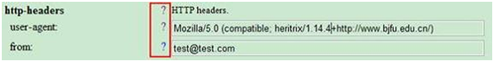
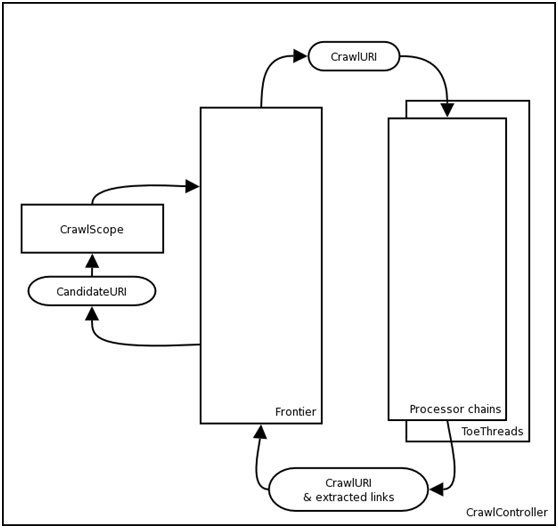
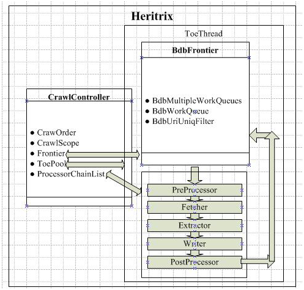
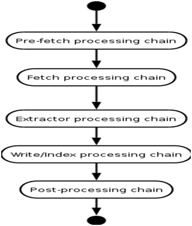
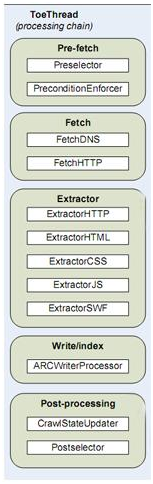
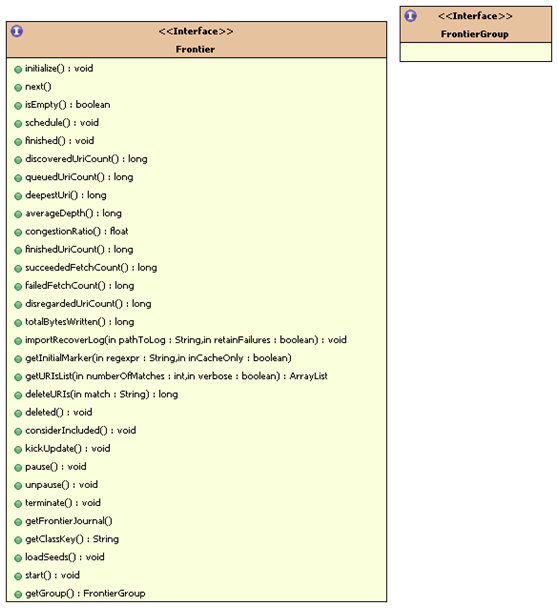
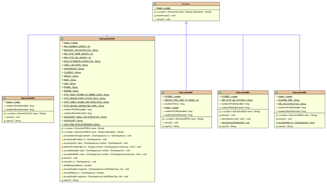
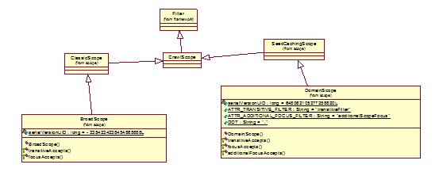

| 序号 | 修改时间 | 修改内容                 | 修改人 | 审稿人 |
| ---- | -------- | ------------------------ | ------ | ------ |
| 1    | 2010-6-6 | 创建                     | Keefe  |        |
| 2    | 2011-8-5 | 增加heritrix用户手册内容 | 同上   |        |
|      |          |                          |        |        |

 

 

 

目录

[1    简介... 2](#_Toc300326788)

[1.1    关键特性feature. 2](#_Toc300326789)

[1.2    Heritrix的局限... 2](#_Toc300326790)

[2    用户手册... 3](#_Toc300326791)

[2.1    安装运行... 3](#_Toc300326792)

[2.2    启动方式... 3](#_Toc300326793)

[2.3    Admin console使用... 4](#_Toc300326794)

[2.4    配置开发环境eclipse. 5](#_Toc300326795)

[3    设计分析... 5](#_Toc300326796)

[3.1    heritrix架构分析... 5](#_Toc300326797)

[3.2    heritrix组件结构... 6](#_Toc300326798)

[3.2.1     CrawlOrder. 7](#_Toc300326799)

[3.2.2     CrawlController. 7](#_Toc300326800)

[3.2.3     processor chains. 8](#_Toc300326801)

[3.2.4     Frontier. 10](#_Toc300326802)

[3.2.5     extractor. 11](#_Toc300326803)

[3.2.6     scope. 12](#_Toc300326804)

[4    应用开发... 12](#_Toc300326805)

[4.1    参数配置... 12](#_Toc300326806)

[4.2    重载组件... 12](#_Toc300326807)

[4.3    扩展定制... 12](#_Toc300326808)

[5    垂直搜索实例... 13](#_Toc300326809)

[参考资料... 13](#_Toc300326810)

 

 

# 1    简介

Heritrix工程始于2003年初，IA的目的是开发一个特殊的爬虫，对网上的　资源进行归档，建立网络数字图书馆，在过去的6年里，IA已经建立了400TB的数据。

IA期望他们的crawler包含以下几种： 

* 宽带爬虫：能够以更高的带宽去站点爬。 

* 主题爬虫：集中于被选择的问题。

* 持续爬虫：不仅仅爬更当前的网页还负责爬日后更新的网页。 

* 实验爬虫：对爬虫技术进行实验，以决定该爬什么，以及对不同协议的爬虫 爬行结果进行分析的。

 

**处理流程**

1)  在预定的URI中选择一个。

2)  获取URI

3)  分析，归档结果

4)  选择已经发现的感兴趣的URI。加入预定队列。

5)  标记已经处理过的URI

 

## 1.1   关键特性feature

Heritrix 包含以下关键特性：

1)  用单个爬虫在多个独立的站点一直不断的进行递归的爬。

2)  从一个提供的种子进行爬，收集站点内的精确URI，和精确主机。

3)  主要是用广度优先算法进行处理。

4)  主要部件都是高效的可扩展的

5)  良好的配置，包括：

    a)可设置输出日志，归档文件和临时文件的位置
    b)可设置下载的最大字节，最大数量的下载文档，和最大的下载时间)
    c)可设置工作线程数量)
    d)可设置所利用的带宽的上界)
    e)可在设置之后一定时间重新选择)
    f)包含一些可设置的过滤机制，表达方式，URI路径深度选择等等)


## 1.2   Heritrix的局限

* 单实例的爬虫，之间不能进行合作。(非分布式)

* 在有限的机器资源的情况下，却要复杂的操作。

* 只有官方支持，仅仅在Linux上进行了测试。

* 每个爬虫是单独进行工作的，没有对更新进行修订。

* 在硬件和系统失败时，恢复能力很差。


# 2  用户手册

[**User Manual**](http://localhost:8089/docs/articles/user_manual/index.html)

## 2.1  安装运行

l 安装：直接下载源码包，解压即可。

l 配置：修改配置文件heritrix.properties。

l 运行：在bin目录下执行 heritrix.cmd --admin= LOGIN:PASSWORD

l 管理：浏览器上输入 http://localhost:PORT/

 

**环境变量:**  HERITRIX_HOME JAVA_HOME 

```shell
% export HERITRIX_HOME=/PATH/TO/BUILT/HERITRIX
% cd $HERITRIX_HOME
% chmod u+x $HERITRIX_HOME/bin/heritrix
% $HERITRIX_HOME/bin/heritrix --help
% $HERITRIX_HOME/bin/heritrix --admin=LOGIN:PASSWORD
```

 

**配置文件：** heritrix.properties

```ini
# 设定管理账号密码：启动必需。
heritrix.cmdline.admin = admin:admin

# WEBUI端口，最好不同于tomcat缺省端口
heritrix.cmdline.port = 8090

# 其它
heritrix.version = 1.14.1
heritrix.jobsdir = jobs
```


## 2.2  启动方式

支持多种启动方式，如

* WEBUI方式：http://localhost:PORT/ 直接浏览器界面管理任务

* 系统脚本启动：$HERITRIX_HOME/bin/heritrix --admin=LOGIN:PASSWORD

* 自编写脚本启动：

`java -Xmx512m -Dheritrix.home=xxx –cp “xxx.jar;xxx.jar”  org.archive.crawler.Heritrix`

eclipse调试方式：org.archive.crawler.Heritrix

 

以上各种方式启动后，即可登陆heritrix管理平台即: http://localhost:PORT/ 

​               

## 2.3   Admin console使用

**1)**    **导航栏**

 [Console](http://127.0.0.1:8090/index.jsp)  [Jobs](http://127.0.0.1:8090/jobs.jsp)  [Profiles](http://127.0.0.1:8090/profiles.jsp)  [Logs](http://127.0.0.1:8090/logs.jsp)  [Reports](http://127.0.0.1:8090/reports.jsp)  [Setup](http://127.0.0.1:8090/setup.jsp)  [Help](http://127.0.0.1:8090/help.jsp)

说明：

* Console用来当前crawler状态，jobs, memory使用状况。 

* Jobs: 创建job, 查看job情况，Crawler使用从创建job开始。job常从若干seed开始。 

* Profiles: job的配置文件，可从以往执行的任务中异出。 

* Logs: 查看job等执行情况的日志 

* Reports: 各个组件运行时统计情况 

* Setup: 管理员设置 

*  Help: 本Admin console帮助文档

 

heritrix以创建一个job开始。jobs创建有四种方式。（详见WEBUI）

创建完，点击start开始。

 

**2)**    **配置选项**

**Profile default:** [Modules](javascript:doGoto('/jobs/modules.jsp?job=default')) [Submodules](javascript:doGoto('/jobs/submodules.jsp?job=default')) [Settings](javascript:doGoto('/jobs/configure.jsp?job=default')) [Overrides](javascript:doGoto('/jobs/per/overview.jsp?job=default')) [Refinements](javascript:doGoto('/jobs/refinements/overview.jsp?job=default')) [Finished](javascript:doSubmit())

* Modules: 各个处理模块，这里有七项。 

* Submodules: 用户扩展定制的模块。 

* Settings: 下载相关常规参数配置 

* Overrides 

 

**3)**    **示例：下载163.com整个站点**

配置选项profile: 

* Modules:  **Select Writers--** MirrorWriterProcessor 

*  SubModules: 缺省不变。

* Settings: 如果是第一次使用，必需配置**http-headers**中的user-agent 和 from 

示例如下：

                               

 

**4）页面保存**

下载后的数据将保存在heritrix_HOME目录下jobs/$site_name/xxx

缺省为层次存储原始页面。

 

**5）下载管理**

可通过WEBUI页面来查看任务进行的程度。并根据需要调整线程数，模块选项等。

 

## 2.4  配置开发环境eclipse

获取heritrix源码中以下文件目录。（主要是src目录）

src/java下所有目录org、com、st作为新项目的源文件。

src/conf 下所有文件作为新项目的配置文件。

src/lib或其它lib作为新项目的lib.

src/webapps整个目录作为新项目的webapps目录。（JSP页面）

 

# 3    设计分析

## 3.1   heritrix架构分析

[**Developer Manual**](http://localhost:8089/docs/articles/developer_manual/index.html)

[Overview of the crawler](http://localhost:8089/docs/articles/developer_manual/ar01s04.html)

[4.1. The CrawlController](http://localhost:8089/docs/articles/developer_manual/ar01s04.html#N10151)

[4.2. The Frontier](http://localhost:8089/docs/articles/developer_manual/ar01s04.html#N10156)

[4.3. ToeThreads](http://localhost:8089/docs/articles/developer_manual/ar01s04.html#N1016B)

[4.4. Processors](http://localhost:8089/docs/articles/developer_manual/ar01s04.html#N10170)

 

 

 

图 运行结构图

说明：它的工作流程是一个循环，具体流程是：

1)   在预定的URI中选择一个。

2)   从选择的URI的网址下载远程文件

3)     分析，归档下载到的内容

4)     从分析到的内容里面选择感兴趣的URI。加入预定队列。

5)     标记已经处理过的URI

 

## 3.2 heritrix组件结构

Heritrix是一个爬虫框架，可加如入一些可互换的组件。主要组件有：

* Scope范围部件：主要按照规则决定将哪个URI入队。 

* Frontier边界部件：跟踪哪个预定的URI将被收集，和已经被收集的URI，选择下一个 URI，剔除已经处理过的URI。 

* Processors处理器链：包含若干处理器获取URI，分析结果，将它们传回给边界部件。 

其余组件有：

Servercache（处理器缓存）：存放服务器的持久信息，能够被爬行部件随时查到，包括IP地址，历史记录，机器人策略。

 



图  heritrix组件结构图

从上图可以看出，Heritrix总体上是一个平台结构，内部的组件都具有松耦合的特点。任何一个部分都可以进行拆卸并替换，这就给我们进行基于Heritrix的自定义开发提供了条件。

### 3.2.1 CrawlOrder

order.xml

属性配置页

### 3.2.2 CrawlController

 

### 3.2.3 processor chains

 

图 processor概要图

 

 

图 processor详细图

### 3.2.4 Frontier

 

 

### 3.2.5 extractor

 


### 3.2.6 scope


 


# 4  应用开发

## 4.1  参数配置

**Select URI Frontier** 

Current selection:  org.archive.crawler.frontier.AdaptiveRevisitFrontier

Note: 选择BdbFrontier的要有*BerkeleyDB*数据库支持

 

**Select Post Processors** : Processors that do cleanup and feed the Frontier with new URIs 

| org.archive.crawler.postprocessor.CrawlStateUpdater |                                                              | [Down](javascript:doMoveMapItemDown('Postprocessors','Updater')) | [Remove](javascript:doRemoveMapItem('Postprocessors','Updater')) | [Info](javascript:alert('Crawl state updater'))              |
| --------------------------------------------------- | ------------------------------------------------------------ | ------------------------------------------------------------ | ------------------------------------------------------------ | ------------------------------------------------------------ |
| org.archive.crawler.postprocessor.LinksScoper       | [Up](javascript:doMoveMapItemUp('Postprocessors','LinksScoper')) | [Down](javascript:doMoveMapItemDown('Postprocessors','LinksScoper')) | [Remove](javascript:doRemoveMapItem('Postprocessors','LinksScoper')) | [Info](javascript:alert('LinksScoper. Rules on which extracted links are  within configured scope.')) |
| my.postprocessor.FrontierSchedulerForPconlineMobile | up                                                           | down                                                         | remove                                                       | info                                                         |

​    Note: 最后一项为重载**FrontierScheduler**，用来选择需要下载的URL。

 

## 4.2  重载组件

通常frontier, filter, extractor都需要根据业务需求进行重载。

将自己重载的类在 modules/*.options 声明。

 

## 4.3  扩展定制

根据项目需求，扩展定制相应的内容，主要包括以下方面：

1) 扩展自己的extractor

2) 扩展postProcess 的FrontierSchedule: 来限制加入到等待队列的url

3) 定制BdbFrontier中的URL HASH算法

4) 去除CrawlScope, robots.txt的限制

 

# 5  垂直搜索实例

实例站点1： 太平洋电脑网 http://www.pconline.com.cn/

产品报价 http://product.pconline.com.cn/

手机频道主页 http://product.pconline.com.cn/mobile/

手机品牌列表 http://product.pconline.com.cn/mobile/nokia/

某手机概要页面 http://product.pconline.com.cn/mobile/nokia/364844.html

某手机详细页面 http://product.pconline.com.cn/mobile/nokia/364844_detail.html

某手机图片页面 http://product.pconline.com.cn/pdlib/364844_bigpicture3250792.html

某手机图片 http://img.pconline.com.cn/images/product/3648/364844/sj_nokia_5230_3.jpg

 

URL匹配规则：

robots.txt

```
dns:
product.pconline.com.cn/pdlib/
img.pconline.com.cn/images/product/
```


实例站点2： 网易产品库 http://product.tech.163.com/

手机频道主页http://product.tech.163.com/mobile/

 

# 参考资料

[1].   Heritrix项目主页 http://crawler.archive.org

[2].   heritrix_百度百科 http://baike.baidu.com/view/1571189.htm

[3].   面向垂直搜索的聚焦爬虫研究及应用.kdh 吕昊     浙江大学     2008.2

（Note: 使用开源HERITRIX和WEB-HARVEST实现）

[4].   利用 Heritrix 构建特定站点爬虫http://www.ibm.com/developerworks/cn/opensource/os-cn-heritrix/

 