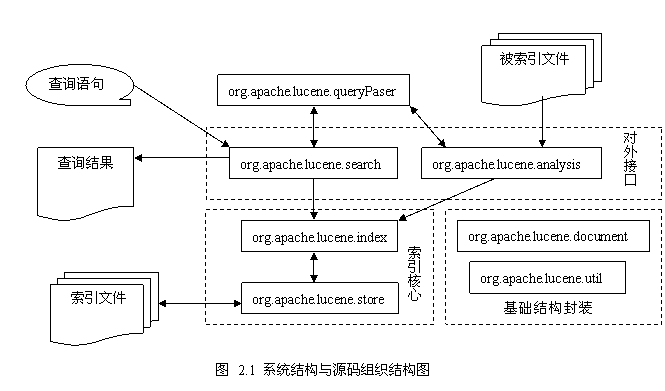
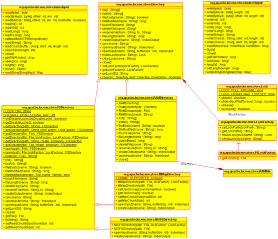
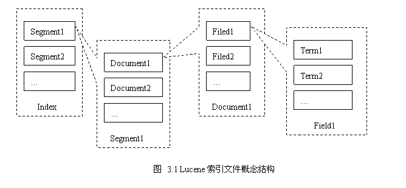
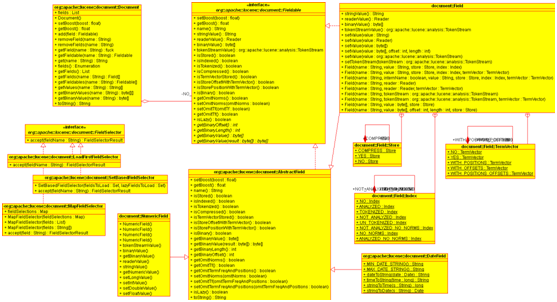
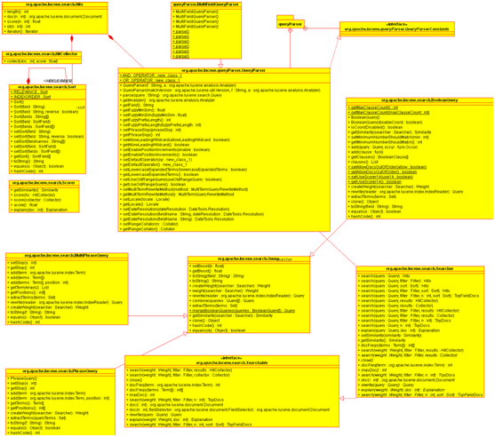
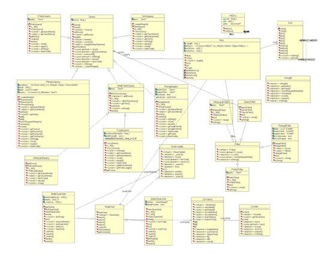
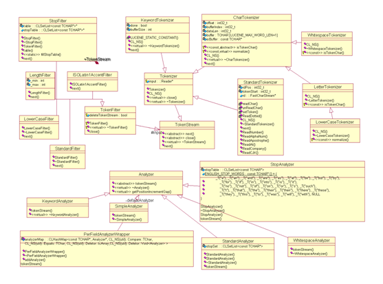
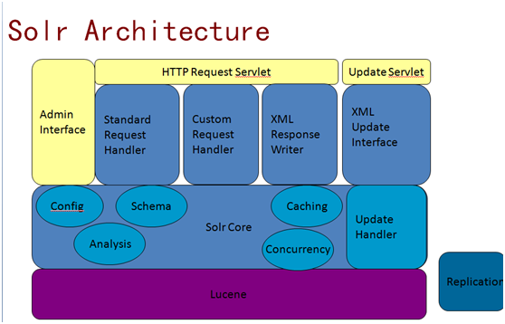
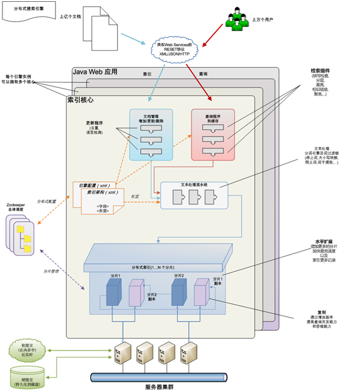

| 序号 | 修改时间   | 修改内容                                    | 修改人 | 审稿人 |
| ---- | ---------- | ------------------------------------------- | ------ | ------ |
| 1    | 2010-6-20  | 创建                                        | Keefe  | Keefe  |
| 2    | 2010-7-3   | 增加Lucene结构分析章节，重点逻辑视图。      | 同上   |        |
| 3    | 2011-3-7   | 补充类图                                    | 同上   |        |
| 4    | 2016-12-26 | 规范文章结构。                              | 同上   |        |
| 5    | 2017-1-23  | 增加基于lucene的开源搜索solr和elasticsearch | 同上   |        |
| 6    | 2017-4-9   | 更新lucene/solr/elasticsearch章节           | 同上   |        |
| 7    | 2018-6-22  | 将ELK章节迁移到《大数据开发》。             | 同上   |        |
| 8    | 2021-10-21 | 更新Lucene简介章节里的版本说明。            | 同上   |        |

 

 

 


---

# 目录

[目录  1](#_Toc16115177)

[1    概述__ 5](#_Toc16115178)

[1.1    Lucene简介__ 5](#_Toc16115179)

[1.2    基于Lucene的搜索引擎比较__ 5](#_Toc16115180)

[1.3    环境配置__ 7](#_Toc16115181)

[1.4    本章参考__ 7](#_Toc16115182)

[2    Lucene_ 8](#_Toc16115183)

[2.1    Lucene架构分析__ 8](#_Toc16115184)

[2.1.1     用例视图__ 8](#_Toc16115185)

[2.1.2     组件视图__ 8](#_Toc16115186)

[2.1.3     运行视图__ 10](#_Toc16115187)

[2.2    Lucene代码分析篇__ 10](#_Toc16115188)

[2.2.1     代码目录结构__ 10](#_Toc16115189)

[2.2.2     存储逻辑store_ 11](#_Toc16115190)

[2.2.2.1   存储抽象store类图__ 11](#_Toc16115191)

[2.2.3     索引逻辑index_ 12](#_Toc16115192)

[2.2.3.1   索引文件概念__ 12](#_Toc16115193)

[2.2.3.2   索引文件类型__ 12](#_Toc16115194)

[2.2.3.3   索引逻辑类图__ 13](#_Toc16115195)

[2.2.3.4   索引各个阶段流程__ 14](#_Toc16115196)

[2.2.4     查询逻辑search_ 14](#_Toc16115197)

[2.2.4.1   查询逻辑类图__ 14](#_Toc16115198)

[2.2.4.2   查询各个阶段流程__ 17](#_Toc16115199)

[2.2.5     分析器逻辑Analyzer 17](#_Toc16115200)

[2.2.5.1   analyzer类图__ 18](#_Toc16115201)

[2.2.6     关键算法__ 18](#_Toc16115202)

[2.2.6.1   文档得分算法__ 18](#_Toc16115203)

[2.2.6.2   模糊搜索算法__ 19](#_Toc16115204)

[2.3    Lucene开发__ 19](#_Toc16115205)

[2.3.1   demo_ 19](#_Toc16115206)

[2.3.1.1   示例1：IndexFiles.java_ 20](#_Toc16115207)

[2.3.1.2   示例2：index+search_ 20](#_Toc16115208)

[2.3.2     扩展定制__ 21](#_Toc16115209)

[2.4    本章参考__ 22](#_Toc16115210)

[3    Solr开发__ 22](#_Toc16115211)

[3.1    概述__ 22](#_Toc16115212)

[3.1.1   Solr架构__ 22](#_Toc16115213)

[3.2    入门篇__ 24](#_Toc16115214)

[3.2.1     安装__ 24](#_Toc16115215)

[3.2.2     索引__ 25](#_Toc16115216)

[3.2.3     检索__ 25](#_Toc16115217)

[3.3    进阶篇__ 26](#_Toc16115218)

[3.3.1     集群__ 26](#_Toc16115219)

[3.4    代码分析篇__ 26](#_Toc16115220)

[3.4.1     代码目录结构__ 26](#_Toc16115221)

[3.4.2   eclipse源码编译__ 28](#_Toc16115222)

[3.4.3   Solr的servlet包__ 28](#_Toc16115223)

[3.5    本章参考__ 29](#_Toc16115224)

[4    Elasticsearch开发__ 29](#_Toc16115225)

[4.1    概述__ 29](#_Toc16115226)

[4.1.1     术语__ 29](#_Toc16115227)

[4.1.2     常用REST接口__ 30](#_Toc16115228)

[4.2    基础入门Getting started_ 31](#_Toc16115229)

[4.2.1   Installation_ 31](#_Toc16115230)

[4.2.2   Indexing_ 32](#_Toc16115231)

[4.2.2.1   索引设置__ 32](#_Toc16115232)

[4.2.2.2   索引结构映射__ 33](#_Toc16115233)

[4.2.2.3   索引及索引响应示例__ 33](#_Toc16115234)

[4.2.3   Searching_ 34](#_Toc16115235)

[4.2.3.1   查询语句__ 35](#_Toc16115236)

[4.2.3.2   查询及查询响应示例__ 36](#_Toc16115237)

[4.3    深入搜索__ 39](#_Toc16115238)

[4.3.1   API 39](#_Toc16115239)

[4.3.1.1   Restful API 39](#_Toc16115240)

[4.3.1.2   Java API 40](#_Toc16115241)

[4.3.1.3   Python API 40](#_Toc16115242)

[4.4    分布式集群__ 41](#_Toc16115243)

[4.4.1     集群管理__ 41](#_Toc16115244)

[4.4.2     分片shards 42](#_Toc16115245)

[4.4.3     分布式存储__ 42](#_Toc16115246)

[4.4.4     分布式检索__ 43](#_Toc16115247)

[4.5    代码分析__ 43](#_Toc16115248)

[4.5.1     代码目录结构__ 43](#_Toc16115249)

[4.5.2   eclipse源码编译__ 43](#_Toc16115250)

[4.5.2.1   maven编译elasticsearch 2.x_ 44](#_Toc16115251)

[4.5.2.2   gradle编译elasticsearch 5.x_ 45](#_Toc16115252)

[4.5.3     启动类：org.elasticsearch.bootstrap.Elasticsearch_ 45](#_Toc16115253)

[4.5.4     准实时索引__ 45](#_Toc16115254)

[4.6    本章参考__ 46](#_Toc16115255)

[5    参考资料__ 47](#_Toc16115256)

[5.1    参考文献__ 47](#_Toc16115257)

[5.2    参考书籍__ 47](#_Toc16115258)

 

 

 

**表目录**

[表格 1 基于lucene的搜索引擎比较列表__ 5](#_Toc16115154)

[表格 2 lucene相关项目的环境配置列表__ 7](#_Toc16115155)

[表格 3 lucene的代码目录结构__ 10](#_Toc16115156)

[表格 4 lucene index file_ 12](#_Toc16115157)

[表格 5 lucene文档得分算法__ 18](#_Toc16115158)

[表格 6 elasticsearch的文件目录结构__ 26](#_Toc16115159)

[表格 7 多索引indices和多类别types查找列表__ 30](#_Toc16115160)

[表格 8 集群管理命令__ 31](#_Toc16115161)

[表格 9 检索列表__ 34](#_Toc16115162)

[表格 10 查询语句列表__ 35](#_Toc16115163)

[表格 11 elasticsearch Restful API列表__ 39](#_Toc16115164)

[表格 12 elasticsearch的文件目录结构__ 43](#_Toc16115165)

 

**图目录**

[图 1 lucene代码结构... 9](#_Toc16115166)

[图 2 classdigram: store. 11](#_Toc16115167)

[图 3 lucene index file concept 12](#_Toc16115168)

[图 4 classdigram: field. 13](#_Toc16115169)

[图 5 classdigram: query. 15](#_Toc16115170)

[图 6 classdigram: query&filter 16](#_Toc16115171)

[图 7 classdigram: weigh&score. 17](#_Toc16115172)

[图 8 classdigram: analyzer 18](#_Toc16115173)

[图 9 demo: indexFile. 20](#_Toc16115174)

[图 10 Solr Architecture. 23](#_Toc16115175)

[图 11 Solr 分布式架构... 24](#_Toc16115176)


---


# 1  概述

## 1.1   Lucene简介

​     Lucene是apache软件基金会jakarta项目组的一个子项目，是一个开放源代码的全文检索引擎工具包，即它不是一个完整的全文检索引擎，而是一个全文检索引擎的架构，提供了完整的查询引擎和索引引擎，部分文本分析引擎（英文与德文两种西方语言）。Lucene的目的是为软件开发人员提供一个简单易用的工具包，以方便的在目标系统中实现全文检索的功能，或者是以此为基础建立起完整的全文检索引擎。

​     Lucene的原作者是Doug Cutting，他是一位资深全文索引/检索专家，曾经是V-Twin搜索引擎[6]的主要开发者，后在Excite[7]担任高级系统架构设计师，目前从事于一些Internet底层架构的研究。早先发布在作者自己的[http://www.lucene.com/](http://www.lucene.com/#_blank)，后来发布在[SourceForge](http://sourceforge.net/projects/lucene/#_blank)[8]，2001年年底成为apache软件基金会jakarta的一个子项目：http://jakarta.apache.org/lucene/。

 

**优点**

Lucene作为一个全文检索引擎，其具有如下突出的优点：

（1）索引文件格式独立于应用平台。Lucene定义了一套以8位字节为基础的索引文件格式，使得兼容系统或者不同平台的应用能够共享建立的索引文件。

（2）在传统全文检索引擎的倒排索引的基础上，实现了分块索引，能够针对新的文件建立小文件索引，提升索引速度。然后通过与原有索引的合并，达到优化的目的。

（3）优秀的面向对象的系统架构，使得对于Lucene扩展的学习难度降低，方便扩充新功能。

（4）设计了独立于语言和文件格式的文本分析接口，索引器通过接受Token流完成索引文件的创立，用户扩展新的语言和文件格式，只需要实现文本分析的接口。

（5）已经默认实现了一套强大的查询引擎，用户无需自己编写代码即使系统可获得强大的查询能力，Lucene的查询实现中默认实现了布尔操作、模糊查询（Fuzzy Search）、分组查询等等。

 

表格 [Lucene Core (Java)](https://lucene.apache.org/core/)版本说明

| 版本 | 发布时间   | 新增特性                          |
| ---- | ---------- | --------------------------------- |
| 0.01 | 2000-03-30 | 初版。                            |
| 1.0  | 2000-10-04 |                                   |
| 2.0  | 2006-05-26 |                                   |
| 3.0  | 2009-11-25 | 不兼容2.x。处理数字搜索。         |
| 4.0  | 2012-10-12 | 4.x最终版本是4.10.4(2015-03-03)。 |
| 5.0  | 2015-02-20 | 5.x最终版本是5.5.5。              |
| 6.0  | 2016-04-08 | 6.x最终版本是5.5.5。              |
| 7.0  | 2017-09-20 | 7.x最终版本是7.7.2。              |
| 8.0  | 2019-03-14 | 8.x最终版本是8.10.x。             |
| 9.0  |            |                                   |

详见 http://s.apache.org/luceneversions

相关项目 见下文 参考资料


## 1.2   基于Lucene的搜索引擎比较

表格 1 基于lucene的搜索引擎比较列表

| **框架**                                                     | **简介**                                                     | **优点**                                                     | **缺点**                                                     | **实例** |
| ------------------------------------------------------------ | ------------------------------------------------------------ | ------------------------------------------------------------ | ------------------------------------------------------------ | -------- |
| [Lucene Core (Java)](http://lucene.apache.org/core/)         | 一个 JAVA 搜索类库，它本身并不是一个完整的解决方案，需要额外的开发工作。当今最先进，最高效的全功能开源搜索引擎框架。 <br>2010年 Apache Lucene 和 Apache Solr 项目合并。 | 成熟的解决方案，有很多的成功案例。                           | 需要额外的开发工作。所有的扩展，分布式，可靠性等都需要自己实现；非实时，从建索引到可以搜索中间有一个时间延迟。 |          |
| Apache [Solr](http://lucene.apache.org/solr/)                | Apache  Lucene项目的开源企业搜索平台。  其主要功能包括全文检索、命中标示、分面搜索、动态聚类、数据库集成，以及富文本（如Word、PDF）的处理。  Solr是高度可扩展的。 | 开发者社区更成熟、更稳定。  支持多格式的索引如HTML/PDF/WORD/CSV等等。  不建索引时搜索更快。 | 建立索引时，搜索效率下降，实时索引搜索效率不高。  shard策略需要自己去写、分布式搜索时相关性排序问题需二次开发。  版本更新较慢。 |          |
| [Elasticsearch](https://www.elastic.co)                      | 分布式，RESTful搜索和分析。2010.2初版。  分布式实时文件存储，并将每一个字段都编入索引，使其可以被搜索。  实时分析的分布式搜索引擎。  可扩展到上百台服务器，处理PB级别的结构化或非结构化数据。 | 分布式。  近实时搜索。  备份更简单。  可用性不错（可容纳节点故障）。 | 不够自动。                                                   | 维基百科 |
| Nutch                                                        | 一个完整的搜索引擎，包含爬虫、索引、搜索。使用了Hadoop，Map/Reduce做海量数据的并行处理、hdfs分布式文件系统存储中间计算结果及索引文件。 | 提供搜索引擎全套方案。                                       |                                                              |          |
| [Katta](http://katta.sourceforge.net/)                       | 基于 Lucene 的，支持分布式，可扩展，具有容错功能，准实时的搜索方案。 | 开箱即用，可以与 Hadoop 配合实现分布式。具备扩展和容错机制。 | 只是搜索方案，建索引部分还是需要自己实现。在搜索功能上，只实现了最基本的需求。成功案例较少，项目的成熟度稍微差一些。 |          |
| [Hadoop contrib/index](http://svn.apache.org/repos/asf/hadoop/mapreduce/trunk/src/contrib/index/README) | Map/Reduce  模式的，分布式建索引方案，可以跟 Katta  配合使用。 | 分布式建索引，具备可扩展性。                                 | 只是建索引方案，不包括搜索实现。工作在批处理模式，对实时搜索的支持不佳。 |          |
| [LinkedIn 的开源方案](http://sna-projects.com/)              | 基于 Lucene 的一系列解决方案，包括 准实时搜索 zoie ，facet 搜索实现 bobo ，机器学习算法 decomposer ，摘要存储库 krati ，数据库模式包装 sensei 等等 | 经过验证的解决方案，支持分布式，可扩展，丰富的功能实现       | linkedin 公司的联系太紧密，可定制性比较差                    | linkedin |
| [Lucandra](https://github.com/tjake/Lucandra)                | 基于 Lucene，索引存在 cassandra 数据库中                     | 参考 cassandra 的优点                                        |                                                              |          |
| [HBasene](https://github.com/akkumar/hbasene)                | 基于 Lucene，索引存在 HBase 数据库中                         | 参考 HBase 的优点                                            |                                                              |          |

 

## 1.3   环境配置

表格 2 lucene相关项目的环境配置列表

| 程序                                             | 当前版本号及日期   | platform  & JVM                                              | 备注                                                         |
| ------------------------------------------------ | ------------------ | ------------------------------------------------------------ | ------------------------------------------------------------ |
| [Lucene   Core ](http://lucene.apache.org/core/) |                    |                                                              | (Java)                                                       |
| elastic  search                                  | v5.2.0   2017.1.31 | v5.x后版本要求java版本1.8.0_73~[Java 8](http://www.oracle.com/technetwork/java/javase/downloads/index.html),   Only  Oracle’s Java and the OpenJDK are supported. | 配置文件：`config/jvm.options`  export  ES_JAVA_OPTS="$ES_JAVA_OPTS -Djava.io.tmpdir=/path/to/temp/dir"  ./bin/elasticsearch  https://github.com/elastic/elasticsearch |
| [Solr](http://lucene.apache.org/solr/)           | 6.5.0  2017.4      | java 8以上, ant,  ivy  tomcat                                | https://github.com/apache/lucene-solr                        |

说明：若java -version报错，请安装jdk；若JAVA_HOME无结果，在.bashrc文件加入

export JAVA_HOME=

 

## 本章参考


# 2  Lucene

说明：本篇lucene分析版本是lucene-3.0

## 2.1   Lucene架构分析

架构分析采用UML四视图法，逻辑视图详见代码分析篇章节。

### 2.1.1 用例视图

略

 

### 2.1.2 组件视图

组件图包括索引引擎index, 查询引擎search, 文本分析引擎（可扩展）。

​                               

图 1 lucene代码结构

从图中我们清楚的看到，Lucene的系统由基础结构封装、索引核心、对外接口三大部分组成。

 

The Lucene API is divided into several packages:

- [org.apache.lucene.analysis](http://lucene.apache.org/java/3_0_3/api/demo/org/apache/lucene/analysis/package-summary.html)     defines an abstract [Analyzer](http://lucene.apache.org/java/3_0_3/api/demo/org/apache/lucene/analysis/Analyzer.html)     API for converting text from a [java.io.Reader](http://java.sun.com/products/jdk/1.2/docs/api/java/io/Reader.html)     into a [TokenStream](http://lucene.apache.org/java/3_0_3/api/demo/org/apache/lucene/analysis/TokenStream.html),     an enumeration of token [Attribute](http://lucene.apache.org/java/3_0_3/api/demo/org/apache/lucene/util/Attribute.html)s.   A TokenStream can be composed by applying [TokenFilter](http://lucene.apache.org/java/3_0_3/api/demo/org/apache/lucene/analysis/TokenFilter.html)s     to the output of a [Tokenizer](http://lucene.apache.org/java/3_0_3/api/demo/org/apache/lucene/analysis/Tokenizer.html).   Tokenizers and TokenFilters are strung together and applied with an [Analyzer](http://lucene.apache.org/java/3_0_3/api/demo/org/apache/lucene/analysis/Analyzer.html).   A handful of Analyzer implementations are provided, including [StopAnalyzer](http://lucene.apache.org/java/3_0_3/api/demo/org/apache/lucene/analysis/StopAnalyzer.html)     and the grammar-based [StandardAnalyzer](http://lucene.apache.org/java/3_0_3/api/demo/org/apache/lucene/analysis/standard/StandardAnalyzer.html).  
- [org.apache.lucene.document](http://lucene.apache.org/java/3_0_3/api/demo/org/apache/lucene/document/package-summary.html)     provides a simple [Document](http://lucene.apache.org/java/3_0_3/api/demo/org/apache/lucene/document/Document.html)     class. A Document is simply a set of named [Field](http://lucene.apache.org/java/3_0_3/api/demo/org/apache/lucene/document/Field.html)s,     whose values may be strings or instances of [java.io.Reader](http://java.sun.com/products/jdk/1.2/docs/api/java/io/Reader.html).  
- [org.apache.lucene.index](http://lucene.apache.org/java/3_0_3/api/demo/org/apache/lucene/index/package-summary.html)     provides two primary classes: [IndexWriter](http://lucene.apache.org/java/3_0_3/api/demo/org/apache/lucene/index/IndexWriter.html),     which creates and adds documents to indices; and [IndexReader](http://lucene.apache.org/java/3_0_3/api/demo/org/apache/lucene/index/IndexReader.html),     which accesses the data in the index. 
- [org.apache.lucene.search](http://lucene.apache.org/java/3_0_3/api/demo/org/apache/lucene/search/package-summary.html)     provides data structures to represent queries (ie [TermQuery](http://lucene.apache.org/java/3_0_3/api/demo/org/apache/lucene/search/TermQuery.html)     for individual words, [PhraseQuery](http://lucene.apache.org/java/3_0_3/api/demo/org/apache/lucene/search/PhraseQuery.html)     for phrases, and [BooleanQuery](http://lucene.apache.org/java/3_0_3/api/demo/org/apache/lucene/search/BooleanQuery.html)     for boolean combinations of queries) and the abstract [Searcher](http://lucene.apache.org/java/3_0_3/api/demo/org/apache/lucene/search/Searcher.html)     which turns queries into [TopDocs](http://lucene.apache.org/java/3_0_3/api/demo/org/apache/lucene/search/TopDocs.html).  [IndexSearcher](http://lucene.apache.org/java/3_0_3/api/demo/org/apache/lucene/search/IndexSearcher.html)     implements search over a single IndexReader. 
- [org.apache.lucene.queryParser](http://lucene.apache.org/java/3_0_3/api/demo/org/apache/lucene/queryParser/package-summary.html)     uses [JavaCC](http://javacc.dev.java.net) to implement a [QueryParser](http://lucene.apache.org/java/3_0_3/api/demo/org/apache/lucene/queryParser/QueryParser.html).  
- [org.apache.lucene.store](http://lucene.apache.org/java/3_0_3/api/demo/org/apache/lucene/store/package-summary.html)     defines an abstract class for storing persistent data, the [Directory](http://lucene.apache.org/java/3_0_3/api/demo/org/apache/lucene/store/Directory.html),     which is a collection of named files written by an [IndexOutput](http://lucene.apache.org/java/3_0_3/api/demo/org/apache/lucene/store/IndexOutput.html)     and read by an [IndexInput](http://lucene.apache.org/java/3_0_3/api/demo/org/apache/lucene/store/IndexInput.html).   Multiple implementations are provided, including [FSDirectory](http://lucene.apache.org/java/3_0_3/api/demo/org/apache/lucene/store/FSDirectory.html),     which uses a file system directory to store files, and [RAMDirectory](http://lucene.apache.org/java/3_0_3/api/demo/org/apache/lucene/store/RAMDirectory.html)     which implements files as memory-resident data structures. 
- [org.apache.lucene.util](http://lucene.apache.org/java/3_0_3/api/demo/org/apache/lucene/util/package-summary.html)     contains a few handy data structures and util classes, ie [BitVector](http://lucene.apache.org/java/3_0_3/api/demo/org/apache/lucene/util/BitVector.html)     and [PriorityQueue](http://lucene.apache.org/java/3_0_3/api/demo/org/apache/lucene/util/PriorityQueue.html).  

To use Lucene, an application should: 

1. Create [Document](http://lucene.apache.org/java/3_0_3/api/demo/org/apache/lucene/document/Document.html)s     by adding [Field](http://lucene.apache.org/java/3_0_3/api/demo/org/apache/lucene/document/Field.html)s;     
2. Create an [IndexWriter](http://lucene.apache.org/java/3_0_3/api/demo/org/apache/lucene/index/IndexWriter.html)     and add documents to it with [addDocument()](http://lucene.apache.org/java/3_0_3/api/demo/org/apache/lucene/index/IndexWriter.html#addDocument(org.apache.lucene.document.Document));     
3. Call [QueryParser.parse()](http://lucene.apache.org/java/3_0_3/api/demo/org/apache/lucene/queryParser/QueryParser.html#parse(java.lang.String))     to build a query from a string; and 
4. Create an [IndexSearcher](http://lucene.apache.org/java/3_0_3/api/demo/org/apache/lucene/search/IndexSearcher.html)     and pass the query to its [search()](http://lucene.apache.org/java/3_0_3/api/demo/org/apache/lucene/search/Searcher.html#search(org.apache.lucene.search.Query))     method. 

 

### 2.1.3 运行视图

**数据流**

Lucene存在四种数据流，即文本流、token流、字节流与查询语句对象流。

* 文本流： 是对索引目标和交互控制的抽象。实际中使用UCS-2编码，用来适应多语言环境。

* Token流：对传统文字中词概念的抽象。索引处理的最小单位。（词＋域值）

* 字节流：对文件操作的抽象，通过定长字节流（8bits)来解脱文件操作，来实现平台文件系统无关性。

* 查询语句对象流： 对查询语句抽象。

 

## 2.2   Lucene代码分析篇

### 2.2.1 代码目录结构

表格 3 lucene的代码目录结构

| 目录或文件                                | 子目录或文件 | 功能概述                     | 备注   |
| ----------------------------------------- | ------------ | ---------------------------- | ------ |
| core: <br>core\src\java\org\apache\lucene |              | 此目录下为lucene的核心代码。 | 最重要 |
|                                           | /analysis    |                              |        |
|                                           | /codecs      |                              |        |
|                                           | /document    | 文档域                       |        |
|                                           | /index       | 索引                         |        |
|                                           | /search      | 检索                         |        |
|                                           | /store       | 存储                         |        |
|                                           | /geo         |                              |        |
|                                           | /util        |                              |        |
| demo                                      |              |                              |        |
| suggest                                   |              |                              |        |
| site                                      |              |                              |        |
| tools                                     |              |                              |        |
|                                           |              |                              |        |

 

### 2.2.2 存储逻辑store

#### 2.2.2.1 存储抽象store类图

三个存储抽象类： Directory, InputStream, OutputStream.

两种实现方式： FS（实现文件）和RAM（虚拟映射文件）

 

图 2 classdigram: store

### 2.2.3 索引逻辑index

#### 2.2.3.1 索引文件概念

 

图 3 lucene index file concept

索引项可分四个四个层次：Term, Field, Document, Segment

l 词项Term: 最小的索引概念单位，包括位置，词频。

l 域Field: 关联的元组，由域名和域值组成。如标题｛标题名，标题内容｝

l 文档Document: 提取了某个文件所有信息的结果，可对应到一个物理文件或逻辑文件。

l 段segment: 多个文档组成，称为子索引；可以组合为索引。 

索引： 索引可对应到一个目录（或文件）。

 

#### 2.2.3.2 索引文件类型

索引文件格式中的数据类型： Byte, Uint32, Uint64, Chars, String

下面是生成的各种索引文件. （t-Term, f-Field)

表格 4 lucene index file

| 索引文件  | 含义                                                         |      |
| --------- | ------------------------------------------------------------ | ---- |
| Segments  | 记录有多少个段，段中的文档数                                 |      |
| deletable | 等待删除的Document                                           |      |
| .fdt      | Field Data 域值                                              |      |
| .fdx      | Field Index 为.fdt的位置索引                                 |      |
| .fnm      | Field Name 域名                                              |      |
| .prx      | postion 词的位置文件                                         |      |
| .frq      | Term frequent 词频文件                                       |      |
| .tii      | Term Index  Index 为.tis的位置索引 (.tis快表)                |      |
| .tis      | Term Index  Struct，指向.frq,.prx文件的指针                  |      |
| .tvd      | 以termVector存储Document,  同时包含一个指针表，指向.tvf中的Field  信息 |      |
| .tvf      | 以TermVector存储Field                                        |      |
| .tvx      | TermVector Index, 为.tvd的位置索引                           |      |
| .cfs      | Compound File Structs 复合索引                               |      |

#### 2.2.3.3 索引逻辑类图

##### 2.2.3.3.1    索引文件层次类图Field

域field的属性

Store:  NO, YES, COMPRESS(压缩存储）

Index:  NO, TOKENIZED, UN_TOKENZIED, NO_NORMS

 

图 4 classdigram: field

 

##### 2.2.3.3.2    索引类图

 

#### 2.2.3.4 索引各个阶段流程

1)     索引创建

IndexWrite

 

2)     索引合并

IndexWrite.addIndexes

 

3)     索引优化

IndexWrite.optimize()

 

4)     索引删除

 

5)     索引同步

wrte.lock

commit.lock

 

6)     索引读取

IndexReader.termDocs()

Term //查询词

TermDocs //索引查询结果

 

### 2.2.4 查询逻辑search

#### 2.2.4.1 查询逻辑类图

IndexSearcher

TermQuery

Term

Hits, HitsCollector

Filter   //查询结果过滤器

Score    //查询结果评分

Weigh

##### 2.2.4.1.1    查询对象Query类图

包括布尔查询, 范围查询, 模糊查询等

 

图 5 classdigram: query

##### 2.2.4.1.2    Query,Filter类图

 

图 6 classdigram: query&filter

 

##### 2.2.4.1.3    权重积分Weight,Score类图

积分：Sort

权重：Weigh

 

图 7 classdigram: weigh&score

#### 2.2.4.2 查询各个阶段流程

1)     查询流程IndexSearcher

 

2)     结果排序，过滤和分页

 

3)     高级搜索

多Field搜索

多索引索引

 

### 2.2.5 分析器逻辑Analyzer

[Analyzer](http://lucene.apache.org/java/docs/api/all/org/apache/lucene/analysis/Analyzer.html) - Lucene class used for preparing text for indexing. Most applications can use the [StandardAnalyzer](http://lucene.apache.org/java/docs/api/all/org/apache/lucene/analysis/StandardAnalyzer.html) for English and latin based languages. 

分析器包括分词器和过滤器。

#### 2.2.5.1 analyzer类图

 

图 8 classdigram: analyzer

说明：分析器Analysis由过滤器Filter和解析器Analyzer组成。

 

### 2.2.6 关键算法

#### 2.2.6.1 文档得分算法

**数学模型**：文档与词条的向量空间

文档的得分是在用户进行检索时实时计算出来的。Lucene文档得分算法采用TF-IDF的改进算法。公式如下：

 

Lucene得分公式的解释

表格 5 lucene文档得分算法

| 因  素                      | 在公式中的作用描述                                           | lucene中实现                                      |
| --------------------------- | ------------------------------------------------------------ | ------------------------------------------------- |
| tf(t  in d)                 | 词条t在文档d中出现的词频,                                    | =math.sqrt(termFreq)                              |
| idf( t  )                   | 词条t在文档中的倒排词频                                      | =math.log(numDocs/(docFreq+1))  +1.0              |
| boost  (t.field  in d)      | 在索引过程中设置的字段参数                                   | 索引时写入，可通过接口更改，如doc.setBoost(0.2f); |
| lengthNorm  (t.field  in d) | 字段的标准化值，表明在字段中存储了多少词条，这个数值是在索引过程中计算出来的，并且也存储在索引中 | =1/math.sqrt(numTerms)                            |
| coord(q,  d)                | 协调因子，它的计算是基于文档d中所包含的所有可供查询的词条数量 |                                                   |
| queryNorm(q)                | 在给出每个查询条目的方差和后，计算某查询的标准化值           |                                                   |

 

#### 2.2.6.2 模糊搜索算法

一个字符串可以通过增加一个字符，删除一个字符，替换一个字符得到另外一个字符串，假设，我们把从字符串A转换成字符串B，前面3种操作所执行的最少次数称为AB相似度.模糊搜索FuzzyQuery使用了字符串相似度算法—编辑距离levenshtein算法.

Levenshtein distance最先是由俄国科学家Vladimir Levenshtein在1965年发明.

Levenshtein distance可以用来：

l Spell checking(拼写检查)

l Speech recognition(语句识别)

l DNA analysis(DNA分析)

l Plagiarism detection(抄袭检测)

 

LD用m*n的矩阵存储距离值。算法大概过程：

1)     str1或str2的长度为0返回另一个字符串的长度。

2)     初始化(n+1)*(m+1)的矩阵d，并让第一行和第一列的值从0开始增长。

3)     扫描两字符串（n*m级的），如果：str1[i] == str2[j]，用temp记录它，为0。否则temp记为1。然后在矩阵d[i][j]赋于d[i-1][j]+1 、d[i][j-1]+1、d[i-1][j-1]+temp三者的最小值。

4)     扫描完后，返回矩阵的最后一个值即d[n][m]

 

## 2.3   Lucene开发

### 2.3.1 demo

Some simple examples of code which does this are: 

-  [FileDocument.java](http://svn.apache.org/repos/asf/lucene/java/trunk/src/demo/org/apache/lucene/demo/FileDocument.java)     contains code to create a Document for a file. 
-  [IndexFiles.java](http://svn.apache.org/repos/asf/lucene/java/trunk/src/demo/org/apache/lucene/demo/IndexFiles.java)     creates an index for all the files contained in a directory. 
-  [DeleteFiles.java](http://svn.apache.org/repos/asf/lucene/java/trunk/src/demo/org/apache/lucene/demo/DeleteFiles.java)     deletes some of these files from the index. 
-  [SearchFiles.java](http://svn.apache.org/repos/asf/lucene/java/trunk/src/demo/org/apache/lucene/demo/SearchFiles.java)     prompts for queries and searches an index. 

 

#### 2.3.1.1 示例1：IndexFiles.java

 ```java
package iLucene;
 
import java.io.File;
import java.io.FileNotFoundException;
import java.io.IOException;
import java.util.Date;
 
import org.apache.lucene.analysis.standard.StandardAnalyzer;
import org.apache.lucene.demo.FileDocument;
import org.apache.lucene.index.CorruptIndexException;
import org.apache.lucene.index.IndexWriter;
import org.apache.lucene.store.FSDirectory;
import org.apache.lucene.util.Version;
 
/**
 * 索引某一目录下的所有文本文件
 * 
 * @author wujinsong
 */
public class IndexFiles {
    private IndexFiles() {
    }
    
    static final File INDEX_DIR = new File("c:\\index");
    
    public static void main(String[] args) {
        
        if (INDEX_DIR.exists()) {
            System.out.println("Cannot save index to '" + INDEX_DIR + " ' directory,please delete it first");
            System.exit(1);
        }
        
        final File docDir = new File("C:\\kankan");
        if (!docDir.exists() || !docDir.canRead()) {
            System.out.println("Document directory '" + docDir.getAbsolutePath() + "' does not exist or is not readable, please check the path");
            System.exit(1);
        }
        
        Date start = new Date();
        try {
            IndexWriter writer = new IndexWriter(FSDirectory.open(INDEX_DIR), new StandardAnalyzer(Version.LUCENE_CURRENT), true,
                    IndexWriter.MaxFieldLength.LIMITED);
            System.out.println("Indexing to directory '" + INDEX_DIR + "'...");
            indexDocs(writer, docDir);
            System.out.println("Optimizing...");
            writer.optimize();
            writer.close();
            
            Date end = new Date();
            System.out.println(end.getTime() - start.getTime() + " total milliseconds!");
        }
        catch (IOException e) {
            System.out.println(" caught a " + e.getClass() + "\n with message: " + e.getMessage());
        }
    }
    
    /**
     * 索引文件
     * 
     * @param writer
     * @param file
     * @throws CorruptIndexException
     * @throws IOException
     */
    static void indexDocs(IndexWriter writer, File file) throws CorruptIndexException, IOException {
        // 不要试图索引不可读的文件
        if (file.canRead()) {
            if (file.isDirectory()) {
                String[] files = file.list();
                // 一个IO错误可能发生
                if (files != null) {
                    for (int i = 0; i < files.length; i++) {
                        indexDocs(writer, new File(file, files[i]));
                    }
                }
            }
            else {
                System.out.println("adding " + file);
                try {
                    writer.addDocument(FileDocument.Document(file));
                }
                // 至少在windows系统，一些临时文件会导致“访问拒绝”异常，检查文件是否可以被读取将不起作用。
                catch (FileNotFoundException exception) {
                    
                }
            }
        }
    }
}
 ```


说明：IndexWrite, Document, Field, FileInputStream

 

#### 2.3.1.2 示例2：index+search

```java
    Analyzer analyzer = new StandardAnalyzer(Version.LUCENE_CURRENT);

    // Store the index in memory:
    Directory directory = new RAMDirectory();
    // To store an index on disk, use this instead:
    //Directory directory = FSDirectory.open("/tmp/testindex");
    IndexWriter iwriter = new IndexWriter(directory, analyzer, true,
                                          new IndexWriter.MaxFieldLength(25000));
    Document doc = new Document();
    String text = "This is the text to be indexed.";
    doc.add(new Field("fieldname", text, Field.Store.YES,
        Field.Index.ANALYZED));
    iwriter.addDocument(doc);
    iwriter.close();
    
    // Now search the index:
    IndexSearcher isearcher = new IndexSearcher(directory, true); // read-only=true
    // Parse a simple query that searches for "text":
    QueryParser parser = new QueryParser("fieldname", analyzer);
    Query query = parser.parse("text");
    ScoreDoc[] hits = isearcher.search(query, null, 1000).scoreDocs;
    assertEquals(1, hits.length);
    // Iterate through the results:
    for (int i = 0; i < hits.length; i++) {
      Document hitDoc = isearcher.doc(hits[i].doc);
      assertEquals("This is the text to be indexed.", hitDoc.get("fieldname"));
    }
    isearcher.close();
    directory.close();

```

说明：

1)     索引创建过程，Analyzer 为分析器，Directory 为存储抽象，IndexWriter 根据传入的Analyzer和Directory来创建索引，指定索引的存储方式和处理方式。Document为数据文件，Field为数据组成。

2)     查询过程：IndexSearcher通过传入的Directory索引抽象来进行查询。QueryParser 为查询解析器，与索引创建过程使用同样的Analyzer。Query为查询解析器分析后的检索串；ScoreDoc[]为检索后得到的带权重的文档集合, Document 为得到的文档。

3)     回收过程：索引创建完，需关闭索引创建器IndexWriter ; 查询后，需关闭索引查询器IndexSearcher，关闭抽象索引directory.

### 2.3.2 扩展定制

l 实现Lucene在org.apache.lucene.analysis中定义的接口： 按照目标语言的词法结构来实现词法分析逻辑。Lucene英文已缺省实现按空格分词，屏蔽停用词。

l 继承实现org.apache.lucene.document类： 按照被索引的文件格式来提供相应的文本分析逻辑。然后交给org.apache.lucene.index模块来写入索引文件。

 

 

## 本章参考

 

# 3  Solr开发

## 3.1   概述

分布式搜索和索引复制。Solr是最流行的企业级搜索引擎，Solr4 还增加了NoSQL支持。

Solr是用Java编写、运行在Servlet容器（如 Apache Tomcat 或Jetty）的一个独立的全文搜索服务器。 Solr采用了 Lucene Java 搜索库为核心的全文索引和搜索，并具有类似REST的HTTP/XML和JSON的API。Solr强大的外部配置功能使得无需进行Java编码，便可对 其进行调整以适应多种类型的应用程序。Solr有一个插件架构，以支持更多的高级定制。

 

2004年CNET开发Solr，为CNET提供站内搜索服务

2006年1月捐献给Apache ，成为Apache的孵化项目

一年后Solr孵化成熟，发布了1.2版，并成为Lucene的子项目

2010年 6月 solr发布了最新的1.4.1版，这是1.4的bugfix版本

如今Solr已经广为人知，并且许多公司都已经使用Solr去构建自己的搜索引擎： AOL、 Disney、 Apple, Inc、阿里巴巴、安居客……

 

Solr的特性包括：

* 高级的全文搜索功能
* 专为高通量的网络流量进行的优化
* 基于开放接口（XML和HTTP）的标准
* 综合的HTML管理界面
* 可伸缩性－能够有效地复制到另外一个Solr搜索服务器
* 使用XML配置达到灵活性和适配性
* 可扩展的插件体系


### 3.1.1 Solr架构

**solr服务原理**

　　Solr对外提供标准的http接口来实现对数据的索引的增加、删除、修改、查询。

　　在Solr中，用户通过向部署在servlet 容器中的Solr Web应用程序发送 HTTP 请求来启动索引和搜索。

　　Solr接受请求，确定要使用的适当SolrRequestHandler，然后处理请求。通过 HTTP 以同样的方式返回响应。

　　默认配置返回Solr的标准 XML 响应，也可以配置Solr的备用响应格式。

 

**索引原理**

 可以向Solr索引servlet传递四个不同的索引请求：

　　1) add/update允许向Solr添加文档或更新文档。直到提交后才能搜索到这些添加和更新。

　　2) commit 告诉Solr，应该使上次提交以来所做的所有更改都可以搜索到。

　　3) optimize 重构 Lucene 的文件以改进搜索性能。索引完成后执行一下优化通常比较好。如果更新比较频繁，则应该在使用率较低的时候安排优化。一个索引无需优化也可以正常地运行。优化是一个耗时较多的过程。

　　4) delete 可以通过 id 或查询来指定。按 id 删除将删除具有指定 id 的文档；按查询删除将删除查询返回的所有文档。

 

**搜索原理**

 　要实现搜索则只需要调用搜索接口select发送HTTP GET。示例：

http://192.168.10.85:18080/solr/select?indent=on&version=2.2&q= solr&start=0&rows=10&fl=*%2Cscore&qt=standard&wt=standard

　备注：多核心时为这个地址http://192.168.10.85:18080/solr/core0/select/

 

 

图 10 Solr Architecture

说明：

 



图 11 Solr 分布式架构

说明：

 

## 3.2   入门篇

### 3.2.1 安装

l 系统需求：JDK 8以上

l 下载：An Apache Solr release ([download](http://lucene.apache.org/solr/downloads.html)). This tutorial was written using Apache Solr 6.2.0.

l 安装：直接解压缩文件

l 运行：/solr-6.2.0:$ bin/solr start -e cloud -noprompt

l 查看：  http://localhost:8983/solr/

 

### 3.2.2 索引

可索引多格式文档，不能更新数据，可以删除数据。

```
$ bin/post -c gettingstarted docs/
```

l -c gettingstarted: name of the collection to index into

l docs/: a relative path of the Solr install docs/ directory

 

// 示例1：索引多格式文件如html、xml、JSON、CSV

```
$bin/post -c gettingstarted docs/
$bin/post -c gettingstarted example/exampledocs/*.xml
$bin/post -c gettingstarted example/exampledocs/books.json
$bin/post -c gettingstarted example/exampledocs/books.csv
 
```

// 删除数据

```
bin/post -c gettingstarted -d "<delete><id>SP2514N</id></delete>"
```

 

### 3.2.3 检索

检索可以用各种客户端，如RESTful API、CURL等等。

检索前端页面示例：

http://localhost:8983/solr/#/gettingstarted/query.

 

curl "http://localhost:8983/solr/gettingstarted/select?wt=json&indent=true&q=\"CAS+latency\""

检索结果：

```json
{
  "responseHeader":{
    "zkConnected":true,
    "status":0,
    "QTime":391,
    "params":{
      "q":"\"CAS latency\"",
      "indent":"true",
      "wt":"json"}},
  "response":{"numFound":3,"start":0,"maxScore":22.027056,"docs":[
      {
        "id":"TWINX2048-3200PRO",
        "name":["CORSAIR  XMS 2GB (2 x 1GB) 184-Pin DDR SDRAM Unbuffered DDR 400 (PC 3200) Dual Channel Kit System Memory - Retail"],
        "manu":["Corsair Microsystems Inc."],
        "manu_id_s":"corsair",
        "cat":["electronics", "memory"],
        "features":["CAS latency 2,  2-3-3-6 timing, 2.75v, unbuffered, heat-spreader"],
...
}
```


## 3.3   进阶篇

### 3.3.1 集群

 

 

## 3.4   代码分析篇

Apache Lucene/Solr

* lucene is a search engine library

* solr is a search engine server that uses lucene

 

下载：https://github.com/apache/lucene-solr 

To compile the sources run 'ant compile'

To run all the tests run 'ant test'

To setup your ide run 'ant idea', 'ant netbeans', or 'ant eclipse'

For Maven info, see dev-tools/maven/README.maven

 

### 3.4.1 代码目录结构

安装后文件目录结构如下表：

表格 6 elasticsearch的文件目录结构

| 目录或文件                             | 功能概述                                                     | 备注     |
| -------------------------------------- | ------------------------------------------------------------ | -------- |
| dev-tools                              | 开发工具集合，包含eclipse/idea/netbean/maven/ant的等等。     | 单独存在 |
| bin                                    | 可执行程序存放目录。                                         |          |
| server                                 |                                                              |          |
| dist                                   | dist：该目录包含build过程中产生的war和jar文件，以及相关的依赖文件。如生如生成apache-solr-1.4.war部署到Jetty上面去，并重命名为solr.war。 |          |
| example                                | 这个目录实际上是Jetty的安装目录。其中包含了一些样例数据和一些Solr的配置。<br/>example/etc：该目录包含了Jetty的配置，在这里我们可以将Jetty的默认端口从8983改为80端口。将其中的8983端口换成80端口。注意更改端口后启动Jetty可能会提示你没有权限，你需要使用sudo java -jar start.jar来运行。   　 example/multicore：该目录包含了在Solr的multicore中设置的多个home目录。在之后的文章中我会对其进行介绍 <br/>example/solr：该目录是一个包含了默认配置信息的Solr的home目录。    example/webapps：Jetty的webapps目录，该目录通常用来放置Java的Web应用程序。在Solr中，前面提到的solr.war文件就部署在这里。 |          |
| site                                   | 该目录仅仅包含了Solr的官网的网页内容，以及一些教程的PDF文档。 |          |
| src：core/src/java<br>/org/apache/solr | 该目录包含了Solr项目的整个源代码。这里对其各个子目录也做相应的介绍。      /java：该目录存放的是Solr使用Java编写的源代码。     <br/>/scripts：该目录存放的是配置Solr服务器的Unix Bash Shell脚本，在后面介绍多服务器配置中将会有重要的作用。     <br/>/solrj：前面提到过该目录存放的是Solr的Java版本的客户端代码。     <br/>/test：该目录存放的是测试程序的源代码和测试文件。     <br/>/webapp：该目录存放的是管理Solr的Web页面，包括Servlet和JSP文件，其构成了前面提到的WAR文件。管理Solr的JSP页面在web/admin目录下面，如果你有兴趣折腾Solr可以找到相应的JSP的页面对其进行设置. |          |
| ...                                 |                                                              |          |
| lib                                    | 该目录包含了所有Solr的API所依赖的库文件。其中包括Lucene，Apache commons utilities和用来处理XML的Stax库。 | 可选     |
| build                                  | ant build过程中生成的，其中包含了未被打包成jar或是war的class文件以及一些文档文件。 | 已弃     |
| client                                 | 该目录包含了特定语言的Solr客户端API，使得使用其他语言的用户能通过HTTP用XML与Solr进行通话。现在该目录里面虽然包含javascript、python、ruby三个子目录，但是到目前为止只包含一部分的ruby的代码，其他语言仍是空的。另外，Solr的Java客户端称为SolrJ，其代码位于src/solrj目录下面。在之后的文章中我会详细介绍Solr客户端的使用。 | 已弃     |

*备注：*

1. **2010年lucene与solr合并，git仓库名称改名为lucene-solr，包括三大目录dev-tools、lucene和solr。本表主要考虑solr子目录的结构**。

2. solr home目录：Solr home目录实际上是一个运行的Solr实例所对应的配置和数据（Lucene索引）。solr通过两种方式识别HOME目录：一是启动时调用java -Dsolr.solr.home=solr/ -jar start.jar；二是使用JNDI，将home目录绑定到java:comp/env/solr/home。配置文件在solr/ /webapp/web/WEB-INF/web.xm。

3. jetty：Jetty 是一个开源的servlet容器，它为基于Java的web内容，例如JSP和servlet提供运行环境。Jetty是使用Java语言编写的，它的API以一组JAR包的形式发布。开发人员可以将Jetty容器实例化成一个对象，可以迅速为一些独立运行（stand-alone）的Java应用提供网络和web连接。

### 3.4.2 eclipse源码编译

eclipse环境中调试solr源代码大体上分为三种方式：

1.用tomcat启动；即run on server

2.run as a java application

3.run on jetty（需要装run-jetty-run插件）

 

说明：lucene-solr源码编译需要ant、支持java命令的终端和ivy。源码中并未包含eclipse项目文件，需使用ant转化后方可在eclipse导入项目。

```shell
#安装ivy
ivy-bootstrap

#编译，生成目标文件class在 eclipse-build和build目录内
ant compile

#生成eclipse项目:
ant eclipse

#若生成exlipse项目失败，可根据提示先下载依赖文件
cd solr/ 
ant dist
```


// 设置调试运行配置参数

go to Run > Debug Configurations > Java Application and set the following: 

* Main Class (“Main” tab): org.eclipse.jetty.start.Main 

* Working Directory (“Arguments” tab): ${workspace_loc:lucene-solr/solr/example}

Then add Solr’s start.jar file to the classpath so that Eclipse can find and run Jetty’s Main class. From the Classpath tab, click Classpath > User Entries > Add JARs > lucene-solr/solr/example/start.jar

 

### 3.4.3 Solr的servlet包

SolrServlet类继承HttpServlet类，只有四个方法：
 init()
 destroy()
 doGet()
 doPost()

 

## 本章参考

[1].   Apache SolrTM 6.5.0 Documentation http://lucene.apache.org/solr/6_5_0/index.html

[2].   [Wiki](http://wiki.apache.org/solr): Additional documentation, especially focused on using Solr.

[3].   [Changes](http://lucene.apache.org/solr/6_5_0/changes/Changes.html): List of changes in this release.

[4].   [System Requirements](http://lucene.apache.org/solr/6_5_0/SYSTEM_REQUIREMENTS.html): Minimum and supported Java versions.

[5].   [Solr Quick Start](http://lucene.apache.org/solr/6_5_0/quickstart.html): This document covers the basics of running Solr using an example schema, and some sample data.

[6].   [Lucene Documentation](http://lucene.apache.org/core/6_5_0/index.html)

[7].   solr中文网 http://www.solrcn.com/ 

[8].   跟益达学Solr5之在Eclipse下编译Solr5源码 http://iamyida.iteye.com/blog/2218576 

 

# 4  Elasticsearch开发

## 4.1  概述

Shay Banon在2004年创造了Elasticsearch的前身，称为Compass。2010年2月发布了Elasticsearch的第一个版本。Elasticsearch BV成立于2012年，主要围绕Elasticsearch及相关软件提供商业服务和产品。2015年3月，Elasticsearch公司更名为Elastic。2018年10月5日在纽约证券交易所挂牌上市。

 

ElasticSearch是一个基于[Lucene](https://baike.baidu.com/item/Lucene/6753302)的搜索服务器。它提供了一个分布式多用户能力的全文搜索引擎，基于RESTful web接口。Elasticsearch是用Java语言开发的，并作为Apache许可条款下的开放源码发布，是一种流行的企业级搜索引擎。

Elasticsearch主要特性

* Elasticsearch是分布式的。不需要其他组件，分发是实时的，被叫做”Push replication”。 

* Elasticsearch 完全支持 Apache Lucene 的接近实时的搜索。 

* 处理多租户（[multitenancy](http://en.wikipedia.org/wiki/Multitenancy)）不需要特殊配置，而Solr则需要更多的高级设置。 

* Elasticsearch 采用 Gateway 的概念，使得完备份更加简单。 

* 各节点组成对等的网络结构，某些节点出现故障时会自动分配其他节点代替其进行工作。 

### 4.1.1 术语

* 文档~Document文档是信息的基本单元，可以被索引的。文档是以JSON格式表现的。 在类型type中，可以根据需求存储多个文档。一个文档在物理上位于一个索引，实际上一个文档必须在一个索引内被索引和分配一个类型。 文档相对于关系型数据库的列。 

* **分片~Shard**每一个分片就是一个全功能的独立的索引，可以位于集群中任何节点上。 分片的两个最主要原因： a、水平分割扩展，增大存储量 ；b、分布式并行跨分片操作，提高性能和吞吐量 。一个分片可以是 主 分片或者 副本 分片，索引建立的时候就已经确定了主分片数，副本分片数可以随时修改。 

* **副本~Replia**将索引分片复制一份或多份，称之为分片副本或副本。整本的两个主要原因是高可用性和性能 。

 

文档元数据包括：`/_index/_type/_id?`

* _index（索引~文档存储的地方）, 具有一系列相似属性文档的集合，相当于RDBS的库。 

* _type（类型~文档代表的对象的类），具有一组共同字段的文档，相当于RDBS的表。 

* _id（文档唯一标识 = _index + _type + id） 

示例：http://localhost:9200/twierrer/tweet/1 

上面url中_index是twitter， _type是tweet，_id是1。

备注：Segment是Lucene生成的一个倒排索引，为子索引（可以索引多个文档），可以合并成索引。

 

### 4.1.2 常用REST接口

表格 7 多索引indices和多类别types查找列表

| 索引与类型               | 含义                               |
| ------------------------ | ---------------------------------- |
| /_search                 | 在所有索引的所有类型中查找         |
| /gb/_search              | 在gb索引的所有类型中查找           |
| /g*,u*/_search           | 在以g或u开头的索引的所有类型中查找 |
| /gb/user/_search         | 在gb索引的user类型中查找           |
| /_all/user,tweet/_search | 在所有索引的user和tweet类型中查找  |

 

表格 8 集群管理命令

| 简写命令                                                     | 详述                                                         |
| ------------------------------------------------------------ | ------------------------------------------------------------ |
| GET /                                                        | 获取elasticsearch基本信息                                    |
| GET /_nodes/  GET /_nodes/process                            | 获取集群中节点的信息                                         |
| GET [/_cluster/health?pretty](http://localhost:9200/_cluster/health?pretty/)  或   GET [/_cat/health?v](http://localhost:9200/_cat/health?v) | 查看集群健康状态（YELLOW/RED/GREEN)  l RED~ 存在不可用的主分片。  l YELLOW~主分片可用，存在不可用的从分片  l GREEN~ OK |
| GET /_cat/  shards                                           | 查看主分片                                                   |
| GET /_cat/xxxxx                                              | nodes~节点 indices~健康状态 health~ thread_pool~  count~索引 segments~  recovery~  templates~模板 |
| GET  /_count                                                 | 查看索引的主分片和副本                                       |
|                                                              |                                                              |
| PUT /_settings -d ' {  "number_of_replicas"  : 0 } '         | 设置索引的主分片和副本数量。  详见 索引设置章节。            |
| POST /_cluster/reroute -d ' { } '                            | 重新路由，常出现在集群RED，存在不可用主分片。                |
| GET [/_plugin/head](http://localhost:9200/_plugin/head)      | 图形化查看集群状态（需安装插件HEAD）                         |
| GET [/_cluster/nodes/shutdown](http://localhost:9200/_cluster/nodes/shutdown) | 向集群中所有节点发送一个关闭请求                             |
|                                                              |                                                              |

*备注：**1.**简写命令，*

如`curl -XGET http://localhost:9200/`*可简写成* *GET /**，省略**HOST；*

*再如 `curl -X*GET http://localhost:9200/_cat/health?v` 可简写成GET /_cat/health?v

再如`curl -XPUT "http://localhost:9200/_settings" -d '{"number_of_replicas" : 0 } ' `

*2.**YELLOW**，存在大量*`unassigned_shards`，原因`*相同的分片不能在同一个节点上，即主备机不能在一**台，此问题常出现在空集群，在另一台内网机器布署即可，或者设置*number_of_replicas=0*。*

*3.RED,* *主分片存在问题。重新路由。*

 

## 4.2   基础入门Getting started

### 4.2.1 Installation

l [Download](https://www.elastic.co/downloads/elasticsearch) and unzip the Elasticsearch official distribution.

l Run @bin/elasticsearch @on unix, or @bin\elasticsearch.bat@ on windows.

l Run @curl -X GET http://localhost:9200/@ .

l Start more servers …

**说明**：elasticsearch 5.x需在[Java 8](http://www.oracle.com/technetwork/java/javase/downloads/index.html)以上运行，JVM配置文件在config/jvm.options.

 

**下载安装HEAD-插件-图形化管理界面**

备注：elasticsearch 5.x的版本不能直接安装HEAD插件（不好用），需先[下载](Git clone git:/github.com/mobz/elasticsearch-head.git)。

```sh
$ git clone git://github.com/mobz/elasticsearch-head.git 
$ cd elasticsearch-head 
$ npm install 
$ npm install grunt --save

# 修改监听端口
$ vi Gruntfile.js

# 启动服务
$ elasticsearch-head/node_modules/grunt/bin/grunt server
```


**运行**

运行：可以是service形式，也可以是后台进程，或者前端进程。运行后执行结果如下：

$ curl http://localhost:9200/

```json
{
  "name" : "BdKI3H7",
  "cluster_name" : "elasticsearch",
  "cluster_uuid" : "-7GLm4FHR9y1VGxmz1kamA",
  "version" : {
    "number" : "5.1.2",
    "build_hash" : "c8c4c16",
    "build_date" : "2017-01-11T20:18:39.146Z",
    "build_snapshot" : false,
    "lucene_version" : "6.3.0"
  },
  "tagline" : "You Know, for Search"
}
```

说明：name和cluster_name运行时不能改变。

 

### 4.2.2 Indexing

#### 4.2.2.1 索引设置

在elasticsearch.yml文件中关闭自动创建索引：

action.auto_create_index: false

 

三个重要设置项：

* number_of_shards: 定义一个索引的主分片数，默认为5，索引创建后不能修改。

* number_of_replicas：定义每个主分片的复制数，默认为1，这个设置可以随时在活跃索引上修改。

* analysis: 配置分析器，包括字符过滤器、表征过滤器和分词器。

PUT /my_index

```json
{
    "settings": {
        "number_of_shards" : 3,
        "number_of_replicas" : 1
        "analysis": {
        "char_filter": { ... custom character filters ... },
        "tokenizer": { ... custom tokenizers ... },
        "filter": { ... custom token filters ... },
        "analyzer": { ... custom analyzers ... }
        }
    }
}
```


#### 4.2.2.2 索引结构映射

模式映射用于定义索引结构。

 

#### 4.2.2.3 索引及索引响应示例

Let’s try and index some twitter like information. First, let’s create a twitter user, and add some tweets (the twitter index will be created automatically):

curl -XPUT 'http://localhost:9200/twitter/user/kimchy?pretty' -d '{ "name" : "Shay Banon" }'

curl -XPUT 'http://localhost:9200/twitter/tweet/1?pretty' -d '

```json
{
    "user": "kimchy",
    "post_date": "2009-11-15T13:12:00",
    "message": "Trying out Elasticsearch, so far so good?"
}'
```


curl -XPUT 'http://localhost:9200/twitter/tweet/2?pretty' -d '

```json
{
    "user": "kimchy",
    "post_date": "2009-11-15T14:12:12",
    "message": "Another tweet, will it be indexed?"
}
```


Now, let’s see if the information was added by GETting it:

curl -XGET 'http://localhost:9200/twitter/user/kimchy?pretty=true'

curl -XGET 'http://localhost:9200/twitter/tweet/1?pretty=true'

curl -XGET 'http://localhost:9200/twitter/tweet/2?pretty=true'

获取元数据

1）没找到

```json
{
  "_index" : "twitter",   //索引名
  "_type" : "tweet",   //类型名
  "_id" : "2",   //
  "found" : false
}
```


2）找到

```json
{
  "_index" : "twitter",
  "_type" : "tweet",
  "_id" : "2",
  "_version" : 1,
  "found" : true,
  "_source" : {
    "user" : "kimchy",
    "post_date" : "2009-11-15T14:12:12",
    "message" : "Another tweet, will it be indexed?"
  }
}
```


### 4.2.3 Searching

**查询子句格式（可复合子句）：**

```json
{
    QUERY_NAME: {
        FIELD_NAME: {
            ARGUMENT: VALUE,
            ARGUMENT: VALUE,...
        }
    }
}
```


表格 9 检索列表

| 检索类别   | 简述               | 类别                                                 | 示例 |
| ---------- | ------------------ | ---------------------------------------------------- | ---- |
| 全文检索   |                    |                                                      |      |
| 结构化检索 | 需传递参数 query。 | 结构化查询：match, match_all,   multi_match,  bool   |      |
|            |                    | 结构化过滤：range,  term/terms,  exist/missing, bool |      |
|            |                    |                                                      |      |

备注：查询需要分析文档相关性，过滤只是减小范围，查询比过滤更消耗时间。

 

#### 4.2.3.1 查询语句

表格 10 查询语句列表

| **大类**                 | **关键词**                     | 说明                                                         | JSON示例                                                     |
| ------------------------ | ------------------------------ | ------------------------------------------------------------ | ------------------------------------------------------------ |
| **查询**query            | **multi_match**                | 多条查询                                                     |                                                              |
| match                    | 匹配查询                       | q= user:kimchy 或者      "query" : {      "match"  : { "user": "kimchy" }      } |                                                              |
| match_all                | 全部查询/空查询                | "query" : {      "match_all"  : {}    }                      |                                                              |
| range                    | 区域查询                       | "query" : {        "range" : {        "post_date" : {  "from" : "2009-11-15T13:00:00", "to" :  "2009-11-15T14:00:00" }        }      } |                                                              |
|                          | **布尔查询**  **bool**         | 类似bool过滤                                                 |                                                              |
|                          | **ids**                        |                                                              |                                                              |
|                          | **field**                      |                                                              |                                                              |
|                          | **prefix**                     |                                                              |                                                              |
|                          | **fuzzy**                      |                                                              |                                                              |
| **过滤**  filter         | **term**                       | 精确过滤                                                     | "term": {  "folder": "inbox"  }                              |
| **terms**                | 多条件过滤                     |                                                              |                                                              |
| **exists/**  **missing** | 存在过滤，判断是否存在某个字段 |                                                              |                                                              |
| **bool**                 | 操作符有must/must_not/should   | {  "bool":  {    "must": { "term": {  "folder": "inbox" }},    "must_not": { "term":  { "tag": "spam" }},    "should": [    { "term": {  "starred": true }},    { "term": { "unread":  true }}    ]}  } |                                                              |
|                          | and/or/not                     | 逻辑操作符                                                   |                                                              |
|                          | limit                          | 限制数量                                                     |                                                              |
|                          | script                         |                                                              |                                                              |
|                          | type                           |                                                              |                                                              |
| ` 查询+过滤`             | filtered                       |                                                              | {      "query": {      "filtered": {      "query": { "match": { "email":  "business opportunity" }},      "filter": { "term": { "folder":  "inbox" }}      }      }  } |
| **复合查询**             | boosting                       |                                                              |                                                              |
|                          | constant_score                 |                                                              |                                                              |
|                          | custom_score                   |                                                              |                                                              |
| **排序**                 | sort                           | 缺省排序字段：_score~文档相关性评分。  排序规则：_score默认降序；字段值默认升序。  多级排序。 | "sort": [  { "date": { "order":  "desc" }},  { "_score": {  "order": "desc" }}  ] |
| 分页                     |                                |                                                              | GET /_search?size=5&from=10                                  |
| 聚合                     | aggs                           | 类似MYSQL的group by，但功能更强大。                          | {  "aggs":  {      "all_interests": {      "terms": { "field": "interests" }      }      }  } |

备注：1.查询和过滤都有的命令有：bool/range

 

#### 4.2.3.2 查询及查询响应示例

**1）关键词查询** **q
** Let’s find all the tweets that kimchy posted:

curl -XGET 'http://localhost:9200/twitter/tweet/_search?q=user:kimchy&pretty=true'

We can also use the JSON query language Elasticsearch provides instead of a query string:

curl -XGET 'http://localhost:9200/twitter/tweet/_search?pretty=true' -d '

{

  "query" : {

​    "match" : { "user": "kimchy" }

  }

}'

查询响应：

```json
{
  "took" : 5,
  "timed_out" : false,
  "_shards" : {
    "total" : 5,
    "successful" : 5,
    "failed" : 0
  },
  "hits" : {
    "total" : 0,
    "max_score" : null,
    "hits" : [ ]
  }
}
```


**2）获取所有文档**

Just for kicks, let’s get all the documents stored (we should see the user as well):

curl -XGET 'http://localhost:9200/_count?pretty=true' -d '

{

  "query" : {

​    "match_all" : {}

  }

}'

查询响应：

```json
{
  "count" : 1,
  "_shards" : {
    "total" : 5,
    "successful" : 5,
    "failed" : 0
  }
}
```


 

curl -XGET 'http://localhost:9200/twitter/_search?pretty=true' -d '

{

  "query" : {

​    "match_all" : {}

  }

}'

查询响应：

```json
{
  "error" : {
    "root_cause" : [
      {
        "type" : "index_not_found_exception",
        "reason" : "no such index",
        "resource.type" : "index_or_alias",
        "resource.id" : "kimchy",
        "index_uuid" : "_na_",
        "index" : "kimchy"
      }
    ],
    "type" : "index_not_found_exception",
    "reason" : "no such index",
    "resource.type" : "index_or_alias",
    "resource.id" : "kimchy",
    "index_uuid" : "_na_",
    "index" : "kimchy"
  },
  "status" : 404
}
```


**3）区域查询range search**

We can also do range search (the postDate was automatically identified as date)

curl -XGET 'http://localhost:9200/twitter/_search?pretty=true' -d '

{

  "query" : {

​    "range" : {

​      "post_date" : { "from" : "2009-11-15T13:00:00", "to" : "2009-11-15T14:00:00" }

​    }

  }

}'

 

当查询语句多重嵌套后，非常复杂，可用下列语句验证语句是否合法。

GET /gb/tweet/_validate/query

{

"query": {

"tweet" : {

"match" : "really powerful"

}

}

}

 

## 4.3   深入搜索

### 4.3.1 API

#### 4.3.1.1 Restful API

Elasticsearch uses standard RESTful APIs and JSON. We also build and maintain clients in many languages such as [Java, Python, .NET, and Groovy](https://www.elastic.co/guide/en/elasticsearch/client/index.html). 

Plus, our [community has contributed many more](https://www.elastic.co/guide/en/elasticsearch/client/community/current/index.html). They’re easy to work with, feel natural to use, and, just like Elasticsearch, don't limit what you might want to do with them.

 

**Restful API**

`curl -X<VERB> '<PROTOCOL>://<HOST>/<PATH>?<QUERY_STRING>' -d '<BODY>'`

* VERB HTTP方法~ METHOD：GET , POST , PUT , HEAD , DELETE

* PROTOCOL http或者https

* HOST如localhost

* PORT Elasticsearch HTTP服务所在的端口，默认是9200

* PATH: /索引名/类型名/id 如/twitter/usre/kimchy

* QUERY_STRING 

*  BODY JSON数据

示例：**典型**Restful API**为** curl -XPUT 'http://localhost:9200/twitter/tweet/1?pretty' -d '

 

表格 11 elasticsearch Restful API列表

| 过程   | Restful  API | 详述    | 示例:  curl  -X[METHOD]简写成METHOD      |                                                              |
| ------ | ------------ | ------- | ---------------------------------------- | ------------------------------------------------------------ |
| METHOD | PATH  命令   |         |                                          |                                                              |
| Index  | PUT          |         | 创建文档、索引。                         | curl  -XPUT 'http://localhost:9200/twitter/user/kimchy?pretty' -d '{  "name" : "Shay Banon" }' |
|        | POST         | _update | 更新文档、索引                           |                                                              |
|        | POST         | _bulk   | 批量操作文档。  delete没有操作体。       | POST /_bulk  { "delete": {  "_index": "website", "_type": "blog",  "_id": "123" }}   { "create": {  "_index": "website", "_type": "blog",  "_id": "123" }}  { "title": "My first blog  post" }  { "index": {  "_index": "website", "_type": "blog"  }}  { "title": "My second blog  post" }  { "update": {  "_index": "website", "_type": "blog",  "_id": "123", "_retry_on_conflict" : 3} }  { "doc" : {"title" :  "My updated blog post"} } |
|        | DELETE       |         | 删除文档、索引                           |                                                              |
|        | HEAD         |         | 查看索引                                 |                                                              |
| search | GET          | _search | 全文检索、结构化检索，并包括排序、过滤。 |                                                              |
|        | GET          | _mget   | 检索多个文档                             |                                                              |
|        |              |         |                                          |                                                              |

 

 

#### 4.3.1.2 Java API

You can use the Java client in multiple ways:

l node client: Perform standard [index](https://www.elastic.co/guide/en/elasticsearch/client/java-api/current/java-docs-index.html), [get](https://www.elastic.co/guide/en/elasticsearch/client/java-api/current/java-docs-get.html), [delete](https://www.elastic.co/guide/en/elasticsearch/client/java-api/current/java-docs-delete.html) and [search](https://www.elastic.co/guide/en/elasticsearch/client/java-api/current/java-search.html) operations on an existing cluster

l [`TransportClient`](https://www.elastic.co/guide/en/elasticsearch/client/java-api/current/transport-client.html): Perform administrative tasks on a running cluster.

 

示例：

```java
TransportClient client = new PreBuiltTransportClient(Settings.EMPTY)
   .addTransportAddress(new InetSocketTransportAddress(InetAddress.getByName("localhost"), 9300));
SearchResponse sr = client.prepareSearch()
 .setQuery(QueryBuilders.matchQuery("message", "myProduct"))
 .addAggregation(AggregationBuilders.terms("top_10_states")
 .field("state").size(10))
 .execute().actionGet();
client.close();
```


#### 4.3.1.3 Python API

$ pip install elasticsearch

示例：GET /_search

```python
from elasticsearch import Elasticsearch
esclient = Elasticsearch(['localhost:9200'])
response = esclient.search(
index='social-*',
body={
    "query": {
        "match": {
            "message": "myProduct"
        }
    },
    "aggs": {
        "top_10_states": {
            "terms": {
                "field": "state",
                "size": 10
            }
        }
    }
}
)
```


## 4.4   分布式集群

### 4.4.1 集群管理

**集群与节点**

节点(node)是你运行的Elasticsearch实例。一个集群(cluster)是一组具有相同cluster.name的节点集合，他们协同工作，共享数据并提供故障转移和扩展功能，当有新的节点加入或者删除节点，集群就会感知到并平衡数据。集群中一个节点会被选举为主节点(master),它用来管理集群中的一些变更，例如新建或删除索引、增加或移除节点等;当然一个节点也可以组成一个集群。

 

**节点通信**

我们能够与集群中的任何节点通信，包括主节点。任何一个节点互相知道文档存在于哪个节点上，它们可以转发请求到我们需要数据所在的节点上。我们通信的节点负责收集各节点返回的数据，最后一起返回给客户端。这一切都由Elasticsearch透明的管理。

 

**集群生态**

1.同集群中节点之间可以扩容缩容, 
 2.主分片的数量会在其索引创建完成后修正，但是副本分片的数量会随时变化。 
 3.相同的分片不会放在同一个节点上.

 

**ES****集群的多播与单播**

ES集群是采用组播的方式来构建的，组播就是通过在你的网络中发送UDP的ping请求以发现节点，其它Elasticsearch会收到这些ping请求并且进行响应，这样随后就会形成一个集群。

 ES 是一个 P2P 类型(使用 gossip 协议)的分布式系统，除了集群状态管理以外，其他所有的请求都可以发送到集群内任意一台节点上，这个节点可以自己找到需要转发给哪些节点，并且直接跟这些节点通信。ES 从 2.0 版本开始，默认的自动发现方式改为了单播(unicast)方式。

**多播配置** elasticsearch.yml

```
network.host: "0.0.0.0" 
discovery.zen.minimum_master_nodes: 3
discovery.zen.ping.timeout: 100s
discovery.zen.fd.ping_timeout: 100s
discovery.zen.ping.unicast.hosts: ["10.19.0.97","10.19.0.98","10.19.0.99","10.19.0.100"]
```

 

**单播配置**

\# 本机地址

```
network.host: "0.0.0.0"   
```

\# 其它节点机地址

```
discovery.zen.ping.unicast.hosts: ["localhost:9300","localhost:9301"]
```

 

### 4.4.2 分片shards

一个分片(shard)是一个最小级别的“工作单元(worker unit)”,它只是保存索引中所有数据的一小片.我们的文档存储和被索引在分片中，但是我们的程序不知道如何直接与它们通信。取而代之的是，他们直接与索引通信.Elasticsearch中的分片分为主分片和副本分片,复制分片只是主分片的一个副本，它用于提供数据的冗余副本，在硬件故障之后提供数据保护，同时服务于像搜索和检索等只读请求，主分片的数量和复制分片的数量都可以通过配置文件配置。但是主切片的数量只能在创建索引时定义且不能修改.相同的分片不会放在同一个节点上。

 

分片算法

shard = hash(routing) % number_of_primary_shards

说明：routing值是一个任意字符串，它默认是_id但也可以自定义，这个routing字符串通过哈希函数生成一个数字，然后除以主切片的数量得到一个余数(remainder)，余数的范围永远是0到number_of_primary_shards - 1，这个数字就是特定文档所在的分片。

### 4.4.3 分布式存储

参见 分片算法 

1)   文档索引

2)   文档更新

3)   文档读取


### 4.4.4 分布式检索

 

## 4.5  代码分析

### 4.5.1 代码目录结构

安装后文件目录结构如下表：

表格 12 elasticsearch的文件目录结构

| 目录或文件     | 功能概述                                                     | 备注                                                         |
| -------------- | ------------------------------------------------------------ | ------------------------------------------------------------ |
| bin/           | 二进制，各种启动脚本。  elasticsearch/ elasticsearch-service | [管理插件](https://www.elastic.co/guide/en/elasticsearch/plugins/current/plugin-management.html)：elasticsearch-plugin |
| config/        | elasticsearch.yml 集群配置  jvm.options JVM配置  log4j2.properties 日志格式配置 | elasticsearch.yml分布式配置：  cluster.name: 集群名字，要相同  node.name: 节点名字，要不同  network.host: 192.168.0.5  discovery.zen.ping.unicast.hosts: ["192.168.0.4",  "192.168.0.6"] |
| data/          |                                                              |                                                              |
| lib/           | 使用的库                                                     |                                                              |
| modules/       | 使用的模块                                                   |                                                              |
| plugins/       | 插件加强elasticsearch核心函数功能。  Plugins are a way to enhance the core  Elasticsearch functionality in a custom manner. |                                                              |
| logs/          |                                                              |                                                              |
| LICENSE.txt    | 开源协议                                                     |                                                              |
| NOTICE.txt     | 注意事项：版权                                               |                                                              |
| README.textile | 使用说明                                                     |                                                              |

 

### 4.5.2 eclipse源码编译

**Building from Source**

Elasticsearch 5.2.x之前版本使用mvn构建，5.2.x后使用gradle构建。

Elasticsearch uses [Gradle](https://gradle.org) for its build system. You’ll need to have version 2.13 of Gradle installed.

In order to create a distribution, simply run the gradle assemble command in the cloned directory.

Elasticsearch uses "Maven":http://maven.apache.org for its build system.

 

In order to create a distribution, simply run the 

@mvn clean package -DskipTests @ command in the cloned directory.

The distribution will be created under @target/releases@.

See the "TESTING":[TESTING.asciidoc](https://github.com/elastic/elasticsearch/blob/master/TESTING.asciidoc) file for more information about

running the Elasticsearch test suite.

 

若代码编译成功后 ，

l 运行程序：

src/main/java找到org.elasticsearch.bootstrap的elasticsearch.java  到main函数 run as java application。或者直接run在跳出的main函数中找org.elasticsearch.bootstrap. elasticsearch.java

l 测试：在浏览器地址栏输入http://localhost:9200，若有结果返回，则运行正常。

 

#### 4.5.2.1  maven编译elasticsearch 2.x

1. 导入项目：使用eclipse导入file->import->maven->existing maven project，将elasticsearch下面的core目录导入。

2. 编译：命令行运行

`$ mvn clean package -DskipTests `或者

eclipse右键 build project调用maven compile

若以上编译并无提示错误，则编译成功，项目无红叉，然后直接运行程序。

 

3. 编译错误：若出现以下提示错误，解决后，再运行程序。

**错误1**：找不到core目录

解决方法：设置运行参数: 打开刚刚导入成功的工程：
 Run As----Run Configution---Args
 设置ProgramArgument 为 start
 设置VMArgument为 -Des.path.home=<你的\core\>

 

错误2：若出现pom.xml配置错误，如Plugin execution not covered by lifecycle configuration:

解决方法： 这种直接点ignore，直接点ok，之后会出现overriding以及id冲突之类的，直接remove。

然后点工程，右键 maven->update project，将force勾上，将在maven中央库下载更新jar

 

错误3：log路径未找到，config错误

解决方法：到https://www.elastic.co/downloads/past-releases下载相应版本，解压后将config目录放到core目录下。

 

#### 4.5.2.2  gradle编译elasticsearch 5.x

1. 安装gradle-2.13和jdk8

2. 编译

1) 命令行执行编码、运行

```shell
# 打包不测试
$ gradle assemble
# 只运行不打包，执行后可打开测试URL查看
$ gradle run
# 运行测试例子
$ gradle test
```


2） eclipse

 

### 4.5.3 启动类：org.elasticsearch.bootstrap.Elasticsearch

 

### 4.5.4 准实时索引

原理：将新生成的索引附加到文件里

1、动态更新的Lucene索引

要做到实时跟新条件下数据的可用和可靠，就需要在倒排索引的基础上，再做一系列更高级的处理。

总结一下Lucene的处理办法：新收到的数据写入新的索引文件里。

Lucene把每次生成的倒排索引，叫做一个段(segment)。然后另外使用一个commit文件，记录索引内的所有segment。而生成segment的数据来源，则是内存中的buffer,也就是说，动态跟新过后过程如下：

1）当前磁盘上有三个segement可用，同时有一个commit文件记录当前的segment

2）新收到的数据进入内存buffer,索引状态如下所示。

3）buffer刷到磁盘，生成一个新的segment, commit文件同步跟新。

 

2、删除和更新

segment是不可变的，所以文档即不能从旧的段中删除，旧的段也不能更新以反映文档最新的文本。相反，每

一个提交点包括一个.del文件，包含了段上已经被删除的文档

当一个文档被删除，它是实际上只是在.del文件中被标记删除，亦然可以匹配查询，但最终返回之前会被从结果

中删除。

文档的跟新操作是类似的：当一个文档被更新，旧版本的文档被标记为删除，新版本的文档在新的段中索引。也

许该文档的不同版本都会匹配一个查询，但是老版本会从结果中删除。

 

3、利用磁盘缓存实现的准实时检索

既然涉及到磁盘，那么一个不可避免的问题就来了：磁盘太慢了！对我们要求的实时性很高的服务来说，这种处

理还不够。所以，在刚刚第3步的处理中，还有一个中间状态:

1）内存buffer生成一个新的segment，刷到文件系统缓存中，Lucene即可检索到这个新的segment,索引状态如

图所示。

2）文件系统缓存真正同步到磁盘上，commit文件跟新。

刷到文件系统缓存中这个步骤，Elasticsearch默认1s的时间间隔，这也就是说相当于是实时搜索的，Elasticsearch

也提供了单独的/_reflush接口，用户如果对1s间隔还是不太满意，可以主动调用接口来保证搜索可见。

reflush API

POST /_refresh <1>

POST /blogs/_refresh <2>

  <1> refresh所有索引

  <2> 只refresh 索引blogs

 

4 .segement merge的影响

上面提到Lucene思想：新收到的数据写入到新的索引文件里面，每一个索引文件都是不可变的，开新文件就会给服务器带来负载压力因为默认每1秒钟就会有一个新文件产生，每个文件都需要文件句柄、内存、cpu等各种资源，给服务器带来很大的开销

为了解决这个问题，Elasticsearch会不断地在后台运行任务，主动将这些零散地segement做数据归并，尽量让索引中只保有少量的，每个都比较大的segement。

这个过程是由独立的线程来进行的，并不影响segment的产生。归并过程中，删除之间几个小的segment，改成新的大的segment。等检索请求都从小segement转到大的segement上以后，删除没用的小segement。

 

## 本章参考

[1].   Elastic Stack and Product Documentation https://www.elastic.co/guide/index.html 

[2].   [Elasticsearch-Hadoop (ES-Hadoop)](https://www.elastic.co/products/hadoop)

[3].   Elastic 中文社区 http://elasticsearch.cn  

[4].   Elastic 官方网站：http://elastic.co

[5].   Elastic 用户大会： http://elasticon.com 

[6].   Elastic 源代码：http://github.com/elastic 

[7].   Elastic@Speakdeck: https://speakerdeck.com/elastic 

[8].   [ElasticSearch 分布式安装及调优 ](http://blog.csdn.net/u012348345/article/details/51103350)

[9].   ElasticSearch集群部署文档  http://www.wklken.me/posts/2016/06/29/deploy-es.html

[10]. 搭建ElasticSearch 5.2 Java API开发环境 http://blog.csdn.net/laotoumo/article/details/54885299

[11]. Elasticsearch源码加载到eclipse调试 http://blog.csdn.net/molong1208/article/details/50471323 

[12]. Elasticsearch学习笔记(二)单节点准实时索引的实现http://blog.csdn.net/u010994304/article/details/50427672 

 

# 参考资料

## 参考文献

[1].   开放源代码的全文检索引擎Lucene 中国人民大学99级本科生毕设课题CLucene

[2].   Elasticsearch与Solr 选型  http://www.cnblogs.com/chowmin/articles/4629220.html 

 

## 参考书籍

**纸书**

[1].   [Lucene in Action (In Action series) ](https://book.douban.com/subject/1432220/) Erik Hatcher、Otis Gospodnetic / Manning Publications  2004.12.28 978-1-932394283

[2].   《[lucene in action中文版》 ](https://book.douban.com/subject/1962641/)(美)Otis Gospodnetic;Erik Hatcher / 谭鸿译 / 电子工业 / 2007 978-7-121032172

[3].   《[开发自己的搜索引擎--Lucene 2.0+Heriterx》 ](https://book.douban.com/subject/2041825/) 邱哲、符滔滔 / 人民邮电出版社 / 2007年6月 

[4].   《lucene分析与应用》 吴众欣等编著 机械工业出版社 2008.9 978-1-11249924

[5].   ElasticSearch Server Rafal Kuc / Marek Rogozin'ski Packt Publishing 2013-2-21 9781849518444

[6].   [Mastering ElasticSearch](https://book.douban.com/subject/25848178/) Rafal Kuc、Marek Rogozinski / Packt Publishing / 2013-10-25 9781783281435

[7].   [ElasticSearch Server Second Edition ](https://book.douban.com/subject/25917321/) Rafal Kuc / Marek Rogozin'ski Packt Publishing 2014-4-25 9781783980529

[8].   [ElasticSearch Cookbook, Second Edition](https://book.douban.com/subject/26364678/) Alberto Paro/Packt Publishing 2015-1-28 9781783554836 （评价：本书侧重于代码级开发）

[9].   《[ElasticSearch 服务器开发：可扩展的开源弹性搜索解决方案](https://book.douban.com/subject/26308736/)(ElasticSearch Server)》  库奇（波兰）著  时金桥等译 电子工业出版社 2015.1  978-7121252006

[10]. 《[Elasticsearch服务器开发（第2版） ](https://book.douban.com/subject/26318087/)》  库奇（波兰）著 蔡建斌译 人民邮电出版社 2015.3  9787115380326

[11]. [Elasticsearch: The Definitive Guide](https://book.douban.com/subject/25868239/) Clinton Gormley and Zachary Tong (O’Reilly). Copyright 2015 Elasticsearch BV, 978-1-449-35854-9 （评价：应用非常全面）

[12]. 《[实战Elasticsearch、Logstash、Kibana : 分布式大数据搜索与日志挖掘及可视化解决方案》 ](https://book.douban.com/subject/26589415/) 高凯 / 清华大学出版社2015-6 9787302399841

[13]. 《[深入理解ElasticSearch》  ](https://book.douban.com/subject/26733541/)拉斐尔·酷奇(Rafal Kuc)  张世武译 / 机械工业出版社 / 2016-1 9787111524168 

 

**互联网电子书**

[14]. 《Elasticsearch权威指南(Elasticsearch - the definitive guide)》  Zachary Tong等译 http://es-guide-preview.elasticsearch.cn （全书，更新快）https://github.com/elasticsearch-cn/elasticsearch-definitive-guide 

[15]. 《Elasticsearch权威指南(Elasticsearch - the definitive guide)》 路小磊等译clinton gormley著 http://learnes.net/ （仅第一部分，更新慢） https://github.com/GavinFoo/elasticsearch-definitive-guide https://elasticsearch.cn/book/elasticsearch_definitive_guide_2.x/ 

[16]. ELKStack中文指南:  http://kibana.logstash.es/

[17]. Kibana 中文指南：http://chenryn.gitbooks.io/kibana-guide-cn/

[18]. Exploring elasticsearch: http://exploringelasticsearch.com/

 

## 相关项目

Apache相关项目

* lucene项目主页 http://lucene.apache.org/

* [PyLucene](https://lucene.apache.org/pylucene/)   python访问lucene core
* [Apache Solr](https://solr.apache.org/)    is a high performance search server built using [Lucene Java](http://lucene.apache.org/java/), with XML/HTTP and JSON/Python/Ruby APIs, hit highlighting, faceted search, caching, replication, and a web admin interface. 
* [Apache Hadoop](http://hadoop.apache.org/)
* [Apache ManifoldCF](http://manifoldcf.apache.org/)
* [Apache Lucene.Net](http://lucenenet.apache.org/)
* [Apache Mahout](http://mahout.apache.org/)
* [Apache Nutch](http://nutch.apache.org/)
* [Apache OpenNLP](http://opennlp.apache.org/)
* [Apache Tika](http://tika.apache.org/)
* [Apache Zookeeper](http://zookeeper.apache.org/)


其它相关项目

* Elasticsearch https://www.elastic.co/ 
* Nutch (http://www.nutch.org/) is a web search engine that uses Lucene as it's search technology. It adds a scalable crawler, link database, distributed searching, and a web-based search interface. 
* Luke (http://www.getopt.org/luke/), Lucene index browser. 
* [CodeCrawler](http://wiki.apache.org/lucene-java/CodeCrawler) (http://codecrawler.sourceforge.net/), is a smart web-based search engine specifically built for use by developers for searching source code that uses Lucene. 
* [Lucene Java](http://lucene.apache.org/java/), our flagship sub-project, provides Java-based indexing and search technology, as well as spellchecking, hit highlighting and advanced analysis/tokenization capabilities.
* [RealtimeSearch](http://wiki.apache.org/lucene-java/RealtimeSearch) (http://issues.apache.org/jira/browse/LUCENE-1313) provides realtime search using Lucene. 
* [Open Relevance Project](http://lucene.apache.org/openrelevance/) is a new subproject with the aim of collecting and distributing free materials for relevance testing and performance.
* [Mahout](http://lucene.apache.org/mahout/) is a subproject with the goal of creating a suite of scalable machine learning libraries.
* [Droids](http://incubator.apache.org/droids/) is an intelligent robot crawling framework currently in incubation.

 

