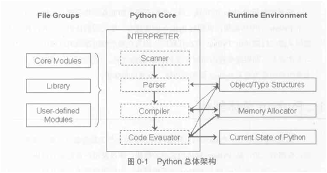

| 序号 | 修改时间   | 修改内容            | 修改人 | 审稿人 |
| ---- | ---------- | -------------------------------- | ------ | ------ |
| 1    | 2021-6-11 | 创建。从《python开发》迁移同名章节 | Keefe | Keefe |
| 2 | 2021-7-2 | 重组内容章节结构 | 同上 |  |


---

[TOC]


---

# 1 源码结构

源码下载

*  [Python 2.7.14rc1 - 2017-08-27](https://www.python.org/downloads/release/python-2714rc1/) 
   Download [XZ compressed source tarball](https://www.python.org/ftp/python/2.7.14/Python-2.7.14rc1.tar.xz)
   Download [Gzipped source tarball](https://www.python.org/ftp/python/2.7.14/Python-2.7.14rc1.tgz)
   
*  [Python 3.4.7 - 2017-08-09](https://www.python.org/downloads/release/python-347/) 
   Download [XZ compressed source tarball](https://www.python.org/ftp/python/3.4.7/Python-3.4.7.tar.xz)
   Download [Gzipped source tarball](https://www.python.org/ftp/python/3.4.7/Python-3.4.7.tgz)

   
   图  python总体结构

说明：python解释器由四个部分组成，分别是Scanner（行扫描及句法分析）、Parser（语法分析，构建AST）、Compiler（编译生成PYC文件)和Code Evaluator（代码执行器）。 


表格 源代码主要目录结构

| 目录    | 简述                                                |
| ------- | --------------------------------------------------- |
| Demo    | python的示例程序                                    |
| Doc     | 文档                                                |
| Grammar | 用BNF的语法定义了Python的全部语法，提供给解析器使用 |
| Include | 头文件，在用c/c++编写扩展模块时使用                 |
| Lib     | Python自带的标准库，用python编写的                  |
| Modules | 用c编写的内建模块的实现，zlib，md5等                |
| Objects | 内建对象类型的实现list，dict                        |
| PC      | windows平台相关文件                                 |
| PCbuild | Microsoft Visual C++ 项目工程目录                   |
| Parser  | 对Python代码进行词法分析和语法分析的代码            |
| Python  | 字节码编译器和解释器                                |
| Tools   | 一些用 Python开发的工具                             |


# 2 Python运行环境

## Python对象实现

表格  cpython中对象的C和python级别对照

| 源码中C对象      | Python对象                   | 用途                                                         |
| ---------------- | ---------------------------- | ------------------------------------------------------------ |
| PyObject         | object                       | 对象基类。是所有python对象的基类。                           |
| PyTypeObject     | type, `__class__`            | 对象类型基类                                                 |
| PyIntObject      |                              | 整数对象                                                     |
| PyStringObject   |                              | 字符串对象                                                   |
| PyListObject     | list()                       | List对象，列表结构                                           |
| PyDictObject     | dict()                       | Dict对象，字典结构                                           |
| PyCodeObject     | code                         | 字节码在PVM上的表现形式。`source=open('demo.py').read(); co=compile(source,   'demo.py', 'exec'); type(co)` |
| PyFrameObject    | sys._getframe()              | 栈帧，程序运行时环境信息。                                   |
| PyFunctionObject | `__module__`                 | 函数对象。                                                   |
| PyModuleObject   | module,   sys, `__builtin__` | sys和`__builtin__`是两个内置初始模块。                       |
| PyThreadState    |                              | 线程状态                                                     |
| PyInterpreter    |                              | 进程                                                         |

备注：可用type函数或者`xxx.__class__`__来查看对象类型。` __bases__`用来查看父类类型。


表格  python内置对象组成

| 对象           | 成员                                           | 说明                                     |
| -------------- | ---------------------------------------------- | ---------------------------------------- |
| PyObject       | int refConut;   type                           | 引用计数int + 类型对象指针               |
| PyTypeObject   | PyObject_HEAD;   char* name；   若干函数指针。 | 类型对象：PyObject + 名称name + 函数指针 |
| PyIntObject    |                                                |                                          |
| PyStringObject |                                                |                                          |
| PyListObject   |                                                |                                          |
| PyDictObject   |                                                |                                          |


在Python的世界里，一切都是对象。在Python中，对象就是C中的结构体在堆上申请的一块内存。

Python 中的对象有定长对象PyObject (如 int 对象)，变长对象PyVarObject（如 list 对象）， Python 的对象都属于这两种之一。对象中包含引用计数和类型信息，管理和创建对象需要用到。还包含属性值的存储空间。


PyObject 对象在内存中的结构类似下面代码：

```C
// 在 Include/object.h 中
// 定长对象
typedef struct _object {
   int ob_refcnt; // 用于内存管理的引用计数
   struct _typeobject *ob_type; // 类型对象，包含类型信息
} PyObject;
 
// 变长对象
typedef struct {
   int ob_refcnt; // 用于内存管理的引用计数
   struct _typeobject *ob_type; // 类型对象，包含类型信息
   Py_ssize_t ob_size; // 变长对象（容器类: list等）容纳元素的个数
} PyVarObject;
 
#define PyObject_HEAD_INIT(typePtr) 
   0,typePtr
// 函数指针
typedef void (*PrintFun)(PyObject*object);
typedef PyObject* (*AddFun)(PyObject* left,PyObject*right);
typedef long (*HashFun)(PyObject* object);
 
#define PyObject_HEAD            \
   int refCount; \   //对象的引用计数
   struct tagPyTypeObject *type    //对象类型指针　
 
typedef struct tagPyObject
{
   PyObject_HEAD;
}PyObject;
 
typedef struct tagPyTypeObject
{
   PyObject_HEAD;
   char* name;
   PrintFun print;
   AddFun add;
   HashFun hash;
}PyTypeObject;
```


## 内存分配

Python作为一种动态类型的语言，其对象和引用分离。为了有效的释放内存，Python内置了垃圾回收的支持。Python采取了一种相对简单的垃圾回收机制，即引用计数，并因此需要解决孤立引用环的问题。

python内存基本特性

* 变量无须事先声明
* 变量无须指定类型
* 不用关心内存管理
* 变量名会被"回收"
* del 语句能够直接释放资源。


**引用计数**
Python 采用引用计数的方式来管理分配的内存。Python 的每个对象都有一个引用计数，这个引用计数表明了有多少对象在指向它。当这个引用计数为 0 时，该对象就释放了。
然而，引用计数有一个本质上的缺陷，是由于循环引用引起的。因此下面又引入了其它的垃圾回收机制来弥补引用计数的缺陷。

**垃圾收集GC**
不再被使用的内存会被一种称为垃圾收集的机制释放。
备注: 解释器跟踪对象的引用计数，垃圾回收机制负责释放内存，垃圾收集器是一块独立代码，它用来寻找引用计数为0的对象，它也负责检查虽然引用计数大于0但是也应该被销毁的对象。
比如：`l=[]; l.append(l); del l;`

* 垃圾收集算法：根寻找法、引用计数
* 垃圾回收算法：标记-复制-清除
* 垃圾回收策略：分代回收。


**内存池机制**
Python提供了对内存的垃圾收集机制，但是它是将不用的内存放到内存池，而不是返回给系统。

python中内存机制呈现出金字塔形状，-1、-2层主要由操作系统进行操作。第0层是c中的malloc，free等内存分配和释放函数进行操作。

（1）第1层和第2层是内存池，有Python的接口函数PyMem_Malloc函数实现。Python 中所有小于256个字节的对象都使用pymalloc实现的分配器，而大的对象则使用系统的malloc。不过，通过修改Python源代码，我们可以改变这个默认值，从而改变Python的默认内存管理行为。

（2）Python引入了一个内存池机制，是为了加速Python的执行效率，用于管理对小块内存的申请和释放。

（3）对于python对象，如整数、浮点数、List，都有其独立的私有内存池，对象间不共享它们的内存池。也就是说，如果你分配又释放了大量的整数，用于缓存这些整数的内存就不能再分配给浮点数。


## 编译优化

python源码安装时，可带上编译优化开关:  `./configure --enable-optimizations`

该标志启用轮廓引导优化(PGO)和链接时间优化(LTO).  

* [LTO implementation in gcc](https://gcc.gnu.org/onlinedocs/gccint/LTO-Overview.html)
* [PGO](https://en.wikipedia.org/wiki/Profile-guided_optimization)  https://en.wikipedia.org/wiki/Profile-guided_optimization

| 编译开关               | 用途                                                         |
| ---------------------- | ------------------------------------------------------------ |
| --enable-optimizations | 启用轮廓引导优化(PGO)和链接时间优化(LTO)。<br>加上这个 flag 编译后，性能有 10% 左右的优化 |
| -enable-shared         | **启用共享**，方便其他依赖python的一些内置库（比如 mysqlclient) 的资源的正常安装。不启用，可能后续安装可能报错。 |


# 3  Python虚拟机PVM 

## 3.1  虚拟机执行流程

**虚拟机它是怎么执行脚本的：**

*  完成模块的加载和链接；
*  将源代码翻译为PyCodeObject对象，并将其写入内存当中（方便CPU读取，起到加速程序运行的作用）；
*  从上述内存空间中读取指令并执行；
*  程序结束后，根据命令行调用情况（即运行程序的方式）决定是否将 PyCodeObject 写回硬盘当中（也就是直接复制到.pyc或.pyo文件中）；
*  之后若再次执行该脚本，则先检查本地是否有上述字节码文件。有则执行，否则重复上述步骤。
   说明：.pyc或.pyo文件是否生成，是取决于我们如何运行程序的。模块在每次导入前总会检查其字节码文件的修改时间是否与自身的一致。若是则直接从该字节码文件读取内容，否则源模块重新导入，并在最后生成同名文件覆盖当前已有的字节码，从而完成内容的更新（详见import.py）。这样，就避免了修改源代码后与本地字节码文件产生冲突。

```shell
$ python -m hello.py  # 可以显式生成pyc
$ python hello.py  # 不生成pyc
```


## 3.2  pyc文件和code对象

**字节码bytecode**
python源代码在执行前会编译成python的字节码指令序列，PVM根据这些字节码来进行一系列操作。在python2.5中，一共规定了104条字节码指令。
pyc文件和PyCodeObject都是字节码的表现形式，前者存储在磁盘里，后者在python虚拟机中。

**pyc文件**
pyc文件包括了三部分独立的信息，分别是python的magic number（整数值，用来保证python的兼容性）、pyc文件创建的时间信息，以及PyCodeObject对象。

*  直接执行python test.py并不会产生pyc文件，import语句会触发生成pyc文件（执行到import语句时，先查看有没有对应的pyc文件，如果没有，会创建PyCodeObject对象，将对象写入文件中，接下来Python重新从pyc文件执行import动作）
*  py_compile、compiler标准库也可以生成pyc文件

 ```C
typedef struct {
   PyObject_HEAD
   int co_argcount;        /*Code Block位置参数的个数 #arguments, except *args */
   int co_nlocals;     /*Code Block中局部变量的个数，包括位置参数的个数 #local variables */
   int co_stacksize;       /*执行该段Code Block需要的栈空间 #entries needed for evaluation stack */
   int co_flags;       /* CO_..., see below */
   PyObject *co_code;      /*Code Block编译得到的字节码指令序列 instruction opcodes */
   PyObject *co_consts;    /*Code Block中的所有常量 list (constants used) */
   PyObject *co_names;     /*Code Block中的所有符号 list of strings (names used) */
   PyObject *co_varnames;  /*Code Block中局部变量名集合 tuple of strings (local variable names) */
   PyObject *co_freevars;  /*实现闭包需要的对象 tuple of strings (free variable names) */
   PyObject *co_cellvars;      /*Code Block中内部嵌套函数所引用的局部变量名集合 tuple of strings (cell variable names) */
   /* The rest doesn't count for hash/cmp */
   PyObject *co_filename;  /*Code Block对应的py文件的完整路径 string (where it was loaded from) */
   PyObject *co_name;      /*Code Block的名字，通常是函数名或类名 string (name, for reference) */
   int co_firstlineno;     /*Code Block在对应的py文件中的起始行 first source line number */
   PyObject *co_lnotab;    /*字节码指令与py文件中源代码行号的对应关系 string (encoding addr<->lineno mapping) */
   void *co_zombieframe;     /* for optimization only (see frameobject.c) */
} PyCodeObject;
 ```


表格 35 PyCodeObject各个域的含义

| co_argcount    | 未知参数个数                   |
| -------------- | ------------------------------ |
| co_nlocals     | 局部变量个数                   |
| co_stacksize   | 栈空间                         |
| co_flags       | 标志位                         |
| co_code        | 字节码                         |
| co_consts      | 常量信息                       |
| co_names       | 符号信息                       |
| co_varnames    | 局部变量名集合                 |
| co_freevars    | 闭包需要用到的信息             |
| co_cellvars    | 嵌套函数所引用的局部变量名集合 |
| co_filename    | 源文件完整路径                 |
| co_name        | 该CodeBlock的名字              |
| co_firstlineno | 源文件中对应起始行             |
| co_lnotab      | 字节码与源文件中行号对应关系   |


## 3.3  python访问PyCodeObject: compile/dis

```shell
In [6]: help(compile)
Help on built-in function compile in module builtins:
 
compile(source, filename, mode, flags=0, dont_inherit=False, optimize=-1)
   Compile source into a code object that can be executed by exec() or eval().
 
   The source code may represent a Python module, statement or expression.
   The filename will be used for run-time error messages.
   The mode must be 'exec' to compile a module, 'single' to compile a
   single (interactive) statement, or 'eval' to compile an expression.
   The flags argument, if present, controls which future statements influence
   the compilation of the code.
   The dont_inherit argument, if true, stops the compilation inheriting
   the effects of any future statements in effect in the code calling
   compile; if absent or false these statements do influence the compilation,
   in addition to any features explicitly specified.
 
示例：
In [1]: file1='debug_demo.py'
In [2]: source=open(file1).read()
In [4]: co=compile(source, file1, 'exec')
In [5]: type(co)
Out[5]: code
In [9]: import dis
In [10]: dis.dis(co)
  8           0 LOAD_CONST  0 ('\n@filename debug_demo.py\n@author: keefe\n@created: 2017/8/30\n@see:\n')
 2 STORE_NAME  0 (__doc__)
 
 10           4 LOAD_CONST  1 (True)
 6 STORE_NAME  1 (_DEBUG)
 
 13           8 LOAD_CONST  2 (<code object debug_demo at 0x0000002910865E40, file "debug_demo.py", line 13>)
            10 LOAD_CONST  3 ('debug_demo')
            12 MAKE_FUNCTION            0
            14 STORE_NAME  2 (debug_demo)
 
 32          16 LOAD_NAME   3 (__name__)
            18 LOAD_CONST  4 ('__main__')
            20 COMPARE_OP  2 (==)
            22 POP_JUMP_IF_FALSE       32
 
 33          24 LOAD_NAME   2 (debug_demo)
            26 LOAD_CONST  5 (4500)
            28 CALL_FUNCTION            1
            30 POP_TOP
           32 LOAD_CONST  6 (None)
 34 RETURN_VALUE
```


# 4 Python标准库

## 标准库简介

python标准库在python安装路径的lib目录下，除了site-packages下的其它文件或目录。标准库在python安装时同时安装。

python模块包括标准库（包括内置模块和标准模块）和第三方模块： 

* 内置模块module：无需导入import 即可使用。 `help(__builtin__)`
  * 内置类型types： `import types; dir(types)`
  * 内置函数functions: 
  * 内置方法methods:

* 标准模块：使用时需要import 
* 第三方模块：site-packages目录下，需要安装。使用时需要import 。


表格 python标准库的标准模块列表

| 目录或文件    | 子目录或文件                                                 | 功能                               |
| ------------- | ------------------------------------------------------------ | ---------------------------------- |
| asyncio       |                                                              | 异步IO                             |
| collections   | `__all__ = ['deque', 'defaultdict', 'namedtuple', 'UserDict', 'UserList', 'UserString', 'Counter', 'OrderedDict', 'ChainMap']` | 常用数据结构                       |
| concurrent    | `__all__ = ( 'FIRST_COMPLETED', 'FIRST_EXCEPTION', 'ALL_COMPLETED', 'CancelledError', 'TimeoutError', 'BrokenExecutor', 'Future', 'Executor', 'wait', 'as_completed', 'ProcessPoolExecutor', 'ThreadPoolExecutor',)` | 并发 futures                       |
| ctypes        |                                                              | 类型                               |
| email         |                                                              |                                    |
| encodings     |                                                              | 编码                               |
| ensurepip     | `__ini__.py`::_run_pip()                                     | 模块用pip安装                      |
| html          |                                                              |                                    |
| http          | client.py cookiejar.py cookies.py server.py                  | http服务器                         |
| idlelib       |                                                              |                                    |
| importlib     |                                                              |                                    |
| json          |                                                              |                                    |
| lib2to3       |                                                              | python2&3兼容库                    |
| logging       |                                                              | 日志                               |
| mslib         |                                                              |                                    |
| mulitiprocess |                                                              |                                    |
| pydoc_data    |                                                              |                                    |
| sqlite        |                                                              |                                    |
| test          |                                                              |                                    |
| tkinter       |                                                              |                                    |
| unittest      |                                                              |                                    |
| urlib         |                                                              |                                    |
| venv          |                                                              |                                    |
| wsgiref       |                                                              |                                    |
| xml           |                                                              |                                    |
| xmlrpc        |                                                              |                                    |
| abc.py        | abstractmethod ABC ABCMeta                                   | 抽象类Abstract Base Classes (ABCs) |
| asynchat.py   |                                                              |                                    |
| asyncore.py   |                                                              |                                    |
| cmd.py        |                                                              |                                    |
| functools.py  | 方法：wraps update_wrapper <br>class: partial partialmethod  | 装饰器方式更新对象属性             |
| getopt.py     |                                                              | 命令行参数解析                     |
| runpy.py      | run_module run_path                                          | 用模块名字定位和运行python代码     |
| 其它1         | dis.py datetime.py time.py                                   |                                    |
| 其它2         | lzma.py operation.py optparse.py pdb.py <br/>pickle.py platform.pypy_compile.py re.py <br/>queue.py shell.py socket.py sockserver.py<br/>ssl.py string.py subprocess.py tempfile.py<br/>this.py thread.py token.py traceback.py<br/>types.py uu.py uuid.py |                                    |

>可导出符号：文件可对外导出的符号在 `__all__` 里查找，若无`__all__`则可以全部导出（不推荐）。


### 常用基础算法

表格 9 常用算法列表

| 函数名     | 示例                                                         | 说明                                                         |
| ---------- | ------------------------------------------------------------ | ------------------------------------------------------------ |
| filter     | >>> def f(x): return x % 2   != 0 and x % 3 != 0     <br>>>> filter(f, range(2, 25))     [5, 7, 11, 13, 17, 19, 23] | 对sequence中的item依次执行function(item)，将执行结果为True的item组成一个List/String/Tuple（取决于sequence的类型）返回。 |
| map        | >>> def add(x, y): return   x+y     >>> map(add, range(8), range(8))     [0, 2, 4, 6, 8, 10, 12, 14] | 对sequence中的item依次执行function(item)，见执行结果组成一个List返回。map支持多个sequence。 |
| reduce     | >>> def add(x,y): return x +   y     >>> reduce(add, range(1, 11)) <br>55 | 对sequence中的item顺序迭代调用function。   # （注：1+2+3+4+5+6+7+8+9+10） |
| lambda     |                                                              |                                                              |
| sorted     |                                                              | 标准库内建函数，缺省字典排序。                               |
| list.sort  |                                                              | 列表的排序                                                   |
| round      | round(1.4)=1.0   round(1.5)=2.0   round(1.55, 1)=1.6         | 标准库内建函数，四舍五入。   第二参数是精度。                |
| math.ceil  | math.ceil(1.55)=2.0                                          | 向上取整                                                     |
| math.floor | math.floor(1.55)=1.0                                         | 向下取整                                                     |


#### filter/map/reduce/lambda

**filter**

```python
>>> help(filter)
filter(function or None, sequence) -> list, tuple, or string
Return those items of sequence for which function(item) is true.  If
   function is None, return the items that are true.  If sequence is a tuple
   or string, return the same type, else return a list.
filter(function, sequence)：对sequence中的item依次执行function(item)，将执行结果为True的item组成一个List/String/Tuple（取决于sequence的类型）返回：

>>> def f(x): return x % 2 !=
0 and x % 3 != 0 
>>> filter(f, range(2, 25)) 
[5, 7, 11, 13, 17, 19, 23]
>>> def f(x): return x != 'a' 
>>> filter(f, "abcdef") 
'bcdef'
```


**map(function, sequence)**：
对sequence中的item依次执行function(item)，见执行结果组成一个List返回。另外map也支持多个sequence，这就要求function也支持相应数量的参数输入：

```python
>>> def add(x, y): return x+y 
>>> map(add, range(8), range(8)) 
 [0, 2, 4, 6, 8, 10, 12, 14]
```


**reduce(function, sequence, starting_value)**：
对sequence中的item顺序迭代调用function，如果有starting_value，还可以作为初始值调用，例如可以用来对List求和：

```python
>>> def add(x,y): return x + y 
>>> reduce(add, range(1, 11)) 
 55 （注：1+2+3+4+5+6+7+8+9+10）
>>> reduce(add, range(1, 11), 20) 
 75 （注：1+2+3+4+5+6+7+8+9+10+20
```


**lambda**：
这是Python支持一种有趣的语法，它允许你快速定义单行的最小函数，类似与C语言中的宏，这些叫做lambda的函数，是从LISP借用来的，可以用在任何需要函数的地方：

```
lambda [arg1[,arg2,arg3....argN]]:expression
```

```python
>>> g = lambda x: x * 2 
>>> g(3) 
 6 
>>> (lambda x: x * 2)(3) 
 6
```

我们也可以把filter map reduce 和lambda结合起来用，函数就可以简单的写成一行。
 例如：

```python
kmpathes = filter(lambda kmpath: kmpath,     
map(lambda kmpath: string.strip(kmpath),
string.split(l, ':'))) 
```

功能解说：对 l 中的所有元素以':'做分割，得出一个列表。对这个列表的每一个元素做字符串strip，形成一个列表。对这个列表的每一个元素做直接返回操作(这个地方 可以加上过滤条件限制)，最终获得一个字符串被':'分割的列表，列表中的每一个字符串都做了strip，并可以对特殊字符串过滤。


#### sorted/sort

在Python 中sorted是内建函数(BIF)，而sort()是列表类型的内建函数list.sort()。
**sorted()**
sorted(iterable[, cmp[, key[, reverse]]])
Return a new sorted list from the items in iterable.

dict调用sorted的缺省排序是字典序（即若是字符串按字母排序；若是数值按数值排序；若其它方式排序需修改cmp），reverse缺省False是从小到大。

1） 对字典按键（key）排序

 ```python
 dic = {'a':31, 'bc':5, 'c':3, 'asd':4, 'aa':74, 'd':0}
 dict= sorted(dic.iteritems(), key=lambda d:d[0])  #d[0]表示字典的键
 print dict
 ```

输出的结果：
 [('a', 31), ('aa', 74), ('asd', 4), ('bc', 5), ('c', 3), ('d', 0)]

**2）按value值从大到小排**

```python
dict= sorted(dic.iteritems(), key=lambda d:d[1], reverse = True)
```

输出的结果：
 [('aa', 74), ('a', 31), ('bc', 5), ('asd', 4), ('c', 3), ('d', 0)]

**3）先按value排序再按key排序** 

```python
dict= sorted(dic.iteritems(), key=lambda d:(d[1],D[0]))
```

输出的结果：
 [('d', 0), ('c', 3), ('asd', 4), ('bc', 5), ('a', 31), ('aa', 74)]


#### math数学库

```python
>>> import math
>>> dir(math)
['__doc__', '__name__', '__package__', 'acos', 'acosh', 'asin', 'asinh', 'atan', 'atan2', 'atanh', 'ceil', 'copysign', 'cos', 'cosh', 'degrees', 'e', 'erf', 'erfc', 'exp', 'expm1', 'fabs', 'factorial', 'floor', 'fmod', 'frexp', 'fsum', 'gamma', 'hypot', 'isinf', 'isnan', 'ldexp', 'lgamma', 'log', 'log10', 'log1p', 'modf', 'pi', 'pow', 'radians', 'sin', 'sinh', 'sqrt', 'tan', 'tanh', 'trunc']
```


### 常用数据结构

dict/list/tuple/set/
dict: 字典，内部实现hash_table

#### queue

queue: 不是内建类型。使用队列在多线程/进程之间的同步安全需自行加上同步机制。

*  跨进程队列：from multiprocessing import Queue
*  进程内队列：from Queue import Queue

**Queue模块**
Queue模块实现了3种类型的队列，区别在于队列中条目检索的顺序不同，缺省是阻塞队列，可调。定义了下面的类和异常（threading.Queue已弃, python3已弃queue模块，统一使用Queue模块），

```python
import Queue
>>> dir(Queue)
['Empty', 'Full', 'LifoQueue', 'PriorityQueue', 'Queue', '__all__', '__builtins__', '__doc__', '__file__', '__name__', '__package__', '_threading', '_time', 'deque', 'heapq']
```

Queue模块下三种队列实现，分别是

*  'Queue'~ FIFO先进先出队列.
*  'PriorityQueue'~优先级队列，元素是(priority number, data).
*  'LifoQueue'~LIFO后进先出队列，put(self, item, block=True, timeout=None)
   两种异常分别是：queue.Empty和queue.Full.

**multiprocessing.Queue**
函数function，返回一个跨进程通信队列。


## 内建模块 builtins

源文件：lib/builtins.py

内建模块有下面三种符号：

* `__builtin__`，Python2.X版本出现。包含了Python许多内建的函数，不必手动导入此模块,就可直接调用许多内建的函数。
* `__builtins__`，同时存在于Python2.X和Python3.X中。其实简单地说，它就是对内建模块一个引用。
* buildins:  在Python3.X版本出现，需要导入才能使用。`import builtins`

```python
>>> __builtins__ is __builtin__
True
>>> type(__builtin__)
<type 'module'>
>>> type(__builtins__)
<type 'module'>
>> help(__builtin__)
__builtin__ - Built-in functions, exceptions, and other objects.
   object
       basestring
           str
           unicode
       buffer
       bytearray
       classmethod
       complex
       dict
       enumerate
       file
       float
       frozenset
       int
       bool
       list
       long
       memoryview
       property
       reversed
       set
       slice
       staticmethod
       super
       tuple
       type
       xrange
    
  class ArithmeticError(Exception)
  ...
```

说明：`__builtin__`

*  内建数据结构有：bytearray dict tupl set list
*  内建基础数据类型有：int bool float long str
*  内建方法有：range enumerate slice super type


### 1）内建类型Build-in Types

- [Built-in Types](https://docs.python.org/3/library/stdtypes.html)
  - [Truth Value      Testing](https://docs.python.org/3/library/stdtypes.html#truth-value-testing)
  - [Boolean      Operations — and, or, not](https://docs.python.org/3/library/stdtypes.html#boolean-operations-and-or-not)
  - [Comparisons](https://docs.python.org/3/library/stdtypes.html#comparisons)
  - [Numeric      Types — int, float, complex](https://docs.python.org/3/library/stdtypes.html#numeric-types-int-float-complex)
  - [Iterator      Types](https://docs.python.org/3/library/stdtypes.html#iterator-types)
  - [Sequence      Types — list, tuple, range](https://docs.python.org/3/library/stdtypes.html#sequence-types-list-tuple-range)
  - [Text      Sequence Type — str](https://docs.python.org/3/library/stdtypes.html#text-sequence-type-str)
  - [Binary      Sequence Types — bytes, bytearray, memoryview](https://docs.python.org/3/library/stdtypes.html#binary-sequence-types-bytes-bytearray-memoryview)
  - [Set Types      — set, frozenset](https://docs.python.org/3/library/stdtypes.html#set-types-set-frozenset)
  - [Mapping      Types — dict](https://docs.python.org/3/library/stdtypes.html#mapping-types-dict)
  - [Context      Manager Types](https://docs.python.org/3/library/stdtypes.html#context-manager-types)
  - [Generic      Alias Type](https://docs.python.org/3/library/stdtypes.html#generic-alias-type)
  - [Other      Built-in Types](https://docs.python.org/3/library/stdtypes.html#other-built-in-types)
  - [Special      Attributes](https://docs.python.org/3/library/stdtypes.html#special-attributes)

查看内置类型 types模块

```PYTHON
>>> import types
>>> dir(types)
['BooleanType', 'BufferType', 'BuiltinFunctionType', 'BuiltinMethodType', 'ClassType', 'CodeType', 'ComplexType', 'DictProxyType', 'DictType', 'DictionaryType', 'EllipsisType', 'FileType', 'FloatType', 'FrameType', 'FunctionType', 'GeneratorType', 'GetSetDescriptorType', 'InstanceType', 'IntType', 'LambdaType', 'ListType', 'LongType', 'MemberDescriptorType', 'MethodType', 'ModuleType', 'NoneType', 'NotImplementedType', 'ObjectType', 'SliceType', 'StringType', 'StringTypes', 'TracebackType', 'TupleType', 'TypeType', 'UnboundMethodType', 'UnicodeType', 'XRangeType', '__all__', '__builtins__', '__doc__', '__file__', '__name__', '__package__']
```

备注：类中的方法一般为'MethodType'，但类的静态方法为'FunctionType'。


**类型检查**
方法：isinstance  issubclass
**isinstance(object, classinfo)   #**用来判断对象的类型
Return true if the object argument is an instance of the classinfo argument, or of a (direct, indirect or [virtual](https://docs.python.org/2/glossary.html#term-abstract-base-class)) subclass thereof.

**issubclass(class, classinfo)**
Return true if class is a subclass (direct, indirect or [virtual](https://docs.python.org/2/glossary.html#term-abstract-base-class)) of classinfo. 
示例：

```PYTHON
>>> import types
>>> isinstance(range, types.BuiltinFunctionType)  
True
>>> isinstance(False,types.BooleanType)
True
```


**常用的数据结构详述（数据结构是内置类型的重要组成部分）**

*  list: [,]
*  duple：元组(,)，内部元素不可修改，但元组之间能拼接成新的元组。
*  set：相当于list，但元素不可重复，一般只用于确认某个元素是否在集合里。
*  dict: {key:value,}，内部实现hashmap，dict默认有序。
   备注：1. 因为str/duple的值是固定的，所以可作为hashmap的KEY值。

2. dict/set是无序的。因此将有序list转化成dict时顺序可能会乱。

示例：zip可以用来实现矩阵的行列置换。

```python
list1 = zip(('a','b','c','d','e'),(1,2,3,4,5))
A0 = dict(list1)
```

输出：（dict是无序的，有序list转化成dict时，原次序可能打乱。）

```sh
list1 = [('a', 1), ('b', 2), ('c', 3), ('d', 4), ('e', 5)]
A0 = {'a': 1, 'c': 3, 'b': 2, 'e': 5, 'd': 4}  
```


### 2）内建函数Built-in Functions

表格 5 内建函数列表（全）

| [abs()](https://docs.python.org/2/library/functions.html#abs) | [divmod()](https://docs.python.org/2/library/functions.html#divmod) | [input()](https://docs.python.org/2/library/functions.html#input) | [open()](https://docs.python.org/2/library/functions.html#open) | [staticmethod()](https://docs.python.org/2/library/functions.html#staticmethod) |
| ------------------------------------------------------------ | ------------------------------------------------------------ | ------------------------------------------------------------ | ------------------------------------------------------------ | ------------------------------------------------------------ |
| [all()](https://docs.python.org/2/library/functions.html#all) | [enumerate()](https://docs.python.org/2/library/functions.html#enumerate) | [int()](https://docs.python.org/2/library/functions.html#int) | [ord()](https://docs.python.org/2/library/functions.html#ord) | [str()](https://docs.python.org/2/library/functions.html#str) |
| [any()](https://docs.python.org/2/library/functions.html#any) | [eval()](https://docs.python.org/2/library/functions.html#eval) | [isinstance()](https://docs.python.org/2/library/functions.html#isinstance) | [pow()](https://docs.python.org/2/library/functions.html#pow) | [sum()](https://docs.python.org/2/library/functions.html#sum) |
| [basestring()](https://docs.python.org/2/library/functions.html#basestring) | [execfile()](https://docs.python.org/2/library/functions.html#execfile) | [issubclass()](https://docs.python.org/2/library/functions.html#issubclass) | [print()](https://docs.python.org/2/library/functions.html#print) | [super()](https://docs.python.org/2/library/functions.html#super) |
| [bin()](https://docs.python.org/2/library/functions.html#bin) | [file()](https://docs.python.org/2/library/functions.html#file) | [iter()](https://docs.python.org/2/library/functions.html#iter) | [property()](https://docs.python.org/2/library/functions.html#property) | [tuple()](https://docs.python.org/2/library/functions.html#tuple) |
| [bool()](https://docs.python.org/2/library/functions.html#bool) | [filter()](https://docs.python.org/2/library/functions.html#filter) | [len()](https://docs.python.org/2/library/functions.html#len) | [range()](https://docs.python.org/2/library/functions.html#range) | [type()](https://docs.python.org/2/library/functions.html#type) |
| [bytearray()](https://docs.python.org/2/library/functions.html#bytearray) | [float()](https://docs.python.org/2/library/functions.html#float) | [list()](https://docs.python.org/2/library/functions.html#func-list) | [raw_input()](https://docs.python.org/2/library/functions.html#raw_input) | [unichr()](https://docs.python.org/2/library/functions.html#unichr) |
| [callable()](https://docs.python.org/2/library/functions.html#callable) | [format()](https://docs.python.org/2/library/functions.html#format) | [locals()](https://docs.python.org/2/library/functions.html#locals) | [reduce()](https://docs.python.org/2/library/functions.html#reduce) | [unicode()](https://docs.python.org/2/library/functions.html#unicode) |
| [chr()](https://docs.python.org/2/library/functions.html#chr) | [frozenset()](https://docs.python.org/2/library/functions.html#func-frozenset) | [long()](https://docs.python.org/2/library/functions.html#long) | [reload()](https://docs.python.org/2/library/functions.html#reload) | [vars()](https://docs.python.org/2/library/functions.html#vars) |
| [classmethod()](https://docs.python.org/2/library/functions.html#classmethod) | [getattr()](https://docs.python.org/2/library/functions.html#getattr) | [map()](https://docs.python.org/2/library/functions.html#map) | [repr()](https://docs.python.org/2/library/functions.html#func-repr) | [xrange()](https://docs.python.org/2/library/functions.html#xrange) |
| [cmp()](https://docs.python.org/2/library/functions.html#cmp) | [globals()](https://docs.python.org/2/library/functions.html#globals) | [max()](https://docs.python.org/2/library/functions.html#max) | [reversed()](https://docs.python.org/2/library/functions.html#reversed) | [zip()](https://docs.python.org/2/library/functions.html#zip) |
| [compile()](https://docs.python.org/2/library/functions.html#compile) | [hasattr()](https://docs.python.org/2/library/functions.html#hasattr) | [memoryview()](https://docs.python.org/2/library/functions.html#func-memoryview) | [round()](https://docs.python.org/2/library/functions.html#round) | [__import__()](https://docs.python.org/2/library/functions.html#__import__) |
| [complex()](https://docs.python.org/2/library/functions.html#complex) | [hash()](https://docs.python.org/2/library/functions.html#hash) | [min()](https://docs.python.org/2/library/functions.html#min) | [set()](https://docs.python.org/2/library/functions.html#func-set) |                                                              |
| [delattr()](https://docs.python.org/2/library/functions.html#delattr) | [help()](https://docs.python.org/2/library/functions.html#help) | [next()](https://docs.python.org/2/library/functions.html#next) | [setattr()](https://docs.python.org/2/library/functions.html#setattr) |                                                              |
| [dict()](https://docs.python.org/2/library/functions.html#func-dict) | [hex()](https://docs.python.org/2/library/functions.html#hex) | [object()](https://docs.python.org/2/library/functions.html#object) | [slice()](https://docs.python.org/2/library/functions.html#slice) |                                                              |
| [dir()](https://docs.python.org/2/library/functions.html#dir) | [id()](https://docs.python.org/2/library/functions.html#id)  | [oct()](https://docs.python.org/2/library/functions.html#oct) | [sorted()](https://docs.python.org/2/library/functions.html#sorted) |                                                              |

备注：1. classmethod、staticmethod 详见 python装饰器

表格 6 常用内建函数列表

| 作用域    | 函数名                        | 简介                                                         |
| --------- | ----------------------------- | ------------------------------------------------------------ |
| 模块      | globals                       | 当前域的全局变量dict，如已导入的模块名                       |
| 模块<br/> | locals                        | 当前域的局部变量dict，包括了globals. <br>Update and return a dictionary   representing the current local symbol table. Free variables are returned  by [locals()](https://docs.python.org/2/library/functions.html#locals) when it is called in function blocks, but not   in class blocks. |
|           | vars([object]) -> dictionary  | Without arguments, equivalent to   locals(). <br>With an argument, equivalent to   object.__dict__. |
| 对象      | dir(object)                   | list of strings，打印对象（包括模块/类/）的属性和方法        |
|           | help(object)                  | 打印出对象的格式化文档                                       |
|           | type(object)                  | 打印对象的类型                                               |
| 其它      | len(object)                   | 打印序列或集合容器的元素个数。                               |
|           | apple(object[,args[,kwargs]]) |                                                              |


#### python装饰器符号@

装饰器**decorator**是一种特殊的函数，要么接受函数作为输入参数，并返回一个函数；要么接受一个类作为输入参数，并返回一个类。它可以让其他函数在不需要做任何代码变动的前提下增加额外功能，装饰器的返回值也是一个函数对象。
@标记是装饰器的语法糖（syntactic sugar），可以让你以简单易读得方式装饰目标对象。装饰器放在类或函数前面。

**1. 函数装饰器**

可变参数

* `*args`:  tuple类型，存储无名参数，如 args = (arg1, arg2, arg3)
* `**kwargs`:  dict类型，存储键值对参数，如 kwargs =  {'a': 1, 'c': 3, 'b': 2} 

@wraps 装饰器作用：不改变使用装饰器原有函数的结构 (如`__name__, __doc__`)

`from functools import wraps`

示例：不带参数的use_logging  和带参数的use_logging2。

```python
# no args
def use_logging(func): 
   def wrapper(*args, **kwargs): 
       # logging.warn("%s is running" % func.__name__) 
       print("%s is running" % func.__name__)
       return func(*args, **kwargs) 
   return wrapper
 
# with args
def use_logging2(level): 
   def decorator(func):
       def wrapper(*args, **kwargs): 
           print("%s is running: %s" % (func.__name__, level))
           return func(*args)
       return wrapper
   return decorator
 
@use_logging
def log_bar(): 
   print("i am log_bar")
     
@use_logging2(level="warn")    
def log_bar2(): 
   print("i am log_bar2")

#调用
log_bar()
log_bar2()
```

输出：

```
log_bar is running
i am log_bar
log_bar2 is running: warn
i am log_bar2
```

**说明明**：因为bar函数定义前使用@use_logging，后面调用bar()相当于调用bar = use_logging(bar)。


**2. 类装饰器**
类有三种常见方法（注：方法为类中定义的函数），

*  实例方法: 实例方法是实例作为第一个参数传递给方法，根据约定该参数为self。
*  类方法classmethod，第一参数为cls。可以修改类中的值。
*  静态方法staticmathod,相当于函数，可以实例或类去调用它。
   备注：实例方法和类方法为types. MethodType, 静态方法为types.FunctionType。

相比函数装饰器，类装饰器具有灵活度大、高内聚、封装性等优点。使用类装饰器还可以依靠类内部的\_\_call\_\_方法，当使用@形式将装饰器附加到类名上时，就会调用此方法。

**类的内置装饰器（3个）**
@staticmathod、@classmethod、@property，作用分别是把类中定义的实例方法变成静态方法、类方法和类属性。
就是说可以直接用类名调用，而不需要实例化类，相当于把一个类的方法不需要实例化也能直接像函数一样调用，类名此时相当于模块名。即可以用类名或者类实例调用，如 class.xx 或者 class().xx 。

**classmethod(function)**
Return a class method for function.  
A class method receives the class as implicit first argument, just like an instance method receives the instance. To declare a class method, use this idiom:

```python
class C(object):
   @classmethod
   def f(cls, arg1, arg2, ...):
        pass
```

实现原理:   将一个函数转化成类的方法。实际上还是间接调用 @staticmethod实现的。

```python
# builtins.py
class classmethod(object):
   def __get__(self, *args, **kwargs): # real signature unknown
        """ Return an attribute of instance, which is of type owner. """
        pass

    def __init__(self, function): # real signature unknown; restored from __doc__
        pass

    @staticmethod # known case of __new__
    def __new__(*args, **kwargs): # real signature unknown
        """ Create and return a new object.  See help(type) for accurate signature. """
        pass

    __func__ = property(lambda self: object(), lambda self, v: None, lambda self: None)  # default
    __isabstractmethod__ = property(lambda self: object(), lambda self, v: None, lambda self: None)  # default
    __dict__ = None # 
```


**staticmethod(function)**
Return a static method for function.
A static method does not receive an implicit first argument. To declare a static method, use this idiom:
示例：

```python
class Rabbit(object):
    
   def __init__(self, name):
       self._name = name
       print '__init__ %s' %name
    
   @staticmethod
   def newRabbit(name):
       return Rabbit(name)
    
   @classmethod
   def newRabbit2(cls):
       return Rabbit('')
    
   # @property
   def name(self):
       return self._name

#调用
Rabbit.newRabbit('fuck')
Rabbit.newRabbit2()
```

输出：

```sh
__init__ fuck
__init__
```


**propery(function)** :  属性访问声明

目的：使类中的无参函数成为类中的一个属性，节省代码编写。

说明：用@property修改无参函数func后，对func的属性进行操作要使用@func.setter/getter/deleter。这种用法类似面向对象编程中对类的私有属性进行get/set操作，用装饰器是将这种操作封装，反而更麻烦。所以慎用。

示例

```python
class  A:
    @property  #加装饰器的函数必须是无参函数
    def foo(self):
        print("AAAAA")
a = A()
a.foo
```

输出： AAAAA


3. **特殊装饰器**

1) @wraps:  保留用来装饰函数的属性

原理： 实际调用  partial() to update_wrapper().  实现详见《python源码剖析》相关章节

使用示例：

```python
from functools import wraps

def calc_func(func)
	@wraps(func)
	def _calc():
		print(f'{func.__doc__}')
```


#### 迭代器/生成器/yield

可迭代对象可以分为，

* 第一类是集合数据类型。

* 第二类是generator，包括生成器和带yield的函数。

**迭代器 (Iterator)**
可以使用“for··· in ···”来操作，就是迭代对象，如list, string, files

支持迭代器协议就是实现对象的`__iter__()`和next()方法。其中`__iter__()`方法返回迭代器对象本身；next()方法返回容器的下一个元素（通过迭代器的`__next__`()实现），在结尾时引发StopIteration异常。

```python
>>> test_list = [1,2,3,4]
>>> iter_list = test_list.__iter__()   ##通过这种方法把iter_list变为迭代器
>>> print(type(iter_list))
<class 'list_iterator'>        
>>> print(iter_list.__next__())     ##用__next__()方法实现
1
>>> next(iter_list)           ##用next()方法实现
2
```


**生成器 (Generators)**
生成器同样是可迭代对象，但是你只能读取一次，因为它并没有把所有值存放内存中，它动态生成值。

```python
In [15]: iter1=(i for i in range(3))
In [16]: type(iter1)
Out[16]: generator
In [17]: dir(iter1)
Out[17]:
['__class__',
 '__del__',
 '__delattr__',
 '__dir__',
 '__doc__',
 '__eq__',
 '__format__',
 '__ge__',
 '__getattribute__',
 '__gt__',
 '__hash__',
 '__init__',
 '__init_subclass__',
 '__iter__',
 '__le__',
 '__lt__',
 '__name__',
 '__ne__',
 '__new__',
 '__next__',
 '__qualname__',
 '__reduce__',
 '__reduce_ex__',
 '__repr__',
 '__setattr__',
 '__sizeof__',
 '__str__',
 '__subclasshook__',
 'close',
 'gi_code',
 'gi_frame',
 'gi_running',
 'gi_yieldfrom',
 'send',   #send相当于next()方法
 'throw']	#throw抛出异常
```

说明： 生成器generator内部有send方法用来传送数据，相当于next()方法。


**示例：** 列表对象 和 生成器对象
说明：用[]即为列表对象，用()为生成器对象，不管使用的是range还是xrange

```python
mylist = [x*x for x in range(3)]
for i in mylist: print i  # 此行执行多遍，结果一样。
```

执行过程：range会导致生成一个 1000 个元素的 List

```python
mygenerator = (x*x for x in range(3))
for i in mygenerator: print i  # 此行执行多遍，只有第一遍有结果，其它空值。
```

执行过程：xrange每次迭代中返回下一个数值，内存空间占用很小。


**yield**
yield的作用就是把一个函数变成一个 generator，带有yield 的函数不再是一个普通函数，Python 解释器会将其视为一个 generator。所以带有 yield 的函数在 Python 中被称之为 generator（生成器）。

利用 isgeneratorfunction 判断一个函数是否是一个特殊的 generator 函数：

```python
>>> from inspect import isgeneratorfunction 
>>> isgeneratorfunction(fab) 
True
```

yield在 函数内部也相当于return，但只这个值只会在第一次迭代时打印出来。yield每调用一次会返回值，下一次调用从yield之下的语句开始执行，这也是python基于事件的异步编程的基础。

**yield的典型场景**：迭代生成数据（生产者，如示例1-fib数列）、 接收数据（消费者，如示例2-按固定块写大文件）、中断（协作式的任务，如示例协程）

**示例1： fib数列，获取前N个值**

```python
def fib(n):
    i, a, b = 0, 1, 1
    while i < n:
        yield a  #每调用一次时，执行到这相当于return
        a, b = b, a+b 	#第二次调用开始从这开始，变量保存了上次调用的值
        i = i +1
#调用
print(fib(10))
for j in fib(5): print(j)  
```

输出：

```sh
<generator object fib at 0x0000000AA3B32CA8> 
1	#while内执行了1次
1	#while内执行了2次
2	#while内执行了3次
3	#while内执行了4次
5	#while内执行了5次
```


**示例2：python版本的unix命令 `tail  -f`**

```python
def follow(thefile):
    # thefile.
    while True:
        line = thefile.readline()
        if not line:
            time.sleep(1)
            continue
        yield line
 
#调用 
with open('test.txt', 'r') as logfile:
    for line in follw(logfile):
        print line
```


**示例3：协程**

```python
from functools import wraps
def coroutine(func):	#装饰器，调用next()方法获取生成器的值
    @wraps(func)
    def wrapper(*args, **kwargs):
        f = func(*args, **kwargs)
        next(f)
        return f
    return wrapper

@coroutine
def grep(pattern):
    print 'Now im looking for the :{}'.format(pattern)
    try:
        while True:
            line = yield
            if pattern in line:
                print line
    except GeneratorExit:
        print 'now the exit the coroutine'

#调用        
g = grep('python')
g.close()
g.send('nice')
```

说明： 使用yield语句的函数返回的是生成器。每次碰到yield会返回并记录当前位置。


#### 推导式 (列表/字典/集合)

* 列表推导式：使用[]生成列表，使用()生成generator。  示例格式如  list1 = [ d for d in iteration ]

  ```python
  # 列表[]
  def squared(x):
      return x*x
  multiples = [squared(i) for i in range(30) if i % 3 is 0]
  print multiples
  #  Output: [0, 9, 36, 81, 144, 225, 324, 441, 576, 729]
  
  # () 生成器generator
  multiples = (i for i in range(30) if i % 3 is 0)
  print(type(multiples))
  #  Output: <type 'generator'>
  ```

* 字典推导式： d1 = { k : fun(k)  for k in iteration }

  ```python
  mcase = {'a': 10, 'b': 34}
  mcase_frequency = {v: k for k, v in mcase.items()}
  print mcase_frequency
  #  Output: {10: 'a', 34: 'b'}
  ```

* 集合推导式：类似列表推导式。唯一的区别在于它使用大括号{}。

  ```python
  squared = {x**2 for x in [1, 1, 2]}
  print(squared)
  # Output: set([1, 4])
  ```

  

#### range/slice

range: 返回一个列表list[]
xrange：返回一个 iterable 对象（python3 中取消了 range 函数，而把 xrange 函数重命名为 range）。

```python
class range(object)
 |  range(stop) -> xrange object
 |  range(start, stop[, step]) -> xrange object
 |  
 |  Like range(), but instead of returning a list, returns an object that
 |  generates the numbers in the range on demand.
 
>>> type(range(9))
<type 'range'>
>>> type(xrange(9))
NameError: name 'xrange' is not defined   #python3已将其重命名为 range
```


**slice**

语法类似 range，切片，取指定的若干元素。可用符号 `[start:stop:step]`操作。

```python
In [12]: help(slice)
Help on class slice in module builtins:

class slice(object)
 |  slice(stop)
 |  slice(start, stop[, step])
 |
 |  Create a slice object.  This is used for extended slicing (e.g. a[0:10:2]).


In [25]: range(10)[slice(2,8,2)]
Out[25]: range(2, 8, 2)
In [26]: range(10)[2:8:2]
Out[26]: range(2, 8, 2)    
```


#### super

**super(type[, object-or-type])**
Return a proxy object that delegates method calls to a parent or sibling class of type. This is useful for accessing inherited methods that have been overridden in a class. 
Note：[super()](https://docs.python.org/2/library/functions.html#super) only works for [new-style class](https://docs.python.org/2/glossary.html#term-new-style-class)es.

**关于super类**

 　1. super并不是一个函数，是一个类名，形如super(B, self)事实上调用了super类的初始化函数，产生了一个super对象（B为当前类名）；
 　2. super类的初始化函数并没有做什么特殊的操作，只是简单记录了类类型和具体实例；
 　3. super(B, self).func的调用并不是用于调用当前类的父类的func函数；如果要调用父类方法（只能是公有或保护方法），直接self.method()，如果子类实现了父亲方法，则直接调用自身方法，而不调用父类方法。
 　4. Python的多继承类是通过mro的方式来保证各个父类的函数被逐一调用，而且保证每个父类函数只调用一次（如果每个类都使用super）；
 　5. 混用super类和非绑定的函数是一个危险行为，这可能导致应该调用的父类函数没有调用或者一个父类函数被调用多次。

**应用1：单例singleton**
   在`__new__`调用了super(class_name, self)

**应用2：多重继承**

```python
class A(B,C)
def __init__(self):
      pass  # 如果只有pass，则不调用任何父类的 构造函数。
      super(A,self)  # 详见关于super类
   B.__init__(self)   #调用了父类B的构造函数，self必需，B类的参数可以有A类不同。
   #如果不重新实现__init__，那么默认调用左边第一个父类的构造函数，此例中为B。
```


### 3）内建私有方法Built-in Methods

`__xx__`: 内置私有方法，用__开头和结尾。 
表格 7 常见内建私有方法列表 

| 类别             | 方法名        | 用途                                                         | 示例                    |
| ---------------- | ------------- | ------------------------------------------------------------ | ----------------------- |
| 对象的创建与销毁 | `__new__`     | 对象创建新实例时调用的类方法。单例Singleton模式需要重载此内置方法，用Super类。 | 单例模式                |
|                  | `__init__`    | 初始化新实例时调用。                                         |                         |
|                  | `__del__`     | 销毁实例时调用。                                             |                         |
|                  |               |                                                              |                         |
| 对象的字符串表示 | `__format__ ` | 创建格式化的表示                                             |                         |
|                  | `__repr__ `   | 创建字符串表示                                               |                         |
|                  | `__str__`     | 创建简单的字符串表示                                         |                         |
| `__all__`        | `__all__`     | 在模块中使用`__all__`属性可避免在相互引用时的命名冲突。      | 通常出现在`__init__.py` |
| 对象内存管理     | `__slots__`   | 用来限制该class能添加的属性，对继承的子类是不起作用的。不用`__dict__`来保存属性数据，可以显著减少内存占用。 |                         |
|                  | `__iter__`    | 返回迭代器本身。                                             |                         |
| 可调用接口       | `__call__`    | 对象(类)可通过此对象来模拟函数的形为。                       |                         |
| 对象比较         | 操作符重载    | 详见操作符重载。                                             |                         |


#### 操作符operator重载

运算符重载是指在方法中拦截内置的操作----当类的实例出现在内置操作中，Python会自动调用自定义的办法，并且返回自定义方法的操作结果。
**在类中重载操作符**
1、操作符重载使得类能拦截标准的python操作。
2、类可以重载所有的python的表达式操作符。
3、类可以重载对象操作：print,函数调用，限定等。
4、重载使得类的实例看起来更像内置的。
5、重载是通过特殊命名的类方法来实现的。

表格 8 可重载的操作符列表

| _操作符_       | 用途                         | 示例                  |
| -------------- | ---------------------------- | --------------------- |
| `__init__`     | 构造函数                     | 创建对象：class()     |
| `__del__`      | 析构函数                     | 释放对象的时候        |
| `__add__`      | “+”                          | x+y                   |
| `__or__`       | “\|”                         | x\|y                  |
| `__repr__`     | 打印，转换                   | print x,'x'           |
| `__call__`     | 函数调用，类可以像函数般调用 | X()                   |
| `__getattr__`  | 属性引用                     | x.undefined           |
| `__getitem__`  | 索引获取                     | x[key],for循环,in测试 |
| `__setitem__`  | 索引赋值                     | x[key]=value          |
| `__getslice__` | 分片                         | x[low:high]           |
| `__len__`      | 长度                         | len(x)                |
| `__cmp__`      | 比较                         | x==y, x<y             |
| `__radd__`     | 右边的操作符"+"              | 非实例+ x             |


## 标准模块 asyncio

python3.4实验引入，python3.5新增关键字async await，python3.6成为标准库。

asyncio是Python 3.4 试验性引入的异步I/O框架（[PEP 3156](https://www.python.org/dev/peps/pep-3156)），提供了基于协程做异步I/O编写单线程并发代码的基础设施。其核心组件有事件循环（Event Loop）、协程(Coroutine）、任务(Task)、未来对象(Future)以及其他一些扩充和辅助性质的模块。
在引入asyncio的时候，还提供了一个装饰器@asyncio.coroutine用于装饰使用了yield from的函数，以标记其为协程。但并不强制使用这个装饰器。

python3.5增加了带async/await语法的协程（[PEP492](https://www.python.org/dev/peps/pep-0492/))。

`asyncio.__init__.py`   导出模块

```python
__all__ = (base_events.__all__ +
           coroutines.__all__ +
           events.__all__ +
           futures.__all__ +
           locks.__all__ +
           protocols.__all__ +
           runners.__all__ +
           queues.__all__ +
           streams.__all__ +
           subprocess.__all__ +
           tasks.__all__ +
           transports.__all__)
```


**示例1**

```python
import asyncio

async def slow_operation(future):
    # async/await 关键字实现 异步IO等待执行
    # asyncio.sleep是告诉asyncio调度器，什么时候执行它。time.sleep是阻塞执行
    await asyncio.sleep(1)
    future.set_result('Future is done!')

def got_result(future):
    print(future.result())
    loop.stop()

# 返回一个事件循环.    
loop = asyncio.get_event_loop()
# 创建一个用于放置结果的future对象（第一个future）。注意：非线程安全
future = asyncio.Future()
# 将协程生成器slow_operation包装成一个新的future（第二个future），并将__step方法塞到了call_soon
asyncio.ensure_future(slow_operation(future))
# 给future实例（第一个future）添加回调函数
future.add_done_callback(got_result)
try: # 持续运行
    loop.run_forever()
finally:
    loop.close()
```


示例2：

```python
import asyncio

async def echo_server():
    print('Serving on localhost:8000')
    await asyncio.start_server(handle_connection,	#实际读写函数
                               'localhost', 8000)

async def handle_connection(reader, writer):
    print('New connection...')

    while True:
        data = await reader.read(8192)

        if not data:
            break

        print('Sending {:.10}... back'.format(repr(data)))
        writer.write(data)

loop = asyncio.get_event_loop()
# 获取事件并处理
loop.run_until_complete(echo_server())
try:
    loop.run_forever()
finally:
    loop.close()
```


## 标准 functools.py

源文件：functools.py

1. @wraps:  保留用来装饰函数的属性

实现： 调用  partial() to update_wrapper().

```python
WRAPPER_ASSIGNMENTS = ('__module__', '__name__', '__qualname__', '__doc__',
                       '__annotations__')
WRAPPER_UPDATES = ('__dict__',)

# 更新上面5个属性，一个内部变量字典
def update_wrapper(wrapper,
                   wrapped,
                   assigned = WRAPPER_ASSIGNMENTS,
                   updated = WRAPPER_UPDATES):
    """Update a wrapper function to look like the wrapped function

       wrapper is the function to be updated
       wrapped is the original function
    """
    for attr in assigned:
        try:
            value = getattr(wrapped, attr)
        except AttributeError:
            pass
        else:
            setattr(wrapper, attr, value)
    for attr in updated:
        getattr(wrapper, attr).update(getattr(wrapped, attr, {}))
    # Issue #17482: set __wrapped__ last so we don't inadvertently copy it
    # from the wrapped function when updating __dict__
    wrapper.__wrapped__ = wrapped
    # Return the wrapper so this can be used as a decorator via partial()
    return wrapper


class partial:
    """New function with partial application of the given arguments
    and keywords. 返回第一个参数
    """

    __slots__ = "func", "args", "keywords", "__dict__", "__weakref__"

    def __new__(*args, **keywords):
        """ 构造函数 """
		cls, func, *args = args
        ...
        self = super(partial, cls).__new__(cls)

        self.func = func
        self.args = args
        self.keywords = keywords
        return self
    
def wraps(wrapped,
          assigned = WRAPPER_ASSIGNMENTS,
          updated = WRAPPER_UPDATES):
    """Decorator factory to apply update_wrapper() to a wrapper function

       Returns a decorator that invokes update_wrapper() with the decorated
       function as the wrapper argument and the arguments to wraps() as the
       remaining arguments. Default arguments are as for update_wrapper().
       This is a convenience function to simplify applying partial() to
       update_wrapper().
    """
    return partial(update_wrapper, wrapped=wrapped,
                   assigned=assigned, updated=updated)
```

使用示例：

```python
from functools import wraps

def calc_func(func)
	@wraps(func)
	def _calc():
		print(f'{func.__doc__}')
```


## 标准 types

### 元类metaclass

**python的类型模型**

第一，所有的 Python 的用户定义类，都是 type 这个类的实例。

第二，用户自定义类，只不过是 type 类的 `__call__` 运算符重载

第三，metaclass 是 type 的子类，通过替换 type 的 `__call__` 运算符重载机制，“超越变形”正常的类

正常情况下我们在父类中是不能对子类的属性进行操作，但是元类可以。换种方式理解：元类、装饰器、类装饰器都可以归为 **元编程**。

示例如下 ：

```python
import type

class Mymeta(type):
     """ 元类 """
     def __init__(self, name, bases, dic):
        super().__init__(name, bases, dic)
        print('===>Mymeta.__init__')
        print(self.__name__)
        print(dic)
        print(self.yaml_tag)
 
     def __new__(cls, *args, **kwargs):
        print('===>Mymeta.__new__')
        print(cls.__name__)
        return type.__new__(cls, *args, **kwargs)
 
     def __call__(cls, *args, **kwargs):
        print('===>Mymeta.__call__')
        obj = cls.__new__(cls)
        cls.__init__(cls, *args, **kwargs)
        return obj

    
class Foo(metaclass=Mymeta):
    """ 使用元类参数名：metaclass """
    yaml_tag = '!Foo'

    def __init__(self, name):
     print('Foo.__init__')
     self.name = name

    def __new__(cls, *args, **kwargs):
     print('Foo.__new__')
     return object.__new__(cls)
     
# 此时自动输出 
"""
===>Mymeta.__new__
Mymeta
===>Mymeta.__init__
Foo
{'__module__': '__main__', '__qualname__': 'Foo', 'yaml_tag': '!Foo', '__init__': <function Foo.__init__ at 0x000000B3E891AAF8>, '__new__': <function Foo.__new__ at 0x000000B3E891AB88>}
!Foo
"""
```

说明：Foo类定义时(mtaclass=Mymeta)，将会依次执行 `Mymeta.__new__, Mymeta.__init__`


```python
foo = Foo('foo')
# 输出
"""
===>Mymeta.__call__
Foo.__new__
Foo.__init__
"""
```

说明：Foo类生成一个实例时，将会依次执行 `Mymeta.(__call__  ->  __new__ ->  __init__)  `


## 标准 sockerserver.py

通用的socker服务器类。定义了5个服务器类，3个请求处理器和1个线程工具类。

```python
# BaseServer.serve_forever处理流程
selector.select(poll_interval) -> self._handle_request_noblock (非阻塞处理请求)
		--> get_request, verify_request, process_request(一般派生类要重载, 调用finish_request),  shutdown_request(异常时)
-> self.service_actions()

# process_request实现中的finish_request处理流程： BaseRequestHandler.handle()
```


lib/sockerserve

```python
"""
        +------------+
        | BaseServer |
        +------------+
              |
              v
        +-----------+        +------------------+
        | TCPServer |------->| UnixStreamServer |
        +-----------+        +------------------+
              |
              v
        +-----------+        +--------------------+
        | UDPServer |------->| UnixDatagramServer |
        +-----------+        +--------------------+

5个服务器类： BaseServer -> TCPServer/UDPServer  ->  UnixStreamServer/UnixDatagramServer
3个请求处理类： BaseRequestHandler -> StreamRequestHandler/DatagramRequestHandler
1个线程工具类： ThreadingMixIn
扩展1：支持fork时新增3个服务器["ForkingUDPServer","ForkingTCPServer", "ForkingMixIn"]，
扩展2：支持unix时新增4个服务器
"""

import socket
import selectors
import os
import sys
import threading
from io import BufferedIOBase
from time import monotonic as time

__all__ = ["BaseServer", "TCPServer", "UDPServer",
           "ThreadingUDPServer", "ThreadingTCPServer",
           "BaseRequestHandler", "StreamRequestHandler",
           "DatagramRequestHandler", "ThreadingMixIn"]
if hasattr(os, "fork"):  #支持fork时
    __all__.extend(["ForkingUDPServer","ForkingTCPServer", "ForkingMixIn"])
if hasattr(socket, "AF_UNIX"):	# unix套接字
    __all__.extend(["UnixStreamServer","UnixDatagramServer",
                    "ThreadingUnixStreamServer",
                    "ThreadingUnixDatagramServer"])
    
# ThreadingUDPServer和ThreadingTCPServer 未真正实现
class ThreadingUDPServer(ThreadingMixIn, UDPServer): pass  
class ThreadingTCPServer(ThreadingMixIn, TCPServer): pass

# 这里定义选择器：poll或者select
if hasattr(selectors, 'PollSelector'):
    _ServerSelector = selectors.PollSelector
else:
    _ServerSelector = selectors.SelectSelector

class TCPServer(BaseServer):
class UDPServer(TCPServer):    
    
class BaseServer:
   """Base class for server classes.

    Methods for the caller:  调用的方法

    - __init__(server_address, RequestHandlerClass)
    - serve_forever(poll_interval=0.5)	#进入到后台服务
    - shutdown()
    - handle_request()  # if you do not use serve_forever()
    - fileno() -> int   # for selector

    Methods that may be overridden:  可能重载的方法

    - server_bind()
    - server_activate()
    - get_request() -> request, client_address	#获取请求
    - handle_timeout()
    - verify_request(request, client_address)
    - server_close()
    - process_request(request, client_address)	#处理请求，经常重载
    - shutdown_request(request)			#关闭请求
    - close_request(request)
    - service_actions()
    - handle_error()

    Methods for derived classes:  

    - finish_request(request, client_address)

    Class variables that may be overridden by derived classes or
    instances:

    - timeout
    - address_family
    - socket_type
    - allow_reuse_address

    Instance variables:

    - RequestHandlerClass
    - socket

    """    
    def serve_forever(self, poll_interval=0.5):
        """Handle one request at a time until shutdown.

        Polls for shutdown every poll_interval seconds. Ignores
        self.timeout. If you need to do periodic tasks, do them in
        another thread.
        """
        self.__is_shut_down.clear()
        try:
            # 根据_ServerSelector()选择相应的poll或select注册事件，poll性能会更差些
            with _ServerSelector() as selector:
                selector.register(self, selectors.EVENT_READ)

                while not self.__shutdown_request:
                    ready = selector.select(poll_interval)  # 定时监听
                    # bpo-35017: shutdown() called during select(), exit immediately.
                    if self.__shutdown_request:
                        break
                    if ready:
                        self._handle_request_noblock()  #处理非阻塞请求

                    self.service_actions()
        finally:
            self.__shutdown_request = False
            self.__is_shut_down.set()

   def _handle_request_noblock(self):
        """Handle one request, without blocking.

        I assume that selector.select() has returned that the socket is
        readable before this function was called, so there should be no risk of
        blocking in get_request().
        """
        try:
            request, client_address = self.get_request()  #获取请求
        except OSError:
            return
        if self.verify_request(request, client_address):	#验证请求
            try:
                self.process_request(request, client_address)	#处理请求，一般要重载
            except Exception:
                self.handle_error(request, client_address)
                self.shutdown_request(request)
            except:
                self.shutdown_request(request)	#关闭请求
                raise
        else:
            self.shutdown_request(request)   
            
    def process_request(self, request, client_address):
        """Call finish_request.
        Overridden by ForkingMixIn and ThreadingMixIn.
        """
        self.finish_request(request, client_address)
        self.shutdown_request(request)         
        
    def finish_request(self, request, client_address):
        """Finish one request by instantiating RequestHandlerClass."""
        self.RequestHandlerClass(request, client_address, self)	#BaseRequestHandler初始化时调用self.handle()
        

class ThreadingMixIn:	# 线程处理类
    """Mix-in class to handle each request in a new thread."""

    # Decides how threads will act upon termination of the
    # main process
    daemon_threads = False
    # If true, server_close() waits until all non-daemonic threads terminate.
    block_on_close = True
    # Threads object
    # used by server_close() to wait for all threads completion.
    _threads = _NoThreads()

    def process_request_thread(self, request, client_address):
        """Same as in BaseServer but as a thread.

        In addition, exception handling is done here.

        """
        try:
            self.finish_request(request, client_address)	#
        except Exception:
            self.handle_error(request, client_address)
        finally:
            self.shutdown_request(request)

    def process_request(self, request, client_address):
        """Start a new thread to process the request."""
        if self.block_on_close:
            vars(self).setdefault('_threads', _Threads())
        t = threading.Thread(target = self.process_request_thread,	# 启动一个新线程来处理请求
                             args = (request, client_address))
        t.daemon = self.daemon_threads
        self._threads.append(t)
        t.start()
       
    
if hasattr(os, "fork"):
    class ForkingMixIn:      # 进程处理类
        timeout = 300
        active_children = None
        max_children = 40
        # If true, server_close() waits until all child processes complete.
        block_on_close = True 
        def collect_children(self, *, blocking=False):
            """ 等待子进程退出 """
            
        def handle_timeout(self):
            self.collect_children()
            
        def service_actions(self):
            self.collect_children()
            
        def process_request(self, request, client_address):
            """Fork a new subprocess to process the request."""
            pid = os.fork()
            if pid:
                # Parent process  回收父进程
                if self.active_children is None:
                    self.active_children = set()
                self.active_children.add(pid)
                self.close_request(request)
                return
            else:
                # Child process.
                # This must never return, hence os._exit()!
                status = 1
                try:
                    self.finish_request(request, client_address)	# 处理请求
                    status = 0
                except Exception:
                    self.handle_error(request, client_address)
                finally:
                    try:
                        self.shutdown_request(request)
                    finally:
                        os._exit(status)        

        def server_close(self):
            super().server_close()
            self.collect_children(blocking=self.block_on_close)    
                                  
```


请求处理类： BaseRequestHandler ->  StreamRequestHandler/DatagramRequestHandler (区别主要在于定义不同的读写器rfile, wfile)

```python
class BaseRequestHandler:    
    """ 实际处理请求 """
    def __init__(self, request, client_address, server):
        self.request = request
        self.client_address = client_address
        self.server = server
        self.setup()
        try:
            self.handle()	#请求实际处理函数，实际应用派生类会重载此处
        finally:
            self.finish()   
            
    def setup(self):
        pass

    def handle(self):
        pass

    def finish(self):
        pass
    
    
class StreamRequestHandler(BaseRequestHandler):
    """ 流请求处理： """
    rbufsize = -1
    wbufsize = 0

    # A timeout to apply to the request socket, if not None.
    timeout = None    
    disable_nagle_algorithm = False

    def setup(self):
        self.connection = self.request
        if self.timeout is not None:
            self.connection.settimeout(self.timeout)
        if self.disable_nagle_algorithm:
            self.connection.setsockopt(socket.IPPROTO_TCP,
                                       socket.TCP_NODELAY, True)
        self.rfile = self.connection.makefile('rb', self.rbufsize)
        if self.wbufsize == 0:
            self.wfile = _SocketWriter(self.connection)
        else:
            self.wfile = self.connection.makefile('wb', self.wbufsize)

    def finish(self):
        if not self.wfile.closed:
            try:
                self.wfile.flush()
            except socket.error:
                # A final socket error may have occurred here, such as
                # the local error ECONNABORTED.
                pass
        self.wfile.close()
        self.rfile.close()
        

class DatagramRequestHandler(BaseRequestHandler):
    """Define self.rfile and self.wfile for datagram sockets."""

    def setup(self):
        from io import BytesIO
        self.packet, self.socket = self.request
        self.rfile = BytesIO(self.packet)	#字节流
        self.wfile = BytesIO()

    def finish(self):
        self.socket.sendto(self.wfile.getvalue(), self.client_address)          
```


## 标准 http/

依赖于 sockerserver.py

| 目录或文件    | 主要类或函数                                                 | 说明                                 |
| ------------- | ------------------------------------------------------------ | ------------------------------------ |
| `__init__.py` | HTTPStatus                                                   |                                      |
| server.py     | 服务器: HTTPServer ThreadingHTTPServer<br>请求处理器：BaseHTTPRequestHandler CGIHTTPRequestHandler SimpleHTTPRequestHandler | 继承sockerserver的服务器和请求处理器 |
| client.py     | HTTPConnection HTTPSConnection ...                           | HTTP/1.1 client library              |
| cookiejar.py  |                                                              |                                      |
| cookies.py    |                                                              |                                      |

server.py

```python
import socketserver
class HTTPServer(socketserver.TCPServer):    
    
 
class BaseHTTPRequestHandler(socketserver.StreamRequestHandler):
    """ 请求处理器重载 父类方法：handle, handle_one_request """
    def parse_request(self):
        """Parse a request (internal).  通过header数据判断请求是否可以解析
        The request should be stored in self.raw_requestline; the results
        are in self.command, self.path, self.request_version and
        self.headers.

        Return True for success, False for failure; on failure, any relevant
        error response has already been sent back.
        """

        
    def handle_one_request(self):
        """Handle a single HTTP request.

        You normally don't need to override this method; see the class
        __doc__ string for information on how to handle specific HTTP
        commands such as GET and POST.

        """
        try:
            self.raw_requestline = self.rfile.readline(65537)
            if len(self.raw_requestline) > 65536:	#包太大
                self.requestline = ''
                self.request_version = ''
                self.command = ''
                self.send_error(HTTPStatus.REQUEST_URI_TOO_LONG)
                return
            if not self.raw_requestline:
                self.close_connection = True
                return
            if not self.parse_request():	#判断请求是否解析
                # An error code has been sent, just exit
                return
            mname = 'do_' + self.command
            if not hasattr(self, mname):
                self.send_error(
                    HTTPStatus.NOT_IMPLEMENTED,
                    "Unsupported method (%r)" % self.command)
                return
            method = getattr(self, mname)
            method()	#方法
            self.wfile.flush() #actually send the response if not already done.
        except socket.timeout as e:
            #a read or a write timed out.  Discard this connection
            self.log_error("Request timed out: %r", e)
            self.close_connection = True
            return

    def handle(self):
        """Handle multiple requests if necessary."""
        self.close_connection = True

        self.handle_one_request()  #处理单个请求，复用连接
        while not self.close_connection:
            self.handle_one_request()    
```


client.py

```python
""" http状态转移
This diagram details these state transitions:

    (null)
      |
      | HTTPConnection()
      v
    Idle
      |
      | putrequest()
      v
    Request-started
      |
      | ( putheader() )*  endheaders()
      v
    Request-sent
      |\_____________________________
      |                              | getresponse() raises
      | response = getresponse()     | ConnectionError
      v                              v
    Unread-response                Idle
    [Response-headers-read]
      |\____________________
      |                     |
      | response.read()     | putrequest()
      v                     v
    Idle                  Req-started-unread-response
                     ______/|
                   /        |
   response.read() |        | ( putheader() )*  endheaders()
                   v        v
       Request-started    Req-sent-unread-response
                            |
                            | response.read()
                            v
                          Request-sent
                          
Logical State                  __state            __response
-------------                  -------            ----------
Idle                           _CS_IDLE           None
Request-started                _CS_REQ_STARTED    None
Request-sent                   _CS_REQ_SENT       None
Unread-response                _CS_IDLE           <response_class>
Req-started-unread-response    _CS_REQ_STARTED    <response_class>
Req-sent-unread-response       _CS_REQ_SENT       <response_class>                          
"""                          
```


## 标准 logging

**werkzeug和flask应用的日志为什么会输出到一个日志文件**

当`getlogger()`不传入参数时,会返回一个logging.RootLogger。子对象会将记录共享到父对象,所以`RootLogger`会包含所有子对象的记录并将其记录到文件。

```python
>>> import logging
>>> root = logging.getLogger()
>>> logger = logging.getLogger(__name__)
>>> logger1 = logging.getLogger(__name__ + ".child")
>>> print(root.name,type(root),root.parent,id(root))
>>> print(logger.name, type(logger), id(logger), id((logger.parent)))
>>> print(logger1.name, type(logger1), id(logger1), id((logger1.parent)))
root <class 'logging.RootLogger'> None 2221014057936
__main__ <class 'logging.Logger'> 2221026991120 2221014057936
__main__.child <class 'logging.Logger'> 2221026990640 2221026991120
```


# 常见源码

## 命令行启动模块

命令行启动的常见系统脚本：ipython, pip, virtuanenv

命令行启动的常见应用脚本：flask celery gunicorn superset

ipython

```python
import re
import sys
 
from IPython import start_ipython
 
if __name__ == '__main__':
    #移除-script.pyw或者.exe结尾的部分，如test-script.pyw或test.exe处理后是test
    sys.argv[0] = re.sub(r'(-script\.pyw?|\.exe)?$', '', sys.argv[0])
    sys.exit(start_ipython())
```


pip3

```python
# -*- coding: utf-8 -*-
import re
import sys
from pip._internal.cli.main import main
if __name__ == '__main__':
    sys.argv[0] = re.sub(r'(-script\.pyw|\.exe)?$', '', sys.argv[0])
    sys.exit(main())
    
# windows环境 pip3.exe
from pkg_resources import load_entry_point
if __name__ == '__main__':
    sys.argv[0] = re.sub(r'(-script\.pyw?|\.exe)?$', '', sys.argv[0])
    sys.exit(
        load_entry_point('pip==19.0.3', 'console_scripts', 'pip3')()
    )
```


virtualenv

```python
[root@ecs-ce1a bin]# cat /usr/bin/virtualenv 
#!/usr/local/bin/python3/bin/python3.8
# -*- coding: utf-8 -*-
import re
import sys

from virtualenv.__main__ import run_with_catch

if __name__ == '__main__':
    sys.argv[0] = re.sub(r'(-script\.pyw?|\.exe)?$', '', sys.argv[0])
    sys.exit(run_with_catch())
```


flask/celery/gunicorn

```python
[root@ecs-ce1a bin]# cat flask
# -*- coding: utf-8 -*-
import re
import sys
from flask.cli import main
if __name__ == '__main__':
    sys.argv[0] = re.sub(r'(-script\.pyw|\.exe)?$', '', sys.argv[0])
    sys.exit(main())
    
    
[root@ecs-ce1a bin]# cat celery 
# -*- coding: utf-8 -*-
import re
import sys
from celery.__main__ import main
if __name__ == '__main__':
    sys.argv[0] = re.sub(r'(-script\.pyw|\.exe)?$', '', sys.argv[0])
    sys.exit(main())    
    
[root@ecs-ce1a bin]# cat gunicorn    
# -*- coding: utf-8 -*-
import re
import sys
from gunicorn.app.wsgiapp import run
if __name__ == '__main__':
    sys.argv[0] = re.sub(r'(-script\.pyw|\.exe)?$', '', sys.argv[0])
    sys.exit(run())    
```


**superset**

示例：superset命令行脚本和打包入口路径

```python
# bin/superset
# -*- coding: utf-8 -*-
import re
import sys
from superset.cli import superset
if __name__ == '__main__':
    sys.argv[0] = re.sub(r'(-script\.pyw|\.exe)?$', '', sys.argv[0])
    sys.exit(superset())

# setup.py 在这找到脚本的入口路径，pip安装时会在python环境bin或script目录下生成命令行脚本superset
setup(
	entry_points={"console_scripts": ["superset=superset.cli:superset"]},
)
```


## six模块 six.py

```shell
$ pip show six
pip show six
Name: six
Version: 1.15.0
Summary: Python 2 and 3 compatibility utilities
Home-page: https://github.com/benjaminp/six
Author: Benjamin Peterson
Author-email: benjamin@python.org
License: MIT
Location: d:\dev\langs\python\python37\lib\site-packages
Requires:
Required-by: xdis, virtualenv, tensorflow, tensorflow-gpu, python-dateutil, protobuf, Keras-Preprocessing, jsonschema, grpcio, google-pasta, google-auth, flask-restx, flask-restplus, Flask-RESTful, bleach, astunparse, argon2-cffi, absl-py
```


six.py  Python2和3的兼容工具，如果不想要支持Python2，可以不使用此模块。

```python
from __future__ import absolute_import

import functools
import itertools
import operator
import sys
import types

__author__ = "Benjamin Peterson <benjamin@python.org>"
__version__ = "1.16.0"


# Useful for very coarse version differentiation.
PY2 = sys.version_info[0] == 2
PY3 = sys.version_info[0] == 3
PY34 = sys.version_info[0:2] >= (3, 4)

if PY3:
    string_types = str,
    integer_types = int,
    class_types = type,
    text_type = str
    binary_type = bytes

    MAXSIZE = sys.maxsize
else:
    string_types = basestring,
    integer_types = (int, long)
    class_types = (type, types.ClassType)
    text_type = unicode
    binary_type = str
...    
```


# 参考资料

**官网**

* asyncio https://docs.python.org/3/library/asyncio.html


**参考链接**

[1]. 《python源码剖析》 2008
[2]. 《python源码剖析》之实现small python https://blog.csdn.net/wangyuquanliuli/article/details/8654478
[3]. Python2.7.7源码分析  http://www.linuxidc.com/Linux/2015-08/121168.htm
[4]. Python什么情况下会生成pyc文件？https://www.zhihu.com/question/30296617/answer/112564303 
[5]. Python源码剖析笔记 http://www.jianshu.com/nb/3703820
[6]. Python解释器简介 http://blog.jobbole.com/56761/ 

