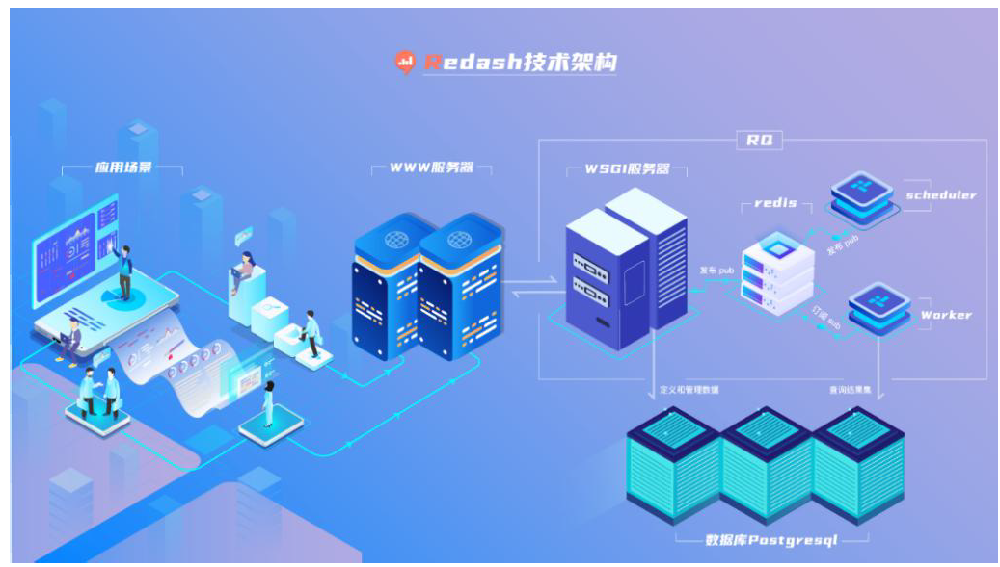

| 序号  | 修改时间       | 修改内容 | 修改人   | 审稿人   |
| --- | ---------- | ---- | ----- | ----- |
| 1   | 2021-12-14 | 创建。  | Keefe | Keefe |

   

---

[TOC]

 

---

# 简介

官网：https://blog.redash.io/

源码：https://github.com/getredash/redash

文档：https://redash.io/help/   https://www.dazdata.com/docs/    [Readme](https://github.com/getredash/redash#readme)

## 架构原理

Redash是一款完全支持互联网部署的B/S架构的报表可视化平台，数据库接口层丰富，功能模块多样化。可以提供更加优质保密的信息，保证了用户数据的安全性。

**系统架构**   如下图所示，

**技术架构**  如下图所示，

Redash 的后台主要分为三部分，为Server服务器、Worker任务执行程序和Scheduler任务调度程序。Server服务器、Worker任务执行程序和Scheduler任务调度程序三者之间没有任何任何依赖，不存在调用关系，完全依靠居中的Redis 来进行消息发布订阅(Pub/Sub)服务。这套架构模式是通过Python 的RQ 组件来完成的。

* Server服务器是一个具有WSGI 接口的Web 应用，Server 服务器是基于Python 的Flask 框架开发的，调式环境下Flask 框架自带简易应用服务器，生产环境需要配备uWSGI 应用服务器。
* Worker任务执行程序和Scheduler 任务调度程序是命令行终端程序。
* Redash 依赖 Redis 和 Postgresql。Redis作为消息队列RQ，Postgresql存储元数据。

**数据库安全设计**

Redash默认以当前linux用户作为角色连接本地postgres数据库，所以在安装环节有一步已当前用户名创建角色并可赋予登录权限，另外所有相关数据库表都以该角色创建并拥有。可以通过配置环境变量REDASH_DATABASE_URL更换连接方式。

Redash新建的用户的密码都是RSA加密形式存储。

Redash新建的数据源的密码都是RSA加密形式存储。

Redash系统参数变更后会重新生成slug伪静态化代码。

## 二次开发

开发工具：前端React基本都采用VSCODE，后端可以选择VSCODE或PyCharm。

技术栈：Python Flask + React。

数据库：Redis + Postgresql。后台查询运行在RQ异步队列之上；OLAP采用Postgresql分析型数据库。

# 源码结构

表格  项目顶层目录结构

| 一级目录或文件     | 二级目录或文件    | 简介           |
| ------------------ | ----------------- | -------------- |
| client/            |                   | 客户端/前端    |
| redash/            |                   | 服务端         |
| tests/             |                   | 测试目录       |
| bin/               |                   | 二进制         |
| scripts/           |                   | 脚本           |
| viz-lib/           | src/ `__tests__/` | 可视化库       |
| CHANGELOG.md       |                   | 更改日志       |
| CONTRIBUTING.md    |                   | 贡献指引       |
| docker-compose.yml |                   |                |
| Dockerfile         |                   |                |
| manager.py         |                   | 服务端启动入口 |
| package.json       |                   |                |
| setup.cfg          |                   |                |
| webpack.config.js  |                   | 前端打包配置   |
| worker.conf        |                   | 工作进程配置   |

# 服务端 redash/

表格  源码后端目录redash里的组织结构

| 目录或文件            | 次模块 | 简介    |
| ---------------- | --- | ----- |
| authentication   |     | 认证    |
| cli              |     | 命令行   |
| destinations     |     |       |
| handlers         |     |       |
| metrics          |     | 指标    |
| models           |     | 模型    |
| query_runner     |     | 查询运行器 |
| serializers      |     | 序列化   |
| settings         |     | 配置    |
| tasks            |     | 任务    |
| templates        |     | 模板    |
| utils            |     | 工具    |
| app.py           |     |       |
| extensions.py    |     | 扩展    |
| monitor.py       |     | 监控    |
| permissions.py   |     | 权限    |
| security.py      |     | 安全    |
| version_check.py |     |       |
| worker.py        |     | 工作进程  |
| wsgi.py          |     |       |

# 客户端 client/

表格  源码客户端目录client文件组织结构

| 目录或文件   | 次模块         | 简介  |
| ------- | ----------- | --- |
| app     |             |     |
|         | assets      |     |
|         | compoments  |     |
|         | config      |     |
|         | extensions  |     |
|         | lib         |     |
|         | pages       |     |
|         | redash-font |     |
|         | services    |     |
|         | styles      |     |
| cypress |             |     |
|         | integration |     |
|         | plugins     |     |
|         | suppport    |     |
|         |             |     |
|         |             |     |
|         |             |     |
|         |             |     |
|         |             |     |
|         |             |     |
|         |             |     |

 

# 参考资料

* redash源码  https://github.com/getredash/redash
* [Dazdata BI | Redash中文版](https://www.dazdata.com/)   https://www.dazdata.com/
