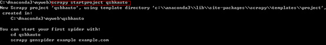
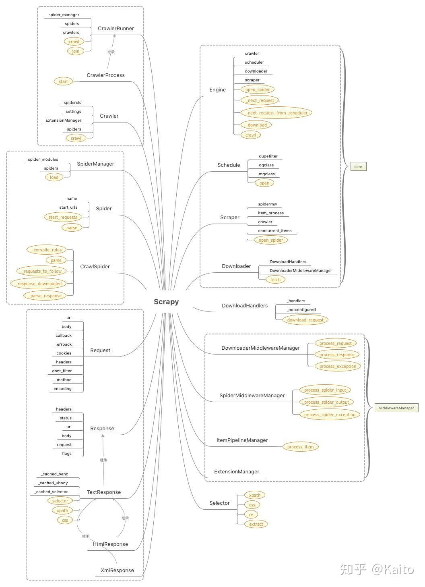

| 序号 | 修改时间  | 修改内容         | 修改人 | 审稿人 |
| ---- | --------- | ---------------- | ------ | ------ |
| 1    | 2017-1-16 | 创建             | Keefe  |        |
| 2    | 2021-6-15 | 补充源码分析章节 | 同上   |        |


---

[TOC]


---

# 1 简介

Scrapy是一个为了爬取网站数据，提取结构性数据而编写的应用框架，非常出名，非常强悍。

Scrapy是一个单机版Spider，但我们可以非常方便地编写插件，或者自定义组件替换默认的功能，从而定制化我们自己的爬虫，最终可以实现一个功能强大的爬虫框架，例如分布式、代理调度、并发控制、可视化、监控等功能，它的灵活度非常高。

官网：https://scrapy.org/

源码分析版本： scrapy-1.4.0

依赖：w3lib queuelib twisted scrapy

安装： `pip install scrapy`


Scrapy版本说明

| 版本号 | 发布时间   | 新增特性                 |
| ------ | ---------- | ------------------------ |
| 0.7    | 2008       | First release of Scrapy. |
| 0.16   | 2012-10-18 |                          |
| 1.0    | 2015-06-19 |                          |
| 1.4    | 2017-05-18 |                          |
| 1.5    | 2017-12-29 |                          |
| 1.6    | 2019-01-30 |                          |
| 1.7    | 2019-07-18 |                          |
| 1.8    | 2019-10-28 |                          |
| 2.0    | 2020-03-03 |                          |
| 2.1    | 2020-04-24 |                          |
| 2.2    | 2020-06-24 |                          |
| 2.3    | 2020-08-04 |                          |
| 2.4    | 2020-10-11 |                          |
| 2.5    | 2021-04-06 |                          |

> 版本号a.b.0简写为a.b
>
> 版本更新频率：一个月一个小版本。
>
> 详见 https://docs.scrapy.org/en/latest/news.html


# 2 用户篇

## 命令行工具

使用：

```shell
$ scrapy.exe  --help
Scrapy 2.5.0 - no active project

Usage:
  scrapy <command> [options] [args]


Available commands:
  bench         Run quick benchmark test
  check         Check spider contracts
  commands
  crawl         Run a spider
  edit          Edit spider
  fetch         Fetch a URL using the Scrapy downloader
  genspider     Generate new spider using pre-defined templates
  list          List available spiders
  parse         Parse URL (using its spider) and print the results
  runspider     Run a self-contained spider (without creating a project)
  settings      Get settings values
  shell         Interactive scraping console
  startproject  Create new project
  version       Print Scrapy version
  view          Open URL in browser, as seen by Scrapy

Use "scrapy <command> -h" to see more info about a command
```

全局命令：

项目命令：craw check list parse edit bench


## Scrapy爬虫项目初始化

简单来讲，编写和运行一个爬虫只需以下几步：

1. 使用 `scrapy startproject` 命令创建一个爬虫模板，或自己按模板编写爬虫代码
2. 定义一个爬虫类，并继承 `scrapy.Spider`，然后重写 `parse` 方法
3. `parse` 方法里编写网页解析逻辑，以及抓取路径
4. 使用 `scrapy runspider ` 运行这个爬虫

step1: 创建一个爬虫项目 startproject,  会自动创建 项目目录及相应文件

打开CMD，切换到存储爬虫项目的目录下，输入(示例项目名是 spiderproject)：

```shell
# 创建项目
$ scrapy startproject spiderproject
New Scrapy project 'spiderproject', using template directory 'e:\dev\python\bin
python37\lib\site-packages\scrapy\templates\project', created in:
    e:\Workspaces\python.ws\spider\spiderproject

You can start your first spider with:
    cd spiderproject
    scrapy genspider example example.com

# 生成项目目录，并生成相应文件items middlewares pipelines settings spiders目录
keefe@LENOVO-PC /e/Workspaces/python.ws/spider
$ find spiderproject/
spiderproject/
spiderproject/scrapy.cfg
spiderproject/spiderproject
spiderproject/spiderproject/items.py
spiderproject/spiderproject/middlewares.py
spiderproject/spiderproject/pipelines.py
spiderproject/spiderproject/settings.py		#项目配置
spiderproject/spiderproject/spiders
spiderproject/spiderproject/spiders/__init__.py
spiderproject/spiderproject/__init__.py
```

项目结构说明*

* items.py：项目实体，要提取的内容的容器，如当当网商品的标题、评论数等

* pipelines.py：项目管道，主要用于数据的后续处理，如将数据写入Excel和db等

* settings.py：项目设置，如默认是不开启pipeline、遵守robots协议等

* scrapy.cfg：项目配置


**step2: 创建爬虫应用程序**

创建爬虫应用程序有二种方式，

* 一种不需要创建爬虫项目:  `scrapy runspider`

* 另外一种先要预创建爬虫项目，再执行下面命令:  `scrapy genspider [xxapp] [dns]`

```shell
#下面示例 spider app名是sohu，起始URL是news.sohu.com
scrapy genspider -t crawl sohu news.sohu.com

# 会在目录spiders生成 xxapp.py，如上面命令生成的sohu.py
```


**step3:  重写parse方法**，spiders/xxapp.py 修改解析网页项  xxSpider.parse_item()

**step4:  执行爬虫程序(cmd)**： `scrapy crawl 应用名称, -o 数据存储格式`

// -o支持xml/json/csv

`scrapy crwal sohu -o xx.xml`


## 配置项

可用的环境变量：

* SCRAPY_SETTINGS_MODULE  (see [Designating the settings](https://doc.scrapy.org/en/latest/topics/settings.html#topics-settings-module-envvar))
* SCRAPY_PROJECT  (see [Sharing the root directory between projects](https://doc.scrapy.org/en/latest/topics/commands.html#topics-project-envvar))
* SCRAPY_PYTHON_SHELL (see [Scrapy shell](https://doc.scrapy.org/en/latest/topics/shell.html#topics-shell))

### 全局配置项 scrapy.cfg

配置项的优先级：

1. `/etc/scrapy.cfg` or `c:\scrapy\scrapy.cfg` (system-wide),
2. `~/.config/scrapy.cfg` (`$XDG_CONFIG_HOME`) and `~/.scrapy.cfg` (`$HOME`) for global (user-wide) settings, and
3. `scrapy.cfg` inside a Scrapy project’s root (see next section).


 scrapy.cfg 项目配置

```ini
# Automatically created by: scrapy startproject
#
# For more information about the [deploy] section see:
# https://scrapyd.readthedocs.io/en/latest/deploy.html

[settings]
default = spiderproject.settings

[deploy]
#url = http://localhost:6800/
project = spiderproject
```


### 自定义 settings.py

项目设置，如默认是不开启pipeline、遵守robots协议等。

```python
# Scrapy settings for spiderproject project
#
# For simplicity, this file contains only settings considered important or
# commonly used. You can find more settings consulting the documentation:
#
#     https://docs.scrapy.org/en/latest/topics/settings.html
#     https://docs.scrapy.org/en/latest/topics/downloader-middleware.html
#     https://docs.scrapy.org/en/latest/topics/spider-middleware.html

BOT_NAME = 'spiderproject'

SPIDER_MODULES = ['spiderproject.spiders']
NEWSPIDER_MODULE = 'spiderproject.spiders'


# Crawl responsibly by identifying yourself (and your website) on the user-agent
#USER_AGENT = 'spiderproject (+http://www.yourdomain.com)'

# Obey robots.txt rules: 是否遵守robots协议，缺省遵守True
ROBOTSTXT_OBEY = True

# Configure maximum concurrent requests performed by Scrapy (default: 16)
#CONCURRENT_REQUESTS = 32

# Configure a delay for requests for the same website (default: 0)
# See https://docs.scrapy.org/en/latest/topics/settings.html#download-delay
# See also autothrottle settings and docs
#DOWNLOAD_DELAY = 3
# The download delay setting will honor only one of:
#CONCURRENT_REQUESTS_PER_DOMAIN = 16
#CONCURRENT_REQUESTS_PER_IP = 16

# Disable cookies (enabled by default)
#COOKIES_ENABLED = False

# Disable Telnet Console (enabled by default)
#TELNETCONSOLE_ENABLED = False

# Override the default request headers:
#DEFAULT_REQUEST_HEADERS = {
#   'Accept': 'text/html,application/xhtml+xml,application/xml;q=0.9,*/*;q=0.8',
#   'Accept-Language': 'en',
#}

# Enable or disable spider middlewares 爬虫中间件
# See https://docs.scrapy.org/en/latest/topics/spider-middleware.html
#SPIDER_MIDDLEWARES = {
#    'spiderproject.middlewares.SpiderprojectSpiderMiddleware': 543,
#}

# Enable or disable downloader middlewares 下载中间件
# See https://docs.scrapy.org/en/latest/topics/downloader-middleware.html
#DOWNLOADER_MIDDLEWARES = {
#    'spiderproject.middlewares.SpiderprojectDownloaderMiddleware': 543,
#}

# Enable or disable extensions
# See https://docs.scrapy.org/en/latest/topics/extensions.html
#EXTENSIONS = {
#    'scrapy.extensions.telnet.TelnetConsole': None,
#}

# Configure item pipelines
# See https://docs.scrapy.org/en/latest/topics/item-pipeline.html
#ITEM_PIPELINES = {
#    'spiderproject.pipelines.SpiderprojectPipeline': 300,
#}

# Enable and configure the AutoThrottle extension (disabled by default)
# See https://docs.scrapy.org/en/latest/topics/autothrottle.html
#AUTOTHROTTLE_ENABLED = True
# The initial download delay
#AUTOTHROTTLE_START_DELAY = 5
# The maximum download delay to be set in case of high latencies
#AUTOTHROTTLE_MAX_DELAY = 60
# The average number of requests Scrapy should be sending in parallel to
# each remote server
#AUTOTHROTTLE_TARGET_CONCURRENCY = 1.0
# Enable showing throttling stats for every response received:
#AUTOTHROTTLE_DEBUG = False

# Enable and configure HTTP caching (disabled by default)
# See https://docs.scrapy.org/en/latest/topics/downloader-middleware.html#httpcache-middleware-settings
#HTTPCACHE_ENABLED = True
#HTTPCACHE_EXPIRATION_SECS = 0
#HTTPCACHE_DIR = 'httpcache'
#HTTPCACHE_IGNORE_HTTP_CODES = []
#HTTPCACHE_STORAGE = 'scrapy.extensions.httpcache.FilesystemCacheStorage'

```


## 自定义实现项

items.py 实体

```python
# Define here the models for your scraped items
#
# See documentation in:
# https://docs.scrapy.org/en/latest/topics/items.html

import scrapy


class SpiderprojectItem(scrapy.Item):
    # define the fields for your item here like:
    # name = scrapy.Field()
    pass
```


middlewares.py

```python
from scrapy import signals

# useful for handling different item types with a single interface
from itemadapter import is_item, ItemAdapter


class SpiderprojectSpiderMiddleware:
    # Not all methods need to be defined. If a method is not defined,
    # scrapy acts as if the spider middleware does not modify the
    # passed objects.

    @classmethod
    def from_crawler(cls, crawler):
        # This method is used by Scrapy to create your spiders.
        s = cls()
        crawler.signals.connect(s.spider_opened, signal=signals.spider_opened)
        return s
```


pipes.py 数据的加工存储

```python
# Define your item pipelines here
#
# Don't forget to add your pipeline to the ITEM_PIPELINES setting
# See: https://docs.scrapy.org/en/latest/topics/item-pipeline.html


# useful for handling different item types with a single interface
from itemadapter import ItemAdapter


class SpiderprojectPipeline:
    def process_item(self, item, spider):
        return item
```


## 示例爬虫

1. 带项目爬虫:  spiders/sohu.py

```python
import scrapy
from scrapy.linkextractors import LinkExtractor
from scrapy.spiders import CrawlSpider, Rule


class SohuSpider(CrawlSpider):
    name = 'sohu'
    allowed_domains = ['news.sohu.com']
    start_urls = ['http://news.sohu.com/']

    rules = (
        Rule(LinkExtractor(allow=r'Items/'), callback='parse_item', follow=True),
    )

    def parse_item(self, response):
        item = {}
        #item['domain_id'] = response.xpath('//input[@id="sid"]/@value').get()
        #item['name'] = response.xpath('//div[@id="name"]').get()
        #item['description'] = response.xpath('//div[@id="description"]').get()
        return item

    #访问起始URL并获取结果后的回调函数，该函数的response参数就是向起始的url发送请求后，获取的响应对象.该函数返回值必须为可迭代对象或者NUll
    def parse(self, response):
        print(response.text) #获取字符串类型的响应内容
        print(response.body) #获取字节类型的相应内容
```

运行:  `scrapy crawl sohu -o mingyan.json`


2. 无项目爬虫 myspider.py

```python
import scrapy
class MySpider(scrapy.Spider):
    name = "quotes"
    start_urls = [
        'http://lab.scrapyd.cn/',
    ]

    def parse(self, response):
        for quote in response.css('div.quote'):
            yield {
                '内容': quote.css('span.text::text').extract_first(),
                '作者': quote.xpath('span/small/text()').extract_first(),
            }

        next_page = response.css('li.next a::attr("href")').extract_first()
        if next_page is not None:
            yield scrapy.Request(next_page, self.parse)
```

运行:  `scrapy runspider mypider.py -o my.json`


3. 无项目爬虫，本地跑

   在示例2基础上，加上主函数

   ```python
   if __name__ == "__main__":
       from scrapy.settings import Settings
       from scrapy.crawler import CrawlerProcess
       settings = Settings()	# settings.py
       crawler_process = CrawlerProcess(settings)
       crawler_process.crawl(MySpider)    #, {'-o':'my2.xml'}
       crawler_process.start()
   ```

   运行： `python myspier.py`


# 3 架构篇

Scrapy是一个基于Twisted，纯Python实现的爬虫框架，用户只需要定制开发几个模块就可以轻松的实现一个爬虫，用来抓取网页内容以及各种图片，非常之方便。

## 架构

整体架构大致如下



图 1 Scrapy框架

从架构图可以看到，Scrapy 主要包含以下五大模块（包括三个独立组件调度器、Spider和下载器）：

- `Scrapy Engine`：核心引擎，负责控制和调度各个组件，保证数据流转；
- `Scheduler`：负责管理任务、过滤任务、输出任务的调度器，存储、去重任务都在此控制；
- `Downloader`：下载器，负责在网络上下载数据，输入待下载的 URL，输出下载结果；
- `Spiders`：我们自己编写的爬虫逻辑，定义抓取意图；
- `Item Pipeline`：负责输出结构化数据，可自定义格式和输出的位置；

还有三个中间件模块：

- `Downloader middlewares`：介于引擎和下载器之间，可以在网页在下载前、后进行逻辑处理；
- `Spider middlewares`：介于引擎和爬虫之间，在向爬虫输入下载结果前，和爬虫输出请求 / 数据后进行逻辑处理；
- Schedule middlewares:

Scrapy的处理逻辑如下：绿线是数据流向。

1. **引擎**从**自定义爬虫**中获取初始化请求（也叫种子 URL）；
2. 引擎把该请求放入**调度器**中，同时调度器向引擎获取待下载的请求；
3. 调度器把**待下载**的请求发给引擎；
4. 引擎发送请求给**下载器**，中间会经过一系列**下载器中间件**；
5. 这个请求通过下载器下载完成后，生成一个**响应对象**，返回给引擎，这中间会再次经过一系列**下载器中间件**；
6. 引擎接收到下载器返回的响应后，发送给爬虫，中间会经过一系列**爬虫中间件**，最后执行爬虫**自定义的解析逻辑**；
7. 爬虫执行完自定义的解析逻辑后，生成**结果对象**或**新的请求对象**（解析后生成二种可能，一是新的请求对象即URL，二是结果对象-即详情页结果）给引擎，再次经过一系列**爬虫中间件**；
8. 引擎把爬虫返回的结果对象交由**结果处理器**处理，把**新的请求**通过引擎再交给**调度器**；
9. 重复执行1-8，直到**调度器**中没有新的请求处理，任务结束；


## 类图概览

- 五大核心类： `Scrapy Engine`、`Scheduler`、`Downloader`、`Spiders`, `Item Pipeline`；
- 四个中间件管理器类：`DownloaderMiddlewareManager`、`SpiderMiddlewareManager`、`ItemPipelineMiddlewareManager`、`ExtensionManager`；
- 其他辅助类：`Request`、`Response`、`Selector`；




# 4 源码分析篇

## 4.1 源码结构说明

| 目录或文件          | 子目录或文件或函数                       | 功能说明                     |
| ------------------- | ---------------------------------------- | ---------------------------- |
| commands            | [cmd].py                                 | 命令行目录及相应命令文件     |
| contracts           |                                          |                              |
| contrib             |                                          |                              |
| core                | download, handle                         | 核心组件包括下载、调度、引擎 |
| downloadmiddlewares |                                          | 下载中间件                   |
| etensions           |                                          | 扩展                         |
| http                | request.py response.py                   | 请求响应的处理               |
| linnkextractors     |                                          | 链接抽取                     |
| loader              |                                          | 爬虫加载器                   |
| pipelines           |                                          | pipelines                    |
| selector            |                                          | 选择器                       |
| settings            |                                          | 配置信息                     |
| spidermiddlewares   |                                          | 爬虫中间件                   |
| spiders             | `__init__.py:Spider`                     | 爬虫对象                     |
| templates           |                                          | 模板                         |
| utils               |                                          | 工具函数                     |
| xlib                |                                          |                              |
| cmdline.py          | execute()                                | 命令行入口                   |
| crawler.py          | CrawlerProcess CrawlerRunner <br>Crawler | 采集器对象                   |
| commands.py         | `from scrapy.commands import *`          | 导入命令行目录所有命令文件   |
| item.py             |                                          | 实体                         |
| ...              |                                          |                              |

说明：源码最外层目录是scrapy。


## 4.2 Spider运行前

Scrapy 在真正运行前，需要做的工作包括配置环境初始化、命令类的加载、爬虫模块的加载，以及命令类和参数解析，之后运行我们的爬虫类，最终，这个爬虫类的调度交给引擎处理。

### 命令行入口函数 cmdline.execute

setup.py

```python
entry_points={
    'console_scripts': ['scrapy = scrapy.cmdline:execute']
},
```

scrapy/cmdline.py

```python
def execute(argv=None, settings=None):
    if argv is None:
        argv = sys.argv

    # --- backwards compatibility for scrapy.conf.settings singleton ---
    if settings is None and 'scrapy.conf' in sys.modules:
        from scrapy import conf
        if hasattr(conf, 'settings'):
            settings = conf.settings
    # ------------------------------------------------------------------

    if settings is None:
        settings = get_project_settings()
        # set EDITOR from environment if available
        try:
            editor = os.environ['EDITOR']
        except KeyError: pass
        else:
            settings['EDITOR'] = editor
    check_deprecated_settings(settings)

    # --- backwards compatibility for scrapy.conf.settings singleton ---
    import warnings
    from scrapy.exceptions import ScrapyDeprecationWarning
    with warnings.catch_warnings():
        warnings.simplefilter("ignore", ScrapyDeprecationWarning)
        from scrapy import conf
        conf.settings = settings
    # ------------------------------------------------------------------

    # 执行环境是否在项目中 主要检查scrapy.cfg配置文件是否存在
    inproject = inside_project()
    # 读取commands文件夹 把所有的命令类转换为{cmd_name: cmd_instance}的字典
    cmds = _get_commands_dict(settings, inproject)
    cmdname = _pop_command_name(argv)
    parser = optparse.OptionParser(formatter=optparse.TitledHelpFormatter(), \
        conflict_handler='resolve')
    if not cmdname:
        _print_commands(settings, inproject)
        sys.exit(0)
    elif cmdname not in cmds:
        _print_unknown_command(settings, cmdname, inproject)
        sys.exit(2)

    # 根据命令名称找到对应的命令实例
    cmd = cmds[cmdname]
    parser.usage = "scrapy %s %s" % (cmdname, cmd.syntax())
    parser.description = cmd.long_desc()
    settings.setdict(cmd.default_settings, priority='command')
    cmd.settings = settings
    cmd.add_options(parser)
    # 解析命令参数，并交由Scrapy命令实例处理
    opts, args = parser.parse_args(args=argv[1:])
    _run_print_help(parser, cmd.process_options, args, opts)

    # 初始化CrawlerProcess实例 并给命令实例添加crawler_process属性
    cmd.crawler_process = CrawlerProcess(settings)
    # 执行命令实例的run方法
    _run_print_help(parser, _run_command, cmd, args, opts)
    sys.exit(cmd.exitcode)

def _run_command(cmd, args, opts):
    """ 有可选参数，执行带可选参数的命令；没有则执行cmd.run"""
    if opts.profile:
        _run_command_profiled(cmd, args, opts)
    else:
        cmd.run(args, opts)    #具体命令的run()方法
```


### commands 命令集

commands说明

* 基类：class ScrapyCommand(object)
* 命令文件xx.py：bench check crawl edit fetch...

1. 命令基类

   scrapy/commands/__init.py

```python
class ScrapyCommand(object):

    requires_project = False
    crawler_process = None  #外部调用self.set_crawler()赋值

    # default settings to be used for this command instead of global defaults
    default_settings = {}
    exitcode = 0

    def __init__(self):
        self.settings = None  # set in scrapy.cmdline

    def set_crawler(self, crawler):
        assert not hasattr(self, '_crawler'), "crawler already set"
        self._crawler = crawler

    #公共方法：help syntax short_desc add_options process_options run

    def run(self, args, opts):
        """
        Entry point for running commands  子类必须实现
        """
        raise NotImplementedError

```

2. 示例命令：crawl

scrapy/commands/crawl.py

```python
from scrapy.commands import ScrapyCommand

class Command(ScrapyCommand):

    requires_project = True

    def syntax(self):
        return "[options] <spider>"

    def short_desc(self):
        return "Run a spider"

    def add_options(self, parser):
        """ 添加可选参数 """
        ScrapyCommand.add_options(self, parser)
        parser.add_option("-a", dest="spargs", action="append", default=[], metavar="NAME=VALUE",
                          help="set spider argument (may be repeated)")
        parser.add_option("-o", "--output", metavar="FILE",
                          help="dump scraped items into FILE (use - for stdout)")
        parser.add_option("-t", "--output-format", metavar="FORMAT",
                          help="format to use for dumping items with -o")

    def process_options(self, args, opts):
        """ 处理可选参数 """


    def run(self, args, opts):
        """ 实际的命令执行入口 """
        if len(args) < 1:
            raise UsageError()
        elif len(args) > 1:
            raise UsageError("running 'scrapy crawl' with more than one spider is no longer supported")
        spname = args[0]

        self.crawler_process.crawl(spname, **opts.spargs) #填充url
        self.crawler_process.start()  # 调用reactor开始执行

```

3. runspider命令

   scrapy/commands/runspider.py

```python
from scrapy.utils.spider import iter_spider_classes
from scrapy.commands import ScrapyCommand

class Command(ScrapyCommand):

    requires_project = False
    default_settings = {'SPIDER_LOADER_WARN_ONLY': True}

    def run(self, args, opts):
        if len(args) != 1:
            raise UsageError()
        filename = args[0]
        if not os.path.exists(filename):
            raise UsageError("File not found: %s\n" % filename)
        try:
            module = _import_file(filename)
        except (ImportError, ValueError) as e:
            raise UsageError("Unable to load %r: %s\n" % (filename, e))
        spclasses = list(iter_spider_classes(module)) #获取Spider对象
        if not spclasses:
            raise UsageError("No spider found in file: %s\n" % filename)
        spidercls = spclasses.pop()

        self.crawler_process.crawl(spidercls, **opts.spargs)  #初始化
        self.crawler_process.start()	#调用reactor

```


### crawler 爬行器对象和爬行器运行态对象

scrapy/crawler.py

* 爬行器对象Crawler：属性有执行引擎，配置信息、信号、状态等
* 爬行器运行态对象 CrawlerProcess（多个）  -> CrawlerRunner（单个）：

```python
from twisted.internet import reactor, defer

class Crawler(object):
	""" 爬虫对象 """
    def __init__(self, spidercls, settings=None):

        self.spidercls = spidercls
        self.settings = settings.copy()
        self.spidercls.update_settings(self.settings)

        self.signals = SignalManager(self)
        self.stats = load_object(self.settings['STATS_CLASS'])(self)

        handler = LogCounterHandler(self, level=self.settings.get('LOG_LEVEL'))
        logging.root.addHandler(handler)
        if get_scrapy_root_handler() is not None:
            # scrapy root handler alread installed: update it with new settings
            install_scrapy_root_handler(self.settings)
        # lambda is assigned to Crawler attribute because this way it is not
        # garbage collected after leaving __init__ scope
        self.__remove_handler = lambda: logging.root.removeHandler(handler)
        self.signals.connect(self.__remove_handler, signals.engine_stopped)

        lf_cls = load_object(self.settings['LOG_FORMATTER'])
        self.logformatter = lf_cls.from_crawler(self)
        self.extensions = ExtensionManager.from_crawler(self)

        self.settings.freeze()
        self.crawling = False
        self.spider = None	#调用self._create_spider()
        self.engine = None  #ExecutionEngine，调用self._create_engine()

    @defer.inlineCallbacks
    def crawl(self, *args, **kwargs):
        """ 迭代器实现回调：创建Crawler实例，创建引擎，...最终返回一个加工后的request给Engine"""
        assert not self.crawling, "Crawling already taking place"
        self.crawling = True

        try:
            self.spider = self._create_spider(*args, **kwargs)
            self.engine = self._create_engine()  #创建引擎
            # 调用spider的start_requests 获取种子URL
            start_requests = iter(self.spider.start_requests())
            # 调用engine的open_spider 交由引擎调度
            yield self.engine.open_spider(self.spider, start_requests)
            yield defer.maybeDeferred(self.engine.start)
        except Exception:
            # In Python 2 reraising an exception after yield discards
            # the original traceback (see http://bugs.python.org/issue7563),
            # so sys.exc_info() workaround is used.
            # This workaround also works in Python 3, but it is not needed,
            # and it is slower, so in Python 3 we use native `raise`.
            if six.PY2:
                exc_info = sys.exc_info()

            self.crawling = False
            if self.engine is not None:
                yield self.engine.close()

            if six.PY2:
                six.reraise(*exc_info)
            raise
```

爬取器运行对象

* CrawlerProcess: start

* CrawlerRunner:  crawl

```python
class CrawlerRunner(object):
    """
    爬虫运行态对象
    This is a convenient helper class that keeps track of, manages and runs
    crawlers inside an already setup Twisted `reactor`_.

    The CrawlerRunner object must be instantiated with a
    :class:`~scrapy.settings.Settings` object.

    This class shouldn't be needed (since Scrapy is responsible of using it
    accordingly) unless writing scripts that manually handle the crawling
    process. See :ref:`run-from-script` for an example.
    """

    crawlers = property(
        lambda self: self._crawlers,
        doc="Set of :class:`crawlers <scrapy.crawler.Crawler>` started by "
            ":meth:`crawl` and managed by this class."
    )

    def __init__(self, settings=None):
        if isinstance(settings, dict) or settings is None:
            settings = Settings(settings)
        self.settings = settings
        self.spider_loader = _get_spider_loader(settings) # 爬虫加载类，生成{spider_name: spider_cls} 的字典
        self._crawlers = set()	#爬虫名称元组，如(sohu,xx)
        self._active = set()  #活跃的爬虫对象元组

    def crawl(self, crawler_or_spidercls, *args, **kwargs):
        """
        Run a crawler with the provided arguments.
        Returns a deferred that is fired when the crawling is finished.
        :param crawler_or_spidercls: already created crawler, or a spider class
            or spider's name inside the project to create it
        :type crawler_or_spidercls: :class:`~scrapy.crawler.Crawler` instance,
            :class:`~scrapy.spiders.Spider` subclass or string

        :param list args: arguments to initialize the spider
        :param dict kwargs: keyword arguments to initialize the spider
        """
        crawler = self.create_crawler(crawler_or_spidercls) #创建Crawler类实例
        return self._crawl(crawler, *args, **kwargs)

    def _crawl(self, crawler, *args, **kwargs):
        self.crawlers.add(crawler)  #添加具体的spider名称到元组
        d = crawler.crawl(*args, **kwargs)	# 生成运行中的爬虫对象
        self._active.add(d)  	#添加为活跃的spider对象


class CrawlerProcess(CrawlerRunner):
    """ 同时跑多个spider, 调用twisted模块的react模式实现 """
    def __init__(self, settings=None):
        super(CrawlerProcess, self).__init__(settings) #调用父类构造函数
        install_shutdown_handlers(self._signal_shutdown)
        configure_logging(self.settings)
        log_scrapy_info(self.settings)

    def start(self, stop_after_crawl=True):
        """
        独有的方法, 调用twisted的reactor实现线程调度执行
        This method starts a Twisted `reactor`_, adjusts its pool size to
        :setting:`REACTOR_THREADPOOL_MAXSIZE`, and installs a DNS cache based
        on :setting:`DNSCACHE_ENABLED` and :setting:`DNSCACHE_SIZE`.

        If `stop_after_crawl` is True, the reactor will be stopped after all
        crawlers have finished, using :meth:`join`.

        :param boolean stop_after_crawl: stop or not the reactor when all
            crawlers have finished. True时等待所有线程结束
        """
        if stop_after_crawl:
            d = self.join()
            # Don't start the reactor if the deferreds are already fired
            if d.called:
                return
            d.addBoth(self._stop_reactor)

        reactor.installResolver(self._get_dns_resolver())
        tp = reactor.getThreadPool()	#获取线程池
        tp.adjustPoolsize(maxthreads=self.settings.getint('REACTOR_THREADPOOL_MAXSIZE'))
        reactor.addSystemEventTrigger('before', 'shutdown', self.stop)
        reactor.run(installSignalHandlers=False)  # blocking call 阻塞调用
```


## 4.3 Spider运行时

运行前步骤小结：

1. 调用 `cmdline.py` 的 `execute` 方法

2. 找到对应的命令实例，执行命令 `xxcmd.run()`

3. 构建 `CrawlerProcess` 实例，调用 `crawl` 和 `start` 方法开始抓取。

   - `CrawlerProcess.crawl`方法实际调用Crawler实例的crawl方法，这个方法最终把控制权交给了`ExecuteEngine`。Engine会调用 `Spider.start_request()`获取种子URL并生成请求对象 。

   - `CrawlerProcess.start` 方法调用twisted的reactor，注册好协程池，开始异步调度工作。


### Twisted的reactor

`reactor` 是个什么东西呢？它是 `Twisted` 模块的事件管理器，我们只要把需要执行的事件注册到 `reactor` 中，然后调用它的 `run` 方法，它就会帮我们执行注册好的事件，如果遇到网络IO等待，它会自动帮切换到可执行的事件上，非常高效。


### Selector

提取网页内容项支持下面四种方法，

* css: `response.css('span.text::text').extract_first()`
* xpath: `response..xpath('span/small/text()').extract_first()`
* re
* extract


### Request

`scrapy/http/request/__init__.py`

Request封装了请求参数、请求方法、回调以及可附加的属性信息。可以在子类中重写 `start_requests` 和 `make_requests_from_url` 这 2 个方法，用来自定义逻辑构建种子请求。

```python
class Request(object_ref):

    def __init__(self, url, callback=None, method='GET', headers=None, body=None,
                 cookies=None, meta=None, encoding='utf-8', priority=0,
                 dont_filter=False, errback=None):
        # 编码
        self._encoding = encoding
        # 请求方法
        self.method = str(method).upper()
        # 设置url
        self._set_url(url)
        # 设置body
        self._set_body(body)
        assert isinstance(priority, int), "Request priority not an integer: %r" % priority
        # 优先级
        self.priority = priority
        assert callback or not errback, "Cannot use errback without a callback"
        # 回调函数
        self.callback = callback
        # 异常回调函数
        self.errback = errback
        # cookies
        self.cookies = cookies or {}
        # 构建Header
        self.headers = Headers(headers or {}, encoding=encoding)
        # 是否需要过滤
        self.dont_filter = dont_filter
  # 附加信息
        self._meta = dict(meta) if meta else None
```


## 4.4 Scrapy核心对象.core

### Spiders 对象

URL有两种写法，一种作为类的常量start_urls、一种作为 start_requests(self)方法的常量。

```python
# scrapy/spiders/__init__.py
class Spider(object_ref):
    """Base class for scrapy spiders. All spiders must inherit from this
    class.
    """

    name = None  #spider名称
    custom_settings = None

    def __init__(self, name=None, **kwargs):
        """初始化时，从入参中获取 name和start_urls的值 """
        if name is not None:
            self.name = name
        elif not getattr(self, 'name', None):
            raise ValueError("%s must have a name" % type(self).__name__)
        self.__dict__.update(kwargs)
        if not hasattr(self, 'start_urls'):
            self.start_urls = []   # 种子URL列表

    def parse(self, response):
        """ 子类需重新实现此方法 """
        raise NotImplementedError

    @classmethod
    def update_settings(cls, settings):
        settings.setdict(cls.custom_settings or {}, priority='spider')

    @classmethod
    def handles_request(cls, request):
        return url_is_from_spider(request.url, cls)

   def start_requests(self):
        """ request处理逻辑，返回处理过的request对象，在CrawlProcess.crawl方法里调用 """
        cls = self.__class__
        if method_is_overridden(cls, Spider, 'make_requests_from_url'):
            warnings.warn(
                "Spider.make_requests_from_url method is deprecated; it "
                "won't be called in future Scrapy releases. Please "
                "override Spider.start_requests method instead (see %s.%s)." % (
                    cls.__module__, cls.__name__
                ),
            )
            for url in self.start_urls:
                yield self.make_requests_from_url(url) #要废弃的子类重载方法
        else:
            for url in self.start_urls:
                yield Request(url, dont_filter=True)    #真正启动下载
```


scrapy/spiders/crawl.py

```python
import copy
import six

from scrapy.http import Request, HtmlResponse
from scrapy.utils.spider import iterate_spider_output
from scrapy.spiders import Spider

class Rule(object):
	""" 规则属性类，仅用来保存爬取时需要用到的数据或对象实例 """
    def __init__(self, link_extractor, callback=None, cb_kwargs=None, follow=None, process_links=None, process_request=identity):
        self.link_extractor = link_extractor
        self.callback = callback
        self.cb_kwargs = cb_kwargs or {}
        self.process_links = process_links
        self.process_request = process_request
        if follow is None:
            self.follow = False if callback else True
        else:
            self.follow = follow


class CrawlSpider(Spider):

    rules = ()

    def __init__(self, *a, **kw):
        super(CrawlSpider, self).__init__(*a, **kw)
        self._compile_rules()

    def parse(self, response):
        return self._parse_response(response, self.parse_start_url, cb_kwargs={}, follow=True)

    def parse_start_url(self, response): #从种子URL开始，子类重新实现
        return []

    def process_results(self, response, results): #处理结果，子类重新实现
        return results

    def _parse_response(self, response, callback, cb_kwargs, follow=True):
        """ 先后调用callback, process_result """
        if callback:
            cb_res = callback(response, **cb_kwargs) or ()
            cb_res = self.process_results(response, cb_res)
            for requests_or_item in iterate_spider_output(cb_res):
                yield requests_or_item

        if follow and self._follow_links:
            for request_or_item in self._requests_to_follow(response):
                yield request_or_item
```


### ExecuteEngine.执行引擎

scrapy/core/engine.py Engine对象

ExecutionEngine对象主要是对其他几个核心组件进行定义和初始化，主要包括包括：`Scheduler`、`Downloader`、`Scrapyer`。

引擎是整个 Scrapy 的核心大脑，它负责管理和调度这些组件，让这些组件更好地协调工作。

```python
from scrapy import signals
from scrapy.core.scraper import Scraper
from scrapy.exceptions import DontCloseSpider
from scrapy.http import Response, Request

class ExecutionEngine(object):

    def __init__(self, crawler, spider_closed_callback):
        self.crawler = crawler
        self.settings = crawler.settings
        self.signals = crawler.signals
        self.logformatter = crawler.logformatter
        self.slot = None
        self.spider = None
        self.running = False
        self.paused = False
        self.scheduler_cls = load_object(self.settings['SCHEDULER'])
        downloader_cls = load_object(self.settings['DOWNLOADER'])
        self.downloader = downloader_cls(crawler) #核心组件-下载器
        self.scraper = Scraper(crawler)	#Spider对象
        self._spider_closed_callback = spider_closed_callback

    @defer.inlineCallbacks
    def start(self):
        """Start the execution engine"""
        assert not self.running, "Engine already running"
        self.start_time = time()
        yield self.signals.send_catch_log_deferred(signal=signals.engine_started)
        self.running = True
        self._closewait = defer.Deferred()
        yield self._closewait
```


### Scheduler 调度器

scrapy/core/scheduler.py

调度器的初始化主要做了 2 件事：

- 实例化请求指纹过滤器：主要用来过滤重复请求；
- 定义不同类型的任务队列：优先级任务队列、基于磁盘的任务队列、基于内存的任务队列；

```python
class Scheduler(object):

    def __init__(self, dupefilter, jobdir=None, dqclass=None, mqclass=None,
                 logunser=False, stats=None, pqclass=None):
        # 指纹过滤器
        self.df = dupefilter
        # 任务队列文件夹
        self.dqdir = self._dqdir(jobdir)
        # 优先级任务队列类
        self.pqclass = pqclass
        # 磁盘任务队列类
        self.dqclass = dqclass
        # 内存任务队列类
        self.mqclass = mqclass
        # 日志是否序列化
        self.logunser = logunser
        self.stats = stats
```

调度器默认定义了 2 种队列类型：

- 基于磁盘的任务队列：在配置文件可配置存储路径，每次执行后会把队列任务保存到磁盘上；
- 基于内存的任务队列：每次都在内存中执行，下次启动则消失；

配置文件默认定义如下：

```python
# 基于磁盘的任务队列(后进先出)
SCHEDULER_DISK_QUEUE = 'scrapy.squeues.PickleLifoDiskQueue'
# 基于内存的任务队列(后进先出)
SCHEDULER_MEMORY_QUEUE = 'scrapy.squeues.LifoMemoryQueue'
# 优先级队列
SCHEDULER_PRIORITY_QUEUE = 'queuelib.PriorityQueue'
```


### Downloader 下载器

scrapy/core/downloader.py

初始化了**下载处理器DownloadHandlers**、**下载器中间件管理器DownloaderMiddlewareManager**以及从配置文件中拿到抓取请求控制的相关参数。

```python
class Downloader(object):
    """下载器"""
    def __init__(self, crawler):
        # 同样的 拿到settings对象
        self.settings = crawler.settings
        self.signals = crawler.signals
        self.slots = {}
        self.active = set()
        # 初始化DownloadHandlers
        self.handlers = DownloadHandlers(crawler)
        # 从配置中获取设置的并发数
        self.total_concurrency = self.settings.getint('CONCURRENT_REQUESTS')
        # 同一域名并发数
        self.domain_concurrency = self.settings.getint('CONCURRENT_REQUESTS_PER_DOMAIN')
        # 同一IP并发数
        self.ip_concurrency = self.settings.getint('CONCURRENT_REQUESTS_PER_IP')
        # 随机延迟下载时间
        self.randomize_delay = self.settings.getbool('RANDOMIZE_DOWNLOAD_DELAY')
        # 初始化下载器中间件
        self.middleware = DownloaderMiddlewareManager.from_crawler(crawler)
        self._slot_gc_loop = task.LoopingCall(self._slot_gc)
        self._slot_gc_loop.start(60)
```

下载处理器在默认的配置文件中是这样配置的：

```python
# 用户可自定义的下载处理器
DOWNLOAD_HANDLERS = {}
# 默认的下载处理器
DOWNLOAD_HANDLERS_BASE = {
    'file': 'scrapy.core.downloader.handlers.file.FileDownloadHandler',
    'http': 'scrapy.core.downloader.handlers.http.HTTPDownloadHandler',
    'https': 'scrapy.core.downloader.handlers.http.HTTPDownloadHandler',
    's3': 'scrapy.core.downloader.handlers.s3.S3DownloadHandler',
    'ftp': 'scrapy.core.downloader.handlers.ftp.FTPDownloadHandler',
}
```


### ItemPipes 实体管道线

`pipelines.py/__init__.py`

```python
from scrapy.middleware import MiddlewareManager
from scrapy.utils.conf import build_component_list

class ItemPipelineManager(MiddlewareManager):
	""" 管道中间件 """
    component_name = 'item pipeline'

    @classmethod
    def _get_mwlist_from_settings(cls, settings):
        return build_component_list(settings.getwithbase('ITEM_PIPELINES'))

    def _add_middleware(self, pipe):
        super(ItemPipelineManager, self)._add_middleware(pipe)
        if hasattr(pipe, 'process_item'):
            self.methods['process_item'].append(pipe.process_item)

    def process_item(self, item, spider):
        return self._process_chain('process_item', item, spider)

```


### MiddlewareManager 中间件管理

1. 基类  MiddlewareManager

   scrapy/middleware.py

```python
class MiddlewareManager(object):
    """Base class for implementing middleware managers"""

    component_name = 'foo middleware'

    def __init__(self, *middlewares):
        self.middlewares = middlewares
        self.methods = defaultdict(list)
        for mw in middlewares:
            self._add_middleware(mw)

```

2. 子类中间件:  下载、spider、pipelines

SpiderMiddlewareManager: scrapy.core.spidermw.py

```python
from scrapy.middleware import MiddlewareManager

class SpiderMiddlewareManager(MiddlewareManager):

    component_name = 'spider middleware'

    @classmethod
    def _get_mwlist_from_settings(cls, settings):
        return build_component_list(settings.getwithbase('SPIDER_MIDDLEWARES'))

    def _add_middleware(self, mw):
        super(SpiderMiddlewareManager, self)._add_middleware(mw)
        if hasattr(mw, 'process_spider_input'):
            self.methods['process_spider_input'].append(mw.process_spider_input)
        if hasattr(mw, 'process_spider_output'):
            self.methods['process_spider_output'].insert(0, mw.process_spider_output)
        if hasattr(mw, 'process_spider_exception'):
            self.methods['process_spider_exception'].insert(0, mw.process_spider_exception)
        if hasattr(mw, 'process_start_requests'):
            self.methods['process_start_requests'].insert(0, mw.process_start_requests)
```


DownloaderMiddlewareManager:  scrapy/core/downloader/middleware.py

```python
class DownloaderMiddlewareManager(MiddlewareManager):
    component_name = 'downloader middleware'

    @classmethod
    def _get_mwlist_from_settings(cls, settings):
        return build_component_list(
            settings.getwithbase('DOWNLOADER_MIDDLEWARES'))

    def _add_middleware(self, mw):
        if hasattr(mw, 'process_request'):
            self.methods['process_request'].append(mw.process_request)
        if hasattr(mw, 'process_response'):
            self.methods['process_response'].insert(0, mw.process_response)
        if hasattr(mw, 'process_exception'):
            self.methods['process_exception'].insert(0, mw.process_exception)
```


### Scraper

scrapy/core/scraper.py

Scraper类处于`Engine`、`Spiders`、`Pipeline` 之间，是连通这三个组件的桥梁。

```python
class Slot(object):
    """Scraper slot (one per running spider)"""

    MIN_RESPONSE_SIZE = 1024

    def __init__(self, max_active_size=5000000):
        self.max_active_size = max_active_size
        self.queue = deque()
        self.active = set()
        self.active_size = 0
        self.itemproc_size = 0
        self.closing = None


class Scraper(object):

    def __init__(self, crawler):
        self.slot = None
        # 实例化爬虫中间件管理器
        self.spidermw = SpiderMiddlewareManager.from_crawler(crawler)
        # 从配置文件中加载Pipeline处理器类
        itemproc_cls = load_object(crawler.settings['ITEM_PROCESSOR'])
        # 实例化Pipeline处理器
        self.itemproc = itemproc_cls.from_crawler(crawler)
        # 从配置文件中获取同时处理输出的任务个数
        self.concurrent_items = crawler.settings.getint('CONCURRENT_ITEMS')
        self.crawler = crawler
        self.signals = crawler.signals
        self.logformatter = crawler.logformatter

    @defer.inlineCallbacks
    def open_spider(self, spider):
        """Open the given spider for scraping and allocate resources for it"""
        self.slot = Slot()
        yield self.itemproc.open_spider(spider)
```


# 5  扩展篇

## 分布式Spider


# 参考资料

官网

* Scrapy官网 https://scrapy.org/

* 官网文档：https://doc.scrapy.org/en/latest/topics/architecture.html
* Release notes https://docs.scrapy.org/en/latest/news.html


参考链接

[1]. scrapy中文网1.5版本：http://www.scrapyd.cn/

[2]. Scrapy 源码剖析（一）架构概览 https://zhuanlan.zhihu.com/p/272367027

[3]. scrapy源码剖析 https://www.cnblogs.com/shuimohei/p/13363462.html

[4]. Python网络爬虫二三事 http://python.jobbole.com/87234/

