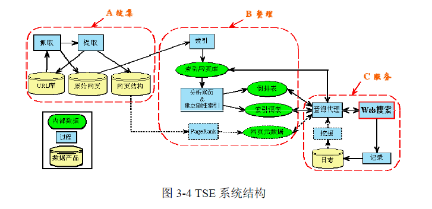
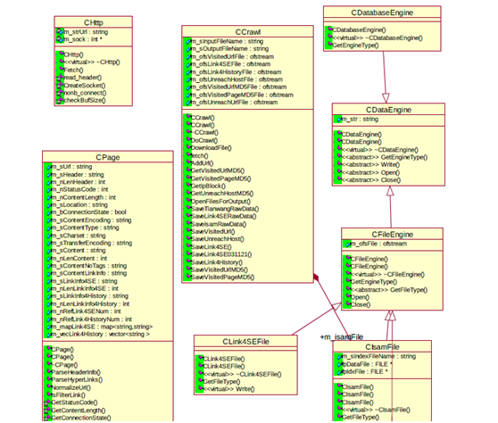
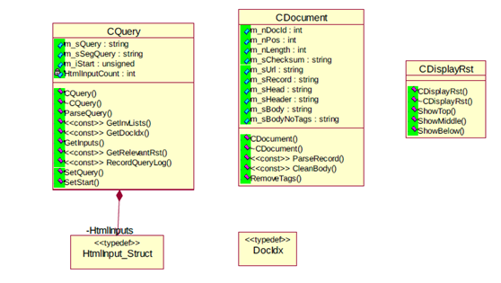

| 序号 | 修改时间   | 修改内容   | 修改人 | 审稿人 |
| ---- | ---------- | ---------- | ------ | ------ |
| 1    | 2008       | 创建       | Keefe  |        |
| 2    | 2016-12-26 | 规范文档。 | 同上   |        |

 

 

 

---

# 目录

[目录... 1](#_Toc517555829)

[1    概述... 1](#_Toc517555830)

[2    物理结构... 2](#_Toc517555831)

[3    逻辑架构... 3](#_Toc517555832)

[3.1    系统架构... 3](#_Toc517555833)

[3.2    类图... 3](#_Toc517555834)

[4    关键的数据结构和算法... 5](#_Toc517555835)

[5    附录... 6](#_Toc517555836)

[5.1    参考资料... 6](#_Toc517555837)

[5.2    TSE一些估计数据... 6](#_Toc517555838)

 

 

# 1  概述

**Crawler:**

* HTTP持续连接: http1.1后支持，不主动关闭连接

* 分布式搜索

* 避免重复搜索和网页除重

重复搜集的原因可能包括：IP和域名的对应问题； 

 DNS cache 

 IP Block 

 Supports the capability to parse links Supports the capability to parse links 

 Supports the capability to crawl recursively 

 网页存储格式：tianwang-format, isam 

 

 **Index:** 

* 网页索引库 

* 中文分词，分词索引 

* 分析网页和建立倒排文本索引 

 

**Searchd:**

* 结果分类与排序 

 

# 2  物理结构

表格 1 进程模块结构表

| 进程/模块    | 功能描述                                                     | remark     |
| ------------ | ------------------------------------------------------------ | ---------- |
| tse          | tse –s  searchd程序，检索请求处理   <BR>tse –c crawler程序,分布式，递归下载网页 |            |
| stat         | 从已经访问过的 url链接中提取出host                           | 小测试程序 |
| tfind        | 检测url链接是否被屏蔽的小程序                                | 小测试程序 |
| tfindForeign | 将url链接进行过滤的小程序                                    | 小测试程序 |

 

表格 2 文件目录结构表

| 文件/目录            | 属性 | 功能描述                                      | remark                                              |
| -------------------- | ---- | --------------------------------------------- | --------------------------------------------------- |
| hlink                | D    | 用来在html文件中提取链接                      | 使用了flex来解析L文件生成C文件                      |
| uri                  | D    | uri解析                                       | 同上，使用了flex技术                                |
| include              | D    | 公开使用的头文件集合                          | eg: hlink,uri,stack的对外接口头文件                 |
| lib                  | D    | 公开使用的实现集合                            |                                                     |
| stack                | D    | stack数据结构的实现                           |                                                     |
| Crawl.cpp            | F    | crawler实现类                                 |                                                     |
| DatabaseEngine.cpp   | F    |                                               |                                                     |
| DataEngine.cpp       | F    | 基类                                          |                                                     |
| IsamFile.cpp         | F    | ISAM文件存储格式类                            |                                                     |
| FileEngine.cpp       | F    | 文件存储格式的基类                            |                                                     |
| Http.cpp             | F    | http连接处理类                                |                                                     |
| Search.cpp           | F    | 搜索器的实现类                                |                                                     |
| Link4SEFile.cpp      | F    |                                               |                                                     |
| Main.cpp             | F    | Tse主程序                                     |                                                     |
| Md5.cpp              | F    | MD5编码的一个实现                             |                                                     |
| Res.cpp              | F    |                                               |                                                     |
| StrFun.cpp           | F    | 一些字符串处理函数                            |                                                     |
| Stat.cpp             | F    | 小测试程序                                    | 统计url                                             |
| tfind.cpp            | F    | 小测试程序                                    | 测试url是否被过滤                                   |
| tfindForeign.cpp     | F    | 小测试程序                                    | 过滤指定类型的url                                   |
| TianwangFile.cpp     | F    |                                               |                                                     |
| Url.cpp              | F    | url解析类                                     | 从一个url提取出各种信息，包括protocol,host,request… |
| CommonDef.h.cpp      | F    | 全局的头文件，公共变量，宏                    |                                                     |
| tse_seed.img         |      | 一开始指定要访问的url,  主向是imgSE(图片搜索) |                                                     |
| tse_seed.pku         |      | 一开始指定要访问的url（正常的网页搜索）       |                                                     |
| tse_unreachHost.list |      | unreachable hosts according to PKU IP block   |                                                     |
| tse_ipblock.      |      |                                               |                                                     |
| tse.robots           |      | robots协议                                    |                                                     |
| Clean.sh             |      | 清除中间文件的脚本                            |                                                     |
| link4History.url     |      |                                               |                                                     |

注：属性栏D表示目录，F表示文件,C表示配置文件等；文件中若不给出后缀名，通常文件名代表了其头文件和源文件。 

 

# 3   逻辑架构 

## 3.1  系统架构

​                               

 

## 3.2   类图

**1).index**

包括切词,正排索引,倒排索引,其中排序,排重使用了shell命令sort, uniq

 

 

**2).searchd**

**Call index**

 

**3).cgi**

 

 

# 4     关键的数据结构和算法 

**file handle**： 

```c++
 string m_sInputFileName; // seed URL file name 
 string m_sOutputFileName; // the file for saving parsed links 
 
 CIsamFile m_isamFile;  // ISAM file handle 
 ofstream m_ofsVisitedUrlFile; // visited url file handle 
 ofstream m_ofsLink4SEFile; // link4SE url file handle 
 ofstream m_ofsLink4HistoryFile; // link4History url file handle 
 ofstream m_ofsUnreachHostFile; // unreach host file handle 
 
 ofstream m_ofsVisitedUrlMD5File;// visited url MD5 file handle 
 ofstream m_ofsVisitedPageMD5File;// visited url MD5 file handle 
 ofstream m_ofsUnreachUrlFile; // unreach URL file handle 
```


**stl container: **

```c++
extern map<string,string> mapCacheHostLookup; 
extern vector<string> vsUnreachHost; 
set<string> setVisitedUrlMD5; 
set<string> setVisitedPageMD5; 
set<string> setUnvisitedUrlMD5; 
set<string> setUnreachHostMD5; 
 
multimap<string, string, less<string> > replicas; 
map<unsigned long,unsigned long> mapIpBlock; 
multimap<string,string > mmapUrls; 
typedef map<unsigned long,unsigned long>::value_type valTypeIpBlock; 
typedef map<string,string>::value_type mvalType; 
 
vector<string> vsParsedLinks; 
```


**other dataStruct:** 

```c++
struct package 
{ 
 CCRAWL *CRAWL; 
 CPage *page; 
}; 
```


**algorithms** 

```c++
extern char **ParseRobot( char *data, char len); 
VOID SAVEREPLICAS(CONST CHAR* FILENAME); 
```


# 附录

## 参考资料

[1].   北大网络实验室 2002 搜索引擎－原理、技术与系统 


## TSE一些估计数据

**1）单个节点要开多少个robot?**

局域网的延迟在1-10ms，带宽为10-1000Mbps 

 Internet的延迟在100-500ms，带宽为0.010-2 Mbps

 在同一个局域网内的多台机器，每个机器多个进程并发的工作 

* 一方面可以利用局域网的高带宽，低延时，各节点充分交流数据， 

* 另一方面采用多进程并发方式降低Internet高延迟的副作用。 

 

**计算理论值**： 

* 平均纯文本网页大小为13KB 

* 在连接速率为100Mbps快速以太网络上，假设线路的最大利用率是100%，则最多允许同时传输（1.0e+8b/s）/ （1500B*8b/B）≈8333个数据帧，也即同时传输8333个网页 

* 如果假设局域网与Internet的连接为100Mbs，Internet带宽利用率低于50%（网络的负载超过80%，性能是趋向于下降的；路由），则同时传输的网页数目平均不到4000个。 

* 则由n个节点组成的搜集系统，单个节点启动的Robot数目应该低于4000/n。 

 而根据经验值：要考虑CPU和磁盘的使用率问题，通常CPU使用率不应该超过50%，磁盘的使用率不应该超过80%，否则机器会响应很慢，影响程序的正常运行。 

 **结论**：单节点组成的搜集系统，建议开启的robot低于1000。 

 

**2）单节点搜集效率？** 

以太网数据帧的物理特性是其长度必须在46~1500字节之间。 

* 在一个网络往返时间RTT为200ms的广域网中，服务器处理时间SPT为100ms，那么TCP上的事务时间就大约500ms（2 RTT+SPT）。 

* 网页的发送是分成一系列帧进行的，则发送1个网页的最少时间是 (13KB/1500B) * 500ms ≈4s。 

* 如果系统中单个节点启动100个Robot程序，则每个节点每天应该搜集（24 *60 *60s/4s）* 100 = 2,160,000个网页。 

* 考虑到Robot实际运行中可能存在超时，搜集的网页失效等原因，每个节点的搜集效率小于2,160,000个网页/天。 