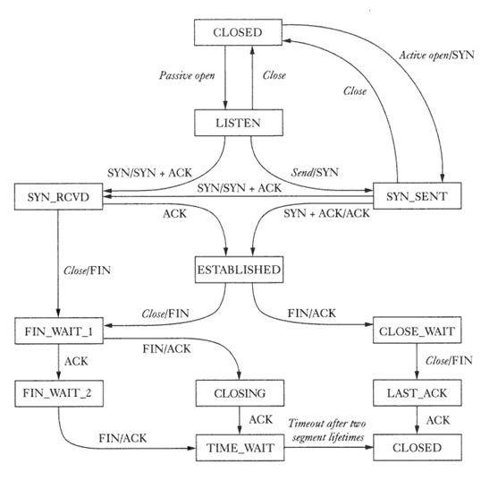
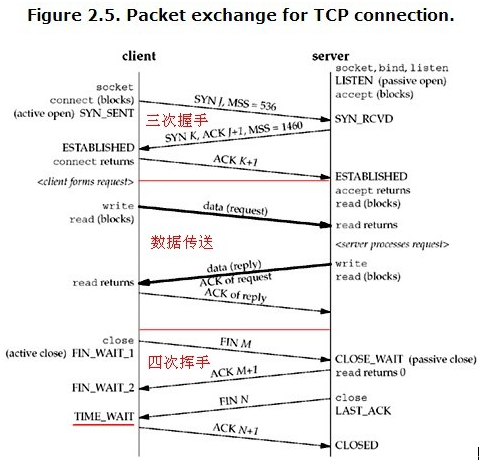
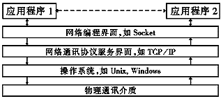
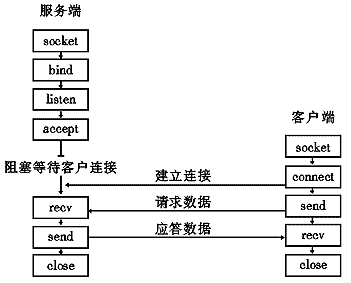

| 序号 | 修改时间   | 修改内容                                | 修改人 | 审稿人 |
| ---- | ---------- | --------------------------------------- | ------ | ------ |
| 1    | 2006-2007  | 创建                                    | Keefe | Keefe |
| 2    | 2010-3-16  | 增加select与epoll的区别，替换select例子 | 同上   | 同上   |
| 3    | 2010-3-19  | 增加客户端实例                          | 同上   | 同上   |
| 4    | 2016-12-28 | 规范文档                                | 同上   | 同上   |
| 5    | 2017-8-24  | 更新EPOLL和异步IO细节                   | 同上   | 同上   |
| 6    | 2017-9-19  | 更新socket缓冲区章节                    | 同上   | 同上   |
|      |            |                                         |        |        |
<br>

---


# 目录

[目录.. 1](#_Toc493624924)

[1       TCP/IP编程原理.. 3](#_Toc493624925)

[1.1        TCP/IP协议原理.. 3](#_Toc493624926)

[1.2        socket编程基础.. 5](#_Toc493624927)

[1.2.1          socket概论.. 5](#_Toc493624928)

[1.2.2          常用socket API 6](#_Toc493624929)

[1.2.3          常用socket结构.. 7](#_Toc493624930)

[1.3        socket高级编程.. 7](#_Toc493624931)

[1.3.1          socket属性控制.. 7](#_Toc493624932)

[1.3.2          socket缓冲区的影响.. 9](#_Toc493624933)

[1.3.3          socket数据发送接收的影响.. 9](#_Toc493624934)

[1.3.4          socket连接管理.. 10](#_Toc493624935)

[1.3.5         内核中socket实现.. 10](#_Toc493624936)

[1.4        本章参考.. 12](#_Toc493624937)

[2       网络编程实例.. 12](#_Toc493624938)

[2.1        网络IO策略.. 12](#_Toc493624939)

[2.2        单进程循环.. 13](#_Toc493624940)

[2.3        单进程并发(IO多路复用) 16](#_Toc493624941)

[2.3.1          select 16](#_Toc493624942)

[2.3.2          epoll 19](#_Toc493624943)

[2.3.3          epoll与select的比较.. 22](#_Toc493624944)

[2.4        多进程并发.. 24](#_Toc493624945)

[2.5        多线程并发.. 27](#_Toc493624946)

[2.6        多进程多线程并发.. 30](#_Toc493624947)

[2.7        UDP通讯编程.. 30](#_Toc493624948)

[2.8        客户端编程.. 31](#_Toc493624949)

[2.9        本章参考.. 32](#_Toc493624950)

[3       参考文献.. 32](#_Toc493624951)


**图表目录**

[表格 1 linux平台下 socket默认值（getsockopt获取）__ 7](#_Toc493624952)

[表格 2 不同网络条件下的MTU_ 9](#_Toc493624953)

[表格 3 TCP连接过程中的错误信号__ 10](#_Toc493624954)

[表格 4 UDP连接过程中的错误处理__ 10](#_Toc493624955)

[表格 5 epoll与select的比较列表__ 22](#_Toc493624956)


# 1  TCP/IP编程原理

## 1.1    TCP/IP协议原理

1 TCP状态机

​               

图 TCP State machie

说明：TIME_WAIT缺省是2ms.

 


**[Nagle Algorithms]**

**Nagle算法**是以他的发明人John Nagle的名字命名的，它用于自动连接许多的小缓冲器消息；这一过程（称为nagling）通过减少必须发送包的个数来增加网络软件系统的效率。

```shell
$ man tcp
       RFC 793 for the TCP specification.
       RFC 1122 for the TCP requirements and a description of the Nagle algorithm.
       RFC 1323 for TCP timestamp and window scaling options.
       RFC 1644 for a description of TIME_WAIT assassination hazards.
       RFC 3168 for a description of Explicit Congestion Notification.
       RFC 2581 for TCP congestion control algorithms.
       RFC 2018 and RFC 2883 for SACK and extensions to SACK.
```


## 1.2   socket编程基础

### 1.2.1   socket概论

TCP/IP是计算机互连最常使用的网络通讯协议， TCP/IP的核心部分由网络操作系统的内核实现，应用程序通过编程接口来访问 TCP/IP，见下图：

   

图1　应用程序与Windows Socket关系图

七十年代中，美国国防部高研署（DARPA）将TCP/IP的软件提供给加利福尼亚大学Berkeley分校后，TCP/IP很快被集成到Unix中，同时出现了许多成熟的TCP/IP应用程序接口（API）。这个API称为Socket接口。今天，SOCKET接口是TCP/IP网络最为通用的API，也是在INTERNET上进行应用开发最为通用的API。

Socket实际在计算机中提供了一个通信端口，可以通过这个端口与任何一个具有Socket接口的计算机通信。应用程序在网络上传输，接收的信息都通过这个Socket接口来实现。在应用开发中就像使用文件句柄一样，可以对 Socket句柄进行读、写操作。我们将 Socket翻译为套接字，套接字分为以下三种类型：

  **字节流套接字**（Stream Socket）　是最常用的套接字类型，TCP/IP协议族中的 TCP 协议使用此类接口。字节流套接口提供面向连接的（建立虚电路）、无差错的、发送先后顺序一致的、无记录边界和非重复的网络信包传输。

  **数据报套接字** （Datagram Socket）　TCP/IP协议族中的UDP协议使用此类接口，它是无连接的服务，它以独立的信包进行网络传输，信包最大长度为32KB，传输不保证顺序性、可靠性和无重复性，它通常用于单个报文传输或可靠性不重要的场合。数据报套接口的一个重要特点是它保留了记录边界。对于这一特点。数据报套接口采用了与现在许多包交换网络（例如以太网）非常类似的模型。

 **原始数据报套接字**（Raw Socket）　提供对网络下层通讯协议（如IP协议）的直接访问，它一般不是提供给普通用户的，主要用于开发新的协议或用于提取协议较隐蔽的功能。

 


图2　面向连接协议的SOCKET编程模型

### 1.2.2   常用socket API

```c
int bind(int sockfd,struct sockaddr *my_addr, int addrlen);
int connect(int sockfd, struct sockaddr *serv_addr,int addrlen);
int listen(int sockfd， int backlog);
int accept(int sockfd, void *addr, int *addrlen);
int close(sockfd);
//int shutdown(int sockfd,int how);

int send(int sockfd, const void *msg, int len, int flags);
int recv(int sockfd,void *buf,int len,unsigned int flags);
int sendto(int sockfd, const void *msg,int len,unsigned int flags,const struct sockaddr *to, int tolen);
int recvfrom(int sockfd,void *buf,int len,unsigned int flags,struct sockaddr *from,int *fromlen);
```


其它重要函数列表：

| 功能分类      | API                                        | API说明                                                      |
| ------------- | ------------------------------------------ | ------------------------------------------------------------ |
| 与DNS相关     | int   gethostname(char *name, size_t len); | 获取到主机地址消息char* name                                 |
| gethostbyname | 获取到一个主机结构hostent                  |                                                              |
| 与IP地址相关  | in_addr_t   inet_addr(const char *cp);     | 将字符串IP转化为整形IP，此函数与inet_aton功能类似，不过inet_aton不能转化广播地址：255.255.255.255 |
| inet_nota     |                                            |                                                              |


### 1.2.3   常用socket结构

struct sockaddr结构类型是用来保存socket信息的：

```c
struct sockaddr {
　　 unsigned short sa_family;  /* 地址族， AF_xxx */
char sa_data[14];          /* 14 字节的协议地址 */
};
struct sockaddr_in {
　　 short int sin_family;           /* 地址族 */
　　 unsigned short int sin_port;        /* 端口号 */
　　 struct in_addr sin_addr;               /* IP地址 */
　　 unsigned char sin_zero[8];  /* 填充0 以保持与struct sockaddr同样大小 */
};
typedef uint32_t in_addr_t;
struct in_addr
{
       in_addr_t s_addr;  //整形IP
};

// hostent是用来保存主机信息的
struct  hostent {
  char    FAR * h_name;            /* 正式的主机名*/
  char    FAR * FAR * h_aliases;   /* 别名列表*/
  short   h_addrtype;              /* 主机地址类型*/
  short   h_length;                /* 地址长度*/
  char    FAR * FAR * h_addr_list; /* 地址清单*/
};
```


## 1.3   socket高级编程

### 1.3.1   socket属性控制

涉及函数： getsockopt, setsockopt, ioctl, fcntl

表格 1 linux平台下 socket默认值（getsockopt获取）

| 协议层       | 属性类型      | value（属性值) | 属性内存块长度 | 使用场景                                                     |                                            |
| ------------ | ------------- | -------------- | -------------- | ------------------------------------------------------------ | ------------------------------------------ |
| level        | name          | SOCK_   STREAM | SOCK_   DGRAM  | optlen                                                       |                                            |
| SOL_SOCKET   |               |                |                |                                                              |                                            |
|              | SO＿KEEPALIVE | 0(tcp:2h)      | 0              | sizeof(int)=4                                                | connect保持                                |
|              | SO＿LINGER    | 0              |                | struct linger {        int l_onoff; /*   0 = off, nozero = on */        int l_linger; /*   linger time */   }; | 缺省延迟关闭，1）关闭要经过Time_wait过程； |
|              | SO＿RCVBUF    | 87380          | 110592         | 4                                                            | 接收缓冲区大小                             |
|              | SO＿SNDBUF    | 16384          | 110592         | 4                                                            | 发送缓冲区                                 |
|              | SO＿RCVLOWAT  | 4100           | 1              | 4                                                            | 接收下限                                   |
|              | SO＿SNDLOWAT  | 4099           | 1              | 4                                                            |                                            |
|              | SO＿RCVTIMEO  | 4102           | 0              | struct timeval                                               | 接收时限，接收超时处理                     |
|              | SO＿SNDTIMEO  | 4101           | 0              | struct timeval                                               |                                            |
|              | SO＿REUSEADDR | 0              | 0              | 4                                                            | 在close后重用此端口                        |
|              | SO_TYPE       | 1              | 2              | 4                                                            | 套接字类型                                 |
|              | SO_ACCEPTCONN | 2              |                |                                                              |                                            |
|              |               |                |                |                                                              |                                            |
| IP_PROTO_TCP | TCP_MAXSEG    |                |                |                                                              |                                            |
|              | TCP_NODELAY   |                |                |                                                              |                                            |
| IP_PROTO_RAW |               |                |                |                                                              |                                            |
| IP_PROTO_IP  | IP_HDRINCL    |                |                |                                                              |                                            |
|              | IP_OPTINOS    |                |                |                                                              |                                            |
|              | IP_TOS        |                |                |                                                              |                                            |
|              | IP_TTL        |                |                |                                                              |                                            |

备注：

1. SO＿LINGER：缺省l_onoff为0，延迟关闭，即active close要经过TIME_WAIT过程；如果l_onoff非0则close时清空发送缓冲内的内容，直接发送一个RST而不是常规四元序列。l_linger为延迟时间。

2. 协议层PROTO：可分为'IPPROTO_ICMP', 'IPPROTO_IP', 'IPPROTO_RAW', 'IPPROTO_TCP', 'IPPROTO_UDP'。不同协议通常对应于不同的SOCKET，如IPPROTO_UDP对应于SOCK_DGRAM。

3. SOCKET：按类型可分为'SOCK_DGRAM', 'SOCK_RAW', 'SOCK_RDM', 'SOCK_SEQPACKET', 'SOCK_STREAM'。


### 1.3.2   socket缓冲区的影响

IP数据包大小：IPV4＝64KB, IPV6=64KB+40bit.

MSS: Maxitum Segment Size 最大分段 (以太网1500-40=1460B)

MTU: Maxitum Transmission Unit 最大传输单元

表格 2 不同网络条件下的MTU

| 网络                         | MTU字   节 |
| ---------------------------- | ---------- |
| 超通道                       | 65535      |
| 16Mb/s令   版环(IBM)         | 17914      |
| 4Mb/s令   版环(IEEE   802.5) | 4464       |
| FDDI                         | 4352       |
| 以太网                       | 1500       |
| IEEE 802.2/802.3             | 1492       |
| X25                          | 576        |
| 点对点(低时延)               | 296        |

备注：1. socket发送/接收缓冲区：取决于网络环境的数据包大小，适当调整有利于提高效率。以pysnmp为例，调整缓冲区大小为128KB左右。为了便以识别（仅供参考），发送数值通常为奇数，接收为偶数。如SO_SNDLOWAT=4009，SO_RCVLOWAT=4100。socket缓冲区在系统中也要缺省下限，约2K。

2. 修改socket缓冲区大小：可用getsockopt和setsockopt获取和设定socket缓冲区，设定的缓冲区只对当前socket起作用。

* 修改OS全局缓冲区：

* 查看接收缓冲区：sysctl -a | grep rmem

* 修改配置文件：vim /etc/sysctl.conf

```ini
# 设定发送缓冲区上限
net.core.rmem_max = 2097152
```

3. python查看：windows的缺省接收/发送缓冲区大小与linux环境下的不同。

   ```python
   >>> import socket
   >>> socket.SO_RCVBUF, socket.SO_SNDBUF
   (4098, 4097)
   ```


### 1.3.3   socket数据发送接收的影响

考虑实际情况中可能的场景，注意可避免不会发生的场景。

不会发生的场景：server一直发送数据，client不接收，这种不可能发生，反之则很有可能。

常发生的异常场景：server关闭了，client仍然connect或send。

Non-blocking: send/recv会返回**EAGAIN** or **EWOULDBLOCK** ,这是正常情形，要多次接收才才能完成read/write操作。


表格 3 TCP连接过程中的错误信号

| server/client   | connect                                    | close                  | recv                                    | send                                                         |
| --------------- | ------------------------------------------ | ---------------------- | --------------------------------------- | ------------------------------------------------------------ |
| server   listen |                                            |                        |                                         |                                                              |
| accept          | 有可能连接不上，会有75s的连接超时ETIMEDOUT |                        |                                         |                                                              |
| recv            |                                            |                        |                                         | client只发，server不接，结果：socket sendbuf 满，要等待清空后才能继续send |
| send            |                                            | server产生信号SIG_PIPE | server   send得过多，recv会来不及处理。 |                                                              |
| close           |                                            |                        |                                         |                                                              |

备注：


表格 4 UDP连接过程中的错误处理

| server/client   | connect | close | recv | send |
| --------------- | ------- | ----- | ---- | ---- |
| server   listen |         |       |      |      |
| accept          |         |       |      |      |
| recv            |         |       |      |      |
| send            |         |       |      |      |
| close           |         |       |      |      |


### 1.3.4   socket连接管理

连接分类：
* 长连接：两端建立连接，不关闭。
* 短连接：每一次报文交易建立一个连接，交易完关闭。

长连接的使用：用于两端固定频繁的通信，如与数据库的连接。长连接保持可设置socket属性SO＿KEEPALIVE, 缺省2h内部检测一次；也可自己发送状态检测包。

connect连接超时，TCP缺省是75s.

### 1.3.5 内核中socket实现

```c
//1 socket的类型 include/linux/net.h
  88enum sock_type {
  89        SOCK_STREAM     = 1,
  90        SOCK_DGRAM      = 2,
  91        SOCK_RAW        = 3,
  92        SOCK_RDM        = 4,
  93        SOCK_SEQPACKET  = 5,
  94        SOCK_DCCP       = 6,
  95        SOCK_PACKET     = 10,
  96};

//2 socket状态：include/linux/net.h, line 51
  45typedef enum {
  46        SS_FREE = 0,            /* not allocated               */
  47        SS_UNCONNECTED,       /* unconnected to any socket    */
  48        SS_CONNECTING,        /* in process of connecting     */
  49        SS_CONNECTED,        /* connected to socket          */
  50        SS_DISCONNECTING     /* in process of disconnecting  */
  51} socket_state;

//3 TCP socket工作状态。代表网络层套接口的结构体struct sock也有一个成员sk_state，
// include/net/tcp_states.h, line 38 [usage...]
  16enum {
  17        TCP_ESTABLISHED = 1,
  18        TCP_SYN_SENT,
  19        TCP_SYN_RECV,
  20        TCP_FIN_WAIT1,
  21        TCP_FIN_WAIT2,
  22        TCP_TIME_WAIT,
  23        TCP_CLOSE,
  24        TCP_CLOSE_WAIT,
  25        TCP_LAST_ACK,
  26        TCP_LISTEN,
  27        TCP_CLOSING,    /* Now a valid state */
  29        TCP_MAX_STATES  /* Leave at the end! */
  30};
	在tcp socket建立之初，其状态为TCPF_CLOSE，准备建立到对端的连接之前，被改为TCP_SYN_SENT。

//4 stuct socket 网络层BSD套接口的结构体的定义
 117/**
 118 *  struct socket - general BSD socket
 119 *  @state: socket state (%SS_CONNECTED, etc)
 120 *  @type: socket type (%SOCK_STREAM, etc)
 121 *  @flags: socket flags (%SOCK_ASYNC_NOSPACE, etc)
 122 *  @ops: protocol specific socket operations
 123 *  @fasync_list: Asynchronous wake up list
 124 *  @file: File back pointer for gc
 125 *  @sk: internal networking protocol agnostic socket representation
 126 *  @wait: wait queue for several uses
 127 */
 128struct socket {
 129        socket_state            state;
 130        short                   type;
 131        unsigned long           flags;
 132        /*
 133         * Please keep fasync_list & wait fields in the same cache line
 134         */
 135        struct fasync_struct    *fasync_list;
 136        wait_queue_head_t       wait;
 137
 138        struct file             *file;
 139        struct sock             *sk;
 140        const struct proto_ops  *ops;
 141};
 142

//连接超时时间 include/net/tcp.h, line 111
 111#define TCP_TIMEWAIT_LEN (60*HZ) /* how long to wait to destroy TIME-WAIT state, about 60 seconds     */
```


## 1.4  本章参考


<br>

# 2  网络编程实例 (C)

## 2.1   网络IO策略

常见定义

* fd: file descriptor, 在网络IO也指socket.

* fd缺省属性：socket创建时，缺省是阻塞Blocking的。

* fd分类： 服务器端连接socket(accept一端)，数据socket.


|              | **Blocking**                                           | **Non-blocking**                                             |
| ------------ | ------------------------------------------------------ | ------------------------------------------------------------ |
| Synchronous  | read/write                                             | read/write                                                   |
| Asynchronous | IO   multiplexing   select(Linux/Windows/BSD)、   poll | AIO(linux)、epoll(Linux 2.6+)、   I/O   Completion Ports(windows)、   event_completion(solaris)、   kqueue(BSD/Mac   OS X)   信号SIG_IO(unix/linux) |

备注：1. IO模式一般可分为五种，分别是同步阻塞IO、同步非阻塞IO、IO多路复用（阻塞有select、poll；非阻塞有epoll、信号驱动IO和异步IO。

其实异步IO模式有两种，分别是信号驱动IO（SIG_IO）和异步IO。

2. IO多路复用是指内核一旦发现进程指定的一个或者多个IO条件准备读取，它就通知该进程。IO多路复用适用如下场合：
* 当客户处理多个描述字时（一般是交互式输入和网络套接口），必须使用I/O复用。
* 当一个客户同时处理多个套接口时，而这种情况是可能的，但很少出现。
* 如果一个TCP服务器既要处理监听套接口，又要处理已连接套接口，一般也要用到I/O复用。
* 如果一个服务器即要处理TCP，又要处理UDP，一般要使用I/O复用。
* 如果一个服务器要处理多个服务或多个协议，一般要使用I/O复用。
* 与多进程和多线程技术相比，I/O多路复用技术的最大优势是系统开销小，系统不必创建进程/线程，也不必维护这些进程/线程，从而大大减小了系统的开销。


**情形1：** **同步阻塞IO**

阻塞完成。应用层阻塞在read/write。 (基本上不考虑)

**情形2：** **同步非阻塞**

read操作可能多次操作才完成，read出错时可能返回EAGAIN和EWOULDBLOCK.

使用如下： while(1) { read, …. read…if(all) break; }


**情形3：** **异步阻塞**

Eg: select，poll, /dev/null(at soalris)

配置非阻塞描述符，使用阻塞select, select可以配置超时机制。同时select可以为多个socket提供通知。应用层阻塞在select。


**情形4：异步非阻塞。**
* 实现1：使用信号SIG_IO作为机制。
* 实现2：非阻塞的IO多路复用，如epoll


## 2.2   单进程循环

```c
/***
*    author: denny wqf363@hotmail.com 2006
*    desc: 单进程循环服务器
*    座友铭：凡是程序当前不需要的，都是垃圾，80%的时间做20%的事情。（程序的效率）
*                                                                         *
***/
#include	<sys/types.h>
#include	<sys/socket.h>
#include	<netinet/in.h>
#include	<arpa/inet.h>
#include	<netdb.h>
#include	<stdio.h>
#include	<unistd.h>
#include	<errno.h>
#include	<string.h>
#include	<pthread.h>
#include     	<malloc.h>
#include 	<stdlib.h>

#define  BACKLOG 5
#define  MAXDATASIZE 1000
#define  PORT 1234

void process_cli(int,sockaddr_in);

int main(int argc,char *argv[])	//需要一个参数 端口号
{
    int	listenfd,				//监听套接字sock
        connectfd;				//accept 收到的 新套接字
    struct sockaddr_in	servAddr,	//服务器地址
                cliAddr;		//客户端地址
    socklen_t	adrlen;			//sockaddr地址长度
    int		servPort;			//服务器监听端口号

    //获得服务器监听的端口号
    if(argc!=2)
    {
        printf("Usage:%s portnumber\a\n",argv[0]);
        return 1;
    }
    if((servPort=atoi(argv[1]))<0)
    {
        printf("Usage:%s portnumber\a\n",argv[0]);
        return 1;
    }

    /* 服务器端开始建立socket描述符 */
    if((listenfd=socket(AF_INET,SOCK_STREAM,0))==-1)
    {
        fprintf(stderr,"Socket error:%s\n\a",strerror(errno));
        return 1;
    }

    /*设置套接字地址结构体servAddr中的参数，绑定服务器端口号*/
    servAddr.sin_family=AF_INET;
    servAddr.sin_addr.s_addr=htonl(INADDR_ANY);
    servAddr.sin_port=htons(servPort);
    if(bind(listenfd,(struct sockaddr *)&servAddr,sizeof(servAddr))<0)
    {
        printf("Bind error:%s\n\a",strerror(errno));
        exit(2);
    }
    /* 监听sockfd描述符 */
    if(listen(listenfd,BACKLOG)==-1)
    {
        printf("Listen error:%s\n\a",strerror(errno));
        exit(3);
    }

    while(1)
    {
        printf("%s:waiting for data on port TCP %u\n",argv[0],servPort);

        adrlen=sizeof(struct sockaddr_in);
        connectfd=accept(listenfd,(struct sockaddr *)&cliAddr,&adrlen);
        if(connectfd<0)
        {
            perror("accetp() error\n");
            exit(4);
        }
        process_cli(connectfd,cliAddr);
    }
}

void process_cli(int connectfd, sockaddr_in client)
{
    int num;
    char sendbuf[MAXDATASIZE],revbuf[MAXDATASIZE];
    printf("You get a connetion from %s\n",inet_ntoa(client.sin_addr));

    while((num=recv(connectfd,revbuf,MAXDATASIZE,0)))
	{
		revbuf[num]='\0';
		printf("Receive client message: %s", revbuf);

		for(int i=0;i<num-1;i++){
		sendbuf[i]=revbuf[num-i-2];
		}
		sendbuf[num-1]='\0';
		send(connectfd,sendbuf,strlen(sendbuf),0);
    }
    close(connectfd);
}

```


## 2.3   单进程并发(IO多路复用)

### 2.3.1   select

**函数语法：**

```shell
       /* According to POSIX 1003.1-2001 */
       #include <sys/select.h>

       /* According to earlier standards */
       #include <sys/time.h>
       #include <sys/types.h>
       #include <unistd.h>

       int select(int n, fd_set *readfds, fd_set *writefds, fd_set *exceptfds, struct timeval *timeout);
       int  pselect(int  n,  fd_set *readfds, fd_set *writefds, fd_set *exceptfds, const struct timespec *timeout, const sigset_t
       *sigmask);

       FD_CLR(int fd, fd_set *set);
       FD_ISSET(int fd, fd_set *set);
       FD_SET(int fd, fd_set *set);
       FD_ZERO(fd_set *set);

DESCRIPTION
       The functions select and pselect wait for a number of file descriptors to change status.

RETURN VALUE
       On success, select and pselect return the number of descriptors contained in the descriptor sets, which may be zero if the  timeout  expires  before anything interesting happens.  On error, -1 is returned, and errno is set appropriately; the sets and timeout become undefined, so do not rely on their contents after an error.
```

​

**示例：**

```c
#include <stdio.h>
#include <strings.h>

#ifndef WIN32
#include <sys/socket.h>
#include <unistd.h>
#include <netinet/in.h>
#include <arpa/inet.h>
#include <pthread.h>
#define  closesocket(a)  close(a)
#define  SOCKET    int
#else
#include <winsock2.h>
#endif

#define PORT 1234
#define MAXSOCKFD 10    //最大socket限制数量

int main() {
#ifdef WIN32
    WSADATA wsaData;
    WORD wVersionRequested = MAKEWORD( 2, 2 );
    WSAStartup(wVersionRequested, &wsaData);
#endif

    SOCKET listenfd, newsockfd, is_connected[MAXSOCKFD], fd;
    int i;
    struct sockaddr_in addr;
    int addr_len = sizeof(struct sockaddr_in);
    fd_set readfds;
    char buffer[256];
    char msg[] = "Welcome to server!";

    if ((listenfd = socket(AF_INET,SOCK_STREAM, 0)) < 0) {
        perror("socket");
        exit(-1);
    }

    memset(&addr, 0, sizeof(addr));
    addr.sin_family = AF_INET;
    addr.sin_port = htons(PORT);
    addr.sin_addr.s_addr = htonl(INADDR_ANY);
    if (bind(listenfd, (struct sockaddr*) &addr, sizeof(addr)) < 0) {
        perror("connect");
        exit(-1);
    }

    //listen, server use it
    if (listen(listenfd, 5) < 0) {
        perror("listen");
        exit(-1);
    }

    for (i = 0; i < MAXSOCKFD; i++)
        is_connected[i] = 0;

    is_connected[0] = listenfd;
    while (1) {
        newsockfd = listenfd;
        FD_ZERO(&readfds);    //每次循环都要清空集合，否则不能检测描述符变化
        for (i = 0; i < MAXSOCKFD; i++)
            if (is_connected[i])
            {    //数组中取最大值，即描述符最大值newsockfd
                FD_SET(is_connected[i], &readfds);
                if(newsockfd<is_connected[i]) newsockfd = is_connected[i];
            }

        //newsockfd为描述符最大值加1, =0返回，-1要作出错处理，>0继续下一步
        if (!select(newsockfd+1,&readfds, NULL,NULL, NULL))  # 0可能是超时或无数据
            continue;

        for (i = 0; i < MAXSOCKFD; i++)
            if (is_connected[i]!=0) {
                if (FD_ISSET(is_connected[i],&readfds)) {
                    if (listenfd == is_connected[i]) {    //listen socket，接收accpt事件
                        if ((newsockfd = accept(listenfd, (struct sockaddr*) &addr, &addr_len)) < 0)
                            perror("accept");
                        send(newsockfd, msg, sizeof(msg), 0);
                        for (fd = 0; fd < MAXSOCKFD; fd++)
                            if (is_connected[fd] == 0)
                                is_connected[fd] = newsockfd;
                        printf("cnnect from %s\n", inet_ntoa(addr.sin_addr));
                    } else {    //connect socket: 接收recv事件
                        memset(buffer, 0, sizeof(buffer));
                        if (recv(is_connected[i], buffer, sizeof(buffer), 0)
                                <= 0) {
                            printf("connect closed %d.\n",is_connected[i]);
                            closesocket(is_connected[i]);
                            FD_CLR(is_connected[i],&readfds);
                            is_connected[i] = 0;
                        } else {
                            send(is_connected[i], buffer, sizeof(buffer), 0);
                            printf("%s", buffer);
                        }
                    }
                }
            }
    }
#ifdef WIN32
    WSACleanup();
#endif
    return 0;
}
```


### 2.3.2   epoll

```sehll
$man epoll
SYNOPSIS
#include <sys/epoll.h>

int epoll_ctl(int epfd, int op, int fd, struct epoll_event *event)
int epoll_create(int size)
int epoll_wait(int epfd, struct epoll_event * events, int maxevents, int timeout)
```


**示例： ECHO服务器**

```c
#include <iostream>
#include <sys/socket.h>
#include <sys/epoll.h>
#include <netinet/in.h>
#include <arpa/inet.h>
#include <fcntl.h>
#include <unistd.h>
#include <stdio.h>
#include <errno.h>

#define MAXLINE 10
#define OPEN_MAX 100
#define LISTENQ 20
#define SERV_PORT 5555
#define INFTIM 1000

void setnonblocking(int sock)
{
    int opts;
    opts = fcntl(sock, F_GETFL);
    if (opts < 0)
    {
        perror("fcntl(sock, GETFL)");
        exit(1);
    }
    opts = opts|O_NONBLOCK;
    if (fcntl(sock, F_SETFL, opts) < 0)
    {
        perror("fcntl(sock, SETFL, opts)");
        exit(1);
    }
}

int main()
{
    int i, maxi, listenfd, connfd, sockfd, epfd, nfds;
    ssize_t n = 0;
    char line[MAXLINE];
    int l_sinSize = 0;
    l_sinSize = sizeof(struct sockaddr);
    //声明epoll_event结构体的变量,ev用于注册事件,数组用于回传要处理的事件
    struct epoll_event ev, events[20]; //--------------------
    //生成用于处理accept的epoll专用的文件描述符
    epfd = epoll_create(256);  ---
    struct sockaddr_in clientaddr;
    struct sockaddr_in serveraddr;
    listenfd = socket(AF_INET, SOCK_STREAM, 0);
    //把socket设置为非阻塞方式
    setnonblocking(listenfd); ---
    //设置与要处理的事件相关的文件描述符
    ev.data.fd = listenfd; ------
    //设置要处理的事件类型
    ev.events = EPOLLIN|EPOLLET;
    //注册epoll事件
    epoll_ctl(epfd, EPOLL_CTL_ADD, listenfd, &ev);
    bzero(&serveraddr, sizeof(struct sockaddr_in));
    serveraddr.sin_family = AF_INET;
    serveraddr.sin_addr.s_addr = htonl(INADDR_ANY);
    serveraddr.sin_port = htons(SERV_PORT);
    bind(listenfd, (struct sockaddr *)(&serveraddr), sizeof(struct sockaddr));
    listen(listenfd, LISTENQ);
    maxi = 0;
    while(1) {
        //等待epoll事件的发生
        nfds=epoll_wait(epfd,events,20,500); -
        //处理所发生的所有事件
        for (i = 0; i < nfds; ++i)
        {
            if (events[i].data.fd == listenfd)
            {
                connfd = accept(listenfd, (struct sockaddr *)(&clientaddr), (socklen_t *)&l_sinSize); //------------
                if (connfd < 0)
                {
                    perror("connfd < 0");
                    exit(1);
                }
                setnonblocking(connfd);
                char* str = inet_ntoa(clientaddr.sin_addr);
                std::cout<<"connect from "<<str<<std::endl;
                //设置用于读操作的文件描述符
                ev.data.fd = connfd;
                //设置用于注测的读操作事件
                ev.events = EPOLLIN|EPOLLET;
                //注册ev
                epoll_ctl(epfd, EPOLL_CTL_ADD, connfd, &ev);
            }
            else if (events[i].events&EPOLLIN)
            {
                if ((sockfd = events[i].data.fd) < 0)
                {
                    continue;
                }
                if ((n = read(sockfd, line, MAXLINE)) < 0)
                {
                    if (errno == ECONNRESET)
                    {
                        close(sockfd);
                        events[i].data.fd = -1;
                    }
                    else
                    {
                        std::cout<<"readline error"<<std::endl;
                    }
                }
                else if (n == 0)
                {
                    close(sockfd);
                    events[i].data.fd = -1;
                }
                //设置用于写操作的文件描述符
                ev.data.fd = sockfd;
                //设置用于注测的写操作事件
                ev.events = EPOLLOUT|EPOLLET;
                //修改sockfd上要处理的事件为EPOLLOUT
                epoll_ctl(epfd, EPOLL_CTL_MOD, sockfd, &ev);
            }
            else if(events[i].events&EPOLLOUT)
            {
                sockfd = events[i].data.fd;
                ssize_t l_writeSize = write(sockfd, line, n);
                std::cout<<"write "<<l_writeSize<<std::endl;
                //设置用于读操作的文件描述符
                ev.data.fd = sockfd;
                //设置用于注测的读操作事件
                ev.events = EPOLLIN|EPOLLET;
                //修改sockfd上要处理的事件为EPOLIN
                epoll_ctl(epfd, EPOLL_CTL_MOD, sockfd, &ev);
            }
        }
    }
}
```


### 2.3.3   epoll与select的比较

机制：事件通知，多路利用。

表格 5 epoll与select的比较列表

|            | epoll                                                        | select                                                       |
| ---------- | ------------------------------------------------------------ | ------------------------------------------------------------ |
| 结构体定义 | `typedef union epoll_data { void *ptr;          int fd; __uint32_t u32;  __uint64_t u64;   }   epoll_data_t; `<BR>`struct   epoll_event { __uint32_t events;  /* Epoll events */          epoll_data_t data;   /* User data variable */   };` | `struct timeval{     long tv_sec; //second     long tv_usec; //minisecond     }` <BR> `typedef   struct fd_set   { u_int fd_count;  int fd_array[FD_SETSIZE];   } `  //fd_array可管理FD_SETSIZE *8个fd，内核中轮询处理，监听fd越多，效率越低。 |
| 可用的信号 | EPOLLIN：表示对应的文件描述符可以读；    EPOLLOUT：表示对应的文件描述符可以写；    EPOLLPRI： 表示对应的文件描述符有紧急的数据可读；    EPOLLERR： 表示对应的文件描述符发生错误；    EPOLLHUP：表示对应的文件描述符被挂断；    EPOLLET：将epoll设置为边缘触发模式；   EPOLLONESHOT：只监听一次事件 | fd_set有三种类型：    readfds,   writefds,   exceptionfds    |
| 操作函数   | epoll_create                                                 | FD_ZERO                                                      |
|            | epoll_ctl  //对指定描述符fd执行op操作。                      | FD_SET                                                       |
|            | epoll_wait   //返回事件能够直接定位                          | select   //有数据需要遍历数组                                |
|            |                                                              | FD_ISSET                                                     |
| 运行模式   | Edge Triggered (ET)~边缘触发。   Lev Triggered (LT)~缺省模式，水平触发。 | LT                                                           |
| 运行过程   | int fd = epoll_create(xxA); //xxA可监听的fd个数    struct epoll_event events[xxxB]; //可返回的事件数   while(1){       int nfds = epoll_wait( );     //wait event occur       for(int i=0; i<nfds; i++){          if (events[i].data.fd == listenfd){          }else if (events[i].events&EPOLLOUT){          } else if(events[i].events&EPOLLOUT)          }       }//end for   }//end while | struct   timeval tv;   fd_set   rfds;    tv={5,0};  //set time out   while(1){   FD_ZERO(&rfds);   if (!select())   continue;   for(int   i=0;i<MAX_FDS; i++){          if   (FD_ISSET(isconn[i], &readfds)){              handleEvent(isconn   [i]);          }   // end FD_ISSET   } //end for    }   //end while |
| 优点       | epoll_wait返回的都是有效数据，可直接从struct epoll_evnet[]中获取事件，效率高。 |                                                              |
| 缺点       |                                                              | 每次select有数据要遍历全部监控socket                         |
| 注意事项   | 每次取事件后，要重新注册此socket的事件(epoll_ctl)。          | 每次select之前要重置rfds的值(FD_ZERO)。                      |

备注：1.以上无论epoll_create, fd_set都受限于系统中单个进程能够打开的文件句柄数。

2. epoll是在2.6内核中提出的，是之前的select和poll的增强版本。相对于select和poll来说，epoll更加灵活，没有描述符限制。epoll使用一个文件描述符管理多个描述符，将用户关系的文件描述符的事件存放到内核的一个事件表中，这样在用户空间和内核空间的copy只需一次。

3. EPOLL的工作模式：epoll对文件描述符的操作有两种模式：LT（level trigger）和ET（edge trigger）。LT模式是默认模式，LT模式与ET模式的区别如下：

* LT模式：同时支持block和no-block socket。当epoll_wait检测到描述符事件发生并将此事件通知应用程序，应用程序可以不立即处理该事件。下次调用epoll_wait时，会再次响应应用程序并通知此事件。
* ET模式：只支持non-blocking file descriptors, 要将socket设置为非阻塞状态。ET模式在很大程度上减少了epoll事件被重复触发的次数，因此效率要比LT模式高。接受数据要一次全接受完（即接收大小与返回大小一致时，可能有数据未接收完，需循环接收全部数据），否则会导致数据丢失。

当epoll_wait检测到描述符事件发生并将此事件通知应用程序，应用程序必须立即处理该事件。如果不处理，下次调用epoll_wait时，不会再次响应应用程序并通知此事件。


## 2.4   多进程并发

```sh
SYNOPSIS
       #include <unistd.h>
       pid_t fork(void);

DESCRIPTION
       fork()  creates a new process by duplicating the calling process.  The new process, referred to as the child, is an exact
       duplicate of the calling process, referred to as the parent, except for the following points:

       *  The child has its own unique process ID,  and  this  PID  does  not  match  the  ID  of  any  existing  process  group(setpgid(2)).
       *  The child's parent process ID is the same as the parent's process ID.
```

子进程区别与父进程：
* 不会继承父进程的内存锁(mlock(2), mlockall(2)).、记录锁、定时器等各种同步机制。
* 子进程资源重设为0，信号为空


**RETURN VALUE**

​       On  success,  the  PID of the child process is returned in the parent, and 0 is returned in the child.  On failure, -1 is returned in the parent, no child process is created, and errno is set appropriately.

 ```c
/***
*    author: denny wqf363@hotmail.com 2006
*    desc: 多进程并发
*    brief: 在接收到请求时，fork个进程，对父进程则关闭连接Socket,而子进程则关闭监听socket，每一个新的accept请求都由子进程来执行，而由父进程继续listen.
*    座友铭：凡是程序当前不需要的，都是垃圾，80%的时间做20%的事情。（程序的效率）
*                                                                         *
***/
#include	<sys/types.h>
#include	<sys/socket.h>
#include	<netinet/in.h>
#include	<arpa/inet.h>
#include	<netdb.h>
#include	<stdio.h>
#include	<unistd.h>
#include	<errno.h>
#include	<string.h>
#include	<pthread.h>
#include     	<malloc.h>
#include 	<stdlib.h>

#define  BACKLOG 5
#define  MAXDATASIZE 1000
#define  PORT 1234

void process_cli(int,sockaddr_in);

int main(int argc,char *argv[])	//需要一个参数 端口号
{
    int	listenfd,				//监听套接字sock
    connectfd;			//accept 收到的 新套接字
    struct sockaddr_in	servAddr,	//服务器地址
    cliAddr;	//客户端地址
    socklen_t	adrlen;			//sockaddr地址长度
    int		servPort;			//服务器监听端口号
    pid_t 		pid;

    //获得服务器监听的端口号
    if(argc!=2)
    {
		printf("Usage:%s portnumber\a\n",argv[0]);
		return 1;
    }

    if((servPort=atoi(argv[1]))<0)
    {
		printf("Usage:%s portnumber\a\n",argv[0]);
		return 1;
    }

    /* 服务器端开始建立socket描述符 */
    if((listenfd=socket(AF_INET,SOCK_STREAM,0))==-1)
    {
		fprintf(stderr,"Socket error:%s\n\a",strerror(errno));
		return 1;
    }

    /*设置套接字地址结构体servAddr中的参数，绑定服务器端口号*/
    servAddr.sin_family=AF_INET;
    servAddr.sin_addr.s_addr=htonl(INADDR_ANY);
    servAddr.sin_port=htons(servPort);

    if(bind(listenfd,(struct sockaddr *)&servAddr,sizeof(servAddr))<0)
    {
		printf("Bind error:%s\n\a",strerror(errno));
		exit(2);
    }

    /* 监听sockfd描述符 */
    if(listen(listenfd,BACKLOG)==-1)
    {
		printf("Listen error:%s\n\a",strerror(errno));
		exit(3);
    }

    while(1)
    {
        printf("%s:waiting for data on port TCP %u\n",argv[0],servPort);

        adrlen=sizeof(struct sockaddr_in);
        connectfd=accept(listenfd,(struct sockaddr *)&cliAddr,&adrlen);
        if(connectfd<0)
        {
			perror("accetp() error\n");
			exit(4);
        }

        //采用多进程
        if((pid=fork()) >0)
        {	# 父进程 关闭连接套接字
			close(connectfd);
			continue;
        }
        else if(pid==0)
        {  # 子进程 关闭监听套接字
			close(listenfd);
			process_cli(connectfd,cliAddr);
			exit(0);
        }
        else
        {
			printf("fork() error.\n");
			exit(0);
        }
    }
    close(listenfd);
}

void process_cli(int connectfd, sockaddr_in client)
{
	//....
    close(connectfd);
}
 ```


## 2.5   多线程并发

**程序说明**： 多线程并发，在接收到请求时，将每个请求创建个线程来执行，原线程(即主线程)继续listen.

在创建多线程时的主要问题是传入线程参数。

 ```shell
NAME
       pthread_create - create a new thread
SYNOPSIS
       #include <pthread.h>
       int pthread_create(pthread_t * thread, pthread_attr_t * attr, void * (*start_routine)(void *), void * arg);
 ```

示例：

```c
/***
*    author: denny wqf363@hotmail.com 2006
*    desc: 　多线程并发
*    座友铭：凡是程序当前不需要的，都是垃圾，80%的时间做20%的事情。（程序的效率）
*                                                                         *
***/
#include	<sys/types.h>
#include	<sys/socket.h>
#include	<netinet/in.h>
#include	<arpa/inet.h>
#include	<netdb.h>
#include	<stdio.h>
#include	<unistd.h>
#include	<errno.h>
#include	<string.h>
#include	<pthread.h>
#include     	<malloc.h>
#include 	<stdlib.h>

#define  BACKLOG 5
#define  MAXDATASIZE 1000
#define  PORT 1234

void process_cli(int,sockaddr_in);
void* pthread_receive(void* arg);

//for mulThread
//多线程传递参数为结构体类型
struct ARG
{
int connectfd;
sockaddr_in client;
};

int main(int argc,char *argv[])	//需要一个参数 端口号
{
    int	listenfd,				//监听套接字sock
       connectfd;			//accept 收到的 新套接字
    struct sockaddr_in	servAddr,	//服务器地址
                cliAddr;	//客户端地址
    socklen_t	adrlen;			//sockaddr地址长度
    int		servPort;			//服务器监听端口号
    pid_t 		pid;			/*进程ID，多进程程序使用*/
    /*struct packagehead *packhead;*/	//数据包头,下面是多线程所要所用到的变量
    ARG 	*arg;
    int	rc;
    pthread_t id;

    //获得服务器监听的端口号
    if(argc!=2)
    {
        printf("Usage:%s portnumber\a\n",argv[0]);
        return 1;
    }
    if((servPort=atoi(argv[1]))<0)
    {
        printf("Usage:%s portnumber\a\n",argv[0]);
        return 1;
    }

    /* 服务器端开始建立socket描述符 */
    if((listenfd=socket(AF_INET,SOCK_STREAM,0))==-1)
    {
        fprintf(stderr,"Socket error:%s\n\a",strerror(errno));
        return 1;
    }

    /*设置套接字地址结构体servAddr中的参数，绑定服务器端口号*/
    bzero(&servAddr,sizeof(servAddr));	//将servAddr结构体重置
    servAddr.sin_family=AF_INET;
    servAddr.sin_addr.s_addr=htonl(INADDR_ANY);
    servAddr.sin_port=htons(servPort);

    if(bind(listenfd,(struct sockaddr *)&servAddr,sizeof(servAddr))<0)
    {
        printf("Bind error:%s\n\a",strerror(errno));
        exit(2);
    }
    /* 监听sockfd描述符 */
    if(listen(listenfd,BACKLOG)==-1)
    {
        printf("Listen error:%s\n\a",strerror(errno));
        exit(3);
    }

    while(1)
    {
        printf("%s:waiting for data on port TCP %u\n",argv[0],servPort);

        adrlen=sizeof(struct sockaddr_in);
        connectfd=accept(listenfd,(struct sockaddr *)&cliAddr,&adrlen);
        if(connectfd<0)
        {
            /*printf("Accept error:%s\n\a",strerror(errno));
            close(*new_sd);
            free(new_sd);*/
            perror("accetp() error\n");
            exit(4);
        }

        //采用多线程并发3，新线程传递参数变量用指针
        arg=new ARG;
        arg->connectfd=connectfd;
        memcpy((void *)&arg->client,&cliAddr,sizeof(cliAddr));

        rc=pthread_create(&id,NULL,pthread_receive,(void *)arg);
        if(rc!=0)
        {
            printf("Create pthread errer:%s\n\a",strerror(errno));
            /*close(*new_sd);
            free(new_sd);*/
            exit(5);
        }

    }
    close(listenfd);
}

void process_cli(int connectfd, sockaddr_in client)
{
	//....
    close(connectfd);
}

void* pthread_receive(void* arg)
{
ARG *info;
info=(ARG *)arg;
process_cli(info->connectfd,info->client);

delete arg;
pthread_exit(NULL);
}
```


## 2.6   多进程多线程并发


## 2.7   UDP通讯编程


## 2.8   客户端编程

```c
/*
*filename: simple-socket.c
*/
#include <stdio.h>
#include <string.h>
#include <errno.h>
#include <sys/socket.h>
#include <resolv.h>
#include <stdlib.h>
#include <netinet/in.h>
#include <arpa/inet.h>
#include <unistd.h>

#define MAXBUF 1024

int main(int argc, char **argv)
{
	int sockfd;
	struct sockaddr_in dest;
	char buffer[MAXBUF];

	if (argc != 3) {
		printf("useage: %s [ip] [port]\n", argv[0]);
		exit(0);
	}
	/* TCP socket*/
	if ((sockfd = socket(AF_INET, SOCK_STREAM, 0)) < 0) {
		perror("Socket");
		exit(errno);
	}
	printf("socket ok\n");

    //set sockopt

	// init server
	bzero(&dest, sizeof(dest));
	dest.sin_family = AF_INET;
	dest.sin_port = htons(atoi(argv[2]));
	if (inet_aton(argv[1], (struct in_addr *) &dest.sin_addr.s_addr) == 0) {
		perror(argv[1]);
		exit(errno);
	}

	// connect to server
	if (connect(sockfd, (struct sockaddr *) &dest, sizeof(dest)) != 0) {
		perror("Connect ");
		exit(errno);
	}
	printf("connect to %s:%s ok\n", argv[1], argv[2]);

	//send  or recv data and process it
	bzero(buffer, MAXBUF);
	send(sockfd, buffer, sizeof(buffer),0);
	recv(sockfd, buffer, sizeof(buffer), 0);
	printf("recv: %s", buffer);

	//close
	close(sockfd);
	return 0;
}
```


## 2.9   本章参考

[1]. [MSDN: I/O Completion Ports](http://msdn.microsoft.com/library/default.asp?url=/library/en-us/fileio/base/i_o_completion_ports.asp)

[2]. [Kqueue: A Generic and Scalable Event Notification Facility (pdf)](http://people.freebsd.org/~jlemon/papers/kqueue.pdf)

[3]. [Kernel Asynchronous I/O (AIO) Support for Linux](http://lse.sourceforge.net/io/aio.html)

[4]. Linux-AIO Home Page

[5]. http://developers.sun.com/solaris/articles/event_completion.html

[6]. 使用异步 I/O 大大提高应用程序的性能http://www.ibm.com/developerworks/cn/linux/l-async/index.html


<br>

# 3  网络编程实例 (Python)

## 3.1 IO多路复用

下面的代码是来自《Python Cookbook》3rd Edition的一段利用协程代替多线程来实现的网络并发框架，可以单线程执行多个网络请求的读和写。

任务调度器有三个容器：分别是：等待读，等待写和准备就绪的任务。
任务调度器有两个容器：循环分别为主循环和IO循环。

* 主循环：负责控制具体的执行流程，有准备好的任务就执行准备好的任务，没有就执行IO循环
* IO循环：然底层的select监控等待读，等待写，有可以读可以写的就执行

```python
#!/usr/bin/env python
# encoding: utf-8
"""
来源：Python cookbook， 使用协程模式来实现一个并发网络框架
"""
from collections import deque
from select import select


# This class represents a generic yield event in the scheduler
class YieldEvent:
    def handle_yield(self, sched, task):
        pass

    def handle_resume(self, sched, task):
        pass


# Task Scheduler
class Scheduler:
    def __init__(self):
        self._numtasks = 0       # Total num of tasks
        self._ready = deque()    # Tasks ready to run
        self._read_waiting = {}  # Tasks waiting to read
        self._write_waiting = {} # Tasks waiting to write

    # Poll for I/O events and restart waiting tasks
    def _iopoll(self):
        rset,wset,eset = select(self._read_waiting,
                                self._write_waiting,[])
        for r in rset:
            evt, task = self._read_waiting.pop(r)
            evt.handle_resume(self, task)
        for w in wset:
            evt, task = self._write_waiting.pop(w)
            evt.handle_resume(self, task)

    def new(self,task):
        '''
        Add a newly started task to the scheduler
        '''

        self._ready.append((task, None))
        self._numtasks += 1

    def add_ready(self, task, msg=None):
        '''
        Append an already started task to the ready queue.
        msg is what to send into the task when it resumes.
        '''
        self._ready.append((task, msg))

    # Add a task to the reading set
    def _read_wait(self, fileno, evt, task):
        self._read_waiting[fileno] = (evt, task)

    # Add a task to the write set
    def _write_wait(self, fileno, evt, task):
        self._write_waiting[fileno] = (evt, task)

    def run(self):
        '''
        Run the task scheduler until there are no tasks
        '''
        while self._numtasks:
             if not self._ready:
                  self._iopoll()
             task, msg = self._ready.popleft()
             try:
                 # Run the coroutine to the next yield
                 r = task.send(msg)
                 if isinstance(r, YieldEvent):
                     r.handle_yield(self, task)
                 else:
                     raise RuntimeError('unrecognized yield event')
             except StopIteration:
                 self._numtasks -= 1


# Example implementation of coroutine-based socket I/O
class ReadSocket(YieldEvent):
    def __init__(self, sock, nbytes):
        self.sock = sock
        self.nbytes = nbytes

    def handle_yield(self, sched, task):
        sched._read_wait(self.sock.fileno(), self, task)

    def handle_resume(self, sched, task):
        data = self.sock.recv(self.nbytes)
        sched.add_ready(task, data)


class WriteSocket(YieldEvent):
    def __init__(self, sock, data):
        self.sock = sock
        self.data = data

    def handle_yield(self, sched, task):
        sched._write_wait(self.sock.fileno(), self, task)

    def handle_resume(self, sched, task):
        nsent = self.sock.send(self.data)
        sched.add_ready(task, nsent)

class AcceptSocket(YieldEvent):
    def __init__(self, sock):
        self.sock = sock

    def handle_yield(self, sched, task):
        sched._read_wait(self.sock.fileno(), self, task)

    def handle_resume(self, sched, task):
        r = self.sock.accept()
        sched.add_ready(task, r)

# Wrapper around a socket object for use with yield
class Socket(object):
    def __init__(self, sock):
        self._sock = sock

    def recv(self, maxbytes):
        return ReadSocket(self._sock, maxbytes)

    def send(self, data):
        return WriteSocket(self._sock, data)

    def accept(self):
        return AcceptSocket(self._sock)

    def __getattr__(self, name):
        return getattr(self._sock, name)


###### for custome server
from socket import socket, AF_INET, SOCK_STREAM
import time

# Example of a function involving generators.  This should
# be called using line = yield from readline(sock)
def readline(sock):
    chars = []
    while True:
        c = yield sock.recv(1)
        if not c:
            break
        chars.append(c)
        if c == b'\n':
            break
    return b''.join(chars)

# Echo server using generators
class EchoServer:
    def __init__(self,addr,sched):
        self.sched = sched
        sched.new(self.server_loop(addr))

    def server_loop(self,addr):
        s = Socket(socket(AF_INET,SOCK_STREAM))

        s.bind(addr)
        s.listen(5)
        while True:
            c,a = yield s.accept()
            print('Got connection from ', a)
            self.sched.new(self.client_handler(Socket(c)))

    def client_handler(self,client):
        while True:
            line = yield from readline(client)
            if not line:
                break
            line = b'GOT:' + line
            while line:
                nsent = yield client.send(line)
                line = line[nsent:]
        client.close()
        print('Client closed')

if __name__ == '__main__':
    sched = Scheduler()
    EchoServer(('',16000),sched)
    sched.run()
```


<br>

## 本章参考

* 异步网络框架基础：一个协程网络框架全部代码 https://zhuanlan.zhihu.com/p/40230800


# 参考文献

[1]. C10问题集http://www.kegel.com/c10k.html

[2]. http://www.kegel.com/c10k.html#books

[3]. http://linuxmanpages.com/man4/epoll.4.php

[4]. socket属性控制  http://blog.csdn.net/wqf363/archive/2006/11/02/1363449.aspx

[5]. socket缓冲区影响 http://blog.csdn.net/wqf363/archive/2006/11/02/1363451.aspx


